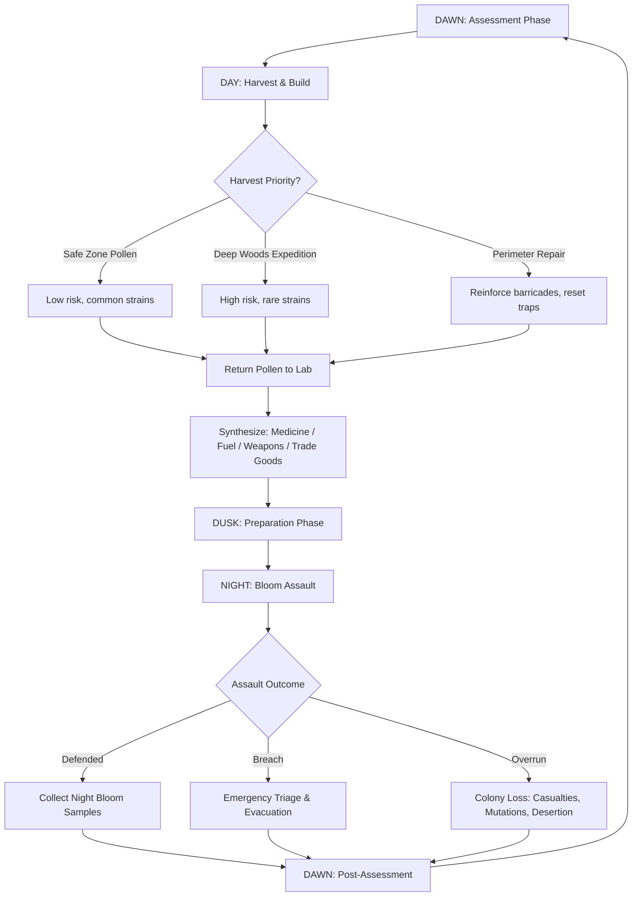
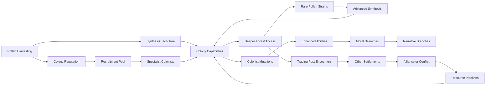

# Dread Pollen Collective

## 1. Title & Genre

| Field | Value |
|-------|-------|
| **Title** | Dread Pollen Collective |
| **Genre** | Horror Survival / Colony Management |
| **Engine** | Unreal Engine 5.4 (Nanite for dense forest geometry, Lumen for volumetric fog and bioluminescent pollen lighting) |
| **Platform** | PC (Steam), PlayStation 5, Xbox Series X/S |
| **Monetization** | Premium $34.99, free difficulty modes and challenge maps post-launch |
| **Rating** | ESRB M (Blood and Gore, Intense Violence, Horror Themes) / PEGI 18 / CERO Z |

---

## 2. Vision Statement

Dread Pollen Collective is a horror colony management game where you command a settlement of beekeepers trapped inside a primeval forest whose flowers have become sentient, parasitic, and ravenously hungry. By day, your colonists harvest dread pollen from the monstrous blooms to synthesize medicines, fuel generators, and trade with other surviving settlements. By night, the flowers uproot and hunt.

The game lives in the tension between greed and survival. Every pollen harvest thins the colony's perimeter defenses and disturbs root networks that anger the deeper blooms. Every night survived earns the resources to push further into the woods, where rarer and more dangerous strains grow. Colonists who endure multiple flower-born assaults develop mutations that grant enhanced harvesting abilities, combat resistance, and extended stamina at the cost of slowly losing their capacity for empathy, memory, and eventually their humanity.

This is a game about a community cannibalizing itself to survive an ecosystem that wants to absorb it. It is RimWorld by way of Annihilation and The Last of Us. You will grow attached to colonists whose eyes are turning the color of pollen, and you will send them into the dark anyway because someone has to bring back Sirensong Nectar before the fever takes the children.

---

## 3. Core Loop

**Target session length:** 60-120 minutes (one full day-night cycle)

### Core Loop Breakdown

| Step | Player Action | System Response | Skill Expression |
|------|--------------|----------------|-----------------|
| 1. Dawn Assessment | Review colony status: health, morale, pollen stockpiles, perimeter integrity, weather forecast | Dashboard presents overnight casualties, new mutations, equipment wear | Prioritization under information overload |
| 2. Assign Work Details | Allocate colonists to harvest teams, construction crews, lab shifts, guard posts | Colonists with high Morale accept risky assignments; low-Morale colonists may refuse | Resource management under scarcity |
| 3. Day Harvest | Direct harvest teams to bloom clusters on a tactical map; choose extraction method (quick/sloppy vs. slow/precise) | Quick harvest yields 60-80% pollen but angers local root network (+15% night aggression); precise harvest yields 100% with no aggression penalty but takes 3x longer | Risk/reward calculation per expedition |
| 4. Deep Woods Expeditions | Send scout parties into unexplored forest sectors for rare strains | Scouts encounter environmental hazards (sinkholes, spore clouds, territorial bloom colonies), discover lore fragments, and return with rare pollen or do not return at all | Risk tolerance vs. colony needs |
| 5. Synthesis | Queue pollen processing in the lab: choose output type (medicine, fuel, weapon, trade) | Processing takes 2-4 in-game hours; some combinations produce unexpected results via alchemy system | Experimentation and planning |
| 6. Dusk Prep | Position defenders, set traps, reinforce weak perimeter sections, assign night watch rotations | Colonist fatigue matters: a worker who harvested all day fights worse at night | Labor allocation across day/night balance |
| 7. Night Assault | Real-time tactical defense as flowers uproot and attack | Bloom behavior varies by species: Sirenblooms emit spore clouds, Corpse Lilies emit psychoactive pollen, Blood Orchids physically charge barricades | Real-time tactical decision-making |
| 8. Dawn Resolution | Count survivors, assess damage, harvest night-bloom samples from fallen flowers | Night-bloom samples yield the rarest synthesis materials but collecting them means leaving the perimeter before full daylight | Greed vs. safety in the aftermath |

---

## 4. Meta Loop

### Session-to-Session Progression

### Progression Axes

| Axis | What Grows | How It Feels | Cap |
|------|-----------|-------------|-----|
| **Pollen Mastery** | Number of strain types catalogued, synthesis recipes unlocked, pollen processing speed | Your lab becomes a factory of desperate innovation. Each new recipe feels like wresting a secret from a hostile world. | 47 pollen strains across 6 rarity tiers |
| **Colony Infrastructure** | Greenhouse capacity, generator output, barricade tiers, lab stations, medical bay size | The settlement transforms from a cluster of tents into a fortified research station, then into something that looks more like a flower than a building. | 5 infrastructure tiers, each with visual mutation |
| **Colonist Evolution** | Mutation stage, skill specializations, morale thresholds, bond strength with other colonists | You watch people change. Their portraits shift. Their dialogue becomes stranger. They become better at surviving and worse at being human. | 4 mutation stages per colonist (Human > Touched > Changed > Bloombound) |
| **Forest Penetration** | Map sectors explored, root network patterns understood, bloom colony territories mapped | The forest stops being a wall of horror and becomes a dark garden you can navigate, until you reach the heart and understand why it blooms. | 9 map sectors, each requiring specific tech/mutations to access |
| **Narrative Discovery** | Lore fragments collected, previous colony fates uncovered, forest origin understood | Each expedition piece reveals what happened here. The horror shifts from unknown to known, which is worse. | 3 narrative arcs with 2 endings each |
| **Player Mastery** | Night assault prediction, synthesis optimization, colonist management efficiency | Invisible but decisive. You stop losing colonists to mistakes and start losing them to deliberate sacrifice. | No cap. The forest always escalates. |

---

## 5. Game Mechanics

### Primary Mechanic: The Day-Night Pendulum

The game oscillates between two distinct phases with different gameplay:

**Day Phase (12 in-game hours, approximately 40 minutes real-time)**
- Top-down colony management with pause-and-plan controls
- Assign colonists to tasks via a work queue system
- Navigate harvest teams on a sector map using waypoints
- Manage synthesis queues in the lab
- Trade with passing caravans from other settlements
- Build, repair, and upgrade structures

**Night Phase (8 in-game hours, approximately 20 minutes real-time)**
- Real-time tactical defense with pause (Frostpunk-style)
- Direct individual colonists or squad-level commands
- Deploy pollen-based countermeasures (weaponized spores, pollen barriers, lure traps)
- Manage emergency harvest operations on actively dangerous blooms
- Triage wounded colonists under fire

### Secondary Mechanic: Dread Pollen Economy

Every flower species in the forest yields a unique pollen strain with distinct properties:

| Strain | Source Bloom | Primary Property | Synthesis Uses | Harvest Danger |
|--------|-------------|-----------------|---------------|----------------|
| **Basalm** | Common Meadow Caps (safe zone) | Mild sedative, burns clean | Basic medicine, lamp fuel, trade commodity | Low — passive spore clouds cause dizziness |
| **Sirensong** | Sirenblooms (mid-forest) | Psychoactive, mind-altering | Advanced medicine, morale boosters, psy-weaponry | Medium — audio hallucinations cause colonists to wander |
| **Goresting** | Blood Orchids (deep forest) | Coagulant, cell-regenerative | Trauma kits, mutation stabilizers, barricade hardener | High — Blood Orchids defend territory with thorn-volley attacks |
| **Blightspore** | Corpse Lilies (anywhere dead things are) | Necrotic, corrosive | Weaponized spore grenades, root-rot poison, trade (high value) | High — necrotic contact damage, airborne infection risk |
| **Nullpollen** | Ash Bramble (scorched zones) | Nullifies all pollen effects in radius | Antidotes, mutation suppressants, safe-zone fumigation | Low — the plant is nearly dead, but harvesters report "feeling nothing" afterward |
| **Heartbloom** | Queen's Garden (endgame zone) | Unknown — described in fragmentary research notes | ??? — central to multiple endgame synthesis chains | Extreme — the heart of the forest. No expedition has returned intact. |

**Synthesis System:**

The lab processes pollen through a recipe system. Recipes are discovered through experimentation (combining 2-3 strains) or recovered from lore fragments. There are 72 total recipes across 4 categories:

- **Medicine (24 recipes):** Trauma kits, fever suppressants, mutation stabilizers, antidotes, anesthetics
- **Engineering (18 recipes):** Generator fuel, barricade resin, trap mechanisms, greenhouse treatments, light sources
- **Weapons (16 recipes):** Spore grenades, pollen barriers, lure pheromones, root-rot agents, psychoactive war-fog
- **Trade Goods (14 recipes):** Refined pollen samples, preserved specimens, research documents, cured resins

### Tertiary Mechanic: Colonist Mutation System

Colonists exposed to pollen (through harvesting, night assault spore contact, or deliberate administration) accumulate a hidden Bloom Affinity score. As this score rises, the colonist progresses through mutation stages:

| Stage | Name | Affinity Range | Benefits | Costs | Visual |
|-------|------|---------------|----------|-------|--------|
| 0 | Human | 0-24 | Baseline stats | None | Normal appearance |
| 1 | Touched | 25-49 | +20% harvest speed, +10 spore resistance, can sense nearby blooms | Occasional night terrors (-5 morale/night), slight yellowing of iris | Subtle vein patterns on hands, faint pollen shimmer in eyes |
| 2 | Changed | 50-74 | +40% harvest speed, +25 spore resistance, can identify pollen strains by proximity, night vision in bloom zones | Memory fragmentation (forgets 1 random skill, replaced with bloom attunement), emotional detachment (-10 morale to bonded colonists), obsessive behavior | Skin develops petal-like patterns, eyes glow faint gold, hair produces trace pollen |
| 3 | Bloombound | 75-99 | +60% harvest speed, +50 spore resistance, can command passive blooms, harvest without tools, immune to spore damage | Severe identity erosion (colonist begins speaking in bloom-language), bonds deteriorate rapidly, cannot be assigned to non-harvest tasks, risk of permanent loss to the forest | Body partially plant-like, bioluminescent patterns, produces active pollen — other colonists gain affinity passively near them |
| 4 | The Return | 100 | Colonist walks into the forest and does not come back. Leaves behind a new bloom at the colony perimeter. That bloom yields a unique strain tied to that colonist's skills and memories. | Permanent loss of the colonist | A beautiful, terrible flower where a person used to be |

**Critical design rule:** Mutations are not upgrade trees. Players cannot target specific mutation paths. The system is governed by which pollen strains the colonist was exposed to, how often, and random variance. Players can slow mutation with Nullpollen suppressants, but cannot reverse it. Every mutation is a loss that comes with a gain.

---

## 6. World & Lore

### Setting

The Blackbriar Exclusion Zone, a 200-square-mile tract of old-growth forest in the Pacific Northwest, sealed off by the US government three years before the game begins. Official statements cite a "botanical containment event." Unofficial channels know it as the Bloom.

No one knows what triggered the Bloom. The leading theories (pieced together from recovered documents) are:

1. **The Mycorrhizal Hypothesis:** A fungal network beneath the forest achieved critical density and developed distributed sentience, hijacking the root systems of every flowering plant in the zone.
2. **The Pollen Vector Theory:** An escaped bioengineered pollen strain from a defunct agricultural research facility mutated beyond its designed parameters and propagated through the forest's existing pollinator networks.
3. **The Gaia Threshold:** The forest's ecosystem achieved emergent consciousness through sheer biological complexity. The flowers are not infected. They are awake for the first time.

The player's colony (Thornfield Station) is one of seven settlements inside the Exclusion Zone, established by scavengers, scientists, and people who had nowhere else to go. Communication between settlements is sporadic. Caravans travel between them on dangerous forest paths.

### Factions

| Faction | Location | Philosophy | Relationship to Player |
|---------|----------|-----------|----------------------|
| **Thornfield Station** (player) | Southern edge, former ranger station | Survival through adaptation and synthesis | Player-controlled |
| **The Root cell** | Deep forest, underground bunker | Worship the Bloom. Deliberate mutation as spiritual practice. Hostile to "resistance" colonies. | Antagonist / uneasy trade partner |
| **Helix Research Outpost** | Eastern perimeter, fortified lab | Scientific study of the Bloom. Ethical boundaries weakening as supplies dwindle. | Trade partner, quest giver, moral foil |
| **The Caravan** | Mobile, follows root-dormant paths | Nomadic traders who know the forest's rhythms better than anyone. Neutral to all. | Primary trade route, information source |
| **Garrison 7** | Northern wall, military remnant | Original containment force. Orders stopped coming 18 months ago. Well-armed, paranoid, dying. | Potential ally or raider, depending on player actions |
| **The Quiet** | Unknown location, communicates via pollen patterns | Believed to be a collective of Bloombound humans who retained their minds. Possibly a myth. | Endgame mystery |

### Key Locations

| Location | Sector | Description | Access Requirement |
|----------|--------|-------------|-------------------|
| **Thornfield Station** | S1 (start) | Former ranger station, 3 buildings, wooden barricades, basic lab | Starting location |
| **The Nursery** | S2 | Greenhouse complex overrun by Bloom. Rare early-game pollen source. | Basalm synthesis tier 2 |
| **Weeping Bridge** | S3 | Collapsed highway bridge over bloom-choked river. Only crossing to mid-forest. | Sirensong resistance in 2+ colonists |
| **Helix Outpost** | S4 | Concrete bunker, advanced lab equipment, surviving researchers | Trade agreement with The Caravan |
| **The Corpse Garden** | S5 | Mass grave of original containment soldiers, now a Corpse Lily field. Highest Blightspore yield in the zone. | Goresting-tier trauma kits, armed escort of 4+ |
| **The Root cell Bunker** | S6 | Underground facility, cult territory. Access to Bloom mutation research and Heartbloom fragments. | A Touched-or-higher colonist willing to infiltrate |
| **Garrison 7** | S7 | Fortified military position with heavy weapons and stockpiles. Paranoid and trigger-happy. | Reputation threshold + gift offering |
| **The Ash Fields** | S8 | Scorched zone from failed napalm containment. Nullpollen source. Dead soil, dead air. | Blightspore suppressant for the approach |
| **The Queen's Garden** | S9 | Center of the Exclusion Zone. Heartbloom territory. No human has returned with their mind intact. | All 6 strain types at synthesis tier 4 + a Bloombound volunteer |

---

## 7. Art Direction

### Visual Style

**Photorealistic horror with botanical surrealism.** The forest is rendered in hyper-dense foliage using Nanite, with every leaf, petal, and stamen individually modeled for close-up pollen harvesting. Lumen renders volumetric god rays through the canopy, bioluminescent pollen drift as particle systems, and the wet, organic sheen of Bloom-mutated flesh.

**Color palette by zone:**

| Zone | Primary | Secondary | Accent | Mood |
|------|---------|-----------|--------|------|
| Safe zones (S1-S2) | Desaturated green, brown | Fog white | Warm lantern yellow | Somber but survivable |
| Mid-forest (S3-S5) | Sickly yellow-green, bruise purple | Blood red, rust orange | Bioluminescent blue from bloom cores | Unease, wrongness |
| Deep forest (S6-S7) | Near-black green, petal pink | Ash grey, bone white | Pulsing gold from Heartbloom glow | Dread, awe |
| Ash Fields (S8) | Charcoal black, ash white | Dead brown | Occasional green shoot | Grief, emptiness |
| Queen's Garden (S9) | Overwhelming saturated color — every hue at once, too vivid, too alive | Shifting chromatic | White-gold from the Heartbloom itself | Beauty that hurts to look at |

### Character Design

Colonists are rendered with realistic human proportions and weathering. Their visual mutation progression is the primary character art axis:

- **Stage 0:** Standard survivor gear. Layered clothing, respirators, leather gloves, heavy boots. Dirt, scratches, exhaustion in the face.
- **Stage 1:** Subtle organic patterns creeping along exposed skin. Faint golden shimmer in the eyes that catches light. Slight overgrowth on clothing edges.
- **Stage 2:** Pronounced petal-texture skin on forearms and neck. Eyes fully golden. Hair contains visible pollen particles. Clothing partially integrated into skin at contact points.
- **Stage 3:** Significant body transformation. Limbs show branch-like rigidity in joints. Bioluminescent patterns pulse on chest and hands. Face retains human structure but the expression is distant, as if listening to something far away.
- **Stage 4 (The Return):** A flower. Specific to the colonist. Their last expression frozen in the bloom's center.

### Enemy Design — The Bloom

Flowers are not reskinned zombies. Each species has distinct anatomy, behavior, and attack patterns derived from real botanical biology pushed to monstrous extremes:

| Bloom Type | Real-World Analog | Monster Behavior | Visual |
|-----------|-------------------|-----------------|--------|
| **Meadow Cap** | Common meadow flower | Passive during day. At night, releases soporific spore clouds that put colonists to sleep if inhaled. Non-violent but dangerous in groups. | Oversized dandelion-like heads with human-teeth stamens |
| **Sirenbloom** | Angel's trumpet | Emits psychoactive frequency that causes hallucinations and disorientation. Colonists under effect may walk toward the bloom instead of away. Audio-based attack, blocked by Nullpollen earplugs. | Hanging trumpet flowers with pulsing, bioluminescent throats that emit visible sound waves |
| **Blood Orchid** | Corpse flower | Physically aggressive. Charges barricades with reinforced stem-body. Sprays corrosive nectar at close range. | 8-foot stem with arm-like thorn branches and a massive crimson flower head that opens like a mouth |
| **Corpse Lily** | Carrion flower | Stationary ambush predator. Emits necrotic spore cloud that rots organic material. Colonists caught in cloud take accelerating damage. Attracted to injury. | Ground-level rosette of mottled purple-black petals around a central pit. Smells like decay (screen distortion effect) |
| **Ash Bramble** | Dead thicket | Nearly inert. Produces Nullpollen passively. Does not attack but creates terrain obstacles with thorn walls. Sometimes hides other bloom types within its structure. | Grey, skeletal bramble tangles with tiny white flower remnants |
| **Queen's Heartbloom** | No analog | Endgame entity. Single organism the size of a building. All bloom activity in the zone originates from its root network. Communicates through pollen patterns. | A cathedral-scale flower whose petals form a dome. Inside: warmth, light, and the preserved consciousness of every human the Bloom has absorbed |

---

## 8. Audio & Music

### Sound Design Philosophy

**Biological horror through sound.** The forest is always audible. Silence means something is wrong. The audio design layers three channels:

1. **Ambient Forest Layer:** Wind, water, creaking wood, insect sounds. These are constant and shift based on time of day and sector. In Bloom-heavy zones, the "insect" sounds are subtly wrong — too rhythmic, too organized, like breathing.

2. **Bloom Vocalization Layer:** Each bloom species has a distinct sound signature. Meadow Caps produce a low hum that induces drowsiness (achieved through binaural beats in the 2-6 Hz range). Sirenblooms emit actual musical tones that shift pitch based on player proximity. Blood Orchids produce a wet, cracking sound like breaking bone mixed with splitting wood. Corpse Lilies produce a low-frequency rumble that vibrates the controller (if playing on console with haptics).

3. **Colony Human Layer:** Colonist voice lines, work sounds, medical bay equipment, radio chatter. As colonists mutate, their voice lines change — pitch shifts, vocabulary narrows, syntax breaks down. A Stage 3 colonist speaks in sentence fragments mixed with botanical terminology. A Stage 4 event is preceded by the colonist humming a melody that matches the Sirenbloom frequency.

### Music

**Composer direction:** Richard Krane (or equivalent) — strings-heavy, dissonant, with organic percussion built from field recordings of actual plant manipulation (roots pulled from soil, stems snapped, petals crushed).

| Game Phase | Music Style | Reference |
|-----------|-------------|-----------|
| Day — Safe zones | Sparse ambient, solo cello, occasional piano | The Last of Us — Gustavo Santaolalla |
| Day — Harvest operations | Tension build, plucked strings, breath-like woodwinds | Annihilation soundtrack — Geoff Barrow / Ben Salisbury |
| Night — Pre-assault | Near-silence with sub-bass drone and heartbeat rhythm | A24 horror soundscapes |
| Night — Active assault | Full orchestra dissonance, percussion from plant-derived samples, choir of processed human whispers | The Shining soundtrack — Wendy Carlos |
| Night — Survived | Single sustained note resolving to warm chord, then silence | "The Last of Us" end-of-episode cues |
| The Queen's Garden | Overwhelming beauty — full orchestra, major key, too perfect, like a lullaby sung by something that does not understand what lullabies are for | Original — no direct reference |

---

## 9. UI & UX

### Interface Architecture

The UI has two modes matching the day-night gameplay split:

**Day Mode — Colony Management Interface**
- **Top-down tactical camera** with zoom from wide overview (full colony visible) to close-up (individual colonist detail)
- **Bottom toolbar:** Colonist roster, build menu, synthesis queue, map, trade
- **Left sidebar:** Real-time resource counters (pollen stockpiles by strain, medicine, fuel, building materials)
- **Right sidebar:** Colonist selection detail panel (health, morale, mutation stage, assigned task, skills)
- **Top bar:** Time-of-day indicator with countdown to dusk, weather forecast, alert ticker for events

**Night Mode — Tactical Defense Interface**
- **Same camera** but restricted to perimeter zone with fog-of-war on unexplored approach vectors
- **Radial command menu** on selected colonist: Move, Defend, Harvest (emergency), Heal, Retreat
- **Perimeter health bar** segmented by wall section (color-coded: green/yellow/red/critical)
- **Bloom wave indicator** showing approximate direction and intensity of incoming assault
- **Emergency synthesis button** — spend stockpiled pollen for immediate one-use countermeasures (smoke screen, spore burst, null-zone)

### Accessibility

| Feature | Implementation |
|---------|---------------|
| **Color-blind support** | All status indicators use shape + pattern + color. Never color alone. Mutation stages indicated by icon + border style. |
| **Controller support** | Full gamepad mapping for both day and night phases. Day phase supports cursor-driven selection via thumbstick. Night phase uses radial menus. |
| **Pause-and-plan** | Day phase is pause-friendly (click to assign, unpause to execute). Night phase supports tactical pause (Frostpunk-style) for accessibility without removing tension. |
| **Text scaling** | UI text supports 3 size options. Subtitles for all voice lines with speaker identification. |
| **Audio cues** | All critical events have visual equivalents. Bloom proximity warnings via both screen-edge glow and audio signature. |
| **Difficulty presets** | Story (reduced night assault intensity, mutation slowdown), Standard, Survival (permadeath, no tactical pause), Nightmare (escalating bloom AI, scarce resources) |

---

## 10. Monetization

### Revenue Model

| Stream | Price | Contents | Timing |
|--------|-------|----------|--------|
| **Base Game** | $34.99 | Full campaign (30-50 hours), all 9 sectors, all 47 pollen strains, 3 difficulty modes | Launch |
| **Challenge Map Pack 1** | Free | 3 curated scenarios with modified rules (no-trade, mutation-accelerated, endless night) | 3 months post-launch |
| **Challenge Map Pack 2** | Free | 3 community-requested scenarios with new modifiers | 6 months post-launch |
| **The Root cell Chronicle (DLC)** | $9.99 | Play as Root cell cult. New campaign from inside the Bloom. 15-20 hours. New mutation tree (deliberate, controlled). | 9 months post-launch |
| **Original Soundtrack** | $9.99 | Full OST, 48 tracks, FLAC + MP3 | Launch |

**No microtransactions. No battle pass. No gacha. No premium currency.**

This model is deliberately chosen to align with the target audience (PC/console horror and strategy players who reject live-service models) and to build long-term goodwill. The game's horror themes and mature rating already filter for a dedicated, quality-over-quantity audience. Charging $34.99 premium with free post-launch content signals respect for that audience.

### Revenue Projections

| Scenario | Units Sold (Year 1) | Gross Revenue | Net (after platform 30%) |
|----------|--------------------|---------------|--------------------------|
| Conservative | 35,000 | $1,224,650 | $857,255 |
| Target | 80,000 | $2,799,200 | $1,959,440 |
| Breakout | 200,000 | $6,998,000 | $4,898,600 |

DLC attachment rate estimated at 22% based on comparable titles (They Are Billions, Frostpunk, RimWorld console port).

---

## 11. Technical Requirements

### Minimum Specs

| Component | Requirement |
|-----------|-------------|
| OS | Windows 10 64-bit |
| Processor | Intel i5-9400F / AMD Ryzen 5 3600 |
| Memory | 8 GB RAM |
| Graphics | NVIDIA GTX 1650 / AMD RX 570 |
| Storage | 18 GB SSD |
| DirectX | Version 12 |

### Recommended Specs

| Component | Requirement |
|-----------|-------------|
| OS | Windows 11 64-bit |
| Processor | Intel i7-10700K / AMD Ryzen 7 5800X |
| Memory | 16 GB RAM |
| Graphics | NVIDIA RTX 3060 / AMD RX 6600 XT |
| Storage | 18 GB SSD |
| DirectX | Version 12 |

### Console Performance Targets

| Platform | Resolution | Target FPS | Notes |
|----------|-----------|-----------|-------|
| PlayStation 5 | 4K dynamic (1440p base, upscaled) | 60 FPS day / 30 FPS night (heavy particle) | DualSense haptics for bloom proximity |
| Xbox Series X | 4K dynamic (1440p base, upscaled) | 60 FPS day / 30 FPS night | Standard controller support |
| Xbox Series S | 1080p | 30 FPS locked | Reduced particle density during night phase |

### Key Technical Systems

| System | Implementation | Performance Budget |
|--------|---------------|-------------------|
| **Forest rendering** | Nanite mesh streaming for foliage density (up to 10M triangles visible at recommended spec) | 4ms frame time |
| **Pollen particles** | Niagara particle system with GPU simulation. Up to 50K simultaneous particles during night assaults. | 2ms frame time |
| **Day-night cycle** | Global illumination shift via Lumen. Dynamic sky dome with volumetric clouds. | 1.5ms frame time |
| **Colonist AI** | Utility AI system with 12 need variables per colonist. Up to 30 colonists simultaneously active. | 1ms frame time (distributed across frames) |
| **Bloom AI** | Behavior tree per bloom entity. Up to 80 simultaneous bloom agents during night assault. Hierarchical LOD for distant agents. | 1.5ms frame time |
| **Mutation visuals** | Material layer blending based on mutation stage. Procedural vine/petal growth on character meshes. | 0.5ms frame time |

---

## 12. Launch Roadmap

### Phase 1: Pre-Production (Months 1-4)

| Month | Milestone | Deliverable |
|-------|-----------|-------------|
| 1 | Core team assembled (12 FTE) | Art director, lead designer, lead programmer, narrative designer, 3 environment artists, 2 gameplay programmers, 1 UI programmer, 1 audio designer |
| 2 | Vertical slice: Day phase prototype | Playable day cycle with 3 colonists, 2 pollen strains, basic synthesis, one harvest zone |
| 3 | Vertical slice: Night phase prototype | Playable night assault with 3 bloom types, barricade system, tactical commands |
| 4 | Vertical slice merge | Full day-night cycle playable loop. 30-minute session. Internal playtest readiness. |

### Phase 2: Production (Months 5-16)

| Month | Milestone | Deliverable |
|-------|-----------|-------------|
| 5-6 | Colony management systems complete | Full UI, colonist AI, work assignment, synthesis system (24 core recipes), mutation system |
| 7-8 | Sector 1-3 content complete | Thornfield Station, The Nursery, Weeping Bridge. 12 pollen strains. Tutorial integration. |
| 9-10 | Sector 4-6 content complete | Helix Outpost, Corpse Garden, Root cell Bunker. 24 additional pollen strains. Trading system. |
| 11-12 | Sector 7-9 content complete | Garrison 7, Ash Fields, Queen's Garden. All 47 strains. Narrative arcs A and B complete. |
| 13-14 | Polish and balancing | Night assault difficulty curve, mutation rate tuning, economy balance, accessibility pass |
| 15 | QA alpha | Full playthrough testing. Bug triage. Performance profiling across min/rec specs. Console dev kit testing. |
| 16 | Content complete (alpha) | All features implemented. All content in-game. Performance targets met on recommended spec. |

### Phase 3: Beta & Polish (Months 17-20)

| Month | Milestone | Deliverable |
|-------|-----------|-------------|
| 17 | Closed beta (500 testers) | Steam key distribution via Discord community. Feedback collection via structured survey + telemetry. |
| 18 | Beta feedback integration | Priority fixes from closed beta. Difficulty tuning based on completion metrics. Controller mapping finalization. |
| 19 | Open beta / demo (Steam Next Fest) | 90-minute demo covering sectors 1-2. Steam wishlists conversion target: 15% demo-to-wishlist. |
| 20 | Release candidate | Final performance pass. Console certification submission. Localization for EFIGS + Japanese. |

### Phase 4: Launch & Post-Launch (Months 21-30)

| Month | Milestone | Deliverable |
|-------|-----------|-------------|
| 21 | **Launch** | PC (Steam) + PlayStation 5 + Xbox Series X/S simultaneous release. |
| 22-23 | Hotfix support | Bug fixes based on launch telemetry. Crash fixes. Save-corruption edge cases. |
| 24 | Challenge Map Pack 1 (free) | 3 curated scenarios. Community engagement boost. |
| 25-26 | Feature updates based on community feedback | QoL improvements, new synthesis recipes, additional night assault patterns |
| 27 | Challenge Map Pack 2 (free) | 3 community-requested scenarios. Second engagement spike. |
| 28-29 | The Root cell Chronicle DLC development | New campaign, new mutation tree, new faction content |
| 30 | **The Root cell Chronicle DLC launch** ($9.99) | Revenue injection. Player retention for base game owners. |

### Team Size & Budget

| Role | Count | Phase |
|------|-------|-------|
| Game Director | 1 | All phases |
| Lead Designer | 1 | All phases |
| Systems Programmers | 2 | All phases |
| AI Programmer | 1 | Phases 2-3 |
| UI Programmer | 1 | Phases 2-3 |
| Environment Artists | 3 | Phases 2-3 |
| Character / Creature Artist | 1 | Phases 2-3 |
| VFX Artist | 1 | Phases 2-3 |
| Narrative Designer | 1 | Phases 1-3 |
| Audio Designer | 1 | All phases |
| Composer (contract) | 1 | Phase 2-3 |
| QA (contract) | 2 | Phase 3 |
| Producer | 1 | All phases |
| **Total** | **17 FTE + 3 contract** | **30-month timeline** |

**Estimated budget:** $2.8M-$3.4M (based on average US game dev salaries + overhead + tooling + console dev kits + QA outsourcing + marketing allocation of 15% gross).

---

## Target Audience Alignment

This game targets players who match the following persona profiles from the project's persona library:

**Primary personas:**

- **Eleanor Vance (P-006, The Loyal Strategist):** Colony management with deep systems and no microtransactions directly serves her demand for "challenging strategy games that reward patience and planning." The mutation system's irreversible consequences reward the kind of long-term thinking she values. She will spend her fixed monthly budget on the base game and both DLCs.
- **David Park (P-008, The Achievement Hunter):** 47 pollen strains to catalogue, 72 synthesis recipes, 6 mutation stages to observe, 9 sectors to explore, 3 narrative arcs with branching endings. The completionist structure is built into the game's DNA. He will spend 80-120 hours on a single playthrough pursuing 100%.
- **Hiroshi Tanaka (P-003, The RPG Addict):** The mutation system provides the character-building depth he craves. Each colonist's mutation path is unique, creating a build-crafting puzzle at the colony level. The environmental storytelling and lore fragments satisfy his desire to "master every system."
- **Alexei Petrov (P-017, The Community Pillar):** This is the game he recommends to his 50,000-member Discord communities. No predatory monetization, deep systems worthy of discussion, and a narrative that generates content (theories, lore videos, strategy guides). He becomes an advocate, not a customer.
