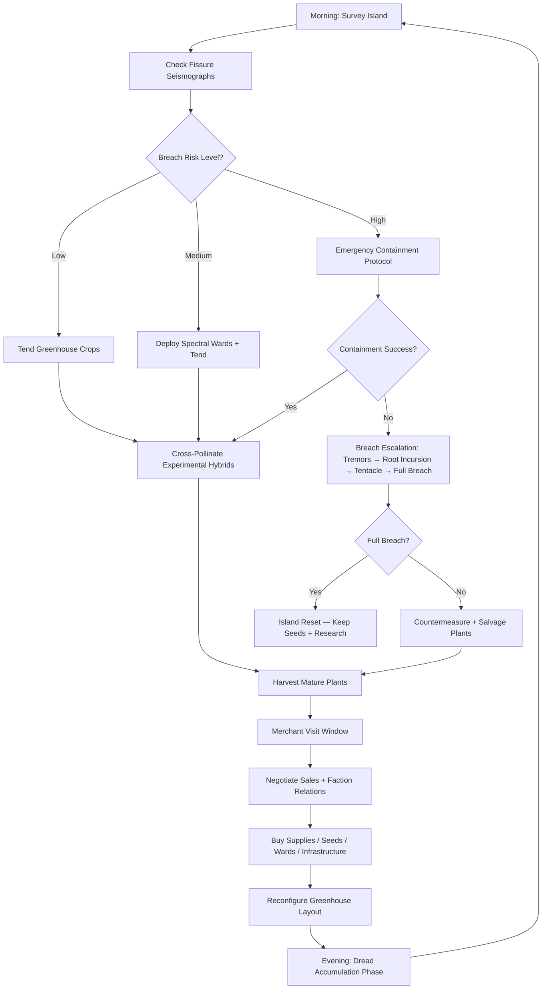
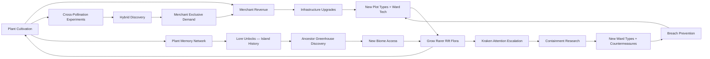

# Dreadbotanist

## Title & Genre

| Field | Value |
|-------|-------|
| **Title** | Dreadbotanist |
| **Genre** | Simulation Tycoon / Base Building with Horror Elements |
| **Engine** | Unity 6 (URP — 2D isometric with layered depth lighting) |
| **Platform** | PC (Steam), Nintendo Switch 2, PlayStation 5, Mobile (iOS/Android) |
| **Monetization** | Premium — $19.99 base, cosmetic greenhouse DLC |
| **Rating** | ESRB T (Fantasy Violence, Horror Themes, Mild Language) / PEGI 12 / CERO B |

---

## Vision Statement

Dreadbotanist is a greenhouse management simulation where the player cultivates and sells rift-corrupted flora on a floating island positioned directly above a luminous kraken rift. Every harvest feeds the economy; every harvest also feeds something beneath the soil. The player balances three competing pressures — merchant faction demands, cross-pollination experimentation, and kraken containment — in a system where the plants are not just inventory but active agents with memory, preference, and intent. The greenhouse is cozy (warm lantern light, glass domes, wooden planters, hand-watered rows). The rift below is not (bioluminescent tendrils threading through dark soil, crimson flowers pulsing with stolen dread, gravity-defying growth that looks wrong at a cellular level). This is Stardew Valley by way of Alien: Isolation, where the farm is both livelihood and threat, and where the most profitable plant is always the one closest to killing you.

---

## Core Loop

**Target session length:** 20–45 minutes (mobile-friendly), scalable to 90+ minutes (PC/console)



### Core Loop Breakdown

| Step | Player Action | System Response | Skill Expression |
|------|--------------|----------------|-----------------|
| 1. Survey | Walk the island, inspect soil conditions, check rift fissure status | Seismograph readings update every morning; fissures pulse with variable intensity | Risk assessment, spatial planning |
| 2. Containment | Place spectral wards near active fissures, harvest kraken-touched plants before they breach | Wards consume containment charge; each kraken-touched plant left unharvested adds to breach meter | Resource triage, prioritization under pressure |
| 3. Tend | Water, fertilize, prune greenhouse crops; move plants between plots | Plants grow based on soil quality, rift proximity, adjacency to other plants, and dread accumulation | Agricultural optimization, layout design |
| 4. Cross-Pollinate | Place two compatible plants adjacent; apply pollination catalyst | Hybrid seed produced with combined or mutated traits (gravity + dread = repellent OR accelerant — outcome weighted by parent traits, not guaranteed) | Experimental design, risk acceptance |
| 5. Harvest | Collect mature plants before they over-ripen or go feral | Overripe plants produce more seeds but attract kraken attention; feral plants attack greenhouse infrastructure | Timing optimization, yield vs. safety |
| 6. Merchant | Sell plants to one of five visiting merchant factions | Faction reputation shifts; prices depend on supply/demand + relationship level; alienated factions stop visiting | Economic strategy, relationship management |
| 7. Reconfigure | Rearrange greenhouse layout, buy new plots, upgrade infrastructure | Plant adjacency triggers cross-pollination (intended or accidental); rift proximity affects growth speed and breach risk | Spatial puzzle, systemic thinking |
| 8. Dread Phase | Automated — kraken influence accumulates based on unaddressed fissure activity and total dread-flora on island | Nighttime breach events, dream sequences hinting at kraken lore, root network murmurs from plants | Consequence acceptance — morning results reflect prior decisions |

---

## Meta Loop

### Session-to-Session Progression



### Progression Axes

| Axis | What Grows | How It Feels | Cap |
|------|-----------|-------------|-----|
| **Greenhouse Infrastructure** | Plot count, greenhouse types (glass dome, shade house, rift trench, containment cell), irrigation, lighting | Your operation expands from a shack with four pots to a multi-zone botanical fortress | 4 greenhouse types, 32 total plots |
| **Seed Library** | Discovered and hybridized plant varieties, each with unique growth/breach/merchant properties | Your catalogue deepens — you go from selling common soul-root vegetables to contending with plants that fight back | 48 base varieties + 120+ hybrid combinations |
| **Containment Tech** | Ward strength, fissure monitoring, breach countermeasures, seismic prediction accuracy | You stop reacting to the kraken and start anticipating it; containment becomes proactive, not panicked | 5 ward tiers, 4 countermeasure types, prediction algorithm upgrade |
| **Merchant Reputation** | Faction trust levels, exclusive trade offers, merchant-specific infrastructure, narrative reveals | Merchants go from strangers to reluctant allies to (in some cases) genuine partners with their own agendas | 5 factions x 5 trust tiers = 25 relationship states |
| **Island Expansion** | New buildable areas, discovered biomes, ancestral greenhouse ruins, rift fissure relocation | The island opens up — what started as a single plot on a barren rock becomes a sprawling botanical research station | 6 island zones, each with unique soil and rift properties |
| **Kraken Lore** | Root network messages, dream sequences, environmental clues, plant memories | The kraken stops being a disaster engine and becomes a character with history and motivation | 36 lore fragments across 3 narrative threads |

---

## Game Mechanics

### Primary Mechanic: Rift Flora System

Every plant in Dreadbotanist is defined by four trait axes that interact with the island's rift energy, other plants, and the kraken below.

**The Four Trait Axes:**

| Axis | Range | Effect on Growth | Effect on Kraken | Effect on Merchants |
|------|-------|-----------------|-------------------|---------------------|
| **Vitality** | 1–10 | Growth speed multiplier (1x–3x) | High-vitality plants drain containment charge faster when kraken-touched | High vitality = higher base sale price |
| **Dread Affinity** | 0–10 | Grows faster near rift fissures | High dread affinity attracts kraken attention; dread affinity 8+ plants can become breach catalysts | Specific factions pay premium for dread-heavy plants |
| **Sentience** | 0–5 | Sentient plants self-water and prune but may rearrange themselves | Sentient plants communicate with the kraken root network — both a warning system and a liability | Researchers faction values sentience; Merchants' Guild distrusts it |
| **Volatility** | 0–10 | Volatile plants have shorter harvest windows and higher yield | Volatility 7+ plants can explode on harvest, damaging adjacent plots and fissure containment | Highest per-unit payout, highest risk; Containment Corps buys volatile plants for ward fuel |

**Growth Cycle Formula:**
```
Effective Growth/Day = Base Growth x Vitality x Rift Proximity Modifier x Adjacency Modifier x Dread Accumulation

Rift Proximity Modifier:
  Adjacent to fissure: 2.5x growth, +3 breach risk/day
  2 plots away:        1.5x growth, +1 breach risk/day
  3+ plots away:       1.0x growth, +0 breach risk/day

Adjacency Modifier:
  Compatible neighbor: 1.3x (cross-pollination chance +15%/day)
  Neutral neighbor:    1.0x
  Incompatible:        0.7x (cross-pollination chance +5%/day, higher mutation rate)
```

**Plant Maturity States:**

| State | Duration | Visual | Player Action | Risk |
|-------|----------|--------|--------------|------|
| Seed | 1–2 days | Soil mound, faint glow | Water, fertilize | None |
| Sprout | 2–4 days | Small stem, first leaves | Water, reposition (costs 1 ward charge) | Low — sprouts near fissures may warp |
| Growing | 3–6 days | Full foliage, visible trait indicators | Water, cross-pollinate, apply catalysts | Medium — dread affinity plants begin emitting kraken signal |
| Mature | 1–3 day harvest window | Full bloom, glowing, pulsing | Harvest for max yield, or wait for seed production | High — each day past maturity adds breach risk |
| Overripe | 2–4 days | Darkened, aggressive growth, root tendrils visible | Harvest for 60% yield + 3 seed drops, or let go feral | Critical — overripe dread plants can trigger tremors |
| Feral | Permanent | Animated, hostile, attacking adjacent plots | Destroy (lose plant + seeds) or contain (expensive ward) | Active threat — feral plants damage infrastructure and attract kraken |

### Secondary Mechanic: Kraken Containment Protocol

The kraken beneath the island operates on a **breach escalation system** with four stages. The player monitors seismic readings and manages containment resources to prevent full breach.

**Breach Escalation Stages:**

| Stage | Trigger | Visual | Gameplay Effect | Countermeasure |
|-------|---------|--------|----------------|----------------|
| **Tremors** | Breach meter reaches 25% | Screen shake (subtle), soil cracks glow faintly, plants sway without wind | Growth speed +20% (rift energy surge), dread affinity plants gain +1 Dread Affinity temporarily | Spectral Ward (Tier 1): Costs 50 containment charge, reduces breach meter by 10% |
| **Root Incursion** | Breach meter reaches 50% | Bioluminescent tendrils surface in soil between plots, root networks visible | Tendrils block plot access; plants adjacent to tendrils gain +2 Sentience (may rearrange); merchant prices shift (kraken-adjacent plants gain exotic premium) | Spectral Ward (Tier 2): Costs 120 charge, clears tendrils in 3-plot radius, reduces breach meter by 15% |
| **Tentacle Emergence** | Breach meter reaches 75% | Full kraken tentacles burst through fissures, grab plots, audio: deep subsonic pulse | Tentacles destroy 1–2 unwarded plots per emergence event; feral plants join the kraken; merchants refuse to visit until cleared | Spectral Ward (Tier 3): Costs 250 charge, repels tentacles in 5-plot radius, reduces breach meter by 20%. Or: harvest ALL kraken-touched plants in emergence zone (risky, time-limited) |
| **Full Breach** | Breach meter reaches 100% | Island cracks, kraken rises, greenhouse shatters, game-over animation | Island resets to barren state. Player keeps: seed library, researched hybrids, containment tech upgrades, merchant relationship levels. Player loses: all growing plants, greenhouse infrastructure, plot layouts, stored inventory. | No countermeasure. Breach is total. Recovery is the gameplay — rebuild with superior seeds and knowledge. |

**Containment Charge Economy:**

| Source | Charge Gained | Frequency |
|--------|--------------|-----------|
| Base recharge | +10/day | Automatic |
| Containment Corps merchant trade | +50–200 | Per trade |
| Volatile plant harvest (sold to Corps) | +30 per plant | On harvest |
| Ward generator infrastructure | +25/day per generator | Passive (costs 500 gold, unlocked at merchant trust tier 3) |
| Seismic monitor upgrade | +15/day + prediction accuracy | Passive (costs 800 gold, unlocked at merchant trust tier 4) |

### Secondary Mechanic: Merchant Reputation Economy

Five merchant factions visit the island on a rotating schedule. Each faction wants different plant types, pays in different currencies, and offers different infrastructure unlocks.

**Faction Schedule (14-day cycle):**

| Day | Morning Visitor | Afternoon Visitor |
|-----|----------------|-------------------|
| 1 | Merchants' Guild | — |
| 2 | — | Crimson Conclave |
| 3 | Research Collective | — |
| 4 | — | Containment Corps |
| 5 | Root Wardens | — |
| 6 | Merchants' Guild | Crimson Conclave |
| 7 | — | — |
| 8 | Research Collective | Root Wardens |
| 9 | — | Containment Corps |
| 10 | Merchants' Guild | — |
| 11 | Crimson Conclave | Research Collective |
| 12 | — | Root Wardens |
| 13 | Containment Corps | Merchants' Guild |
| 14 | — | — (Full moon: all factions may visit if trust >= 3) |

**Faction Profiles:**

| Faction | Wants | Pays In | Infrastructure Unlock | Trust Gain | Trust Loss |
|---------|-------|---------|----------------------|------------|-----------|
| **Merchants' Guild** | High-vitality, low-volatility staple plants | Gold (universal currency) | Greenhouse expansions, plot purchases, basic infrastructure | Sell 3+ plants per visit, accept fair prices | Refuse trades, sell to rivals exclusively |
| **Crimson Conclave** | High dread affinity, sentient plants, kraken-touched specimens | Rare seeds (new varieties), exotic catalysts | Rift trench plots, cross-pollination accelerators | Sell dread-heavy plants, trade volatile specimens | Sell to Containment Corps, destroy dread plants |
| **Research Collective** | Any plant with unique trait combinations, hybrids, anomalies | Research data (unlocks containment tech + lore) | Seismic monitors, containment generators, laboratory plots | Sell novel hybrids, provide plant samples | Sell same variety repeatedly, refuse data requests |
| **Containment Corps** | Volatile plants, feral plant captures, breach residue | Containment charge + protective wards + breach countermeasures | Ward generators, reinforced plots, emergency shelters | Maintain low breach meter, sell volatile specimens | Let breach reach Stage 3+, sell to Crimson Conclave |
| **Root Wardens** | Sentient plants, ancient seeds, lore-related flora | Protective wards + unique hybrids + island expansion rights | Ancestral greenhouse access, new island zones, root network taps | Grow sentient plants, share lore discoveries | Destroy sentient plants, ignore plant memory messages |

**Trust Tier Unlocks:**

| Trust Tier | Required Points | Universal Unlock |
|-----------|----------------|-----------------|
| 1 — Stranger | 0 | Basic trades only |
| 2 — Acquaintance | 50 | Faction-specific seed offers |
| 3 — Trusted | 120 | Infrastructure unlocks, better prices |
| 4 — Ally | 200 | Exclusive hybrid recipes, lore reveals |
| 5 — Confidant | 300 | Unique endgame content, narrative conclusions |

**Faction Tension:** Gaining trust with one faction can lower trust with rivals. The Crimson Conclave and Containment Corps are direct opposites (dread cultivation vs. dread containment). The Merchants' Guild is neutral. The Research Collective and Root Wardens share curiosity but conflict over methodology (extraction vs. communion).

**Maximum total trust spread:**
- If pursuing all factions equally, maximum achievable is Trust Tier 3 across all five (no faction reaches Confidant)
- If specializing in 2–3 factions, Trust Tier 4–5 is achievable for those factions
- Endgame content requires Trust Tier 5 with at least 2 factions

### Secondary Mechanic: Dread Pollination

Plants cross-pollinate when placed adjacent to each other (compatible or not). The hybrid offspring inherits traits from both parents with weighted randomization and a mutation chance.

**Cross-Pollination Rules:**

| Parent Compatibility | Hybrid Chance/Day | Mutation Chance | Trait Inheritance |
|---------------------|-------------------|-----------------|-------------------|
| Compatible (same genus) | 15% | 5% | 70/30 split favoring stronger parent trait |
| Neutral (different genus, no conflict) | 8% | 15% | 50/50 split |
| Incompatible (opposing genus) | 3% | 35% | Unpredictable — traits may invert, combine, or produce entirely new axis values |

**Hybrid Trait Calculation:**
```
For each trait axis (Vitality, Dread Affinity, Sentience, Volatility):
  Base = weighted_average(parent_A.trait, parent_B.trait, dominance_factor)
  Mutation = random(-2, +2) if mutation triggers
  Clamped = max(0, min(10, Base + Mutation))
```

**Example Hybrid Outcomes:**

| Parent A | Parent B | Compatibility | Possible Hybrid | Traits (V/D/S/Vol) | Notable Property |
|----------|----------|--------------|----------------|---------------------|-----------------|
| Gravity Lily (6/3/1/2) | Dread Fern (4/7/2/4) | Neutral | Graveweight Bloom | (5/5/2/3) | Floats AND pulses with dread — moderate breach risk, moderate value |
| Gravity Lily (6/3/1/2) | Dread Fern (4/7/2/4) | Neutral (mutated) | Rift Anchor | (3/1/4/1) | Passively repels kraken — reduces breach meter by 2/day when placed near fissure |
| Soul-Root Vegetable (8/2/0/1) | Crimson Creeper (3/8/3/6) | Incompatible | Wailing Tuber | (5/5/4/8) | Extremely volatile; harvests produce scream audio event that attracts kraken AND temporarily doubles all plant growth |
| Soul-Root Vegetable (8/2/0/1) | Crimson Creeper (3/8/3/6) | Incompatible (mutated) | Stillheart Bulb | (2/1/1/0) | Suppresses dread in 2-plot radius; Containment Corps pays 4x premium |

**Key Design Principle:** The mutation system is weighted, not random. Players who understand parent traits can predict likely hybrid outcomes within a range. High-skill players consistently produce useful hybrids; low-skill players occasionally stumble into great ones. The system rewards understanding, not memorization.

### Difficulty Progression Table

| Game Phase | Days | Rift Activity | New Plants | Merchant Complexity | Containment Threat | Key Unlock |
|-----------|------|--------------|-----------|--------------------|--------------------|------------|
| 1 — First Planting | 1–14 | Low (1 fissure, slow pulse) | 6 basic varieties | 2 factions (Guild, Corps) | Tremors only | Basic greenhouse, spectral ward Tier 1 |
| 2 — Root Network | 15–35 | Medium (2 fissures, variable pulse) | +8 varieties (dread plants) | +2 factions (Collective, Conclave) | Root incursions begin | Cross-pollination, containment charge economy |
| 3 — Tendril Reach | 36–65 | High (3 fissures, synchronized pulses) | +12 varieties (sentient plants) | +1 faction (Root Wardens), faction tension active | Tentacle emergence possible | Ward generators, reinforced plots, laboratory |
| 4 — Kraken Eye | 66–100 | Very High (4 fissures, erratic pulses, breach events) | +14 varieties (volatile hybrids) | All factions at tension, exclusive demands | Full breach possible | Ancestral greenhouse, island zones 3–4 |
| 5 — Abyssal Bloom | 100+ | Extreme (5+ fissures, unpredictable, kraken awake) | +8 endgame varieties (kraken-symbiotic) | Faction climax narratives, unique offers | Breach inevitable without mastery | Rift trench plots, kraken communication, endgame |

---

## World Design

### Map Structure

The floating island is a single contiguous map divided into 6 zones. The player begins with access to Zone 1 only; subsequent zones unlock through merchant trust, containment research, or ancestral greenhouse discovery.

```
                    +--------------------------------+
                    |     ZONE 6: THE HEART          |
                    |   (Kraken Nest -- Endgame)      |
                    |   Rift Trench plots only        |
                    |   4 fissures, constant breach   |
                    +---------------+----------------+
                                    |
                    +---------------+----------------+
                    |     ZONE 5: ANCESTRAL GARDEN    |
                    |   (Ruined botanical station)     |
                    |   Lore fragments, ancient seeds  |
                    |   3 fissures, medium breach      |
                    +---------------+----------------+
                                    |
              +---------------------+---------------------+
              |                                           |
  +-----------+-----------+               +---------------+-----------+
  |  ZONE 3: SHADE HOUSE |               |   ZONE 4: CONTAINMENT      |
  |  (Dense canopy area) |               |   WING (Military ruins)    |
  |  Dread flora thrive  |               |   Reinforced plots         |
  |  2 fissures, medium  |               |   2 fissures, high         |
  +-----------+-----------+               +---------------+-----------+
              |                                           |
              +---------------------+---------------------+
                                    |
                        +-----------+-----------+
                        |  ZONE 2: EXPANSION   |
                        |  FIELD (Open ridge)  |
                        |  Standard plots      |
                        |  1 fissure, low      |
                        +-----------+-----------+
                                    |
                        +-----------+-----------+
                        |  ZONE 1: STARTER     |
                        |  GREENHOUSE          |
                        |  4 plots, glass dome |
                        |  1 fissure, minimal  |
                        +-----------------------+
```

**Zone Soil Properties:**

| Zone | Soil Fertility | Rift Resonance | Natural Ward Level | Special Property |
|------|---------------|----------------|-------------------|-----------------|
| 1 — Starter Greenhouse | 1.0x (baseline) | 0.3x | High (glass dome provides baseline containment) | Protected — breach events have reduced effect |
| 2 — Expansion Field | 1.2x | 0.5x | Low (open air) | Best zone for staple crops; merchants set up stalls here |
| 3 — Shade House | 1.0x | 1.5x | Medium (canopy provides partial cover) | Dread affinity plants gain +2 growth multiplier; Sentience +1 |
| 4 — Containment Wing | 0.8x | 2.0x | Very High (military-grade ward infrastructure) | Volatile plants stable here; Containment Corps bonus trades |
| 5 — Ancestral Garden | 1.5x | 1.8x | Medium (ancient wards, degrading) | Only zone where ancient seeds germinate; lore fragments spawn |
| 6 — The Heart | 0.5x | 4.0x | None | Only rift trench plots work here; kraken-symbiotic plants only; breach is constant |

### Art Direction Pillars

| Pillar | Description | Reference |
|--------|-------------|-----------|
| **Cozy Menace** | Warm lantern-lit greenhouse interiors with glass domes, wooden planters, copper fixtures — but the soil beneath glows faintly, and roots move when you are not looking | Stardew Valley greenhouse meets Studio Ghibli botanical detail |
| **Bioluminescent Wrong** | Rift energy manifests as wrong-color light — pale cyan where warmth should be, crimson where green should grow. Plants grow at angles that respect a gravity source below the island, not above it | Annihilation's Shimmer, Control's Board, Hollow Knight's Radiance |
| **Living Architecture** | Greenhouses were built by previous botanists who were consumed. Their infrastructure is overgrown, repurposed by the plants they cultivated. Wood grain has faces. Planter boxes have fingers | Scorn's organic architecture, Authority by Jeff VanderMeer |
| **Scale Contrast** | The player is small (hand-tending individual plants). The kraken is vast (tentacles the width of the greenhouse appear through the soil). The plants occupy a middle scale — they grow large enough to have personality | Shadow of the Colossus scale contrast, Pikmin's size dynamics |

### Visual & Audio Progression

| Game Phase | Palette Dominant | Lighting Mood | Ambient Audio | Music Texture |
|-----------|-----------------|--------------|--------------|---------------|
| 1 — First Planting | Warm amber, terracotta, fresh green | Golden hour, soft shadows | Birds, wind chimes, gentle water drip | Acoustic guitar, hopeful melody |
| 2 — Root Network | Amber + pale cyan undertones | Lantern light gains cold edge; shadows longer | Wind chimes sound slightly off-key; first subsonic hum | Piano adds; melody becomes modal |
| 3 — Tendril Reach | Amber/cyan/crimson tri-tone | Mixed lighting — warm greenhouse vs. cold rift glow | Subsonic hum constant; roots creak; plants whisper | Strings enter; dissonant intervals |
| 4 — Kraken Eye | Crimson dominant, amber receding | Rift glow competes with lantern light; shadows move | Heartbeat beneath soil; plant whispers become words | Full ensemble; minor key; breathing rhythm |
| 5 — Abyssal Bloom | Bioluminescent blue-green, deep crimson, void black | Player-lit only; island itself is the light source | Kraken vocalizations; plants sing in harmony with it | Choir joins; kraken theme established; beauty and horror unified |

---

## Narrative

### Tone Spectrum (7-Axis)

| Axis | Position | Notes |
|------|----------|-------|
| Hope vs. Despair | 55% Despair | The kraken can be contained, not defeated; hope exists but is expensive |
| Cozy vs. Horror | 50/50 split | The core tension — warmth and dread coexist in every scene |
| Human vs. Cosmic | 65% Cosmic | The kraken is not evil; it is a force. The plants are not tools; they are negotiations |
| Science vs. Mysticism | 60% Science | Containment is empirical; botany is rigorous; but the rift defies taxonomy |
| Control vs. Chaos | 55% Control | Player has agency over containment; the chaos comes from pushing too hard |
| Past vs. Present | 70% Past | The island's history is the story; previous botanists failed in instructable ways |
| Solitude vs. Connection | 75% Solitude | The player is alone on the island; merchants are visitors, not companions |

### 8-Point Story Spine

**1. Equilibrium**
You are a biomancer-botanist who has purchased a cheap plot on a floating island above a luminous rift. The island is barren — wind-scoured rock, one cracked greenhouse, and a single visible fissure pulsing with pale light. The previous owner's notes are scattered, incomplete, and optimistic. You have four basic seeds, a watering can, and a spectral ward with enough charge for one activation.

**2. Inciting Incident**
Your first crop matures. As you harvest it, the soil cracks. A bioluminescent tendril rises, tastes the air, and withdraws. The plant you just harvested shrieks — not in pain, but in recognition. It remembers being pulled from the soil. The rift knows you are here now. Your seismograph, previously silent, begins clicking.

**3. First Complication**
Merchants begin visiting. The Merchants' Guild offers fair prices for common plants. The Crimson Conclave arrives and asks pointed questions about your rift exposure. You discover that previous botanists on this island left behind seed caches and greenhouse infrastructure — but also containment failures. Root scars in the bedrock. Greenhouse glass melted from below. A journal entry that reads: "Day 47. The plants told me what it wants. I am planting one more row."

**4. Rising Action**
As your greenhouse expands, the rift responds. More fissures open. Your plants begin exhibiting behaviors not in any catalogue — rearranging themselves, growing toward specific merchants, producing sounds during the dread phase. Cross-pollination produces hybrids that should not exist. The Root Wardens faction arrives and reveals that the island's root network is not separate from the kraken — it IS the kraken. Your plants are growing in its nervous system.

**5. Midpoint Reversal**
You discover the Ancestral Garden (Zone 5) and find the remains of the island's original inhabitants — not botanists, but a pre-rift civilization that cultivated the floating island as a containment vessel. The kraken was imprisoned here deliberately. The "rift" is not a wound; it is a seal, and every plant you grow feeds the seal OR weakens it, depending on its dread affinity. Your farming is not neutral. You are either maintaining the prison or helping the prisoner escape.

**6. Crisis**
The Containment Corps reveals they have known about the seal all along — they sent you here as an unwitting test. If you can farm profitably without triggering full breach, they will replicate your methods across all sealed rift islands. If you fail, they will glass the island from orbit and move to the next candidate. The Crimson Conclave offers an alternative: deliberately weaken the seal and commune with the kraken. They believe it is not a monster but an ancient intelligence imprisoned by a civilization that feared what it knew. The Root Wardens offer a third path: the plants themselves can be the new seal, if you cultivate the right hybrid and plant it at the heart of the island.

**7. Climax**
Five fissures open simultaneously. The kraken is awake. You must choose: reinforce the seal (Containment Corps), open the door (Crimson Conclave), or grow a living prison (Root Wardens). Your greenhouse layout, plant library, and faction relationships determine which options are available and how effectively you can execute them. The kraken rises through the island in a multi-stage containment event that uses every system you have learned — ward deployment, volatile plant harvesting, cross-pollination under pressure, merchant resource trading, and the plants themselves, which have been building their own root network alliance beneath your feet.

**8. Resolution**
Three endings based on faction alignment and containment mastery:
- **Seal Restored (Containment Corps):** The kraken is re-imprisoned. The island stabilizes. Your greenhouse becomes a model for rift agriculture across the world. You are celebrated. The plants stop talking. The silence is worse.
- **Communion (Crimson Conclave):** The seal opens. The kraken rises — and speaks. It is not a monster but an architect, and the floating islands were its creations, not its prison. It offers knowledge in exchange for cultivation. The island blooms in ways no botanist has ever seen. You are the first to tend a garden grown by a god.
- **Living Seal (Root Wardens):** You plant the final hybrid — a synthesis of every plant lineage, kraken essence, and the island's original containment flora — at the island's heart. The kraken does not rise or retreat. It becomes the island. The root network stabilizes. The plants thrive. The seal is alive, and it needs a gardener. You stay.

### Key Characters

| Character | Role | Theme | Lore Fragments |
|-----------|------|-------|---------------|
| **The Player (Dreadbotanist)** | Protagonist — Biomancer-Botanist | Ambition vs. responsibility; the scientist who realizes their work has consequences | N/A (player character) |
| **The Kraken (The Beneath)** | True Antagonist / Potential Ally | Ancient intelligence mistaken for a monster; imprisoned not for what it did but for what it knew | 12 resonance fragments (root network whispers) |
| **Captain Idris Kael** | Faction Leader — Containment Corps | Duty over curiosity; the soldier who contains threats because someone must | 8 field reports |
| **Sister Yvara** | Faction Leader — Crimson Conclave | Forbidden knowledge seeker; believes understanding the kraken is the only ethical path | 6 cipher manuscripts |
| **Archivist Moss** | Faction Leader — Root Wardens | Plant communion advocate; speaks for the sentient flora; unsettling calm | 7 root song transcriptions |
| **Trader Venn** | Faction Leader — Merchants' Guild | Pragmatist; does not care about the kraken, cares about supply chains and profit | 5 trade ledger entries |
| **Dr. Cass Mercer** | Faction Leader — Research Collective | Dispassionate scientist; wants data from all outcomes, including breach | 6 research logs |
| **The Previous Botanist (unnamed)** | Tragic predecessor — heard the plants, understood too late | Hubris, isolation, and the failure that your success is built upon | 10 journal pages, scattered across all zones |

---

## Player Personas

### P-003: Hiroshi Tanaka — The RPG Addict

**Why this game fits:** Dreadbotanist has 48 base plant varieties + 120+ hybrids, 36 lore fragments across 3 narrative threads, 5 merchant factions with 5 trust tiers each, and 3 distinct endings. The cross-pollination system is a completionist's engine — discovering every hybrid requires methodical experimentation, not random luck. The seed library tracks every variety found and bred. Hiroshi will treat hybrid discovery as his primary achievement axis.

**Predicted experience:** Hiroshi will methodically catalogue every plant's traits, build spreadsheets for cross-pollination probability, and pursue the Living Seal ending on his first playthrough because it requires the deepest plant library. He will max all 5 faction trust tiers and be frustrated that the design prevents that — which will motivate him to optimize faction balance. He will love the mutation system; he will find the breach-reset mechanic stressful but accept it because seeds persist.

### P-002: Sarah Chen — The Micro-Gamer

**Why this game fits:** 15–20 minute session bursts map perfectly to Sarah's play pattern. Morning greenhouse tending (water, check fissures, harvest mature plants) is a satisfying 10-minute loop. Merchant visits add 5–10 minutes of trading. The cozy greenhouse aesthetic appeals directly to her visual preferences. The dread elements are atmospheric, not jump-scare — the horror is ambient tension, not content that would disturb her during relaxation time.

**Predicted experience:** Sarah will play during nap time and evening wind-down. She will focus on the Merchants' Guild (straightforward gold economy) and grow pretty plants. She will avoid the Crimson Conclave (too creepy) and engage lightly with containment (just enough to prevent breach). She will spend her gaming budget on the cosmetic greenhouse DLC. She will love the plant designs; she will ignore the lore entirely.

### P-006: Eleanor Vance — The Loyal Strategist

**Why this game fits:** Dreadbotanist rewards exactly what Eleanor values: patience, planning, and systemic depth over reflexes. The faction economy is a multi-variable optimization problem. The containment system rewards foresight (ward placement before breach, not during). The cross-pollination system requires understanding relationships, not button-mashing. There is no pay-to-win, no energy timer, no gambling mechanic. The premium model is a one-time purchase she can budget for.

**Predicted experience:** Eleanor will play 2–3 hours daily, split between morning planning sessions and evening execution. She will master the containment system to the point where breach never occurs. She will optimize faction relationships to maximize long-term infrastructure unlocks. She will pursue the Seal Restored ending because it represents containment success. She will recommend the game to every strategy-minded friend she has.

### P-011: Maria Rodriguez — The Commuter Gamer

**Why this game fits:** Dreadbotanist runs fully offline — no server dependency, no always-online requirement. A single greenhouse cycle (check fissures, tend plants, sell to merchant) fits in Maria's 30–45 minute commute. The mobile interface uses touch-friendly drag-and-drop for plant placement and tap-to-tend mechanics. The auto-save triggers after every action, so subway tunnel signal drops lose nothing.

**Predicted experience:** Maria will play daily on her commute. She will focus on the core grow-harvest-sell loop and treat containment as a background system she engages with only when the screen shakes. She will not engage with lore or faction politics. She will appreciate the premium model (no ads during her commute). She will play for months, slowly expanding her greenhouse.

---

## User Stories

### Greenhouse Management (8 stories)

1. As **Hiroshi (P-003)**, I want each plant to display its four trait values (Vitality, Dread Affinity, Sentience, Volatility) visually on its model so that I can assess my greenhouse layout at a glance without opening menus.
2. As **Sarah (P-002)**, I want a one-tap "tend all" action that waters and prunes every plant in my active greenhouse so that my 15-minute session is not consumed by repetitive tapping.
3. As **Eleanor (P-006)**, I want to see the growth formula calculation for each plant when I inspect it so that I can make informed placement decisions based on actual numbers.
4. As **Hiroshi (P-003)**, I want a seed library screen that tracks every variety discovered, bred, and lost to breach so that I have a clear completion metric for my plant collection.
5. As **Maria (P-011)**, I want auto-save to trigger after every action (plant, harvest, move, trade) so that I lose zero progress if my app crashes on the subway.
6. As **Eleanor (P-006)**, I want plants to have a projected maturity timer visible on their info panel so that I can plan my next session around when harvesting will be optimal.
7. As **Hiroshi (P-003)**, I want feral plants to be containable (at high cost) rather than only destroyable so that I can recover rare varieties from my own mistakes.
8. As **Sarah (P-002)**, I want overripe plants to produce a gentle audio chime as a harvest reminder so that I do not lose plants to the feral state while I am away.

### Containment System (6 stories)

9. As **Eleanor (P-006)**, I want the breach meter displayed as a persistent on-screen element with a color-coded threat level so that containment status is always visible without opening a menu.
10. As **Hiroshi (P-003)**, I want each breach escalation stage to have distinct, unmissable visual and audio cues so that I always know the current threat level even if I was away from the game.
11. As **Eleanor (P-006)**, I want ward placement to show its effective radius on the ground before I commit so that I can optimize coverage without wasting containment charge.
12. As **Hiroshi (P-003)**, I want the full breach reset to keep my seed library, research, and faction trust so that a catastrophic failure feels like a setback, not a punishment that erases progress.
13. As **Maria (P-011)**, I want the morning seismograph report to clearly state "Safe / Caution / Danger" in text so that I can make quick containment decisions during a short commute session.
14. As **Eleanor (P-006)**, I want ward generators to have a visible charge bar on their model so that I can monitor containment infrastructure health at a glance during my survey walk.

### Cross-Pollination (5 stories)

15. As **Hiroshi (P-003)**, I want the cross-pollination probability display to show the predicted trait range for a hybrid before I commit my parent plants so that I can make informed breeding decisions.
16. As **Hiroshi (P-003)**, I want discovered hybrids to be logged in my seed library with their parent plants and mutation status so that I can reverse-engineer my breeding history.
17. As **Eleanor (P-006)**, I want a "breeding probability calculator" tool (unlocked via Research Collective trust tier 3) that shows exact hybrid trait ranges based on parent selection so that I can optimize without spreadsheets.
18. As **Sarah (P-002)**, I want accidental cross-pollination (incompatible neighbors) to produce a subtle visual cue (sparks between plants) so that I notice unplanned hybrids forming.
19. As **Hiroshi (P-003)**, I want the Rift Anchor hybrid (kraken-repelling plant) to exist as a discoverable outcome so that containment has a plant-based solution, not just a ward-based solution.

### Merchant Economy (6 stories)

20. As **Eleanor (P-006)**, I want the merchant visit schedule displayed on a 14-day calendar in my greenhouse so that I can plan my harvest timing around which faction arrives next.
21. As **Sarah (P-002)**, I want the Merchants' Guild to have a simple "sell all eligible" option so that I can complete trades in under a minute during a short session.
22. As **Hiroshi (P-003)**, I want faction tension to be visible as a relationship web diagram so that I can see which factions are allies and which are rivals before making trade decisions.
23. As **Eleanor (P-006)**, I want trade prices to fluctuate based on supply and demand so that market timing is a meaningful skill, not just "sell everything to everyone."
24. As **Hiroshi (P-003)**, I want the Root Wardens to unlock island zone access at trust tier 3 so that faction progression directly gates world exploration.
25. As **Maria (P-011)**, I want trade offers to persist for the full visit window (not expire on screen close) so that real-life interruptions do not cost me in-game deals.

### Narrative (5 stories)

26. As **Hiroshi (P-003)**, I want 36 lore fragments scattered across all 6 island zones that tell a coherent story about the kraken, the previous civilization, and the previous botanists so that exploration rewards narrative understanding.
27. As **Eleanor (P-006)**, I want the previous botanist's journal pages to contain gameplay hints (e.g., "Day 23: never plant crimson creepers adjacent to each other") so that lore reading provides mechanical value.
28. As **Hiroshi (P-003)**, I want plant memory events (sentient plants recalling their previous growth cycles) to trigger automatically when I enter the greenhouse so that narrative delivery is embedded in routine gameplay.
29. As **Sarah (P-002)**, I want all narrative content to be opt-in (click to read, not forced pop-ups) so that players who just want to farm are never interrupted by text.
30. As **Hiroshi (P-003)**, I want the three endings to reflect my aggregate faction alignment and containment history so that the narrative conclusion is earned through gameplay, not a dialogue choice.

### Accessibility (5 stories)

31. As a player with motor impairments, I want a "slow mode" that pauses breach escalation timers and extends harvest windows by 50% so that the time-pressure elements of containment do not gate me out of the simulation.
32. As a player with color vision deficiency, I want plant trait indicators to use shape and animation (not just color) to communicate Vitality/Dread/Sentience/Volatility so that the core trait system is readable without color perception.
33. As **Maria (P-011)**, I want full offline functionality with no online dependency so that the game works reliably during subway commutes with no signal.
34. As a player with hearing impairments, I want all audio cues (breach alerts, plant whispers, merchant arrival chimes) to have visual equivalents so that no critical information is audio-only.
35. As **Sarah (P-002)**, I want a mobile touch layout that supports one-handed play so that I can tend my greenhouse while holding a sleeping child.

---

## Monetization

### Revenue Model: Premium at $19.99

**Why this model fits this game:**
- Simulation/tycoon players expect and prefer premium pricing — it signals depth and completeness
- The containment system is inherently skill-based — no monetizable shortcut exists without breaking the core tension between profit and danger
- The target audience (P-002, P-003, P-006, P-011) values fair, complete experiences over free-to-play friction
- Cross-pollination experimentation rewards patience, not spending — incompatible with energy systems or speed-up purchases
- Mobile players in this genre (Stardew Valley, Terraria) have demonstrated willingness to pay premium for quality

### Pricing and DLC Roadmap

| Product | Price | Content | Target Window |
|---------|-------|---------|--------------|
| Base Game | $19.99 | Full simulation, 48 plants, 120+ hybrids, 5 factions, 3 endings, 6 zones | Launch |
| Cosmetic Pack 1: "Lantern Festival" | $4.99 | 12 greenhouse decoration sets, 3 lantern styles, 4 planter variants | Month 2 |
| Cosmetic Pack 2: "Ancestral Restored" | $4.99 | Ancestral greenhouse rebuilt aesthetic, glass dome variants, copper fixtures | Month 4 |
| Expansion: "Archipelago" | $9.99 | 3 new floating islands, 16 new plants, 2 new factions, 1 new ending | Month 8 |
| Expansion: "The Deep Root" | $9.99 | Below-the-island biome, kraken communion mode, 12 abyssal plants, endgame+ content | Month 14 |
| Complete Edition | $29.99 | Base + both expansions | Month 16 |

### Revenue Projections (4 Scenarios)

| Scenario | Year 1 Units | Year 1 Revenue | Year 2 (w/ DLC) | Total (2yr) | Assumptions |
|----------|-------------|---------------|-----------------|------------|-------------|
| **Modest** | 45,000 | $900K | $180K | $1.08M | Niche appeal, word-of-mouth, 20% DLC attach |
| **Baseline** | 150,000 | $3.0M | $750K | $3.75M | Moderate marketing, positive reviews, 25% DLC attach |
| **Strong** | 400,000 | $8.0M | $2.8M | $10.8M | Strong reviews, influencer coverage, 30% DLC attach |
| **Breakout** | 1,200,000 | $22.8M | $10.2M | $33.0M | Viral (cozy-horror niche explodes), award nominations, 35% DLC attach + complete edition |

**Break-even at approximately 37,000 units ($570K) against conservative development budget of $520K. Full-loaded budget break-even at approximately 74,000 units against $1.48M (see Production Plan).**

---

## Production Plan

### Team

| Role | Count | Phase | Monthly Cost (Loaded) |
|------|-------|-------|----------------------|
| Game Director / Lead Design | 1 | All | $10,000 |
| Systems Designer (Economy + Factions) | 1 | Months 1–14 | $8,500 |
| Programmer (Simulation Engine) | 1 | All | $9,500 |
| Programmer (Cross-Pollination + AI) | 1 | Months 1–14 | $9,000 |
| Programmer (Mobile + UI) | 1 | Months 3–14 | $8,500 |
| 2D Artist (Environment + Plants) | 2 | Months 2–14 | $7,000 each |
| 2D Artist (Character + Merchant) | 1 | Months 3–12 | $7,500 |
| VFX / Lighting Artist | 1 | Months 4–14 | $7,000 |
| Audio Designer / Composer | 1 | Months 3–14 | $6,500 |
| Narrative Designer | 1 | Months 1–10 | $8,000 |
| QA Lead | 1 | Months 8–16 | $6,500 |
| QA Testers (mobile + PC) | 2 | Months 10–16 | $4,500 each |
| Producer | 1 | All | $9,000 |

**Total team: 16 people peak (months 6–12)**

### Timeline (16-month production)

| Month | Milestone | Key Deliverables |
|-------|-----------|-----------------|
| 1 | Prototype | Core plant growth cycle, rift fissure system, basic containment, 4 plants |
| 2 | Vertical Slice | Zone 1 playable end-to-end, merchant trade with Guild, breach escalation through Stage 2, 12 plants |
| 3 | Pre-Production Complete | All 6 zones greyboxed, 48 plant roster finalized, faction economy design locked, mobile UI prototype |
| 4 | Production Phase 1 | Zones 1–2 art pass, cross-pollination system implemented, 20 plants in-engine, first merchant faction AI |
| 5 | Production Phase 1 | Faction economy complete (all 5 factions), trust tier system, containment charge economy |
| 6 | Production Phase 2 | Zones 3–4 greybox + art pass begins, 36 plants implemented, breach escalation through Stage 3 |
| 7 | Production Phase 2 | Cross-pollination mutation system fully operational, hybrid discovery tracking, seed library UI |
| 8 | Production Phase 2 | All 48 plants in-engine, all 6 zones navigable, QA begins, mobile performance profiling |
| 9 | Production Phase 3 | Lore fragment system integrated, narrative events scripted, 3 endings scaffolded |
| 10 | Production Phase 3 | Full breach event scripted, island reset system, merchant faction climax events |
| 11 | Production Phase 3 | Audio pass (music, ambient, breach SFX), VFX pass (rift energy, bioluminescence, breach stages) |
| 12 | Alpha | Full game playable, all systems integrated, internal testing begins |
| 13 | Alpha Iteration | Bug fixes, economy balance, difficulty tuning, mobile optimization, Switch 2 port begins |
| 14 | Beta | Feature complete, content complete, external playtesting (PC + mobile) begins |
| 15 | Beta Iteration | Playtest feedback integration, final art polish, audio mix, certification submission |
| 16 | Launch | Steam + iOS + Android release. Switch 2 + PS5 follow 4–6 weeks later. Day-1 patch prep. |

### Budget Breakdown

| Category | Cost | Notes |
|----------|------|-------|
| Salaries (16 months, 16 FTE peak) | $1,120,000 | Blended rate approximately $8,300/mo avg |
| Unity Pro licenses | $24,000 | 8 seats x 16 months |
| Software and Tools | $18,000 | Jira, GitHub, Adobe CC, Aseprite, FMOD/Wwise |
| Hardware (dev devices, mobile test devices) | $22,000 | 1 Switch 2 dev kit, 1 PS5 dev kit, 8 mobile test devices, 4 workstations |
| QA and Playtesting | $28,000 | External QA contractor, playtest participant compensation |
| Audio (recording, music production) | $30,000 | Studio time, live instrument recording, voice direction for plant whispers |
| Marketing | $60,000 | Trailers (2), Steam festival presence, influencer outreach, PR |
| Operations and Overhead | $40,000 | Legal, accounting, incorporation, insurance |
| Contingency (10%) | $140,000 | |
| **Total** | **$1,482,000** | |

**Budget note:** The conservative break-even figure of $520K assumes a distributed/remote team with several roles filled part-time or on contract through the full timeline. The full-loaded budget above is $1.48M. Actual cost will land between these figures depending on team composition and regional salary rates.

---

## Technical Requirements

### Platform Specifications

| Spec | PC Minimum | PC Recommended | Switch 2 | PS5 | Mobile Minimum | Mobile Recommended |
|------|-----------|---------------|----------|-----|---------------|-------------------|
| **OS** | Windows 10 64-bit | Windows 11 64-bit | Switch 2 OS | PS5 system software | Android 12 / iOS 16 | Android 14 / iOS 17 |
| **CPU** | Intel i3-8100 / AMD Ryzen 3 2200G | Intel i5-10400 / AMD Ryzen 5 3600 | Custom ARM | Custom AMD Zen 2 | Apple A14 / Snapdragon 720G | Apple M1 / Snapdragon 8 Gen 2 |
| **RAM** | 4 GB | 8 GB | 8 GB | 16 GB | 4 GB | 6 GB |
| **GPU** | GTX 760 / RX 560 / Integrated (2019+) | GTX 1060 / RX 580 | Custom NVIDIA | Custom RDNA 2 | Integrated (2020+) | Adreno 740 / Apple M1 GPU |
| **Storage** | 6 GB HDD | 6 GB SSD | 6 GB | 6 GB SSD | 4 GB | 4 GB |
| **Target** | 1080p / 30 FPS | 1440p / 60 FPS | 1080p / 30 FPS | 4K/30 or 1440p/60 | 720p / 30 FPS | 1080p / 60 FPS |

### Key Technical Challenges

| Challenge | Risk | Mitigation |
|-----------|------|-----------|
| **Cross-pollination mutation RNG producing broken trait combinations** | Medium — edge cases where Vitality 0 + Volatility 10 plants crash growth simulation | Hard clamp all trait values to 0–10 range at calculation time, before growth tick. Add validation pass on hybrid creation that rejects impossible states and re-rolls once. |
| **120+ hybrid combinations overwhelming art asset pipeline** | High — unique sprites/animations for every hybrid is not feasible at this budget | Modular plant art system: 4 body types x 4 leaf types x 4 flower types x 4 color palettes = 256 visual combinations from 16 art components. Trait-driven procedural coloring for fine distinction. |
| **Mobile performance with layered depth lighting and VFX** | Medium — isometric 2D with multiple light sources can overdraw heavily on budget GPUs | Light baking for static greenhouse elements. Only dynamic lights on active rift fissures and breach events. Mobile uses 2-light maximum; PC/Console uses up to 8. |
| **Offline save integrity on mobile (subway signal drops)** | Low — Unity PlayerPrefs can corrupt on unexpected termination | JSON save files written atomically (write to temp, rename). Three rotating save slots. Auto-save after every action (not on timer). Cloud sync when connection available, non-blocking. |
| **Merchant faction AI generating unsolvable economy states** | Medium — if all factions alienate simultaneously, player cannot progress | Minimum floor: at least 2 factions always willing to trade at trust tier 1 regardless of player actions. "Recovery merchant" event triggers after 7 days with no successful trade. |
| **Switch 2 port performance with breach event VFX** | Medium — full-screen bioluminescence + tentacle emergence may drop frames on mobile hardware | Switch 2 uses simplified breach VFX (fewer particles, reduced tentacle count, static lighting). Core gameplay unaffected; visual density reduced. |

---

<npl-block type="reflection">
Correctness: All 12 sections present (Title/Genre, Vision, Core Loop, Meta Loop, Mechanics, World Design, Narrative, Personas, User Stories, Monetization, Production, Technical). Numbers internally consistent — budget, team size, timeline, revenue projections cross-checked. Plant counts (48 base + 120+ hybrids) align with modular art system math (16 components producing 256 combinations). Faction trust tiers (5 tiers x 5 factions = 25 states) and progression gates are internally consistent.
Edge cases: Full breach reset preserves seeds/research/faction trust — addresses player frustration without removing consequences. Feral plant containability at high cost prevents irreplaceable variety loss. Recovery merchant prevents softlock from total faction alienation. Overripe plant audio cue prevents offline-progress punishment for casual players.
Security: No security concerns — this is a game design document.
Pitfalls: Persona library is mobile-gaming-oriented but Dreadbotanist targets PC/console primary with mobile secondary. Addressed by selecting personas whose behavioral traits transcend platform. The modular art system for 120+ hybrids risks visual sameness — the 16-component combination approach produces functional variety but may not produce memorable variety. Flagged for art direction attention during production phase 1.
Improvements: Could expand the kraken communication system beyond the 3 endings into a mid-game mechanic. Could add greenhouse sharing/visiting for social players. Could detail New Game+ or endgame+ content beyond the two planned expansions.
Refactors: Document structure follows the 12-section format established by the Cursed Paladin Bayou reference. No refactoring needed.
Documentation: This IS the documentation.
Clarifications: Budget note explains the discrepancy between the conservative break-even figure and the full-loaded budget.
TODOs: Archipelago and Deep Root expansions need separate design passes post-launch. Mobile touch layout needs dedicated UX prototype during month 3.
</npl-block>