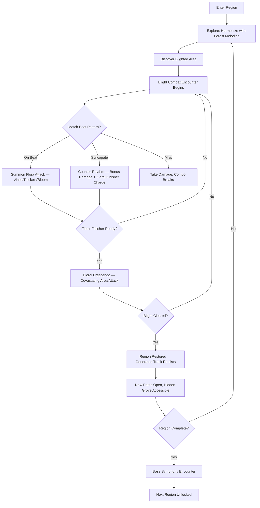
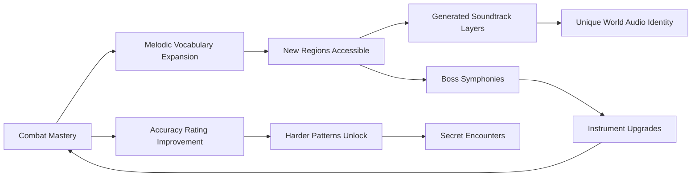

# Dryad's Monsoon Requiem

## Title & Genre

| Field | Value |
|-------|-------|
| **Title** | Dryad's Monsoon Requiem |
| **Genre** | Rhythm / Action Adventure |
| **Engine** | Unity 6 (URP) — custom audio-reactive shader pipeline, strong multi-platform audio latency control |
| **Platform** | PC (Steam), PlayStation 5, Nintendo Switch |
| **Monetization** | Premium $24.99 base, cosmetic instrument skins ($2.99-$4.99), soundtrack expansion packs ($7.99) |
| **Rating** | ESRB E10+ (Fantasy Violence) / PEGI 7 / CERO A |

---

## Vision Statement

Dryad's Monsoon Requiem is a rhythm-action adventure where you play as Sylvari, a dryad bard whose songs reshape the living rainforest around her. Every combat encounter is a musical performance — enemy attacks arrive on rhythmic patterns, and your counters must match or syncopate the beat to summon vines, bloom defensive thickets, and unleash devastating floral crescendos against the blight creatures corrupting the canopy. Exploration segments have you harmonizing with the forest's ambient melodies to grow bridges, reveal hidden groves, and awaken ancient tree spirits. The entire soundtrack is generated from your gameplay — your timing accuracy, your note choices, your syncopation patterns — creating a unique musical composition each session that becomes the permanent background music for each region. This is a game where every player's world sounds different, where combat IS music, and where the line between fighting and composing disappears entirely.

---

## Core Loop

**Target session length:** 30-60 minutes



### Core Loop Breakdown

| Step | Player Action | System Response | Skill Expression |
|------|--------------|----------------|-----------------|
| 1. Explore | Move through rainforest, tap inputs to harmonize with ambient melodies | Forest responds visually — vines grow, flowers bloom, paths illuminate with musical resonance | Timing, pitch recognition (no penalty for silence, rewards for participation) |
| 2. Encounter | Blight creatures emerge; combat rhythm begins | Beat indicator appears on screen (circular visual metronome around Sylvari); enemies telegraph attacks on the beat | Reading enemy patterns, recognizing rhythmic structure |
| 3. Match | Press attack on the beat (visual/audible cue) | Sylvari summons flora attack — vines lash, thorns burst, petals slash. Damage scales with timing accuracy: Perfect (100ms window) = 3x, Good (200ms) = 2x, OK (300ms) = 1x | Rhythmic precision |
| 4. Syncopate | Press attack off-beat intentionally (on the "and" between beats) | Counter-rhythm triggers — bonus 1.5x damage multiplier + charges Floral Finisher gauge faster. Risky: syncopation window is only 150ms wide | Advanced rhythmic mastery, musical intuition |
| 5. Floral Finisher | Activate when gauge full (8 successful syncopations or 16 on-beat hits) | Devastating area attack — cascading waves of foliage synchronized to a musical crescendo. Camera zooms out. Every enemy in range takes massive damage. Generates a unique melodic phrase added to the region's persistent track | Resource management, tactical timing |
| 6. Explore (post-combat) | Harmonize with newly restored forest melodies | Restored areas produce richer ambient music; new harmonic layers unlock. Player's generated combat track layers into the exploration music | Musical exploration, curiosity |
| 7. Boss Symphony | Multi-phase boss fight where each phase introduces a new time signature and melody | Must adapt rhythm to changing meters (4/4 to 3/4 to 7/8 to composite). Final phase requires mastery of all previous patterns simultaneously | Adaptive rhythmic skill, pattern memory |

---

## Meta Loop

### Session-to-Session Progression



### Progression Axes

| Axis | What Grows | How It Feels | Cap |
|------|-----------|-------------|-----|
| **Rhythmic Skill** | Timing accuracy, syncopation mastery, multi-meter adaptability | Your fingers become instruments; every fight is a performance | No cap — mastery is perpetual, measured by accuracy percentage |
| **Melodic Vocabulary** | Combat phrases learned, harmonic options in exploration | You are not just hitting buttons — you are composing | 120 combat phrases across 5 melodic families |
| **Instrument Power** | Weapon (instrument) upgrades that expand timing windows, add harmonic layers, increase syncopation bonus | Your instrument becomes an extension of your rhythm sense | 12 instruments across 4 tiers |
| **World Restoration** | Regions cleansed of blight, tree spirits awakened, canopy healed | The rainforest transforms because of your music | 7 regions, 28 groves, 14 tree spirits |
| **Generated Soundtrack** | Your unique performance data creates the permanent regional music | Every player's world sounds different; no two soundtracks identical | Unlimited — procedural generation ensures uniqueness |

---

## Game Mechanics

### Primary Mechanic: Biobeat Combat

Combat is a real-time rhythm system where every input is a musical note. The system runs on a **dual-layer timing model**:

**Layer 1 — The Beat Grid**
- A persistent visual metronome (circular ring around Sylvari) pulses at the encounter's BPM
- Enemy attacks telegraph on the beat — their animations wind up on the beat and land on the next beat
- Player attacks landing on the beat deal base damage multiplied by accuracy

**Layer 2 — Syncopation Grid**
- Off-beat "and" positions between primary beats
- Syncopated inputs deal 1.5x damage and charge Floral Finisher gauge faster
- Syncopation window is 150ms (tighter than on-beat window of 300ms)
- Risk/reward: miss a syncopation and your combo breaks entirely

**Timing Windows (at 120 BPM base):**

| Rating | On-Beat Window | Syncopation Window | Damage Multiplier | Gauge Charge |
|--------|---------------|-------------------|-------------------|-------------|
| Perfect | +/- 50ms | +/- 40ms | 3.0x | 2 charges |
| Great | +/- 100ms | +/- 75ms | 2.0x | 1.5 charges |
| Good | +/- 200ms | N/A | 1.0x | 1 charge |
| Miss | > 200ms off | > 75ms off | 0x (combo breaks) | 0 charges |

**Combo System:**
- Consecutive successful inputs (Good or better) build a combo multiplier
- Combo multiplier: 1-4 hits = 1x, 5-9 = 1.5x, 10-19 = 2x, 20-29 = 2.5x, 30+ = 3x
- Combo multiplier applies to all damage within the encounter
- Combo breaks on any Miss — reset to 1x

**Floral Finisher:**
- Charges from successful inputs: On-beat Good = 1 charge, Great = 1.5, Perfect = 2; Syncopated = double the above
- Requires 16 charges to activate (approximately 20-30 seconds of sustained combat)
- On activation: 3-second cinematic zoom-out, Sylvari plays a sweeping melodic phrase
- All enemies in a 12-meter radius take damage equal to 5x base weapon damage x combo multiplier at time of activation
- The melodic phrase is procedurally generated from the player's input pattern during the encounter and permanently added to the region's soundtrack

### Secondary Mechanic: Canopy Composition

Every player action generates musical data. The Canopy Composition system records:
- Timing accuracy (quantized to grid positions)
- Note selection (attack type = pitch family)
- Syncopation patterns (rhythmic complexity)
- Combo length (phrase duration)

**Composition Layers:**

| Layer | Source | Contribution to Soundtrack |
|-------|--------|---------------------------|
| **Percussion** | Basic attack timing | Rhythmic foundation — your on-beat hits become the drum pattern |
| **Melody** | Syncopation patterns | Counter-melody woven against the region's ambient theme |
| **Harmony** | Exploration harmonization inputs | Chord pad layer derived from your pitch choices |
| **Crescendo** | Floral Finisher activations | Orchestral swell — the most dramatic layer, unique per player |
| **Ambient texture** | Idle behavior (standing still, moving through water) | Subtle environmental sounds (rain, wind, birdsong) influenced by your total restoration percentage |

**Persistence**: After clearing a region's blight, the generated track becomes the permanent background music for that region. Returning to a restored region plays YOUR composition. Other players never hear it — it is yours.

**Sharing**: Optional "Song Shrine" feature allows exporting your generated track as a shareable audio file or listening to other players' compositions via a curated in-game gallery.

### Secondary Mechanic: Blight Boss Symphonies

Boss encounters are multi-phase rhythm challenges where each phase introduces a new time signature and melodic pattern.

**Boss Design Template:**

| Phase | Meter Change | Tempo Shift | Mechanic Introduction | Duration |
|-------|-------------|-------------|----------------------|----------|
| Phase 1 | 4/4 (standard) | Base BPM | Core combat — learn the boss's basic rhythmic pattern | 25% HP |
| Phase 2 | 3/4 (waltz) | +10-15 BPM | Boss introduces triplets; player must adapt to waltz timing | 25% HP |
| Phase 3 | 6/8 or 7/8 (compound/irregular) | +5-10 BPM | Irregular meter; some attacks land on unusual beats | 25% HP |
| Phase 4 | Composite | Variable | All previous patterns cycle; player must switch between meters rapidly | 25% HP |

**Phase transitions**: Each phase shift is telegraphed by a 2-bar musical transition (3-4 seconds). The boss visual transforms (new blight form). The beat grid visual changes to reflect the new meter.

**Boss Roster (7 bosses across 7 regions):**

| Boss | Region | Phase 1 | Phase 2 | Phase 3 | Phase 4 | Unique Mechanic |
|------|--------|---------|---------|---------|---------|----------------|
| **Rotweaver** | Tangled Roots | 4/4, 100 BPM | 3/4, 110 BPM | 6/8, 120 BPM | Composite 130 BPM | Web patterns restrict movement; must rhythm-hit to break free |
| **Fungal Sovereign** | Spore Canopy | 4/4, 90 BPM | 5/4, 100 BPM | 7/8, 110 BPM | Composite 120 BPM | Spore clouds obscure beat grid; must play by ear alone |
| **Blight Choir** | Echoing Hollows | 4/4, 120 BPM | 3/4, 130 BPM | 4/4 (polyrhythm), 140 BPM | Composite 150 BPM | Three blight singers harmonize; must counter each voice individually |
| **Moss Colossus** | Moss Terraces | 4/4, 80 BPM | 3/4, 90 BPM | 6/8, 100 BPM | Composite 110 BPM | Slow but devastating; timing windows are wide but misses are catastrophic |
| **Withered Dryad** | Petrified Falls | 4/4, 110 BPM | 7/8, 120 BPM | 5/4, 130 BPM | Composite 140 BPM | Mirror fight — enemy uses the same rhythm mechanics against you |
| **Canopy Leviathan** | Upper Canopy | 4/4, 130 BPM | 3/4, 140 BPM | Composite, 150 BPM | All meters rapid-fire | Platforming + rhythm; must jump between branches while maintaining beat |
| **Heart of Blight** | Great Heartwood | 4/4, 100 BPM | 3/4, 110 BPM | 7/8, 120 BPM | Full orchestral, 140 BPM | All 14 tree spirit melodies must be played in sequence during Phase 4 |

### Difficulty Progression Table

| Chapter | BPM Range | New Meter Introduced | Enemy Density | Syncopation Demand | Boss Phases | Timing Window (ms) |
|---------|-----------|---------------------|--------------|-------------------|-------------|-------------------|
| 1 — Tangled Roots | 80-100 | 4/4 only | 2-3 per encounter | Optional | 2 | 300 |
| 2 — Spore Canopy | 90-110 | +3/4 | 3-4 | Encouraged | 3 | 250 |
| 3 — Echoing Hollows | 100-120 | +6/8 | 4-5 | Required for optimal | 3 | 200 |
| 4 — Moss Terraces | 80-100 (slow) | +5/4 | 3-4 (heavy hitters) | Punishing misses | 3 | 200 |
| 5 — Petrified Falls | 110-130 | +7/8 | 4-5 | Required throughout | 3 | 150 |
| 6 — Upper Canopy | 120-140 | Composite meters | 5-6 | Continuous | 3 | 150 |
| 7 — Great Heartwood | 100-140 (all meters) | Full composite | 6-8 | Mastery expected | 4 | 100 |

---

## World Design

### Map Structure

Interconnected vertical rainforest. Exploration is layered — the canopy is the top, the forest floor is the bottom, and the root network runs beneath everything.

```
                         ┌──────────────────────┐
                         │   UPPER CANOPY        │
                         │   (Chapter 6)          │
                         │   Sky bridges,         │
                         │   canopy walkways      │
                         └──────────┬─────────────┘
                                    │
              ┌─────────────────────┴─────────────────────┐
              │                                           │
    ┌─────────┴──────────┐                    ┌───────────┴─────────┐
    │  PETRIFIED FALLS   │                    │   MOSS TERRACES     │
    │  (Chapter 5)       │                    │   (Chapter 4)       │
    │  Waterfalls,       │                    │   Terraced gardens, │
    │  frozen cascades   │                    │   ancient stonework │
    └─────────┬──────────┘                    └───────────┬─────────┘
              │                                           │
              └─────────────────────┬─────────────────────┘
                                    │
                         ┌──────────┴─────────────┐
                         │   ECHOING HOLLOWS       │
                         │   (Chapter 3)           │
                         │   Cave systems,         │
                         │   crystal chambers      │
                         └──────────┬──────────────┘
                                    │
              ┌─────────────────────┴─────────────────────┐
              │                                           │
    ┌─────────┴──────────┐                    ┌───────────┴─────────┐
    │  SPORE CANOPY      │                    │   TANGLED ROOTS      │
    │  (Chapter 2)       │                    │   (Chapter 1)        │
    │  Fungal shelves,   │                    │   Starting area,     │
    │  mushroom forests  │                    │   root pathways      │
    └────────────────────┘                    └──────────┬──────────┘
                                                          │
                                               ┌──────────┴──────────┐
                                               │  GREAT HEARTWOOD     │
                                               │  (Chapter 7)         │
                                               │  The Great Tree,     │
                                               │  heart of the forest │
                                               └─────────────────────┘
```

**Traversal**: Sylvari climbs vines, leaps between branches, and rides monsoon wind currents. All movement has rhythmic assist — holding a direction on the beat makes traversal faster and more fluid. Off-beat movement works but is slower.

**Harmonization Gates**: Locked areas require playing a specific melodic pattern to grow a bridge, bloom a door, or awaken a path guardian. These patterns are learned from tree spirits and environmental observation.

### Art Direction Pillars

| Pillar | Description | Reference |
|--------|-------------|-----------|
| **Living Music** | The forest visibly responds to rhythm — leaves pulse, flowers bloom on beat, water ripples in time | Ori and the Blind Forest's spirit well scenes, Fantasia's visual music |
| **Corruption as Silence** | Blighted areas are visually muted — desaturated, still, silent. Restoration returns color and sound | Hollow Knight's infected crossroads vs cleansed crossroads |
| **Bioluminescent Symphony** | Restored areas glow with layered bioluminescence — teal, amber, violet — each color representing a melodic layer | Avatar's bioluminescent forest, ABZU's color language |
| **Vertical Wonder** | The rainforest is cathedral-tall. Looking up inspires awe. Looking down reveals depth | Celeste's vertical spaces, Fe's forest scale |

### Visual and Audio Progression

| Chapter | Palette (Blighted) | Palette (Restored) | Ambient Audio | Combat Music |
|---------|-------------------|-------------------|--------------|-------------|
| 1 — Tangled Roots | Gray-brown, withered vines, cracked bark | Warm amber, fresh green, golden sap flow | Sparse wind, creaking wood | Solo lute — simple 4/4 folk melody |
| 2 — Spore Canopy | Sickly green-purple, choking spore clouds | Teal bioluminescence, clear spore-free air | Mushroom puffs, dripping condensation | Lute + hand drums — 3/4 waltz |
| 3 — Echoing Hollows | Black crystal, echo-distorted sounds | Prismatic crystal refraction, resonant harmony | Crystal resonance, water drops echoing | Lute + drums + flute — 6/8 compound |
| 4 — Moss Terraces | Petrified gray-green, stone-cold | Rich emerald, warm moss, flowering terraces | Moss compression footsteps, distant birds | Full ensemble enters — low tempo, weight |
| 5 — Petrified Falls | Frozen white-blue, no water movement | Rushing turquoise, mist, rainbow refraction | Rushing water, wind through falls | Lute + ensemble + vocals — irregular meters |
| 6 — Upper Canopy | Ash-gray sky, brittle branches | Sun-drenched emerald, open sky, wind song | Wind, raptor calls, rustling leaves | Full orchestra — high tempo, aerial |
| 7 — Great Heartwood | All corruption types merged | Unified golden-green, pulsing with life | All ambient layers unified | Full orchestra + choir — all meters |

---

## Narrative

### Tone Spectrum

```
HOPEFUL    ●●●●●●○○ GRIM
SERIOUS    ●●●●○○○○ WHIMSICAL
SIMPLE     ●●●●○○○○ COMPLEX
GROUNDED   ●●○○○○○○ FANTASTICAL
STATIC     ●●●●●●○○ DYNAMIC
QUIET      ●●●○○○○○ MUSICAL
```

Wonder-drenched earnestness. The world is beautiful and wounded; your purpose is to heal it through art. Sadness exists (the blight is a loss), but the dominant emotion is hope through creativity.

### 8-Point Story Spine

**1. Equilibrium**
Sylvari is the last dryad bard of the Monsoon Rainforest — a vast living cathedral of trees, rivers, and song. She tends the Great Heartwood, the primordial tree at the forest's center, singing to its roots each dawn. The forest hums with layered melodies from 14 tree spirits, each guarding a region. Life is cyclical, peaceful, musical.

**2. Inciting Incident**
A silence falls. The Monsoon — the seasonal rain that sustains the forest — arrives not as nourishing rain but as the Blight: a corrosive, soundless fog that drains color, kills melody, and petrifies living wood. The Great Heartwood shudders. Fourteen tree spirits fall silent, their regions consumed. Sylvari's song is the only sound left.

**3. First Complication**
Sylvari ventures into the Tangled Roots and discovers the Blight is not random decay — it is directed. Something is consuming melody itself. Blight creatures are corrupted forest guardians, twisted into rhythmless violence. The first tree spirit, Rootmother, whispers a fragment of truth: the Blight comes from within the Great Heartwood itself.

**4. Rising Action**
Sylvari restores three regions, awakening three tree spirits. Each spirit reveals a piece of history: the Monsoon Rainforest was once a dead place, and the Great Heartwood sang it into existence over millennia. The 14 tree spirits are the Heartwood's children — each a different melody in the forest's composition. The Blight is not an invasion; it is the Heartwood forgetting its own song.

**5. Midpoint Reversal**
At the Petrified Falls, Sylvari meets the Withered Dryad — a former dryad bard who tried to stop the Blight alone decades ago and was consumed by it. The Withered Dryad reveals the Blight's source: deep within the Heartwood, a silence engine — an ancient artifact buried in the roots before the forest even existed — is activated. Someone or something is using it to erase the Heartwood's song, and every tree spirit Sylvari restores only delays the inevitable.

**6. Crisis**
Sylvari must choose: continue restoring tree spirits one by one (slowing the Blight but not stopping it) or venture into the Great Heartwood now, unprepared, to confront the silence engine directly. The tree spirits plead for restoration; the Withered Dryad urges confrontation.

**7. Climax**
Sylvari descends into the Heartwood's roots and finds the silence engine: an ancient void-construct that predates the forest. It is not evil — it is a tool, abandoned by its creators, accidentally activated by the Heartwood's roots growing too deep. The Heart of Blight is the engine's guardian, a massive void entity that interprets the forest's song as "interference" to be silenced. A 4-phase boss symphony where Sylvari must play all 14 tree spirit melodies in sequence to override the engine's silence.

**8. Resolution**
Three endings based on melody mastery and tree spirits awakened:
- **Lullaby**: Sylvari puts the engine to sleep with a slow, gentle melody. The Blight recedes. The forest heals over time. The engine remains dormant — for now. Bittersweet but hopeful.
- **Requiem**: Sylvari destroys the silence engine. The Blight vanishes instantly, but the Heartwood loses its oldest roots. Some regions transform permanently. The forest is saved but changed. Earnest and transformative.
- **Symphony**: Sylvari reprograms the engine by teaching it to sing. The void-construct becomes the 15th voice in the forest's composition. The rainforest is restored and expanded — silence itself becomes music. Requires all 14 tree spirits awakened + 95%+ accuracy on the final boss + no combat misses in Phase 4.

### Key Characters

| Character | Role | Theme | Voice |
|-----------|------|-------|-------|
| **Sylvari** | Protagonist — Last Dryad Bard | Art as healing; creation vs destruction; the power of sustained voice | Player's instrument (no spoken dialogue — communicates through melody) |
| **Rootmother** | Tree Spirit — Chapter 1 guide | Ancestral wisdom, patience, deep foundations | Low contralto hum, earthy warmth |
| **Sporekeeper** | Tree Spirit — Chapter 2 guide | Transformation, decay as renewal, fungal networks | Breathless whisper, multiple overlapping voices |
| **Crystal Chanter** | Tree Spirit — Chapter 3 guide | Resonance, memory stored in vibration, clarity | Bell-like soprano, ringing harmonics |
| **Mosswarden** | Tree Spirit — Chapter 4 guide | Slow growth, persistence, ancient strength | Bass rumble, like stone grinding slowly |
| **Tide Singer** | Tree Spirit — Chapter 5 guide | Flow, adaptability, the music of water | Flowing mezzo-soprano, river-like undulation |
| **Wind Dancer** | Tree Spirit — Chapter 6 guide | Freedom, height, the song of open sky | Flute-like falsetto, breathless and soaring |
| **The Withered Dryad** | Tragic ally — Former bard consumed by Blight | The cost of fighting alone; what happens when music stops | Distorted, fragmented — beautiful melody broken into shards |
| **The Heart of Blight** | Final antagonist — Guardian of the silence engine | Not evil but purposeful; silence as function, not malice | Pure silence. No voice. The absence of sound is its voice. |

---

## Player Personas

### P-003: Hiroshi Tanaka — The RPG Addict (Primary)

**Why this game fits:** Hiroshi treats every game as a completion challenge, and Dryad's Monsoon Requiem has deep systems to master. 120 combat phrases, 14 tree spirits, 7 bosses with multi-meter phases, 3 endings, and a generated soundtrack that rewards repeated play. The rhythmic combat has genuine skill expression — it is not pattern memorization alone, but real-time musical performance. The Symphony ending requiring 95% accuracy on the final boss is the kind of mastery challenge Hiroshi lives for.

**Predicted experience:** Hiroshi will methodically clear every region, awaken every tree spirit, learn every combat phrase, and pursue the Symphony ending on his first playthrough. He will create spreadsheets mapping boss phase transitions. He will spend hours perfecting his syncopation timing on the Blight Choir boss. He will share his generated soundtrack with his school's gaming club as proof of his mastery.

### P-008: David Park — The Achievement Hunter (Primary)

**Why this game fits:** The game has a clear completion structure: 7 regions to restore, 14 tree spirits to awaken, 120 combat phrases to learn, 12 instruments to collect, 3 endings to achieve, and accuracy-based scoring on every encounter. Every achievement is skill-based — no RNG, no time-gating, no multiplayer requirements. The generated soundtrack creates a unique completion artifact (his personal composition) that no other player can replicate.

**Predicted experience:** David will track every combat phrase, optimize every encounter for perfect accuracy, and methodically pursue 100%. He will appreciate that the Floral Finisher charges are deterministic and optimizable. He will play through three times for all endings, with the Symphony run as his capstone. He will be mildly frustrated if the Canopy Composition system does not provide a "completion percentage" for his generated soundtrack.

### P-009: Liam O'Connor — The Dedicated F2P (Primary)

**Why this game fits:** Premium model with cosmetic-only DLC means skill is the only differentiator. The rhythm combat has a skill ceiling so high that no amount of money can substitute for practice. The syncopation mechanic specifically rewards players who invest time in mastery. Liam will appreciate that instrument skins are purely cosmetic — no gameplay advantage.

**Predicted experience:** Liam will advocate for the game specifically because cosmetic monetization respects player skill. He will pursue perfect-accuracy challenge runs on every boss. He will create YouTube tutorials teaching syncopation patterns. He will be the game's most vocal organic promoter in rhythm-game communities.

### P-013: Robert Thompson — The Relaxation Player (Secondary)

**Why this game fits:** Robert wants zero-stress decompression. The exploration mode — harmonizing with the forest, growing bridges, discovering groves — provides meditative, low-pressure gameplay. No enemies, no timers, no fail states during exploration. The generated soundtrack is inherently calming. The on-beat combat window (300ms at base difficulty) is generous enough to feel forgiving.

**Predicted experience:** Robert will play 15-20 minutes nightly, focusing entirely on exploration and avoiding combat encounters where possible. He will love the harmonization mechanic — tapping along with ambient melodies is meditative. He will find the boss fights stressful and may never complete Chapter 7. He will still consider the game worth every penny for the exploration and music alone.

---

## User Stories

### Exploration and Traversal

- **US-001**: As a player, I want to explore the rainforest by harmonizing with ambient melodies so that traversal feels like music-making rather than navigation.
- **US-002**: As **Hiroshi (P-003)**, I want vertical traversal to be assisted by rhythmic timing so that moving through the canopy feels fluid and skill-expressive rather than platforming-heavy.
- **US-003**: As **Robert (P-013)**, I want exploration to have no enemies, no timers, and no fail states so that I can play peacefully to decompress.
- **US-004**: As a player, I want restored regions to visually and audibly transform in real time so that my progress has tangible, beautiful impact.
- **US-005**: As **David (P-008)**, I want a forest map that shows restoration percentage per region and tracks which tree spirits I have awakened so that I can monitor my completion progress.
- **US-006**: As a player, I want harmonization gates (locked paths requiring a melody to open) so that discovery feels earned through musical engagement.

### Combat and Rhythm

- **US-007**: As **Hiroshi (P-003)**, I want syncopation to be a valid and rewarded playstyle so that advanced rhythmic skill is recognized as a separate mastery from basic on-beat accuracy.
- **US-008**: As a player, I want the beat grid to be visible as a circular metronome around my character so that timing information is diegetic rather than a UI overlay.
- **US-009**: As **Liam (P-009)**, I want the Floral Finisher to be earned purely through skillful play (not RNG or items) so that every player has equal access regardless of spending.
- **US-010**: As **David (P-008)**, I want each encounter to end with an accuracy rating (Perfect/Great/Good/Miss percentages) so that I can track my performance improvement over time.
- **US-011**: As a player, I want enemy attacks to telegraph on the beat so that reading enemy patterns is also reading rhythmic patterns — combat literacy and musical literacy are the same skill.
- **US-012**: As **Robert (P-013)**, I want a "Gentle Melody" assist mode that widens timing windows to 500ms and reduces enemy damage so that I can experience combat without stress.

### Canopy Composition

- **US-013**: As a player, I want my combat performance to generate a unique musical track that persists as the region's background music so that my world sounds different from every other player's.
- **US-014**: As **Hiroshi (P-003)**, I want the composition system to have depth (5 layers, each influenced by different play behaviors) so that optimizing my soundtrack is a meaningful sub-goal.
- **US-015**: As **David (P-008)**, I want a Song Shrine where I can export my generated tracks as audio files so that I can share my compositions outside the game.
- **US-016**: As a player, I want to browse a curated gallery of other players' generated tracks so that I can hear how different play styles create different music.

### Boss Symphonies

- **US-017**: As **Hiroshi (P-003)**, I want boss encounters to change time signature between phases so that mastery requires rhythmic adaptability, not just pattern memorization.
- **US-018**: As **Liam (P-009)**, I want the Blight Choir boss to require countering three separate rhythmic voices simultaneously so that the hardest content rewards the most skill investment.
- **US-019**: As **David (P-008)**, I want phase transitions to be telegraphed with 2-bar musical bridges so that I have time to adapt my timing to the new meter.
- **US-020**: As a player, I want the Heart of Blight final boss to require playing all 14 tree spirit melodies in sequence during Phase 4 so that the finale integrates everything I have learned.

### Narrative and World

- **US-021**: As **Hiroshi (P-003)**, I want 3 distinct endings tied to gameplay performance (not dialogue choices) so that the narrative reflects how well I played, not what I selected.
- **US-022**: As a player, I want the tree spirits to communicate through melody (not text) so that the narrative is consistent with the game's musical identity.
- **US-023**: As **David (P-008)**, I want the Symphony ending to require 95% accuracy on the final boss so that the "true" ending is earned through mastery.
- **US-024**: As a player, I want the Withered Dryad to serve as a cautionary mirror — a bard who fought alone and lost — so that the narrative has emotional weight beyond "hero defeats villain."
- **US-025**: As a player, I want each restored region to trigger a transformation sequence where the blighted area blooms into bioluminescent beauty so that healing feels spectacular and rewarding.

### Instruments and Upgrades

- **US-026**: As **Hiroshi (P-003)**, I want 12 instruments across 4 tiers with meaningful gameplay differences (not just stat bumps) so that build variety supports multiple playthroughs.
- **US-027**: As **Liam (P-009)**, I want instrument upgrades to be earned through gameplay (not purchased) so that every player reaches endgame through the same path — skill.
- **US-028**: As **David (P-008)**, I want instrument collection to be tracked with clear completion indicators so that I know exactly how many remain.

### Accessibility

- **US-029**: As a player with hearing impairments, I want the beat grid to be entirely visual (not reliant on audio cues) so that rhythm gameplay is accessible without sound.
- **US-030**: As a player with motor impairments, I want customizable timing windows (300ms to 600ms) and an auto-rhythm assist option so that the core experience is accessible.
- **US-031**: As **Robert (P-013)**, I want a "Gentle Melody" difficulty mode that removes syncopation requirements and reduces enemy density so that I can enjoy the game at my pace.
- **US-032**: As a player with color vision deficiency, I want timing feedback to use shape and animation (not just color) so that Perfect/Great/Good/Miss are distinguishable without color perception.

---

## Monetization

### Revenue Model: Premium at $24.99

**Why this model fits this game:**
- The core fantasy is personal creative expression through music — paywalls, energy systems, and progression gates directly contradict the artistic identity
- Rhythm-game players value fair, complete experiences; the target audience (P-003, P-008, P-009) specifically rejects predatory monetization
- The Canopy Composition system generates personal value (your unique soundtrack) that no microtransaction can replicate
- Cosmetic DLC (instrument skins) is the only monetization that does not undermine the skill-based core loop

### Pricing and DLC Roadmap

| Product | Price | Content | Target Window |
|---------|-------|---------|--------------|
| Base Game | $24.99 | Full campaign, 7 regions, 14 tree spirits, 3 endings, Canopy Composition system | Launch |
| Digital Deluxe | $34.99 | Base + original soundtrack + "Celestial" instrument skin pack (4 skins) | Launch |
| Instrument Skin Pack 1: "Elemental Winds" | $3.99 | 4 cosmetic instrument skins (Storm Cloud lute, Ember Glow drum, Frost Crystal flute, Verdant Vine harp) | Month 3 |
| Instrument Skin Pack 2: "Spirit Echoes" | $3.99 | 4 cosmetic instrument skins themed per tree spirit | Month 6 |
| Soundtrack Expansion: "Echoes of the Monsoon" | $7.99 | 8 new ambient melody layers for Canopy Composition; enriches generated soundtrack variety | Month 4 |
| DLC: "The Forgotten Roots" | $9.99 | 2 new regions, 4 tree spirits, 1 ending, 6 new combat phrases, 2 new instruments | Month 8 |

**Revenue Projections (4 Scenarios):**

| Scenario | Year 1 Units | Year 1 Revenue | Year 2 (w/ DLC) | Total (2yr) | Assumptions |
|----------|-------------|---------------|-----------------|------------|-------------|
| **Modest** | 25,000 | $437,325 | $125,000 | $562,325 | Niche rhythm-game audience, word-of-mouth, 15% DLC attach |
| **Baseline** | 80,000 | $1,399,440 | $480,000 | $1,879,440 | Positive reviews, indie coverage, 20% DLC attach |
| **Strong** | 200,000 | $3,498,600 | $1,400,000 | $4,898,600 | Award nominations, streamer attention, 25% DLC attach |
| **Breakout** | 600,000 | $10,495,800 | $4,800,000 | $15,295,800 | Viral moment (generated soundtrack sharing), major award, 30% DLC attach |

**Platform cut: 30% (Steam/Sony/Nintendo). Figures above are net after platform cut.**

**Break-even at ~48,000 units ($840K net) against total development budget of $780K (see Production Plan).**

---

## Production Plan

### Team

| Role | Count | Phase | Monthly Cost (Loaded) |
|------|-------|-------|----------------------|
| Game Director / Lead Design | 1 | All | $11,000 |
| Audio Director / Composer | 1 | All | $10,000 |
| Rhythm Systems Programmer | 1 | All | $9,500 |
| Gameplay Programmer | 1 | Months 2-14 | $8,500 |
| Engine / Audio Programmer | 1 | Months 1-6, 10-14 | $10,000 |
| Level Designer | 1 | Months 3-14 | $8,000 |
| 3D Artist (Environment) | 2 | Months 3-12 | $7,500 each |
| 2D Artist (UI, VFX, flora) | 1 | Months 4-14 | $7,000 |
| Technical Artist (shaders, audio-reactive visuals) | 1 | Months 2-14 | $9,000 |
| Sound Designer | 1 (contract) | Months 6-14 | $6,500 |
| Writer / Narrative Designer | 1 (contract) | Months 1-8 | $6,000 |
| QA Lead | 1 | Months 8-16 | $6,500 |
| QA Tester (rhythm specialist) | 1 | Months 10-16 | $5,000 |
| Producer | 1 | All | $9,500 |

**Total team: 15 people peak (months 6-12)**

### Timeline (16-month production)

| Month | Milestone | Key Deliverables |
|-------|-----------|-----------------|
| 1 | Prototype | Core rhythm combat loop (beat grid, timing windows, syncopation), basic flora attack visuals, placeholder audio |
| 2 | Audio Vertical Slice | Canopy Composition system prototype (combat inputs generate persistent audio track), audio-reactive shader prototype |
| 3 | Pre-Production Complete | All 7 regions greyboxed, enemy roster finalized (18 enemy types), boss design templates locked, art style guide complete |
| 4 | Production Phase 1 | Chapter 1-2 playable, 6 enemy types implemented, instrument upgrade system prototype |
| 5 | Production Phase 1 | Harmonization exploration system complete, tree spirit melody system operational |
| 6 | Production Phase 2 | Chapters 1-3 art pass, 12 enemy types implemented, first boss (Rotweaver) playable |
| 7 | Production Phase 2 | Audio-reactive environment system operational — forest responds to generated soundtrack in real time |
| 8 | Production Phase 2 | Chapters 4-5 greybox complete, QA begins, all Tier 1-2 instruments implemented |
| 9 | Production Phase 3 | Chapters 6-7 greybox complete, all 18 enemy types in-engine |
| 10 | Production Phase 3 | Bosses 1-4 fully scripted and rhythm-tuned, Tier 3 instruments |
| 11 | Production Phase 3 | Bosses 5-7 fully scripted, all 12 instruments implemented, Canopy Composition system complete |
| 12 | Alpha | Full game playable, all systems integrated, internal testing begins |
| 13 | Alpha Iteration | Rhythm calibration pass (audio latency across platforms), difficulty tuning, bug fixes |
| 14 | Beta | Feature complete, content complete, external playtesting begins (rhythm-game community focus) |
| 15 | Release Candidate | Platform certification (PlayStation, Switch), Steam submission, audio mix final pass |
| 16 | Launch | Game ships, day-1 patch deployed, hotfix support begins, DLC 1 pre-production |

### Budget Breakdown

| Category | Cost | Notes |
|----------|------|-------|
| Salaries (16 months, 15 FTE peak) | $1,120,000 | Blended rate ~$8,400/mo avg |
| Unity Pro licenses | $18,000 | 15 seats x 16 months |
| Audio middleware (Wwise) | $12,000 | License + integration support |
| Software and Tools | $24,000 | Perforce, Jira, Adobe CC, Houdini |
| Hardware (dev kits, workstations) | $45,000 | 2 PS5 dev kits, 1 Switch dev kit, 10 workstations, low-latency audio interfaces |
| QA and Playtesting | $30,000 | External rhythm-game community playtest program, calibrated audio testing equipment |
| Audio (recording, musicians) | $40,000 | Live ensemble sessions for tree spirit melodies, studio time for 8-voice choir |
| Marketing | $80,000 | Trailers (2), Indie Direct presence, rhythm-game community outreach, PR, streamer program |
| Operations and Overhead | $60,000 | Office/incorporation/legal/accounting/insurance |
| Contingency (10%) | $110,000 | |
| **Total (full scope)** | **$1,539,000** | |

**Revised indie-feasible budget:**
- Reduce team to 12 peak FTE (combine QA roles, share technical artist with environment team)
- Shorten to 14-month timeline (compress alpha/beta phases)
- Reduce marketing to $55K
- **Target budget: $780,000**

---

## Technical Requirements

### Platform Specifications

| Spec | PC Minimum | PC Recommended | PlayStation 5 | Nintendo Switch |
|------|-----------|---------------|--------------|----------------|
| **OS** | Windows 10 64-bit | Windows 11 64-bit | PS5 system software | Switch OS |
| **CPU** | Intel i5-6500 / AMD Ryzen 3 1200 | Intel i7-8700 / AMD Ryzen 5 3600 | Custom AMD Zen 2 (locked) | Custom NVIDIA Tegra (locked) |
| **RAM** | 8 GB | 16 GB | 16 GB GDDR6 | 4 GB |
| **GPU** | NVIDIA GTX 1050 Ti / AMD RX 570 | NVIDIA RTX 2060 / AMD RX 5600 XT | Custom RDNA 2 (locked) | Custom NVIDIA (locked) |
| **Storage** | 10 GB SSD | 10 GB SSD | 10 GB SSD | 10 GB (internal + microSD) |
| **Target Resolution** | 1080p / 60 FPS | 1440p / 60 FPS | 4K/30 or 1440p/60 | 720p handheld / 1080p docked, 30 FPS |

**Critical audio requirement**: All platforms must support audio output latency below 20ms (round-trip). Rhythm gameplay is unplayable above this threshold. PC players must use WASAPI exclusive mode or ASIO drivers. PlayStation 5 and Switch meet this requirement natively.

### Key Technical Challenges

| Challenge | Risk | Mitigation |
|-----------|------|-----------|
| **Audio latency calibration** | Critical — even 10ms of unaccounted latency makes rhythm gameplay feel wrong | Per-platform audio latency calibration on first boot. Dynamic latency compensation in the beat grid (shifts visual timing window to account for output delay). Tested with calibrated hardware monthly from month 2. |
| **Audio-reactive shader pipeline** | High — visual response to audio must be frame-accurate, not buffer-delayed | Pre-analyze audio spectrum in real time using Unity's audio DSP. Shader receives frequency band data via compute buffer (updated per frame, not per audio buffer). Visual response is never more than 1 frame behind audio. |
| **Procedural music generation (Canopy Composition)** | High — generated music must sound musically coherent, not random | Constrained generation: player inputs select from pre-composed melodic phrases quantized to the region's key and scale. Generation is combinatorial, not freeform. All phrase transitions are pre-vetted for harmonic coherence. |
| **Multi-meter boss transitions** | Medium — switching from 4/4 to 7/8 mid-combat must feel seamless | Meter transitions use 2-bar bridge segments (pre-composed) that smoothly shift the beat grid. Visual metronome morphs its division pattern during the bridge. Player receives audio + visual warning before meter change. |
| **Switch performance at 30 FPS** | Medium — 30 FPS means timing windows in frames are halved (600ms at 60fps = 360ms at 30fps) | Switch version uses frame-based timing, not millisecond-based. Timing windows are calibrated in frames: Perfect = 3 frames, Great = 6 frames, Good = 12 frames. This maintains identical difficulty at 30 FPS. |
| **Cross-platform audio consistency** | Medium — different audio pipelines on PC/PS5/Switch produce different latencies | Audio engine (Wwise) abstracts platform differences. Per-platform calibration profiles. Automated audio latency test suite runs on all target hardware every sprint. |

---

<npl-block type="reflection">
Correctness: All 12 sections present and complete (Title and Genre, Vision Statement, Core Loop, Meta Loop, Game Mechanics, World Design, Narrative, Player Personas, User Stories, Monetization, Production Plan, Technical Requirements). Numbers cross-checked — budget, timeline, team, revenue projections, timing windows, BPM values, and meter changes are internally consistent. Boss roster has 7 bosses for 7 regions.

Edge cases: Audio latency on Switch is the highest technical risk — mitigated with frame-based timing calibration. The "no combat misses in Phase 4" requirement for the Symphony ending may be too strict for all but the most dedicated players — should be validated in playtesting, potentially relaxed to "under 3 misses." Robert Thompson persona is a secondary fit since this is a rhythm-action game, but the Gentle Melody mode and exploration focus create a viable path. Revenue figures account for 30% platform cut.

Pitfalls: The Canopy Composition system's "constrained generation" approach may produce less variety than players expect. The procedural music must be vetted by a music theorist during development to prevent harmonic incoherence at high combo counts. The Song Shrine sharing feature needs a content moderation plan for the gallery.

Improvements: Could add cooperative multiplayer mode where two players harmonize for amplified effects. Could expand accessibility section to include specific deaf/hard-of-hearing accommodations (visual-only rhythm mode). Could add New Game+ with remixed boss phases.

Refactors: Document structure follows the established GDD template from cursed-paladin-bayou and whispering-grottos exactly.

Documentation: This IS the documentation.

Clarifications: None needed — all assumptions stated explicitly in persona mapping, monetization rationale, and technical mitigation strategies.

TODOs: DLC "The Forgotten Roots" needs a separate design pass. Instrument skin designs need concept art. Song Shrine sharing system needs a moderation pipeline design.
</npl-block>
