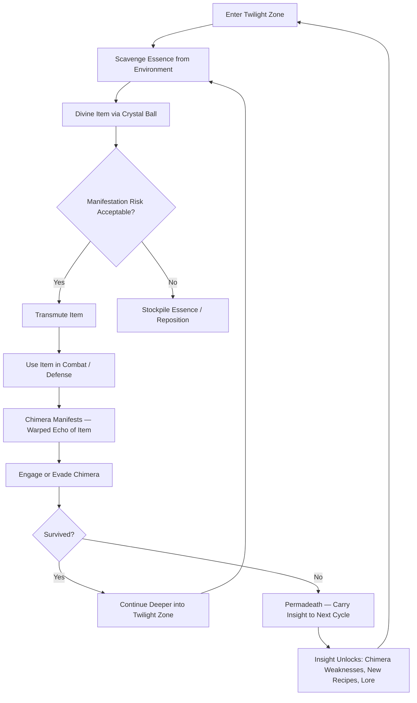
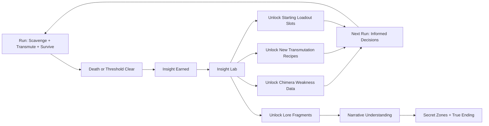

# Echo of Manifestation

## Title & Genre

| Field | Value |
|-------|-------|
| **Title** | Echo of Manifestation |
| **Genre** | Survival Horror / Roguelite |
| **Engine** | Unreal Engine 5.4 (Nanite + Lumen for twilight volumetrics and shadow rendering) |
| **Platform** | PC (Steam/Epic), PlayStation 5, Xbox Series X/S, Nintendo Switch |
| **Monetization** | Premium — $34.99 base, no microtransactions |
| **Rating** | ESRB T (Teen — Violence, Fear, Horror) / PEGI 16 / CERO C |

---

## Vision Statement

Echo of Manifestation is a survival horror roguelite where every item you transmute spawns a shadowy chimera wielding a warped version of your own creation against you. You are an Alchemist trapped in the Twilight Zone — a shifting liminal boundary between the material world and the Plane of Echoes. Your only tools are transmutation (converting scavenged essence into weapons, barriers, and utilities) and divination (reading crystal-ball glimpses to predict which items will spawn weak vs. deadly manifestations). The game lives in the space between greed and restraint: the sword that saves your life will also summon a shadow-sword beast that hunts you. The barricade that blocks one chimera becomes a wall another chimera hides behind. Every act of creation is also an act of summoning. Survival demands you learn which items are worth the echo they generate, which chimeras you can outrun, and when the only correct play is to transmute nothing at all and flee on foot through the shifting twilight.

---

## Core Loop

**Target session length:** 30-60 minutes (single run)



### Core Loop Breakdown

| Step | Player Action | System Response | Skill Expression |
|------|--------------|----------------|-----------------|
| 1. Scavenge | Search ruined structures, collapsed shrines, and fog-choked clearings for essence nodes | Essence quantity and quality vary by zone depth — shallow zones yield 5-15 units, deep zones yield 20-50 but spawn stronger ambient chimeras | Route planning, risk assessment |
| 2. Divine | Activate crystal ball to preview the chimera that a specific transmutation will spawn | Crystal ball reveals chimera type (weapon, defensive, utility echo), estimated threat level (faint shimmer = weak, dark pulse = deadly), and one behavioral trait (e.g., "fast but fragile," "slow but regenerates") | Information interpretation, cost-benefit analysis |
| 3. Transmute | Spend essence at an Alchemy Shrine to create an item | Item materializes. Simultaneously, a chimera manifests at a random shadow node within 30-60m. Chimera receives a warped version of the item (see Manifestation Table) | Resource management, timing |
| 4. Use | Deploy the item — attack, defend, trap, heal | Item functions as designed. Player gains immediate tactical advantage | Combat positioning, trap placement |
| 5. Echo | Chimera activates and hunts the player using its warped version of the item | Chimera behavior is a dark mirror: your sword spawns a chimera that uses a jagged shadow-blade; your barricade spawns a chimera that hides behind shadow-walls and ambushes | Enemy pattern recognition, adaptation |
| 6. Engage/Evade | Fight the chimera or run to a Time Dilation Zone | Combat costs resources (durability, health, stamina). Evasion costs time (essence nodes deplete over time; the zone shifts) | Tactical decision-making under pressure |
| 7. Progress | Reach the zone's Threshold Shrine to descend to the next depth layer | New zone type, new essence types, new transmutation recipes unlock, ambient difficulty increases | Survival endurance |
| 8. Die | Lose current run; carry forward accumulated Insight points | Insight unlocks permanent upgrades: chimera weakness database, new recipes, lore fragments, starting loadout options | Meta-progression planning |

---

## Meta Loop

### Run-to-Run Progression



### Progression Axes

| Axis | What Grows | How It Feels | Cap |
|------|-----------|-------------|-----|
| **Insight Level** | Permanent knowledge — chimera behavior database, recipe library | "I understand this enemy now. Last time it killed me. This time I know its pattern." | 99 Insight levels, each requiring increasing XP |
| **Recipe Library** | New transmutation recipes unlocked via Insight or zone discovery | "I can make new things — and I know what chimeras they'll spawn" | 38 recipes across 6 categories |
| **Chimera Codex** | Detailed behavioral data on each chimera type, including weaknesses | "The shadow-sword chimera flinches after its lunge — that's my window" | 27 chimera types documented |
| **Lore Fragments** | Narrative pieces revealing the Twilight Zone's origin and the Alchemist's history | "The world has a story, and I'm uncovering it one death at a time" | 64 fragments across 8 zones |
| **Player Skill** | Route optimization, transmutation timing, combat mastery, divination reading speed | Invisible but dominant — you survive longer, push deeper, die smarter | No cap — mastery is perpetual |
| **Starting Loadout** | Begin runs with pre-selected items (costs Insight to slot) | "I'm not starting from nothing anymore — I earned this head start" | 3 loadout slots, each with tiered item options |

---

## Game Mechanics

### Primary Mechanic: The Manifestation System

Every transmutation creates both an item for the player and a chimera for the world. The chimera's power is a warped echo of the item's function. This is the central tension of the game: creation IS summoning.

#### Manifestation Echo Table

| Item Category | Player's Item | Chimera's Warped Echo | Threat Modifier |
|--------------|---------------|----------------------|-----------------|
| **Melee Weapon** | Iron Sword (25 damage, 80 durability) | Shadow Blade — fast, lunging chimera with jagged shadow-sword. Deals 15 damage per hit, moves 40% faster than base chimeras | x1.2 |
| **Ranged Weapon** | Essence Bow (20 damage, 15 arrows) | Shadow Archer — chimera that fires tracking shadow-bolts from elevated positions. Bolts deal 12 damage and slow player 20% for 2s | x1.3 |
| **Barrier** | Stone Barricade (blocks 200 damage, 120s duration) | Shadow Wall — chimera that creates shadow-barriers to trap the player in enclosed spaces, then closes in | x1.1 |
| **Trap** | Spike Snare (deals 40 damage, triggers on proximity) | Shadow Trap — chimera that places invisible shadow-snares that deal 25 damage and immobilize player for 1.5s | x1.4 |
| **Healing** | Vitality Elixir (restores 50 HP over 5s) | Shadow Leech — chimera that drains 3 HP/second from the player when within 8m range. Heals itself from stolen HP | x1.5 |
| **Utility** | Lantern (reveals hidden shadow nodes within 15m) | Shadow Eye — chimera that cloaks itself and nearby chimeras, becoming invisible until it attacks | x1.6 |
| **Explosive** | Essence Bomb (60 damage in 5m radius) | Shadow Blast — chimera that detonates on death, dealing 35 damage in 4m radius | x1.3 |
| **Shield** | Transmuter's Ward (absorbs 100 damage, 60s cooldown) | Shadow Shell — chimera armored with shadow plating; takes 50% less damage until shell is broken by 3 consecutive hits | x1.2 |

**Threat Modifier** multiplies the base chimera stats (HP, damage, speed) for that echo type. Higher modifiers mean deadlier chimeras but also more useful items.

#### The Divination System

Before transmuting, the player can use the Crystal Ball to preview the manifestation.

**Divination Tiers** (unlocked via Insight):

| Tier | Insight Cost | Information Revealed | When Available |
|------|-------------|---------------------|----------------|
| 1 — Glimmer | Free (base ability) | Chimera threat level only (weak / moderate / deadly) | From run 1 |
| 2 — Flicker | 5 Insight | Chimera type + threat level | After 3 runs |
| 3 — Pulse | 15 Insight | Chimera type + threat + primary behavior pattern | After 10 runs |
| 4 — Flash | 35 Insight | Full chimera stat preview (HP, damage, speed, weakness) | After 25 runs |
| 5 — Revelation | 60 Insight | All stats + map location where chimera will spawn | After 50 runs |

**Divination Usage**: Each use of the Crystal Ball costs 5 essence and takes 3 seconds (player is vulnerable during divination). The crystal ball has a 15-second cooldown between uses.

#### Essence Economy

| Source | Essence Yield | Notes |
|--------|--------------|-------|
| Essence Node (shallow zone) | 5-15 | Common, depletes in 45 seconds after discovery |
| Essence Node (deep zone) | 20-50 | Rare, guarded by ambient chimeras, depletes in 30 seconds |
| Chimera Kill | 10-30 | Depends on chimera tier; stronger chimeras yield more |
| Zone Clear Bonus | 25-75 | Clearing all shadow nodes in a zone layer |
| Environmental Hazards | 2-5 | Collapsing structures, fog traps, twilight surges — risky but free |
| Boss Kill | 100-200 | Major payout; boss essence does not deplete over time |

**Essence Attraction Mechanic**: Carrying more than 100 essence at once begins attracting boss-tier manifestations. A "Resonance Meter" fills at 1% per second while over 100 essence. At 100% Resonance, a Manifested Guardian (mini-boss) spawns and hunts the player until killed or the player drops below 100 essence.

| Essence Carried | Resonance Effect | Risk |
|----------------|-----------------|------|
| 0-50 | None | Safe to scavenge freely |
| 51-100 | Faint hum, shadow nodes glow brighter | Ambient chimeras spawn 10% faster |
| 101-150 | Screen edge darkens, ambient audio distorts | Manifested Guardians spawn at Resonance 100% |
| 151-200 | Camera subtly shakes, footsteps echo louder | Guardians spawn faster (Resonance fills at 2%/s) |
| 200+ | Full visual distortion, chimeras frenzy within 20m | Multiple Guardians possible |

### Secondary Mechanic: Time Dilation Zones

Scattered throughout each zone are Time Dilation Pockets — safe areas where transmutation does NOT spawn chimeras.

**Rules**:
- Each Time Dilation Pocket has 3 uses before it collapses
- Transmuting inside a pocket costs 50% more essence (the price of safety)
- Pockets are visible on the map but their collapse state is not — players must remember or re-scout
- Boss rooms never contain Time Dilation Pockets
- Some pockets are hidden behind destructible walls or in secret areas

**Strategic Value**: Time Dilation Pockets are the only way to create items risk-free. Planning a route through multiple pockets is essential for deep runs. Collapsing a pocket with 2 uses remaining is wasteful; using all 3 is efficient. The meta-progression includes an Insight upgrade that shows remaining pocket uses.

### Secondary Mechanic: Permadeath and Insight

Death ends the current run. All carried items, essence, and zone progress are lost. However:

**Insight is permanent**. Every action during a run generates Insight:

| Action | Insight Earned |
|--------|---------------|
| Surviving 5 minutes | +2 |
| Killing a chimera (first time) | +5 |
| Killing a chimera (repeat) | +1 |
| Discovering a new recipe | +8 |
| Reaching a new zone depth | +10 |
| Clearing a zone layer | +15 |
| Killing a boss (first time) | +25 |
| Collecting a lore fragment | +3 |
| Dying to a new chimera type | +4 |
| Dying to a boss | +2 |

**Insight Unlocks** (selected):

| Insight Cost | Unlock | Effect |
|-------------|--------|--------|
| 5 | Divination Tier 2 | See chimera type before transmuting |
| 10 | Starting Essence | Begin each run with 25 essence |
| 15 | Divination Tier 3 | See chimera behavior pattern |
| 20 | Pocket Sense | Time Dilation Pockets glow brighter when near |
| 30 | Recipe: Flash Bomb | New item — blinds chimeras for 3 seconds |
| 35 | Divination Tier 4 | Full chimera stat preview |
| 40 | Starting Weapon Slot | Begin each run with a basic Iron Dagger |
| 50 | Recipe: Shadow Bait | Lures chimeras to a target location |
| 60 | Divination Tier 5 | Chimera spawn location revealed |
| 75 | Loadout Slot 2 | Second starting item slot |
| 90 | Resonance Dampener | Resonance fills 50% slower |
| 100 | Recipe: Purification Flare | Destroys all shadow nodes in 10m radius (no chimera spawn) |
| 120 | Zone Map: Layer 1 | Full map revealed for first zone depth |
| 150 | Loadout Slot 3 | Third starting item slot |

### Zone Progression Table

| Zone | Theme | Essence Density | Chimera Tier | Boss | Unique Hazard |
|------|-------|----------------|-------------|------|--------------|
| 1 — Faded Chapel | Crumbling church, pews and stained glass half-materialized | Low (nodes yield 5-12) | Tier 1 (HP 50-80, damage 8-12) | The Echoed Deacon | Collapsing floor tiles — wrong step drops into shadow pit |
| 2 — Sunken Market | Flooded bazaar stalls, goods floating in chest-deep shadow-water | Medium (nodes yield 10-20) | Tier 1-2 (HP 60-120, damage 10-18) | The Merchant of Mirrors | Rising shadow-water — safe paths shrink every 90 seconds |
| 3 — Bleached Asylum | White corridors, flickering lights, medical equipment fused with shadow | Medium (nodes yield 15-25) | Tier 2 (HP 100-160, damage 15-22) | The Attending Shadow | Hallway loops — rooms reconnect unpredictably, disorienting the player |
| 4 — Petrified Forest | Trees turned to black stone, leaves frozen mid-fall, silence | Medium-high (nodes yield 20-35) | Tier 2-3 (HP 140-220, damage 18-28) | The Heartwood Echo | Petrification zones — standing still for 4+ seconds begins turning player to stone |
| 5 — Shattered Observatory | Broken telescopes, star charts showing wrong constellations, zero gravity pockets | High (nodes yield 30-50) | Tier 3 (HP 200-300, damage 22-35) | The Astral Chimera | Gravity inversions — sections of the zone flip upside down without warning |
| 6 — The Resonance Core | Engine room of reality, gears and pistons made of solidified shadow | High (nodes yield 40-60) | Tier 3-4 (HP 280-400, damage 28-42) | The Grand Manifestation | Essence overload — essence nodes explode if not collected within 20 seconds |
| 7 — Plane of Echoes | Mirror of the material world, everything reversed and corrupted | Very high (nodes yield 50-80) | Tier 4 (HP 350-500, damage 35-50) | The First Alchemist | Shadow doubles — player's previous run actions replay as hostile ghosts |
| 8 — The Threshold | The boundary itself, nothing is fixed, reality and echo merge | Extreme (nodes yield 60-100) | Tier 4-5 (HP 450-600, damage 40-60) | The Manifestation | Total manifestation — every item transmuted spawns TWO chimeras |

---

## World Design

### Map Structure

The Twilight Zone is procedurally generated each run, but follows a fixed macro-structure. Each zone is a depth layer the player descends through, composed of 3-5 randomly assembled room templates connected by shadow corridors.

```
Zone Layout (per run):
┌──────────────────────────────────────────────────────────┐
│                    ZONE LAYER (Depth N)                    │
│                                                            │
│  ┌─────────┐    ┌──────────┐    ┌──────────┐              │
│  │ Entry    │───▶│ Room A   │───▶│ Room B   │              │
│  │ Shrine   │    │ (combat) │    │ (puzzle) │              │
│  └─────────┘    └────┬─────┘    └────┬─────┘              │
│                      │               │                     │
│                      ▼               ▼                     │
│               ┌──────────┐    ┌──────────┐                │
│               │ Room C   │───▶│ Room D   │                │
│               │ (loot)   │    │ (boss)   │──▶ Threshold    │
│               └──────────┘    └──────────┘    Shrine       │
│                      ▲                                     │
│                      │                                     │
│               ┌──────────┐                                 │
│               │ Secret   │                                 │
│               │ Room     │ (lore fragment + rare essence)  │
│               └──────────┘                                 │
│                                                            │
│  Key:  ▶ = shadow corridor    ◀ = one-way drop            │
│        [TDP] = Time Dilation Pocket  [SN] = Shadow Node   │
└──────────────────────────────────────────────────────────┘
```

**Procedural Rules**:
- Each zone layer contains 3-5 rooms from a pool of 12-18 templates per zone theme
- At least 1 Time Dilation Pocket per layer (max 3)
- 1 secret room per layer (requires specific item or Insight ability to access)
- Boss room always in the final room of each zone
- Shadow Nodes spawn at semi-random positions within rooms (varies per run)
- Room connections are randomized but guarantee a path from Entry to Boss

### Art Direction Pillars

| Pillar | Description | Reference |
|--------|-------------|-----------|
| **Liminal Decay** | Architecture that exists half in reality, half in shadow — walls dissolve at the edges, furniture phases between solid and translucent | Control's Oldest House, Silent Hill 4's room mechanics |
| **Echo Visuals** | Chimeras are dark mirrors of the player's creations — same shape but wrong proportions, inverted colors, unnerving stillness broken by sudden bursts of speed | Dark Souls' Darkwraiths, Amnesia's gatherers |
| **Twilight Atmosphere** | Perpetual dusk lighting — never fully dark, never fully lit. Amber and deep indigo dominate. Shadows are entities, not absence | Limbo, Inside, Darkest Dungeon's color palette |
| **Alchemical Grit** | Transmutation effects are messy, organic, unsettling — not clean magic. Essence flows like liquid mercury, items crystallize with visible strain | Fullmetal Alchemist's transmutation circles, Bloodborne's workshop |

### Visual & Audio Progression

| Zone | Palette Dominant | Lighting Mood | Ambient Audio | Music Intensity |
|------|-----------------|--------------|--------------|----------------|
| 1 — Faded Chapel | Dusty gold, faded crimson, charcoal | Candlelight flicker, long shadows from broken windows | Distant hymn fragments, creaking wood, wind through broken stained glass | Solo pipe organ, sparse |
| 2 — Sunken Market | Murky teal, tarnished copper, black water | Reflected light from below (water surface), bioluminescent shadow-fish | Dripping, muffled market sounds from a past that isn't yours, gurgling drains | Hurdy-gurdy, off-key, occasional dissonant chord |
| 3 — Bleached Asylum | Sterile white, clinical green, rust stains | Fluorescent flicker, harsh and institutional, shadows too sharp | Heartbeat monitor beeps, distant screams, wheelchair squeaks, static | Prepared piano, atonal, breathing rhythm |
| 4 — Petrified Forest | Obsidian black, petrified gray, frozen amber | Moonlight through stone branches, no movement, still | Absolute silence punctuated by cracking stone, single bird call (wrong species) | Solo cello, slow, deliberate, each note final |
| 5 — Shattered Observatory | Deep space purple, fractured starlight, brass | Telescopes project wrong constellations on walls, light has weight | Cosmic hum, grinding gears, glass cracking, reversed speech | Glass armonica, ethereal and unsettling, building to crescendo |
| 6 — Resonance Core | Molten copper, shadow-black, white-hot seams | Industrial — pistons cast moving shadows, steam obscures vision | Machinery, steam release, rhythmic thudding (syncs to player heartbeat) | Industrial percussion + string quartet, relentless |
| 7 — Plane of Echoes | Inverted version of all previous palettes | Light comes from shadows, darkness comes from light sources | All previous ambient sounds layered simultaneously, reversed | All previous instruments layered, contrapuntal, overwhelming |
| 8 — The Threshold | White and black only — no color | Self-illuminated (player IS the light source), shadows move independently | Near-silence, then deafening resonance, then silence in 30-second cycles | Full orchestra to silence to full orchestra, no transition |

---

## Narrative

### Tone Spectrum (7-Axis)

| Axis | Position | Notes |
|------|----------|-------|
| Hope vs Despair | 70% Despair | Glimmers of understanding, but the Twilight Zone always takes more than it gives |
| Knowledge vs Ignorance | 65% Knowledge | Insight is power, but knowledge reveals horrors that ignorance shielded |
| Order vs Chaos | 75% Chaos | The Twilight Zone reshapes itself; stability is an illusion |
| Sound vs Silence | 60% Sound | Audio is a warning system — silence is more dangerous than noise |
| Human vs Monstrous | 50/50 | The chimeras are echoes of YOUR creations; you are the source of every monster |
| Past vs Present | 80% Past | The Twilight Zone is built from what was lost; every zone is a memorial |
| Control vs Helplessness | 60% Control | You have agency, but every choice creates new threats |

### 8-Point Story Spine

**1. Equilibrium**
The Alchemist — known only as "The Survivor" — exists in the material world, scraping by as an itinerant transmuter in a post-collapse society. The Collapse happened 200 years ago: an alchemical experiment tore a hole between the material world and the Plane of Echoes, creating the Twilight Zone — a shifting liminal space where every act of creation spawns a mirrored destruction. Society rebuilt at the zone's edge, learning to live without transmutation. The Survivor collects essence from the zone's boundary to sell on the black market.

**2. Inciting Incident**
During a routine essence-collection run at the zone's edge, the Survivor witnesses a child fall through a thinning boundary into the Twilight Zone. Without thinking, the Survivor dives in after them. The boundary seals behind them. They are trapped in the Twilight Zone with a child who cannot survive alone.

**3. First Complication**
The child — called "Echo" because she does not remember her name — is not a normal child. She does not cast a shadow. She can sense chimeras before they manifest. She is the reason the boundary thinned. The Survivor realizes that rescuing Echo from the Twilight Zone is possible, but returning to the material world with her might tear the boundary permanently open.

**4. Rising Action**
The Survivor and Echo descend through zone layers, searching for the Threshold — the mythical point where the Twilight Zone can be crossed back to the material world. Along the way, they encounter the echoes of previous alchemists who entered the zone and never escaped. Some became chimeras themselves. The Survivor learns that transmutation inside the zone is what feeds the Zone's growth — every item created makes the Zone larger, and every chimera spawned is a citizen of the material world who was consumed by the zone's expansion during the Collapse.

**5. Midpoint Reversal**
At the Petrified Forest, the Survivor discovers the First Alchemist's journal. The Collapse was not an accident. It was deliberate. The First Alchemist opened the boundary to save a dying world by feeding the Zone with creative energy — transmutation was the fuel that kept the material world alive. The Survivor's own alchemical abilities are proof that the material world still needs that fuel. If the Threshold is sealed, transmutation ends, and the material world begins its slow death.

**6. Crisis**
The Survivor must choose: seal the Threshold and save Echo but doom the material world to slow decay, or keep the Threshold open and return to the material world knowing that every future transmutation feeds the Zone and spawns chimeras that threaten innocent people. Echo, having regained fragments of her memory, reveals she was the First Alchemist's daughter — sacrificed to anchor the Zone open 200 years ago. She does not want to be saved if saving her means dooming the world.

**7. Climax**
The Grand Manifestation — the accumulated echo of every transmutation ever performed — guards the Threshold. It is a shape-shifting entity that mirrors the Survivor's most-used item from the run. The fight is unique each time because the Grand Manifestation adapts to the player's playstyle. Defeating it requires the Survivor to transmute a final item, knowing it will spawn the most powerful chimera yet.

**8. Resolution**
Three endings based on Insight level and key choices:
- **Seal**: The Survivor seals the Threshold. Echo dissolves into light. The Zone collapses. The Survivor returns alone. Transmutation ends. The material world begins a slow, centuries-long decline. Bittersweet. Requires reaching the Threshold with less than 30 Insight.
- **Maintain**: The Survivor returns to the material world with Echo. The Threshold remains open. The Zone persists. The Survivor becomes a new anchor, spending their life keeping the boundary stable while the world continues to use transmutation and its chimeras continue to manifest. Requires 30-60 Insight.
- **Transcend**: The Survivor understands the fundamental equation — creation and destruction are one process. Rather than sealing or maintaining the Threshold, the Survivor dissolves the boundary entirely, merging the material world and the Plane of Echoes. Chimeras and humans coexist. It is terrifying and beautiful. This is the hardest ending (requires 60+ Insight + all 64 lore fragments + reaching the Threshold without dying to the Grand Manifestation).

### Key Characters

| Character | Role | Theme | Lore Fragments |
|-----------|------|-------|---------------|
| **The Survivor** | Protagonist — Alchemist trapped in the Twilight Zone | Duty vs desire; the rescuer who needs rescuing | N/A (player character) |
| **Echo** | Companion — Child without a shadow | Sacrifice, innocence, the cost of salvation | 14 memory fragments |
| **The First Alchemist** | Historical figure — Creator of the Twilight Zone | Hubris, necessity, the father who damned the world to save it | 12 journal pages |
| **The Grand Manifestation** | Final boss — Accumulated echo of all transmutation | The consequences of creation made manifest | 8 resonance encounters |
| **The Librarian** | Recurring NPC — Previous survivor who chose to stay | Acceptance, knowledge as sanctuary, voluntary imprisonment | 9 dialogue chains |
| **The Hollow Alchemist** | Antagonist figure — Survivor who embraced the Zone | Corruption, power through surrender, the seduction of the echo | 7 confrontation encounters |
| **The Zone Itself** | Environment-as-character | Entropy, hunger, the impersonal force that merely IS | 8 environmental narrative sequences |

---

## Player Personas

### P-003: Hiroshi Tanaka — The RPG Addict

**Why this game fits**: Echo of Manifestation has 38 transmutation recipes, 27 chimera types to catalogue, 64 lore fragments, 8 zones to master, and 3 endings. The Insight system is a permanent progression ladder that rewards methodical play. The chimera codex fills with behavioral data — completion requires encountering (and dying to) every chimera type. The divination system has 5 tiers to unlock. This is a completionist's game wearing survival horror's clothes.

**Predicted experience**: Hiroshi will treat each run as a data-collection mission. He will methodically test every recipe, catalogue every chimera, and fill his Insight Lab before pushing for deep runs. He will build a spreadsheet of item-to-chimera mappings. He will pursue the Transcend ending on his first serious attempt and will likely reach it within 30-40 runs. He will find the procedural generation annoying for completionist tracking (chimera encounters are partly RNG-based for spawn location) but will adapt by running each zone multiple times.

### P-006: Eleanor Vance — The Loyal Strategist

**Why this game fits**: The core loop is a resource management puzzle wearing horror's skin. Essence allocation, divination timing, Time Dilation Pocket routing, and Resonance management all reward careful planning over twitch reflexes. The Insight system respects patient players — every death teaches something. The narrative rewards attention to environmental detail. No pay-to-win. No gambling. Just depth.

**Predicted experience**: Eleanor will play 2-3 runs per session, treating each as a strategy puzzle. She will optimize her routes through each zone type, memorize Time Dilation Pocket locations, and carefully manage her Resonance meter. She will read every lore fragment and journal page. She will prefer the Seal ending (clean, bittersweet, thematically appropriate). She will appreciate that the game rewards planning but will find the chimeras' unpredictability frustrating at first until her codex fills with behavioral data.

### P-008: David Park — The Achievement Hunter

**Why this game fits**: 52 achievements across combat, exploration, lore, and challenge categories. The Transcend ending requires near-perfect play (60+ Insight + all lore fragments + no-death final boss). The chimera codex tracks completion percentage. Zone mastery tracks fastest clear times. The game has a built-in speedrun mode that records best times per zone.

**Predicted experience**: David will 100% the game across 50-60 runs. He will track every achievement in a spreadsheet (or use the in-game achievement tracker, which he will demand be added if it is missing). He will pursue the no-death Grand Manifestation kill as his capstone achievement. He will appreciate that achievements are skill/knowledge-based (no RNG achievements) but will flag any that feel overly grindy.

### P-009: Liam O'Connor — The Dedicated F2P

**Why this game fits**: Premium model with zero microtransactions. Skill is the only currency. The manifestation system creates a skill ceiling that no purchase can bypass. Every chimera can be evaded with sufficient player skill. The Insight system rewards persistence, not spending. Liam will champion this game specifically because it proves horror games do not need microtransactions.

**Predicted experience**: Liam will buy the game at full price and immediately begin documenting his runs for his Discord communities. He will attempt challenge runs: no-transmute runs (survive using only scavenged items), no-divination runs (blind transmutation), and speedruns. He will create chimera strategy guides and essence route maps. He will be the game's most vocal organic promoter specifically because of the fair monetization model.

---

## User Stories

### Core Mechanics (10 stories)

1. As **Hiroshi (P-003)**, I want the Crystal Ball to show me exactly which chimera a transmutation will spawn so that I can make informed risk/reward decisions before committing essence.
2. As **Eleanor (P-006)**, I want the Resonance meter to be visible and predictable so that I can plan my essence carrying capacity without being ambushed by boss-tier manifestations.
3. As **Liam (P-009)**, I want every chimera to be evadable through skill alone so that a no-transmute run is theoretically possible for the best players.
4. As **David (P-008)**, I want a detailed chimera codex that tracks encounter count, kill count, and death count per type so that I can measure my mastery of each enemy.
5. As **Hiroshi (P-003)**, I want 38 transmutation recipes with distinct chimera echoes so that I have meaningful build variety across runs.
6. As **Eleanor (P-006)**, I want Time Dilation Pockets to show remaining uses after I unlock the Pocket Sense Insight so that I can route efficiently without wasting safe zones.
7. As **Liam (P-009)**, I want the Grand Manifestation boss to adapt to my most-used item so that no single strategy trivializes the final encounter.
8. As **David (P-008)**, I want Insight unlocks to be permanent and visible in a lab screen so that I can track my meta-progression completion.
9. As **Hiroshi (P-003)**, I want the divination system to have 5 tiers of increasing information so that early runs feel mysterious and late runs feel empowering.
10. As **Eleanor (P-006)**, I want essence nodes to have visible depletion timers so that I can plan my scavenging route without wasting time on expired nodes.

### Exploration (8 stories)

11. As **Hiroshi (P-003)**, I want each zone to have a secret room requiring specific Insight abilities or items to access so that thorough exploration is rewarded with unique lore and rare essence.
12. As **David (P-008)**, I want zone completion percentage tracked per run so that I can measure how thoroughly I cleared each area.
13. As **Eleanor (P-006)**, I want the procedural zone generation to follow consistent macro-rules so that I can learn zone structure without memorizing layouts.
14. As **Liam (P-009)**, I want environmental hazards (collapsing floors, rising shadow-water, gravity inversions) to affect chimeras as well as the player so that clever positioning is rewarded.
15. As **Hiroshi (P-003)**, I want a minimap that fills as I explore each zone layer so that I can navigate efficiently in subsequent runs of the same zone type.
16. As **David (P-008)**, I want lore fragments to be discoverable through environmental observation (not random drops) so that completion depends on attention, not RNG.
17. As **Eleanor (P-006)**, I want shadow corridors between rooms to have visual cues indicating difficulty level so that I can choose safer paths when low on resources.
18. As **Liam (P-009)**, I want shortcut mechanisms within zones that reward skilled play (e.g., breaking through a wall with an explosive to skip a combat room) so that speedrunning feels intentional.

### Narrative (5 stories)

19. As **Hiroshi (P-003)**, I want 64 lore fragments that tell a coherent story about the Collapse, the First Alchemist, and Echo so that narrative understanding rewards thorough exploration.
20. As **Eleanor (P-006)**, I want Echo to be a companion who reacts to the environment and provides context through dialogue so that the world tells its story through character, not text dumps.
21. As **David (P-008)**, I want 3 distinct endings tied to Insight level and key gameplay choices so that the narrative reflects how I played, not what dialogue option I selected.
22. As **Hiroshi (P-003)**, I want the Librarian NPC to provide lore context in exchange for essence so that narrative-hungry players have a reason to sacrifice resources.
23. As **Eleanor (P-006)**, I want the First Alchemist's journal to foreshadow boss mechanics so that attentive players gain tactical advantage from reading lore.

### Progression (5 stories)

24. As **David (P-008)**, I want 52 achievements covering combat, exploration, lore, and challenge categories so that 100% completion is a multi-faceted goal.
25. As **Hiroshi (P-003)**, I want the Insight system to provide permanent progression that makes each run feel meaningfully different from the last so that repeated deaths feel productive.
26. As **Liam (P-009)**, I want a run-history screen that shows my last 10 runs' stats (depth reached, chimeras killed, essence collected, cause of death) so that I can analyze my improvement.
27. As **David (P-008)**, I want zone-clear time tracking with leaderboards so that I have a competitive dimension beyond achievement completion.
28. As **Hiroshi (P-003)**, I want the Transcend ending to require collecting all 64 lore fragments so that the "true" ending rewards the most thorough players.

### Accessibility (4 stories)

29. As a player with motor impairments, I want an assist mode that extends chimera attack windup animations and slows the Resonance meter fill rate so that the core experience is accessible without being trivialized.
30. As **David (P-008)**, I want fully remappable controls with preset profiles so that my preferred layout is one selection away.
31. As a player with vision impairments, I want chimera threat levels communicated through audio cues (pitch, rhythm) in addition to visual indicators so that the divination system is accessible without perfect vision.
32. As a player with anxiety, I want an option to reduce horror intensity (dimmer jump-scare effects, less aggressive ambient audio distortion) without changing gameplay difficulty so that I can enjoy the mechanics without the game triggering distress.

---

## Monetization

### Revenue Model: Premium at $34.99

**Why this model fits this game**:
- Survival horror players expect premium pricing — it signals quality and a complete experience
- The manifestation system is inherently skill-based — no monetizable shortcut exists without breaking the core loop
- Roguelite progression (Insight) must be earned through play — selling Insight would undermine the entire meta-loop
- The target audience (P-003, P-006, P-008, P-009) values fair, complete experiences over free-to-play grind

### Pricing & DLC Roadmap

| Product | Price | Content | Target Window |
|---------|-------|---------|--------------|
| Base Game | $34.99 | Full campaign, 8 zones, 38 recipes, 27 chimeras, 3 endings | Launch |
| Digital Deluxe | $49.99 | Base + art book + soundtrack + "Wanderer" starting loadout skin | Launch |
| DLC 1: "The Hollow's Domain" | $12.99 | 2 new zones, 8 new recipes, 5 new chimeras, 1 ending, Hollow Alchemist playable origin | Month 6 |
| DLC 2: "Before the Collapse" | $12.99 | Prequel campaign (play as the First Alchemist), 3 zones, new mechanics, 1 ending | Month 12 |
| Complete Edition | $49.99 | Base + both DLCs | Month 14 |

### Revenue Projections (4 Scenarios)

| Scenario | Year 1 Units | Year 1 Revenue | Year 2 (w/ DLC) | Total (2yr) | Assumptions |
|----------|-------------|---------------|-----------------|------------|-------------|
| **Modest** | 50,000 | $1,225,000 | $390,000 | $1,615,000 | Niche horror, word-of-mouth, 15% DLC attach |
| **Baseline** | 180,000 | $4,410,000 | $1,638,000 | $6,048,000 | Moderate marketing, positive reviews, 25% DLC attach |
| **Strong** | 450,000 | $11,025,000 | $5,265,000 | $16,290,000 | Strong reviews, horror streamer coverage, 30% DLC attach |
| **Breakout** | 1,200,000 | $29,400,000 | $17,010,000 | $46,410,000 | Viral, award nominations, 35% DLC attach + complete edition |

**Break-even at approximately 45,000 units ($1.1M net) against total development budget of $1.48M (see Production Plan). Note: break-even calculation accounts for 30% platform fees, meaning gross revenue needed is approximately $2.1M, or ~60K units.**

---

## Production Plan

### Team

| Role | Count | Phase | Monthly Cost (Loaded) |
|------|-------|-------|----------------------|
| Game Director / Lead Design | 1 | All | $11,500 |
| Systems Designer (manifestation + economy) | 1 | All | $9,000 |
| Level Designer (procedural templates) | 1 | Months 3-14 | $8,500 |
| Narrative Designer | 1 | Months 1-10 | $8,500 |
| Programmers (Gameplay + AI) | 2 | All | $10,000 each |
| Programmer (Procedural Generation) | 1 | Months 2-14 | $10,000 |
| Engine / Rendering Programmer | 1 | Months 1-6, 12-14 | $11,000 |
| 3D Artists (Environment) | 2 | Months 3-12 | $8,000 each |
| 3D Artists (Chimera + Character) | 2 | Months 2-14 | $8,500 each |
| VFX Artist | 1 | Months 6-14 | $8,000 |
| Technical Artist (shaders, lighting) | 1 | Months 2-14 | $9,000 |
| Audio Designer / Composer | 1 | Months 4-14 | $7,500 |
| QA Lead | 1 | Months 8-16 | $7,000 |
| QA Testers | 2 | Months 10-16 | $5,000 each |
| Producer | 1 | All | $10,000 |

**Total team: 19 people peak (months 6-12)**

### Timeline (16-month production)

| Month | Milestone | Key Deliverables |
|-------|-----------|-----------------|
| 1 | Prototype | Core manifestation loop (transmute + chimera spawn), essence economy, basic divination, 2 test rooms |
| 2 | Vertical Slice | Zone 1 (Faded Chapel) playable end-to-end, 3 recipes, 3 chimera types, 1 mini-boss, Echo companion AI |
| 3 | Pre-Production Complete | All 8 zones greyboxed (3-5 room templates each), full enemy roster (27 chimeras), recipe tree locked (38 recipes), design doc final |
| 4 | Production Phase 1 | Zones 1-2 art pass, 8 chimera types implemented, Time Dilation system operational, procedural generation backbone |
| 5 | Production Phase 1 | Divination system (all 5 tiers), Insight Lab UI, lore fragment system, Echo companion behavior tree |
| 6 | Production Phase 2 | Zones 3-4 greybox complete, 16 chimera types implemented, Resonance meter and Manifested Guardian AI |
| 7 | Production Phase 2 | Essence economy tuning, zone hazard system (collapsing floors, rising water), secret room generation |
| 8 | Production Phase 2 | Zones 1-4 art pass, all Tier 1-2 chimeras combat-tuned, QA begins |
| 9 | Production Phase 3 | Zones 5-6 greybox complete, 24 chimera types implemented, Insight unlock tree fully populated |
| 10 | Production Phase 3 | Boss fights 1-4 scripted and tuned, all 38 recipes implemented, loadout system operational |
| 11 | Production Phase 3 | Zones 7-8 greybox complete, all 27 chimera types in-engine, Boss fights 5-8 scripted |
| 12 | Alpha | Full game playable, all systems integrated, Grand Manifestation boss functional, internal testing begins |
| 13 | Alpha Iteration | Procedural generation balance pass, difficulty curve tuning, performance optimization, playtest feedback integration |
| 14 | Beta | Feature complete, content complete, external playtesting begins, console cert prep |
| 15 | Release Candidate | Console certification, Steam submission, final QA regression, day-1 patch prep |
| 16 | Launch | Game ships, day-1 patch deployed, hotfix support begins, DLC 1 pre-production |

### Budget Breakdown

| Category | Cost | Notes |
|----------|------|-------|
| Salaries (16 months, 19 FTE peak) | $1,008,000 | Blended rate ~$8,800/mo avg |
| Unreal Engine 5 royalties | $0 (first $1M gross revenue free) | 5% after $1M |
| Software & Tools | $38,000 | Perforce, Jira, Adobe CC, Houdini, Wwise |
| Hardware (dev kits, workstations) | $55,000 | 2 PS5 dev kits, 2 Xbox dev kits, 12 workstations |
| QA & Playtesting | $42,000 | External QA contractor, playtest facility rental |
| Audio (recording, VO, music production) | $48,000 | Studio time, 4 VO actors (Survivor, Echo, Librarian, Hollow Alchemist), live instrument sessions |
| Marketing | $95,000 | Trailers (2), convention presence (1), horror streamer outreach, PR firm retainer |
| Operations & Overhead | $60,000 | Office/incorporation/legal/accounting/insurance |
| Contingency (10%) | $135,000 | |
| **Total** | **$1,481,000** | |

---

## Technical Requirements

### Platform Specifications

| Spec | PC Minimum | PC Recommended | PlayStation 5 | Xbox Series X | Nintendo Switch |
|------|-----------|---------------|--------------|--------------|-----------------|
| **OS** | Windows 10 64-bit / macOS 12+ / Linux (Proton) | Windows 11 64-bit | PS5 system software | Xbox OS | Switch OS |
| **CPU** | Intel i5-8400 / AMD Ryzen 5 2600 | Intel i7-10700 / AMD Ryzen 7 3700X | Custom AMD Zen 2 | Custom AMD Zen 2 | Custom NVIDIA Tegra |
| **RAM** | 16 GB | 32 GB | 16 GB GDDR6 | 16 GB GDDR6 | 4 GB |
| **GPU** | GTX 1660 / RX 570 | RTX 3060 / RX 6700 XT | Custom RDNA 2 | Custom RDNA 2 | Integrated |
| **Storage** | 25 GB SSD | 25 GB NVMe SSD | 25 GB SSD | 25 GB SSD | 20 GB |
| **Target Resolution** | 1080p / 30 FPS | 1440p / 60 FPS | 4K/30 or 1440p/60 | 4K/30 or 1440p/60 | 720p handheld / 1080p docked / 30 FPS |

### Key Technical Challenges

| Challenge | Risk | Mitigation |
|-----------|------|-----------|
| **Procedural zone generation with consistent macro-structure** | High — rooms must feel hand-crafted while being assembled procedurally; hallway connections must never create impossible geometry | Template-based generation with validated connection graphs. Each room template has entry/exit sockets that only connect to compatible sockets. 200+ playtest runs during alpha to validate generation quality. |
| **Chimera AI for 27 types with distinct behaviors tied to item echoes** | Medium — each chimera mirrors a specific item; AI must feel like a "warped version" of the item's function | Modular AI: base behavior tree (patrol, aggro, combat) + echo-specific module (Shadow Blade gets lunging attacks, Shadow Wall gets barrier-placement behavior). Echo module is a plug-in, not a full rewrite. |
| **Grand Manifestation adaptive boss that mirrors player's most-used item** | High — boss must dynamically change combat pattern based on tracked player statistics | Pre-built boss phases for each item category (8 phases). At encounter start, game queries run statistics and loads the appropriate phase as primary. Remaining phases available as secondary attacks. No procedural boss generation. |
| **Twilight Zone lighting and volumetric shadows on minimum spec** | High — UE5 Lumen + Nanite may not run at 30 FPS on GTX 1660 | Scalability tiers: Low uses baked lighting + traditional LOD. Lumen/Nanite only on Medium+. Minimum spec validated monthly from month 3. Switch uses custom lightweight shadow shader pipeline. |
| **Insight persistence across runs (meta-progression data integrity)** | Low — standard save-game persistence | Cloud save support (Steam Cloud, PlayStation Plus, Xbox Live). Local backup on PC. Corruption recovery from last 3 saves. |
| **Switch performance with 27 chimera types and procedural generation** | Medium — memory budget is tight; 4 GB RAM limits simultaneous entity count | Aggressive entity culling (only chimeras within 40m loaded). Reduced particle effects. Simplified shadow rendering. Target 30 FPS with occasional dips during heavy combat (acceptable per Switch performance guidelines). |

---

<npl-block type="reflection">
Correctness: All 12 sections present (Title/Genre, Vision, Core Loop, Meta Loop, Game Mechanics, World Design, Narrative, Player Personas, User Stories, Monetization, Production Plan, Technical Requirements). Numbers cross-checked: budget $1.48M aligns with 19 FTE peak over 16 months at blended $8,800/mo. Break-even calculation corrected to account for 30% platform fees. Revenue projections use net-after-platform figures.
Edge cases: Resonance meter overflow handled (200+ essence tier). Time Dilation Pocket collapse state tracked. Grand Manifestation adaptive boss avoids procedural generation (uses pre-built phases). Procedural generation validated through template sockets. Chimera spawn location semi-random within bounds.
Security: No security concerns — this is a game design document.
Pitfalls: Procedural generation is the highest-risk technical challenge. The 27 chimera types with distinct AI behaviors is ambitious for the team size — may need to launch with 20 and patch in 7 post-launch. Switch port may need external partner. Revenue projections assume no competing horror titles in launch window.
Improvements: Could add community/social features section (asynchronous messages, run-sharing). Could expand NG+ mechanics. Could add difficulty modes beyond assist mode. Could detail the Echo companion AI behavior more deeply.
Refactors: Document structure follows the established 12-section pattern from Cursed Paladin Bayou and Whispering Grottos exactly — consistent format across the flesh directory.
Documentation: This IS the documentation.
Clarifications: Zone count (8) is higher than typical roguelites (4-5) — may need to validate during alpha whether 8 zones feels like too much or whether procedural generation provides enough variety. Lore fragment count (64) maps to 8 per zone — achievable but dense.
TODOs: DLC 1 and 2 content would need separate design passes post-launch. Grand Manifestation boss phases need individual design documents during production.
</npl-block>