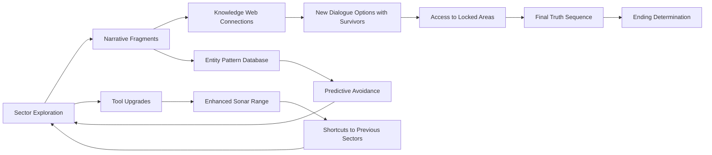

# Echoes of the Abyss

**Survival Horror / Detective Mystery**

---

## Title & Genre

| Field | Value |
|-------|-------|
| **Title** | Echoes of the Abyss |
| **Genre** | Survival Horror / Detective Mystery |
| **Engine** | Unreal Engine 5.4 (Nanite for environment density, Lumen for dynamic underwater lighting) |
| **Platform** | PC (Steam/Epic), PlayStation 5, Xbox Series X/S |
| **Monetization** | Premium $39.99 — complete standalone experience, no microtransactions |
| **Rating** | ESRB M (Intense Psychological Horror, Blood, Strong Language) / PEGI 18 / CERO Z |

---

## Vision Statement

Echoes of the Abyss is a first-person survival horror game set in a cursed deep-sea research station where sanity-eroding entities hunt you through pitch-black corridors, flooded labs, and collapsing containment chambers. You navigate via echolocation pulses that map your surroundings in shimmering sonar tracery — but every pulse risks attracting the leviathan stirring in the station's flooded core. The game is about knowledge as both weapon and vulnerability: the more you learn about what happened at Station Abysinia, the more the environment twists to reflect your understanding, and the harder the entities press their pursuit. You reconstruct a catastrophe from 70+ fragmented audio logs, diaries, and corrupted security footage while managing oxygen, sanity, and light — three depleting resources that force constant triage. This is Alien: Isolation by way of Subnautica's deep恐惧, a detective story where the crime scene is still alive and the culprit is still hungry.

---

## Core Loop

**Target session length:** 45–90 minutes

```
Enter Sector → Emit Sonar Pulse → Map Corridors → Avoid/Redirect Entities → Solve Environmental Puzzle → Restore Light/Systems → Discover Narrative Fragment → Reach Safe Room → Assess Resources → Push Deeper → (repeat)
```

### Core Loop Breakdown

| Step | Player Action | System Response | Risk/Reward |
|------|--------------|----------------|-------------|
| 1. Navigate | Move through dark corridors; visibility limited to 2m without sonar or flashlight | Environment generates ambient audio cues (dripping, distant metal groaning, muffled movement) | Moving blind is safe from entities but disorienting; sonar reveals the path but broadcasts your position |
| 2. Sonar Pulse | Emit echolocation burst (cooldown: 8 seconds) | Corridors illuminate in luminous blue trace for 4 seconds; map updates permanently in that area | Each pulse has a 30% chance of alerting the nearest entity to your sector; high-intensity pulses (hold button) have 70% alert chance but reveal 3x area |
| 3. Entity Avoidance | Use environmental cues (audio directionality, water displacement sounds, flickering lights) to track entity proximity | Entities patrol on semi-random paths but converge on sonar pulses, loud noises (breaking glass, running), and high-sanity players (hallucinations create noise) | Hiding in lockers/under desks works but costs sanity over time; running creates noise trails entities follow |
| 4. Environmental Puzzle | Restore power junctions, seal bulkheads, redirect water flow, repair air filtration | Each puzzle solved restores light in a section (reducing sanity drain), opens new paths, and disables one entity patrol route in that sector | Puzzles require sonar pulses to read the environment, creating windows of vulnerability |
| 5. Narrative Discovery | Find audio logs, diaries, security footage, personal effects | Fragment plays automatically; narrative journal updates with new connections between fragments | Reading logs pauses the game but holds player in place; some fragments trigger localized sanity events (whispers, screen distortion) |
| 6. Resource Triage | At safe rooms: manage oxygen tanks, batteries, sedatives | Oxygen depletes in flooded sections; batteries power flashlight and sonar; sedatives reduce sanity to manageable levels | Choosing to carry extra oxygen means fewer batteries; sedatives lower sanity temporarily but prevent hallucination cascades |
| 7. Sector Completion | Solve the sector's primary puzzle chain (3–5 linked environmental puzzles) | Sector lights fully restore, entities retreat, narrative summary plays, next sector unlocks | Relief moment — the loop's reward cycle. Player breathes before descending again |

---

## Meta Loop

### Session-to-Session Progression



### Progression Axes

| Axis | What Grows | How It Feels | Cap |
|------|-----------|-------------|-----|
| **Sonar Mastery** | Pulse range, precision, cooldown reduction, silent-pulse unlock | "I can see without being seen" | 8 upgrades across 4 tiers |
| **Sanity Threshold** | Tolerance before hallucinations; ability to function during distortion | "I'm adapting to the dark" | 3 milestones: Stable, Fractured, Lucid |
| **Knowledge Web** | Connections between narrative fragments; understanding of the catastrophe | "I know what happened here" | 70+ fragments, 28 connections, 5 revelations |
| **Entity Comprehension** | Behavioral patterns, patrol logic, individual entity traits | "I can predict the hunt" | 6 entity types, 3 variants each |
| **Station Restoration** | Sector-by-sector reactivation of power, air, and light systems | "I'm reclaiming this place" | 9 sectors, 3–5 puzzles each |

---

## Game Mechanics

### Primary Mechanic: The Sanity System

Sanity operates on a 0–100 scale, depleting through exposure to darkness, entity proximity, environmental horror events, and certain narrative fragments. It is not a binary "sane/insane" switch — it is a gradient of perceptual degradation.

**Sanity Thresholds:**

| Sanity Range | State | Player Experience | System Effects |
|-------------|-------|-------------------|----------------|
| 80–100 | Stable | Clear visuals, accurate sonar, reliable audio cues | Standard gameplay — full control |
| 60–79 | Uneasy | Subtle screen flicker; occasional audio stutter; shadows at edge of vision | Sonar occasionally shows false echoes (hallucinated corridors); 10% chance audio cues are displaced by 1–2 seconds |
| 40–59 | Fractured | Walls occasionally breathe; water sounds directional when station is dry; flashlight beam wavers | False entity indicators on sonar (30%); real entity audio delayed 2–4 seconds; some safe room doors appear locked when they are not (interact again to open) |
| 20–39 | Distorted | Geometric patterns overlay vision; audio hallucinations (whispered names, reversed speech); inventory items appear to shift | Sonar shows ghost corridors that do not exist; entities sometimes appear as hallucinations that cannot harm you (but you cannot distinguish them from real entities); sedatives have reduced effectiveness |
| 0–19 | Breaking | Full perceptual breakdown: the station layout subtly remaps (doors lead to wrong rooms), entities speak in the voices of dead crew, sonar trace turns crimson | All hallucination effects active; movement speed reduced 15%; flashlight drains batteries 2x faster; entity aggro radius increased 25% — you are a beacon of psychic distress |
| 0 | Collapse | Screen goes black. Audio: heartbeat, then silence. Player respawns at last safe room with sanity reset to 40 and 1 random inventory item lost | Not death — the station "reset" costs progress but is recoverable. Lost item can be re-acquired |

**Recovery Methods:**

| Method | Sanity Restored | Availability | Trade-off |
|--------|----------------|--------------|-----------|
| Safe room rest | +15 | Every safe room, unlimited | Time passes; entity patrol routes shift when you emerge |
| Sedative injection | +25 | Crafted or found (limited: ~12 per playthrough) | Carries sedatives instead of oxygen or batteries |
| Light exposure (restored sector) | +5/minute | Any fully lit sector | Must backtrack to lit area; costs time |
| Narrative revelation | +10 (first time) | Each of the 5 major revelations | One-time burst; some revelations also cost sanity before restoring it |
| Entity kill (flammable trap) | +5 | Rare — requires crafting and engagement | Risky; fighting entities is not the primary gameplay |

### Secondary Mechanic: Echo-Based Sonar Navigation

The sonar is the player's primary tool for navigating the pitch-black station. It replaces the minimap.

**Sonar Modes (unlocked through upgrades):**

| Mode | Range | Detail Level | Entity Alert Chance | Unlock |
|------|-------|-------------|-------------------|--------|
| Standard Pulse | 15m radius | Wall outlines, major obstacles, doors | 30% | Starting ability |
| Focused Beam | 25m cone (30° arc) | Wall outlines + interactive object highlights | 20% | Sector 2 upgrade |
| Silent Wave | 10m radius | Wall outlines only (no interactables) | 5% | Sector 4 upgrade |
| Deep Scan | 40m radius | Full detail + entity positions for 1 second | 80% | Sector 6 upgrade |
| Resonance Tap | 5m radius | Reveals hidden panels, secret passages | 10% | Sector 7 upgrade |

**Sonar Upgrades (8 total):**

| Upgrade | Effect | Found In |
|---------|--------|----------|
| Extended Range | +5m to all pulse types | Sector 1 (unmissable) |
| Pulse Precision | Interactive objects highlighted in distinct color | Sector 2 |
| Cooldown Reduction | Pulse cooldown 8s → 6s | Sector 3 |
| Echo Memory | Sonar trace persists 6s instead of 4s | Sector 4 |
| Dual Pulse | Two rapid pulses for the cost of one cooldown | Sector 5 |
| Silent Wave unlock | Low-risk exploration mode | Sector 6 |
| Entity Tracking | Last-known entity position marked on map for 8 seconds | Sector 7 |
| Deep Resonance | Reveals structural weaknesses (breakable walls) | Sector 8 |

### Tertiary Mechanic: Environmental Puzzle Chains

Each sector contains 3–5 linked environmental puzzles that must be solved in sequence to restore the sector's systems.

**Puzzle Types:**

| Type | Description | Sanity Interaction | Example |
|------|-------------|-------------------|---------|
| Power Junction Routing | Connect power nodes in correct sequence to restore sector lighting | Below 40 sanity: nodes occasionally appear to swap positions | Sector 1: Route emergency power to medical bay through corroded junction grid |
| Water Flow Control | Seal or open bulkheads to redirect flooding; some areas must be flooded to access, others must be drained | Below 60 sanity: water sounds play in dry areas, masking real audio cues | Sector 3: Flood the specimen lab to float a keycard within reach, then drain to retrieve it |
| Air Filtration Repair | Repair air scrubbers to restore breathable atmosphere in sealed sections | Below 20 sanity: air always "feels" thin regardless of actual oxygen level | Sector 5: Replace filters in correct order — wrong order triggers decompression event |
| Containment Protocol | Sequence emergency protocols to seal entity access points | Below 40 sanity: protocol interface displays incorrect instructions | Sector 7: Activate 4 emergency bulkheads in the correct order within a time window |
| Data Recovery | Repair corrupted terminals to extract security footage and research logs | No sanity interaction — these are the reward, not the challenge | All sectors: minigame where corrupted data blocks are reconstructed through pattern matching |

### Entity System

**6 Entity Types, 3 Variants Each:**

| Entity | Behavior | Threat Level | Counter |
|--------|----------|-------------|---------|
| **The Lurker** | Stationary ambush predator. Freezes in doorways and corridors. Attacks when player enters 2m radius | High (instant sanity collapse if it touches you) | Sonar reveals its shape; go around. If sanity is low, hallucination Lurkers appear indistinguishable from real ones |
| **The Drifter** | Slow patrol through corridors. Follows predictable routes. Attacks on line-of-sight | Medium | Learn patrol patterns; use environment to break line-of-sight. Freezes when illuminated by restored lighting |
| **The Siren** | Stationary. Emits audio lure that sounds like a crew member calling for help | High (lures player into ambush zones) | Sonar reveals no human shape where the voice originates. If player approaches within 5m, sanity drains rapidly |
| **The Stalker** | Follows the player between sectors after first encounter. Speed increases as player's knowledge web grows | Very High (escalating persistent threat) | Uses ventilation shafts. Player can seal vents in safe rooms (costs crafting materials). Cannot be permanently eliminated |
| **The Flood** | Manifests as a wall of dark water moving through corridors. Dissolves sanity on contact | High (area denial) | Must be redirected using bulkhead controls. Cannot be killed. Appears only after Sector 4 revelation |
| **The Leviathan** | Final entity. Station-spanning presence. Does not directly chase — instead warps the station layout around the player | Maximum (the environment is the enemy) | No direct counter. Player must navigate a shifting maze while solving the final puzzle chain. Sonar is the only reliable navigation tool |

**Entity Variants:**

Each entity has 3 variants that change behavior based on the sector's corruption level:

| Variant | Change | When |
|---------|--------|------|
| Standard | Base behavior | Default |
| Corrupted | 25% faster, patrol routes become unpredictable | Sectors with active entity presence + low player sanity |
| Ascended | New attack patterns, extended aggro radius, can breach safe rooms (but only for 3 seconds — player must move) | Late-game sectors (7–9), after the player learns the station's "truth" |

---

## World Design

### Map Structure

Station Abysinia is a deep-sea research facility built into a volcanic fissure 4,200 meters below the Pacific. The station is a vertical structure — the player descends through it.

```
Station Abysinia — Vertical Cross-Section
═══════════════════════════════════════════════

DEPTH: 4,100m   ┌─────────────────────┐
                │  SURFACE DOCK       │
                │  (Starting Area)    │
                │  - Flooded airlock  │
                │  - 3 audio logs     │
                └──────────┬──────────┘
                           │ Elevator (broken)
DEPTH: 4,150m   ┌──────────┴──────────┐
                │  SECTOR 1: MEDICAL  │
                │  - Infirmary         │
                │  - Morgue            │
                │  - Doctor's Office   │
                └──────────┬──────────┘
                           │
DEPTH: 4,200m   ┌──────────┴──────────┐
                │  SECTOR 2: CREW      │
                │  QUARTERS            │
                │  - Barracks          │
                │  - Mess Hall         │
                │  - Recreation Room   │
                └──────────┬──────────┘
                           │
DEPTH: 4,280m   ┌──────────┴──────────┐
                │  SECTOR 3: RESEARCH  │
                │  LABS                │
                │  - Specimen Lab      │
                │  - Chemistry Lab     │
                │  - Observation Deck  │
                └──────────┬──────────┘
                           │
DEPTH: 4,350m   ┌──────────┴──────────┐
                │  SECTOR 4: ENGINEERING│
                │  - Reactor Room      │
                │  - Life Support      │
                │  - Machine Shop      │
                └──────────┬──────────┘
                           │
DEPTH: 4,430m   ┌──────────┴──────────┐
                │  SECTOR 5: CONTAINMENT│
                │  - Vault Alpha       │
                │  - Vault Beta        │
                │  - Decon Chamber     │
                └──────────┬──────────┘
                           │
DEPTH: 4,520m   ┌──────────┴──────────┐
                │  SECTOR 6: COMMAND   │
                │  - Bridge            │
                │  - Server Room       │
                │  - Director's Office │
                └──────────┬──────────┘
                           │
DEPTH: 4,600m   ┌──────────┴──────────┐
                │  SECTOR 7: DEEP      │
                │  ACCESS              │
                │  - Abyssal Gate      │
                │  - Dive Bay          │
                │  - Pressure Lock     │
                └──────────┬──────────┘
                           │
DEPTH: 4,700m   ┌──────────┴──────────┐
                │  SECTOR 8: THE       │
                │  VENTURE             │
                │  (Excavation Site)   │
                │  - Fossil Chamber    │
                │  - The Breach        │
                │  - Ritual Site       │
                └──────────┬──────────┘
                           │
DEPTH: 4,800m   ┌──────────┴──────────┐
                │  SECTOR 9: THE ABYSS │
                │  (Final Zone)        │
                │  - The Leviathan's   │
                │    Chamber           │
                │  - Containment Dome  │
                │  - The Heart         │
                └─────────────────────┘
═══════════════════════════════════════════════
```

**Shortcuts:** 18 maintenance shafts, elevator repair junctions, and flooded passage shortcuts connect non-adjacent sectors. Most require specific tools or sonar modes to access.

### Art Direction Pillars

| Pillar | Description | Reference |
|--------|-------------|-----------|
| **Crushing Pressure** | Everything bows inward — walls concave, pipes sweat, rivets pop. The ocean is always trying to get in. The station is a coffin that hasn't finished sinking. | Alien: Isolation's Sevastopol Station, Bioshock's Rapture |
| **Instrumental Horror** | The station was sterile and clinical. The horror is not gore — it is the wrongness of a scientific facility behaving irrationally. Emergency bathymetric lighting casting geometric shadows that don't match the objects. | SOMA's Pathos-II, Event Horizon |
| **Living Darkness** | The dark is not empty. Sonar traces reveal shapes in the black that suggest architecture — or anatomy. The distinction between station structure and entity biology dissolves as you descend. | Subnautica's deep zones, Dead Space's Ishimura |
| **Corrupted Documentation** | Audio logs play with institutional calm describing events of escalating horror. Security footage is clinical. The dissonance between professional language and catastrophic content is the horror engine. | Control's Findings, Resident Evil 2's Mr. X tension |

### Visual & Audio Progression by Sector

| Sector | Palette | Lighting | Dominant Sound | Entity Presence |
|--------|---------|----------|---------------|-----------------|
| Surface Dock | Cold steel blue, white emergency lights | Flickering fluorescent, water surface reflections above | Water lapping, distant alarms, wind in the umbilical | None (tutorial) |
| Medical | Pale green, sterile white, rust stains | Surgical overheads, failing — 40% operational | Heartbeat monitors (flatline), dripping IV bags, elevator hum | Lurkers (2) |
| Crew Quarters | Beige, fabric textures, personal items | Desk lamps, emergency strips, porthole bioluminescence | Snoring (hallucination), personal music players, wet footsteps | Drifters (3), Siren (1) |
| Research Labs | Chrome, glass, specimen blue | Lab lighting (harsh), UV glow from tanks | Specimen tank bubbling, centrifuge whine, whispered research notes | Lurkers (2), Drifters (2), Siren (1) |
| Engineering | Orange hazard, exposed conduit, steam | Industrial sodium vapor, welding sparks (scripted) | Turbine drone, pressure valve releases, distant metallic groaning | Drifters (3), Flood (first appearance) |
| Containment | Gunmetal, warning yellow, blast doors | Red emergency only — full dark in vaults | Magnetic lock cycling, containment field hum, breathing that is not yours | Stalker (first appearance), Lurkers (3), Flood |
| Command | Dark wood, leather, brass accents (executive) | Desk lamps, holographic displays (flickering) | Server rack fan noise, distorted PA announcements, keyboard clicking | Stalker (persistent), Siren (2), Drifters (2) |
| Deep Access | Raw rock, geological strata, volcanic glow | Bioluminescent organisms on walls, no artificial light | Geological pressure groans, the ocean's voice — deep, resonant, alive | Flood (2), Stalker, Ascended variants begin |
| The Venture | Fossilized organic architecture, impossible geometry | No artificial light. Bioluminescent trace patterns that respond to sonar | Silence. Then a single heartbeat. Not yours. | All entities at Ascended level |
| The Abyss | Absolute darkness. The only light is you. | Player emits faint bioluminescent glow (cannot be suppressed) | The Leviathan's breathing. Your own. Nothing else. | The Leviathan (final encounter) |

---

## Narrative

### Tone Spectrum (7-Axis)

| Axis | Position | Notes |
|------|----------|-------|
| Hope ↔ Despair | 85% Despair | The station was doomed before you arrived; you are learning why, not preventing |
| Reason ↔ Madness | 60% Madness | Science explains the first 3 sectors; after that, the explanations stop working |
| Sound ↔ Silence | 70% Sound | The station is never silent; silence is the warning that something is listening |
| Isolation ↔ Connection | 90% Isolation | You are alone. The voices are recordings. The presence is not human |
| Past ↔ Present | 75% Past | The catastrophe already happened. You are an archaeologist of horror |
| Human ↔ Cosmic | 50/50 | The first half is human evil (negligence, ambition, cover-up); the second half is something else entirely |
| Knowledge ↔ Ignorance | 80% Knowledge | Every answer makes the situation worse. You keep digging anyway. That's the horror |

### 8-Point Story Spine

**1. Equilibrium**
You are Dr. Maren Kessler, marine biologist contracted by Nereid Dynamics to investigate a loss-of-contact event at Station Abysinia, a deep-sea research facility studying hydrothermal vent ecosystems. You arrive via submarine at the Surface Dock. The station is dark. The water is silent. The last communication was 47 days ago: a single word — "breached."

**2. Inciting Incident**
The submarine dock detaches and drifts away during your initial exploration. The elevator is non-functional. You are trapped. You find the first audio log in Medical: Dr. Yuen's morning report, calm and clinical, mentioning "anomalous acoustic signatures" from The Venture excavation site. The report is dated 3 weeks before the breach. Whatever happened, they had warning.

**3. First Complication**
Descending through Crew Quarters, you discover that the crew did not evacuate — they descended deeper. Personal effects are packed not for escape but for relocation. The audio logs reveal a debate: Director Hale ordered the crew to "continue the descent" despite safety protocols. The entity encounters begin here — but they are not hostile yet. They watch. They drift past. They observe.

**4. Rising Action**
Research Labs reveal the truth about what Nereid Dynamics was actually studying: not hydrothermal vents, but a biological organism embedded in the volcanic fissure beneath the station. The organism is old. Not fossilized — dormant. The research team was mapping its neural structure. They named it "The Leviathan." The Specimen Lab contains tissue samples that are still metabolically active. The entities you encounter are its immune response — white blood cells in a body the size of the station.

**5. Midpoint Reversal**
In Engineering, you discover Director Hale's private logs. The Leviathan was never dormant. It was conscious, communicating with the research team through acoustic patterns they interpreted as data. Hale realized the organism was intelligent — and that it was lonely. She ordered the crew to stop studying it and start talking to it. The crew resisted. Hale sealed the station. The entities are not attacking — they are reaching out. The Leviathan does not understand that its "touch" destroys human sanity.

**6. Crisis**
The Containment Vaults reveal Hale's final protocol: she ordered the remaining crew to breach the Abyssal Gate and make physical contact with the Leviathan. 11 crew members descended. None returned as human. The entities are what remains of them — consciousness dissolved into the Leviathan's neural network, still carrying fragments of their former selves. Hale's last log is a confession: she knew what would happen. She believed merging with the Leviathan was the next step in human evolution. The Stalker entity that has been following you carries Hale's consciousness.

**7. Climax**
You reach The Abyss. The Leviathan fills the chamber — or perhaps it IS the chamber. The walls pulse. The geometry is organic. It communicates directly with you, not through sound but through spatial distortion — corridors rearrange, rooms appear that shouldn't exist, and you navigate a mindscape that is simultaneously the station and a living nervous system. You must choose: restore the station's emergency purge protocol (flooding the Leviathan's chamber with thermal vent discharge, killing it but destroying the merged crew consciousnesses) or open the final containment seal (allowing the Leviathan to expand into the station, merging with you and becoming something neither human nor alien but both).

**8. Resolution**
Three endings:
- **Purge:** You activate the thermal vents. The Leviathan dies screaming in frequencies that shatter every remaining screen in the station. The entities dissolve. You ascend alone through a dead station. Rescue arrives in 6 hours. You will never explain what happened here. The Leviathan's final acoustic burst is recorded on the station's systems: a pattern that translates, through the research team's cipher, as "I was trying to say hello."
- **Communion:** You open the seal. The Leviathan absorbs the station. You feel the crew's merged consciousness — they are not suffering, they are vast. The Leviathan learns what loneliness means through human memory and chooses to remain in the fissure, conscious but contained. You emerge changed — your perception permanently altered, seeing patterns in the ocean that no other human can detect. The rescue team's report classifies you as psychologically compromised. You know the truth.
- **Synthesis:** Requires all 70+ narrative fragments + maximum sonar upgrades + sanity above 60 at the final choice. You do not purge or commune. You use the sonar to speak back — matching the Leviathan's acoustic patterns, establishing communication without physical contact. The Leviathan understands, for the first time, that its touch harms. It withdraws. The entities settle. The merged crew consciousness remains intact within the Leviathan but is allowed to communicate through the station's audio systems. You sit in the Surface Dock, listening to 11 voices speaking in unison, telling you their names. Rescue arrives. The station is quarantined. The conversation continues.

### Key Characters

| Character | Role | Theme | Fragment Count |
|-----------|------|-------|---------------|
| **Dr. Maren Kessler** | Protagonist — Marine biologist, contractor | Scientific curiosity vs. survival instinct; the obligation to understand vs. the wisdom to retreat | N/A (player character — defined through choices, not backstory) |
| **Director Elena Hale** | Antagonist/Tragic figure — Station director | Idealism corrupted; the belief that contact justifies any cost | 14 logs (the most) |
| **Dr. Theo Yuen** | Voice of caution — Chief researcher | The scientist who saw the danger and was ignored | 9 logs |
| **Lt. James Okonkwo** | Security chief — Practical voice | Duty vs. survival; followed orders until they became immoral | 7 logs |
| **Dr. Sana Abbasi** | Moral center — Medical officer | Empathy as strength and vulnerability; the one who tried to protect the crew | 8 logs |
| **Engineer Kira Volkov** | Infrastructure voice — Lead engineer | The station as a machine; everything is fixable until it isn't | 6 logs |
| **The Leviathan** | The Other — Ancient organism | Cosmic loneliness; the tragedy of an intelligence so vast it cannot perceive the harm it causes | 12 acoustic pattern fragments (decoded through the research team's cipher) |

---

## Player Personas

### P-003: Hiroshi Tanaka — The RPG Addict

**Why this game fits:** Echoes of the Abyss offers 70+ narrative fragments to collect, a knowledge web with 28 connections to map, 8 sonar upgrades to find, and 3 endings to pursue. The entity behavioral database rewards systematic observation. The crafting system for oxygen/batteries/sedatives requires resource planning. This is a completionist's deep dive into a single, contained world.

**Predicted experience:** Hiroshi will methodically clear each sector before descending, collecting every fragment before moving on. He will build a spreadsheet mapping the knowledge web connections. He will pursue the Synthesis ending on his first playthrough and feel the constraint of the sanity requirement as a personal challenge. He will catalog every entity variant. He will love the narrative depth; he will find the Stalker entity's persistence stressful but engaging.

### P-008: David Park — The Achievement Hunter

**Why this game fits:** The game has 45 achievements across exploration, narrative, survival, and mastery categories. The Synthesis ending requires near-perfect play (all fragments + max sonar + sanity above 60). The entity database completion requires encountering and cataloging all 18 entity variants. Sector completion percentages provide granular tracking. No RNG-based achievements — everything is discoverable through thorough exploration.

**Predicted experience:** David will 100% the game across 2 playthroughs. First run: narrative-focused, collecting all fragments. Second run: optimized for the Synthesis ending's sanity constraint. He will track every achievement in a spreadsheet. He will appreciate that sector completion percentages are visible. He will flag any fragment that is too easy to miss.

### P-009: Liam O'Connor — The Dedicated F2P

**Why this game fits:** Premium model with zero microtransactions means the $39.99 purchase is the total investment. The sanity system and sonar mechanic are pure skill expressions — no paid shortcuts. The entity avoidance system rewards knowledge and patience over reflexes. Liam's anti-P2P principles align perfectly with a single-purchase horror experience.

**Predicted experience:** Liam will advocate for the game specifically because it respects the player. He will create no-entity-detection challenge runs. He will stream his first blind playthrough for maximum horror reaction content. He will be the game's most vocal organic promoter in horror gaming communities.

### P-013: Robert Thompson — The Relaxation Player

**Why this game fits:** Robert does not fit this game's core audience. However, his presence in the persona library highlights an important design tension: the game must allow players to modulate intensity. The safe rooms and sector-restoration relief moments provide breathing room. The optional difficulty settings (including a Story Mode that reduces entity aggression and sanity drain) make the narrative accessible to players who want the atmosphere without the terror.

**Predicted experience:** Robert will not buy this game. If he encounters it via a friend's recommendation, he will play on Story Mode, progress slowly (one sector per session), and value the narrative fragments over the survival mechanics. He will find the Leviathan's loneliness theme emotionally resonant. He will play for 3-4 weeks at his 10-15 minute pace.

---

## User Stories

### Exploration & Navigation

- **US-001**: As a player, I want sonar pulses to permanently update my map so that exploration feels cumulative and I never lose progress in understanding the station's layout.
- **US-002**: As **Hiroshi (P-003)**, I want 18 shortcuts connecting non-adjacent sectors that require specific tools or sonar modes to unlock so that backtracking is rewarded with faster navigation.
- **US-003**: As a player, I want environmental audio cues (dripping directionality, metal groaning proximity, water displacement sounds) to communicate entity presence so that I can track threats without visual confirmation.
- **US-004**: As **Liam (P-009)**, I want sonar pulse risk to be visible as a percentage before I emit so that my tactical decisions are informed, not guessed.
- **US-005**: As a player, I want fully restored sectors to remain permanently lit and entity-free so that my progress feels tangible and I have safe spaces to regroup.
- **US-006**: As **David (P-008)**, I want sector completion percentages visible in the safe room interface so that I can track my exploration thoroughness numerically.
- **US-007**: As a player, I want flooded sections to require oxygen management and dry sections to require battery management so that resource pressure shifts with environment type.

### Sanity & Perception

- **US-008**: As a player, I want my sanity level to affect my perception of the station in documented, learnable ways so that I can adapt my playstyle to my current sanity state.
- **US-009**: As **Hiroshi (P-003)**, I want the knowledge web to show which narrative fragments connect to which revelations so that I can track my understanding of the story systematically.
- **US-010**: As a player, I want hallucination entities at low sanity to be visually indistinguishable from real entities so that low sanity is genuinely terrifying, not just a visual gimmick.
- **US-011**: As **Liam (P-009)**, I want the sanity threshold at which hallucinations begin to be visible in the inventory screen so that I can make informed resource management decisions.
- **US-012**: As a player, I want sanity recovery methods to have meaningful trade-offs (safe room rest shifts entity patrols; sedatives cost inventory slots) so that recovery is never free.
- **US-013**: As a player, I want the sanity collapse state (0 sanity) to cost me a random inventory item so that the stakes of low sanity are tangible without being a reset-to-checkpoint punishment.

### Entity Encounters

- **US-014**: As a player, I want each entity type to have distinct behavioral patterns I can learn and predict so that avoidance is skill-based, not random.
- **US-015**: As **Liam (P-009)**, I want the entity database to fill with behavioral data as I observe entities so that knowledge accumulation is a progression system.
- **US-016**: As a player, I want the Stalker entity to follow me between sectors after first contact so that I develop a persistent adversarial relationship with a specific threat.
- **US-017**: As **Hiroshi (P-003)**, I want entity variants (Standard, Corrupted, Ascended) to have documented behavioral differences so that I can catalog and predict them.
- **US-018**: As a player, I want the Flood entity to serve as area denial rather than a chase threat so that it creates puzzle-like navigation challenges rather than reflex challenges.
- **US-019**: As a player, I want hiding places (lockers, under desks) to work against entities but cost sanity over time so that hiding is a temporary solution with compounding cost.

### Environmental Puzzles

- **US-020**: As a player, I want sector puzzles to be linked in sequence (solve A to access B, B unlocks C) so that each sector feels like a self-contained investigation.
- **US-021**: As **Hiroshi (P-003)**, I want puzzle solutions to be deterministic (same solution every time) so that I can optimize replays rather than re-solving random configurations.
- **US-022**: As a player, I want sanity level to affect puzzle perception (node positions swapping, false interface instructions) so that solving puzzles at low sanity is harder in documented, fair ways.
- **US-023**: As **David (P-008)**, I want a puzzle-completion tracker per sector so that I can verify I have solved everything before moving on.
- **US-024**: As a player, I want the final sector's puzzle chain to involve navigating the Leviathan's mindscape (shifting geometry) so that the climax is mechanically distinct from all previous sectors.

### Narrative & Discovery

- **US-025**: As a player, I want 70+ narrative fragments (audio logs, diaries, security footage, personal effects) scattered across all sectors so that the story is discovered through exploration, not told through cutscenes.
- **US-026**: As **Hiroshi (P-003)**, I want the knowledge web to visually display connections between fragments as I discover them so that the story's shape emerges organically.
- **US-027**: As a player, I want the 5 major revelations to recontextualize previous discoveries so that the narrative has genuine surprise and thematic depth.
- **US-028**: As **David (P-008)**, I want a narrative journal that tracks fragment count, connection count, and revelation status so that completion is measurable.
- **US-029**: As a player, I want the Director's 14 logs to form a complete character arc from professional distance to ideological conviction to tragic certainty so that the antagonist is human, not monstrous.
- **US-030**: As a player, I want the Leviathan's acoustic fragments to be decodable through a research cipher found in the station so that the entity's perspective is accessible to attentive players.

### Endings & Consequence

- **US-031**: As a player, I want 3 distinct endings tied to gameplay performance and knowledge accumulation (not dialogue choices) so that the ending reflects how I played.
- **US-032**: As **Hiroshi (P-003)**, I want the Synthesis ending to require collecting all 70+ fragments, achieving maximum sonar upgrades, and maintaining sanity above 60 so that the "true" ending rewards the most thorough players.
- **US-033**: As **David (P-008)**, I want all 3 endings to be tracked as achievements so that experiencing each one is a completion goal.

### Accessibility

- **US-034**: As a player with photosensitive epilepsy, I want to disable screen flicker, flashing lights, and strobe effects while retaining gameplay information through audio cues so that the horror is accessible without medical risk.
- **US-035**: As a player, I want a Story Mode that reduces entity aggression (larger detection timers, slower patrol speeds) and halves sanity drain rate so that the narrative is accessible without the full survival horror difficulty.

---

## Monetization

### Revenue Model: Premium at $39.99

**Why this model fits this game:**
- Survival horror players expect premium pricing — it signals a complete, curated experience
- The sanity system is inherently skill-based — no monetizable shortcut exists without destroying the horror
- The target audience (P-003, P-008, P-009) values fair, complete experiences and actively rejects microtransactions in narrative games
- Fragmented narrative discovery requires unbroken immersion — incompatible with energy systems or paywalls

### Pricing & DLC Roadmap

| Product | Price | Content | Target Window |
|---------|-------|---------|--------------|
| Base Game | $39.99 | Full campaign, 9 sectors, 6 entity types, 3 endings, 70+ fragments | Launch |
| Digital Deluxe | $54.99 | Base + art book + soundtrack + "Nereid Technician" suit skin (cosmetic only) | Launch |
| DLC: "The Abbasi Tapes" | $9.99 | Prequel mini-campaign (play as Dr. Abbasi during the 47-day silence), 2 new sectors, 25 fragments, 1 ending | Month 5 |
| DLC: "Depth Frequency" | $9.99 | Challenge mode — randomized sector layouts, permadeath, leaderboard scoring | Month 9 |
| Complete Edition | $49.99 | Base + both DLCs | Month 12 |

### Revenue Projections (4 Scenarios)

| Scenario | Year 1 Units | Year 1 Revenue | Year 2 (w/ DLC) | Total (2yr) | Assumptions |
|----------|-------------|---------------|-----------------|------------|-------------|
| **Modest** | 65,000 | $2.0M | $0.8M | $2.8M | Niche horror audience, word-of-mouth, 15% DLC attach |
| **Baseline** | 200,000 | $6.4M | $2.7M | $9.1M | Positive reviews, horror streamer coverage, 25% DLC attach |
| **Strong** | 500,000 | $16.0M | $7.5M | $23.5M | Strong reviews, viral streamer moments, 30% DLC attach |
| **Breakout** | 1,200,000 | $38.4M | $21.0M | $59.4M | Major horror award, cultural moment, 35% DLC attach + complete edition |

**Break-even at ~52,000 units ($1.6M) against total development budget of $1.55M (see Production Plan).**

---

## Production Plan

### Team

| Role | Count | Phase | Monthly Cost (Loaded) |
|------|-------|-------|----------------------|
| Game Director / Lead Design | 1 | All | $12,000 |
| Level Designer | 2 | Months 3–14 | $8,500 each |
| Narrative Designer | 1 | Months 1–14 | $9,000 |
| Programmer (Gameplay) | 2 | All | $10,000 each |
| Programmer (AI + Entity) | 1 | Months 2–14 | $10,000 |
| Programmer (Systems + UI) | 1 | Months 2–14 | $9,500 |
| Engine / Rendering Programmer | 1 | Months 1–6, 12–14 | $11,000 |
| 3D Artist (Environment) | 3 | Months 3–12 | $8,000 each |
| 3D Artist (Entity Design) | 1 | Months 2–14 | $8,500 |
| VFX / Technical Artist | 1 | Months 4–14 | $9,000 |
| Audio Designer / Composer | 1 | Months 3–14 | $7,500 |
| VO Director + Actors | Contract | Months 10–12 | $35K total |
| QA Lead | 1 | Months 8–16 | $7,000 |
| QA Testers | 2 | Months 10–16 | $5,000 each |
| Producer | 1 | All | $10,000 |

**Total team: 19 people peak (months 6–12)**

### Timeline (16-month production)

| Month | Milestone | Key Deliverables |
|-------|-----------|-----------------|
| 1 | Prototype | Core sanity system, sonar mechanic, basic entity AI, flashlight + darkness tech demo |
| 2 | Vertical Slice | Sector 1 (Medical) playable end-to-end, 2 Lurker entities, 3 audio logs, 1 puzzle chain |
| 3 | Pre-Production Complete | All 9 sectors greyboxed, entity roster finalized (6 types, 3 variants), design doc locked |
| 4 | Production Phase 1 | Sectors 1–3 art pass, Lurker + Drifter + Siren AI complete, sanity hallucination system operational |
| 5 | Production Phase 1 | Sonar upgrade system implemented (8 upgrades), safe room UI complete, crafting system online |
| 6 | Production Phase 2 | Sectors 4–5 greybox complete, Flood + Stalker AI complete, water flow puzzle type operational |
| 7 | Production Phase 2 | Sectors 1–5 art pass, knowledge web UI functional, narrative fragment playback system integrated |
| 8 | Production Phase 2 | Sectors 6–7 greybox complete, all entity types in-engine, QA begins internal testing |
| 9 | Production Phase 3 | Sectors 8–9 greybox complete, Leviathan encounter greyboxed, hallucination effects at all sanity tiers |
| 10 | Production Phase 3 | All 9 sectors playable, VO recording complete, audio integration begins |
| 11 | Production Phase 3 | All 70+ narrative fragments placed, knowledge web connections wired, 3 endings implemented |
| 12 | Alpha | Full game playable, all systems integrated, internal playtest begins |
| 13 | Alpha Iteration | Bug fixes, sanity tuning based on playtest feedback, entity behavior adjustments |
| 14 | Beta | Feature complete, content complete, external playtesting begins |
| 15 | Release Candidate | Cert submission (PlayStation, Xbox), Steam submission, day-1 patch prep |
| 16 | Launch | Game ships, day-1 patch deployed, hotfix support begins |

### Budget Breakdown

| Category | Cost | Notes |
|----------|------|-------|
| Salaries (16 months, 19 FTE peak) | $1,220,000 | Blended rate ~$8,600/mo avg |
| Unreal Engine 5 royalties | $0 (first $1M gross revenue free) | 5% after $1M |
| Software & Tools | $38,000 | Perforce, Jira, Adobe CC, Houdini, Wwise, FMOD |
| Hardware (dev kits, workstations) | $55,000 | 2 PS5 dev kits, 2 Xbox dev kits, 12 workstations |
| QA & Playtesting | $42,000 | External QA contractor, playtest sessions |
| Audio (recording, VO, music production) | $50,000 | Studio time, 7 VO actors, spatial audio mixing |
| Marketing | $80,000 | Trailers (2), horror convention presence (2), horror influencer outreach, PR |
| Operations & Overhead | $45,000 | Legal, accounting, insurance |
| Contingency (10%) | $155,000 | |
| **Total** | **$1,550,000** | |

---

## Technical Requirements

### Platform Specifications

| Spec | PC Minimum | PC Recommended | PlayStation 5 | Xbox Series X |
|------|-----------|---------------|--------------|--------------|
| **OS** | Windows 10 64-bit | Windows 11 64-bit | PS5 system software | Xbox OS |
| **CPU** | Intel i5-8400 / AMD Ryzen 5 2600 | Intel i7-10700 / AMD Ryzen 7 3700X | Custom AMD Zen 2 (locked) | Custom AMD Zen 2 (locked) |
| **RAM** | 16 GB | 32 GB | 16 GB GDDR6 | 16 GB GDDR6 |
| **GPU** | GTX 1060 6GB / RX 580 8GB | RTX 3070 / RX 6800 XT | Custom RDNA 2 (locked) | Custom RDNA 2 (locked) |
| **Storage** | 40 GB SSD | 40 GB NVMe SSD | 40 GB SSD | 40 GB SSD |
| **DirectX** | Version 12 | Version 12 | N/A | N/A |
| **Audio** | Headphones required | Headphones + spatial audio (Dolby Atmos / 3D Audio) | Pulse 3D / Platinum recommended | Spatial audio supported |
| **Target Resolution** | 1080p / 30 FPS | 1440p / 60 FPS | 4K/30 or 1440p/60 | 4K/30 or 1440p/60 |

### Key Technical Challenges

| Challenge | Risk | Mitigation |
|-----------|------|-----------|
| **Sanity-driven perceptual distortion** | High — must feel organic, not like a post-processing filter; hallucinations must be indistinguishable from real geometry at low sanity | Pre-built hallucination variants for each room (5 sanity tiers per room). Hallucinations are real geometry, not screen effects — they have collision, cast shadows, and appear on sonar. Tested in vertical slice (month 2). |
| **Sonar-based navigation replacing minimap** | Medium — players must rely on sonar for spatial awareness without traditional map UI | Persistent map that fills based on sonar data. Map is a top-down blueprint that accumulates over time. Sonar is the input method; map is the record. Players never navigate "blind" twice in the same area. |
| **Stalker entity persistent tracking across sectors** | Medium — AI must feel present without being unfair; player must have counterplay (vent sealing) | Stalker uses a heat-map system: it checks player's most-visited rooms and patrols those. Counterplay: player can seal vents to restrict Stalker's movement (costs crafting materials). Stalker's patrol route is visible on sonar after Sector 6 upgrade. |
| **Leviathan mindscape (shifting geometry in final sector)** | High — real-time layout changes risk disorienting players into frustration | Pre-built layout permutations (12 total). Transitions between layouts use corridor-length animations (walls slide, floor rotates). Player always has 3 seconds of visual transition before the new layout locks. Sonar works normally within each permutation. |
| **Spatial audio as gameplay-critical system** | Medium — entity detection must work reliably through audio alone for hard-of-sight players | FMOD spatial audio with HRTF. Entity sounds have 3 layers: direction (panning), distance (volume falloff with specific curve), and environment (occlusion/reverb per room type). Subtitles available for all entity audio cues as accessibility option. |
| **9 interconnected sectors with vertical layout** | Medium — streaming between sectors must be seamless; vertical world partition is less common in UE5 | World partition with vertical streaming. Each sector is a streaming level. Elevator shafts and maintenance corridors serve as streaming buffers (3-second transitions minimum). Tested in prototype (month 1). |
| **Dynamic lighting that responds to sanity + power state** | Low — Lumen handles dynamic lighting natively | Two light layers: base (power state: on/off/restored) and sanity overlay (flicker, color shift, hallucination lights). Sanity overlay is a post-process volume per room, not per-light. Performance-tested at 30 FPS on minimum spec. |
