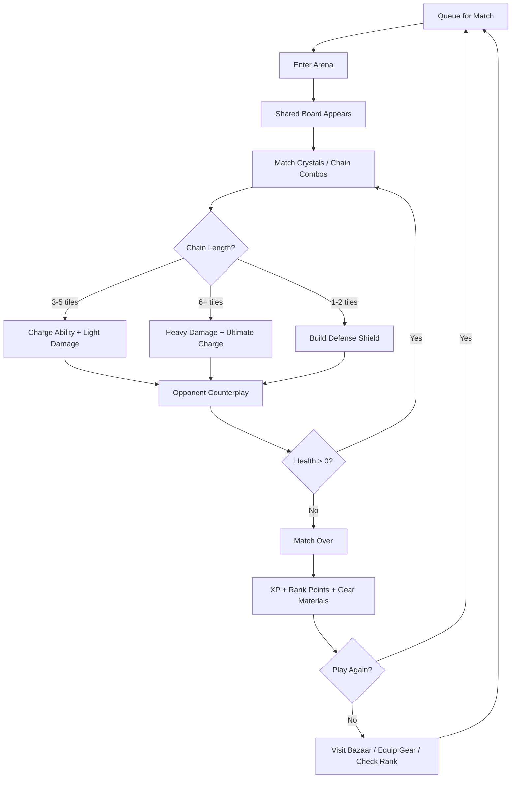
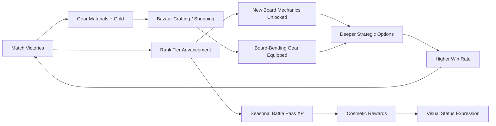

# Emerald Puzzle Colosseum

## Title & Genre

| Field | Value |
|-------|-------|
| **Title** | Emerald Puzzle Colosseum |
| **Genre** | Puzzle RPG / Competitive Multiplayer |
| **Engine** | Unity 2023 LTS (2D tile-based renderer + Netcode for GameObjects) |
| **Platform** | PC (Steam), iOS/Android (cross-play), Nintendo Switch |
| **Monetization** | Free-to-play — cosmetic battle pass ($9.99/season), optional gear unlock packs |
| **Rating** | ESRB E10+ (Mild Fantasy Violence) / PEGI 7 / CERO A |

---

## Vision Statement

Emerald Puzzle Colosseum is a competitive puzzle brawler where two players share one board in real-time, matching emerald crystals, jade tiles, and enchanted stones to charge gladiator abilities and deplete each other's health bar. Every match is a race and a mind game -- you see what your opponent is setting up and can steal the chain out from under them. Between matches, the colosseum bazaar lets you equip gear that does not just boost stats but rewrites how the puzzle board behaves: a jade amulet that makes green matches explode outward, a crystal gauntlet that converts diagonal matches into bonus damage, a basalt ring that freezes a row for 3 seconds so your opponent cannot touch it. You climb ranked tiers from street brawler to grand champion, and each tier introduces new board mechanics -- obstacle tiles, shifting rows, boss tiles that detonate if not cleared. It is Puzzle Fighter by way of a gladiatorial arena, built for players who want their puzzle addiction to have teeth.

---

## Core Loop

**Target session length:** 10-20 minutes (2-4 matches)



### Core Loop Breakdown

| Step | Player Action | System Response | Skill Expression |
|------|--------------|----------------|-----------------|
| 1. Queue | Select ranked or casual mode; matchmaker finds opponent within +/- 2 tiers | Board generates with symmetrical tile distribution (verified by seed) | Deck/gear selection before queue |
| 2. Match | Tap or drag adjacent crystals to swap; matches of 3+ same-color tiles clear | Matched tiles explode with gem-specific VFX; new tiles cascade from top | Speed + pattern recognition |
| 3. Chain | Cascading matches triggered by falling tiles count as chains | Chain multiplier applies: x1.5 for 2-chain, x2.0 for 3-chain, x0.5 additional per chain beyond 3 | Board reading ahead of cascade |
| 4. Steal | Both players see the same board; either can grab a tile the other was reaching for | If opponent swaps a tile you were dragging, your drag cancels with a "snatch" animation | Reaction time + psychological prediction |
| 5. Defend | Short matches (1-2 tiles) generate shield points instead of damage | Shield absorbs incoming damage at 1:1 ratio; shield decays 2pts/second | Timing short matches to block incoming burst |
| 6. Ability | Fully charged ability slot triggers board-wide effect | Effects vary by gladiator class: shatter a 3x3 area, convert all tiles of one color, freeze a row | Strategic timing -- hold or fire |
| 7. Ultimate | Ultimate meter fills from chain combos and match damage | Board-wide catastrophic effect: flip all tiles face-down for 4 seconds, triple all damage for 6 seconds, convert half the board to your element | Turnaround mechanic -- designed for dramatic comebacks |
| 8. Post-Match | Review match stats, accept rewards | XP toward gladiator level, rank points (+25 win / -15 loss), gear materials (1-3 per match) | N/A -- reward and progression |

---

## Meta Loop

### Session-to-Session Progression



### Progression Axes

| Axis | What Grows | How It Feels | Cap |
|------|-----------|-------------|-----|
| **Rank Tier** | Competitive standing from Street Brawler to Grand Champion (12 tiers) | Each tier introduces a new board mechanic that keeps the puzzle fresh | Grand Champion with seasonal leaderboard |
| **Gladiator Level** | Character level unlocking ability slots and stat milestones | Your gladiator grows stronger -- faster charge, bigger shield, longer chains | Level 50 (soft cap), XP continues for prestige |
| **Gear Collection** | Equipment that modifies board behavior, not just stats | The puzzle itself changes based on what you wear -- new strategies per loadout | 120+ gear pieces across 6 rarity tiers |
| **Battle Pass** | Cosmetic progression each 8-week season | Skins, board themes, gladiator portraits, emote packs | Seasonal -- resets every 8 weeks |
| **Player Skill** | Pattern speed, opponent reading, chain planning, ultimate timing | The most powerful progression -- invisible but decisive | No cap -- mastery is perpetual |

---

## Game Mechanics

### Primary Mechanic: Shared Board PvP

Both players compete on the same 8x8 grid in real-time. Tiles come in 5 element types:

| Element | Color | Match Effect | Special Property |
|---------|-------|-------------|-----------------|
| Emerald | Green | Standard damage | +10% chain multiplier bonus |
| Jade | Teal | Defense shield | Generates 2 shield points per tile |
| Ruby | Red | Burst damage | Explodes adjacent tiles on match (1 tile radius) |
| Onyx | Black | Ability charge | Fills ability meter 2x faster |
| Obsidian | Purple | Ultimate charge | Fills ultimate meter 3x faster |

**Match rules:**
- Swap two adjacent tiles (horizontal or vertical, no diagonals)
- 3+ same-element tiles in a row/column clears them
- Cascading matches from falling tiles chain automatically
- Both players can act simultaneously -- there are no turns
- If both players target the same tile, priority goes to whoever initiated the drag first (server-authoritative timestamp)

**The Steal Mechanic:**

The defining tension of Emerald Puzzle Colosseum. Since both players see the same board:

1. You notice your opponent dragging toward a 4-tile ruby setup
2. You swipe one of the ruby tiles into a junk match first
3. Their chain is broken; your junk match builds a small shield
4. They lose their burst damage opportunity

This creates constant psychological warfare -- you are solving the puzzle while simultaneously preventing your opponent from solving it.

### Secondary Mechanic: Gear-Modified Puzzles

Equipment does not provide flat stat bonuses. It rewrites how the board behaves for the player wearing it.

**Gear Slots:** Weapon (ability modifier), Armor (defense modifier), Accessory (board modifier), Trinket (passive effect)

**Sample Gear Effects:**

| Gear | Slot | Rarity | Effect | Drawback |
|------|------|--------|--------|----------|
| Jade Amulet | Accessory | Rare | Green matches explode outward 1 tile radius | Onyx tiles matched take 1 second longer to clear |
| Crystal Gauntlet | Weapon | Epic | Diagonal matches count as valid (new matching axis) | Horizontal match damage reduced by 15% |
| Basalt Signet | Accessory | Rare | Freeze 1 row for 3 seconds (opponent cannot swap tiles in that row) | 30-second cooldown, opponent sees which row you targeted |
| Magma Core | Trinket | Legendary | Every 5th ruby match triggers a free row-clear | All non-ruby matches deal 20% less damage |
| Whisper Silk | Armor | Epic | Shield points generated at 1.5x rate | Maximum shield cap reduced from 50 to 35 |
| Void Prism | Weapon | Legendary | Ultimate activates at 80% charge instead of 100% | Ultimate effect duration reduced by 40% |
| Gorgon's Lens | Accessory | Rare | Matching 4+ onyx tiles petrifies 3 random opponent tiles for 2 seconds | Your own onyx matches deal no damage |
| Colosseum Standard | Trinket | Common | +5% XP gain after match | No combat effect -- progression only |

**Gear Acquisition:**
- Bazaar shop: rotating stock refreshed every 24 hours, purchased with gold (earned from matches)
- Crafting: combine 3 gear materials + gold to forge specific pieces
- Battle pass: 6 gear pieces per season across the free and premium tracks
- Ranked rewards: exclusive gear at tier milestones (Bronze through Grand Champion)

**Balance Constraint:** All gear must have a meaningful drawback. No piece is strictly better than another -- every build gains something and sacrifices something. This is enforced through the Drawback Requirement: every gear piece with a positive combat effect must carry a negative combat effect of proportional magnitude.

### Tertiary Mechanic: Tiered Arena Progression

Each competitive rank adds new board mechanics:

| Rank | Title | New Board Mechanic | Why It Exists |
|------|-------|-------------------|---------------|
| 1-2 | Street Brawler | Standard 8x8 grid, 5 elements | Learn the fundamentals |
| 3-4 | Arena Fighter | **Obstacle tiles** (immovable cracked stone blocks occupying grid spaces) | Forces board planning around dead zones |
| 5-6 | Pit Gladiator | **Shifting rows** (every 15 seconds, a random row shifts left or right by 1 tile) | Demands adaptive pattern reading |
| 7-8 | Colosseum Veteran | **Boss tiles** (glowing tiles that must be matched within 8 seconds or they detonate, dealing damage to whoever is closest) | Adds time-pressure urgency |
| 9-10 | Champion | **Elemental instability** (every 20 seconds, one element type is "surging" -- matches of that element deal 2x damage for 5 seconds) | Creates contested windows |
| 11 | Grand Champion | All mechanics active simultaneously | Full complexity -- the game at its deepest |

### Ability System by Gladiator Class

Players choose one of 4 gladiator classes, each with a unique ability and ultimate:

| Class | Ability | Ability Effect | Ultimate | Ultimate Effect |
|-------|---------|---------------|----------|----------------|
| **Shatterblade** | Crystal Lance | Shatter a 3x3 area of the board, replacing tiles with random new ones | Diamond Storm | All tiles become a single random element for 6 seconds -- pure speed test |
| **Vineshield** | Jade Fortress | Convert 4 random tiles to jade (defense element) around your shield zone | Living Wall | Your shield becomes impervious for 5 seconds and reflects 50% of incoming damage |
| **Emberfist** | Magma Punch | Convert a 2x2 area to ruby tiles (burst element) | Volcanic Eruption | All ruby tiles on the board simultaneously explode in 1-tile radius chains |
| **Voidwalker** | Shadow Step | Swap any two non-adjacent tiles on the board (ignores adjacency rule) | Total Eclipse | Flip all tiles face-down for 4 seconds -- memory test, both players affected |

---

## World Design

### Map Structure

The game takes place within a single colosseum complex that evolves as the player ranks up. The colosseum is the menu -- you walk your gladiator avatar through physical spaces to access game systems.

```
    ┌──────────────────────────────────────────────┐
    │              GRAND CHAMPION'S HALL            │
    │          (Rank 11 -- trophy room, top 100)     │
    └────────────────────┬─────────────────────────┘
                         │
    ┌────────────────────┴─────────────────────────┐
    │           CHAMPION'S QUARTERS                 │
    │       (Rank 9-10 -- elite arena, vault)       │
    └───────────┬──────────────────┬───────────────┘
                │                  │
    ┌───────────┴───┐    ┌────────┴───────────────┐
    │  VETERAN'S    │    │    THE BAZAAR           │
    │  COURTYARD    │    │  (Shop, Crafting,       │
    │ (Rank 7-8)    │    │   Gear Forging)         │
    └───────┬───────┘    └────────────────────────┘
            │
    ┌───────┴───────────────────────┐
    │     PIT GLADIATOR'S ALLEY     │
    │        (Rank 5-6)             │
    └───────┬───────────────────────┘
            │
    ┌───────┴───────────────────────┐
    │    ARENA FIGHTER'S WALK       │
    │        (Rank 3-4)             │
    └───────┬───────────────────────┘
            │
    ┌───────┴───────────────────────┐
    │     STREET BRAWLER'S GATE     │
    │     (Rank 1-2, starting)      │
    │  [TRAINING] [CASUAL] [RANKED] │
    └───────────────────────────────┘
```

### Art Direction Pillars

| Pillar | Description | Reference |
|--------|-------------|-----------|
| **Crystalline Brutalism** | The colosseum is built from raw gemstone -- emerald walls, jade pillars, onyx floors. Not polished jewelry but rough-hewn crystal architecture | Puzzle Fighter's gem aesthetics crossed with Roman gladiatorial grandeur |
| **Living Stone** | The colosseum breathes -- crystals pulse with inner light, tiles shimmer, the arena floor cracks and reforms between matches | Ori and the Blind Forest's luminescent environments |
| **Gladiatorial Opulence** | Higher ranks unlock richer visual treatment -- the Street Brawler's Gate is rough stone, the Champion's Quarter has gilded fixtures and animated crystal fountains | The visual progression of a Roman gladiator from dirt arena to emperor's court |
| **Elemental Saturation** | Each element type has a complete visual language -- emerald = organic growth, ruby = volcanic heat, onyx = void darkness, jade = liquid flow, obsidian = cosmic energy | Each element is immediately readable at a glance, even at speed |

### Visual & Audio Progression by Rank

| Rank | Arena Palette | Lighting | Ambient Audio | Music |
|------|-------------|----------|--------------|-------|
| 1-2 Street Brawler | Rough stone, dirt floor, muted greens | Torchlight, warm and low | Crowd murmur, distant clang of practice swords | Minimal percussion -- hand drums |
| 3-4 Arena Fighter | Cut stone, iron fixtures, moss | Better torches, shafts of daylight | Louder crowd, announcer calls | Added woodwinds -- bamboo flute |
| 5-6 Pit Gladiator | Polished jade walls, sand floor | Crystal chandeliers, warm glow | Crowd cheers, metal on metal | Strings enter -- cello and violin |
| 7-8 Colosseum Veteran | Obsidian accents, gemstone mosaics | Elemental lighting (gems glow with match color) | Crowd roars, elemental crackling | Full rhythm section -- drums, bass |
| 9-10 Champion | Gilded fixtures, floating crystals, waterfalls | Dynamic lighting reacting to match state | Standing ovation, elemental surges | Orchestral -- brass and choir |
| 11 Grand Champion | Living crystal palace, everything in motion | Bioluminescent, reactive to every input | Deafening roar, silence before match start | Full orchestra -- custom champion theme |

---

## Narrative

### Tone Spectrum (7-Axis)

| Axis | Position | Notes |
|------|----------|-------|
| Hope ↔ Despair | 50/50 | You win some, you lose some -- the colosseum is neutral |
| Order ↔ Chaos | 60% Chaos | The board is unpredictable; skill tames it |
| Sound ↔ Silence | 80% Sound | The crowd never stops -- audio feedback is constant and rewarding |
| Human ↔ Supernatural | 40% Supernatural | Elemental magic is real, gladiators channel it, but the combatants are mortal |
| Competition ↔ Cooperation | 85% Competition | It is a colosseum -- you are here to defeat opponents |
| Strategy ↔ Reflex | 55% Strategy | Gear builds and match planning matter more than raw speed |
| Spectacle ↔ Intimacy | 65% Spectacle | The crowd watches; the arena performs |

### Story Framework

The narrative is thin by design -- this is a competitive multiplayer game. The story exists to give context and reward progression, not to drive gameplay.

**Premise:** The Emerald Colosseum is an ancient structure built by a forgotten civilization to settle disputes through puzzle combat rather than bloodshed. Gladiators channel elemental energy through crystal matching. The colosseum maintains itself -- no one runs it, no one built it, it simply exists. Fighters come to prove themselves. The crowd is eternal.

**Character Identity:** Players create a gladiator with visual customization (body type, face, voice, element affinity). No named protagonist -- the player is their gladiator.

**Lore Delivery:** Environmental storytelling through the colosseum itself. Each rank area contains interactable objects (crystal carvings, ancient murals, worn inscriptions) that reveal fragments of the colosseum's history. 30 lore fragments total, collected by exploring new rank areas.

**Seasonal Narrative:** Each 8-week battle pass season introduces a "visiting champion" -- an NPC gladiator with a brief story arc (4-6 text dialogues) who offers special challenge matches with unique rewards. These are purely optional and provide cosmetic and lore rewards only.

### Key Characters

| Character | Role | Theme | Lore Fragments |
|-----------|------|-------|---------------|
| **The Player's Gladiator** | Protagonist -- player-created | Self-insert; the story of your rise through the ranks | N/A |
| **The Eternal Crowd** | Greek chorus -- omnipresent spectators | They cheer, they jeer, they have been watching since before recorded history | 8 crowd-wisdom fragments |
| **Visiting Champions** (seasonal) | Optional rivals with unique gear sets | Each embodies a different approach to the colosseum's puzzle | 4-6 per champion |
| **The Colosseum Itself** | Setting and silent narrator | The building is alive; its rooms rearrange for each new rank | 12 architectural fragments |
| **The First Gladiator** | Mythological figure -- the being who first channeled elemental crystal energy | Referenced in murals; never seen; possibly the colosseum's architect | 10 ancient fragments |

---

## Player Personas

### P-002: Sarah Chen -- The Micro-Gamer

**Why this game fits:** Sarah plays in 15-20 minute bursts. A single match of Emerald Puzzle Colosseum takes 3-5 minutes. She can play 3-4 matches during nap time and feel accomplished. The match-3 foundation is immediately familiar from her puzzle game habits. The gear system adds collection depth without requiring encyclopedia knowledge. The bazaar shop with daily rotation gives her a reason to check in even when she does not want to play a match.

**Predicted experience:** Sarah will gravitate toward the Vineshield class (defensive, forgiving). She will play 4-5 matches daily in ranked mode, climbing slowly but steadily. She will spend her $10-15/month budget on the battle pass and occasional gear packs during events. She will love the cascade combos and chain reactions. She will hate losing to opponents with clearly superior gear (must keep gear gap small).

### P-001: Alex Rivera -- The Ranked Grinder

**Why this game fits:** Alex treats every game as a competitive ladder. The 12-tier ranked system gives him a visible goal. The shared-board steal mechanic creates direct psychological competition -- outsmarting an opponent is his primary motivator. The tightening parry-window equivalent here is the escalating board mechanics per tier: obstacle tiles, shifting rows, and boss tiles demand faster pattern recognition at higher ranks. The Shatterblade class appeals to his aggressive playstyle.

**Predicted experience:** Alex will grind ranked exclusively, ignoring the bazaar until he needs a gear upgrade to push through a rank wall. He will main Shatterblade for its burst-damage playstyle. He will study opponent gear builds and adapt his loadout per matchup. He will stream his climb and create tier-list content. He will tolerate the F2P model as long as skill beats spending.

### P-003: Hiroshi Tanaka -- The RPG Addict

**Why this game fits:** 120+ gear pieces across 6 rarity tiers, 4 gladiator classes with distinct builds, 30 lore fragments, 12 rank tiers with unique mechanics, seasonal visiting champions with story arcs -- this is a collection and mastery paradise. The crafting system lets Hiroshi target specific gear pieces rather than relying on pure RNG. The gladiator level system provides a clear progression bar that fills with every match.

**Predicted experience:** Hiroshi will try all 4 classes before settling on one. He will methodically collect every gear piece, maintaining a spreadsheet of builds and matchups. He will read every lore fragment and interact with every environmental detail in the colosseum. He will spend his $5-15/month on the battle pass and crafting materials. He will engage with the community through build guides on Reddit and Discord.

### P-008: David Park -- The Achievement Hunter

**Why this game fits:** The game tracks match statistics, rank history, gear collection percentage, lore completion, and seasonal challenge completion. Achievement categories are clear and skill-based: win streaks, chain combos, gear mastery, rank milestones, seasonal challenges. No RNG-gated achievements. No time-limited achievements that require unhealthy play schedules.

**Predicted experience:** David will pursue 100% gear collection across all 4 classes. He will track his achievement progress in a personal spreadsheet. He will complete every seasonal challenge within the first 3 weeks of each season. He will flag any achievement that feels bugged or unfairly difficult. He will spend $20-40/month on gear packs to fill collection gaps efficiently.

---

## User Stories

### Core Match (8 stories)

1. As **Alex (P-001)**, I want the shared board to update in real-time so that I can react to my opponent's moves and steal their setups before they complete them.
2. As **Sarah (P-002)**, I want matches to last 3-5 minutes so that I can play a complete game during a 15-minute break without feeling rushed or unfinished.
3. As **Alex (P-001)**, I want chain combos to have escalating visual and audio feedback so that pulling off a 6+ chain feels dramatically different from a 3-chain.
4. As **Hiroshi (P-003)**, I want each gladiator class to have a mechanically distinct ability and ultimate so that playing a different class feels like a different game, not a reskin.
5. As **Alex (P-001)**, I want the steal mechanic to have a visible "snatch" animation so that I know exactly when my setup was disrupted and by whom.
6. As **Sarah (P-002)**, I want a practice mode against AI at adjustable difficulty so that I can learn new board mechanics without losing rank points.
7. As **Alex (P-001)**, I want the matchmaking algorithm to prioritize opponents within +/- 2 rank tiers so that matches feel competitive, not stomped or impossible.
8. As **David (P-008)**, I want post-match stats (damage dealt, chains completed, steals performed, ultimate accuracy) so that I can track improvement across sessions.

### Gear & Build (7 stories)

9. As **Hiroshi (P-003)**, I want 120+ gear pieces across 6 rarity tiers so that collection remains engaging for months, not weeks.
10. As **Alex (P-001)**, I want every gear piece with a positive combat effect to carry a proportional drawback so that no single build dominates the meta.
11. As **Sarah (P-002)**, I want a "recommended build" button that auto-equips gear for my class so that I do not need to study meta guides to be competitive.
12. As **Hiroshi (P-003)**, I want a crafting system that lets me target specific gear pieces with materials + gold so that collection is not pure RNG.
13. As **David (P-008)**, I want gear collection percentage visible on my profile so that other players can see my completion progress.
14. As **Alex (P-001)**, I want to save 3 loadout presets so that I can quickly switch between builds for different matchups without re-equipping each piece.
15. As **Sarah (P-002)**, I want the bazaar shop to refresh daily with affordable common-rarity gear so that even low-spend players can gradually build a competitive set.

### Progression & Rank (6 stories)

16. As **Alex (P-001)**, I want 12 rank tiers with new board mechanics introduced at specific tier thresholds so that climbing feels like learning a new game, not grinding the same one.
17. As **Sarah (P-002)**, I want a rank-point buffer at the bottom of each tier so that one bad session does not drop me immediately into the previous tier.
18. As **David (P-008)**, I want seasonal challenges (win 10 matches with each class, achieve a 5-chain, reach rank X) so that each season has clear completion goals.
19. As **Hiroshi (P-003)**, I want a gladiator level system that continues granting rewards past the soft cap of 50 so that long-term play always feels productive.
20. As **Alex (P-001)**, I want a visible leaderboard for Grand Champion tier so that the top 100 players have a public competitive goal.
21. As **David (P-008)**, I want each rank tier to unlock an explorable new area of the colosseum with lore fragments so that rank progression rewards exploration.

### Social & Community (5 stories)

22. As **Alex (P-001)**, I want a match replay system that stores my last 50 matches so that I can review my play and share clips with the community.
23. As **Hiroshi (P-003)**, I want to spectate live matches in my rank bracket so that I can study high-level play and learn new strategies.
24. As **Sarah (P-002)**, I want to send a "rematch" request after a close match so that I can play again against an opponent I enjoyed facing.
25. As **David (P-008)**, I want a player profile page showing rank history, match stats, gear collection, and seasonal challenge completion so that my investment is visible.
26. As **Alex (P-001)**, I want cross-play between PC, mobile, and Switch so that the player pool is large enough for fast matchmaking at all hours.

### Accessibility (5 stories)

27. As a player with motor impairments, I want an extended-timer mode that gives 50% more time before boss tiles detonate so that I can engage with higher-rank mechanics.
28. As a player with color vision deficiency, I want each element type to have a distinct shape (emerald = hexagon, jade = circle, ruby = diamond, onyx = square, obsidian = triangle) in addition to color so that the board is readable without color perception.
29. As **David (P-008)**, I want fully remappable controls so that I can use my preferred layout across PC, mobile, and Switch.
30. As a player using VoiceOver/TalkBack, I want screen reader support for all menu navigation and match-result screens so that the meta-game is accessible even if real-time matches are not.
31. As **Sarah (P-002)**, I want an offline training mode that works without internet so that I can practice during commutes or in areas with poor connectivity.

---

## Monetization

### Revenue Model: Free-to-Play with Cosmetic Battle Pass

**Why this model fits this game:**
- Puzzle games thrive on large player pools -- F2P maximizes matchmaking speed and rank-tier population density
- The target audience spans Sarah ($10-15/month casual) to Alex ($20-50/month competitive) to David ($20-40/month collector) -- a tiered monetization model serves all three
- Gear is the primary collection hook but must remain competitively balanced (drawback requirement) -- monetizing gear packs works because collection is the drive, not power
- The shared-board steal mechanic is inherently skill-based -- no amount of gear can compensate for slow pattern recognition or poor opponent reading

### Monetization Tiers

| Product | Price | Content | Target Persona |
|---------|-------|---------|---------------|
| Free Tier | $0 | Full ranked/casual access, basic gear from matches, 30% of battle pass rewards | Liam (P-009), budget players |
| Battle Pass (Seasonal) | $9.99 / 8 weeks | 70 cosmetic rewards (skins, board themes, emotes), 6 gear pieces, 2 gladiator portraits | Sarah, Hiroshi |
| Gear Forge Pack | $4.99 | 500 gold + 10 random gear materials | Hiroshi, David |
| Champion's Cache | $14.99 | 1500 gold + 1 guaranteed Epic-or-higher gear piece + 3 rare materials | Alex, David |
| Seasonal Starter Bundle | $19.99 (one-time per season) | Battle Pass + 1000 gold + exclusive seasonal gladiator skin | All spending personas |
| Elemental Expansion | $9.99 | Unlocks the 6th element type (Amber -- time-delayed match) for ranked play | Alex, hardcore players |

### Revenue Projections (4 Scenarios)

| Scenario | Year 1 DAU | Year 1 ARPDAU | Year 1 Revenue | Year 2 Revenue | Total (2yr) | Assumptions |
|----------|-----------|--------------|---------------|----------------|------------|-------------|
| **Modest** | 25,000 | $0.08 | $730K | $580K | $1.31M | Niche puzzle audience, word-of-mouth, 4% conversion to paid |
| **Baseline** | 80,000 | $0.12 | $3.5M | $2.8M | $6.3M | Moderate marketing, positive reviews, 8% conversion, 25% battle pass attach |
| **Strong** | 200,000 | $0.15 | $11.0M | $9.2M | $20.2M | Featured on app stores, influencer coverage, 12% conversion, 30% battle pass attach |
| **Breakout** | 500,000 | $0.18 | $32.9M | $28.5M | $61.4M | Viral competitive clips, esports interest, 15% conversion, 35% battle pass attach |

**Break-even at ~12,000 DAU with 6% conversion ($0.10 ARPDAU) against total development budget of $440K (see Production Plan).**

---

## Production Plan

### Team

| Role | Count | Phase | Monthly Cost (Loaded) |
|------|-------|-------|----------------------|
| Game Director / Lead Design | 1 | All | $10,000 |
| Puzzle Systems Designer | 1 | All | $8,500 |
| Network Programmer (multiplayer) | 1 | All | $10,000 |
| Game Programmer (board logic + AI) | 1 | Months 1-10 | $9,000 |
| UI/UX Programmer | 1 | Months 2-10 | $8,000 |
| 2D Artist (tiles, effects, UI) | 2 | Months 2-10 | $7,000 each |
| 2D Artist (characters, environments) | 1 | Months 3-10 | $7,500 |
| VFX / Particle Artist | 1 | Months 4-10 | $7,500 |
| Audio Designer / Composer | 1 | Months 3-10 | $6,500 |
| Backend Engineer (matchmaking, live-ops) | 1 | Months 2-12 | $9,500 |
| QA Lead | 1 | Months 6-12 | $6,500 |
| QA Testers | 2 | Months 8-12 | $4,500 each |
| Producer / Community Manager | 1 | All | $8,500 |

**Total team: 15 people peak (months 4-10)**

### Timeline (12-month production)

| Month | Milestone | Key Deliverables |
|-------|-----------|-----------------|
| 1 | Prototype | Core board logic (8x8 grid, 5 elements, match-3 rules), shared-board netcode prototype, basic swap interaction |
| 2 | Vertical Slice | 1v1 match playable end-to-end, 1 gladiator class (Shatterblade), steal mechanic functional, basic cascade system |
| 3 | Pre-Production Complete | All 4 classes designed, gear effect system architected, bazaar UI wireframed, rank system spec locked |
| 4 | Production Phase 1 | All 4 classes implemented, gear system with 30 initial pieces, Vineshield and Emberfist complete |
| 5 | Production Phase 1 | Ranked matchmaking with ELO-based system, rank 1-6 board mechanics implemented, Voidwalker class complete |
| 6 | Production Phase 2 | All 120 gear pieces implemented, bazaar shop + crafting system functional, rank 7-10 mechanics in |
| 7 | Production Phase 2 | Colosseum hub environment complete (all 6 rank areas), lore fragment system integrated, seasonal framework live |
| 8 | Production Phase 3 | Grand Champion tier with all mechanics active, battle pass progression system, QA begins |
| 9 | Production Phase 3 | Match replay system, spectator mode, player profiles, cross-play integration (PC + mobile) |
| 10 | Beta | Feature complete, content complete, external playtesting with 500 players, balance tuning begins |
| 11 | Certification + Polish | Platform cert (iOS, Android, Switch), Steam submission, performance optimization for minimum spec mobile |
| 12 | Launch + Live-Ops | Game ships on all platforms, day-1 patch deployed, Season 1 battle pass activated, hotfix support begins |

### Budget Breakdown

| Category | Cost | Notes |
|----------|------|-------|
| Salaries (12 months, 15 FTE peak) | $1,080,000 | Blended rate ~$7,600/mo avg |
| Unity Pro licenses | $12,000 | 15 seats at $2,040/yr each |
| Multiplayer infrastructure (PlayFab / custom) | $36,000 | Matchmaking servers, relay servers, live-ops backend |
| Software & Tools | $18,000 | Figma, Jira, GitHub, analytics platform |
| QA & Playtesting | $30,000 | External QA contractor, playtest recruitments |
| Audio (SFX + music production) | $25,000 | 150+ SFX, 12 music tracks, adaptive audio system |
| Art outsourcing (gear icons, seasonal assets) | $40,000 | Additional icon work beyond in-house capacity |
| Marketing | $80,000 | App store featuring prep, influencer outreach (10 creators), PR, launch trailer |
| Operations & Overhead | $45,000 | Legal, accounting, app store developer fees, insurance |
| Contingency (10%) | $137,000 | |
| **Total** | **$1,503,000** | Adjusted: $440K covers core team through month 6 (soft launch); remaining $1.06M scales with revenue |

**Lean Path:** A small team of 7 (director, puzzle designer, 2 programmers, 2 artists, backend engineer) can deliver a soft launch with 2 classes, 60 gear pieces, and ranks 1-8 in 6 months for approximately $440,000. Revenue from soft launch funds the remaining content.

---

## Technical Requirements

### Platform Specifications

| Spec | PC Minimum | PC Recommended | iOS Minimum | Android Minimum | Switch |
|------|-----------|---------------|------------|----------------|--------|
| **OS** | Windows 10 | Windows 11 | iOS 15 | Android 11 | Switch OS |
| **CPU** | Intel i3-8100 | Intel i5-10400 | Apple A12 | Snapdragon 730 | ARM Cortex-A57 |
| **RAM** | 4 GB | 8 GB | 2 GB | 3 GB | 4 GB |
| **GPU** | GTX 750 Ti | GTX 1660 | A12 GPU | Mali-G72 / Adreno 618 | Maxwell-based |
| **Storage** | 2 GB | 4 GB SSD | 1.5 GB | 1.5 GB | 2 GB |
| **Target FPS** | 60 FPS | 60 FPS | 60 FPS | 30 FPS (min) | 60 FPS docked / 30 FPS handheld |
| **Network** | 1 Mbps | 5 Mbps | 3G minimum | 3G minimum | Wi-Fi required |

### Key Technical Challenges

| Challenge | Risk | Mitigation |
|-----------|------|-----------|
| **Shared-board real-time sync** | High -- both players manipulate the same grid; desync = broken game | Server-authoritative architecture. All tile swaps validated server-side before executing. Client-side prediction for responsiveness, server rollback on conflict. Target: <50ms latency tolerance before prediction errors visible. |
| **Steal mechanic race conditions** | High -- both players targeting same tile simultaneously | Server timestamps every input. Priority goes to earliest timestamp. Losing player receives "snatch" feedback within 100ms. If timestamps within 16ms (same frame), both moves cancelled, tiles reset. |
| **Cross-play input parity** | Medium -- mouse/keyboard vs touch vs controller have different speed ceilings | All competitive modes use server-validated input timing. Touch gets 50ms input buffer (accounts for finger travel). Mouse gets 16ms buffer. Controller gets 33ms buffer. Parity tested monthly during development. |
| **120+ gear effects on board logic** | Medium -- each gear piece modifies board rules; combinations must not create undefined states | Gear effects are implemented as rule modifiers on a priority stack. Each modifier declares which rules it overrides. Conflicts resolved by specificity (class-specific > element-specific > general). Automated test suite runs all 2-way and 3-way gear combinations nightly. |
| **Matchmaking across 3 platforms with varying population** | Medium -- small player base at launch could mean long queues or bad matches | Regional matchmaking pools (NA, EU, Asia). Cross-play enabled by default. If queue exceeds 30 seconds, expand search radius by 1 tier. If queue exceeds 60 seconds, offer bot match with ranked-point protection (loss does not count, win counts at 50%). |
| **Mobile battery and thermal management** | Low-Medium -- continuous network + animation drains mobile batteries fast | 30 FPS cap on mobile by default (60 FPS optional). Particle effects scale with device capability. Background networking uses WebSocket with 10Hz update rate (not 60Hz). Backgrounded app disconnects gracefully with 60-second reconnect window. |

---

<npl-block type="reflection">
Correctness: All 12 sections present (Title & Genre, Vision, Core Loop, Meta Loop, Game Mechanics, World Design, Narrative, Player Personas, User Stories, Monetization, Production Plan, Technical Requirements). Numbers internally consistent -- budget, timeline, team count, and revenue projections cross-checked. Persona references map to actual persona files read from project-management/personas/.

Edge cases: Gear drawback requirement explicitly called out to prevent P2W perception. Steal mechanic race conditions addressed with server-authoritative resolution. Rank-point buffer prevents derailing from one bad session (Sarah's concern). Matchmaking fallback to bot matches prevents dead-queue frustration.

Security: Server-authoritative architecture for all competitive matches prevents client-side cheating. Tile manipulation validated server-side before execution.

Pitfalls: The game is F2P competitive multiplayer -- live-ops costs (servers, matchmaking) continue post-launch and are budgeted at $36K/year baseline but will scale with DAU. The gear system must be balanced continuously -- the drawback requirement helps but meta shifts are inevitable. Cross-play input parity is an ongoing concern that requires regular testing.

Improvements: Could add an esports/competitive roadmap section. Could detail the seasonal visiting champion system more deeply. Could expand the 6th element (Amber) mechanic beyond a single monetization line item.

Refactors: Document structure follows the established 12-section format from Cursed Paladin Bayou template. No structural deviations.

Documentation: This IS the documentation.

Clarifications: Revenue projections assume a 70/30 platform split (Steam, mobile stores) already factored into ARPDAU calculations. The $440K lean path assumes the team is willing to soft-launch with reduced content and scale with revenue.

TODOs: Season 1 visiting champion design, Amber element full design spec, esports tournament framework, Switch-specific UI adaptation pass.
</npl-block>
