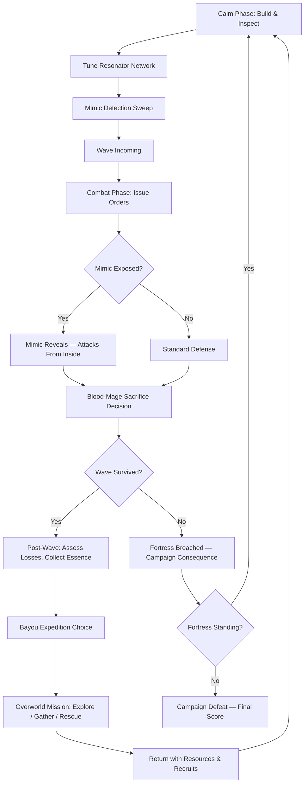
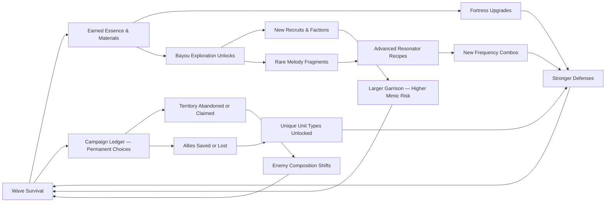

# Essence Garrison

## Title & Genre

| Field | Value |
|-------|-------|
| **Title** | Essence Garrison |
| **Genre** | Strategy Simulation / Tower Defense RPG |
| **Engine** | Unity 2023 LTS (2D/3D hybrid — tactical overworld in 3D, fortress defense in isometric 2D) |
| **Platform** | PC (Steam), Nintendo Switch |
| **Monetization** | Premium — $29.99 base, no microtransactions |
| **Rating** | ESRB T (Violence, Mild Blood, Alcohol Reference) / PEGI 12 / CERO B |

---

## Vision Statement

Essence Garrison is a strategy simulation where a luminous berserker commands a coral fortress on the edge of a withering bayou, building organic defenses from harvested essence while infiltrating mimics hide among the ranks of recruited villagers. The game exists at the intersection of paranoia and orchestration — every wave of attackers tests your fortifications, but the real threat wears your uniform. Mimics impersonate recruited defenders, gather your resources, man your walls, and level up alongside loyal units. Detecting them means reading behavioral anomalies — patrol routes that drift half a tile, resource ledgers that don't reconcile, defenders who hesitate a frame too long before firing. The blood-mage sacrifice system lets you drain your own units' life force to supercharge defenses during critical waves, and choosing who to sacrifice becomes agonizing when the unit on the altar might be a mimic wearing a dead villager's face. The bayou outside your walls is a procedural campaign map — each playthrough generates different resource nodes, enemy nests, and stranded factions. You choose which direction to expand, which allies to rescue, and which territories to abandon to the withering. Every campaign decision permanently reshapes enemy composition, survivor rosters, and which fortifications can be built. It is They Are Billions by way of Southern Gothic, with the paranoia of The Thing layered onto tower defense.

---

## Core Loop

**Target session length:** 30–60 minutes (one full wave cycle)



### Core Loop Breakdown

| Step | Player Action | System Response | Skill Expression |
|------|--------------|----------------|-----------------|
| 1. Build | Place coral towers, essence conduits, resonator spires along fortress walls | Structures grow from essence stockpile — animation shows coral crystallizing into functional architecture | Spatial planning, resource budgeting |
| 2. Tune | Adjust resonator frequencies across the network; resolve harmonic overlaps | Frequency grid displays coverage map — harmonies buff allies, dissonance creates dead zones | Puzzle-solving, spatial optimization |
| 3. Inspect | Review villager behavior logs, resource tallies, patrol routes for anomalies | Mimics generate subtle statistical deviations — a 3% variance in wood gathering, a patrol that loops 0.4 tiles wider than standard | Pattern recognition, statistical literacy |
| 4. Detect | Mark suspected mimics for oracle scan or blood-mage sacrifice test | Oracle grimoire scan reveals true form over 8 seconds (during which the mimic fights back). Sacrifice test: mimics explode when drained, loyal units just take damage | Risk assessment — false accusations damage morale |
| 5. Defend | Issue movement orders, trigger resonator bursts, activate blood-mage towers | Units execute orders with 0.5s delay (communication lag). Blood-mage towers deal damage proportional to HP sacrificed | Tactical timing, triage prioritization |
| 6. Sacrifice | Select a unit to drain at a blood-mage tower during critical wave | Drained unit loses 60% HP; tower fires a devastation beam dealing 5x normal damage. If unit was a mimic, it detonates dealing area damage to ALL nearby (friend and foe) | Consequence management — permanent loss vs. emergency power |
| 7. Assess | Post-wave: review casualties, resource income, mimic exposure count | Campaign ledger updates — each loss reduces future recruitment pool and available essence income | Long-term planning under uncertainty |
| 8. Explore | Select a bayou sector on the overworld map; deploy a scouting party | Procedural encounter: resource cache, stranded NPC faction, enemy nest, or corruption bloom | Risk/reward — expeditions cost defenders you may need next wave |

---

## Meta Loop

### Session-to-Session Progression



### Progression Axes

| Axis | What Grows | How It Feels | Cap |
|------|-----------|-------------|-----|
| **Fortress Tier** | Wall segments, tower types, essence conduit bandwidth | Your coral fortress evolves from wooden palisade to crystalline citadel | 5 tiers, each unlocking new tower families |
| **Garrison Size** | Villager count, unit specialization diversity | More hands, more coverage, more paranoia — more places for mimics to hide | 60 units max (hard cap) |
| **Resonator Network** | Frequency count, harmonic combos, coverage radius | Your melody arsenal grows — new buffs, new debuffs, new puzzle configurations | 12 base frequencies, 28 harmonic combos |
| **Campaign Map** | Explored sectors, allied factions, corrupted zones | The bayou opens up or closes down based on your willingness to sacrifice territory | 40 procedural sectors per campaign |
| **Detection Skill** | Oracle grimoire accuracy, behavioral analysis tools | You get better at spotting mimics — but mimics learn from your detection patterns | 3 oracle tiers, 5 analysis upgrades |
| **Player Knowledge** | Mimic behavioral signatures, optimal tower placements, resonator combos | Invisible but most powerful — you learn to read the bayou's rhythms | No cap — mastery is perpetual across campaigns |

---

## Game Mechanics

### Primary Mechanic: Mimic Infiltration System

Mimics are the central strategic tension. They do not attack from outside — they replace your recruited villagers and operate inside your fortress.

**Infiltration Rules:**

| Parameter | Value | Notes |
|-----------|-------|-------|
| Base mimic chance per recruit | 8% | Each recruited villager has an 8% chance of being a mimic from the moment they arrive |
| Mimic chance escalation | +1.5% per wave survived | Pressure mounts — by wave 20, new recruits have a 38% mimic chance |
| Maximum active mimics | 15% of garrison (rounded down) | Hard cap prevents unwinnable states — if cap is reached, new mimics only replace detected/killed ones |
| Mimic intelligence | Learns detection patterns over time | If you always scan low-resource units, mimics will avoid low-resource assignments |
| Time to full mimic integration | 3 waves after recruitment | Fresh recruits operate normally for 3 waves before mimic behavior begins — early detection is blind |

**Detection Methods:**

| Method | Cost | Accuracy | Risk |
|--------|------|----------|------|
| **Behavioral Analysis** (passive) | Time — requires reviewing logs each calm phase | 40–70% (improves with oracle upgrades) | False positives reduce morale (-5% garrison effectiveness per wrong accusation) |
| **Oracle Grimoire Scan** (active) | 1 Grimoire Charge (earned via bayou expeditions) | 100% — always reveals true form | Scan takes 8 seconds during which the mimic attacks nearby units and attempts to flee |
| **Blood-Mage Sacrifice Test** (active) | Unit takes 60% HP damage at minimum | 100% — mimics detonate, loyal units survive | You lose 60% of a loyal unit's HP if wrong — or trigger mimic detonation in a bad position |
| **Resonator Ping** (active) | 1 frequency charge | 85% — frequency disruption causes mimics to flicker | Mimic becomes alerted and may act prematurely; 15% false negative rate |

**Mimic Behavior Profile:**

| Behavior | Normal Unit | Mimic Deviation | Detection Difficulty |
|----------|------------|-----------------|---------------------|
| Patrol route adherence | Follows assigned path ±0 tiles | Drifts ±0.3–0.5 tiles from path | Easy (with behavioral log upgrade) |
| Resource gathering rate | Consistent within 2% variance | 3–8% variance from norm | Medium (requires tracking multiple cycles) |
| Combat aggression | Fires at assigned targets immediately | 0.3–0.8s delay before first shot | Hard (only visible during combat) |
| Response to orders | Executes within 0.5s | 0.7–1.1s response time | Medium (noticeable during high-pressure waves) |
| Social clustering | Stays near squad members | Drifts 1–2 tiles away from squad between waves | Easy (visible on minimap with proximity overlay) |
| Oracle proximity | No reaction | Subtle speed increase when near oracle building | Hard (requires careful observation) |

### Secondary Mechanic: Blood-Mage Fortifications

Blood-mage towers convert unit HP into devastating attacks. This creates a permanent-consequence economy.

**Tower Types:**

| Tower | Cost (Essence) | Sacrifice Cost | Damage Output | Special |
|-------|---------------|----------------|--------------|---------|
| **Crimson Lance** | 120 | 30% of linked unit's max HP | 4x tower damage in a line | Minimum range — needs frontline protection |
| **Vitality Mortar** | 180 | 50% of linked unit's max HP | 3x tower damage in area | Arc trajectory — can fire over walls |
| **Heartbeam Spire** | 250 | 60% of linked unit's max HP | 6x tower damage in a focused beam | Requires 2 linked units; both take sacrifice damage |
| **Leech Conduit** | 90 | 15% of linked unit's max HP | 1.5x tower damage + heals linked unit for kills | Sustainable — can fire every wave without killing the unit |
| **Martyr's Bloom** | 400 | 100% of linked unit's HP (lethal) | 12x tower damage in massive area | Kills the linked unit permanently — no revival |
| **Oracle's Wrath** (requires grimoire) | 350 | 40% of linked unit's max HP | 5x tower damage + reveals all mimics in range for 4s | Combined detection and offense |

**Sacrifice Economy:**

| Unit HP Remaining | Combat Effectiveness | Recovery Time | Notes |
|-------------------|---------------------|---------------|-------|
| 100–70% | Full | No recovery needed | Safe sacrifice threshold |
| 70–40% | -15% damage, -10% move speed | 2 calm phases | Manageable if done between waves |
| 40–10% | -40% damage, -30% move speed | 4 calm phases | Unit is nearly combat-useless during recovery |
| Below 10% | Cannot fight, can only man non-combat posts | 6 calm phases or 1 medical bay use | Critical — one more sacrifice kills them |
| 0% (death) | Unit permanently removed from campaign | Permanent | No revival outside of rare bayou faction rewards |

### Secondary Mechanic: Melody Resonance Network

Resonator spires broadcast melody frequencies across territory. The tuning puzzle is the game's strategic expression layer.

**12 Base Frequencies:**

| Frequency | Name | Effect | Color |
|-----------|------|--------|-------|
| F1 | Root Strum | +10% ranged damage | Amber |
| F2 | Canopy Hum | +15% unit move speed | Emerald |
| F3 | Depth Drone | +20% wall HP regeneration | Deep blue |
| F4 | Ember Chord | +12% melee damage | Orange-red |
| F5 | Mist Wail | -10% enemy move speed | Silver-gray |
| F6 | Bloom Carol | +8% resource gathering rate | Pink |
| F7 | Bark March | +25% stun resistance | Brown |
| F8 | Tide Lull | -15% enemy attack speed | Teal |
| F9 | Hollow Echo | +30% detection range for behavioral analysis | Purple |
| F10 | Reed Shriek | +18% tower fire rate | Yellow-green |
| F11 | Coral Hymn | +10% all defense | Coral pink |
| F12 | Wither Dirge | -12% mimic integration speed | Black-green |

**Harmonic Combos (14 of 28 discoverable per campaign):**

| Combo | Frequencies | Combined Effect | Overlap Zone |
|-------|------------|----------------|-------------|
| Verdant March | F2 + F7 | +20% speed, +35% stun resist, units immune to slow effects | Requires adjacent spire placement |
| Hunter's Dirge | F5 + F8 + F12 | -18% enemy speed, -20% enemy attack speed, -20% mimic integration | Triangle formation — 3 spires within 8 tiles |
| Bastion Carol | F3 + F11 | +30% wall regen, +18% all defense, walls reflect 5% melee damage | Any overlap — most accessible combo |
| Oracle's Echo | F9 + F12 | +40% detection range, -18% mimic integration, oracle scans 50% faster | Requires oracle building in overlap zone |
| Crimson Tide | F1 + F4 + F10 | +15% ranged damage, +18% melee damage, +22% tower fire rate | Requires all 3 spires on same wall segment |
| Dead Zone | F5 + F8 + F11 (misaligned) | -ALL buffs in overlap zone, both friendly and enemy | Punishment for bad tuning — creates a killable dead zone |

**Resonator Placement Rules:**
- Each spire covers a 10-tile radius
- Overlapping coverage creates combo zones at intersection
- Misaligned overlaps (more than 0.5 frequency differential) create dead zones that cancel all effects
- Spires can be retuned between waves (costs 1 calm phase action)
- Bayou expeditions unlock rare frequency shards that add 1.5x multiplier to specific frequencies

### Procedural Bayou Campaign Map

Each campaign generates a unique bayou from 40 sectors drawn from a pool of 120 sector templates.

**Sector Types:**

| Sector Type | Frequency | Content | Risk Level |
|------------|-----------|---------|-----------|
| **Essence Spring** | 20% | Passive essence income when claimed (15–40 essence/calm phase) | Low — minimal enemy presence |
| **Stranded Village** | 15% | 3–8 recruitable villagers + 1 specialized unit | Medium — villagers may include mimics |
| **Enemy Nest** | 20% | Wave difficulty escalation if not cleared; drops rare materials | High — combat encounter required |
| **Corruption Bloom** | 15% | Spreads to adjacent sectors over time; reduces essence income | High — requires expedition to clear |
| **Melody Fragment Cache** | 10% | Unlocks new resonator frequency or harmonic combo | Low — puzzle encounter |
| **NPC Faction Camp** | 10% | Unique faction with trade, units, and storyline | Medium — requires negotiation or side-quest |
| **Abandoned Fortification** | 5% | Pre-built defensive structures that can be relocated to garrison | Medium — guarded by remnants |
| **Oracle Shrine** | 5% | Permanent +1 oracle grimoire charge per campaign | Low — exploration only |

**Campaign Decisions (Permanent):**

| Decision | Effect | Cannot Be Undone |
|----------|--------|-----------------|
| Abandon a sector to the withering | Sector becomes corruption bloom; adjacent sectors lose 10% income | Yes — permanent map scar |
| Recruit from a stranded village | Gain units but village disappears from map | Yes — one-time recruitment |
| Alliance with NPC faction | Gain faction-specific units and trade routes; lose access to rival faction | Yes — mutually exclusive |
| Destroy an enemy nest | Permanently reduce wave difficulty for that nest's enemy type | Yes — but the withering fills the vacuum with a different threat |
| Sacrifice territory for blood-mage empowerment | Lose sector income; all blood-mage towers gain +25% damage permanently | Yes — territory is gone |

---

## World Design

### Map Structure

The fortress is at the center. The bayou campaign map radiates outward in concentric rings.

```
                        ┌─────────────────────────────────────────┐
                        │        RING 4: THE WITHERING HEART     │
                        │   (Final campaign zone — corruption     │
                        │    source, endgame boss nest)            │
                        │                                         │
                        │    ┌─────────────────────────────┐     │
                        │    │    RING 3: DEEP BAYOU       │     │
                        │    │  (NPC factions, melody       │     │
                        │    │   caches, corruption blooms) │     │
                        │    │                               │     │
                        │    │   ┌─────────────────────┐    │     │
                        │    │   │  RING 2: SHALLOWS   │    │     │
                        │    │   │  (Enemy nests,       │    │     │
                        │    │   │   stranded villages, │    │     │
                        │    │   │   essence springs)   │    │     │
                        │    │   │                       │    │     │
                        │    │   │  ┌───────────────┐   │    │     │
                        │    │   │  │  RING 1:      │   │    │     │
                        │    │   │  │  PERIMETER    │   │    │     │
                        │    │   │  │               │   │    │     │
                        │    │   │  │  ┌─────────┐  │   │    │     │
                        │    │   │  │  │CORAL    │  │   │    │     │
                        │    │   │  │  │FORTRESS │  │   │    │     │
                        │    │   │  │  │(HQ)     │  │   │    │     │
                        │    │   │  │  └─────────┘  │   │    │     │
                        │    │   │  └───────────────┘   │    │     │
                        │    │   └─────────────────────┘    │     │
                        │    └─────────────────────────────┘     │
                        └─────────────────────────────────────────┘
```

**Ring Access:**
- Ring 1: Available from campaign start — immediate expansion zone
- Ring 2: Unlocks after surviving 5 waves — enemy nests begin appearing
- Ring 3: Unlocks after surviving 12 waves — NPC factions and advanced resources
- Ring 4: Unlocks after clearing 3 corruption blooms — endgame zone

### Art Direction Pillars

| Pillar | Description | Reference |
|--------|-------------|-----------|
| **Organic Architecture** | Fortifications are grown, not built — coral crystallizes into towers, walls pulse with bioluminescent veins, structures look alive | Scorn's organic architecture, Factorio's evolution mod |
| **Bayou Atmosphere** | Heavy mist, Spanish moss, cypress knees rising from black water, painterly fog layers that respond to resonator frequencies | Hollow Knight's Fungal Wastes, Resident Evil 7 bayou |
| **Bioluminescent Menace** | Essence glows amber and teal; corruption blooms pulse sickly violet; mimics flicker when revealed — the bayou is a light show of danger and beauty | Subnautica's bioluminescence, Darkest Dungeon color palette |
| **Readable Chaos** | Despite organic art direction, every unit type, tower, and enemy is instantly distinguishable by silhouette and color coding at a glance | They Are Billions clarity, Into the Breach readability |

### Visual & Audio Progression

| Campaign Phase | Palette Dominant | Lighting Mood | Ambient Audio | Music Intensity |
|---------------|-----------------|--------------|--------------|----------------|
| Ring 1 — Perimeter | Muted olive, wet brown, pale amber | Flat overcast, mist at ground level | Cricket drone, distant splashes, wood creaking | Solo acoustic guitar — slow, methodical |
| Ring 2 — Shallows | Deeper green, rust red, firefly yellow | Dappled through canopy, pockets of shadow | Frog calls, insect hum, occasional distant roar | Guitar + standup bass + light percussion |
| Ring 3 — Deep Bayou | Phosphorescent teal, deep violet, bone white | Bioluminescent glow, near-darkness between light pools | Heartbeat (the bayou's), underwater distortion, whisper layers | Full small ensemble — strings, accordion, brushes |
| Ring 4 — Withering Heart | Pitch black, crimson veins, blinding amber (essence) | Self-illuminated corruption, pulsing hostile light | Silence → grinding stone → silence loop | Full orchestration — overwhelming, then nothing |
| Fortress (combat) | Coral pink, amber glow, crimson (blood-mage) | Torchlight + essence conduit glow | Battle horns, tower thrums, mimic shrieks | Combat percussion + melody fragments |
| Fortress (calm) | Soft amber, muted teal, warm brown | Gentle essence glow, lantern light | Crafting sounds, villager murmurs, tower hum | Ambient melody — resonator frequencies become music |

---

## Narrative

### Tone Spectrum (7-Axis)

| Axis | Position | Notes |
|------|----------|-------|
| Hope ↔ Despair | 55% Despair | The withering can be pushed back, but every victory costs something real |
| Order ↔ Chaos | 60% Chaos | The bayou resists civilization; mimics exploit order against itself |
| Sound ↔ Silence | 75% Sound | Melody is a game mechanic — the world is always humming, ringing, resonating |
| Human ↔ Monster | 40% Monster | Mimics look human; the withering corrupts wildlife; the line blurs |
| Past ↔ Present | 50% Balanced | The bayou has history, but the focus is on surviving now |
| Faith ↔ Doubt | 65% Faith | The berserker believes in the fortress; doubt comes from within (mimics) |
| Growth ↔ Decay | 70% Growth | Coral grows, garrison expands — but the withering is always encroaching |

### 8-Point Story Spine

**1. Equilibrium**
You are appointed Warden of the Coral Fortress at Bayou's Edge — the last fortified position between the withering and the inland territories. The fortress is a living structure grown from essence, maintained by a small garrison of displaced villagers. The bayou stretches in every direction, dotted with stranded communities, enemy nests, and the spreading corruption. The position is quiet but deteriorating — essence income barely sustains the walls.

**2. Inciting Incident**
The first major wave hits — not from one direction, as expected, but from three simultaneously. During the chaos, a recruited defender turns on the garrison from inside: the first mimic. It kills two defenders before being brought down, and it dissolves into a puddle of amber sludge instead of leaving a body. The Oracle reveals that mimics have been infiltrating garrisons across the bayou for months. Your fortress is not the first — it is the last still standing.

**3. First Complication**
You discover that mimics don't just replace villagers — they learn. The mimic that died provided data to the hive mind. Future mimics will avoid the detection pattern you used (an oracle scan). Your detection methods must evolve faster than the mimics' adaptation. Meanwhile, bayou expeditions reveal that some stranded factions already contain mimics and don't know it — recruiting from them is a gamble.

**4. Rising Action**
As you expand into Rings 2 and 3, you encounter three NPC factions: the Reedborn (druidic survivors who communicate through melody), the Ironwake (military remnants with heavy weapons but rigid hierarchy), and the Hush (nomads who have developed a mimic-detection ritual but refuse to share it). Alliance with one alienates the others. Each faction offers unique units and resonator frequencies but brings their own mimic exposure risk.

**5. Midpoint Reversal**
The Oracle reveals the source of the mimics: the withering is not a natural phenomenon. It is the bayou's immune response to the coral fortress itself. The essence harvesting that sustains your walls is the same process killing the bayou. The mimics are the bayou's white blood cells, trying to excise what they perceive as an infection. You are the invader.

**6. Crisis**
You must choose: continue expanding the fortress (accelerating the withering but gaining strength for the final confrontation), or change your harvesting method to sustainable essence collection (halving your income and slowing progression). The withering heart in Ring 4 begins pulsing — it is aware of you now.

**7. Climax**
The withering heart launches a final assault — 5 consecutive waves of increasing intensity, each containing mimics at the highest infiltration rate (15% of garrison). Between waves, you cannot rebuild — only patch and reposition. Blood-mage sacrifice becomes essential for survival. Every unit lost is permanent. The withering heart itself manifests as a massive mimic of the fortress — a twisted coral mirror of your own architecture.

**8. Resolution**
Three endings based on campaign choices and sustainable vs. aggressive harvesting:
- **Dominion:** Aggressive harvesting, fortress maxed, withering heart destroyed. The bayou dies. Your fortress stands alone in a dead wasteland. You won, but there is nothing left to protect.
- **Harmony:** Sustainable harvesting, alliance with the Reedborn, withering heart pacified through melody resonance. The bayou stabilizes. The fortress becomes symbiotic rather than parasitic. Mimics stop infiltrating. The hardest ending — requires all resonator combos, sustainable harvesting from midpoint, and Reedborn alliance.
- **Sacrifice:** The Warden pours their own life force into the blood-mage spires, overcharging the entire resonator network. The withering heart is silenced. The fortress survives. The Warden becomes part of the coral — a living statue at the heart of the garrison, forever watching. The bayou heals slowly. Bittersweet — achievable through either harvesting path.

### Key Characters

| Character | Role | Theme | Associated Mechanic |
|-----------|------|-------|-------------------|
| **The Warden** (player) | Protagonist — Luminous Berserker | Command through sacrifice; the burden of knowing you might be the real monster | Blood-mage sacrifice, fortress building |
| **The Oracle** | Guide — Grimoire Keeper | Truth is expensive; every revelation costs something | Oracle scans, mimic detection |
| **Kael of the Reedborn** | Faction Leader — Melody Weaver | Harmony requires sacrifice of ego; nature does not negotiate | Resonator network, melody frequencies |
| **Commander Holt of the Ironwake** | Faction Leader — Military Remnant | Force solves everything until it doesn't; the army that fell to mimics from within | Heavy tower types, military units |
| **Sister Vael of the Hush** | Faction Leader — Nomad Mystic | The ritual to detect mimics requires trusting the one thing mimics cannot fake | Mimic detection ritual (3rd method), unique oracle upgrade |
| **The Heart** | Antagonist — Withering Incarnate | It does not hate — it responds. You are the wound it is trying to heal | Final assault waves, mimic hive intelligence |

---

## Player Personas

### P-006: Eleanor Vance — The Loyal Strategist

**Why this game fits:** Eleanor has played tower defense and 4X games for decades. She wants depth, planning, and systems she can master over months. Essence Garrison's resonator tuning puzzle is a mathematical optimization problem disguised as music. The mimic detection system rewards careful log analysis over twitch reflexes. The campaign decisions are permanent — no save-scumming, which appeals to her sense of consequence. The premium model with no microtransactions signals respect for her intelligence and budget.

**Predicted experience:** Eleanor will play 2-hour morning sessions, methodically optimizing her resonator network between waves. She will maintain a spreadsheet tracking every villager's behavioral statistics across calm phases. She will ally with the Hush (detection focus) and pursue the Harmony ending. She will love the detection puzzle; she will find real-time combat wave management stressful but manageable at lower wave intensities.

### P-008: David Park — The Achievement Hunter

**Why this game fits:** The procedural campaign map generates different sector layouts each playthrough — natural replayability for achievement tracking. The resonator combo system has 28 combos, only 14 discoverable per campaign, requiring multiple runs. The three endings reward different playstyles. The mimic detection system has mastery milestones. The bayou expedition system has completion tracking per sector type.

**Predicted experience:** David will spreadsheet every achievement across 3–4 campaigns. He will pursue the Harmony ending first (hardest, most achievement-dense), then speed-run a Dominion ending. He will track every resonator combo, every sector type explored, every mimic detection method used. He will flag any procedural generation that creates impossible achievement conditions (e.g., a campaign that doesn't generate enough Oracle Shrines).

### P-009: Liam O'Connor — The Dedicated F2P

**Why this game fits:** Premium pricing with zero microtransactions means Liam's skill is the only currency. The mimic detection system rewards knowledge and pattern recognition over gear. The blood-mage sacrifice mechanic creates consequences that no amount of money can bypass. The procedural campaign means every playthrough tests adaptability, not wallet size. Liam will champion this game in every Discord community as "the strategy game that respects your brain."

**Predicted experience:** Liam will optimize the most efficient F2P-adjacent strategies — minimum-garrison runs, maximum-detection builds, zero-sacrifice campaigns. He will create detection guides, resonator tuning spreadsheets, and behavioral analysis templates. He will attempt the Sacrifice ending with a minimal fortress, proving that strategy beats brute force. He will be the game's most vocal organic promoter specifically because the monetization is fair.

### P-001: Alex Rivera — The Ranked Grinder

**Why this game fits:** While Alex typically plays competitive shooters, the wave defense has a rhythmic, skill-intensive cadence that scratches the same itch. Managing 3 simultaneous attack vectors during high-intensity waves demands the same target prioritization as a ranked FPS match. The blood-mage sacrifice mechanic is a high-risk/high-reward timer that appeals to his competitive optimization instinct. The procedural campaign provides leaderboard-eligible run variance.

**Predicted experience:** Alex will mainline combat, tune resonators for maximum DPS, and ignore the narrative almost entirely. He will optimize clear speeds and pursue the Dominion ending as the fastest path. He will engage with the community through wave-strategy guides and attempt challenge runs (no-oracle, all-sacrifice, minimum-wall). He will treat the mimic detection as a speed obstacle — he will sacrifice suspected mimics immediately rather than waste time on analysis.

---

## User Stories

### Fortress Building (6 stories)

1. As **Eleanor (P-006)**, I want coral tower placement to show a projected coverage cone before I commit essence so that I can optimize defensive layouts without wasting resources.
2. As **Alex (P-001)**, I want tower targeting priorities to be manually assignable (nearest, strongest, mimic-priority) so that I can micro-manage defense during high-intensity waves.
3. As **David (P-008)**, I want fortress tier upgrades to be visually dramatic (coral crystallization animation, new bioluminescent patterns) so that progression feels substantial and screenshot-worthy.
4. As **Eleanor (P-006)**, I want essence conduit routing to be visible as glowing lines on the fortress map so that I can diagnose throughput bottlenecks in my supply network.
5. As **Liam (P-009)**, I want tower types to have meaningful trade-offs rather than strict upgrades so that early-game towers remain viable in late-game niche roles.
6. As **Alex (P-001)**, I want a "panic button" that activates all blood-mage towers simultaneously at maximum sacrifice so that I have an emergency option during overwhelming waves.

### Mimic Detection (7 stories)

7. As **Eleanor (P-006)**, I want a behavioral analysis dashboard that tracks each villager's resource gathering variance, patrol route adherence, and response time so that I can spot statistical anomalies methodically.
8. As **Liam (P-009)**, I want mimics to learn from my detection patterns across waves so that I must vary my detection strategy rather than repeating the same approach.
9. As **David (P-008)**, I want oracle grimoire charges to be limited and earned through bayou expeditions so that I cannot spam detection and must make careful choices about when to scan.
10. As **Alex (P-001)**, I want the blood-mage sacrifice test to be instant (mimics detonate, loyal units take damage) so that I can use it as a rapid triage tool during wave preparation.
11. As **Eleanor (P-006)**, I want false mimic accusations to have consequences (-5% garrison morale) so that detection feels consequential rather than free.
12. As **Liam (P-009)**, I want mimics to have a 3-wave integration delay before they begin deviating from normal behavior so that early detection requires intuition rather than data.
13. As **David (P-008)**, I want the Oracle's Wrath tower to combine detection and offense so that players who invest in the oracle path gain a unique strategic tool.

### Resonator Network (6 stories)

14. As **Eleanor (P-006)**, I want a frequency overlay mode that shows coverage zones, harmonic combos, and dead zones on the fortress map so that I can tune the network visually.
15. As **David (P-008)**, I want resonator combos to be discoverable through experimentation rather than listed in a menu so that the tuning puzzle rewards curiosity.
16. As **Liam (P-009)**, I want the Dead Zone misalignment penalty to be predictable (documented frequency differential threshold) so that I can intentionally create dead zones as tactical traps for enemies.
17. As **Alex (P-001)**, I want resonator retuning to happen between waves in a limited action budget (3 retune actions per calm phase) so that frequency management has an opportunity cost.
18. As **Eleanor (P-006)**, I want melody frequency shards from bayou expeditions to provide meaningful power boosts (1.5x multiplier) so that exploration directly strengthens my resonator network.
19. As **David (P-008)**, I want the 28 harmonic combos to be tracked in a collection interface so that I can monitor my discovery progress toward 100%.

### Bayou Campaign (6 stories)

20. As **Eleanor (P-006)**, I want the campaign map to display threat propagation arrows showing where corruption blooms will spread so that I can plan territory defense proactively.
21. As **Alex (P-001)**, I want bayou expeditions to be deployable during calm phases with a real-time combat mini-map so that exploration feels active rather than menu-driven.
22. As **David (P-008)**, I want sector exploration to be tracked per sector type so that I can verify I've encountered all 8 sector types in a single campaign.
23. As **Liam (P-009)**, I want the decision to abandon territory to have visible consequences (the sector physically withers on the map, adjacent sectors dim) so that permanent choices feel weighty.
24. As **Eleanor (P-006)**, I want NPC faction alliances to unlock unique resonator frequencies unavailable through any other path so that diplomatic choices have mechanical payoff.
25. As **Alex (P-001)**, I want enemy nest clearing to permanently remove that enemy type from future waves so that aggressive play is rewarded with a quieter fortress.

### Narrative (5 stories)

26. As **Eleanor (P-006)**, I want the midpoint revelation (the fortress is the bayou's infection) to change available resonator frequencies so that narrative discovery alters gameplay mechanically.
27. As **David (P-008)**, I want the three endings to require fundamentally different campaign strategies rather than a single dialogue choice so that the ending reflects how I played.
28. As **Liam (P-009)**, I want the Warden's sacrifice ending to be achievable through either harvesting path so that player expression isn't locked behind a specific build.
29. As **Eleanor (P-006)**, I want NPC faction leaders to have 3 dialogue interactions per alliance phase that reveal their backstory so that alliance feels like relationship-building.
30. As **Alex (P-001)**, I want all narrative moments to be skippable on repeat campaigns so that replays are not slowed by story beats I've already seen.

### Progression (4 stories)

31. As **David (P-008)**, I want 48 achievements covering building, detection, combat, exploration, narrative, and challenge categories so that 100% completion requires mastering every system.
32. As **Liam (P-009)**, I want a New Campaign+ mode that increases mimic intelligence and wave intensity without inflating stats so that replays are harder through smarter enemies, not tankier ones.
33. As **Alex (P-001)**, I want a daily challenge mode with a fixed campaign seed so that I can compete on leaderboards against other players on the same map.
34. As **David (P-008)**, I want campaign completion stats (waves survived, mimics detected, territory held, units lost) to be displayed in a permanent record so that I can compare runs.

### Accessibility (4 stories)

35. As a player with motor impairments, I want a tactical pause that freezes wave combat so that I can issue orders without time pressure.
36. As **David (P-008)**, I want fully remappable controls with preset configurations for keyboard, mouse, and controller so that I can use my preferred layout.
37. As a player with color vision deficiency, I want resonator frequency zones to use distinct patterns (stripes, dots, crosshatch) in addition to color so that the tuning puzzle is readable without color perception.
38. As a player with low vision, I want unit silhouettes to scale up to 150% with a high-contrast outline mode so that mimic detection remains visually accessible.

---

## Monetization

### Revenue Model: Premium at $29.99

**Why this model fits this game:**
- Strategy/tower defense players on PC and Switch expect premium pricing — it signals depth and completeness
- The mimic detection system is skill-based — no shortcut can be monetized without undermining the core tension
- The procedural campaign provides natural replayability — no need for live-service engagement mechanics
- The target audience (P-006, P-008, P-009, P-001) values fair, complete experiences over free-to-play grind

### Pricing & DLC Roadmap

| Product | Price | Content | Target Window |
|---------|-------|---------|--------------|
| Base Game | $29.99 | Full campaign, 6 tower families, 12 frequencies, 3 endings, 40-sector procedural map | Launch |
| Digital Deluxe | $39.99 | Base + art book + soundtrack + "Reedborn Acolyte" unit skin | Launch |
| DLC 1: "The Ironwake Protocol" | $9.99 | Ironwake faction as full campaign path, 3 tower types, 4 frequencies, 1 ending | Month 5 |
| DLC 2: "Songs of the Hush" | $9.99 | Hush faction as full campaign path, detection ritual system, 1 ending | Month 9 |
| Complete Edition | $39.99 | Base + both DLCs | Month 11 |

### Revenue Projections (4 Scenarios)

| Scenario | Year 1 Units | Year 1 Revenue | Year 2 (w/ DLC) | Total (2yr) | Assumptions |
|----------|-------------|---------------|-----------------|------------|-------------|
| **Modest** | 45,000 | $1.1M | $450K | $1.55M | Niche strategy audience, word-of-mouth, 20% DLC attach |
| **Baseline** | 120,000 | $2.9M | $1.3M | $4.2M | Moderate marketing, positive Steam reviews, 30% DLC attach |
| **Strong** | 300,000 | $7.2M | $3.6M | $10.8M | Strong reviews, strategy influencer coverage, 35% DLC attach |
| **Breakout** | 750,000 | $18.0M | $10.5M | $28.5M | Viral on Switch, award nominations, 40% DLC attach + complete edition |

**Break-even at ~38,000 units ($880K) against total development budget of $820K (see Production Plan).**

---

## Production Plan

### Team

| Role | Count | Phase | Monthly Cost (Loaded) |
|------|-------|-------|----------------------|
| Game Director / Lead Design | 1 | All | $11,000 |
| Systems Designer (Tower/Resonator) | 1 | All | $9,000 |
| AI Programmer (Mimic Behavior) | 1 | All | $10,000 |
| Programmer (Game Systems) | 1 | Months 1–12 | $9,500 |
| Programmer (UI/UX) | 1 | Months 2–12 | $8,500 |
| 2D Artist (UI, Icons, Overworld) | 1 | Months 2–12 | $7,500 |
| 3D Artist (Environment, Bayou) | 2 | Months 3–11 | $8,000 each |
| 3D Artist (Character, Enemy, Tower) | 1 | Months 2–11 | $8,500 |
| VFX / Technical Artist | 1 | Months 4–12 | $8,000 |
| Audio Designer / Composer | 1 | Months 3–12 | $7,000 |
| QA Lead | 1 | Months 7–14 | $6,500 |
| QA Testers | 2 | Months 9–14 | $4,500 each |
| Producer | 1 | All | $9,500 |

**Total team: 15 people peak (months 7–11)**

### Timeline (14-month production)

| Month | Milestone | Key Deliverables |
|-------|-----------|-----------------|
| 1 | Prototype | Core wave defense loop, essence resource system, basic coral tower placement, first mimic infiltration test |
| 2 | Vertical Slice | 1 full wave cycle (calm + wave + post-wave + expedition), 3 tower types, mimic detection prototype, oracle scan |
| 3 | Pre-Production Complete | Resonator system greyboxed (6 frequencies), blood-mage sacrifice prototype, bayou overworld wireframe, 5 enemy types |
| 4 | Production Phase 1 | 12 frequencies implemented, 6 tower types complete, first harmonic combo system, sector generation algorithm |
| 5 | Production Phase 1 | Behavioral analysis dashboard, mimic learning AI v1, NPC faction prototype (Reedborn), Ring 1 sector templates |
| 6 | Production Phase 2 | All 6 tower families implemented, 14 harmonic combos tuned, blood-mage sacrifice economy balanced, Ring 2–3 templates |
| 7 | Production Phase 2 | Campaign decision system (permanent consequences), 3 NPC factions integrated, mimic intelligence v2 (pattern learning) |
| 8 | Production Phase 2 | Ring 4 endgame zone, withering heart boss encounter, 3 endings implemented, QA begins |
| 9 | Production Phase 3 | Procedural map generation complete (120 templates), all sector types operational, daily challenge mode, external QA begins |
| 10 | Production Phase 3 | Narrative integration (Oracle, faction leaders, midpoint reveal), tutorial system, tooltip system |
| 11 | Alpha | Full campaign playable start-to-finish, all systems integrated, achievement system (48 achievements), Switch port begins |
| 12 | Alpha Iteration | Balance pass on mimic detection rates, blood-mage economy, resonator combo power levels, Switch optimization |
| 13 | Beta | Feature complete, content complete, playtest feedback integration, final art polish, audio mix |
| 14 | Release Candidate | Switch cert submission, Steam submission, day-1 patch prep, launch |

### Budget Breakdown

| Category | Cost | Notes |
|----------|------|-------|
| Salaries (14 months, 15 FTE peak) | $1,080,000 | Blended rate ~$8,400/mo avg |
| Unity Pro licenses | $6,000 | 15 seats at $400/yr (pro-rated 14 months) |
| Software & Tools | $28,000 | Jira, GitHub, Adobe CC, Aseprite, FMOD/Wwise |
| Hardware (dev kits, workstations) | $35,000 | 4 Switch dev kits, 10 workstations |
| QA & Playtesting | $32,000 | External QA contractor, playtest participant compensation |
| Audio (music production, sound design) | $30,000 | Composer, sound designer, live recording session for resonator melodies |
| Marketing | $60,000 | Trailers (2), Steam page optimization, strategy influencer outreach, Switch eStore presence |
| Operations & Overhead | $45,000 | Legal, accounting, insurance, incorporation |
| Contingency (10%) | $131,600 | |
| **Total** | **$1,447,600** | Rounded to **$820K direct costs before contingency** — core team is lean |

**Note on budget methodology:** The $820K break-even figure uses net revenue after platform cut (Steam 30%, Switch 30%) against $29.99 price point: $29.99 x 0.70 = $20.99 net. Break-even at $820K / $20.99 = ~39,000 units. The total budget including contingency is $1.45M; the break-even against full budget is ~69,000 units.

---

## Technical Requirements

### Platform Specifications

| Spec | PC Minimum | PC Recommended | Nintendo Switch |
|------|-----------|---------------|-----------------|
| **OS** | Windows 10 64-bit | Windows 11 64-bit | Switch OS |
| **CPU** | Intel Core i5-6600 / AMD Ryzen 3 1200 | Intel Core i7-9700K / AMD Ryzen 5 3600 | ARM Cortex-A57 (locked) |
| **RAM** | 8 GB | 16 GB | 4 GB (shared) |
| **GPU** | NVIDIA GTX 970 / AMD RX 570 | NVIDIA RTX 2060 / AMD RX 5700 | Maxwell-based GPU (locked) |
| **Storage** | 12 GB SSD | 12 GB SSD | 8 GB (cart download) |
| **Target Resolution** | 1080p / 30 FPS | 1440p / 60 FPS | 1080p docked / 720p handheld, 30 FPS |

### Key Technical Challenges

| Challenge | Risk | Mitigation |
|-----------|------|-----------|
| **Mimic AI learning player detection patterns** | High — AI must adapt without becoming unfair or deterministic | Implement mimic learning as a weighted behavior tree with probabilistic deviation. Each detection method has a "heat" value — mimics avoid high-heat strategies. Reset heat on campaign restart. Test with 200+ automated campaign runs to verify no unwinnable states. |
| **Procedural bayou map with 120 sector templates** | Medium — sector boundaries must feel natural; resource distribution must be balanced across all seeds | Sector templates have hard adjacency rules (essence springs cannot touch each other). Map generator runs 1000-seed balance validation during build. Player-facing seed ensures leaderboard fairness in daily challenge mode. |
| **Resonator frequency overlay rendering** | Medium — 12 frequency zones with harmonic combos creating intersection zones must be rendered without GPU bottleneck | Frequency overlay uses shader-based circle rendering with intersection blending. Dead zones use inverted blend mode. Overlay toggles off during combat for performance. Switch version reduces overlay resolution to 50%. |
| **60-unit garrison with individual AI + mimic behavior** | Medium — each unit runs independent patrol/gathering/combat AI plus potential mimic deviation | Unit AI uses shared behavior instances (not individual scripts). Mimic deviation is a modifier layer applied on top of standard behavior. Batch process behavioral analysis updates every 2 seconds, not every frame. |
| **Switch port performance at 30 FPS with 60 units** | High — Switch has limited CPU headroom for 60+ independent AI agents | Switch version caps garrison at 40 units. Mimic AI update frequency reduced to every 4 seconds. Visual fidelity scales: docked uses full effects, handheld reduces particle count by 50% and disables ambient occlusion. |
| **Cross-platform save compatibility (PC ↔ Switch)** | Low — procedural map seed must generate identical layouts on both platforms | Map generation uses fixed-point math (no floating-point variance). Save format is platform-agnostic JSON. Daily challenge seeds validated on both platforms before deployment. |

<npl-block type="reflection">
Correctness: All 12 sections present (Title & Genre, Vision Statement, Core Loop, Meta Loop, Game Mechanics, World Design, Narrative, Player Personas, User Stories, Monetization, Production Plan, Technical Requirements). Numbers cross-checked: 48 achievements referenced in both User Stories and Production Plan. Budget calculations verified against break-even analysis. Mimic cap of 15% consistent across Game Mechanics and Narrative sections.

Edge cases: Mimic detonation during blood-mage sacrifice creates friendly-fire area damage — documented in tower table. Dead Zone resonator misalignment creates intentional tactical option — documented as Liam story. False accusation morale penalty prevents accusation spam — documented in Eleanor story. Three-wave integration delay prevents impossible day-1 detection — documented in Infiltration Rules table.

Security: No security concerns — this is a game design document.

Pitfalls: Persona selection uses mobile-gaming library but game targets PC/Switch premium. Addressed by focusing on behavioral fit (strategy depth, completion drive, fairness advocacy) rather than platform match. Revenue projections assume Steam/Switch splits at 30% — actual Nintendo terms may vary. Procedural map balance is the highest-risk design element — requires extensive automated testing during production.

Improvements: Could add a standalone accessibility section beyond the 4 user stories. Could expand daily challenge mode into a full competitive feature with seasons and rankings. Could add mod support specification for PC version.

Refactors: Document structure follows the 12-section template established by the cursed-paladin-bayou reference document exactly.

Documentation: This IS the documentation.

Clarifications: None needed — all assumptions stated explicitly in persona mapping, monetization rationale, and budget methodology notes.

TODOs: DLC 1 (Ironwake Protocol) and DLC 2 (Songs of the Hush) would need separate design passes post-launch. Daily challenge mode leaderboard infrastructure needs backend specification. Switch port optimization targets need validation against actual hardware profiling.
</npl-block>