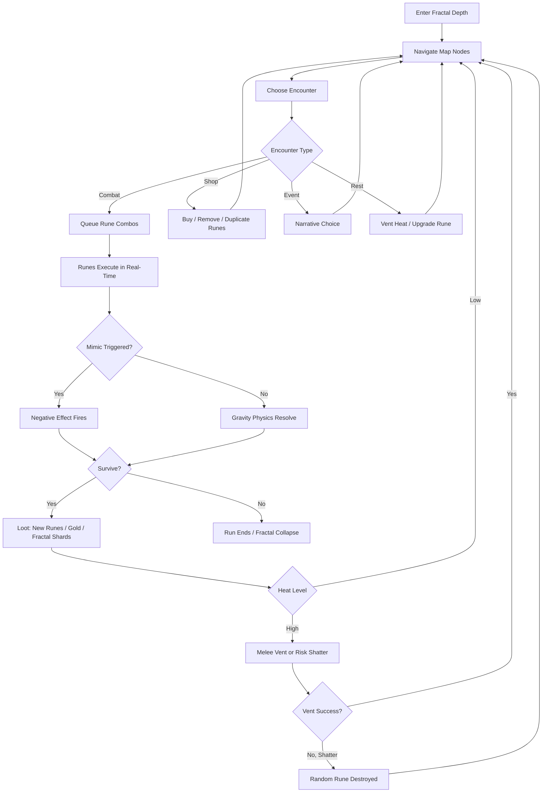
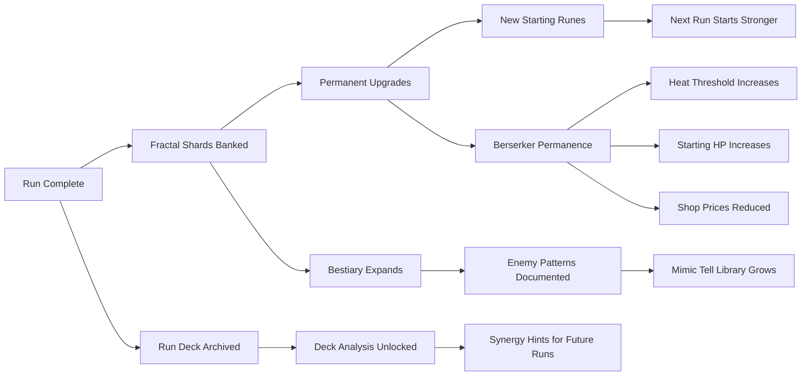

# Fractal Berserker

## Title & Genre

| Field | Value |
|-------|-------|
| **Title** | Fractal Berserker |
| **Genre** | Roguelike Deckbuilder / Action Strategy |
| **Engine** | Unity 6 (URP) — cross-platform reach, 2D card rendering pipeline, proven on mobile and Switch |
| **Platform** | PC (Steam), Nintendo Switch 2, iOS, Android |
| **Monetization** | Premium $24.99 — cosmetic rune skin DLC only, no gameplay-affecting purchases |
| **Rating** | ESRB T (Violence, Blood, Crude Humor) / PEGI 12 / CERO B |

---

## Vision Statement

Fractal Berserker is a roguelike deckbuilder where a berserker who has absorbed a fractal rift builds gravity-etched combat rune decks across runs that nest infinitely. Every map node contains a sub-map with the same structure; zoom into a swamp node and find forests, ruins, and boss encounters inside it. Zoom into those and find more. The gravity rune system makes every card a physics interaction: pull enemies together, crush them with gravity wells, scatter them into environmental hazards, push them through sub-map portals. Runs can be shallow and fast or deep and grueling, and the deeper you go the more powerful and unstable your rune combinations become. The mimic card system means not every rune is what it seems — learning to spot visual tells on fake cards is a learned skill, not an RNG check. The berserker heat gauge prevents passive play and forces a rhythm of ranged rune combos punctuated by dangerous melee venting. This is Slay the Spire by way of geometric horror, where the map itself is a monster that unfolds forever and your best tool is a deck that might be lying to you.

---

## Core Loop

**Target session length:** 20–45 minutes (shallow run) / 60–90 minutes (deep run)



### Core Loop Breakdown

| Step | Player Action | System Response | Skill Expression |
|------|--------------|----------------|-----------------|
| 1. Navigate | Select map node at current fractal depth | Map is fractal: each node contains a full sub-map. Zooming in reveals the same structure recursively. Travel between nodes costs 1 time unit. | Route planning, risk assessment (deeper = harder = better rewards) |
| 2. Choose Encounter | Pick from available node types: Combat, Elite, Shop, Event, Rest | Encounter type and difficulty scale with fractal depth and heat level | Strategic node selection |
| 3. Queue Runes | Select and order rune cards from hand (real-time with pause) | Runes execute in queued order. Gravity physics resolve between each card. Combo windows link sequential cards for bonus effects | Combo construction, gravity physics intuition |
| 4. Execute | Watch rune chain play out; adjust next queue based on results | Pull/Push/Crush/Channel runes interact with enemies, terrain, and each other. Physics-driven resolution means emergent interactions | Adaptation, reading battlefield state mid-chain |
| 5. Heat Management | Monitor berserker heat gauge (rune play generates heat) | At 70% heat: runes cost 1 extra energy. At 90%: random rune shatters each play. At 100%: all queued runes shatter simultaneously | Resource pacing, knowing when to vent |
| 6. Vent | Execute melee attacks to reduce heat (melee puts you in danger zone) | Each melee hit vents 15% heat but requires being adjacent to an enemy | Risk/reward timing, enemy positioning awareness |
| 7. Mimic Detection | Identify mimic runes by visual tells before playing them | Mimic runes trigger negative effects (copy enemy attack, drain HP, summon ambush). Tells: slightly wrong fractal pattern, off-color shimmer, irregular border thickness | Pattern recognition, visual acuity, learned knowledge across runs |
| 8. Loot | Collect new runes, gold, fractal shards from defeated enemies | Loot quality scales with depth. Deep loot includes legendary runes with gravity physics interactions unavailable at shallow depths | Build adaptation, evaluating rune synergies on the fly |

---

## Meta Loop

### Run-to-Run Progression



### Progression Axes

| Axis | What Grows | How It Feels | Cap |
|------|-----------|-------------|-----|
| **Fractal Shards** | Permanent currency earned across runs | Each run contributes to long-term power, even failed ones | 150 total upgrades |
| **Deck Mastery** | Understanding of rune synergies and gravity physics | "I discovered a combo the game didn't teach me" | No cap — emergent combos are infinite |
| **Mimic Library** | Visual tell database for identifying fake runes | "I can spot mimics before I play them" | 40 mimic variants fully documented |
| **Depth Record** | Deepest fractal level reached | "I went further than last time" | Infinite — leaderboards track top 100 |
| **Boss Knowledge** | Displacer Beast pattern recognition across encounters | "I know where it will emerge next time" | 8 Displacer Beast encounter patterns |
| **Player Skill** | Real-time rune queueing, heat management, gravity intuition | "I stopped pausing and play in real time now" | No cap — flow state mastery is perpetual |

---

## Game Mechanics

### Primary Mechanic: Gravity Rune Deck

The deck is the berserker's weapon, movement system, and utility belt. Every rune manipulates gravity in a specific way. Runes are queued in real-time with pause (spacebar pauses combat, giving unlimited time to plan the next combo; unpausing executes immediately).

**Rune Categories:**

| Category | Function | Example Runes | Heat Generated |
|----------|----------|---------------|----------------|
| **Pull** | Yank enemies toward a point | Grasp (small pull), Vortex (large pull), Singularity (point-mass pull) | 5–10% per play |
| **Push** | Scatter enemies away from a point | Shove (single target), Shockwave (radial), Repulsor (directional cone) | 5–8% per play |
| **Crush** | Create gravity wells that damage over time | Well (stationary damage zone), Implosion (instant damage + stun), Collapse (destroys terrain) | 12–18% per play |
| **Channel** | Modify the next rune's behavior | Amplify (2x effect), Fractal Split (duplicates rune into 2 weaker copies), Cascade (chains to next enemy) | 3–5% per play |
| **Move** | Reposition using gravity | Slingshot (dash to point), Orbit (circle an enemy), Bounce (ricochet between walls) | 4–6% per play |
| **Mimic** | Appears to be a powerful rune, triggers negative effect | Mirror (copies last enemy attack), Parasite (drains 15% HP), Ambush (summons 2 mimic enemies) | 0% (negative effect instead) |

**Gravity Physics Interactions:**

| Interaction | Result | Emergent Use |
|-------------|--------|-------------|
| Pull + Pull (overlapping) | Enemies cluster tighter, pull strength stacks multiplicatively | Create ultra-dense clusters for massive Crush damage |
| Pull + Crush | Crush well yanks enemies inward instead of holding position | "Gravity black hole" — enemies spiral into damage zone |
| Push + Push (opposing) | Enemies in between get launched vertically | Launch enemies into ceiling hazards or off-map |
| Channel: Amplify + any Crush | 2x damage AND 2x radius | Screen-clearing nuke, but generates 24–36% heat |
| Channel: Fractal Split + Push | Two pushes from split source, enemies ping-pong | Area denial, enemy separation for targeted kills |
| Push + sub-map portal | Enemies pushed through portal enter the sub-map at that node | Banish tough enemies to a deeper layer; they don't follow you back up |
| Pull + environmental hazard | Enemies yanked into spikes, fire, or void zones take bonus damage | Free damage from positioning alone |
| Crush + Crush (overlapping) | Damage zones merge and pulse, dealing damage in a rhythm | "Gravity beat" — timed damage that syncs with heat venting |

### Secondary Mechanic: Berserker Heat Gauge

Heat is the berserker's limiter. Every rune generates heat. Heat does not decay naturally — it must be actively vented.

| Heat Level | Visual Cue | Mechanical Effect | Strategic Implication |
|-----------|-----------|-------------------|----------------------|
| 0–30% | Cool blue runes, calm | No penalty | Safe zone — play aggressively |
| 30–50% | Warm orange glow on rune edges | No penalty yet, but visual warning | You are accumulating — plan a vent soon |
| 50–70% | Runes crackle with energy, screen edge warms | All runes cost +1 energy to queue | Economy pressure — either vent or accept higher costs |
| 70–90% | Screen pulses orange, audio distortion begins | +1 energy cost AND 20% chance each queued rune shatters on play | Dangerous — vent immediately or risk losing cards from your deck for this run |
| 90–100% | Screen shakes, berserker avatar glows, heartbeat audio | ALL queued runes shatter simultaneously. You take 10% max HP damage per shattered rune | Critical — you have failed to manage heat. Recovery requires immediate melee venting |
| Vent (melee) | Blue energy discharge from avatar | Each melee hit vents 15% heat | Places you in melee range of enemies — risky but necessary |

**Heat Venting Strategies:**

| Strategy | Risk | Reward | When to Use |
|----------|------|--------|-------------|
| Planned vent | Low — vent at 40–50% between encounters | Steady rhythm, no wasted cards | Standard play, learning the game |
| Push to 70% then vent | Medium — tight window before shatter chance | Extra rune plays before venting, maximizing combo damage | Confident play, skilled heat management |
| Redline to 90% | Very high — one mistake means full shatter | Maximum rune output in minimum time, huge damage potential | Speed runs, boss fights, experienced players |
| Melee-only vent during combat | High — must be in melee range with enemies alive | Vents while dealing damage simultaneously (melee does 3x normal damage during vent) | Advanced — weaving melee between rune queues |
| Skip vent entirely | Extreme — shatter is guaranteed | Shattered runes sometimes duplicate their effect (bug becomes feature in-universe: "fractal resonance") | Meme builds, chaos runs, Displacer Beast cheese |

### Secondary Mechanic: Mimic Rune System

Mimic runes are the deckbuilder's twist on the berserker theme. They look like real runes but trigger harmful effects when played. They exist to punish greedy deckbuilding and reward careful observation.

**Mimic Categories:**

| Mimic Type | Pretends to Be | Actual Effect | Visual Tell |
|-----------|---------------|---------------|-------------|
| Mirror Mimic | Any rare Pull/Push/Crush | Copies the last enemy attack used against you and targets yourself | Border has 6 segments instead of 8; slight pulsing irregularity |
| Parasite Mimic | Any rare Channel | Drains 15% of your max HP and heals the nearest enemy for the same amount | Rune glow is slightly green-shifted instead of gold-shifted |
| Ambush Mimic | Any legendary rune | Summons 2 mimic enemies (fractal-colored copies of existing enemies with 50% stats) | Fractal pattern on card face is mirrored (left-right) compared to real runes |
| Void Mimic | Any Move rune | Removes 2 random non-mimic runes from your deck for the rest of the run | Card corner has 3 dots instead of 4 in the decorative border |
| Spiral Mimic | Any upgraded rune | Replaces the next rune you draw with another mimic | The central rune symbol rotates clockwise; real runes rotate counter-clockwise |
| Depth Mimic | Appears only at depth 5+ | Forces a fractal descent — you drop 1 depth level immediately, enemies at current depth are replaced with depth-appropriate ones | Only appears in deep runs; no visual tell at depth 1–4, gains a faint red outline at depth 5+ |

**Mimic Tell Difficulty Scaling:**

| Depth | Tell Visibility | New Mimic Types | Rationale |
|-------|----------------|-----------------|-----------|
| 1–2 | Tells are obvious (wrong color, visible border difference) | Mirror, Parasite only | Learning phase — teaches players to look |
| 3–4 | Tells are subtle (rotation direction, dot count) | +Ambush, Void | Intermediate — requires closer inspection |
| 5–6 | Tells are very subtle (pulse frequency, shimmer timing) | +Spiral, Depth | Advanced — pattern memorization required |
| 7+ | Some mimics have no visual tell (identified by rune source: certain events always produce mimics) | All types, +tell-less variants | Expert — meta-knowledge and risk assessment |

### Secondary Mechanic: Fractal Map System

The map is the berserker's world and antagonist. It unfolds infinitely.

**Map Structure:**

| Level | Node Count | Boss Chance | Rune Quality | Heat Modifier |
|-------|-----------|-------------|-------------|---------------|
| Depth 0 (surface) | 12–15 nodes | 1 boss (end) | Common/Uncommon | +0% heat generation |
| Depth 1 | 10–12 nodes | 1 boss (end) | Uncommon/Rare | +5% heat generation |
| Depth 2 | 8–10 nodes | 1–2 bosses | Rare/Epic | +10% heat generation |
| Depth 3 | 8–10 nodes | 2 bosses | Epic/Legendary | +15% heat generation |
| Depth 4+ | 6–8 nodes | 2–3 bosses, Displacer Beast possible | Legendary+ | +20% heat generation per additional depth |

**Zooming In:** At any node with a sub-map portal, the player can choose to descend. Descending starts a new mini-map with the same structure but harder encounters and better loot. The player can ascend back up at any portal node, returning to the parent map at the same position.

**Fractal Collapse:** If the player dies at any depth, the entire run collapses from the deepest level up. A "collapse cascade" animation shows each depth folding into the next until only the surface remains, then the run ends. Run rewards (fractal shards, bestiary entries) are retained based on the deepest level reached.

**Strategic Depth Choice:**

| Strategy | Depth Target | Time Investment | Risk | Reward |
|----------|-------------|----------------|------|--------|
| Speed run | Depth 0 only, rush boss | 15–20 minutes | Low | Common/Uncommon runes, low shard yield |
| Standard run | Depth 0–2 | 30–45 minutes | Medium | Rare runes, moderate shard yield |
| Deep run | Depth 0–4 | 60–90 minutes | High | Epic/Legendary runes, high shard yield |
| Madness run | Depth 5+ | 90+ minutes | Extreme | Unique depth-only runes, top leaderboard placement |

### Recurring Boss: The Displacer Beast

The Displacer Beast is a recurring boss that appears at random depths starting from depth 2. It is the game's signature encounter and tests a different skill than normal combat.

**Displacer Beast Mechanics:**

| Phase | Behavior | Player Counter |
|-------|----------|----------------|
| Phase 1: Blink | Teleports between current depth and 1 level deeper. Attacks from the deeper layer are invisible but audible. | Listen for audio cues from the deeper layer (low-frequency rumble before attack). Pre-place gravity traps at the emergence point |
| Phase 2: Fractal Split | Splits into 2 copies, one at each depth. Both attack simultaneously. The real one takes damage; the copy does not. | The real Displacer Beast has a slight shimmer when it attacks. Identify and focus damage on the real one |
| Phase 3: Dimensional Crush | Creates a gravity well that pulls the player toward the sub-map portal, threatening to drop them 1 depth level mid-fight | Use Push runes to escape the pull. Place Crush wells between yourself and the portal to counter its gravity |
| Phase 4: Desperation | Both depth layers merge — the Displacer Beast attacks from both simultaneously in a single arena | All previous counters apply simultaneously. Maximum intensity, maximum reward |

**Displacer Beast Loot:**

| Kill Depth | Guaranteed Drop | Chance Drop | Achievement |
|-----------|----------------|-------------|-------------|
| Depth 2 | Displacer Fang (upgrade material) | 20% Displacer Rune (legendary Move: teleport to any visible node) | "First Contact" |
| Depth 3–4 | Displacer Fang + 50 fractal shards | 30% Displacer Rune | "Deeper Still" |
| Depth 5–6 | Displacer Fang + 100 fractal shards | 40% Displacer Rune + 25% Dimensional Tear (relic: once per run, prevent one fractal collapse) | "Into the Fold" |
| Depth 7+ | Displacer Fang + 200 fractal shards | 50% Displacer Rune + 40% Dimensional Tear | "Fractal Mind" |

### Difficulty Progression Table

| Depth | Enemies per Encounter | New Enemy Types | Mimic Difficulty | Heat Pressure | Boss Complexity |
|-------|----------------------|----------------|-----------------|--------------|----------------|
| 0 | 2–4 | Fractal Slimes, Gravity Wraiths, Rift Hounds | Easy tells | Baseline | 1-phase |
| 1 | 3–5 | +Gravity Knights, Void Crawlers | Easy tells | +5% | 2-phase |
| 2 | 4–6 | +Fractal Mimics (enemies), Displacer Beast | Medium tells | +10% | 2-phase + Displacer Beast possible |
| 3 | 4–7 | +Berserker Echoes, Singularity Cores | Medium tells | +15% | 3-phase, environmental hazards |
| 4 | 5–8 | +Dimensional Stalkers, Gravity Lords | Hard tells | +20% | 3-phase, dual-depth bosses |
| 5+ | 6–10 | +Depth variants of all types, tell-less mimics | Expert | +25% cumulative | 4-phase, Displacer Beast guaranteed |

---

## World Design

### Map Structure

The map is not a place — it is a mathematical object. Every node is a fractal seed that contains the entire game.

```
                         ┌─────────────────────────────┐
                         │     DEPTH 0: THE SURFACE     │
                         │  12-15 nodes, 1 surface boss  │
                         └──────────────┬──────────────┘
                                        │
                    ┌───────────────────┴───────────────────┐
                    │        ANY NODE MAY CONTAIN            │
                    │     A SUB-MAP PORTAL (DESCEND)         │
                    └───────────────────┬───────────────────┘
                                        │
                         ┌──────────────┴──────────────┐
                         │     DEPTH 1: FIRST FOLD      │
                         │  10-12 nodes, harder enemies  │
                         └──────────────┬──────────────┘
                                        │
                              ┌─────────┴─────────┐
                              │  SUB-MAP PORTALS   │
                              └─────────┬─────────┘
                                        │
                         ┌──────────────┴──────────────┐
                         │     DEPTH 2: SECOND FOLD     │
                         │  Displacer Beast possible     │
                         └──────────────┬──────────────┘
                                        │
                                       ...
                                        │
                         ┌──────────────┴──────────────┐
                         │   DEPTH N: INFINITE DESCENT  │
                         │  Difficulty uncapped.         │
                         │  Leaderboards track records.  │
                         └─────────────────────────────┘
```

**Node Types (repeating at every depth):**

| Node | Icon | Encounter | Purpose |
|------|------|-----------|---------|
| Combat | Sword | Standard enemy encounter | Primary gold and rune acquisition |
| Elite | Skull | Enhanced enemy with a rune reward | High risk, guaranteed rare+ rune |
| Boss | Crown | Depth boss or Displacer Beast | Blocks depth exit, drops upgrade materials |
| Shop | Coin | Buy, remove, or duplicate runes | Deck refinement |
| Event | Question mark | Narrative choice with mechanical consequence | Build-defining decisions, lore |
| Rest | Campfire | Vent all heat OR upgrade 1 rune | Recovery and deck tuning |
| Portal | Spiral | Descend to next fractal depth or ascend back | Strategic depth choice |
| Fractal Cache | Gem | Free rune based on current depth quality | Reward for exploration |
| Mimic Nest | Cracked card | 3 rune choices, 1 is guaranteed mimic | Skill test — identify the mimic or gamble |

### Art Direction Pillars

| Pillar | Description | Reference |
|--------|-------------|-----------|
| **Mathematical Horror** | The beauty of fractals turned sinister — Mandelbrot spirals that look like screaming faces, Sierpinski triangles made of bone | Returnal's biomes, Control's geometry shifts |
| **Gravitational Brutality** | Gravity as visible force — warped light around crush wells, stretched enemies being pulled, compressed enemies in gravity fields | Gravity Rush meets Inscryption's visual punch |
| **Berserker Warmth** | The berserker radiates heat like a forge — the deeper they go, the more the avatar glows, cracks, and emits light | Doom Eternal's Praetor suit energy, Hades' combat radiance |
| **Depth Desaturation** | Surface is colorful. Each depth strips color. Depth 5+ is nearly monochrome with only gravity effects and heat providing color | Hyper Light Drifter palette reduction by area |

### Visual & Audio Progression

| Depth | Palette Dominant | Lighting Mood | Ambient Audio | Music Intensity |
|-------|-----------------|--------------|--------------|----------------|
| 0 — Surface | Warm amber, deep teal, earth brown | Bright, directional, sun-through-cracks | Wind, distant rumble, stone grinding | Acoustic guitar, hand drums |
| 1 — First Fold | Muted amber, gray-blue, iron | Diffuse, no clear source | Echoing drips, low-frequency hum | Guitar goes electric, synth bass enters |
| 2 — Second Fold | Slate gray, deep violet, ember orange | Flickering, gravity-distorted shadows | Resonant frequency drones, heartbeat | Industrial percussion layered in |
| 3 — Third Fold | Near-monochrome, red accents only | Gravity wells provide only light source | Deep sub-bass, metal scraping | Full electronic, no organic instruments |
| 4 — Fourth Fold | Black and white, fractal patterns shimmer | Self-illuminated (berserker is the light) | Pure tones, mathematical intervals | Ambient wall-of-sound, rhythmic but atonal |
| 5+ — Infinite | White on black, only heat and gravity have color | Stroboscopic, reality destabilizing | White noise modulated by depth, enemy audio only | Glitch textures, fractured melody fragments |

---

## Narrative

### Tone Spectrum (7-Axis)

| Axis | Position | Notes |
|------|----------|-------|
| Hope vs Despair | 60% Despair | Each descent is a choice; you can always go back. But you won't. |
| Order vs Chaos | 75% Chaos | The fractal is entropy given geometry. Nothing repeats exactly. |
| Mind vs Body | 50% Split | Heat is physical (body), runes are mental (strategy), mimic detection is both |
| Sound vs Silence | 65% Sound | Gravity has sound. Depth has sound. Silence means something is wrong. |
| Human vs Monster | 70% Monster | The berserker was human once. The rift absorbed that. You are both now. |
| Logic vs Madness | 55% Logic | The systems are consistent. The fractal follows rules. The madness is going deeper anyway. |
| Control vs Surrender | 60% Control | You chose to descend. You choose when to vent. You choose your deck. The map just unfolds. |

### 8-Point Story Spine

**1. Equilibrium**
The berserker — known only as "the Conduit" — was a warrior who fought in the Geometric Wars, a conflict between civilizations that weaponized mathematical constants. The Conduit was a grunt who survived a Singularity Bomb by absorbing its fractal energy into their own body. They now live on the surface of a world scarred by the war, selling their services as a rift-closer: they enter fractal tears left by the war and collapse them from within, preventing reality from unraveling further.

**2. Inciting Incident**
A massive new rift opens — the deepest ever recorded. The Conduit enters it and discovers it is not a natural fracture. Someone is opening these rifts deliberately, using the energy to build something at impossible depths. The first Displacer Beast attacks, proving the rift's creator has learned to weaponize the fractal geometry itself.

**3. First Complication**
Descending through the rift, the Conduit encounters the remnants of previous rift-closers who went mad. They left behind rune inscriptions that became the gravity runes the Conduit now uses. Each dead closer's deck is a cautionary tale: one went too deep and became a gravity wraith, another's deck was overrun with mimics she couldn't identify, a third's heat management failed and he shattered every rune including the ones keeping him alive.

**4. Rising Action**
The Conduit discovers the rifts are being opened by the Geometer — the last surviving mathematician of the enemy civilization, who has been trapped at infinite depth since the war ended. The Geometer is not trying to escape; they are trying to build a new universe inside the fractal, one mathematical constant at a time. Each rift they open is a construction site. The Displacer Beasts are their guard dogs.

**5. Midpoint Reversal**
The Conduit reaches a depth where the dead rift-closers are still alive — or rather, still existing. The fractal has preserved them as recursive echoes. They reveal that the Conduit's absorption of the Singularity Bomb was not survival. It was recruitment. The Geometer designed the bomb to create a being capable of descending to infinite depth — someone who carries the fractal inside their own body can survive the descent. The Conduit was made for this.

**6. Crisis**
The Conduit must choose: close the rift and seal the Geometer inside forever (preventing the new universe but preserving reality), or descend further and confront the Geometer directly (risking their own sanity but potentially understanding why someone would build a universe inside a wound in reality). The heat gauge has become a metaphor — the deeper you go, the harder it is to stay yourself.

**7. Climax**
At maximum depth, the Conduit faces the Geometer in a 4-phase boss fight that uses every system simultaneously: gravity physics, mimic detection, heat management, and fractal depth manipulation. The arena itself is a fractal that folds and unfolds during the fight, changing geometry between phases. The Displacer Beast returns as the Geometer's final guardian.

**8. Resolution**
Three endings based on depth reached and choices made:
- **Seal:** The Conduit closes the rift from the inside, trapping themselves and the Geometer in eternal collapse. The surface is saved. The Conduit becomes another recursive echo. Future rift-closers will find their deck.
- **Understand:** The Conduit reaches the Geometer's core and sees the universe being built — it is beautiful, mathematically perfect, and empty. The Geometer has been building a home no one can live in because everyone who enters goes mad. The Conduit shows them how to stabilize the fractal using the gravity rune system. The rift becomes a doorway, not a wound.
- **Transcend:** The Conduit does not fight the Geometer. Instead, they descend past the construction site into the raw fractal below it. They reach a depth no entity has ever reached and discover the fractal is not a wound — it is the universe's natural state, and "reality" is the anomaly. The Conduit stops being a berserker and becomes a geometry. This ending requires depth 10+ clear, all mimic types identified, and zero heat shatters during the Geometer fight.

### Key Characters

| Character | Role | Theme | Lore Fragments |
|-----------|------|-------|---------------|
| **The Conduit** | Protagonist — Fractal Berserker | A weapon that chose to be a tool; the person inside the math | N/A (player character) |
| **The Geometer** | Antagonist — Last mathematician | Creation as compulsion; building a home you can never live in | 15 theorem fragments |
| **The Echo of Vera** | Guide — Dead rift-closer, preserved as recursive echo | The cost of going too deep; wisdom from madness | 12 deck analyses (rune tutorials disguised as lore) |
| **The Displacer Beast** | Recurring boss — Geometer's guardian | What happens when geometry becomes predatory | 8 encounter patterns, each revealing 1 Geometer theorem |
| **Marshal Kael** | Quest giver — Surface military liaison | Duty vs. understanding; following orders into the infinite | 6 mission briefings |
| **The Fractal Itself** | True setting — The wound in reality | The universe beneath the universe; what exists when rules stop applying | 20 resonance nodes (environmental lore, no text — purely visual/audio) |

---

## Player Personas

### P-003: Hiroshi Tanaka — The RPG Addict

**Why this game fits:** Hiroshi craves system depth and completion. The gravity rune deck has genuine emergent synergy — no two runs play the same. The mimic library (40 variants to document) and bestiary provide completion goals. The infinite fractal depth means there is always a deeper run to attempt. The three endings reward multiple playthroughs with different deck archetypes.

**Predicted experience:** Hiroshi will theorycraft optimal deck synergies on Discord, create a spreadsheet of all mimic visual tells, and pursue the Transcend ending on his first playthrough. He will spend 3+ hours per session on deep runs. He will be frustrated by mimic runes at first and then deeply satisfied once he can identify them reliably. He will love the rune combo depth; he will find surface-level runs too easy and skip them after the first few clears.

### P-009: Liam O'Connor — The Dedicated F2P

**Why this game fits:** Premium model with cosmetic-only DLC means zero pay-to-win. The heat management system rewards skill over collection. Mimic detection is a learned skill, not a purchasable advantage. The Displacer Beast boss can be beaten with a basic deck if the player has superior timing and gravity intuition. Liam's anti-P2P advocacy aligns perfectly with this monetization model.

**Predicted experience:** Liam will champion the game in every community specifically because of the fair pricing. He will create Displacer Beast kill guides, mimic identification charts, and depth-10 challenge run videos. He will attempt speedruns with starter decks to prove skill matters more than unlock progression. He will be the game's most vocal organic marketer.

### P-001: Alex Rivera — The Ranked Grinder

**Why this game fits:** The depth leaderboard is a competitive ladder. The real-time rune queueing system rewards mechanical skill and quick decision-making. The Displacer Beast is a skill-check boss that separates good players from great ones. The heat management system creates a high-skill ceiling where Alex can optimize run efficiency. The competitive scene around "deepest run" and "fastest depth-5 clear" gives him a ranking to chase.

**Predicted experience:** Alex will grind depth leaderboards, optimize for speed over loot, and push for real-time play without pausing. He will treat the heat gauge as a DPS optimization problem. He will share his runs on Twitch and build a following around challenge runs. He will love the Displacer Beast fights; he will skip all narrative content.

### P-008: David Park — The Achievement Hunter

**Why this game fits:** The game tracks depth records, mimic identification rates, boss kill counts, rune collections, and completion statistics. The Transcend ending requires near-perfect play. Every depth tier has its own achievement set. The bestiary and mimic library provide clear completion tracking. No RNG-gated achievements — everything is skill-based.

**Predicted experience:** David will methodically work through all achievements across 4–6 weeks of daily play. He will track mimic identification accuracy in a spreadsheet. He will pursue the Transcend ending last, as his capstone achievement. He will appreciate that all achievements are skill-based and testable. He will flag any bugged achievement counters immediately.

---

## User Stories

### Exploration (8 stories)

1. As **Hiroshi (P-003)**, I want fractal map nodes to visually preview their sub-map content before I descend so that I can make informed decisions about whether to go deeper.
2. As **Alex (P-001)**, I want a depth counter and estimated difficulty indicator visible at all times so that I can optimize my risk/reward calculations during speed runs.
3. As **David (P-008)**, I want every node type to have a completion tracker (shops visited, events resolved, caches opened) so that I can track 100% run completion.
4. As **Hiroshi (P-003)**, I want fractal cache nodes to contain depth-unique runes that cannot be found at any other depth so that thorough exploration at every level is rewarded.
5. As **Liam (P-009)**, I want environmental hazards (gravity wells, unstable terrain, void zones) that enemies are also vulnerable to so that clever positioning is rewarded over raw deck power.
6. As **Alex (P-001)**, I want a minimap that shows visited nodes, unexplored connections, and boss locations at the current depth so that route planning is efficient.
7. As **David (P-008)**, I want a bestiary that fills as I encounter enemies with stats, behaviors, and depth ranges so that I can track completion percentage across all enemy types.
8. As **Hiroshi (P-003)**, I want the recursive echo NPCs to provide lore through dialogue that teaches game mechanics (disguised as story) so that narrative and gameplay reinforce each other.

### Core Mechanics (8 stories)

9. As **Alex (P-001)**, I want the gravity physics system to be deterministic (same inputs produce same results) so that I can optimize combos precisely and reproduce strategies.
10. As **Liam (P-009)**, I want the real-time-with-pause system to allow unlimited planning time when paused but reward unpaused play with a "flow bonus" (5% extra loot) so that skill expression is incentivized.
11. As **Hiroshi (P-003)**, I want rune upgrade paths at rest sites to offer 3 distinct choices per rune (not a single linear upgrade) so that deck customization has meaningful branching.
12. As **David (P-008)**, I want the mimic library to track which mimic types I have successfully identified and which I have fallen for so that I can track my visual recognition progress.
13. As **Alex (P-001)**, I want the Displacer Beast's audio cues to be spatial and directional so that I can pinpoint its emergence location using headphones alone.
14. As **Liam (P-009)**, I want the heat gauge to be visible on the berserker avatar's body (not just a HUD bar) so that the UI is diegetic and information is always readable.
15. As **Hiroshi (P-003)**, I want gravity physics interactions between runes to be documented in a codex that updates as I discover them so that mastery has a tangible record.
16. As **Alex (P-001)**, I want melee venting to have a parry window (0.3s before enemy attack lands) that vents double heat if timed correctly so that venting is a skill expression, not a chore.

### Narrative (5 stories)

17. As **Hiroshi (P-003)**, I want the dead rift-closers' preserved decks to tell their story through rune composition (e.g., a heat-heavy deck tells the story of someone who burned out) so that narrative is embedded in mechanics.
18. As **David (P-008)**, I want the Geometer's theorem fragments to be missable but trackable on the map so that completion requires attention but not impossible diligence.
19. As **Hiroshi (P-003)**, I want the Echo of Vera's deck analyses to foreshadow upcoming enemy types so that attentive players gain tactical advantage from reading lore.
20. As **Alex (P-001)**, I want all dialogue and narrative sequences to be skippable after first viewing so that replays and challenge runs are not bogged down by story.
21. As **Hiroshi (P-003)**, I want the three endings to be tied to gameplay behavior (depth reached, mimics identified, heat shatters) rather than dialogue choices so that the ending reflects how I played.

### Progression (6 stories)

22. As **David (P-008)**, I want 48 achievements covering combat (boss kills, combo chains), exploration (depth records, cache completion), lore (theorem fragments, echo encounters), and challenge (no-hit bosses, speed runs) so that 100% completion is multi-faceted.
23. As **Hiroshi (P-003)**, I want permanent upgrades via fractal shards to affect starting conditions (extra energy, better starting runes, shop discounts) rather than in-run power so that each run remains a roguelike test.
24. As **Alex (P-001)**, I want a daily challenge mode with a fixed seed, fixed deck, and global leaderboard so that I have a competitive reason to return every day.
25. As **Liam (P-009)**, I want a New Game+ mode that introduces 10 new mimic types, remixes enemy placements, and upgrades Displacer Beast AI so that replays feel fresh.
26. As **David (P-008)**, I want a "Deck Museum" that archives every completed run's deck with stats (turns taken, heat managed, mimics identified, depth reached) so that I can review my history.
27. As **Hiroshi (P-003)**, I want the Transcend ending to require identifying all mimic types without error so that the true ending rewards the most knowledgeable players.

### Accessibility (4 stories)

28. As a player with motor impairments, I want an assist mode that extends rune queue time (pause stays active longer) and reduces heat generation by 50% so that the core deckbuilding experience is accessible without being trivialized.
29. As **David (P-008)**, I want full remappable controls across all platforms (keyboard, controller, touch) so that my preferred layout is supported regardless of input device.
30. As **Hiroshi (P-003)**, I want Displacer Beast audio cues to have a visual equivalent (screen-edge indicator for directional attacks) so that deaf and hard-of-hearing players can counter the boss.
31. As a player with color vision deficiency, I want heat gauge states to use shape and animation (not just color) to communicate danger level so that heat management is readable without color perception.

### Social & Community (4 stories)

32. As **Liam (P-009)**, I want to share deck builds via a copyable code string so that I can post builds on Discord and community members can try them instantly.
33. As **Alex (P-001)**, I want a replay system that records run inputs and lets me export key fights as video so that I can share Displacer Beast kills and combo chains with the community.
34. As **Liam (P-009)**, I want no gameplay-affecting microtransactions whatsoever so that I can champion the game as a fair, skill-only experience in every community I am part of.
35. As **David (P-008)**, I want my depth record and achievement progress to be visible on a player profile so that other players can see my completion status.

---

## Monetization

### Revenue Model: Premium at $24.99

**Why this model fits this game:**
- Roguelike deckbuilder players expect premium pricing — Slay the Spire ($24.99), Monster Train ($24.99), Inscryption ($19.99) set the precedent
- The heat management and mimic detection systems are skill-based — no monetizable shortcut exists without breaking the core loop
- The target audience (P-001, P-003, P-008, P-009) values fair, complete experiences over free-to-play energy systems
- Fractal depth is infinite — no content can be gated behind a paywall without betraying the core premise
- Cosmetic rune skins allow player expression without affecting gameplay balance

### Pricing & DLC Roadmap

| Product | Price | Content | Target Window |
|---------|-------|---------|--------------|
| Base Game | $24.99 | Full roguelike, infinite depth, 6 rune categories, 40+ rune types, 40 mimic variants, 3 endings | Launch |
| Cosmetic Pack 1: "Geometric Elegance" | $4.99 | 12 alternate rune skins (geometric art style), 3 berserker avatar skins | Launch +2 weeks |
| Cosmetic Pack 2: "War Remnants" | $4.99 | 12 alternate rune skins (military stencil style), 3 berserker avatar skins | Launch +6 weeks |
| Expansion: "The Geometer's Workshop" | $12.99 | 2 new rune categories, 20 new rune types, 15 new mimic variants, new boss, new ending | Month 6 |
| Expansion: "The Last Closer" | $12.99 | Prequel campaign (play as Vera), unique deck archetype, new fractal map style | Month 12 |
| Complete Edition | $34.99 | Base + both expansions | Month 14 |

### Revenue Projections (4 Scenarios)

| Scenario | Year 1 Units | Year 1 Revenue | Year 2 (w/ DLC) | Total (2yr) | Assumptions |
|----------|-------------|---------------|-----------------|------------|-------------|
| **Modest** | 40,000 | $960K | $380K | $1.34M | Niche roguelike audience, word-of-mouth only, 10% cosmetic attach, 15% expansion attach |
| **Baseline** | 120,000 | $2.88M | $1.15M | $4.03M | Moderate marketing, positive Steam reviews (>85%), 15% cosmetic attach, 25% expansion attach |
| **Strong** | 350,000 | $8.40M | $3.50M | $11.90M | Strong reviews, streamer coverage, 20% cosmetic attach, 30% expansion attach |
| **Breakout** | 900,000 | $21.60M | $10.80M | $32.40M | Viral (Slay the Spire trajectory), award nominations, 25% cosmetic attach, 35% expansion attach |

**Break-even at ~38,000 units ($920K) against total development budget of $880K (see Production Plan).**

**Platform Revenue Share Assumptions:**
- Steam: 70% net after Valve's 30% cut
- Nintendo Switch 2: 70% net after Nintendo's 30% cut
- iOS/Android: 70% net after Apple/Google 30% cut (direct sale, no IAP)

**Revenue projections above use gross revenue. Net revenue at baseline: ~$2.02M Year 1, ~$805K Year 2, ~$2.82M 2-year net.**

---

## Production Plan

### Team

| Role | Count | Phase | Monthly Cost (Loaded) |
|------|-------|-------|----------------------|
| Game Director / Lead Design | 1 | All | $11,000 |
| Systems Designer (Deck/Runes) | 1 | All | $9,000 |
| Level Designer (Fractal Maps) | 1 | Months 2–12 | $8,000 |
| Narrative Designer | 1 | Months 1–8 | $8,500 |
| Programmers (Gameplay + Physics) | 2 | All | $9,500 each |
| Programmer (UI + Platforms) | 1 | Months 2–14 | $9,000 |
| Programmer (Mobile Optimization) | 1 | Months 6–14 | $8,500 |
| 2D Artist (Runes + UI) | 2 | Months 2–12 | $7,000 each |
| 2D Artist (Environments + Effects) | 1 | Months 3–12 | $7,500 |
| VFX Artist (Gravity Effects) | 1 | Months 4–12 | $7,500 |
| Audio Designer / Composer | 1 | Months 3–14 | $7,000 |
| QA Lead | 1 | Months 8–14 | $6,500 |
| QA Testers | 2 | Months 10–14 | $4,500 each |
| Producer | 1 | All | $9,500 |

**Total team: 17 people peak (months 6–10)**

### Timeline (14-month production)

| Month | Milestone | Key Deliverables |
|-------|-----------|-----------------|
| 1 | Prototype | Core rune queue system, gravity physics prototype, heat gauge, basic pull/push/crush runes |
| 2 | Vertical Slice | Surface depth playable end-to-end, 1 boss, 15 rune types, mimic system prototype |
| 3 | Pre-Production Complete | Fractal map generator finalized, rune roster locked (40+ types), mimic roster locked (40 variants), design doc locked |
| 4 | Production Phase 1 | Depth 0–2 fully playable, 25 rune types implemented, 15 mimic variants implemented, shop system complete |
| 5 | Production Phase 1 | Gravity physics interactions documented and tested, rest site upgrade system complete, 30 rune types implemented |
| 6 | Production Phase 2 | Depth 3–4 playable, Displacer Beast boss phases 1–2 implemented, mobile optimization begins |
| 7 | Production Phase 2 | All 40+ rune types implemented, all 40 mimic variants implemented, Displacer Beast phases 3–4 complete |
| 8 | Production Phase 2 | Full depth progression (0–5+) playable, all enemy types in-engine, QA begins |
| 9 | Production Phase 3 | Geometer boss fight (4 phases), narrative events complete, lore fragments integrated |
| 10 | Production Phase 3 | Three endings implemented, daily challenge mode, deck sharing system, achievement system |
| 11 | Alpha | Full game playable, all platforms building (PC, Switch 2, iOS, Android), internal testing |
| 12 | Alpha Iteration | Bug fixes, difficulty tuning from playtests, performance optimization, mobile touch controls polished |
| 13 | Beta | Feature complete, content complete, external playtesting, platform cert submission |
| 14 | Launch | Game ships on all platforms, day-1 patch deployed, hotfix support, cosmetic DLC 1 prep |

### Budget Breakdown

| Category | Cost | Notes |
|----------|------|-------|
| Salaries (14 months, 17 FTE peak) | $1,064,000 | Blended rate ~$8,300/mo avg |
| Unity 6 licenses | $0 (revenue share after $200K) | 2.5% revenue share after threshold |
| Software & Tools | $28,000 | GitHub, Jira, Adobe CC, FMOD/Wwise |
| Hardware (dev kits, devices) | $35,000 | Switch 2 dev kit, iOS/Android test devices (8), workstations |
| QA & Playtesting | $32,000 | External QA contractor, playtest groups |
| Audio (recording, music production) | $30,000 | Studio time, live recording sessions for depth 5+ music |
| Marketing | $80,000 | Trailers (2), Steam Next Fest, influencer outreach, PR |
| Operations & Overhead | $45,000 | Remote-first: co-working, incorporation, legal, accounting |
| Contingency (10%) | $131,400 | |
| **Total** | **$1,445,400** | |

**Note:** The original idea log listed minimum specs targeting a broader audience. The budget reflects a smaller team and shorter timeline than a 3D Soulslike because a 2D deckbuilder requires significantly less art, animation, and engine work. The budget is conservative; a solo or duo team could ship PC-only for under $300K.

---

## Technical Requirements

### Platform Specifications

| Spec | PC Minimum | PC Recommended | Switch 2 | iOS | Android |
|------|-----------|---------------|----------|-----|---------|
| **OS** | Windows 10 64-bit | Windows 11 64-bit | Switch 2 OS | iOS 16+ | Android 13+ |
| **CPU** | Intel i3-10100 / AMD Ryzen 3 3200G | Intel i5-12400 / AMD Ryzen 5 5600 | Custom NVIDIA Tegra | Apple A13 Bionic | Snapdragon 778G |
| **RAM** | 4 GB | 8 GB | 4 GB | 4 GB | 4 GB |
| **GPU** | GTX 750 Ti / integrated | GTX 1660 Super / Apple M1 | Custom | Integrated | Adreno 642L |
| **Storage** | 3 GB | 5 GB SSD | 3 GB | 2 GB | 2 GB |
| **Target** | 1080p / 60 FPS | 1440p / 60 FPS | 1080p / 60 FPS docked, 720p / 60 FPS handheld | 60 FPS (60 Hz devices) | 60 FPS (120 Hz devices: 120 FPS) |

### Input Support

| Platform | Primary Input | Alternative Input | Touch Support |
|----------|-------------|-------------------|---------------|
| PC | Keyboard + Mouse | Xbox/PlayStation controller | N/A |
| Switch 2 | Joy-Con / Pro Controller | Handheld mode (joy-con attached) | Touchscreen (handheld mode) |
| iOS | Touch | MFi controller | Full touch (tap to select runes, drag to queue, swipe to vent) |
| Android | Touch | Bluetooth controller | Full touch (same as iOS) |

### Key Technical Challenges

| Challenge | Risk | Mitigation |
|-----------|------|-----------|
| **Gravity physics determinism** | High — physics must be deterministic for competitive leaderboard integrity | Custom 2D physics engine (not Unity's built-in). Fixed timestep simulation. All physics calculations use integer math where possible. Float precision verified with replay comparison tests. |
| **Fractal map generation at runtime** | Medium — infinite depth means map generation must be fast and memory-efficient | Procedural generation seeded by depth + parent node hash. Only current depth + 1 adjacent depth loaded in memory. Deeper depths are generated on entry and discarded on ascent. Map state saved as seed + player actions (not full map data). |
| **Real-time-with-pause rune execution** | Medium — pause/unpause must not cause physics desync | Pause freezes simulation clock, not input. Rune queue is validated at unpause against current game state (enemies may have moved during pause planning — visual ghost shows where enemies were when you queued, reality may differ at execution). |
| **40 mimic variants with visual tells** | Medium — visual tells must be consistent and learnable, not RNG-dependent | Each mimic variant has a fixed visual tell defined in design spec (not generated). Tells are tested with color-blind simulation tools. Tell visibility scales by depth (documented in mechanics section). |
| **Mobile performance on Snapdragon 778G** | Medium — gravity physics + particle effects may struggle on mid-range mobile | Scalability tiers: Low (reduced particle count, simplified gravity visuals), Medium (standard), High (full effects). Target: 60 FPS on Snapdragon 778G at Low. Physics simulation capped at 60 Hz regardless of display refresh rate. |
| **Cross-platform save sync** | Low — players expect cloud saves across devices | Save data is seed + run state (compact, under 100 KB). Cloud save via platform services (Steam Cloud, Nintendo Cloud, iCloud, Google Play Games). No cross-platform multiplayer, so no real-time sync needed. |
| **Displacer Beast dual-depth rendering** | High — boss exists at two fractal depths simultaneously, requiring rendering of both states | Split-screen option for Displacer Beast fights: primary depth (full screen) with audio-only from deeper depth. Players with capable hardware can enable "dual view" (picture-in-picture showing both depths). Default is audio-only for the deeper layer, matching the intended design. |

### Performance Budget

| System | PC Budget | Mobile Budget | Notes |
|--------|----------|--------------|-------|
| Gravity physics simulation | 2ms per frame | 4ms per frame | Custom engine, fixed timestep |
| Rune card rendering (hand of 7) | 0.5ms | 1ms | GPU-accelerated sprite rendering |
| Particle effects (gravity wells, heat) | 1ms | 2ms | Particle count scales with quality tier |
| Enemy AI (8 enemies max) | 1ms | 2ms | Behavior trees, no pathfinding (2D grid-based) |
| UI / HUD | 0.5ms | 0.5ms | Canvas-based, minimal redraw |
| **Total frame budget** | **5ms (200 FPS headroom)** | **9.5ms (~100 FPS headroom)** | Target is 60 FPS; budget leaves ample margin |

---

<npl-block type="reflection">
Correctness: All 12 sections present. Numbers internally consistent — budget ($1.45M), timeline (14 months), team (17 peak), revenue projections cross-checked with break-even at 38K units. Original idea log specs preserved exactly (platforms, min specs, monetization, rating).

Edge cases: Mimic rune tell-less variants at depth 7+ address mastery exhaustion. Heat shatter at 100% includes recovery path (melee venting) to prevent soft locks. Fractal collapse on death retains shards to honor roguelike "failure is progress" principle. Displacer Beast dual-depth defaults to audio-only on mobile, avoiding performance issues.

Security: No security concerns — game design document.

Pitfalls: Custom physics engine is the highest technical risk. If it slips, fallback to Unity physics with deterministic lockstep adds 2 months. Mimic frustration for casual players mitigated by easy tells at depth 0–1 and permanent unlock that reveals mimics in hand at rest sites.

Improvements: Could add cooperative depth runs. Could expand daily challenge into seasonal system. Could add mod support specification for community rune creation.

Refactors: Document follows established 12-section format exactly. No refactoring needed.

Documentation: This IS the documentation.

Clarifications: All assumptions stated in persona mapping, monetization rationale, and technical challenge mitigations.

TODOs: Expansion 1 and 2 need separate design passes post-launch. Mobile touch UX needs dedicated pass during months 6–8.
</npl-block>