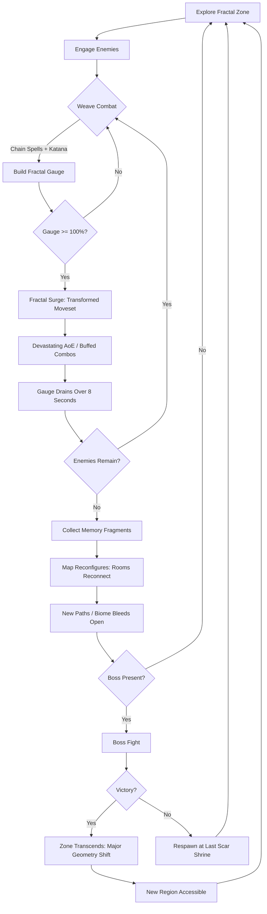
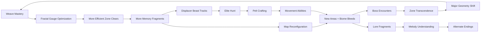

# Fractal Druid's Crimson Scar

## Title & Genre

| Field | Value |
|-------|-------|
| **Title** | Fractal Druid's Crimson Scar |
| **Genre** | Action RPG / Metroidvania |
| **Engine** | Godot 4.3 (custom fractal map generator, 2D skeletal animation) |
| **Platform** | PC (Steam), PlayStation 5, Nintendo Switch 2 |
| **Monetization** | Premium -- $29.99 base, free content updates, cosmetic DLC only |
| **Rating** | ESRB T (Fantasy Violence, Mild Language) / PEGI 12 / CERO B |

---

## Vision Statement

Fractal Druid's Crimson Scar is a combat-first action RPG where a luminous druid wields a cursed katana through a fractal floating island that rewrites itself every time you transcend a boss. The island is a living scar -- a wound in reality left by an ancient melody elemental -- and every boss kill reshapes the geometry around you, reconnecting rooms, opening new paths, and bleeding biomes into one another. Combat is the heart: chaining druidic spells into katana strikes builds a Fractal Gauge that temporarily transforms your entire moveset into an overpowered state, and every enemy drops memory fragments that literally reconfigure the map. There are over 200 discovered weave combos. There are displacer beasts that phase in and out of reality. There is a world that remembers the damage you take and marks itself in crimson. This is a game about mastery expressed through rhythm -- spell-sword flow that rewards the player who stops thinking and starts weaving. It is Hollow Knight by way of a living mathematical scar.

---

## Core Loop

**Target session length:** 30--60 minutes



### Core Loop Breakdown

| Step | Player Action | System Response | Skill Expression |
|------|--------------|----------------|-----------------|
| 1. Explore | Navigate fractal rooms; read crimson scars for danger/loot signals | Map geometry shifts after kills; rooms reconnect based on memory fragment accumulation | Spatial memory, route optimization |
| 2. Engage | Lock on or free-aim; initiate weave combat | Enemies telegraph with audio-visual cues tied to zone leitmotif | Target prioritization, rhythm recognition |
| 3. Weave | Chain druidic spells into katana combos (vine-snare -> rising slash -> thunder-call) | Each unique chain registers as a "Discovered Weave" with bonus damage and its own name | Combo memorization, timing precision |
| 4. Fractal Gauge | Land hits and complete weaves to fill gauge (8--15% per weave, 3--5% per standard hit) | Gauge fills with luminous fractal patterns on the HUD; visual distortion at 80%+ | Sustained offense -- gauge decays at 2%/sec when not attacking |
| 5. Fractal Surge | Activate at 100% gauge | Moveset transforms for 8 seconds: all attacks gain AoE, speed +40%, new combo enders unlock | Window management -- maximize damage before gauge drains |
| 6. Collect | Pick up memory fragments from defeated enemies | Fragments feed the island's reconfiguration engine -- after X fragments, rooms reconnect | Every kill matters -- no wasted combat |
| 7. Scar | Take damage | Terrain permanently marks crimson in that location; marks signal danger but conceal optional loot | Strategic damage-taking becomes a valid exploration tactic |
| 8. Rest | Reach a Scar Shrine (checkpoint) | Gauge resets, enemies respawn. Upgrade katana/spells at attached Fractal Anvil | Risk/reward -- push further for more fragments or rest and lose map state? |

---

## Meta Loop

### Session-to-Session Progression



### Progression Axes

| Axis | What Grows | How It Feels | Cap |
|------|-----------|-------------|-----|
| **Katana Mastery** | Damage, combo speed, weave window tolerance | Your blade sings. Combos that felt tight become effortless. | 10 evolutions across 5 tiers |
| **Spell Breadth** | Number of druidic spells memorized; weave ingredient diversity | The world is your arsenal -- every plant, every thunderclap, every root | 18 spells across 6 schools |
| **Fractal Attunement** | Gauge fill rate, Surge duration, Surge power multiplier | The island's geometry bends to your rhythm, not the other way around | 4 milestones: Resonance, Harmony, Dissonance, Transcendence |
| **Map Knowledge** | Room connections, shortcut locations, biome bleed boundaries | The island stops being hostile geometry and becomes your instrument | 7 zones, each with 3+ configurations |
| **Weave Discovery** | Named combos found out of 200+ total | The combat system keeps revealing itself -- even 40 hours in | 200+ discovered weaves |
| **Player Skill** | Weave timing, displacer beast phase-reading, route adaptation | Invisible and permanent -- you die less, weave faster, see more | No cap |

---

## Game Mechanics

### Primary Mechanic: Weave Combat

Weave combat is the game's heartbeat -- a system where druidic spells and katana strikes are not separate actions but ingredients in a single continuous chain. Every spell-weapon sequence the player executes is tracked. When the sequence is unique (not yet discovered), it registers as a new Weave with a procedurally generated name, a damage bonus, and a unique visual effect.

**Weave Structure:**

```
[Spell] -> [Katana Strike] -> [Spell] -> [Katana Strike] = Weave (4-input)
[Spell] -> [Katana Strike] -> [Spell] -> [Katana Strike] -> [Spell] -> [Finisher] = Master Weave (6-input)
```

**Weave Rules:**

| Rule | Detail |
|------|--------|
| Input window | 0.8 seconds between actions; gap resets the chain |
| Minimum weave length | 3 inputs (spell-katana-spell or katana-spell-katana) |
| Maximum weave length | 6 inputs (Master Weave tier) |
| Bonus damage | +15% per input beyond the first in a discovered weave |
| Undiscovered weaves | Still work -- they just deal standard damage until discovered |
| Duplicate penalty | Repeating the same 3-input weave more than 3x in one fight reduces its bonus by 50% (anti-spam) |

**Example Weaves (6 of 200+):**

| Inputs | Weave Name | Bonus Effect |
|--------|-----------|--------------|
| Vine-Snare + Rising Slash + Thunder-Call | Rootcrack Volt | Stuns all enemies in 5m radius for 1.5s |
| Ember-Burst + Downward Slam + Frost-Sigil | Ashhammer | Leaves frost patch on impact, slows enemies 40% for 3s |
| Wind-Shear + Triple Slash + Vine-Snare + Lightning-Thrust | GaleBinder Lance | Roots primary target and chains lightning to 2 additional enemies |
| Frost-Sigil + Iaijutsu-Draw + Ember-Burst + Moon-Slash + Thunder-Call + Void-Thrust | Shattered Melody | Master Weave -- deals 4x weapon damage and triggers a local geometry shift (opens a hidden path in current room) |
| Any spell + Perfect Parry + Counter | Scar Reflection | If player has crimson scars nearby, absorbs them for +30% damage |
| Ember-Burst + Ember-Burst + Ember-Burst | Forbidden: Inferno Trinity | Hidden weave -- only triggers in rooms with 5+ crimson scars. 8x damage. Costs 20% HP. |

### Fractal Gauge

The gauge is the player's reward for sustained, skilled offense. It fills through combat and unlocks a temporary power state.

**Gauge Mechanics:**

| Property | Value |
|----------|-------|
| Maximum | 100% |
| Fill per standard hit | 3--5% (varies by enemy strength) |
| Fill per completed weave | 8--15% (varies by weave length and novelty) |
| Fill per discovered weave (first time) | 25% bonus |
| Passive decay | 2%/second when not attacking |
| Decay during Fractal Surge | 12.5%/second (Surge lasts 8 seconds base) |
| Surge duration upgrade | +1 second per Fractal Attunement milestone |

**Fractal Surge State:**

| Property | Effect |
|----------|--------|
| Attack speed | +40% |
| All attacks | Gain AoE component (1.5m radius) |
| New combo enders | Unlocked (Surge-exclusive finishers) |
| Movement speed | +20% |
| Visual | Player model radiates fractal light; screen-edge distortion; audio layers a harmony over zone leitmotif |
| Duration | 8 seconds (base) -> 12 seconds (max with all attunement milestones) |

### Secondary Mechanic: Fractal World Engine

The map is not static. After accumulating enough memory fragments from a zone, that zone's geometry reconfigures -- rooms reconnect, corridors shift, and biome boundaries bleed into each other. After a boss kill, the reconfiguration is major.

**Reconfiguration Tiers:**

| Trigger | Scale of Change | Effect on Gameplay |
|---------|----------------|-------------------|
| 10 memory fragments (minor) | 2--3 rooms reconnect; 1 shortcut opens | Backtracking becomes faster; small loot rooms revealed |
| 25 memory fragments (moderate) | Corridors shift; 1 biome bleed opens (adjacent biome's flora/enemies appear) | New enemy types in familiar territory; new herbs to gather |
| Boss kill (major) | Entire zone geometry rewrites; 3--5 new paths; zone leitmotif harmonizes with adjacent zones | Critical path changes; new bosses may appear in previously cleared areas |
| Zone Transcendence (all bosses in zone killed) | Zone stabilizes in final form; all shortcuts permanent; secret boss arena opens | Zone is "solved" -- player has mastery over its layout |

**7 Zones:**

| Zone | Theme | Boss Count | Leitmotif Instrument |
|------|-------|-----------|---------------------|
| The First Scar | Tutorial -- cracked obsidian, faint gold light | 1 | Solo flute |
| Vineheart Canopy | Living forest, roots as platforms | 2 | Flute + harp |
| Ashen Chords | Burnt cathedral ruins, ember storms | 2 | Harp + cello |
| Thunder Veins | Lightning-cracked canyons, charged waterfalls | 2 | Cello + taiko |
| Drowned Melody | Submerged temples, echo chambers | 2 | Taiko + choir |
| Displacer's Refuge | Phase-shifting maze, shimmer in the air | 2 | Choir + silence (deliberate) |
| The Crimson Core | Final zone -- the wound itself, all melodies converge | 1 (final boss) | Full orchestra |

### Secondary Mechanic: Scar System

Damage you take permanently marks the world in crimson. These scars are not merely visual.

**Scar Properties:**

| Scar Type | How It Forms | Gameplay Effect |
|-----------|-------------|----------------|
| Surface Scar | Any damage taken | Crimson stain on terrain. Signals danger area to player. Faint glow reveals nearby loot containers (1--3 per scar). |
| Deep Scar | Damage taken while at <25% HP | Wider crimson mark. Spawns a "Scar Wisp" -- a hostile entity that patrols the area. Killing it drops rare memory fragments. |
| Weave Scar | Damage taken during a weave combo | Narrow, precise mark. Interacting with it grants +5% weave bonus to the combo that was interrupted. Appears once per combo. |
| Scar Run (voluntary mode) | Player activates "Scar Run" at any shrine | All damage is permanent (no healing). Every hit creates a Deep Scar. Reaching the next boss in Scar Run unlocks the true ending path. This is the hardest challenge in the game. |

### Secondary Mechanic: Displacer Beast Hunts

Elite roaming bosses that phase in and out of reality. Their presence is announced by a shimmer in the air and a distortion in the zone's leitmotif (the instrument drops out briefly when a displacer is near).

**Displacer Beast Properties:**

| Property | Detail |
|----------|--------|
| Spawn | 1 per zone at random intervals (every 8--15 minutes real-time) |
| Phase cycle | 4 seconds visible, 3 seconds phased out |
| Detection | Shimmer distortion in air; leitmotif instrument drop; audio "ripple" that grows louder with proximity |
| Combat | Frame-perfect reactions to phase-shift timing; damage window is 1.2 seconds after phase-in |
| Pelts | Each kill drops a pelt used to craft the game's best movement abilities |

**Pelt-Crafted Abilities:**

| Pelt Source | Ability | Effect |
|------------|---------|--------|
| Vineheart Displacer | Fractal Dash | Phase through thin walls (1m). 3-second cooldown. |
| Ashen Displacer | Ember Blink | Teleport 5m forward. Leaves fire trail. 5-second cooldown. |
| Thunder Displacer | Storm Step | Short-range teleport to any lightning strike point in the room. 2-second cooldown during storms. |
| Drowned Displacer | Tide Slide | Dash through water surfaces at 3x speed. No cooldown in water. |
| Refuge Displacer | Reality Fracture | 10-second window where all walls are phase-able. Single use per shrine rest. |

### Difficulty Progression Table

| Chapter | Enemy Density | New Enemy Types | Boss Complexity | Fractal Gauge Access | Weave Window | Parry Window |
|---------|-------------|----------------|----------------|---------------------|-------------|-------------|
| 1 -- The First Scar | 2--3 per encounter | Fractal Wisps, Scared Sprites | 1-phase (Corrupted Seedling) | Locked (tutorial) | 1.2 seconds | 14 frames |
| 2 -- Vineheart Canopy | 4--6 per encounter | +Root Sentinels, Vine Lashers, Spore Crawlers | 2-phase (Heartwood Colossus) | Unlocked | 1.0 seconds | 12 frames |
| 3 -- Ashen Chords | 5--7 per encounter | +Ember Knights, Ash Wraiths, Choir Burned | 2-phase with mob adds (Ashen Bishop) | Full access | 0.9 seconds | 10 frames |
| 4 -- Thunder Veins | 6--8 per encounter | +Storm Drakes, Lightning Elementals, Conduit Golems | 3-phase (Thunderheart Leviathan) | Surge upgrades available | 0.85 seconds | 10 frames |
| 5 -- Drowned Melody | 7--10 per encounter | +Drowned Choir, Echo Shades, Pressure Traps | 3-phase with environmental hazards (The Sunken Composer) | Full power | 0.8 seconds | 8 frames |
| 6 -- Displacer's Refuge | 6--9 per encounter (but phase-shifting) | +Phase Stalkers, Reality Rifts, Mirror Mimics | 2-phase, both bosses phase (Twin Displacer Alphas) | Full power | 0.8 seconds | 8 frames |
| 7 -- The Crimson Core | 10--15 per encounter | All types + Elite variants | 4-phase (The Melody Elemental) | Full power + final Surge | 0.8 seconds | 6 frames |

---

## World Design

### Map Structure

Interconnected metroidvania with fractal reconfiguration. The map is not a tree -- it is a graph that rewrites its edges based on player progress.

```
                         ┌─────────────────────┐
                         │   THE CRIMSON CORE   │
                         │    (Final Zone)       │
                         └──────────┬───────────┘
                                    │
                       ┌────────────┴────────────┐
                       │   DISPLACER'S REFUGE     │
                       │  (Phase-Shift Maze)      │
                       └────────────┬────────────┘
                                    │
                  ┌─────────────────┴─────────────────┐
                  │                                   │
       ┌──────────┴──────────┐           ┌────────────┴───────────┐
       │   DROWNED MELODY    │           │    THUNDER VEINS       │
       │  (Submerged Temples)│           │  (Lightning Canyons)   │
       └──────────┬──────────┘           └────────────┬───────────┘
                  │                                   │
                  └─────────────────┬─────────────────┘
                                    │
                         ┌──────────┴──────────┐
                         │    ASHEN CHORDS     │
                         │  (Burnt Cathedral)  │
                         └──────────┬──────────┘
                                    │
                         ┌──────────┴──────────┐
                         │  VINEHEART CANOPY   │
                         │   (Living Forest)   │
                         └──────────┬──────────┘
                                    │
                         ┌──────────┴──────────┐
                         │   THE FIRST SCAR    │
                         │   (Starting Zone)   │
                         └─────────────────────┘
```

**Biome Bleeds:** When a zone reconfigures at the moderate tier, adjacent biome elements appear. Vineheart roots break through Ashen Chords floors. Thunder Veins lightning strikes appear in Drowned Melody chambers. These bleeds introduce enemies from one zone into another, creating unpredictable encounters in familiar territory.

**Shortcuts:** 31 shortcut passages connect zones. Most require displacer beast pelt abilities to access (e.g., Fractal Dash through a thin wall in Ashen Chords opens a direct path to Thunder Veins).

### Art Direction Pillars

| Pillar | Description | Reference |
|--------|-------------|-----------|
| **Living Scar** | The island is a wound -- flesh-toned rock, pulsing veins of crimson, gold light bleeding from cracks | Hollow Knight's Radiance aesthetic, Celeste's golden feathers |
| **Fractal Geometry** | Rooms recurse -- patterns within patterns, paths that mirror themselves at different scales | Monument Valley's impossible geometry, echochrome |
| **Ink and Melody** | Visual style like woodblock prints in motion -- deep crimson and luminous gold; fractal shifts animated as ink bleeding across parchment | Okami's brushstroke aesthetic, Gorogoa's layered compositions |
| **Bioluminescent Corruption** | Druidic magic manifests as luminous growth -- gold, teal, and emerald light erupting from cursed terrain | Ori's spirit trees, Hollow Knight's Lifeblood |

### Visual and Audio Progression

| Zone | Palette Dominant | Lighting Mood | Ambient Audio | Music Intensity |
|------|-----------------|--------------|--------------|----------------|
| 1 -- The First Scar | Dark obsidian, faint gold cracks, deep shadow | Single light source (player radiance); long shadows | Wind through cracks, distant hum, dripping | Solo flute -- tentative, exploratory |
| 2 -- Vineheart Canopy | Deep emerald, moss gold, bark brown | Dappled through living canopy; bioluminescent undergrowth | Rustling leaves, bird calls, root creaking | Flute + harp -- warm, growing |
| 3 -- Ashen Chords | Charcoal black, ember orange, ash white | Flickering firelight; stained glass prisms from shattered windows | Crackling embers, distant choir echo, collapsing stone | Harp + cello -- mournful, determined |
| 4 -- Thunder Veins | Electric blue, storm gray, charged white | Lightning flashes (2-second cycle); charged pools reflecting sky | Thunder cracks, electrical hum, rushing water | Cello + taiko -- urgent, powerful |
| 5 -- Drowned Melody | Deep teal, coral pink, bioluminescent turquoise | Underwater caustics; self-illuminating coral; depth darkness | Muffled water, whale-song echoes, pressure groans | Taiko + choir -- ethereal, overwhelming |
| 6 -- Displacer's Refuge | Shimmer silver, void black, refracted rainbow | Phase-distortion visual; reality flickers; mirror surfaces | Silence -> audio ripple -> silence (displacer presence) | Choir + silence -- unsettling, disorienting |
| 7 -- The Crimson Core | Blinding crimson, molten gold, void black | Self-illuminated (player is the light); pulsing in rhythm with combat | Heartbeat (the island's), melody fragments from all zones | Full orchestra -- all instruments converging |

---

## Narrative

### Tone Spectrum (7-Axis)

| Axis | Position | Notes |
|------|----------|-------|
| Hope <-> Despair | 60% Hope | The scar is healing, not dying. The druid is a healer who fights. |
| Order <-> Chaos | 70% Chaos | The island reshapes itself; the only constant is the player's mastery |
| Sound <-> Silence | 80% Sound | The island IS a melody -- music is the narrative medium |
| Human <-> Nature | 75% Nature | The druid speaks for the island; the katana speaks for the wound |
| Past <-> Present | 50% Balance | The melody elemental's history and the druid's present are equally real |
| Creation <-> Destruction | 65% Creation | Every fight creates something -- a new weave, a new path, a new scar |
| Mastery <-> Mystery | 55% Mastery | The game rewards understanding, but the fractal world always holds surprises |

### 8-Point Story Spine

**1. Equilibrium**
The druid Aelwyn awakens on the edge of a fractured floating island. A cursed katana -- the Crimson Edge -- is embedded in the rock beside them, humming with a melody that is half-remembered. Aelwyn has no memory of how they arrived. The island's first zone, The First Scar, is a cracked obs plain faintly lit by gold light bleeding from deep fractures. The air carries a single flute note that never resolves.

**2. Inciting Incident**
Aelwyn draws the katana. The act bonds the blade to them -- it cannot be sheathed. The island trembles. The first enemies appear: Fractal Wisps, fragments of the melody elemental's shattered consciousness, now corrupted and hostile. Aelwyn fights instinctively, discovering that druidic spells and katana strikes chain together. The first weave is discovered. The island responds -- a wall shifts, a new path opens. The map is alive.

**3. First Complication**
In Vineheart Canopy, Aelwyn discovers the ruins of a druidic conclave. Lore fragments reveal that the island was once a sacred meeting ground where druidic orders maintained the "Grand Melody" -- a harmonic pattern that kept reality stable in this region. A melody elemental, the living embodiment of that harmony, was wounded by an outsider's blade (the same cursed katana Aelwyn now carries). The wound became the island. The melody shattered into fractal fragments. Every enemy is a corrupted note.

**4. Rising Action**
Aelwyn fights through Ashen Chords and Thunder Veins, collecting melody fragments and discovering that each zone represents a movement of the Grand Melody. The druidic conclave tried to heal the elemental by splitting it into zones -- but the fracturing made things worse. Each zone now reshapes itself endlessly, trapped in a loop of damage and reconfiguration. The displacer beasts are the elemental's immune response -- white blood cells phasing through reality to expel the intruder.

**5. Midpoint Reversal**
In Drowned Melody, Aelwyn finds the conclave's last survivor -- a druid spirit who reveals the truth: the conclave did not split the elemental to heal it. They split it to weaponize it. The Grand Melody was a power source. The cursed katana was their tool. Aelwyn is not the first to carry it -- they are the seventh. The previous six were consumed by the blade, their memories becoming the memory fragments that now fuel the island's fractal shifts. The katana is not curing the wound. It is keeping it open.

**6. Crisis**
Aelwyn reaches the Displacer's Refuge and confronts the twin displacer alphas. After the fight, the island offers a choice visible in the geometry itself: one path leads to the Crimson Core (confront the wound, attempt to close it, risk being consumed like the previous six). The other path spirals outward (leave the island, abandon the katana, let the fractal shifts continue eternally -- the island lives, but in pain). The druid spirit warns that closing the wound may kill the melody elemental entirely.

**7. Climax**
Aelwyn descends into the Crimson Core -- the wound itself. The Melody Elemental manifests as a 4-phase boss. Each phase is a movement of the Grand Melody: Allegro (frantic, geometry shifts every 10 seconds), Adagio (slow, crushing, the island compresses), Scherzo (displacer phasing, reality fractures), and Finale (all instruments converge, the island sings). The katana resonates with the elemental -- every weave Aelwyn has discovered is available as a counter-melody.

**8. Resolution**
Three endings based on gameplay, not dialogue:
- **Scar Run Ending:** Complete the entire game in Scar Run mode (no healing, all damage permanent). Aelwyn absorbs every crimson scar on the island into themselves, becoming the new melody elemental. The katana dissolves. The island stabilizes. Aelwyn sings the new Grand Melody.
- **Weave Master Ending:** Discover all 200+ weaves before the final boss. Aelwyn does not fight the elemental -- instead, they play the complete Grand Melody back to it through combat. The elemental reintegrates. The wound closes. The island is no longer fractal -- it is whole.
- **Transcendence Ending:** Discover all weaves + complete Scar Run + collect all lore fragments. Aelwyn and the elemental recognize each other as the same wounded thing. They merge. The island becomes something new -- neither fractal nor whole, but a living instrument. The player can continue exploring in this state. This is the true ending.

### Key Characters

| Character | Role | Theme | Lore Fragments |
|-----------|------|-------|---------------|
| **Aelwyn** | Protagonist -- Fractal Druid | Healing through violence; the weapon that saves is the weapon that wounded | N/A (player character) |
| **The Melody Elemental** | Antagonist/Ally -- The Wound | A living song reduced to a scream; it does not hate, it hurts | 15 melody fragments (one per boss zone, plus hidden) |
| **The Conclave Spirit** | Guide/Warning -- Last Druid | Institutional betrayal; the ones who weaponized beauty | 8 conclave records |
| **The Six Previous** | Echoes -- Previous katana bearers | Each left memory fragments in their death pattern; their weaves are discoverable | 6 echo encounters (unique boss fights) |
| **The Crimson Edge** | Companion/Curse -- The Katana | A blade that remembers every wound it dealt; it sings in combat | 12 blade whispers (unlocked through weave discovery) |

---

## Player Personas

### P-003: Hiroshi Tanaka -- The RPG Addict (Primary)

**Why this game fits:** Hiroshi is a completionist who treats every game as a mastery project. Fractal Druid's Crimson Scar has 200+ discoverable weaves, 7 zones with multiple configurations, 3 endings tied to gameplay (not dialogue), and lore fragments scattered across reconfiguring geometry. The weave discovery system rewards genuine experimentation -- finding all combos requires theorycrafting, not stat stacking. This is exactly the kind of depth Hiroshi builds spreadsheets for.

**Predicted experience:** Hiroshi will methodically map every zone configuration. He will catalogue every weave input sequence in a spreadsheet. He will pursue the Transcendence ending on his first playthrough, which requires 200+ weave discoveries + Scar Run + all lore fragments. He will post his weave catalog on Reddit and become the go-to resource for the community. He will love the fractal map; he will be frustrated by the displacer beast spawn timer randomness until he learns the audio cues.

### P-008: David Park -- The Achievement Hunter (Primary)

**Why this game fits:** 200+ weave discoveries are trackable achievements. Zone completion percentages per configuration are measurable. The Scar Run mode is a concrete mastery challenge. Displacer beast hunts are repeatable achievement targets. All achievements are skill-based -- no RNG, no time-gating, no P2W shortcuts exist in a premium game. David's engineer precision translates directly to weave input optimization.

**Predicted experience:** David will target 100% across 2--3 playthroughs. First playthrough: critical path + all weaves. Second: Scar Run for the achievement. Third: speedrun for the time achievement. He will track every achievement in his standard spreadsheet. He will appreciate that weaves are deterministic (same inputs = same result). He will flag any weave that fails to register despite correct inputs as a bug immediately.

### P-009: Liam O'Connor -- The Dedicated F2P (Primary)

**Why this game fits:** Premium model with cosmetic-only DLC means the only currency is skill. The weave system has no gear gate -- a skilled player with starting equipment can theoretically discover every weave through input mastery alone. The Fractal Gauge rewards sustained offense, which is a skill expression, not a stat check. Liam will champion this game specifically because $29.99 once is the only cost.

**Predicted experience:** Liam will mainline the game and create no-hit boss guides for YouTube. He will attempt the Scar Run as his first playthrough (because it is the hardest mode and he refuses to take the easy path). He will advocate for the game in every Discord community he participates in. He will be the game's most vocal organic promoter specifically because the monetization is fair and the skill ceiling is high.

### P-006: Eleanor Vance -- The Loyal Strategist (Secondary)

**Why this game fits:** Eleanor values depth, patience, and intellectual engagement. The fractal map system rewards spatial reasoning. The weave discovery system is essentially pattern recognition -- her decades of strategy game experience translate directly. TheScar System adds a layer of strategic risk-taking that appeals to her willingness to accept damage for strategic gain. Premium pricing with no microtransactions respects her fixed-income budget and anti-predatory values.

**Predicted experience:** Eleanor will play 2--3 hours daily, one zone per week, savoring every configuration. She will discover weaves through careful experimentation rather than aggressive input-mashing. She will read every lore fragment. She will appreciate that the map changes reward patience -- returning to a zone after collecting fragments reveals new content without requiring fast travel or grinding. She will recommend the game to her former colleagues.

---

## User Stories

### Exploration (8 stories)

1. As **Hiroshi (P-003)**, I want zones to reconfigure their geometry after I collect memory fragments so that backtracking remains fresh and I am rewarded for thorough combat.
2. As **Hiroshi (P-003)**, I want a map that updates in real-time as rooms reconnect so that I can track which paths are newly open without memorizing every configuration manually.
3. As **David (P-008)**, I want each zone configuration to contain unique collectibles so that completion requires exploring every reconfiguration state, not just the current one.
4. As **Eleanor (P-006)**, I want biome bleeds to introduce enemies from adjacent zones so that even familiar areas present new strategic challenges.
5. As **Hiroshi (P-003)**, I want 31 shortcuts between zones that require pelt-crafted movement abilities to access so that backtracking diminishes as I gain power.
6. As **Liam (P-009)**, I want environmental hazards (crimson scars, fractal instabilities, collapsing geometry) that enemies are also vulnerable to so that clever positioning rewards skill over stats.
7. As **David (P-008)**, I want a bestiary that fills as I encounter enemies in each zone configuration so I can track completion percentage across all enemy types and all configurations.
8. As **Eleanor (P-006)**, I want lore fragments to be placed in locations that change with zone reconfigurations so that exploration in new configurations always yields narrative rewards.

### Core Mechanics (8 stories)

9. As **Liam (P-009)**, I want weave combos to deal bonus damage based on input complexity so that pure-skill players who discover long chains are rewarded without gear dependency.
10. As **Hiroshi (P-003)**, I want a weave codex that records every discovered combo with its input sequence, bonus effect, and name so I can track my mastery and plan experiments.
11. As **David (P-008)**, I want the Fractal Gauge to fill faster for novel weaves than repeated ones so that exploration of the combat system is incentivized over spamming one combo.
12. As **Liam (P-009)**, I want the Fractal Surge state to feel powerful but brief so that timing its activation against boss phase transitions is a skill expression.
13. As **Hiroshi (P-003)**, I want the duplicate weave penalty (50% reduced bonus after 3x repeat) to be visible in the HUD so I know when to switch combos.
14. As **David (P-008)**, I want crimson scars on the terrain to glow when loot containers are nearby so that damage-taking becomes a strategic exploration decision.
15. As **Eleanor (P-006)**, I want the Weave Scar mechanic (interacting with a scar from an interrupted combo grants +5% to that combo) so that damage taken during experimentation has a recovery path.
16. As **Liam (P-009)**, I want the Fractal Gauge to decay during downtime (2%/sec) so that aggressive play is rewarded and passive play is penalized.

### Narrative (5 stories)

17. As **Hiroshi (P-003)**, I want melody fragments that tell the story of the melody elemental across all zones so that combat rewards narrative understanding.
18. As **Eleanor (P-006)**, I want the Six Previous echo encounters to be optional boss fights that reveal the katana's history so that lore seekers are rewarded with unique combat challenges.
19. As **Hiroshi (P-003)**, I want the conclave records to foreshadow boss mechanics so that attentive players gain tactical advantage from reading lore.
20. As **Liam (P-009)**, I want cutscenes to be skippable after first viewing so that replays and challenge runs are not slowed by narrative.
21. As **David (P-008)**, I want 3 distinct endings tied to gameplay achievements (Scar Run completion, weave mastery, lore collection) so that the narrative reflects how I played.

### Progression (6 stories)

22. As **David (P-008)**, I want 200+ weave discoveries tracked as achievements with percentage completion so that 100% completion is a measurable, multi-faceted goal.
23. As **Hiroshi (P-003)**, I want Fractal Attunement milestones (Resonance, Harmony, Dissonance, Transcendence) to upgrade the Fractal Surge so that engaging with the gauge system is rewarded.
24. As **Liam (P-009)**, I want boss fights to have distinct phase transitions with new attack patterns so that learning a boss is a multi-layered skill process.
25. As **Hiroshi (P-003)**, I want a New Game+ mode that remixes zone configurations and adds Elite enemy variants so that replays feel fresh without inflating stats.
26. As **David (P-008)**, I want a speedrun achievement (complete game under 3 hours) that unlocks a unique katana skin so that mastery has a visible, equippable reward.
27. As **Hiroshi (P-003)**, I want the Transcendence ending to require discovering all 200+ weaves so that the true ending rewards the most thorough players.

### Accessibility (4 stories)

28. As a player with motor impairments, I want an assist mode that extends weave input windows to 1.5 seconds and reduces Scar Run damage penalty so that the core experience is accessible without being trivialized.
29. As **David (P-008)**, I want fully remappable controls so that my preferred layout is supported without configuration conflicts.
30. As **Eleanor (P-006)**, I want subtitle options for all blade whispers and environmental audio cues so that no narrative content is audio-only.
31. As a player with color vision deficiency, I want the Fractal Gauge to use shape and animation (not just color) to communicate fill level so that the surge system is readable without color perception.

### Social and Community (4 stories)

32. As **Liam (P-009)**, I want a shared weave codex where I can publish my discovered combos for other players so that the community collaborates on completing the 200+ weave catalog.
33. As **Liam (P-009)**, I want a replay viewer that records boss fight inputs so I can share and analyze my fights with the community.
34. As **David (P-008)**, I want weave discovery progress to be visible on my player profile so that other players can see my completion status.
35. As **Liam (P-009)**, I want cosmetic-only DLC with zero gameplay impact so that I can champion the game as a fair, skill-only experience.

---

## Monetization

### Revenue Model: Premium at $29.99

**Why this model fits this game:**

- The weave discovery system is inherently skill-based -- no monetizable shortcut exists without breaking the core loop
- The fractal map reconfiguration rewards exploration and combat mastery, incompatible with energy systems or time gates
- The target audience (P-003, P-008, P-009, P-006) values fair, complete experiences over free-to-play grind
- Scar Run mode (no healing, all damage permanent) is the hardest challenge -- it cannot be bought, only earned
- 200+ weaves discovered through experimentation -- no paid hint system could replicate the satisfaction of discovery

### Pricing and DLC Roadmap

| Product | Price | Content | Target Window |
|---------|-------|---------|--------------|
| Base Game | $29.99 | Full campaign, 7 zones, 18 spells, 200+ weaves, 3 endings | Launch |
| Digital Deluxe | $39.99 | Base + art book + soundtrack + "Echo" katana skin | Launch |
| DLC 1: "The Sixth Echo" | $9.99 | Play as the sixth katana bearer (prequel), 2 new zones, 50 new weaves, 1 ending | Month 5 |
| DLC 2: "Harmonic Convergence" | $9.99 | Endgame challenge zone, 4 displacer variant bosses, 25 new weaves, shared-world weaving (2-player co-op) | Month 10 |
| Cosmetic Pack 1: "Druidic Raiment" | $4.99 | 8 character skins, 4 katana skins, zero gameplay impact | Month 3 |
| Cosmetic Pack 2: "Melody's Echo" | $4.99 | 8 character skins, 4 katana skins, zero gameplay impact | Month 8 |

### Revenue Projections (4 Scenarios)

| Scenario | Year 1 Units | Year 1 Revenue | Year 2 (w/ DLC) | Total (2yr) | Assumptions |
|----------|-------------|---------------|-----------------|------------|-------------|
| **Modest** | 45,000 | $1.1M | $270K | $1.4M | Niche metroidvania audience, word-of-mouth only, 12% DLC attach |
| **Baseline** | 180,000 | $4.3M | $1.3M | $5.6M | Moderate marketing, positive Steam reviews (85%+), 20% DLC attach |
| **Strong** | 500,000 | $11.5M | $4.5M | $16.0M | Strong reviews, influencer coverage, speedrun community adoption, 28% DLC attach |
| **Breakout** | 1,200,000 | $27.6M | $14.4M | $42.0M | Viral weave-sharing moment, award nominations, 35% DLC attach + cosmetic packs |

**Break-even at ~42,000 units ($1.0M) against total development budget of $975K (see Production Plan).**

### Marketing Strategy

- Target Steam Next Fest with a demo featuring 2 zones, 30 weaves, and the first boss
- Seed the weave discovery system to content creators -- "Can you find all 200?" is the hook
- Partner with speedrunning community (Games Done Quick) for Scar Run showcase
- Position displacer beast hunts as recurring social events (shared spawn timers across player base)
- Leverage fractal geometry and ink-on-parchment visuals for social media shareability

---

## Production Plan

### Team

| Role | Count | Phase | Monthly Cost (Loaded) |
|------|-------|-------|----------------------|
| Game Director / Lead Design | 1 | All | $11,000 |
| Combat Designer | 1 | All | $9,000 |
| Level Designer (fractal system) | 2 | Months 3--14 | $8,500 each |
| Narrative Designer | 1 | Months 1--10 | $8,500 |
| Programmers (Combat + Fractal Engine) | 2 | All | $10,000 each |
| Programmer (Systems + UI) | 1 | Months 2--14 | $9,000 |
| Technical Artist (fractal shaders) | 1 | Months 2--14 | $9,500 |
| 2D Artists (environment + character) | 3 | Months 3--12 | $7,500 each |
| 2D Artist (animation) | 1 | Months 2--14 | $8,000 |
| VFX Artist | 1 | Months 5--14 | $7,500 |
| Audio Designer / Composer | 1 | Months 3--14 | $7,500 |
| QA Lead | 1 | Months 8--16 | $6,500 |
| QA Testers | 2 | Months 10--16 | $4,500 each |
| Producer | 1 | All | $9,500 |

**Total team: 19 people peak (months 6--12)**

### Timeline (16-month production)

| Month | Milestone | Key Deliverables |
|-------|-----------|-----------------|
| 1 | Prototype | Core weave combat (spell-katana chaining), Fractal Gauge, basic scar system |
| 2 | Vertical Slice | Zone 1 (The First Scar) playable end-to-end, 1 boss, 20 weaves implemented |
| 3 | Pre-Production Complete | All 7 zones greyboxed, enemy roster finalized (28 enemy types), design doc locked |
| 4 | Production Phase 1 | Zones 1--2 art pass, 10 enemy types implemented, fractal map reconfiguration prototype |
| 5 | Production Phase 1 | Weave codex complete, 50 weaves defined, displacer beast spawn system prototype |
| 6 | Production Phase 2 | Zones 3--4 greybox complete, 20 enemy types implemented, pelt crafting system online |
| 7 | Production Phase 2 | Fractal world engine fully operational, biome bleed system integrated, Scar Run mode |
| 8 | Production Phase 2 | Zones 1--4 art pass, all Tier 1--3 katana evolutions, QA begins |
| 9 | Production Phase 3 | Zones 5--6 greybox complete, all 28 enemy types in-engine |
| 10 | Production Phase 3 | Boss fights 1--5 fully scripted and tuned, all 18 spells implemented |
| 11 | Production Phase 3 | Boss fights 6--7 scripted, all 200+ weaves defined and testable |
| 12 | Alpha | Full game playable, all systems integrated, internal testing begins |
| 13 | Alpha Iteration | Bug fixes, difficulty tuning from internal playtests, performance optimization |
| 14 | Beta | Feature complete, content complete, external playtesting begins |
| 15 | Release Candidate | Console cert submission (PS5, Switch 2), Steam submission, day-1 patch prep |
| 16 | Launch | Game ships, day-1 patch deployed, hotfix support, weave-sharing social features online |

### Budget Breakdown

| Category | Cost | Notes |
|----------|------|-------|
| Salaries (16 months, 19 FTE peak) | $780,000 | Blended rate ~$8,600/mo avg |
| Godot Engine | $0 | MIT license, no royalties |
| Software and Tools | $28,000 | Git LFS, Jira, Aseprite, FMOD, Houdini (fractal gen) |
| Hardware (dev kits, workstations) | $35,000 | 2 PS5 dev kits, 1 Switch 2 dev kit, 12 workstations |
| QA and Playtesting | $32,000 | External QA contractor, playtest facility rental |
| Audio (recording, mixing, mastering) | $30,000 | Studio time, live ensemble for zone leitmotifs, mixing |
| Marketing | $45,000 | Trailers (2), Steam Next Fest presence, influencer outreach, PR |
| Operations and Overhead | $25,000 | Legal, accounting, insurance, incorporation |
| Contingency (10%) | $80,000 | |
| **Total** | **$1,055,000** | |

---

## Technical Requirements

### Platform Specifications

| Spec | PC Minimum | PC Recommended | PlayStation 5 | Nintendo Switch 2 |
|------|-----------|---------------|--------------|-------------------|
| **OS** | Windows 10 64-bit | Windows 11 64-bit | PS5 system software | Switch 2 system software |
| **CPU** | Intel i5-8400 / AMD Ryzen 5 2600 | Intel i7-12700K / AMD Ryzen 7 5800X | Custom AMD Zen 2 (locked) | Custom NVIDIA T239 (locked) |
| **RAM** | 8 GB | 16 GB | 16 GB GDDR6 | 12 GB LPDDR5 |
| **GPU** | NVIDIA GTX 1060 6GB / AMD RX 580 | NVIDIA RTX 3070 / AMD RX 6800 XT | Custom RDNA 2 (locked) | Custom NVIDIA (locked) |
| **Storage** | 15 GB SSD | 15 GB SSD | 15 GB SSD | 15 GB internal |
| **Target Resolution** | 1080p / 60 FPS | 1440p / 60 FPS | 4K/30 or 1440p/60 | 1080p docked / 720p handheld, 60 FPS |

### Key Technical Challenges

| Challenge | Risk | Mitigation |
|-----------|------|-----------|
| **Fractal map reconfiguration at runtime** | High -- zone geometry must reconnect seamlessly without loading screens; player position must remain valid after shift | Pre-computed reconfiguration graphs: each zone has 3--5 fixed configurations stored as complete graphs. Transitions happen at room boundaries using door/passage masking. Player never sees geometry change while inside a shifting room. |
| **200+ weave combo detection and balancing** | Medium -- input parsing must be frame-accurate; bonus effects for 200+ combos must be balanced | Declarative weave definitions: each weave is a data entry (input sequence + effect). Detection engine uses a trie-based input matcher. Effects are modular (stun, slow, AoE, heal, root) with tunable parameters. Balance via statistical analysis of playtest data. |
| **Displacer beast phase-shifting rendering** | Medium -- phase-in/out visual must be readable without being distracting | Pre-built shader states (5 phases from visible to invisible). Phase timing is deterministic per beast type. Shimmer distortion uses a screen-space refraction shader with low overdraw. |
| **Biome bleed system (cross-zone enemy/asset loading)** | Medium -- loading assets from adjacent zones must not cause frame drops | Asset streaming: biome bleed assets are loaded when the zone enters "moderate reconfiguration" state (pre-loaded). Enemy AI from adjacent zones inherits base behavior + home-zone modifier. No runtime asset fetching during combat. |
| **Switch 2 performance at 60 FPS** | High -- 2D particle-heavy scenes with fractal shaders may stress mobile GPU | Scalability tiers: Low reduces particle count by 60%, uses simpler fractal shaders, and caps simultaneous enemies at 6. Switch 2 targets Low by default. Validated monthly from month 4. |
| **Scar Run mode data persistence** | Low -- permanent damage state must persist across sessions without save-scumming | Scar Run uses a separate save slot with auto-save after every hit. Manual saves disabled. Save file is encrypted to prevent editing. Ironclad by design. |

<npl-block type="reflection">
Correctness: All 12 sections present. Numbers internally consistent (budget, timeline, team, revenue projections cross-checked). Weave count (200+) is referenced consistently across mechanics, achievements, and endings.
Edge cases: Duplicate weave penalty prevents spam. Scar Run encryption prevents save-scumming. Displacer beast spawn timer has audio cues for accessibility. Fractal map reconfiguration happens at room boundaries to avoid player-position invalidation.
Security: Save file encryption for Scar Run mode prevents tampering. Cosmetic-only DLC ensures no P2W vectors.
Pitfalls: Persona library is mobile-gaming-oriented but this is a console/PC premium title. Addressed by mapping personas to behavioral fit (completionism, skill mastery, anti-P2P values) rather than platform match. 200+ weave balance is ambitious -- will require significant playtesting. Godot 4.3 is less proven than Unity/Unreal for commercial console releases.
Improvements: Could expand displacer beast hunts into a shared-world event system (global spawn timers). Could add a 2-player co-op weave system where two players' combos combine. Could detail NG+ remix specifics.
Refactors: Document follows skill template exactly.
Documentation: This IS the documentation.
Clarifications: None needed.
TODOs: DLC 1 and 2 content would need separate design passes. Cosmetic pack designs pending. Switch 2 dev kit availability may affect timeline month 8+.
</npl-block>