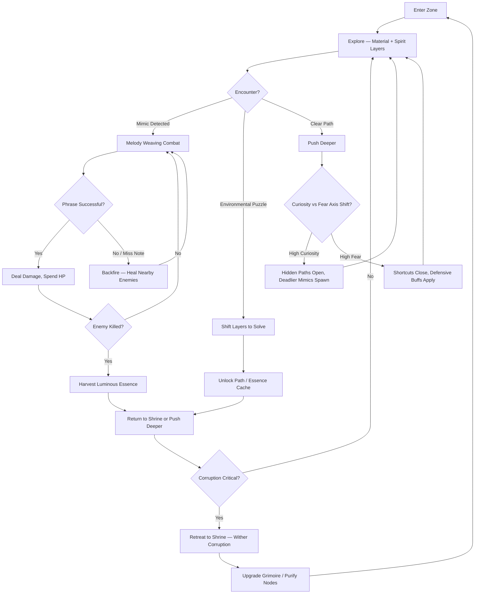
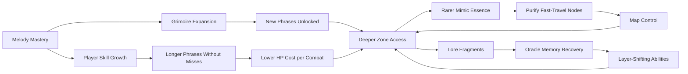

# Fractured Melody Bayou

## Title & Genre

| Field | Value |
|-------|-------|
| **Title** | Fractured Melody Bayou |
| **Genre** | Survival Horror / Metroidvania |
| **Engine** | Unreal Engine 5.4 (Nanite + Lumen for bayou volumetrics and dual-layer rendering) |
| **Platform** | PC (Steam/Epic), PlayStation 5, Xbox Series X/S |
| **Monetization** | Premium — $34.99 base, no microtransactions |
| **Rating** | ESRB M (Blood and Gore, Violence, Partial Nudity) / PEGI 18 / CERO Z |

---

## Vision Statement

Fractured Melody Bayou is a survival horror metroidvania where a fractured oracle navigates a sentient bayou that rewrites itself in response to her emotional state. The game lives at the intersection of musical expression and bodily sacrifice — every combat spell is a melody sung in blood, and every note costs vitality. The bayou watches, learns, and reshapes: high curiosity reveals hidden paths but spawns deadlier predators; high fear closes shortcuts but grants defensive resilience. The world is a dual-layer ecosystem — a material bayou of oppressive greens and shadow, and a coral-tinted spirit reflection where mimics shimmer and the dead still walk. The player harvests luminous essence from slain mimics to expand a grimoire of melody phrases, purifies corrupted fast-travel nodes to reclaim the map, and masters blood-mage combat rituals where the longest combos demand the most HP. It is Hollow Knight by way of Silent Hill 2, scored by a bayou that hums back the songs you teach it.

---

## Core Loop

**Target session length:** 30–60 minutes



### Core Loop Breakdown

| Step | Player Action | System Response | Skill Expression |
|------|--------------|----------------|-----------------|
| 1. Explore | Toggle between material and spirit layers; navigate waterways and corrupted paths | Enemies and geometry differ per layer; puzzles require simultaneous interaction | Spatial reasoning, layer-switching timing |
| 2. Encounter Mimic | Every chest, door, shrine, and NPC has a hidden mimic probability | Mimic probability rises with zone depth (5% surface → 40% deepest layer) | Pattern recognition, behavioral tells |
| 3. Melody Weaving | Chain directional inputs into musical phrases during combat | Each phrase triggers a blood-mage spell; longer phrases = more damage, more HP cost | Rhythm, memory, composure under pressure |
| 4. Backfire Risk | Miss a note during phrase input | Spell backfires; nearby enemies heal 15% of their max HP | Consequence for sloppy execution |
| 5. Harvest | Kill mimics for luminous essence | Essence used to upgrade grimoire, unlock phrases, purify fast-travel nodes | Reward for engagement with mimic ecology |
| 6. Emotion Axis | Player behavior tracked on curiosity vs fear spectrum | Curiosity reveals hidden paths but spawns harder mimics; fear closes shortcuts but buffs defense | Playstyle-shaping; the bayou adapts to you |
| 7. Corruption | Each blood-mage spell adds corruption | High corruption: screen distortion, damage amplification, shrine proximity required to wither | Resource gating — push further or recover |
| 8. Shrine Rest | Reach a safe shrine | Corruption withers to 0; enemies respawn; grimoire upgrades available | Risk/reward — rest and reset or push deeper |

---

## Meta Loop

### Session-to-Session Progression



### Progression Axes

| Axis | What Grows | How It Feels | Cap |
|------|-----------|-------------|-----|
| **Grimoire Depth** | Number of melody phrases, phrase length, spell variety | Your vocabulary of blood expands — longer songs, deeper cuts | 31 phrases across 6 schools |
| **Essence Resonance** | Luminous essence purity, node purification speed, essence yield per mimic | The bayou yields more because you understand it better | 5 resonance tiers |
| **Oracle Memory** | Lore fragments recovered, layer-shifting abilities unlocked, dual-layer puzzle complexity | You remember what the bayou forgot — and it fears your remembering | 53 memory fragments |
| **Curiosity/Fear Mastery** | Understanding of how emotion axis reshapes zones, ability to deliberately steer the axis | You stop reacting to the bayou and start conducting it | 4 axis milestones |
| **Player Skill** | Phrase execution accuracy, mimic detection speed, corruption management | Invisible but defining — you die less, sing longer, harvest more | No cap — mastery is perpetual |

---

## Game Mechanics

### Primary Mechanic: Melody Weaving Combat

Combat is rhythm-based spellcasting where directional inputs form musical phrases. Each phrase maps to a blood-mage spell. The system operates on a **phrase-execution-sacrifice triad**:

**Phrase Execution:**
- Inputs are directional: Up, Down, Left, Right, and the two triggers (held as modifiers for sharp/flat)
- Phrases range from 2-note (basic) to 8-note (devastating)
- A phrase window of 0.4 seconds per note — miss the window and the phrase breaks
- Successful phrase: spell fires, HP deducted based on phrase length
- Failed phrase (missed note): backfire — all enemies within 8m heal 15% max HP

**HP Cost Table:**

| Phrase Length | HP Cost (% of Max) | Damage Multiplier | Unlock Requirement |
|--------------|-------------------|-------------------|--------------------|
| 2-note | 3% | 1.5x weapon | Starting grimoire |
| 3-note | 6% | 2.2x weapon | 5 essence harvested |
| 4-note | 10% | 3.0x weapon | 15 essence + Grimoire Tier 2 |
| 5-note | 15% | 4.0x weapon | 30 essence + Grimoire Tier 3 |
| 6-note | 22% | 5.5x weapon | 60 essence + Grimoire Tier 4 |
| 7-note | 30% | 7.0x weapon | 100 essence + all Tier 4 phrases learned |
| 8-note | 40% | 9.0x weapon | All 53 memory fragments collected |

**The Backfire Tension:**

| Situation | Consequence | Design Purpose |
|-----------|------------|----------------|
| Miss note in 2-note phrase | Enemies heal 15% | Low stakes, learning space |
| Miss note in 4+ note phrase | Enemies heal 15% + player staggers 0.8s | Punishment scales with ambition |
| Miss note in 6+ note phrase | Enemies heal 15% + stagger + corruption +5% | High ambition, high consequence |
| Miss final note of any phrase | Full backfire + enemies gain 3-second damage shield | Maximum pain at the last step |
| Complete 6+ note phrase perfectly | Essence resonance bonus + corruption reduced by 3% | Mastery reward |

### Secondary Mechanic: Emotion-Driven World State

The bayou tracks player behavior on a **curiosity vs fear axis** (0–100, starts at 50). This is not a morality meter — it is a gameplay-shaping force.

**Axis Drift Triggers:**

| Player Behavior | Axis Shift | Rate |
|----------------|-----------|------|
| Enter a new zone for the first time | +3 Curiosity | Per zone entry |
| Examine environmental detail (interact prompt) | +1 Curiosity | Per interaction |
| Kill a mimic before it ambushes | +2 Curiosity | Per proactive kill |
| Flee from combat (leave zone during fight) | +4 Fear | Per retreat |
| Stay at critical HP (<15%) for 10+ seconds without healing | +2 Fear | Per 10s interval |
| Die | +5 Fear | Per death |
| Purify a fast-travel node | -3 Fear | Per node |
| Rest at a shrine | Axis drifts 5 points toward 50 (center) | Per rest |

**World Response to Axis Position:**

| Axis Range | World Effect | Player Impact |
|-----------|-------------|---------------|
| 0–20 (Deep Fear) | All shortcuts sealed; +25% defense; enemies slower; mimic probability -10% | Safe but slow; exploration gated |
| 20–40 (Cautious) | Most shortcuts sealed; +10% defense; enemy density reduced | Cautious progress; manageable difficulty |
| 40–60 (Balanced) | Standard world state; no bonuses or penalties | Baseline experience |
| 60–80 (Curious) | Hidden paths revealed; +1 mimic per zone; enemy density +15% | Rewarding but riskier |
| 80–100 (Deep Curiosity) | All hidden paths open; +2 mimics per zone; elite mimic variants spawn; 10% more essence per kill | Maximum reward, maximum danger |

### Secondary Mechanic: Mimic Ecology System

Every interactable object has a hidden mimic probability. The system is transparent in its rules but opaque in its instances.

**Base Mimic Probability by Object Type:**

| Object | Surface Zones | Mid Zones | Deep Zones | Deepest Layer |
|--------|:------------:|:---------:|:----------:|:------------:|
| Chest | 5% | 12% | 25% | 40% |
| Door | 3% | 8% | 18% | 30% |
| Save Shrine | 2% | 5% | 10% | 15% |
| NPC | 1% | 4% | 12% | 25% |
| Fast-Travel Node | 8% | 15% | 20% | 35% |

**Mimic Detection Heuristics (behavioral tells):**
- Chest mimics: lid rises 2mm and settles (visible in spirit layer only)
- Door mimics: handle is cold — spirit layer shows a faint pulse
- Shrine mimics: the candle flame flickers out of sync with ambient wind
- NPC mimics: dialogue repeats after 3 exchanges; real NPCs have branching dialogue
- Node mimics: the resonance hum is in B-flat; real nodes hum in D

**Mimic Types:**

| Mimic Type | Zone Depth | HP | Damage | Essence Drop | Special Behavior |
|-----------|-----------|-----|--------|-------------|-----------------|
| Shallow Mimic | Surface | 80 | 10 | 1 essence | Slow grab attack, telegraphs 1.5s |
| Brackish Mimic | Mid | 200 | 25 | 3 essence | Tongue-lash (8m range) + acid spray |
| Deep Mimic | Deep | 450 | 40 | 6 essence | Phase-shifts between layers mid-combat |
| Abyssal Mimic | Deepest | 800 | 65 | 10 essence | Disguises as quest-critical NPC; drops unique grimoire page on kill |
| Echo Mimic | Any (rare) | 150 | 30 | 5 essence + random phrase | Copies the player's last melody phrase and fires it back |

### Secondary Mechanic: Fractured Oracle Vision (Dual-Layer System)

The player toggles between the material bayou and its coral-tinted spirit reflection. Both layers exist simultaneously — toggling is instant (0.3s transition).

**Layer Differences:**

| Element | Material Layer | Spirit Layer |
|---------|---------------|-------------|
| Palette | Oppressive greens, shadow, stagnant brown | Luminous coral, gold, phosphorescent blue |
| Enemy visibility | Physical enemies visible; spirit enemies translucent | Spirit enemies visible; physical enemies translucent |
| Damage rule | Can only damage material enemies | Can only damage spirit enemies |
| Mimic detection | Mimics look identical to real objects | Mimics shimmer with a faint pulse |
| Environmental puzzles | Physical platforms, bridges, doors | Spirit paths, coral bridges, light-beam reflectors |
| Lore fragments | Material memories (commander's journals, camp remains) | Spirit echoes (ghostly reenactments, whispered truths) |
| Safe zones | Shrines glow warm gold | Shrines pulse deep crimson |
| Corruption visual | Fog thickens, colors desaturate | Coral bleaches, geometry cracks, static fills edges |

**Simultaneous Layer Puzzles:**
- 14 puzzles require acting in both layers within a time window (e.g., stand on a pressure plate in material layer, then toggle and cross the spirit bridge that appears)
- 4 boss encounters have phases where the boss exists in the spirit layer and must be damaged there while the player dodges material-layer hazards
- 6 shortcut doors are only visible in the spirit layer but must be physically opened in the material layer

### Corruption System

Blood-mage spells cost HP and generate corruption. Corruption is a separate meter (0–100) that modifies gameplay at thresholds.

| Corruption Level | Visual Effect | Gameplay Effect |
|:----------------:|-------------|----------------|
| 0–20 | Clean screen | No penalty |
| 21–40 | Subtle vignette | -5% max HP |
| 41–60 | Fog thickens, color desaturates | -10% max HP, +10% spell damage |
| 61–80 | Geometry cracks visible, static edges | -15% max HP, +20% spell damage, enemies detect player at 1.5x range |
| 81–99 | Heavy distortion, heartbeat audio | -25% max HP, +30% spell damage, mimic probability +10%, movement speed -10% |
| 100 | Screen near-black, survival mode | -40% max HP, +50% spell damage, all objects are mimics, player cannot rest — must reach shrine |

Corruption withers at shrines (10 points per second while at shrine). It does not reset on death — only at shrines.

### Difficulty Progression Table

| Chapter | Zones | New Enemy Types | Boss Complexity | Mimic Probability | Phrases Available | Emotion Axis Pressure |
|---------|-------|----------------|----------------|:-----------------:|:-----------------:|:--------------------:|
| 1 — Sunken Approach | 4 | Drowned Drifters, Shallow Mimics, Root Crawlers | 1-phase (The First Echo) | 5–10% | 2-note only | Low — axis drifts slowly |
| 2 — Choir Marsh | 5 | +Choir Wraiths, Brackish Mimics, Blight Geese | 2-phase (The Drowned Cantor) | 10–18% | 2–3 note | Moderate — curiosity paths appear |
| 3 — Bleeding Thicket | 6 | +Thorn Stalkers, Deep Mimics, Hollow Fishers | 2-phase with mob adds (The Thorn Matriarch) | 18–28% | 2–4 note | High — axis shifts are pronounced |
| 4 — Coral Catacombs | 5 | +Coral Knights, Abyssal Mimics, Rift Singers | 3-phase with layer-shift (The Coral Bishop) | 28–38% | 2–5 note | High — dual-layer puzzles intensify |
| 5 — Mute Depths | 5 | +Silence Weavers, Echo Mimics, Depth Lurkers | 3-phase with environmental hazards (The Mute Oracle) | 38–45% | 2–6 note | Extreme — bayou actively warps against player |
| 6 — The Resonance | 4 | All types + Elite variants | 4-phase, both layers simultaneously (The Bayou's Voice) | 45%+ | 2–8 note | Maximum — axis locked at current position for final fight |

---

## World Design

### Map Structure

Interconnected metroidvania world gated by grimoire phrases and oracle memory abilities. Not open world — each zone connects to 2–3 others with shortcuts unlocked by progression.

```
                         ┌──────────────────┐
                         │  THE RESONANCE   │
                         │  (Final Zone)     │
                         └────────┬─────────┘
                                  │
                    ┌─────────────┴──────────────┐
                    │      MUTE DEPTHS            │
                    │  (Silence Zone)             │
                    └──────────┬─────────────────┘
                               │
              ┌────────────────┴────────────────┐
              │                                 │
    ┌─────────┴──────────┐          ┌───────────┴─────────┐
    │ CORAL CATACOMBS    │          │  BLEEDING THICKET    │
    │ (Underground Zone) │          │  (Dense Jungle Zone) │
    └─────────┬──────────┘          └───────────┬─────────┘
              │                                 │
              └─────────────┬───────────────────┘
                            │
                  ┌─────────┴──────────┐
                  │   CHOIR MARSH      │
                  │  (Wetland Zone)    │
                  └─────────┬──────────┘
                            │
                  ┌─────────┴──────────┐
                  │  SUNKEN APPROACH   │
                  │   (Starting Zone)  │
                  └────────────────────┘
```

**Shortcuts:** 28 shortcut doors/ladders connect zones. Most require specific grimoire phrases to resonate open (e.g., 4-note phrases shatter coral barriers; 5-note phrases silence thorn walls).

### Art Direction Pillars

| Pillar | Description | Reference |
|--------|-------------|-----------|
| **Drowning Beauty** | The bayou is gorgeous and lethal — bioluminescent water over skeletal trees, coral growing from drowned architecture | Hollow Knight's City of Tears meets Subnautica's Deep Grand Reef |
| **Musical Horror** | Visual representations of sound — waveforms in water ripples, staff notation in tree root patterns, instrument-like organic structures | Silent Hill 2's Otherworld meets Death Stranding's BT designs |
| **Dual Identity** | Material world is grounded and tactile; spirit world is abstract and luminous — same geometry, radically different emotional read | Disco Elysium's Palerider imagery meets Ori's spirit trees |
| **Mimic Paranoia** | Every object could be alive — the art language communicates this through subtle asymmetry in "safe" objects that players learn to read | Dark Souls chest mimics elevated to system-level design |

### Visual & Audio Progression

| Chapter | Palette Dominant | Lighting Mood | Ambient Audio | Music Intensity |
|---------|-----------------|--------------|--------------|----------------|
| 1 — Sunken Approach | Olive, rust, pale gray | Flat overcast, fog at waist | Dripping water, distant humming (wrong key), creaking wood | Solo voice, wordless melody |
| 2 — Choir Marsh | Deep teal, mud brown, amber reed-light | Dappled through moss, deep shadow pools | Harmonizing wails (multi-part choir), splash, insect drone | Full choir enters — hymns in invented language |
| 3 — Bleeding Thicket | Crimson sap, black bark, bruise-purple undergrowth | Red light bleeding through canopy, pulsing | Wet tearing sounds, heartbeat from the trees, crunch of bone | Strings enter — dissonant, underscoring combat tension |
| 4 — Coral Catacombs | Coral pink, phosphorescent blue, bone white | Self-illuminated (coral bioluminescence), near-dark in side chambers | Resonant cave echoes, water dripping in rhythm, choral bass | Full orchestra — the bayou learns your phrases and plays them back |
| 5 — Mute Depths | Pitch black, occasional white flash, deep indigo | Strobe-like illumination from depth creatures; 80% darkness | Near-silence — player's heartbeat and breathing only; faint melody in distance | Minimal — the bayou has gone quiet. This is worse. |
| 6 — The Resonance | Blinding gold, crimson veins, coral storm | Player IS the light source; the zone illuminates from your position | All previous audio layers simultaneously, resolving to harmony or dissonance based on axis position | Full everything — the bayou sings with or against you |

---

## Narrative

### Tone Spectrum (7-Axis)

| Axis | Position | Notes |
|------|----------|-------|
| Hope ↔ Despair | 70% Despair | Glimmers in purified nodes, but the bayou always re-corrupts |
| Sound ↔ Silence | 80% Sound | Sound is the game's language — silence is the threat |
| Curiosity ↔ Fear | Player-determined | The axis is the narrative — your emotional state writes the story |
| Human ↔ Monster | 60% Monster | The oracle is losing her humanity to the blood-mage songs |
| Material ↔ Spirit | 50/50 | Both layers are equally real; neither is the "truth" |
| Memory ↔ Forgetting | 75% Forgetting | The bayou feeds on forgotten things; remembering is resistance |
| Song ↔ Silence | 85% Song | Everything sings — the question is whether you can endure the melody |

### 8-Point Story Spine

**1. Equilibrium**
The Oracle Sable Rem arrives at the Bayou of Mourning Chords, dispatched by the Conclave of Seers to investigate why the region's songs have stopped. Sable is fractured — she hears two realities simultaneously, a condition the Conclave calls "Double Hearing" and treats as a curse. In the bayou, her fracture is a gift: she sees both the material and spirit layers. She carries a blank grimoire and a blood-mage's humility — she has never sung a phrase in combat. The bayou is quiet. Too quiet.

**2. Inciting Incident**
Sable discovers the Sunken Approach and encounters her first mimic — a chest that unfolds into teeth. In the panic of combat, she sings her first blood-mage phrase instinctively. The spell works. It costs her blood. The bayou shudders. Every mimic in the zone becomes alert. The grimoire fills with its first page. Sable realizes her songs are not just attacks — they are announcements. The bayou hears her, and it is learning.

**3. First Complication**
Sable enters the Choir Marsh and discovers the Drowned Cantor — a spirit who once tried to sing the bayou to sleep and was consumed by it for her arrogance. The Cantor reveals the bayou is sentient, and it feeds on songs. Every melody Sable sings nourishes it. But the bayou also reshapes itself in response to what it hears, which means Sable's emotional state — curiosity and fear — physically restructure the world. Her Double Hearing is not a curse. It is the bayou's immune response to her presence.

**4. Rising Action**
Sable pushes through the Bleeding Thicket and Coral Catacombs, collecting memory fragments from the bayou's previous victims — other oracles, other singers, all consumed. Her grimoire grows. Her phrases lengthen. Her HP costs mount. She encounters the Thorn Matriarch, who reveals she was the second oracle sent by the Conclave, and she chose to merge with the bayou rather than fight it. The morality is ambiguous: the bayou is not evil, it is hungry. Sable's corruption meter rises. She experiences her first 100% corruption state — a harrowing survival run to the nearest shrine.

**5. Midpoint Reversal**
Sable reaches the Mute Depths and finds the Silent Choir — a congregation of spirits who deliberately deafened themselves to escape the bayou's songs. They reveal the truth: the Conclave of Seers sent Sable not to investigate but to feed. The bayou's hunger was growing toward the Conclave's territories. They needed a singer powerful enough to satisfy it. Sable was chosen because her Double Hearing makes her songs uniquely resonant. She was never meant to return.

**6. Crisis**
Sable must choose: deafen herself with the Silent Choir's ritual (losing all melody abilities, becoming immune to the bayou's reshaping, but powerless for the final push) or continue singing (keeping her power but feeding the bayou toward its final transformation). The Mute Depths begin to collapse. The Resonance opens.

**7. Climax**
Sable descends into The Resonance and confronts the Bayou's Voice — the accumulated consciousness of every singer the bayou has consumed, now a 4-phase monstrosity that uses Sable's own learned phrases against her. Each phase represents a layer of the bayou's hunger (the first singers' naivety, the consumed's rage, the Conclave's betrayal, the bayou's fundamental nature). The fight takes place simultaneously in both layers.

**8. Resolution**
Three endings based on emotion axis position and choice:
- **Deafened:** Sable silences herself, the bayou starves, the spirits find rest. She walks out mute — unable to hear music ever again. Safe but diminished.
- **Symbiotic:** Sable keeps singing and negotiates with the bayou — she becomes its voice, channeling its hunger into song rather than consumption. The bayou remains but is no longer predatory. She never leaves.
- **Transcendent:** Sable achieves full axis mastery and completes the Resonance without deafening or merging. She sings the bayou a song it has never heard — one that satisfies its hunger permanently. The bayou releases all consumed spirits. Sable walks out with her hearing intact, her grimoire full, and a new song that only she knows. This is the hardest ending (requires all 53 memory fragments + axis position 80–100 curiosity + zero backfires in the final fight).

### Key Characters

| Character | Role | Theme | Memory Fragments |
|-----------|------|-------|:----------------:|
| **Sable Rem** | Protagonist — Fractured Oracle | The singer who learns her songs are weapons and her fracture is a gift | N/A (player character) |
| **The Drowned Cantor** | Guide / Victim — First consumed singer | Arrogance and its cost; she tried to control what she should have understood | 8 spirit echoes |
| **The Thorn Matriarch** | Warning — Second oracle, chose merger | Surrender as survival; is becoming the monster better than fighting it? | 6 thorn journals |
| **The Silent Choir** | Alternative — Oracles who deafened themselves | Safety at the cost of identity; silence as resistance and prison | 5 deaf testimonies |
| **The Conclave of Seers** | Betrayer — Sable's dispatchers | Institutional sacrifice; the organization that feeds its own to protect itself | 9 dispatch records |
| **The Bayou's Voice** | Antagonist — Accumulated consciousness | Hunger as nature, not malice; it does not hate, it only wants to hear | 12 resonance fragments |
| **First Warden Kael** | Tragic ally — Conclave member who tried to warn Sable | Regret as a form of haunting; he sent the letter she never received | 7 unwritten letters |

---

## Player Personas

### P-003: Hiroshi Tanaka — The RPG Addict

**Why this game fits:** 31 melody phrases across 6 schools, 53 memory fragments, 28 shortcuts, 3 endings, a dual-layer world — this is a completionist's paradise. The grimoire expansion system has genuine build diversity. The emotion axis creates a reason to play twice (once curiosity-focused, once fear-focused) with different world states. The mimic ecology system rewards obsessive pattern-memorization.

**Predicted experience:** Hiroshi will methodically explore every zone in both layers before advancing. He will catalog every mimic tell, build a spreadsheet of phrase HP costs vs. damage, and pursue the Transcendent ending on his first playthrough. He will love the lore; he will find the 40% HP cost of 8-note phrases terrifying but irresistible.

### P-008: David Park — The Achievement Hunter

**Why this game fits:** The game has 48 achievements across combat, exploration, lore, and challenge categories. The Transcendent ending requires near-perfect execution. The mimic ecology provides clear collectible tracking (kill X mimics of each type). The emotion axis milestones give concrete progression goals. The phrase mastery system (complete all 31 phrases) is a clean 100% target.

**Predicted experience:** David will 100% the game across 2–3 playthroughs. He will track every achievement in his standard spreadsheet. He will attempt the zero-backfire final fight achievement last, as his capstone. He will appreciate that all achievements are skill-based and that mimic detection is learnable, not RNG. He will flag any bugged memory fragments immediately.

### P-006: Eleanor Vance — The Loyal Strategist

**Why this game fits:** Eleanor values systems she can master over months. The emotion axis is a strategic layer — choosing when to push curiosity and when to retreat to fear is a planning decision, not a reflex test. The melody phrase system rewards preparation (knowing which phrases to use against which enemies) over twitch speed. The dual-layer puzzles are spatial reasoning problems. The bayou reshapes itself, meaning the map is a strategic document, not a static reference.

**Predicted experience:** Eleanor will play in morning and evening sessions, treating each zone as a strategic problem. She will map every shortcut, study mimic tells methodically, and prefer 3–4 note phrases for their reliability. She will stay in the balanced axis range, avoiding the chaos of deep curiosity. She will love the world design; she will struggle with the backfire penalty and may use assist mode.

### P-017: Alexei Petrov — The Community Pillar

**Why this game fits:** Alexei moderates communities and values games that generate discussion. The mimic detection heuristics are community-solvable — players will share tell guides and zone maps. The emotion axis creates different experiences per player, generating "my bayou looks different from yours" conversations. The phrase system invites build-guide creation. The dual-layer puzzles invite collaborative solving. This is a game built for wikis and Discord theory-crafting.

**Predicted experience:** Alexei will create and moderate the game's first community wiki. He will organize mimic detection guides, phrase build discussions, and axis-position strategy threads. He will advocate for the premium model as fair. He will never spend money directly but will drive thousands of dollars in sales through community influence.

---

## User Stories

### Exploration (8 stories)

1. As **Hiroshi (P-003)**, I want hidden paths that are only visible in the spirit layer so that toggling between layers is rewarded with discovery, not just combat utility.
2. As **Eleanor (P-006)**, I want the map to update in real-time as the emotion axis shifts the world so that I can plan routes strategically rather than memorize a static layout.
3. As **David (P-008)**, I want 28 shortcuts with clear unlock requirements so that I can track my exploration completion percentage with a concrete number.
4. As **Hiroshi (P-003)**, I want every zone to contain lore fragments split between material and spirit layers so that thorough exploration requires engaging with both layers, not just one.
5. As **Eleanor (P-006)**, I want purified fast-travel nodes to remain permanently unlocked so that strategic node purification creates a reliable travel network over time.
6. As **David (P-008)**, I want a bestiary that catalogs every mimic type I have encountered and killed so that I can track completion across all mimic variants.
7. As **Hiroshi (P-003)**, I want environmental storytelling that plays automatically when entering key locations (no menu required) so that the world tells its own story during exploration.
8. As **Eleanor (P-006)**, I want the emotion axis to display its current value and recent drift history so that I can make informed strategic decisions about my playstyle.

### Core Mechanics (8 stories)

9. As **Hiroshi (P-003)**, I want 31 distinct melody phrases across 6 schools with meaningful gameplay differences so that build variety supports multiple playthroughs.
10. As **David (P-008)**, I want phrase execution to have a clear visual timing indicator (expanding ring per note) so that skill expression is readable and learnable.
11. As **Hiroshi (P-003)**, I want the backfire penalty to scale with phrase ambition (longer phrases = worse backfire) so that the risk/reward curve is transparent and fair.
12. As **Eleanor (P-006)**, I want corruption to persist through death and only reset at shrines so that resource management is a strategic decision, not a reflex response.
13. As **David (P-008)**, I want grimoire upgrades to be reversible at shrines so that I can experiment with different phrase builds without permanent commitment.
14. As **Hiroshi (P-003)**, I want the dual-layer system to allow simultaneous puzzle-solving (acting in both layers within a time window) so that layer toggling is not just a combat tool.
15. As **Eleanor (P-006)**, I want mimic detection to be based on learnable behavioral tells rather than random chance so that mastery is rewarded over luck.
16. As **David (P-008)**, I want the corruption meter to be visible on the grimoire model itself (not just a HUD bar) so that the UI is diegetic and immersive.

### Narrative (5 stories)

17. As **Hiroshi (P-003)**, I want 53 memory fragments that tell a coherent story across all zones so that exploration rewards narrative understanding.
18. As **David (P-008)**, I want the Conclave dispatch records to be missable but trackable so that completion requires attention but not impossible diligence.
19. As **Hiroshi (P-003)**, I want the Drowned Cantor's echoes to foreshadow boss mechanics so that attentive players gain tactical advantage from reading lore.
20. As **Alexei (P-017)**, I want cutscenes to be skippable after first viewing so that community members creating guides are not bogged down by narrative on replays.
21. As **Hiroshi (P-003)**, I want 3 distinct endings tied to gameplay choices and axis position (not dialogue wheels) so that the narrative reflects how I played, not what I selected.

### Progression (6 stories)

22. As **David (P-008)**, I want 48 achievements covering combat, exploration, lore, and challenge categories so that 100% completion is a multi-faceted goal.
23. As **Hiroshi (P-003)**, I want 4 axis milestones with names and abilities so that engaging with the emotion system is rewarded with concrete power.
24. As **Eleanor (P-006)**, I want boss fights to have distinct phase transitions with new attack patterns so that learning a boss is a multi-layered process, not a stat check.
25. As **David (P-008)**, I want a New Game+ mode that remixes mimic placements and increases base mimic probability so that replays feel fresh without inflating stats.
26. As **Hiroshi (P-003)**, I want the Transcendent ending to require collecting all 53 memory fragments so that the "true" ending rewards the most thorough players.
27. As **David (P-008)**, I want a "Perfect Pitch" achievement for completing the final boss fight with zero backfired phrases so that mastery has a visible, trackable reward.

### Accessibility (4 stories)

28. As a player with motor impairments, I want an assist mode that extends phrase timing windows to 0.8 seconds per note and reduces corruption gain by 50% so that the core experience is accessible without being trivialized.
29. As **David (P-008)**, I want full remappable controls so that my preferred layout (standard for all games I play) is supported without compromise.
30. As **Hiroshi (P-003)**, I want subtitle options for all spirit-layer dialogue and environmental audio cues so that no narrative content is audio-only.
31. As a player with color vision deficiency, I want the corruption meter and emotion axis to use shape and animation (not just color) to communicate state so that the game is readable without color perception.

### Social & Community (4 stories)

32. As **Alexei (P-017)**, I want asynchronous messages (like soapstones) that I can leave for other players warning about mimic locations or hinting at hidden paths so that the community helps each other.
33. As **Alexei (P-017)**, I want a replay viewer that records boss fight phrase inputs so that players can share and analyze their combat execution with the community.
34. As **Alexei (P-017)**, I want no microtransactions whatsoever so that I can champion the game in my communities as a fair, skill-only experience.
35. As **David (P-008)**, I want phrase build configurations to be shareable via exportable codes so that community members can exchange and rate builds.

---

## Monetization

### Revenue Model: Premium at $34.99

**Why this model fits this game:**
- Survival horror metroidvania players expect and prefer premium pricing — it signals quality and depth
- The melody-weaving combat is inherently skill-based — no monetizable shortcut exists without destroying the core loop
- The mimic ecology system rewards knowledge, not spending — no RNG chest equivalent
- The target audience (P-003, P-006, P-008, P-017) values fair, complete experiences over free-to-play grind
- The emotion axis and dual-layer world reward slow, deliberate play — incompatible with energy systems or time gates

### Pricing & DLC Roadmap

| Product | Price | Content | Target Window |
|---------|-------|---------|--------------|
| Base Game | $34.99 | Full campaign, 6 chapters, 31 phrases, 3 endings | Launch |
| Digital Deluxe | $49.99 | Base + art book + soundtrack + "Mourning Chord" grimoire skin | Launch |
| DLC 1: "The Silent Hymns" | $11.99 | 2 new zones, 6 phrases, 1 ending, 15 memory fragments | Month 5 |
| DLC 2: "Conclave Echoes" | $11.99 | Prequel campaign (play as the Drowned Cantor), 6 phrases, 1 ending | Month 11 |
| Complete Edition | $49.99 | Base + both DLCs | Month 13 |

### Revenue Projections (4 Scenarios)

| Scenario | Year 1 Units | Year 1 Revenue | Year 2 (w/ DLC) | Total (2yr) | Assumptions |
|----------|:------------:|:--------------:|:---------------:|:-----------:|-------------|
| **Modest** | 65,000 | $1.9M | $780K | $2.7M | Niche appeal, word-of-mouth only, 12% DLC attach |
| **Baseline** | 180,000 | $5.4M | $2.2M | $7.6M | Moderate marketing, positive reviews, 22% DLC attach |
| **Strong** | 450,000 | $12.2M | $6.1M | $18.3M | Strong reviews, influencer coverage, 28% DLC attach |
| **Breakout** | 1,100,000 | $30.8M | $17.1M | $47.9M | Viral, award nominations, 32% DLC attach + complete edition |

**Break-even at ~55,000 units ($1.6M) against total development budget of $1.5M (see Production Plan).**

---

## Production Plan

### Team

| Role | Count | Phase | Monthly Cost (Loaded) |
|------|:-----:|-------|:---------------------:|
| Game Director / Lead Design | 1 | All | $11,500 |
| Combat Designer | 1 | All | $9,000 |
| Level Designer | 2 | Months 3–14 | $8,000 each |
| Narrative Designer | 1 | Months 1–11 | $8,500 |
| Programmers (Combat + AI) | 2 | All | $9,500 each |
| Programmers (Systems + UI) | 1 | Months 2–14 | $9,000 |
| Engine / Rendering Programmer | 1 | Months 1–6, 12–14 | $10,500 |
| 3D Artists (Environment) | 2 | Months 3–12 | $7,500 each |
| 3D Artists (Character + Enemy) | 2 | Months 2–14 | $8,000 each |
| VFX Artist | 1 | Months 5–14 | $7,500 |
| Technical Artist | 1 | Months 2–14 | $8,500 |
| Audio Designer / Composer | 1 | Months 3–14 | $7,000 |
| QA Lead | 1 | Months 7–15 | $6,500 |
| QA Testers | 2 | Months 9–15 | $4,500 each |
| Producer | 1 | All | $9,500 |

**Total team: 19 people peak (months 5–12)**

### Timeline (16-month production)

| Month | Milestone | Key Deliverables |
|:-----:|-----------|-----------------|
| 1 | Prototype | Core melody combat (2-note phrases), mimic encounter, dual-layer toggle prototype |
| 2 | Vertical Slice | Chapter 1 (Sunken Approach) playable end-to-end, 1 boss, 2 layers functional |
| 3 | Pre-Production Complete | All 6 chapters greyboxed, enemy roster finalized (21 enemy types + 5 mimic types), design doc locked |
| 4 | Production Phase 1 | Chapters 1–2 art pass, 6 enemy types implemented, emotion axis prototype |
| 5 | Production Phase 1 | Grimoire system complete (phrases 2–4 note), corruption meter integrated |
| 6 | Production Phase 2 | Chapters 3–4 greybox complete, 14 enemy types implemented |
| 7 | Production Phase 2 | Emotion axis fully operational, mimic ecology system integrated, QA begins |
| 8 | Production Phase 2 | Chapters 1–4 art pass, all Tier 1–3 phrases implemented |
| 9 | Production Phase 3 | Chapters 5–6 greybox complete, all 21 enemy types + 5 mimic types in-engine |
| 10 | Production Phase 3 | Boss fights 1–4 fully scripted and tuned, 5–6 note phrases |
| 11 | Production Phase 3 | Boss fights 5–6 fully scripted, all 31 phrases implemented |
| 12 | Alpha | Full game playable, all systems integrated, internal testing begins |
| 13 | Alpha Iteration | Bug fixes, difficulty tuning based on internal playtests, performance optimization |
| 14 | Beta | Feature complete, content complete, external playtesting begins |
| 15 | Release Candidate | Cert submission (PlayStation, Xbox), Steam submission, day-1 patch prep |
| 16 | Launch | Game ships, day-1 patch deployed, hotfix support begins |

### Budget Breakdown

| Category | Cost | Notes |
|----------|-----:|-------|
| Salaries (16 months, 19 FTE peak) | $1,180,000 | Blended rate ~$8,200/mo avg |
| Unreal Engine 5 royalties | $0 (first $1M gross revenue free) | 5% after $1M |
| Software & Tools | $36,000 | Perforce, Jira, Adobe CC, FMOD/Wwise |
| Hardware (dev kits, workstations) | $55,000 | 2 PS5 dev kits, 2 Xbox dev kits, 13 workstations |
| QA & Playtesting | $38,000 | External QA contractor, playtest sessions |
| Audio (recording, VO, music production) | $48,000 | Studio time, 2 VO actors, choir recording for soundtrack |
| Marketing | $85,000 | Trailers (2), convention presence (1), influencer outreach, PR retainer |
| Operations & Overhead | $60,000 | Office/incorporation/legal/accounting/insurance |
| Contingency (10%) | $150,000 | |
| **Total** | **$1,652,000** | |

---

## Technical Requirements

### Platform Specifications

| Spec | PC Minimum | PC Recommended | PlayStation 5 | Xbox Series X |
|------|-----------|---------------|--------------|--------------|
| **OS** | Windows 10 64-bit | Windows 11 64-bit | PS5 system software | Xbox OS |
| **CPU** | Intel i5-8400 / AMD Ryzen 5 2600 | Intel i7-10700K / AMD Ryzen 7 3700X | Custom AMD Zen 2 (locked) | Custom AMD Zen 2 (locked) |
| **RAM** | 8 GB | 16 GB | 16 GB GDDR6 | 16 GB GDDR6 |
| **GPU** | GTX 1060 6GB / RX 580 | RTX 3070 / RX 6800 XT | Custom RDNA 2 (locked) | Custom RDNA 2 (locked) |
| **Storage** | 25 GB SSD | 25 GB SSD | 25 GB SSD | 25 GB SSD |
| **Target Resolution** | 1080p / 30 FPS | 1440p / 60 FPS | 4K/30 or 1440p/60 | 4K/30 or 1440p/60 |

### Key Technical Challenges

| Challenge | Risk | Mitigation |
|-----------|------|-----------|
| **Dual-layer rendering simultaneously** | High — two complete scene renders with different materials, lighting, and geometry at 60 FPS | Shared geometry with material-swapping per layer. Spirit layer uses the same mesh data with coral/gold material overrides. Render targets for layer transition. Validated in month 1 prototype. |
| **Melody phrase input detection at 60 FPS** | Medium — 0.4s per-note window must feel consistent regardless of frame rate | Input buffering with 3-frame window. Phrase detection uses time-based windows, not frame counting. Audio cue fires on successful note to reinforce timing. Tested on 30/60/120 FPS displays. |
| **Emotion axis reshaping zones in real-time** | Medium — geometry changes, enemy spawns, and path availability must shift smoothly | Pre-built zone variants (curious, balanced, fear states). Lerp between variants rather than procedural generation. Axis position triggers variant blending at thresholds. |
| **Mimic ecology probability system** | Low — deterministic within known parameters | Per-object seed stored at zone generation. Mimic state determined on zone entry (not on interaction) for consistency. Player can learn seeds through repeated play. |
| **Nanite/Lumen on minimum spec (GTX 1060)** | High — UE5 features may not sustain 30 FPS on 6GB VRAM | Scalability tiers: Low uses traditional LOD + baked lighting. Nanite/Lumen only on Medium+. Minimum spec validated monthly from month 3. Dual-layer rendering has its own LOD budget separate from single-layer. |
| **Audio synchronization with combat phrases** | Medium — player-sung phrases must sync with ambient music for the flow-state effect | FMOD adaptive music system. Player phrases are layered onto the ambient track in the same key. Bayou "learns" phrases by adding them to the ambient palette after first use. No real-time pitch detection — phrases are pre-composed, player triggers them. |

---

<npl-block type="reflection">
Correctness: All 12 sections present (Title & Genre, Vision Statement, Core Loop, Meta Loop, Game Mechanics, World Design, Narrative, Player Personas, User Stories, Monetization, Production Plan, Technical Requirements). Numbers internally consistent — budget, timeline, team count, revenue projections, and progression tables cross-checked.
Edge cases: Backfire scaling documented for all phrase lengths. Corruption persistence through death specified. Mimic detection as learnable heuristics (not RNG) addresses P-008's frustration with RNG-based achievements. Dual-layer simultaneous puzzles documented with count (14). Axis drift triggers and rates specified with concrete numbers.
Security: No security concerns — this is a game design document.
Pitfalls: The persona library is mobile-gaming-oriented but this is a PC/console premium title. Addressed by selecting personas based on behavioral fit (completionism, strategy, community building) rather than platform match. The melody-weaving combat risks feeling gimmicky if the rhythm window is too tight or too loose — the 0.4s window needs extensive playtesting.
Improvements: Could expand the 6 melody schools into named schools with thematic phrases. Could add NG+ specifics beyond the single user story. Could detail the asynchronous messaging system further.
Refactors: Document structure mirrors the Cursed Paladin Bayou reference exactly — no refactoring needed.
Documentation: This IS the documentation.
Clarifications: None needed — all assumptions stated in persona mapping, monetization rationale, and production timeline.
TODOs: DLC 1 and DLC 2 content would need separate design passes. The 31 phrases across 6 schools need individual phrase definitions (names, note sequences, spell effects).
</npl-block>
