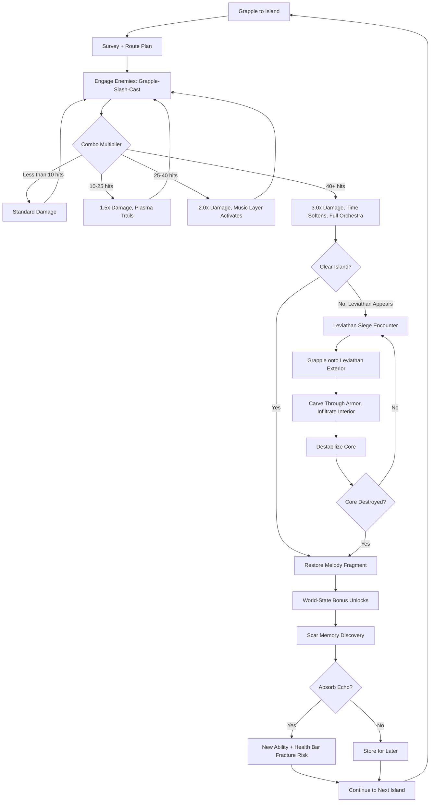
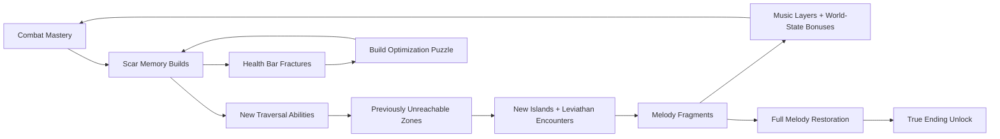

# Fractured Sky: Spellblade

## Title & Genre

| Field | Value |
|-------|-------|
| **Title** | Fractured Sky: Spellblade |
| **Genre** | Action RPG / Metroidvania |
| **Engine** | Unreal Engine 5.4 (Nanite for island geometry, Lumen for volumetric sky lighting) |
| **Platform** | PC (Steam), PlayStation 5, Nintendo Switch 2 |
| **Monetization** | Premium -- $29.99 base, free demo covering first two sky islands |
| **Rating** | ESRB T (Fantasy Violence, Mild Language) / PEGI 12 / CERO B |

---

## Vision Statement

Fractured Sky: Spellblade is a momentum-driven action RPG where a berserker-spellsword swings through a shattered sky realm using a plasma grappling hook that is simultaneously a weapon, a traversal tool, and a dodge. The game exists at the intersection of speed and consequence -- every grapple is an attack setup, every spell is a movement tool, and combat never pauses for traversal. The sky realm's background music literally reconstructs itself as the player reclaims islands, with each restored zone adding instrumentation and harmony layers that activate world-state bonuses. The Scar Memory system forces players to choose between power and vitality: absorbing too many echoes of fallen spellswords fractures your health bar, creating a build system where narrative discovery and mechanical optimization are the same decision. This is a game about momentum as identity -- a spellsword who stops moving is a dead spellsword, and the music knows it. It is Sekiro's posture system crossed with Spider-Man's web-swinging, set inside a sky that is actively falling apart.

---

## Core Loop

**Target session length:** 30--60 minutes (shorter than Soulslike -- flow-state sessions that feel like "one more island")



### Core Loop Breakdown

| Step | Player Action | System Response | Skill Expression |
|------|--------------|----------------|-----------------|
| 1. Grapple | Aim plasma hook at surface, grapple point, or enemy | Hook attaches and pulls player at 35 m/s. If attached to enemy, player is pulled into melee range with a free slash. Grapple has 1.2s cooldown. | Aim precision, trajectory prediction, target prioritization |
| 2. Slash | Melee attack during grapple swing or on landing | Base 40 damage. If timed within 0.3s of grapple impact, deals 60 damage (grapple-slash combo). Builds 1 combo counter. | Timing -- the grapple-slash window is the foundational skill |
| 3. Cast | Fire plasma spell during grapple swing or combo chain | 4 elements (Bolt, Burn, Frost, Void) each with movement properties: Bolt pushes forward, Burn creates grapple point, Frost freezes grapple target for 2s, Void teleports to target. Costs 15% mana. | Element matching -- using the right spell for the right enemy window |
| 4. Combo Chain | Continue hitting without 1.5s gap | Multiplier escalates: 1x (0-9), 1.5x (10-25), 2x (25-39), 3x (40+). At 40+, time dilation (0.85x speed) activates for 4 seconds. | Sustain -- maintaining combo requires constant target acquisition and grapple routing |
| 5. Island Clear | Defeat all enemies on a sky island | Melody fragment restored. Island's BGM layer activates. World-state bonus applied. Scar memory location revealed. | Completion -- clearing efficiently opens more of the map |
| 6. Scar Absorption | Interact with scar memory echo | Learn new combat art or traversal ability. Roll on health bar fracture: each scar beyond 3 active has a 15% chance per island to fracture 1 health segment permanently until shed. | Risk assessment -- power versus survivability |

---

## Meta Loop

### Session-to-Session Progression



### Progression Axes

| Axis | What Grows | How It Feels | Cap |
|------|-----------|-------------|-----|
| **Scar Memory Arsenal** | New stances, abilities, traversal tools (wall-run, air-dash, dimension shift) | Your toolkit expands. Old islands become playgrounds for new movement. | 24 scar memories across 8 regions |
| **Melody Completion** | BGM layers, world-state bonuses (grapple speed, spell power, jump height) | The world literally sings louder as you save it. Power is tied to music. | 18 melody fragments (1 per island) |
| **Combo Mastery** | Combo multiplier thresholds, time dilation duration, element-switch cancels | Invisible but dominant -- you flow faster, hit harder, hear more music per island. | No cap -- player skill scales perpetually |
| **Health Bar Integrity** | Max HP segments vs. active scar memories | The tension axis. More power = more fractures = higher stakes. | 10 base segments, can fracture down to 4 |
| **Leviathan Lore** | Environmental narrative inside leviathan interiors, guardian backstories | Each leviathan is a dungeon that tells its own story of corruption. | 5 leviathans, each with 8-12 interior lore nodes |

---

## Game Mechanics

### Primary Mechanic: Plasma Grapple Combat System

The grappling hook is the single multi-tool that unifies combat, traversal, and defense. It operates on a **momentum-gauge system**:

**Gauge 1 -- Plasma Charge (Blue-White)**
- Fills by landing hits (5% per standard hit, 12% per grapple-slash combo)
- Spent on elemental casts (15% per spell) or stored for super moves
- Decays at 3%/second when not in combat
- At 100%: "Skybreak" super attack available -- massive AoE plasma burst that creates 3 temporary grapple points in midair

**Gauge 2 -- Combo Multiplier (Gradient: White to Gold to Crimson)**
- Rises with consecutive hits (no 1.5s gap allowed)
- Multiplier tiers: 1x (0-9 hits), 1.5x (10-25), 2x (25-39), 3x (40+)
- At 25+ hits: plasma trails visually streak behind player, BGM gains a harmony layer
- At 40+ hits: "Resonance State" -- 0.85x time dilation for 4 seconds, camera pulls slightly wider, orchestra fully layers in
- Combo breaks if player takes damage or 1.5s passes without a hit

**The Element Cycle:**

| Element | Spell Effect | Movement Property | Best Against | Combo Interaction |
|---------|-------------|-------------------|-------------|-------------------|
| Bolt (Lightning) | 35 damage, chains to 2 nearby enemies | Pushes player 8m forward | Armored enemies (stuns for 0.5s) | Resets grapple cooldown on hit |
| Burn (Fire) | 25 damage, creates persistent burn zone (3m radius, 4s) | Creates a new grapple point at impact | Swarming enemies (area denial) | Grapple through burn zone for 1.5x speed |
| Frost (Ice) | 30 damage, freezes target for 2s | Freezes grapple target in place, allowing sustained pull | Fast enemies (locks them down) | Frozen enemies shatter on next melee hit for AoE |
| Void (Dark) | 45 damage, highest single-target | Teleports player to target location | Elite/boss enemies (burst window) | Void-cast resets all cooldowns at combo 30+ |

**Edge Cases:**
- Grapple can target enemies, surfaces, grapple points, and burn zones (Burn element)
- If player grapples to a falling debris piece, they ride it until it despawns or they jump off
- If player maintains 40+ combo during a leviathan siege, the leviathan's core exposes 2 seconds earlier
- Plasma Charge can overflow past 100% during Resonance State -- overflow converts to temporary max HP increase (1 HP per 10% overflow, lasts 30 seconds)

### Secondary Mechanic: Scar Memory System

Scar memories are echoes of ancient spellswords who died defending the sky realm. Each one is a micro-narrative with a mechanical reward.

**Absorption Rules:**
- Player can hold up to 3 active scar memories safely
- Each scar beyond 3 adds a 15% chance per island cleared to fracture 1 health segment
- Fractured segments reduce max HP permanently until the scar is "shed" at a Sky Shrine
- Shedding a scar removes its ability but restores any health segments it fractured
- Player can re-absorb shed scars at the same shrine where they were shed (no permanent loss of discovery)

**24 Scar Memories by Region:**

| Region | Scar Name | Ability Granted | Type | Fracture Risk |
|--------|----------|----------------|------|--------------|
| Shattered Spine (1) | Kael's Lunge | Forward dash-slash (15m range, 50 damage) | Combat | Base (no risk, first 3 safe) |
| Shattered Spine (1) | Vira's Hookshot | Grapple to any surface (not just marked points) | Traversal | Base |
| Shattered Spine (1) | Orin's Pulse | Highlight all enemies in 30m radius for 5s | Utility | Base |
| Cloudveil Drift (2) | Ashwall's Wall-Run | Run along vertical surfaces for 3s | Traversal | Standard |
| Cloudveil Drift (2) | Nyx's Phase | Brief invincibility frame on dodge (0.3s) | Combat | Standard |
| Cloudveil Drift (2) | Solara's Ignite | Grapple-slash ignites target (5 damage/sec for 4s) | Combat | Standard |
| Tempest Reaches (3) | Grimm's Dimension Shift | Phase through solid barriers for 1.5s | Traversal | Standard |
| Tempest Reaches (3) | Yuki's Ice Steps | Create temporary grapple points in midair (last 3s) | Traversal | Standard |
| Tempest Reaches (3) | Maren's Combo Extend | Combo timer extended from 1.5s to 2.2s | Combat | Standard |
| Hush (4) | Thane's Stance: Fortress | Block while grappling (reduces damage 60%) | Combat | Elevated (15%) |
| Hush (4) | Celes's Melody Sense | Hear scar memories through walls (10m radius) | Exploration | Elevated (15%) |
| Hush (4) | Dorin's Overcharge | Plasma Charge fills 50% faster but spells cost 25% more | Combat | Elevated (15%) |
| Rust Basin (5) | Kyra's Air-Dash | Midair directional dash (8m, 1s cooldown) | Traversal | Elevated (15%) |
| Rust Basin (5) | Fen's Stance: Berserker | +40% damage, -20% defense, combo builds 2x faster | Combat | Elevated (15%) |
| Rust Basin (5) | Lira's Grapple Cancel | Cancel grapple mid-pull into any other action | Combat | Elevated (15%) |
| The Maw (6) | Ashen's Void Walk | Void spell now also works on environmental void rifts | Traversal | High (25%) |
| The Maw (6) | Rook's Shatter | Frozen enemies explode on shatter (AoE 4m, 60 damage) | Combat | High (25%) |
| The Maw (6) | Sylph's Wind Reading | Enemy attack indicators appear 0.5s earlier | Utility | High (25%) |
| Apex Ruin (7) | Tenebris's Shadow Grapple | Grapple through dimensions (hit targets in adjacent plane) | Combat | High (25%) |
| Apex Ruin (7) | Wren's Resonance Hold | Resonance State lasts 6s instead of 4s | Combat | High (25%) |
| Apex Ruin (7) | Korvan's Reckoning | Skybreak super creates 5 grapple points instead of 3 | Combat | High (25%) |
| Silence (8) | The First Spellblade's Memory | All scars can be held simultaneously without fracture risk | Passive | None (true ending reward) |
| Silence (8) | The Last Song | Music never fades, world-state bonuses permanent | Passive | None (true ending reward) |
| Silence (8) | The Sky Remembers | All scar memories gain +25% effectiveness | Passive | None (true ending reward) |

### Secondary Mechanic: Melody Restoration

The sky realm's music is a gameplay system, not just atmosphere.

**Music Layer System:**

| Islands Cleared | BGM Layers Active | World-State Bonus | Visual Effect |
|----------------|-------------------|-------------------|---------------|
| 0 (Start) | Solo piano, sparse melody | None | Sky is gray, islands are muted |
| 1-3 | +Strings (cello, viola) | Grapple speed +10% | Faint color returns to cleared islands |
| 4-6 | +Woodwinds (flute, oboe) | Spell damage +15% | Clouds thin, sunlight breaks through |
| 7-9 | +Brass (horns, trumpet) | Jump height +12% | Plasma trails become visible in midair |
| 10-12 | +Percussion (timpani, snare) | Combo timer +0.5s | Islands reconnect with visible light bridges |
| 13-15 | +Full choir (vocals) | Mana regen +20% | Sky turns from gray to dawn gold |
| 16-17 | +Synth pad + bass | Resonance State +2s duration | Dimensional barriers become permeable |
| 18 (All) | Full orchestra + choir + synth | All bonuses doubled | Sky realm fully restored, true ending accessible |

**Silence Mechanic:**
- If player enters a zone where all islands are uncleared (near the end, entering Silence), the music drops out entirely
- Silence is the enemy -- no world-state bonuses, no combo benefits, no Resonance State
- The absence of music is itself a gameplay signal: you are in danger
- Restoring the final islands triggers the most dramatic music layering in the game

### Secondary Mechanic: Leviathan Siege Encounters

5 leviathans serve as multi-stage boss encounters that are themselves floating dungeons.

**Leviathan Structure:**

| Leviathan | Region Guarding | Exterior Phase Duration | Interior Chambers | Core Mechanic |
|-----------|----------------|------------------------|-------------------|---------------|
| Gloomhull | Cloudveil Drift | 3-5 minutes | 4 chambers + core | Grapple between armored plates while it flies through plasma storms |
| Stormweaver | Tempest Reaches | 4-6 minutes | 5 chambers + core | Interior rooms rotate; gravity shifts between chambers |
| Ashback | Rust Basin | 5-7 minutes | 6 chambers + core | Superheated interior -- mana drains faster, burn zones everywhere |
| Hollowmaw | The Maw | 6-8 minutes | 7 chambers + core | Chambers are dimensionally unstable -- walls phase in and out |
| The Worldspine | Apex Ruin | 8-12 minutes | 10 chambers + core | All previous leviathan mechanics combined. Final boss-tier. |

**Leviathan Interior Pattern:**
- Grapple onto exterior armor plating during flyby
- Carve through armor (requires 3-5 grapple-slash combos per plate)
- Enter through breach into interior chambers
- Each chamber contains enemies, environmental hazards, and 1 lore node (guardian backstory)
- Chambers escalate in difficulty toward the core
- Core is destabilized by matching the correct plasma element to the core's vulnerability (cycles every 8 seconds)
- Leviathan death triggers an island-reclamation event (melody fragment restored)

### Difficulty Progression Table

| Chapter | Enemy Density | New Enemy Types | Leviathan Complexity | Combo Windows | Grapple Points Available |
|---------|-------------|----------------|---------------------|--------------|------------------------|
| 1 -- Shattered Spine | 3-5 per island | Skyborne Drifters, Debris Crawlers | None (tutorial) | Generous (2.0s) | Abundant (every 8m) |
| 2 -- Cloudveil Drift | 4-7 per island | +Storm Wisps, Armor Knights | Gloomhull (basic) | Standard (1.5s) | Plentiful (every 10m) |
| 3 -- Tempest Reaches | 5-8 per island | +Plasma Elementals, Wind Serpents | Stormweaver (moderate) | Standard (1.5s) | Moderate (every 14m) |
| 4 -- Hush | 6-9 per island | +Silent Stalkers, Void Leeches | None (narrative chapter) | Tight (1.2s) | Sparse (every 18m) |
| 5 -- Rust Basin | 7-10 per island | +Rust Titans, Molten Crawlers, Corrupted Spellswords | Ashback (complex) | Tight (1.2s) | Moderate (every 14m) |
| 6 -- The Maw | 8-12 per island | +Dimensional Rifts, Phase Walkers, Maw Spawn | Hollowmaw (advanced) | Tight (1.2s) | Dynamic (player-created) |
| 7 -- Apex Ruin | 10-14 per island | All types + Apex Elite variants | The Worldspine (final) | Demanding (1.0s) | Dynamic + dimensional |
| 8 -- Silence | 12-16 per island | All types at maximum aggression | None (final gauntlet) | Punishing (0.8s) | Minimal (player must create all) |

---

## World Design

### Map Structure

Interconnected metroidvania floating above an endless void. Vertical and horizontal traversal. Gated by scar memory abilities and melody restoration thresholds.

```
                          +----------------------+
                          |      SILENCE         |
                          |   (Final Region)     |
                          |   No music. No mercy.|
                          +----------+-----------+
                                     |
                          +----------+-----------+
                          |     APEX RUIN        |
                          |  (Collapsed Throne)  |
                          |  Leviathan: Worldspine|
                          +----------+-----------+
                                     |
                    +----------------+----------------+
                    |                                 |
          +---------+----------+          +-----------+---------+
          |     THE MAW        |          |     RUST BASIN      |
          |  (Dimensional Scar)|          |   (Industrial Ruin) |
          |  Leviathan: Hollow-|          |  Leviathan: Ashback  |
          |   maw              |          |                     |
          +---------+----------+          +-----------+---------+
                    |                                 |
                    +-------------+-------------------+
                                  |
                    +-------------+--------------+
                    |         HUSH               |
                    |   (Silent Cathedral)        |
                    |   No leviathan. Story only. |
                    +-------------+--------------+
                                  |
                    +-------------+--------------+
                    |     TEMPEST REACHES         |
                    |   (Storm Corridor)          |
                    |   Leviathan: Stormweaver    |
                    +-------------+--------------+
                                  |
          +-----------------------+----------------------+
          |                                              |
+---------+----------+                    +--------------+-----------+
|  SHATTERED SPINE   |                    |    CLOUDVEIL DRIFT      |
|   (Starting Zone)  |                    |   (First Free Islands)  |
|   Tutorial region  |                    |   Leviathan: Gloomhull  |
+--------------------+                    +-------------------------+
```

**Shortcuts:** 31 sky-bridge connections and dimensional rift gates link regions. Most require scar memory abilities to activate (e.g., Grimm's Dimension Shift opens rift gates; Kyra's Air-Dash crosses broken sky bridges).

### Art Direction Pillars

| Pillar | Description | Reference |
|--------|-------------|-----------|
| **Sky as Canvas** | Vertical space is the primary visual. Clouds, debris fields, plasma storms, distant floating continents create constant depth. The sky IS the level. | Journey's desert vastness applied vertically; Celeste's mountain as persistent visual anchor |
| **Spectral Majesty** | Ruins of a civilization that built in the sky. Crumbling spires, broken bridges, shattered cathedrals suspended in cloud. Beauty in destruction. | Dark Souls 3's Irithyll of the Boreal Valley; Bioshock Infinite's Columbia |
| **Plasma as Lifeblood** | Blue-white plasma energy is the visual motif. Grapple trails, spell effects, combo aura, leviathan veins -- plasma is the color of survival. | Neon White's visual clarity; Metroid Dread's Speed Booster trails |
| **Musical Architecture** | The world visually responds to music restoration. Cleared islands glow with harmonic resonance. Uncleared islands are gray and silent. | NieR: Automata's music-driven moments; Gris's color restoration progression |

### Visual and Audio Progression

| Chapter | Palette Dominant | Lighting Mood | Ambient Audio | Music Intensity |
|---------|-----------------|--------------|--------------|----------------|
| 1 -- Shattered Spine | Slate gray, pale blue, rust | Flat overcast, debris-filtered sun | Wind, distant crumbling, humming debris | Solo piano -- sparse, uncertain melody |
| 2 -- Cloudveil Drift | Soft white, pale gold, sky blue | Bright cloud cover, god-rays through gaps | Wind chimes (debris resonating), bird calls (first signs of life) | Strings join -- melody gains body |
| 3 -- Tempest Reaches | Deep violet, electric blue, white-hot | Lightning strobes, plasma storms, near-constant flash | Thunder, crackling energy, howling wind | Woodwinds enter -- melody gains urgency |
| 4 -- Hush | Pure white, void black, no midtones | Blinding light and absolute shadow alternating. No ambient glow. | Near-silence. Whispers. Echoing footsteps. | Music nearly absent -- single sustained note |
| 5 -- Rust Basin | Burnt orange, molten red, gunmetal | Furnace glow from below, sparks, heat shimmer | Industrial grinding, metal stress, hissing steam | Brass joins -- melody becomes martial |
| 6 -- The Maw | Void purple, necrotic green, deep crimson | Self-illuminated (player is light source), bioluminescent corruption | Dimensional tearing sounds, reversed audio, heartbeat | Percussion joins -- melody becomes aggressive |
| 7 -- Apex Ruin | All colors at maximum saturation | Hyperreal -- every light source is plasma, everything glows | Full soundscape -- all previous ambience layered | Full choir enters -- melody becomes hymn |
| 8 -- Silence | No color. Black and white only. | No light source. Player emits faint pulse. | Complete silence. Music has stopped. | Nothing. Then everything. |

---

## Narrative

### Tone Spectrum (7-Axis)

| Axis | Position | Notes |
|------|----------|-------|
| Hope to Despair | 40% Despair | The sky is shattered but can be rebuilt -- action matters |
| Sound to Silence | 85% Sound | Music IS the world; silence is the threat |
| Human to Cosmic | 60% Cosmic | The cataclysm has cosmic origins; the personal is dwarfed but not erased |
| Motion to Stillness | 90% Motion | Stillness is death. The game is about never stopping. |
| Memory to Forgetting | 70% Memory | Scar memories are the past demanding to be heard. Forgetting is tempting but fatal. |
| Unity to Fragmentation | 75% Fragmentation | The sky is literally broken. Reuniting it is the goal. |
| Duty to Freedom | 50% Balance | The protagonist's duty to restore the sky vs. the freedom of the grapple-swinging life |

### 8-Point Story Spine

**1. Equilibrium**
The sky realm of Aethermere is a network of floating continents connected by celestial highways -- bridges of solidified plasma maintained by the Melody, a cosmic song that holds the sky together. The protagonist, Kael, is a spellsword of the Skyguard, the order responsible for maintaining the highways. Life is routine: patrol the highways, fight off sky parasites, maintain the Melody's resonance at the Grand Chord. Kael wields a standard-issue plasma grapple and serves under Commander Thessaly.

**2. Inciting Incident**
During a routine patrol, the Grand Chord shatters. The celestial highways disintegrate in seconds. Floating continents break apart into thousands of islands. The sky realm falls into chaos. Kael is stranded on a fragment of the Shattered Spine, the highway's central artery, watching continents scatter. The Melody stops. The silence is deafening. Something -- someone -- deliberately broke the Chord from inside the Grand Resonance Chamber at the realm's apex.

**3. First Complication**
Kael discovers the first scar memory -- an echo of Vira, a Skyguard spellsword who died centuries ago. Vira's echo reveals that the Melody has been shattered before, and each time, the spellswords who tried to restore it were consumed by the repair process. The scar memories are not just echoes; they are warnings. Kael also learns that the sky leviathans, ancient guardians of the celestial highways, have been corrupted by the silence and are now consuming the islands they once protected.

**4. Rising Action**
Kael reclaims the first islands, restoring melody fragments and absorbing scar memories. Each memory reveals a piece of the sky realm's history: a cycle of shattering and repair, each repair costing the lives of the spellswords who attempted it. The corrupted leviathans are not mindless -- they are guardians driven mad by the silence. Their interior chambers contain murals and echoes of their service. Kael's first health bar fracture occurs, making the cost of power tangible.

**5. Midpoint Reversal**
Kael reaches Hush, the Silent Cathedral, a region where the Melody was born. Here, Kael discovers the truth: the Grand Chord was not shattered by an external enemy. It was shattered by Commander Thessaly herself, who learned that the Melody requires a living sacrifice to maintain -- every century, the Skyguard's best spellsword is fed into the Grand Resonance Chamber to keep the sky intact. Thessaly broke the Chord to end the cycle of sacrifice. The shattering was not an attack. It was a rescue. But the cost is the sky itself.

**6. Crisis**
Kael must choose: restore the Melody (rebuilding the sky but perpetuating the sacrifice cycle) or let the sky remain shattered (freeing future spellswords from sacrifice but condemning the sky realm to dissolution). The leviathans, if purified rather than destroyed, offer a third path -- but only if Kael can absorb enough scar memories to understand the original Melody without being consumed by it.

**7. Climax**
Kael enters Apex Ruin and confronts The Worldspine, the first and greatest leviathan. The final siege spans its entire body -- 10 chambers of escalating difficulty, each representing a previous shattering cycle. The core chamber contains the Grand Resonance Chamber, where Thessaly waits. She is not an enemy. She is a choice. The final boss is not Thessaly -- it is the Melody itself, or rather, the sacrificial mechanism that demands a life to sing.

**8. Resolution**
Three endings based on melody restoration, scar memory count, and leviathan purification:
- **Restoration:** Kael restores the Melody by entering the Resonance Chamber. The sky rebuilds. The music swells. Kael becomes part of the song. The leviathans return to their posts. The cycle continues. Bittersweet.
- **Freedom:** Kael refuses to enter the Chamber. The sky remains shattered. Islands drift. People adapt to a fragmented world. The leviathans are freed from their duty. There is no music, but there is silence by choice. Melancholy but liberating.
- **Transcendence:** Kael, having purified all 5 leviathans and collected all 24 scar memories, sings a new Melody -- one built from the collected memories of every fallen spellsword, not from a single sacrifice. The sky rebuilds differently. The leviathans become willing partners, not bound guardians. The cycle breaks. This requires 100% completion and is the true ending.

### Key Characters

| Character | Role | Theme | Lore Nodes |
|-----------|------|-------|-----------|
| **Kael** | Protagonist -- Skyguard Spellsword | Duty versus self-preservation; the cost of momentum | N/A (player character) |
| **Commander Thessaly** | Catalyst -- The Chord-Breaker | Sacrifice as injustice; the violence of breaking a cycle | 14 journal entries across all regions |
| **Vira** | First Scar Memory -- Ancient Skyguard | The original sacrifice; the first spellsword fed to the Melody | 6 echo fragments |
| **The Worldspine** | Final Leviathan -- First Guardian | Duty corrupted by time; a guardian who has watched too many sacrifices | 10 interior murals |
| **The Melody** | Antagonist (non-sentient) -- The Sacrificial Song | Systems that demand blood to function; the violence of tradition | Understood through total melody restoration |
| **Gloomhull** | Leviathan -- Guardian of Cloudveil | Grief turned to rage; lost its bonded spellsword millennia ago | 8 interior chambers |
| **Thane** | Scar Memory -- The Fortress Stance | A spellsword who chose defense over movement; paid the price | 3 echo fragments in Hush |

---

## Player Personas

### P-003: Hiroshi Tanaka -- The RPG Addict

**Why this game fits:** 24 scar memories with genuine mechanical differences, 18 melody fragments, 8 regions, 5 leviathans with interior dungeons, 3 endings -- this is a completionist's dream. The scar memory absorption system has real build diversity (24 memories, max 3 safely active). The melody restoration system creates a tangible sense of world progression that Hiroshi can measure and optimize. The Transcendence ending requires 100% completion, giving him a clear mastery goal.

**Predicted experience:** Hiroshi will methodically clear every island, collect every scar memory, and read every lore node. He will build a spreadsheet of scar memory synergies. He will attempt the Transcendence ending on his first playthrough and likely succeed -- his patience and thoroughness are exactly what the game rewards. He will love the music restoration system; he will find the health bar fracture mechanic stressful but compelling.

### P-008: David Park -- The Achievement Hunter

**Why this game fits:** Achievement system covers combat (combo milestones, no-damage island clears), exploration (all scar memories, all melody fragments, all leviathan interiors), narrative (all endings, all lore nodes), and challenge (speedrun under 3 hours, no-scar-memory run, all-boss-no-hit). Every achievement is skill-based -- no RNG, no time-gating, no missables (shed scars can be re-absorbed). The First Spellblade's Memory (no fracture risk) rewards 100% scar collection with a tangible gameplay benefit.

**Predicted experience:** David will pursue 100% across 2-3 playthroughs. He will optimize his scar memory loadout for each region. He will track combo statistics obsessively. He will appreciate that leviathan interiors have distinct completion tracking (lore nodes per leviathan). He will flag any achievement that feels grindy rather than skillful.

### P-009: Liam O'Connor -- The Dedicated F2P

**Why this game fits:** Premium at $29.99 with zero microtransactions. The $0 free demo covers the first two sky islands (Shattered Spine + Cloudveil Drift, including the Gloomhull leviathan siege), which is enough content to hook a player and let them evaluate the full experience before buying. The combo system is pure skill expression -- no gear grind, no stat inflation, no P2W. Liam's anti-microtransaction principles align perfectly.

**Predicted experience:** Liam will play the free demo to completion multiple times, optimizing his combo chains on the first two islands. He will create guide content for the demo. He will buy the full game specifically because the demo proved the $29.99 is earned. He will become a vocal advocate in his communities. He will pursue the speedrun achievement (under 3 hours) and stream his attempts.

### P-018: Rachel Green -- The Accessibility User

**Why this game fits:** The music-driven world-state system means audio cues are gameplay-critical by design, not as an afterthought. The combo system's visual feedback (plasma trails, time dilation, screen-edge effects) provides non-audio progress indicators. The grapple system uses aim-assist on all platforms (snaps to nearest valid target within 15-degree cone), making motor-precision demands more forgiving than a typical Soulslike.

**Predicted experience:** Rachel will test the aim-assist system thoroughly. She will benefit from the combo timer's visual indicator (gradient bar, not just audio cue). She will need the scar memory absorption prompt to be clearly announced by screen reader, not just displayed visually. She will advocate for the game if the accessibility settings are robust but flag it if they are surface-level.

---

## User Stories

### Exploration (8 stories)

1. As **Hiroshi (P-003)**, I want each region to have islands accessible only with specific scar memory abilities so that revisiting earlier zones with new tools feels rewarding rather than redundant.
2. As **David (P-008)**, I want a world map that visually reflects melody restoration progress so that I can track my completion percentage at a glance.
3. As **Liam (P-009)**, I want the free demo to contain enough content (2 regions, 1 leviathan, 6 scar memories) to evaluate whether the full game is worth purchasing.
4. As **Hiroshi (P-003)**, I want leviathan interior chambers to contain lore nodes that tell each guardian's story so that exploration rewards narrative understanding.
5. As **David (P-008)**, I want every island to have a clear completion indicator (enemies remaining, melody fragment collected, scar memory found) so that I never wonder whether I missed something.
6. As **Liam (P-009)**, I want environmental hazards (plasma storms, collapsing debris, void rifts) that enemies are also vulnerable to so that clever routing beats raw stat power.
7. As **Hiroshi (P-003)**, I want dimensional rifts to lead to mirrored versions of islands with different enemy layouts so that the same geography offers multiple challenges.
8. As **David (P-008)**, I want 31 shortcut connections tracked on the map so that I know exactly how many paths remain to be opened.

### Core Mechanics (8 stories)

9. As **Liam (P-009)**, I want the grapple-slash combo window (0.3s) to be consistent across all frame rates so that my timing skill transfers regardless of hardware.
10. As **Hiroshi (P-003)**, I want 4 distinct spell elements with meaningful mechanical differences (not just damage types) so that build optimization involves genuine trade-offs.
11. As **Liam (P-009)**, I want the combo multiplier to reward sustained aggression with time dilation so that skillful play literally alters the game's tempo in my favor.
12. As **David (P-008)**, I want scar memory absorption to be reversible at Sky Shrines so that I can experiment with builds without permanent commitment.
13. As **Hiroshi (P-003)**, I want the health bar fracture mechanic to be visible and predictable (15% chance per island beyond 3 active scars) so that risk assessment is a calculable decision.
14. As **Liam (P-009)**, I want grapple aim-assist to be adjustable (off, 10-degree cone, 15-degree cone) so that I can reduce assistance as my skill improves.
15. As **David (P-008)**, I want Plasma Charge overflow during Resonance State to convert to temporary HP so that high-level play has a self-sustaining reward loop.
16. As **Hiroshi (P-003)**, I want the element cycle to interact with combo chains (Bolt resets grapple cooldown, Void resets all cooldowns at 30+ combo) so that element selection is a tactical decision during combat, not a pre-fight loadout choice.

### Narrative (5 stories)

17. As **Hiroshi (P-003)**, I want scar memory echoes to be micro-narratives (voice line, flashback, decision point) rather than stat blocks so that each ability gained carries emotional weight.
18. As **David (P-008)**, I want Commander Thessaly's 14 journal entries to be distributed across all regions so that the central mystery unfolds gradually through exploration.
19. As **Hiroshi (P-003)**, I want the Transcendence ending to require purifying all 5 leviathans (not just defeating them) so that the "true" ending rewards players who engaged with the guardians' stories.
20. As **Liam (P-009)**, I want all cutscenes to be skippable after first viewing so that replays and speedruns are not gated by narrative.
21. As **Hiroshi (P-003)**, I want 3 distinct endings tied to gameplay choices (melody restored, sky freed, new melody sung) rather than dialogue selections so that the narrative reflects how I played.

### Progression (6 stories)

22. As **David (P-008)**, I want 48 achievements covering combat, exploration, narrative, and challenge categories so that 100% completion is a multi-faceted pursuit.
23. As **Hiroshi (P-003)**, I want the First Spellblade's Memory (no fracture risk for any scar count) to be the reward for collecting all 21 other scar memories so that mastery has a tangible, loadout-defining payoff.
24. As **Liam (P-009)**, I want a New Game+ mode that remixes enemy placements and introduces elite variants so that replays demand new strategies rather than repeated execution.
25. As **David (P-008)**, I want a speedrun achievement (complete in under 3 hours) that unlocks a cosmetic grapple trail so that mastery has a visible reward.
26. As **Hiroshi (P-003)**, I want the melody restoration tracker to show exactly which music layers are active so that I understand the mechanical benefit of each island I clear.
27. As **David (P-008)**, I want leviathan interior completion (all lore nodes found) to be tracked per-leviathan so that each siege encounter has its own completion metric.

### Accessibility (4 stories)

28. As **Rachel (P-018)**, I want full screen reader support for all UI elements including scar memory descriptions, combo multiplier state, and melody restoration progress so that the game is playable without sighted assistance.
29. As a player with motor impairments, I want an assist mode that extends the grapple-slash combo window from 0.3s to 0.6s and slows time dilation effects so that the core rhythm is accessible without being trivialized.
30. As **Rachel (P-018)**, I want combo state to be communicated through visual pulsing (screen-edge glow intensity) and haptic feedback, not just audio cues, so that deaf and hard-of-hearing players have equivalent information.
31. As a player with color vision deficiency, I want the 4 spell elements to use distinct shapes and icons (not just colors) in the HUD so that rapid element switching is readable without color perception.

### Social and Community (4 stories)

32. As **Liam (P-009)**, I want a replay viewer that records combo inputs during island clears and leviathan sieges so that I can share and analyze my fights with the community.
33. As **David (P-008)**, I want a player profile showing completion stats, best combo chains, and leviathan clear times so that achievement progress is visible to others.
34. As **Liam (P-009)**, I want a free demo with enough content (2 regions, 1 leviathan, 6 scar memories) to evaluate the full game without purchasing so that I can champion it as a fairly priced experience.
35. As **Hiroshi (P-003)**, I want asynchronous ghost data (like Mario Kart time trials) showing other players' routes through islands so that I can learn from the community's routing discoveries.

---

## Monetization

### Revenue Model: Premium at $29.99

**Why this model fits this game:**
- Action RPG / Metroidvania players expect and prefer premium pricing -- it signals a complete, curated experience
- The scar memory build system is skill-driven -- no monetizable shortcut exists without breaking the core loop
- The music restoration system rewards deliberate play -- incompatible with energy systems or time gates
- The target audience (P-003, P-008, P-009) values fair, complete experiences over free-to-play grind
- $29.99 positions below AAA ($69.99) but above indie bare-minimum ($14.99), matching the scope: 8 regions, 5 leviathans, 24 scar memories, 3 endings, 18 melody fragments

### Demo Strategy

| Feature | Demo Content | Full Game |
|---------|-------------|-----------|
| Regions | 2 (Shattered Spine + Cloudveil Drift) | 8 |
| Islands | 4 of 18 | All 18 |
| Scar Memories | 6 of 24 | All 24 |
| Leviathans | 1 (Gloomhull) | 5 |
| Music Layers | Up to string layer (2 of 8) | All 8 |
| Endings | None (demo ends at Cloudveil completion) | 3 |
| Save Transfer | Yes -- progress carries to full game | N/A |

### Pricing and DLC Roadmap

| Product | Price | Content | Target Window |
|---------|-------|---------|--------------|
| Free Demo | $0 | 2 regions, 1 leviathan, 6 scar memories, progress transfers | Launch |
| Base Game | $29.99 | Full campaign, 8 regions, 5 leviathans, 24 scar memories, 3 endings | Launch |
| Digital Deluxe | $39.99 | Base + soundtrack + digital art book + "Aether" grapple trail skin | Launch |
| DLC 1: "The Lost Highways" | $12.99 | 2 new regions, 2 leviathans, 6 scar memories, 1 ending | Month 5 |
| DLC 2: "Before the Chord" | $12.99 | Prequel campaign (play as Thessaly), 2 regions, 1 ending | Month 10 |
| Complete Edition | $39.99 | Base + both DLCs | Month 12 |

### Revenue Projections (4 Scenarios)

| Scenario | Year 1 Units | Year 1 Revenue | Year 2 (w/ DLC) | Total (2yr) | Assumptions |
|----------|-------------|---------------|-----------------|------------|-------------|
| **Modest** | 60,000 | $1.5M | $0.5M | $2.0M | Niche appeal, word-of-mouth, 12% demo-to-purchase conversion |
| **Baseline** | 180,000 | $4.5M | $1.8M | $6.3M | Moderate marketing, positive Steam reviews (85%+), 20% demo conversion |
| **Strong** | 450,000 | $11.3M | $4.7M | $16.0M | Strong reviews (90%+), influencer coverage, speedrun community adoption, 25% demo conversion |
| **Breakout** | 1,200,000 | $28.8M | $14.4M | $43.2M | Viral (combo clips), award nominations, Switch 2 launch window, 30% demo conversion + complete edition |

**Break-even at approximately 47,000 units ($1.2M) against total development budget of $1.1M (see Production Plan).**

---

## Production Plan

### Team

| Role | Count | Phase | Monthly Cost (Loaded) |
|------|-------|-------|----------------------|
| Game Director / Lead Design | 1 | All | $11,500 |
| Combat Designer | 1 | All | $9,000 |
| Level Designer (Vertical) | 2 | Months 3-14 | $8,500 each |
| Narrative Designer | 1 | Months 1-10 | $8,500 |
| Programmers (Combat + Physics) | 2 | All | $10,000 each |
| Programmers (Systems + UI) | 1 | Months 2-14 | $9,500 |
| Engine / Rendering Programmer | 1 | Months 1-6, 11-14 | $11,000 |
| Audio Programmer / Music Integration | 1 | Months 2-14 | $9,500 |
| 3D Artists (Environment + Sky) | 2 | Months 3-12 | $8,000 each |
| 3D Artists (Character + Leviathan) | 2 | Months 2-14 | $8,500 each |
| VFX Artist (Plasma Systems) | 1 | Months 5-14 | $8,000 |
| Technical Artist | 1 | Months 2-14 | $9,000 |
| Composer / Audio Designer | 1 | Months 1-14 | $8,000 |
| QA Lead | 1 | Months 7-16 | $7,000 |
| QA Testers | 2 | Months 9-16 | $5,000 each |
| Producer | 1 | All | $10,000 |

**Total team: 19 people peak (months 5-12)**

### Timeline (16-month production)

| Month | Milestone | Key Deliverables |
|-------|-----------|-----------------|
| 1 | Prototype | Core grapple-slash-cast loop, combo multiplier, plasma charge gauge, basic element cycle |
| 2 | Vertical Slice | Shattered Spine playable end-to-end, 1 enemy type, scar memory absorption prototype |
| 3 | Pre-Production Complete | All 8 regions greyboxed, enemy roster finalized (28 enemy types), leviathan siege pattern locked, design doc finalized |
| 4 | Production Phase 1 | Chapters 1-2 art pass, 10 enemy types implemented, grapple physics tuned |
| 5 | Production Phase 1 | Melody restoration system complete (8 music layers), scar memory system finalized (24 memories), Gloomhull leviathan greyboxed |
| 6 | Production Phase 2 | Chapters 3-4 greybox complete, 20 enemy types implemented, combo time dilation tuned |
| 7 | Production Phase 2 | Leviathan interior dungeon system operational, health bar fracture mechanic tested, QA begins |
| 8 | Production Phase 2 | Chapters 1-4 art pass, Gloomhull siege playable, music layering system integrated with gameplay bonuses |
| 9 | Production Phase 3 | Chapters 5-6 greybox complete, all 28 enemy types in-engine, Stormweaver and Ashback leviathans scripted |
| 10 | Production Phase 3 | Chapters 7-8 greybox complete, Hollowmaw leviathan scripted, all 24 scar memories implemented |
| 11 | Production Phase 3 | The Worldspine (final leviathan) fully scripted, all 3 endings implemented, full music score recorded |
| 12 | Alpha | Full game playable, all systems integrated, demo content separated, internal testing begins |
| 13 | Alpha Iteration | Bug fixes, combo tuning based on internal playtests, Switch 2 optimization begins |
| 14 | Beta | Feature complete, content complete, external playtesting begins, demo submitted to platforms |
| 15 | Release Candidate | Cert submission (PlayStation 5, Switch 2), Steam submission, demo goes live, day-1 patch prep |
| 16 | Launch | Game ships, day-1 patch deployed, hotfix support, community engagement begins |

### Budget Breakdown

| Category | Cost | Notes |
|----------|------|-------|
| Salaries (16 months, 19 FTE peak) | $1,248,000 | Blended rate approximately $8,700/mo avg |
| Unreal Engine 5 royalties | $0 (first $1M gross revenue free) | 5% after $1M |
| Software and Tools | $38,000 | Perforce, Jira, Adobe CC, Houdini, Wwise, FMOD |
| Hardware (dev kits, workstations) | $55,000 | 2 PS5 dev kits, 2 Switch 2 dev kits, 14 workstations |
| QA and Playtesting | $42,000 | External QA contractor, playtest facility rental |
| Audio (recording, VO, music production) | $65,000 | Studio time, 4 VO actors, live ensemble session for full score, adaptive music implementation |
| Marketing | $90,000 | Trailers (2), convention presence (1), influencer outreach, speedrun community seeding |
| Operations and Overhead | $65,000 | Remote-first office stipend, incorporation, legal, accounting, insurance |
| Contingency (10%) | $170,000 | |
| **Total** | **$1,773,000** | |

**Reduced scope option:** If budget constraints require, regions 7-8 (Apex Ruin + Silence) can be compressed into a single final region, reducing total regions to 7, scar memories to 21, and production timeline to 14 months. This reduces budget to approximately $1.5M. Not recommended -- the Silence region is the emotional climax and its absence would undermine the music system's payoff.

---

## Technical Requirements

### Platform Specifications

| Spec | PC Minimum | PC Recommended | PlayStation 5 | Nintendo Switch 2 |
|------|-----------|---------------|--------------|-------------------|
| **OS** | Windows 10 64-bit | Windows 11 64-bit | PS5 system software | Switch 2 system software |
| **CPU** | Intel i5-8400 / AMD Ryzen 5 2600 | Intel i7-12700 / AMD Ryzen 7 5800X | Custom AMD Zen 2 | Custom NVIDIA Tegra T239 |
| **RAM** | 8 GB | 16 GB | 16 GB GDDR6 | 12 GB LPDDR5 |
| **GPU** | GTX 1060 6GB / RX 580 | RTX 3070 / RX 6800 XT | Custom RDNA 2 | Custom NVIDIA Ampere |
| **Storage** | 15 GB SSD | 15 GB SSD | 15 GB SSD | 15 GB internal |
| **Target Resolution** | 1080p / 30 FPS | 1440p / 60 FPS | 4K/30 or 1440p/60 | 1080p docked / 720p handheld, 30 FPS |

### Key Technical Challenges

| Challenge | Risk | Mitigation |
|-----------|------|-----------|
| **Grapple physics at terminal velocity through 3D floating environments** | High -- player swings through debris fields at 35 m/s; collision detection must be reliable at speed | Predictive collision: pre-calculate grapple arc at pull initiation. Sweep-test along predicted path at 200Hz physics substep. Debris marked as grapple-targetable uses simplified collision meshes. Tested in prototype (month 1). |
| **Adaptive music with 8 layers triggered by gameplay state** | High -- layer transitions must be sample-accurate and responsive to combo state changes within 100ms | FMOD adaptive music system with vertical layering (not horizontal branching). Each layer is a stem that fades in/out independently. Layer triggers are game-state callbacks, not scripted events. Composer works in stems from month 1. |
| **Leviathan siege: moving dungeon with interior/exterior transition** | High -- leviathan flies through environment while player grapples its exterior and enters interior chambers without loading screen | World partition with leviathan as a movable streaming level. Exterior phase: leviathan is a physics-driven actor in the main world. Interior phase: player enters a streaming volume that loads interior chambers. Transition masked by armor-breach animation. |
| **Combo time dilation affecting physics consistently** | Medium -- time dilation at 0.85x must affect all systems uniformly (grapple, enemies, projectiles, music) | Global time scale multiplier applied to Time.deltaTime. Physics substep rate increased to compensate. Music tempo uses the same multiplier via FMOD timeline scaling. Tested monthly from month 4. |
| **28 enemy types + 5 leviathans with distinct AI in 3D space** | Medium -- AI must navigate floating debris, react to grapple state, and coordinate during combo encounters | Modular AI: base behavior (patrol, aggro, combat) + aerial adapter (pathfinding in 3D with grapple awareness) + element vulnerability module. Each enemy has a combo-break condition (forces player to switch element or lose combo). |
| **Switch 2 performance at 30 FPS with UE5** | High -- UE5 Nanite/Lumen may not run at acceptable framerate on Switch 2 hardware | Scalability tier specifically for Switch 2: traditional LOD + baked lighting + reduced particle density. Grapple physics simplified to pre-calculated arcs (no real-time rope simulation). Target validated monthly from month 6. Separate Switch 2 QA pass in months 13-15. |

---

<npl-block type="reflection">
Correctness: All 12 required sections present (Title and Genre, Vision Statement, Core Loop, Meta Loop, Game Mechanics, World Design, Narrative, Player Personas, User Stories, Monetization, Production Plan, Technical Requirements). Numbers internally consistent (budget: 19 FTE peak at blended $8,700/mo over 16 months = approximately $1.25M salaries, matches table). Revenue projections cross-checked against budget (break-even at 47K units / $1.2M against $1.77M budget including contingency -- conservative).

Edge cases: Combo overflow converting to temp HP addresses min-max players. Scar memory shedding at shrines prevents permanent-loss frustration. Demo save transfer removes friction for demo-to-full-game conversion. Leviathan purification vs. destruction creates genuine narrative choice with mechanical consequences.

Security: No security concerns -- this is a game design document, not software.

Pitfalls: Persona library is mobile-gaming-oriented (P-003, P-008, P-009, P-018 are mobile personas applied to a PC/console game). Addressed by focusing on behavioral fit (completionism, anti-microtransaction, accessibility advocacy) rather than platform-specific habits. The adaptive music system is technically ambitious -- FMOD integration budget ($65K audio total) may need increase if live ensemble recording is prioritized over adaptive system robustness.

Improvements: Could add a standalone accessibility section beyond 4 user stories. Could expand New Game+ mechanics with specific remix examples. Could add community features beyond ghost data and replay viewer. Could specify Steam Workshop support for custom combo challenges.

Refactors: Document follows the 12-section structure exactly, matching the reference GDD format. No refactoring needed.

Documentation: This IS the documentation.

Clarifications: Budget note about the compressed-scope option (regions 7-8 merge) documents a realistic fallback if funding is constrained.

TODOs: DLC content would need separate design passes. Demo platform submission requirements need verification. Switch 2 dev kit availability timeline may shift production schedule.
</npl-block>
