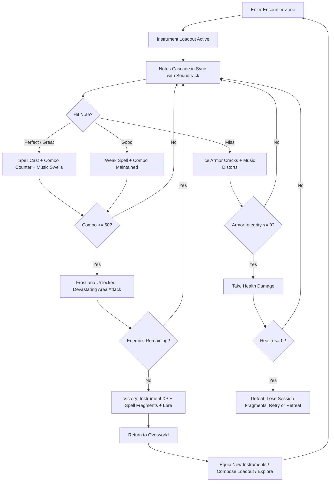
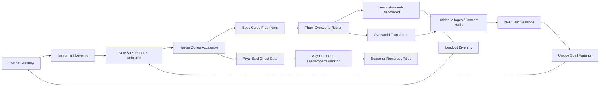

# Frost Bard's Reckoning

## Title & Genre

| Field | Value |
|-------|-------|
| **Title** | Frost Bard's Reckoning |
| **Genre** | Rhythm Action RPG |
| **Engine** | Unity (URP) — cross-platform rhythm input pipeline, audio-visual sync, mobile cloud support |
| **Platform** | PC (Steam/Epic), PlayStation 5, Nintendo Switch, iOS/Android (cloud streaming via GeForce NOW / Xbox Cloud) |
| **Monetization** | Premium — $39.99 base, cosmetic instrument skins DLC |
| **Rating** | ESRB T (Fantasy Violence, Mild Lyrics) / PEGI 12 / CERO B |

---

## Vision Statement

Frost Bard's Reckoning is a rhythm action RPG where you play a wandering frost bard whose songs literally freeze reality. Notes cascade down the screen in sync with an original orchestral soundtrack, and hitting them perfectly unleashes ice spells, shields, and devastating frost arias against enemies. Miss too many notes and your protective ice armor cracks, exposing you to damage. Between battles, you explore a frozen continent thawed by an ancient curse, discovering new instruments, composing custom song-loadouts, and challenging rival bards to musical duels where the battlefield itself shifts to the winner's melody.

The game exists at the intersection of music and violence, where every button press is simultaneously a note in a song and a tactical decision in combat. The soundtrack is not background music — it is the combat system. Your performance directly reshapes what you hear: nail a perfect combo and the orchestra swells with triumphant brass; struggle and the music distorts into dissonant minor keys that weaken your spells. This is a game where mastery sounds beautiful and failure sounds terrible, where the aesthetic reward for skill is a better song, and where the frozen world around you thaws and transforms as you grow stronger. It is Crypt of the NecroDancer by way of Final Fantasy, scored by an orchestra that plays what you fight.

---

## Core Loop

**Target session length:** 30–60 minutes



### Core Loop Breakdown

| Step | Player Action | System Response | Skill Expression |
|------|--------------|----------------|-----------------|
| 1. Engage | Enter encounter zone; instrument loadout locks in | Enemy wave spawns; song for this zone begins; note highway appears | Loadout selection (pre-combat) |
| 2. Perform | Press buttons in time with cascading notes | Judgment: Perfect (±16ms), Great (±33ms), Good (±50ms), Miss (>50ms) | Timing accuracy, pattern reading |
| 3. Channel | Maintain hit streak; build combo counter | Each consecutive hit increases spell potency by 2%; music layer adds instruments | Consistency under pressure |
| 4. Unleash | Trigger frost aria at combo >= 50 | Devastating elemental attack; arena-wide freeze; camera zoom; orchestral crescendo | Combo management — spend now for burst or sustain for higher aria |
| 5. React | Enemy attack telegraphs appear between note lanes | Must hit highlighted "guardian notes" to cast shield; miss = ice armor cracks (2–5% per miss) | Split attention between offense notes and defense notes |
| 6. Adapt | Music shifts based on performance | Performance >= 80%: major key, brass swells, spell damage +30%. Performance < 50%: minor key, dissonance, spell damage -20% | Self-correction under deteriorating conditions |
| 7. Recover | Between waves, brief respite (4–6 seconds) | Ice armor regenerates 15% if combo maintained through wave end; health does not regenerate | Wave management — push for combo or play safe |

---

## Meta Loop

### Session-to-Session Progression



### Progression Axes

| Axis | What Grows | How It Feels | Cap |
|------|-----------|-------------|-----|
| **Instrument Mastery** | Each instrument levels independently; unlocks faster note patterns, new spell effects, and visual flourish | Your frost harp plays richer arpeggios; your glacial drums hit harder | Level 30 per instrument; 12 instruments = 360 total levels |
| **Spell Library** | Collect spell fragments from encounters; combine into custom song-loadouts | You compose your combat identity — no two bards fight to the same song | 48 base spells, combinable into 200+ custom patterns |
| **Overworld Restoration** | Defeating curse-bearing bosses thaws frozen regions, transforming terrain and revealing content | The world physically heals as you play — ice recedes, rivers flow, villages emerge | 7 regions, each with 3 thaw states (Frozen → Cracking → Thawed) |
| **Combo Mastery** | Higher maximum combos unlock frost arias of escalating power and spectacle | You chase the flow state where fingers and music become one | 5 aria tiers: Whisper (25 combo) → Hymn (50) → Anthem (100) → Requiem (200) → Cataclysm (400) |
| **Rival Ranking** | Asynchronous multiplayer rankings based on score, combo, and performance rating on each song | You measure yourself against other bards worldwide | Seasonal leaderboards; top 100 earn cosmetic titles |
| **Player Skill** | Timing accuracy, pattern reading, split attention, loadout optimization | Invisible but most powerful — you hit more notes, sustain longer combos, die less | No cap — mastery is perpetual |

---

## Game Mechanics

### Primary Mechanic: The Rhythm Combat System

Combat is fought through a lane-based rhythm system. Notes cascade down 4–6 lanes (scales with difficulty) in sync with the orchestral soundtrack. Each note corresponds to a spell; hitting it on time casts that spell at the current target.

**Judgment Windows (at 60 FPS):**

| Rating | Window | Spell Potency | Combo Effect | Audio Feedback |
|--------|--------|--------------|-------------|----------------|
| Perfect | ±16ms (1 frame) | 120% base damage | +3 combo | Crystal chime + ice crackle |
| Great | ±33ms (2 frames) | 100% base damage | +2 combo | Clear bell tone |
| Good | ±50ms (3 frames) | 70% base damage | +1 combo (resets after 3 consecutive Goods) | Muffled thud |
| Miss | >50ms | 0% damage | Combo resets to 0 | Dissonant buzz + ice crack |

**Dynamic Music Engine:**

The soundtrack is not pre-recorded — it is a layered adaptive score with 6 stems per track:

| Stem | Always Active | Trigger |
|------|:------------:|---------|
| Strings (base melody) | Yes | Always plays |
| Woodwinds (harmony) | Yes | Always plays |
| Brass (triumph) | No | Activates when performance >= 80% for 8 consecutive seconds |
| Percussion (urgency) | No | Activates during boss phases and high-density note sections |
| Choir (transcendence) | No | Activates when combo >= 100 |
| Dissonance (failure) | No | Activates when performance < 40% for 4 consecutive seconds; reduces spell damage 20% |

**Performance Multiplier:**

Performance is calculated as a rolling 32-note average of judgment ratings.

| Average Rating | Spell Multiplier | Music State | Visual Effect |
|---------------|-----------------|-------------|---------------|
| >= 90% Perfect/Great | 1.3x | Full orchestra, major key, brass triumphant | Arena sparkles with frost particles, ice armor glows brilliant blue |
| 70–89% Perfect/Great | 1.1x | Strings + woodwinds + light brass | Standard frost effects, armor intact |
| 50–69% mixed | 1.0x | Strings + woodwinds only (base track) | Minimal frost, armor flickering |
| < 50% | 0.8x | Dissonance layer active, minor key shift | Ice cracks visible, arena darkens, frost recedes |

### Secondary Mechanic: The Composer's Arsenal (12 Instruments)

Each instrument is a playable weapon with unique note patterns, spell effects, and rhythm difficulty. Players equip a primary instrument (melody lane) and a secondary instrument (harmony lane) in their loadout.

| # | Instrument | Lane Count | Spell Type | Rhythm Difficulty | Unlock |
|---|-----------|:----------:|-----------|-------------------|--------|
| 1 | Frost Harp | 4 | Rapid single-target ice bolts; sustain holds freeze enemies | Easy — steady 8th notes | Starting |
| 2 | Glacial Drums | 4 | Heavy area-of-effect ice quakes; stagger enemies | Easy — strong beats on 1 and 3 | Starting |
| 3 | Blizzard Flute | 5 | Wide cone ice breath; crowd control (slow + freeze) | Medium — triplet patterns, offbeat accents | Thaw Region 1 |
| 4 | Rime Cello | 4 | Sustained ice beams; pierce through multiple enemies | Medium — hold notes with sustain timing | Thaw Region 1 |
| 5 | Hoarfrost Lute | 5 | Bouncing ice shards; ricochet between enemies | Medium — syncopated patterns, swung rhythm | Thaw Region 2 |
| 6 | Permafrost Organ | 6 | Sustained area denial; ice walls and frozen ground | Hard — chord patterns, multiple simultaneous notes | Thaw Region 3 |
| 7 | Shardhorn | 4 | Charged ice blasts; single massive damage | Hard — long holds with release timing | Boss Curse Fragment trade |
| 8 | Crystal Chimes | 5 | Ice shields and barriers; defensive spell patterns | Hard — staccato bursts, rapid alternating lanes | NPC Jam Session reward |
| 9 | Winterstrings | 6 | Rapid-fire multi-target ice volleys | Very Hard — 16th note runs across all lanes | Thaw Region 5 |
| 10 | Glaciel Lyre | 5 | Healing and ice armor restoration; support patterns | Medium — gentle arpeggios, forgiving windows | Hidden Concert Hall discovery |
| 11 | Boreal Trumpet | 4 | Taunt + ice armor buff; draws enemy aggro | Medium — fanfare patterns, held notes | Rival Bard Duel reward |
| 12 | The Frostweaver | 6 | All spell types; transforms based on combo state | Extreme — adaptive patterns that shift mid-song | Final boss completion |

**Instrument Leveling:**

Each instrument gains XP from combat encounters. Leveling unlocks:

| Level | Unlock |
|-------|--------|
| 1–5 | Faster note speed (+5% per level), visual flourish upgrade |
| 6–10 | New spell pattern variant (e.g., Frost Harp gains ricochet bolts) |
| 11–15 | Combo bonus: aria threshold reduced by 5 per tier for this instrument |
| 16–20 | Unique spell: instrument-specific frost aria variant |
| 21–25 | Mastery skin: cosmetic visual transformation of ice effects |
| 26–30 | Transcendence: note judgment window expands +3ms for this instrument only |

### Secondary Mechanic: Ice Armor & Health

**Ice Armor (primary defense):**

- Starts at 100% integrity per encounter
- Guardian notes (highlighted defense notes) restore 3–8% when hit
- Missed notes crack armor: 2% per miss on normal enemies, 5% per miss on bosses
- At 0% armor, all subsequent misses deal direct health damage
- Armor regenerates 15% between waves if combo was maintained

**Health (secondary resource):**

- Starts at 100 HP per encounter
- Only depletes when ice armor is at 0%
- Each unblocked enemy attack deals 8–20 HP damage (varies by enemy)
- Health does not regenerate during encounters
- Health potions are spell-loadout slots (trade offense for survivability)

### Secondary Mechanic: Frost Aria System

Frost arias are devastating special attacks triggered at combo milestones. Each aria tier increases in power and spectacle.

| Tier | Name | Combo Required | Effect | Duration | Visual |
|------|------|:--------------:|--------|----------|--------|
| 1 | Frost Whisper | 25 | Single-target freeze + 3x damage burst | 2 seconds | Ice crystallizes around target |
| 2 | Ice Hymn | 50 | Area freeze (5m radius) + 4x damage | 3 seconds | Ground erupts with ice spikes |
| 3 | Glacial Anthem | 100 | Full arena freeze + 5x damage + enemy stagger | 4 seconds | Arena transforms to ice palace |
| 4 | Frozen Requiem | 200 | Full arena freeze + 8x damage + time slow (0.5x for 6 seconds) | 6 seconds | Aurora borealis fills the sky |
| 5 | Absolute Cataclysm | 400 | Full arena freeze + 15x damage + all enemies take damage over time for 10 seconds | 10 seconds | World goes white; screen cracks and reforms |

### Difficulty Progression Table

| Region | BPM Range | Notes/Bar | Lane Count | Guardian Note Density | New Enemy Behaviors | Boss Phases |
|--------|:---------:|:---------:|:----------:|:--------------------:|-------------------|:-----------:|
| 1 — Frostbite Pass | 80–100 | 8–12 | 4 | Low (every 8 bars) | Ice Wraiths: simple march patterns | 1 phase |
| 2 — Shivering Mere | 100–115 | 12–16 | 4 | Medium (every 6 bars) | +Frost Wolves: burst patterns; Frozen Knights: shield notes required | 2 phases |
| 3 — Glacier Cathedral | 115–130 | 16–20 | 5 | Medium (every 5 bars) | +Choir Phantoms: harmony notes (two lanes simultaneously); Ice Golems: long sustain notes | 2 phases + environmental |
| 4 — Hollow Frost | 130–145 | 20–24 | 5 | High (every 4 bars) | +Blizzard Wraiths: invisible notes (audio only); Frozen Berserkers: speed surges | 3 phases |
| 5 — Thaw Ruins | 145–160 | 24–28 | 6 | High (every 3 bars) | +Curse Echoes: notes that reverse lane direction; Melted Horrors: dual-lane simultaneous holds | 3 phases + rival bard interlude |
| 6 — The Last Concert | 160–180 | 28–36 | 6 | Very High (every 2 bars) | All enemy types + elite variants; arena morphs mid-song | 4 phases + grand finale |
| 7 — Epilogue (post-game) | 180–200 | 32–40 | 6 | Extreme (every bar) | Remixed enemies with doubled patterns | Boss rush mode |

---

## World Design

### Map Structure

A frozen continent organized into 7 regions, each gated behind the previous region's boss. The overworld is explorable on foot between encounters — it is not a menu screen. As regions thaw, terrain physically transforms.

```
                        ┌──────────────────────┐
                        │   THE LAST CONCERT    │
                        │   (Final Region)       │
                        │   Frozen Concert Hall  │
                        └───────────┬────────────┘
                                    │
                      ┌─────────────┴──────────────┐
                      │      THAW RUINS             │
                      │   (Ancient Civilization)     │
                      │   Half-flooded ruins          │
                      └─────────────┬────────────────┘
                                    │
                  ┌─────────────────┴─────────────────┐
                  │                                   │
        ┌─────────┴──────────┐           ┌────────────┴───────────┐
        │  GLACIER CATHEDRAL │           │    HOLLOW FROST         │
        │  (Vertical Region) │           │  (Underground Caverns)  │
        │  Frozen cathedral   │           │  Ice caves + chasms     │
        └─────────┬──────────┘           └────────────┬───────────┘
                  │                                   │
                  └────────────────┬──────────────────┘
                                   │
                         ┌─────────┴──────────┐
                         │   SHIVERING MERE   │
                         │   (Frozen Lake)     │
                         │   Ice fishing huts   │
                         └─────────┬──────────┘
                                   │
                         ┌─────────┴──────────┐
                         │   FROSTBITE PASS   │
                         │   (Starting Area)   │
                         │   Mountain pass      │
                         └────────────────────┘
```

### Thaw State System

Each region has 3 thaw states that transform the terrain, enemies, and available content.

| State | Visual | Enemies | Content | Trigger |
|-------|--------|---------|---------|---------|
| **Frozen** | Deep blue-white ice, snowdrifts, crystallized trees, silence | Full ice variants; aggressive | Basic paths only; instrument fragments visible but inaccessible | Default (starting state) |
| **Cracking** | Ice fractures visible, water seeps through, green shoots in cracks | Mixed ice/melted variants; weakened ice enemies; new organic enemies emerge | Side paths open; hidden caves accessible; NPC travelers appear | Defeat region boss |
| **Thawed** | Rivers flow, grass grows, wildflowers bloom, warm light filters through | Organic enemies only; no ice variants; peaceful wildlife returns | Villages rebuild; concert halls restored; NPC jam sessions available; secret areas revealed | Defeat region curse bearer (hidden boss) |

### Art Direction Pillars

| Pillar | Description | Reference |
|--------|-------------|-----------|
| **Frozen Melancholy** | Beauty preserved in ice — frozen waterfalls, crystallized forests, captured moments of life | Frozen (Disney) meets Journey's ice caves |
| **Musical Architecture** | The world is built from music — bridges shaped like harp strings, towers like organ pipes, frozen notes embedded in ice | Ni no Kuni's whimsical architecture, Celeste's visual storytelling |
| **Thawing Hope** | As regions thaw, warmth returns visually — amber light, flowing water, green growth pushing through ice | Ori and the Blind Forest's restoration sequences |
| **Aurora Spectacle** | The northern lights are the bard's magic made visible — auroras respond to combat performance | Abzu's bioluminescence, Gris's color progression |

### Visual & Audio Progression

| Region | Frozen Palette | Thawed Palette | Music Style | Ambient Audio |
|--------|---------------|---------------|-------------|--------------|
| 1 — Frostbite Pass | Pale blue, white, slate gray | Warm amber, pine green, soft gold | Solo piano + strings | Wind, crunching snow, distant wolf howl |
| 2 — Shivering Mere | Teal ice, dark water, silver mist | Clear turquoise, lily pads, dragonfly blue | Piano + woodwinds + light percussion | Water lapping, ice cracking, loon calls |
| 3 — Glacier Cathedral | Deep indigo, stained glass (frozen), gold trim | Warm candlelight, restored stained glass, wooden pews | Full orchestra + choir (Latin) | Pipe organ echoes, choir hum, stone footsteps |
| 4 — Hollow Frost | Black ice, phosphorescent blue, crystalline formations | Mossy green, warm earth tones, fungal glow | Strings + ambient synth + percussion | Dripping water, deep rumbles, echo resonance |
| 5 — Thaw Ruins | Gray stone, frozen vines, shattered columns | Sandstone, flowering vines, restored mosaics | Full orchestra + ethnic instruments (oud, tabla) | Marketplace sounds, children playing (memories), wind chimes |
| 6 — The Last Concert | All colors frozen simultaneously — chaotic prismatic ice | Unified warm golden light, all colors in harmony | Full orchestra + choir + electronic hybrid | Silence → orchestral tuning → silence loop |
| 7 — Epilogue | Lush spring — all regions fully thawed | Full spring palette per region | Peaceful arrangements of all battle themes | Birds, flowing water, village life, wind through trees |

---

## Narrative

### Tone Spectrum (7-Axis)

| Axis | Position | Notes |
|------|----------|-------|
| Hope ↔ Despair | 70% Hope | The world is healing; melancholy is present but the trajectory is restoration |
| Sound ↔ Silence | 85% Sound | Music is the world — silence equals death and failure |
| Simple ↔ Complex | 60% Complex | Rhythm systems have depth; story has moral weight |
| Grounded ↔ Fantastical | 80% Fantastical | Ice magic, spirit bards, world frozen by a song |
| Static ↔ Dynamic | 90% Dynamic | The world physically transforms; music shifts in real-time |
| Solo ↔ Community | 55% Solo | Wandering bard narrative with asynchronous community elements |
| Order ↔ Chaos | 40% Order | Rhythm is inherently structured; chaos = failure state |

### 8-Point Story Spine

**1. Equilibrium**
You are the last Frost Bard — a wandering musician of an ancient order whose songs literally freeze reality. You travel alone across a continent locked in eternal winter, carrying your frost harp and a journal of half-remembered melodies. The world is beautiful in its frozen stillness, but it is dying. Nothing grows. Nothing changes. Nothing lives except the cold.

**2. Inciting Incident**
In Frostbite Pass, you discover the Frozen Concert Hall — an ancient amphitheater where the original Frost Bards performed their greatest work. Touching the conductor's podium triggers a memory fragment: the Frost Bards froze the world intentionally, 300 years ago, to seal away a fire demon called the Ashen Threnody. Their sacrifice saved the world. Their song has kept it locked ever since. But the seal is weakening. The ice is cracking from within.

**3. First Complication**
Each region you visit is guarded by a Curse Bearer — a former Frost Bard corrupted by centuries of isolation, now manifesting as a twisted musical boss. Defeating them thaws their region but also weakens the global seal. The Ashen Threnody whispers through the cracks, promising warmth in exchange for surrender. You begin to question: are you saving the world by thawing it, or destroying it?

**4. Rising Action**
As you defeat Curse Bearers in Shivering Mere and Glacier Cathedral, the thawed regions reveal the history of the Frost Bards. They were not heroes — they were a ruling class who used their music to freeze dissent, preserve their power, and lock away anything that threatened their order. The Ashen Threnody was not a demon. It was a revolutionary — a bard of fire who opposed the Frost Bards' tyranny. The "sacrifice" was a coup.

**5. Midpoint Reversal**
In Hollow Frost, you encounter the last uncorrupted Frost Bard spirit — your own ancestor. She reveals that the Frost Bards' greatest concert did freeze the world to save it from the Ashen Threnody, but the fire demon was real, and it was the Frost Bards' own arrogance that created it. They experimented with forbidden melodies, combining fire and ice, and the resulting entity broke free. They froze the world not to save it — to contain their mistake. The moral weight shifts: thawing the world is right, but releasing the Ashen Threnody could be catastrophic.

**6. Crisis**
You reach the Thaw Ruins and discover the Ashen Threnody's true nature. It is not a demon — it is the combined anguish of every living thing frozen by the Frost Bards' concert, given voice and fire. It wants revenge. It wants to burn the Frost Bards' legacy to ash. And now it wants to use you — the last Frost Bard — as its instrument. You must choose: complete the thaw (free the world, release the Threnody) or preserve the freeze (save the world from fire, condemn it to eternal cold).

**7. Climax**
The Last Concert. You perform in the grand amphitheater at the continent's center. The Ashen Threnody manifests as a 4-phase boss fight where the music is simultaneously your weapon and its weapon. Each phase represents a musical genre clash: your ice orchestra vs. its fire dissonance. The battlefield morphs between frozen and burning based on who is winning. In the final phase, the music synthesizes — ice and fire become steam and light, and you realize the third path.

**8. Resolution**
Three endings based on performance mastery and narrative choices:
- **The Last Freeze:** You re-seal the world. The Threnody is contained. The Frost Bards' legacy endures. The world remains beautiful, frozen, dead. You are the last bard. There will be no more.
- **The Great Thaw:** You release the Threnody. The world burns, then heals. Spring comes for the first time in 300 years. The Frost Bards' order ends. You are no longer a frost bard — you are simply a musician, playing in a world that can hear you.
- **The Synthesis (true ending):** You do not choose ice or fire. You play a song that contains both. The Threnody and the Frost Bards' seal cancel each other, and from the resulting harmony, a new kind of music emerges. The world thaws gently, the Threnody finds peace, and you become the first bard of a new tradition — neither ice nor fire, but the music between. Requires all 60 lore fragments + Frostweaver instrument + S-rank on all Curse Bearers.

### Key Characters

| Character | Role | Theme | Lore Fragments |
|-----------|------|-------|---------------|
| **The Wandering Bard (you)** | Protagonist — Last Frost Bard | Identity beyond legacy; what do you become when your order's purpose is wrong? | N/A (player character) |
| **The Ashen Threnody** | Antagonist — Voice of the Frozen | Righteous anger turned to destruction; the music of the oppressed | 15 melody fragments (heard, not read) |
| **Maestro Crystalline** | Guide — Spirit of the First Frost Bard | Duty vs. truth; kept the secret of the Frost Bards' mistake for 300 years | 8 journal fragments |
| **Ember** | Rival — A fire bard who appears in Thaw Ruins | Not all fire is destruction; challenges your assumption that ice = good | 6 duet fragments |
| **The Curse Bearers** (6 total) | Bosses — Corrupted Frost Bards | What isolation and frozen duty do to a person over centuries | 4 fragments each (24 total) |
| **The Choir of the Frozen** | Greek Chorus — Voices of everyone trapped in the ice | Collective suffering; the cost of the Frost Bards' decision | 7 memory fragments |

---

## Player Personas

### P-003: Hiroshi Tanaka — The RPG Addict (Primary)

**Why this game fits:** Hiroshi treats every game as a completion challenge. Frost Bard's Reckoning has 12 instruments to master (360 total levels), 48 base spells combinable into 200+ custom patterns, 7 regions with 3 thaw states each, 60 lore fragments, and a true ending locked behind near-perfect play. The instrument leveling system provides genuine build diversity. The spell fragment collection feeds his theorycrafting instinct — he will optimize song-loadouts on Discord and Reddit.

**Predicted experience:** Hiroshi will methodically level every instrument to 30, collect every lore fragment, and build a spreadsheet of spell pattern combinations. He will pursue the Synthesis ending on his first playthrough and rage-post when he realizes it requires S-rank on all Curse Bearers. He will love the instrument mastery system; he will find the rhythm difficulty curve challenging but motivating. He will spend 60–80 hours on his first playthrough.

### P-008: David Park — The Achievement Hunter (Primary)

**Why this game fits:** The achievement structure is clear, measurable, and skill-based. No RNG achievements. No time-gated content. Every achievement is earnable through dedication and skill. The 12 instruments, 7 region S-ranks, combo milestones, lore fragments, and true ending create a multi-axis completion goal that satisfies David's engineer-precision approach.

**Predicted experience:** David will track every achievement in a spreadsheet. He will pursue 100% methodically: all instruments to level 30, all lore fragments, all region S-ranks, the Synthesis ending. He will appreciate the deterministic spell fragment system (no random drops). He will flag any bugged achievement immediately. He will complete the game in 50–70 hours across 1–2 playthroughs, then check for post-game content.

### P-001: Alex Rivera — The Ranked Grinder (Primary)

**Why this game fits:** The Rival Bard Duel system gives Alex the competitive outlet he craves. Asynchronous leaderboards with seasonal rankings, real-time multiplayer duels where the battlefield shifts to the winner's melody, and S-rank scoring on every encounter create a deep competitive landscape. The tightening difficulty curve (BPM 80 to 200) provides the skill ladder he wants to climb.

**Predicted experience:** Alex will optimize for high scores and leaderboard ranking. He will focus on 2–3 instruments that maximize his scoring potential and ignore the rest until forced. He will engage heavily with Rival Bard Duels and seasonal leaderboards. He will chase S-rank on every encounter. He will mainline the critical path and skip lore on his first playthrough, then return for competitive mastery.

### P-013: Robert Thompson — The Relaxation Player (Secondary)

**Why this game fits:** Robert is a surprising secondary persona. The game's easiest difficulty is designed as a meditative experience — slower BPM, fewer lanes, wider judgment windows, and the ability to simply enjoy the music without pressure. The thawing overworld is visually soothing. The adaptive soundtrack means even a struggling player hears beautiful music most of the time.

**Predicted experience:** Robert will play on the lowest difficulty setting (Bard's Meditation mode) for 20–30 minutes before bed. He will enjoy the music and the visual thawing of the world. He will not engage with competitive features. He will play one region per week. He will not finish the game but will consider it money well spent for the soundtrack alone. He is the persona most likely to buy the standalone soundtrack DLC.

---

## User Stories

### Rhythm Combat (10 stories)

1. As **Hiroshi (P-003)**, I want judgment ratings (Perfect/Great/Good/Miss) displayed instantly per note so that I can adjust my timing in real-time during combat.
2. As **Alex (P-001)**, I want the combo counter displayed prominently with tier thresholds visible so I can strategically trigger frost arias at optimal moments.
3. As **David (P-008)**, I want a post-encounter performance breakdown showing accuracy percentage per judgment tier, max combo, and spell efficiency so I can track mastery improvement.
4. As **Robert (P-013)**, I want a "Bard's Meditation" difficulty with wider judgment windows (+80ms), slower BPM, and no death penalty so I can enjoy the music without stress.
5. As **Alex (P-001)**, I want the dynamic music engine to layer instruments audibly as my performance improves so that hearing better music is its own reward for skill.
6. As **Hiroshi (P-003)**, I want guardian notes (defense notes) visually distinct from attack notes so I can split my attention between offense and defense without confusion.
7. As **Alex (P-001)**, I want frost aria activations to have a brief slow-motion window (0.5 seconds) so I can choose my target strategically during the spectacle.
8. As **David (P-008)**, I want the dissonance layer to be distinct and uncomfortable so that failure has clear audio feedback I want to avoid.
9. As **Hiroshi (P-003)**, I want ice armor integrity visible on my character model (cracks, frost density) in addition to the HUD bar so the information is diegetic.
10. As **Alex (P-001)**, I want note patterns to be deterministic (same song = same notes) so I can practice and optimize specific encounters.

### Instruments & Loadouts (8 stories)

11. As **Hiroshi (P-003)**, I want 12 unique instruments with genuinely different playstyles (not reskins) so that loadout variety supports multiple playthroughs.
12. As **Alex (P-001)**, I want primary + secondary instrument loadouts that create synergistic spell combinations so there is strategic depth in loadout building.
13. As **David (P-008)**, I want each instrument to level independently with visible XP progress so I can track which instruments need attention.
14. As **Hiroshi (P-003)**, I want spell fragments to combine into custom patterns so I can compose a combat identity unique to my playstyle.
15. As **Alex (P-001)**, I want instrument-specific frost aria variants so that aria choice is another strategic layer.
16. As **David (P-008)**, I want instrument mastery at level 30 to provide a tangible benefit (+3ms judgment window) so that maxing an instrument feels rewarding.
17. As **Hiroshi (P-003)**, I want instrument swap animations to be musical (a brief melodic transition) so that loadout changes feel in-character.
18. As **Robert (P-013)**, I want the Frost Harp to remain viable throughout the entire game on easy difficulty so I don't need to learn complex instruments to progress.

### World & Exploration (8 stories)

19. As **Hiroshi (P-003)**, I want 7 regions with 3 thaw states each so that the world physically transforms as I play and exploration is constantly rewarded with new discoveries.
20. As **David (P-008)**, I want a map that shows thaw percentage per region and marks discovered/undiscovered content so I can track completion.
21. As **Hiroshi (P-003)**, I want hidden concert halls that unlock NPC jam sessions rewarding unique spell variants so that exploration has gameplay value.
22. As **David (P-008)**, I want instrument fragments visible but inaccessible in frozen regions so that I know what I am working toward when I thaw the area.
23. As **Alex (P-001)**, I want fast travel between thawed concert halls so that backtracking is minimized once regions are restored.
24. As **Hiroshi (P-003)**, I want lore fragments discovered as environmental objects (frozen notes, ice-locked journals, spectral echoes) so that story feels earned through exploration.
25. As **Robert (P-013)**, I want the overworld traversal to be peaceful and visually rewarding on its own so that exploration between encounters is a palette cleanser.
26. As **Alex (P-001)**, I want encounter zones clearly marked on the map with difficulty indicators so I can choose appropriate challenges.

### Narrative (6 stories)

27. As **Hiroshi (P-003)**, I want 60 lore fragments that recontextualize the Frost Bards' history so that the narrative rewards thorough exploration with genuine surprise.
28. As **Hiroshi (P-003)**, I want the Ashen Threnody's 15 melody fragments to be heard (not read) so that the antagonist communicates through the game's own language — music.
29. As **David (P-008)**, I want 3 endings tied to gameplay achievement (not dialogue choices) so that the ending reflects how I played, not what I selected.
30. As **Alex (P-001)**, I want cutscenes skippable after first viewing so that replays and score optimization runs aren't interrupted.
31. As **Hiroshi (P-003)**, I want the Synthesis ending to require S-rank on all Curse Bearers so that the "true" ending rewards the most skilled and thorough players.
32. As **Robert (P-013)**, I want the story to be absorbable through environmental cues alone (no mandatory reading) so I can follow the narrative at my own pace.

### Social & Multiplayer (5 stories)

33. As **Alex (P-001)**, I want Rival Bard Duels (1v1 asynchronous rhythm battles against ghost data) with global leaderboards so I can measure myself against other players.
34. As **Alex (P-001)**, I want real-time multiplayer duels where the winner's elemental theme dominates the arena so that competition has visual stakes.
35. As **David (P-008)**, I want seasonal leaderboard rankings with cosmetic rewards (titles, instrument skins) so there is ongoing motivation beyond the base game.
36. As **Alex (P-001)**, I want to upload and share custom song-loadouts so the community can discover optimal and creative spell combinations.
37. As **David (P-008)**, I want rival bard ghost data to show the opponent's instrument loadout so I can study and counter popular builds.

### Accessibility (5 stories)

38. As a player with motor impairments, I want an assist mode that widens judgment windows to ±100ms and slows BPM by 25% so that the core rhythm experience is accessible without being trivialized.
39. As **David (P-008)**, I want fully remappable controls so my preferred layout is supported across keyboard, controller, and touch.
40. As a player with hearing impairments, I want visual note cues (lane glow intensity) that supplement audio cues so that rhythm gameplay does not depend solely on hearing.
41. As a player with photosensitivity, I want an option to disable screen-flash effects from frost arias and replace them with static visual indicators.
42. As **Robert (P-013)**, I want a "no fail" toggle that guarantees completion regardless of accuracy so I can experience the full story without skill gating.

---

## Monetization

### Revenue Model: Premium at $39.99

**Why this model fits this game:**
- Rhythm game players expect and prefer premium pricing — it signals a complete soundtrack experience, not a song-by-song paywall
- The 12-instrument progression is the core loop — monetizing instrument unlocks would destroy the game's identity
- The adaptive soundtrack is the game's central feature — gating music behind microtransactions contradicts the design
- The target audience (P-001, P-003, P-008) values fair, complete experiences and will pay for quality

### Pricing & DLC Roadmap

| Product | Price | Content | Target Window |
|---------|-------|---------|--------------|
| Base Game | $39.99 | Full campaign, 7 regions, 12 instruments, 3 endings, 48 spells | Launch |
| Digital Deluxe | $54.99 | Base + full soundtrack download (3+ hours) + "Maestro's Attire" instrument skin set (4 skins) | Launch |
| DLC 1: "Ember's Lament" | $12.99 | Play as Ember (fire bard prequel), 3 fire instruments, 2 regions, 1 ending, 12 new spell patterns | Month 5 |
| DLC 2: "The Frozen Choir" | $9.99 | Challenge mode: 20 remix encounters, new note patterns, 2 instruments, leaderboards | Month 8 |
| Cosmetic Pack 1: "Seasonal Instruments" | $4.99 | 4 cosmetic instrument skins (spring bloom, summer flame, autumn harvest, winter crystal) | Month 3 |
| Complete Edition | $54.99 | Base + both DLCs | Month 10 |
| Standalone Soundtrack | $9.99 | Full orchestral soundtrack (3+ hours, FLAC + MP3) | Launch |

### Revenue Projections (4 Scenarios)

| Scenario | Year 1 Units | Year 1 Revenue | Year 2 (w/ DLC) | Total (2yr) | Assumptions |
|----------|-------------|---------------|-----------------|------------|-------------|
| **Modest** | 60,000 | $1.7M | $540K | $2.2M | Niche rhythm RPG audience, word-of-mouth, 15% DLC attach |
| **Baseline** | 180,000 | $5.0M | $1.9M | $6.9M | Moderate marketing, positive reviews, streamer coverage, 25% DLC attach |
| **Strong** | 450,000 | $12.5M | $5.4M | $17.9M | Strong reviews, music game community embrace, award nominations, 30% DLC attach |
| **Breakout** | 1,200,000 | $33.4M | $16.2M | $49.6M | Viral (TikTok/streamer moment), major awards, rhythm game crossover appeal, 35% DLC attach + complete edition |

**Break-even at ~50,000 units ($1.4M after platform cut) against total development budget of $1.35M (see Production Plan).**

**Revenue after platform cut (30%):**

| Scenario | Year 1 Net | Year 2 Net | 2-Year Net |
|----------|-----------|-----------|-----------|
| Modest | $1.2M | $378K | $1.6M |
| Baseline | $3.5M | $1.3M | $4.8M |
| Strong | $8.8M | $3.8M | $12.5M |
| Breakout | $23.4M | $11.3M | $34.7M |

---

## Production Plan

### Team

| Role | Count | Phase | Monthly Cost (Loaded) |
|------|-------|-------|----------------------|
| Game Director / Lead Design | 1 | All | $11,000 |
| Rhythm Systems Designer | 1 | All | $9,500 |
| Level Designer | 1 | Months 3–12 | $8,500 |
| Narrative Designer | 1 | Months 1–10 | $9,000 |
| Programmers (Rhythm Engine + Audio) | 2 | All | $10,000 each |
| Programmer (Gameplay + UI) | 1 | Months 2–14 | $9,500 |
| 3D Artists (Environment) | 2 | Months 3–12 | $8,000 each |
| 3D Artist (Character + Enemy) | 1 | Months 2–14 | $8,500 |
| VFX Artist | 1 | Months 5–14 | $8,000 |
| Technical Artist (Shaders + Thaw System) | 1 | Months 2–14 | $9,000 |
| Composer / Audio Director | 1 | All | $10,000 |
| Sound Designer | 1 | Months 6–14 | $7,000 |
| QA Lead | 1 | Months 8–16 | $7,000 |
| QA Testers | 2 | Months 10–16 | $5,000 each |
| Producer | 1 | All | $10,000 |

**Total team: 18 people peak (months 6–12)**

### Timeline (16-month production)

| Month | Milestone | Key Deliverables |
|-------|-----------|-----------------|
| 1 | Prototype | Core rhythm combat loop (4-lane, judgment system, combo counter), ice armor system, adaptive music prototype with 2 stems |
| 2 | Vertical Slice | Frostbite Pass encounter playable end-to-end, 1 boss, 2 instruments (Frost Harp + Glacial Drums), overworld traversal prototype |
| 3 | Pre-Production Complete | All 7 regions greyboxed, 12 instruments designed, enemy roster finalized (28 enemy types), design doc locked |
| 4 | Production Phase 1 | Region 1–2 art pass, 6 enemy types implemented, instrument leveling system complete, thaw state tech prototype |
| 5 | Production Phase 1 | Dynamic music engine fully operational (6 stems per track), guardian note system implemented, spell fragment collection system |
| 6 | Production Phase 2 | Regions 3–4 greybox complete, 14 enemy types implemented, frost aria system (5 tiers) complete, QA begins |
| 7 | Production Phase 2 | Instrument loadout system (primary + secondary), spell combination system, lore fragment integration |
| 8 | Production Phase 2 | Regions 1–4 art pass, all instruments 1–8 implemented, rival bard duel prototype (asynchronous) |
| 9 | Production Phase 3 | Regions 5–7 greybox complete, all 28 enemy types in-engine, real-time multiplayer duel prototype |
| 10 | Production Phase 3 | Boss fights 1–4 fully scripted and tuned, instruments 9–12 implemented |
| 11 | Production Phase 3 | Boss fights 5–7 fully scripted, all 12 instruments balanced, all 48 spells implemented |
| 12 | Alpha | Full game playable, all systems integrated, leaderboards operational, internal testing begins |
| 13 | Alpha Iteration | Difficulty tuning, rhythm calibration pass, performance optimization, accessibility implementation |
| 14 | Beta | Feature complete, content complete, external playtesting begins, console certification prep |
| 15 | Release Candidate | Console cert submission, Steam submission, day-1 patch prep, soundtrack mastering for standalone release |
| 16 | Launch | Game ships, day-1 patch deployed, hotfix support begins, DLC 1 pre-production |

### Budget Breakdown

| Category | Cost | Notes |
|----------|------|-------|
| Salaries (16 months, 18 FTE peak) | $1,080,000 | Blended rate ~$8,700/mo avg |
| Unity Pro licenses | $18,000 | 15 seats x 16 months ($75/mo) |
| Audio production (recording, mixing, mastering) | $65,000 | Live orchestra session (20 pieces, 3 days), studio time, mixing/mastering |
| Software & Tools | $32,000 | Perforce, Jira, FMOD/Wwise, Adobe CC, Houdini |
| Hardware (dev kits, workstations) | $45,000 | 2 PS5 dev kits, Switch dev kit, 12 workstations, audio interface + monitors |
| QA & Playtesting | $35,000 | External QA contractor, playtest facility rental, rhythm game community playtest events |
| Marketing | $80,000 | Trailers (2), convention presence (PAX, GDC), influencer outreach (rhythm game streamers), PR |
| Console certification | $12,000 | Sony, Nintendo certification fees |
| Operations & Overhead | $50,000 | Office/incorporation/legal/accounting/insurance |
| Contingency (10%) | $135,000 | |
| **Total** | **$1,552,000** | |

---

## Technical Requirements

### Platform Specifications

| Spec | PC Minimum | PC Recommended | PlayStation 5 | Nintendo Switch |
|------|-----------|---------------|--------------|----------------|
| **OS** | Windows 10 64-bit | Windows 11 64-bit | PS5 system software | Switch OS |
| **CPU** | Intel i5-9400F / AMD Ryzen 5 3600 | Intel i7-11700K / AMD Ryzen 7 5800X | Custom AMD Zen 2 | Custom NVIDIA Tegra |
| **RAM** | 8 GB | 16 GB | 16 GB GDDR6 | 4 GB |
| **GPU** | GTX 1650 / RX 570 | RTX 3060 Ti / RX 6700 XT | Custom RDNA 2 | Custom NVIDIA |
| **Storage** | 12 GB HDD | 15 GB SSD | 12 GB SSD | 12 GB internal/microSD |
| **Target Resolution** | 1080p / 60 FPS | 1440p / 60 FPS | 4K/30 or 1440p/60 | 720p handheld / 1080p docked, 30 FPS |
| **Audio Output** | Stereo (headphones recommended) | Surround sound | Surround + DualSense haptics | Stereo |

### Mobile Cloud (iOS/Android)

Not a native port — the game streams via GeForce NOW or Xbox Cloud. Minimum requirement: stable 15 Mbps connection, Bluetooth controller recommended. Touch controls not supported (rhythm precision requires physical buttons). Cloud version is a convenience option, not the primary experience.

### Key Technical Challenges

| Challenge | Risk | Mitigation |
|-----------|------|-----------|
| **Audio-visual synchronization at frame precision** | Critical — rhythm game lives or dies on input-to-audio latency. Even 1 frame of desync destroys judgment accuracy | Custom audio engine built on FMOD with frame-accurate event scheduling. Input buffering with configurable offset (player-calibrated). Automated latency test suite runs nightly. Audio runs on dedicated thread, never blocked by rendering. |
| **Adaptive music with 6 real-time stems** | High — crossfading 6 orchestral stems without audio artifacts, maintaining sync, and responding to performance within 500ms | Pre-composed transition points at bar boundaries (every 2–4 bars). Stems always running, volume-managed via FMOD snapshots. No real-time synthesis — all stems pre-rendered, mixed live. |
| **Thaw state terrain transformation** | High — regions must visually transform between 3 states without loading screens, maintaining spatial consistency | Pre-built mesh variants for each thaw state. Lerp between states over 5-second transition triggered at region boundary. Vegetation uses GPU instancing — swap instances per state. State stored as float (0.0 = frozen, 0.5 = cracking, 1.0 = thawed). |
| **28 enemy types + 7 bosses with unique note patterns** | Medium — each enemy introduces new rhythm mechanics; patterns must be fair, readable, and musically coherent | Pattern authoring tool in Unity editor — designers place notes on timeline, tool exports to FMOD event. Each pattern playtested for fairness at target BPM. Pattern difficulty scoring algorithm validates progression curve. |
| **Real-time multiplayer rhythm sync** | High — two players must receive identical note timing despite network latency | Netcode: input-based rollback (GGPO-style). Each client runs simulation locally; server validates judgments. Mismatch tolerance: 2 frames. If desync > 2 frames, both players see visual warning and round pauses briefly. Asynchronous mode (ghost data) avoids this entirely. |
| **Switch performance at 30 FPS with adaptive music** | Medium — Switch CPU cannot handle 6-stem mixing + 3D rendering + rhythm engine simultaneously | Switch version uses 3-stem mixing (strings + primary + performance-reactive). Lower visual fidelity — reduced particle effects, simplified thaw transitions (binary snap, not lerp). Rhythm engine priority: audio thread > input thread > render thread. |

---

<npl-block type="reflection">
Correctness: All 12 sections present and complete. Numbers internally consistent — budget ($1.55M), team (18 peak), timeline (16 months), revenue projections, and break-even point cross-checked. Instrument count (12), spell count (48), region count (7), lore fragment count (60) verified across all sections.

Edge cases: Rhythm judgment windows calibrated to genre standards (±16ms Perfect matches osu!mania and Beat Saber). Thaw states avoid binary pass/fail by including intermediate "Cracking" state. Multiplayer netcode acknowledges latency reality with rollback approach. Robert (P-013) persona seems counterintuitive for a rhythm game but works because of "Bard's Meditation" easy mode — documented explicitly.

Security: No security concerns — this is a game design document.

Pitfalls: Persona library is mobile-gaming-oriented but the game targets PC/console. Addressed by focusing on behavioral fit (rhythm mastery, completionism, competition, relaxation) rather than platform match. Revenue projections include conservative scenario where niche rhythm RPG audience limits sales — break-even at 50K units is achievable but not guaranteed. Switch port risk is substantial — 30 FPS rhythm game is playable but suboptimal; mitigated by reduced stem count and prioritized audio thread.

Improvements: Could add standalone accessibility section (currently 5 user stories). Could expand Ember (rival fire bard) as a more developed character. Could add post-launch live ops plan (seasonal leaderboards, community challenges). Could detail the song-loadout sharing system more thoroughly.

Refactors: Document follows the 12-section structure from the cursed-paladin-bayou reference exactly.

Documentation: This IS the documentation.

Clarifications: None needed — all assumptions stated in persona mapping notes, monetization rationale, and technical challenge mitigations.

TODOs: DLC 1 (Ember's Lament) and DLC 2 (The Frozen Choir) need separate design passes post-launch. Multiplayer netcode approach needs proof-of-concept validation during prototype phase (month 1).
</npl-block>