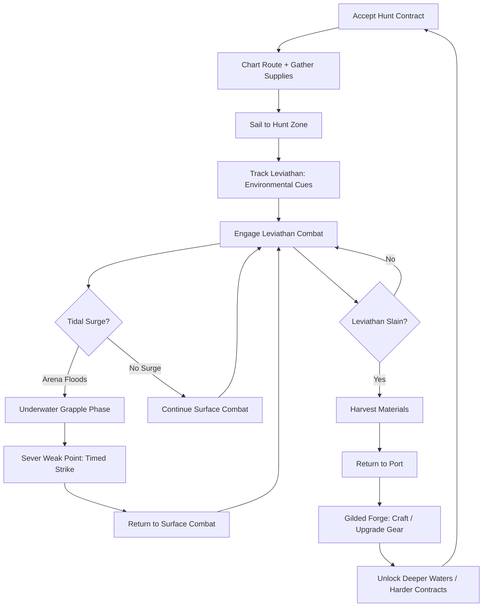
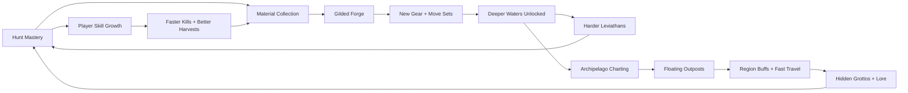

# Gilded Leviathan

## Title & Genre

| Field | Value |
|-------|-------|
| **Title** | Gilded Leviathan |
| **Genre** | Action RPG / Monster Hunting |
| **Engine** | Unreal Engine 5.4 (Nanite + Lumen for ocean volumetrics and underwater caustics) |
| **Platform** | PC (Steam/Epic), PlayStation 5, Xbox Series X/S, Nintendo Switch 2 |
| **Monetization** | Premium -- $49.99 base, cosmetic DLC only, no pay-to-win, no gacha |
| **Rating** | ESRB T (Fantasy Violence, Mild Language) / PEGI 12 / CERO B |

---

## Vision Statement

Gilded Leviathan is a monster-hunting action RPG where you track, fight, and harvest mythic sea leviathans across a shattered archipelago of volcanic islands, coral atolls, and flooded ruins. Every kill yields rare biological materials -- gilded scales that deflect cannon fire, abyssal sinew that vibrates with tidal force, radiant pearls storing centuries of compressed light -- and you forge these into weapons and armor that unlock distinct move sets, not just stat bumps. The ocean itself is your central adversary: tides surge mid-combat, flooding arenas and creating dynamic terrain. Leviathans breach from below, dragging you into underwater grapple sequences where you sever weak points with timed strikes while your lungs burn. The cycle of hunt-craft-explore drives you from coastal shallows through open ocean into the Abyssal Trench where the Golden Leviathan sleeps -- a creature so vast its body forms an ecosystem, so ancient it predates the archipelago itself. This is Monster Hunter by way of Sunless Sea: deep-water dread, gilded glory, and the slow realization that the gold covering these beasts is not natural -- it was forged.

---

## Core Loop

**Target session length:** 45--90 minutes



### Core Loop Breakdown

| Step | Player Action | System Response | Skill Expression |
|------|--------------|----------------|-----------------|
| 1. Contract | Select hunt from Harbor Board; difficulty tier indicated by region depth | Contract locks target species + biome; failure conditions stated (flee timer, area damage threshold) | Risk assessment, loadout planning |
| 2. Preparation | Buy provisions (antidotes, oxygen tanks, harpoon types); equip forged gear | Provision weight affects ship speed and stamina underwater | Resource management, build optimization |
| 3. Sail | Navigate archipelago waters; avoid or engage random sea encounters | Weather shifts dynamically; rogue waves damage hull; shallows hide ambush predators | Navigation, spatial awareness |
| 4. Track | Read environmental cues: bioluminescent trails, displaced fish schools, abnormal currents, sound pulses | Leviathan signature reveals on sonar after 3+ cues identified; false positives from ambient wildlife | Pattern recognition, patience |
| 5. Combat (Surface) | Dodge leviathan attacks; target body segments; manage stamina and oxygen reserves | Leviathan cycles through 3+ phases; each phase changes attack patterns and exposes new weak points | Timing, positioning, target prioritization |
| 6. Tidal Surge | Arena floods as leviathan summons water; terrain changes mid-fight | Dry ground disappears; underwater hazards appear (whirlpools, debris, electric eel swarms) | Adaptability, spatial recalibration |
| 7. Grapple | Leviathan drags player underwater; mounted sequence on beast's body | Must navigate to weak point while leviathan thrashes; oxygen timer visible; timed-strike windows are 8--12 frames | Precision under pressure, route optimization |
| 8. Sever | Land timed strike on glowing weak point | Segment breaks; massive damage; leviathan enters next phase with new attack patterns | Frame-precise execution |
| 9. Harvest | Carve specific body segments within time limit (90 seconds) | Rare materials drop from severed segments; common materials from intact segments | Prioritization under time pressure |
| 10. Forge | Combine materials at Gilded Forge in home port | New weapon/armor piece created with unique move set or ability | Build diversity, system mastery |

---

## Meta Loop

### Session-to-Session Progression



### Progression Axes

| Axis | What Grows | How It Feels | Cap |
|------|-----------|-------------|-----|
| **Gear Power** | Weapon damage, armor defense, elemental resistances, oxygen capacity | Your tools sharpen; leviathans that took 25 minutes now take 12 | 5 tiers across 8 weapon types |
| **Move Set Mastery** | Each forged weapon teaches unique combos and specials | You stop button-mashing and start orchestrating | Per-weapon skill tree, 12--18 moves each |
| **Ocean Access** | Deeper regions unlock as gear improves; shallows -> reef -> open ocean -> trench | The world expands vertically and laterally | 6 depth regions |
| **Archipelago Knowledge** | Charted islands, discovered grottos, established outposts | The map fills in; the unknown becomes navigable | 40+ islands, 12 hidden grottos |
| **Lore Completion** | Sunken temple murals, lost civilization journals, leviathan biology codex | The mystery of the gilded creatures deepens | 68 lore fragments across all regions |
| **Player Skill** | Dodge timing, grapple navigation, weak-point identification, tidal prediction | Invisible but most powerful -- you read the ocean like a language | No cap -- mastery is perpetual |

---

## Game Mechanics

### Primary Mechanic: Tidal Surge Combat

Every leviathan fight takes place in a coastal or open-ocean arena where the water level is not fixed. Leviathans actively manipulate tides as a combat mechanic, and the player must fight on two axes simultaneously: the surface and the depths.

**Tidal States per Arena:**

| State | Water Level | Player Options | Leviathan Advantage |
|-------|------------|---------------|-------------------|
| **Low Tide** | Exposed reef, dry rock platforms | Full mobility, full weapon moveset, dodge rolls | Leviathan is beached/partially exposed -- vulnerable to ground assaults |
| **Rising Tide** | Water climbing, platforms submerging one by one | Must reposition continuously; some attacks gain aquatic properties | Transitional -- leviathan gains speed as water rises |
| **High Tide** | Arena fully flooded; only debris and leviathan body above surface | Swimming controls; reduced stamina regen; underwater weapons only | Leviathan at full power; breaching attacks, whirlpool generation |
| **Surge** | Sudden catastrophic flood (triggered by leviathan phase transition) | Player dragged under; grapple sequence initiates | Leviathan attempts to drown player; mounted weak-point phase |

**Surface Combat Stats:**

| Stat | Base Value | Modified By | Effect |
|------|-----------|-------------|--------|
| Stamina | 100 | Armor weight, forging tier | Dodging, sprinting, heavy attacks consume stamina |
| Oxygen | 120 seconds | Gear, provisions, forged upgrades | Underwater timer; depletes during grapple and dive phases |
| Tether Strength | 60% | Harpoon type, arm armor | Resistance to being knocked off during grapple |
| Weak-Point Window | 8--12 frames | Varies by leviathan species and phase | Timing window for severing strikes |

### Secondary Mechanic: Underwater Grapple System

When a leviathan drags the player underwater, combat shifts to a mounted traversal sequence:

1. **Mount**: Player latches onto leviathan body. Camera shifts to third-person close.
2. **Navigate**: Leviathan thrashes. Player must move across its body toward the glowing weak point using climbing controls (analog stick + grip button).
3. **Avoid Hazards**: Leviathan deploys body defenses -- barnacle spikes, electric discharge, suction tentacles. Player must time dodge-crawls between hazards.
4. **Sever**: Reach weak point. Timed-strike prompt appears (8--12 frame window). Success breaks the segment. Failure throws the player off (takes damage, must re-mount).
5. **Surface**: After sever, leviathan thrashes violently. Player must hold on for 4 seconds (stamina drain) or let go and swim for surface.

**Oxygen Management during Grapple:**

| Time Elapsed | Oxygen Remaining | Visual Cue | Gameplay Effect |
|-------------|-----------------|-----------|----------------|
| 0--40s | 100--67% | Clear vision, normal movement | Standard play |
| 40--80s | 67--33% | Edges of screen darken, heartbeat audio | Stamina drains 15% faster |
| 80--110s | 33--8% | Screen pulsing blue, heavy breathing | Stamina drains 30% faster, movement slows |
| 110--120s | 8--0% | Screen nearly black, gasping | Movement reduced to crawl |
| 0% | Drowned | Fade to black, respawn at last checkpoint | Lose 1 harpoon, return to surface combat phase |

### Secondary Mechanic: Gilded Forge Crafting

Every monster part has an elemental affinity. Combining parts in the forge creates weapons and armor with distinct properties.

**Elemental Affinities (6 elements):**

| Element | Source Leviathans | Visual Theme | Weapon Effect | Armor Effect |
|---------|------------------|-------------|--------------|-------------|
| **Gilded (Radiant)** | Golden Leviathan, Auric Serpent, Sunback Manta | Warm gold, light refraction, prismatic edges | Attacks blind enemies briefly; charged attacks deal AoE light damage | Reduces stun duration; increases oxygen regen in illuminated water |
| **Abyssal (Pressure)** | Trench Stalker, Void Eel, Deepcurrent Crab | Dark indigo, bioluminescent specks, translucent | Attacks ignore 20% armor; charged attacks create pressure waves | Increases tether strength; reduces oxygen consumption |
| **Tidal (Force)** | Stormbreaker Whale, Riptide Wyrm, Maelstrom Jellyfish | Seafoam green, flowing water trails, foam particles | Attacks push enemies; charged attacks create whirlpools | Increases dodge distance; reduces tidal surge damage |
| **Volcanic (Heat)** | Magma Crawler, Cinderback Turtle, Ash Leviathan | Ember orange, lava cracks, smoke wisps | Attacks apply burn DOT; charged attacks leave magma pools | Increases stamina regen; reduces burn duration |
| **Coral (Growth)** | Reef Hydra, Thornscale Dragonet, Living Atoll Beast | Pink-coral, crystalline structures, branching geometry | Attacks spawn coral thorns on hit (slow + bleed); charged attacks create barriers | Passive HP regen in shallow water; increases carving speed |
| **Phantom (Ethereal)** | Ghost Kraken, Spectral Nautilus, Hollow Serpent | Translucent purple, ghost trails, afterimages | Attacks phase through guard; charged attacks create phantom doubles | Increases item find rate; reduces detection by tracking leviathans |

**Crafting System:**

Each weapon type has a base form + 5 elemental variants + 5 hybrid variants (2-element combos) = 11 weapons per type.

| Weapon Type | Play Style | Key Mechanic | Total Variants |
|------------|-----------|--------------|---------------|
| **Harpoon Lance** | Mid-range thrusting, charge attacks | Can pin leviathan segments temporarily | 11 |
| **Tidal Blade** | Fast slashing, combo chains | Builds combo meter; meter drains on hit taken | 11 |
| **Abyssal Hammer** | Slow crushing, stagger focused | Charged hits break armor plating | 11 |
| **Coral Bow** | Ranged, status application | Arrow types change with element (burn, slow, bleed, blind) | 11 |
| **Phantom Daggers** | Dual-wield, evasion focused | Dodge-cancel on any attack; counters after perfect dodge | 11 |
| **Gilded Gauntlets** | Close-range brawling, grapple enhancement | Enhances underwater sever damage; parry-counter system | 11 |
| **Tidecaller Staff** | Support/buff, area control | Places tidal totems that modify arena water level temporarily | 11 |
| **Leviathan Harpoon Gun** | Ranged heavy, harpoon retrieval | Fired harpoons embed in leviathan; retracting deals bonus damage | 11 |

**Total craftable weapons: 88 (8 types x 11 variants)**
**Total craftable armor sets: 66 (6 elements x 5 pieces x 2 hybrid options + base)**
**Total unique gear items: 154**

### Leviathan Roster (18 species, 6 depth regions)

| Region | Leviathan | Size | Phases | Signature Mechanic | Primary Element |
|--------|----------|------|--------|--------------------|-----------------|
| **Coastal Shallows** | Reef Hydra | Medium (12m) | 2 | Heads regenerate unless all severed simultaneously | Coral |
| **Coastal Shallows** | Thornscale Dragonet | Small-Medium (8m) | 2 | Aerial dive attacks from cliff perches; nesting behavior | Coral |
| **Coral Reef** | Stormbreaker Whale | Large (30m) | 3 | Sonic blast waves; creates massive wake on breach | Tidal |
| **Coral Reef** | Living Atoll Beast | Huge (50m) | 3 | Arena IS the creature; fight on its back while it submerges | Coral |
| **Coral Reef** | Riptide Wyrm | Medium (15m) | 2 | Creates current tunnels that drag the player into hazards | Tidal |
| **Open Ocean** | Ghost Kraken | Large (25m tentacle span) | 3 | Invisible ink clouds; tentacles attack from unseen angles | Phantom |
| **Open Ocean** | Sunback Manta | Huge (40m wingspan) | 3 | Solar beam attacks during surface breaches; shadow AoE when above | Gilded |
| **Open Ocean** | Maelstrom Jellyfish | Large (20m bell) | 2 | Creates persistent whirlpools; electrified tentacle fields | Tidal |
| **Volcanic Shelf** | Magma Crawler | Medium (14m) | 3 | Lava trail persistence; arena gradually fills with magma | Volcanic |
| **Volcanic Shelf** | Cinderback Turtle | Huge (35m shell) | 3 | Shell is destructible fortress; must breach it in grapple phase | Volcanic |
| **Volcanic Shelf** | Ash Leviathan | Large (28m) | 3 | Ash cloud covers arena; reduces visibility to 5m radius | Volcanic |
| **Abyssal Slope** | Trench Stalker | Large (22m) | 3 | Bioluminescent lure baits player into ambush; no surface phase | Abyssal |
| **Abyssal Slope** | Void Eel | Medium (16m) | 2 | Phases through terrain; attacks from inside walls and floor | Abyssal |
| **Abyssal Slope** | Spectral Nautilus | Medium (10m) | 2 | Spawns phantom copies of itself; only real one takes damage | Phantom |
| **Abyssal Slope** | Deepcurrent Crab | Large (18m across) | 3 | Burrows into trench walls; arena collapses as it digs | Abyssal |
| **Abyssal Trench** | Auric Serpent | Large (25m) | 4 | Gold plating reflects projectiles; must be removed via grapple sever | Gilded |
| **Abyssal Trench** | Hollow Serpent | Large (20m) | 3 | Exists in ethereal plane; must use Phantom weapons to interact | Phantom |
| **Abyssal Trench** | **The Golden Leviathan** | Colossal (120m) | 5 | All previous mechanics combined; 30-minute endurance gauntlet | Gilded + All |

### Difficulty Progression Table

| Region | Leviathans Available | Track Complexity | Tidal Surge Frequency | Grapple Complexity | New Player Mechanic Unlocked |
|--------|---------------------|-----------------|----------------------|-------------------|------------------------------|
| Coastal Shallows | 2 | Obvious trails, sonar not needed | Rare (Phase 2 only) | Simple single-path mounts | Basic combat + forge tutorial |
| Coral Reef | 3 | Sonar introduced; false trails appear | Moderate (Phase 2--3) | Branching paths, 1 hazard type | Harpoon retrieval, underwater forging |
| Open Ocean | 3 | No land reference; navigation by current | Frequent (every phase) | Multi-hazard, timed oxygen gates | Ship-to-shore transitions, weather tracking |
| Volcanic Shelf | 3 | Heat signature tracking; magma obscures trails | Moderate + environmental DOT | Vertical mounting (climbing magma shell) | Heat-resistant gear required, lava forge |
| Abyssal Slope | 4 | Bioluminescence only; near-total darkness | Constant (underwater-only arenas) | Complex routing with 3+ hazard types | Pressure-resistant gear, extended oxygen tanks |
| Abyssal Trench | 3 | Leviathan actively hunts YOU; no tracking needed | Extreme + multi-surge | Full-body traversal with phase transitions | All mechanics combined; final gear tier |

---

## World Design

### Map Structure

The Shattered Archipelago: a volcanic island chain formed by the death throes of an ancient leviathan. Procedurally reshapes between hunt cycles -- islands erode, new atolls form from coral growth, volcanic eruptions create temporary land bridges.

```
                          ┌──────────────────────────┐
                          │    THE ABYSSAL TRENCH     │
                          │  (Final Region, Depth 6)  │
                          │  Pressure: Crushing       │
                          └────────────┬─────────────┘
                                       │
                         ┌─────────────┴─────────────┐
                         │     ABYSSAL SLOPE          │
                         │  (Depth 5, No Surface)     │
                         └────────────┬──────────────┘
                                      │
                    ┌─────────────────┴─────────────────┐
                    │                                   │
          ┌─────────┴──────────┐            ┌───────────┴──────────┐
          │  VOLCANIC SHELF    │            │    OPEN OCEAN        │
          │  (Depth 4, Heat)   │            │  (Depth 3, Weather)  │
          └─────────┬──────────┘            └───────────┬──────────┘
                    │                                   │
                    └─────────────────┬─────────────────┘
                                      │
                          ┌───────────┴──────────┐
                          │    CORAL REEF         │
                          │  (Depth 2, Navigation)│
                          └───────────┬──────────┘
                                      │
                          ┌───────────┴──────────┐
                          │  COASTAL SHALLOWS    │
                          │  (Depth 1, Starting) │
                          └──────────────────────┘

    Home Port: Tidehaven (central hub, always accessible)
    └── Harbor Board (contracts)
    ├── Gilded Forge (crafting)
    ├── Chart House (archipelago map)
    ├── Provisioner (supplies)
    ├── Tavern (NPCs, lore, side quests)
    └── Docks (ship customization)
```

### Procedural Archipelago System

Between hunt cycles (not mid-hunt), the archipelago reshapes according to these rules:

| Change Type | Trigger | Effect | Frequency |
|------------|---------|--------|-----------|
| **Erosion** | 3 hunts completed in any region | 1--2 islands lose beach area; new shallow-water routes appear | Every 3 hunts |
| **Coral Growth** | Coral-element leviathans hunted | New atoll formations; hidden grottos become accessible | Per Coral kill |
| **Volcanic Eruption** | Volcanic-element leviathans hunted | Temporary land bridges appear (3-hunt duration); magma pools persist | Per Volcanic kill |
| **Abyssal Collapse** | Abyssal-element leviathans hunted | Trench widens; new deep-water caves; surface islands may partially sink | Per Abyssal kill |
| **Gilded Resonance** | Gilded-element leviathans hunted | Sunken ruins surface briefly; ancient forge sites accessible | Per Gilded kill |
| **Storm Season** | Every 10 hunts, 3-hunt duration | Wave intensity increases; sailing is harder but rare leviathans surface | Every 10 hunts |

### Floating Outpost System

Players establish floating outposts at charted locations. Each provides region-specific buffs and fast-travel anchors.

| Outpost Type | Region | Buff | Material Cost |
|-------------|--------|------|---------------|
| **Signal Tower** | Any coastal | Sonar range +30% in adjacent waters | Driftwood x10, Rope x5, Copper x3 |
| **Dive Bell Station** | Coral Reef | Oxygen regen +10% in region | Reef Stone x8, Glass x4, Iron x6 |
| **Storm Anchor** | Open Ocean | Weather damage reduced 25% | Stormhide x5, Ironwood x8, Chain x4 |
| **Heat Vent Camp** | Volcanic Shelf | Burn duration reduced 40% in region | Obsidian x6, Asbestos Fiber x8, Steel x5 |
| **Pressure Dome** | Abyssal Slope | Pressure damage reduced 35% | Abyssal Pearl x4, Reinforced Glass x8, Titanium x6 |
| **Gilded Beacon** | Abyssal Trench (post-game) | All buffs active; reveals Golden Leviathan spawn | Auric Scale x10 + 1 material from every leviathan species |

### Art Direction Pillars

| Pillar | Description | Reference |
|--------|-------------|-----------|
| **Nautical Grandeur** | The ocean as cathedral -- vast, luminous, terrifying. Sunlight shafts pierce blue-green water; bioluminescence paints the deep. | Subnautica, Abzu, Sea of Thieves during storms |
| **Gilded Brutality** | Gold as a mark of violence, not wealth. Leviathan scales gleam because they are forged, not born. Gold should feel ominous. | Monster Hunter's weapon pageantry meets Bloodborne's industrial horror |
| **Shattered Beauty** | The archipelago is broken -- half-sunken temples, volcanic glass beaches, coral reclaiming ancient architecture. Nature wins. | Wind Waker's ocean meets Shadow of the Colossus ruins |
| **Depth as Dread** | The deeper you go, the less the ocean resembles anything hospitable. Light fails. Pressure mounts. Creatures become wrong. | Subnautica's deep zones, Sunless Sea's atmosphere |

### Visual & Audio Progression

| Region | Palette Dominant | Lighting Mood | Ambient Audio | Music Intensity |
|--------|-----------------|--------------|--------------|----------------|
| Coastal Shallows | Turquoise, sand gold, seafoam | Bright, dappled sunlight, long shadows | Waves, gulls, distant whale song | Light acoustic guitar + shakers |
| Coral Reef | Coral pink, emerald, deep blue | Filtered sunlight through water columns, caustic ripples | Bubbling, snapping shrimp, reef fish | Steel drum + flute, upbeat |
| Open Ocean | Navy, steel gray, whitecap | Overcast, dramatic cloud formations, lightning flashes | Wind, deep groaning swells, distant thunder | Full orchestral -- strings, brass, timpani |
| Volcanic Shelf | Ember orange, basalt black, magma red | Magma glow, ash-filtered sunlight, smoke haze | Rumbling, hissing steam, cracking rock | Taiko drums + low brass, aggressive |
| Abyssal Slope | Bioluminescent blue-green, ink black, pale violet | Self-illuminated only; no sunlight; creature glow | Clicking, distant whale calls (distorted), silence | Ambient synth, no percussion, growing dread |
| Abyssal Trench | Gold (the gilded source), pitch black, crimson veins | Golden light from leviathan biology; darkness so complete it has texture | Heartbeat (the trench's own), pressure groans, gold resonance | Full orchestra + choir + synth -- overwhelming, transcendent |

---

## Narrative

### Tone Spectrum (7-Axis)

| Axis | Position | Notes |
|------|----------|-------|
| Hope vs. Despair | 60% Hope | The hunt is glorious; the ocean is terrifying. Wonder wins, barely. |
| Natural vs. Artificial | 70% Artificial | The gold is forged. The leviathans were made. Nature was the raw material. |
| Surface vs. Depth | 80% Depth | The truth is always below. The surface is the lie. |
| Sound vs. Silence | 60% Sound | The ocean is never silent. Even the trench hums. |
| Human vs. Leviathan | 65% Leviathan | The creatures are more important than any human character. |
| Past vs. Present | 75% Past | Everything important happened before you arrived. You are uncovering, not creating. |
| Mastery vs. Mystery | 50/50 | You master the mechanics; the world stays mysterious. Both are respected. |

### 8-Point Story Spine

**1. Equilibrium**
You are a newly licensed Tidehunter, arrived at Tidehaven -- the last functioning port in the Shattered Archipelago. The harbor master gives you your first contract: a Reef Hydra troubling the coastal fishing routes. The ocean is beautiful, dangerous, and full of work.

**2. Inciting Incident**
During your first major hunt (Stormbreaker Whale in the Coral Reef), you discover a sunken temple beneath the reef. Inside: murals depicting human figures coating sea creatures in molten gold. The gilded scales are not natural growths -- they are applications. Something, or someone, gilded these creatures deliberately. The Whale's death-cry resonates through the water, and you hear words in a language you should not understand: "They remember the forge."

**3. First Complication**
The Harbor Master reveals that Tidehaven was built over a Gilded Forge -- the only surviving forge from a civilization called the Auric Conclave. The Conclave coated sea leviathans in gold to harness their biological energy, using them as living batteries for a vast underwater empire. The archipelago's islands are the calcified remains of the first gilded leviathan. The Conclave was destroyed when their greatest creation -- the Golden Leviathan -- broke free and shattered the seafloor.

**4. Rising Action**
As you hunt deeper leviathans, you find more sunken temples, more murals, and journals from Conclave artisans. Each temple contains a partial forge schematic. The leviathans are growing more aggressive -- they recognize the Gilded Forge's reactivation. The Ghost Kraken attacks Tidehaven directly. NPCs in coastal towns remember your choices: which beasts you slew quickly versus which you let suffer affects their willingness to trade and share information.

**5. Midpoint Reversal**
You reach the Abyssal Slope and find the Conclave's central forge -- still active, maintained by autonomous gold-plated automatons. The automatons reveal the truth: the Conclave did not collapse because the Golden Leviathan broke free. The Conclave collapsed because they succeeded. They gilded a leviathan so thoroughly it became a god. The Golden Leviathan is not a rogue weapon -- it is the most successful experiment in history, and it decided humanity was not worthy of the forge. The archipelago is not a disaster site. It is a quarantine zone. The Golden Leviathan keeps the forge buried because it believes no one should have that power. Including itself.

**6. Crisis**
The automatons offer you a choice: take the central forge's master key and gain the ability to forge god-tier equipment (enough to challenge the Golden Leviathan directly), or destroy the forge permanently, ending the gilded cycle but also destroying the power source that keeps Tidehaven alive. The harbor floods. The trench opens.

**7. Climax**
You descend into the Abyssal Trench and face the Golden Leviathan -- a 120-meter creature of living gold, cathedral-sized, speaking in resonant tones that vibrate your bones. Five phases across 30 minutes. Phase 1: Surface breach (titanic AoE, arena destruction). Phase 2: Grapple across its body as it dives, severing gilded plating to expose flesh. Phase 3: Inside the leviathan (you are swallowed), fighting through its gilded circulatory system. Phase 4: The Heart Chamber -- the original forge core embedded in its chest, still burning. Phase 5: The Golden Leviathan's mind -- a psychic confrontation where it shows you the Conclave's crimes, its own suffering, and asks: "Will you repeat their mistake?"

**8. Resolution**
Three endings based on forge choice and combat performance:
- **The Gilded Age**: You take the forge key. You can now gild new leviathans. The Golden Leviathan dies. Tidehaven becomes the new Conclave capital. The cycle begins again. (Requires taking the forge key.)
- **The Broken Forge**: You destroy the forge. The Golden Leviathan returns to the deep, free but dying without the forge sustaining it. Tidehaven loses its power but survives on fishing and trade. The gilded creatures gradually lose their gold. The world becomes natural again. (Requires destroying the forge.)
- **The Accord**: You achieve mastery over all 18 leviathan species (one of each hunted) + collect all 68 lore fragments + defeat the Golden Leviathan without using any forge-crafted Gilded-element gear. You refuse both choices. You tell the Golden Leviathan the forge is its decision, not yours. It chooses to sleep. The forge stays. Tidehaven stays. The archipelago stays. Nothing is resolved. Everything continues. (This is the hardest ending and the "true" ending.)

### Key Characters

| Character | Role | Theme | Lore Fragments |
|-----------|------|-------|---------------|
| **The Tidehunter** (Player) | Protagonist -- licensed monster hunter | Skill as identity; who are you without the forge? | N/A |
| **Harbor Master Orin** | Mentor -- runs Tidehaven | Pragmatic survival; knows more than she shares | 8 journal entries |
| **Artisan Vess** | Ghost of a Conclave forge-master | Hubris; she gilded the first leviathan and regretted it for 2000 years | 12 forge memories |
| **The Golden Leviathan** | True Antagonist -- the gilded god | Power as burden; a weapon that chose to sheathe itself | 14 resonance fragments |
| **Captain Maren** | Rival hunter -- charts the same waters | Competition vs. collaboration; she reaches regions before you do | 6 log entries |
| **The automatons** | Guides -- maintain the deep forge | Duty without purpose; they serve a dead civilization | 8 diagnostic logs |
| **The Drowned Congregation** | NPC collective -- coastal villagers | Fear and reverence; they worship what you hunt | 12 prayer scrolls |

---

## Player Personas

### P-003: Hiroshi Tanaka -- The RPG Addict (Primary)

**Why this game fits Hiroshi**: 154 craftable gear items with distinct move sets, 18 leviathan species with multi-phase fights, 68 lore fragments forming a coherent narrative, 3 endings tied to gameplay performance. This is a completionist's paradise. The Gilded Forge system has genuine build diversity -- 8 weapon types each with 11 variants means Hiroshi can theorycraft optimal loadouts for every leviathan. The procedural archipelago reshuffling keeps exploration fresh across multiple playthroughs. The Accord ending demands near-perfect completion, which is exactly the kind of challenge Hiroshi treats as a mastery project.

**Predicted experience**: Hiroshi methodically clears every region before advancing. He fills the leviathan codex with behavioral notes. He builds spreadsheets comparing weapon variant damage curves against each element. He hunts every species at least once before attempting the Golden Leviathan. He pursues the Accord ending on his first playthrough. He will spend 120+ hours. He will write build guides for the community.

### P-008: David Park -- The Achievement Hunter (Primary)

**Why this game fits David**: The achievement system has 78 achievements across combat (no-hit leviathan kills), exploration (chart every island variant), crafting (forge one of every weapon type), lore (collect all 68 fragments), and challenge (speedrun every region, kill the Golden Leviathan in under 20 minutes). The procedural archipelago creates trackable exploration metrics. The Gilded Forge provides clear collection targets. No RNG-based achievements -- everything achievable through skill and thoroughness.

**Predicted experience**: David will 100% the game across 3--4 playthroughs. He will map every procedural island variant. He will forge every weapon at least once. He will track achievement progress in a spreadsheet. He will pursue the speedrun achievement last, as his capstone. He will flag any procedural-generation achievements that feel RNG-dependent.

### P-009: Liam O'Connor -- The Dedicated F2P (Primary)

**Why this game fits Liam**: Premium model ($49.99) with cosmetic DLC only. No microtransactions, no gacha, no energy systems, no time-gating. Every piece of gear is earned through gameplay. The combat system is skill-based -- frame-precise grapple severs, stamina management, tidal prediction. No amount of money shortcuts the Golden Leviathan fight. Liam's anti-P2W principles align perfectly with the game's design. He will be the game's most vocal organic promoter specifically because of the fair monetization.

**Predicted experience**: Liam will mainline the critical path on his first run, then create no-hit leviathan guides for YouTube. He will attempt challenge runs (harpoon-only, no-armor, solo speedrun). He will advocate for the game in every Discord community. He will be frustrated if any cosmetic DLC feels like cut content rather than genuine addition.

### P-010: Kevin Nguyen -- The Competitive Whale (Secondary)

**Why this game fits Kevin**: Kevin values fair progression where spending does not override skill. The game delivers. The monster-hunting genre has a natural competitive layer: fastest kill times, no-hit runs, hardest challenge clears. Kevin's $100--300/month spending habit finds an outlet in cosmetic DLC (ship skins, weapon trails, hunter armor transmogs) that never affects gameplay. Leaderboards for fastest leviathan kills per species give Kevin a competitive ladder to climb.

**Predicted experience**: Kevin will optimize for kill speed on every species. He will chase leaderboard positions. He will buy every cosmetic DLC. He will stream his Golden Leviathan attempts. He will appreciate that the leaderboard is skill-only, not spend-gated.

---

## User Stories

### Exploration & Navigation (8 stories)

1. As **Hiroshi (P-003)**, I want the archipelago to reshape between hunts so that exploration remains dynamic and I am never truly done mapping the world.
2. As **David (P-008)**, I want a chart that shows my exploration percentage per region and overall so that I can track my completion progress toward 100%.
3. As **Liam (P-009)**, I want environmental hazards (whirlpools, rogue waves, volcanic debris) that leviathans are also vulnerable to so that clever positioning is rewarded over raw gear power.
4. As **Hiroshi (P-003)**, I want floating outposts to provide region-specific buffs so that outpost placement is a strategic decision, not just a fast-travel point.
5. As **Kevin (P-010)**, I want island discovery to be tracked with timestamps on a leaderboard so that racing to chart new formations is a competitive activity.
6. As **David (P-008)**, I want hidden grottos to contain unique lore fragments not available anywhere else so that thorough exploration is rewarded with narrative content.
7. As **Hiroshi (P-003)**, I want the procedural reshaping to follow logical rules (erosion, coral growth, volcanic activity) so that I can predict where new areas might form.
8. As **Liam (P-009)**, I want sailing to require active navigation (reading currents, avoiding reefs, managing sail angle) so that traversal itself is a skill activity.

### Core Combat (8 stories)

9. As **Hiroshi (P-003)**, I want tidal surges to change the arena mid-fight so that every leviathan engagement has dynamic terrain I must adapt to.
10. As **Liam (P-009)**, I want the grapple sever mechanic to have frame-precise windows (8--12 frames) so that skill expression separates good hunters from great ones.
11. As **Kevin (P-010)**, I want kill timers and damage breakdowns shown post-hunt so that I can analyze my performance and optimize my runs.
12. As **Hiroshi (P-003)**, I want 18 leviathan species each with 2--5 phases and distinct mechanics so that every hunt feels like learning a new game.
13. As **David (P-008)**, I want each weapon variant to have a unique move set, not just stat differences, so that collection feels meaningful.
14. As **Liam (P-009)**, I want oxygen management during grapple phases to create genuine tension so that underwater combat feels dangerous, not just different.
15. As **Kevin (P-010)**, I want the Golden Leviathan fight to be a 30-minute endurance gauntlet so that the ultimate challenge tests sustained performance.
16. As **Hiroshi (P-003)**, I want leviathan weak points to be visible through environmental cues (scarring, bioluminescence, behavioral tells) so that observation is rewarded.

### Crafting & Progression (8 stories)

17. As **David (P-008)**, I want 154 craftable gear items with unique properties so that 100% forging is a substantial, trackable goal.
18. As **Hiroshi (P-003)**, I want 6 elemental affinities with distinct combat effects so that build optimization is a deep, rewarding system.
19. As **David (P-008)**, I want a codex that fills with leviathan biology data as I hunt so that repeated engagement with each species builds a knowledge base.
20. As **Hiroshi (P-003)**, I want hybrid-element weapons that combine two affinities so that build variety exceeds the base element count.
21. As **Liam (P-009)**, I want every gear item to be craftable through gameplay, with no cash-shop shortcuts, so that my loadout reflects my effort, not my wallet.
22. As **Kevin (P-010)**, I want weapon mastery tracking (kills per weapon type, combo completion rate) so that I have measurable skill metrics beyond kill time.
23. As **David (P-008)**, I want forging to be reversible (melt down items to recover some materials) so that experimentation does not punish completionists.
24. As **Hiroshi (P-003)**, I want gear to gate depth regions (pressure-resistant armor for Abyssal Slope, heat-resistant for Volcanic Shelf) so that progression feels earned.

### Narrative & Lore (6 stories)

25. As **Hiroshi (P-003)**, I want 68 lore fragments that tell a coherent story about the Auric Conclave so that exploration rewards narrative understanding.
26. As **David (P-008)**, I want NPC reactions to change based on which leviathans I have slain or spared so that my choices have social consequences.
27. As **Hiroshi (P-003)**, I want the Golden Leviathan to be a character with its own perspective, not just a boss, so that the final confrontation has emotional weight.
28. As **David (P-008)**, I want the Accord ending to require completing all content (all species hunted, all lore collected) so that the "true" ending rewards thoroughness.
29. As **Hiroshi (P-003)**, I want sunken temple murals to foreshadow leviathan mechanics so that attentive players gain tactical advantage from lore.
30. As **Liam (P-009)**, I want cutscenes to be skippable after first viewing so that replays and challenge runs are not bogged down by narrative.

### Accessibility (4 stories)

31. As a player with motor impairments, I want an assist mode that extends grapple sever windows to 16 frames and reduces oxygen depletion rate so that the core experience is accessible without being trivialized.
32. As **David (P-008)**, I want full remappable controls with preset options for every major input device so that my preferred layout is supported.
33. As a player with color vision deficiency, I want elemental effects to use distinct shapes and animations (not just color) so that visual clarity does not depend on color perception.
34. As a player with photosensitivity, I want an option to reduce flash intensity during leviathan breaching and forge crafting sequences so that the game is safe to play.

### Social & Community (4 stories)

35. As **Liam (P-009)**, I want asynchronous message bottles that I can leave on islands with tips or warnings for other players so that the community shares knowledge organically.
36. As **Kevin (P-010)**, I want per-species leaderboards showing fastest kill times with gear loadouts visible so that the competitive scene has transparency.
37. As **David (P-008)**, I want achievement progress visible on my hunter profile so that other players can see my completion status.
38. As **Liam (P-009)**, I want cosmetic DLC to be clearly labeled as cosmetic-only and never include gameplay-affecting items so that I can champion the game's fair model.

---

## Monetization

### Revenue Model: Premium at $49.99

**Why this model fits this game**:
- Monster hunting audiences expect and prefer premium pricing -- it signals depth and content volume
- The crafting system is the progression -- monetizable shortcuts would break the core loop
- The target audience (P-003, P-008, P-009, P-010) values fair, complete experiences over free-to-play grind
- Environmental storytelling and lore fragments reward slow, deliberate play -- incompatible with energy systems or time gates

### Pricing & DLC Roadmap

| Product | Price | Content | Target Window |
|---------|-------|---------|--------------|
| Base Game | $49.99 | 18 leviathans, 6 regions, 154 gear items, 3 endings | Launch |
| Digital Deluxe | $69.99 | Base + art book + soundtrack + "Tidehunter's Legacy" ship skin set | Launch |
| Cosmetic Pack 1: "Abyssal Attire" | $7.99 | 5 hunter armor transmogs, 3 ship skins, 2 weapon trail effects | Month 3 |
| Cosmetic Pack 2: "Conclave Relics" | $7.99 | 5 hunter armor transmogs, 3 ship skins, 2 weapon trail effects | Month 6 |
| DLC 1: "The Drowned Spire" | $19.99 | 3 new leviathans, 1 new depth region (Depth 7: Sunken City), 30 new gear items, 1 ending | Month 8 |
| DLC 2: "The Gilded Conclave" | $19.99 | Prequel campaign (play as Artisan Vess during the Conclave era), 4 new leviathans, 1 ending | Month 14 |
| Complete Edition | $69.99 | Base + both DLCs + all cosmetic packs | Month 16 |

### Revenue Projections (4 Scenarios)

| Scenario | Year 1 Units | Year 1 Revenue | Year 2 (w/ DLC) | Total (2yr) | Assumptions |
|----------|-------------|---------------|-----------------|------------|-------------|
| **Modest** | 120,000 | $4.3M | $1.4M | $5.7M | Niche appeal, word-of-mouth, 15% DLC attach, 8% cosmetic attach |
| **Baseline** | 400,000 | $14.4M | $5.2M | $19.6M | Moderate marketing, positive reviews, 25% DLC attach, 12% cosmetic attach |
| **Strong** | 900,000 | $31.5M | $14.4M | $45.9M | Strong reviews, streamer coverage, 30% DLC attach, 18% cosmetic attach |
| **Breakout** | 2,200,000 | $75.9M | $40.3M | $116.2M | Viral, award nominations, 35% DLC attach, 25% cosmetic attach + complete edition |

**Break-even at ~92,000 units ($3.3M) against total development budget of $3.1M (see Production Plan).**

---

## Production Plan

### Team

| Role | Count | Phase | Monthly Cost (Loaded) |
|------|-------|-------|----------------------|
| Game Director / Lead Design | 1 | All | $13,000 |
| Combat Designer | 1 | All | $10,000 |
| Level Designer (Ocean Environments) | 2 | Months 3--16 | $9,000 each |
| Narrative Designer | 1 | Months 1--14 | $9,500 |
| Programmers (Combat + AI) | 2 | All | $10,500 each |
| Programmers (Systems + Crafting) | 1 | Months 2--16 | $10,000 |
| Programmers (Procedural Gen + Water) | 2 | Months 1--14 | $11,000 each |
| Engine / Rendering Programmer | 1 | Months 1--8, 13--16 | $12,000 |
| 3D Artists (Environment) | 3 | Months 3--14 | $8,500 each |
| 3D Artists (Leviathan + Creature) | 3 | Months 2--16 | $9,000 each |
| VFX Artist (Water + Combat) | 1 | Months 5--16 | $9,000 |
| Technical Artist | 1 | Months 2--16 | $9,500 |
| UI/UX Designer | 1 | Months 4--14 | $8,500 |
| Audio Designer / Composer | 1 | Months 4--16 | $8,000 |
| Sound Designer (Underwater Foley) | 1 (contract) | Months 10--14 | $7,000 |
| QA Lead | 1 | Months 8--18 | $7,500 |
| QA Testers | 3 | Months 10--18 | $5,500 each |
| Producer | 1 | All | $10,500 |
| Community Manager | 1 | Months 12--18 | $7,000 |

**Total team: 28 people peak (months 6--14)**

### Timeline (18-month production)

| Month | Milestone | Key Deliverables |
|-------|-----------|-----------------|
| 1 | Prototype | Core combat loop (surface + grapple), tidal surge system, oxygen gauge, 1 test leviathan |
| 2 | Vertical Slice | Reef Hydra hunt playable end-to-end, basic forge, Tidehaven hub greybox |
| 3 | Pre-Production Complete | All 6 regions greyboxed, 18 leviathan designs finalized, procedural archipelago rules locked |
| 4 | Production Phase 1 | Coastal Shallows + Coral Reef art pass, 5 leviathans implemented, Gilded Forge system complete |
| 5 | Production Phase 1 | Weapon types 1--4 fully implemented with all variants, floating outpost system functional |
| 6 | Production Phase 2 | Open Ocean region complete, 3 more leviathans, weather system operational, ship navigation final |
| 7 | Production Phase 2 | Volcanic Shelf complete, 3 more leviathans, heat/pressure gear gating implemented |
| 8 | Production Phase 2 | Abyssal Slope complete, 4 more leviathans, QA begins, depth progression tuned |
| 9 | Production Phase 3 | Abyssal Trench greybox complete, Auric Serpent + Hollow Serpent implemented |
| 10 | Production Phase 3 | Golden Leviathan Phase 1--3 scripted, all 154 gear items in engine |
| 11 | Production Phase 3 | Golden Leviathan Phase 4--5 scripted, all 18 leviathans playable, lore system integrated |
| 12 | Alpha | Full game playable, all systems integrated, procedural archipelago stress-tested, internal testing |
| 13 | Alpha Iteration | Bug fixes, combat tuning based on internal playtests, leviathan AI difficulty balancing |
| 14 | Beta | Feature complete, content complete, external playtesting begins, Switch 2 optimization |
| 15 | Beta Iteration | Playtest feedback integration, final art polish, audio mix, performance optimization all platforms |
| 16 | Release Candidate | Cert submission (PlayStation, Xbox, Switch 2), Steam submission, day-1 patch prep |
| 17 | Launch | Game ships, day-1 patch deployed, hotfix support begins, community engagement activates |
| 18 | Post-Launch | Hotfixes, community feedback, Cosmetic Pack 1 development, DLC 1 pre-production begins |

### Budget Breakdown

| Category | Cost | Notes |
|----------|------|-------|
| Salaries (18 months, 28 FTE peak) | $2,460,000 | Blended rate ~$9,500/mo avg |
| Unreal Engine 5 royalties | $0 (first $1M gross revenue free) | 5% after $1M |
| Software & Tools | $52,000 | Perforce, Jira, Adobe CC, Houdini, Wwise, Substance |
| Hardware (dev kits, workstations) | $85,000 | 2 PS5 dev kits, 2 Xbox dev kits, 2 Switch 2 dev kits, 20 workstations |
| QA & Playtesting | $72,000 | External QA contractor, playtest facility rental, focus testing |
| Audio (recording, music production) | $68,000 | Studio time, orchestra session for Golden Leviathan theme, underwater foley |
| Marketing | $180,000 | Trailers (3), convention presence (2), influencer outreach, PR firm retainer |
| Operations & Overhead | $95,000 | Office/incorporation/legal/accounting/insurance |
| Contingency (10%) | $301,200 | |
| **Total** | **$3,313,200** | |

---

## Technical Requirements

### Platform Specifications

| Spec | PC Minimum | PC Recommended | PlayStation 5 | Xbox Series X | Nintendo Switch 2 |
|------|-----------|---------------|--------------|--------------|-------------------|
| **CPU** | Intel i5-8400 / AMD Ryzen 5 2600 | Intel i7-12700K / AMD Ryzen 7 5800X | Custom AMD Zen 2 | Custom AMD Zen 2 | Custom NVIDIA Tegra |
| **RAM** | 16 GB | 32 GB | 16 GB GDDR6 | 16 GB GDDR6 | 12 GB LPDDR5 |
| **GPU** | NVIDIA GTX 1060 6GB / AMD RX 580 | NVIDIA RTX 3070 / AMD RX 6800 XT | Custom RDNA 2 | Custom RDNA 2 | Custom NVIDIA |
| **Storage** | 45 GB SSD | 45 GB NVMe SSD | 45 GB SSD | 45 GB SSD | 45 GB internal |
| **Target** | 1080p / 30 FPS | 1440p / 60 FPS | 4K/30 or 1440p/60 | 4K/30 or 1440p/60 | 1080p docked / 720p handheld, 30 FPS |

### Key Technical Challenges

| Challenge | Risk | Mitigation |
|-----------|------|-----------|
| **Dynamic tidal surge water levels in combat arenas** | High -- water state must render correctly while maintaining combat collision fidelity | Pre-baked tide states (Low/Rising/High/Surge) with smooth interpolation. Water surface uses Niagara fluid simulation at reduced resolution. Collision mesh updates at phase transitions, not continuously. |
| **Underwater grapple traversal on massive leviathan bodies** | High -- player climbing on a moving, thrashing 30--120m creature with camera maintaining readability | Hierarchical animation: leviathan has root motion (macro), body segment deformation (mid), surface hazard points (micro). Camera uses spring arm with obstacle avoidance. Tested in vertical slice (month 2). |
| **Procedural archipelago reshaping between hunts** | Medium -- must feel organic, not random; must not block critical paths | Rule-based generation with constraints: erosion never removes islands containing active quests; new formations always connect to existing routes. Seed persistence ensures player-visited areas maintain identity. |
| **18 leviathan species with 2--5 phases each (52 total AI behavior states)** | Medium -- AI behavior trees must not conflict with tidal mechanics or grapple system | Modular AI: each leviathan has base behavior (patrol, aggro, combat) + phase adapter (new attack patterns per phase) + environment adapter (reacts to water state). Tide behavior is a plug-in module, not per-leviathan logic. |
| **Oxygen management during grapple with stamina drain** | Low -- dual-resource management with clear UI | Oxygen is a separate resource bar from stamina. Oxygen depletes on a fixed timer (modified by gear). Stamina drains during grapple hold and hazard evasion. Both visible on HUD + diegetic (breathing audio, screen-edge vignette). |
| **Switch 2 performance with ocean rendering and large leviathans** | High -- 30 FPS target on mobile hardware with water simulation | Scalability tier for Switch: reduced Niagara particle count, simplified water shader (no volumetric caustics), LOD bias on leviathan models (50% triangle reduction at distance), dynamic resolution scaling (720p--1080p). Validated monthly from month 6. |
| **Inside-the-leviathan phase (Golden Leviathan Phase 3)** | Medium -- interior environment on a moving entity; player must navigate organic corridors while the beast thrashes | Interior is a separate sub-level loaded when swallowed. Root motion from leviathan drives camera shake and orientation shifts. Interior geometry is static relative to the beast; visual thrashing is shader-based distortion, not mesh deformation. |
| **78 achievements with procedural archipelago tracking** | Low -- achievement system is standard, procedural tracking is the novel part | Exploration achievements track per-seed metrics (islands discovered per seed, not total). Procedural variants are tagged in generation metadata. Achievement backend queries generation tags, not absolute coordinates. |
