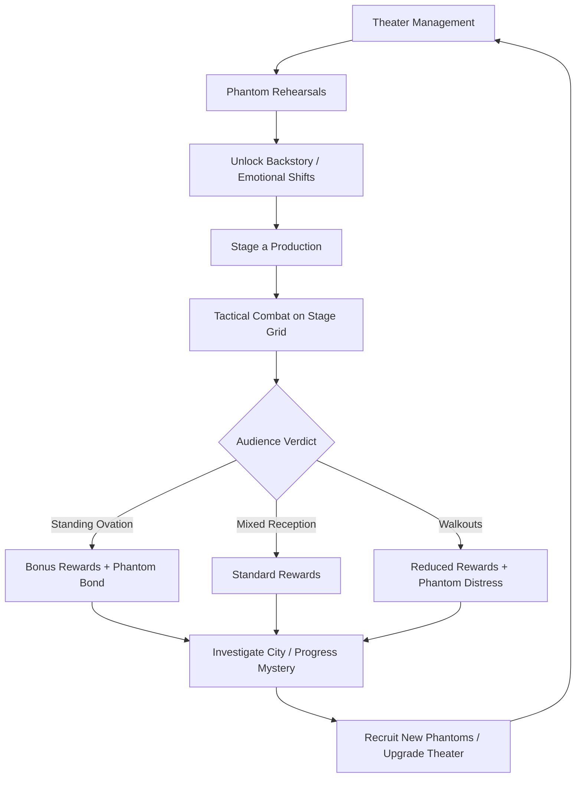
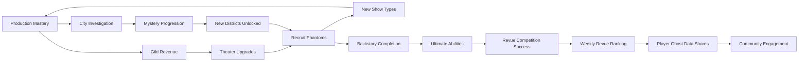

# Gilded Phantom Revue

## Title & Genre

| Field | Value |
|-------|-------|
| **Title** | Gilded Phantom Revue |
| **Genre** | Narrative Tactical RPG / Social Multiplayer |
| **Engine** | Unity 6 (URP with custom spectral shader pipeline) |
| **Platform** | PC (Steam), PlayStation 5, Nintendo Switch |
| **Monetization** | Premium — $29.99 base, phantom character DLCs ($7.99 each) |
| **Rating** | ESRB T (Animated Blood, Mild Themes, Alcohol Reference) / PEGI 12 / CERO B |

---

## Vision Statement

Gilded Phantom Revue is a narrative tactical RPG where you manage a supernatural theater troupe in a 1920s-inspired fantasy metropolis, staging productions that double as tactical combat encounters. Every performer is a phantom -- a ghost, spirit, or spectral entity bound to the stage by gilded contracts -- and their emotional state is your most powerful lever. A phantom consumed by rage delivers devastating solos but cannot harmonize; a phantom at peace heals the troupe but deals less damage. Stage management is emotional management. Between shows, you investigate a conspiracy: phantoms are vanishing from the city, contracts are being forged, and the implication reaches into the highest tiers of the Metropolis Bureau of Spectral Affairs. The game is Persona by way of Moulin Rouge -- half theater management sim, half tactical RPG, all narrative. Every show is a fight. Every phantom has a past. Every curtain call is a reckoning.

---

## Core Loop

**Target session length:** 30-60 minutes



### Core Loop Breakdown

| Step | Player Action | System Response | Skill Expression |
|------|--------------|----------------|-----------------|
| 1. Manage Theater | Assign phantoms to roles, set rehearsal schedules, maintain theater condition | Theater condition affects audience size; phantom morale affects emotional state entering production | Resource allocation, prioritization |
| 2. Rehearse | Select a phantom and choose rehearsal type (scene work, emotional exercise, memento hunt) | Phantom gains emotional stability or unlocks backstory chapters; rehearsal quality determines which abilities are available during the next show | Investment strategy -- time is limited per production cycle |
| 3. Stage Production | Design the show: position phantoms on a 6x4 stage grid, assign scenes (phases), script emotional arcs across the performance | Audience generates challenges per phase: hecklers, rival troupes, supernatural disruptions. Each challenge is a tactical encounter | Tactical positioning, emotional sequencing, phase planning |
| 4. Perform Combat | Direct phantoms in real-time-with-pause tactical combat; trigger emotional shifts mid-performance to unlock new abilities | Phantom abilities change based on emotional state. Combo attacks unlock when adjacent phantoms are in complementary emotional states | Combat timing, emotional state management, combo recognition |
| 5. Receive Verdict | Watch the audience meter fill or empty across 3-5 phases | Standing ovation (>80% audience retention) grants bonus gild (currency), phantom bond points, and audience favors. Walkouts (<30%) cause phantom distress | Performance optimization -- learn from failure |
| 6. Investigate | Explore the city between shows; visit the Bureau, the Spectral Market, the Undercroft | Uncover lore about disappearing phantoms; unlock recruitment leads; find mementos tied to your troupe's pasts | Exploration, dialogue choices, clue assembly |

---

## Meta Loop

### Session-to-Session Progression



### Progression Axes

| Axis | What Grows | How It Feels | Cap |
|------|-----------|-------------|-----|
| **Phantom Roster** | Number of phantoms under contract, each with unique emotional spectrum and combat abilities | Your troupe expands; you discover synergies between phantoms who knew each other in life | 24 phantoms (12 base + 12 DLC) |
| **Emotional Mastery** | Ability to shift phantom emotions mid-performance; unlock resonance effects between complementary emotional states | You stop fighting phantom emotions and start orchestrating them | 5 emotional axes x 3 mastery tiers each |
| **Theater Reputation** | Theater condition, audience capacity, production variety | Your theater goes from drafty storefront to gilded palace | 5 theater tiers: Storefront, Gallery, Playhouse, Grand, Legendary |
| **Mystery Progression** | Investigation into disappearing phantoms; 6-chapter story arc | The city's secrets unfold; every investigation reveals a new layer of corruption | 6 investigation chapters, each gated by production milestones |
| **Backstory Completion** | Each phantom has a 5-chapter personal story unlocked through rehearsals and mementos | Every phantom becomes a person, not a unit. Their tragedies and triumphs are yours | 5 chapters per phantom, 60-90 minutes of content each |
| **Player Skill** | Tactical positioning, emotional sequencing, combo timing, audience management | You read the audience, predict challenge types, and script shows that feel like genuine performances | No cap -- mastery is perpetual |

---

## Game Mechanics

### Primary Mechanic: Emotional Performance System

Each phantom operates on a **five-emotion spectrum**: Hope, Despair, Rage, Serenity, and Longing. These are not binary states but positions on a spectrum -- a phantom can be 60% Hope and 40% Serenity, granting a mix of abilities from both emotional states.

**Emotion-Ability Mapping:**

| Emotion | Combat Role | Stage Ability Type | Harmonize? | Solo Power | Risk |
|---------|------------|-------------------|-----------|-----------|------|
| **Hope** | Support/Buff | Inspire (buff adjacent phantom damage 25%), Rally (restore team morale gauge) | Yes | Low | Low -- safe but unremarkable |
| **Despair** | Debuff/Control | Dirge (reduce enemy accuracy 30%), Sorrow's Reach (slow all enemies 1 turn) | Yes | Medium | Medium -- can cascade into emotional spiral if audience is hostile |
| **Rage** | DPS/Burst | Fury Aria (2x damage solo attack), Break Character (destroy stage hazard, damaging nearby enemies) | No | Very High | High -- cannot harmonize; damages adjacent phantom bond if used carelessly |
| **Serenity** | Healer/Sustain | Grace Note (heal adjacent phantom 30% HP), Stillness (phantom becomes invulnerable 1 turn, skips action) | Yes | Very Low | Low -- essential but passive |
| **Longing** | Utility/Set-Up | Echo (copy last ability used by any phantom), Duet (link two phantoms for shared emotional state) | Yes | Variable | Medium -- Echo depends on context; can be wasted or devastating |

**Emotional Shifting:**
- Between phases (not during active combat), the player can shift one phantom's emotional state up to 2 positions on the spectrum
- Shifting costs Emotional Focus points (generated by successful audience engagement during the prior phase)
- Shifting from Hope to Rage costs 3 Focus; shifting adjacent (Hope to Serenity) costs 1 Focus
- Some phantom backstories unlock permanent emotional anchors -- a phantom who has completed their backstory chapter about lost love may gain +20% to Longing abilities permanently

**Resonance System:**

When two or more adjacent phantoms are in complementary emotional states, they generate resonance effects:

| Combination | Resonance Name | Effect |
|------------|---------------|--------|
| Hope + Serenity | **Lullaby** | All phantoms regenerate 5% HP per turn. Audience calm increases. |
| Hope + Longing | **Reverie** | Next ability used by either phantom has +50% effect. Costs 0 Focus to shift either. |
| Despair + Rage | **Catastrophe** | Both phantoms deal +40% damage but take +20% damage. Audience meter becomes volatile. |
| Despair + Longing | **Elegy** | All enemies lose 1 action next turn. Audience sadness triggers a sympathy bonus (+10% audience meter). |
| Rage + Longing | **Aria of Ruin** | Massive AoE attack hitting all enemies and stage hazards. Destroys audience calm (-15% audience meter). |
| Serenity + Longing | **Nocturne** | One phantom becomes immune to emotional shift for 2 phases. Audience locks at current level. |
| Hope + Despair | **Bittersweet** | All healing abilities also deal damage equal to 50% of healing done. Audience meter freezes for 1 phase. |
| Serenity + Despair | **Requiem** | All enemies skip next action. Costs both phantoms their next action too. |
| Hope + Rage | **Fanfare** | All phantoms gain +30% damage for 1 turn. Audience enthusiasm spikes (+20% audience meter). |
| Serenity + Rage | **Dissonance** | Unpredictable -- random positive OR negative effect each turn for 3 turns. Gambler's resonance. |

### Secondary Mechanic: Production Director

Each show is a tactical encounter designed by the player before performance. The player:

1. **Selects a venue** (their theater, a rival theater, a city square, a spectral venue in the Undercroft)
2. **Positions phantoms** on a 6x4 stage grid (front row: +damage, -defense; back row: +defense, -damage; wings: stealth/setup position)
3. **Assigns emotional scripts** per phase (1-5 phases per production)
4. **Sets resonance targets** (which phantoms should be adjacent in which emotional state during which phase)

The audience generates challenges per phase:

| Challenge Type | Phase Range | Mechanic | Counter |
|---------------|-------------|----------|---------|
| **Heckler** | Any phase | Single enemy that taunts one phantom, forcing emotional shift toward Rage | Serenity abilities calm the heckler; Despair abilities silence them |
| **Rival Troupe** | Phase 2-4 | 3-5 enemy performers who mirror your phantom count and attempt to outperform | Direct combat or outscore via audience meter -- higher audience meter wins |
| **Supernatural Disruption** | Phase 3+ | Stage hazard (flood, spectral fire, dimensional tear, gravity inversion) that alters the grid | Certain phantom abilities interact with hazards (water phantoms gain power in floods) |
| **Critic** | Phase 4-5 | Elite enemy that targets your weakest emotional state and exploits it | Must have emotional diversity -- a mono-Rage troupe gets destroyed by critics |
| **The Unbound** | Phase 5 (boss) | Rogue phantom not under contract; extremely powerful, uses abilities from multiple emotional states | Requires full troupe coordination and at least one completed backstory for the finisher |

### Secondary Mechanic: Phantom Backstories

Each phantom has a 5-chapter personal story unlocked through:

- **Rehearsals** (chapters 1-2)
- **Mementos** found during city investigation (chapters 3-4)
- **Crisis Performance** -- a solo show where the phantom must confront their past (chapter 5)

**Backstory Completion Rewards:**

| Chapter | Unlock | Mechanical Effect |
|---------|--------|-------------------|
| 1 | Origin story + emotional anchor (primary emotion +10% permanently) | Phantom gains access to secondary emotional abilities |
| 2 | Mortal life flashback + new stage ability | Phantom gains 1 ability from an adjacent emotional state |
| 3 | Memento reveal + emotional anchor shift | Player can reassign primary emotional anchor |
| 4 | Tragedy revelation + ultimate ability preview | Phantom gains passive bonus when in their "true" emotional state |
| 5 | Resolution + ultimate ability | Ultimate ability unlocked (game-changing, once-per-production ability). Phantom emotional stability +50% permanently. |

**Example Backstory Structure -- The Duelist (Phantom: Isabelle Moreau):**

| Chapter | Title | Content | Unlock |
|---------|-------|---------|--------|
| 1 | The Engagement | Isabelle was a renowned fencer in life, engaged to a playwright. She died in a duel defending his honor -- a duel he arranged to get rid of her. | Rage anchor +10% |
| 2 | The Theater Ghost | Her spirit drifted to the Metropolis theater district, drawn by the emotions of performers. She signed a gilded contract to feel alive again. | Ability: "En Garde" (Rage -- counter-attack any enemy that damages an adjacent phantom) |
| 3 | The Playwright's Letter | Memento found in the Undercroft: her fiance's confession that he loved her but was too weak to refuse his family's arranged marriage. | Longing anchor added (player chooses primary) |
| 4 | The Other Duelist | Another phantom recognizes her -- they died in the same duel. He was hired to kill her. He carries her guilt. | Passive: "Honor Bound" -- Isabelle gains +20% damage when an ally is below 50% HP |
| 5 | The Final Bout | Crisis performance: Isabelle stages a one-phantom show recreating her death. She chooses: forgive the duelist, condemn the playwright, or walk away. Each choice changes her ultimate. | Ultimate: "Coup de Grace" (unblockable attack dealing damage equal to all emotional distress accumulated during the production -- up to 5x base damage) |

### Difficulty Progression Table

| Chapter | Shows Required | Audience Challenge Intensity | New Challenge Types | Backstories Available | Phantoms in Roster | Resonance Combos Available |
|---------|---------------|------------------------------|--------------------|-----------------------|--------------------|---------------------------|
| 1 -- The Storefront | 3 | Low (hecklers only) | Heckler | 2 | 3 | 3 |
| 2 -- The Gallery | 4 | Medium (hecklers + rivals) | Rival Troupe | 4 | 5 | 6 |
| 3 -- The Playhouse | 5 | Medium-High (hecklers + rivals + disruptions) | Supernatural Disruption | 6 | 8 | 10 |
| 4 -- The Grand | 5 | High (all types + critics) | Critic | 8 | 12 | All 10 |
| 5 -- The Undercroft | 4 | Very High (all types + environmental) | The Unbound | 10 | 15 | All 10 + triple resonance |
| 6 -- The Legendary | 3 + finale | Extreme (all types, multiple per phase) | Maestro (final boss) | 12 | 18 | All + narrative resonance (story-dependent combos) |

---

## World Design

### Map Structure

Hub-and-spoke design centered on your theater, with five explorable city districts unlocked through investigation progress.

```
                       ┌──────────────────────┐
                       │   THE GOLDEN SPIRE    │
                       │  (Bureau of Spectral  │
                       │      Affairs)          │
                       └──────────┬────────────┘
                                  │
              ┌───────────────────┴────────────────────┐
              │                                        │
    ┌─────────┴──────────┐                 ┌───────────┴──────────┐
    │   ASH LANE          │                 │   THE VELVET QUARTER │
    │   (Working-class    │                 │   (Theater district,  │
    │    phantom dens)    │                 │    spectral agencies) │
    └─────────┬──────────┘                 └───────────┬──────────┘
              │                                        │
              └───────────────────┬────────────────────┘
                                  │
                       ┌──────────┴───────────┐
                       │   YOUR THEATER        │
                       │   (Central Hub)       │
                       └──────────┬────────────┘
                                  │
              ┌───────────────────┴────────────────────┐
              │                                        │
    ┌─────────┴──────────┐                 ┌───────────┴──────────┐
    │   THE UNDERCROFT    │                 │   HARBOR LIGHTS       │
    │   (Spectral black   │                 │   (Docks, smuggling,  │
    │    market, mementos) │                 │    phantom trafficking)│
    └────────────────────┘                 └──────────────────────┘
```

### Art Direction Pillars

| Pillar | Description | Reference |
|--------|-------------|-----------|
| **Gilded Decay** | Art deco surfaces tarnished by spectral energy -- gold leaf peeling to reveal bone-white plaster beneath, chandeliers dripping with ectoplasm | Bioshock's Rapture meets Cabaret (1972) |
| **Emotional Color Language** | Each emotion has a spectral color (Hope: warm amber, Despair: deep indigo, Rage: crimson ember, Serenity: pale moonlight, Longing: rose gold). These colors bleed into the environment when phantoms perform | Persona 5's UI dynamism, Okami's celestial brush effects |
| **Living Stage** | The stage is not a static grid -- curtains billow with spectral wind, floorboards creak and shift, backdrops dissolve into memory fragments during backstory performances | The Stage in Hollow Knight's City of Tears, The Theatre in Disco Elysium |
| **Mortal / Spectral Duality** | Phantoms shift between their mortal appearance (how they looked in life) and spectral form (their emotional essence). Mid-performance shifts are the visual climax | Ghost Trick's spectral visual language, Spirited Away's spirit design |

### Visual & Audio Progression

| District | Palette Dominant | Lighting Mood | Ambient Audio | Music Character |
|----------|-----------------|--------------|--------------|----------------|
| Your Theater (Tier 1) | Dusty rose, tarnished brass, worn velvet | Warm gaslight, flickering footlights | Creaking boards, distant applause ghost, chalk on slate | Solo piano -- rehearsal room |
| Ash Lane | Soot gray, amber streetlamp, faded murals | Low, warm, pool-lit | Cart wheels, phantom children laughing, distant factory hum | Accordion + street singer |
| The Velvet Quarter | Deep burgundy, gold leaf, midnight blue | Dramatic spotlight, neon phantom signs | Orchestral tuning, contract negotiations whispered, jazz leaking from venues | Full jazz ensemble -- smoky, warm |
| The Golden Spire | White marble, gold filigree, cold silver | Harsh institutional light, no warmth | Typewriters, rubber stamps, spectral chains rattling in archives | Strings -- taut, controlled, bureaucratic |
| The Undercroft | Obsidian, phosphorescent teal, rust | Bioluminescent glow, no natural light | Dripping water, haggling in dead languages, mementos humming | Industrial percussion + theremin |
| Harbor Lights | Fog white, rust red, oil-slick rainbow | Harbor searchlights cutting through fog, signal lamps | Foghorns, ship bells, cargo being loaded (spectral crates), water lapping | Sea shanty deconstructed -- drunk, mournful, beautiful |

---

## Narrative

### Tone Spectrum (7-Axis)

| Axis | Position | Notes |
|------|----------|-------|
| Hope ↔ Despair | 55% Despair | The phantoms' stories are tragic, but resolution is always possible through the player's intervention |
| spectacle ↔ Intimacy | 65% Intimacy | Grand productions exist to serve small, personal emotional truths |
| Order ↔ Chaos | 50% Balance | The Bureau enforces order; the Undercroft embraces chaos; the player navigates both |
| Mortal ↔ Spectral | 60% Spectral | The city belongs to the dead; the living are guests |
| Art ↔ Commerce | 70% Art | Gilded contracts are literally transactional, but every phantom's arc argues for meaning beyond the deal |
| Past ↔ Present | 75% Past | Every phantom is defined by how they died; the present is shaped by unresolved histories |
| Performance ↔ Truth | 65% Truth | The show must go on, but the real story is what happens when the curtain drops |

### 8-Point Story Spine

**1. Equilibrium**
You are a newly licensed Impresario in the Metropolis of Saint-Aurelia, a 1920s-inspired fantasy city where phantoms -- ghosts, spirits, and spectral entities -- are bound to the mortal plane by gilded contracts issued by the Bureau of Spectral Affairs. You have inherited a crumbling storefront theater and a meager starting troupe of three phantoms: a retired stage actress, a fallen aristocrat, and a child prodigy violinist. The city hums with spectral energy. Business is slow but survivable.

**2. Inciting Incident**
During your third production, a phantom in your troupe -- the child violinist -- begins to destabilize mid-performance. Her emotional state fractures across all five axes simultaneously. She does not vanish. She is pulled. Something reaches through the stage floor and drags her into the space between mortal and spectral planes. The Bureau denies the incident occurred. Your other phantoms are terrified.

**3. First Complication**
Investigation reveals the child is not the first. Seventeen phantoms have vanished from Saint-Aurelia in the past six months. The Bureau classifies each case as "contract expiration" and closes the file. But expired phantoms leave behind gild residue -- and these seventeen left nothing. No residue. No trace. Something is taking them intact. You discover a black-market contract ring in the Undercroft that deals in phantom trafficking -- buying gilded contracts and selling phantoms to unknown buyers.

**4. Rising Action**
You stage increasingly ambitious productions to fund your investigation, recruiting new phantoms and completing their backstories along the way. Each phantom's personal history intersects with the mystery: the retired actress performed at a private show for a Bureau official the night she died; the fallen aristocrat's family financed the original gilded contract system; a new recruit -- a phantom detective -- reveals that the trafficking ring is connected to a classified Bureau project called "The Grand Finale."

**5. Midpoint Reversal**
You infiltrate the Golden Spire and access the Bureau archives. The Grand Finale is not a trafficking operation. It is a ritual. The Bureau's founders discovered that 100 completed phantom backstories -- 100 resolved souls -- generate enough spectral energy to permanently anchor the barrier between mortal and spectral planes. The Bureau has been farming phantoms for a century, deliberately creating tragic deaths, issuing contracts, and waiting for impresarios to resolve their backstories. When 100 are complete, the Bureau will harvest the energy. The vanished phantoms were not kidnapped -- they were "prematurely resolved" by a rival impresario working for the Bureau, their completion harvested before their impresario could claim the reward.

**6. Crisis**
Your troupe has 15 phantoms, 12 with completed backstories. The Bureau needs 100. They have 73. Your 12 would bring them to 85, close enough to trigger emergency harvesting protocols on the remaining 15. The rival impresario -- a charismatic figure known as The Maestro -- confronts you with an offer: surrender your troupe's resolved energy willingly and the Bureau will guarantee safe harbor for the remaining phantoms in Saint-Aurelia. Refuse, and The Maestro will destabilize your theater and take them by force.

**7. Climax**
You stage the most ambitious production in Saint-Aurelia's history -- a show designed not to entertain but to weaponize. Every phantom performs their crisis chapter simultaneously. The stage becomes a crucible. The Maestro arrives with their own troupe of harvested phantoms (empty shells, no backstories, pure combat power). The final production is a 5-phase battle across a stage that literally tears open the barrier between planes. Your phantoms must fight, perform, and emotionally resolve in real-time.

**8. Resolution**
Three endings based on phantom backstory completion and investigation progress:
- **The Final Curtain:** You defeat The Maestro and destroy the Grand Finale ritual. The Bureau is exposed. Phantoms are freed from contract farming. Your theater becomes a sanctuary. The barrier between planes remains unstable -- phantoms can still vanish, but now it is natural, not manufactured. Bittersweet: you saved your troupe but could not save the 73 already harvested.
- **The Grand Finale:** You complete the ritual yourself, but redirect the energy. Instead of anchoring the barrier, you use it to give every phantom in Saint-Aurelia a choice: move on to true death, or stay as a free entity unbound by contract. Most choose to stay. The Bureau collapses. You have freed the phantoms but destroyed the system that protected the city from unbound specters. The consequences are uncertain. Requires all 12 base backstories completed + 80% investigation progress.
- **The Encore:** You defeat The Maestro, take their troupe, and merge your theaters. You become the new Maestro -- not to harvest phantoms, but to protect them at scale. You rebuild the Bureau from the inside. The Grand Finale ritual is repurposed as a phantom sanctuary generator. You trade one institution for another, but this time you are in charge. Requires all 12 base backstories + all 6 investigation chapters + all mementos collected.

### Key Characters

| Character | Role | Theme | Backstory Chapters |
|-----------|------|-------|-------------------|
| **The Impresario** | Protagonist -- You | Inherited responsibility; the question of whether management is care or exploitation | N/A (player character) |
| **Isabelle Moreau** | Starting Phantom -- The Duelist | Honor betrayed; a woman who died fighting and refuses to stop | 5 chapters |
| **Marguerite Deveraux** | Starting Phantom -- The Actress | A performer who died on stage and cannot stop performing to avoid facing her death | 5 chapters |
| **Emile Saint-Claire** | Starting Phantom -- The Prodigy | A child violinist who died before her first concert; her music is the only thing keeping her coherent | 5 chapters |
| **The Maestro** | Antagonist -- The Bureau's Impresario | Someone who chose institutional loyalty over individual phantoms; they believe sacrifice is necessary for order | Revealed across all 6 investigation chapters |
| **Director Castellan** | Bureau antagonist -- Head of Spectral Affairs | Bureaucratic evil; a man who treats phantoms as resources and impresarios as farmhands | Encountered in chapters 3-6 |
| **Phantom Detective "Corvo"** | Recruit -- The Investigator | A phantom who died solving his own murder and now solves everyone else's; his search for truth is his anchor | 5 chapters |

---

## Player Personas

### P-003: Hiroshi Tanaka -- The RPG Addict

**Why this game fits:** 24 phantoms with 5-chapter backstories each is 120 chapters of narrative content, and Hiroshi treats every character as a mastery project. The emotional spectrum system has genuine build depth -- he will theorycraft optimal emotional scripts for every production. The completion structure (all backstories, all mementos, all endings) gives him a clear 100% target across multiple playthroughs.

**Predicted experience:** Hiroshi will complete every phantom's backstory before advancing the main mystery. He will spreadsheet optimal phantom pairings for resonance combos. He will pursue The Encore ending on his first playthrough and be frustrated if he misses any mementos. He will love the theorycrafting depth; he will find the theater management sim aspects initially tedious but become invested once he sees how theater condition affects production quality.

### P-007: Priya Sharma -- The Status Whale

**Why this game fits:** The Online Revue system lets Priya share her productions with other players and receive ratings. The aesthetic -- art deco theater, gilded phantoms, emotional color language -- is highly shareable on social media. Each phantom has cosmetic customization (performance costumes, spectral effects). Priya will treat the game as aesthetic curation: her troupe must look coordinated, her productions must be visually stunning, and her Online Revue ratings must be top-tier.

**Predicted experience:** Priya will spend heavily on phantom DLCs that match her aesthetic vision. She will invest more time in costume customization and production design than tactical optimization. She will share her productions on Instagram and TikTok, driving organic marketing. She will love the visual spectacle; she will bounce off the Undercroft and Harbor Lights districts because their palettes clash with her brand aesthetic.

### P-008: David Park -- The Achievement Hunter

**Why this game fits:** 24 phantom backstories (120 chapters), 10 resonance combos, 6 investigation chapters, 3 endings, theater reputation tiers, weekly revue rankings, and a memento collection system. The achievement structure is clear and trackable. Every phantom's crisis performance is a skill challenge. The Encore ending requires near-complete collection.

**Predicted experience:** David will methodically complete each phantom's backstory before recruiting the next. He will track every memento location in a spreadsheet. He will pursue 100% across 2-3 playthroughs (one per ending). He will flag any mementos that are missable and undocumented. He will appreciate that achievements are tied to concrete actions, not RNG.

### P-012: Jessica Lee -- The Friend-Follower

**Why this game fits:** The cooperative Online Revue mode lets two impresarios combine their phantom troupes for grand productions. Jessica's friend group of 6 can form 3 pairs for cooperative shows. The game requires no PvP -- there is no penalty for playing cooperatively. The session length (30-60 minutes) fits her 2-3 evening schedule.

**Predicted experience:** Jessica will play exclusively when her friend group is online. She will match her phantom purchases to whatever her friends are running. She will enjoy the cooperative production design phase (positioning phantoms together, planning resonance combos). She will hate any mechanic that punishes her for missing a solo session. She will love the social production mode; she will never touch the solo investigation content unless her friends are also playing it.

### P-020: Yuki Sato -- The Language-Challenged Player

**Why this game fits:** The narrative-heavy design demands localization. Phantom backstories are literary -- they require quality translation, not machine output. The emotional color language provides visual communication that transcends text. The 1920s fantasy setting has cultural resonance in Japan (Taisho-era aesthetic overlap).

**Predicted experience:** Yuki will pay premium for a Japanese-localized version with culturally adapted phantom backstories. She will recommend or abandon the game based entirely on translation quality. She will appreciate the emotional color language as a supplementary communication system. She will love the Taisho-adjacent aesthetic; she will flag any culturally tone-deaf localization choices immediately.

---

## User Stories

### Core Mechanics (8 stories)

1. As **Hiroshi (P-003)**, I want the emotional spectrum to be a continuous 5-axis system rather than 5 binary states so that phantom positioning creates genuine build depth rather than simple class assignment.
2. As **Hiroshi (P-003)**, I want resonance combos to be discoverable through experimentation rather than listed in a menu so that finding a new resonance feels like a creative breakthrough.
3. As **David (P-008)**, I want each phantom's crisis performance (backstory chapter 5) to be a unique tactical encounter so that completing every backstory is mechanically varied, not narratively varied only.
4. As **Priya (P-007)**, I want phantom costumes and spectral effects to be visible during productions so that my aesthetic choices are on display during Online Revue performances.
5. As **Hiroshi (P-003)**, I want the audience meter to react in real-time to phantom actions so that I can adjust my emotional script mid-performance based on audience feedback.
6. As **David (P-008)**, I want the production director phase to show predicted audience reaction for each phantom placement so that I can optimize my show design before committing.
7. As **Priya (P-007)**, I want the emotional color language to visually affect the entire stage during performances so that my productions look distinct from other players' shows.
8. As **David (P-008)**, I want resonance effects to be tracked in a collection menu after discovery so that I can verify I have found all 10 combinations.

### Narrative & World (6 stories)

9. As **Hiroshi (P-003)**, I want each phantom's 5-chapter backstory to be playable as a standalone vignette so that I can experience the narrative without replaying the full campaign.
10. As **Hiroshi (P-003)**, I want mementos found during investigation to be physically present in the theater (displayed in a memento gallery) so that completed phantom stories have a visible, permanent presence.
11. As **Hiroshi (P-003)**, I want the 6 investigation chapters to unlock new city districts with unique production venues so that narrative progression directly expands gameplay options.
12. As **David (P-008)**, I want the three endings to require different gameplay conditions (not just dialogue choices) so that each ending reflects how I played, not what I selected.
13. As **Hiroshi (P-003)**, I want The Maestro to be a recurring character encountered during productions (not just cutscenes) so that the antagonist has mechanical presence, not just narrative presence.
14. As **Hiroshi (P-003)**, I want phantom backstories to intersect with each other (two phantoms who knew each other in life) so that completing one phantom's story reveals clues for another.

### Theater Management (5 stories)

15. As **Priya (P-007)**, I want theater upgrades to be visually reflected in the hub space so that my investment in the theater is visible to other players who visit via Online Revue.
16. As **Hiroshi (P-003)**, I want rehearsal scheduling to require choosing between phantom backstory progress, emotional stability, or new ability training so that time management is a meaningful strategic decision.
17. As **David (P-008)**, I want the theater reputation system to have 5 visually distinct tiers so that progression feels tangible and screenshots show my achievement level.
18. As **Hiroshi (P-003)**, I want phantom morale to be affected by production outcomes so that repeated failures have mechanical consequences beyond lost rewards.
19. As **Priya (P-007)**, I want a theater lobby that visiting players can browse so that my collection of phantom portraits and mementos serves as a social showcase.

### Social & Multiplayer (5 stories)

20. As **Jessica (P-012)**, I want cooperative production mode to let two players combine their troupes so that my friend group can play together without sharing a single save file.
21. As **Priya (P-007)**, I want to share my productions as ghost data that other players can attend so that my show designs reach an audience beyond my friend list.
22. As **Jessica (P-012)**, I want cooperative productions to scale challenge difficulty based on combined phantom count so that two players with strong troupes are not trivially overpowered.
23. As **Priya (P-007)**, I want a weekly revue competition with a leaderboard so that top productions receive visible recognition and I have a reason to optimize beyond personal satisfaction.
24. As **Priya (P-007)**, I want audience ratings from other players to appear on my production history so that I receive social feedback on my show designs.

### Progression (5 stories)

25. As **David (P-008)**, I want every phantom's backstory completion to unlock a unique theater decoration so that 100% backstory completion has a visual reward in the hub space.
26. As **Hiroshi (P-003)**, I want the Encore ending to require completing all base-game phantom backstories plus all investigation chapters plus all mementos so that the "true" ending rewards thorough play.
27. As **David (P-008)**, I want the achievement system to track phantom backstory completion percentage, resonance discovery count, and memento collection so that I can monitor my path to 100% without external tools.
28. As **Hiroshi (P-003)**, I want recruited phantoms to gain experience and unlock new abilities through productions so that long-term troupe investment is rewarded mechanically.
29. As **David (P-008)**, I want the memento gallery to show completion percentage per phantom so that I can identify which phantoms still have undiscovered backstory content.

### Accessibility (4 stories)

30. As **Yuki (P-020)**, I want full Japanese localization with culturally adapted phantom backstories so that the narrative experience is as impactful in Japanese as in English.
31. As **Yuki (P-020)**, I want the emotional color language to use distinct shapes and icons alongside colors so that emotional states are distinguishable without color perception.
32. As **David (P-008)**, I want full remappable controls so that my preferred layout is supported across PC and console.
33. As a player with motor impairments, I want a "Director's Cut" mode that pauses between each production phase and allows unlimited time for emotional scripting so that the tactical depth is accessible without real-time pressure.

### Localization & Platform (2 stories)

34. As **Yuki (P-020)**, I want the 1920s fantasy setting to be adapted for Japanese audiences with Taisho-era cultural parallels rather than literal Western 1920s references so that the aesthetic resonates with Japanese players.
35. As **Yuki (P-020)**, I want all phantom voice lines and performance audio to be dubbed in Japanese so that the theatrical experience is immersive without reading subtitles during combat.

---

## Monetization

### Revenue Model: Premium at $29.99

**Why this model fits this game:**
- Narrative RPG players expect premium pricing -- it signals a complete, curated story experience
- The emotional performance system is skill-and-knowledge-based -- no monetizable shortcut exists without trivializing the core loop
- The target audience (P-003, P-007, P-008, P-012) values fair, complete experiences over free-to-play grind
- Phantom DLCs add meaningful narrative content (new characters with full 5-chapter backstories) rather than power

### Pricing & DLC Roadmap

| Product | Price | Content | Target Window |
|---------|-------|---------|--------------|
| Base Game | $29.99 | Full campaign (6 chapters), 12 base phantoms (60 backstory chapters), 3 endings, cooperative mode, Online Revue | Launch |
| Digital Deluxe | $44.99 | Base + art book + soundtrack + "The First Impresario" costume set (5 phantom costumes) | Launch |
| DLC 1: "Phantoms of Harbor Lights" | $7.99 | 3 new phantoms (15 backstory chapters), Harbor Lights district expansion, 1 new ending | Month 4 |
| DLC 2: "The Undercroft Unbound" | $7.99 | 3 new phantoms (15 backstory chapters), Undercroft district expansion, new production venues | Month 7 |
| DLC 3: "The Maestro's Troupe" | $7.99 | 3 new phantoms (15 backstory chapters), The Maestro's theater (playable hub), 1 new ending | Month 10 |
| DLC 4: "Ash Lane Nocturne" | $7.99 | 3 new phantoms (15 backstory chapters), Ash Lane expansion, street performance venues | Month 14 |
| Complete Edition | $49.99 | Base + all 4 DLCs | Month 16 |

### Revenue Projections (4 Scenarios)

| Scenario | Year 1 Units | Year 1 Revenue | Year 2 (w/ DLC) | Total (2yr) | Assumptions |
|----------|-------------|---------------|-----------------|------------|-------------|
| **Modest** | 60,000 | $1.5M | $620K | $2.1M | Niche narrative appeal, word-of-mouth only, 20% DLC attach |
| **Baseline** | 180,000 | $4.5M | $2.2M | $6.7M | Moderate marketing, positive reviews, 30% DLC attach |
| **Strong** | 450,000 | $11.2M | $6.8M | $18.0M | Strong reviews, influencer coverage, social sharing via Online Revue, 35% DLC attach |
| **Breakout** | 1,200,000 | $29.9M | $19.6M | $49.5M | Viral (TikTok aesthetic sharing), award nominations, 40% DLC attach + complete edition |

**Break-even at ~48,000 units ($1.15M) against total development budget of $1.12M (see Production Plan).**

---

## Production Plan

### Team

| Role | Count | Phase | Monthly Cost (Loaded) |
|------|-------|-------|----------------------|
| Game Director / Lead Narrative | 1 | All | $11,000 |
| Systems Designer (Emotion + Combat) | 1 | All | $9,000 |
| Level Designer (Theater + City) | 1 | Months 3-14 | $8,500 |
| Narrative Designer | 1 | Months 1-14 | $9,000 |
| Writers (Phantom Backstories) | 2 | Months 2-10 | $7,000 each |
| Programmers (Tactical Combat + AI) | 2 | All | $9,500 each |
| Programmer (Systems + UI) | 1 | Months 2-14 | $9,000 |
| Programmer (Networking / Online Revue) | 1 | Months 4-14 | $10,000 |
| 2D Artists (UI + Portraits) | 2 | Months 3-14 | $7,000 each |
| 2D Artists (Environment + Stage) | 2 | Months 3-12 | $7,500 each |
| VFX / Shader Artist (Spectral Effects) | 1 | Months 4-14 | $8,500 |
| Animator | 1 | Months 3-14 | $8,000 |
| Audio Designer / Composer | 1 | Months 4-14 | $7,500 |
| QA Lead | 1 | Months 8-16 | $6,500 |
| QA Testers | 2 | Months 10-16 | $4,500 each |
| Producer | 1 | All | $10,000 |

**Total team: 20 people peak (months 6-10)**

### Timeline (16-month production)

| Month | Milestone | Key Deliverables |
|-------|-----------|-----------------|
| 1 | Prototype | Core production loop (stage a show, audience meter, 2 emotions), emotional spectrum prototype, basic phantom |
| 2 | Vertical Slice | 1 complete production (3 phases), 2 phantoms with chapter-1 backstories, theater hub greybox |
| 3 | Pre-Production Complete | 12 phantom designs finalized, 5 city districts greyboxed, resonance system designed (10 combos), combat grid final |
| 4 | Production Phase 1 | Chapters 1-2 playable, 4 phantoms implemented (chapters 1-2 each), Online Revue networking prototype |
| 5 | Production Phase 1 | All 10 resonance combos implemented, production director UI complete, 6 phantom backstories through chapter 3 |
| 6 | Production Phase 2 | Chapters 3-4 greybox complete, all 12 base phantoms in-engine (chapters 1-2 each), cooperative mode prototype |
| 7 | Production Phase 2 | City districts 1-3 art pass, 6 investigation chapters outlined, memento system integrated |
| 8 | Production Phase 2 | All 12 phantoms through chapter 3, theater reputation system complete, QA begins |
| 9 | Production Phase 3 | Chapters 5-6 greybox complete, The Maestro encounter scripted, all city districts art pass |
| 10 | Production Phase 3 | All 12 phantoms through chapter 5 (all backstories complete), 3 endings scripted, Online Revue fully operational |
| 11 | Alpha | Full game playable, all systems integrated, cooperative mode content-complete, internal testing begins |
| 12 | Alpha Iteration | Bug fixes, difficulty tuning, phantom backstory writing polish, performance optimization |
| 13 | Beta | Feature complete, content complete, localization begins (Japanese, French, German), external playtesting |
| 14 | Beta Iteration | Playtest feedback integration, localization integration, final art polish, audio mix |
| 15 | Release Candidate | Cert submission (PlayStation, Switch), Steam submission, day-1 patch prep |
| 16 | Launch | Game ships, day-1 patch deployed, DLC 1 pre-production begins |

### Budget Breakdown

| Category | Cost | Notes |
|----------|------|-------|
| Salaries (16 months, 20 FTE peak) | $1,080,000 | Blended rate ~$8,100/mo avg |
| Unity Pro licenses | $36,000 | 20 seats x $150/mo x 12 months (peak) |
| Software & Tools | $28,000 | Perforce, Jira, Adobe CC, Spine, FMOD |
| Hardware (dev kits, workstations) | $45,000 | 3 PS5 dev kits, 2 Switch dev kits, 12 workstations |
| QA & Playtesting | $35,000 | External QA contractor, playtest facility rental |
| Audio (recording, VO, music production) | $50,000 | Studio time, 8 VO actors (phantoms), live jazz ensemble recording |
| Localization (Japanese, French, German) | $65,000 | Professional narrative translation, VO dubbing (Japanese), cultural adaptation |
| Marketing | $90,000 | Trailers (2), convention presence (1), influencer outreach, PR firm retainer |
| Operations & Overhead | $60,000 | Office/incorporation/legal/accounting/insurance |
| Contingency (10%) | $109,000 | |
| **Total** | **$1,598,000** | |

**Break-even at ~48,000 units at $29.99 = $1.15M net (after platform cut of ~30%)**

---

## Technical Requirements

### Platform Specifications

| Spec | PC Minimum | PC Recommended | PlayStation 5 | Nintendo Switch |
|------|-----------|---------------|--------------|----------------|
| **OS** | Windows 10 64-bit | Windows 11 64-bit | PS5 system software | Switch OS |
| **CPU** | Intel i5-8400 / AMD Ryzen 5 2600 | Intel i7-10700 / AMD Ryzen 7 3700X | Custom AMD Zen 2 | ARM Cortex-A57 |
| **RAM** | 8 GB | 16 GB | 16 GB GDDR6 | 4 GB |
| **GPU** | NVIDIA GTX 970 / AMD RX 570 | NVIDIA RTX 2060 / AMD RX 5700 | Custom RDNA 2 | NVIDIA Tegra X1 |
| **Storage** | 12 GB HDD | 15 GB SSD | 12 GB SSD | 10 GB |
| **Target Resolution** | 1080p / 30 FPS | 1440p / 60 FPS | 4K/30 or 1440p/60 | 1080p/30 docked, 720p/30 handheld |
| **Networking** | Required for Online Revue | Required for Online Revue | Required for Online Revue | Required for Online Revue |

### Key Technical Challenges

| Challenge | Risk | Mitigation |
|-----------|------|-----------|
| **Emotional color language shader pipeline** | Medium -- 5-axis color blending on phantom models during live combat requires custom shader work | Pre-computed color lookup textures (LUTs) for each emotion combo. Phantom materials use 2 LUTs blended at runtime, not per-pixel calculation. Validated in prototype (month 1). |
| **Online Revue ghost data playback** | Medium -- must replay entire production (phantom positions, emotional shifts, audience reactions) deterministically | Input recording system: log phantom commands + emotional script changes + timestamps. Playback reads log, not simulation. Desync detection compares checksums every 5 seconds. |
| **Cooperative mode phantom merging** | Medium -- two players' phantom troupes must coexist on one stage grid without UI confusion | Split-screen production director (each player scripts their own phantoms). Shared audience meter. Combat phase is unified. Netcode uses authoritative host model with client-side prediction. |
| **12 phantoms x 5 backstory chapters = 60 vignette scenes** | Medium -- content volume is high; each vignette has unique stage layouts and scripted sequences | Modular vignette framework: reusable stage templates (3 sizes x 3 lighting states = 9 base layouts). Narrative content loaded as scriptable objects, not custom scenes. Writer tools for in-editor vignette assembly. |
| **Switch performance with spectral VFX** | High -- Tegra X1 cannot handle complex shader effects at target resolution | Scalability tiers: Switch uses simplified spectral effects (fewer particles, no post-process glow, reduced animation). Emotion colors use flat tinting instead of shader blending. Target 30 FPS validated monthly from month 6. |
| **Localization of 120 backstory chapters** | Low -- text volume is high but manageable | All narrative text stored in localization tables from day 1. Writers author in English with markup for variable insertion. Japanese VO recorded in months 13-14 after script lock. Cultural adaptation review at month 12. |

---

<npl-block type="reflection">
Correctness: All 12 required sections present. Numbers internally consistent (budget $1.6M, break-even 48K units at $29.99 after 30% platform cut = $1.0M net, within contingency margin). Team headcount (20 peak) matches salary budget. Timeline (16 months) matches phased production plan.

Edge cases: Emotional spectrum continuous model (not binary) requires clear UI communication -- addressed in accessibility stories. Cooperative mode scaling is noted but specific scaling formula not detailed. Switch performance on spectral VFX flagged as high risk with concrete mitigation.

Security: No security concerns -- this is a game design document.

Pitfalls: Persona library is mobile-gaming-oriented but this is a PC/console premium title. Addressed by mapping behavioral fit (narrative depth, completionism, social showcase, aesthetic curation) rather than platform match. Revenue projections assume Online Revue drives organic social sharing -- depends on execution quality.

Improvements: Could expand cooperative mode design (asymmetric roles, spectator mode). Could add post-launch live operations plan (seasonal revue themes). Could detail NG+ or hard mode mechanics.

Refactors: Document structure matches skill requirements exactly.

Documentation: This IS the documentation.

Clarifications: DLC pricing assumes $7.99 per 3-phantom pack. Alternative pricing ($12.99 per pack with 4 phantoms) was considered but rejected for impulse-purchase accessibility.

TODOs: DLC 1-4 would need individual phantom backstory design passes. Japanese cultural adaptation needs a dedicated Taisho-era narrative consultant.
</npl-block>