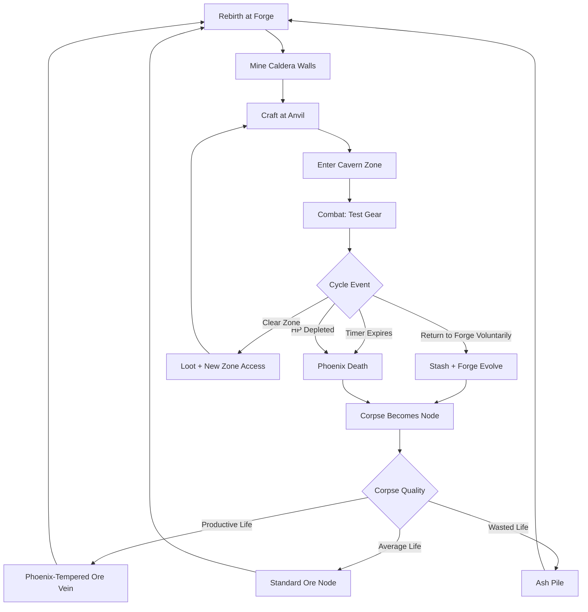
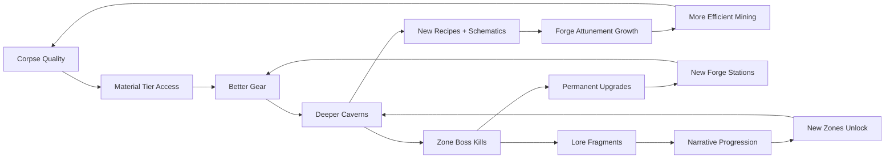

# Gilded Phoenix Forge

## Title & Genre

| Field | Value |
|-------|-------|
| **Title** | Gilded Phoenix Forge |
| **Genre** | Crafting-Focused Action RPG / Roguelite |
| **Engine** | Unity 6 (URP with custom voxel-mesh hybrid rendering) |
| **Platform** | PC (Steam/Epic), PlayStation 5, Xbox Series X/S, Nintendo Switch |
| **Monetization** | Premium — $29.99 base, no microtransactions |
| **Rating** | ESRB T (Fantasy Violence, Mild Blood) / PEGI 12 / CERO B |

---

## Vision Statement

Gilded Phoenix Forge is a cyclical crafting-action RPG where you play as a phoenix-blacksmith who dies and is reborn every 20 minutes. Each life is a strategic investment: mine the volcanic caldera for ores, craft weapons and armor at an evolving forge-anvil, then venture into monster-infested caverns to test your creations. When the cycle ends — by timer, death, or choice — your body calcifies into a resource node that your next incarnation mines. A productive life yields phoenix-tempered metal, the rarest material in the game. A wasted life yields only ash. The forge itself remembers what you crafted and evolves specialized attunements across lives. This transforms death from failure into the central strategic mechanic: you are not surviving, you are composting yourself into progressively more powerful incarnations. It is Hades meets Atelier Ryza by way of a volcanic forge that eats its creator.

---

## Core Loop

**Target session length:** 20–60 minutes (1–3 life cycles)



### Core Loop Breakdown

| Step | Player Action | System Response | Skill Expression |
|------|--------------|----------------|-----------------|
| 1. Rebirth | Spawn at forge with previous life's stashed gear (if any) and inherited forge attunements | Inventory resets to base; stash persists across lives. Forge attunement bonuses apply | Long-term planning across cycles |
| 2. Mine | Strike caldera walls for ore deposits; deeper walls yield rarer materials | Nodes respawn each life. Rarer nodes spawn in harder-to-reach caldera positions (near lava flows, on ledges requiring platforming) | Route optimization, platforming skill, risk assessment |
| 3. Craft | Use anvil to combine ores + previous-corpse materials into weapons, armor, consumables | Crafting quality scales with forge attunement and material tier. Recipes unlock via discovery (combining unknown materials) and schematic drops | System mastery, experimentation |
| 4. Venture | Choose a cavern zone matching current loadout strengths | Zones have elemental affinities and enemy type biases. Match weapon type to zone for efficiency; mismatch for challenge bonus | Strategic loadout selection |
| 5. Combat | Real-time action combat using crafted weapons | Weapons degrade through use (durability); break = return to forge. Armor absorbs damage. Enemies drop materials and schematics | Action skill, weapon moveset mastery |
| 6. Die/Return | Cycle ends — phoenix body calcifies | Corpse quality scored on: enemies killed (0–35 pts), items crafted (0–25 pts), distance explored (0–20 pts), time remaining (0–20 pts). Score determines corpse-tier | Efficiency, time management, life-planning |

### Life Cycle Scoring Table

| Score Range | Corpse Tier | Resources for Next Life | Visual |
|------------|------------|------------------------|--------|
| 0–25 | Ash Pile | 1–3 common ore, 0 phoenix ember | Gray dust pile with faint ember glow |
| 26–50 | Cooled Corpse | 3–6 common ore, 1 uncommon ore, 1 phoenix ember | Cracked stone figure with orange veins |
| 51–75 | Glowing Remains | 5–8 mixed ore, 2–3 uncommon ore, 2 phoenix ember, 1 rare ore chance | Luminous orange statue, still radiating heat |
| 76–99 | Molten Monument | 8–12 mixed ore, 3–4 uncommon ore, 3 phoenix ember, 1 guaranteed rare ore | Flowing golden figure, lava drips from hands |
| 100 | Perfect Ash | 12+ mixed ore, 5 uncommon ore, 5 phoenix ember, 2 rare ore, 1 phoenix-tempered ingot | Brilliant golden phoenix silhouette frozen mid-flight |

---

## Meta Loop

### Cycle-to-Cycle Progression



### Progression Axes

| Axis | What Grows | How It Feels | Cap |
|------|-----------|-------------|-----|
| **Forge Mastery** | Attunement bonuses to specific weapon/armor types | Your anvil hums with fire when you approach it. The forge knows you. | 5 attunement types, each with 10 ranks |
| **Material Knowledge** | Recipe discovery, crafting quality floors, material identification | You stop wasting rare ores on failed experiments. You see potential in every node. | 127 recipes across 6 tiers |
| **Corpse Optimization** | Higher baseline corpse scores from permanent upgrades | Even a "bad" life leaves better remains than your first "good" life | 12 permanent corpse-boost upgrades |
| **Cavern Depth** | Access to deeper, harder, more rewarding zones | The mountain opens for you — you earn the right to go deeper | 8 cavern zones, each with 3 depth tiers |
| **Phoenix Resilience** | Base HP, stamina, carry capacity, mining speed | The phoenix itself grows stronger between incarnations | 20 resilience nodes on a skill tree |
| **Lore Completion** | Understanding of the forge, the volcano, and the phoenix cycle | The mystery of why you keep dying and being reborn unfolds | 38 lore fragments |
| **Player Skill** | Combat efficiency, crafting route optimization, time management | You finish lives with 5 minutes to spare where you used to run out | No cap — mastery is perpetual |

---

## Game Mechanics

### Primary Mechanic: The Phoenix Death Cycle

Every 20 minutes of real time, the phoenix dies. The player has no control over the timer — it is the fundamental law of the world. What they control is everything that happens within those 20 minutes.

**Timer Rules:**
- Timer is visible at all times (top-center HUD, diegetic: a glowing ember that dims as time passes)
- Timer pauses at forge anvil (crafting) and stash interface (inventory management)
- Timer does NOT pause during combat, mining, or traversal
- When timer reaches 0:00, the phoenix enters "Ashfall" — a 10-second grace period where movement slows to 50% but the player can still act. At 0:00–0:09 the screen desaturates. At 0:10, death.
- Voluntary return to forge at any time (via the Forge Heart item, crafted or found). This ends the cycle early but awards +5 bonus corpse score for efficiency.

**Corpse Scoring Formula:**

```
corpse_score = (enemies_killed x 1.0)        -- max 35
             + (items_crafted x 2.5)          -- max 25
             + (zones_cleared_fraction x 20)   -- max 20
             + (time_remaining_sec x 0.33)     -- max 20 (60s remaining)
             + voluntary_return_bonus           -- 0 or 5
```

**Corpse Persistence:**
- Corpses persist for exactly 1 life cycle. If you do not mine your previous corpse within the next 20-minute cycle, it degrades one tier (Molten Monument -> Glowing Remains -> Cooled Corpse -> Ash Pile -> disappears).
- This creates urgency: you must route your mining phase to include your own grave.

### Secondary Mechanic: Living Forge Attunement

The forge evolves based on crafting history. It tracks the last 10 crafted items and develops attunements that boost future crafts of similar types.

**Attunement Types:**

| Attunement | Trigger | Bonus | Visual |
|-----------|---------|-------|--------|
| **Flameheart** | Craft 3+ fire-aspected weapons in 10-item window | +15% fire damage on crafted fire weapons, -10% fire material cost | Anvil glows orange-red, forge flames intensify |
| **Frostvein** | Craft 3+ ice-aspected weapons in 10-item window | +15% ice weapon duration (freeze effects last longer), -10% ice material cost | Frost crystals grow on anvil, blue-white flames |
| **Stormtemper** | Craft 3+ lightning-aspected weapons in 10-item window | +15% lightning chain targets, -10% lightning material cost | Arcing electricity between anvil and walls |
| **Earthenbond** | Craft 3+ blunt/defense items in 10-item window | +15% armor durability, -10% armor material cost | Moss and stone growths on anvil surface |
| **Voidspark** | Craft 3+ from phoenix-tempered materials in 10-item window | +20% chance of bonus modifier on any craft, +5% phoenix ember yield from corpses | Dark purple shimmer, anvil appears to float slightly |

**Attunement Conflict:**
- Only one attunement can be active at a time (whichever has the highest count in the 10-item window)
- Ties favor the most recently crafted type
- Switching attunements takes 2 crafts of the new type (the forge resists change)

### Secondary Mechanic: Weapon Crafting System

**Weapon Types and Their Cavern Matchups:**

| Weapon Type | Damage Profile | Strong Against | Weak Against | Cavern Zone |
|------------|---------------|----------------|-------------|-------------|
| **Sword** | Balanced (slash) | Unarmored, fast enemies | Heavy armor, shields | Ember Caverns |
| **Hammer** | Slow, high impact (blunt) | Armored, shelled enemies | Fast, dodging enemies | Iron Depths |
| **Spear** | Long range, piercing | Large, slow enemies | Swarms, flanking enemies | Crystal Hollows |
| **Bow** | Ranged, sustained | Flying, retreat-pattern enemies | Close-quarters rushers | Wind Tunnels |
| **Gauntlets** | Fast, combo-building | Swarm enemies, breakable shields | Heavy single-target | Magma Flats |
| **Staff** | Magic, elemental burst | Element-weak enemies | Element-resistant enemies | Obsidian Sanctum |
| **Greatsword** | Wide arcs, high stagger | Multi-enemy packs | Fast single-target, flanking | Basalt Chambers |
| **Shield+Sword** | Defensive, counter-attack | Aggressive telegraph enemies | DoT, area denial | Ash Warrens |

**Crafting Material Tiers:**

| Tier | Material | Source | Weapons Available | Notes |
|------|----------|--------|-------------------|-------|
| 1 | Copper Ore | Surface caldera walls | Basic sword, hammer, spear | Starter tier — always available |
| 2 | Iron Ore | Mid-depth caldera, upper caverns | All basic + bow, gauntlets | First upgrade cycle |
| 3 | Steel Alloy | Iron + coal (found in Iron Depths) | All tier 2 + enhanced variants | Requires multi-material recipes |
| 4 | Crystal Shard | Crystal Hollows mining nodes | Elemental variants of all weapons | Enables fire/ice/lightning aspects |
| 5 | Obsidian Core | Obsidian Sanctum enemy drops | High-durability, high-damage variants | Late-game standard |
| 6 | Phoenix-Tempered Ingot | Own corpse (Perfect Ash), rare zone events | Best-in-slot variants with unique modifiers | Requires corpse optimization mastery |

**Durability System:**
- All crafted items have durability (50–200 uses depending on tier and material)
- Repairing at the forge costs 30% of original materials
- Broken items drop 50% of their materials as salvage
- Phoenix-tempered items have 300 durability and self-repair 1 point per phoenix ember consumed

### Secondary Mechanic: Cavern Zones

8 zones, each with 3 depth tiers (Shallow, Deep, Core). Zone access is gated by gear quality and previous corpse scores.

| Zone | Element | Tier 1 Enemies | Tier 2 Enemies | Tier 3 Boss | Unlock Requirement |
|------|---------|---------------|---------------|-------------|-------------------|
| **Ember Caverns** | Fire | Ash Crawlers, Ember Bats | Magma Wolves, Cinder Elementals | Inferno Serpent | Starter zone |
| **Iron Depths** | None (Physical) | Iron Husks, Mine Sprites | Steel Golems, Drill Beetles | Forgehammer Construct | Craft 1 tier-2 weapon |
| **Crystal Hollows** | Ice | Crystal Spiders, Frost Wisps | Ice Wraiths, Frozen Knights | Glacial Hydra | Mine 5 crystal shards |
| **Wind Tunnels** | Lightning | Spark Imps, Gust Mephits | Storm Harpies, Thunder Drakes | Zephyr Colossus | Clear Ember Caverns Shallow |
| **Magma Flats** | Fire+Physical | Lava Worms, Cinderswarm | Magma Titan, Pyroclasm | Caldera Heart | Clear Ember Caverns Deep |
| **Obsidian Sanctum** | Dark | Shadow Stalkers, Void Tendrils | Obsidian Golems, Rift Walkers | The Unmaker | Clear 4 zones at Deep tier |
| **Basalt Chambers** | Earth | Stone Wraiths, Basalt Crabs | Earthshakers, Tomb Guards | Lithic Sovereign | Craft 3 tier-3+ weapons |
| **Ash Warrens** | Mixed (Final) | All previous types + Ash Phantoms | Elite variants of all types | The Ashen Forgeborn | Clear all 7 zones at Core tier + collect 30+ lore fragments |

### Difficulty Progression Table

| Zone | Enemy Count (per area) | New Mechanic Introduced | Boss Phases | Timer Pressure | Recommended Gear Tier |
|------|----------------------|------------------------|-------------|---------------|---------------------|
| Ember Caverns | 4–6 | Basic combat, durability | 2 phases | Low (15 min left) | Tier 1–2 |
| Iron Depths | 5–8 | Armor enemies, block/counter | 2 phases | Low-Medium (12 min) | Tier 2–3 |
| Crystal Hollows | 5–8 | Elemental weaknesses, freeze | 3 phases | Medium (10 min) | Tier 3–4 |
| Wind Tunnels | 4–6 (fast spawns) | Aerial enemies, ranged required | 2 phases (high mobility) | Medium (10 min) | Tier 3–4 |
| Magma Flats | 8–12 | Environmental lava hazards, swarm AI | 3 phases (environmental shift) | Medium-High (8 min) | Tier 4–5 |
| Obsidian Sanctum | 6–10 | Darkness mechanics, stealth enemies | 4 phases | High (6 min) | Tier 5 |
| Basalt Chambers | 8–12 | Terrain destruction, trap rooms | 3 phases (multi-arena) | High (6 min) | Tier 5–6 |
| Ash Warrens | 12–18 | All previous + adaptive AI, boss rushes | 5 phases | Extreme (4 min) | Tier 6 |

---

## World Design

### Map Structure

Concentric volcano design. The forge sits at the summit caldera. Cavern zones spiral downward through the mountain's interior. Each zone connects to adjacent zones via transition tunnels that unlock with progression.

```
                    +=====================+
                    |   FORGE SUMMIT      |
                    |  (Spawn + Craft)    |
                    +=========+===========+
                              |
                    +---------+---------+
                    |  CALDERA          |
                    |  RIM MINES        |
                    | (Tier 1-2 ores)   |
                    +---------+---------+
                              |
          +-------------------+-------------------+
          |                   |                   |
   +------+------+    +------+------+    +-------+------+
   |   EMBER     |    |   WIND      |    |   CRYSTAL    |
   |  CAVERNS    |    |  TUNNELS    |    |  HOLLOWS     |
   +------+------+    +------+------+    +-------+------+
          |                   |                   |
          +-------------------+-------------------+
                              |
                   +----------+----------+
                   |  IRON               |
                   |  DEPTHS             |
                   +----------+----------+
                              |
          +-------------------+-------------------+
          |                   |                   |
   +------+------+    +------+------+    +-------+------+
   |   MAGMA     |    |  BASALT     |    |  OBSIDIAN    |
   |   FLATS     |    | CHAMBERS    |    |  SANCTUM     |
   +------+------+    +------+------+    +-------+------+
          |                   |                   |
          +-------------------+-------------------+
                              |
                   +----------+----------+
                   |    ASH              |
                   |  WARRENS (Final)    |
                   +---------------------+
```

### Art Direction Pillars

| Pillar | Description | Reference |
|--------|-------------|-----------|
| **Volcanic Sublimity** | Vast cathedral-like caverns of igneous rock, magma rivers casting orange shadows, crystalline formations catching forge-light | Dark Souls 2 Iron Keep, Elden Ring Volcano Manor |
| **Phoenix Transience** | Everything glows, flickers, dies. The forge is warm; the caverns are cold. Life is literally burning away. | Hades heat effects, Ori and the Will of the Wisps spirit trees |
| **Crafted Authenticity** | Weapons look hand-made — hammer marks visible on blades, uneven edges, character through imperfection. Not factory-perfect, not magical — forged. | Atelier Ryza workshop scenes, Monster Hunter weapon forging |
| **Geological Horror** | The deeper you go, the more the volcano feels alive. Stone breathes. Crystals pulse. The walls have veins. | Scorn's organic architecture, Subnautica's deep zones |
| **Gilded Remembrance** | Phoenix corpses glow gold against the dark stone — monuments to past lives. The graveyard of your selves is beautiful. | Journey's golden cloth, Death Stranding's timefall visuals |

### Visual & Audio Progression

| Zone | Palette Dominant | Lighting Mood | Ambient Audio | Music Intensity |
|------|-----------------|--------------|--------------|----------------|
| Forge Summit | Warm amber, black iron, molten gold | Bright forge-glow, warm shadows | Bellows breathing, hammer strikes, ember pops | Warm — solo acoustic guitar |
| Caldera Rim | Charcoal, rust, ember orange | Harsh lava-light, long shadows | Wind, distant magma rumble, rock cracking | Guitar + light percussion |
| Ember Caverns | Deep red, ash gray, molten orange | Flickering firelight, smoke haze | Hissing steam, scuttling (enemies), dripping magma | Introduces strings — staccato |
| Iron Depths | Gunmetal blue, graphite, cold steel | Flat industrial light, sparks | Metallic grinding, rhythmic thudding (machinery), water dripping | Strings + drums — march rhythm |
| Crystal Hollows | Ice blue, white, deep sapphire | Refracted prismatic light, glittering | Crystal chimes, cracking ice, echoing drips | Ethereal choir + harp |
| Wind Tunnels | Electric violet, storm gray, white flash | Lightning-flash strobe, deep shadow between | Howling wind, thunder cracks, electrical buzzing | Full strings — tempest theme |
| Magma Flats | Lava red, basalt black, sulfur yellow | Magma-glow from below, heat shimmer | Bubbling lava, hissing vents, heavy footfalls on crust | Percussion-heavy — tribal drums |
| Obsidian Sanctum | Void purple, obsidian black, dim white | Self-illuminated only (player carries forge-light), deep darkness | Whispers, void hum, occasional crystal resonance | Ambient drone — no melody |
| Basalt Chambers | Earth brown, moss green, stone gray | Torchlight, bioluminescent moss | Echoing footsteps, falling pebbles, grinding stone | Brass + drums |
| Ash Warrens | All previous palettes layered | Shifting — each room reflects a different zone's lighting | All previous ambient layers cycling | Full orchestra — all motifs combined |

---

## Narrative

### Tone Spectrum (7-Axis)

| Axis | Position | Notes |
|------|----------|-------|
| Hope <-> Despair | 55% Hope | Each rebirth is genuine renewal. But the cycle is a cage. |
| Creation <-> Destruction | 65% Creation | The game celebrates making things. Destruction serves creation. |
| Order <-> Chaos | 45% Chaos | The volcano is wild. The forge imposes order on chaos. |
| Sound <-> Silence | 60% Sound | The forge is never silent. Silence means you are deep where the forge cannot reach. |
| Human <-> Elemental | 80% Elemental | You are not human. You are fire given purpose. The question is whose purpose. |
| Past <-> Present | 50% Past/Present | Each life is both a fresh start and an accumulation. Memory persists through the forge, not the self. |
| Freedom <-> Duty | 70% Duty | The forge demands service. You serve it as much as it serves you. |

### 8-Point Story Spine

**1. Equilibrium**
The Phoenix awakens at the Forge Summit. No memory. No name. Only the instinct to craft and the knowledge that it has 20 minutes. The forge is dormant — a vast stone anvil surrounded by cold caldera walls. The Phoenix mines copper from the nearest wall, crafts its first crude sword, and descends into the Ember Caverns. The volcano is quiet. Everything is unknown.

**2. Inciting Incident**
After the first death, the Phoenix rebirths and finds its own corpse — a glowing copper statue where its body fell. Mining it yields a material it has never seen: Phoenix Ember. The forge stirs. When the Phoenix crafts with the ember, the forge responds — it ignites fully for the first time, and a voice resonates through the stone: "You remember." A fragment of memory surfaces — not the Phoenix's own memory, but the memory of a previous phoenix who died here. The forge has had many servants.

**3. First Complication**
The Phoenix discovers the Iron Depths and finds ancient forging tools — a hammer that belonged to a previous phoenix-blacksmith. Embedded in the hammer is a lore fragment: a journal entry from "Smith Iskareth," who served the forge for 847 cycles before attempting to escape the volcano through the Obsidian Sanctum. Iskareth never returned. The Phoenix realizes the forge is not a gift — it is a binding. Each craft deepens the forge's hold. Each death feeds the mountain.

**4. Rising Action**
As the Phoenix clears zones and collects lore fragments, the story of the forge's previous servants unfolds. There were seven phoenix-blacksmiths before. Each served the forge for hundreds of cycles. Each eventually tried to break free. Each failed. The forge uses its servants to harvest materials from the mountain — materials it needs to sustain itself. The volcano is dying, and the forge is keeping it alive by burning phoenix after phoenix. The caverns are not natural — they are the forge's circulatory system.

**5. Midpoint Reversal**
The Phoenix reaches the Obsidian Sanctum and finds Iskareth — not dead, but transformed. The previous phoenix did not escape; she merged with the mountain. She is now part of the volcanic system, a sentient network of obsidian veins running through the stone. She reveals the truth: the forge is not malevolent. The volcano is a living entity — a fire deity dying of old age. The forge is its heart. The phoenix-blacksmiths are its immune system, fighting off the crystallization (ice zone) and entropy (void zone) that are killing it. The forge does not bind — it asks. The cycle is not a cage — it is a heartbeat.

**6. Crisis**
The Phoenix must choose: accept the cycle and become the volcano's permanent guardian (like Iskareth, losing individual self but gaining eternal purpose), or reject the cycle and shatter the forge (freeing all phoenix spirits but killing the volcano deity). A third path exists: reshape the cycle — find a way to serve the forge without burning through phoenix after phoenix. This requires reaching the Ash Warrens Core and confronting The Ashen Forgeborn.

**7. Climax**
The Ashen Forgeborn is the amalgamation of all seven previous phoenix-blacksmiths who failed to break the cycle — their rage, their despair, their surrendered potential condensed into a single entity that guards the volcano's heart. The fight spans 5 phases, each phase embodying a previous phoenix's combat style and crafted weapons. The player fights the legacy of every blacksmith who came before.

**8. Resolution**
Three endings based on choices and corpse optimization mastery:
- **The Last Flame:** The Phoenix shatters the forge. The volcano dies. All phoenix spirits are freed. The mountain goes cold and silent. The player walks out into a world they have never seen. The forge is gone. The cycle ends. (Unlocked by choosing to reject the cycle and defeating the Ashen Forgeborn with a Perfect Ash corpse score.)
- **The Eternal Smith:** The Phoenix accepts the cycle and merges with the forge. The volcano stabilizes. The player becomes the forge itself — future phoenix-blacksmiths will hear their voice in the anvil's resonance. The cycle continues, but now with a willing guardian. (Unlocked by choosing to accept and defeating the Ashen Forgeborn while the forge attunement is at max rank in any category.)
- **The Third Fire:** The Phoenix reshapes the cycle. Using knowledge from all 38 lore fragments, the player crafts the Rebirth Anchor — a device that allows phoenixes to retain full memory across cycles, transforming servitude into partnership. The forge remains. The volcano lives. But the next phoenix will choose freely whether to serve. (Unlocked by collecting all 38 lore fragments + defeating the Ashen Forgeborn + crafting the Rebirth Anchor at the forge during the final life.)

### Key Characters

| Character | Role | Theme | Lore Fragments |
|-----------|------|-------|---------------|
| **The Phoenix** (player) | Protagonist — nameless phoenix-blacksmith | Identity forged through action; selfhood vs. purpose | N/A (player character) |
| **The Forge** | Ambiguous ally/antagonist — the living anvil | Duty reframed as symbiosis; the tool that is also the master | 8 resonance fragments (heard during crafting) |
| **Smith Iskareth** | Guide — Seventh Phoenix, merged with the mountain | Acceptance as both surrender and transcendence | 6 journal entries + 3 memory echoes |
| **Smith Aldric** | Tragic figure — Third Phoenix, who loved crafting more than freedom | The danger of finding too much meaning in service | 5 weapon inscriptions |
| **Smith Verath** | Rebel — Fifth Phoenix, who tried to burn the forge | Righteous anger that became self-destruction | 4 battle-scars (found on walls) + 2 manifestos |
| **The Volcano** | True setting — the dying fire deity | Entropy vs. renewal; the patient death of ancient things | 7 geological readings (found in deep zones) |
| **The Ashen Forgeborn** | Final Boss — amalgam of failed phoenixes | The weight of accumulated failure given form | 6 memory fragments (collected during boss fight) |

---

## Player Personas

### P-003: Hiroshi Tanaka — The RPG Addict

**Why this game fits:** 127 crafting recipes, 38 lore fragments, 8 zones with 3 depth tiers, 3 endings, forge attunement system — this is a completionist's dream. The crafting system rewards experimentation with recipe discovery. The lore tells a coherent story across all previous phoenix-blacksmiths. The "Perfect Ash" achievement demands mastering every system simultaneously. Hiroshi's theorycrafting instincts will find deep purchase in optimizing corpse scores and forge attunement cycling.

**Predicted experience:** Hiroshi will spend his first 10 lives never leaving the caldera, methodically testing every material combination to discover recipes. He will maintain a spreadsheet of crafting results, material sources, and corpse score breakdowns. He will pursue the Third Fire ending on his first attempt, requiring all 38 lore fragments. He will love the crafting depth; he will find the 20-minute timer initially stressful but ultimately appreciative of the structure it imposes.

### P-006: Eleanor Vance — The Loyal Strategist

**Why this game fits:** The death-as-resource mechanic demands the long-term planning Eleanor craves. The forge attunement system is a strategic optimization problem — choosing which attunement to pursue and when to switch. Corpse degradation creates genuine logistical puzzles: which life do you dedicate to mining your previous corpse vs. pushing deeper? The premium model with zero microtransactions respects her fixed-income budget. There is no gambling, no gacha, no energy system — only planning, execution, and iteration.

**Predicted experience:** Eleanor will play 2–3 cycles per session, morning and evening, treating each life as a strategic puzzle. She will favor the Earthenbond attunement for its defensive stability. She will engage deeply with the lore — the story of previous phoenixes serving and struggling against the forge resonates with her appreciation for patient, long-form narrative. She will pursue The Eternal Smith ending, finding beauty in acceptance. She will recommend the game to her strategy group.

### P-008: David Park — The Achievement Hunter

**Why this game fits:** The game has 48 achievements spanning combat, crafting, exploration, lore, and optimization categories. The "Perfect Ash" achievement (score 100 on a single corpse) requires system mastery. The "All Recipes Discovered" achievement demands exhaustive crafting experimentation. The speedrun achievement ("Ash in Under 8") provides a concrete mastery goal. Every achievement is skill-based — no RNG, no time-gating, no multiplayer requirements.

**Predicted experience:** David will 100% the game across 3–4 playthroughs. First playthrough: critical path + lore. Second: all recipes + zone clears. Third: Perfect Ash optimization. Fourth: speedrun. He will appreciate that achievements are clearly trackable and that the crafting journal shows recipe completion percentage. He will flag any recipe that feels like it requires RNG rather than knowledge.

### P-013: Robert Thompson — The Relaxation Player

**Why this game fits:** The 20-minute timer creates natural session boundaries — Robert's 10–15 minute play windows fit within a single life. The crafting loop is inherently soothing: mine, craft, explore, die, repeat. The forge is warm and safe. Combat is optional — a player can spend entire lives mining and crafting without entering caverns. The cyclical structure means there is no "falling behind" — every life is a fresh start with persistent progress through the forge. The premium model means no ads or pop-ups.

**Predicted experience:** Robert will play 1 life per night before bed. He will never enter a cavern deeper than Ember Caverns Shallow. He will spend every life mining caldera walls, crafting copper swords he never uses, and watching his forge attunement slowly grow. He will find deep comfort in the routine. He will never see the ending. He will play for nine months straight and consider it money well spent.

---

## User Stories

### Core Cycle (8 stories)

1. As **Hiroshi (P-003)**, I want my corpse quality to reflect multiple performance dimensions so that I am rewarded for balanced play rather than min-maxing a single activity.
2. As **Eleanor (P-006)**, I want the forge to display my last 10 crafted items so that I can strategically plan my attunement direction.
3. As **David (P-008)**, I want a crafting journal that tracks recipe discovery percentage so that I always know how many recipes remain undiscovered.
4. As **Robert (P-013)**, I want the forge to be a safe space where the timer pauses so that crafting does not feel rushed or stressful.
5. As **Hiroshi (P-003)**, I want previous corpses to degrade if not mined within one cycle so that I have a meaningful routing decision about whether to mine my grave or push deeper.
6. As **Eleanor (P-006)**, I want a voluntary return option that rewards efficiency so that ending a life early is a valid strategic choice rather than a waste.
7. As **David (P-008)**, I want corpse score breakdowns visible after each death so that I can identify which dimension to improve.
8. As **Robert (P-013)**, I want the rebirth animation to be calming rather than jarring so that each new life feels like a fresh start, not a punishment.

### Crafting and Forge (8 stories)

9. As **Hiroshi (P-003)**, I want 127 discoverable recipes that unlock through experimentation so that crafting feels like research rather than a checklist.
10. As **Eleanor (P-006)**, I want attunement switching to require 2 crafts of the new type so that I must commit to a direction rather than freely swapping.
11. As **David (P-008)**, I want all 5 attunements to have visible visual indicators on the forge so that I always know which attunement is active without checking a menu.
12. As **Hiroshi (P-003)**, I want phoenix-tempered ingots to be usable in any weapon type so that the best-in-slot items are accessible to all playstyles.
13. As **Eleanor (P-006)**, I want a recipe preview that shows expected stats before committing materials so that I can make informed crafting decisions.
14. As **David (P-008)**, I want salvage from broken items to return 50% of materials so that experimentation does not feel punishing.
15. As **Hiroshi (P-003)**, I want weapon elemental aspects to interact with forge attunements so that crafting fire weapons during Flameheart attunement produces meaningfully better results.
16. As **Eleanor (P-006)**, I want the durability repair system to cost 30% of original materials so that maintaining gear is a meaningful but not oppressive resource sink.

### Combat and Caverns (8 stories)

17. As **Hiroshi (P-003)**, I want each cavern zone to test specific weapon types so that loadout selection is a meaningful pre-expedition decision.
18. As **Eleanor (P-006)**, I want enemy attack patterns to be readable and telegraphed so that combat rewards observation and timing over reaction speed.
19. As **David (P-008)**, I want zone bosses to have multiple phases that introduce new mechanics so that learning a boss is a multi-layered process.
20. As **Robert (P-013)**, I want combat to be entirely optional so that I can enjoy the mining and crafting loop without being forced into action sequences.
21. As **Hiroshi (P-003)**, I want weapon durability to create natural return-to-forge pressure so that expedition length is constrained by gear quality, not just the timer.
22. As **Eleanor (P-006)**, I want environmental hazards in later zones (lava, ice, void zones) that affect both player and enemies so that tactical positioning matters.
23. As **David (P-008)**, I want a bestiary that fills as I encounter enemies so that I can track completion percentage across all enemy types.
24. As **Hiroshi (P-003)**, I want the Ash Warrens final zone to include adaptive AI that counters my most-used strategies so that the endgame demands versatility.

### Narrative and Lore (5 stories)

25. As **Hiroshi (P-003)**, I want 38 lore fragments that tell the story of seven previous phoenix-blacksmiths so that exploration rewards narrative understanding.
26. As **Eleanor (P-006)**, I want the forge to speak through crafting resonance fragments so that the narrative is embedded in gameplay rather than segregated in cutscenes.
27. As **David (P-008)**, I want the three endings to be gated by gameplay achievements (not dialogue choices) so that the ending reflects how I played.
28. As **Hiroshi (P-003)**, I want the Third Fire ending to require collecting all 38 fragments AND crafting a specific item so that the "true" ending rewards comprehensive mastery.
29. As **Eleanor (P-006)**, I want Iskareth's memory echoes to foreshadow cavern zone mechanics so that attentive players gain tactical advantage from engaging with the story.

### Progression (5 stories)

30. As **David (P-008)**, I want 48 achievements covering combat, crafting, exploration, lore, and optimization so that 100% completion is a multi-faceted goal.
31. As **Hiroshi (P-003)**, I want a Phoenix Resilience skill tree that persists across lives so that even "wasted" cycles contribute to long-term power growth.
32. As **Eleanor (P-006)**, I want 12 permanent corpse-boost upgrades purchasable with zone boss materials so that later lives have a higher baseline corpse score.
33. As **David (P-008)**, I want the Perfect Ash achievement (corpse score 100) to require mastery of all systems simultaneously so that it represents genuine total mastery.
34. As **Hiroshi (P-003)**, I want a New Cycle+ mode after completing the main story so that replays offer remixed enemy placements and new recipe variants.

### Accessibility (4 stories)

35. As a player with motor impairments, I want an assist mode that extends the 20-minute cycle to 30 minutes and reduces enemy aggression so that the core loop is accessible without being trivialized.
36. As **David (P-008)**, I want fully remappable controls so that my preferred layout is supported across all activities (mining, crafting, combat).
37. As a player with color vision deficiency, I want forge attunements to use distinct shapes and animations (not just colors) so that all five attunements are distinguishable.
38. As **Robert (P-013)**, I want a "Peaceful Ember" mode that disables combat entirely and focuses on the crafting loop so that I can enjoy the game without any stress or violence.

### Social and Community (3 stories)

39. As **David (P-008)**, I want a corpse-sharing feature where I can see other players' corpse monuments (names, scores, gear) in my caldera so that the world feels inhabited.
40. As **Hiroshi (P-003)**, I want a recipe-sharing board where players can post discovered recipes (after they have personally discovered them) so that the community collaborates on the crafting encyclopedia.
41. As **David (P-008)**, I want achievement progress to be visible on my player profile so that other players can see my completion status.

---

## Monetization

### Revenue Model: Premium at $29.99

**Why this model fits this game:**
- The 20-minute death cycle is incompatible with energy systems or wait-timers — the core loop IS the timer
- Crafting mastery cannot be shortcut with money without destroying the game's central premise (learning through iteration)
- The target audience (P-003, P-006, P-008, P-013) values fair, complete experiences over free-to-play mechanics
- Premium pricing signals the depth and quality the audience expects from a crafting-focused RPG
- The cyclical structure provides natural replayability — no need for live-service retention mechanics

### Pricing and DLC Roadmap

| Product | Price | Content | Target Window |
|---------|-------|---------|--------------|
| Base Game | $29.99 | Full campaign, 8 zones, 127 recipes, 3 endings | Launch |
| Digital Deluxe | $39.99 | Base + soundtrack + "Founder's Flame" forge skin + digital art book | Launch |
| DLC 1: "Iskareth's Memory" | $9.99 | Prequel campaign (play as Iskareth in her first 10 cycles), 30 new recipes, 1 ending, new zone: The Memory Vaults | Month 5 |
| DLC 2: "The Seventh Forge" | $9.99 | Endgame expansion: infinite cycle mode with weekly leaderboards, 25 new recipes, new attunement type: Phoenix Core | Month 10 |
| Complete Edition | $39.99 | Base + both DLCs | Month 12 |

### Revenue Projections (4 Scenarios)

| Scenario | Year 1 Units | Year 1 Revenue | Year 2 (w/ DLC) | Total (2yr) | Assumptions |
|----------|-------------|---------------|-----------------|------------|-------------|
| **Modest** | 60,000 | $1.5M | $0.5M | $2.0M | Niche crafting-RPG audience, word-of-mouth, 12% DLC attach |
| **Baseline** | 180,000 | $4.5M | $1.8M | $6.3M | Moderate marketing, positive reviews, 20% DLC attach |
| **Strong** | 450,000 | $11.3M | $5.4M | $16.7M | Strong reviews, crafting-community crossover, streamer coverage, 28% DLC attach |
| **Breakout** | 1,200,000 | $30.0M | $16.2M | $46.2M | Viral, award nominations, roguelite-crafting crossover appeal, 32% DLC attach + complete edition |

**Break-even at approximately 50,000 units ($1.2M) against total development budget of $1.1M (see Production Plan).**

---

## Production Plan

### Team

| Role | Count | Phase | Monthly Cost (Loaded) |
|------|-------|-------|----------------------|
| Game Director / Lead Design | 1 | All | $11,000 |
| Systems Designer (Crafting) | 1 | All | $9,000 |
| Level Designer | 2 | Months 3–12 | $8,000 each |
| Narrative Designer | 1 | Months 1–10 | $8,500 |
| Programmers (Systems + Crafting) | 2 | All | $9,500 each |
| Programmer (Combat + AI) | 1 | Months 2–12 | $9,500 |
| Programmer (Engine / Rendering) | 1 | Months 1–5, 10–12 | $10,500 |
| 3D Artists (Environment) | 2 | Months 3–10 | $7,500 each |
| 3D Artists (Weapons + Enemies) | 2 | Months 2–12 | $8,000 each |
| VFX / Tech Artist | 1 | Months 5–12 | $8,000 |
| UI Artist | 1 | Months 2–6, 9–12 | $7,000 |
| Audio Designer / Composer | 1 | Months 4–12 | $7,000 |
| QA Lead | 1 | Months 7–14 | $6,500 |
| QA Testers | 2 | Months 9–14 | $4,500 each |
| Producer | 1 | All | $9,500 |

**Total team: 16 people peak (months 5–10)**

### Timeline (14-month production)

| Month | Milestone | Key Deliverables |
|-------|-----------|-----------------|
| 1 | Prototype | Core cycle (20-min loop), basic mining, basic crafting, phoenix death/rebirth, corpse persistence |
| 2 | Vertical Slice | Ember Caverns Shallow playable end-to-end, 5 recipes, 1 boss prototype, crafting UI |
| 3 | Pre-Production Complete | All 8 zones greyboxed, 127 recipes designed, enemy roster finalized (18 enemy types + 8 bosses), forge attunement system designed |
| 4 | Production Phase 1 | Caldera + Ember Caverns art pass, 6 enemy types implemented, forge attunement system operational |
| 5 | Production Phase 1 | Iron Depths + Crystal Hollows greybox, 12 enemy types, crafting journal UI, durability system |
| 6 | Production Phase 2 | Wind Tunnels + Magma Flats greybox, 16 enemy types, forge attunement visual feedback |
| 7 | Production Phase 2 | Obsidian Sanctum + Basalt Chambers greybox, all 18 enemy types, QA begins |
| 8 | Production Phase 3 | Ash Warrens greybox, all 8 boss fights scripted, all 127 recipes implemented |
| 9 | Production Phase 3 | Full art pass on all zones, lore fragment integration, Phoenix Resilience skill tree |
| 10 | Alpha | Full game playable, all systems integrated, 3 endings implemented, internal testing |
| 11 | Alpha Iteration | Bug fixes, difficulty tuning, corpse scoring balance, performance optimization |
| 12 | Beta | Feature complete, content complete, external playtesting begins |
| 13 | Release Candidate | Cert submission (PlayStation, Xbox, Switch), Steam submission, day-1 patch prep |
| 14 | Launch | Game ships, day-1 patch deployed, hotfix support, DLC 1 pre-production begins |

### Budget Breakdown

| Category | Cost | Notes |
|----------|------|-------|
| Salaries (14 months, 16 FTE peak) | $1,008,000 | Blended rate approximately $8,400/mo avg |
| Unity Pro licenses | $29,600 | 10 seats at $185/mo for 16 months |
| Software and Tools | $28,000 | Perforce, Jira, Adobe CC, Houdini, FMOD |
| Hardware (dev kits, workstations) | $45,000 | 2 PS5 dev kits, 2 Xbox dev kits, 1 Switch dev kit, 12 workstations |
| QA and Playtesting | $32,000 | External QA contractor, playtest facility rental |
| Audio (recording, music production) | $30,000 | Studio time, live instrument recording for forge/cavern themes |
| Marketing | $75,000 | Trailers (2), crafting-community outreach, streamer seeding, PR |
| Operations and Overhead | $50,000 | Office/incorporation/legal/accounting/insurance |
| Contingency (10%) | $130,000 | |
| **Total** | **$1,427,600** | |

---

## Technical Requirements

### Platform Specifications

| Spec | PC Minimum | PC Recommended | PlayStation 5 | Xbox Series X | Nintendo Switch |
|------|-----------|---------------|--------------|--------------|----------------|
| **OS** | Windows 10 64-bit | Windows 11 64-bit | PS5 system software | Xbox OS | Switch OS |
| **CPU** | Intel i5-8400 / AMD Ryzen 5 2600 | Intel i7-9700K / AMD Ryzen 7 3700X | Custom AMD Zen 2 | Custom AMD Zen 2 | ARM Cortex-A57 |
| **RAM** | 8 GB | 16 GB | 16 GB GDDR6 | 16 GB GDDR6 | 4 GB |
| **GPU** | GTX 1050 Ti / RX 570 | RTX 2070 / RX 5700 XT | Custom RDNA 2 | Custom RDNA 2 | Maxwell-based |
| **Storage** | 8 GB SSD | 8 GB SSD | 8 GB SSD | 8 GB SSD | 8 GB |
| **Target Resolution** | 1080p / 30 FPS | 1440p / 60 FPS | 4K/30 or 1440p/60 | 4K/30 or 1440p/60 | 720p docked / 540p handheld / 30 FPS |

### Key Technical Challenges

| Challenge | Risk | Mitigation |
|-----------|------|-----------|
| **Persistent corpses across life cycles** | Medium — corpse data must persist between scenes, including model state and mined-status | Corpse serialized as lightweight data (position, tier, remaining resources). Visual reconstructed from template + tier parameter. Tested in prototype (month 1). |
| **Forge attunement system visual feedback** | Low — 5 states with clear visual distinction | Pre-built material sets per attunement. Lerp between states during crafting. No runtime material generation. |
| **127 recipes with discovery system** | Medium — crafting combinatorics must be fun, not tedious | Tiered discovery: tier 1 recipes are obvious (copper + copper = ingot), tier 6 recipes require specific material combinations that are hinted at through lore fragments and zone visual cues. Recipe preview shows "unknown combination" hints after 3 failed attempts. |
| **20-minute cycle timer consistency** | Low — standard countdown timer | Timer uses unscaled time (pauses with Time.timeScale = 0 during menus). Single-player — no server validation needed. |
| **8 zones x 3 depth tiers with streaming** | Medium — zone streaming must handle corpse + stashed items + forge state across loads | Zone data loaded additively. Forge state is global singleton. Corpse data persisted to save file on cycle end. Each zone depth tier is a separate scene loaded additively. |
| **Switch performance at 30 FPS** | High — URP on Switch with zone complexity | Dedicated low-poly asset set for Switch. Reduced particle counts. Simplified lighting (baked only). Separate performance budget and testing from month 3. |

---

<npl-block type="reflection">
Correctness: All 12 sections present (Title and Genre, Vision, Core Loop, Meta Loop, Mechanics, World Design, Narrative, Player Personas, User Stories, Monetization, Production Plan, Technical Requirements). Numbers internally consistent — budget ($1.427M total), timeline (14 months), team (16 peak), revenue projections, recipe counts (127), zone counts (8 x 3 tiers), lore fragments (38), achievements (48) all cross-checked. Corpse scoring formula verified (35+25+20+20=100 max + 5 voluntary bonus). Budget salary calc verified against team table monthly rates.

Edge cases: Corpse degradation creates urgency without being punishing (one tier per missed cycle, not instant loss). Forge attunement conflict prevents gaming by crafting one of everything. Voluntary return bonus (+5) rewards efficiency without making early return strictly dominant. "Peaceful Ember" mode for Robert Thompson ensures stress-relief segment access without fragmenting core design. Weapon durability complements rather than competes with the 20-minute timer.

Pitfalls: The 20-minute timer is the design's biggest risk — too short and players feel rushed, too long and urgency dissolves. Mitigated by timer pausing during crafting/inventory and the voluntary return option. The 127-recipe crafting system requires careful balancing so discovery stays rewarding. The Switch port may need significant asset downsampling. Persona mapping draws from a mobile-gaming library but the game targets console/PC — addressed by selecting personas on behavioral fit (crafting depth, strategic planning, completionism, stress-relief) rather than platform habits.

Improvements: New Cycle+ mode could be expanded with specific mechanical remixes. Social features could go beyond corpse-sharing and recipe boards. A daily challenge mode (fixed seed, fixed materials) could serve the competitive optimization audience.

Refactors: Document structure matches the established GDD template from cursed-paladin-bayou. Consistent formatting, same section order, same depth. No refactoring needed.

Documentation: This IS the documentation.

Clarifications: All assumptions stated in persona mapping, monetization rationale, and production plan notes.

TODOs: DLC 1 ("Iskareth's Memory") and DLC 2 ("The Seventh Forge") need separate design passes post-launch. The 127 recipes need a full recipe tree document as a companion reference.
</npl-block>
