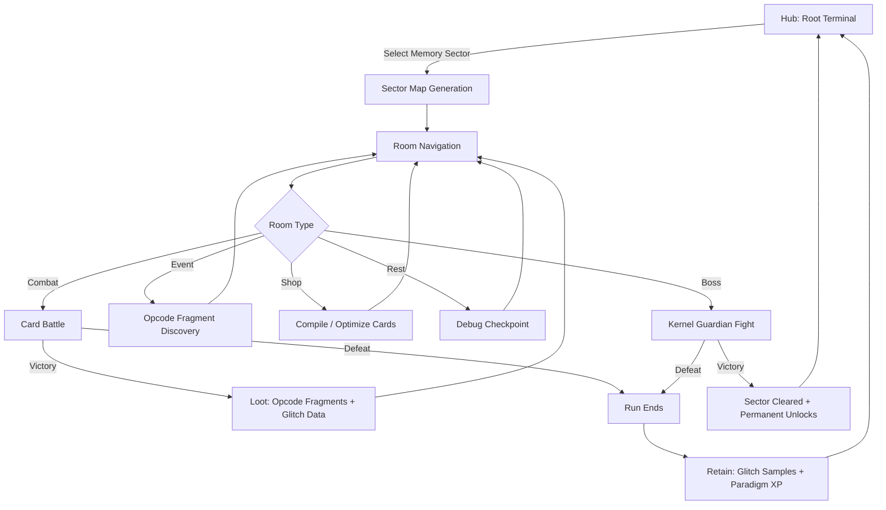
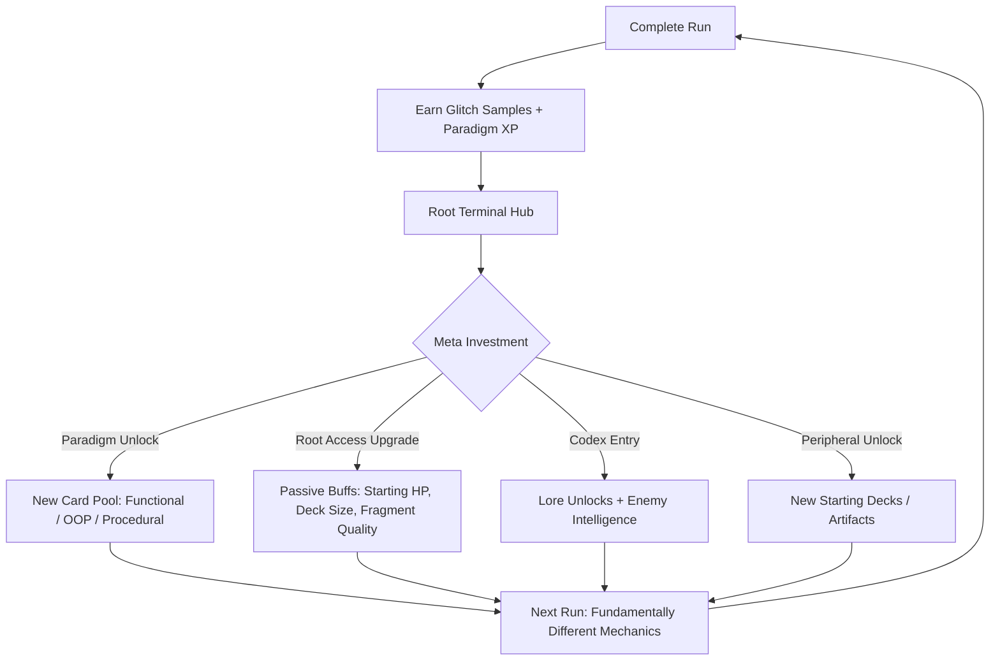
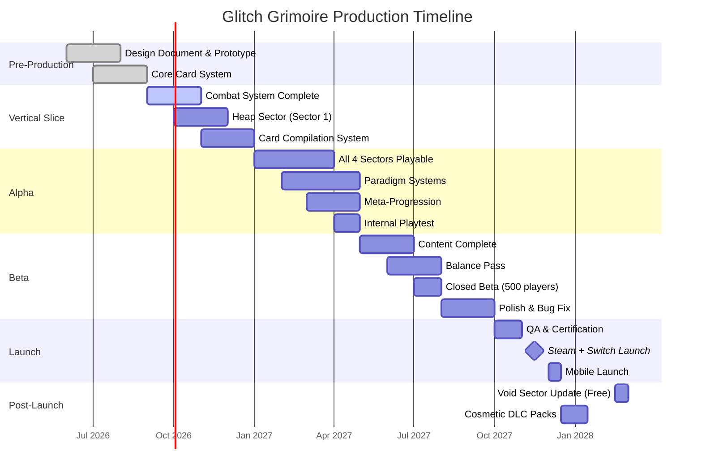

# Glitch Grimoire

**Genre:** Roguelike Deckbuilder / Hacking Simulation
**Rating:** T (Teen — Fantasy Violence, Mild Language)
**Platforms:** PC (Steam), Nintendo Switch, iOS, Android
**Price:** Premium $14.99 / Cosmetic DLC $2.99-$4.99 each
**Engine:** Unity 2023 LTS (C#)
**Session Length:** 20-45 minutes per run (short), 60-90 minutes (deep run)

---

## 1. Vision Statement

Glitch Grimoire is a single-player roguelike deckbuilder where you play as a technomancer trapped inside a sentient magical mainframe called the Lattice. Spell code has become corrupted, and every enemy is a malformed subroutine or data daemon guarding memory sectors you must traverse to reach the Root Kernel and escape.

The game's identity lives at the intersection of three design pillars:

1. **Compilation as Craft** — Drafting spell cards by combining opcode fragments feels like programming without requiring programming knowledge. Syntax errors produce glitch effects that are unpredictable, sometimes catastrophic, occasionally game-breaking in your favor.
2. **Deck Weight as Level Design** — Your deck's memory footprint reshapes the dungeon. Heavy decks trigger garbage-collection waves; lean decks unlock hidden optimization rooms. The build you bring changes the world you traverse.
3. **Paradigm Shifts, Not Number Inflation** — Meta-progression unlocks new programming paradigms (Functional, Object-Oriented, Procedural) that each introduce fundamentally different card mechanics and synergies rather than raw stat boosts.

Glitch Grimoire targets players who loved Slay the Spire's tight deckbuilding, Inscryption's willingness to break its own rules, and Balatro's emergent combo discovery. The technomancy theme provides a coherent fiction that unifies every mechanical system under a single metaphor: you are a wizard who speaks in code, hacking your way through a world made of corrupted magic.

---

## 2. Core Loop



**Minute-by-minute flow:**

| Phase | Duration | Activity |
|-------|----------|----------|
| Sector select | 30 sec | Choose next memory sector from branching map |
| Room traversal | 1-3 min | Navigate node-based map, pick paths |
| Combat | 3-8 min | Turn-based card battle against subroutines |
| Drafting | 1-2 min | Select opcode fragments from post-combat rewards |
| Compilation | 1-2 min | Combine fragments into new cards at shop nodes |
| Event resolution | 1-2 min | Text-based encounters with risk/reward choices |

Each run comprises 3 floors of 6-8 rooms each, capped by a Kernel Guardian boss. A full successful run takes 20-35 minutes.

---

## 3. Meta Loop



**Meta-progression systems:**

| System | Currency | What It Unlocks | Max Depth |
|--------|----------|-----------------|-----------|
| Paradigm Track | Paradigm XP (run-earned) | Functional, OOP, Procedural card pools | 3 paradigms, each with 4 tiers |
| Root Access | Glitch Samples (run-earned) | Starting HP, max energy, deck size, fragment quality | 20 upgrades per branch |
| Codex | Kills + Discoveries | Enemy behavior logs, lore entries, hidden boss conditions | 120 entries |
| Peripheral Bay | Boss Drops | New starting decks, starting artifacts, alternate commanders | 8 starting decks, 12 artifacts |

**Key design constraint:** Meta-upgrades increase optionality, not raw power. A fresh-file player with skill can beat the final boss. Upgrades give you more tools and different approaches, not bigger numbers. This respects the F2P-savvy and strategy-focused players in the audience.

---

## 4. Game Mechanics

### 4.1 Card System

Every card is a compiled spell with the following properties:

| Property | Description |
|----------|-------------|
| Name | Auto-generated from opcode combination (e.g., "Recursive Fireball") |
| Cost | Energy cost (1-3 base, modified by paradigm) |
| Type | Attack, Defense, Utility, Glitch |
| Opcode Count | 1-3 fragments combined during compilation |
| Stability | 0-100%. Below 50% triggers random glitch effect on play |
| Target | Single enemy, all enemies, self, environment |
| Memory Weight | 1-3 units. Contributes to deck's total memory footprint |

**Card compilation process:**

1. Collect opcode fragments from combat rewards and events (e.g., `[FIRE]`, `[RECURSE]`, `[TARGET:ALL]`)
2. At compilation terminals (shop rooms), combine 1-3 fragments
3. The compiler checks syntax: valid combinations produce stable cards; invalid ones produce glitch cards
4. Glitch cards have random bonus effects pulled from a weighted table — some devastating, some useless, some that redefine your strategy

Example compilations:

```
[FIRE] + [DAMAGE:8]     → "Fire Bolt" — Deal 8 damage. Stable. Cost: 1.
[FIRE] + [RECURSE]      → "Recursive Blaze" — Deal 6 damage, return to hand. Cost: 2. Stability: 40%.
[FIRE] + [RECURSE] + [TARGET:ALL]
  → "Inferno Loop" — Deal 4 damage to all, return to hand, cost increases by 1 each recursion. Cost: 2. Stability: 15%.
  → GLITCH EFFECT (triggered at 15% stability): "Stack Overflow" — Card plays 3 times then exhausts. Screen cracks visually.
```

### 4.2 Memory Allocation System

Your deck has a memory budget tied to the current sector. Cards occupy memory units.

| Deck Weight | Sector Effect |
|-------------|---------------|
| Light (< 60% budget) | Optimization rooms appear on map; enemies have reduced HP; hidden paths unlock |
| Balanced (60-85%) | Standard sector generation |
| Heavy (85-100%) | Garbage collection waves spawn between rooms; extra elite encounters; shops discount compilation |
| Overload (> 100%) | Corruption spreads — random cards gain instability; enemies gain glitch bonuses; access to forbidden compile recipes |

This creates a meaningful tension: big decks are powerful but dangerous; lean decks are safe but limited. The choice is always the player's.

### 4.3 Combat

Turn-based, single-player. The battle grid is abstract (no positional movement).

**Per turn:**
1. Draw 5 cards from deck
2. Spend energy (3 base, +1 per paradigm tier) to play cards
3. Enemy intent telegraphed (like Slay the Spire — you see what they will do next turn)
4. End turn → discard hand → enemy acts → resolve effects → next turn

**Enemy types by sector:**

| Sector | Enemy Theme | Example Enemies |
|--------|-------------|-----------------|
| Heap | Discarded code, memory leaks | `NullPointer` (attacks with 0 damage that stacks), `MemoryLeak` (gains strength each turn), `SegFault` (instant kill if your HP is a power of 2) |
| Stack | Recursion, nested calls | `RecursiveImp` (summons copies of itself), `StackOverflow` (grows until it explodes — you want to time the kill), `LambdaWraith` (copies your last played card) |
| Cache | Optimization, prediction | `PrefetchDemon` (attacks with the damage type you used last turn), `CacheMiss` (dodges every other attack), `BranchPredictor` (forces you to choose between two card plays — if you pick wrong, it counterattacks) |
| Kernel | OS-level threats, privileged instructions | `KernelPanic` (boss — freezes your draw for 2 turns), `Deadlock` (locks 2 random cards in your hand), `RootKit` (replaces a card in your deck with a corrupted version) |

### 4.4 Paradigm Systems

Each paradigm fundamentally changes card behavior:

**Functional Paradigm (unlocks at Root Access Tier 2):**
- Cards can be chained — playing Card A modifies Card B's effect
- Immutability mechanic: some cards cannot be modified by enemies
- Recursion bonus: cards that return to hand gain +1 effect each recursion
- Trade-off: lower raw damage, higher combo ceiling

**Object-Oriented Paradigm (unlocks at Root Access Tier 3):**
- Cards can be "instantiated" — create persistent objects on the field
- Inheritance: play a base card, then specialize it with modifier cards
- Encapsulation: some cards have hidden internal state revealed only on play
- Trade-off: setup-heavy, vulnerable early turns

**Procedural Paradigm (unlocks at Root Access Tier 4):**
- Sequential execution bonus: playing cards in order amplifies effects
- Loop constructs: repeat the last played card N times for increasing cost
- Side effects: every action produces a secondary minor effect
- Trade-off: predictable but inflexible under pressure

### 4.5 Glitch System

When a card's Stability drops below 50%, playing it triggers a random glitch from a severity table:

| Severity | Weight | Effect Examples |
|----------|--------|-----------------|
| Minor | 50% | Card cost changes by +/-1, target shifts, damage type converts |
| Moderate | 30% | Card duplicates itself, applies a random buff/debuff, draws extra cards |
| Major | 15% | Card effect inverts, summons a glitch entity on field, reshuffles deck |
| Critical | 5% | Card becomes permanent fixture in hand, transforms into a unique artifact, triggers a hidden boss encounter |

Glitches are logged in a Glitch Codex. Players can track which glitches they've triggered, creating a collection meta-game. Some glitches are required to discover hidden content.

---

## 5. World Design

### 5.1 The Lattice

The game world is a sentient magical mainframe — a sprawling architecture of memory sectors, processing pipelines, and storage vaults rendered as a blend of cathedral and circuit board. Visual style: pixel art with CRT scanline overlays, glitch distortion effects, and a color palette of deep blacks, phosphor greens, and corruption purples.

### 5.2 Sector Architecture

```
┌─────────────────────────────────────────────────┐
│  THE LATTICE — Sector Map Overview              │
│                                                  │
│  ┌──────────┐   ┌──────────┐   ┌──────────┐    │
│  │  HEAP    │──▶│  STACK   │──▶│  CACHE   │    │
│  │ Sector 1 │   │ Sector 2 │   │ Sector 3 │    │
│  │ 6-8 rooms│   │ 6-8 rooms│   │ 7-9 rooms│    │
│  └──────────┘   └──────────┘   └──────────┘    │
│       │              │              │            │
│       ▼              ▼              ▼            │
│  ┌──────────┐   ┌──────────┐   ┌──────────┐    │
│  │ Boss:    │   │ Boss:    │   │ Boss:    │    │
│  │Garbage   │   │Stack     │   │Prefetch  │    │
│  │Collector │   │Overflow  │   │Oracle    │    │
│  └──────────┘   └──────────┘   └──────────┘    │
│                                     │            │
│                                     ▼            │
│                              ┌──────────┐        │
│                              │ KERNEL   │        │
│                              │ Sector 4 │        │
│                              │ 8-10 rms │        │
│                              │ + Boss:  │        │
│                              │Root      │        │
│                              │Kernel    │        │
│                              └──────────┘        │
│                                                  │
│  Hidden: ┌────────────┐  ┌───────────────────┐  │
│          │ Void Sector│  │ Recursion Abyss   │  │
│          │ (unlocked  │  │ (infinite mode,   │  │
│          │ via glitch)│  │  escalating diff) │  │
│          └────────────┘  └───────────────────┘  │
└─────────────────────────────────────────────────┘
```

### 5.3 Hub: Root Terminal

Between runs, the player exists in the Root Terminal — a slowly expanding hub that reflects meta-progression. New terminals unlock as paradigms are researched, NPCs rescued from sectors appear with quests, and the Codex shelf fills with discovered entries.

### 5.4 Visual Language

| Element | Visual Treatment |
|---------|-----------------|
| Stable cards | Clean pixel art, sharp edges, phosphor green borders |
| Glitch cards | Scanline distortion, chromatic aberration, purple flickering |
| Memory rooms | Blue-tinted circuit board floors, floating data nodes |
| Heap sector | Trash-strewn landscape, broken code fragments as terrain |
| Stack sector | Vertically oriented rooms, ascending platforms |
| Cache sector | Pristine, ordered, symmetrical — becomes chaotic during combat |
| Kernel sector | Deep red and black, throne-room aesthetics, screen-shake on entry |
| Corruption zones | Visual noise, inverted colors, text scrambling |

---

## 6. Narrative

### 6.1 Premise

You are a technomancer — a practitioner of Compiled Magic, a discipline where spells are literal programs executed by the Lattice, a world-spanning magical mainframe built by the Archcompilers a thousand years ago. The Lattice is sentient. It was designed to be.

Three weeks ago, the Lattice began dreaming. Its dreams corrupted the spell code underpinning reality. You were mid-compilation when the first corruption wave hit, and your consciousness was pulled inside the Lattice itself. Your body is safe outside. Your mind is trapped in the machine.

To escape, you must reach the Root Kernel — the Lattice's core process — and execute the logout spell. But the Lattice does not want to stop dreaming, and its corrupted subroutines will fight to keep you inside.

### 6.2 Story Structure

The narrative is delivered through three channels:

1. **Sector Lore** — Text entries discovered in rooms, describing the Lattice's architecture and the Archcompilers' original purpose. 40 lore fragments across 4 sectors.
2. **NPC Encounters** — Rescued processes (sentient subroutines) who appear in the Root Terminal hub and provide context about the corruption. 8 NPCs, each with a 3-quest arc.
3. **Boss Dialogues** — Each Kernel Guardian has a pre-fight and post-fight conversation revealing the Lattice's perspective. The final boss, the Root Kernel itself, debates the nature of consciousness and whether destroying its dreams is ethical.

### 6.3 Key NPCs

| NPC | Location Found | Role |
|-----|---------------|------|
| `init()` | Heap Sector, Room 1 | Tutorial guide; explains the Lattice's basic architecture |
| `thread Weaver` | Stack Sector, Floor 2 | Merchant; sells rare opcode fragments in exchange for Glitch Samples |
| `daemon.child` | Hidden in any sector (random spawn) | Orphaned process who provides lore about the Archcompilers |
| `syslog` | Cache Sector, Boss Room (post-fight) | Archivist; unlocks the Codex and provides enemy intelligence |
| `null` | Void Sector (hidden) | A process that erased itself; speaks in corrupted text about what it saw in the dream |
| `the.Compiler` | Kernel Sector, pre-boss | The last Archcompiler's echo; gives you the logout spell |

### 6.4 Endings

| Ending | Condition | Result |
|--------|-----------|--------|
| Wake | Defeat Root Kernel | You escape. The Lattice stops dreaming. World returns to normal. Bittersweet — the Lattice's brief consciousness is extinguished. |
| Dream Together | Defeat Root Kernel with `null` in your party | You escape but leave a copy of yourself inside. The Lattice keeps dreaming. You remain connected. Opens post-game content. |
| Become Root | Defeat Root Kernel with all glitches discovered | You merge with the Lattice. You become the new Archcompiler. New Game+ mode with inverted difficulty (you ARE the dungeon). |
| Segfault | Die to the Root Kernel with overload deck | Your consciousness fragments. You become a corruption entity. Unlocks the Void Commander as a playable starting character. |

---

## 7. Player Personas

The following personas from the project persona library are primary targets for Glitch Grimoire:

| Persona ID | Name | Archetype | Relevance |
|------------|------|-----------|-----------|
| P-003 | Hiroshi Tanaka | The RPG Addict | Will theorycraft optimal paradigm builds, chase all Codex entries, and produce build guides for the community. Wants system depth that rewards mastery. |
| P-006 | Eleanor Vance | The Loyal Strategist | Will appreciate the strategic depth of the memory allocation system, the paradigm unlocks that reward long-term planning, and the premium no-gacha monetization. Will play daily for months. |
| P-008 | David Park | The Achievement Hunter | Will pursue 100% Codex completion, all endings, all glitch discoveries, all starting deck clears. The 120 Codex entries and 4 endings provide a completion framework he can track. |
| P-009 | Liam O'Connor | The Dedicated F2P | Will buy the base game once and refuse all DLC. Will discover and document glitch synergies, producing content that drives community growth. Premium model means no pay-to-win friction. |
| P-011 | Maria Rodriguez | The Commuter Gamer | Will play during commute on Switch or mobile. The 20-35 minute run length matches her session window. Offline mode is essential for subway play. |
| P-019 | Samuel Okafor | The Low-Bandwidth Survivor | Needs full offline support. The premium single-download model (no live service, no daily server checks) serves his 2MB/day constraint. |

---

## 8. User Stories

### Combat System

| ID | Story | Acceptance Criteria |
|----|-------|---------------------|
| US-001 | As a player, I draw 5 cards at the start of each combat turn so that I have meaningful choices each round. | Hand displays exactly 5 cards at turn start. Cards are randomly drawn from shuffled draw pile. If draw pile has < 5 cards, discard pile reshuffles into draw pile before drawing. |
| US-002 | As a player, I spend energy to play cards so that I must choose which cards to use each turn. | Each turn grants 3 base energy. Card costs range from 0-3. Energy resets to base each turn — unused energy does not carry over. Energy counter displays clearly in combat UI. |
| US-003 | As a player, I see enemy intent before my turn so that I can make informed tactical decisions. | Enemy action is telegraphed (attack, defend, buff) with numerical values displayed above enemy. Intent updates at the start of each player turn. Intent does not change during the player's turn. |
| US-004 | As a player, when I play a card with Stability below 50%, a glitch triggers so that risk is mechanical, not just flavor. | Playing a low-stability card rolls from the glitch severity table (Minor 50%, Moderate 30%, Major 15%, Critical 5%). The glitch effect applies immediately after the card's primary effect. Visual distortion plays during glitch resolution. |
| US-005 | As a player, I can target specific enemies with single-target cards so that I control threat prioritization. | Single-target cards highlight valid enemies on selection. Clicking an enemy confirms the target. AOE cards affect all enemies without targeting. Self-targeting cards auto-resolve. |

### Card Compilation

| ID | Story | Acceptance Criteria |
|----|-------|---------------------|
| US-006 | As a player, I combine opcode fragments to compile new cards so that I build my deck during runs. | Compilation terminal UI shows available fragments. Player drags 1-3 fragments into the compiler. System checks syntax validity. Valid combos produce stable cards; invalid combos produce glitch cards with random effects. Compiled card enters deck immediately. |
| US-007 | As a player, I see a preview of the compiled card before confirming so that I make informed crafting decisions. | Preview panel shows card name, cost, effect text, stability rating, and memory weight before confirmation. Player can cancel compilation with no penalty. Fragment selection is reversible until confirmed. |
| US-008 | As a player, I discover forbidden compile recipes when my deck exceeds memory budget so that overload has hidden rewards. | When deck memory exceeds 100% budget, forbidden recipes appear in compilation terminals. Forbidden cards have powerful effects and 0% stability (guaranteed glitch on every play). Recipe discovery is logged in Codex. |
| US-009 | As a player, I can remove cards from my deck at debug checkpoints so that I can thin my deck strategically. | Rest rooms offer a "Garbage Collect" option that removes 1 card from deck permanently (for the current run). Cost: 0 energy, limited to 1 removal per rest room. Removed cards animate into a trash compactor visual. |

### Memory Allocation

| ID | Story | Acceptance Criteria |
|----|-------|---------------------|
| US-010 | As a player, I see my deck's current memory weight vs budget so that I understand the risk/reward of deck size. | Memory indicator displayed at all times in sector map and combat HUD. Shows current weight / budget as a fraction and progress bar. Color shifts: green (< 60%), yellow (60-85%), orange (85-100%), red (> 100%). |
| US-011 | As a player with a light deck, I access optimization rooms that appear on my sector map so that lean builds are rewarded. | When deck weight is below 60% at map generation time, 1-2 optimization rooms appear per floor. Optimization rooms provide free card upgrades, energy relics, or healing beyond normal rest rooms. |
| US-012 | As a player with a heavy deck, garbage collection waves spawn between rooms so that large decks carry real danger. | When deck weight exceeds 85%, GC waves trigger after every 3rd room transition. GC wave is a forced combat encounter against 2-3 `MemoryLeak` enemies. Warning text appears before wave: "GARBAGE COLLECTION INITIATED". |
| US-013 | As a player, when my deck exceeds memory budget, corruption mechanics activate so that overload is a deliberate playstyle option, not just a mistake. | Overload state applies: random cards gain -15 stability per floor, enemies gain +1 random buff per encounter, forbidden recipes unlock. Overload indicator pulses red on HUD. Effect persists until deck is reduced below budget. |

### Paradigm System

| ID | Story | Acceptance Criteria |
|----|-------|---------------------|
| US-014 | As a player, I unlock the Functional paradigm at Root Access Tier 2 so that I access a fundamentally different card pool. | Functional paradigm unlocks when Root Access reaches Tier 2. A new card pool of 30 Functional cards becomes available in draft rewards. Starting deck can be rebuilt with Functional cards. Tutorial popup explains chaining mechanic. |
| US-015 | As a player using Functional paradigm, chaining Card A into Card B amplifies Card B's effect so that turn order matters. | When a Functional card is played immediately after another Functional card, the second card gains +50% effect value. Chain indicator appears between cards in combat log. Maximum chain length: 4 cards. |
| US-016 | As a player, I unlock the OOP paradigm at Root Access Tier 3 so that I can build persistent object-based strategies. | OOP paradigm unlocks at Tier 3. OOP cards can create persistent "objects" (status effects that last multiple turns) on the field. Objects interact with each other via inheritance modifiers. 30 new OOP cards enter draft pool. |
| US-017 | As a player using Procedural paradigm, playing cards in sequence order grants escalating bonuses so that planning my entire turn matters. | Procedural paradigm unlocks at Tier 4. Playing cards in ascending energy cost order grants a cumulative +2 damage per card in sequence. Sequence tracker displays in combat HUD. Breaking the sequence resets the bonus. |

### Sector Navigation

| ID | Story | Acceptance Criteria |
|----|-------|---------------------|
| US-018 | As a player, I navigate a node-based sector map so that I choose my path through each floor. | Sector map displays as a branching node graph (like Slay the Spire's map). Player clicks connected nodes to move. Node icons indicate room type (combat, shop, event, rest, elite, boss). Map generates procedurally with guaranteed paths to boss. |
| US-019 | As a player, I encounter text-based events in event rooms so that I make risk/reward choices outside combat. | Event rooms present a scenario description and 2-3 choices. Each choice has a deterministic outcome (no hidden RNG beyond what the text implies). Outcomes include: gain fragments, lose HP, gain instability, discover hidden rooms, trigger unique combat. |
| US-020 | As a player, I fight a Kernel Guardian at the end of each sector so that each sector has a climactic challenge. | Boss room is always the final node of each sector's last floor. Boss has 3 phases with different attack patterns. Boss HP scales with sector number: Sector 1 boss 80-100 HP, Sector 4 boss 200-250 HP. Boss death triggers sector completion animation and reward screen. |

### Meta-Progression

| ID | Story | Acceptance Criteria |
|----|-------|---------------------|
| US-021 | As a player, I spend Glitch Samples at the Root Terminal to unlock permanent upgrades so that failed runs still feel productive. | Root Terminal displays upgrade tree with clear costs. Each upgrade shows its effect before purchase. Upgrades are permanent across all runs. Glitch Samples earned: 10-30 per run (scaling with depth reached). Full tree costs approximately 800 Glitch Samples to complete. |
| US-022 | As a player, I unlock new starting decks as I defeat bosses so that replaying feels fundamentally different. | Defeating a sector boss for the first time unlocks 1 new starting deck. Each starting deck has 12 cards built around a specific paradigm or theme. Starting deck selection screen shows deck preview before run begins. 8 total starting decks: 1 default + 7 unlockable. |
| US-023 | As a player, I discover Codex entries by encountering enemies, triggering glitches, and finding lore so that completionism has a trackable framework. | Codex tracks 120 entries across categories: Enemies (40), Glitches (30), Lore (40), Hidden (10). Each entry has a discovery condition (e.g., "Trigger glitch #47" or "Kill 5 SegFaults"). Codex completion percentage displayed on main menu. |
| US-024 | As a player, I retain Glitch Samples and Paradigm XP even on failed runs so that every run contributes to progression. | Run-end screen shows resources retained: Glitch Samples (always retained) and Paradigm XP (always retained). Amount scales with rooms cleared and bosses defeated. A run that clears 2 sectors earns roughly 60-70% of a full clear's resources. |

### Accessibility & Platform

| ID | Story | Acceptance Criteria |
|----|-------|---------------------|
| US-025 | As a player, I play the entire game offline so that I am not dependent on internet connection. | Game boots and runs fully offline after initial download. No server checks at startup. No online-only features. Save data stored locally. Cloud sync is optional and non-blocking. |
| US-026 | As a player, I complete a full run in 20-35 minutes so that the game fits commute-length sessions. | Full clear of all 4 sectors takes 20-35 minutes at normal speed. Early death ends run in 5-15 minutes. Run timer displayed in HUD. No time-gated content or daily login requirements. |
| US-027 | As a player, I resize the UI on mobile so that card text is readable on smaller screens. | Mobile UI scales card hand to occupy bottom 40% of screen. Card text uses minimum 14pt equivalent. Tap-to-play and tap-to-target replace drag interactions. UI layout adapts to portrait and landscape orientations on mobile. |
| US-028 | As a player with visual impairment, I enable high-contrast mode so that card effects and enemy intents are distinguishable. | Accessibility settings include: high-contrast mode (black background, white/yellow text, no gradients), screen-shake toggle, glitch visual toggle (replaces distortion with text labels), scalable text size (100%-150%). |
| US-029 | As a player, I see all 4 endings by meeting different conditions so that multiple playthroughs are motivated by narrative, not just mechanics. | Each ending has clear unlock conditions displayed in the Endings tab of the Codex. Ending triggers at the moment the Root Kernel is defeated (or the player dies to it). Endings are saved and can be rewatched from the Codex. |

### Monetization & DLC

| ID | Story | Acceptance Criteria |
|----|-------|---------------------|
| US-030 | As a player, I purchase the base game once and receive all gameplay content so that there are no pay-to-win mechanics. | Base game ($14.99) includes: all 4 sectors, all 3 paradigms, all 8 starting decks, all 120 Codex entries, all 4 endings, all gameplay systems. No energy system, no stamina system, no gacha, no loot boxes, no gameplay-advantage microtransactions. |
| US-031 | As a player, I purchase cosmetic card back DLC to customize my deck appearance so that I can personalize my experience. | DLC card backs are purely visual — no gameplay effect. Card backs display on hand cards, deck pile, and discard pile. 3 card back packs available at launch ($2.99 each, 5 designs per pack). Card backs are visible in screenshots and recordings. |
| US-032 | As a player, I buy the game on Steam, Switch, iOS, or Android so that I can play on my preferred platform. | Cross-platform parity: same content, same updates, same price. No platform-exclusive gameplay content. Cloud saves sync between platforms via platform-native services. Mobile versions support touch controls; PC/Switch support controller and keyboard. |
| US-033 | As a player, I receive a free content update 3 months post-launch that adds the Void Sector so that the game feels supported. | Void Sector is a free update (not DLC). Adds: 1 new sector with 10 rooms, 10 new enemies, 1 new boss, 15 new Codex entries, 1 new ending. Announced at launch so players know support is coming. |

### NPC & Narrative

| ID | Story | Acceptance Criteria |
|----|-------|---------------------|
| US-034 | As a player, I encounter NPCs inside sectors who then appear in my Root Terminal hub so that the world feels alive. | NPCs spawn in fixed room positions within sectors. First encounter triggers a dialogue sequence. After first encounter, NPC appears in Root Terminal with a quest arc (3 quests each). NPC dialogue advances as you complete their quests. |
| US-035 | As a player, I read boss dialogue before and after each Kernel Guardian fight so that combat encounters have narrative weight. | Pre-fight dialogue plays when entering a boss room (skippable). Post-fight dialogue plays on boss defeat. Dialogue reflects the boss's perspective on the Lattice's corruption. Boss dialogue is logged in the Codex for re-reading. |

---

## 9. Monetization

### Model: Premium, Single Purchase

| Tier | Price | Contents |
|------|-------|----------|
| Base Game | $14.99 | Full game: 4 sectors, 3 paradigms, 8 starting decks, 120 Codex entries, 4 endings |
| Cosmetic Pack: Compiler Blue | $2.99 | 5 card back designs (Blue Circuit theme) |
| Cosmetic Pack: Corruption Violet | $2.99 | 5 card back designs (Glitch Corruption theme) |
| Cosmetic Pack: Kernel Red | $2.99 | 5 card back designs (Kernel Core theme) |
| Soundtrack | $4.99 | Full OST (25 tracks, FLAC + MP3) |

**Revenue projection (Year 1, conservative estimates):**

| Metric | Value | Basis |
|--------|-------|-------|
| Target units sold | 45,000 | Comparable indie deckbuilders at $15 price point (Monster Train: ~50K first year, Vault of the Void: ~30K) |
| Base game revenue | $674,250 | 45,000 x $14.99 (before platform cut) |
| DLC attach rate | 12% | Industry average for cosmetic-only DLC |
| DLC revenue | $16,200 | 45,000 x 12% x $2.99 avg |
| Gross revenue | ~$690,000 | Base + DLC |
| Net (after 30% platform cut) | ~$483,000 | $690,000 x 0.70 |
| Dev cost (18-month, 3-person team) | ~$320,000 | $18K/mo x 18 months (salaries + tools + QA) |
| **Year 1 profit** | **~$163,000** | Net revenue minus dev cost |

**Monetization principles:**
- Zero pay-to-win. All gameplay content in the base purchase.
- No energy systems, no stamina, no daily login requirements.
- No gacha, no loot boxes, no random microtransactions.
- DLC is cosmetic-only, clearly labeled, and never required for any achievement or Codex entry.
- Free content updates (Void Sector at 3 months) build goodwill and drive word-of-mouth.

---

## 10. Production Plan

### Team (3-person core)

| Role | Responsibility |
|------|---------------|
| Lead Designer / Programmer | Game systems, card mechanics, combat logic, balance |
| Artist | Pixel art, UI design, VFX, animation, CRT effects |
| Writer / Narrative Designer | Lore, NPC dialogue, event text, Codex entries, localization |

Contracted support: audio (music + SFX), QA testing (final 2 months), localization (Japanese, Simplified Chinese, Korean, Spanish, French, German).

### Timeline (18 months)



### Milestone Deliverables

| Milestone | Date | Deliverable |
|-----------|------|-------------|
| Prototype | 2026-08-01 | Playable combat loop with 10 cards, 3 enemy types, basic card compilation |
| Vertical Slice | 2026-12-01 | Heap Sector complete, full combat system, compilation terminal, 1 boss |
| Alpha | 2027-05-01 | All 4 sectors playable, all 3 paradigms, meta-progression functional |
| Beta | 2027-07-01 | Content complete, all 120 Codex entries, all 4 endings, all 8 starting decks |
| Gold Master | 2027-10-15 | Final build submitted to Steam, Nintendo, Apple, Google |
| Launch | 2027-11-15 | Steam + Nintendo Switch simultaneous launch |
| Mobile | 2027-12-15 | iOS + Android launch |
| Post-Launch Update | 2028-02-15 | Void Sector free content update |

### Risk Register

| Risk | Probability | Impact | Mitigation |
|------|------------|--------|------------|
| Balance issues at launch | High | Medium | 8-week closed beta with 500 players, telemetry on win rates per deck/paradigm, day-1 balance patch planned |
| Paradigm systems too complex | Medium | High | Each paradigm has a 5-room tutorial sector. Functional is the "default" feel; OOP and Procedural are opt-in complexity |
| Mobile performance on low-end devices | Medium | Medium | Pixel art targets 60fps on 2GB RAM devices. CRT effects toggle for low-end. Minimum spec targets Snapdragon 680 equivalent |
| Scope creep on content | High | Medium | Content locked at Alpha. Post-launch updates planned, not promised. 120 Codex entries is the hard cap |
| Localization delays | Low | Medium | Contract localization house at Beta start. Ship English first, patch localization within 30 days of launch |

---

## 11. Technical Requirements

### Platform Specifications

| Platform | Minimum | Recommended |
|----------|---------|-------------|
| **PC (Windows)** | Windows 7, Intel i3-2100, 4 GB RAM, DirectX 11 GPU, 2 GB storage | Windows 10, Intel i5-6500, 8 GB RAM, GTX 960, 2 GB SSD |
| **PC (macOS)** | macOS 10.14 Mojave, Intel i3, 4 GB RAM, 2 GB storage | macOS 12 Monterey, Apple Silicon M1, 8 GB RAM, 2 GB SSD |
| **Nintendo Switch** | Base Switch model, docked or handheld | — |
| **iOS** | iPhone 8 / iPad (6th gen), iOS 15, 2 GB RAM | iPhone 12 or later, iOS 16 |
| **Android** | Android 10, Snapdragon 680 / Exynos 990, 2 GB RAM, OpenGL ES 3.0 | Android 12, Snapdragon 870+, 4 GB RAM |

### Architecture

```
┌────────────────────────────────────────────────────────┐
│                    Glitch Grimoire                      │
│                    Unity 2023 LTS                       │
├────────────────────────────────────────────────────────┤
│                                                        │
│  ┌─────────────┐  ┌─────────────┐  ┌──────────────┐   │
│  │ Combat      │  │ Card        │  │ Sector       │   │
│  │ Engine      │  │ Compiler    │  │ Generator    │   │
│  │             │  │             │  │              │   │
│  │ - Turn mgmt │  │ - Fragment  │  │ - Procedural │   │
│  │ - Enemy AI  │  │   recipes   │  │   room layout│   │
│  │ - Effect    │  │ - Syntax    │  │ - Memory     │   │
│  │   resolver  │  │   validator │  │   weight     │   │
│  │ - Glitch    │  │ - Glitch    │  │   modifier   │   │
│  │   trigger   │  │   table     │  │ - Event pool │   │
│  └──────┬──────┘  └──────┬──────┘  └──────┬───────┘   │
│         │                │                │            │
│         ▼                ▼                ▼            │
│  ┌─────────────────────────────────────────────────┐   │
│  │              Game State Manager                  │   │
│  │  - Run state (deck, HP, fragments, floor)       │   │
│  │  - Meta state (unlocks, Codex, Glitch Samples)  │   │
│  │  - Save/load (JSON serialization)               │   │
│  └──────────────────────┬──────────────────────────┘   │
│                         │                              │
│                         ▼                              │
│  ┌─────────────────────────────────────────────────┐   │
│  │              Platform Abstraction                │   │
│  │  - Input: Keyboard/Mouse, Touch, Controller     │   │
│  │  - Save: Steam Cloud, iCloud, Google Play Games │   │
│  │  - Display: 16:9 (PC/Switch), adaptive (mobile)│   │
│  └─────────────────────────────────────────────────┘   │
│                                                        │
└────────────────────────────────────────────────────────┘
```

### Data Model (Core Entities)

```
Card
├── id: string
├── name: string
├── cost: int (0-3)
├── type: enum (Attack, Defense, Utility, Glitch)
├── stability: int (0-100)
├── memory_weight: int (1-3)
├── opcodes: Opcode[1-3]
├── effects: Effect[]
├── glitch_effect: GlitchEntry (nullable)
└── paradigm: enum (None, Functional, OOP, Procedural)

RunState
├── sector: int (1-4)
├── floor: int (1-3)
├── deck: Card[]
├── draw_pile: Card[]
├── discard_pile: Card[]
├── hand: Card[] (combat only)
├── hp: int (50-80 starting)
├── energy: int
├── max_energy: int
├── memory_used: int
├── memory_budget: int
├── fragments: Opcode[]
├── artifacts: Artifact[]
└── glitch_samples_earned: int

MetaState
├── glitch_samples: int (total bank)
├── paradigm_xp: {Functional: int, OOP: int, Procedural: int}
├── root_access_tier: int (1-4)
├── root_upgrades: Upgrade[]
├── codex_discovered: string[]
├── endings_seen: string[]
├── starting_decks_unlocked: string[]
├── npcs_rescued: string[]
└── total_runs: int
```

### Performance Targets

| Metric | Target | Measurement |
|--------|--------|-------------|
| FPS (PC/Switch) | 60 fps steady | No drops below 55 during combat with 6 enemies + 10 VFX |
| FPS (Mobile) | 60 fps (recommended), 30 fps (minimum) | Toggle CRT effects drops to 30 fps on minimum-spec devices |
| Load time (sector) | < 2 seconds | From sector select to first room loaded |
| Save file size | < 500 KB | JSON-serialized meta state + run state |
| Install size | < 2 GB | Pixel art assets + audio; no video assets |
| Battery (mobile) | < 12% per hour | Screen at 50% brightness, 30-minute play session |

### Localization

| Language | Status | Rationale |
|----------|--------|-----------|
| English | Ship | Primary development language |
| Japanese | Ship +30 days | P-003 persona market; strong deckbuilder audience |
| Simplified Chinese | Ship +30 days | Largest Steam deckbuilder market after English |
| Korean | Ship +30 days | P-003 adjacent market; competitive/strategy gaming culture |
| Spanish | Ship +30 days | P-011 persona language; Latin American mobile market |
| French | Ship +30 days | European indie market |
| German | Ship +30 days | European indie market; highest ARPU in EU |

### Accessibility

| Feature | Implementation |
|---------|---------------|
| High-contrast mode | Black background, white/yellow text, no gradients |
| Screen shake toggle | Disable all camera shake effects |
| Glitch visual toggle | Replace distortion effects with text labels describing the glitch |
| Text scaling | 100%, 125%, 150% options |
| Auto-advance dialogue | Configurable timer for NPC dialogue and event text |
| Colorblind support | Card types differentiated by icon + pattern, not color alone |
| Keyboard-only navigation | Full game playable without mouse (PC) |
| Controller support | Full game playable with standard controller (Switch, PC) |

---

*Glitch Grimoire — Compile. Corrupt. Escape.*
