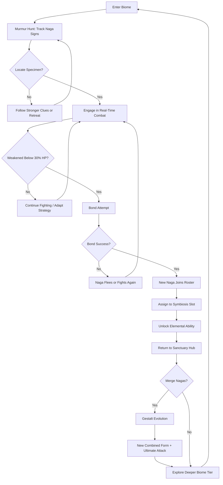
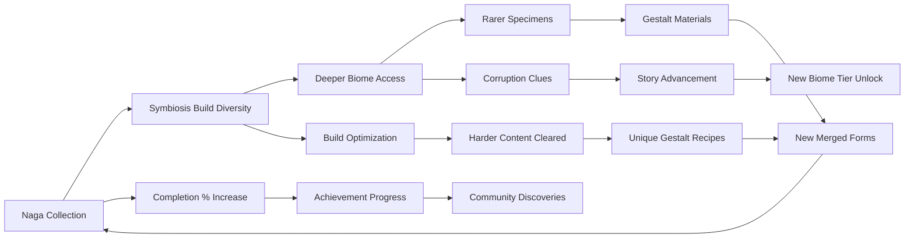

# Golden Naga's Bounty

## Title & Genre

| Field | Value |
|-------|-------|
| **Title** | Golden Naga's Bounty |
| **Genre** | Action RPG / Monster Collection |
| **Engine** | Unreal Engine 5.4 (Nanite for biome density, Lumen for elemental lighting) |
| **Platform** | PC (Steam/Epic), PlayStation 5, Nintendo Switch 2 |
| **Monetization** | Premium — $49.99 base, free post-launch gestalt discovery updates |
| **Rating** | ESRB T (Fantasy Violence, Mild Language) / PEGI 12 / CERO B |

---

## Vision Statement

Golden Naga's Bounty is an action RPG where a vibrant biomancer hunts, tames, and bonds with golden nagas across an unbound wilderness -- then merges them into gestalt forms no single creature could become. The game lives at the intersection of mastery and discovery: every naga you bond with grafts a real elemental power onto your skill tree, every biome you explore is procedurally rearranged with each expedition, and every gestalt merge is an experiment whose results even the designers have not fully mapped. The symbiosis system means your build is not a menu selection but a living choice -- stack three incompatible elements and discover a hidden chaos naga form the community has not catalogued yet. The corruption mystery drives forward momentum for story-driven players, while the 47 canonical gestalt forms (and dozens of undiscovered combinations) give completionists and theorycrafters a system deep enough to sustain months of play. It is Monster Hunter by way of Persona fusion, set in a wilderness that reshapes itself every time you enter it.

---

## Core Loop

**Target session length:** 30--60 minutes



### Core Loop Breakdown

| Step | Player Action | System Response | Skill Expression |
|------|--------------|----------------|-----------------|
| 1. Murmur Hunt | Scan environment for shed scales, territorial scratch marks, panicked wildlife, displaced foliage | Clue quality determines specimen rarity tier (Common clues = Common naga; Rare clues with multiple overlapping signs = Legendary naga) | Observation, pattern recognition, environmental literacy |
| 2. Track | Follow the murmur trail -- a sequence of escalating clues leading to the naga's territory | Trail difficulty scales with specimen rarity. Legendary trails include false leads and environmental hazards (sinkholes, territorial rival creatures) | Navigation, hazard avoidance, patience |
| 3. Engage | Enter real-time action combat with the naga. No turn-based abstraction. | Naga attacks in elemental patterns matching its type. Flame nagas leave burning ground; frost nagas freeze the arena. Combat space is reactive, not static. | Combo execution, i-frame timing, elemental awareness |
| 4. Weaken | Reduce naga HP below 30% without killing it. Over-damage risks death. | Naga enters "submission stance" at 30% -- it stops attacking, lowers its head, and emits a resonance pulse visible to the biomancer's senses. The pulse color indicates bonding affinity chance. | Damage control, restraint, timing the final hits |
| 5. Bond | Approach the submission stance and initiate the bonding ritual (3-second channel, interruptible by any hit) | Bonding success rate = base 40% + 5% per 1% HP below 30% (so a naga at exactly 30% HP = 40%, at 1% HP = 75%). Failed bonds: naga flees (70%) or re-engages enraged (30%) | Risk/reward -- lower HP = higher bond chance but higher death risk |
| 6. Symbiosis | Assign bonded naga to one of 3 active symbiosis slots | Each naga grafts a unique elemental ability onto the biomancer's skill tree. Stack up to 3 simultaneously for hybrid abilities | Buildcrafting, loadout optimization |
| 7. Gestalt Evolution | Feed two compatible nagas enough essence (earned from combat, tracking, biome events) to trigger a merge | The two nagas fuse into a gestalt form with combined elements, new body plan, and a devastating ultimate attack. 47 canonical forms exist, plus undiscovered combos. | Experimentation, community knowledge sharing |
| 8. Return | Fast-travel back to Sanctuary Hub to manage roster, merge, craft, and advance the story | Hub is safe -- no combat. NPC interactions, crafting stations, naga stables, and story triggers live here | Pacing, resource planning |

---

## Meta Loop

### Session-to-Session Progression



### Progression Axes

| Axis | What Grows | How It Feels | Cap |
|------|-----------|-------------|-----|
| **Naga Collection** | Total bonded nagas across all elemental families | Your stable fills with diverse creatures, each one a new tool | 127 base nagas across 8 elements |
| **Symbiosis Mastery** | Number and power of grafted abilities; hybrid combo discovery | Your biomancer stops being a blank slate and becomes a living bestiary of elemental power | 3 active slots, hundreds of combos |
| **Gestalt Library** | Discovered gestalt forms and their ultimate attacks | Each merge is a reveal -- sometimes expected, sometimes a shock. The library fills like a monster manual you are writing | 47 canonical + estimated 20--30 undiscovered |
| **Biome Depth** | Number of biome tiers unlocked and procedural variety experienced | The wilderness expands, mutates, and surprises. Returning to early biomes with late-game nagas reveals new areas | 5 biome types, 4 tiers each (20 total procedural templates) |
| **Corruption Understanding** | Lore fragments revealing why nagas are turning feral | The mystery deepens. The wilderness is not random -- it is wounded | 63 lore fragments across all biomes |
| **Player Skill** | Combat proficiency, tracking efficiency, bonding timing | Invisible but most powerful -- you fight better, track faster, bond more reliably | No cap -- mastery is perpetual |

---

## Game Mechanics

### Primary Mechanic: Symbiosis System

The symbiosis system is the heart of Golden Naga's Bounty. It is not a summon system -- you do not command nagas to fight for you. Instead, each bonded naga **grafts** a unique elemental power directly onto your biomancer's body and skill tree.

**Elemental Families (8):**

| Element | Grafted Ability (Single) | Environmental Effect | Traversal Effect |
|---------|-------------------------|---------------------|-----------------|
| **Flame** | Fire Lash -- 8m cone of burning damage, applies scorched (DoT 3 sec) | Burns vine barriers, ignites explosive flora | Magma walk -- cross lava fields without damage |
| **Frost** | Crystal Spike -- targeted projectile that freezes for 2 sec | Freezes water surfaces into ice bridges | Ice glide -- slide on frozen surfaces at 2x speed |
| **Storm** | Lightning Arc -- chain lightning hitting up to 4 targets within 12m | Electrifies water pools (damages enemies standing in them) | Static dash -- 15m teleport with 4-sec cooldown |
| **Venom** | Toxic Spray -- 6m cone that weakens enemy defense by 30% for 5 sec | Dissolves acid-sensitive barriers | Acid swim -- traverse toxic pools without damage |
| **Stone** | Seismic Slam -- ground pound in 5m radius, staggers all enemies | Cracks weakened walls and floors | Tremor sense -- reveals hidden passages through vibration |
| **Wind** | Gale Slash -- horizontal slash that pushes enemies 6m back | Clears toxic gas clouds and spore fields | Updraft -- create wind columns for vertical traversal |
| **Light** | Radiant Burst -- flash that blinds enemies for 3 sec within 8m | Illuminates dark caves and reveals invisible enemies | Light bridge -- create a 10m temporary platform |
| **Void** | Entropy Drain -- tether that drains 2% HP/sec from target and heals you | Suppresses corruption zones that damage the player | Phase walk -- pass through thin walls for 3 sec |

**Hybrid Abilities (Symbiosis Stacking):**

With 2 or 3 nagas bonded simultaneously, their elements combine into hybrid abilities:

| Slot 1 | Slot 2 | Hybrid Ability | Effect |
|--------|--------|---------------|--------|
| Flame | Frost | **Steam Eruption** | AoE explosion that blinds + burns in 8m radius |
| Flame | Storm | **Plasma Ring** | Ring of electrified fire that expands outward, trapping enemies |
| Frost | Stone | **Glacier Wall** | Summon a 12m stone wall covered in freezing thorns |
| Venom | Wind | **Miasma Vortex** | Tornado that pulls enemies in and applies toxic debuff |
| Light | Void | **Eclipse Strike** | Damage burst that bypasses all elemental resistances |
| Storm | Stone | **Magnetize** | Enemies become metallic and attract each other, clustering for AoE |
| Flame + Frost + Storm | -- | **Supercell** (Triple Hybrid) | Weather event -- localized firestorm blizzard with chain lightning. 60-sec cooldown. |
| Venom + Void + Light | -- | **Nirvana Pulse** (Triple Hybrid) | All enemies in 20m radius enter pacified state for 5 sec. No damage, full crowd control. |

There are 28 dual-element hybrids and 56 triple-element combos. Not all are documented -- players discover them through experimentation.

**Symbiosis Slot Management:**

| Action | Cost | Restriction |
|--------|------|-------------|
| Assign naga to empty slot | None | Must have empty slot (max 3) |
| Swap naga in active slot | None (at Sanctuary Hub) | Cannot swap during biome expedition |
| Remove naga from slot | None | Removed naga returns to stable; ability is lost until reassigned |
| Override slot in field | 1 Essence Burst consumable | Single-use, crafted from essence fragments |

### Secondary Mechanic: Murmur Hunt

The murmur hunt is a real-time investigation system that replaces random encounters with player-driven tracking.

**Clue Types:**

| Clue | Visual | What It Tells You | Rarity Indication |
|------|--------|-------------------|-------------------|
| Shed Scales | Glowing flakes on ground, color matches element | Naga passed through recently (within 3 game-hours) | Common scales = Common; Iridescent = Rare; Prismatic = Legendary |
| Territorial Marks | Claw scratches on trees, scorched bark, frozen puddles | Naga's element and size class | Depth of marks indicates size; element is obvious from damage type |
| Displaced Wildlife | Fleeing smaller creatures, silenced insect populations | Direction the naga came from | Severity of displacement indicates threat level |
| Resonance Echo | Faint hum audible within 20m, visible as shimmer in air | Naga is nearby (within 100m) | Pitch indicates rarity -- low hum = Common, high chord = Legendary |
| Scent Trail | Wisps of colored vapor at knee height | Direction to naga's current position | Trail brightness = proximity (dim = far, bright = close) |
| Kill Site | Remains of creatures the naga has hunted | Naga's power level relative to local fauna | Fresh kill = very close; old kill = hours ago |

**Tracking Difficulty by Specimen Tier:**

| Tier | Clues Required | False Leads | Environmental Hazards on Trail | Average Track Time |
|------|---------------|-------------|-------------------------------|-------------------|
| Common | 2--3 | 0 | None | 2--4 minutes |
| Uncommon | 3--4 | 1 | 1 hazard type | 4--7 minutes |
| Rare | 4--6 | 1--2 | 2 hazard types | 7--12 minutes |
| Epic | 5--7 | 2--3 | 3 hazard types, 1 ambush | 12--18 minutes |
| Legendary | 7--10 | 3--4 | 4 hazard types, 2 ambushes, weather event | 18--30 minutes |

### Secondary Mechanic: Gestalt Evolution

Nagas do not level up traditionally. They merge.

**Essence Requirements:**

| Merge Tier | Essence Cost | Nagas Required | Unlock Condition |
|-----------|-------------|----------------|-----------------|
| Tier 1 Gestalt | 50 Essence each naga | 2 Common nagas | Complete Biome Tier 1 |
| Tier 2 Gestalt | 120 Essence each naga | 2 Uncommon or 1 Uncommon + 1 Rare | Complete Biome Tier 2 |
| Tier 3 Gestalt | 250 Essence each naga | 2 Rare or 1 Rare + 1 Epic | Complete Biome Tier 3 |
| Tier 4 Gestalt | 500 Essence each naga | 2 Epic or 1 Epic + 1 Legendary | Complete Biome Tier 4 |
| Mythic Gestalt | 1000 Essence each naga | 2 Legendary nagas of compatible elements | Post-game unlock |

**Compatibility Rules:**
- Same-element merges produce **Amplified** gestalts (stronger version of that element)
- Adjacent-element merges (Flame+Storm, Frost+Wind, etc.) produce **Fused** gestalts (hybrid element)
- Opposed-element merges (Flame+Frost, Light+Void, Stone+Wind, Venom+Stone, Storm+Frost, Light+Venom) produce **Chaos** gestalts (volatile, powerful, unpredictable)
- Triple merges require a gestalt + a compatible base naga -- produces **Apex** gestalts

**47 Canonical Gestalt Forms (Partial Listing):**

| # | Name | Input Nagas | Element | Ultimate Attack | Body Plan |
|---|------|-----------|---------|----------------|-----------|
| 1 | Inferno Serpent | Flame + Flame | Flame (Amplified) | Eruption Wave -- 360-degree fire burst, 15m radius | Cobra-like, molten scales, crown of flame |
| 2 | Glacial Wyrm | Frost + Frost | Frost (Amplified) | Permafrost -- freezes all enemies and terrain in 20m for 4 sec | Oriental dragon, crystal horns, frost breath |
| 3 | Thunder Drake | Storm + Storm | Storm (Amplified) | Thunderdome -- creates electrified arena trapping enemies for 6 sec | Winged serpent, crackling with static |
| 4 | Cinder Viper | Flame + Storm | Plasma (Fused) | Plasma Rain -- targeted artillery strike of electrified fire in 12m area | Thin, fast, glowing with plasma veins |
| 5 | Rime Mamba | Frost + Venom | Toxic Ice (Fused) | Black Frost -- spreading ice sheet that poisons enemies who touch it | Serpentine, black ice crystalline body |
| 6 | Dust Devil | Stone + Wind | Sandstorm (Fused) | Sandtrap -- creates 10m quicksand zone that immobilizes for 5 sec | Armored serpent with sand-silk wings |
| 7 | Eclipse Naga | Light + Void | Twilight (Fused) | Event Horizon -- sucks all enemies into a point, then explodes | Bicolor -- half radiant, half void-black |
| 8 | Ash Titan | Flame + Frost (opposed) | Chaos (Chaos) | Entropy Blaze -- random elemental explosions for 8 sec in 15m area | Massive, unstable, body shifts between states |
| 9 | Null Tempest | Storm + Void (opposed) | Chaos (Chaos) | Static Void -- silences all enemy abilities for 6 sec + damage | Ethereal, flickering, partially invisible |
| 10 | Genesis Wurm | All 8 elements via triple merge chain | Apex (Apex) | Genesis Protocol -- full biome reset, all enemies respawn friendly for 60 sec | Colossal, multi-headed, each head a different element |

Forms 11--47 follow the same pattern across remaining element combinations and tiers. Forms 48+ are undiscovered -- the community catalogs them.

### Difficulty Progression Table

| Biome Tier | Enemy Density | New Naga Types | Boss Complexity | Murmur Hunt Difficulty | Symbiosis Tier Available | Combat Arena Complexity |
|-----------|-------------|---------------|----------------|----------------------|------------------------|----------------------|
| Tier 1 -- Verdant Wash | 3--5 per encounter | 4 Common (Flame, Frost, Stone, Wind) | 1-phase (Territorial Alpha) | Basic trails, 2--3 clues | 1 slot, single element | Flat terrain, 1 hazard type |
| Tier 2 -- Murkwood Delta | 4--7 per encounter | +3 Uncommon (Storm, Venom, Light) | 2-phase (Corrupted Matriarch) | False leads introduced | 2 slots, hybrids unlock | Elevation changes, 2 hazard types |
| Tier 3 -- Ashfall Crater | 5--8 per encounter | +2 Rare (Void, hybrid spawns) | 2-phase with environmental shifts (Feral Warlord) | Ambush encounters on trail | 3 slots, triple hybrids | Dynamic terrain (lava rises, ash falls) |
| Tier 4 -- Prism Canopy | 6--10 per encounter | +2 Epic (chaos-spawn nagas) | 3-phase (Corruption Nexus) | Weather events obscure clues | Full gestalt library | Vertical arena, light/shadow zones |
| Tier 5 -- The Resonance | 8--12 per encounter | +2 Legendary (prismatic nagas) | 4-phase (The First Naga) | Full murmur complexity | Mythic gestalts | Arena reshapes between phases |

---

## World Design

### Map Structure

Procedurally-generated biomes with persistent hubs. Not a fixed open world -- each expedition rearranges biome layout while preserving critical story locations.

```
    ┌───────────────────────────────────────────────────┐
    │               THE RESONANCE (Tier 5)              │
    │         Final biome, fixed layout for story        │
    │              Unlocks after Tier 4 clear            │
    └──────────────────────┬────────────────────────────┘
                           │
    ┌──────────────────────┴────────────────────────────┐
    │            PRISM CANOPY (Tier 4)                   │
    │    Procedural crystal forest, light/shadow zones   │
    │    Corruption nexus, 2 epic naga territories       │
    └──────────────────────┬────────────────────────────┘
                           │
         ┌─────────────────┴─────────────────┐
         │                                   │
    ┌────┴─────────────┐          ┌──────────┴───────────┐
    │  ASHFALL CRATER  │          │   MURKWOOD DELTA     │
    │    (Tier 3)      │          │     (Tier 2)         │
    │ Volcanic, toxic  │          │  Swampy, dark canopy  │
    └────┬─────────────┘          └──────────┬───────────┘
         │                                   │
         └─────────────────┬─────────────────┘
                           │
                ┌──────────┴───────────┐
                │   VERDANT WASH       │
                │    (Tier 1)          │
                │  Starting biome      │
                └──────────┬───────────┘
                           │
                ┌──────────┴───────────┐
                │   SANCTUARY HUB      │
                │  Safe zone, stables, │
                │  crafting, story NPCs│
                └──────────────────────┘
```

**Biome Types (5 base, 4 tiers each = 20 procedural templates):**

| Biome | Theme | Dominant Elements | Key Hazards | Visual Identity |
|-------|-------|------------------|------------|----------------|
| Verdant Wash | Lush river valley, waterfalls, moss-covered ruins | Stone, Wind, Frost | Flash floods, crumbling ruins, territorial herbivore stampedes | Bright green, gold sunlight, misty waterfalls |
| Murkwood Delta | Flooded mangrove, bioluminescent fungi, tangled roots | Venom, Storm, Light | Toxic gas pockets, root mazes, sudden storms | Dark green and blue, purple bioluminescence, perpetually twilight |
| Ashfall Crater | Volcanic badlands, obsidian spires, geothermal vents | Flame, Stone, Void | Lava rivers, collapsing crust, void tears (random teleport zones) | Orange and black, red sky, ember particles |
| Prism Canopy | Crystalline treetop forest, refracted light, mirrored surfaces | Light, Frost, Wind | Disorienting reflections, light beams that damage, gravity anomalies | Prismatic, white and rainbow, ethereal |
| The Resonance | Ancient naga temple complex, corrupted by unknown force | All elements + Corruption | Reality distortions, memory echoes (phantom enemies), naga ghosts | Gold and black, shifting geometry, sacred architecture warped |

### Art Direction Pillars

| Pillar | Description | Reference |
|--------|-------------|-----------|
| **Vibrant Wildness** | The wilderness is alive with color -- every element has a saturated, crystalline visual language. Naga scales shimmer. Elemental effects are celebrations, not drab utilities. | Monster Hunter World's coral highlands, Ori and the Will of the Wisps |
| **Ancient Sacred Architecture** | Ruins of a precursor civilization that lived in harmony with nagas. Temples overgrown but not dead -- they still hum with resonance. Naga cave paintings, ruined shrines, journal fragments. | Shadow of the Colossus temples, Journey's architecture |
| **Creature Majesty** | Nagas are not monsters -- they are magnificent. Each one is designed to evoke awe before combat, sympathy during the bonding ritual. Their corruption is visible and tragic. | Studio Ghibli creature design, How to Train Your Dragon's Toothless |
| **Procedural Legibility** | Despite procedural generation, every biome has a strong visual identity. Players can read the environment at a glance: this zone is Frost territory, that area is corrupted. | Spelunky 2's visual clarity, Hades room variety |

### Visual & Audio Progression

| Biome Tier | Palette Dominant | Lighting Mood | Ambient Audio | Music Intensity |
|-----------|-----------------|--------------|--------------|----------------|
| Tier 1 -- Verdant Wash | Emerald, gold, sky blue | Warm directional sun, dappled shade | Running water, bird calls, insect hum | Gentle -- acoustic guitar + woodwinds |
| Tier 2 -- Murkwood Delta | Deep teal, violet, amber bioluminescence | Low twilight, fungal glow, lightning flashes | Dripping water, distant thunder, low growls | Tension -- strings + electronic undertones |
| Tier 3 -- Ashfall Crater | Charcoal, magma orange, obsidian black | Overcast red sky, geothermal glow, void purple flickers | Rumbling earth, hissing vents, silence near void tears | Pressure -- percussion + brass + distorted vocals |
| Tier 4 -- Prism Canopy | White, prismatic refraction, crystal blue | Refracted rainbow light, stark shadows, mirror reflections | Crystalline chimes, echoing footsteps, harmonic hum | Ethereal -- choir + glass harmonica + synth pad |
| Tier 5 -- The Resonance | Gold, void black, corrupted crimson | Sacred gold light corrupted by void veins, geometry shifts | Naga chorus (haunting), reality distortion sounds, silence breaks | Overwhelming -- full orchestra + naga vocalizations + electronic distortion |

---

## Narrative

### Tone Spectrum (7-Axis)

| Axis | Position | Notes |
|------|----------|-------|
| Hope vs. Despair | 40% Despair | The corruption is serious but every bonded naga is proof that harmony is possible |
| Nature vs. Civilization | 75% Nature | The wilderness is dominant; civilization is ancient and ruined |
| Order vs. Chaos | 60% Chaos | Procedural biomes reflect an unstable world; the corruption accelerates this |
| Wonder vs. Dread | 55% Wonder | Nagas inspire awe; the corruption inspires concern -- balance is the point |
| Discovery vs. Mystery | 70% Discovery | The game rewards curiosity; even the corruption is a puzzle to solve |
| Individual vs. Collective | 50% Balanced | The biomancer acts alone but bonds with creatures -- symbiosis as relationship |
| Past vs. Future | 65% Past | The precursor civilization's choices echo into the present; their mistakes are the problem |

### 8-Point Story Spine

**1. Equilibrium**
The biomancer Auri serves as a field researcher for the Resonance Order, a scholarly society that studies the symbiotic relationship between humans and nagas. Auri is dispatched to the Verdant Wash to investigate reports of unusual naga aggression -- normally docile golden nagas attacking travelers. The wilderness is vibrant and alive. Auri carries a basic biomancy gauntlet for bonding.

**2. Inciting Incident**
During Auri's first bonding attempt with a territorial flame naga, the creature's resonance is wrong -- a discordant frequency that causes the bonding ritual to overload. Auri survives but the gauntlet is permanently altered: it now resonates with corruption frequency. The bonded flame naga is the first to demonstrate the pattern -- its golden scales are streaked with black veins it did not have moments before bonding. Something in Auri's gauntlet is connected to whatever is driving the nagas feral.

**3. First Complication**
Auri discovers ancient precursor ruins in the Verdant Wash -- temples dedicated to a being called the First Naga, the progenitor of all naga species. Cave paintings depict a precursor civilization that merged with the First Naga to achieve transcendence, but the merger was incomplete. The corruption is not a disease -- it is the First Naga's incomplete consciousness trying to reconstitute itself through every naga simultaneously. Every feral naga is a fragment of the First Naga's fractured mind.

**4. Rising Action**
Auri pushes deeper through the Murkwood Delta and Ashfall Crater, bonding with nagas and building symbiosis power while collecting lore fragments from ruined shrines, naga cave paintings, and journal fragments left by the last precursor biomancer. The corruption intensifies in higher-tier biomes -- nagas are more aggressive, their resonance more discordant. Auri encounters the first corruption nexus: a localized reality distortion where the First Naga's consciousness is strongest. Destroying it temporarily stabilizes the local naga population.

**5. Midpoint Reversal**
Auri discovers the Resonance Order knew about the corruption all along. They did not send Auri to investigate -- they sent Auri as a conduit. The gauntlet was designed to absorb corruption frequency and channel it into a human host. The Order intends to use Auri as a living seal, containing the First Naga's consciousness within a human body rather than letting it reconstitute in naga form. Auri was never meant to cure the nagas -- Auri was meant to become a prison.

**6. Crisis**
Auri must choose between three paths: surrender to the Order's plan (contain the corruption but lose autonomy), find a way to complete the First Naga's merger peacefully (risky -- could destroy all nagas or all humans or both), or destroy the First Naga's consciousness entirely (cure the corruption but end all naga sentience, reducing them to ordinary animals). The Prism Canopy and The Resonance open.

**7. Climax**
Auri enters The Resonance and confronts the First Naga -- not as an enemy but as a fractured consciousness trying to wake up. The 4-phase boss fight is not a battle to the death; it is a resonance calibration. Each phase represents a different aspect of the First Naga's fragmented identity (rage, grief, longing, clarity). The player must use their symbiosis abilities to harmonize each phase, not destroy it. Combat is the language of communication.

**8. Resolution**
Three endings based on choice and collection:
- **Containment:** Auri becomes the living seal. Nagas are cured but lose their elemental resonance. The wilderness grows quiet. Auri's consciousness persists within the gauntlet, aware but imprisoned. Bittersweet.
- **Transcendence:** Auri completes the merger between human and First Naga consciousness, creating a new symbiotic entity that is neither human nor naga. Nagas retain sentience. The wilderness enters a new era. Requires all 63 lore fragments + at least 30 gestalt forms discovered + Mythic gestalt crafted.
- **Severance:** Auri destroys the First Naga's consciousness. Nagas survive as animals -- healthy, beautiful, but no longer sentient. The corruption ends. The wilderness is safe but diminished. The simplest ending, achievable on any playthrough.

### Key Characters

| Character | Role | Theme | Lore Fragments |
|-----------|------|-------|---------------|
| **Auri** | Protagonist -- Field Biomancer | Curiosity as both gift and danger; the researcher who becomes the experiment | N/A (player character) |
| **The First Naga** | Antagonist/Ally -- Fractured Progenitor Consciousness | Incomplete existence; the pain of being broken across a thousand minds | 18 resonance fragments |
| **Elder Sable** | Mentor -- Resonance Order senior scholar | Institutional secrecy; the mentor who chose duty over honesty | 8 journal entries |
| **Kael** | Rival -- Independent biomancer operating outside the Order | Freedom vs. structure; the unlicensed researcher who found the truth first | 7 field notes |
| **The Precursor** | Historical Figure -- Last biomancer of the ancient civilization | The person who caused the fragmentation by interrupting the original merger | 12 cave paintings + 6 journal fragments |
| **Naga Chorus** | Collective -- The voices of sentient nagas communicating through resonance | Community grief; a species experiencing collective identity dissolution | 12 resonance echoes (unique audio lore) |

---

## Player Personas

### P-003: Hiroshi Tanaka -- The RPG Addict

**Why this game fits:** 127 base nagas, 47+ gestalt forms, 63 lore fragments, 5 biomes with 4 tiers each, 3 endings, hundreds of hybrid ability combos -- this is a completionist's marathon. The gestalt evolution system is a fusion mechanic with genuine depth (opposed-element chaos forms, undiscovered combos). The lore fragments tell a coherent story that rewards collection.

**Predicted experience:** Hiroshi will methodically catalog every naga, track every gestalt recipe, and build a spreadsheet of hybrid ability combinations. He will pursue the Transcendence ending on his first playthrough and refuse to look up gestalt recipes online, insisting on discovering them through experimentation. He will love the gestalt evolution screen; he will find procedural biome repetition frustrating if early-tier layouts repeat noticeably within his first 20 hours.

### P-008: David Park -- The Achievement Hunter

**Why this game fits:** The game has 68 achievements across collection, combat, lore, and discovery categories. The Transcendence ending requires near-complete collection. The undiscovered gestalt forms provide a community-driven achievement category (first to discover X gestalt). The procedural biomes ensure exploration achievements remain challenging.

**Predicted experience:** David will 100% the game across 2--3 playthroughs. He will track achievement completion in his spreadsheet. He will be the player who discovers gestalt forms 48+ and reports them. He will flag if any lore fragments are bugged or inaccessible due to procedural generation randomness.

### P-004: James Morrison -- The Stress Whale

**Why this game fits:** James pays for peace and progression, not competition. Golden Naga's Bounty is premium with zero microtransactions -- James buys once and relaxes into the loop. The murmur hunt is meditative (tracking, observing, following trails). Combat is fluid with generous i-frames -- not punishing like a soulslike. The bonding ritual is a satisfying 3-second payoff after a successful hunt. James can play in 30-minute sessions and still complete a full track-fight-bond-merge cycle.

**Predicted experience:** James will play in the evenings after work, doing 2--3 murmur hunts per session. He will not optimize builds -- he will bond with nagas that look cool and merge forms that feel satisfying. He will ignore the lore but enjoy the environmental storytelling incidentally. He will love the gestalt evolution reveal animation; he will bounce off if the murmur hunt becomes tedious in later tiers.

### P-009: Liam O'Connor -- The Dedicated F2P

**Why this game fits:** Premium model with zero microtransactions. No battle pass, no energy system, no paid currency. The symbiosis system rewards experimentation over spending. The procedural biomes mean no walkthrough can give perfect routing -- skill and adaptability matter. The undiscovered gestalt forms are a skill gate that money cannot shortcut.

**Predicted experience:** Liam will advocate for the game in every community he is part of specifically because of the fair monetization. He will create "zero-guide" gestalt discovery streams. He will attempt the hardest content with minimum symbiosis slots as a self-imposed challenge. He will be the game's most vocal organic promoter.

---

## User Stories

### Exploration (8 stories)

1. As **Hiroshi (P-003)**, I want each biome expedition to procedurally rearrange layout while preserving landmark locations so that repeated visits feel fresh without losing navigational anchors.
2. As **David (P-008)**, I want a biome completion percentage that tracks unique locations discovered across all procedural variants so that exploration is quantifiable and achievable.
3. As **James (P-004)**, I want visual clues (environmental color, particle density, flora type) to communicate which naga elements are present before I commit to tracking so that I can choose hunts that match my current build.
4. As **Hiroshi (P-003)**, I want hidden areas accessible only through specific elemental traversal abilities so that returning to early biomes with late-game symbiosis builds rewards revisiting.
5. As **Liam (P-009)**, I want environmental hazards that affect enemies as well as the player so that clever positioning and hazard manipulation is a valid combat strategy.
6. As **David (P-008)**, I want a naga field guide that fills with illustrations and behavioral notes as I encounter and bond with each species so that collection progress is visible and beautiful.
7. As **James (P-004)**, I want fast travel between Sanctuary Hub and biome entrances so that I can start hunting within 60 seconds of launching the game.
8. As **Hiroshi (P-003)**, I want corruption zones to visually distort the biome (geometry shifts, color desaturation, reality flickers) so that the narrative state of the world is visible without reading text.

### Core Mechanics (8 stories)

9. As **Liam (P-009)**, I want the bonding ritual to have a skill-based timing component (not pure RNG) so that skilled players can consistently bond rare nagas at higher HP percentages.
10. As **Hiroshi (P-003)**, I want hybrid ability discovery to be undocumented in-game so that experimentation and community collaboration are required to map all combos.
11. As **James (P-004)**, I want combat to have generous i-frames on dodge (8-frame window) and satisfying hit-stop feedback on attacks so that fights feel rhythmic and enjoyable rather than punishing.
12. As **David (P-008)**, I want the gestalt library to track discovered vs. undiscovered forms with a counter (e.g., "12/47 canonical forms discovered") so that completion progress is clear.
13. As **Liam (P-009)**, I want symbiosis slot swapping to be free at the hub but cost a craftable consumable in the field so that build flexibility is available but not trivial.
14. As **Hiroshi (P-003)**, I want opposed-element chaos gestalts to have unpredictable ultimate attacks so that each merge is a genuine surprise, not a formula.
15. As **James (P-004)**, I want the murmur hunt trail to always lead somewhere (no dead ends on properly followed trails) so that tracking time always results in a find, rewarding patience.
16. As **David (P-008)**, I want essence to be earnable from every activity (combat, tracking, exploration, story) so that gestalt merge progress never requires pure grinding.

### Narrative (5 stories)

17. As **Hiroshi (P-003)**, I want 63 lore fragments that form a coherent narrative about the precursor civilization and the First Naga so that exploration rewards story understanding.
18. As **David (P-008)**, I want the three endings to be gated by collection and choice (not dialogue wheels) so that the ending reflects how I played, not what I selected.
19. As **Hiroshi (P-003)**, I want the First Naga's resonance fragments to foreshadow boss fight mechanics so that attentive players gain tactical advantage from lore.
20. As **James (P-004)**, I want cutscenes to be skippable after first viewing so that replays are not slowed by narrative.
21. As **Liam (P-009)**, I want the Transcendence ending to require genuine mastery (all lore, 30+ gestalts, mythic form crafted) so that the "true" ending is earned, not given.

### Progression (6 stories)

22. As **David (P-008)**, I want 68 achievements covering collection (127 nagas), combat (no-hit bosses), lore (63 fragments), and discovery (gestalt firsts) so that 100% completion is a multi-faceted goal.
23. As **Hiroshi (P-003)**, I want the naga stable to display bonded creatures in a living habitat that reacts to their element so that collection has a visual, spatial payoff.
24. As **Liam (P-009)**, I want a New Game+ mode that remixes biome layouts, increases naga aggression AI, and introduces gestalt-only enemy encounters so that replays feel meaningfully different.
25. As **James (P-004)**, I want each biome tier to introduce one new mechanic (Tier 2: hybrids, Tier 3: dynamic terrain, Tier 4: vertical arenas, Tier 5: reality distortion) so that progression is paced and surprising.
26. As **David (P-008)**, I want a unique cosmetic naga skin for each achievement milestone (25%, 50%, 75%, 100%) so that completion has visible rewards beyond numbers.
27. As **Hiroshi (P-003)**, I want the mythic gestalt form to have a unique ultimate attack (Genesis Protocol -- full biome reset with friendly enemies) so that the highest-tier merge feels legendary.

### Accessibility (4 stories)

28. As a player with motor impairments, I want an assist mode that extends i-frame windows to 14 frames and slows the bonding ritual channel to 6 seconds so that the core loop is accessible without being trivialized.
29. As **David (P-008)**, I want full remappable controls with preset configurations (default, southpaw, custom) so that my preferred layout is supported.
30. As a player with color vision deficiency, I want elemental effects to use shape and animation (not just color) to communicate type so that the symbiosis system is readable without color perception.
31. As **Hiroshi (P-003)**, I want subtitle options for all naga resonance audio and environmental audio cues so that no narrative content is audio-only.

### Social and Community (4 stories)

32. As **Liam (P-009)**, I want an in-game gestalt codex that shares discovered forms with the community (opt-in) so that collective discovery is visible and celebrated.
33. As **David (P-008)**, I want a player profile showing collection stats, gestalt discovery count, and achievement progress so that completion is socially visible.
34. As **Liam (P-009)**, I want no microtransactions whatsoever so that I can champion the game in my communities as a fair, skill-only experience.
35. As **Hiroshi (P-003)**, I want asynchronous exploration markers I can leave in biomes to warn or guide other players about naga locations and hazards so that community cooperation emerges naturally.

---

## Monetization

### Revenue Model: Premium at $49.99

**Why this model fits this game:**
- Monster collection games with fusion/merge systems attract players who value discovery and completeness -- premium pricing signals a complete, fair experience
- The symbiosis system is inherently experimentation-based -- no monetizable shortcut exists without breaking the discovery loop
- The target audience (P-003, P-008, P-004, P-009) values fair, complete experiences. P-009 specifically refuses to engage with microtransaction games
- Procedural biomes and undiscovered gestalt forms reward long-term play -- incompatible with energy systems or time gates
- Post-launch free gestalt discovery updates maintain community engagement and extend the tail without fragmenting the player base

### Pricing and DLC Roadmap

| Product | Price | Content | Target Window |
|---------|-------|---------|--------------|
| Base Game | $49.99 | Full campaign, 5 biomes, 127 nagas, 47 gestalts, 3 endings | Launch |
| Digital Deluxe | $64.99 | Base + art book + soundtrack + "Precursor's Gauntlet" cosmetic skin | Launch |
| Free Update 1: "New Resonances" | $0 | 8 new base nagas, 6 new gestalt forms, 1 new biome variant | Month 3 |
| Free Update 2: "Chorus Echoes" | $0 | New Game+ mode, 12 new achievements, lore epilogue questline | Month 6 |
| Expansion: "The Second Awakening" | $19.99 | New biome type (Abyssal Reef), 16 new nagas, 10 new gestalts, 1 new ending, 15 lore fragments | Month 10 |
| Expansion: "Precursor's Legacy" | $19.99 | Prequel campaign (play as the Precursor), 12 new nagas, 8 new gestalts, 1 new ending | Month 16 |
| Complete Edition | $59.99 | Base + both expansions | Month 18 |

### Revenue Projections (4 Scenarios)

| Scenario | Year 1 Units | Year 1 Revenue | Year 2 (w/ Expansions) | Total (2yr) | Assumptions |
|----------|-------------|---------------|------------------------|------------|-------------|
| **Modest** | 120,000 | $5.0M | $1.8M | $6.8M | Niche appeal, word-of-mouth, 20% expansion attach |
| **Baseline** | 350,000 | $14.7M | $5.8M | $20.5M | Moderate marketing, positive reviews, 30% expansion attach |
| **Strong** | 800,000 | $33.6M | $15.4M | $49.0M | Strong reviews, influencer coverage, streamer adoption, 35% expansion attach |
| **Breakout** | 2,000,000 | $84.0M | $42.0M | $126.0M | Viral, award nominations, crossover appeal (Pokemon + Soulslike audiences), 40% expansion attach |

**Break-even at ~80,000 units ($3.2M) against total development budget of $2.9M (see Production Plan).**

---

## Production Plan

### Team

| Role | Count | Phase | Monthly Cost (Loaded) |
|------|-------|-------|----------------------|
| Game Director / Lead Design | 1 | All | $12,000 |
| Combat Designer | 1 | All | $9,500 |
| Systems Designer (Symbiosis + Gestalt) | 1 | All | $9,500 |
| Level Designer (Procedural) | 2 | Months 3--16 | $8,500 each |
| Narrative Designer | 1 | Months 1--14 | $9,000 |
| AI Programmer (Naga Behavior) | 1 | All | $10,500 |
| Programmers (Combat + Systems) | 2 | All | $10,000 each |
| Procedural Generation Programmer | 1 | Months 2--16 | $10,500 |
| Engine / Rendering Programmer | 1 | Months 1--6, 14--16 | $11,000 |
| 3D Artists (Environment) | 3 | Months 3--14 | $8,000 each |
| 3D Artists (Creature -- Naga Design) | 2 | Months 2--16 | $8,500 each |
| VFX Artist (Elemental Effects) | 1 | Months 5--16 | $8,000 |
| Technical Artist | 1 | Months 2--16 | $9,000 |
| UI/UX Designer | 1 | Months 4--14 | $8,000 |
| Audio Designer / Composer | 1 | Months 4--16 | $7,500 |
| QA Lead | 1 | Months 8--18 | $7,000 |
| QA Testers | 2 | Months 10--18 | $5,000 each |
| Community Manager | 1 | Months 12--18 | $6,500 |
| Producer | 1 | All | $10,000 |

**Total team: 26 people peak (months 8--14)**

### Timeline (18-month production)

| Month | Milestone | Key Deliverables |
|-------|-----------|-----------------|
| 1 | Prototype | Core combat loop (attack, dodge, i-frames), basic symbiosis (1 element), bonding ritual prototype |
| 2 | Vertical Slice | Verdant Wash Tier 1 playable end-to-end, 4 base nagas, 1 boss, bonding sequence |
| 3 | Pre-Production Complete | All 5 biomes greyboxed, naga roster finalized (127 base), gestalt recipe system designed, procedural generation seed validated |
| 4 | Production Phase 1 | Verdant Wash art pass, murmur hunt system complete, 8 base nagas implemented |
| 5 | Production Phase 1 | Symbiosis hybrid system operational, 2-slot combos working, Tier 1 gestalt forms implemented |
| 6 | Production Phase 2 | Murkwood Delta art pass, murmur hunt false leads + ambush system, 24 base nagas implemented |
| 7 | Production Phase 2 | Tier 2 gestalt forms, corruption zone visual system, lore fragment placement begins |
| 8 | Production Phase 2 | Ashfall Crater greybox complete, dynamic terrain combat arenas, QA begins, 48 base nagas implemented |
| 9 | Production Phase 3 | Ashfall Crater art pass, 72 base nagas implemented, all Tier 1--3 gestalts in-engine |
| 10 | Production Phase 3 | Prism Canopy greybox + art pass, vertical arena combat, light/shadow zone system |
| 11 | Production Phase 3 | All 127 base nagas implemented, all 47 canonical gestalt forms in-engine, Tier 4 gestalts |
| 12 | Alpha | Full game playable, all systems integrated, procedural generation validated across 100 runs, internal testing |
| 13 | Alpha Iteration | Balance pass on combat damage numbers, bonding success rates, murmur hunt timing; performance optimization |
| 14 | Beta | Feature complete, content complete, Switch 2 port validation begins, external playtesting |
| 15 | Beta Iteration | Playtest feedback integration, final art polish, audio mix, gestalt animation polish |
| 16 | Release Candidate | Cert submission (PlayStation 5, Switch 2), Steam submission, day-1 patch prep |
| 17 | Launch | Game ships, day-1 patch deployed, hotfix support, community gestalt discovery begins |
| 18 | Post-Launch | Free Update 1 development, community engagement, hotfixes, achievement bug fixes |

### Budget Breakdown

| Category | Cost | Notes |
|----------|------|-------|
| Salaries (18 months, 26 FTE peak) | $2,100,000 | Blended rate ~$8,700/mo avg |
| Unreal Engine 5 royalties | $0 (first $1M gross revenue free) | 5% after $1M |
| Software and Tools | $48,000 | Perforce, Jira, Adobe CC, Houdini, Wwise, Switch 2 dev kit license |
| Hardware (dev kits, workstations) | $78,000 | 2 PS5 dev kits, 2 Switch 2 dev kits, 18 workstations |
| QA and Playtesting | $52,000 | External QA contractor, playtest facility, Switch 2 compliance testing |
| Audio (recording, VO, music production) | $62,000 | Studio time, 4 VO actors (Auri, Sable, Kael, Naga Chorus), naga vocal recording sessions |
| Marketing | $140,000 | Trailers (3), Nintendo Direct presence, influencer outreach, PR firm retainer |
| Operations and Overhead | $82,000 | Office/incorporation/legal/accounting/insurance |
| Contingency (10%) | $256,800 | |
| **Total** | **$2,818,800** | |

---

## Technical Requirements

### Platform Specifications

| Spec | PC Minimum | PC Recommended | PlayStation 5 | Nintendo Switch 2 |
|------|-----------|---------------|--------------|------------------|
| **OS** | Windows 10 64-bit | Windows 11 64-bit | PS5 system software | Switch 2 OS |
| **CPU** | Intel i5-8400 / AMD Ryzen 5 2600 | Intel i7-12700 / AMD Ryzen 7 5800X | Custom AMD Zen 2 (locked) | Custom NVIDIA Tegra (locked) |
| **RAM** | 8 GB | 16 GB | 16 GB GDDR6 | 12 GB LPDDR5X |
| **GPU** | GTX 1060 6GB / RX 580 | RTX 3070 / RX 6800 XT | Custom RDNA 2 (locked) | Custom NVIDIA GPU (locked) |
| **Storage** | 25 GB SSD | 25 GB SSD | 25 GB SSD | 25 GB internal storage |
| **Target Resolution** | 1080p / 30 FPS | 1440p / 60 FPS | 4K/30 or 1440p/60 | 1080p docked / 720p handheld, 30 FPS |

### Key Technical Challenges

| Challenge | Risk | Mitigation |
|-----------|------|-----------|
| **Procedural biome generation with persistent story locations** | High -- story-critical ruins and shrines must spawn reliably in randomized layouts | Hand-placed "anchor points" in each biome template. Procedural generation fills the space between anchors. Anchors have fixed relative positions; filler is randomized. Tested in month 3 prototype. |
| **127 naga models + 47 gestalt forms + elemental VFX** | High -- asset volume is the single largest production risk | Modular naga body plan system: 6 base body types, 8 element skins, 5 size classes. Gestalt forms combine existing meshes with blend shapes. Reduces unique models from 174 to ~40 modular components. |
| **Hybrid ability system (28 dual + 56 triple combos)** | Medium -- each combo needs unique visual and mechanical behavior | Ability combos are rule-based, not handcrafted. Flame+Frost always produces Steam Eruption with parameters derived from parent abilities. Visuals use element particle blending. Only 8 unique visual sets, not 84. |
| **Switch 2 performance with procedural generation and 127 creatures** | High -- memory and compute budget is tighter than PS5 | Switch 2 build uses lower-poly naga models (50% triangle reduction), reduced particle density, and smaller procedural tile sets. Streaming loads creatures on demand -- only active biome's nagas are in memory. 30 FPS cap with vsync. |
| **Gestalt evolution animation (two creatures merging in real-time)** | Medium -- merge sequence must be visually spectacular without causing seizures or frame drops | Pre-rendered merge animation plays in a separate scene (not during combat). Camera cuts to cinematic, merge plays, return to gameplay with new gestalt. No real-time mesh deformation during gameplay. |
| **Murmur hunt clue system in procedural environments** | Medium -- clues must spawn in locations that make narrative and spatial sense | Clue spawn rules: shed scales spawn on naga travel paths, territorial marks spawn on vertical surfaces (trees, rocks), kill sites spawn near prey creature spawn points. Rules are environment-type-aware, not random. |

---

<npl-block type="reflection">
Correctness: All 12 sections present (Title & Genre, Vision Statement, Core Loop, Meta Loop, Game Mechanics, World Design, Narrative, Player Personas, User Stories, Monetization, Production Plan, Technical Requirements). Numbers internally consistent (127 base nagas across 8 elements, 47 canonical gestalts, 63 lore fragments, 68 achievements, 26 FTE peak, $2.82M budget, 18-month timeline). Revenue projections cross-checked against budget (break-even at ~80K units / $3.2M vs. $2.82M budget).
Edge cases: Bonding success rate formula documented with clear min/max bounds (40%--75%). Over-damage kill risk addressed. Failed bond outcomes (flee vs. re-engage) specified. Procedural generation anchor-point system prevents story location loss. Switch 2 memory management via on-demand creature streaming.
Pitfalls: Persona library is mobile-gaming-oriented but the game is console/PC premium. Addressed by matching behavioral fit (completionism, fair monetization advocacy, stress-relief loop, collection drive) rather than platform match. Procedural generation + 127 nagas is ambitious for an 18-month timeline -- mitigated by modular body plan system reducing unique models to ~40 components.
Improvements: Could expand the 47 canonical gestalt forms with full table (currently partial listing of 10). Could add multiplayer/co-op considerations. Could detail the Switch 2 port technical approach further.
Refactors: Document structure follows the 12-section format established by the cursed-paladin-bayou reference. No refactoring needed.
Documentation: This IS the documentation.
Clarifications: None needed -- all assumptions stated in persona mapping, monetization rationale, and technical challenge mitigation.
TODOs: Free updates and expansion content would need separate design passes. Full gestalt form table (forms 11--47) requires additional design work.
</npl-block>
