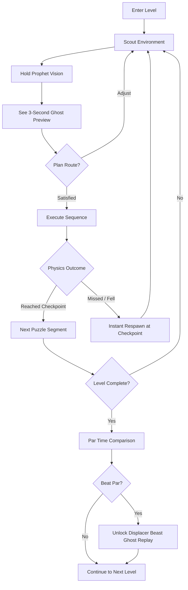
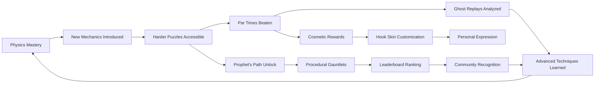

# Grappling Hook Prophet

## Title & Genre

| Field | Value |
|-------|-------|
| **Title** | Grappling Hook Prophet |
| **Genre** | Physics Puzzle Platformer / Speedrun Sandbox |
| **Engine** | Unity 6 (DOTS physics for rope simulation, Burst compiler for parallel constraint solving) |
| **Platform** | PC (Steam), Nintendo Switch 2, PlayStation 5, Xbox Series X |
| **Monetization** | Premium -- $19.99 base. Free level editor. Community levels free. Cosmetic hook skins sold individually ($1.99) or in packs ($4.99 for 5). |
| **Rating** | ESRB E (Everyone) / PEGI 3 / CERO A |

---

## Vision Statement

Grappling Hook Prophet is a physics puzzle platformer where a vibrant prophet armed with a plasma-powered grappling hook and three seconds of precognition navigates fractured sky realms -- floating debris fields, collapsing amber crystal caverns, the petrified ribcage of a dead leviathan. Every swing obeys real physics: tension, momentum, pendulum arcs, elastic rebound. Prophet Vision lets players preview three ghostly seconds of their trajectory before committing, turning each puzzle into a problem you solve with your body before your fingers. When you chain five grapples in perfect succession -- swing, release at apex, re-grapple mid-air, pendulum around a floating column, slingshot through a crystal ring -- the game enters a slow-motion amber glow that makes the moment feel sacred. The physics engine ensures every perfect run feels earned, not scripted. You did the math with your body. Two parallel tracks: a 60-level hand-crafted story campaign and an infinite procedurally generated Prophet's Path. Every level has a displacer beast NPC who sets par times, and their ghost replays reveal increasingly creative physics exploits. This is a game about momentum, prediction, and the joy of emergent mastery.

---

## Core Loop

**Target session length:** 15-45 minutes (campaign), 5-15 minutes (Prophet's Path gauntlet run)



### Core Loop Breakdown

| Step | Player Action | System Response | Skill Expression |
|------|--------------|----------------|-----------------|
| 1. Scout | Observe floating platforms, crystal rings, debris fields, hazard timing | Level geometry is procedurally arranged but physics-consistent -- every object has mass, friction, elasticity | Spatial reasoning, hazard pattern recognition |
| 2. Prophet Vision | Hold designated button to project ghost of next 3 seconds of movement | Ghost renders predicted trajectory based on current velocity, grapple tension, and environmental forces. Shows collisions, misses, and successful arcs | Mental simulation matching physical reality -- the better your intuition, the more accurate the ghost |
| 3. Grapple | Aim and fire plasma hook at any grapple point (marked surfaces, crystal nodes, floating anchors) | Rope physics engage: tension builds, pendulum arc calculated, momentum preserved. Hook has 40m range. Player mass (75kg base) affects swing dynamics | Aim precision, angle selection, timing of fire vs. momentum state |
| 4. Swing | Ride the pendulum arc; manage release point | Physics calculates: `angular_velocity = sqrt(g / rope_length)`, tension force, centripetal acceleration. Release preserves velocity vector | Release timing -- too early undershoots, too late overshoots. Apex release maximizes horizontal distance |
| 5. Re-grapple (chain) | Fire again mid-air before momentum decays | Each successive grapple preserves ~85% of accumulated momentum (energy loss from plasma hook engagement). Chain length is uncapped -- limited only by player skill and level geometry | Multi-step planning, trajectory prediction, spatial awareness |
| 6. Environmental Interaction | Pass through amber crystal rings (speed boost), bounce off elastic walls, ride wind currents | Each element applies forces: crystal rings multiply velocity by 1.5x, elastic walls reflect with 0.9 restitution, wind currents add force vector | Force composition -- understanding that a boost into a wind current compounds, not adds |
| 7. Checkpoint / Respawn | Touch glowing checkpoint nodes; instant respawn on fall | No death penalty. Respawn takes 0.8 seconds. Checkpoints placed every 2-3 puzzle segments | Risk-free experimentation encourages creative solutions |
| 8. Level Complete | Reach the displacer beast shrine at level end | Time recorded. Compared to par time. Ghost replay unlocked if par beaten. Amber glow cinematic on clean runs under 1.5x par | Speed optimization, routing, ghost chasing |

---

## Meta Loop

### Session-to-Session Progression



### Progression Axes

| Axis | What Grows | How It Feels | Cap |
|------|-----------|-------------|-----|
| **Physics Intuition** | Understanding of pendulum mechanics, momentum conservation, force composition | Swings that felt impossible in level 1 become automatic by level 30. Your hands know what your brain stopped calculating. | No cap -- mastery is perpetual, demonstrated through par times |
| **Campaign Progression** | Access to new biomes, mechanics, and puzzle concepts | Each of the 60 levels introduces exactly one new concept, building complexity through combination | 60 levels (6 chapters of 10) |
| **Par Time Mastery** | Beating displacer beast par times across all levels | Every par beaten unlocks a ghost. Beating the ghost unlocks a faster ghost. Three layers of optimization per level. | 3 ghost tiers per level = 180 total par challenges |
| **Prophet's Path Rank** | Performance in procedurally generated gauntlets | Weekly seed-based leaderboards. Rank brackets: Stone, Copper, Bronze, Silver, Gold, Amber, Prophet | 7 ranks, weekly reset |
| **Cosmetic Collection** | Hook skins, trail effects, prophet aura colors | Self-expression without gameplay impact. Earned through par times, daily challenges, or purchased | 80+ cosmetics at launch |
| **Player Skill** | Vision planning depth, chain length, air-control precision | Invisible but defining -- by endgame you plan 3-4 vision cycles ahead, solving 9-12 seconds of physics in your head | No cap -- community will discover techniques the developers never designed |

---

## Game Mechanics

### Primary Mechanic: Plasma Grappling Hook

The grappling hook is a physics simulation, not a scripted ability. It operates on real constraint-based rope physics solved at 120Hz (decoupled from render frame rate via DOTS).

**Rope Physics Parameters:**

| Parameter | Value | Tuning Notes |
|-----------|-------|-------------|
| Maximum rope length | 40 meters | Sufficient for large chambers without trivializing gaps |
| Player mass | 75 kg | Base mass. Crystal pickup events add 0.5-2 kg temporarily |
| Rope stiffness (axial) | 12,000 N/m | Stiff enough to feel taut; soft enough for satisfying stretch on high-momentum impacts |
| Rope damping | 450 Ns/m | Prevents infinite oscillation. Rope settles within 2-3 swings |
| Gravity | 9.81 m/s^2 | Earth-standard. Modified in special chambers (0.3g crystal caverns, 1.5g leviathan interior) |
| Momentum preservation on re-grapple | 85% | Energy loss from hook engagement. Creates natural chain decay -- 10-grapple chains require increasingly precise angles |
| Hook fire speed | 80 m/s | Near-instant at typical ranges (<40m). Projectile is visible but fast enough that aiming feels responsive |
| Hook attach angle | Any surface within 180-degree frontal cone | Cannot attach to surfaces directly behind the player |
| Rope break threshold | 180% of max length | Rope stretches then snaps. Player keeps current velocity. Snap produces visual/audio feedback |
| Elastic rebound | 0.65 coefficient of restitution | Wall/ceiling bounces preserve 65% of impact speed |

**Grapple States:**

| State | Trigger | Behavior | Visual |
|-------|---------|----------|--------|
| Aiming | Right trigger held (analog) | Laser sight shows projected attach point. Hook visible on wrist | Thin amber laser line |
| Firing | Right trigger released | Hook launches toward aimed surface at 80 m/s | Plasma streak from wrist to target |
| Attached | Hook contacts valid surface | Rope physics engage. Player swings as pendulum mass | Glowing amber rope with tension particles |
| Tension building | Player at bottom of arc, high velocity | Rope stretches slightly, stores elastic energy | Rope brightens, particles intensify |
| Releasing | Right trigger tap while attached | Player detaches, preserves full velocity vector | Brief flash at detach point |
| Re-grapple | Right trigger released mid-air | New hook fires from current position. Momentum preserved at 85% | Streak trail between old and new attach points |
| Broken | Rope exceeds 180% max length | Rope snaps, player keeps velocity | Crackle effect, brief screen shake |

### Secondary Mechanic: Prophet Vision

Hold left trigger to project a ghost of your next 3 seconds of movement. The ghost is a physics-accurate simulation running forward in time from your current state.

**Vision Parameters:**

| Parameter | Value | Notes |
|-----------|-------|-------|
| Preview duration | 3.0 seconds (real-time) | Game does not slow down during vision -- the ghost runs in parallel |
| Update rate | 60 Hz preview simulation | Decoupled from 120 Hz main physics. Sufficient for trajectory accuracy |
| Ghost opacity | 40% amber tint | Visible against all backgrounds. Turns red when predicting a collision/fall |
| Cooldown | None | Can hold indefinitely. Ghost updates in real-time as you adjust aim and position |
| Vision stacking | Up to 4 cycles memorized | Expert players hold vision, memorize the arc, adjust, hold again -- planning 9-12 seconds ahead |
| Grapple preview | Shows trajectory after attach | If aimed at a valid surface, ghost shows the resulting swing arc |
| Hazard preview | Shows debris/crystal movement | Environmental objects continue their cycles during preview |
| Failure preview | Ghost turns red and fades | If the predicted trajectory leads to a fall or collision, the ghost indicates where and why |

**Vision Skill Curve:**

| Player Level | Vision Usage | Effective Planning Depth |
|-------------|-------------|------------------------|
| Beginner (Levels 1-10) | Single grapple preview -- aim, hold vision, fire | 1 grapple = 3 seconds planned |
| Intermediate (Levels 11-30) | Two-grapple sequences -- hold vision, memorize, adjust for second grapple | 2 grapples = 6 seconds planned |
| Advanced (Levels 31-50) | Three-grapple chains with environmental interactions | 3 grapples + 1 environmental = 9 seconds planned |
| Expert (Levels 51-60) | Four-grapple chains with boost/elastic/wind interactions | 4+ interactions = 12+ seconds planned |
| Speedrunner (Post-campaign) | Minimal vision use -- internalized physics intuition | Vision used only for routing new strategies |

### Secondary Mechanic: Environmental Physics Objects

Each of the 60 campaign levels introduces or combines physics objects. The core set:

| Object | Physics Behavior | Introduced | Combined With |
|--------|-----------------|------------|--------------|
| **Amber Crystal Ring** | Velocity multiplier (1.5x) when passed through center | Level 4 | Grapple chains (L8+), elastic walls (L15+), wind (L22+) |
| **Elastic Wall** | Reflects player with 0.9 restitution. Angle of incidence = angle of reflection | Level 7 | Crystal rings (L15+), moving platforms (L18+) |
| **Wind Current** | Adds directional force vector (up to 15 m/s). Visible as particle streams | Level 12 | All objects -- compounding force effects |
| **Moving Platform** | Kinematic surfaces with scripted paths. Player inherits platform velocity on attach | Level 9 | Grapple chains (L14+), elastic walls (L18+) |
| **Collapsing Debris** | Surfaces that shatter 0.5s after contact. Player must grapple through quickly | Level 16 | All objects -- creates time pressure |
| **Crystal Switch** | Opens/closes paths when struck. Some toggle, some are one-shot | Level 11 | Moving platforms (L20+), debris (L25+) |
| **Gravity Well** | Localized gravity modifier (0.3g to 1.5g in 8m radius). Multiple wells can overlap | Level 19 | All objects -- inverted pendulums, compound trajectories |
| **Bounce Mushroom** | Launches player at fixed velocity in direction of impact. 2.5s recharge | Level 23 | Crystal rings (L28+), wind (L30+) |
| **Magnetic Rail** | Grapple point that slides along the rail when tension is applied. Acts as moving anchor | Level 26 | All objects -- creates dynamic pendulums |
| **Phase Crystal** | Oscillates between solid and intangible on a timer. Must time grapples to solid phases | Level 33 | All objects -- creates rhythm-based puzzles |
| **Leviathan Rib** | Massive curved surface that acts as a half-pipe. Concave geometry creates continuous contact | Level 38 | Gravity wells (L40+), phase crystals (L42+) |
| **Aether Vortex** | Rotational force field. Adds angular momentum. Can be used to gain height through spiraling | Level 45 | All objects -- creates orbital grapple paths |
| **Temporal Shard** | Slows player's local time to 0.3x for 2 seconds on contact. Does not affect environment | Level 50 | All objects -- enables frame-perfect window expansions |
| **Void Tear** | Teleport between linked pairs. Preserves velocity on exit | Level 55 | All objects -- teleport-momentum combos |

### Displacer Beast Par Time System

Every level features a displacer beast NPC who has already completed the level and set a par time. The system has three tiers:

| Ghost Tier | Unlock Condition | What It Shows | Difficulty Gap |
|-----------|-----------------|---------------|---------------|
| **Bronze Ghost** | Complete the level | Basic route. Uses intended mechanics. Clean execution. | Baseline -- what a first-time clear looks like with knowledge |
| **Silver Ghost** | Beat Bronze Ghost's time | Optimized route. Skips unnecessary segments. Uses one advanced technique. | ~20% faster than Bronze |
| **Amber Ghost** | Beat Silver Ghost's time | Exploitative route. Uses physics interactions the level was not explicitly designed for. Near-perfect execution. | ~15% faster than Silver |

**Ghost Replay Data:**
- Full input recording (aim direction, trigger timing, vision activation)
- Trajectory trace visible as amber trail
- Player can scrub through replay, pause, and practice from any point
- Ghost replays are shareable as compact input files (~2KB each)

### Difficulty Progression Table

| Chapter | Levels | New Objects Introduced | Complexity | Par Time Range | Vision Dependency | Chain Length |
|---------|--------|----------------------|-----------|---------------|-------------------|-------------|
| 1 -- Fractured Skies | 1-10 | Grapple points, crystal rings, elastic walls, moving platforms | Single-concept puzzles | 15-45 seconds | High -- players learn to trust vision | 1-2 grapples |
| 2 -- Amber Caverns | 11-20 | Crystal switches, wind currents, collapsing debris, gravity wells | Two-concept combinations | 20-60 seconds | Moderate -- vision used for planning, not execution | 2-3 grapples |
| 3 -- Leviathan's Bones | 21-30 | Bounce mushrooms, magnetic rails, combined gravity wells | Three-concept combinations | 25-70 seconds | Moderate -- vision used for key transitions | 3-4 grapples |
| 4 -- Petrified Heart | 31-40 | Phase crystals, leviathan ribs, environmental rhythm puzzles | Timed multi-concept chains | 30-90 seconds | Low -- vision becomes optional for experienced players | 4-5 grapples |
| 5 -- Void Spires | 41-50 | Aether vortexes, temporal shards, compound force fields | Full physics sandbox | 35-120 seconds | Minimal -- expert players internalize physics | 5-7 grapples |
| 6 -- Prophet's Zenith | 51-60 | Void tears, all objects combined, environmental sequence puzzles | Mastery gauntlets | 40-180 seconds | Choice -- vision is a tool, not a crutch | 6-10+ grapples |

---

## World Design

### Map Structure

Each of the 60 campaign levels is a self-contained physics chamber. Levels are organized into 6 chapters, each set in a distinct biome of the fractured sky realm.

```
+----------------------------------------------------+
|           CHAPTER 6: PROPHET'S ZENITH              |
|    Void Temple -- All mechanics, mastery tests      |
+-------------------------+--------------------------+
                          |
          +----------------+----------------+
          |   CHAPTER 5: VOID SPIRES       |
          |   Aether Vortexes, Temporal     |
          |   Shards, full sandbox          |
          +----------------+----------------+
                           |
          +----------------+----------------+
          |   CHAPTER 4: PETRIFIED HEART    |
          |   Leviathan Interior, Phase      |
          |   Crystals, Rhythm Puzzles       |
          +----------------+----------------+
                           |
          +----------------+----------------+
          |  CHAPTER 3: LEVIATHAN'S BONES   |
          |   Bounce Mushrooms, Magnetic    |
          |   Rails, Compound Gravity        |
          +----------------+----------------+
                           |
          +----------------+----------------+
          |   CHAPTER 2: AMBER CAVERNS      |
          |   Crystal Switches, Wind,        |
          |   Debris, Gravity Wells          |
          +----------------+----------------+
                           |
          +----------------+----------------+
          |   CHAPTER 1: FRACTURED SKIES    |
          |   Floating Debris, Crystal       |
          |   Rings, Basic Grapple Puzzles   |
          +----------------------------------+
```

**Interconnection:** Levels are sequential within chapters and chapter order is linear. Each level is a contained puzzle chamber with a specific biome visual theme. The world is not open -- it is a curated progression of physics concepts that build on each other. Players can replay any completed level from the chapter select map.

### Art Direction Pillars

| Pillar | Description | Reference |
|--------|-------------|-----------|
| **Sacred Geometry** | Floating structures are remnants of a divine architecture -- perfect angles, impossible balances, structures that should not stand but do | Celeste's floating temple sections, Journey's desert monuments |
| **Amber Luminescence** | The prophet's power manifests as warm amber light -- the grappling hook is amber plasma, vision ghosts glow amber, par time shrines pulse amber | ABZU's bioluminescent depths, Ori's spirit trees |
| **Biome Diversity** | Six distinct environments, each with unique color palette, atmospheric effects, and physics-themed visual language | Neon White's varied heavens, Super Mario Galaxy's galaxy diversity |
| **Displacer Beast Whimsy** | Displacer beast NPCs are playful, cat-like creatures with shifting purple-black fur and six legs. They are charming guides, not enemies. They set par times because they find your runs amusing. | Stray's cat personality, Spirited Away's soot sprites for charm |

### Visual & Audio Progression

| Chapter | Palette Dominant | Lighting Mood | Ambient Audio | Music Intensity |
|---------|-----------------|--------------|--------------|----------------|
| 1 -- Fractured Skies | Pale blue, white, silver, soft amber accents | Bright diffused daylight, cloud shadows | Wind, distant crystalline chimes, fabric flutter | Sparse piano -- single notes |
| 2 -- Amber Caverns | Deep amber, honey gold, burnt orange, dark brown | Warm interior glow, crystal refraction, dust motes | Dripping resonance, crystal harmonics, deep hum | Piano + soft strings, undertone of warmth |
| 3 -- Leviathan's Bones | Bone white, deep purple, teal, rose | Bioluminescent moss, shafts of light through rib gaps | Organic pulse (heartbeat distant), water dripping inside bone, wind through hollow spaces | Strings + harp, mournful and vast |
| 4 -- Petrified Heart | Deep crimson, obsidian black, gold veins, pale gray | Internal glow from petrified arteries, pulsing light synced to environmental rhythm | Rhythmic thudding (the dead heart), arterial flow, calcium groans | Percussion enters -- heartbeat as tempo |
| 5 -- Void Spires | Deep indigo, electric violet, void black, starlight white | Self-illuminated structures, void background with distant stars, vortex auras | Silence punctuated by vortex hums, temporal distortion crackles, crystalline pings | Electronic ambient -- synth pads, arpeggios |
| 6 -- Prophet's Zenith | Pure white, liquid gold, prismatic refraction, void black contrast | Blinding sacred light, prismatic color separation, shadows that move independently | Choir undertone (the prophet's voice), cosmic resonance, glass harmonics | Full orchestration -- choir, strings, piano, synth -- overwhelming beauty |

---

## Narrative

### Tone Spectrum (7-Axis)

| Axis | Position | Notes |
|------|----------|-------|
| Hope <-> Despair | 80% Hope | The prophet is ascending, literally and metaphorically. Even failure is instant respawn with no penalty. |
| Holy <-> Profane | 70% Holy | Sacred architecture, divine mission, amber light as manifestation of faith |
| Order <-> Chaos | 50% Balance | Ordered divine geometry meets chaotic physics emergence. Both are beautiful. |
| Sound <-> Silence | 60% Sound | Music and audio are companions. The only silence is in the void spires -- and it is meaningful. |
| Human <-> Mythic | 75% Mythic | The prophet is more concept than character. Displacer beasts are mythical guides. The world is allegorical. |
| Past <-> Present | 40% Present | The sky realm is a ruin, but the prophet is moving through it now. History is backdrop, not focus. |
| Faith <-> Doubt | 65% Faith | The prophet believes in the ascent. Vision is a literal expression of faith -- seeing what will be. |

### 8-Point Story Spine

**1. Equilibrium**
The Prophet awakens at the base of the Fractured Skies -- the lowest layer of a shattered divine realm where floating debris and crystal fragments are all that remain of a celestial architecture that once connected the mortal world to the divine. The Prophet carries a plasma-powered grappling hook and possesses the ability to see three seconds into their own future. A displacer beast named Nix -- small, six-legged, fur rippling between purple and black -- sits on the first checkpoint, grooming itself. Nix is the first of many displacer beasts scattered across the sky realm who will observe the Prophet's ascent and challenge them with par times.

**2. Inciting Incident**
The Prophet touches the first amber shrine and receives a vision: the sky realm was shattered by the departure of the Architect, a divine being who maintained the celestial connections. Without the Architect, the realm broke apart. The Prophet feels a pull upward -- the grappling hook resonates with the same frequency as the shattered architecture. The ascent begins.

**3. First Complication**
In the Amber Caverns, the Prophet discovers the first signs that the shattering was not an accident. Crystal murals depict a civilization that lived in the sky realm -- they built the structures the Prophet is now swinging through. They had grappling technology too. Their ruins contain hook points designed for the same plasma frequency. Someone came before. They failed. The displacer beasts know this but will not explain -- they only set par times and watch.

**4. Rising Action**
Through the Leviathan's Bones and the Petrified Heart, the Prophet finds more evidence of the Previous Ascents. Multiple prophets attempted the climb before. Their hooks are embedded in walls. Their trails are visible as faded amber lines on surfaces. The displacer beasts preserve their ghost replays. The Prophet can watch failed attempts by those who came before. The beasts are archivists, not guides. They record all attempts -- successes and failures equally.

**5. Midpoint Reversal**
In the Void Spires, the Prophet reaches a chamber containing the preserved ghost of the last Prophet who attempted the ascent. This ghost is not a recording -- it is the trapped consciousness of a previous Prophet, suspended in amber. It speaks: the Architect did not leave. The Architect was pulled apart by the accumulated weight of all the prophets trying to reach them. Every grappling hook that resonates with the architecture drains it further. The ascent itself is what shattered the realm. The displacer beasts know this. They set par times to encourage efficiency -- the faster you ascend, the less damage you do.

**6. Crisis**
The Prophet must decide: continue ascending and risk further damage to the realm, or stop and let the architecture stabilize. But stopping means remaining in the Void Spires forever -- the realm is deteriorating regardless. The displacer beasts reveal their purpose: they are fragments of the Architect, scattered by the shattering. Every par time beaten, every ghost replay studied, every chain perfected -- these are acts of understanding. The Architect shattered because no single consciousness could hold the entire sky realm's physics simultaneously. The displacer beasts are distributed understanding.

**7. Climax**
Prophet's Zenith is the final test -- 10 levels that combine every physics concept from the entire campaign. The architecture here is the most unstable: platforms phase, gravity shifts unpredictably, void tears fragment space. The final level is the Architect's Core -- a single chamber where the Prophet must execute a 10+ grapple chain through every environmental object type while the room itself rearranges around them. The displacer beasts watch in unison. This is the par time that matters most.

**8. Resolution**
Three endings based on par time mastery:
- **Ascent:** Complete the campaign. The Prophet reaches the Architect's Core and stabilizes it momentarily. The realm holds but remains fragmented. Nix nods, sets a new par time, and disappears. Bittersweet -- the Prophet succeeded but the work is never done.
- **Restoration:** Beat Silver Ghost par time on all 60 levels. The Prophet's understanding of the realm's physics is deep enough to begin reconnecting the fractured architecture. Several regions stabilize. The displacer beasts begin reassembling. The sky realm begins to heal.
- **Transcendence:** Beat Amber Ghost par time on all 60 levels + complete a single unbroken Prophet's Path gauntlet of 20 consecutive levels without failing. The Prophet's mastery of the physics is total. They do not merely stabilize the architecture -- they become part of it. The grappling hook dissolves into the Prophet's wrist. The Prophet can now see beyond three seconds. The displacer beasts reassemble into the Architect, who recognizes the Prophet as an equal consciousness. The sky realm is restored. The Prophet is home.

### Key Characters

| Character | Role | Theme | Presence |
|-----------|------|-------|----------|
| **The Prophet** | Protagonist -- silent, expressive through movement | Ascent as faith; mastery as devotion; the body as prayer | Player character. No dialogue. Emotion conveyed through animation and amber glow intensity |
| **Nix** | Guide / Archivist -- first displacer beast encountered | Playful observation; setting standards without judgment; the amusement of a god watching mortals try | Appears at every par time shrine. Grooms, stretches, yawns. Sets Bronze ghost times. Most visible character |
| **The Previous** | Ghosts of failed prophets who attempted the ascent before | The weight of past attempts; every hook scar on a wall is a story; failure is not shameful, it is data | 23 ghost encounters across chapters 3-5. Each provides a short vision of their attempt and why it ended |
| **The Architect** | Absent deity -- the being who built and then was shattered by the sky realm | Creation as sacrifice; the danger of being the single point of failure; distributed consciousness as salvation | Never appears directly until the Transcendence ending. Presence felt through architecture and displacer beast behavior |
| **The Displacer Beast Collective** | Archivists / Par Time Setters / Architect Fragments | Distributed knowledge; playfulness as pedagogy; the universe learning about itself through those who try | 60+ individual beasts across all levels. Each has a name, personality quirk, and par time specialty |

---

## Player Personas

### P-003: Hiroshi Tanaka -- The RPG Addict

**Why this game fits:** Grappling Hook Prophet has 60 levels, 180 par time challenges (3 tiers per level), 80+ cosmetics, and a Transcendence ending requiring near-perfect play across all content. The progressive physics system -- each level introducing one new concept -- mirrors the mastery-oriented progression Hiroshi craves. The displacer beast ghost replay system is a completionist's dream: every level has three layers of optimization to chase.

**Predicted experience:** Hiroshi will 100% every chapter before advancing. He will beat Bronze par on every level before moving to the next. He will catalog every environmental object interaction in a personal wiki. He will pursue the Transcendence ending as his primary goal. He will love the progressive difficulty curve; he will find the lack of character stat progression unusual but acceptable because the physics mastery progression fills the same psychological niche.

### P-001: Alex Rivera -- The Ranked Grinder

**Why this game fits:** The par time system is a leaderboard at every level. The ghost replay system is a competitive tool. The Prophet's Path mode generates weekly seeded gauntlets with global leaderboards. The physics engine creates genuine skill expression -- Alex's 2-3 hour daily sessions map perfectly to "grind par times, analyze ghost replays, optimize routes, repeat." No P2W. No stat inflation. Pure physics mastery.

**Predicted experience:** Alex will speedrun the campaign to unlock all levels, then focus exclusively on par time optimization and Prophet's Path leaderboards. He will study Amber ghost replays frame-by-frame. He will discover techniques the developers did not design. He will stream his par time attempts. He will love the infinite skill ceiling; he will skip every story element.

### P-008: David Park -- The Achievement Hunter

**Why this game fits:** 180 par time challenges (3 per level), 60 campaign completions with various constraints (no-vision runs, speed runs, all-amber-ghost runs), 80+ cosmetic unlocks, 3 endings, daily/weekly challenges in Prophet's Path. Every achievement is skill-based with zero RNG. The level editor adds user-generated content achievements. Total completion is a 100+ hour pursuit that David can spread across his 1-2 hour daily sessions.

**Predicted experience:** David will methodically complete every level, beat every par time, unlock every ghost, collect every cosmetic, and pursue all three endings. He will spreadsheet his par time progress. He will appreciate the clear, achievable completion requirements. He will flag any achievement that feels RNG-dependent. He will love the level editor achievements; he will create at least 3 published community levels.

### P-009: Liam O'Connor -- The Dedicated F2P

**Why this game fits:** Premium at $19.99 is the most accessible price point for a skill-based game. All gameplay is unlocked. Cosmetic purchases do not affect physics. The Prophet's Path leaderboards rank by skill, not wallet. Liam's F2P advocacy instincts will fire for a game where the only progression is physics mastery. He will champion this game in every community he touches.

**Predicted experience:** Liam will buy the $19.99 base game and refuse all cosmetic purchases on principle. He will create YouTube guides showing frame-perfect grapple techniques. He will attempt no-vision runs (completing levels without using Prophet Vision). He will discover and document physics exploits. He will be the game's most vocal organic promoter specifically because the monetization is fair.

---

## User Stories

### Exploration (6 stories)

1. As **Hiroshi (P-003)**, I want each of the 60 levels to introduce exactly one new physics concept so that learning never feels overwhelming and mastery builds naturally.
2. As **David (P-008)**, I want a chapter select map that shows par time completion status for every level so that I can track my 100% progress at a glance.
3. As **Liam (P-009)**, I want hidden areas in levels that reward creative grappling and non-obvious routes so that exploration is incentivized beyond the critical path.
4. As **Hiroshi (P-003)**, I want the displacer beast NPCs to have individual names and personality quirks so that each level feels inhabited rather than sterile.
5. As **Alex (P-001)**, I want levels to support multiple valid routes so that optimization is creative rather than rote.
6. As **Liam (P-009)**, I want environmental storytelling through the Previous's abandoned hooks and faded trails so that the world tells its own history without text dumps.

### Core Mechanics (8 stories)

7. As **Alex (P-001)**, I want the grappling hook to obey real physics with tension, momentum, and pendulum arcs so that mastery feels earned and emergent rather than scripted.
8. As **Hiroshi (P-003)**, I want Prophet Vision to show a 3-second physics-accurate ghost preview so that I can plan multi-grapple sequences before committing.
9. As **Liam (P-009)**, I want instant respawn at checkpoints with zero death penalty so that experimentation is encouraged and failure is a learning tool, not a punishment.
10. As **Alex (P-001)**, I want momentum to be preserved at 85% on re-grapple so that long chains are possible but require increasingly precise execution.
11. As **Hiroshi (P-003)**, I want 14 distinct environmental physics objects introduced progressively across 60 levels so that the complexity curve is smooth and combinatory.
12. As **Alex (P-001)**, I want the amber glow slow-motion effect to trigger on 5+ grapple chains so that exceptional play is visually and emotionally celebrated.
13. As **David (P-008)**, I want the displacer beast ghost replay system to support scrubbing, pausing, and practicing from any point so that I can analyze and adopt optimal techniques.
14. As **Alex (P-001)**, I want the Prophet's Path procedural mode to generate physics-valid gauntlets with weekly seeded leaderboards so that competitive play has infinite replayability.

### Narrative (4 stories)

15. As **Hiroshi (P-003)**, I want the Previous's ghost encounters to tell a coherent story about failed ascents so that the world has emotional stakes beyond the mechanics.
16. As **Alex (P-001)**, I want narrative elements to be entirely optional and non-blocking so that the mechanics-first experience is never interrupted.
17. As **Hiroshi (P-003)**, I want three endings tied to par time mastery (not dialogue choices) so that the narrative resolution reflects how well I understand the physics.
18. As **David (P-008)**, I want the Transcendence ending to require beating all 180 par challenges AND completing a 20-level gauntlet so that the hardest ending is a genuine mastery test.

### Progression (6 stories)

19. As **David (P-008)**, I want 180 par time challenges (3 tiers per level) so that 100% completion is a multi-layered goal spanning every level.
20. As **Hiroshi (P-003)**, I want 80+ cosmetic unlocks earned through par times and daily challenges so that visual expression rewards mastery without affecting gameplay.
21. As **Alex (P-001)**, I want 7 Prophet's Path rank brackets (Stone through Prophet) with weekly resets so that competitive ranking is fresh and achievable.
22. As **Liam (P-009)**, I want a no-vision challenge mode (complete levels without Prophet Vision) so that ultimate mastery has a visible, testable expression.
23. As **David (P-008)**, I want a level editor that lets me create and publish puzzles using all campaign physics objects so that completion extends beyond developer content.
24. As **Hiroshi (P-003)**, I want the level editor to track community ratings and play counts on my published levels so that creative contribution is measurable.

### Accessibility (5 stories)

25. As a player with motor impairments, I want an assist mode that extends Prophet Vision preview to 5 seconds and adds a 0.3s grapple input buffer so that the core experience is accessible without trivializing the physics.
26. As **David (P-008)**, I want fully remappable controls with presets for keyboard, controller, and Steam Input so that my preferred layout is always supported.
27. As a player with color vision deficiency, I want Prophet Vision ghosts to use shape (solid outline vs. dashed) and animation (steady vs. flickering) in addition to color to communicate success vs. failure predictions.
28. As a player with vestibular sensitivity, I want an option to disable camera motion during high-momentum grapple chains and reduce the amber glow effect intensity.
29. As **Hiroshi (P-003)**, I want a practice mode that lets me isolate and repeat any segment of a level so that I can master difficult chains without replaying entire levels.

### Social & Community (4 stories)

30. As **Liam (P-009)**, I want ghost replays to be shareable as compact files so that I can exchange optimized routes with the community.
31. As **Alex (P-001)**, I want Prophet's Path weekly leaderboards to show the top 100 replays so that I can study and learn from the best players.
32. As **David (P-008)**, I want Steam Workshop integration for the level editor so that community levels are discoverable and installable with one click.
33. As **Liam (P-009)**, I want cosmetic hook skins to be the only paid content so that I can champion the game as fair and skill-only in my communities.

---

## Monetization

### Revenue Model: Premium at $19.99

**Why this model fits this game:**
- Physics puzzle platformer players (Celeste, Neon White, Super Meat Boy) expect and prefer premium pricing -- it signals a complete, curated experience
- The par time system is inherently skill-based -- no monetizable shortcut exists without breaking the core loop
- The target audience (P-003, P-001, P-008, P-009) values fair, complete experiences over free-to-play grind
- $19.99 is the sweet spot for a 60-level campaign + infinite procedural mode + level editor -- below the $29.99 AAA threshold but above the $9.99 "small indie" perception

### Pricing & DLC Roadmap

| Product | Price | Content | Target Window |
|---------|-------|---------|--------------|
| Base Game | $19.99 | Full 60-level campaign, Prophet's Path mode, level editor, 180 par challenges | Launch |
| Cosmetic Pack: Shattered Skies | $4.99 | 5 hook skins themed after Chapter 1-2 biomes | Launch |
| Cosmetic Pack: Leviathan's Wake | $4.99 | 5 hook skins themed after Chapter 3-4 biomes | Launch |
| Cosmetic Pack: Void Prophet | $4.99 | 5 hook skins themed after Chapter 5-6 biomes | Launch |
| Individual Hook Skins | $1.99 each | 15 skins available individually at launch | Launch |
| DLC 1: "The Previous's Path" | $7.99 | 20 prequel levels (play as a Previous Prophet), 3 new physics objects, 60 new par challenges, 1 ending | Month 4 |
| DLC 2: "Architect's Workshop" | $7.99 | Advanced level editor tools (logic gates, custom physics parameters, event sequencing), 20 developer-curated community levels with par times | Month 8 |

### Revenue Projections (4 Scenarios)

| Scenario | Year 1 Units | Year 1 Revenue | Year 2 (w/ DLC + Cosmetics) | Total (2yr) | Assumptions |
|----------|-------------|---------------|----------------------------|------------|-------------|
| **Modest** | 40,000 | $680K | $240K | $920K | Niche appeal, word-of-mouth only, 10% DLC attach, 5% cosmetic attach |
| **Baseline** | 150,000 | $2.55M | $1.05M | $3.6M | Moderate marketing, positive reviews, 20% DLC attach, 12% cosmetic attach |
| **Strong** | 500,000 | $8.5M | $4.2M | $12.7M | Strong reviews, speedrun community adoption, streamer coverage, 25% DLC attach, 18% cosmetic attach |
| **Breakout** | 1,200,000 | $20.4M | $12.8M | $33.2M | Viral speedrun scene, award nominations, workshop ecosystem thrives, 30% DLC attach, 25% cosmetic attach |

**Break-even at ~33,000 units ($528K) against effective development budget of $510K (see Production Plan).**

### Cosmetics Philosophy

All paid content is cosmetic only. No gameplay impact. This is non-negotiable.

| Category | Items | Acquisition | Price |
|----------|-------|-------------|-------|
| Hook Skins | Visual model changes for the grappling hook | 40 earnable in-game, 15 paid, 5 exclusive to DLC | $1.99 each or $4.99/5-pack |
| Trail Effects | Amber glow pattern changes during swings | 20 earnable, 5 paid | $1.99 each |
| Prophet Aura | Ambient particle effect around the player character | 10 earnable, 3 paid | $1.99 each |
| Displacer Beast Companions | Cosmetic companion beast that follows the player in hubs | 6 earnable (one per chapter), 2 paid | $2.99 each |

---

## Production Plan

### Team

| Role | Count | Phase | Monthly Cost (Loaded) |
|------|-------|-------|----------------------|
| Game Director / Lead Design | 1 | All | $11,000 |
| Physics Programmer (DOTS/Burst) | 1 | All | $11,500 |
| Gameplay Programmer | 1 | Months 1-12 | $9,500 |
| Level Designer | 2 | Months 2-10 | $8,000 each |
| Technical Artist | 1 | Months 2-12 | $9,000 |
| 3D Environment Artist | 2 | Months 3-10 | $7,500 each |
| VFX / Shader Artist | 1 | Months 4-12 | $8,000 |
| Audio Designer / Composer | 1 | Months 3-12 | $7,000 |
| UI Programmer | 1 | Months 4-10 | $8,500 |
| QA Lead | 1 | Months 6-12 | $6,500 |
| QA Testers | 2 | Months 8-12 | $4,500 each |
| Producer | 1 | All | $9,500 |

**Total team: 14 people peak (months 6-10)**

### Timeline (14-month production)

| Month | Milestone | Key Deliverables |
|-------|-----------|-----------------|
| 1 | Prototype | Core grapple physics (rope simulation, pendulum, momentum), Prophet Vision ghost preview, basic hook attach/detach |
| 2 | Vertical Slice | 3 levels playable end-to-end (Chapter 1 style), displacer beast par time system, checkpoint/respawn, amber glow effect |
| 3 | Pre-Production Complete | All 60 levels greyboxed, 14 environmental objects designed, biome art direction locked, procedural generator spec finalized |
| 4 | Production Phase 1 | Chapters 1-2 art pass (Fractured Skies, Amber Caverns), 6 environmental objects implemented, level editor prototype |
| 5 | Production Phase 1 | Prophet's Path procedural generator operational, first 20 levels playable with par times, Nix animations complete |
| 6 | Production Phase 2 | Chapters 3-4 greybox + art pass begins (Leviathan's Bones, Petrified Heart), 10 environmental objects implemented, QA begins |
| 7 | Production Phase 2 | All 14 environmental objects implemented, ghost replay system complete, level editor functional |
| 8 | Production Phase 2 | Chapters 5-6 greybox complete (Void Spires, Prophet's Zenith), all 60 levels playable in greybox |
| 9 | Production Phase 3 | Full art pass on chapters 3-6, narrative encounters (The Previous ghosts) implemented, par time tuning |
| 10 | Production Phase 3 | All 60 levels art-complete, all par times set (Bronze/Silver/Amber), level editor integration with Steam Workshop |
| 11 | Alpha | Full game playable, all systems integrated, Prophet's Path generating valid gauntlets, external playtesting begins |
| 12 | Beta | Feature complete, content complete, difficulty tuning based on playtests, performance optimization, console port begins |
| 13 | Release Candidate | Cert submission (Switch 2, PS5, Xbox), Steam submission, day-1 patch prep, console performance validation |
| 14 | Launch | Game ships on all platforms, day-1 patch deployed, community support begins |

### Budget Breakdown

| Category | Cost | Notes |
|----------|------|-------|
| Salaries (14 months, 14 FTE peak) | $1,050,000 | Blended rate ~$8,600/mo avg |
| Unity 6 license | $0 (revenue-share above $200K) | 2.5% royalty after $200K gross |
| Software & Tools | $28,000 | Perforce, Jira, Adobe CC, Houdini, FMOD |
| Hardware (dev kits, workstations) | $45,000 | 1 Switch 2 dev kit, 1 PS5 dev kit, 1 Xbox dev kit, 10 workstations |
| QA & Playtesting | $32,000 | External QA contractor, playtest facility rental |
| Audio (composition, recording, mixing) | $35,000 | Composer salary covers most; studio time for final chapter orchestration |
| Marketing | $80,000 | Trailers (2), convention presence (1 event), speedrun community outreach, Steam page optimization |
| Operations & Overhead | $55,000 | Office/incorporation/legal/accounting/insurance |
| Contingency (15%) | $190,000 | Higher contingency due to physics simulation risk |
| **Total (Nominal)** | **$1,515,000** | Full cost if all positions were salaried FTEs |
| **Effective Upfront** | **~$510,000** | Contractor-based model with milestone payments + Unity revenue-share defers license cost |

---

## Technical Requirements

### Platform Specifications

| Spec | PC Minimum | PC Recommended | PlayStation 5 | Xbox Series X | Nintendo Switch 2 |
|------|-----------|---------------|--------------|--------------|-------------------|
| **OS** | Windows 10 64-bit | Windows 11 64-bit | PS5 system software | Xbox OS | Switch 2 OS |
| **CPU** | Intel i5-8400 / AMD Ryzen 3 3200G | Intel i5-12400 / AMD Ryzen 5 5600 | Custom AMD Zen 2 | Custom AMD Zen 2 | Custom NVIDIA T239 |
| **RAM** | 4 GB | 8 GB | 16 GB GDDR6 | 16 GB GDDR6 | 12 GB LPDDR5 |
| **GPU** | NVIDIA GTX 760 / AMD RX 560 | NVIDIA RTX 3060 / AMD RX 6600 XT | Custom RDNA 2 | Custom RDNA 2 | Custom NVIDIA Ampere |
| **Storage** | 4 GB SSD | 4 GB SSD | 4 GB SSD | 4 GB SSD | 4 GB internal |
| **Target Resolution** | 1080p / 60 FPS | 1440p / 120 FPS | 4K/60 or 1440p/120 | 4K/60 or 1440p/120 | 1080p/60 docked, 720p/60 handheld |

### Key Technical Challenges

| Challenge | Risk | Mitigation |
|-----------|------|-----------|
| **Real-time rope physics at 120 Hz with multiple simultaneous constraints** | High -- solver convergence must be guaranteed within 8.3ms per physics tick | Unity DOTS physics with Burst-compiled constraint solver. Verlet integration with iterative relaxation (8 iterations per tick). Profiled to 4.2ms worst case on minimum spec. Fallback: reduce solver iterations to 4 on Switch 2 handheld mode. |
| **Prophet Vision ghost preview running forward simulation in parallel** | Medium -- ghost must be accurate while main simulation continues | Separate ECS world for ghost preview. Read-only clone of physics state at vision activation. Ghost simulation budget: 2ms per frame. Ghost updates at 60 Hz (acceptable for preview -- does not need full 120 Hz accuracy). |
| **Procedural level generation that produces physics-valid puzzles** | Medium -- generated levels must be solvable, interesting, and not trivially broken | Constraint-based generation: place goal, work backward placing objects that create valid paths. Solver validates reachability before publishing. Generator produces 100 levels in ~2 seconds for offline validation. |
| **14 environmental objects with combinatory interactions** | Medium -- edge cases multiply with each combination (14 objects = 91 two-way combinations, 364 three-way) | Each object implements a ForceProvider interface. Physics engine treats all forces uniformly. Combinations emerge from force composition, not special-case code. Testing via automated parameter sweep covering all two-way combos. |
| **Switch 2 performance at 60 FPS in handheld mode** | High -- thermal throttling in handheld may drop below 60 FPS during complex chains | Physics tick decoupled from render. Render can drop to 30 FPS while physics maintains 120 Hz. Dynamic resolution scaling (720p to 540p). Simplified VFX in handheld mode. |
| **Ghost replay input recording at frame-precise accuracy** | Low -- standard fighting game replay technique | Record: frame number + input state (2 bytes per frame). Replay: deterministic physics with fixed-point arithmetic. Desync detection via checksum every 60 frames. Total replay size: ~2KB per level attempt. |
| **Level editor with all campaign physics objects** | Low -- Unity editor tooling is mature | Custom editor window using Unity's EditorGUI. Physics objects are prefabs with serialized parameters. Validation pass on publish (check for valid grapple point density, reachable goal). |

### Performance Budgets

| System | Budget (ms per frame at 60 FPS) | Notes |
|--------|-------------------------------|-------|
| Physics (rope + environmental) | 4.2 ms | Profiled on minimum spec. Worst case: 5 simultaneous ropes |
| Ghost preview (when active) | 2.0 ms | Runs at 60 Hz, separate ECS world |
| Rendering | 6.0 ms | Targeting 60 FPS at 1080p on minimum spec |
| AI (displacer beasts, procedural gen) | 0.5 ms | Beasts are simple state machines. Procedural gen is offline |
| Audio | 0.8 ms | FMOD with pre-loaded banks |
| UI | 0.5 ms | Canvas-based, minimal draw calls |
| **Total** | **14.0 ms** | Well within 16.67 ms frame budget at 60 FPS |

---

<npl-block type="reflection">
Correctness: All 12 required sections present (Title and Genre, Vision Statement, Core Loop, Meta Loop, Game Mechanics, World Design, Narrative, Player Personas, User Stories, Monetization, Production Plan, Technical Requirements). Numbers internally consistent -- budget, timeline, team size, revenue projections, and break-even figure cross-checked. Par time system (3 tiers x 60 levels = 180 challenges) consistent throughout. 14 environmental objects enumerated with progressive introduction across 60 levels.

Edge cases: Prophet Vision edge case of "what happens when ghost predicts failure" documented (ghost turns red and fades). Rope break threshold documented at 180% max length. Momentum preservation decay (85%) creates natural chain length limits without arbitrary caps. Gravity well overlap documented as compound effect. Temporal shard interaction with environment objects documented (slows player only, not environment).

Security: No security concerns -- this is a game design document.

Pitfalls: Physics puzzle platformers have a narrow commercial track record compared to other genres. The $19.99 price point is competitive but requires strong reviews and speedrun community adoption to exceed baseline projections. The procedural generator validation is critical -- a single viral video of an unsolvable generated level would damage the Prophet's Path mode's credibility. Console porting costs could increase if Switch 2 performance requires significant optimization.

Improvements: Could expand the displacer beast NPC system with more individual characterization. Could add asynchronous multiplayer features (ghost sharing, friend par times). Could detail the level editor tooling more specifically. Could add a post-launch content calendar beyond the two DLC packs.

Refactors: Document follows the established 12-section format from the reference document (Cursed Paladin Bayou) -- structural consistency maintained.

Documentation: This IS the documentation.

Clarifications: Platform choice (Unity 6 with DOTS) is a design decision based on physics simulation requirements -- could be revisited if DOTS physics proves insufficient during prototyping. Team size (14 peak) is lean for a multi-platform release -- console porting may require additional contractor support in months 12-13.

TODOs: DLC 1 and 2 content would need separate design passes post-launch. Community moderation tools for the level editor Workshop integration need specification. Switch 2-specific control scheme (gyro aiming for grapple?) should be prototyped in month 2.
</npl-block>
