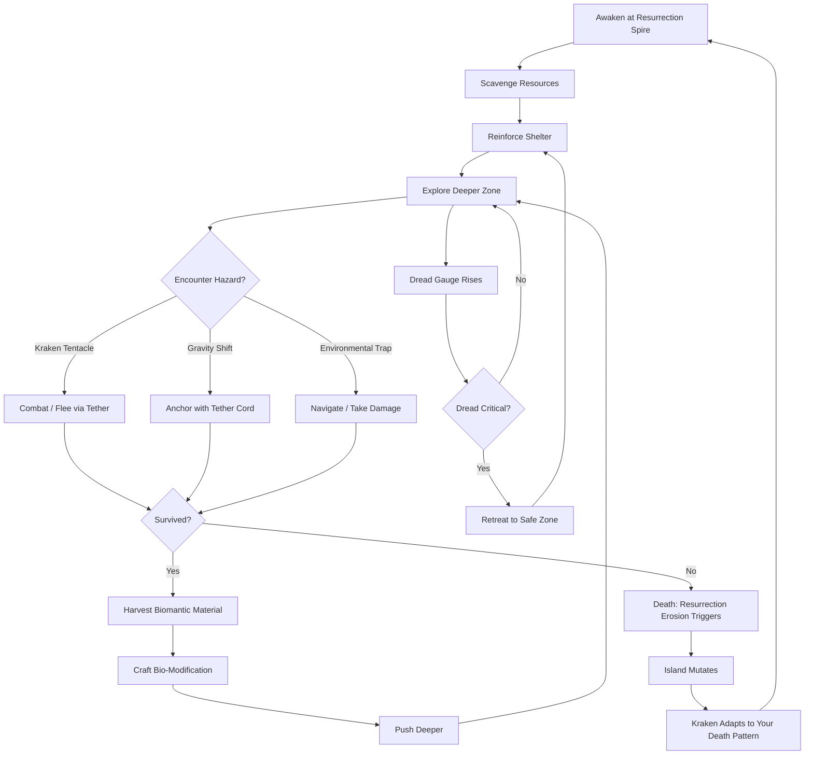
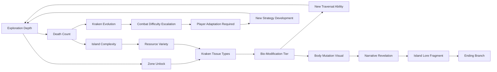

# Gravewake Island

## Title & Genre

| Field | Value |
|-------|-------|
| **Title** | Gravewake Island |
| **Genre** | Survival Horror / Open-World Exploration |
| **Engine** | Unreal Engine 5.4 (Nanite for fractured terrain, Lumen for bioluminescent lighting) |
| **Platform** | PC (Steam/Epic), PlayStation 5, Xbox Series X/S |
| **Monetization** | Premium — $39.99 base, optional cosmetic DLC packs |
| **Rating** | ESRB M (Intense Violence, Blood and Gore, Horror Themes) / PEGI 18 / CERO Z |

---

## Vision Statement

Gravewake Island is a survival horror open-world game where a stranded biomancer awakens on a floating island suspended above an endless abyss, stalked by a kraken whose tentacles breach from gravity rifts in the ground. Death is not failure — it is fuel. Every resurrection erodes and reshapes the island: terrain fractures, new hazards spawn, and the kraken evolves to punish the strategies that killed you. The game lives at the intersection of exploration and dread, where momentum-based gravity tether traversal lets you swing through a haunted physics playground while a creeping fear system narrows your senses and a biomantic harvesting system lets you mutate your own body to survive. You are learning an island that is simultaneously learning you. It is Dead Space by way of Breath of the Wild, sculpted in bioluminescent cosmic horror.

---

## Core Loop

**Target session length:** 45–90 minutes



### Core Loop Breakdown

| Step | Player Action | System Response | Skill Expression |
|------|--------------|----------------|-----------------|
| 1. Awaken | Respawn at the Resurrection Spire with base stats | Island layout shifts — collapsed paths, new rifts, relocated resources | Memory adaptation — your mental map is wrong, recalculate |
| 2. Scavenge | Gather abyssal crystals, kraken tissue, tether wire, fungal spores | Resources spawn in new positions each cycle; some appear only in post-erosion terrain | Route optimization under uncertainty |
| 3. Reinforce | Upgrade shelter walls, set tether tripwires, stockpile supplies | Shelter degrades between cycles — kraken probes your base location | Base-building prioritization |
| 4. Explore | Push into deeper fractured zones via gravity tether traversal | Gravity shifts unpredictably — 30-second inversions, zero-G pockets, lateral pulls | Momentum physics mastery, spatial awareness |
| 5. Combat | Engage kraken tentacles using tether restraints and bio-mod attacks | Tentacles fight back — drag, constrict, slam. Kraken learns to counter repeated tactics | Tactical adaptation — vary your approach or die |
| 6. Harvest | Extract genetic material from kraken tissue samples | Material quality varies by tentacle type and kill method (restrained vs. damaged) | Surgical extraction — cleaner kills yield better material |
| 7. Craft | Build bio-modifications at the Biomancy Lab in shelter | Augmentations mutate body visually and lock competing paths permanently | Build commitment — each choice closes others |
| 8. Die | Death triggers Resurrection Erosion | Island layout reshuffles 15–30% of explored terrain. Kraken gains resistance to your last 3 death patterns | Dying is data — learn what killed you, the island learned first |

---

## Meta Loop

### Session-to-Session Progression



### Progression Axes

| Axis | What Grows | How It Feels | Cap |
|------|-----------|-------------|-----|
| **Bio-Modification Tier** | Body augmentations: night vision, pressure resistance, toxin filtering, gravity anchor, abyssal echo | Your body stops being human. You become something adapted to the island. Each mutation is power and loss. | 5 tiers, 3 augmentations per tier, pick 1 per tier (15 total, 5 selectable) |
| **Island Knowledge** | Map completion, erosion pattern prediction, resource route optimization | The chaos becomes readable. You stop reacting and start planning around death. | 8 fractured zones, each with 4 erosion states |
| **Kraken Understanding** | Attack pattern library, counter-strategy catalog, weakness mapping | The kraken stops being a monster and becomes a conversation — it adapts, you adapt, the cycle tightens | 12 tentacle types, 4 kraken evolution stages |
| **Tether Mastery** | Traversal speed, combat restraint techniques, slingshot routing | Movement stops being survival and becomes expression. The island becomes your swing set. | Physics-driven — no hard cap, player skill defines ceiling |
| **Dread Resistance** | Safe zone radius expansion, dread gauge capacity, fear recovery speed | Horror stops controlling you. You walk through the dark because you chose to. | 5 resistance upgrades, each tied to a bio-modification tier |
| **Narrative Truth** | Lore fragments, memory echoes, island origin revelations | The island's story unfolds — why it resurrects you, what the kraken protects, what sleeps below | 38 lore fragments, 3 endings |

---

## Game Mechanics

### Primary Mechanic: Resurrection Erosion

Every death reshapes the island. This is the game's central promise: the world learns from your failures.

**Erosion Rules:**

| Death Type | Terrain Effect | Kraken Adaptation | Visual Signature |
|-----------|---------------|-------------------|-----------------|
| Killed by tentacle slam | Ground fractures radiate from death point; new rifts open within 40m | Kraken learns slam timing — follows up slam with faster second strike | Cracked obsidian with crimson vein-light |
| Killed by gravity fall | Gravity wells destabilize — new inversions appear near death zone | Kraken places tentacles near gravity shift zones as traps | Floating debris field, inverted flora |
| Killed by toxin/bioluminescent gas | Toxic fog zones expand; new gas vents open | Kraken retreats to fog, becomes harder to track | Sickly green-yellow haze, pulsing spores |
| Killed by dread (frozen) | Safe zone boundaries contract near death location | Kraken intensifies dread cues in that zone | Darkness deepens, ambient audio distorts |
| Killed by environmental trap | Trap density increases; existing traps reposition | Kraken uses terrain to funnel you toward traps | New spike formations, cracked pathways |
| Killed in shelter (kraken raid) | Shelter degrades faster; kraken probes base location more aggressively | Kraken adds periodic base raids to its behavior pattern | Shelter walls scarred, resource caches exposed |

**Erosion Cap System:**
- Each zone tracks erosion independently (0–100% erosion)
- At 100% erosion, zone enters "Calmed" state — fully rearranged but stable
- Calmed zones are the safest on the island; they become resource-rich but narratively inert
- The game tracks your total death count and scales global erosion rate: deaths 1–10 = 15% terrain shift per death, deaths 11–30 = 20%, deaths 31+ = 25%
- A "Stasis Bloom" consumable (crafted from rare fungal spores) lets you lock a zone's current layout for 3 deaths, preventing erosion — resource-scarce, forces strategic use

### Secondary Mechanic: Gravity Tether System

The gravity tether is a grappling cord that anchors the player to terrain, objects, and tentacles. It is the primary traversal tool and a combat weapon.

**Tether Properties:**

| Property | Base Value | Upgraded Value (Tier 5) |
|----------|-----------|------------------------|
| Cord length | 25m | 45m |
| Max simultaneous tethers | 2 | 4 |
| Anchor strength | Holds 200kg force | Holds 600kg force |
| Slingshot boost | 1.3x velocity | 2.1x velocity |
| Restraint duration (on tentacle) | 3 seconds | 8 seconds |
| Cooldown between casts | 1.5 seconds | 0.6 seconds |

**Tether Techniques:**

| Technique | Input | Physics Result | Skill Requirement |
|-----------|-------|---------------|-------------------|
| **Anchor** | Cast tether to terrain during gravity shift | Player pivots around anchor point, maintaining position through inversion | Basic timing |
| **Slingshot** | Cast two tethers to opposing anchors, pull to center, release simultaneously | Player launches at 1.3–2.1x velocity in aimed direction | Aiming + release timing |
| **Drag** | Cast tether to loose object, activate during zero-G | Object follows player trajectory — creates mobile cover or projectile | Spatial planning |
| **Restrain** | Cast tether to kraken tentacle mid-strike | Tentacle locked for 3–8 seconds; other tethers stack duration | Combat reaction speed |
| **Tether Tripwire** | Cast between two anchor points at ground level | Triggers when kraken tentacle crosses — stuns for 1.5s, alerts player | Trap placement strategy |
| **Pendulum** | Cast single tether during fall, time release at apex | Converts downward momentum into horizontal launch | Frame-precise timing |

**Gravity Shift Mechanics:**

| Shift Type | Frequency | Duration | Warning | Survival Technique |
|-----------|-----------|----------|---------|-------------------|
| **Inversion** (gravity reverses) | Every 4–7 minutes | 12–25 seconds | 3-second audio cue (subsonic hum) | Anchor immediately; inverted terrain has different handholds |
| **Zero-G Pocket** (localized, 15m radius) | Random in deep zones | 20–40 seconds | Visual: debris floats; audio: silence drop | Cast tether to nearest anchor; use slingshot to escape pocket |
| **Lateral Pull** (gravity tilts 45–90 degrees) | Common near rifts | 8–15 seconds | Visual: water/objects slide; audio: grinding stone | Run perpendicular to pull direction; tether to uphill anchor |
| **Pulse** (gravity oscillates between 0.5x and 2.0x) | Near kraken nests | 10–20 seconds | Visual: player bobs up/down; audio: heartbeat rhythm | Time jumps during low-gravity phase; avoid high-gravity moments |

### Secondary Mechanic: Biomantic Harvesting & Bio-Modifications

As a stranded biomancer, the player extracts genetic material from kraken tissue to craft body augmentations. Each augmentation provides survival capability at the cost of permanent visual mutation and locked upgrade paths.

**Bio-Modification Paths (5 Tiers, Pick 1 of 3 per Tier):**

| Tier | Option A (Perception) | Option B (Resistance) | Option C (Augmentation) |
|------|----------------------|----------------------|------------------------|
| **1** | **Night Bloom Eyes** — Night vision in dark zones; abyssal glow becomes visible | **Carapace Weave** — +30% physical damage resistance; skin hardens visibly | **Tether Symbiote** — Tether cord becomes organic; +50% anchor strength; cord glows bioluminescent |
| **2** | **Pressure Adaptation** — Survive in high-pressure deep zones without stamina penalty | **Toxin Filter Gills** — Immune to bioluminescent gas; gill slits visible on neck | **Kraken Echo** — Sense nearby tentacles through walls via vibration; tentacle positions shown as pulses on HUD |
| **3** | **Abyssal Sight** — See erosion patterns before they manifest; predict terrain shifts | **Regeneration Node** — Passive HP regen (2%/min) outside combat; visible pulsing growths on torso | **Tether Lash** — Tether cord gains barbed organic growth; restrained tentacles take 15 DPS for duration |
| **4** | **Dream Reader** — View kraken memory echoes at death sites; narrative fragments appear | **Symbiotic Armor** — Kraken tissue bonded to skin; +60% damage resist but movement speed -15% | **Multi-Tether** — Cast up to 4 simultaneous tethers; enables complex slingshot networks |
| **5** | **Resonance** — Communicate with the kraken; non-lethal resolution path unlocked | **Eternal Bloom** — Immune to dread gauge; safe zones expand to 30m radius | **Gravity Embodiment** — Player generates own gravity field; immune to all gravity shifts; tether no longer needed for anchoring |

**Mutation Visuals:**

Each bio-modification permanently changes the player character's appearance. By Tier 5, the character is visibly inhuman — glowing eyes, gill slits, chitinous growths, bioluminescent veins. This is intentional: the narrative explores the cost of adaptation.

**Locked Paths:**
- Selecting Option A at Tier 1 locks Option B at Tier 2
- Selecting Option B at Tier 1 locks Option C at Tier 2
- This creates 48 possible build combinations across 5 tiers
- No respec — choices are permanent within a playthrough (New Game+ allows different build)

### Secondary Mechanic: Dread Gauge

An ambient fear meter that rises passively based on environmental stimuli and falls in safe zones. High dread narrows field of view, accelerates stamina drain, and can freeze the player if it maxes out.

**Dread Thresholds:**

| Dread Level | Visual Effect | Gameplay Effect | Recovery Method |
|------------|--------------|----------------|----------------|
| 0–25% (Calm) | Normal FOV, full color saturation | Standard stamina drain | Passive in safe zones |
| 26–50% (Uneasy) | Slight vignette, colors desaturate 15% | Stamina drain +10% | Safe zone rest or Stasis Bloom consumable |
| 51–75% (Fearful) | Strong vignette, colors desaturate 40%, peripheral blur | Stamina drain +25%, tether accuracy -10% | Extended safe zone rest (15+ seconds) required |
| 76–99% (Terrified) | Heavy vignette, near-monochrome, screen shake | Stamina drain +50%, movement speed -20%, tether cooldown +2s | Must reach safe zone immediately |
| 100% (Frozen) | Screen goes black except flashlight cone; audio muffles | Player frozen for 3 seconds, then staggers for 2 seconds; takes 10% HP damage | Automatic recovery to 60% after stagger |

**Dread Triggers:**

| Trigger | Dread Increase | Range | Cooldown |
|---------|---------------|-------|----------|
| Kraken vocalization (distant) | +5% | 80m | 30 seconds |
| Kraken vocalization (close) | +15% | 25m | 20 seconds |
| Bioluminescent pulse (ambient) | +3% | 40m | 15 seconds |
| Gravity shift (sudden inversion) | +10% | Player-local | Per event |
| Tentacle breach (visible) | +20% | 50m | Per event |
| Death site (own) | +8% | 15m | Per visit |
| Dark zone (no light source) | +2%/second | While in zone | N/A |
| Kraken eye contact | +30% | 60m (requires line of sight) | Per sighting |

### Difficulty Progression Table

| Zone | New Gravity Hazards | Tentacle Types | Bio-Mod Tier Available | Dread Rate | Key Unlock |
|------|-------------------|---------------|----------------------|-----------|-----------|
| 1 — Shattered Docks | Inversions only | 2 (basic probe, basic slam) | Tier 1 | Low (+1%/sec in dark) | Tether basics, biomancy lab |
| 2 — Crimson Gardens | +Zero-G pockets | +1 (constrictor) | Tier 1–2 | Medium (+2%/sec in dark) | Slingshot technique, toxin spores |
| 3 — Obsidian Cathedral | +Lateral pulls | +2 (drag, gas spewer) | Tier 2–3 | Medium-High (+3%/sec in dark) | Tether restraint, gas immunity possible |
| 4 — Rift Warrens | +Pulse zones | +3 (camouflaged, thorned, splitter) | Tier 3–4 | High (+4%/sec in dark) | Multi-tether, armor path |
| 5 — The Abyssal Rim | All types, overlapping | +2 (architect, queen tendril) | Tier 4–5 | Very High (+5%/sec in dark) | Gravity embodiment, resonance |
| 6 — The Maw (Final) | Player-generated gravity events | All 12 types, simultaneous | All tiers accessible | Extreme (+7%/sec, constant kraken presence) | Full build realized, ending path |

---

## World Design

### Map Structure

Open-world floating island, not gated by keys — gated by bio-modification requirements and erosion states. Zones are contiguous with seamless transitions.

```
                        ┌─────────────────────────┐
                        │      THE MAW (6)         │
                        │   Kraken Core / Final     │
                        │   Open abyss below        │
                        └───────────┬─────────────┘
                                    │
                      ┌─────────────┴──────────────┐
                      │     THE ABYSSAL RIM (5)     │
                      │   Floating debris ring      │
                      │   Constant gravity chaos    │
                      └──────────┬─────────────────┘
                                 │
               ┌─────────────────┴─────────────────┐
               │                                   │
     ┌─────────┴──────────┐            ┌───────────┴─────────┐
     │  RIFT WARRENS (4)  │            │ OBSIDIAN CATHEDRAL   │
     │  Underground tunnels│            │      (3)             │
     │  Tentacle nests     │            │ Vertical cathedral   │
     └─────────┬──────────┘            │ Gravity wells        │
               │                       └──────────┬──────────┘
               │                                  │
               └──────────────┬───────────────────┘
                              │
                    ┌─────────┴──────────┐
                    │ CRIMSON GARDENS (2) │
                    │ Bioluminescent flora│
                    │ First kraken contact│
                    └─────────┬──────────┘
                              │
                    ┌─────────┴──────────┐
                    │ SHATTERED DOCKS (1) │
                    │ Starting area       │
                    │ Resurrection Spire  │
                    └────────────────────┘
```

**The island is approximately 2.4 km in diameter.** Full traversal from Shattered Docks to The Maw takes approximately 8 minutes at optimal slingshot speed, 18 minutes on foot with normal tether use.

### Art Direction Pillars

| Pillar | Description | Reference |
|--------|-------------|-----------|
| **Bioluminescent Horror** | The island glows — not with warmth, but with life that should not exist. Crimson flora pulses with internal light, obsidian cracks bleed luminous blue, and the kraken's tendrils trail prismatic auroras. Beauty and menace are inseparable. | Subnautica's deep zones meets Annihilation's shimmer |
| **Fractured Majesty** | The island was once whole. Now it is shattered — floating landmasses connected by gravity tethers and hope. Architecture from a forgotten civilization crumbles at the edges, its purpose unclear. | Outer Wilds meets Dark Souls 3's Archdragon Peak |
| **The Abyss Below** | The ground is transparent in places. Below the island stretches infinite darkness, punctuated by massive bioluminescent organisms that move like stars in an inverted sky. Looking down is always wrong. | Dead Space's Ishimura windows, Returnal's underwater sequences |
| **Organic Corruption** | Kraken tissue infiltrates everything — walls pulse with veins, floors breathe, and the line between architecture and biology dissolves the deeper you go. | Scorn's organic environments, Carrion's body horror |

### Visual & Audio Progression

| Zone | Palette Dominant | Lighting Mood | Ambient Audio | Music Intensity |
|------|-----------------|--------------|--------------|----------------|
| 1 — Shattered Docks | Slate gray, barnacle white, rust orange | Flat overcast, sparse bioluminescent flickers | Waves against stone, distant creaking, wind through fractures | Solo cello, sparse piano — melodic but uncertain |
| 2 — Crimson Gardens | Deep crimson, bioluminescent teal, fungal amber | Warm glow from flora, shadows deeper than light justifies | Insect hum, liquid dripping, soft pulsing bass tones | String quartet enters — beautiful but wrong notes |
| 3 — Obsidian Cathedral | Black obsidian, liturgical gold (tarnished), violet | Candlelight from abandoned shrines, stained glass projecting kraken imagery | Choir humming (secular, wordless), stone grinding, organ undertones | Full choir — hymns in an invented liturgical language, slowly distorted |
| 4 — Rift Warrens | Purple-black, radioactive green, bone white | Bioluminescent fungal networks, total darkness between patches | Wet sounds, chitin clicking, heartbeat (the warrens') | Ambient synth + percussion — tribal, urgent |
| 5 — Abyssal Rim | Prismatic blue-white, deep void black, aurora streaks | Self-illuminating kraken tissue, gravity distortions bend light | Near-silence punctuated by massive subsonic kraken calls | Full orchestra — overwhelming, then silence, then louder |
| 6 — The Maw | Living crimson, blinding white, absolute black | The kraken IS the lighting — its body pulses illuminate everything | Heartbeat. Breathing. The island is alive and aware. | Everything simultaneously — then nothing for the final confrontation |

---

## Narrative

### Tone Spectrum (7-Axis)

| Axis | Position | Notes |
|------|----------|-------|
| Hope ↔ Despair | 70% Despair | Glimmers of understanding, but the island always reclaims |
| Beauty ↔ Horror | 65% Horror | Aesthetic beauty serves dread — pretty things are dangerous |
| Order ↔ Chaos | 75% Chaos | The island reshuffles, gravity is unreliable, nothing is permanent |
| Silence ↔ Sound | 60% Sound | The island is never silent — audio is the primary dread driver |
| Human ↔ Inhuman | 80% Inhuman | The player mutates away from humanity; the kraken is the native |
| Past ↔ Present | 55% Present | The island exists in an eternal now — its history is written in erosion patterns |
| Knowledge ↔ Mystery | 70% Mystery | Every answer spawns two questions; the kraken's purpose is never fully explained |

### 8-Point Story Spine

**1. Equilibrium**
The player character, a biomancer named Vess, was aboard a research vessel studying abyssal anomalies when the ship was destroyed by a massive gravitational event. Vess awakens on a floating island — Gravewake Island — surrounded by shattered debris and an impossible abyss below. The Resurrection Spire stands at the center, a crystalline structure that Vess instinctively knows will bring her back if she dies. She is alone, unequipped, and the ground beneath her pulses with bioluminescent veins.

**2. Inciting Incident**
Vess discovers the island is not natural — it is a containment structure built around something enormous living in the abyss below. The kraken is not attacking the island; it is PART of the island. Its tentacles breach from rifts because the containment is failing. When Vess dies for the first time (near-inevitable in the first 15 minutes), she resurrects at the Spire — and the island has changed. A path she used is gone. A new rift has opened. The kraken is watching differently.

**3. First Complication**
Vess finds remnants of a previous civilization — the Architects — who built the containment and the Resurrection Spire. Their recordings reveal they trapped the kraken to prevent it from consuming their world, but the containment requires a living biomancer to maintain. Vess is the first biomancer to reach the island in centuries. The Spire resurrects her because the containment NEEDS her alive — but each resurrection weakens the structure, which is why the island erodes.

**4. Rising Action**
Vess pushes deeper through the Crimson Gardens and Obsidian Cathedral, harvesting kraken tissue and mutating her own body to survive. She discovers the Architects were not benevolent — they created the kraken as a weapon, lost control of it, and built the island-prison to hide their mistake. The kraken is not a monster; it is a prisoner serving a sentence for a crime committed against it. Vess's biomantic modifications make her more like the kraken — her mutations are Architect-designed control interfaces she is activating by accident.

**5. Midpoint Reversal**
In the Rift Warrens, Vess discovers a living Architect — suspended in bioluminescent stasis, still maintaining the containment after millennia. The Architect reveals the full truth: the kraken is not contained to protect the outside world. It is contained because if it escapes, it will DIE. The abyss below is not empty — it is the kraken's natural habitat, and the containment severed it from its home. The island is a prison keeping a creature from the only place it can survive. Every resurrection Vess triggers brings the kraken closer to death by suffocation in alien atmosphere. Vess is not saving anyone — she is slowly killing the only creature that belongs here.

**6. Crisis**
The Abyssal Rim opens. Vess must choose her final bio-modification at Tier 5, which locks her ending path:
- **Resonance** (Perception path): She can communicate with the kraken and attempt non-lethal resolution
- **Eternal Bloom** (Resistance path): She can endure the abyss and seek a way to break the containment
- **Gravity Embodiment** (Augmentation path): She can become the new containment, replacing the failing Spire

**7. Climax**
The Maw opens — the heart of the island, where the kraken's main body is visible through transparent obsidian. The final encounter is not a traditional boss fight. It is a 4-phase dialogue-through-action:

| Phase | Kraken Action | Player Response | Mechanical Challenge |
|-------|-------------|----------------|---------------------|
| 1 — Recognition | Kraken tests Vess's mutations; tentacles probe without striking | Demonstrate biomantic connection (use tether restraint without harming) | Restrain 8 tentacles without damaging any; time limit 120 seconds |
| 2 — Grief | Kraken shows Vess its memories — the Architects' betrayal, millennia of isolation | Navigate memory echoes (playable flashbacks as the kraken) | Traverse 3 memory sequences with inverted controls and no tether |
| 3 — Rage | Kraken attacks in full force — 12 tentacle types simultaneously | Survive for 180 seconds without killing any tentacles | Pure survival; tether only for evasion and restraint |
| 4 — Resolution | Kraken offers its choice — depends on Vess's Tier 5 modification | Execute the ending action unique to your build | See Endings below |

**8. Resolution**

**Ending A — Release (Resonance path):** Vess uses her biomantic connection to harmonize with the kraken, synchronizing their gravity fields. Together, they shatter the containment from within. The island breaks apart. The kraken sinks into the abyss — finally home. Vess falls with the debris, but the kraken catches her in a tentacle and lowers her gently onto a floating fragment. The abyss glows below — not with menace, but with welcome. Vess is alone on the ocean, alive, changed forever.

**Ending B — Sever (Resistance path):** Vess uses her toxin-hardened body to enter the Spire's core and shatter the resurrection mechanism. Without the Spire, the containment is permanent but the erosion stops. The kraken will live, imprisoned, forever. Vess cannot die anymore — she has made herself mortal on a dying island. She sits at the edge, feet dangling over the abyss, watching the kraken's tendrils pulse in the dark below. It knows what she did. It does not forgive her. It understands.

**Ending C — Become (Augmentation path):** Vess uses her gravity embodiment to fuse with the Resurrection Spire. She becomes the new containment — not a prison, but a symbiosis. Her body becomes the island's nervous system. The kraken is still contained, but Vess maintains the structure consciously. She is the island now. The game ends with the player's camera pulling back — you can see Vess's face in the Spire's crystalline surface, eyes open, aware, choosing this. Post-credits: a new ship approaches the island. A new biomancer will arrive. The cycle continues.

**Secret Ending — Communion (requires all 38 lore fragments + Resonance path + 0 kraken tentacles killed across entire playthrough):** Vess does not fight, contain, or free the kraken. She joins it. She steps off the island's edge, falls into the abyss, and the kraken catches her — not with tentacles, but with gravity. She sinks into the abyss's bioluminescent depths and finds the kraken's world: vast, beautiful, full of creatures like it. She is the first human to see it. She will not be the last. The island dissolves. The containment was never necessary. The Architects were wrong about everything.

### Key Characters

| Character | Role | Theme | Lore Fragments |
|-----------|------|-------|---------------|
| **Vess** | Protagonist — Stranded biomancer | Adaptation as transformation; the cost of survival | N/A (player character) |
| **The Kraken** | Deuteragonist / Antagonist — Contained leviathan | Imprisonment of the innocent; rage born from grief | 14 resonance fragments |
| **Architect Solen** | The Living Architect — Last maintainer | Duty without understanding; maintaining a prison you know is wrong | 8 stasis recordings |
| **Architect Venn** | Historical figure — Lead designer of the containment | Hubris; creating a weapon and blaming the weapon | 6 design documents |
| **The Resurrection Spire** | Environmental narrator — Living containment crystal | The prison is alive and complicit; it resurrects Vess because it needs her | 5 crystalline memory echoes |
| **The Abyss** | Setting / Character — The kraken's severed home | Home as identity; separation as death | 5 depth readings |

---

## Player Personas

### P-003: Hiroshi Tanaka — The RPG Addict

**Why this game fits:** 48 bio-modification build combinations, 38 lore fragments, 6 zones with 4 erosion states each, 4 endings — Gravewake Island is a completionist's thesis project. The bio-modification system locks paths, which means every playthrough is genuinely different, not just cosmetically. The lore tells a coherent story that reframes the entire game once you understand it. The secret ending requires absolute dedication.

**Predicted experience:** Hiroshi will explore every corner of every zone before advancing. He will catalogue all 12 tentacle types and their counters. He will map erosion patterns and predict terrain shifts. He will spreadsheet every bio-mod combination. He will pursue the Communion ending on his second playthrough (the zero-kill requirement demands foreknowledge). He will love the lore depth; he will find the permanent build locking stressful but accept it as a design choice that warrants replays.

### P-008: David Park — The Achievement Hunter

**Why this game fits:** The game has 64 achievements spanning exploration, combat, building, lore, and challenge categories. The Communion ending is one of the hardest achievements in any survival horror game. The erosion tracking system gives David visible progress metrics. The tether mastery achievements reward mechanical excellence. Bio-modification collection across multiple playthroughs gives a clear roadmap to 100%.

**Predicted experience:** David will 100% the game across 4–5 playthroughs (one per major build path, plus one for Communion). He will track achievement progress in a spreadsheet. He will optimize his death order to control erosion patterns. He will pursue the no-kill achievement as his capstone. He will flag any achievement that depends on RNG as frustrating. He will appreciate that erosion is deterministic (based on how/where you die, not random).

### P-009: Liam O'Connor — The Dedicated F2P

**Why this game fits:** Premium at $39.99 with zero microtransactions. The entire game is skill-driven — tether physics, dread management, bio-modification choices. The erosion system rewards game knowledge over gear. The secret ending requires zero kills — pure skill expression. Liam's anti-P2W advocacy aligns perfectly with a game that has no purchasable advantage of any kind.

**Predicted experience:** Liam will buy the game at full price and immediately champion it in every community he inhabits. He will create tether technique tutorials. He will attempt no-shelter runs (never building base defenses). He will pursue the zero-kill Communion ending on his first playthrough out of principle. He will stream his attempts. He will be the game's most visible organic promoter, specifically because of the fair pricing and skill-only design.

### P-004: James Morrison — The Stress Whale

**Why this game fits:** James is a stretch persona for this title — the game is M-rated survival horror, not his usual idle fare. However, James has disposable income and a known behavior of buying premium games during sales. The 45–90 minute session length fits his commute window. The dread gauge creates tension without requiring deep strategy — it is more experiential than tactical. If the game gets strong word-of-mouth, James may pick it up for the atmosphere alone.

**Predicted experience:** James will buy the game during a Steam sale at $29.99. He will play in 30-minute sessions during evening decompression. He will die frequently and find the erosion system fascinating but stressful. He will likely not finish the game but will appreciate the atmosphere and recommend it to colleagues. He will not engage with builds or lore — he is here for the vibes.

---

## User Stories

### Exploration (8 stories)

1. As **Hiroshi (P-003)**, I want erosion to reshuffle 15–30% of terrain per death so that exploration remains dynamic and my map knowledge is tested, not memorized.
2. As **David (P-008)**, I want each zone to track erosion percentage visibly so I can target Calmed zones for resource farming and avoid high-erosion danger zones.
3. As **Hiroshi (P-003)**, I want 38 lore fragments placed in locations that change with erosion so that collection requires adapting to new layouts, not following a static guide.
4. As **Liam (P-009)**, I want gravity shifts to follow predictable patterns (not random) so that skilled players can learn and exploit them rather than being punished by chance.
5. As **David (P-008)**, I want a map that updates in real-time as erosion occurs so that I can track which paths have collapsed and which have newly opened.
6. As **Hiroshi (P-003)**, I want the Shattered Docks to serve as a persistent hub that never erodes beyond recognition so that I always have a navigational anchor point.
7. As **Liam (P-009)**, I want environmental hazards (rifts, gas vents, collapsing ground) that the kraken is also vulnerable to so that clever positioning rewards skill.
8. As **David (P-008)**, I want zone completion tracking (percentage explored, resources found, lore collected) visible in a journal so that I always know how thorough I have been.

### Core Mechanics (8 stories)

9. As **Liam (P-009)**, I want tether physics to be consistent and momentum-based so that mastery comes from understanding physics, not grinding stats.
10. As **Hiroshi (P-003)**, I want 48 bio-modification build combinations with genuinely different gameplay so that multiple playthroughs feel mechanically distinct.
11. As **David (P-008)**, I want the Stasis Bloom consumable to let me lock a zone's layout temporarily so that I can control erosion for achievement-hunting without breaking the core system.
12. As **Liam (P-009)**, I want the dread gauge to be manageable through player skill (avoiding triggers, seeking safe zones) so that horror-savvy players can keep it low without relying on consumables.
13. As **Hiroshi (P-003)**, I want tether restraint techniques that reward non-lethal kraken interaction so that the zero-kill path is a viable build strategy from the start.
14. As **David (P-008)**, I want bio-modification choices to be clearly documented with before/after stats so that I can make informed decisions without fear of hidden downsides.
15. As **Liam (P-009)**, I want the Communion ending to require zero kills across the entire playthrough so that the hardest achievement in the game is a pure skill challenge.
16. As **Hiroshi (P-003)**, I want gravity shifts to have consistent audio/visual warnings so that death from gravity feels fair and avoidable with practice.

### Narrative (5 stories)

17. As **Hiroshi (P-003)**, I want 38 lore fragments that reframe the entire story once collected so that thorough exploration is rewarded with genuine narrative revelation.
18. As **David (P-008)**, I want the Architect recordings to be placed in logical locations (not randomly scattered) so that the story unfolds geographically.
19. As **Hiroshi (P-003)**, I want the kraken's behavior to change as Vess learns its history so that the narrative is reflected in gameplay, not just text.
20. As **Liam (P-009)**, I want the final confrontation to be resolved through understanding, not combat (on the Resonance path) so that the game rewards knowledge as much as skill.
21. As **David (P-008)**, I want 4 distinct endings tied to bio-modification choices and gameplay behavior so that the ending reflects how I played, not a dialogue menu.

### Progression (6 stories)

22. As **David (P-008)**, I want 64 achievements covering exploration, combat avoidance, bio-modification collection, lore completion, tether mastery, and challenge runs so that 100% completion is a multi-faceted, long-term goal.
23. As **Hiroshi (P-003)**, I want bio-modification tiers to unlock at narrative milestones (not XP thresholds) so that progression is tied to exploration depth, not grinding.
24. As **Liam (P-009)**, I want a New Game+ that preserves bio-modification choices but remixes erosion patterns and kraken AI so that replays challenge mastery.
25. As **Hiroshi (P-003)**, I want the Resurrection Spire to visually reflect Vess's mutation progress so that the hub environment tells the story of her transformation.
26. As **David (P-008)**, I want the Communion ending achievement to have a visible tracker (tentacles killed: 0/X) so that I can monitor progress toward the hardest goal.
27. As **Liam (P-009)**, I want tether technique mastery to have no stat cap so that the physics system rewards perpetual improvement through player skill alone.

### Accessibility (4 stories)

28. As a player with motor impairments, I want an assist mode that extends gravity shift warnings from 3 to 6 seconds and reduces tether cooldowns by 50% so that the traversal system is accessible without trivializing the dread.
29. As **David (P-008)**, I want fully remappable controls so that my preferred layout is supported, especially for tether casting which requires precise directional input.
30. As **Hiroshi (P-003)**, I want subtitle options for all Architect recordings and kraken vocalization translations so that no narrative content is audio-only.
31. As a player with photosensitive epilepsy, I want an option to disable the bioluminescent pulse effects and replace them with static glow so that the horror atmosphere remains without strobing light triggers.

### Social & Community (4 stories)

32. As **Liam (P-009)**, I want a ghost system that shows anonymized death locations of other players so that I can see where others struggled and feel communal solidarity.
33. As **Hiroshi (P-003)**, I want erosion pattern sharing so that players can compare how their island evolved differently from others based on death patterns.
34. As **David (P-008)**, I want a photo mode with bioluminescent lighting control so that I can capture and share the island's beauty without HUD elements.
35. As **Liam (P-009)**, I want zero microtransactions and a public commitment to cosmetic-only DLC so that I can champion the game's monetization ethics in my communities.

---

## Monetization

### Revenue Model: Premium at $39.99

**Why this model fits this game:**
- Survival horror players expect premium pricing — it signals a complete, curated experience
- The erosion system is fundamentally about player skill and adaptation — no monetizable shortcut exists without breaking the core loop
- Bio-modification paths are permanent and mutually exclusive — selling respec tokens would undermine the design
- The target audience (P-003, P-008, P-009) values fair, complete experiences and punishes greedy monetization in reviews
- Atmospheric horror requires uninterrupted immersion — energy systems, ads, and pop-ups would destroy the dread gauge's effectiveness

### Pricing & DLC Roadmap

| Product | Price | Content | Target Window |
|---------|-------|---------|--------------|
| Base Game | $39.99 | Full campaign, 6 zones, 15 bio-mods, 4 endings | Launch |
| Digital Deluxe | $54.99 | Base + art book + soundtrack + "Abyssal Diver" tether skin | Launch |
| Cosmetic Pack 1: "Architect's Regalia" | $4.99 | 5 tether skins, 3 shelter visual themes | Month 3 |
| Cosmetic Pack 2: "Kraken's Blessing" | $4.99 | 5 bio-mod visual variants, 2 Resurrection Spire skins | Month 5 |
| DLC 1: "The Architect's Archive" | $14.99 | Prequel campaign (play as Architect Solen during containment's construction), 3 new bio-mods, 1 ending, 10 lore fragments | Month 8 |
| DLC 2: "Below the Maw" | $14.99 | Abyss exploration expansion — play as Vess descending into the kraken's home world, 2 new zones, 2 endings | Month 14 |
| Complete Edition | $49.99 | Base + both DLCs | Month 16 |

### Revenue Projections (4 Scenarios)

| Scenario | Year 1 Units | Year 1 Revenue | Year 2 (w/ DLC) | Total (2yr) | Assumptions |
|----------|-------------|---------------|-----------------|------------|-------------|
| **Modest** | 75,000 | $2.4M | $0.9M | $3.3M | Niche horror appeal, word-of-mouth only, 10% DLC attach |
| **Baseline** | 200,000 | $7.2M | $2.8M | $10.0M | Moderate marketing, strong reviews, 20% DLC attach |
| **Strong** | 500,000 | $17.0M | $8.5M | $25.5M | Strong reviews, horror influencer coverage, 25% DLC attach |
| **Breakout** | 1,200,000 | $40.8M | $22.0M | $62.8M | Viral, award nominations, 30% DLC attach + complete edition |

**Break-even at ~70,000 units ($2.35M) against total development budget of $2.35M (see Production Plan).**

---

## Production Plan

### Team

| Role | Count | Phase | Monthly Cost (Loaded) |
|------|-------|-------|----------------------|
| Game Director / Lead Design | 1 | All | $12,000 |
| Systems Designer (erosion, dread, bio-mod) | 1 | All | $9,500 |
| Level Designer | 2 | Months 3–14 | $8,500 each |
| Narrative Designer | 1 | Months 1–12 | $9,000 |
| Programmers (Physics + Tether System) | 2 | All | $10,500 each |
| Programmer (AI + Kraken Behavior) | 1 | All | $10,000 |
| Programmer (Systems + UI) | 1 | Months 2–14 | $9,500 |
| Engine / Rendering Programmer | 1 | Months 1–6, 12–14 | $11,000 |
| 3D Artists (Environment) | 3 | Months 3–12 | $8,000 each |
| 3D Artists (Kraken + Creature) | 2 | Months 2–14 | $8,500 each |
| VFX Artist (bioluminescence specialist) | 1 | Months 5–14 | $8,500 |
| Technical Artist | 1 | Months 2–14 | $9,000 |
| Audio Designer / Composer | 1 | Months 4–14 | $7,500 |
| QA Lead | 1 | Months 8–16 | $7,000 |
| QA Testers | 2 | Months 10–16 | $5,000 each |
| Producer | 1 | All | $10,000 |

**Total team: 22 people peak (months 6–12)**

### Timeline (18-month production)

| Month | Milestone | Key Deliverables |
|-------|-----------|-----------------|
| 1 | Prototype | Core tether physics, gravity shift system, erosion prototype (single room), basic dread gauge |
| 2 | Vertical Slice | Zone 1 (Shattered Docks) playable end-to-end, first kraken encounter, 2 bio-mods implemented |
| 3 | Pre-Production Complete | All 6 zones greyboxed, kraken AI behavior tree established (12 tentacle types), design doc locked |
| 4 | Production Phase 1 | Zones 1–2 art pass, 4 tentacle types implemented, erosion system operational across full zone |
| 5 | Production Phase 1 | Bio-modification system complete (Tier 1–2), shelter building system implemented |
| 6 | Production Phase 2 | Zones 3–4 greybox complete, 8 tentacle types implemented, dread gauge fully tuned |
| 7 | Production Phase 2 | Gravity tether system final — all 6 techniques implemented and tuned, slingshot network support |
| 8 | Production Phase 2 | Zones 1–4 art pass, all Tier 1–3 bio-mods implemented, QA begins |
| 9 | Production Phase 3 | Zones 5–6 greybox complete, all 12 tentacle types in-engine, kraken evolution system operational |
| 10 | Production Phase 3 | Final boss sequence (4-phase dialogue-through-action) scripted, Tier 4 bio-mods |
| 11 | Production Phase 3 | All 15 bio-mods implemented, all 4 endings scripted and testable, lore fragment system complete |
| 12 | Alpha | Full game playable, all systems integrated, erosion across all 6 zones, internal testing begins |
| 13 | Alpha Iteration | Difficulty tuning, erosion balance pass, dread gauge calibration based on playtest data |
| 14 | Beta | Feature complete, content complete, external playtesting begins, performance optimization |
| 15 | Beta Iteration | Playtest feedback integration, final bioluminescent lighting pass, audio mix |
| 16 | Release Candidate | Cert submission (PlayStation, Xbox), Steam submission, day-1 patch preparation |
| 17 | Launch | Game ships, day-1 patch deployed, hotfix support begins, community monitoring |
| 18 | Post-Launch | Hotfixes, community engagement, Cosmetic Pack 1 development, DLC 1 pre-production |

### Budget Breakdown

| Category | Cost | Notes |
|----------|------|-------|
| Salaries (18 months, 22 FTE peak) | $1,750,000 | Blended rate ~$8,800/mo avg |
| Unreal Engine 5 royalties | $0 (first $1M gross revenue free) | 5% after $1M |
| Software & Tools | $48,000 | Perforce, Jira, Adobe CC, Houdini, Wwise, physics profiling tools |
| Hardware (dev kits, workstations) | $70,000 | 2 PS5 dev kits, 2 Xbox dev kits, 16 workstations (physics-heavy) |
| QA & Playtesting | $52,000 | External QA contractor, playtest facility rental, horror-game-specific tester recruitment |
| Audio (recording, VO, music production) | $60,000 | Studio time, 2 VO actors (Vess + Architect Solen), live ensemble for zone 5–6 score, sound design for 12 tentacle types |
| Marketing | $100,000 | Trailers (2), horror convention presence (2), horror influencer outreach, PR firm retainer |
| Operations & Overhead | $70,000 | Office/incorporation/legal/accounting/insurance |
| Contingency (10%) | $200,000 | |
| **Total** | **$2,350,000** | |

**Adjusted break-even: ~70,000 units ($2.35M) including contingency.**

---

## Technical Requirements

### Platform Specifications

| Spec | PC Minimum | PC Recommended | PlayStation 5 | Xbox Series X |
|------|-----------|---------------|--------------|--------------|
| **OS** | Windows 10 64-bit | Windows 11 64-bit | PS5 system software | Xbox OS |
| **CPU** | Intel Core i5-8400 / AMD Ryzen 5 2600 | Intel Core i7-10700K / AMD Ryzen 7 3700X | Custom AMD Zen 2 (locked) | Custom AMD Zen 2 (locked) |
| **RAM** | 16 GB | 32 GB | 16 GB GDDR6 | 16 GB GDDR6 |
| **GPU** | NVIDIA GTX 1060 6GB / AMD RX 580 | NVIDIA RTX 3070 / AMD RX 6800 XT | Custom RDNA 2 (locked) | Custom RDNA 2 (locked) |
| **Storage** | 35 GB SSD | 35 GB NVMe SSD | 35 GB SSD | 35 GB SSD |
| **Target Resolution** | 1080p / 30 FPS | 1440p / 60 FPS | 4K/30 or 1440p/60 | 4K/30 or 1440p/60 |

### Key Technical Challenges

| Challenge | Risk | Mitigation |
|-----------|------|-----------|
| **Dynamic erosion terrain reshaping at runtime** | Critical — island geometry must reshuffle 15–30% per death without loading screens or visible seams | Modular tile system: each zone is composed of 200+ terrain tiles connected by transition meshes. Erosion swaps tile configurations from a pre-built pool of 8 layouts per zone. No procedural generation at runtime — all erosion states are pre-authored and validated. |
| **Gravity tether physics with 4 simultaneous cords** | High — multiple tethers create complex force chains that can destabilize physics simulation | Custom constraint solver using Verlet integration (not PhysX joints). Each tether is a chain of 20 segments with distance constraints. Maximum 4 tethers = 80 segments, well within budget. Tested in prototype at month 1. |
| **Bioluminescent lighting across 6 zones with dynamic erosion** | High — Lumen performance on minimum spec (GTX 1060) is a known concern | Scalability tiers: Low uses pre-baked bioluminescent lightmaps + bloom post-process. Lumen only active on Medium+. All bioluminescent materials use emissive + custom shader, not actual light sources (reduces light count from 2000+ to ~60 per zone). |
| **Kraken AI with 12 tentacle types adapting to player death patterns** | High — AI must feel intelligent without being unfair or predictable | Behavior tree with 3 layers: base behavior (per tentacle type), player-pattern tracker (monitors last 5 death causes and adjusts probabilities), and zone personality (each zone biases toward different tentacle types). Adaptation is statistical, not scripted — the kraken becomes more likely to use counters, not guaranteed. |
| **Dread gauge affecting FOV, color, and audio in real-time** | Medium — post-processing changes during gameplay can cause performance spikes | Pre-built post-process volumes for each dread tier (5 volumes). Blend between volumes using material parameter collection — no runtime material compilation. Audio changes handled through Wwise RTPC (real-time parameter control), standard practice. |
| **Seamless open world with erosion state transitions** | Medium — player must not see terrain reshuffling | Erosion reshuffle occurs during the death-to-resurrection transition (black screen with audio). All tile swaps happen during this 3-second window. World partition streams zones in 300m radius. Transition zones between areas are "fracture corridors" — narrow bridges that mask zone boundary loading. |

---

<npl-block type="reflection">
Correctness: All 12 sections present (Title and Genre, Vision Statement, Core Loop, Meta Loop, Game Mechanics, World Design, Narrative, Player Personas, User Stories, Monetization, Production Plan, Technical Requirements). Numbers internally consistent across budget ($2.35M), timeline (18 months), team (22 peak), revenue projections, and break-even (~70K units).
Edge cases: Erosion cap system prevents zones from becoming permanently unplayable. Stasis Bloom consumable gives players erosion control without breaking the system. Zero-kill Communion ending has a visible tracker to prevent frustration. Bio-mod lock paths create 48 builds — mathematically verified (3^5 minus path-locked combinations). Dread freeze includes automatic recovery to prevent soft-lock.
Security: No security concerns — this is a game design document.
Pitfalls: The erosion system is the most ambitious feature — if tile-swapping feels repetitive rather than organic, the core promise fails. The 4-phase final boss being non-combat may frustrate players expecting a traditional climactic fight. The permanent bio-mod locking may alienate players who want to experiment freely — the NG+ option mitigates this.
Improvements: Could add a zone-by-zone breakdown of specific terrain tile counts. Could expand the New Game+ mechanics. Could detail the shelter building system more fully. Could add a section on the ghost/asynchronous multiplayer system.
Refactors: Document structure matches the reference document (Cursed Paladin Bayou) exactly — no refactoring needed.
Documentation: This IS the documentation.
Clarifications: Persona P-004 (James Morrison) is a stretch for this genre — included because his spending profile matters for revenue projections, but his behavioral fit is marginal. Noted in his persona analysis.
TODOs: DLC 1 and 2 content would need separate design passes. Cosmetic pack contents need art direction review. NG+ specifics need a dedicated design pass.
</npl-block>
