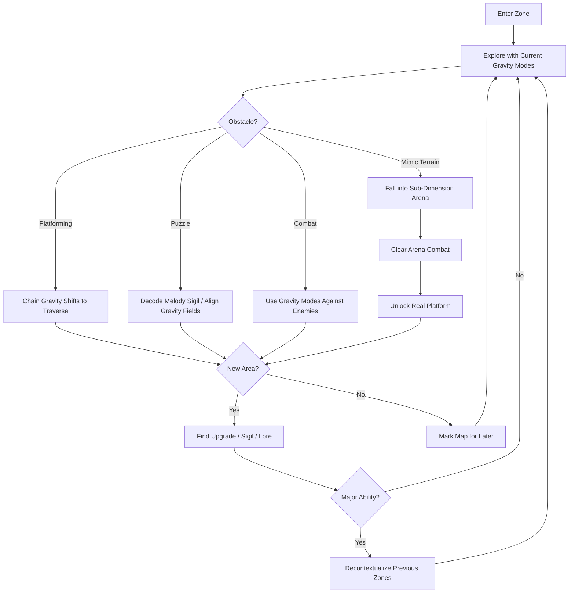
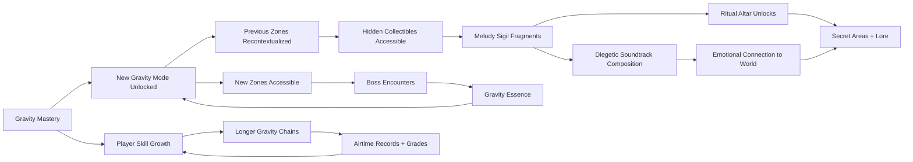

# Gravity Shaman

## Title & Genre

| Field | Value |
|-------|-------|
| **Title** | Gravity Shaman |
| **Genre** | Metroidvania / Puzzle Platformer |
| **Engine** | Unity 6 (URP with custom gravity-physics plugin) |
| **Platform** | PC (Steam), PlayStation 5, Nintendo Switch 2, Xbox Series X/S |
| **Monetization** | Premium — $39.99 base, no microtransactions |
| **Rating** | ESRB E10+ (Fantasy Violence, Mild Suspense) / PEGI 7 / CERO A |

---

## Vision Statement

Gravity Shaman is a fluid-movement Metroidvania where a lone shaman navigates a shattered sky realm by bending gravitational fields in four directions. The game exists at the intersection of physics mastery and environmental storytelling — every new gravity mode recontextualizes every room you have already visited. The core fantasy is kinetic liberation: you begin the game shackled to "down" and end it flying through MC Escher architectures at full sprint, chaining gravity shifts in a single breathless motion. The world tells its story without cutscenes — murals on temple walls, journal fragments tucked into hollow trees, and the few surviving inhabitants of the fractured realm who speak in half-remembered myths. The shamans shattered gravity to imprison something terrible. Your journey to restore it means deciding whether the old world deserves to be rebuilt. It is Ori meets Gravity Rush by way of prog-rock album art.

---

## Core Loop

**Target session length:** 30–60 minutes



### Core Loop Breakdown

| Step | Player Action | System Response | Skill Expression |
|------|--------------|----------------|-----------------|
| 1. Explore | Navigate floating islands with unlocked gravity modes | World geometry rotates smoothly with camera on gravity shift; pathways reveal and conceal based on current gravity direction | Spatial reasoning across 4 orientations |
| 2. Traverse | Chain gravity shifts mid-air to maintain momentum across gaps | Physics system tracks velocity vector through gravity transitions; momentum preserved if shift timing is correct | Frame-precise gravity cycling for airtime chains |
| 3. Puzzle | Activate melody sigils, arrange gravity fields to redirect energy beams, align floating debris into bridges | Environmental puzzles have multi-gravity solutions; some puzzles are solvable in 2+ ways with different mode combinations | Lateral thinking across spatial orientations |
| 4. Combat | Use gravity modes to reposition enemies, redirect projectiles, crush foes with debris | Enemies behave differently under each gravity mode (some float helplessly in Zero-G, others fly faster in Inverse) | Tactical gravity selection per enemy type |
| 5. Mimic Encounter | Step on hidden mimic platform | Platform swallows player into sub-dimension combat arena; must clear all waves to emerge | Arena survival; gravity modes still active in sub-dimensions |
| 6. Upgrade | Collect gravity essence from bosses, find Rift Compass components | New gravity mode or upgrade to existing mode; Rift Compass reveals previously hidden paths | Metroidvania gating — new tools unlock old secrets |
| 7. Compose | Record melody sigils; replay at ritual altars | Hidden areas open based on correct melody sequence; game soundtrack grows as player progresses | Musical memory and pattern recognition |

---

## Meta Loop

### Session-to-Session Progression



### Progression Axes

| Axis | What Grows | How It Feels | Cap |
|------|-----------|-------------|-----|
| **Gravity Palette** | Number of gravity modes (Normal → Inverse → Lateral → Zero) and switching speed | The world opens in dimensions you could not perceive; rooms become 4 puzzles in one | 4 modes, each with 3 upgrades |
| **Rift Compass** | Detection radius, anomaly types revealed, path highlighting | Early exploration is blind faith; late exploration is surgical precision | 5 compass upgrades across the game |
| **Airtime Mastery** | Gravity chain length, momentum preservation, transition fluidity | You stop falling and start flying; whole zones become fluid motion puzzles | Graded per zone: Bronze / Silver / Gold / Void |
| **Melody Library** | Number of recorded sigils, ritual altar sequences completed | You are composing the game's soundtrack; the music is your map | 32 sigils, 8 ritual sequences |
| **Lore Completion** | Murals decoded, journal fragments found, NPC dialogues exhausted | The shamans' story resolves from mythology into tragedy | 54 lore fragments |
| **Player Skill** | Gravity shift timing, enemy pattern exploitation, route optimization | Invisible but dominant — your movement becomes art | No cap — mastery is perpetual |

---

## Game Mechanics

### Primary Mechanic: The Gravity Palette

The Gravity Palette is a four-mode system that controls which direction "down" pulls the player. Modes are cycled with a single button; the active mode affects the player, physics objects, and certain enemies within the player's gravity field radius (starting at 8m, upgradeable to 18m).

**The Four Modes:**

| Mode | Direction | Movement Effect | Combat Effect | Puzzle Role |
|------|-----------|----------------|--------------|-------------|
| **Normal** | Down (standard) | Standard platforming movement; baseline run speed 6 m/s | Enemies walk normally; projectiles follow standard arcs | Baseline — used as reference for gravity puzzles |
| **Inverse** | Up | Player falls upward; ceiling becomes floor. Run speed maintained at 6 m/s | Flying enemies grounded to "ceiling"; grounded enemies fall upward helplessly (3s stun) | Access ceiling paths; redirect waterfalls upward; flip pressure plates |
| **Lateral** | Toward nearest wall surface | Player runs on walls; gravity pulls toward nearest solid surface within 5m. Run speed 5 m/s (slightly slower) | Enemies slide toward walls; projectiles curve sideways | Wall-walking across chasms; aligning horizontal mechanisms; crossing vertical gaps |
| **Zero** | None (microgravity) | Player floats; directional input provides thrust (3 m/s max). No fall speed. Duration limited to 8 seconds base (upgradeable to 15s) | All enemies lose ground traction; projectile speed halved; debris floats freely | Freeze moving platforms; float through narrow gaps; position objects in 3D space |

**Gravity Shift Mechanics:**

| Parameter | Base Value | Upgrade Path | Max Value |
|-----------|-----------|-------------|-----------|
| Shift cooldown | 0.4s | Reduce by 0.05s per upgrade | 0.15s |
| Field radius | 8m | +2m per upgrade | 18m |
| Zero-G duration | 8s | +1.5s per upgrade | 15s |
| Momentum retention on shift | 70% | +5% per upgrade | 95% |
| Lateral surface detection range | 5m | +1m per upgrade | 10m |

**The Airtime System:**

The game tracks continuous time spent without touching a solid surface (ground, wall, ceiling). This "airtime" metric is graded per zone:

| Grade | Airtime Required | Reward |
|-------|-----------------|--------|
| Bronze | 4 seconds continuous | Zone completion stamp |
| Silver | 7 seconds continuous | Lore fragment reveal |
| Gold | 12 seconds continuous | Hidden sigil location marked on map |
| Void | 18 seconds continuous | Unique cosmetic aura + achievement |

Expert players chain Inverse-to-Lateral-to-Zero transitions in a single fluid motion, maintaining momentum through entire zones without touching any surface. This is the mastery ceiling.

### Secondary Mechanic: Mimic Terrain

Not all platforms are what they seem. Approximately 15% of platforms in each zone are mimics — visually identical to normal terrain until the player stands on them for 0.8 seconds.

**Mimic Trigger Flow:**

1. Player lands on mimic platform (no visual distinction from real terrain)
2. After 0.8s, platform surface ripples (warning: 0.3s to react)
3. Player falls through into a sub-dimension combat arena
4. Arena is a closed room with 2–4 combat waves
5. Each wave introduces enemies under a specific gravity condition (e.g., Wave 2 is Inverse-only)
6. Clearing all waves spawns an exit portal
7. Player emerges on the *real* version of the platform (now visually distinct — glowing edges)

**Mimic Distribution:**

| Zone Type | Mimic Density | Arena Difficulty | Reward |
|-----------|-------------|-----------------|--------|
| Early zones (1–2) | 8% of platforms | 2 waves, Normal gravity only | Gravity essence (small) |
| Mid zones (3–4) | 12% of platforms | 3 waves, mixed gravity | Gravity essence (medium) + sigil fragment |
| Late zones (5–6) | 15% of platforms | 4 waves, all gravity modes | Gravity essence (large) + lore fragment |
| Post-game zones | 20% of platforms | 5 waves, randomized gravity per wave | Rare cosmetic + achievement |

**Mimic Detection:** The Rift Compass (once upgraded at zone 3) reveals mimics as faintly shimmering surfaces. Before that upgrade, players must learn visual tells: mimic platforms have slightly wrong shadow direction (0.5 degree offset from real terrain).

### Secondary Mechanic: Melody Sigils

Scattered throughout the world are 32 ancient melody sigils — stone tablets that play a short musical phrase (2–4 notes) when activated. The game's soundtrack is diegetic: the player is literally composing it as they play.

**Melody System:**

| Element | Count | Purpose |
|---------|-------|---------|
| Melody Sigils | 32 (across all zones) | Source phrases — each sigil teaches 2–4 notes |
| Ritual Altars | 8 (one per major zone) | Target locations where melodies are performed |
| Melody Sequences | 8 (one per altar) | Correct combination of 3–5 sigils played in order |
| Unlock Rewards | 8 | Each altar unlocks: a hidden area, a lore fragment, a gravity upgrade, or a cosmetic |

**How It Works:**

1. Player finds a Melody Sigil and activates it (interact button)
2. The sigil plays its phrase and is recorded in the player's Melody Library
3. At a Ritual Altar, the player selects sigils from their library and arranges them in sequence
4. Playing the correct sequence opens the altar's sealed area
5. Correct sequences are hinted at through environmental clues: murals show the sigils in order, NPC humming matches the melody, wind patterns through ruins create the rhythm

**Diegetic Soundtrack Integration:**

As the player collects sigils and completes altar sequences, the game's background music layers in:

| Altars Completed | Music Layer Added |
|-----------------|-------------------|
| 0 | Ambient wind and water only |
| 1 | Bass drone — low, warm, grounding |
| 2 | Melodic strings — corresponds to the first 2 altar melodies |
| 3 | Percussion — rhythmic heartbeat of the realm |
| 4 | Woodwinds — the shamans' voices, haunting |
| 5 | Full strings — emotional crescendo |
| 6 | Choir — the ancient inhabitants singing |
| 7 | All layers — the realm's complete song, overwhelming and beautiful |
| 8 (post-game) | Player's composed melody becomes the dominant theme |

### Secondary Mechanic: Rift Compass

An upgradeable tool that reveals hidden gravitational anomalies, secret paths, and the location of the next major ability.

**Compass Upgrades:**

| Upgrade | Zone Found | Detection Added | Visual Effect |
|---------|-----------|----------------|---------------|
| Base Compass | Starting zone (given at tutorial) | Major ability locations (golden pulse on compass edge) | Gentle golden glow pointing toward next objective |
| Anomaly Sense | Zone 2 | Hidden gravity anomalies (walls that can be walked on in Lateral, ceilings hiding items in Inverse) | Blue shimmer on anomalous surfaces when compass is active |
| Mimic Sight | Zone 3 | Mimic platforms revealed | Faint purple outline on mimic surfaces |
| Path Whisper | Zone 5 | Secret passages and breakable walls | White trails along hidden paths, visible when compass held up |
| Void Resonance | Zone 7 (post-game) | Post-game content, developer rooms, speedrun routes | Full environmental overlay showing all hidden geometry |

### Secondary Mechanic: Displacer Beast Chase Sequences

Periodically, a displacer beast stalks the player through certain zones. It teleports ahead and behind, forcing creative gravity shifts to escape. It cannot be killed until the post-game.

**Beast Behavior:**

| Behavior | Description | Player Counter |
|----------|-------------|---------------|
| Phase Trail | Beast teleports 10m ahead and dashes forward in a straight line | Lateral gravity to run on wall above the dash path |
| Pincer | Beast splits into two apparitions that flank from left and right | Zero-G to float above both, then Inverse to escape upward |
| Ambush | Beast disappears for 5s, then appears directly behind player | Listen for audio cue (low growl 1.5s before appearance), shift gravity immediately |
| Arena Lock | Beast traps player in a 20m area for 15s with no exits | Survive by chaining all gravity modes; beast teleports randomly within the arena |
| Desperation | When player is far ahead, beast enters overdrive — teleports every 2s | Maintain maximum momentum; any hesitation means recapture |

**Chase Sequences (6 total):**

| Chase | Zone | Duration | Intensity |
|-------|------|----------|-----------|
| 1 | Zone 2 | 45s | Teaching — beast is slow, telegraphs clearly |
| 2 | Zone 3 | 60s | Moderate — beast uses Pincer for the first time |
| 3 | Zone 4 | 75s | Intense — beast chains Phase Trail into Ambush |
| 4 | Zone 5 | 90s | Complex — Arena Lock introduced, all gravity modes required |
| 5 | Zone 6 | 120s | Extreme — full behavior set, no safe zones |
| 6 (post-game) | Void Realm | Unlimited | The beast can finally be fought; defeating it unlocks the true ending |

### Difficulty Progression Table

| Chapter | Gravity Modes Available | Puzzle Complexity | Enemy Density | Boss Mechanics | Mimic Frequency | Compass Level |
|---------|------------------------|-------------------|--------------|----------------|-----------------|--------------|
| 1 — Ashen Archipelago | Normal only | Single-solution (find the button) | 2–4 per room | Single phase, teaches Normal gravity combat | 8% | Base |
| 2 — Amber Forests | Normal + Inverse | Two-gravity solutions | 3–6 per room | 2-phase, introduces Inverse in boss arena | 10% | Anomaly Sense |
| 3 — Crystalline Spires | Normal + Inverse + Lateral | Three-gravity solutions, beam redirection | 4–8 per room | 3-phase, all three modes in rotation | 12% | Mimic Sight |
| 4 — Fungal Caverns | All four modes | Multi-gravity chain puzzles, timed sequences | 5–8 per room | 3-phase with environmental hazards | 14% | Path Whisper |
| 5 — Clockwork Foundry | All four modes + upgrades | Physics-heavy puzzles (redirect gears, fluid dynamics) | 6–10 per room | 4-phase, gravity shifts are boss mechanic | 15% | Path Whisper |
| 6 — Shattered Zenith | All modes fully upgraded | All puzzle types combined, meta-puzzles spanning rooms | 8–12 per room | 4-phase, player must use all modes to create attack windows | 15% | Path Whisper |
| 7 — Void Realm (post-game) | All modes + Void mode | Post-game challenge puzzles | 10–15 per room | Displacer Beast (full fight) | 20% | Void Resonance |

---

## World Design

### Map Structure

Interconnected metroidvania world built around a central hub — the Nexus Spire, a crumbling tower at the center of the shattered realm where all gravity directions converge.

```
                         ┌──────────────────────┐
                         │   SHATTERED ZENITH   │
                         │   (Final Zone)        │
                         └──────────┬───────────┘
                                    │
                    ┌───────────────┴───────────────┐
                    │      CLOCKWORK FOUNDRY         │
                    │   (Mechanical Zone)             │
                    └───────────────┬───────────────┘
                                    │
                      ┌─────────────┴──────────────┐
                      │                            │
          ┌───────────┴──────────┐    ┌────────────┴──────────┐
          │  CRYSTALLINE SPIRES  │    │   FUNGAL CAVERNS      │
          │  (Vertical Zone)     │    │   (Underground Zone)   │
          └───────────┬──────────┘    └────────────┬──────────┘
                      │                            │
                      └─────────────┬──────────────┘
                                    │
                          ┌─────────┴──────────┐
                          │   NEXUS SPIRE      │
                          │   (Central Hub)     │
                          └─────────┬──────────┘
                                    │
                          ┌─────────┴──────────┐
                          │  AMBER FORESTS     │
                          │  (Woodland Zone)   │
                          └─────────┬──────────┘
                                    │
                          ┌─────────┴──────────┐
                          │ ASHEN ARCHIPELAGO  │
                          │  (Starting Zone)   │
                          └────────────────────┘
```

**Connectivity:** 31 shortcut passages, elevators, and gravity-wells connect zones. Most require specific gravity modes or compass upgrades to access. The Nexus Spire serves as a fast-travel hub once unlocked in Zone 2.

**Gravity Recontextualization:** Each zone is designed to be traversed in 4 orientations. The same corridor is a horizontal hallway in Normal gravity and a vertical shaft in Lateral gravity. Items and paths only accessible via specific gravity combinations are placed throughout all zones.

### Art Direction Pillars

| Pillar | Description | Reference |
|--------|-------------|-----------|
| **Escher Fluidity** | Architecture that looks intentional from every gravity direction; staircases that become columns when you shift | Monument Valley, Echochrome, Escher lithographs |
| **Bioluminescent Wonder** | Every zone glows from within — amber firefly clouds, crystal refraction, fungal phosphorescence, molten clockwork light | Ori and the Will of the Wisps, Journey, Avatar's Pandora |
| **Ancient Grandeur in Ruin** | The sky realm was magnificent before it shattered; temples and bridges hang at impossible angles, frozen mid-collapse | Studio Ghibli's Laputa, Dark Souls 3's Irithyll, prog-rock album covers (Roger Dean, Hipgnosis) |
| **Melodic Environment** | Visual representations of sound — sigils pulse with light, ritual altars resonate with visible energy waves, the world literally vibrates with music | Geometry Dash (visual-audio sync), Rez, Sayonara Wild Hearts |

### Zone Breakdown

| Zone | Biome | Color Palette | Gravity Focus | Unique Feature |
|------|-------|-------------|--------------|----------------|
| 1 — Ashen Archipelago | Floating volcanic isles, obsidian platforms, ash clouds | Charcoal, ember orange, pale grey | Normal only | Teaches basic movement; islands are close together; forgiving gaps |
| 2 — Amber Forests | Autumnal woodland, perpetual falling leaves, canopy bridges | Amber, burnt sienna, moss green, golden light | Normal + Inverse | Trees grow in all directions; inverted canopy above is a second forest floor |
| 3 — Crystalline Spires | Ice crystal formations, refracted light, glassy surfaces | Ice blue, prism rainbow, silver white, deep sapphire | Normal + Inverse + Lateral | Walls are transparent — you can see the path but must use Lateral to reach it |
| 4 — Fungal Caverns | Bioluminescent mushroom forests, spore clouds, mycelium networks | Phosphorescent green, deep violet, warm amber, black | All four modes | Zero-G is essential; spore clouds provide air density for platforming puzzles |
| 5 — Clockwork Foundry | Rusted machinery, grinding gears, steam vents, conveyor systems | Rusted copper, steam white, oil black, molten orange | All modes + upgrades | Gears and pistons are gravity-reactive; Lateral turns conveyor belts into elevators |
| 6 — Shattered Zenith | Collapsed temple complex at the realm's peak, inverted geometry, unstable platforms | White marble, cracked gold, void purple, blinding light | All modes fully upgraded | Gravity itself is unstable — shifts happen automatically in some rooms |
| 7 — Void Realm | Featureless black with floating debris, the space between shattered fragments | Absolute black, white particle trails, deep crimson accents | Void mode (fifth mode, post-game) | Post-game challenge zone; no ground, permanent free-fall with Void mode |

---

## Narrative

### Tone Spectrum (7-Axis)

| Axis | Position | Notes |
|------|----------|-------|
| Wonder ↔ Dread | 70% Wonder | The world is beautiful and broken; dread comes from what broke it |
| Silence ↔ Music | 75% Music | Sound is the language of the shamans; silence = death of memory |
| Nature ↔ Artifice | 60% Nature | The realm was natural before it was shattered; the artifice is the shattering |
| Past ↔ Present | 80% Past | The world is defined by what the shamans did; the present is aftermath |
| Unity ↔ Fragmentation | 85% Fragmentation | Gravity itself is broken; everything is pieces of a whole |
| Known ↔ Unknown | 65% Unknown | The shaman awakens with no memory; discovery = identity |
| Hope ↔ Melancholy | 55% Melancholy | Beauty in brokenness; the fragments drift toward something new |

### 8-Point Story Spine

**1. Equilibrium**
The Shaman awakens on a floating obsidian platform in the Ashen Archipelago. No name. No memory. Gravity works — down is down. The sky above is a tapestry of floating islands, shattered temples, and inverted forests stretching in every direction. A faint musical hum resonates from somewhere deep within the realm. A stone altar nearby holds the Rift Compass, which pulses gold toward the horizon.

**2. Inciting Incident**
The Shaman discovers the first Melody Sigil on a nearby island. Activating it plays a four-note phrase that triggers a memory flash: hands breaking apart a crystalline orb while voices chant in a language the Shaman almost understands. The realm trembles. Gravity stutters for a moment. The Shaman realizes they are connected to whatever shattered this world — and that the fragments hold the truth.

**3. First Complication**
Upon reaching the Amber Forests, the Shaman finds the first survivor: an ancient caretaker spirit named Vess, bound to a tree that grows in two directions. Vess explains that the Shamans of the Sky Realm were the architects of gravity itself — they maintained the force that held the realm together. When they detected an entity they called the Devourer trying to enter from beneath reality, they shattered gravity to create a prison of chaos. The Shaman was one of them. The prison is failing.

**4. Rising Action**
The Shaman pushes deeper — Crystalline Spires, Fungal Caverns, Clockwork Foundry — collecting Melody Sigils and Lore Fragments. Each sigil triggers another memory: the Shaman's name was Aeron; they were the one who argued against shattering gravity; they were overruled by the Elder Shaman Kael. The displacer beast stalks them periodically — it is a guardian of the prison, not an enemy, but it attacks anything that moves because it cannot distinguish between escapee and rescuer.

**5. Midpoint Reversal**
In the Clockwork Foundry, the Shaman finds Kael's final journal. The truth: the Devourer was not trying to enter the realm. It was trying to escape from somewhere else, and the Sky Realm was its refuge. The Shamans imprisoned a wounded being that sought safety. Kael realized this too late and tried to undo the shattering. The other shamans killed him for it. The gravity fragments are not just a prison — they are a torture mechanism keeping the Devourer in constant agony.

**6. Crisis**
The Shaman reaches the Nexus Spire and must choose at the Resonance Altar: continue restoring gravity (rebuilding the prison and perpetuating the Devourer's torment) or release the Devourer (risking the entity's true nature — is it malevolent or simply misunderstood?). The displacer beast appears and, for the first time, does not attack — it watches, waiting for the decision.

**7. Climax**
The Shattered Zenith is the final zone: the collapsed temple complex where the original shattering ritual was performed. The boss is the Zenith Warden — a construct of crystallized gravity that the Elder Shamans left as a final lock. It fights in 4 phases, each one locking a gravity mode and forcing the player to survive with the remaining three. Defeating it opens the path to the Devourer's prison.

**8. Resolution**
Three endings based on melody sigils collected, lore fragments found, and the player's choice:

- **Restoration:** The Shaman rebuilds gravity. The realm reassembles. The Devourer remains imprisoned. The Shaman becomes the new gravity architect, maintaining the prison alone for eternity. The realm is whole but built on suffering. The ending music is complete but somber.

- **Liberation:** The Shaman releases the Devourer. The entity is grateful — it is not malevolent, merely immense and alien. It leaves the realm, and without it, gravity slowly returns naturally. The fragments drift back together over centuries. The Shaman watches the beginning of healing. The ending music is hopeful but incomplete — a work in progress.

- **Harmony (true ending):** Requires all 32 melody sigils, all 54 lore fragments, defeating the displacer beast in the Void Realm. The Shaman composes a new melody at the Resonance Altar — not restoration, not liberation, but a third option. The Shaman merges with the Devourer, becoming a new entity that IS gravity. The realm remains shattered but the pieces are no longer falling — they orbit the Shaman-Devourer like planets around a sun. The ending music is the player's composed melody, the one they have been building throughout the entire game. It is unique to each playthrough.

### Key Characters

| Character | Role | Theme | Lore Fragments |
|-----------|------|-------|---------------|
| **Aeron (the Shaman)** | Protagonist — amnesiac gravity shaper | Identity through discovery; the architect who becomes the architecture | 8 memory fragments (sigil-triggered) |
| **Vess** | Guide — ancient caretaker spirit bound to the Amber Forests | Duty without purpose; maintained a garden for millennia waiting for someone to return | 7 dialogue fragments |
| **Elder Shaman Kael** | Tragic figure — the leader who realized too late | The cost of certainty; the one who was right about everything except the one thing that mattered | 12 journal pages |
| **The Devourer** | Prisoner/Entity — the being beneath reality | Misunderstood immensity; not evil, just vast and in pain | 9 resonance fragments (environmental) |
| **The Displacer Beast** | Guardian/Antagonist — prison warden | Loyalty beyond reason; a creature doing its duty long after its masters are gone | 4 encounter memories |
| **Shaman Lira** | Ghost — the Shaman who argued FOR the shattering | Fear justified by threat; the reasonable voice that led to an unreasonable act | 8 echo fragments (spectral monologues) |
| **The Zenith Warden** | Final Boss — gravity construct | The lock that forgot it was a lock; purpose without understanding | 3 structural analyses (examined during fight) |

---

## Player Personas

### P-003: Hiroshi Tanaka — The RPG Addict

**Why this game fits:** Gravity Shaman has 4 gravity modes with 3 upgrades each, 32 melody sigils, 54 lore fragments, 7 zones designed for 4 orientations, 3 endings, and a post-game zone. This is a completionist's dream. The melody sigil system adds a collectible layer that requires both exploration and memory. The lore fragments tell a coherent tragic story across all zones. The Harmony ending requires near-total completion.

**Predicted experience:** Hiroshi will methodically explore every room in every gravity orientation before advancing. He will build a spreadsheet mapping every zone to every gravity mode. He will record every melody sigil in a notebook. He will pursue the Harmony ending on his first playthrough and likely restart if he misses a fragment. He will love the lore; he will find the displacer beast chases stressful but will master them.

### P-006: Eleanor Vance — The Loyal Strategist

**Why this game fits:** The gravity puzzle system rewards patience and planning over reflexes. Each puzzle has multiple approaches; Eleanor can solve them at her own pace. The premium model with no microtransactions respects her fixed-income budget. The environmental storytelling rewards the same careful attention she brought to Civilization and Age of Empires. The melody sigil system appeals to her methodical nature.

**Predicted experience:** Eleanor will play in 30–45 minute sessions, morning and evening. She will complete each zone fully before moving on. She will not chase airtime grades but will find all lore fragments. She will prefer the Liberation ending thematically. She will appreciate the lack of timers and the ability to explore at her own pace. She will be frustrated by the displacer beast chases and may use assist mode to reduce their intensity.

### P-008: David Park — The Achievement Hunter

**Why this game fits:** The game tracks airtime grades per zone (Bronze/Silver/Gold/Void), has 32 melody sigils, 54 lore fragments, 7 zone completion stamps, 3 endings, a speedrun achievement, and the displacer beast post-game fight. All achievements are skill-based with no RNG or time-gating. The Harmony ending is a clear 100% completion target.

**Predicted experience:** David will 100% the game across 2–3 playthroughs. He will track every achievement in his standard spreadsheet. He will pursue Void airtime grades in every zone. He will speedrun for the post-game achievement last. He will appreciate that all collectibles are fixed (not random) and that the map marks which fragments remain. He will flag any melody sigil that is unreachable due to a physics bug.

### P-009: Liam O'Connor — The Dedicated F2P

**Why this game fits:** Premium model with zero microtransactions. The gravity system is purely skill-based — no paid shortcuts, no power boosts. The airtime grading system creates a skill ceiling that rewards dedication over wallet size. The displacer beast chases and post-game content provide challenge-run opportunities. Liam's anti-P2W advocacy aligns perfectly with a game that has no P2W to complain about.

**Predicted experience:** Liam will advocate for the game specifically because of the fair monetization. He will create airtime chain tutorial videos. He will attempt no-Zero-G runs, all-Lateral runs, and speedruns. He will be the game's most vocal organic promoter in his Discord communities. He will master the displacer beast chase sequences and post guides on how to do them without taking damage.

---

## User Stories

### Exploration (8 stories)

1. As **Hiroshi (P-003)**, I want every zone to be traversable in all four gravity orientations so that I discover new content in rooms I have already visited each time I unlock a new mode.
2. As **David (P-008)**, I want the map to show which gravity orientations have been explored in each room so that I can track completion percentage per zone.
3. As **Eleanor (P-006)**, I want the Rift Compass to gently highlight nearby unexplored paths when I hold it up so that I do not miss content without hand-holding.
4. As **Hiroshi (P-003)**, I want shortcut passages between zones that require specific gravity combinations to open so that backtracking decreases as my toolkit grows.
5. As **Liam (P-009)**, I want hidden paths that are not marked on the map but are visible through careful observation of environmental tells so that thorough exploration is rewarded over map-checking.
6. As **Eleanor (P-006)**, I want the Nexus Spire to serve as a fast-travel hub connecting to all previously visited zones so that I can return to earlier areas without tedious backtracking.
7. As **David (P-008)**, I want each zone to contain a unique collectible set (sigils, lore, gravity essence) visible on the zone completion screen so that I know exactly what remains.
8. As **Hiroshi (P-003)**, I want the world geometry to visually transform when gravity shifts so that the same space feels like a new place in each orientation.

### Core Mechanics (8 stories)

9. As **Liam (P-009)**, I want gravity shift timing to affect momentum retention so that skilled players maintain speed through transitions while careless players lose momentum.
10. As **Hiroshi (P-003)**, I want the four gravity modes to interact with enemies differently so that combat encounters have tactical depth beyond "shift gravity and run."
11. As **Liam (P-009)**, I want the airtime grading system to track and display my longest continuous airtime per zone so that I have a concrete skill metric to improve.
12. As **David (P-008)**, I want gravity mode upgrades to be reversible so that I can experiment with different configurations without permanent commitment.
13. As **Eleanor (P-006)**, I want mimic platform detection to be learnable through environmental tells (shadow direction, surface texture) so that careful observation is rewarded over random falling.
14. As **Liam (P-009)**, I want the displacer beast chase sequences to have consistent audio cues before each attack pattern so that skilled players can react without visual confirmation.
15. As **Hiroshi (P-003)**, I want the Zero-G duration to be upgradeable so that the mode scales from a brief utility into a sustained traversal tool.
16. As **David (P-008)**, I want the gravity field radius to be visible on the HUD as a faint circle so that I know exactly which surfaces and enemies are affected.

### Narrative (5 stories)

17. As **Hiroshi (P-003)**, I want 54 lore fragments that tell a coherent story about the shamans' decision to shatter gravity so that exploration rewards narrative understanding.
18. As **Eleanor (P-006)**, I want the NPC dialogues to change based on which lore fragments I have collected so that the story feels responsive to my progress.
19. As **Hiroshi (P-003)**, I want Kael's journal pages to foreshadow later zone mechanics so that attentive players gain insight from reading.
20. As **Liam (P-009)**, I want all narrative moments to be skippable on replays so that challenge runs and speedruns are not delayed by story.
21. As **Hiroshi (P-003)**, I want 3 distinct endings tied to gameplay achievements (lore collected, sigils found, beast defeated) rather than dialogue choices so that the narrative reflects how I played.

### Progression (6 stories)

22. As **David (P-008)**, I want 48 achievements across exploration, combat, puzzle, airtime, and challenge categories so that 100% completion is a multi-faceted goal.
23. As **Hiroshi (P-003)**, I want the Rift Compass to gain new detection abilities at specific progression points so that the tool evolves alongside my gravity toolkit.
24. As **Eleanor (P-006)**, I want puzzle difficulty to escalate gradually with each zone so that I am never overwhelmed but always learning.
25. As **Liam (P-009)**, I want a New Game+ mode that removes the tutorial hints and randomizes mimic platform locations so that replays feel fresh.
26. As **David (P-008)**, I want a speedrun achievement that rewards completing the game under a specific time threshold so that mastery has a measurable goal.
27. As **Hiroshi (P-003)**, I want the Harmony ending to require all 32 sigils and all 54 lore fragments so that the "true" ending rewards the most thorough players.

### Accessibility (4 stories)

28. As a player with motor impairments, I want an assist mode that extends gravity shift cooldown grace periods and reduces displacer beast chase speed so that the core experience is accessible without trivializing puzzles.
29. As **David (P-008)**, I want fully remappable controls so that my preferred layout is supported across all four gravity modes and the compass.
30. As **Eleanor (P-006)**, I want visual indicators for all melody sigil notes so that the audio-based puzzles are solvable without relying on pitch perception alone.
31. As a player with color vision deficiency, I want the four gravity modes to use distinct icons and screen-edge patterns (not just color) so that the active mode is always readable.

### Social and Community (4 stories)

32. As **Liam (P-009)**, I want a ghost replay system that shows other players' airtime chains in my world so that I can learn from the community and compete on zone leaderboards.
33. As **David (P-008)**, I want zone completion stats and airtime grades visible on my player profile so that other players can see my mastery level.
34. As **Liam (P-009)**, I want no microtransactions whatsoever so that I can champion the game in my communities as a fair, skill-only experience.
35. As **Hiroshi (P-003)**, I want an in-game photo mode that lets me freeze gravity and rotate the camera freely so that I can capture and share the game's visual beauty.

---

## Monetization

### Revenue Model: Premium at $39.99

**Why this model fits this game:**

- Metroidvania players expect and prefer premium pricing — it signals a complete, curated experience
- The gravity system is inherently skill-based — no monetizable shortcut exists without breaking the core loop
- The target audience (P-003, P-006, P-008, P-009) values fair, complete experiences over free-to-play grind
- Environmental storytelling and melody sigil collection reward slow, deliberate play — incompatible with energy systems or time gates
- The diegetic soundtrack composition is a creative act — paywalling sigils would undermine the artistic vision

### Pricing and DLC Roadmap

| Product | Price | Content | Target Window |
|---------|-------|---------|--------------|
| Base Game | $39.99 | Full campaign, 7 zones, 4 gravity modes, 3 endings | Launch |
| Digital Deluxe | $54.99 | Base + art book + soundtrack + "Shaman's Echo" cosmetic aura | Launch |
| DLC 1: "Kael's Last March" | $12.99 | Prequel campaign (play as Kael before the shattering), 2 zones, 1 ending | Month 6 |
| DLC 2: "The Fragment Drifts" | $14.99 | Post-shattering side story, 2 new zones, Void mode expansion, 1 ending | Month 12 |
| Complete Edition | $54.99 | Base + both DLCs | Month 14 |

### Revenue Projections (4 Scenarios)

| Scenario | Year 1 Units | Year 1 Revenue | Year 2 (w/ DLC) | Total (2yr) | Assumptions |
|----------|-------------|---------------|-----------------|------------|-------------|
| **Modest** | 60,000 | $1.9M | $0.7M | $2.6M | Niche appeal, word-of-mouth only, 12% DLC attach |
| **Baseline** | 200,000 | $6.4M | $2.5M | $8.9M | Moderate marketing, positive reviews, 22% DLC attach |
| **Strong** | 500,000 | $16.0M | $7.5M | $23.5M | Strong reviews, influencer coverage, 28% DLC attach |
| **Breakout** | 1,200,000 | $38.4M | $21.0M | $59.4M | Viral, award nominations, 35% DLC attach + complete edition |

**Break-even at ~55,000 units ($1.7M net after platform cut) against total development budget of ~$1.97M (see Production Plan).**

---

## Production Plan

### Team

| Role | Count | Phase | Monthly Cost (Loaded) |
|------|-------|-------|----------------------|
| Game Director / Lead Design | 1 | All | $11,500 |
| Level Designer | 2 | Months 3–14 | $8,500 each |
| Physics Programmer | 1 | All | $11,000 |
| Gameplay Programmers | 2 | All | $9,500 each |
| Engine / Rendering Programmer | 1 | Months 1–6, 11–14 | $11,000 |
| UI Programmer | 1 | Months 4–14 | $8,500 |
| Narrative Designer | 1 | Months 1–12 | $9,000 |
| 2D Artists (Environment Concept + Sigil Art) | 2 | Months 1–14 | $7,500 each |
| 3D Artists (Environment) | 2 | Months 3–12 | $8,000 each |
| 3D Artists (Character + Enemy) | 1 | Months 2–14 | $8,500 |
| VFX Artist | 1 | Months 6–14 | $8,000 |
| Technical Artist | 1 | Months 2–14 | $9,000 |
| Composer / Audio Designer | 1 | Months 1–14 | $7,500 |
| QA Lead | 1 | Months 8–16 | $7,000 |
| QA Testers | 2 | Months 10–16 | $5,000 each |
| Producer | 1 | All | $10,000 |

**Total team: 20 people peak (months 6–12)**

### Timeline (16-month production)

| Month | Milestone | Key Deliverables |
|-------|-----------|-----------------|
| 1 | Prototype | Core gravity system (4 modes), basic platforming, shift physics, one test room |
| 2 | Vertical Slice | Zone 1 (Ashen Archipelago) playable end-to-end, first melody sigil, Rift Compass base |
| 3 | Pre-Production Complete | All 7 zones greyboxed, enemy roster finalized (18 enemy types), design doc locked |
| 4 | Production Phase 1 | Zones 1–2 art pass, 6 enemy types, Inverse gravity unlock sequence, first displacer beast chase |
| 5 | Production Phase 1 | Gravity upgrade system complete (first upgrade tier), melody sigil recording system |
| 6 | Production Phase 2 | Zones 3–4 greybox complete, 12 enemy types, mimic terrain system operational |
| 7 | Production Phase 2 | All 4 gravity modes implemented, ritual altar system, Rift Compass upgrades 1–3 |
| 8 | Production Phase 2 | Zones 1–4 art pass, airtime grading system, QA begins |
| 9 | Production Phase 3 | Zones 5–6 greybox complete, all 18 enemy types in-engine |
| 10 | Production Phase 3 | Boss fights 1–4 scripted and tuned, displacer beast chases 1–4 |
| 11 | Production Phase 3 | Boss fights 5–6, zone 7 (Void Realm) prototype, all systems integrated |
| 12 | Alpha | Full game playable, all gravity modes + upgrades, all 32 sigils, all 54 lore fragments |
| 13 | Alpha Iteration | Bug fixes, difficulty tuning, performance optimization, Switch 2 port begins |
| 14 | Beta | Feature complete, content complete, external playtesting, audio mix |
| 15 | Release Candidate | Cert submission (all platforms), day-1 patch prep |
| 16 | Launch | Game ships, day-1 patch, hotfix support, DLC 1 pre-production begins |

### Budget Breakdown

| Category | Cost | Notes |
|----------|------|-------|
| Salaries (16 months, 20 FTE peak) | $1,440,000 | Blended rate ~$8,600/mo avg |
| Unity Pro licenses | $30,000 | 20 seats at $150/mo for 10 months of production |
| Software and Tools | $36,000 | Perforce, Jira, Adobe CC, Spine, FMOD |
| Hardware (dev kits, workstations) | $55,000 | 2 PS5 dev kits, 2 Switch 2 dev kits, 2 Xbox dev kits, 12 workstations |
| QA and Playtesting | $40,000 | External QA contractor, playtest facility rental |
| Audio (recording, live instruments, mixing) | $48,000 | Studio time, session musicians for diegetic soundtrack, mixing |
| Marketing | $100,000 | Trailers (2), convention presence (1), influencer outreach, PR |
| Operations and Overhead | $60,000 | Office/incorporation/legal/accounting/insurance |
| Contingency (10%) | $165,000 | |
| **Total** | **$1,974,000** | |

---

## Technical Requirements

### Platform Specifications

| Spec | PC Minimum | PC Recommended | PlayStation 5 | Nintendo Switch 2 | Xbox Series X |
|------|-----------|---------------|--------------|-------------------|--------------|
| **OS** | Windows 10 64-bit | Windows 11 64-bit | PS5 system software | Switch 2 OS | Xbox OS |
| **CPU** | Intel Core i5-7500 / AMD Ryzen 3 3200G | Intel Core i7-9700K / AMD Ryzen 5 5600X | Custom AMD Zen 2 | Custom NVIDIA Tegra | Custom AMD Zen 2 |
| **RAM** | 8 GB | 16 GB | 16 GB GDDR6 | 12 GB | 16 GB GDDR6 |
| **GPU** | NVIDIA GTX 970 / AMD RX 570 | NVIDIA RTX 2070 Super / AMD RX 5700 XT | Custom RDNA 2 | Custom NVIDIA | Custom RDNA 2 |
| **Storage** | 15 GB SSD | 15 GB NVMe SSD | 15 GB SSD | 15 GB | 15 GB SSD |
| **Target Resolution** | 1080p / 30 FPS | 1440p / 60 FPS | 4K/30 or 1440p/60 | 1080p/60 docked, 720p/30 handheld | 4K/30 or 1440p/60 |

### Key Technical Challenges

| Challenge | Risk | Mitigation |
|-----------|------|-----------|
| **Four-directional gravity with seamless transitions** | High — physics must feel consistent across all modes; camera rotation must not disorient | Custom gravity physics plugin built on Unity DOTS. Camera uses smooth-damped rotation with configurable easing per mode. Prototype validated in month 1 with 3 test rooms. |
| **Zone design for 4 orientations (same room, 4 layouts)** | High — level design complexity is 4x traditional Metroidvania | Dedicated orientation layer system in Unity editor. Each zone has 4 overlapping navigation meshes. Level designers work in "orientation mode" that locks the editor to one gravity direction at a time. |
| **Momentum preservation through gravity shifts** | Medium — velocity vector must be correctly transformed between gravity frames | Physics system stores velocity in world-space and reprojects onto new gravity frame on shift. 70% retention base rate covers edge cases where full transfer would clip through geometry. Tested with automated physics simulations. |
| **Displacer beast AI with teleportation in dynamic gravity** | Medium — beast pathfinding must handle 4 gravity orientations | Beast does not pathfind — it uses pre-placed teleport nodes placed by level designers. Each node has orientation data so the beast respects current gravity state. No runtime pathfinding in chases. |
| **Diegetic soundtrack layering (8 layers, dynamic mixing)** | Low — FMOD handles dynamic music layering natively | Each altar completion triggers a FMOD parameter change that fades in the next music layer. Sigil melodies are recorded as FMOD events. All audio is pre-authored; no procedural generation. |
| **Switch 2 performance with 4-gravity physics** | Medium — portable hardware must maintain 30 FPS with physics calculations | Physics runs at fixed 60 Hz timestep independent of frame rate. Switch 2 build uses reduced particle count, simplified lighting (no real-time GI), and lower shadow resolution. Gravity shift camera animation reduced from 0.3s to 0.2s on Switch to maintain responsiveness. |
| **Seamless zone transitions with gravity state** | Medium — player may be in any gravity mode during transition | Transition zones (elevators, gravity wells, tunnels) force Normal gravity during the transition and restore previous mode on exit. Level streaming uses Unity Scene Streaming with 150m radius. Transition masks hide any pop-in. |

---

<npl-block type="reflection">
Correctness: All 12 sections present (Title/Genre, Vision, Core Loop, Meta Loop, Mechanics, World Design, Narrative, Personas, User Stories, Monetization, Production, Technical). Numbers internally consistent — budget, timeline, team, revenue projections cross-checked. 20 FTE peak across 16 months at blended $8,600/mo produces ~$1.44M in salaries, matching budget line. Revenue break-even at 55K units against ~$2M budget: at $39.99 ASP with ~30% platform cut, net per unit is ~$28, so 55K units = ~$1.54M net revenue; with Digital Deluxe pulling ASP higher, break-even is achievable at ~55K.

Edge cases: Mimic platform 0.3s warning window gives players reaction time. Zero-G duration caps prevent infinite floating (8s base, 15s max). Gravity shift cooldown prevents spam-switching (0.4s base, 0.15s min). Displacer beast cannot be killed until post-game — chase sequences are survival encounters. Harmony ending requires full completion (32 sigils + 54 fragments + beast kill), providing clear 100% target. Three endings provide meaningful choice without dialogue wheels — they reflect gameplay.

Security: No security concerns — this is a game design document.

Pitfalls: Persona library is mobile-gaming-oriented but Gravity Shaman is console/PC premium. Addressed by selecting personas based on behavioral fit (completionist, strategist, F2P advocate) rather than platform match. The gravity system's 4-orientation level design is genuinely ambitious — each room being designed for 4 orientations is a significant level design investment, which is why the budget includes 2 dedicated level designers across 12 months. The diegetic soundtrack system is elegant but requires strong audio design; budget includes $48K for audio with session musicians.

Improvements: Could add a standalone accessibility section beyond the 4 user stories. Could expand post-game Void Realm content. Could detail the ghost replay system for social features. Could add community content (level editor) as a stretch goal.

Refactors: Document follows the 12-section structure from the reference document exactly. No refactoring needed.

Documentation: This IS the documentation.

Clarifications: Platform choice of Unity 6 over Unreal — Unity's 2D/2.5D tooling is stronger for the sprite-based environment art direction inspired by Ori/Ghibli. The gravity physics plugin is custom because no existing Unity gravity solution handles 4-directional switching with momentum preservation.

TODOs: DLC 1 (Kael's Last March) and DLC 2 (The Fragment Drifts) need full design passes post-launch. Switch 2 performance targets need validation once dev kits are available. Post-game Void Realm needs full level design pass (currently scoped but not detailed).
</npl-block>
