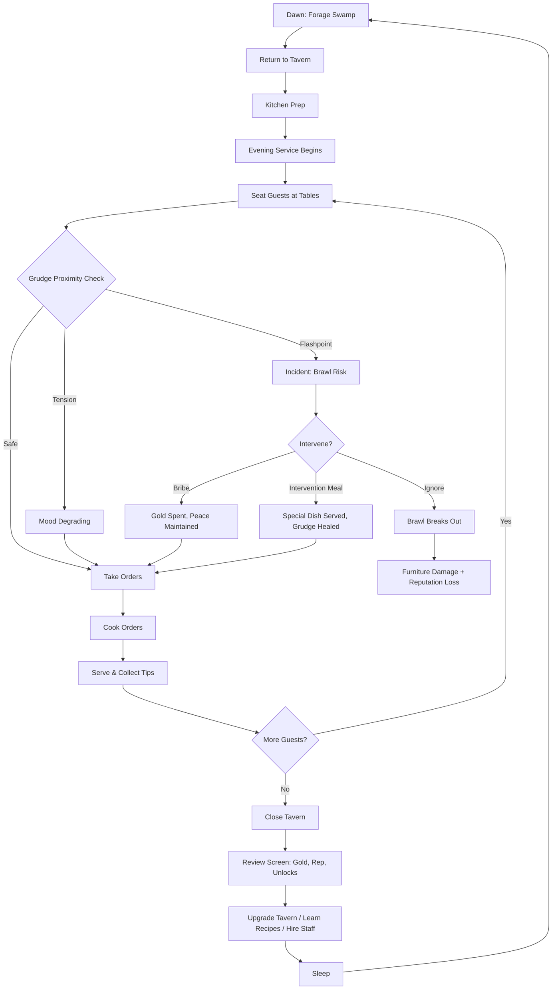

# Grudge Stew Cafe

## Title & Genre

| Field | Value |
|-------|-------|
| **Title** | Grudge Stew Cafe |
| **Genre** | Cozy Simulation / Creature Management / Social Puzzle |
| **Engine** | Unity 6 (URP) — strong 2D/3D hybrid support, proven Switch performance for cozy titles |
| **Platform** | PC (Steam), Nintendo Switch, PlayStation 5, Xbox Series X/S |
| **Monetization** | Premium $19.99 — complete base game. Seasonal recipe DLC at $4.99 each (2-3 per year) |
| **Rating** | ESRB E10+ (Comic Mischief, Fantasy Violence, Alcohol Reference) / PEGI 7 / CERO A |

---

## Vision Statement

Grudge Stew Cafe is a cozy tavern management game where you inherit a rotting swamp inn and must keep goblin clans, bugbear raiders, and bog-dwelling hags from murdering each other under your roof. You forage the swamp for ingredients, cook meals on a real-time recipe system, and serve a rotating clientele of fantasy creatures bound by 200+ grudges, blood feuds, and ancient betrayals. The core tension is hospitality management meets social puzzle: seating a goblin war chief next to the hag who cursed his grandmother requires the right table, the right ale, and possibly a bribe. Succeed and you earn legendary recipes, rare ingredients, and faction loyalty. Fail and you get a tavern brawl that wrecks your furniture and your reputation.

It is Overcooked by way of Discworld, Papers Please by way of Fantasy Tavern, and Stardew Valley by way of a Louisiana swamp. The game rewards warmth, wit, and attention to detail in equal measure.

---

## Core Loop

**Target session length:** 25-45 minutes

```
Forage Swamp (Daytime) → Return with Ingredients → Prep Kitchen → Evening Service Opens → Seat Guests (Social Puzzle) → Cook & Serve Orders (Time Management) → Manage Incidents (Grudge Flare-Ups) → Close Tavern → Review Earnings + Reputation → Upgrade Tavern / Unlock Recipes → Sleep → (repeat)
```

### Core Loop Breakdown

| Phase | Duration | Player Action | System Response | Skill Expression |
|-------|----------|--------------|-----------------|-----------------|
| **Morning Forage** | 5-10 min | Explore swamp, gather ingredients, hire adventurers | Seasons change availability; dangerous zones yield rarer items | Route planning, risk assessment, ingredient knowledge |
| **Kitchen Prep** | 3-5 min | Stock stations, prep bases (stocks, doughs, ferments) | Prep state carries into service; well-prepped stations cook faster | Forward planning, recipe knowledge |
| **Seating Puzzle** | 5-8 min | Place arriving guests at tables | Grudge proximity system triggers mood modifiers | Social reasoning, faction knowledge, spatial planning |
| **Evening Service** | 10-20 min | Cook and serve orders in real-time | Orders queue, timers tick, guests get impatient, grudges flare | Multitasking, prioritization, time management |
| **Incident Management** | Overlapping | De-escalate fights, bribe, serve intervention meals | Successful de-escalation earns loyalty; failures cause brawls | Quick judgment, resource expenditure decisions |
| **Close & Review** | 2-3 min | Review earnings, reputation change, guest feedback | Summary screen; unlocks checked; new recipes/grudges revealed | Reflection, long-term planning |

### Loop Diagram



---

## Meta Loop

```
Day Cycle Mastery → Week Cycle (Faction Events) → Season Cycle (Ingredient Availability) → Chapter Arc (Territory War Escalation) → Reputation Tier Unlock → New Creature Types → New Recipes → Tavern Expansion → (repeat across 4 chapters)
```

### Progression Axes

| Axis | What Grows | How It Feels |
|------|-----------|-------------|
| **Culinary** | Recipe book fills (80+ recipes); cooking speed increases | "I am becoming a legendary chef" |
| **Social** | Grudge map fills in; you learn who hates whom and why | "I understand these people" |
| **Diplomatic** | Faction trust meters rise; Intervention Meals heal grudges | "I am building peace one meal at a time" |
| **Economic** | Tavern upgrades from hovel to legendary inn | "I am building something that lasts" |
| **Exploratory** | Swamp map expands; new foraging zones and creatures discovered | "There is always more out there" |
| **Narrative** | Territory war story unfolds through guest dialogue and events | "I am the fulcrum of this conflict" |

### Progression Milestones

| Milestone | Unlock | Approx. Day |
|-----------|--------|-------------|
| First 5 recipes mastered | Beer Garden expansion | Day 5-7 |
| First grudge healed via Intervention Meal | Private Dining Room | Day 10-14 |
| All 3 factions at neutral trust | Cellar (aging potions) | Day 18-22 |
| First faction alliance (2 factions allied) | Stage (visiting bards) | Day 28-35 |
| First territory negotiation event | Council Chamber | Day 40-50 |
| All grudges healed or all factions allied | Legendary Inn status + ending | Day 60-80 |

---

## Game Mechanics

### 1. Recipe Alchemy System

**Design Philosophy**: Tactile, satisfying cooking that scales from meditative (quiet nights) to frantic (busy services). Recipes are learned through experimentation and guest hints, not randomization.

#### Ingredient Categories (6 categories, 120+ ingredients)

| Category | Examples | Seasonal? | Rarity Range |
|----------|---------|-----------|-------------|
| **Swamp Produce** | Bog onion, marsh garlic, firefly mushrooms, moonpetal greens | Yes (4 seasons) | Common to Rare |
| **Meats & Proteins** | Mud carp, cave crayfish, goblin-snared rabbit, bog turtle | Partial | Common to Uncommon |
| **Foraged Specials** | Glow-berries, sulfur-cress, troll-fat mushrooms, hag-moss | Yes | Uncommon to Legendary |
| **Brewing Grains** | Swamp barley, wild rice, fermented cattail, bog-wheat | No | Common to Uncommon |
| **Spices & Seasonings** | Bone pepper, marsh salt, willow-bark sage, bog saffron | Partial | Common to Rare |
| **Dangerous Delicacies** | Dragon-snail slime, hydra-egg yolk, basilisk-venom reduction | No (zone-gated) | Rare to Legendary |

#### Recipe Tiers

| Tier | Recipes | Complexity | Unlock Method |
|------|---------|-----------|---------------|
| **Basics** | 15 | 2-3 ingredients, 1 cooking step | Tutorial + starting book |
| **Standards** | 25 | 3-5 ingredients, 2-3 cooking steps | Guest requests + experimentation |
| **Favorites** | 20 | 4-6 ingredients, 3-4 cooking steps | Faction loyalty rewards |
| **Signature** | 12 | 5-7 ingredients, 4+ cooking steps | Heal a grudge via Intervention Meal |
| **Legendary** | 8 | 6-8 ingredients, complex timing | Endgame faction alliance unlocks |

#### Cooking Minigame

Cooking uses a station-based system with tactile input:

| Station | Action | Input | Skill Factor |
|---------|--------|-------|-------------|
| **Prep Table** | Chop, dice, julienne | Rhythmic button presses (timing window) | Tighter window = better quality |
| **Stove** | Saute, boil, simmer | Hold to heat, release before burn (visual cue: steam color) | Timing judgment |
| **Oven** | Bake, roast | Set temperature + time; visual doneness indicator | Temperature precision |
| **Fermenting Vat** | Age, pickle, brew | Set it and forget it; quality improves over in-game days | Planning ahead |
| **Plating** | Arrange, garnish | Drag-and-drop arrangement; bonus for visual symmetry | Aesthetic judgment |

**Quality rating per dish**: 1-3 stars based on cooking execution. 3-star dishes earn double tips and faster mood improvement. 1-star dishes still count -- there is no total failure.

### 2. Diplomatic Seating System

**Design Philosophy**: A spatial puzzle where the board changes every night. Players learn grudges over time and plan seating like a chess puzzle with emotions.

#### Grudge System

Each creature has relationship values with every other creature type and specific named NPCs:

| Relationship Level | Effect at Same Table | Effect at Adjacent Table | Effect Across Room |
|-------------------|---------------------|------------------------|-------------------|
| **Allied** (+3) | Mood boost, shared tips, joint orders | Mild mood boost | No effect |
| **Friendly** (+2) | Mild mood boost | No effect | No effect |
| **Neutral** (0) | No effect | No effect | No effect |
| **Wary** (-1) | Mild mood drain | Very mild mood drain | No effect |
| **Hostile** (-2) | Rapid mood drain, incident risk | Moderate mood drain | No effect |
| **Blood Feud** (-3) | Immediate brawl trigger | Rapid mood drain, incident risk | Mild mood drain |

#### Grudge Sources (200+ total)

| Source | Count | Example |
|--------|-------|---------|
| **Ancestral Feuds** | 45 | "Goblins vs Bugbears: The Oakwood Massacre, 300 years ago" |
| **Personal Betrayals** | 50 | "Scout Rikkit owes War Chief Grashnak 200 gold from a failed raid" |
| **Romantic Grudges** | 30 | "Hag Morvene cursed Bugbear Brak's fur after he stood her up" |
| **Territory Disputes** | 40 | "The Eastern Bog water rights between three goblin clans" |
| **Religious Schisms** | 20 | "Hag Coven split over whether to worship the Bog Mother or the Mire Father" |
| **Trade Grievances** | 25 | "Goblin Clan Krag overcharged Bugbear delegation on weapons deal" |

#### Seating Puzzle Mechanics

Each evening, 4-12 guests arrive. Player has 6-10 tables (expandable). Puzzle rules:

- **Table capacity**: 2-6 seats depending on table size
- **Mood meter**: Each guest has a visible mood (green/yellow/red) that changes based on neighbors
- **Order preferences**: Each faction has preferred and disliked dishes; serving preferred food improves mood
- **Ale lubrication**: Serving alcohol reduces grudge sensitivity (Hostile becomes Wary for 2 minutes) but also reduces tips by 15%
- **Private rooms**: Late-game expansion; isolate high-risk guests for a premium cover charge of +25 gold per seat

### 3. Intervention Meals

The game's signature mechanic: a perfectly crafted, 3-star dish tailored to two feuding guests, served simultaneously. When both guests eat the Intervention Meal together:

- The grudge is **permanently downgraded** by one level (Blood Feud becomes Hostile, Hostile becomes Wary, etc.)
- A unique cutscene plays showing the two creatures sharing a moment
- The recipe is added to your Signature collection
- Faction trust meters both increase by +0.5

**Requirements for Intervention Meal**:
1. Both guests must be seated at the same table
2. The dish must be 3-star quality
3. The dish must contain at least one ingredient that is culturally significant to both factions
4. Both guests' mood must be at least yellow before serving
5. The meal costs 2x normal ingredient cost

**Failure**: If quality is below 3 stars or mood is red, the intervention backfires -- grudge escalates by one level.

### 4. Swamp Foraging

**Design Philosophy**: Exploration that rewards knowledge and preparation. The swamp changes with seasons and player reputation, creating a living foraging ground.

#### Swamp Zones

| Zone | Danger Level | Ingredients | Creatures Encountered | Unlock Requirement |
|------|-------------|-------------|----------------------|-------------------|
| **Tavern Backyard** | Safe | Common produce, basic grains | Frogs, fireflies | Starting area |
| **Shallow Bog** | Low | Common + uncommon produce, some proteins | Mud snakes, bog turtles | Day 1 |
| **Deep Marsh** | Medium | Uncommon produce, rare mushrooms | Swamp wolves, territorial goblin scouts | Day 5+ |
| **Hag Hollow** | High | Rare hag-moss, dangerous delicacies | Hag traps, enchantments | Hag faction trust >= 1 |
| **Bugbear Trails** | High | Rare proteins, trail spices | Bugbear patrol (non-hostile if allied) | Bugbear faction trust >= 1 |
| **Goblin Warrens** | High | Fermented specialties, rare grains | Goblin toll collectors | Goblin faction trust >= 1 |
| **The Black Water** | Very High | Legendary ingredients only | Hydra, swamp dragon | Late game; hired adventurer required |
| **The Sunken Ruins** | Very High | Ancient recipes, unique spices | Undead guardians, puzzle locks | Chapter 3+ |

#### Seasonal System

| Season | Duration | Ingredient Changes | Swamp State | Special Events |
|--------|----------|-------------------|-------------|---------------|
| **Spring Bog** | 15 days | Fresh greens abundant, mushrooms scarce | Water levels high; some paths flooded | Frog migration (bonus proteins) |
| **Summer Swamp** | 15 days | All categories available; firefly mushrooms peak | Dry paths, humid, fireflies everywhere | Midsummer feast (all factions visit) |
| **Autumn Mire** | 15 days | Root vegetables, fermented goods, brewing grains peak | Colorful foliage, lower water | Harvest festival recipe contest |
| **Winter Frost** | 15 days | Scarce foraging; preserved goods essential | Frozen paths, dangerous ice, rare winter ingredients | Solstice truce (forced peace night) |

#### Adventurer Hiring

From Day 15+, players can hire adventurers to forage while they manage the tavern:

| Adventurer Tier | Cost/Day | Foraging Range | Success Rate | Unlock |
|----------------|----------|---------------|-------------|--------|
| **Apprentice** | 15 gold | Shallow Bog only | 60% | Day 15 |
| **Journeyman** | 35 gold | Deep Marsh | 75% | Day 25 |
| **Expert** | 60 gold | Any faction zone | 85% | Day 40 |
| **Legendary** | 100 gold | Black Water, Sunken Ruins | 70% (but brings rarer goods) | Chapter 3 |

### 5. Tavern Customization

#### Upgrade Path

| Level | Name | Capacity | Features | Cost | Unlocks |
|-------|------|----------|----------|------|---------|
| 1 | **The Hovel** | 4 tables, 12 seats | Dirt floor, leaky roof, basic stove | Starting | Basic recipes, goblin guests |
| 2 | **The Fixer-Upper** | 5 tables, 16 seats | Wooden floor, patched roof, second stove | 200 gold | Bugbear guests, beer garden |
| 3 | **The Respectable Inn** | 7 tables, 24 seats | Stone floor, private dining room, fermenting vat | 600 gold | Hag guests, private room seating |
| 4 | **The Renowned Tavern** | 8 tables, 30 seats | Cellar, stage, upgraded kitchen | 1,200 gold | Bard performances (mood boost), aging mechanics |
| 5 | **The Council Hall** | 10 tables, 36 seats | Council chamber, guest rooms, grand hearth | 2,500 gold | Faction negotiations, named NPC visits |
| 6 | **The Legendary Inn** | 12 tables, 42 seats | All facilities, legendary kitchen, trophy hall | 5,000 gold | Endgame guests, unique legendary recipes |

#### Furniture and Decor

Furniture has gameplay impact, not just cosmetic value:

| Furniture | Effect | Cost | Durability |
|-----------|--------|------|-----------|
| **Oak Table** (standard) | 4 seats, no modifier | 25 gold | Survives 5 brawls |
| **Reinforced Table** | 4 seats, +1 mood to seated guests | 50 gold | Survives 8 brawls |
| **Round Table** | 6 seats, reduces grudge proximity by 1 level | 80 gold | Survives 6 brawls |
| **Private Booth** | 2 seats, isolates from neighbor effects | 100 gold | Survives 10 brawls |
| **Long Feast Table** | 10 seats, required for Intervention Meals | 200 gold | Survives 4 brawls |
| **Bar Counter** | 6 seats, +ale sales, faster service | 75 gold | Survives 7 brawls |

Furniture damaged in brawls must be repaired (costs 20% of original) or replaced.

---

## World Design

### Map Structure

```
The Swamp (overworld foraging map)
├── The Tavern (hub, always accessible, expands with upgrades)
│   ├── Main Hall (seating area)
│   ├── Kitchen (cooking stations)
│   ├── Beer Garden (outdoor seating)
│   ├── Private Dining Room (isolated seating)
│   ├── Cellar (fermenting + aging)
│   ├── Stage (bard performances)
│   ├── Council Chamber (faction negotiations)
│   └── Guest Rooms (named NPC lodging)
├── Shallow Bog (starting forage zone)
│   ├── Bog Onion Patch
│   ├── Mud Carp Pools
│   └── Firefly Clearing
├── Deep Marsh (medium danger)
│   ├── Mushroom Grotto
│   ├── Troll-Fat Grove
│   ├── Wolf Den (avoid or bribe)
│   └── Abandoned Goblin Market
├── Faction Territories (high danger, requires trust)
│   ├── Goblin Warrens (fermented goods, rare grains)
│   ├── Bugbear Trails (rare proteins, trail spices)
│   └── Hag Hollow (hag-moss, dangerous delicacies)
├── The Black Water (very high danger, legendary loot)
│   ├── Hydra Nest
│   ├── Sunken Temple
│   └── Swamp Dragon Lair
└── The Sunken Ruins (endgame, puzzle-locked)
    ├── Ancient Kitchen (unique recipes)
    ├── The Bog Library (lore + grudge context)
    └── The Treaty Stone (faction negotiation site)
```

### Art Direction

**Visual Pillars**:
- **Warm decay** -- Rotting wood, moss-covered stone, flickering lantern light. The tavern is ugly but loved.
- **Creature character** -- Every creature is expressively animated. Goblins hunch and fidget; bugbears slouch and scratch; hags float and shimmer.
- **Swamp atmosphere** -- Fog layers, bioluminescent patches, water reflections, firefly clouds. The swamp is beautiful and dangerous.
- **Food porn** -- Every dish is rendered with care. Steam rises, sauces glisten, breads crack. Cooking is the visual reward.

**Color Palette**:

| Element | Palette | Key Colors |
|---------|---------|------------|
| **Tavern interior** | Warm amber, deep brown, candlelight orange | #D4860B, #5C3A1E, #FF9F1C |
| **Swamp daytime** | Muted green, fog gray, water teal | #4A6741, #9BA8A0, #2D7D7B |
| **Swamp night** | Deep blue-black, bioluminescent teal, firefly gold | #1A1A2E, #16C79A, #F5D042 |
| **Goblin aesthetic** | Earthy red-brown, rust, bone white | #8B4513, #A0522D, #F5F0E1 |
| **Bugbear aesthetic** | Dark fur brown, leather tan, war paint ochre | #3E2723, #D2B48C, #CC7722 |
| **Hag aesthetic** | Swamp green, decay purple, ethereal cyan | #2E8B57, #6A0DAD, #00CED1 |
| **Food (cooked)** | Rich warm tones, appetizing highlights | #E8751A, #8FBC8F, #FFF8DC |

---

## Narrative

### Story Spine

1. **Equilibrium**: You are a wandering cook who inherits "The Sump" -- a crumbling tavern at the edge of the Blackmire Swamp. The previous owner, your eccentric Aunt Murgatroyd, left behind a cookbook, a leaking roof, and a lot of unpaid tabs.
2. **Inciting Incident**: Your first evening, three goblin clans arrive simultaneously and nearly burn the place down. You discover the tavern sits on the only neutral ground in a three-way territory war -- and Aunt Murgatroyd maintained peace through legendary cooking.
3. **First Complication**: The goblins are only the beginning. Bugbear raiding parties start using the tavern as a neutral meeting ground. Then a hag coven arrives, claiming ancestral rights to the land beneath your floorboards. You now have three mutually hostile factions under one roof.
4. **Rising Action**: Each faction reveals deeper grudges. The goblins hate the bugbears for the Oakwood Massacre. The bugbears hate the hags for a curse that sterilized their war-born. The hags hate the goblins for poisoning their sacred spring. Underlying it all: someone is arming all three sides and profiting from the war.
5. **Midpoint Reversal**: Aunt Murgatroyd did not just maintain peace -- she orchestrated the territory war to keep all three factions dependent on the tavern. Her "legendary cooking" was laced with addictive enchantments. The cookbook is a tool of control.
6. **Crisis**: The factions discover the truth simultaneously. All three turn on the tavern. You must choose: reveal Murgatroyd's manipulation and lose their trust, or cover it up and become the new manipulator.
7. **Climax**: The Treaty Night -- a single evening where all three factions sit down together for the first time in centuries. You must cook the meal of your life, heal the deepest grudges, and navigate the revelation of Murgatroyd's deception. Every grudge you have healed (or failed to heal) determines how this night plays out.
8. **Resolution**: The factions reach an uneasy peace (or do not, depending on player choices). The tavern stands -- not as a tool of control, but as genuine neutral ground. Your cooking, not your manipulation, is what brings them back.

### Tone

```
HOPEFUL  ●●●●●○○  GRIM
SERIOUS  ●●●○○○○  WHIMSICAL
SIMPLE   ●●●●○○○  COMPLEX
GROUND   ●●●●○○○  FANTASTICAL
STATIC   ●●●●●○○  DYNAMIC
```

Warm, witty, occasionally dark. The tone sits at the intersection of Pratchett's Ankh-Morpork pub humor and the genuine emotional weight of creatures who have been at war for generations. The cooking is always sincere even when the politics are absurd.

### Key Characters

| Character | Faction | Role | Arc |
|-----------|---------|------|-----|
| **War Chief Grashnak** | Bugbears | Military leader, secret poetry lover | Warrior learning peace through vulnerability |
| **Hag Morvene** | Hags | Coven elder, former friend of Aunt Murgatroyd | Manipulator who was herself manipulated |
| **Scout Rikkit** | Goblins | Intelligence operative, double agent | Spy choosing loyalty over survival |
| **Brak the Broken** | Bugbears | Pacifist raider, vegetarian | Idealist pushing against warrior culture |
| **Toad-Witch Sseleen** | Hags | Morvene's apprentice, secretly friendly with Rikkit | Young hag torn between coven loyalty and personal connection |
| **Aunt Murgatroyd** (deceased) | None | Previous tavern owner | Posthumous villain; her cookbook is the game's most dangerous item |
| **The Brewmaster** | Independent | Wandering beer guru, tutorial guide | Comic relief + mechanical tutorial delivery |

---

## Player Personas

### Primary Personas

#### P-002: Sarah Chen -- "The Micro-Gamer" (Primary)

A 35-year-old marketing manager and mother who plays in 15-20 minute bursts, values collection mechanics and fair progression, and spends $10-15/month on games she loves.

**Why Grudge Stew Cafe fits Sarah**:
- Evening service cycles are 10-20 minutes -- fits perfectly between parenting duties
- Recipe collection (80+ recipes) scratches the same itch as gacha collection without predatory RNG
- Creature designs are endearing and collectible -- she will want to serve every creature type
- Cooking minigame is satisfying without being stressful on quiet nights
- No energy system, no forced ads, no timers -- respects her limited time
- Premium purchase means no FOMO pressure

**Sarah's experience**: Plays during nap time and after kids' bedtime. Gets attached to specific regular guests. Learns their grudges organically through repeated visits. Starts experimenting with Intervention Meals because she wants Rikkit and Sseleen to be friends. Will 100% the recipe book. Will recommend to her mom-group Discord as "the cozy cooking game with feelings."

#### P-003: Hiroshi Tanaka -- "The RPG Addict" (Primary)

A 16-year-old completionist who treats every game as a mastery project, plays 3-4 hours daily, and values system depth with fair completion targets.

**Why Grudge Stew Cafe fits Hiroshi**:
- 200+ grudges to discover and track = massive completion target
- 3-star rating on every recipe = skill-based optimization challenge
- Intervention Meals require specific ingredient combinations = theorycrafting opportunity
- Faction trust optimization = system mastery expression
- Seating puzzle has optimal solutions that can be diagrammed and shared
- The grudge web is a complex interlocking system that rewards deep study

**Hiroshi's experience**: Maps every grudge relationship in a spreadsheet. Optimizes seating arrangements for maximum tip income. Theories optimal Intervention Meal builds on Reddit. Completes the recipe book in 40 hours, then min-maxes evening service for gold efficiency. Will be slightly annoyed if any grudges are missable.

#### P-004: James Morrison -- "The Stress Whale" (Primary)

A 45-year-old CTO who pays for progression convenience, plays 15-30 minutes daily, and wants satisfying wins without complex mechanics.

**Why Grudge Stew Cafe fits James**:
- Core loop is inherently satisfying -- cook food, serve guests, earn gold
- Tavern upgrades provide clear progression milestones
- Adventurer hiring lets him outsource foraging (he can pay to skip exploration)
- Premium model means he gets everything upfront -- no IAP anxiety
- Quieter evenings are meditative; busy evenings are engaging but not stressful
- The game does not punish him for short sessions

**James's experience**: Plays on the train and between meetings. Focuses on the cooking loop and tavern upgrades. Hires adventurers instead of foraging himself. Enjoys the creature interactions as ambient entertainment rather than a system to master. Will buy the DLC recipe packs immediately. Will not complete the grudge map but will feel satisfied with his tavern's progression.

### Secondary Personas

#### P-013: Robert Thompson -- "The Relaxation Player" (Secondary)

A 41-year-old burnt accountant who plays 10-15 minutes nightly to decompress. Wants zero stress, zero pressure, zero decisions.

**Why Grudge Stew Cafe fits Robert**:
- Quiet nights (early game, low guest count) are pure meditative cooking
- The cooking minigame is rhythmic and satisfying without requiring complex decisions
- Swamp foraging is a gentle, exploratory activity
- No fail state -- even burnt food still counts as served
- Ambient swamp sounds and warm tavern lighting are genuinely calming
- He can skip the seating puzzle difficulty by placing guests randomly and accepting lower tips

**Robert's experience**: Plays one evening service per night before bed. Ignores the grudge system entirely. Cooks simple recipes. Enjoys the creature animations and the tavern atmosphere. Will play for 3-4 months at this pace. Worth the $19.99 for the relaxation value alone.

---

## User Stories

### Foraging and Exploration

- **US-001**: As a player, I want to forage the swamp in real-time to gather ingredients, so I feel like my cooking is built from what I personally found.
- **US-002**: As a player (Hiroshi), I want ingredient locations to change with seasons so I must plan my foraging routes around a seasonal calendar.
- **US-003**: As a player, I want dangerous zones to contain rarer ingredients so I have a meaningful risk-reward choice.
- **US-004**: As a player (James), I want to hire adventurers to forage for me so I can skip exploration when I am short on time.
- **US-005**: As a player, I want the swamp map to expand as my reputation grows so exploration feels like progression.
- **US-006**: As a player, I want seasonal events (frog migration, harvest festival) that change available ingredients so the game world feels alive.

### Cooking and Recipes

- **US-007**: As a player, I want a tactile cooking minigame with chopping, stirring, and plating so cooking feels hands-on and satisfying.
- **US-008**: As a player (Hiroshi), I want a 3-star quality rating per dish so I have an optimization target for every recipe.
- **US-009**: As a player (Robert), I want even poorly cooked dishes to still count as served so I never feel punished for low-energy play.
- **US-010**: As a player, I want to discover new recipes through guest hints and experimentation so the recipe book fills through play, not menus.
- **US-011**: As a player, I want creature-specific food preferences so I learn which faction likes what and plan my menu accordingly.
- **US-012**: As a player, I want 80+ recipes across 5 tiers so the recipe book provides a long-term collection target.
- **US-013**: As a player (Sarah), I want recipes to have visual progression (from simple to elaborate plating) so collecting them feels rewarding.

### Seating and Social Puzzle

- **US-014**: As a player, I want to seat guests at tables and see their mood change based on who is nearby so the seating arrangement is a meaningful puzzle.
- **US-015**: As a player, I want a grudge system with 200+ relationships so the social puzzle has real depth and replayability.
- **US-016**: As a player (Hiroshi), I want to see relationship modifiers numerically so I can optimize seating for maximum tips.
- **US-017**: As a player, I want serving alcohol to temporarily reduce grudge sensitivity so I have a tactical tool for difficult seating arrangements.
- **US-018**: As a player, I want private rooms that isolate guests from neighbor effects so I can handle the most dangerous combinations.
- **US-019**: As a player, I want the seating puzzle to get harder as the tavern grows (more guests, more tables, more grudges active) so difficulty scales naturally.

### Intervention Meals

- **US-020**: As a player, I want to serve a perfectly crafted meal to two feuding guests that permanently downgrades their grudge so I feel like I am healing the world through cooking.
- **US-021**: As a player, I want Intervention Meals to require 3-star quality so the mechanic is a skill challenge, not a guaranteed win.
- **US-022**: As a player (Sarah), I want a unique cutscene when an Intervention Meal succeeds so the emotional payoff matches the effort.
- **US-023**: As a player, I want failed Intervention Meals to escalate the grudge so the stakes are real and I must prepare carefully.

### Tavern Management

- **US-024**: As a player, I want to upgrade my tavern from a hovel to a legendary inn so the space transforms visually and mechanically.
- **US-025**: As a player (James), I want clear upgrade costs and effects so I can plan my spending efficiently during short sessions.
- **US-026**: As a player, I want different furniture types that affect gameplay (mood bonuses, grudge reduction, brawl resistance) so decorating is strategic.
- **US-027**: As a player, I want brawls to damage furniture so there is a real cost to failing the seating puzzle.
- **US-028**: As a player, I want a beer garden, cellar, stage, and council chamber as expansion options so the tavern grows in distinct, meaningful ways.

### Faction and Narrative

- **US-029**: As a player, I want three factions with distinct cultures, food preferences, and grudges so the diplomatic challenge is multifaceted.
- **US-030**: As a player, I want named NPCs within each faction who have personal grudges and story arcs so I build relationships with individuals, not abstract groups.
- **US-031**: As a player, I want the overarching territory war narrative to unfold through guest dialogue and events so the story emerges from gameplay.
- **US-032**: As a player (Sarah), I want the Rikkit/Sseleen cross-faction friendship subplot so I have an emotional anchor in the larger political story.
- **US-033**: As a player, I want the Aunt Murgatroyd revelation to recontextualize my understanding of the game so the narrative has genuine surprise.
- **US-034**: As a player, I want the Treaty Night climax to reflect my choices throughout the game (which grudges I healed, which factions I favored) so the ending feels personal.

### Accessibility and Comfort

- **US-035**: As a player, I want to pause at any time during service with no penalty so I can handle real-life interruptions.
- **US-036**: As a player (Robert), I want a "cozy mode" that reduces guest count and removes time pressure from service so I can play purely for relaxation.
- **US-037**: As a player, I want customizable text size and contrast for recipe books and dialogue so the game is readable.
- **US-038**: As a player, I want full controller support with remappable buttons so I can play comfortably on any platform.
- **US-039**: As a player, I want colorblind-friendly mood indicators (icons + color) so the grudge system is accessible.
- **US-040**: As a player, I want an in-game grudge journal that tracks all discovered relationships so I do not need external tools to manage the social puzzle.

---

## Monetization

### Premium Model ($19.99)

**Why premium**: The game's core fantasy is warmth, hospitality, and care. Energy systems, gacha mechanics, and pay-to-progress systems directly contradict the cozy tavern experience. Players should feel like guests in the tavern -- welcomed, not exploited.

| Element | Included in Base | DLC Potential |
|---------|-----------------|---------------|
| 4 chapters, 60-day campaign | Yes | -- |
| 80+ recipes, full cooking system | Yes | -- |
| 200+ grudges, full social puzzle | Yes | -- |
| 6 tavern upgrades, all furniture | Yes | -- |
| 3 factions, all named NPCs | Yes | -- |
| Treaty Night climax + ending | Yes | -- |
| Full foraging map, all 8 zones | Yes | -- |
| **"The Winter Recipe Collection"** (12 recipes, winter-themed ingredients) | -- | $4.99 |
| **"The Bugbear BBQ Pack"** (10 recipes, bugbear cultural dishes, new foraging zone) | -- | $4.99 |
| **"Hag's Feast"** (8 recipes, hag potion-dishes, new cooking station: cauldron) | -- | $4.99 |
| Soundtrack | -- | $7.99 separate |

### Revenue Projections (conservative, indie cozy title)

| Scenario | Units (Year 1) | Revenue (after 30% platform cut) | Notes |
|----------|---------------|----------------------------------|-------|
| Modest | 15,000 | $209,925 | Niche cozy audience |
| Good | 50,000 | $699,750 | Word of mouth + cozy game community |
| Strong | 150,000 | $2,099,250 | Streamer attention + Steam sale visibility |
| Breakout | 500,000 | $6,997,500 | Viral moment + "cozy game of the year" nomination |

**DLC revenue estimate** (per pack, Year 1, assuming 20% attach rate at "Good" scenario):

| Pack | Attach Rate | Units | Revenue (net) |
|------|------------|-------|---------------|
| Winter Recipe Collection | 20% | 10,000 | $34,993 |
| Bugbear BBQ Pack | 15% | 7,500 | $26,244 |
| Hag's Feast | 15% | 7,500 | $26,244 |

### Marketing Strategy

- Target cozy game community (r/CozyGamers, Cozy Game Patrol YouTube channel)
- Position as "Stardew Valley meets fantasy politics"
- Launch demo during Steam Next Fest for wishlisting
- Partner with cooking-game streamers (Overcooked audience crossover)
- Leverage creature character art for social media (goblin food reviews, bugbear cooking fails)

---

## Production Plan

### Team

| Role | Count | Phase | Cost |
|------|-------|-------|------|
| Game Designer / Director | 1 | All | $85K |
| Unity Developer | 2 | All | $190K |
| 2D Artist (UI, food, recipe art) | 1 | Phase 2+ | $65K |
| 3D Artist (tavern, swamp, creatures) | 1 | Phase 2+ | $75K |
| Animator (creature expressions, cooking) | 1 | Phase 2+ | $70K |
| Technical Artist (shaders, swamp effects) | 1 | Phase 2 | $75K |
| Writer (dialogue, grudges, lore) | 1 (contract) | Phase 1-2 | $25K |
| Composer (adaptive score) | 1 (contract) | Phase 2-3 | $20K |
| Sound Designer (cooking, swamp, ambiance) | 1 (contract) | Phase 3 | $12K |
| QA | 1 | Phase 3+ | $35K |
| Producer | 1 | All | $75K |

### Timeline (16 months)

```
Month 1-3: PRE-PRODUCTION
├── GDD complete and signed off
├── Art style guide (tavern warm tones, swamp bioluminescence, food porn renders)
├── Prototype: one cooking station, one recipe, two guests, one grudge
├── Playtest prototype for cooking "feel" and seating puzzle clarity
├── Grudge system data model designed (200+ entries)
└── Team: Designer + 1 dev + writer + producer

Month 4-8: PRODUCTION ALPHA
├── Cooking system fully implemented (all 5 stations)
├── Seating puzzle system working (grudge proximity, mood, incidents)
├── 20 basic + standard recipes playable
├── Swamp foraging prototype (Shallow Bog + Deep Marsh)
├── First 3 named NPCs per faction with dialogue trees
├── Tavern upgrade system from Level 1 to Level 3
└── Team: Full team onboarded

Month 9-12: PRODUCTION BETA
├── All 80+ recipes implemented
├── All 200+ grudges populated
├── All 8 foraging zones playable
├── Full 4-chapter narrative arc
├── All named NPCs with complete arcs
├── Intervention Meal system complete with cutscenes
├── Tavern upgrades through Level 6
├── Art replacing placeholders
└── Music and sound integrated

Month 13-14: POLISH
├── Performance optimization (especially Switch)
├── Cozy mode implementation
├── Accessibility pass (text scaling, colorblind support, controller mapping)
├── QA regression testing
├── Balance pass on grudge difficulty curve
└── Console certification prep

Month 15-16: LAUNCH
├── Steam Next Fest demo (Month 14)
├── Press embargoes, review copies sent to cozy game outlets
├── Steam launch (Month 15)
├── Console launches (Month 16)
├── Day-1 patch based on early feedback
└── First DLC planning begins
```

### Budget: $727K

| Category | Amount | % |
|----------|--------|---|
| Personnel | $520K | 72% |
| Art/audio outsourcing | $32K | 4% |
| Writer (contract) | $25K | 3% |
| Music + sound (contract) | $32K | 4% |
| Tools and licenses (Unity, console dev kits) | $18K | 2% |
| Marketing (PR, events, streamer outreach) | $45K | 6% |
| Console certification (3 platforms) | $15K | 2% |
| Contingency | $40K | 6% |

---

## Technical Requirements

### PC Specs

| | Minimum | Recommended |
|---|---------|-------------|
| **OS** | Windows 10 64-bit / macOS 12 | Windows 11 / macOS 14 |
| **CPU** | Intel i5-4590 / Apple M1 | Intel i5-8400 / Apple M2 |
| **GPU** | Intel HD 530 (integrated) | GTX 1060 / RX 580 |
| **RAM** | 4 GB | 8 GB |
| **Storage** | 4 GB HDD | 4 GB SSD |
| **DirectX** | 11 | 12 |

### Console Specs

| Platform | Resolution | FPS | Notes |
|----------|-----------|-----|-------|
| **PlayStation 5** | Native 4K | 60 | DualSense haptics for cooking (chopping rhythm, stirring resistance) |
| **Xbox Series X** | Native 4K | 60 | Standard |
| **Xbox Series S** | 1440p | 60 | Reduced ambient particles in swamp |
| **Nintendo Switch** | 720p handheld / 1080p docked | 30 | Touch-screen support for cooking minigame |

### Key Technical Challenges

1. **Creature mood visualization** -- Real-time mood indicators on 12+ simultaneous creatures that remain readable during busy service without cluttering the screen.
2. **Grudge proximity system** -- Efficient spatial calculation of relationship modifiers for 4-12 guests across 6-10 tables, updated every frame during service.
3. **Swamp atmosphere** -- Layered fog, bioluminescent particles, and dynamic water levels that perform well on Switch at 30 FPS.
4. **Adaptive difficulty** -- Service difficulty scaling based on tavern level, faction trust, and day count that feels natural rather than mechanical.
5. **Save state complexity** -- Persisting tavern state, furniture damage, ingredient inventory, grudge states (200+ entries), faction trust, recipe progress, and seasonal state across sessions.
6. **Cooking input responsiveness** -- Tactile cooking inputs (chopping rhythm, stirring timing) must feel responsive across all platforms including Switch touch screen.

### Architecture Notes

```
Data-Driven Systems:
├── recipes.json (80+ recipes with ingredient lists, cooking steps, quality modifiers)
├── grudges.json (200+ grudges with source, severity, faction pairs, heal conditions)
├── creatures.json (creature types with food preferences, faction allegiance, grudge participation)
├── ingredients.json (120+ ingredients with category, rarity, season, zone, cooking properties)
├── furniture.json (furniture types with capacity, mood modifiers, durability, cost)
└── events.json (seasonal events, faction visits, special guests, narrative triggers)

Runtime Systems:
├── GrudgeEngine (manages relationship proximity calculations and mood modifiers)
├── CookingController (station-based cooking with quality scoring)
├── ServiceManager (guest arrival sequencing, order queuing, timer management)
├── TavernState (upgrade progression, furniture placement, reputation tracking)
├── SwampGenerator (procedural ingredient placement with seasonal variation)
└── NarrativeDirector (triggers story events based on grudge state + faction trust)
```
