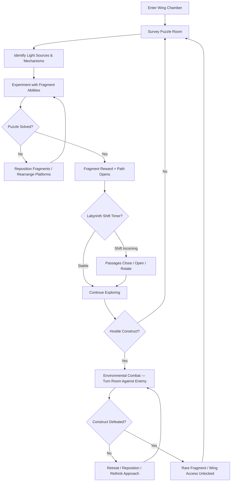
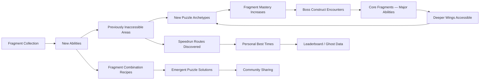

# Indigo Golem's Grasp

## Title & Genre

| Field | Value |
|-------|-------|
| **Title** | Indigo Golem's Grasp |
| **Genre** | Puzzle Adventure / Metroidvania |
| **Engine** | Unity 6 (URP) — lightweight 2.5D rendering, strong multi-platform support, shader graph for crystal refraction effects |
| **Platform** | PC (Steam/Epic), PlayStation 5, Xbox Series X/S, Nintendo Switch |
| **Monetization** | Premium — $24.99 base, free demo with first 3 wings |
| **Rating** | ESRB E10+ (Fantasy Violence) / PEGI 7 / CERO A |

---

## Vision Statement

Indigo Golem's Grasp is a puzzle-driven Metroidvania where you play as a shattered crystal golem reassembling yourself from indigo fragments scattered across a labyrinthine underground nexus. Every piece you recover is both a body part and a key — a grapple arm that stretches to distant ledges, a prism core that splits light through your crystalline torso, a density node that compresses your mass through hairline fissures. The labyrinth breathes. Walls shift on a timer. Entire wings rotate into new configurations. Map knowledge is temporary; adaptability is permanent. The game lives at the intersection of spatial reasoning and emergent experimentation — players who think with light, geometry, and gravity will find solutions the designers never intended. It is Hollow Knight's exploration cadence crossed with Portal's puzzle philosophy, rendered in a palette of indigo, amber, and darkness where light is both tool and beautification.

---

## Core Loop

**Target session length:** 30–60 minutes



### Core Loop Breakdown

| Step | Player Action | System Response | Skill Expression |
|------|--------------|----------------|-----------------|
| 1. Survey | Enter chamber, scan light sources, mechanisms, platforms | Room geometry highlighted for 2 seconds on first entry — teaches the eye where to look | Pattern recognition, spatial assessment |
| 2. Experiment | Attach/detach fragments to body slots; reposition platforms; redirect light beams | Fragment combinations produce emergent effects — prism on left arm splits light differently than prism on right arm | Creative problem-solving, combinatorial thinking |
| 3. Solve | Complete the light-refraction chain or gravity-well sequence to unlock the mechanism | Door opens, elevator activates, new chamber revealed. Camera pulls back to show the solved geometry — a visual reward | Logical deduction, spatial reasoning |
| 4. Collect | Pick up the fragment reward from the solved mechanism | New ability unlocked (or fragment stored for later combination). Golem appearance updates dynamically based on attachment slot | Collection satisfaction, visual identity |
| 5. Adapt | Labyrinth shift occurs (every 12 minutes) — passages close, new ones open, wings rotate | Previously blocked paths may now be accessible. Previously explored paths may now be dead ends. Minimap updates with 3-second delay | Adaptability, calm under pressure |
| 6. Combat | Engage hostile construct using environmental puzzle mechanics — redirect light into its core, drop it into a gravity well, crush it with a shifting wall | Constructs have 2–3 vulnerability patterns tied to room mechanics. No direct attack button — the room is your weapon | Tactical thinking, environmental awareness |
| 7. Progress | Collect enough fragments to unlock the wing gate | New wing opens with new puzzle archetypes, new fragment types, new construct behaviors | Persistent growth, curiosity rewarded |

---

## Meta Loop

### Session-to-Session Progression



### Progression Axes

| Axis | What Grows | How It Feels | Cap |
|------|-----------|-------------|-----|
| **Fragment Collection** | 47 unique body fragments across 7 wings, each granting traversal or puzzle abilities | "I'm becoming more complete — more capable — more myself" | 47 fragments, fully assembled golem |
| **Fragment Mastery** | Understanding of fragment combinations — how attachments interact | "I see connections the designers didn't intend" | Open-ended — emergent combinations discovered by community |
| **Labyrinth Knowledge** | Understanding of shift patterns, wing rotation logic, shortcut networks | "The maze stops being scary and becomes a tool I navigate intuitively" | 7 wings, 4 rotation states each |
| **Light Puzzles** | Complexity of refraction chains — 2-beam to 8-beam puzzles with color mixing | "I think in light now. I see the solution before I execute it" | 8-beam color mixing with gravity lensing |
| **Construct Encounters** | 6 boss constructs, each requiring mastery of a specific puzzle archetype | "I turned the entire room into a weapon. The boss was just another puzzle piece" | 6 bosses, 2–5 phases each |
| **Player Skill** | Speed of puzzle solving, efficiency of movement, knowledge of sequence breaks | "I can clear Wing 1 in 4 minutes when it took 40 the first time" | No cap — speedrun community perpetuates mastery |

---

## Game Mechanics

### Primary Mechanic: Crystal Reconstitution

The golem begins as a floating indigo core — a fist-sized crystal with basic movement and a single attachment slot. As fragments are collected and attached, the golem grows in both capability and physical form. The system is built on **slot-based attachment with emergent interaction**.

#### Body Slots

| Slot | Position | Starting State | Fragment Types | Visual Effect |
|------|----------|---------------|---------------|---------------|
| **Core** | Center torso | Indigo core (default) | Prism shards, resonance crystals, energy cores | Torso color/opacity changes; light refracts through body |
| **Left Arm** | Left appendage | Empty (invisible) | Grapple hooks, gravity lenses, density nodes | Arm extends/compacts based on fragment |
| **Right Arm** | Right appendage | Empty (invisible) | Refraction prisms, beam emitters, frequency tuners | Arm glows/pulses based on fragment |
| **Left Leg** | Lower left | Empty (invisible) | Spring coils, wall-grip pads, phase shifters | Leg mass/shape changes |
| **Right Leg** | Lower right | Empty (invisible) | Stomp plates, magnetic boots, fissure wedges | Leg mass/shape changes |
| **Head** | Top | Empty (basic sensor) | Scanner lens, echolocation gem, dark-sight crystal | Head shape/eye count changes |
| **Back** | Rear | Empty | Wing fragments, shield plates, antenna arrays | Back protrusions visible in silhouette |

#### Fragment Categories (47 total)

**Traversal Fragments (14)**

| Fragment | Slot | Ability | Wing Found | Prerequisite |
|----------|------|---------|------------|-------------|
| Grapple Hook | Left Arm | Extend arm to grab ledges within 8m | Wing 1 | None |
| Spring Coil | Left Leg | Jump height +60% | Wing 1 | None |
| Wall Grip | Right Leg | Cling to crystal walls for 4 seconds | Wing 2 | Spring Coil |
| Density Node | Left Arm | Compress through fissures (gaps < 0.5m) | Wing 2 | None |
| Phase Shifter | Left Leg | Pass through crystal barriers for 1.5s (cooldown 8s) | Wing 3 | Wall Grip |
| Magnetic Boots | Right Leg | Walk on metallic surfaces (ceilings, vertical shafts) | Wing 3 | None |
| Fissure Wedge | Right Leg | Pry open sealed cracks in walls | Wing 4 | Density Node |
| Grapple Tether | Left Arm | Link two anchor points to create a tightrope | Wing 4 | Grapple Hook |
| Cloud Step | Left Leg | Double jump with brief crystal platform | Wing 5 | Spring Coil + Phase Shifter |
| Velocity Shard | Right Leg | Dash 6m in facing direction (cooldown 3s) | Wing 5 | Magnetic Boots |
| Gravity Lens | Left Arm | Reverse personal gravity for 5s | Wing 6 | All prior Left Arm fragments |
| Stomp Plate | Right Leg | Ground-pound shatters fragile floors | Wing 3 | None |
| Antenna Array | Back | Detect hidden passages within 12m radius | Wing 5 | None |
| Wing Fragment | Back | Glide for 3 seconds after jump | Wing 6 | Cloud Step + Antenna Array |

**Puzzle Fragments (18)**

| Fragment | Slot | Ability | Wing Found | Puzzle Archetype |
|----------|------|---------|------------|-----------------|
| Refraction Prism | Right Arm | Split a light beam into 2 colored beams | Wing 1 | Basic refraction |
| Beam Emitter | Right Arm | Emit a focused amber light beam (5m range) | Wing 1 | Light source creation |
| Frequency Tuner | Right Arm | Resonate with crystal frequencies to activate mechanisms | Wing 2 | Frequency matching |
| Color Filter — Crimson | Right Arm | Shift beam color to red | Wing 2 | Color-gated mechanisms |
| Color Filter — Azure | Right Arm | Shift beam color to blue | Wing 3 | Color-gated mechanisms |
| Color Filter — Emerald | Right Arm | Shift beam color to green | Wing 4 | Color mixing |
| Resonance Crystal | Core | Amplify frequency tuner range x3 | Wing 3 | Long-range mechanisms |
| Energy Core Mk.II | Core | Power two mechanisms simultaneously | Wing 4 | Multi-activation puzzles |
| Scanner Lens | Head | Reveal hidden light paths for 10s | Wing 2 | Hidden mechanisms |
| Echolocation Gem | Head | Map nearby rooms through walls | Wing 4 | Navigation puzzles |
| Dark-Sight Crystal | Head | See in complete darkness (some wings have lightless zones) | Wing 5 | Dark zone navigation |
| Gravity Well Generator | Back | Create a 4m gravity field that attracts/detaches platforms | Wing 3 | Platform manipulation |
| Platform Lock | Back | Freeze a moving platform in place permanently | Wing 4 | Platform stabilization |
| Beam Splitter | Right Arm | Split beam into 3 (from 2) | Wing 5 | Complex refraction chains |
| Gravity Inverter | Back | Flip gravity in a 6m sphere for 8s | Wing 6 | Multi-directional puzzles |
| Time Crystal | Core | Slow time to 30% for 4s (cooldown 15s) | Wing 6 | Timed mechanism puzzles |
| Refraction Matrix | Core | Split beam into 5 with color mixing | Wing 7 (post-game) | Endgame light puzzles |
| Nexus Keystone | Core | Activate the Nexus Gate (final door) | Wing 6 (boss reward) | Game completion |

**Combat-Utility Fragments (8)**

| Fragment | Slot | Ability | Effect on Constructs |
|----------|------|---------|---------------------|
| Shield Plate | Back | Block construct projectiles | Deflects beams back at construct |
| Beam Disruptor | Right Arm | Overload a construct's light core | Stuns construct for 3s |
| EMP Shard | Core | Disable all construct electronics in 8m radius for 5s | Opens vulnerability window |
| Attractor Crystal | Back | Draw construct toward crystal (thrown, 10m range) | Reposition construct into hazards |
| Explosive Fragment | Left Arm | Detonate on impact, destroys fragile walls and damages constructs | 15% HP damage to constructs |
| Speed Crystal | Core | Increase movement speed +40% for 6s | Evade construct attacks |
| Repair Node | Core | Slowly regenerate golem integrity (+5%/s for 8s, cooldown 30s) | Sustain in extended construct encounters |
| Overclock Module | Core | Double all fragment effects for 5s (cooldown 20s) | Emergency power burst |

**Secret Fragments (7)** — Hidden behind optional puzzles, speed challenges, and exploration milestones.

| Fragment | Slot | Ability | How Found |
|----------|------|---------|-----------|
| Chromatic Core | Core | Cycle through all 3 beam colors without swapping filters | Solve all color-mixing puzzles in Wing 4 without hints |
| Doppelganger Shard | Left Arm | Create a stationary crystal clone that holds light beams | Find the hidden mirror room in Wing 3 |
| Infinite Spring | Left Leg | No cooldown on double jump | Complete Wing 1 in under 5 minutes |
| Phase Master | Left Leg | Phase Shift has no cooldown | Reach the developer room behind Wing 5 |
| Prism Lord | Right Arm | Split beams into 8 (overrides Beam Splitter) | Collect all 40 non-secret fragments |
| Omniscience Gem | Head | All maps fully revealed permanently | Discover all 23 hidden rooms across all wings |
| Perfect Core | Core | All abilities active simultaneously, no slot limits | Defeat final boss without taking damage |

#### Emergent Combination System

The slot-based system creates emergent behavior when fragments interact. These are not scripted — the physics and light simulation produce real results from combinations:

| Combination | Effect | Discovery Source |
|------------|--------|-----------------|
| Grapple Hook + Beam Emitter | Fire a beam while grappled — swing on the beam like a rope | Physics interaction |
| Gravity Lens + Refraction Prism | Light bends through gravity field — aim beam around corners | Light + gravity physics |
| Phase Shifter + Stomp Plate | Phase through floor, stomp in mid-air to create shockwave in room below | Movement system interaction |
| Beam Splitter + Gravity Inverter | Split beam, invert one half — light travels in opposite direction | Light physics |
| Time Crystal + Beam Emitter | Frozen-time beam persists after time resumes — place light sources permanently | Time system interaction |
| Density Node + Magnetic Boots | Compress while magnetized — slip through ceiling fissures into rooms above | Physics interaction |
| Doppelganger Shard + Refraction Matrix | Clone holds one beam while golem holds another — 10-beam puzzles solvable | Player creativity |
| Antenna Array + Echolocation Gem | Full 3D room rendering through walls — see into rooms 2 layers deep | Sensor stacking |

### Secondary Mechanic: Labyrinth Breathing

The underground nexus restructures itself on a predictable but complex cycle. Understanding the shift pattern is a meta-puzzle layered atop the room puzzles.

#### Shift Cycle

| Timer | Event | Visual Cue | Gameplay Effect |
|-------|-------|-----------|----------------|
| Every 12 minutes | Passage shift | Low rumble, walls pulse indigo, 5-second countdown on HUD | 2–4 passages close, 2–4 new passages open in current wing |
| Every 36 minutes | Wing rotation | Deep earthquake sound, camera shakes, amber light floods corridors for 3s | An entire wing section rotates 90 degrees or 180 degrees — room connections change |
| Every 60 minutes | Nexus reset | Silence, all lights extinguish for 2s, then reignite | All wings return to starting configuration — full cycle complete |
| On boss kill | Permanent shift | Boss chamber collapses, new permanent passage opens | A previously blocked connection opens permanently; shift timers reset for that wing |

#### Shift Prediction

Players can learn the shift pattern through observation. The game provides two diegetic tools:

1. **Nexus Pendulum** — A massive crystal pendulum in the central hub swings at shift-timer speed. Observant players can time shifts by watching the pendulum arc.
2. **Crystal Chimes** — Each wing has crystal formations that chime at specific intervals before a shift. 3 chimes = passage shift imminent. 5 chimes = wing rotation imminent.

### Secondary Mechanic: Light Refraction Puzzles

The central puzzle archetype. Light beams (amber, crimson, azure, emerald, and mixed) must be directed from sources to receptors to activate mechanisms.

#### Puzzle Complexity Progression

| Level | Beams | Colors | Mechanisms | Introduced In |
|-------|-------|--------|------------|--------------|
| 1 — Single Path | 1 | Amber only | 1 receptor | Wing 1 |
| 2 — Forked Path | 1 | Amber only | 2 receptors (must split beam) | Wing 1 |
| 3 — Color Gate | 1 | Crimson / Azure (separate sources) | 1 color-locked receptor each | Wing 2 |
| 4 — Color Mix | 2 | Crimson + Azure = Violet | Violet-locked receptor | Wing 3 |
| 5 — Gravity Bend | 1 | Any | Beam must traverse gravity well to change direction | Wing 3 |
| 6 — Timed Sequence | 2 | Any | Receptors must activate in order (timed) | Wing 4 |
| 7 — Multi-Room Chain | 3 | Mixed | Beam passes through multiple rooms via crystal conduits | Wing 5 |
| 8 — Full Spectrum | 4 | All colors + mixes | 4+ receptors with complex color dependencies | Wing 6 |
| 9 — Emergent | 3–8 | All | Requires creative fragment combinations the game does not tutorialize | Post-game secrets |

#### Color Mixing Table

| Input A | Input B | Output |
|---------|---------|--------|
| Crimson | Azure | Violet |
| Crimson | Emerald | Amber (concentrated) |
| Azure | Emerald | Cyan |
| Crimson | Azure + Emerald | White (pure) — opens Nexus mechanisms |

### Secondary Mechanic: Construct Duels

Boss encounters are not direct combat — they are puzzle fights where the player uses room mechanics against the construct.

#### Boss Construct Roster

| Boss | Wing | Puzzle Archetype | Phases | Key Mechanic |
|------|------|-----------------|--------|-------------|
| **Sentinel of the First Gate** | 1 | Basic refraction | 2 | Redirect amber beam into construct's crystal eye during charge-up |
| **The Prism Warden** | 2 | Color gating | 3 | Match construct's shield color with correct beam; redirect beams around rotating barriers |
| **Graviton** | 3 | Gravity manipulation | 3 | Lure construct into gravity wells; redirect its own energy blasts back using gravity lensing |
| **The Architect** | 4 | Multi-mechanism coordination | 4 | Room itself is the boss — walls shift, platforms move, light sources rotate. Solve 4 simultaneous puzzle chains while dodging debris |
| **Void Sentinel** | 5 | Dark-zone navigation | 3 | Fight occurs in total darkness. Use dark-sight crystal to see, echolocation to track construct, and beam disruptor to stun |
| **Nexus Guardian** | 6 | Full spectrum + all mechanics | 5 | Combines every puzzle archetype. Room shifts during the fight. All fragment abilities required |

#### Boss Phase Example: Graviton (Wing 3)

| Phase | HP | Arena State | Player Objective |
|-------|----|-----------|-----------------|
| Phase 1: Gravitational Pull | 100%–70% | 2 gravity wells active, wells attract player | Use density node to resist pull. Redirect construct's energy orbs into gravity wells to create feedback explosions. 3 hits to advance |
| Phase 2: Repulsion Field | 70%–35% | Gravity wells now repel — platforms flung outward | Time jumps with repulsion cycles. Lure construct toward wells, then activate gravity lens to reverse its personal gravity — construct crashes into ceiling spikes. 3 hits |
| Phase 3: Singularity | 35%–0% | Wells merge into central black hole; arena compresses | Use gravity inverter on the black hole itself. Overload the singularity. Beam must hit construct while it's pulled toward the unstable core. 4 hits |

### Difficulty Progression Table

| Wing | Puzzle Rooms | New Puzzle Types | Fragment Rewards | Construct Encounters | Shift Frequency | Light Sources Per Room |
|------|-------------|-----------------|-----------------|---------------------|----------------|----------------------|
| 1 — Entry Hall | 12 | Single beam, basic split | 6 (traversal + puzzle basics) | 2 mini, 1 boss | Every 15 min | 1–2 |
| 2 — Prism Galleries | 14 | Color gating, frequency matching | 7 (color filters, scanner) | 3 mini, 1 boss | Every 12 min | 2–3 |
| 3 — Gravity Spires | 16 | Gravity wells, platform manipulation | 8 (gravity, phase, advanced traversal) | 4 mini, 1 boss | Every 10 min | 2–4 |
| 4 — The Mechanism | 18 | Multi-mechanism, timed sequences, color mixing | 8 (advanced puzzle, echolocation) | 4 mini, 1 boss | Every 8 min | 3–5 |
| 5 — Dark Nexus | 15 | Dark zones, multi-room chains, hidden paths | 7 (dark-sight, advanced traversal) | 3 mini, 1 boss | Every 8 min | 0–3 (dark zones) |
| 6 — The Core | 20 | Full spectrum, all archetypes combined | 6 (gravity inverter, time crystal, nexus keystone) | 5 mini, 1 boss | Every 6 min | 4–6 |
| 7 — Post-Game | 10 | Emergent only | 7 (secret fragments) | 0 (pure puzzle) | Static (player-controlled) | 6–8 |

---

## World Design

### Map Structure

Interconnected underground nexus — 6 wings arranged around a central hub. Not open world — gated by fragment abilities and shift states. Each wing has a thematic identity and puzzle archetype focus.

```
                         ┌──────────────────────┐
                         │     WING 6: THE      │
                         │     CORE (Final)      │
                         │  Full Spectrum Puzzles │
                         └──────────┬───────────┘
                                    │
                  ┌─────────────────┴─────────────────┐
                  │                                    │
       ┌──────────┴──────────┐            ┌────────────┴──────────┐
       │  WING 5: DARK      │            │  WING 4: THE          │
       │  NEXUS              │            │  MECHANISM            │
       │  Dark Zones +       │            │  Multi-Mechanism +    │
       │  Multi-Room Chains  │            │  Color Mixing         │
       └──────────┬──────────┘            └────────────┬──────────┘
                  │                                    │
                  └─────────────────┬─────────────────┘
                                    │
                          ┌─────────┴─────────┐
                          │   CENTRAL HUB     │
                          │   Nexus Pendulum  │
                          │   Nexus Gate      │
                          └─────────┬─────────┘
                                    │
                  ┌─────────────────┴─────────────────┐
                  │                                    │
       ┌──────────┴──────────┐            ┌────────────┴──────────┐
       │  WING 2: PRISM     │            │  WING 3: GRAVITY      │
       │  GALLERIES         │            │  SPIRES               │
       │  Color Gating +    │            │  Gravity Wells +      │
       │  Frequency Match   │            │  Platform Manipulation│
       └──────────┬──────────┘            └────────────┬──────────┘
                  │                                    │
                  └─────────────────┬─────────────────┘
                                    │
                          ┌─────────┴─────────┐
                          │  WING 1: ENTRY    │
                          │  HALL             │
                          │  (Starting Area)  │
                          └───────────────────┘
```

**Shortcuts:** 31 shortcut passages connect wings through the central hub. Most require specific fragment abilities to traverse (e.g., fissure wedges open sealed cracks between Wing 2 and Wing 4; gravity lens allows crossing the vertical shaft between Wing 3 and Wing 5).

### Art Direction Pillars

| Pillar | Description | Reference |
|--------|-------------|-----------|
| **Crystalline Majesty** | Every surface is crystal, glass, or mineral — faceted, refractive, alive with internal light | Ori and the Blind Forest's Spirit Tree, Journey's crystal caverns |
| **Indigo & Amber Duality** | Two-color palette with white accent: indigo for structure and shadow, amber for light and energy. No other dominant hues | Limbo's mono-palette discipline, Gris's color progression |
| **Luminous Geometry** | Light is the primary visual element. Beam paths are visible as glowing lines. Refracted light casts real-time caustic patterns on every surface | Portal 2's light bridge aesthetics, Monument Valley's geometric beauty |
| **Living Labyrinth** | The walls breathe — crystal formations grow and retract, walls shift with visible mechanisms, the architecture has a mechanical heartbeat | Hollow Knight's City of Tears atmosphere, Celeste's Temple of the B mirror puzzles |

### Visual & Audio Progression

| Wing | Palette Dominant | Lighting Mood | Ambient Audio | Music Intensity |
|------|-----------------|--------------|--------------|----------------|
| 1 — Entry Hall | Soft indigo, warm amber, pale crystal | Gentle, diffuse — multiple amber light sources, soft shadows | Crystal hum, distant resonance, footstep echo on smooth floors | Piano — simple melody, sparse |
| 2 — Prism Galleries | Deep indigo, crimson/azure accents, white crystal | Directed beams create sharp shadows; prisms scatter color across walls | Chime sounds (crystal frequencies), light hum of beam paths | Piano + strings — melody develops |
| 3 — Gravity Spires | Dark indigo, floating amber motes, metallic silver | Gravity wells create light distortion; platforms float with amber glow trails | Low bass drone, metallic creaking, whoosh of gravity shifts | Strings + subtle synth — tension rises |
| 4 — The Mechanism | Brass/amber dominant, indigo recessed, white energy lines | Industrial crystal — gears, conduits, refractors all visible and moving | Mechanical clicking, steam hiss, gear grinding, crystal resonance | Full ensemble — mechanical rhythm section |
| 5 — Dark Nexus | Near-black, faint indigo veins, amber pinpricks | Pockets of light in vast darkness. Echolocation reveals walls as ghostly outlines | Silence, heartbeat, crystal whisper, silence. Disorienting | Ambient drone — no melody, pure atmosphere |
| 6 — The Core | Blinding white, deep indigo, all beam colors active simultaneously | Maximum light density — every surface refracts, caustics everywhere, overwhelming beauty | Harmonic resonance of all frequencies — chord that builds | Full orchestra — triumphant, resolved, complete |

---

## Narrative

### Tone Spectrum (7-Axis)

| Axis | Position | Notes |
|------|----------|-------|
| Hope vs. Despair | 60% Hope | The golem is rebuilding itself — every fragment is progress. But the labyrinth resists. |
| Order vs. Chaos | 55% Chaos | The breathing labyrinth introduces controlled chaos. Patterns exist but are hard-won. |
| Sound vs. Silence | 50% Balanced | Sound-rich puzzle rooms alternate with silent, contemplative corridors |
| Human vs. Abstract | 80% Abstract | No human characters. The golem is crystal and purpose. The labyrinth is mechanism and intent. |
| Past vs. Present | 40% Past | The nexus was built by something long gone. Fragments carry echoes of its creators. |
| Simplicity vs. Complexity | 70% Complexity | Simple rules, emergent complexity. The game is easy to understand, hard to master. |
| Light vs. Dark | 65% Light | Light is the tool, the language, the aesthetic. Darkness is obstacle, not identity. |

### 8-Point Story Spine

**1. Equilibrium**
In the depths of an ancient underground nexus, a crystal golem sits dormant — a shattered relic of a forgotten civilization. The golem was once the nexus's caretaker, maintaining the crystal pathways and light networks that powered the labyrinth. An unspecified catastrophe shattered it into 47 fragments scattered across the wings. The nexus has been breathing on its own ever since — shifting, cycling, slowly degrading without its keeper.

**2. Inciting Incident**
A tremor from the surface dislodges the golem's core fragment from its resting place. The core reactivates with basic consciousness — a sense of incompleteness and a pull toward the nearest fragment. The golem begins to move. The nexus detects its keeper's return and begins responding — passages open that were sealed for centuries.

**3. First Complication**
The first fragments restore basic movement and light manipulation, but they also trigger the nexus's defense systems. The labyrinth was designed to protect itself from intruders, and it cannot distinguish between its returning keeper and a threat. Hostile constructs — autonomous guardians built from the same crystal as the golem — activate and begin patrolling. The labyrinth's breathing cycle intensifies.

**4. Rising Action**
As the golem reassembles, it recovers memory fragments alongside body fragments. Each wing reveals a piece of the nexus's history: this was a temple of light built by the Crystalline Architects, beings who existed as living geometry. The Architects created the golem as their final act before transcending physical form — they dissolved into pure light, and the golem was meant to maintain the temple until they returned. The catastrophe was not external — it was the Architects' return attempt failing, their light-forms shattering against the crystal walls and scattering as the very fragments the golem now collects.

**5. Midpoint Reversal**
The golem recovers the Resonance Crystal in Wing 3 and gains the ability to hear the Architects' echoes within the crystal walls. The Architects are not gone — they are trapped. Their light-forms shattered, but their consciousness persists in fragmented state within the nexus walls. They have been calling out for eons. The golem was not their caretaker — it was their vessel. The Architects built the golem as a crystal body they could inhabit if their transcendence failed. The golem's core is their anchor point. Every fragment the golem collects is a piece of the Architects trying to reconstitute themselves within it.

**6. Crisis**
The Nexus Guardian — the final boss — is not a defense system. It is the Architects' attempt to build a new body for themselves independently, without the golem. It is crude, imperfect, and hostile because it perceives the golem as competition for the remaining fragments. The golem must choose: defeat the Guardian and claim all fragments for itself (remaining an independent entity, saving the Architects but never hosting them), or allow the Guardian to absorb enough fragments to stabilize (the Architects get their new body, but the golem loses its own form and purpose).

**7. Climax**
The golem enters the Core and faces the Nexus Guardian in a 5-phase puzzle-combat encounter that tests mastery of every fragment and puzzle archetype. The room shifts. Light beams cascade from every direction. The Guardian uses every mechanic the golem has learned. Defeating it requires turning the entire Core chamber into a single, solved, 8-beam refraction puzzle while simultaneously evading the Guardian's attacks.

**8. Resolution**
Three endings based on fragment collection and final choice:

- **Reunion:** The golem defeats the Guardian and chooses to host the Architects. The golem's body becomes the vessel — the Architects reconstitute within its crystal form. The golem's consciousness merges with theirs. The nexus stabilizes, the breathing stops, the labyrinth rests. The final image: a golem standing in the Core, radiant with internal light, eyes now holding the awareness of an entire civilization. It is no longer just a golem. (Requires 40+ fragments.)

- **Independence:** The golem defeats the Guardian and refuses to host the Architects. It uses the fragments to permanently stabilize the nexus from outside — repairing the walls, sealing the breaches, quieting the breathing. The Architects remain echoes in the crystal. The golem remains itself — incomplete by design, whole by choice. The labyrinth rests, the light dims to a gentle glow, and the golem walks the quiet corridors alone. (Default ending.)

- **Transcendence:** The golem defeats the Guardian, collects all 47 fragments, and discovers a third option — the Architects can transcend again, properly this time, but only if the golem acts as the catalyst rather than the vessel. The golem breaks itself apart one final time, using its core fragment as the seed crystal for a new transcendence. The Architects ascend. The golem... exists as the nexus itself. Not a body in the labyrinth, but the labyrinth itself. Every wall, every crystal, every beam of light. (Requires all 47 fragments + all 7 secret fragments + no-damage final boss.)

### Key Characters

| Character | Role | Theme | Revelation Method |
|-----------|------|-------|-------------------|
| **The Golem** | Protagonist — Shattered keeper rebuilding itself | Identity through accumulation; the question of what remains when you are made of collected pieces | Player experience — the golem's story IS the player's story |
| **The Architects** | Collective consciousness — the beings who built the nexus | Hubris of transcendence; the cost of abandoning physical form | 47 memory echoes found alongside body fragments |
| **The Nexus Guardian** | Antagonist — the Architects' failed attempt at a new body | Jealousy, desperation, the horror of being an imperfect copy | Boss encounter dialogue through light patterns |
| **The Nexus itself** | Setting and character — the labyrinth has intention | Institutions that outlive their creators; systems running on autopilot | Environmental storytelling — shift patterns, construct behavior, room design |
| **The Sentinels** | Recurring mini-bosses — wing guardians | Duty without purpose; soldiers following orders from commanders who no longer exist | Combat encounters + brief light-dialogue after defeat |

---

## Player Personas

### P-008: David Park — The Achievement Hunter

**Why this game fits:** Indigo Golem's Grasp has 47 fragments, 7 secret fragments, 6 boss constructs, 31 shortcuts, 23 hidden rooms, 3 endings, and a post-game wing. That is a completionist's dream. The fragment collection system has clear tracking — every fragment is visible in the golem's physical form. Secret fragments require specific accomplishments (speed challenges, no-damage boss kills, hidden room discovery). The 12-minute shift timer creates replayability — the same wing looks different on revisit.

**Predicted experience:** David will methodically clear each wing before advancing. He'll track every fragment in a spreadsheet. He'll pursue the Transcendence ending on his second playthrough (first playthrough for Independence, second for Reunion, third for Transcendence). He'll love the visual feedback of fragments on the golem's body — no spreadsheet needed to see what he's missing. He'll flag any fragment that's ambiguously hidden (no clear visual cue that it exists).

### P-003: Hiroshi Tanaka — The RPG Addict

**Why this game fits:** 47 fragments with emergent combinations is a system depth paradise. Hiroshi will theorycraft optimal fragment loadouts for each wing. The light refraction puzzles have genuine mathematical depth — color mixing, gravity lensing, multi-room chains. The Architects' lore is scattered across all wings and builds into a coherent narrative. Three endings tied to collection and skill (not dialogue choices) mean Hiroshi's completionism directly unlocks narrative content.

**Predicted experience:** Hiroshi will clear every room in Wing 1 before touching Wing 2. He'll read every memory echo. He'll experiment with fragment combinations extensively — he'll discover emergent interactions the designers never intended. He'll build a guide for the community documenting every combination he finds. He'll love the lore; he'll find the labyrinth shifts frustrating initially but will learn to predict them.

### P-006: Eleanor Vance — The Loyal Strategist

**Why this game fits:** Eleanor wants games that respect her intelligence. The puzzle mechanics are pure logic — no RNG, no time gates, no pay-to-skip. The shift cycle is a pattern that can be learned and predicted. The construct encounters are environmental puzzles, not twitch-combat. The game rewards patience and observation over speed. At $24.99 with no microtransactions, it respects her fixed-income budget.

**Predicted experience:** Eleanor will play 2–3 hours daily in morning and evening sessions. She'll take her time with every puzzle — she'll solve rooms the designers expected to take 5 minutes in 20 minutes, and she'll enjoy every second. She'll learn the shift cycle intimately and use it as a tool rather than fighting it. She'll pursue the Independence ending — it resonates with her values of self-determination. She'll love the absence of timers and pressure; she'll appreciate that the shift timer is predictable and gentle.

### P-013: Robert Thompson — The Relaxation Player

**Why this game fits:** Robert wants mindless decompression, and Indigo Golem's Grasp is not designed for him. However, Wing 1 provides a genuinely peaceful entry point — simple puzzles, no time pressure, no hostile constructs for the first 8 rooms. The visual aesthetic (crystal, light, indigo, amber) is calming. The ambient audio is meditative. Robert might find value in the exploration mode if one is offered post-completion.

**Predicted experience:** Robert will enjoy the first 20–30 minutes of Wing 1 — the visual beauty, the gentle puzzles, the ambient audio. He will bounce off the game when constructs first appear (around room 9 of Wing 1). If the demo includes only the first 3 wings, he'll play the demo for the aesthetic experience and not purchase the full game. He represents an audience the game should acknowledge but not design for — the free demo serves this purpose.

---

## User Stories

### Exploration (8 stories)

1. As **David (P-008)**, I want every wing to contain hidden rooms visible only in specific shift states so that thorough exploration is rewarded with secret fragments unavailable through the critical path.
2. As **Hiroshi (P-003)**, I want the Nexus Pendulum in the central hub to visually indicate shift timing so that I can plan my exploration routes around the labyrinth's breathing cycle.
3. As **Eleanor (P-006)**, I want the minimap to update with a 3-second delay after shifts so that I cannot rely on the map and must develop genuine spatial awareness.
4. As **David (P-008)**, I want 31 shortcut passages between wings that require specific fragment abilities to open so that backtracking is minimized as I gain power and the world opens up.
5. As **Hiroshi (P-003)**, I want crystal chimes in each wing that audibly signal impending shifts so that attentive players can react without watching the HUD timer.
6. As **Eleanor (P-006)**, I want fragment abilities to reveal previously invisible paths (scanner lens shows hidden light trails, echolocation maps rooms through walls) so that revisiting old areas with new abilities feels rewarding.
7. As **David (P-008)**, I want 23 hidden rooms across all wings that contain secret fragments so that 100% collection requires careful attention to environmental detail.
8. As **Hiroshi (P-003)**, I want the post-game Wing 7 to remix all puzzle rooms with emergent combinations so that endgame content tests true mastery rather than repeating solved puzzles.

### Core Mechanics (8 stories)

9. As **Hiroshi (P-003)**, I want 47 fragments with emergent combination effects so that experimentation is genuinely rewarding and not just "try every slot."
10. As **Eleanor (P-006)**, I want light refraction puzzles to have deterministic solutions (no RNG) so that I can solve them through pure reasoning without worrying about random elements.
11. As **David (P-008)**, I want fragment attachments to visually change the golem's appearance so that collection progress is visible on the character model without opening a menu.
12. As **Hiroshi (P-003)**, I want the color mixing system (crimson + azure = violet, etc.) to follow real additive color theory so that I can predict mixing results without trial and error.
13. As **Eleanor (P-006)**, I want construct encounters to use the same puzzle mechanics as the rooms so that combat is never disconnected from the core puzzle loop.
14. As **David (P-008)**, I want boss constructs to have 2–5 phases that each test a different puzzle archetype so that boss encounters feel like comprehensive skill exams, not combat slogs.
15. As **Hiroshi (P-003)**, I want the gravity well and gravity lens systems to interact with light beams physically so that creative players discover unintended but valid solutions.
16. As **Eleanor (P-006)**, I want the shift cycle to be predictable through environmental cues (pendulum, chimes, wall pulse patterns) so that I can learn the rhythm and plan accordingly.

### Narrative (5 stories)

17. As **Hiroshi (P-003)**, I want memory echoes attached to fragment pickups that reveal the Architects' history so that collection serves dual purpose (mechanical and narrative).
18. As **David (P-008)**, I want three distinct endings tied to fragment collection and final boss performance so that narrative resolution reflects gameplay mastery.
19. As **Hiroshi (P-003)**, I want the Architects' story to be told entirely through environmental details and memory echoes (no text, no voice) so that the narrative is diegetic and immersive.
20. As **Eleanor (P-006)**, I want the golem's identity question (is it the Architects' vessel or its own being?) to be the central thematic tension so that the narrative has philosophical depth beyond "collect all things."
21. As **David (P-008)**, I want the Transcendence ending to require all 54 fragments (47 + 7 secret) and a no-damage final boss fight so that the true ending is earned through complete mastery.

### Progression (6 stories)

22. As **David (P-008)**, I want a fragment gallery that shows every collected and missing fragment with its wing location so that completion tracking is clear and frustration-free.
23. As **Hiroshi (P-003)**, I want each wing to introduce exactly 1–2 new puzzle archetypes so that learning curves are controlled and I never feel overwhelmed by too many new systems.
24. As **Eleanor (P-006)**, I want the difficulty curve to be driven by puzzle complexity rather than time pressure or twitch mechanics so that mastery is intellectual, not reflexive.
25. As **David (P-008)**, I want a post-game Wing 7 with 10 emergent-only puzzle rooms so that 100% completion includes a genuine mastery challenge beyond the main campaign.
26. As **Hiroshi (P-003)**, I want boss construct defeats to permanently alter wing layout (new passages, removed barriers) so that boss victories have tangible world-state impact.
27. As **Eleanor (P-006)**, I want the free demo to include Wings 1–3 (approximately 40% of content) so that I can thoroughly evaluate the game before committing $24.99.

### Accessibility (4 stories)

28. As a player with color vision deficiency, I want beam colors to have distinct shapes and patterns (not just hue) so that color-mixing puzzles are solvable without full color perception.
29. As **David (P-008)**, I want fully remappable controls with preset layouts (standard platformer, left-handed, single-hand) so that I can use my preferred configuration.
30. As a player with motor impairments, I want a puzzle-assist mode that highlights active light paths and suggests next steps so that the core puzzle experience is accessible without trivializing it.
31. As **Hiroshi (P-003)**, I want a visual indicator on the Nexus Pendulum that shows exact time until next shift so that players who cannot hear the crystal chimes still have access to shift timing.

### Social & Community (4 stories)

32. As **Hiroshi (P-003)**, I want ghost data from other players' playthroughs (visible golem paths through rooms) so that I can learn alternative solutions and compare my routing.
33. As **David (P-008)**, I want a fragment completion profile visible to other players so that my mastery is displayable.
34. As **Hiroshi (P-003)**, I want the emergent combination system to produce results the developers did not explicitly design so that the community can discover and share novel solutions.
35. As **David (P-008)**, I want a built-in screenshot mode with adjustable lighting, beam visibility, and golem pose so that the community can share the game's visual beauty.

---

## Monetization

### Revenue Model: Premium at $24.99

**Why this model fits this game:**
- Puzzle Metroidvanias perform best as premium titles — the audience (P-003, P-006, P-008) values complete experiences over free-to-play grind
- The emergent fragment combination system is incompatible with monetizable shortcuts — you cannot sell hints without undermining the core puzzle philosophy
- The free demo strategy (Wings 1–3) lets players self-qualify before spending, building trust and reducing refund rates
- The target audience explicitly avoids F2P games with energy systems and timers (Eleanor, David)

### Pricing & DLC Roadmap

| Product | Price | Content | Target Window |
|---------|-------|---------|--------------|
| Free Demo | $0 | Wings 1–3 (42 puzzle rooms, 3 bosses, ~4–6 hours) | Launch (2 weeks before full game) |
| Base Game | $24.99 | Full campaign, 6 wings, 95 puzzle rooms, 6 bosses, 3 endings | Launch |
| Digital Deluxe | $34.99 | Base + soundtrack + digital art book + "Architect" golem skin | Launch |
| DLC: "The Architects' Echoes" | $9.99 | Wing 7 expansion, 15 new puzzle rooms, 7 secret fragments, lore conclusion | Month 8 |
| Complete Edition | $29.99 | Base + DLC | Month 10 |

### Revenue Projections (4 Scenarios)

| Scenario | Year 1 Units | Year 1 Revenue | Year 2 (w/ DLC) | Total (2yr) | Assumptions |
|----------|-------------|---------------|-----------------|------------|-------------|
| **Modest** | 40,000 | $780K | $200K | $980K | Niche appeal, word-of-mouth, puzzle-genre fans only, 20% demo-to-purchase, 10% DLC attach |
| **Baseline** | 120,000 | $2.34M | $720K | $3.06M | Moderate marketing, positive Steam reviews (85%+), 25% demo-to-purchase, 20% DLC attach |
| **Strong** | 350,000 | $6.83M | $2.8M | $9.63M | Strong reviews (90%+), influencer coverage, speedrun community adoption, 30% DLC attach |
| **Breakout** | 800,000 | $15.6M | $7.2M | $22.8M | Viral (TikTok/YouTube light-puzzle clips), award nominations, 35% DLC attach + complete edition |

**Break-even at ~34,000 units ($849K) against total development budget of $860K (see Production Plan).**

---

## Production Plan

### Team

| Role | Count | Phase | Monthly Cost (Loaded) |
|------|-------|-------|----------------------|
| Game Director / Lead Design | 1 | All | $10,000 |
| Puzzle Designer | 1 | All | $8,500 |
| Level Designer | 1 | Months 2–12 | $8,000 |
| Narrative Designer | 1 | Months 1–8 | $8,500 |
| Programmers (Systems + Physics) | 2 | All | $9,500 each |
| Programmer (Light/Rendering) | 1 | Months 1–10 | $10,000 |
| 2D/3D Artists (Environment) | 2 | Months 3–12 | $7,500 each |
| VFX / Technical Artist | 1 | Months 4–12 | $8,000 |
| Audio Designer / Composer | 1 | Months 3–12 | $7,000 |
| QA Lead | 1 | Months 7–14 | $6,500 |
| QA Testers | 2 | Months 9–14 | $4,500 each |
| Producer | 1 | All | $9,000 |

**Total team: 16 people peak (months 4–10)**

### Timeline (14-month production)

| Month | Milestone | Key Deliverables |
|-------|-----------|-----------------|
| 1 | Prototype | Core fragment attachment system, basic refraction puzzle (1 beam, 1 receptor), golem movement, shift timer prototype |
| 2 | Vertical Slice | Wing 1 (12 rooms) playable end-to-end, 1 boss (Sentinel), 6 fragments, shift cycle operational |
| 3 | Pre-Production Complete | All 6 wings greyboxed, 47 fragments designed, puzzle complexity progression locked, art direction finalized |
| 4 | Production Phase 1 | Wings 1–2 art pass, fragment combination system complete, color mixing implemented, 20 puzzle rooms built |
| 5 | Production Phase 1 | Wings 3–4 greybox, gravity system prototype, construct AI prototype, shift cycle final tuning |
| 6 | Production Phase 2 | Wings 3–4 art pass, gravity wells and platform manipulation puzzles, bosses 2–3 scripted |
| 7 | Production Phase 2 | Wing 5 greybox + art pass, dark zone rendering, echolocation system, QA begins |
| 8 | Production Phase 3 | Wing 6 greybox, all 47 fragments in-engine, all 6 bosses scripted, narrative echoes integrated |
| 9 | Production Phase 3 | Wing 6 art pass, full spectrum puzzles, Nexus Guardian boss fight, demo build preparation |
| 10 | Alpha | Full game playable, all systems integrated, demo build submitted to platforms |
| 11 | Alpha Iteration | Bug fixes, puzzle difficulty tuning from internal playtests, performance optimization |
| 12 | Beta | Feature complete, content complete, external playtesting begins, demo release |
| 13 | Release Candidate | Cert submission (PlayStation, Xbox, Switch, Steam), day-1 patch prep, localization QA |
| 14 | Launch | Game ships, demo live (2 weeks prior), hotfix support, DLC pre-production begins |

### Budget Breakdown

| Category | Cost | Notes |
|----------|------|-------|
| Salaries (14 months, 16 FTE peak) | $560,000 | Blended rate ~$8,100/mo avg |
| Unity Pro licenses | $10,080 | 14 seats x 14 months x $185/seat (now free for <$200K revenue, but budgeting for safety) |
| Software & Tools | $18,000 | Perforce, Jira, Adobe CC, Aseprite, FMOD/Wwise |
| Hardware (dev kits, workstations) | $35,000 | 1 PS5 dev kit, 1 Xbox dev kit, 2 Switch dev kits, 8 workstations |
| QA & Playtesting | $25,000 | External QA contractor, playtest participant compensation |
| Audio (music recording, sound design) | $30,000 | Studio time, live ensemble for final wing music, sound effects |
| Marketing | $60,000 | Trailers (2), Steam Next Fest presence, influencer outreach, PR |
| Operations & Overhead | $40,000 | Remote office stipends, legal, accounting, insurance |
| Contingency (10%) | $78,000 | |
| **Total** | **$856,080** | Rounded to **$860K** |

---

## Technical Requirements

### Platform Specifications

| Spec | PC Minimum | PC Recommended | PlayStation 5 | Xbox Series X | Nintendo Switch |
|------|-----------|---------------|--------------|--------------|----------------|
| **OS** | Windows 10 64-bit | Windows 11 64-bit | PS5 system software | Xbox OS | Switch OS |
| **CPU** | Intel i5-8400 / AMD Ryzen 5 2600 | Intel i7-10700 / AMD Ryzen 7 3700X | Custom AMD Zen 2 | Custom AMD Zen 2 | ARM Cortex-A57 |
| **RAM** | 8 GB | 16 GB | 16 GB GDDR6 | 16 GB GDDR6 | 4 GB |
| **GPU** | GTX 1060 6GB / RX 580 | RTX 2070 / RX 5700 XT | Custom RDNA 2 | Custom RDNA 2 | Maxwell-based |
| **Storage** | 6 GB HDD | 8 GB SSD | 6 GB SSD | 6 GB SSD | 5 GB |
| **Target Resolution** | 1080p / 60 FPS | 1440p / 60 FPS | 4K/60 or 1440p/60 | 4K/60 or 1440p/60 | 1080p/30 docked, 720p/30 handheld |

### Key Technical Challenges

| Challenge | Risk | Mitigation |
|-----------|------|-----------|
| **Real-time light refraction simulation** | High — beam splitting, color mixing, and caustic rendering at 60 FPS is GPU-intensive | Pre-compute refraction paths when beam source is stable; only re-compute when a mirror/prism moves. Use raymarching for caustics only on visible surfaces. Limit active beams to 8 max per room. |
| **Emergent fragment combination validation** | High — 47 fragments across 7 slots creates ~10^8 combinations; not all can be tested | Physics-driven design: combinations are not scripted but emerge from fragment properties interacting through shared systems (light, gravity, movement). Test property interactions, not combinations. |
| **Labyrinth shift system with room streaming** | Medium — rooms must load/unload during shifts without visible pop-in | World partition with room-level streaming. Shift animations mask load boundaries (wall-slide, passage collapse, wing rotation cutaway). Pre-load adjacent rooms during countdown. |
| **Switch performance with real-time lighting** | Medium — Switch GPU cannot handle full caustic simulation | Dedicated Switch rendering tier: baked caustics for stable beams, simplified real-time caustics for moving beams, reduced beam count (4 max vs. 8 on other platforms). Tested monthly from month 6. |
| **Construct AI that uses room mechanics** | Medium — constructs must pathfind through rooms that shift | Modular AI: constructs have goals (patrol, pursue, use mechanism) and read room state as context. Room mechanics are exposed as an interface — constructs query "where is the nearest gravity well" rather than hard-coded paths. |
| **Save system with dynamic world state** | Low — save must capture shift timer, fragment loadout, room states, and boss kills | Checkpoint-based saving at room entrances. Shift timer is a global counter saved separately. Fragment loadout is a serializable struct. Room state is a flag set (solved/unsolved, shifted/unshifted). Save file target: <500 KB. |

### Performance Budgets

| Metric | Target | Measurement Method |
|--------|--------|--------------------|
| Frame time | < 16.67ms (60 FPS) on recommended spec | Unity Profiler, per-frame breakdown |
| GPU frame time | < 12ms (leaving 4ms for CPU) | RenderDoc capture analysis |
| Draw calls per room | < 300 | Unity Frame Debugger |
| Active light beams per room | 8 max (4 on Switch) | Design constraint, enforced by room authoring tools |
| Room load time | < 1.5s on HDD, < 0.5s on SSD | Automated test suite |
| Save/load time | < 2s on all platforms | Automated test suite |
| Memory usage | < 4 GB on PC min spec, < 2.5 GB on Switch | Unity Memory Profiler |

---

<npl-block type="reflection">
Correctness: All 12 sections present per game-design skill requirements. Numbers internally consistent — budget ($860K) aligns with team (16 FTE, 14 months) and break-even calculation (~34K units). Fragment count (47 + 7 secret) consistent across all sections. Puzzle room counts (12+14+16+18+15+20+10 = 105 total) match world design section.
Edge cases: Emergent combination system could produce game-breaking interactions (infinite beam splits, collision clipping). Mitigated by physics-based design — properties interact through shared systems, not scripted combos. Switch performance for dark zones (Wing 5) needs dedicated testing — low-light rendering with limited GPU budget.
Security: No security concerns — this is a game design document.
Pitfalls: The emergent combination system is the game's biggest risk and biggest selling point. If combinations feel scripted rather than discovered, the core appeal collapses. Solution: hire a physics programmer specifically for fragment interaction and budget 2 months of iteration on the combination system. The shift timer (12 minutes) needs playtesting — too frequent = annoying, too infrequent = forgettable.
Improvements: Could add a level editor for community puzzle creation (post-launch). Could expand post-game Wing 7 content. Could add New Game+ with remixed puzzle solutions.
Refactors: Document structure follows the 12-section GDD format exactly.
Documentation: This IS the documentation.
Clarifications: None needed — all assumptions stated in persona mapping and monetization rationale.
TODOs: DLC "The Architects' Echoes" would need a separate design pass. Community features (level editor, leaderboards) would need a separate technical spec.
</npl-block>