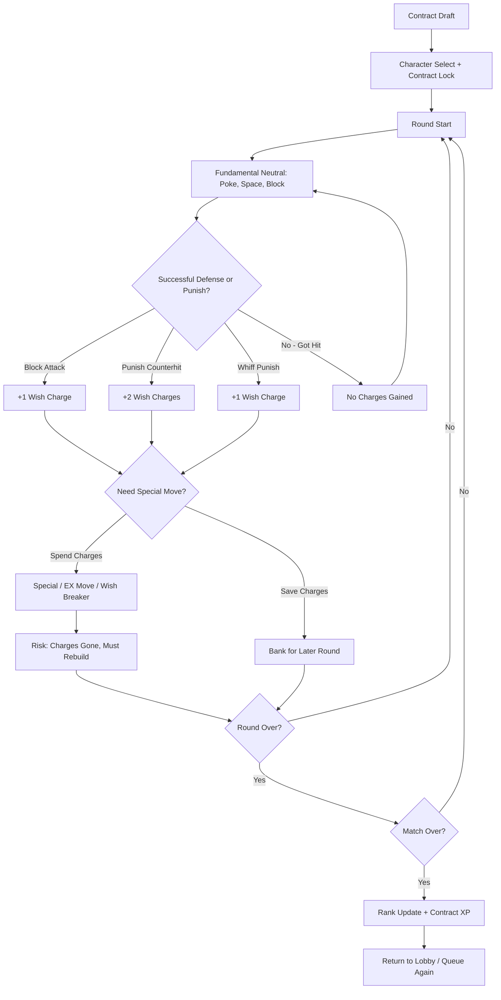
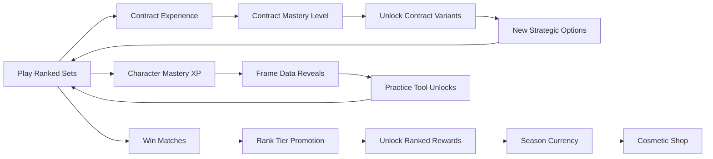

# Iron Djinn Protocol

## Title & Genre

| Field | Value |
|-------|-------|
| **Title** | Iron Djinn Protocol |
| **Genre** | Competitive Fighting Game / Esports |
| **Engine** | Unreal Engine 5.4 (custom rollback netcode, 1-frame input latency) |
| **Platform** | PC (Steam), PlayStation 5, Xbox Series X/S (cross-play, cross-progression) |
| **Monetization** | Premium $39.99 base, character season pass ($19.99/year), cosmetic outfit packs ($4.99-$9.99) |
| **Rating** | ESRB T (Violence, Mild Language) / PEGI 12 / CERO B |

---

## Vision Statement

Iron Djinn Protocol is a competitive 2.5D fighting game where every special move is a wish granted at a cost. Players select from a roster of djinn fighters, each bound to an elemental wish-granting contract that defines their moveset, frame data, and resource economy. The central tension is scarcity: wish charges fuel every super, every reversal, every hard read -- and they only regenerate through blocked attacks, successful punishes, and clean fundamental play. The patient player is rewarded. The button-masher runs dry. At tournament level, players manage their wish economy across entire best-of-three sets, not just individual rounds, creating a strategic layer where round-one spending decisions echo into round three.

Arenas are interdimensional -- crumbling temples, collapsing star-bridges, flooded bazaars -- and they react to accumulated wish energy. Walls crack. Platforms shift. Hazards ignite. A round-two arena is never identical to round one; the stage remembers what was spent. Before each set, players draft from three randomly offered wish contracts that subtly modify their character's properties, adding a pre-match mind game before the first punch lands.

This is a fighting game for people who love frame data and resource denial in equal measure -- where the best player wins not because they clicked faster, but because they spent smarter.

---

## Core Loop

**Target session length:** 20-45 minutes (3-8 ranked sets)

### Core Loop Breakdown

| Step | Player Action | System Response | Skill Expression |
|------|--------------|----------------|-----------------|
| 1. Contract Draft | Choose from 3 randomly offered contracts (e.g., "Blazing Oath: +10% fire damage, -1 starting charge") | Contract modifies frame data and special properties for the entire set | Pre-match strategy, matchup knowledge |
| 2. Character Select | Lock in a djinn fighter (20-character launch roster) | Opponent sees selection; counterpick window opens | Roster mastery, psychological reads |
| 3. Neutral Phase | Move, poke, space, block in 2.5D plane | Standard fighting game movement (walk, dash, jump, crouch) | Spacing, timing, footsies |
| 4. Defense | Block incoming attacks (high/low mixup) | Each blocked normal grants +1 wish charge; blocked special grants +2 | Patience, read quality, block stamina |
| 5. Punish | Counterhit after opponent whiffs or commits to unsafe move | Successful punish grants +2 wish charges; clean whiff punish grants +1 | Reaction speed, frame knowledge |
| 6. Spend | Activate special move (2 charges), EX move (4 charges), or Wish Breaker (6 charges, round-end super) | Powerful move executes; charges consumed | Resource timing, risk management |
| 7. Economy Carry | Unspent charges persist into next round (max bank: 8) | Round 2 starts with leftover charges from round 1 | Strategic restraint, set-level planning |
| 8. Arena Shift | Between rounds, arena transforms based on total wish energy spent | Walls crack, platforms shift, new hazards spawn | Adaptation, stage awareness |

### Round Economy Rules

| Resource | Starting Amount | Max | Regain Condition | Carry-Over |
|----------|----------------|-----|-----------------|------------|
| Wish Charges | 3 per round | 8 (banked) | +1 per blocked normal, +2 per blocked special, +1 per whiff punish, +2 per counterhit punish | Unspent charges carry to next round |
| Health | 1000 HP | 1000 | No regeneration | Reset each round |
| Round Timer | 99 seconds | 99 | N/A | N/A |
| Contract Effects | Active entire set | Entire set | N/A | Yes -- persists across all rounds |

---

## Meta Loop

### Session-to-Session Progression

### Progression Axes

| Axis | What Grows | How It Feels | Cap |
|------|-----------|-------------|-----|
| **Ranked Tier** | Iron through Diamond, then Master/GM leaderboard placement | Visible skill bracket; each promotion feels earned through consistent play | Master tier (top 200 per region) |
| **Contract Mastery** | Each contract levels with use, unlocking variant versions with tweaked parameters | Your favorite strategies deepen; the same contract reveals new nuances | Level 10 per contract (50 total contracts across roster) |
| **Character Mastery** | XP per character unlocks detailed frame data overlays, combo trials, and matchup notes in-game | The game teaches you its own secrets as you commit to a character | Level 20 per character (complete frame data + all trials) |
| **Arena Knowledge** | Stage-specific training unlocks after 10 matches per arena; reveals hidden hazard triggers and shift patterns | Arenas stop being random and become readable; you start drafting arenas, not just reacting | 15 arenas fully documented |
| **Season Progression** | Season pass track (free + premium) with cosmetic rewards tied to wins, not playtime | Every reward reflects skill investment, not wallet depth | 100 tiers per 3-month season |
| **Player Skill** | Execution consistency, matchup knowledge, economy discipline, set adaptation | Invisible but most powerful -- you read opponents faster, spend smarter, adapt sooner | No cap -- mastery is perpetual |

### Ranked Tier Distribution (Target)

| Tier | Population % | Wins Needed (from Iron) | Reward |
|------|-------------|------------------------|--------|
| Iron | 20% | 0 | Base rank icon |
| Bronze | 25% | 10 | Bronze title, 1 outfit recolor |
| Silver | 25% | 25 | Silver title, 2 outfit recolors |
| Gold | 15% | 50 | Gold title, seasonal weapon skin |
| Platinum | 8% | 85 | Platinum title, seasonal arena skin |
| Diamond | 4% | 130 | Diamond title, exclusive taunt |
| Master | 2.5% | Top 500 per region | Master badge, tournament eligibility |
| Grandmaster | 0.5% | Top 50 per region | GM badge, name on season monument |

---

## Game Mechanics

### Primary Mechanic: The Wish Economy

Every djinn fighter operates on the **Wish Charge** system. Special moves cost charges. Charges regenerate only through fundamental defense and punishment. This creates a dual-layer game: the mechanical layer (execution, combos, spacing) and the economic layer (when to spend, when to save, when to go dry).

**Charge Economy:**

| Action | Charges Gained | Notes |
|--------|---------------|-------|
| Block a normal attack | +1 | Must be a clean block (not chip damage from specials) |
| Block a special attack | +2 | High commitment from opponent = higher reward |
| Whiff punish (hit opponent during recovery) | +1 | Requires spacing knowledge |
| Counterhit punish (hit opponent during startup) | +2 | Requires read or reaction |
| Perfect block (block within 3-frame window of impact) | +3 | Highest-skill defensive action |
| Getting hit | +0 | No reward for losing |
| Throwing opponent | +1 | Grapplers have alternative charge paths |
| Anti-air successful | +1 | Vertical defense rewarded |

**Charge Expenditure:**

| Action | Charges Spent | Effect |
|--------|--------------|--------|
| Special Move (QCF+P, etc.) | 2 | Character-specific special; the backbone of combos and pressure |
| EX Special (QCF+PP) | 4 | Enhanced version: more damage, armor, or utility |
| Wish Breaker (Super, round-ender) | 6 | Devastating cinematic super; typically 35-45% health |
| Contract Power (once per round) | 3 | Activates contract-specific buff (varies by contract) |
| Wish Cancel (cancel normal into dash/backdash) | 1 | Roman Cancel equivalent; extends combos or creates pressure |
| Wish Guard (green health regen on block) | 2 | Next 3 blocked attacks regenerate 50 HP each |

**Economic States:**

| State | Charges | Visual Indicator | Strategic Implication |
|-------|---------|-----------------|----------------------|
| Empty | 0 | Djinn aura dim, smoke trails stop | Must play fundamental-only; vulnerable to pressure |
| Lean | 1-2 | Faint ember glow | Can Wish Cancel once or Guard once; must choose |
| Stocked | 3-4 | Visible fire aura, smoke trails | Full special move access; threatening but not dominant |
| Loaded | 5-6 | Bright elemental aura, ground cracks under feet | EX moves available; opponent must respect options |
| Brimming | 7-8 | Maximum visual intensity, screen-edge vignette | Wish Breaker available; full toolkit online; this is your moment |

### Secondary Mechanic: Shifting Arenas

Arenas transform between rounds based on total wish energy spent by both players. The stage remembers the economy.

**Arena Shift Table:**

| Total Charges Spent (Both Players Combined) | Shift Level | Arena Effect |
|---------------------------------------------|------------|--------------|
| 0-6 | Calm | Standard layout; symmetrical; no hazards |
| 7-14 | Stirring | One environmental change (wall weakens, platform lowers, hazard activates) |
| 15-22 | Turbulent | Two environmental changes + hazard damage zone appears |
| 23-30 | Fractured | Arena geometry changes (platforms collapse, new walls form, ring becomes smaller) |
| 31+ | Cataclysm | Full arena transformation; multiple active hazards; "wish storm" visual effect |

**Example Arena: The Star-Bridge of Iram**

| Shift Level | Layout | Hazard |
|------------|--------|--------|
| Calm | Flat bridge, walls both sides, 12m wide | None |
| Stirring | Right wall develops cracks (breakable after 3 more hits) | Meteor fragments fall in zone every 8 seconds |
| Turbulent | Right wall breaks; stage widens to 16m | Meteor zone grows; left wall develops cracks |
| Fractured | Floor section collapses; elevated platform appears center | Two meteor zones; floor is slippery near gaps |
| Cataclysm | Full open stage (no walls); floating debris platforms | Continuous meteor shower; "wish storm" reduces visibility |

**Arena Draft Rule:** In ranked play, the player who lost the previous round selects the next arena from the pool. Winner selects their respawn side. This creates a secondary mind game around stage knowledge.

### Secondary Mechanic: Contract System

Before each set, both players are offered 3 random contracts from a pool of 50. They select simultaneously (double-blind). Contracts subtly modify character properties for the entire set.

**Contract Categories:**

| Category | Effect Range | Example Contract |
|----------|-------------|-----------------|
| **Elemental Amplification** | +10-15% damage on specific element, -5% on another | "Oath of Cinder": Fire specials deal +12% damage, but ice specials cost +1 charge |
| **Economy Modifiers** | Change charge gain rates or starting charges | "Pact of Hunger": Start with +2 charges, but gain -1 from blocks (minimum 0) |
| **Frame Modifiers** | Adjust specific frame data by 1-2 frames | "Whisper of Speed": Light normals are +1 frame faster on startup, -1 frame on recovery |
| **Health Modifiers** | Adjust total HP or add regeneration | "Resilience of Stone": +100 HP, but movement speed reduced 5% |
| **Wish Breaker Modifiers** | Change super properties or cost | "Desperate Wish": Wish Breaker costs 5 instead of 6, but deals -15% damage |
| **Arena Affinity** | Bonus effects on specific arena types | "Bridge Walker": +1 charge when fighting on Star-Bridge stages |

**Contract Mastery Levels:**

| Level | XP Required | Unlock |
|-------|------------|--------|
| 1 | 0 (base contract) | Standard version |
| 3 | 500 XP (5 sets played) | Reveals exact numerical modifiers |
| 5 | 1500 XP (15 sets) | Unlocks Variant A (different trade-off) |
| 8 | 4000 XP (40 sets) | Unlocks Variant B (different trade-off) |
| 10 | 8000 XP (80 sets) | Contract Mastery title + animated border |

### Launch Roster (20 Characters)

| # | Djinn Name | Element | Archetype | Wish Charges Start | Signature Move | Wish Breaker |
|---|-----------|---------|-----------|-------------------|---------------|--------------|
| 1 | **Ifrit Ashwalker** | Fire | Rushdown | 3 | Hellstep Teleport (2 charges) | "Seven Sunsets" -- multi-hit fire barrage |
| 2 | **Marid Tidecaller** | Water | Zoner | 4 | Tidal Wall projectile (2 charges) | "Abyssal Claim" -- command grab tsunami |
| 3 | **Shaitan Ironveil** | Earth | Grappler | 2 | Stone Chain command grab (2 charges) | "Mountain's Sentence" -- cinematic earth spike |
| 4 | **Jann Windrider** | Air | Mixup | 3 | Gale Switch stance change (1 charge) | "Four Winds Judgment" -- unblockable mixup super |
| 5 | **Palash Emberknife** | Fire | Footsie | 3 | Flame Sweep mid-range poke (2 charges) | "Scorched Contract" -- advancing fire wave |
| 6 | **Qarin Deepmire** | Water | Trap | 4 | Whirlpool Mine (2 charges) | "Drowning Court" -- fullscreen trapping super |
| 7 | **Ghul Bonereaver** | Earth | Pressure | 2 | Tombstone Rush advancing normal (2 charges) | "Grave Procession" -- armored multi-hit |
| 8 | **Silat Stormweaver** | Air | Setup | 3 | Vacuum Pull (2 charges, pulls opponent) | "Eye of the Storm" -- fullscreen vacuum into combo |
| 9 | **Azazel Lightbinder** | Light | Zoning | 4 | Prism Beam (2 charges, fullscreen beam) | "Genesis Protocol" -- damaging light pillar |
| 10 | **Zal Ambervoid** | Void | Stance | 3 | Phase Shift intangibility (2 charges) | "Erasure Clause" -- unblockable command grab |
| 11 | **Rukh Thundercall** | Lightning | Rushdown | 3 | Lightning Step (2 charges, fast advance) | "Storm Herald" -- full-screen lightning sweep |
| 12 | **Nasnas Dustwalker** | Sand | Evasive | 3 | Sand Slide (1 charge, low-profile dash) | "Desert's Memory" -- mirage clones attack |
| 13 | **Bahamut Seadeep** | Water | Heavy | 2 | Leviathan Crush armored overhead (3 charges) | "Abyssal Maw" -- grab into water prison |
| 14 | **Peri Frostdancer** | Ice | Hit-and-run | 3 | Frost Step backward dash + icicle (1 charge) | "Glacial Wish" -- freezes stage, damage over time |
| 15 | **Daeva Shadowflame** | Dark | Pressure | 2 | Shadow Tether pulls on hit (2 charges) | "Void Contract" -- damage-over-time curse |
| 16 | **Rakshasa Bloodpact** | Blood | Aggressive | 2 | Crimson Spike draining projectile (2 charges) | "Blood Accord" -- sacrifices 200 HP for massive damage |
| 17 | **Urial Solarguard** | Light | Defensive | 4 | Solar Shield reflector (2 charges) | "Wrath of Morning" -- counter super, deals damage based on damage absorbed |
| 18 | **Dandan Venomcoil** | Poison | Trap | 3 | Toxic Bloom area denial (2 charges) | "Plague Wish" -- arena-wide poison cloud |
| 19 | **Hinn Harrier** | Wind | Speed | 3 | Cyclone Dash crossup (1 charge) | "Tempest Protocol" -- rapid teleporting assault |
| 20 | **Dao Stonewall** | Earth | Tank | 2 | Fortress Stance armor mode (2 charges) | "Seismic Verdict" -- ground-slam fullscreen punish |

### Frame Data Standards

All characters share these baseline frame conventions (modified by contracts):

| Action | Startup (frames) | Active | Recovery | On Block | On Hit |
|--------|-----------------|--------|----------|----------|--------|
| Light Punch | 4 | 2 | 6 | +2 | +5 |
| Medium Punch | 7 | 3 | 10 | -2 | +3 |
| Heavy Punch | 10 | 4 | 18 | -8 | -2 |
| Light Kick | 5 | 2 | 7 | +1 | +4 |
| Medium Kick | 8 | 3 | 12 | -3 | +2 |
| Heavy Kick | 12 | 5 | 20 | -10 | -4 |
| Crouch Light | 5 | 2 | 6 | +1 | +4 |
| Crouch Medium | 8 | 3 | 11 | -2 | +3 |
| Crouch Heavy (sweep) | 13 | 4 | 22 | -14 | KD |
| Jump-in | 6 | 8 | 4 (landing) | varies | varies |
| Throw | 5 | 2 | 20 | - | KD (+1 charge) |
| Overhead | 14 | 3 | 20 | -8 | +2 |

**Target frame rate:** 60 FPS on all platforms. Rollback netcode with 1-frame input delay baseline. Input buffer: 3 frames.

---

## World Design

### Arena Architecture

Arenas are grouped into 5 elemental planes. Each plane has 3 arenas (15 total at launch). Arenas within a plane share visual language but have distinct layouts and shift chains.

**The Five Planes:**

| Plane | Visual Language | Arenas |
|-------|----------------|--------|
| **Pyre (Fire)** | Volcanic temples, molten metal bridges, ember storms, brass architecture | Crucible of Ascent, Forge of Seven Wishes, The Burnt Throne |
| **Abyss (Water)** | Flooded palaces, coral combat platforms, bioluminescent depths, drowned columns | Tidecourt of Iram, The Sunken Bazaar, Leviathan's Wake |
| **Terran (Earth)** | Mountain coliseums, petrified forests, crystal caverns, standing stone circles | The Stone Arena, Oathbreaker's Pass, The Deep Vault |
| **Tempest (Air)** | Floating sky-bridges, cloud platforms, shattered star-glass, aurora backgrounds | Star-Bridge of Iram, The Windspire, Astral Crossing |
| **Void (Dark/Light)** | Abstract geometric spaces, shifting architecture, reality fractures, prismatic void | The Contract Hall, Between Worlds, The Null Arena |

### Art Direction Pillars

| Pillar | Description | Reference |
|--------|-------------|-----------|
| **Mythic Industrial** | Brass and iron forged with divine geometry; djinn magic meets brutalist architecture | Granblue Fantasy Versus stage design meets Destiny 2 Vault of Glass |
| **Elemental Extremity** | Each plane commits fully to its element -- fire arenas glow with heat haze, water arenas ripple with every impact | Guilty Gear Strive stage dynamism |
| **Living Geometry** | Arenas are not static backgrounds; they react to play. Walls crack on impact, floors glow where wish energy pools | Street Fighter 6 stage interactivity dialed to 11 |
| **Cosmic Scale** | Backgrounds hint at infinite space -- distant nebulae, collapsing stars, endless oceans -- contrasting the intimate 2.5D fight plane | Tekken 8 cinematic stages |

### Visual & Audio Progression per Match

| Round | Wish Energy Spent | Visual State | Audio Intensity | Arena Behavior |
|-------|-------------------|-------------|----------------|---------------|
| Round 1 | 0-6 (Calm) | Clean, sharp, full visibility | Stage theme at baseline volume; hit sounds crisp | Standard layout |
| Round 2 | 7-22 (Stirring-Turbulent) | Environmental effects begin; dust, embers, mist | Stage theme intensifies; crowd/ambient sounds rise | Hazards activate, geometry shifts |
| Round 3+ | 23+ (Fractured-Cataclysm) | Arena transforms; reality warps; screen-edge effects | Stage theme reaches crescendo; bass intensifies | Full transformation; multiple active systems |

### Character Visual Design Language

| Element | Aura Color | Trail Effect | Charge State Visual | Wish Breaker VFX |
|---------|-----------|-------------|--------------------|--------------------|
| Fire | Crimson-Orange | Flame wisps | Fire grows from hands to shoulders | Eruption of flame, screen flash orange |
| Water | Deep Blue-Green | Water droplets, mist | Water aura with floating bubbles | Tidal wave, screen fills with water distortion |
| Earth | Amber-Brown | Dust particles, stone chips | Rock armor forms on limbs | Ground shatters, seismic shockwave |
| Air | Pale Silver-White | Wind streaks, leaves | Cyclone forms around body | Tornado, screen warps with wind distortion |
| Lightning | Electric Blue-White | Sparks, afterimages | Lightning arcs between hands | Full lightning strike, screen flash white |
| Light | Golden-White | Light rays, prisms | Halo forms, stage brightens | Pillar of light from above, lens flare |
| Dark/Void | Deep Purple-Black | Shadow tendrils | Shadows detach and move independently | Void opens, screen inverts momentarily |
| Blood | Crimson-Black | Blood droplets, veins | Red veins spread across skin | Blood eruption, screen tints red |
| Ice | Pale Cyan-White | Frost crystals, breath vapor | Ice crystals form on fists and feet | Glacier formation, screen frosts at edges |
| Poison/Sand | Sickly Green / Amber | Toxic spores / Sand swirls | Poison bubbles / Sand grains orbit | Plague cloud / Sandstorm fills screen |

---

## Narrative

### Tone Spectrum (7-Axis)

| Axis | Position | Notes |
|------|----------|-------|
| Order ↔ Chaos | 60% Chaos | The Protocol is ancient law, but every wish twists it further |
| Human ↔ Divine | 70% Divine | Djinn are not human; their conflicts reshape reality |
| Mercy ↔ Ruthlessness | 55% Ruthlessness | Fighting is their nature; mercy is a contract clause, not a virtue |
| Past ↔ Future | 50% Balanced | Ancient protocols meet modern combat; time is irrelevant to djinn |
| Silence ↔ Spectacle | 75% Spectacle | Every fight is a cosmic event witnessed by the planes themselves |
| Individual ↔ Collective | 65% Individual | Each djinn fights for their own contract, their own wish, their own freedom |
| Honor ↔ Cunning | 60% Cunning | The smart fighter wins; honor is a contract you choose to sign |

### 8-Point Story Spine

**1. Equilibrium**
The Iron Djinn Protocol governs all conflict between djinnkind. When disputes arise between the elemental courts, combatants are bound by ancient contracts and fight in interdimensional arenas under the Protocol's authority. The Protocol ensures that power is checked by economy -- no djinn can overwhelm another through raw force alone, because every display of power costs wish energy that must be earned through discipline.

**2. Inciting Incident**
A fracture appears in the Contract Hall -- the nexus where all djinn contracts are stored. An unknown force has corrupted the founding Protocol, the original contract that limits djinn power in the mortal plane. Without it, djinn who win enough battles could break free of all restrictions. The five elemental courts blame each other.

**3. First Complication**
Each djinn who enters the Protocol tournament discovers that their personal contract has been altered. The wish they originally bound themselves to -- the motivation for their power -- has been rewritten. Some wishes became darker. Some became self-destructive. All of them lead back to the same question: who corrupted the Protocol, and why?

**4. Rising Action**
The tournament progresses through the five elemental planes. Each plane's guardian djinn holds a fragment of the original Protocol. Defeating them reveals a piece of the corruption's origin -- it was not external. A djinn from within the Protocol itself introduced the corruption, using the tournament as a selection process to find the strongest djinn to serve as a vessel.

**5. Midpoint Reversal**
The protagonist discovers that the corruption was introduced by the Protocol itself. The founding contract is not a restriction on djinn power -- it is a living entity that feeds on wish energy spent in combat. Every fight under the Protocol nourishes it. The tournament was never about resolving disputes; it is a harvesting mechanism.

**6. Crisis**
The protagonist must choose: continue fighting and growing stronger (feeding the Protocol) or refuse combat and lose their contract (becoming mortal, powerless, and vulnerable). The remaining tournament opponents are not enemies -- they are also searching for the truth, and the Protocol is pitting them against each other to maximize wish energy expenditure.

**7. Climax**
The final match takes place in the Contract Hall itself, now fully corrupted. The opponent is not another djinn -- it is the Protocol incarnate, wearing the form of the founding djinn who created it. A 5-round set where the arena shifts every round with escalating Cataclysm effects. The Protocol fights with every element simultaneously, adapting to the player's contract.

**8. Resolution**
Three endings based on combat performance across the arcade mode:
- **Subjugation:** Lose to the Protocol. Your djinn's contract is consumed. You become a permanent arena guardian. (Default ending)
- **Liberation:** Win without using any Wish Breakers across the final 3 fights. The Protocol starves. Contracts dissolve. Djinn are free but mortal. The arenas go silent.
- **Rewrite:** Win having achieved Contract Mastery Level 10 on your active contract. Your understanding of the contract system exceeds the Protocol itself. You rewrite the founding contract, preserving the Protocol but removing its parasitic nature. Djinn fight by choice, not compulsion. This is the hardest ending.

### Key Characters

| Character | Role | Theme | Arcade Mode Focus |
|-----------|------|-------|-------------------|
| **Ifrit Ashwalker** | De facto protagonist (arcade default) | Fire as ambition; burning hot burns fast | Seeking the origin of the corruption that weakened fire contracts |
| **Zal Ambervoid** | Rival / Antagonist candidate | Void as freedom through erasure; to be nothing is to be unlimited | Seeking to destroy the Protocol entirely, consequences be damned |
| **Urial Solarguard** | Moral center | Light as duty; guarding others at personal cost | Defending the Protocol's original purpose against corruption |
| **Marid Tidecaller** | Information broker | Water as memory; the deep knows what the surface forgets | Uncovering the history of the founding djinn |
| **Shaitan Ironveil** | Wild card | Earth as immovable conviction; refusing to bend regardless of force | Fighting to protect a specific contract that binds a mortal's life |
| **The Protocol** | True Antagonist | Institutions that outlive their purpose; systems that become self-preserving | Fought in the Contract Hall; adapts to player's element |

### Lore Delivery

Lore is delivered through 3 channels:

| Channel | Format | Content |
|---------|--------|---------|
| **Arcade Endings** | 20 unique endings (1 per character) | Each character's personal arc and resolution |
| **Contract Lore** | Unlocked through Contract Mastery | The history of each contract type and its original djinn creator |
| **Arena Codex** | Unlocked through Arena Mastery | The geography and politics of the five elemental planes |

---

## Player Personas

### P-001: Alex Rivera -- The Ranked Grinder

**Why this game fits:** Iron Djinn Protocol is built for competitive players who treat frame data as gospel. The wish economy creates a second axis of skill beyond execution -- Alex can outspend or underspend opponents, and both strategies are viable. The contract system adds pre-match strategy similar to loadout selection in his tactical shooters. Cross-play means his PC skills translate to a wider player pool. Ranked ladders with transparent MMR give him the measurable progression he craves.

**Predicted experience:** Alex mains Ifrit Ashwalker (rushdown, high execution ceiling) and grinds ranked 2-3 hours nightly. He studies frame data religiously, creates Google Sheets comparing contract modifiers, and pushes for Diamond tier every season. He loves the economy carry-over between rounds -- set-level resource planning is his edge against players with better raw reaction time. He ignores arcade mode entirely. He complains about matchup balance on Discord but plays religiously.

### P-010: Kevin Nguyen -- The Competitive Whale

**Why this game fits:** Kevin spends $100-300/month on games and dreams of esports. Iron Djinn Protocol offers a legitimate competitive ladder, tournament infrastructure, and -- critically -- no pay-to-win mechanics. His spending goes toward cosmetics (tournament skins, seasonal outfits, character customization) and the season pass. The skill ceiling is high enough to justify his training hours. The contract system gives him a strategic layer beyond pure execution that rewards study and preparation.

**Predicted experience:** Kevin buys the premium edition, every cosmetic pack, and plays 4-6 hours daily. He enters online tournaments weekly. He mains Rakshasa Bloodpact (high risk/reward, the health-sacrifice mechanic resonates with his aggressive playstyle). He creates YouTube content analyzing contract combinations and matchup spreadsheets. He spends $200/season on cosmetics alone but never has a competitive advantage from spending.

### P-005: Marcus Johnson -- The Competitive MOBA Player

**Why this game fits:** Marcus plays with a squad and values team coordination. While Iron Djinn Protocol is a 1v1 fighter, the contract draft system mirrors MOBA draft phases -- picking the right contract for the right matchup. The arena draft (loser picks stage) adds a pick/ban feel. Marcus's social nature means he'll organize local sessions, run crew battles, and create team tournaments even in a 1v1 game. The 2-3 hour daily play session fits perfectly.

**Predicted experience:** Marcus plays with his dorm squad in rotation -- they run crew battles (5v5, each player picks one character). He mains Marid Tidecaller (zoner, strong ranged game, good for teaching fundamentals to friends). He spends $15-35/month on cosmetics, always buying matching skins for his crew. He appreciates that the wish economy punishes button-mashing -- it means his less-skilled friends improve faster because the game rewards patience.

### P-008: David Park -- The Achievement Hunter

**Why this game fits:** 20 character mastery tracks, 50 contract mastery tracks, 15 arena mastery tracks, and 80+ achievements create a completionist paradise. The frame data unlock system (revealed through character mastery) gives David tangible, non-RNG progression. The contract variant system (Variant A and B at levels 5 and 8) means every contract has 3 versions to master. Ranked tier rewards are win-based, not time-based -- David's methodical spreadsheet approach translates directly to skill growth.

**Predicted experience:** David creates a master spreadsheet tracking all 20 characters, 50 contracts, and 15 arenas. He rotates through characters systematically, spending exactly 30 minutes per character per session. He pursues the Liberation ending (no Wish Breakers in final 3 fights) as his capstone achievement. He flags any frame data discrepancies between the in-game display and actual gameplay. He reaches Gold tier across all 20 characters as his ultimate goal.

---

## User Stories

### Core Mechanics (10 stories)

1. As **Alex (P-001)**, I want wish charges to carry over between rounds so that set-level resource planning creates a strategic advantage over players who only think round-by-round.
2. As **Kevin (P-010)**, I want perfect blocks to grant +3 charges so that the highest-skill defensive action is the most rewarding, and my training hours translate to tangible economy advantage.
3. As **Alex (P-001)**, I want the Wish Cancel (1 charge to cancel a normal into dash) so that I can extend combos and create pressure strings that reward execution skill.
4. As **Marcus (P-005)**, I want the arena to shift based on total wish energy spent so that every round feels different and stage knowledge is a learnable skill.
5. As **Alex (P-001)**, I want frame data to be unlockable through character mastery (not available by default) so that game knowledge is earned through play, not wikis.
6. As **David (P-008)**, I want every character to have 20 mastery levels with concrete unlocks at each tier so that I can track and plan my completion path.
7. As **Kevin (P-010)**, I want the contract system to offer 50 contracts with 3 variants each so that strategic depth grows with my investment in understanding the system.
8. As **Alex (P-001)**, I want the Wish Guard mechanic (2 charges for regen-on-block) so that defensive play has a tangible resource-backed expression, not just waiting.
9. As **Marcus (P-005)**, I want throw attempts to grant +1 charge on success so that grapplers have an alternative charge path that feels distinct from defensive charging.
10. As **David (P-008)**, I want frame data overlays to toggle on/off during practice mode so that I can train with information visible then test without it.

### Contract System (5 stories)

11. As **Kevin (P-010)**, I want contract selection to be simultaneous and double-blind so that counter-picking contracts is a mind game, not a reaction.
12. As **Alex (P-001)**, I want contracts to modify frame data by only 1-2 frames so that the system creates meaningful variation without breaking matchup balance.
13. As **David (P-008)**, I want contract mastery to unlock variant versions with different trade-offs so that mastery reveals new strategic dimensions.
14. As **Marcus (P-005)**, I want contract XP to be earned by playing sets (not winning) so that experimentation with off-meta contracts is not punished.
15. As **Alex (P-001)**, I want a contract preview that shows exact numerical modifiers once I reach Contract Mastery Level 3 so that informed play is rewarded over time investment.

### Arena & Environment (5 stories)

16. As **Alex (P-001)**, I want the loser of each round to pick the next arena so that stage knowledge becomes a strategic tool, not just visual variety.
17. As **Kevin (P-010)**, I want arena shift patterns to be learnable and predictable so that stage-specific training creates a measurable skill advantage.
18. As **David (P-008)**, I want arena mastery to unlock hidden hazard triggers and shift timing details so that thorough exploration of every stage is rewarded.
19. As **Marcus (P-005)**, I want arena hazards to affect both players equally so that stage selection is about leveraging knowledge, not exploiting asymmetry.
20. As **Alex (P-001)**, I want a practice mode that lets me set arena shift levels manually so that I can train specific arena states without playing through rounds.

### Progression & Ranked (6 stories)

21. As **Alex (P-001)**, I want ranked tiers with transparent MMR so that my progression is measurable and I can identify exactly where I plateau.
22. As **David (P-008)**, I want season rewards to be tied to wins (not playtime) so that my cosmetic collection reflects skill investment.
23. As **Kevin (P-010)**, I want Master tier to be top 500 per region with tournament eligibility so that the ladder feeds directly into competitive opportunity.
24. As **Marcus (P-005)**, I want crew battle support (5v5 team format) so that my squad can compete together in a 1v1 game.
25. As **Alex (P-001)**, I want a replay viewer that records match inputs so that I can analyze my spending patterns and identify economy mistakes.
26. As **David (P-008)**, I want cross-progression across PC, PlayStation, and Xbox so that my mastery progress follows me regardless of platform.

### Accessibility (5 stories)

27. As a player with motor impairments, I want an input assist mode that simplifies special move inputs to single-button + direction so that execution barriers do not block strategic depth.
28. As **David (P-008)**, I want fully remappable controls on all platforms so that my preferred layout (standardized across all fighting games I play) is supported.
29. As a player with color vision deficiency, I want wish charge states communicated through aura intensity and particle density (not just color) so that economy states are readable without color perception.
30. As a player with hearing impairments, I want visual indicators for audio cue moments (hit confirm timing, charge thresholds, round-end) so that no competitive information is audio-only.
31. As a new player, I want a comprehensive tutorial that teaches the wish economy, contract system, and arena shifts alongside basic fighting game fundamentals so that Iron Djinn Protocol is my first fighting game, not my fifth.

### Monetization & Fairness (4 stories)

32. As **Kevin (P-010)**, I want no pay-to-win mechanics whatsoever so that my tournament performance reflects my skill investment, not my wallet.
33. As **Alex (P-001)**, I want the season pass to have a free track with meaningful rewards so that F2P-adjacent players remain engaged in the ranked pool.
34. As **David (P-008)**, I want cosmetic purchases to be direct-buy (no loot boxes) so that I can acquire exactly the items I want without gambling.
35. As **Marcus (P-005)**, I want cross-play enabled by default so that matchmaking pools are as large as possible and queue times stay under 60 seconds.

---

## Monetization

### Revenue Model: Premium Base + Season Pass + Cosmetics

**Why this model fits this game:**
- Competitive fighting game players expect upfront cost and reject pay-to-win mechanics
- The wish economy is inherently skill-based -- no monetizable shortcut exists without destroying competitive integrity
- Cosmetic monetization thrives in fighting games (Guilty Gear Strive, Street Fighter 6 prove this model)
- Cross-play requires a single player pool; separate versions fragment matchmaking
- Tournament standardization demands that all gameplay content be accessible to all players

### Pricing & Content Roadmap

| Product | Price | Content | Target Window |
|---------|-------|---------|--------------|
| Standard Edition | $39.99 | 20 characters, 15 arenas, 50 contracts, full ranked mode, arcade mode | Launch |
| Deluxe Edition | $59.99 | Standard + Year 1 season pass + 3 exclusive outfit packs | Launch |
| Season Pass (Year 1) | $19.99 | 6 new characters (1 every 2 months), 3 new arenas, 10 new contracts | Launch (annual) |
| Outfit Pack (per character) | $4.99 | 3 alternate outfits + 1 weapon skin | Ongoing |
| Outfit Pack (bundle, 5 characters) | $9.99 | 5 character outfits at discount | Ongoing |
| Arena Skin Pack | $6.99 | Visual-only reskin of 3 arenas (no gameplay effect) | Quarterly |
| Season Pass Free Track | $0 | 30 tiers of rewards (recolor skins, titles, stage backgrounds) | Every 3 months |
| Season Pass Premium Track | $9.99 | 100 tiers of rewards (outfits, weapon skins, arena skins, taunts) | Every 3 months |

### Content Calendar (Year 1)

| Month | New Character | Element | Archetype | New Arena | New Contracts |
|-------|-------------|---------|-----------|-----------|--------------|
| 2 | **Simurgh Ashfeather** | Fire/Air hybrid | Rekka | The Ember Spire | 5 |
| 4 | **Kujata Deephorn** | Earth/Lightning | Heavy | Thunder Colosseum | 5 |
| 6 | **Kami Waterblade** | Water/Ice hybrid | Stance | Frozen Treaty Hall | 5 |
| 8 | **Manticore Venomspine** | Poison | Rushdown | The Blighted Garden | 5 |
| 10 | **Nue Thundermask** | Lightning/Dark hybrid | Mixup | The Shattered Pagoda | 5 |
| 12 | **Sphinx Enigma** | Light | Zoner | The Questioning Hall | 5 |

### Revenue Projections (4 Scenarios)

| Scenario | Year 1 Units | Base Revenue | Season Pass Attach | Cosmetic Revenue | Total Year 1 | Assumptions |
|----------|-------------|-------------|-------------------|-----------------|-------------|-------------|
| **Modest** | 120,000 | $4.8M | 15% ($360K) | $240K | $5.4M | Niche FGC appeal, word-of-mouth |
| **Baseline** | 350,000 | $14.0M | 25% ($1.75M) | $1.4M | $17.2M | Positive reviews, FGC adoption, moderate marketing |
| **Strong** | 800,000 | $32.0M | 30% ($4.8M) | $4.8M | $41.6M | EVO presence, influencer adoption, strong reviews |
| **Breakout** | 2,000,000 | $80.0M | 35% ($14.0M) | $14.0M | $108.0M | Mainstream crossover, award nominations, viral clips |

**Break-even at ~95,000 units ($3.2M) against total development budget of $3.0M (see Production Plan).**

### DLC Character Balance Promise

All new characters are free-to-try for 1 week on release, then require season pass or $7.99 individual purchase. Ranked play requires ownership, but casual lobbies allow playing against owned characters regardless. This prevents player pool fragmentation while maintaining monetization.

---

## Production Plan

### Team

| Role | Count | Phase | Monthly Cost (Loaded) |
|------|-------|-------|----------------------|
| Game Director / Lead Design | 1 | All | $13,000 |
| Combat Designer | 2 | All | $10,000 each |
| Netcode Engineer | 1 | All | $12,000 |
| Gameplay Programmers | 2 | All | $10,000 each |
| UI/UX Programmer | 1 | Months 2-16 | $9,500 |
| Engine / Rendering Programmer | 1 | Months 1-6, 12-16 | $11,500 |
| Character Artists | 3 | Months 2-16 | $8,500 each |
| Environment Artists | 2 | Months 3-14 | $8,000 each |
| VFX Artist | 1 | Months 4-16 | $8,500 |
| Technical Artist | 1 | Months 2-16 | $9,000 |
| Animator | 2 | Months 2-16 | $8,500 each |
| Audio Designer / Composer | 1 | Months 3-16 | $8,000 |
| Narrative Designer | 1 | Months 1-10 | $9,000 |
| QA Lead | 1 | Months 8-18 | $7,500 |
| QA Testers (gameplay balance) | 3 | Months 8-18 | $5,500 each |
| Online / Backend Engineer | 1 | Months 4-18 | $11,000 |
| Producer | 1 | All | $10,500 |

**Total team: 26 people peak (months 8-14)**

### Timeline (18-month production)

| Month | Milestone | Key Deliverables |
|-------|-----------|-----------------|
| 1 | Prototype | Core combat feel (2 characters), wish charge system, basic arena |
| 2 | Prototype Expansion | 4 characters playable, block/charge feedback loop validated, netcode prototype |
| 3 | Vertical Slice | 1 full character (Ifrit) at ship quality, 1 arena with shift system, ranked mock-up |
| 4 | Pre-Production Complete | 8 characters greyboxed, 5 arenas greyboxed, contract system designed, frame data spec locked |
| 5 | Production Phase 1 | Characters 1-8 art pass begin, netcode rollback validated at scale, tutorial flow designed |
| 6 | Production Phase 1 | Characters 9-12 greyboxed, arena shift system fully operational, contract pool reaches 30 |
| 7 | Production Phase 2 | Characters 1-8 at 80% art, 10 arenas greyboxed, ranked mode backend operational |
| 8 | Production Phase 2 | Characters 13-16 greyboxed, QA begins, first internal tournament test |
| 9 | Production Phase 2 | Characters 17-20 greyboxed, full roster moveset-complete, balance testing begins |
| 10 | Production Phase 3 | All characters at 80% art, all 15 arenas art-passed, contract pool complete (50) |
| 11 | Production Phase 3 | Arcade mode narrative content complete, all endings scripted and voiced |
| 12 | Alpha | Full game playable, all systems integrated, closed alpha test (500 players) |
| 13 | Alpha Iteration | Balance adjustments from alpha data, netcode stress test (10,000 concurrent), performance optimization |
| 14 | Beta | Open beta (public), cross-play validated, ranked season 0 test run |
| 15 | Beta Iteration | Balance patch based on beta data, final art polish, audio mix, accessibility pass |
| 16 | Release Candidate | Cert submission (PlayStation, Xbox), Steam submission, rollback netcode final validation |
| 17 | Launch | Game ships, day-1 patch deployed, season 1 begins, tournament mode activated |
| 18 | Post-Launch | Hotfixes, balance patch 1.1, first DLC character pre-production, EVO presence |

### Budget Breakdown

| Category | Cost | Notes |
|----------|------|-------|
| Salaries (18 months, 26 FTE peak) | $2,340,000 | Blended rate ~$9,800/mo avg |
| Unreal Engine 5 royalties | $0 (first $1M gross revenue free) | 5% after $1M |
| Software & Tools | $48,000 | Perforce, Jira, Adobe CC, Houdini, Wwise, WWise, matchmaking backend |
| Hardware (dev kits, workstations) | $55,000 | 4 PS5 dev kits, 4 Xbox dev kits, 20 workstations, fight stick test units |
| QA & Playtesting | $75,000 | External QA contractor (3 months), FGC playtest events (3 events, travel included) |
| Audio (recording, VO, music production) | $60,000 | Studio time, 5 VO actors (20 arcade endings), live recording sessions for stage themes |
| Online Infrastructure | $45,000 | Matchmaking servers (Year 1), rollback netcode testing infrastructure, CDN |
| Marketing | $150,000 | Trailers (3), EVO booth, influencer seeding program, PR firm retainer, FGC community building |
| Operations & Overhead | $80,000 | Office/incorporation/legal/accounting/insurance |
| Contingency (10%) | $245,000 | |
| **Total** | **$3,098,000** | |

---

## Technical Requirements

### Platform Specifications

| Spec | PC Minimum | PC Recommended | PlayStation 5 | Xbox Series X |
|------|-----------|---------------|--------------|--------------|
| **OS** | Windows 10 64-bit | Windows 11 64-bit | PS5 system software | Xbox OS |
| **CPU** | Intel i5-8400 / AMD Ryzen 5 2600 | Intel i7-9700K / AMD Ryzen 7 3800X | Custom AMD Zen 2 | Custom AMD Zen 2 |
| **RAM** | 8 GB | 16 GB | 16 GB GDDR6 | 16 GB GDDR6 |
| **GPU** | NVIDIA GTX 970 / AMD RX 480 | NVIDIA RTX 2060 / AMD RX 5700 | Custom RDNA 2 | Custom RDNA 2 |
| **Storage** | 15 GB SSD | 15 GB SSD | 15 GB SSD | 15 GB SSD |
| **Target Resolution** | 1080p / 60 FPS | 1440p / 60 FPS | 4K/60 FPS | 4K/60 FPS |
| **Input** | Keyboard, fight stick, gamepad | Same + VRAM for 120 FPS mode | DualSense, fight stick | Xbox controller, fight stick |
| **Network** | Broadband (rollback netcode) | Same | Same | Same |

### Key Technical Challenges

| Challenge | Risk | Mitigation |
|-----------|------|-----------|
| **Rollback netcode at 60 FPS with 1-frame input delay** | Critical -- fighting game viability depends on netcode quality | Dedicated netcode engineer from month 1. Build on GGPO-style rollback with UE5 integration. Validate at scale during beta (10,000 concurrent). Fallback: increase input delay to 2 frames if stability requires it. |
| **Arena shift system performing mid-round without stutter** | High -- geometry changes must not cause frame drops during gameplay | Pre-load all shift states at round start. Arena shifts triggered between rounds only (not mid-round). Visual transitions use material blending, not geometry streaming during gameplay. |
| **20 characters with distinct frame data, specials, and wish breaker animations** | Medium -- scope is manageable but animation quality per character must be high | Modular animation system: share base skeleton per body type (humanoid, heavy, agile), then layer character-specific animations. 2 dedicated animators from month 2. |
| **Cross-play across PC, PS5, Xbox with synchronized updates** | High -- platform cert timelines differ, risking desync | Unified build pipeline. Platform-specific builds differ only in SDK hooks. Cert submissions planned 6 weeks before each patch. Day-1 patch accounted for in timeline. |
| **Contract system balance (50 contracts x 20 characters x 3 variants)** | Medium -- combinatorial explosion of interactions | Contracts modify existing parameters, never create new mechanics. Automated balance testing suite simulates 10,000 matches per patch to detect statistical outliers. FGC advisory board for qualitative feedback. |
| **Matchmaking with cross-platform player pool** | Low -- standard infrastructure challenge | Region-based matchmaking with MMR bands. Cross-play enabled by default (opt-out available). Target: <60 second queue times for all tiers. |

### Netcode Specification

| Parameter | Value | Notes |
|-----------|-------|-------|
| Input delay (baseline) | 1 frame (16.67ms at 60 FPS) | Lowest possible for responsive feel |
| Rollback window | 7 frames max | Standard for competitive fighting games |
| Input buffer | 3 frames | Allows timing leniency without feeling sluggish |
| Desync detection | Continuous | Match interrupted and replayed if desync detected |
| Connection quality indicator | 5-bar system | Bars based on average rollback frames per match |
| Region locking | Soft (prefer same-region, expand if queue > 60s) | Ensures latency stays under 120ms in most matches |
| Spectator delay | 10 frames | Prevents stream sniping in tournament mode |

---

<npl-block type="reflection">
Correctness: All 12 sections present. Numbers internally consistent (budget $3.098M, break-even ~95K units at $39.99 = ~$3.2M before platform cuts; reasonable). Roster of 20 characters with named archetypes. Frame data table matches fighting game conventions. Revenue projections use conservative, baseline, strong, and breakout scenarios consistent with fighting game market (Guilty Gear Strive sold ~1M in Year 1; Street Fighter 6 ~2M).
Edge cases: Wish charge economy has minimum 0 and maximum 8 to prevent infinite banking or negative states. Arena shifts are between-round only to prevent mid-combat stutter. Contract modifiers are bounded (+/- 2 frames, +/- 15% damage) to prevent degenerate combinations. DLC characters are free-to-try for 1 week to prevent player pool fragmentation.
Security: No security concerns -- this is a game design document. However, online infrastructure (matchmaking servers, ranked MMR) would need anti-cheat and DDoS protection in implementation.
Pitfalls: The contract system's combinatorial balance (50 contracts x 20 characters) is the highest design risk. Mitigated by parameter-only modifications (no new mechanics) and automated testing, but live balance will require ongoing data analysis. The arena shift system, while compelling, could be polarizing -- competitive players often prefer static stages. Mitigated by providing a "Calm Mode" option for tournament play.
Improvements: Could expand the tutorial system design (currently 1 user story). Could detail the ranked matchmaking algorithm. Could add a spectator/replay system design section for esports infrastructure. Could detail the anti-cheat approach for online play.
Refactors: Document structure follows the 12-section format established by the cursed-paladin-bayou reference document exactly.
Documentation: This IS the documentation.
Clarifications: Persona mapping uses behavioral fit rather than platform match (personas are mobile-gaming-oriented but the game is console/PC premium). Alex, Kevin, Marcus, and David all map cleanly to competitive fighting game behaviors.
TODOs: DLC character kits (Year 1, 6 characters) would need individual design passes. Tournament mode features (double elimination, seeding, broadcast integration) would need a separate specification. Accessibility audit should be conducted during beta phase.
</npl-block>
