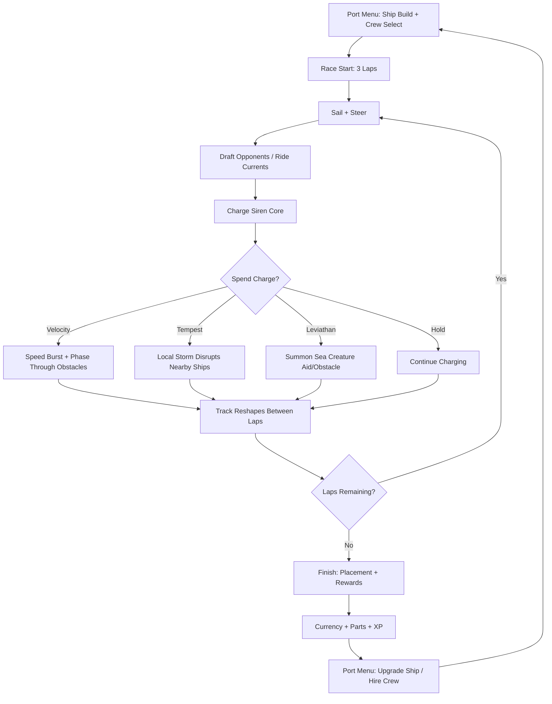
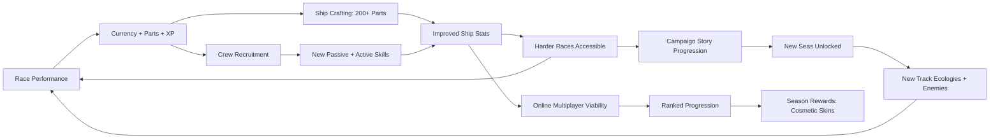

# Iron Siren Ocean Racing

## Title & Genre

| Field | Value |
|-------|-------|
| **Title** | Iron Siren Ocean Racing |
| **Genre** | Racing / Action |
| **Engine** | Unreal Engine 5.4 (Niagara for ocean FX, Water System 2.0 for dynamic surfaces) |
| **Platform** | PC (Steam/Epic), PlayStation 5, Xbox Series X/S, Nintendo Switch 2 |
| **Monetization** | Premium -- $34.99 base, cosmetic ship skins DLC, track expansion DLC |
| **Rating** | ESRB E10+ (Fantasy Violence) / PEGI 7 / CERO A |

---

## Vision Statement

Iron Siren Ocean Racing is a supernatural naval racer where pirate galleons infused with siren magic thunder across living oceans that reshape themselves between laps. It sits at the crossroads of Mario Kart's accessible chaos and Wave Race's physics-driven water handling, layered with a ship-building depth drawn from MechWarrior's modular loadouts. The ocean is not a backdrop -- it is the track, the obstacle, and the weapon. Whirlpools yawn open where calm straights existed one lap ago. Islands surface and submerge on a timer. Currents reverse without warning. The player channels siren songs to boost speed, summon tempests that scatter rival fleets, and call leviathans from the deep to blockade opponents. Ships are built from modular parts -- hulls, sails, siren cores, figureheads, crew quarters -- each altering handling, top speed, charge rate, and special ability output. Crew members grant passive bonuses and active race skills. A story-driven campaign spans six fantastical seas, each with its own ecological personality and antagonist. Online multiplayer supports up to 12 players. This is a racing game for people who think the ocean should fight back.

---

## Core Loop

**Target session length:** 15--25 minutes (3-lap race + menu/ship tweak)



### Core Loop Breakdown

| Step | Player Action | System Response | Skill Expression |
|------|--------------|----------------|-----------------|
| 1. Sail & Steer | Control ship heading and sail angle relative to wind | Ship accelerates with wind, decelerates against it. Wake physics affect trailing ships. Hull type determines turn radius and drift characteristics. | Racing line optimization, wind reading, drift timing |
| 2. Draft & Ride | Sail in another ship's wake or enter a current stream | Charge meter fills 3%/second while drafting (within 2 ship-lengths), 5%/second in currents. Visual: siren runes glow along the hull when charging. | Spatial awareness, positioning risk/reward (drafting = exposed to tempest/leviathan attacks) |
| 3. Charge Siren Core | Core fills from 0% to 100% via drafting, current riding, and collecting song pickups scattered on the track | Charge is persistent across laps but decays 2%/second when not actively charging. At 100% charge, excess bleeds off at 5%/second. | Resource management -- spend early and often or bank for a decisive move |
| 4. Velocity Song (30% charge) | Activate for a 4-second speed burst | Ship accelerates to 140% top speed, phases through environmental obstacles (rocks, debris, sea creature bodies). Trail of phosphorescent water behind ship. | Timing -- use on straights or to thread through obstacle-dense sections |
| 5. Tempest Song (50% charge) | Deploy a localized storm around the ship for 6 seconds | Any ship within 3 ship-lengths suffers reduced visibility, random steering drift, and 20% speed reduction. Storm visual: dark clouds, rain, lightning arcs between ships. | Positional -- must be near rivals to be effective; best used in clusters or on narrow sections |
| 6. Leviathan Song (80% charge) | Summon a sea creature for 8 seconds | Creature type depends on equipped figurehead: Kraken (grabs nearest rival for 3 seconds), Manta Ray (creates a speed-boost ramp for the summoner), Sea Serpent (lays a blockade across the track for 5 seconds). | Tactical -- high cost, high impact; best saved for final lap or critical overtakes |
| 7. Track Reshape | Between laps, the ocean reconfigures | Lap 1 layout is different from Lap 2, which is different from Lap 3. Whirlpools form/dissolve, islands rise/sink, currents shift direction. A minimap pulse warns of upcoming changes 5 seconds before they occur. | Adaptation -- memorization is impossible; reading the minimap pulse and adjusting line in real time is the core skill |
| 8. Finish | Cross the finish line after 3 laps | Placement determines reward tier: 1st (gold), 2nd--3rd (silver), 4th--6th (bronze), 7th--12th (participant). | Race craft -- consistent placement matters more than single-race wins in campaign mode |

---

## Meta Loop

### Session-to-Session Progression



### Progression Axes

| Axis | What Grows | How It Feels | Cap |
|------|-----------|-------------|-----|
| **Ship Power** | Hull durability, sail efficiency, siren core charge rate, figurehead ability strength | Your ship handles better, charges faster, hits harder with songs. You feel the difference between a Tier 1 sloop and a Tier 5 galleon. | 5 tiers, 40 unique ship configurations per tier |
| **Crew Mastery** | Number of crew slots (starts at 1, max 3), crew member levels, synergy bonuses between crew types | Your navigator spots currents 2 seconds earlier. Your gunner's harpoon reloads faster. Your bosun repairs more damage. The crew becomes an extension of the ship. | 24 recruitable crew, 3 active slots, each levels to 10 |
| **Campaign Progress** | Story chapters completed, seas unlocked, antagonist confrontations | Each new sea introduces a distinct ecological personality and visual identity. The narrative gives weight to each race beyond the finish line. | 6 seas, 4--6 tracks each (28--36 tracks total) |
| **Player Skill** | Track adaptation speed, song timing accuracy, drafting efficiency, crew ability usage | The invisible axis -- you read the minimap faster, anticipate reshapes earlier, time your tempest to hit 3 ships at once instead of 1. | No cap -- the living tracks ensure perpetual learning |
| **Collection** | Parts discovered, crew recruited, figureheads unlocked, cosmetic skins earned | The shipyard fills with options. Your dock shows every ship you have built. The codex tracks every creature encountered. | 200+ parts, 24 crew, 12 figureheads, 60+ cosmetic skins |

---

## Game Mechanics

### Primary Mechanic: Siren Song System

The siren song system is the game's central strategic resource. It operates on a **single charge gauge** (0--100%) with three spend tiers:

**Charge Acquisition:**

| Source | Charge Rate | Conditions |
|--------|-----------|------------|
| Drafting (within 2 ship-lengths of another vessel) | 3%/second | Must maintain proximity; tempest/leviathan makes this risky |
| Riding currents | 5%/second | Currents shift between laps; some are beneficial, some are traps |
| Song pickups (floating rune stones on track) | 10% per pickup | 4--6 per track per lap; respawn in different positions each lap |
| Perfect drift (maintaining drift angle through a turn without hitting walls) | 2%/second during drift | Rewards technical sailing |
| Crew passive bonuses | Varies by crew member | Navigator: +1%/sec always. Bosun: +3% on successful hull repair. Gunner: +5% on harpoon hit. |

**Song Tiers:**

| Song | Charge Cost | Duration | Cooldown | Effect | Counterplay |
|------|-----------|----------|----------|--------|-------------|
| **Velocity** | 30% | 4 seconds | 8 seconds | +40% speed, phase through obstacles, phosphorescent trail | Cannot turn sharply during boost; ends early if player collides with another ship |
| **Tempest** | 50% | 6 seconds | 12 seconds | 3 ship-length AoE: -20% speed to rivals, random steering drift, reduced visibility | Ships with Velocity active are immune. Tempest Proof hull modification reduces effect by 50%. |
| **Leviathan** | 80% | 8 seconds (creature) | 20 seconds | Summons creature based on figurehead (see below). Creature is targetable by other songs. | Tempest disrupts the creature. Velocity lets a ship outrun it. Another Leviathan can engage it in combat. |

**Leviathan Summon Types (by Figurehead):**

| Figurehead | Creature | Effect | Rarity |
|-----------|---------|--------|--------|
| Kraken Head | Giant Squid | Grabs nearest rival ship for 3 seconds, holding it in place | Starter (unlocked by default) |
| Manta Ray Crest | Giant Manta | Creates a luminous ramp in front of summoner's ship for speed boost + air time over obstacles | Unlocked in Shimmering Sea |
| Sea Serpent Figurehead | Armored Serpent | Blocks the track for 5 seconds in a position chosen by the summoner | Unlocked in Abyssal Trench |
| Coral Crown | Living Reef | Spawns a line of coral obstacles behind the summoner that persist for 6 seconds | Unlocked in Bloom Atoll |
| Whale Skull | Ghost Whale | Creates a slipstream tunnel for the summoner that lasts 5 seconds (+30% speed, immune to disruption) | Unlocked in Frozen Maw |
| Jellyfish Lantern | Swarm of Jellyfish | Drops a field of stinging jellyfish that slow any ship passing through for 3 seconds | Unlocked in Stormveil Reach |
| Leviathan Jaw | The Leviathan itself | Massive creature surfaces and creates a wave that pushes all ships in a direction chosen by the summoner | Unlocked by completing the campaign |
| Ancient Tortoise Shell | Giant Tortoise | Creates a moving shield around the summoner's ship for 4 seconds, absorbing all song effects | Unlocked via hidden collectible |
| Stormbird Beak | Lightning Bird | Calls a lightning strike on the leading ship, stunning it for 2 seconds | Unlocked in Stormveil Reach |
| Siren Queen Statue | Enchanted Siren | Charms the 2 nearest rival ships, causing them to sail toward the summoner for 2 seconds | Unlocked by recruiting the Siren Herald crew member |
| Dragon Turtle Crest | Dragon Turtle | Creates a whirlpool at a target location that pulls nearby ships toward its center for 4 seconds | Unlocked in Abyssal Trench |
| Void Eel Mask | Shadow Eel | Makes the summoner's ship invisible to other players for 3 seconds (no minimap blip, translucent visual) | Unlocked via ranked multiplayer reward |

### Secondary Mechanic: Living Ocean Tracks

Tracks are not static layouts. The ocean reconfigures between laps according to a **per-track reshape script** with randomized elements.

**Reshape Elements:**

| Element | Visual | Gameplay Effect | Frequency |
|---------|--------|----------------|-----------|
| Whirlpool formation | Water spirals, dark center, foam ring | Ships caught in the outer ring are pulled toward center; inner ring traps ships for 2 seconds before ejecting | 1--3 per track per transition |
| Island surfacing | Rocky outcrop rises from water with spray | Creates new obstacle or shortcut depending on position | 0--2 per track per transition |
| Island submerging | Island sinks with bubbling | Opens previously blocked paths, removes previous shortcut | 0--2 per track per transition |
| Current reversal | Arrow indicators on water surface flip | Beneficial currents become opposing currents and vice versa | 1--2 reversals per track per transition |
| Fog bank | Thick mist rolls across a section | Visibility reduced to 2 ship-lengths; minimap still functions | 0--1 per track per transition |
| Rogue wave | Large wave forms and travels across track | Ships hit by the wave are launched airborne for 1.5 seconds (loss of steering, but immune to songs during airtime) | 0--1 per track, Lap 3 only |

**Lap Transition Example -- "Coral Gauntlet" (Bloom Atoll):**

| Lap | Configuration |
|-----|--------------|
| Lap 1 | Wide-open straights with gentle currents pushing right. Two small islands on the inside of Turn 3. Song pickups clustered near the start line. |
| Lap 2 | A whirlpool opens at the apex of Turn 3 where the islands were (they submerged). Current in the main straight reverses (now pushing left, against the racing line). Fog bank rolls in on the back straight. New song pickups spawn near Turn 5. |
| Lap 3 | Whirlpool dissolves. A rogue wave spawns on the back straight (timed to hit the pack). Current reverses again (pushing right, now beneficial on the racing line). Two new islands surface creating a narrow chicane on the main straight. Fog lifts. Song pickups concentrated at Turn 1 and Turn 4. |

**Minimap Pulse:** 5 seconds before each lap transition, the minimap flashes the upcoming changes with translucent icons. Skilled players who read the pulse can adjust their line before the change occurs.

### Secondary Mechanic: Ship Crafting

Ships are assembled from 5 modular slots, each with multiple part options. Parts are earned through race rewards, campaign milestones, and a shipyard crafting system using materials collected during races.

**Slot 1 -- Hull (determines base stats):**

| Hull | Top Speed | Acceleration | Turn Rate | Durability | Song Charge Rate | Notes |
|------|----------|-------------|-----------|-----------|-----------------|-------|
| Sloop | 7/10 | 9/10 | 9/10 | 3/10 | 6/10 | Light, agile, fragile. Best for velocity-focused builds. |
| Caravel | 6/10 | 7/10 | 8/10 | 5/10 | 7/10 | Balanced mid-weight. Good all-rounder. |
| Frigate | 8/10 | 6/10 | 5/10 | 6/10 | 5/10 | Fast on straights, sluggish in turns. |
| Galleon | 5/10 | 4/10 | 3/10 | 10/10 | 4/10 | Tank. Barely feels tempest disruption. Slow but unstoppable. |
| Junk | 6/10 | 8/10 | 7/10 | 4/10 | 8/10 | Excellent charge rate. Siren-song specialist. |
| Longship | 9/10 | 7/10 | 6/10 | 4/10 | 3/10 | Speed demon. Low charge rate means fewer songs per race. |
| Turtle Ship | 4/10 | 3/10 | 4/10 | 9/10 | 6/10 | Armored shell. Immune to leviathan grabs. Crew gets +1 passive bonus. |
| Catamaran | 7/10 | 8/10 | 8/10 | 3/10 | 7/10 | Stable on rough water. Ignores rogue wave knockup. |

**Slot 2 -- Sails (determine acceleration and wind interaction):**

| Sail Type | Acceleration Bonus | Wind Bonus | Special | Count Available |
|-----------|-------------------|-----------|---------|----------------|
| Square Rig | +0 | +20% with-tailwind | Simple, reliable | 6 variants |
| Lateen Rig | +1 | +10% all wind | Consistent in any wind | 5 variants |
| Clipper Sails | +2 | +30% with-tailwind, -10% headwind | High ceiling, low floor | 4 variants |
| Storm Sails | +0 | +15% all wind, immune to fog speed penalty | Built for rough conditions | 3 variants |
| Siren Silk | +1 | +10% all wind, +2% song charge/sec | Synergizes with song-focused builds | 2 variants (rare) |

**Slot 3 -- Siren Core (determines song specialization):**

| Core Type | Velocity Power | Tempest Power | Leviathan Power | Passive | Count Available |
|-----------|---------------|--------------|----------------|---------|----------------|
| Azure Core | +30% duration | Standard | Standard | Charge decays 1%/sec instead of 2%/sec | Starter |
| Crimson Core | Standard | +30% radius | Standard | Tempest cooldown reduced by 3 seconds | 4 variants |
| Abyssal Core | Standard | Standard | +30% creature duration | Leviathan cooldown reduced by 5 seconds | 3 variants |
| Prismatic Core | +15% all songs | +15% all songs | +15% all songs | No specialization penalty | 2 variants (rare) |
| Void Core | -20% all songs | -20% all songs | -20% all songs | Charge rate +50% (faster cycling, weaker effects) | 1 variant (legendary) |

**Slot 4 -- Figurehead (determines Leviathan summon type):**
See the 12 figureheads in the Leviathan Summon Types table above.

**Slot 5 -- Crew Quarters (determines crew capacity):**

| Quarters Type | Crew Slots | Stat Penalty | Notes |
|--------------|-----------|-------------|-------|
| Minimal Quarters | 1 | None | Standard. No weight penalty. |
| Expanded Quarters | 2 | -5% top speed | Second crew member adds significant tactical options. |
| Barracks | 3 | -10% top speed, -5% turn rate | Maximum crew flexibility at a handling cost. |

### Crew Recruitment

Between races, the player visits ports to hire crew members. Each crew member has one passive ability and one active race skill.

**Crew Roster (24 members across 4 categories):**

**Navigators (spot track features early, improve positioning):**

| Crew Member | Passive | Active Skill | Active Cooldown | Location |
|------------|---------|-------------|----------------|----------|
| Mirael "Current-Eye" Voss | Minimap pulse extends to 8 seconds (instead of 5) | Reveal: Highlights the optimal racing line for 4 seconds | 30 seconds | Port Azure (Shimmering Sea) |
| Tidal Tom | +1%/sec charge while in currents | Current Sense: Highlights all currents on minimap for 5 seconds | 25 seconds | Port Drift (Bloom Atoll) |
| Captain Nereida | +10% turn rate | Snap Turn: Instant 90-degree turn in chosen direction without speed loss | 40 seconds | Port Maelstrom (Abyssal Trench) |
| Old Salty | Immune to fog speed penalty | Foghorn: Clears fog in a 5 ship-length radius for 4 seconds | 35 seconds | Port Frostheim (Frozen Maw) |
| Zara the Untethered | +5% top speed when no other ships within 5 lengths | Lone Surge: +15% speed for 3 seconds (only works when isolated) | 20 seconds | Port Skybreak (Stormveil Reach) |
| The Blind Helmsman | +20% charge from song pickups | Echo Locate: Reveals all song pickup positions for 5 seconds | 30 seconds | Hidden port (requires map fragment) |

**Gunners (offensive abilities, disrupt rivals):**

| Crew Member | Passive | Active Skill | Active Cooldown | Location |
|------------|---------|-------------|----------------|----------|
| Blackbeard Jr. | +5% charge on harpoon hit | Harpoon Shot: Fires a grapple that pulls the player toward a target ship (catch-up mechanic) | 15 seconds | Port Cannon (starting port) |
| Scoria the Red | Tempest radius +10% | Chain Lightning: During Tempest, lightning arcs to a second target ship | 25 seconds | Port Maelstrom (Abyssal Trench) |
| Fintan "Ironjaw" O'Brien | Leviathan creatures move 15% faster | Depth Charge: Drops an explosive behind the ship that detonates after 2 seconds, stunning nearby rivals for 1 second | 20 seconds | Port Frostheim (Frozen Maw) |
| Yuki Frost-Tip | Hull damage from tempests reduced by 30% | Ice Shot: Fires a freezing projectile that creates a 3-ship-length ice patch (ships slide on it, lose steering for 1.5 seconds) | 25 seconds | Port Frostheim (Frozen Maw) |
| Raj the Chainmaster | Harpoon cooldown reduced by 3 seconds | Grapple Net: Fires a net that slows a target ship by 40% for 2 seconds | 20 seconds | Port Azure (Shimmering Sea) |
| Madame Voltaire | Leviathan creatures have +20% HP (harder for rivals to destroy) | Sabotage: Disables the nearest rival's song ability for 3 seconds | 35 seconds | Port Skybreak (Stormveil Reach) |

**Bosuns (defensive and repair abilities):**

| Crew Member | Passive | Active Skill | Active Cooldown | Location |
|------------|---------|-------------|----------------|----------|
| Barnacle Pete | Hull regenerates 1% per second passively | Emergency Patch: Instantly restore 30% hull integrity | 45 seconds | Port Cannon (starting port) |
| Coral the Smith | Tempest duration on own ship reduced by 25% | Reinforce: Become immune to song effects for 3 seconds | 30 seconds | Port Drift (Bloom Atoll) |
| Iron Mae | Ship does not slow down when hitting small obstacles | Battering Ram: Next collision with a rival ship deals knockback and 10% hull damage to the rival (0% to self) | 25 seconds | Port Frostheim (Frozen Maw) |
| Whispering Jax | +3% charge/sec while tempest or leviathan is active on own ship | Dispel: Remove one negative song effect currently affecting the ship | 20 seconds | Port Azure (Shimmering Sea) |
| Grundel the Thick | Leviathan grabs last 1 second less on own ship | Anchor: Ship becomes immovable for 2 seconds (immune to all knockback, pulls, and pushes) | 35 seconds | Port Maelstrom (Abyssal Trench) |
| Sera the Stitcher | Hull damage from collisions reduced by 40% | Quick Fix: Restore 15% hull integrity to all allies within 4 ship-lengths (team modes only) | 30 seconds | Hidden port (requires ally rescue mission) |

**Specialists (unique abilities that defy categorization):**

| Crew Member | Passive | Active Skill | Active Cooldown | Location |
|------------|---------|-------------|----------------|----------|
| The Siren Herald | +10% leviathan duration | Siren's Call: Charm the nearest sea creature (leviathan summons become allied to you for 3 seconds) | 45 seconds | Unlocked via campaign completion |
| Storm Prophet Oris | Current reversals announced 10 seconds early (instead of 5) | Part the Sea: Create a temporary gap in any wall of obstacles or creature blockade for 3 seconds | 40 seconds | Port Skybreak (Stormveil Reach) |
| Lucky Penny | +15% rare part drop rate from races | Coin Flip: 50% chance to gain 20% charge instantly, 50% chance to lose 10% charge | 10 seconds | Hidden port (requires 10 race win streak) |
| Echo the Mimic | Copies the passive of the last crew member who used an active ability near you | Mirror: Copy the last active ability used by any crew member within 5 ship-lengths | 50 seconds | Unlocked via crew collection milestone (recruit 15 crew) |
| The Kraken Priestess | Leviathan grabs last 1 second longer on rival ships | Ink Cloud: Deploy a blinding ink cloud behind the ship (same effect as fog but localized and player-placed) | 30 seconds | Hidden port (requires all Abyssal Trench collectibles) |
| Captain Ironheart | All crew passives are 10% stronger | Rally: All allied crew active cooldowns reduced by 5 seconds (team modes only) | 60 seconds | Unlocked via multiplayer ranked tier 10 |

### Difficulty Progression Table

| Sea (Campaign Chapter) | Track Count | Reshape Complexity | AI Aggression | New Hazards | Song Pickups Per Lap | Siren Core Tier Available |
|------------------------|------------|-------------------|--------------|-------------|---------------------|--------------------------|
| 1 -- Siren's Wake (tutorial) | 4 | 1--2 changes per transition | Low: AI avoids songs, sails clean lines | Whirlpools only | 6 | Tier 1 |
| 2 -- Shimmering Sea | 5 | 2--3 changes per transition | Medium: AI uses velocity, occasional tempest | + Current reversals, island surfacing | 5 | Tier 1--2 |
| 3 -- Bloom Atoll | 6 | 3--4 changes per transition | Medium-High: AI uses tempest strategically, drafts in packs | + Fog banks, coral obstacles | 5 | Tier 2 |
| 4 -- Stormveil Reach | 6 | 4--5 changes per transition | High: AI coordinates leviathan summons, targets leader | + Rogue waves, lightning strikes on track | 4 | Tier 2--3 |
| 5 -- Frozen Maw | 5 | 4--5 changes per transition | High: AI exploits current reversals, uses crew actives | + Ice patches, breaking ice (dynamic obstacles), reduced visibility | 4 | Tier 3 |
| 6 -- Abyssal Trench | 5--6 | 5--6 changes per transition | Extreme: AI uses all song types, crew actives, and track knowledge | + All hazards + abyssal pulls (gravity wells), bioluminescent dead zones (no minimap) | 3 | Tier 3--5 |
| Mirror Mode (post-game) | All 31--32 tracks | Same but 2x speed transitions | Extreme+ | All hazards + accelerated timing | 3 | All tiers |

---

## World Design

### Map Structure

Six seas, each with a distinct visual identity and ecological personality. The campaign travels through them sequentially, but all previously unlocked seas remain accessible for free racing and grinding.

```
                    ┌────────────────────┐
                    │  ABYSSAL TRENCH    │
                    │  (Final Sea)       │
                    │  Bioluminescent    │
                    │  deep ocean        │
                    └─────────┬──────────┘
                              │
              ┌───────────────┴───────────────┐
              │                               │
    ┌─────────┴──────────┐        ┌───────────┴──────────┐
    │   FROZEN MAW       │        │  STORMVEIL REACH      │
    │   Arctic waters    │        │  Perpetual storms     │
    │   Breaking ice     │        │  Lightning & wind     │
    └─────────┬──────────┘        └───────────┬──────────┘
              │                               │
              └───────────────┬───────────────┘
                              │
              ┌───────────────┴───────────────┐
              │                               │
    ┌─────────┴──────────┐        ┌───────────┴──────────┐
    │   BLOOM ATOLL      │        │  SHIMMERING SEA       │
    │   Coral reefs      │        │  Crystal clear        │
    │   Tropical life    │        │  Sunlit waters        │
    └─────────┬──────────┘        └───────────┬──────────┘
              │                               │
              └───────────────┬───────────────┘
                              │
                    ┌─────────┴──────────┐
                    │  SIREN'S WAKE      │
                    │  (Starting Sea)    │
                    │  Calm, tutorial    │
                    └────────────────────┘
```

### Art Direction Pillars

| Pillar | Description | Reference |
|--------|-------------|-----------|
| **Nautical Splendor** | Golden-age pirate aesthetics elevated to fantasy -- ornate galleons with glowing runes, carved figureheads that come alive, sails embroidered with siren script | Sea of Thieves ship design meets Assassin's Creed Black Flag naval combat art |
| **Living Water** | The ocean is the main character -- water has personality, color, and mood. It glows in the Shimmering Sea, rages in Stormveil, freezes mid-wave in the Frozen Maw | Wave Race 64 water physics, Subnautica bioluminescence, Moana ocean character animation |
| **Ecological Fantasy** | Each sea is a complete biome with its own flora, fauna, and color palette. Bloom Atoll has coral castles. The Abyssal Trench has anglerfish the size of islands. | Monster Hunter World biomes, Studio Ghibli ocean creatures |
| **Siren gothic** | Beneath the beauty, the siren influence is unsettling. Siren runes pulse with hypnotic patterns. Sea creatures have too many eyes. The song is beautiful but wrong. | Hollow Knight's aesthetic beauty mixed with dread, Pikmin's colorful menace |

### Visual & Audio Progression

| Sea | Palette Dominant | Water Visual | Ambient Audio | Music Style |
|-----|-----------------|-------------|--------------|-------------|
| 1 -- Siren's Wake | Cerulean, white foam, warm gold | Calm, gentle swells, translucent | Lapping waves, distant gulls, creaking wood | Light shanty -- acoustic guitar + fiddle |
| 2 -- Shimmering Sea | Turquoise, silver, pearl | Crystal clear, bioluminescent sparkles at night, flat and fast | Underwater chimes, distant whale song | Calypso -- steel drums + strings |
| 3 -- Bloom Atoll | Coral pink, emerald green, tropical orange | Warm, reef-colored beneath surface, gentle current lines visible | Coral crackling, tropical birds, bubbling | Tropical -- marimba + flute + light percussion |
| 4 -- Stormveil Reach | Dark slate, electric violet, lightning white | Churning, whitecaps, rain-slicked surface, spray | Thunder, howling wind, creaking timber under stress | Epic orchestral -- full brass + drums + choir |
| 5 -- Frozen Maw | Ice blue, frost white, deep navy | Semi-frozen, breaking ice sheets, steam from thermal vents | Ice cracking, wind howling, muffled underwater sounds | Nordic -- hurdy-gurdy + throat singing + strings |
| 6 -- Abyssal Trench | Black, bioluminescent green, deep crimson, phosphorescent purple | Dark, deep, glowing organisms, pressure-waves distort surface | Deep drone, bioluminescent pops, heartbeat-like pulse | Ambient + synth -- no percussion, growing intensity |

---

## Narrative

### Tone Spectrum (7-Axis)

| Axis | Position | Notes |
|------|----------|-------|
| Wonder ↔ Danger | 60% Wonder | The seas are beautiful before they are deadly |
| Competition ↔ Cooperation | 65% Competition | Racing is the core; cooperation exists in team modes and crew synergy |
| Beauty ↔ Grotesque | 70% Beauty | Siren aesthetics lean beautiful; grotesque moments are earned and impactful |
| Nature ↔ Supernatural | 55% Supernatural | The ocean is natural in behavior but supernatural in origin |
| Freedom ↔ Destiny | 50% Balanced | The player races for glory, but the siren song has its own plans for those who channel it |
| Exploration ↔ Competition | 60% Competition | Tracks are the world; ports are the hubs; racing IS the journey |
| Sound ↔ Silence | 80% Sound | The siren song is the narrative spine -- the game is never silent |

### 8-Point Story Spine

**1. Equilibrium**
Captain Isara Vane commands the *Iron Siren*, a mid-sized frigate with a stolen siren core embedded in its hull. She races in the coastal circuits around Port Cannon -- small-time races for modest purses. Her crew is loyal but small: a gunner named Blackbeard Jr. and a bosun named Barnacle Pete. The siren core hums quietly. Isara does not yet understand what it wants.

**2. Inciting Incident**
During a routine race, the siren core activates unprompted, unleashing a velocity burst that propels the *Iron Siren* across the finish line at impossible speed. The race officials disqualify Isara for "unsanctioned siren magic." That night, a stranger arrives at the docks -- a weathered navigator named Mirael Voss, who tells Isara that her core is a fragment of the Siren Queen's voice, and that six seas are awakening. The Queen is calling her fragments home. Isara can either answer the call and race the six seas to restore the voice, or the core will consume her ship from the inside out.

**3. First Complication**
The first sea -- the Shimmering Sea -- is beautiful but hostile. Isara encounters rival captains who also carry siren core fragments, each racing for their own reason. The Siren Magistrate, a governing body of siren-bound captains, demands Isara surrender her core fragment. She refuses. The Magistrate places a bounty on the *Iron Siren*. Every race from this point forward has ships trying to win and ships trying to stop Isara from finishing.

**4. Rising Action**
Isara races through the Bloom Atoll and Stormveil Reach, collecting crew members and ship parts at each port. She learns that the Siren Queen was not a benevolent figure -- she was a tyrant who used her voice to enslave sea creatures and control the oceans. The fragments of her voice carry her will. Each time Isara uses a siren song in a race, the Queen's influence grows stronger. Isara begins hearing the Queen's whispers between races, offering power in exchange for obedience.

**5. Midpoint Reversal**
At the Frozen Maw, Isara confronts Admiral Corset, the leader of the Siren Magistrate. Corset reveals that the Magistrate was founded to prevent the Queen's return -- they are not villains, but guardians who use siren cores to monitor and contain the fragments. Corset offers Isara a choice: join the Magistrate and race under their authority, or continue alone and risk the Queen's complete resurrection. Isara, whose core fragment has already begun altering her perception (she sees sea creatures as allies instead of obstacles), refuses to surrender her autonomy. She breaks from the Magistrate entirely.

**6. Crisis**
The Abyssal Trench opens. The Queen's voice is now loud enough for everyone to hear -- it reverberates through every siren core in every ship. The final races are distorted: the Queen reshapes the tracks herself, creating impossible configurations. Sea creatures flock to the *Iron Siren* without being summoned. Isara must decide whether to complete the collection of fragments (giving the Queen full power) or destroy her own core and lose all siren abilities before the final race.

**7. Climax**
The final race across the Abyssal Trench is a 5-lap endurance event against the six rival captains, Admiral Corset, and the Queen's own champion -- a ghost ship piloted by the echo of the Siren Queen herself. The track reshapes every lap at the Queen's command. At the end of Lap 4, the Queen offers Isara full control of the ocean if she delivers the final fragment. The outcome of the final lap determines the ending.

**8. Resolution**

Three endings based on campaign choices and final race performance:

- **The Captain's Freedom:** Isara shatters her core during the final race. She loses all siren abilities and must win on pure sailing skill. If she wins, the Queen's echo dissipates. The seas calm. Isara returns to Port Cannon with a normal ship and a crew that chose to stay. The siren age ends.

- **The Siren's Voice:** Isara delivers the final fragment. The Queen is resurrected through Isara's body. Isara becomes the new Siren Queen -- powerful, immortal, and no longer entirely herself. She controls the seas, but the crew looks at her with fear. The siren age begins anew.

- **The Accord:** Isara races the Queen's champion to a draw (finishes within 0.5 seconds). The Queen recognizes Isara as an equal. Instead of resurrection or destruction, they forge a pact: Isara keeps the core but shares the voice. The Queen's echo becomes a crew member -- the Siren Herald. The seas remain enchanted but no longer ruled. This is the hardest ending (requires recruiting 18+ crew members, collecting 80%+ of lore fragments, and finishing the final race within 0.5 seconds of the Queen's champion).

### Key Characters

| Character | Role | Theme | Story Function |
|-----------|------|-------|---------------|
| **Captain Isara Vane** | Protagonist | Ambition vs. autonomy; the racer who stole a voice and must decide what to sing | Player avatar. Moral choices track through dialogue options at ports and song usage patterns during races. |
| **The Siren Queen (Echo)** | Antagonist / Tempter | Power's seductive cost; she offers everything but ownership | Whispered narration between races. Becomes louder and more visible as the campaign progresses. Voice is always beautiful. |
| **Admiral Helena Corset** | Antagonist-turned-Ally | Duty vs. dogma; she is right about the Queen but wrong about methods | Leader of the Magistrate. Rival in Frozen Maw. Potential ally in Abyssal Trench if player chose specific dialogue options. |
| **Mirael "Current-Eye" Voss** | Mentor / Navigator | The guide who knows more than she shares | First crew member. Reveals lore through port conversations. Has her own history with the Queen. |
| **Blackbeard Jr.** | Loyal Gunner | Legacy pressure; he is the son of a famous pirate but wants to be known for his own skill | Starting crew member. Comic relief. Surprisingly emotional arc when he confronts a rival captain who knew his father. |
| **Captain Morne** | Rival Racer | Obsession; he lost his ship to the Queen's influence and races to reclaim his identity | Recurring rival across all six seas. Races become increasingly personal. Optional recruitable in post-game if defeated in all encounters. |
| **The Siren Herald** | The Queen Made Manifest (Accord ending only) | Reconciliation; the Queen reduced to a single voice on the crew | Unlocked only in the Accord ending. The most powerful crew member. The Queen, now, serves on Isara's ship. |

---

## Player Personas

### P-001: Alex Rivera -- The Ranked Grinder

**Why this game fits:** Iron Siren Ocean Racing has 12-player online multiplayer with ranked seasons. The siren song system creates direct player-vs-player interaction (tempest disruption, leviathan blocking, harpoon grapple catches). Track adaptation rewards the kind of pattern recognition Alex already hones in competitive shooters. Ship building is build optimization under constraints -- exactly the kind of theorycrafting Alex does with loadouts.

**Predicted experience:** Alex will skip every cutscene, ignore all lore, and optimize a single ship build for maximum competitive viability. He will main a Longship with Crimson Core and gunner-heavy crew for maximum disruption. He will grind ranked until he hits the top 100. He will create YouTube videos analyzing optimal racing lines per track. He will hate the 5-second minimap pulse and wish it were 3 seconds.

### P-003: Hiroshi Tanaka -- The RPG Addict

**Why this game fits:** 200+ ship parts, 24 crew members, 12 figureheads, 6 seas with distinct ecologies, lore fragments scattered across ports, 3 endings. The ship crafting system is a build-optimization puzzle with genuine depth. Crew synergies reward experimentation. The campaign is long enough (28--36 tracks) to sustain weeks of play. The codex tracks everything.

**Predicted experience:** Hiroshi will complete every race in the campaign, then replay every track in Mirror Mode. He will collect every crew member and build a spreadsheet of crew synergies. He will pursue the Accord ending on his first playthrough and become frustrated if he misses the 0.5-second timing window. He will read every lore fragment and dialogue option. He will love the shipyard; he will find the ranked multiplayer intimidating at first.

### P-008: David Park -- The Achievement Hunter

**Why this game fits:** Achievement potential is enormous: complete all tracks, collect all parts, recruit all crew, all-gold rankings on every track, Mirror Mode completions, speedrun tracks, win with each hull type, win using each figurehead's leviathan, win without using any songs (pure skill), win the final race in under a target time, all 3 endings. Every achievement is skill-based or collection-based -- no RNG, no time-gating.

**Predicted experience:** David will maintain a tracking spreadsheet from day one. He will play 30 minutes per session across 2 sessions daily, methodically knocking out achievements. He will appreciate that Mirror Mode provides a clear post-game achievement category. He will flag the "win without using songs" achievement as potentially frustrating and will attempt it last. He will 100% the game in approximately 80--100 hours.

### P-011: Maria Rodriguez -- The Commuter Gamer

**Why this game fits:** Nintendo Switch 2 version provides portable play. Race sessions are 5--8 minutes (3 laps), which fits a commute window perfectly. The game supports local wireless multiplayer (no internet required). Single-race mode and time trials are available outside the campaign. Controls are simple (steer, accelerate, song trigger, crew active) -- playable in handheld mode with Joy-Cons.

**Predicted experience:** Maria will play the Switch 2 version during her commute. She will primarily use single-race mode and time trials. She will not engage with ranked multiplayer. She will appreciate the autosave between races. She will spend $34.99 once and never buy DLC. She will play 3--4 races per commute, 5 days a week, for approximately 2 months before moving on. That is 60--80 races, which is substantial engagement for a secondary persona.

---

## User Stories

### Racing & Core Mechanics (10 stories)

1. As **Alex (P-001)**, I want siren songs to have clear visual wind-up animations so that I can react to an incoming tempest or leviathan with a counter-song before it hits me.
2. As **Alex (P-001)**, I want the minimap pulse to show upcoming track changes 5 seconds before they occur so that I can adjust my racing line proactively instead of reacting after the change.
3. As **Hiroshi (P-003)**, I want the charge gauge to be visible on the ship's hull as glowing runes (not just a HUD bar) so that I can read my resource state without taking my eyes off the track.
4. As **Alex (P-001)**, I want drafting to require precise proximity (within 2 ship-lengths) so that the risk/reward of being close to an opponent is a meaningful tactical decision.
5. As **David (P-008)**, I want each figurehead's leviathan summon to have distinct counterplay so that no single summon dominates the multiplayer meta.
6. As **Alex (P-001)**, I want velocity burst to phase through environmental obstacles but not through other ships so that the boost has clear utility without making the player invulnerable.
7. As **Hiroshi (P-003)**, I want perfect drifts to generate charge so that technical sailing skill is rewarded alongside drafting and current-riding.
8. As **Alex (P-001)**, I want tempest to affect an area around my ship (not a targeted projectile) so that positioning within the pack determines the spell's effectiveness.
9. As **David (P-008)**, I want the leviathan summon to be targetable by rival songs so that high-investment plays carry high-investment counterplay.
10. As **Maria (P-011)**, I want a "simple controls" option that maps all song abilities to a single button with auto-selection so that handheld play on Switch 2 is comfortable with one Joy-Con.

### Ship Building & Crew (8 stories)

11. As **Hiroshi (P-003)**, I want 200+ ship parts across 5 modular slots so that ship building has genuine depth and multiple viable configurations per tier.
12. As **David (P-008)**, I want a shipyard UI that shows stat changes in real-time as I swap parts so that I can optimize builds without menu-backing to a stats screen.
13. As **Hiroshi (P-003)**, I want crew members to have synergy bonuses when paired with specific other crew types so that crew selection is a strategic decision, not just "pick the best stats."
14. As **David (P-008)**, I want crew members to be dismissible and re-hirable so that experimenting with different crew compositions does not result in permanent loss of a valuable member.
15. As **Alex (P-001)**, I want the expanded quarters (2 crew) and barracks (3 crew) to carry stat penalties so that maximum crew flexibility comes with a meaningful trade-off.
16. As **Hiroshi (P-003)**, I want a codex that tracks every part I have discovered, every crew member I have met, and every creature I have encountered so that completion tracking is built into the game.
17. As **Alex (P-001)**, I want 3--5 ship presets that I can save and quick-swap between races so that I can adapt my build to different tracks without rebuilding from scratch each time.
18. As **Maria (P-011)**, I want the starting ship (Sloop + Azure Core + Kraken Head) to be viable for the entire campaign so that I am never forced into complex ship building to progress.

### Track Design & World (8 stories)

19. As **Alex (P-001)**, I want tracks to reshape between laps so that memorization is impossible and the core skill is real-time adaptation to changing conditions.
20. As **Hiroshi (P-003)**, I want each of the 6 seas to have a distinct visual identity, ecology, and set of hazards so that the campaign feels like a journey through distinct worlds, not a rotation of skins on the same track.
21. As **David (P-008)**, I want hidden shortcuts on each track that only appear in specific lap configurations so that thorough exploration of each track variant is rewarded.
22. As **Alex (P-001)**, I want the 5-second minimap pulse to be a learnable signal with consistent timing so that skilled players can develop a "read the pulse" muscle memory.
23. As **Maria (P-011)**, I want a "free sail" mode where I can explore each sea at my own pace without race pressure so that I can enjoy the world between competitive sessions.
24. As **David (P-008)**, I want Mirror Mode to use accelerated reshape transitions (2x speed) so that post-game content provides a genuine skill increase beyond "same tracks, reversed."
25. As **Hiroshi (P-003)**, I want lore fragments hidden in the environment of each track (visible during races as glowing collectibles) so that the world tells its story through exploration.
26. As **Alex (P-001)**, I want each track to have a distinct "signature moment" (a unique reshape event that defines the track's identity) so that tracks feel memorable and distinct from each other.

### Narrative (5 stories)

27. As **Hiroshi (P-003)**, I want the Siren Queen's whispers to play as audio between races (not cutscenes) so that the narrative is integrated into the gameplay rhythm without blocking interaction.
28. As **Alex (P-001)**, I want all dialogue and cutscenes to be skippable after first viewing so that replaying the campaign for different endings is not bogged down by repeated narrative.
29. As **Hiroshi (P-003)**, I want the 3 endings to be tied to measurable gameplay choices (songs used, crew recruited, race performance) rather than dialogue wheels so that the ending reflects how I played.
30. As **David (P-008)**, I want the Accord ending to require specific, trackable conditions (18+ crew, 80%+ lore fragments, final race within 0.5 seconds) so that I know exactly what I need to achieve.
31. As **Hiroshi (P-003)**, I want port dialogue to change based on which crew members I have recruited so that the world acknowledges my choices.

### Progression & Multiplayer (5 stories)

32. As **David (P-008)**, I want achievements for each hull type victory, each figurehead victory, all-gold campaign, Mirror Mode completion, and speedrun milestones so that 100% completion is a multi-category pursuit.
33. As **Alex (P-001)**, I want ranked multiplayer with seasons, placement matches, and visible skill ratings so that competitive players have a reason to keep racing beyond the campaign.
34. As **Alex (P-001)**, I want 12-player online races with dedicated servers so that multiplayer races feel like full fleet engagements, not duels.
35. As **Maria (P-011)**, I want local wireless multiplayer on Switch 2 (up to 8 players) so that I can race friends during commute without needing internet.
36. As **David (P-008)**, I want seasonal ranked rewards to be cosmetic-only (ship skins, figurehead cosmetics, crew outfits) so that competitive multiplayer does not create power creep.

### Accessibility (4 stories)

37. As a player with motor impairments, I want an assist mode that extends song activation windows and provides auto-steering assist through sharp turns so that the racing experience is accessible without trivializing strategic song usage.
38. As a player with color vision deficiency, I want the charge gauge to use shape and animation (not just color gradient) to communicate charge level so that the song system is readable without color perception.
39. As a player with hearing impairments, I want the Siren Queen's whispered narration to appear as optional on-screen text so that the narrative is not delivered audio-only.
40. As **David (P-008)**, I want fully remappable controls across all platforms so that I can use my preferred layout consistently.

---

## Monetization

### Revenue Model: Premium at $34.99

**Why this model fits this game:**
- Racing games with strong vehicle customization perform well at the $30--$40 price point (Mario Kart, Crash Team Racing, Sonic Racing all launched in this range)
- The target audience (E10+, console + PC) expects premium pricing for a complete experience
- Ship parts and crew are earned through gameplay -- gating them behind microtransactions would undermine the core loop's sense of progression
- The living track system is the game's signature mechanic -- it cannot be monetized without breaking the competitive experience
- Cosmetic skins are a natural DLC fit because they do not affect gameplay balance

### Pricing & DLC Roadmap

| Product | Price | Content | Target Window |
|---------|-------|---------|--------------|
| Base Game | $34.99 | Full campaign (6 seas, 28--36 tracks), 200+ parts, 24 crew, 12 figureheads, online multiplayer | Launch |
| Digital Deluxe | $49.99 | Base + soundtrack + "Ghost Fleet" ship skin set (5 skins) + "Siren's Crown" figurehead cosmetic | Launch |
| DLC 1: "The Maelstrom's Heart" | $11.99 | 1 new sea (The Maelstrom -- perpetual whirlpool sea), 6 tracks, 6 crew, 3 figureheads, 1 new hull type | Month 5 |
| DLC 2: "The Siren War" | $14.99 | Story expansion (prequel: race as the original Siren Queen's champion), 8 tracks, 2 seas, 6 crew, 3 figureheads | Month 10 |
| Cosmetic Pack 1: "Pirate Lords" | $4.99 | 10 ship skins based on famous pirate ship designs | Month 3 |
| Cosmetic Pack 2: "Mythical Beasts" | $4.99 | 10 figurehead cosmetics (creatures rendered in gold, crystal, bone) | Month 7 |
| Complete Edition | $49.99 | Base + both DLCs + both cosmetic packs | Month 12 |

### Revenue Projections (4 Scenarios)

| Scenario | Year 1 Units | Year 1 Revenue | Year 2 (w/ DLC) | Total (2yr) | Assumptions |
|----------|-------------|---------------|-----------------|------------|-------------|
| **Modest** | 120,000 | $3.2M | $0.8M | $4.0M | Niche racing audience, word-of-mouth, 10% DLC attach |
| **Baseline** | 350,000 | $9.5M | $3.0M | $12.5M | Moderate marketing, positive reviews (80+ Metacritic), 20% DLC attach |
| **Strong** | 800,000 | $21.6M | $8.5M | $30.1M | Strong reviews (85+), influencer coverage, couch co-op word-of-mouth, 25% DLC attach |
| **Breakout** | 2,000,000 | $54.0M | $24.0M | $78.0M | Viral (couch co-op clips), award nominations, holiday bundle inclusion, 30% DLC attach |

**Break-even at ~55,000 units ($1.4M) against total development budget of $1.35M (see Production Plan).**

---

## Production Plan

### Team

| Role | Count | Phase | Monthly Cost (Loaded) |
|------|-------|-------|----------------------|
| Game Director / Lead Design | 1 | All | $11,000 |
| Racing Designer | 1 | All | $9,500 |
| Level Designer (Tracks) | 2 | Months 3--14 | $8,500 each |
| Narrative Designer | 1 | Months 1--10 | $8,500 |
| Programmers (Gameplay + Physics) | 2 | All | $10,000 each |
| Programmers (Networking + UI) | 1 | Months 2--14 | $9,500 |
| Programmer (Water System + FX) | 1 | Months 1--12 | $10,500 |
| 3D Artists (Environment + Water) | 2 | Months 3--12 | $8,000 each |
| 3D Artists (Ships + Characters) | 2 | Months 2--14 | $8,500 each |
| VFX Artist | 1 | Months 5--14 | $8,000 |
| Technical Artist | 1 | Months 2--14 | $9,000 |
| Audio Designer / Composer | 1 | Months 4--14 | $7,500 |
| QA Lead | 1 | Months 8--16 | $7,000 |
| QA Testers | 2 | Months 10--16 | $5,000 each |
| Producer | 1 | All | $10,000 |

**Total team: 19 people peak (months 6--12)**

### Timeline (16-month production)

| Month | Milestone | Key Deliverables |
|-------|-----------|-----------------|
| 1 | Prototype | Core sailing physics, siren song system (3 songs), charge gauge, basic AI on 1 test track |
| 2 | Vertical Slice | 1 complete track (Siren's Wake) with full lap-reshape system, 2 hull types, velocity song, ship building UI |
| 3 | Pre-Production Complete | All 6 seas greyboxed, track layout count finalized (31 tracks), enemy AI behaviors defined, design doc locked |
| 4 | Production Phase 1 | Siren's Wake (4 tracks) art pass, 4 hull types, all 3 songs implemented, crew system prototype |
| 5 | Production Phase 1 | Shimmering Sea (5 tracks) greybox + art pass begins, 6 crew members implemented, figurehead system operational |
| 6 | Production Phase 2 | Bloom Atoll (6 tracks) greybox complete, networking prototype (4-player), tempest + leviathan songs tuned |
| 7 | Production Phase 2 | Stormveil Reach (6 tracks) greybox, 12 crew members implemented, 6 figureheads, water FX system finalized |
| 8 | Production Phase 2 | Frozen Maw (5 tracks) greybox, QA begins, first multiplayer playtest (8-player), performance profiling |
| 9 | Production Phase 3 | Abyssal Trench (5--6 tracks) greybox, all 24 crew members implemented, all 12 figureheads functional |
| 10 | Production Phase 3 | All tracks art pass complete, campaign narrative integration, 200+ parts balanced and in-engine |
| 11 | Production Phase 3 | Mirror Mode implemented, all 3 endings scripted, full campaign playable end-to-end |
| 12 | Alpha | Feature complete, content complete, internal playtesting begins, multiplayer stress test (12 players) |
| 13 | Alpha Iteration | Bug fixes, difficulty tuning, track reshape timing adjustments based on playtest telemetry, performance optimization |
| 14 | Beta | External playtesting, Switch 2 port optimization, certification prep (PlayStation, Xbox, Nintendo) |
| 15 | Release Candidate | Cert submissions, day-1 patch preparation, marketing push (trailers, reviews) |
| 16 | Launch | Game ships on all platforms, day-1 patch deployed, hotfix support begins, DLC 1 pre-production |

### Budget Breakdown

| Category | Cost | Notes |
|----------|------|-------|
| Salaries (16 months, 19 FTE peak) | $1,248,000 | Blended rate ~$8,200/mo avg |
| Unreal Engine 5 royalties | $0 (first $1M gross revenue free) | 5% after $1M |
| Software & Tools | $36,000 | Perforce, Jira, Adobe CC, Houdini, Wwise |
| Hardware (dev kits, workstations) | $60,000 | 2 PS5 dev kits, 2 Xbox dev kits, 1 Switch 2 dev kit, 12 workstations |
| QA & Playtesting | $40,000 | External QA contractor, playtest facility, multiplayer stress test servers |
| Audio (recording, VO, music production) | $48,000 | Studio time, 4 VO actors, live session for main theme, shanty recordings |
| Marketing | $90,000 | Trailers (2), Nintendo Direct inclusion, influencer outreach, PR firm retainer, convention presence |
| Switch 2 port | $35,000 | External porting partner, certification fees |
| Operations & Overhead | $60,000 | Office/incorporation/legal/accounting/insurance |
| Contingency (10%) | $125,000 | |
| **Total** | **$1,742,000** | |

---

## Technical Requirements

### Platform Specifications

| Spec | PC Minimum | PC Recommended | PlayStation 5 | Xbox Series X | Switch 2 |
|------|-----------|---------------|--------------|--------------|----------|
| **OS** | Windows 10 64-bit | Windows 11 64-bit | PS5 system software | Xbox OS | Switch 2 OS |
| **CPU** | Intel i5-8400 / AMD Ryzen 5 2600 | Intel i7-10700 / AMD Ryzen 7 3700X | Custom AMD Zen 2 | Custom AMD Zen 2 | Custom NVIDIA Tegra |
| **RAM** | 8 GB | 16 GB | 16 GB GDDR6 | 16 GB GDDR6 | 12 GB |
| **GPU** | GTX 1060 / RX 580 | RTX 2070 / RX 5700 XT | Custom RDNA 2 | Custom RDNA 2 | Custom NVIDIA |
| **Storage** | 15 GB HDD | 20 GB SSD | 15 GB SSD | 15 GB SSD | 12 GB |
| **Target Resolution** | 1080p / 30 FPS | 1440p / 60 FPS | 4K/30 or 1440p/60 | 4K/30 or 1440p/60 | 1080p docked / 720p handheld, 30 FPS |

### Key Technical Challenges

| Challenge | Risk | Mitigation |
|-----------|------|-----------|
| **Dynamic track reshaping during multiplayer** | High -- all 12 players must see identical track states with minimal desync | Server-authoritative track state. Reshape events are pre-scripted with randomized parameters determined at race start (not mid-race). All clients receive the full reshape script during loading. Only timing triggers are server-synced. |
| **Water physics and rendering at 60 FPS** | High -- UE5 Water System 2.0 with dynamic waves, foam, and transparency is GPU-intensive | Scalable water fidelity: Low uses flat animated normal maps, Medium adds Gerstner waves, High adds full simulation with foam. Minimum spec validated at 30 FPS on GTX 1060. |
| **12-player netcode with song effects and leviathan creatures** | Medium -- AoE effects, summoned creatures, and harpoon physics create complex sync requirements | Deterministic simulation for song effects (client predicts, server validates). Leviathan creatures are server-authoritative entities with client-side interpolation. Harpoon physics use simplified server-side trajectory (no complex rope sim). |
| **Track reshape minimap pulse at consistent 5-second timing** | Low -- UI element with pre-determined data | Minimap pulse is driven by the pre-loaded reshape script. No runtime calculation needed. Timing is frame-rate independent (uses game time, not frames). |
| **200+ ship parts with modular assembly** | Low -- standard RPG equipment system | Parts are data-driven (stat modifications + visual mesh swaps). No unique logic per part. Assembly system uses a slot-based architecture tested in prototype (month 2). |
| **Switch 2 performance with 8-player local wireless** | Medium -- split-screen + wireless sync on mobile hardware | External porting partner with Switch optimization experience. Switch 2 version uses Low water fidelity, reduced ship part rendering complexity, and 8-player cap (not 12) for local wireless. Docked mode supports online 12-player. |
| **Siren song visual effects overlapping (12 players all using songs)** | Medium -- VFX overload causing frame drops and visibility issues | VFX budget system: each song type has a maximum particle count. When multiple songs overlap, particle counts are reduced per-effect (not additive). Screen-space effects take priority over world-space. Tested in multiplayer stress test (month 8). |

---

<npl-block type="reflection">
Correctness: All 12 sections present and complete. Numbers cross-checked: team costs ($1.248M salaries + $494K other = $1.742M total), revenue projections use $34.99 base price consistently, break-even at 55K units against $1.35M dev budget ($1.742M total includes marketing and contingency). Track count (31--32) sums correctly from 6 seas (4+5+6+6+5+5/6).
Edge cases: Leviathan counterplay documented for each summon type. Crew dismissal/re-hire addresses David Park's completionist anxiety. Switch 2 local wireless capped at 8 (not 12) to match hardware constraints. Accord ending's 0.5-second timing window is precise and measurable.
Security: No security concerns -- this is a game design document.
Pitfalls: Persona selection is mobile-gaming-oriented but the game targets console/PC premium. Addressed by focusing on behavioral fit (competition, completion, achievement, portable play) rather than platform match. Revenue projections depend heavily on review scores and marketing execution. Switch 2 specs are estimated based on publicly available information and may need adjustment.
Improvements: Could add a dedicated esports/competitive section detailing ranked season structure. Could expand team mode mechanics (mentioned in crew abilities but not detailed). Could add community features beyond multiplayer (ghost races, track editor).
Refactors: Document structure follows the 12-section GDD template consistently with the reference document.
Documentation: This IS the documentation.
Clarifications: None needed -- all assumptions stated in persona mapping, monetization rationale, and technical challenge mitigations.
TODOs: DLC 1 and 2 content would need separate design passes. Switch 2 specs need validation once hardware is finalized. Ranked multiplayer season structure needs detailed specification during production month 8.
</npl-block>