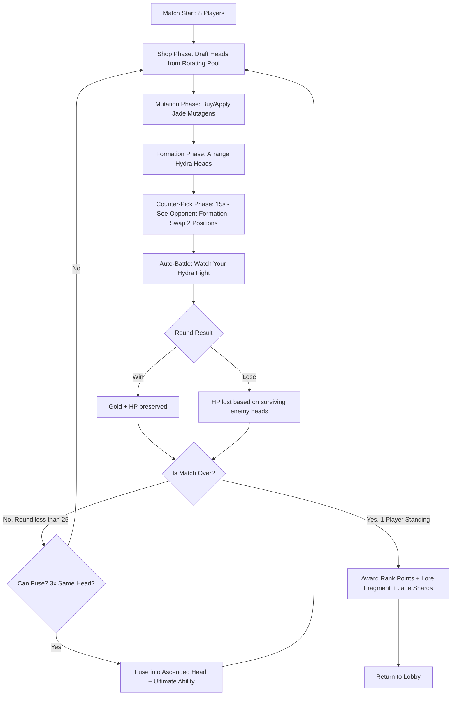
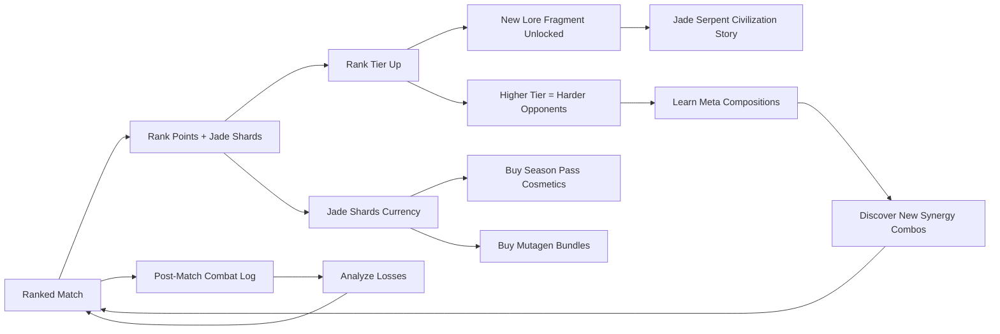
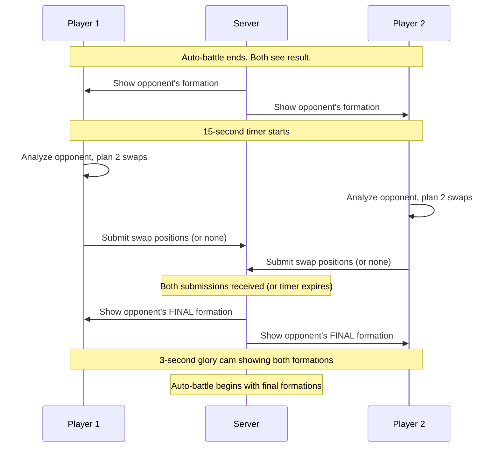
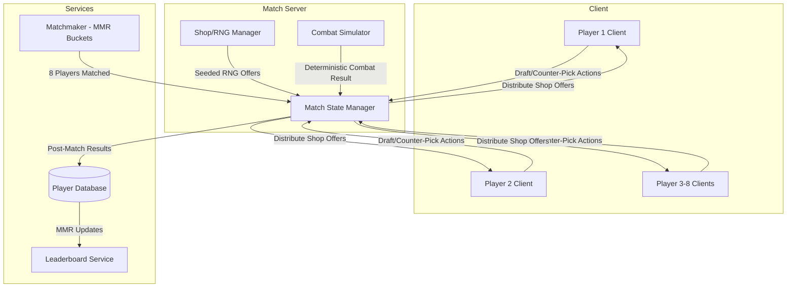

# Jade Hydra's Gambit

## Title & Genre

| Field | Value |
|-------|-------|
| **Title** | Jade Hydra's Gambit |
| **Genre** | Competitive Auto-Battler with Deckbuilding |
| **Engine** | Unity 2023 LTS (DOTS Entity Component System for 8-player server authoritative simulation) |
| **Platform** | PC (Steam), iOS, Android (cross-play) |
| **Monetization** | Free-to-Play with season pass ($9.99/season) for cosmetic hydra skins, arena backgrounds, and emotes |
| **Rating** | ESRB E10+ (Fantasy Violence) / PEGI 7 / CERO A |

---

## Vision Statement

Jade Hydra's Gambit is a competitive auto-battler where eight players draft sentient jade hydra heads from a rotating shared pool, fuse duplicates into Ascended heads with devastating ultimate abilities, and mutate class tags with jade mutagens to build synergies no one saw coming. Every round ends with a 15-second counter-pick phase where you see your opponent's formation and can swap two heads' positions -- rewarding the player who reads the meta and reacts fastest. The game sits at the intersection of Hearthstone Battlegrounds' drafting depth, Teamfight Tactics' synergy discovery, and fighting-game frame data mind games. The hydra heads are characters -- each one has a name, a voice line, a backstory tied to the ancient Jade Serpent civilization, and a combat personality that emerges through auto-battle AI. You are not commanding units; you are assembling a living creature whose heads argue, cooperate, and sometimes sabotage each other during combat. The last hydra standing wins.

---

## Core Loop

**Target session length:** 20-35 minutes (one ranked match)

### Core Loop Breakdown

| Step | Player Action | System Response | Skill Expression |
|------|--------------|----------------|-----------------|
| 1. Draft | Spend gold (2-5 per head) on hydra heads from a shared rotating shop of 5 offers | Purchased heads enter your bench (max 7 bench slots). Other players see the same 5 offers -- heads you buy are removed from the shared pool | Economic management, reading what opponents are building |
| 2. Mutate | Spend jade shards on mutagens that swap a head's class tag | A "Tank" head becomes "Assassin"-tagged, enabling new synergies. Each head can hold 1 mutagen at a time | Creative synergy construction, understanding tag interaction matrix |
| 3. Formation | Place up to 7 heads on a 4x3 grid (front row/back row split) | Front-row heads engage first and absorb damage. Back-row heads activate abilities from safety. Formation positioning determines target priority AI | Spatial reasoning, understanding aggro ranges and ability zones |
| 4. Counter-Pick | 15-second timer. See opponent's formation. Swap 2 heads' positions. | Opponent sees your formation too. Both players make changes simultaneously, blind to each other's final swaps | Mind games, speed, pattern recognition |
| 5. Auto-Battle | Watch your hydra fight the opponent's hydra. Heads execute abilities based on AI priorities and formation position | Combat resolves over 30-45 seconds. Heads die, ultimates trigger, synergies activate. Combat log available post-battle | Post-battle analysis (player reviews log to adjust next round) |
| 6. Fusion | Combine 3 copies of the same head into 1 Ascended Head | Ascended Head gains +40% base stats, a unique ultimate ability, and its synergy tags expand by 1 | Resource commitment -- fusion shrinks formation size for raw power |

---

## Meta Loop

### Session-to-Session Progression

### Progression Axes

| Axis | What Grows | How It Feels | Cap |
|------|-----------|-------------|-----|
| **Rank Tier** | Bronze through Jade Serpent (10 tiers) | Each tier climb matches you against better drafters and counter-pickers | Jade Serpent (top 0.1%) |
| **Head Collection** | Unlock permanent access to 48 base heads across 6 classes | New heads open new synergy strategies. Draft pool diversity increases | 48 base + 48 Ascended variants |
| **Lore Fragments** | Unlocked at each new rank tier achieved | The Jade Serpent civilization's story unfolds -- why the heads are sentient, why they fight | 50 fragments telling a complete 5-act story |
| **Season Pass Tier** | 100 tiers of cosmetic rewards per 8-week season | Hydra skins, arena backgrounds, head voice packs, emotes, counter-pick timer skins | 100 tiers per season, seasonal reset |
| **Player Knowledge** | Meta compositions, mutagen interactions, counter-pick patterns | Invisible but most powerful -- your draft improves, your counter-picks get faster, your synergy eye sharpens | No cap -- meta shifts every season |

---

## Game Mechanics

### Primary Mechanic: Hydra Head Drafting & Synergies

The shared draft pool contains all 48 base heads. At match start, each head exists in the pool 3 times (144 total heads). When a player buys a head from the shop's 5-offer row, it is removed from the pool. If no copies remain in the pool, that head cannot appear in anyone's shop.

**6 Head Classes with Synergy Tags:**

| Class | Tag | Combat Role | Synergy Thresholds | Example Heads |
|-------|-----|-------------|--------------------|--------------|
| **Vanguard** | `vanguard` | High HP, absorbs damage, protects back row | 2: +20% HP. 4: Taunt all attacks. 6: Regen 3% HP/second | Gorehorn, Shieldmaw, Rampart, Bastion, Thornscale, Ironjaw, Bulwark, Fortitude |
| **Striker** | `striker` | High single-target damage, targets lowest-HP enemy | 2: +25% damage. 4: Crit chance +15%. 6: Execute enemies below 20% HP | Fangbolt, Razorwind, Lancejaw, Pyrestrike, Thornlance, Viperthorn, Galefang, Crimsonedge |
| **Mystic** | `mystic` | Heals allies, applies buffs, debuffs enemies | 2: Heal 8% HP to lowest ally every 3s. 4: All allies +15% damage. 6: Resurrect 1 fallen head once | Moonscale, Dreamweaver, Glowshard, Spiritbloom, Runecrest, Aetherfang, Oracle, Reverie |
| **Saboteur** | `saboteur` | Applies poison, burn, and debuff stacks | 2: Poison stacks (2 damage/second, stacks 5x). 4: Burn (3 damage/second, spreads to adjacent on death). 6: All debuffs tick 50% faster | Venomspit, Blightmaw, Rotfang, Plaguecrest, Toxthorn, Corruption, Decay, Pestilence |
| **Warlord** | `warlord` | Buffs adjacent heads, rally mechanics | 2: Adjacent heads +10% damage. 4: Adjacent heads +20% damage + 10% attack speed. 6: Warcry every 10s (all heads invulnerable for 2 seconds) | Battlecrest, Warfang, Commandjaw, Generalfang, Valor, Dominion, Wartide, Marshal |
| **Drake** | `drake` | AoE breath attacks, elemental damage | 2: 15% splash damage. 4: Elemental overlay (fire/frost/venom based on mutagen). 6: All attacks chain to 2 additional targets | Emberjaw, Frostfang, Thundermaw, Acidspit, Galewing, Stormscale, Cinder, Rimefang |

**Synergy Activation Rules:**
- Synergies count per-tag, not per-head. A Saboteur-tagged head mutated to also have the Drake tag counts toward both.
- Heads with mutagens add their mutagen tag as an additional synergy tag (retaining original).
- Ascended heads count as 2 toward their primary class tag (they have doubled presence on the hydra).

**Synergy Economy Table:**

| Active Synergies | Typical Formation | Power Level | Difficulty |
|-----------------|-------------------|-------------|-----------|
| 1 synergy at 4+ | "Going tall" -- 4 Strikers + 3 flex | Moderate -- strong in combat but predictable, easy to counter-pick | Low |
| 2 synergies at 3 | "Hybrid build" -- 3 Vanguard + 3 Saboteur + 1 flex | Strong -- versatile, harder to counter | Medium |
| 3 synergies at 2 | "Wide synergy" -- 2 each of Vanguard, Mystic, Warlord + 1 flex | Moderate -- balanced but no spike power | Medium |
| 1 synergy at 6 | "Committed" -- 6 Mystics + 1 flex | Very strong if uncontested, weak if opponent hard-counters | High |
| 2 synergies at 4+ | "Mutagen abuse" -- requires mutagens to stack tags | Very strong -- most flexible, hardest to draft | Very High |

### Secondary Mechanic: Jade Mutagens

Each round, a rotating market of 3 mutagens appears (random from a pool of 12). Mutagens cost 2-4 jade shards each. Applying a mutagen to a head swaps its class tag, enabling unexpected synergies.

**12 Mutagens:**

| Mutagen | Tag Applied | Cost | Special Effect | Strategic Use Case |
|---------|------------|------|---------------|-------------------|
| Jade Fire | `striker` | 2 shards | +10% attack speed | Turn a tank into a damage-dealer that survives long enough to stack hits |
| Jade Frost | `vanguard` | 2 shards | +15% HP | Make a squishy Striker survive front-row |
| Jade Venom | `saboteur` | 3 shards | Poison on hit (1 damage/second for 5 seconds) | Give any head poison capability for Saboteur synergy |
| Jade Storm | `drake` | 3 shards | Attacks splash to 1 adjacent enemy | Enable Drake synergy without Drake heads |
| Jade Light | `mystic` | 3 shards | Heals lowest ally for 5% HP on kill | Create emergency healer in any class |
| Jade War | `warlord` | 4 shards | Adjacent heads +8% damage | Budget Warlord synergy without drafting Warlord heads |
| Jade Void | Removes 1 tag, adds `saboteur` | 2 shards | Nullifies one synergy but enables Saboteur | Disrupt own build to pivot mid-match |
| Jade Mirror | Copies target head's primary tag | 4 shards | Exact tag copy, no special effect | Mirror an opponent's synergy composition |
| Jade Blood | `striker` + lifesteal | 4 shards | Heals 15% of damage dealt | Aggressive sustain on any head |
| Jade Bone | `vanguard` + thorns | 3 shards | Reflects 10% of damage taken | Defensive punish on non-Vanguard heads |
| Jade Mind | `mystic` + ability haste | 3 shards | Abilities activate 20% faster | Speed up ultimate timing on Ascended heads |
| Jade Crown | Any tag (player choice) | 5 shards | +5% all stats | Ultimate flexibility -- the pivot tool |

### Secondary Mechanic: Fusion & Ascended Heads

When you own 3 copies of the same base head, you can fuse them. Fusion removes 2 heads from your formation and creates 1 Ascended variant.

**Fusion Trade-off:**

| Before Fusion | After Fusion | Net Effect |
|--------------|-------------|-----------|
| 3 base heads (3 formation slots) | 1 Ascended head (1 formation slot) | -2 formation slots, +40% base stats on remaining head, gains ultimate ability |
| 3 heads contributing to synergy count | 1 Ascended head counts as 2 toward synergy | Net -1 synergy count, but the Ascended head is significantly stronger |

**Ascended Head Examples:**

| Base Head | Ascended Name | Ultimate Ability | Ultimate Cooldown | Synergy Impact |
|-----------|--------------|-----------------|-------------------|---------------|
| Gorehorn (Vanguard) | Gorehorn, the Immortal | For 5 seconds, cannot die below 1 HP and taunts all enemies. After effect ends, heals 30% HP. | 25 seconds | Counts as 2 Vanguard |
| Fangbolt (Striker) | Fangbolt, the Executioner | Next 3 attacks deal 300% damage and ignore armor. Targets the highest-HP enemy. | 30 seconds | Counts as 2 Striker |
| Moonscale (Mystic) | Moonscale, the Eternal | Resurrects all fallen ally heads at 50% HP. Can only trigger once per combat. | 45 seconds (one-time) | Counts as 2 Mystic |
| Venomspit (Saboteur) | Venomspit, the Plaguefather | All poison and burn stacks on all enemies instantly tick 5 times. New debuffs applied during combat have +50% potency. | 35 seconds | Counts as 2 Saboteur |
| Battlecrest (Warlord) | Battlecrest, the Conqueror | Warcry: all ally heads gain +50% damage and +30% attack speed for 8 seconds. | 28 seconds | Counts as 2 Warlord |
| Emberjaw (Drake) | Emberjaw, the Inferno | Breath attack hits entire enemy formation for 250% damage. Applies burn to all targets. | 32 seconds | Counts as 2 Drake |

### Counter-Pick Phase Detail

The counter-pick phase is the game's signature skill expression moment.

**Counter-Pick Decision Matrix:**

| Opponent Formation | Your Optimal Counter | Risk |
|-------------------|---------------------|------|
| Heavy front-row Vanguards | Move Strikers to focus-fire one Vanguard at a time | If they move a Vanguard to back row, your targeting breaks |
| Back-row Mystics keeping front alive | Move a Saboteur to poison the Mystics directly | Saboteur is squishy -- if opponent moves a Vanguard to intercept, your Saboteur dies fast |
| 6-head wide formation | Move Drake to center for maximum splash | If they condense to 3 heads, splash hits fewer targets |
| 3-head Ascended formation | Move Warlord adjacent to your strongest head for rally buff | If their Ascended head targets your Warlord first, you lose your buff |
| Mixed with Warlord buffs | Target the Warlord with your Striker | If they swap Warlord to back row behind a Vanguard, you waste time on the wrong target |

### Difficulty Progression (Within a Match)

| Round | Shop Tier | Gold Income | Mutagen Market | HP Loss on Defeat | Strategic Focus |
|-------|-----------|------------|---------------|-------------------|----------------|
| 1-3 | Tier 1 heads only (8 heads) | 3 base + 1 interest per 10 saved | No mutagens | 1-2 HP per surviving enemy head | Economy setup, early synergy seeds |
| 4-7 | Tier 1-2 heads (20 heads) | 5 base + 1 interest | 1 mutagen available | 2-3 HP per surviving enemy head | First fusion window, commit to synergy direction |
| 8-12 | Tier 1-3 heads (32 heads) | 7 base + 2 interest | 2 mutagens available | 3-4 HP per surviving enemy head | Mid-game pivot or commit, counter-pick mind games intensify |
| 13-18 | Tier 1-4 heads (40 heads) | 9 base + 2 interest | 3 mutagens available | 4-5 HP per surviving enemy head | Second fusion window, Ascended heads appear |
| 19-25 | All 48 heads available | 11 base + 3 interest | 3 mutagens, Jade Crown guaranteed in one slot | 5-8 HP per surviving enemy head | Endgame -- every counter-pick is critical, eliminations accelerate |

---

## World Design

### Arena Environments

The arena is a massive jade-and-stone colosseum floating in an emerald void. Backgrounds shift based on the round progression, telling a visual story of descending into the Jade Serpent civilization's ruins.

**5 Arena Stages:**

| Stage | Rounds | Environment | Visual Theme | Ambient Audio |
|-------|--------|------------|-------------|--------------|
| **The Jade Canopy** | 1-5 | Floating jade platform above an emerald forest canopy. Waterfalls of liquid jade cascade over edges. | Lush, vibrant, alive. Jade green and gold dominate. Serpent motifs carved into the platform. | Gentle water flow, distant birdsong, jade crystals humming |
| **The Serpent's Maw** | 6-10 | Descended into a colossal stone serpent skull. The arena floor is the serpent's palate; jade stalactites hang where teeth once were. | Transitioning from natural to constructed. Stone gray, jade veins, bioluminescent moss. | Echoing drip, wind through hollow bone, low vibration |
| **The Hatching Chamber** | 11-15 | Massive chamber filled with jade eggs in various states of hatching. Some eggs are cracked with tiny hydra heads visible. | Biological, unsettling. Pale jade, amber fluids, cracked shell textures. | Cracking sounds, muffled creature vocalizations, rhythmic pulse |
| **The Throne of Coils** | 16-20 | The heart of the Jade Serpent civilization. A throne room where the Serpent Sovereign once ruled, now empty. Coiled serpent pillars support a ceiling of jade constellations. | Regal, abandoned, melancholy. Deep jade, gold leaf, polished obsidian. | Chiming metal, distant serpent hiss, echoing footsteps |
| **The Abyssal Jade** | 21-25 | Below the throne room. Raw jade veins pulse with ancient power. The arena floats on liquid jade. The walls are alive. | Eldritch, overwhelming. Black jade, pulsing crimson veins, blinding white jade crystals. | Low drone, heartbeat rhythm, whale-song distorted |

### Art Direction Pillars

| Pillar | Description | Reference |
|--------|-------------|-----------|
| **Living Jade** | Jade is not stone -- it is organic, it pulses, it grows. Hydra heads are carved from living jade and remain semi-sentient. | Jade artifacts from Chinese antiquity, the mosaic aesthetic of Auto Chess |
| **Serpent Majesty** | The Jade Serpent civilization was opulent and cruel. Architecture coils and constricts. Every surface tells a story of ancient dominion. | Aztec temple aesthetics meets Art Nouveau organic curves |
| **Combat Personality** | Each head class has a distinct visual language. Vanguards are bulky and armored in jade plates. Strikers are sleek and serrated. Mystics glow with inner light. Saboteurs drip with venom-green residue. Warlords bear battle standards. Drakes have elemental effects wreathing their forms. | Teamfight Tactics' champion visual clarity, Hearthstone's golden card animations |
| **Readable Chaos** | 7-on-7 auto-battles are visually dense. Every head has a distinct silhouette, ability effects use the head's class color, and damage numbers are color-coded by type. The player should always be able to read what is happening. | Super Smash Bros.' item/spawn clarity at high speed |

### Head Class Visual Language

| Class | Primary Color | Body Shape | Key Visual Identifiers | Ability Effect Color |
|-------|-------------|-----------|----------------------|---------------------|
| Vanguard | Forest green + bronze | Wide, squat, armored plates | Shield crest on forehead, thick neck | Bronze shockwave on taunt |
| Striker | Crimson + silver | Lean, angular, blade-like crests | Razor fin running from head to neck, glowing eyes | Silver slash trails |
| Mystic | Lavender + pale gold | Slender, floating crystals orbit head | Third eye on forehead, luminous tendrils | Gold healing beam, purple debuff aura |
| Saboteur | Venom green + black | Serpentine, dripping, irregular | Dripping fangs, cracked jade revealing toxic glow | Green poison splash, orange burn aura |
| Warlord | Steel blue + gold trim | Muscular, crested, battle-scarred | Miniature battle standard growing from skull, war paint patterns | Blue rally pulse, golden warcry ring |
| Drake | Elemental color (red/blue/yellow) | Winged, reptilian, elemental emanation | Small wings, elemental breath trail, scaled hide | Red fire cone, blue frost ring, yellow lightning arc |

---

## Narrative

### Tone Spectrum (7-Axis)

| Axis | Position | Notes |
|------|----------|-------|
| Hope vs Despair | 55% Hope | The heads are fighters -- they choose to compete. The civilization fell, but its legacy fights on. |
| Order vs Chaos | 60% Order | The tournament has rules. The jade is ancient but structured. Chaos comes from the players, not the world. |
| Ancient vs Modern | 80% Ancient | Everything is rooted in the Jade Serpent civilization. There is no "modern world" -- only the arena and the void. |
| Serious vs Playful | 40% Playful | The heads have personality, make quips, and argue during combat. The tone is competitive but not grim. |
| Mystery vs Clarity | 65% Mystery | Lore fragments reveal the civilization in pieces. The full picture is earned through rank progression. |
| Competition vs Cooperation | 75% Competition | The core is 8-player elimination. Cooperation exists only in temporary meta-pragmatism. |
| Nature vs Artifact | 50/50 | Jade is natural but the heads are carved. The civilization lived between nature and craft. |

### 8-Point Story Spine

**1. Equilibrium**
The Jade Serpent civilization thrived for millennia in a hidden valley where liquid jade flowed like water. The Serpent Sovereign ruled from the Throne of Coils, commanding an army of hydra heads -- sentient jade constructs carved from the living stone, each imbued with a combat class and personality. The heads served willingly, fighting in grand tournaments for the Sovereign's amusement and to settle diplomatic disputes. This was the world as it was.

**2. Inciting Incident**
The Sovereign discovered the Abyssal Jade -- a vein of jade so deep and powerful it granted omniscience. Drunk on foresight, the Sovereign saw their own civilization's collapse and, in trying to prevent it, caused it. The Abyssal Jade corrupted the Sovereign's mind. They began carving heads compulsively, creating more and more, each one aware and screaming. The tournaments became brutal. The valley fractured.

**3. First Complication**
The Sovereign's final act was to cast the entire civilization into the emerald void -- a pocket dimension between moments of time. The jade heads survived, but the civilization's people did not. Only the heads remain, floating in the void, fighting an eternal tournament with no Sovereign to watch and no purpose beyond combat. The arena exists because the heads maintain it through collective memory.

**4. Rising Action**
The heads discover they are not alone in the void. Other civilizations' constructs -- obsidian golems, coral sentinels, amber guardians -- float in distant pockets. The jade mutagens that appear in the shop each round are fragments of these other civilizations bleeding through. Each mutagen carries a whisper of a different world's story.

**5. Midpoint Reversal**
A head that achieves Ascension through fusion briefly regains access to the Sovereign's memories. They learn the truth: the Sovereign did not destroy the civilization. The civilization's people willingly merged with the jade to become the heads. The heads are not constructs -- they are the people, transformed and memory-wiped. Every fusion is a re-merging of souls that were once whole.

**6. Crisis**
The Abyssal Jade stirs. The stage-5 arena environment is not decoration -- it is the Abyssal Jade becoming active. The tournament's escalation is not arbitrary; it is the Abyssal Jade awakening, drawn by the concentration of fused heads. If enough Ascended heads exist simultaneously, the Abyssal Jade will fully manifest and consume the arena.

**7. Climax**
A player who reaches Jade Serpent rank (top 0.1%) is granted access to the Final Gambit -- a special 1v1 match against an AI-controlled Serpent Sovereign using a fully Ascended 7-head hydra. Winning this match reveals the Sovereign's final memory: the people did not merge with the jade willingly. The Sovereign forced them. The heads' willing service in the arena is a lie their ancestors were told to make servitude palatable.

**8. Resolution**
The player's choice: disband the hydra (retire from the tournament, freeing the heads' trapped souls) or continue fighting (accepting the truth and choosing to give the heads purpose despite their origins). This is cosmetic-only -- it affects the player's profile border and end-of-season narrative summary. The game does not judge.

### Key Characters (Lore, Not Story Characters)

| Character | Role | Theme | Lore Fragments |
|-----------|------|-------|---------------|
| **The Serpent Sovereign** | Antagonist (deceased, exists in memory) | Hubris of foresight; the ruler who saw the end and became it | 15 memory fragments unlocked at rank milestones |
| **Gorehorn** | Representative Vanguard head | Duty without question; the soldier who serves because stopping is unthinkable | 3 head-specific lore entries |
| **Fangbolt** | Representative Striker head | Passion as purpose; the hunter who lives for the kill's perfection | 3 head-specific lore entries |
| **Moonscale** | Representative Mystic head | Compassion in a combat arena; the healer who questions why healing enables more violence | 3 head-specific lore entries |
| **The Abyssal Jade** | Environmental antagonist | Hunger as geology; it does not want or plan, it only grows | 10 resonance fragments |
| **The Nameless Artisan** | World-builder; the head carver who created the first hydra head | Creation as both gift and cage; the sculptor who gave life to stone and regretted it | 8 journal fragments |

---

## Player Personas

### P-001: Alex Rivera -- The Ranked Grinder

**Why this game fits:** Jade Hydra's Gambit is built around competitive drafting and the 15-second counter-pick phase. Alex thrives on the ladder -- the ranked system has 10 tiers from Bronze to Jade Serpent, and the counter-pick window rewards the same reflexive tactical thinking he brings to tactical shooters. The meta shifts every season with new heads and mutagen adjustments, creating an endless optimization problem. Draft knowledge is a skill that cannot be bought.

**Predicted experience:** Alex will grind ranked exclusively, ignore lore completely, and develop encyclopedic knowledge of the synergy matrix. He will main 2-3 meta compositions and practice counter-pick reactions until they are muscle memory. He will rage at match RNG when the shop offers bad rolls and blame the game, then queue again immediately. He will spend $9.99/season on the battle pass for the ranked-exclusive cosmetic sets. He will never read a single lore fragment.

### P-003: Hiroshi Tanaka -- The RPG Addict

**Why this game fits:** 48 base heads with 48 Ascended variants, 12 mutagens, and a synergy matrix that creates hundreds of viable compositions. The lore fragment system (50 fragments tied to rank progression) gives Hiroshi a completion target that requires both skill and persistence. The fusion mechanic provides the same theorycrafting depth he brings to RPG builds -- he will calculate the exact DPS difference between a 6-head Striker composition and a 4-Striker/2-Warlord hybrid and share his findings on Discord.

**Predicted experience:** Hiroshi will play 3-4 ranked matches daily and spend 1-2 hours between matches on Discord discussing synergy combos. He will maintain a spreadsheet tracking which heads appear most often in his shop rolls versus win rate. He will collect every lore fragment and piece together the Jade Serpent civilization's story before the community at large does. He will spend $5-15/month on jade shards for mutagen bundles when experimenting with new builds. He will find the RNG element frustrating but acceptable because the counter-pick phase provides a skill check against bad luck.

### P-010: Kevin Nguyen -- The Competitive Whale

**Why this game fits:** Kevin wants fair competition where skill matters. The draft pool is shared -- no one can buy better heads. The counter-pick phase is pure skill. F2P players and whales draft from the same pool. The only monetization is cosmetic. Kevin's $100-300 monthly budget goes to season pass tiers, limited-time hydra skins, and arena backgrounds -- all of which signal competitive status without affecting gameplay. The Jade Serpent rank (top 0.1%) is the esports aspiration Kevin craves.

**Predicted experience:** Kevin will treat the game as a training regimen. He will schedule daily practice sessions focused on counter-pick speed drills. He will track win rates by composition, by round, and by opponent rank. He will participate in community tournaments and stream his ranked matches. He will spend on every cosmetic that signals competitive achievement. He will advocate for the game's fairness model in every community he is part of. He will push for the Final Gambit match against the Sovereign AI and treat it as his esports proving ground.

### P-009: Liam O'Connor -- The Dedicated F2P

**Why this game fits:** The monetization is cosmetic-only. The draft pool is shared. No one can buy better heads, more gold, or stronger mutagens. The counter-pick phase is a pure skill test. Liam can reach Jade Serpent rank without spending a cent, and his achievement will be identical to Kevin's -- only the cosmetics will differ. This is exactly the kind of game Liam champions in his communities.

**Predicted experience:** Liam will be the game's most vocal organic promoter. He will create F2P climb guides on YouTube and Discord. He will develop budget compositions that win without rare shop rolls. He will challenge himself to reach Jade Serpent rank in the minimum number of matches. He will take pride in beating players with paid cosmetics using default skins. He will write detailed analysis posts about why the monetization is fair and why other auto-battlers should copy it. He will never spend a cent.

---

## User Stories

### Drafting & Economy (8 stories)

1. As **Alex (P-001)**, I want the shop to refresh its 5 offers each round from a shared pool so that I must read what my opponents are buying and adapt, rather than following a fixed build order.
2. As **Hiroshi (P-003)**, I want gold interest to compound at 1 per 10 saved (capped at 5 interest) so that saving gold is a viable strategy alongside spending every round.
3. As **Liam (P-009)**, I want the shop refresh cost to be 1 gold (not 2) so that F2P players can cycle through offers competitively without feeling punished for bad RNG.
4. As **Kevin (P-010)**, I want to see which heads other players have purchased in the draft history panel so that I can track contestation and avoid building a composition that 3 other players are also pursuing.
5. As **Alex (P-001)**, I want a "sell head" option that returns 1 gold (regardless of purchase price) so that I can pivot my composition mid-match without being locked into early decisions.
6. As **Hiroshi (P-003)**, I want Tier 4 and Tier 5 heads to appear only in rounds 13+ so that early-game strategy is not dominated by players who luck into premium heads.
7. As **Kevin (P-010)**, I want the draft pool size to be visible (e.g., "Gorehorn: 0/3 remaining") so that I can make informed decisions about whether a composition is still draftable.
8. As **Liam (P-009)**, I want a "lock shop" button that preserves my current 5 offers for 1 round (costs 2 gold) so that I can plan a composition without fear of losing a critical head to another player.

### Fusion & Ascension (5 stories)

9. As **Hiroshi (P-003)**, I want fusion to require exactly 3 copies of the same base head so that the pursuit of fusion creates meaningful economic decisions (save gold to buy copies vs. diversify).
10. As **Alex (P-001)**, I want Ascended heads to count as 2 toward their class synergy so that a 3-head formation with 1 Ascended head can still activate a 4-synergy threshold.
11. As **Hiroshi (P-003)**, I want each Ascended head to have a unique ultimate ability with a visible cooldown indicator so that I can time my formation around ultimate activation windows.
12. As **Kevin (P-010)**, I want the fusion animation to take exactly 2 seconds (not skippable) so that all players have the same information timing about who has fused.
13. As **Alex (P-001)**, I want a "pre-fuse preview" that shows the Ascended head's ultimate ability description before I commit to fusion so that I can make an informed decision.

### Counter-Pick Phase (6 stories)

14. As **Alex (P-001)**, I want the counter-pick timer to be exactly 15 seconds (not adjustable) so that speed of tactical thinking is a competitive skill.
15. As **Kevin (P-010)**, I want to see my opponent's formation during counter-pick but not see their mutagen effects until combat starts so that there is hidden information that rewards game knowledge.
16. As **Liam (P-009)**, I want to be able to swap any 2 heads (not just front/back row) so that creative repositioning is the full-spectrum skill test.
17. As **Alex (P-001)**, I want a "quick swap" gesture (drag-and-drop on mobile, click-two-heads on PC) so that the interface does not add latency to my decision-making.
18. As **Hiroshi (P-003)**, I want a 3-second "glory cam" after counter-pick showing both final formations side-by-side so that I can appreciate the mind-game outcome before combat starts.
19. As **Kevin (P-010)**, I want the counter-pick phase to be available as a replay clip that I can share on social media so that I can showcase outplay moments.

### Combat (5 stories)

20. As **Alex (P-001)**, I want combat to last 30-45 seconds so that there is enough time for ultimates to activate and for formation positioning to matter.
21. As **Liam (P-009)**, I want a post-battle combat log showing every ability activation, damage source, and kill order so that I can analyze my losses and improve.
22. As **Hiroshi (P-003)**, I want heads to have audible callouts when their health drops below 25% so that I can hear which head needs Mystic healing support.
23. As **Kevin (P-010)**, I want Ascended heads to have a unique death animation (shattering into jade shards that persist on the arena floor) so that combat has visual narrative weight.
24. As **Alex (P-001)**, I want a 2x combat speed option (available after round 10) so that experienced players are not forced to watch slow combat they already understand.

### Mutation System (4 stories)

25. As **Hiroshi (P-003)**, I want each head to display its current tags (base + mutagen) as colored icons on the head's portrait so that synergy tracking is visual and instant.
26. As **Alex (P-001)**, I want mutagens to be replaceable (overwriting the previous mutagen) so that mid-match pivots are possible when the draft direction changes.
27. As **Liam (P-009)**, I want the Jade Crown mutagen (any tag, player choice) to be guaranteed available once per match in rounds 19-25 so that every player gets at least one pivot opportunity in the endgame.
28. As **Hiroshi (P-003)**, I want mutagen application to trigger a visual transformation on the head (color shift, new particle effects) so that the mutation is visible to opponents during counter-pick.

### Progression & Rank (5 stories)

29. As **Alex (P-001)**, I want rank points to be gained on wins and lost on losses (not placement-based) so that every match feels consequential.
30. As **Kevin (P-010)**, I want the Jade Serpent rank (top 0.1%) to unlock the Final Gambit PvE challenge against the Sovereign AI so that the highest rank has exclusive content.
31. As **Hiroshi (P-003)**, I want each new rank tier achieved to unlock a lore fragment about the Jade Serpent civilization so that competitive progression rewards narrative understanding.
32. As **Liam (P-009)**, I want a seasonal leaderboard that shows the top 100 F2P players (no season pass purchases) separately so that F2P achievement has community visibility.
33. As **Alex (P-001)**, I want demotion protection at tier boundaries (losses do not demote for the first 3 losses at a new tier) so that rank anxiety does not drive players away from queueing.

### Monetization & Cosmetics (4 stories)

34. As **Liam (P-009)**, I want the season pass to contain only cosmetic items (hydra skins, arena backgrounds, emotes) with zero gameplay impact so that the monetization model is provably fair.
35. As **Kevin (P-010)**, I want ranked-exclusive cosmetic rewards (top 10% get a golden jade border, top 1% get an animated serpent aura) so that spending time in ranked has visible status rewards.
36. As **Hiroshi (P-003)**, I want individual head skins that change a head's appearance without affecting stats so that I can customize my favorite compositions aesthetically.
37. As **Alex (P-001)**, I want the season pass to cost $9.99 and contain 100 tiers of rewards earnable through normal play so that the price point is accessible and the grind is proportional.

### Accessibility (4 stories)

38. As a player with motor impairments, I want the counter-pick timer to have a 25-second accessibility option (toggle in settings) so that the phase is playable without requiring fast input.
39. As a player with color vision deficiency, I want synergy tags to use shape icons in addition to colors so that the tag system is readable without color perception.
40. As **Hiroshi (P-003)**, I want all head voice lines and callouts to have subtitle options so that no gameplay-relevant audio is visual-only.
41. As a player on a low-bandwidth connection, I want the game to function on 2 Mbps connections (turn-based phases, compressed combat replays) so that mobile play is viable in rural areas.

---

## Monetization

### Revenue Model: Free-to-Play with Cosmetic Season Pass

**Why this model fits this game:**
- Competitive auto-battlers live or die on matchmaking health. Pay-to-win mechanics kill matchmaking by segregating players by wallet size. A shared draft pool with cosmetic-only monetization ensures the player base stays unified.
- The counter-pick phase is a pure skill test. Monetizing combat power would undermine the game's core identity.
- The target audience (P-001, P-003, P-009, P-010) values fair competition. Liam (P-009) will not play if F2P is disadvantaged. Kevin (P-010) will not spend if spending undermines competitive integrity. The cosmetic model satisfies both.

### Pricing & Season Structure

| Product | Price | Content | Availability |
|---------|-------|---------|-------------|
| Base Game | Free | All 48 heads, all 12 mutagens, ranked mode, casual mode, full gameplay | Permanent |
| Season Pass | $9.99/season | 100 tiers of cosmetics: hydra skins (6 per season), arena backgrounds (3), head voice packs (4), emotes (12), counter-pick timer skins (2) | 8-week seasons, 6 seasons/year |
| Premium Head Skins | $4.99 each | Individual head cosmetic transformations -- no stat changes | Rotating shop, 4 available per week |
| Arena Background Pack | $7.99 | 3 arena backgrounds per pack (non-season-pass exclusive) | Permanent store |
| Lore Compendium | $4.99 | Unlocked lore fragments presented as an illustrated codex with expanded head backstory | One-time purchase, updates each season |

### Revenue Projections (4 Scenarios)

Assumptions: Average DAU conversion to season pass = 6%. Average whale spend (head skins + arena packs) = $25/month. Season length = 8 weeks.

| Scenario | MAU (Month 6) | Season Pass Buyers | Whale Revenue | Monthly Revenue | Annual Revenue | Assumptions |
|----------|-------------|-------------------|--------------|----------------|---------------|-------------|
| **Modest** | 50,000 | 3,000 ($29,970) | 50 whales ($1,250) | $31,220 | $374,640 | Niche, word-of-mouth, minimal marketing |
| **Baseline** | 200,000 | 12,000 ($119,880) | 200 whales ($5,000) | $124,880 | $1,498,560 | Moderate marketing, positive reviews, streamer adoption |
| **Strong** | 750,000 | 45,000 ($449,550) | 750 whales ($18,750) | $468,300 | $5,619,600 | Strong reviews, tournament scene emerging, influencer traction |
| **Breakout** | 2,000,000 | 120,000 ($1,198,800) | 2,000 whales ($50,000) | $1,248,800 | $14,985,600 | Viral, esports integration, crossover events with other titles |

**Break-even at approximately 8,000 MAU with 6% conversion (~$60K/year) against operational costs of ~$50K/month server + live team (see Production Plan).**

### Season Pass Tier Distribution (100 Tiers)

| Tiers | Reward Type | Frequency |
|-------|-----------|-----------|
| 1-10 | Jade shards (50 per tier) | Every tier |
| 11-20 | Emotes (1 every 2 tiers) + jade shards | Alternating |
| 21-30 | Head voice pack (1 per 5 tiers) + jade shards | Sparse |
| 31-50 | Hydra skin (1 per 5 tiers) + jade shards | Key reward tier |
| 51-70 | Arena background (1 per 10 tiers) + jade shards | Prestige tier |
| 71-90 | Counter-pick timer skin (1 per 10 tiers) + jade shards | Late prestige |
| 91-100 | Ranked-exclusive animated cosmetics (border, aura, portrait) | Capstone |

---

## Production Plan

### Team

| Role | Count | Phase | Monthly Cost (Loaded) |
|------|-------|-------|----------------------|
| Game Director / Lead Design | 1 | All | $12,000 |
| Systems Designer (Synergy/Mutation) | 1 | Months 1-14 | $9,500 |
| Combat Designer | 1 | Months 2-12 | $9,000 |
| UI/UX Designer | 1 | Months 1-14 | $8,500 |
| Backend Programmer (Server Authority) | 2 | All | $10,500 each |
| Gameplay Programmer (Combat AI) | 1 | Months 2-12 | $9,500 |
| Gameplay Programmer (Draft/Shop) | 1 | Months 2-10 | $9,000 |
| Frontend Programmer (Unity Client) | 2 | All | $9,500 each |
| 2D Artist (Heads, UI, Portraits) | 2 | Months 2-14 | $7,500 each |
| 2D Animator (Combat Animations) | 1 | Months 4-14 | $8,000 |
| VFX Artist | 1 | Months 5-14 | $8,000 |
| Technical Artist (Shader, Performance) | 1 | Months 3-14 | $9,000 |
| Narrative Designer | 1 | Months 1-10 | $8,500 |
| Audio Designer / Composer | 1 | Months 4-14 | $7,500 |
| QA Lead | 1 | Months 6-16 | $7,000 |
| QA Testers | 3 | Months 8-16 | $5,000 each |
| Live Ops Producer | 1 | Months 12+ | $10,000 |
| Community Manager | 1 | Months 10+ | $6,500 |

**Total team: 24 people peak (months 8-12)**

### Timeline (16-month production + ongoing live ops)

| Month | Milestone | Key Deliverables |
|-------|-----------|-----------------|
| 1 | Prototype | Draft/shop system, 6 test heads (1 per class), basic auto-battle AI, counter-pick phase wireframe |
| 2 | Vertical Slice | Full match loop (8 players, 10 rounds), fusion mechanic, 12 heads (2 per class), server authoritative combat |
| 3 | Pre-Production Complete | Full 48-head roster finalized, 12 mutagens designed, synergy matrix documented (240+ interactions), art bible complete |
| 4 | Production Phase 1 | First 16 heads fully animated, shop UI final, gold economy tuned via internal playtest |
| 5 | Production Phase 1 | 32 heads animated, mutagen system implemented, arena environment 1 (Jade Canopy) complete |
| 6 | Production Phase 2 | All 48 heads in-engine, fusion/Ascension implemented with ultimate abilities, QA begins |
| 7 | Production Phase 2 | Counter-pick phase fully networked (simultaneous submission), arena environments 2-3 complete |
| 8 | Production Phase 2 | Ranked system implemented (10 tiers, MMR matchmaking), first balance pass on synergy thresholds |
| 9 | Production Phase 3 | Arena environments 4-5 complete, combat log system, head voice lines recorded (48 heads x 8 lines each) |
| 10 | Production Phase 3 | Season pass progression system, cosmetic shop, Lore Compendium, community features (profile, replays) |
| 11 | Alpha | Full game playable, all systems integrated, 50 lore fragments written and integrated, cross-play (PC/mobile) functional |
| 12 | Closed Beta | 500 invited players, first real-world balance data, MMR calibration, server load testing |
| 13 | Open Beta | 5,000 players, live balance adjustments, season 1 content finalized, marketing ramp begins |
| 14 | Release Candidate | Console certification (if applicable), mobile store submission, day-1 patch preparation |
| 15 | Launch | Game goes live, season 1 begins, live ops team activates |
| 16 | Post-Launch | Hotfixes, first balance patch, season 2 content pre-production begins |

### Budget Breakdown

| Category | Cost | Notes |
|----------|------|-------|
| Salaries (16 months, 24 FTE peak) | $1,920,000 | Blended rate ~$8,500/mo avg |
| Unity Pro licenses | $36,000 | 15 seats at $2,400/year each |
| Server infrastructure (production) | $120,000 | 16 months of 8-player authoritative server hosting, scaled for projected DAU |
| Software & Tools | $38,000 | Perforce, Jira, Adobe CC, Spine 2D, FMOD/Wwise |
| QA & Playtesting | $55,000 | External QA contractor, playtest participant compensation |
| Audio (recording, VO, music) | $45,000 | 48 head voice actors (384 lines), 5 arena music tracks, combat SFX |
| Marketing | $150,000 | Trailers (3), streamer sponsorships, convention presence (2), social media campaign |
| Operations & Overhead | $80,000 | Incorporation, legal, accounting, insurance |
| Contingency (10%) | $244,400 | |
| **Total Development** | **$2,688,400** | |
| Live Ops (annual, post-launch) | $600,000/year | 5-person live team + server costs + seasonal content production |

**Monthly operational burn post-launch: approximately $50,000/month** (server hosting + live team salaries + content creation).

**Break-even: approximately 8,000 MAU at 6% season pass conversion = approximately $60,000/year season pass revenue, covering approximately 1 month of operational costs. Real profitability requires 50,000+ MAU baseline scenario.**

---

## Technical Requirements

### Platform Specifications

| Spec | PC Minimum | PC Recommended | iOS Minimum | iOS Recommended | Android Minimum | Android Recommended |
|------|-----------|---------------|------------|----------------|----------------|-------------------|
| **OS** | Windows 10 64-bit | Windows 11 64-bit | iOS 14 | iOS 16 | Android 11 | Android 13 |
| **CPU** | Intel i3-8100 | Intel i5-9400F | A11 Bionic | A14 Bionic | Snapdragon 670 | Snapdragon 8 Gen 1 |
| **RAM** | 4 GB | 8 GB | 2 GB | 4 GB | 3 GB | 6 GB |
| **GPU** | Intel UHD 630 | GTX 1650 | Apple GPU (integrated) | Apple GPU (integrated) | Mali-G72 | Adreno 730 |
| **Storage** | 2 GB | 2 GB SSD | 1.5 GB | 1.5 GB | 1.5 GB | 1.5 GB |
| **Network** | 2 Mbps | 5 Mbps | 2 Mbps | 5 Mbps | 2 Mbps | 5 Mbps |
| **Target FPS** | 30 FPS / 1080p | 60 FPS / 1440p | 30 FPS / native | 60 FPS / native | 30 FPS / 720p | 60 FPS / 1080p |

### Key Technical Challenges

| Challenge | Risk | Mitigation |
|-----------|------|-----------|
| **8-player server authoritative combat** | High -- all combat must resolve on the server to prevent cheating, but auto-battle with 14 heads + abilities + synergies is computationally dense | DOTS ECS architecture for server-side simulation. Combat is deterministic -- server simulates and sends results. Client renders the simulation. 30-45 second combat = manageable server tick budget. |
| **Cross-play (PC + Mobile) input parity** | Medium -- counter-pick phase requires fast input; touch screens are slower than mouse | "Quick swap" gesture system designed for touch-first. PC players use click-two-heads. Counter-pick phase is 15 seconds for both -- touch input tested to verify parity. Accessibility timer option (25s) available. |
| **Shop RNG fairness perception** | Medium -- players will blame losses on bad shop rolls even when the math is fair | Server-seeded RNG per match. Post-match screen shows shop distribution statistics. Pity system: if a player has not seen a specific class in 3 consecutive shops, guarantee 1 offer from that class. |
| **48 heads + 48 Ascended variants + 12 mutagens = balance complexity** | High -- 240+ synergy interactions, each must be tuned | Automated balance testing pipeline: nightly simulation runs 10,000 matches with random compositions, flags win rates above 55% or below 45%. Human review for flagged compositions. Balance patch cadence: every 2 weeks during beta, monthly post-launch. |
| **Mobile performance with 14-head combat animations** | Medium -- 7v7 heads with VFX, particles, and ability animations can overwhelm mobile GPUs | Asset scalability: Low setting uses 2D sprite combat (no 3D). Medium uses simplified 3D with reduced particles. High uses full 3D. Auto-detect hardware tier on first launch. |
| **Real-time matchmaking for 8-player lobbies** | Medium -- 8 players must be matched within similar MMR and connect simultaneously before the match can start | MMR bucket system: +/- 100 MMR for immediate queue, expanding to +/- 250 after 30 seconds, +/- 500 after 60 seconds. Region-locked matchmaking with 3 regions (NA, EU, Asia). Minimum 500 concurrent players per region for healthy queue times. |

### Network Architecture

**Match phases are turn-based (shop, mutation, formation, counter-pick) -- the server waits for all players before advancing. Combat is server-simulated and results are broadcast. This minimizes bandwidth during the action phase and ensures determinism.**

---

<npl-block type="reflection">
Correctness: All 12 sections present (Title and Genre, Vision Statement, Core Loop, Meta Loop, Game Mechanics, World Design, Narrative, Player Personas, User Stories, Monetization, Production Plan, Technical Requirements). Numbers internally consistent across budget, timeline, team, and revenue projections.

Edge cases: Counter-pick phase edge case addressed (simultaneous blind submission). Fusion trade-off explicitly documented (formation shrink vs. power gain). Shop pity system prevents drought frustration. P-009 (F2P) explicitly considered in every monetization decision. Mutagen replacement allows mid-match pivots.

Security: Server-authoritative combat prevents client-side cheating. Shop RNG server-seeded. No client-side gameplay state that can be manipulated.

Pitfalls: 48 heads + 48 Ascended variants is a large balance surface. Mitigated by automated testing pipeline and biweekly balance cadence. Revenue projections depend on MAU targets that require marketing investment -- the modest scenario ($374K/year) does not sustain the live team ($600K/year). Profitability requires baseline or strong scenario. This is noted in the break-even analysis.

Improvements: Could expand the Final Gambit (Jade Serpent rank PvE challenge) into a full design sub-section. Could add a detailed matchmaking algorithm specification. Could add community/tournament features as a standalone section.

Refactors: Document structure follows the reference GDD exactly. No refactoring needed.

Documentation: This IS the documentation.

Clarifications: None needed -- all assumptions stated in persona mapping, monetization rationale, and technical challenge mitigations.

TODOs: Season 2+ content (new heads, new mutagens, new arena environments) requires separate design passes. Tournament/esports integration features need specification. Lore Compendium content (50 fragments) needs full narrative writing pass.
</npl-block>
