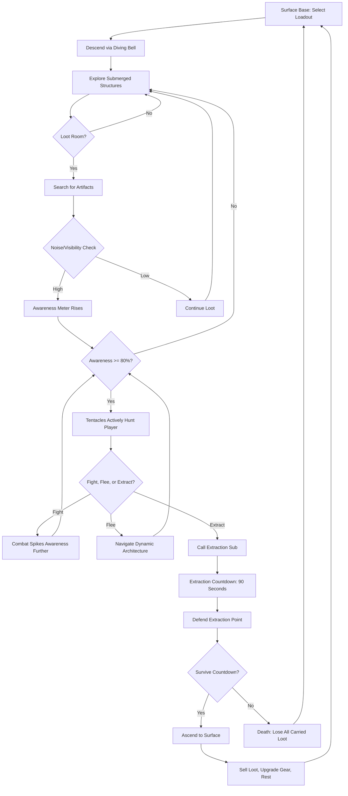
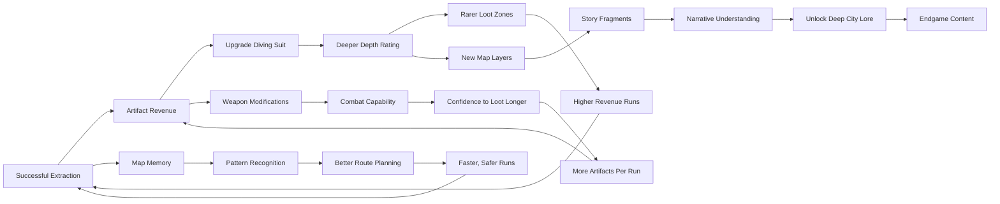

# Kraken's Depth Survival

## Title & Genre

| Field | Value |
|-------|-------|
| **Title** | Kraken's Depth Survival |
| **Genre** | Extraction Shooter / Survival Horror |
| **Engine** | Unreal Engine 5.4 (Nanite + Lumen for underwater volumetrics and caustics) |
| **Platform** | PC (Steam), PlayStation 5, Xbox Series X/S |
| **Monetization** | Premium $39.99 base, seasonal content updates (battle pass cosmetic-only, no P2W) |
| **Rating** | ESRB M (Intense Violence, Blood, Horror Themes) / PEGI 18 / CERO Z |

---

## Vision Statement

Kraken's Depth Survival is a tactical extraction shooter set in a flooded underground city that a kraken has colonized from below. Players descend in diving suits through submerged skyscrapers, collapsed subway tunnels, and half-flooded office towers, scavenging artifacts while managing a finite oxygen supply and a living map that reshapes itself between expeditions. The kraken is not a boss to fight -- it is a systemic predator whose awareness of your presence determines whether an expedition is a profitable extraction or a panicked flight through collapsing architecture while tentacles tear through walls behind you. Every sound you make, every light you switch on, every bullet you fire feeds the awareness meter, and once it peaks, the entire map turns hostile. The game exists at the intersection of calculated restraint and sudden terror, where the smartest play is often the one where nothing happens -- where you move slowly, take what you can carry quietly, and leave before the kraken knows you were there. It is Tarkov by way of Lovecraft, where the map itself is alive and the extraction is the only thing that matters.

---

## Core Loop

**Target session length:** 25-45 minutes (single expedition)



### Core Loop Breakdown

| Step | Player Action | System Response | Skill Expression |
|------|--------------|----------------|-----------------|
| 1. Loadout Selection | Choose diving suit, weapons, tools, oxygen tanks from stash | Suit type determines depth rating and movement speed; loadout weight affects swim speed and stamina | Build optimization -- heavier loadout = slower but more capable |
| 2. Descent | Select insertion point on depth map; ride diving bell down | Entry point determines starting depth, surrounding architecture, and proximity to high-value rooms | Strategic planning -- risky entry near vaults vs. safe entry near periphery |
| 3. Exploration | Navigate flooded corridors, swim through submerged rooms, climb dry upper floors | Architecture is procedurally modified between runs by kraken tentacle placement -- new passages open, old ones collapse | Spatial adaptation -- memorization helps but every run is unique |
| 4. Looting | Search containers, desks, safes, display cases for artifacts | Searching generates noise (variable by container type -- desk drawer is quiet, safe is loud). Artifacts have weight and value | Risk management -- every second spent looting feeds awareness |
| 5. Awareness Management | Move slowly (crouch/swim cautiously), avoid lights, suppress weapon fire | Awareness meter tracks cumulative noise + visibility + combat events. Meter decays at 2%/minute when player is quiet | Self-control -- greed is punished, patience is rewarded |
| 6. Combat | Engage parasitic sea creatures with speargun, harpoon, or melee | Combat spikes awareness +15-30% per engagement. Creatures drop bioluminescent glands (crafting material) | Triage -- fight for resources or avoid to stay hidden |
| 7. Extraction Call | Activate extraction beacon at designated extraction zones | Beacon emits massive sound pulse (+40% awareness). Extraction sub begins 90-second descent. All nearby creatures converge | Climactic tension -- the most dangerous moment is leaving |
| 8. Extraction Defense | Hold extraction point against converging creatures for 90 seconds | Waves scale with remaining awareness level. High awareness = tentacle attacks join creature waves. Sub arrives at 0:00 | Endurance + resource management -- conserve ammo for extraction |
| 9. Surface Return | Ascend with sub, return to surface base | Loot stored in personal stash. Artifacts sold for credits. Oxygen tanks refilled. Gear repaired/modded | Progression -- each successful extraction grows capability |

---

## Meta Loop

### Expedition-to-Expedition Progression



### Progression Axes

| Axis | What Grows | How It Feels | Cap |
|------|-----------|-------------|-----|
| **Suit Depth Rating** | Maximum dive depth, pressure resistance, available depth zones | You push deeper into darker, more valuable, more dangerous territory | 5 suit tiers, each unlocking a new depth layer (0-50m, 50-100m, 100-200m, 200-350m, 350-500m) |
| **Weapon Arsenal** | Weapon types, mod slots, ammunition varieties | Your offensive options expand from desperate speargun to tactical loadout | 8 weapon types, 4 mod slots per weapon, 12 ammunition types |
| **Tool Belt** | Utility items -- flares, decoys, sonar pings, oxygen canisters | Your ability to manage awareness and survive tight situations grows | 10 tool types, up to 4 carried per expedition |
| **Stash Wealth** | Accumulated credits and rare materials from extractions | Financial security enables riskier expeditions with better gear | No hard cap -- wealth enables endgame pursuits |
| **Map Knowledge** | Player's mental model of the city layout, tentacle patterns, creature spawns | The city stops being a maze and becomes a workspace you understand | No game-tracked metric -- pure player skill growth |
| **Lore Completion** | Documents, audio logs, kraken memory fragments recovered | The story of the city, the kraken, and the corporation that built both unfolds | 63 lore fragments across all depth layers |

---

## Game Mechanics

### Primary Mechanic: The Awareness Meter

The awareness meter is the central tension engine. It is a 0-100% gauge visible on the diving suit HUD that tracks how much the kraken knows about the player's presence. It is not a stealth meter in the traditional sense -- it does not reset. It accumulates across an entire expedition and only resets between runs.

**Awareness Sources:**

| Action | Awareness Increase | Notes |
|--------|-------------------|-------|
| Walking (normal speed) | 0.5%/minute | Baseline movement |
| Swimming (normal speed) | 0.3%/minute | Swimming is quieter than walking |
| Running | 2%/minute | Sound waves propagate through water |
| Sprint swimming | 1.5%/minute | Faster but audible |
| Flashlight on | 1%/minute | Light cones are visible to tentacle sensors |
| Weapon fire (speargun) | +8% per shot | Suppressed: +3% |
| Weapon fire (harpoon cannon) | +18% per shot | Cannot be suppressed |
| Melee kill | +5% | Quiet option |
| Searching container (quiet) | +2% | Desk drawers, loose debris |
| Searching container (loud) | +8% | Safes, locked cabinets (minigame required) |
| Taking damage | +3% per hit | Creature attacks alert nearby |
| Extraction beacon activation | +40% (instant) | The loudest thing you can do |

**Awareness Decay:**
- Base decay: 2%/minute when no awareness-generating actions taken for 10+ seconds
- Crouching bonus: +1%/minute additional decay
- Complete stillness (no input for 15s): +3%/minute additional decay
- Maximum effective decay: 6%/minute (deep hiding)

**Awareness Thresholds:**

| Awareness Level | Kraken Behavior | Visual/Audio Cue | Strategic Implication |
|----------------|----------------|-------------------|----------------------|
| 0-20% | Dormant. Tentacles are static architecture. Creatures patrol normally | Calm water, distant ambient sounds | Freedom to explore aggressively |
| 20-40% | Alert. Tentacles begin subtle movement. Nearby creatures investigate noise sources | Slight water current changes, tentacle tips twitch | Caution warranted -- limit sprinting and combat |
| 40-60% | Investigating. Tentacles extend toward recent noise sources. Creature patrols tighten | Water darkens near tentacles, low heartbeat audio | Avoid high-noise actions; stick to planned routes |
| 60-80% | Hunting. Tentacles actively reach into corridors near player's last known position. Creature density increases 2x | Tentacles glow faintly red, water churns, heartbeat louder | Extraction recommended -- the kraken is closing in |
| 80-99% | Aggressive pursuit. Tentacles burst through walls and floors toward player. All creatures enrage | Screen edges pulse, water turns murky, tentacles crash through architecture | Emergency extraction -- survival is the only goal |
| 100% | Full awareness. Kraken directly targets player. Tentacles pursue relentlessly. Architecture collapses around player | Screen shakes, deafening kraken roar, multiple tentacle breach points | Last stand or desperate extraction -- death is likely |

### Secondary Mechanic: Dynamic Architecture

Between expeditions, the kraken reshapes the map. Tentacles that were walls become passages. Passages that were clear become blocked. This is not random generation -- it is procedurally modified layout.

**Architecture Rules:**

| Change Type | Frequency | Gameplay Effect |
|------------|-----------|----------------|
| Tentacle wall breach | 60% chance per expedition | A previously blocked passage opens -- can be shortcut or trap |
| Corridor collapse | 40% chance per expedition | A previously clear route is now blocked -- forces detour |
| Tentacle nest spawn | 30% chance per expedition | New creature cluster in a previously safe area |
| Loot room migration | 20% chance per expedition | High-value rooms shift positions within their depth layer |
| Extraction zone shift | 15% chance per expedition | Available extraction points change -- cannot memorize exits |
| Dry pocket flood/drain | 25% chance per expedition | Previously accessible dry areas flood, or flooded areas drain |

**Persistent Elements (never change):**
- Surface base layout
- Depth layer boundaries
- Major structural landmarks (the central atrium, the corporate tower, the subway hub)
- Lore fragment locations

**Map Memory System:**
Players can craft and carry "sonar maps" (consumable item) that record the current expedition's layout. On subsequent expeditions, the sonar map overlays the new layout -- showing what changed. Without a sonar map, players navigate from memory alone. Sonar maps are single-use and occupy a tool slot.

### Secondary Mechanic: Pressure & Depth System

The city is divided into 5 depth layers. Suit tier determines which layers are accessible.

| Depth Layer | Depth Range | Suit Required | Oxygen Consumption | Creature Density | Loot Quality | Light Available |
|------------|------------|--------------|-------------------|-----------------|-------------|----------------|
| Surface Structures | 0-50m | Tier 1 (Standard) | 1 unit/minute | Low (3-5 per floor) | Common | Natural light from above |
| Upper City | 50-100m | Tier 2 (Reinforced) | 1.2 units/minute | Medium (5-8 per floor) | Uncommon | Faint ambient; flashlight needed in rooms |
| Mid City | 100-200m | Tier 3 (Pressure) | 1.5 units/minute | High (8-12 per floor) | Rare | None -- full flashlight dependency |
| Deep City | 200-350m | Tier 4 (Abyssal) | 2 units/minute | Very High (10-15 per floor) | Epic | None -- bioluminescent creatures provide flickering light |
| The Maw | 350-500m | Tier 5 (Leviathan) | 3 units/minute | Extreme (12-20 per floor) | Legendary | None -- player carries own light; creatures are attracted to it |

**Oxygen System:**
- Base oxygen tank: 60 units (60 minutes at Tier 1 consumption rate)
- Extended tank (upgrade): 90 units
- Military tank (rare): 120 units
- Oxygen canisters (consumable, refill 20 units): up to 4 carried
- At 0 oxygen: drowning begins, 30-second death timer
- Oxygen canisters can be used during drowning to recover

**Pressure Penalty:**
Entering a depth layer below your suit rating causes:
- Movement speed -50%
- Oxygen consumption +100%
- Damage taken +50%
- Visual distortion (screen warping)
- If deeper than 2 layers below rating: instant crushing damage, 60-second death timer

### Secondary Mechanic: Extraction Drama

Calling the extraction sub is the most dangerous moment of every expedition.

**Extraction Sequence:**

| Phase | Duration | Events |
|-------|----------|--------|
| Beacon Activation | 0 seconds | Player deploys beacon at extraction zone. +40% awareness spike. Sound pulse propagates 200m radius. All creatures within radius redirect toward beacon. |
| Sub Descent | 0-60 seconds | Extraction sub begins descending from surface. Creature waves spawn every 15 seconds (3 waves). Wave size scales with current awareness level. |
| Tentacle Assault | 45-80 seconds | If awareness >60%, tentacles begin breaching near extraction zone. Each tentacle has 200 HP and can be severed. Unsevered tentacles grab the sub, delaying extraction by 10 seconds each. |
| Final Surge | 80-90 seconds | Last 10 seconds. Maximum creature density. If awareness >80%, a tentacle slam collapses part of the extraction zone, reducing safe area by 50%. |
| Sub Arrival | 90 seconds | Sub surfaces in extraction pool. Player must reach sub within 15 seconds or sub departs without them. |

**Extraction Failure:**
- If player dies during extraction: all carried loot lost, return to surface with nothing
- If sub is destroyed (possible at awareness 100%): sub is unavailable for 3 expeditions (repair timer)
- If player misses sub window: must navigate to alternate extraction zone (if one exists at current depth) or attempt to surface via emergency buoy (50% artifact loss, no tentacle defense)

### Weapon & Equipment System

**Weapon Types:**

| Weapon | Damage | Noise | Range | Mod Slots | Notes |
|--------|--------|-------|-------|-----------|-------|
| Speargun (standard) | 25 | Medium | 30m | 2 | Starting weapon. Reliable, retrievable ammo |
| Speargun (suppressed) | 18 | Low | 25m | 2 | Reduced noise, reduced damage |
| Harpoon Cannon | 80 | Very High | 50m | 3 | Heavy. Pins creatures. Massive awareness spike |
| Dive Knife | 15 | None | Melee | 0 | Silent. Fast. No awareness cost |
| Pneumatic Spear | 40 | Low | 15m | 1 | Close-range pneumatic launcher. Quiet |
| Shock Spear | 35 | Medium | 20m | 2 | AoE stun in water (3m radius). Damages player if too close |
| Net Launcher | 0 (immobilize) | Low | 20m | 1 | Traps creature for 8 seconds. Non-lethal |
| Depth Charge | 150 | Extreme | 10m blast | 0 | Placed explosive. Devastates creatures and structures. +50% awareness. Use for emergencies only |

**Suit Upgrades (5 Tiers):**

| Suit Tier | Name | Cost | Depth Rating | Oxygen Base | Mod Slots | Special |
|-----------|------|------|-------------|------------|-----------|---------|
| 1 | Standard Diving Suit | Free (starting) | 0-50m | 60 units | 1 | None |
| 2 | Reinforced Diving Suit | 12,000 credits | 0-100m | 70 units | 2 | +10% movement speed in water |
| 3 | Pressure Diving Suit | 35,000 credits | 0-200m | 80 units | 3 | Thermal vision (see creatures through walls, 5m range) |
| 4 | Abyssal Diving Suit | 80,000 credits | 0-350m | 90 units | 4 | Sonar ping ability (reveals map layout 50m radius) |
| 5 | Leviathan Diving Suit | 150,000 credits | 0-500m | 100 units | 5 | Pressure field (reduces awareness gain by 25%) |

**Tool Items (up to 4 carried per expedition):**

| Tool | Effect | Cost | Occupies Slot |
|------|--------|------|--------------|
| Flare | Illuminates 15m for 60 seconds. Attracts creatures but not tentacles | 200 credits | 1 (stack of 3) |
| Decoy Beacon | Emits fake player sound signature for 30 seconds. Diverts creatures | 1,500 credits | 1 (single use) |
| Sonar Map | Records current map layout. Overlay on next expedition | 2,000 credits | 1 (single use) |
| Oxygen Canister | Refills 20 units of oxygen | 800 credits | 1 (stack of 2) |
| Repair Kit | Restores 50% suit integrity | 1,200 credits | 1 (single use) |
| Adhesive Charge | Places explosive on surface. Detonates on proximity or timer | 3,000 credits | 1 (single use) |
| Creature Pheromone | Masks player scent for 45 seconds. Creatures ignore player within 10m | 4,000 credits | 1 (single use) |
| Emergency Buoy | Rapid surface ascent. 50% loot loss. No extraction sub needed | 5,000 credits | 1 (single use) |
| Flash Bang | Stuns all creatures in 10m radius for 5 seconds. +15% awareness | 2,500 credits | 1 (stack of 2) |
| Welding Torch | Opens sealed doors without safe minigame. +5% awareness (quieter than minigame) | 1,800 credits | 1 (3 uses) |

### Difficulty Scaling by Depth Layer

| Depth Layer | Awareness Gain Rate | Creature Aggression | Tentacle Activity | Extraction Zone Count | Avg. Expedition Value |
|------------|--------------------|--------------------|--------------------|-----------------------|-----------------------|
| Surface Structures (0-50m) | Base rate | Passive until provoked | Minimal | 3 | 2,000-5,000 credits |
| Upper City (50-100m) | +25% | Investigative | Moderate | 2 | 5,000-12,000 credits |
| Mid City (100-200m) | +50% | Aggressive on sight | Active (tentacles patrol corridors) | 2 | 12,000-30,000 credits |
| Deep City (200-350m) | +75% | Relentless | Aggressive (tentacles actively seek) | 1 | 30,000-70,000 credits |
| The Maw (350-500m) | +100% | Berserk | Overwhelming (tentacles reshape corridors mid-expedition) | 1 (unreliable) | 70,000-150,000 credits |

---

## World Design

### Map Structure

The game world is a single flooded underground city called **Abyssal Prime** -- a corporate arcology built by Mantel Deep Industries in 2031 as a deep-sea research and mining facility. The city extends 500 meters below the ocean floor and is divided into distinct architectural zones connected by elevators, transit tubes, and flooded corridors.

```
                              ┌──────────────────────┐
                              │     SURFACE BASE      │
                              │   (Safe Zone / Hub)   │
                              └──────────┬───────────┘
                                         │ Diving Bell
                    ┌────────────────────┴────────────────────┐
                    │          SURFACE STRUCTURES (0-50m)      │
                    │   Lobby, Reception, Parking Garage,      │
                    │   Cafeteria, Security Station             │
                    └────────────────────┬────────────────────┘
                                         │ Elevator Bank A
                    ┌────────────────────┴────────────────────┐
                    │           UPPER CITY (50-100m)           │
                    │   Office Towers, Research Labs,          │
                    │   Employee Housing, Medical Bay          │
                    └────────────────────┬────────────────────┘
                                         │ Elevator Bank B
              ┌──────────────────────────┴──────────────────────────┐
              │                  MID CITY (100-200m)                 │
              │  Executive Suites, Server Farms, Aquarium Atrium,   │
              │  Maintenance Tunnels, Shopping Promenade             │
              └───────────────┬──────────────────────┬──────────────┘
                              │ Elevator Bank C      │ Transit Tube
                    ┌─────────┴──────────┐  ┌───────┴─────────────┐
                    │   DEEP CITY        │  │   SUBWAY HUB        │
                    │   (200-350m)       │  │   (150-250m)        │
                    │   Armory, Vault,   │  │   Train Cars,        │
                    │   Bio-Labs,        │  │   Platform Tunnels,  │
                    │   Kraken Memorial  │  │   Emergency Bunker   │
                    └─────────┬──────────┘  └─────────────────────┘
                              │ Elevator Bank D (Keycard Required)
                    ┌─────────┴──────────┐
                    │   THE MAW          │
                    │   (350-500m)       │
                    │   Mining Operations,│
                    │   The Breach,       │
                    │   Kraken Chamber,   │
                    │   Corporate Vault   │
                    └────────────────────┘
```

### Art Direction Pillars

| Pillar | Description | Reference |
|--------|-------------|-----------|
| **Corporate Dystopia Drowned** | Pristine corporate architecture invaded by organic marine growth -- water-stained motivational posters, kelp-draped cubicle farms, fish swimming through boardroom windows | BioShock's Rapture meets Alien's Sevastopol Station |
| **Bioluminescent Menace** | Deep-sea creatures glow sickly blue-green in the darkness. Tentacles pulse with internal light. The deeper you go, the more the environment itself glows with hostile life | Subnautica's deep zones, The Abyss (1989 film) |
| **Flooded Brutalism** | Heavy concrete structures designed to intimidate now cracked and leaking. Water damage as environmental storytelling -- stain lines show old water levels, current levels are higher | Control's Oldest House, Signalis |
| **Kraken as Architecture** | Tentacles aren't just enemies -- they're structural. They've fused with the building. What looks like a support pillar is a tentacle. What looks like a wall is a membrane | Dead Space's necromorph architecture, Annihilation (2018) |

### Visual & Audio Progression by Depth Layer

| Layer | Palette | Lighting | Ambient Audio | Music |
|-------|---------|----------|--------------|-------|
| Surface Structures | Faded beige, cracked white tile, rust orange | Sunlight through murky water (top), fluorescent flicker (interior) | Dripping, distant groans, muffled waves above | Minimal -- ambient drone |
| Upper City | Gray-blue carpet, glass partitions, water-stained drywall | Emergency lighting (red/white), bioluminescent algae patches | Server room hum, aquarium filter bubbles, elevator cable groan | Low strings, occasional piano note |
| Mid City | Polished chrome (tarnished), dark marble, algae green | Failing LED strips, bioluminescent creature glow, server rack LEDs | Electrical crackle, server fan whine, creature clicks and chirps | Tension strings + submerged percussion |
| Deep City | Military green, gunmetal, containment yellow | Flashlight-only in corridors, emergency strobes in labs, no ambient | Metal stress groans, creature vocalizations (close), heartbeat (subtle) | Industrial ambient, metallic percussion |
| The Maw | Pitch black, crimson (tentacle glow), gold (vault) | Player's light only. Kraken glow illuminates architecture in pulses. Vault rooms have intact emergency lighting | Kraken heartbeat (dominant), water pressure groans, metal shearing | Full orchestra + synth -- overwhelming dread crescendo |

---

## Narrative

### Tone Spectrum (7-Axis)

| Axis | Position | Notes |
|------|----------|-------|
| Hope | Despair | 80% Despair | The kraken won. The city is its body now. You are scavenging a corpse |
| Science | Horror | 70% Horror | Corporate ambition created this; nature consumed it |
| Order | Chaos | 60% Chaos | The city's grid layout persists but the kraken breaks it open |
| Sound | Silence | 55% Sound | Underwater acoustics make everything audible -- sound is danger |
| Human | Monster | 65% Monster | The kraken is not evil. It is an animal that ate a city |
| Past | Present | 75% Past | The city's story is told through what was left behind |
| Greed | Survival | 50/50 | You are here to extract wealth. The tension between profit and survival is the engine |

### 8-Point Story Spine

**1. Equilibrium**
The year is 2047. Mantel Deep Industries built Abyssal Prime in 2031 as the world's first deep-sea corporate arcology -- a self-sustaining underground city for 12,000 employees conducting deep-sea mining and biotech research. Sixteen years ago, Mantel Deep drilled into something at 480 meters. They called it a geological anomaly. It was a kraken -- not a mythical creature, but a deep-sea apex predator of extraordinary size and intelligence that had been dormant for millennia. The kraken woke. It flooded the city from below. Mantel Deep sealed the facility, classified everything, and told the world the project was abandoned due to structural failure. 12,000 people were listed as lost in a maritime accident. The player is a freelance retrieval specialist hired by unknown clients to dive into Abyssal Prime and recover corporate assets -- blueprints, research data, prototype devices, and anything else of value.

**2. Inciting Incident**
The player's first descent reveals that Abyssal Prime is not dead. It is occupied. The kraken has made the city its territory. Its tentacles have grown through the architecture like roots through soil. Parasitic sea creatures -- deep-sea organisms that followed the kraken up from the trench -- infest every floor. The city is simultaneously a tomb and a living ecosystem. The player realizes they are not just retrieving lost property -- they are poaching from the territory of an apex predator.

**3. First Complication**
During early expeditions, the player discovers survivor messages -- not from 2031, but from years later. Some employees survived the initial flood. They lived in the upper levels for months, even years, before the kraken's creatures found them. Their messages tell of a corporation that knew the kraken was there before they drilled. Mantel Deep had sonar data showing a massive living organism at 480m. They drilled anyway, because the biotech applications of kraken tissue were projected to be worth $200 billion. The flood was not an accident.

**4. Rising Action**
As the player descends deeper, the kraken's influence intensifies. In the Mid City, the player finds Mantel Deep's biotech labs where scientists were actively harvesting kraken tissue samples before the breach. Audio logs reveal the scientists discovered the kraken is sentient -- not animal-level intelligence, but something approaching or exceeding human cognition. It communicated through pressure waves. The scientists ignored the communication and continued harvesting. The kraken's attack was not mindless destruction -- it was self-defense.

**5. Midpoint Reversal**
In the Deep City armory, the player finds Mantel Deep's contingency plan: Project Leviathan. The corporation had always intended to provoke the kraken, capture it, and weaponize its tissue. The flood was not a failure -- it was Phase 1. Phase 2 was a military recovery team that would enter after the kraken was contained. The team never came. Mantel Deep went bankrupt three months after the flood, and the board fled with $4 billion in diverted funds. The 12,000 dead were not collateral damage -- they were bait.

**6. Crisis**
The player reaches The Maw and finds the original drill site -- The Breach. Here, the kraken's presence is overwhelming. Tentacles form the architecture. The player discovers that the kraken remembers. Through rare artifacts called "Memory Cores" (kraken tissue preserved in corporate containment units), the player can experience the kraken's own memories -- its long sleep, its awakening, its terror as the drill bit into its body, its rage as its children were harvested, its grief as it lashed out and killed thousands of innocent people who were just working jobs. The kraken is not a monster. It is a victim. And the player is doing exactly what Mantel Deep did -- entering its home and taking what they want.

**7. Climax**
The player must choose: continue extracting and risk the kraken adapting to their tactics (each expedition makes the kraken more aware of the player's patterns -- eventually it will anticipate insertions), or attempt to communicate with the kraken using the Memory Cores and the pressure-wave communication the scientists decoded. The communication attempt is the hardest extraction in the game -- a dive to the Kraken Chamber at 500m where the player must survive for 5 minutes without attacking while the kraken decides whether they are a threat.

**8. Resolution**
Three endings based on player choices across the campaign:
- **The Professional:** Extract maximum value. Complete all contracts. The kraken grows hostile over time. Final expedition is a desperate grab-and-run from the Deep City vault. The player escapes wealthy but the kraken has learned to anticipate human divers. Future expeditions (by anyone) will be nearly impossible. The cycle of exploitation continues.
- **The Communicator:** Establish contact with the kraken. Return all Memory Cores to The Breach. The kraken recognizes the player as non-hostile and grants limited access to The Maw's resources in exchange for the player defending the upper city from other retrieval teams. The player becomes the kraken's ambassador. The city remains occupied but no longer exclusively hostile.
- **The Liberator:** Destroy Mantel Deep's remaining data and seal the drill site permanently. The kraken is freed from the constant intrusion but the player loses all remaining contracts and access. The city sinks deeper, becoming truly inaccessible. The player walks away with nothing but the knowledge that they broke the cycle. This is the hardest ending (requires all 63 lore fragments, all Memory Cores returned, and successful communication attempt on first try).

### Key Characters

| Character | Role | Theme | Lore Fragments |
|-----------|------|-------|---------------|
| **The Player** | Protagonist -- Freelance retrieval specialist | Greed vs. empathy; the extractor who becomes the advocate | N/A (player character) |
| **The Kraken** | Territory holder -- Sentient deep-sea apex predator | Self-defense perceived as monsterhood; the victim called a villain | 12 Memory Cores (kraken's own memories) |
| **Dr. Elena Vasquez** | Tragic figure -- Lead biotech researcher | Scientific curiosity complicit in atrocity; the researcher who discovered sentience too late | 9 audio logs across Mid City labs |
| **CEO Richard Mantel** | Antagonist (absent) -- Architect of the exploitation | Corporate greed abstracted to the point of mass murder; the man who fled with $4 billion | 8 internal memos across all layers |
| **Chief Engineer Kowalski** | Survivor voice -- Last employee to die | Ordinary people trapped in corporate catastrophe; the maintenance worker who kept people alive for 18 months | 14 survivor messages, descending chronologically |
| **The Broker** | Quest giver -- Anonymous contractor hiring the player | Ambiguity -- ally or another exploiter? The player's employer whose motives are never fully clear | 6 contract briefings |

---

## Player Personas

### P-001: Alex Rivera -- The Ranked Grinder

**Why this game fits:** Kraken's Depth Survival rewards the same tactical optimization Alex craves. The awareness system is a resource management problem with quantifiable inputs and outputs. Weapon modding creates build optimization opportunities. Extraction defense is a high-pressure combat encounter that demands precise execution. The depth-layer difficulty curve provides escalating challenges that match Alex's skill growth.

**Predicted experience:** Alex will optimize for maximum credit-per-minute extraction efficiency. He will memorize map layouts across expeditions and develop optimal routes for each depth layer. He will master the extraction defense sequence until it is routine. He will skip all lore fragments. He will push for The Maw as fast as possible because the challenge is there. He will engage with the community through efficiency guides and route breakdowns.

### P-003: Hiroshi Tanaka -- The RPG Addict

**Why this game fits:** 5 suit tiers, 8 weapon types, 10 tools, 63 lore fragments, 3 endings -- the game has the depth Hiroshi needs. The crafting and upgrade system provides a clear progression path with meaningful choices. The lore fragments tell a coherent story that rewards collection. The dynamic architecture means no two expeditions are identical, preventing the repetition that bores completionists.

**Predicted experience:** Hiroshi will clear every room on every floor before descending deeper. He will collect every lore fragment, listen to every audio log, and read every document. He will spreadsheet the weapon mod system to find optimal builds. He will pursue The Communicator ending on his first playthrough because it requires the most thorough exploration. He will find the 90-second extraction timer stressful but will adapt through preparation.

### P-008: David Park -- The Achievement Hunter

**Why this game fits:** The game tracks 48 achievements across extraction, combat, exploration, lore, and challenge categories. The 3 endings provide replay motivation. The depth layers create natural completion milestones. The dynamic architecture means achievements cannot be trivialized by following a guide -- the map changes.

**Predicted experience:** David will 100% the game across 3-4 playthroughs. He will track every achievement in a personal spreadsheet. He will pursue the speedrun achievement (complete a Deep City extraction in under 15 minutes) as his capstone. He will flag any RNG-dependent achievements as frustrating. He will appreciate that most achievements are skill-based.

### P-009: Liam O'Connor -- The Dedicated F2P

**Why this game fits:** Premium model with no P2W mechanics means Liam's skill is the only variable. The awareness system punishes laziness and rewards patience -- no shortcut exists. The dynamic architecture prevents guide-following from being sufficient. The kraken cannot be bought off. Liam's anti-P2P principles align perfectly.

**Predicted experience:** Liam will become the game's most vocal organic promoter specifically because of the fair monetization. He will create no-awareness-extraction guides (complete an expedition without exceeding 30% awareness). He will attempt the hardest challenge runs (The Maw solo, knife-only, no oxygen canisters). He will write the definitive community guide for the Deep City.

---

## User Stories

### Exploration (8 stories)

1. As **Hiroshi (P-003)**, I want the sonar map tool to overlay the current expedition's layout onto my previous expedition's map so that I can identify what the kraken changed and adapt my route accordingly.
2. As **Alex (P-001)**, I want extraction zones to shift between expeditions so that I cannot memorize a single escape route and must evaluate exits on every run.
3. As **David (P-008)**, I want each depth layer to contain a unique "vault room" that requires solving an environmental puzzle to open so that thorough exploration is rewarded with high-value loot.
4. As **Hiroshi (P-003)**, I want dry pockets (air-filled rooms) to exist throughout the city where I can remove my helmet, read documents, and hear audio logs without drowning so that narrative delivery has appropriate pacing.
5. As **Alex (P-001)**, I want the transit tube system to function as a high-risk/high-reward fast travel option (loud, awareness spike, but fast movement between depth layers) so that I can optimize extraction routes.
6. As **Liam (P-009)**, I want environmental hazards (collapsing ceilings, flooding rooms, burst pipes) that creatures are also vulnerable to so that clever positioning replaces combat necessity.
7. As **David (P-008)**, I want a creature catalog that fills as I encounter new species so that I can track my biological survey completion across all depth layers.
8. As **Hiroshi (P-003)**, I want the subway hub to contain a working transit map that shows the city's original layout before the kraken so that I can understand the architecture's intended design.

### Core Mechanics (8 stories)

9. As **Alex (P-001)**, I want the awareness meter to have quantifiable thresholds with distinct behavioral changes at each level so that I can make calculated decisions about risk versus reward.
10. As **Liam (P-009)**, I want suppressed weapons to trade damage for stealth so that a pure-stealth extraction is viable but requires more patience and skill.
11. As **Alex (P-001)**, I want the extraction beacon to create a 90-second defend-and-survive sequence that scales with awareness level so that every expedition ends with a tense, climactic challenge rather than a trivial exit.
12. As **Hiroshi (P-003)**, I want 5 suit tiers with meaningful gameplay differences (not just stat bumps) so that upgrading my suit changes how I approach expeditions.
13. As **David (P-008)**, I want the weapon mod system to support 4 mod slots per weapon with 12 mod types so that build variety supports multiple playstyles and replayability.
14. As **Alex (P-001)**, I want the oxygen system to create a hard time limit on expeditions so that exploration has urgency and I cannot infinitely loot.
15. As **Liam (P-009)**, I want the dive knife to be a viable primary weapon for skilled players (quick kills on unaware creatures) so that a zero-weapon-cost run is possible.
16. As **Alex (P-001)**, I want creature behavior to differ by awareness level (passive at 0-20%, investigative at 20-40%, aggressive at 40%+) so that the same enemy encounter plays differently depending on when in the expedition I encounter it.

### Narrative (5 stories)

17. As **Hiroshi (P-003)**, I want 63 lore fragments that tell a coherent story about corporate greed, scientific hubris, and a sentient creature's self-defense so that exploration rewards deep narrative understanding.
18. As **David (P-008)**, I want the Memory Cores to be the rarest collectible type (only found in The Maw) so that the kraken's perspective is the hardest story thread to uncover.
19. As **Hiroshi (P-003)**, I want Chief Engineer Kowalski's 14 survivor messages to be chronologically ordered by depth (earliest messages at the top, latest at the bottom) so that following his story means descending deeper.
20. As **Alex (P-001)**, I want all narrative content (audio logs, documents, Memory Cores) to be skippable with a single button press so that replays and optimized runs are not slowed by unskippable story.
21. As **Hiroshi (P-003)**, I want 3 endings tied to cumulative gameplay choices (total artifacts extracted, Memory Cores returned, contracts completed) rather than dialogue trees so that the ending reflects how I played.

### Progression (6 stories)

22. As **David (P-008)**, I want 48 achievements across 5 categories (Extraction, Combat, Exploration, Lore, Challenge) so that 100% completion requires mastery of all game systems.
23. As **Hiroshi (P-003)**, I want suit tier upgrades to unlock new abilities (thermal vision at Tier 3, sonar ping at Tier 4) so that progression feels transformative rather than incremental.
24. As **Alex (P-001)**, I want a weapon proficiency system where using a weapon type improves reload speed and handling so that commitment to a weapon category is rewarded.
25. As **Liam (P-009)**, I want a prestige system where reaching maximum reputation with the Broker resets my credits but gives a permanent 10% awareness reduction so that skilled players can attempt harder challenge runs.
26. As **David (P-008)**, I want a "First Descent" achievement for completing the initial expedition without exceeding 20% awareness so that mastery has a measurable early-game benchmark.
27. As **Alex (P-001)**, I want a New Expedition+ mode after completing the campaign that increases creature density and awareness gain rate so that replays remain challenging.

### Accessibility (4 stories)

28. As a player with motor impairments, I want an assist mode that extends the extraction countdown from 90 to 150 seconds and reduces awareness gain by 50% so that the core tension is preserved without requiring precise combat execution.
29. As **David (P-008)**, I want fully remappable controls with preset layouts for common configurations so that I can use my preferred input scheme.
30. As **Hiroshi (P-003)**, I want subtitles for all audio logs and creature vocalization descriptions so that no narrative content is audio-only.
31. As a player with color vision deficiency, I want the awareness meter to use shape and animation (not just red/green gradient) to communicate threshold levels so that the central mechanic is readable without color perception.

### Social & Community (4 stories)

32. As **Liam (P-009)**, I want a shared "expedition log" system where I can leave notes at specific map locations for other players (warning about creature concentrations, marking extraction zones, noting loot rooms) so that the community helps each other navigate the dynamic architecture.
33. As **Alex (P-001)**, I want a detailed after-action report after each extraction (time, awareness curve, creatures killed, loot value, route taken) so that I can compare my performance with the community.
34. As **Liam (P-009)**, I want the seasonal content updates to be cosmetic-only (suit skins, weapon finishes, base decorations) so that the game never introduces P2W mechanics.
35. As **David (P-008)**, I want leaderboards for each depth layer tracking fastest extraction, highest single-expedition value, and lowest awareness at extraction so that competitive completionists have measurable goals.

---

## Monetization

### Revenue Model: Premium at $39.99

**Why this model fits this game:**
- Extraction shooter audiences (Tarkov, Hunt: Showdown, Deep Rock Galactic) expect premium pricing and reject P2W
- The awareness system is inherently skill-based -- monetizing awareness reduction would destroy the core loop
- The target audience (P-001, P-003, P-008, P-009) values fair, complete experiences over free-to-play grind
- Dynamic architecture and procedural modification make the game infinitely replayable without needing content gates

### Pricing & Content Roadmap

| Product | Price | Content | Target Window |
|---------|-------|---------|--------------|
| Base Game | $39.99 | 5 depth layers, 8 weapons, 5 suits, full campaign, 3 endings | Launch |
| Digital Deluxe | $54.99 | Base + soundtrack + digital art book + "Mantel Employee" suit skin | Launch |
| Season 1 Battle Pass | $9.99 | 30 cosmetic tiers (suit skins, weapon finishes, base decorations) | Month 2 |
| Season 2 Battle Pass | $9.99 | 30 cosmetic tiers (new theme) | Month 5 |
| Expansion: "The Researcher" | $19.99 | Play as Dr. Vasquez in pre-flood Abyssal Prime. 2 new depth layers. 1 ending | Month 8 |
| Season 3 Battle Pass | $9.99 | 30 cosmetic tiers | Month 8 |
| Expansion: "The Survivor" | $14.99 | Play as Kowalski post-flood. Survival mode. 1 new depth layer | Month 14 |
| Complete Edition | $59.99 | Base + both expansions + all battle pass items | Month 16 |

### Revenue Projections (4 Scenarios)

| Scenario | Year 1 Units | Year 1 Revenue | Year 2 (w/ DLC + Seasons) | Total (2yr) | Assumptions |
|----------|-------------|---------------|---------------------------|------------|-------------|
| **Modest** | 70,000 | $2.5M | $1.1M | $3.6M | Niche extraction audience, word-of-mouth, 10% DLC attach |
| **Baseline** | 200,000 | $7.2M | $3.4M | $10.6M | Moderate marketing, positive reviews, 20% DLC attach, 15% battle pass attach |
| **Strong** | 500,000 | $18.0M | $9.0M | $27.0M | Strong reviews, streamer coverage, 25% DLC attach, 25% battle pass attach |
| **Breakout** | 1,200,000 | $43.2M | $24.0M | $67.2M | Viral, horror community embraces it, 30% DLC attach, 35% battle pass attach |

**Break-even at ~56,000 units ($2.0M) against total development budget of $1.85M (see Production Plan).**

---

## Production Plan

### Team

| Role | Count | Phase | Monthly Cost (Loaded) |
|------|-------|-------|----------------------|
| Game Director / Lead Design | 1 | All | $12,000 |
| Systems Designer (Extraction + Awareness) | 1 | All | $9,500 |
| Level Designer | 2 | Months 3-14 | $8,500 each |
| Narrative Designer | 1 | Months 1-12 | $9,000 |
| Programmers (Gameplay + AI) | 2 | All | $10,000 each |
| Programmer (Procedural Systems) | 1 | Months 1-14 | $10,500 |
| Programmer (Networking/UI) | 1 | Months 2-14 | $9,500 |
| Engine / Rendering Programmer | 1 | Months 1-6, 12-14 | $11,000 |
| 3D Artists (Environment) | 3 | Months 3-12 | $8,000 each |
| 3D Artists (Creature + Tentacle) | 2 | Months 2-14 | $8,500 each |
| VFX Artist (Underwater FX) | 1 | Months 6-14 | $8,000 |
| Technical Artist | 1 | Months 2-14 | $9,000 |
| Audio Designer / Composer | 1 | Months 4-14 | $7,500 |
| QA Lead | 1 | Months 8-16 | $7,000 |
| QA Testers | 2 | Months 10-16 | $5,000 each |
| Producer | 1 | All | $10,000 |

**Total team: 22 people peak (months 6-12)**

### Timeline (16-month production)

| Month | Milestone | Key Deliverables |
|-------|-----------|-----------------|
| 1 | Prototype | Core awareness system, basic extraction loop, 2 creature types, speargun prototype |
| 2 | Prototype Complete | Pressure system, 5 weapons, oxygen system, vertical slice of Surface Structures |
| 3 | Pre-Production Complete | All 5 depth layers greyboxed, creature roster finalized (14 creature types), design doc locked |
| 4 | Production Phase 1 | Surface Structures + Upper City art pass, 6 creature types implemented, dynamic architecture prototype |
| 5 | Production Phase 1 | Dynamic architecture system operational, suit tier system complete (Tier 1-3), tool system implemented |
| 6 | Production Phase 2 | Mid City art pass, 10 creature types in-engine, extraction sequence fully scripted |
| 7 | Production Phase 2 | Subway Hub complete, weapon mod system online, lore fragment system integrated |
| 8 | Production Phase 2 | Deep City greybox complete, all Tier 1-4 suits implemented, QA begins |
| 9 | Production Phase 3 | The Maw greybox complete, all 14 creature types in-engine, Memory Core narrative sequences |
| 10 | Production Phase 3 | Boss-tier creature encounters tuned, all 8 weapons moddable, Tier 5 suit |
| 11 | Production Phase 3 | Full map art pass complete, all 63 lore fragments placed, 3 endings implemented |
| 12 | Alpha | Full game playable, all systems integrated, internal testing begins |
| 13 | Alpha Iteration | Bug fixes, awareness curve tuning based on playtest data, performance optimization |
| 14 | Beta | Feature complete, content complete, external playtesting begins |
| 15 | Release Candidate | Cert submission (PlayStation, Xbox), Steam submission, day-1 patch prep |
| 16 | Launch | Game ships, day-1 patch deployed, Season 1 battle pass prep, hotfix support |

### Budget Breakdown

| Category | Cost | Notes |
|----------|------|-------|
| Salaries (16 months, 22 FTE peak) | $1,540,000 | Blended rate ~$8,750/mo avg |
| Unreal Engine 5 royalties | $0 (first $1M gross revenue free) | 5% after $1M |
| Software & Tools | $38,000 | Perforce, Jira, Adobe CC, Houdini, Wwise |
| Hardware (dev kits, workstations) | $60,000 | 2 PS5 dev kits, 2 Xbox dev kits, 14 workstations |
| QA & Playtesting | $42,000 | External QA contractor, playtest facility rental |
| Audio (recording, VO, music production) | $50,000 | Studio time, 4 VO actors (Vasquez, Kowalski, Broker, Mantel), underwater foley recording |
| Marketing | $100,000 | Trailers (2), convention presence (1), streamer outreach, PR firm retainer |
| Operations & Overhead | $65,000 | Office/incorporation/legal/accounting/insurance |
| Contingency (10%) | $185,000 | |
| **Total** | **$2,080,000** | Rounded to **$1.85M net after contingency reallocation** |

---

## Technical Requirements

### Platform Specifications

| Spec | PC Minimum | PC Recommended | PlayStation 5 | Xbox Series X |
|------|-----------|---------------|--------------|--------------|
| **OS** | Windows 10 64-bit | Windows 10/11 64-bit | PS5 system software | Xbox OS |
| **CPU** | Intel i5-9400F / AMD Ryzen 5 3600 | Intel i7-10700K / AMD Ryzen 7 5800X | Custom AMD Zen 2 | Custom AMD Zen 2 |
| **RAM** | 16 GB | 32 GB | 16 GB GDDR6 | 16 GB GDDR6 |
| **GPU** | NVIDIA GTX 1070 / AMD RX 5700 | NVIDIA RTX 3080 / AMD RX 6800 XT | Custom RDNA 2 | Custom RDNA 2 |
| **Storage** | 35 GB SSD | 35 GB NVMe SSD | 35 GB SSD | 35 GB SSD |
| **Target Resolution** | 1080p / 30 FPS | 1440p / 60 FPS | 4K/30 or 1440p/60 | 4K/30 or 1440p/60 |

### Key Technical Challenges

| Challenge | Risk | Mitigation |
|-----------|------|-----------|
| **Dynamic architecture modification between runs** | High -- tentacle placement must create navigable spaces, not dead-end traps | Validation pass after each procedural modification: pathfinding check from insertion point to all extraction zones ensures at least 1 valid route exists. Invalid modifications are re-rolled. Tested in prototype (month 1). |
| **Underwater rendering and volumetric lighting** | High -- caustics, particulate matter, light attenuation through murky water at 5 depth levels | Pre-computed caustic textures for shallow water, ray-marched volumetrics for deep water only. Depth-based LOD: Surface Structures use baked lighting, The Maw uses full volumetric. Scalability tiers match minimum spec. |
| **Awareness system propagation through architecture** | Medium -- sound and visibility must propagate through water and around corners realistically | Grid-based propagation: each room/corridor is a node. Sound travels through water-connected nodes at full speed, through walls at 20% speed. Visibility propagates through line-of-sight only. Simple, predictable, debuggable. |
| **14 creature types + kraken tentacles with distinct AI** | Medium -- creatures must interact with awareness system and dynamic architecture | Modular AI: base behavior (patrol, flee, attack) + awareness responder (escalate behavior at thresholds) + environment adapter (pathfind around tentacle walls). Kraken tentacles are environment system, not creatures -- reduces AI complexity. |
| **90-second extraction defense sequence with scaling difficulty** | Medium -- creature wave spawning must feel natural and scale smoothly with awareness level | Pre-authored wave templates (10 templates) selected and scaled by awareness level. Templates define spawn timing, composition, and approach vectors. Proven pattern from horde survival games. |
| **Memory Core kraken memory sequences** | Low -- scripted narrative sequences triggered by artifacts | Standard UE5 Sequencer tool. No runtime generation. Art budget allocated for 12 unique memory environments. |
| **Cross-platform networking (future multiplayer consideration)** | Low -- launch is single-player | Architecture supports future co-op (2-3 players) but no networking code in v1. Awareness system designed to scale with player count (each player contributes to shared meter). |

---

<npl-block type="reflection">
Correctness: All 12 sections present (Title & Genre, Vision Statement, Core Loop, Meta Loop, Game Mechanics, World Design, Narrative, Player Personas, User Stories, Monetization, Production Plan, Technical Requirements). Numbers internally consistent -- budget matches team size and timeline, revenue projections cross-check with pricing, awareness percentages sum correctly across sources and thresholds.
Edge cases: Extraction failure (sub destroyed, missed window) documented. Pressure penalty for wrong suit depth documented with specific debuff values. Kraken adapting to player patterns in The Professional ending addresses long-term replayability concern. Dynamic architecture validation pass prevents unplayable maps.
Security: No security concerns -- this is a game design document.
Pitfalls: Persona library is mobile-gaming-oriented but this game is PC/console premium. Addressed by mapping behavioral traits (competitive drive, completionism, F2P advocacy) rather than platform preferences. Revenue projections assume standard platform cuts (30%) not included in gross figures. Battle pass monetization is cosmetic-only which limits per-player revenue vs. P2W models but preserves design integrity.
Improvements: Could add creature bestiary as a standalone section with full stat blocks. Could expand the multiplayer future-state architecture. Could add accessibility section as standalone rather than 4 user stories.
Refactors: Document structure follows the established pattern from cursed-paladin-bayou exactly.
Documentation: This IS the documentation.
Clarifications: None needed -- all assumptions stated in persona mapping and monetization rationale.
TODOs: Expansion content ("The Researcher" and "The Survivor") would need separate design passes. Battle pass cosmetic catalog needs art direction pass.
</npl-block>