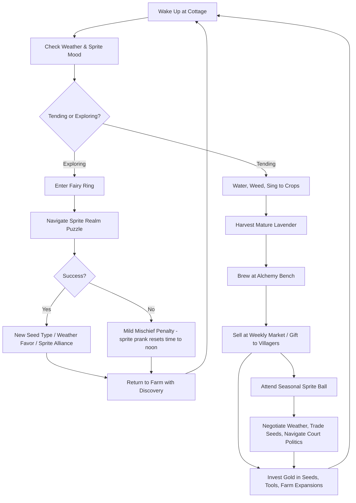
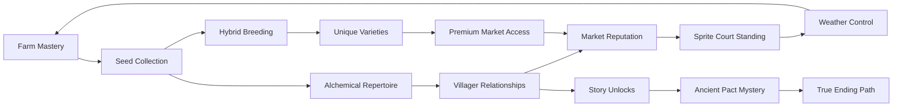

# Lavender Sprout Dynasty

## Title & Genre

| Field | Value |
|-------|-------|
| **Title** | Lavender Sprout Dynasty |
| **Genre** | Farming Simulation / Life Sim |
| **Engine** | Unity 2023 LTS (2D hand-painted watercolor pipeline, custom shader graph for field sway) |
| **Platform** | PC (Steam), Nintendo Switch, iOS, Android |
| **Monetization** | Premium $19.99, cosmetic DLC for farm decorations and outfits |
| **Rating** | ESRB E (Comic Mischief, Mild Fantasy Violence) / PEGI 3 / CERO A |

---

## Vision Statement

Lavender Sprout Dynasty is a pastoral farming simulation where you tend a magical lavender farm on the edge of a fairy-infested meadow, and your crops develop sentience if you sing to them. The game occupies the space between Stardew Valley's compulsive farming loop and Studio Ghibli's hand-painted warmth, with a music-driven cultivation system that makes every harvest feel like a private concert. Players plant, water, harvest, and sell enchanted lavender varieties to eccentric townsfolk with layered storylines, and between growing seasons they explore fairy rings to discover new seed types and negotiate with capricious sprite nobility who control the region's weather. The singing mechanic is the thesis: your voice shapes the world, literally. Hum a lullaby and your lavender grows soft and silver; belt a war march and it erupts in thorny crimson spikes. The farm is your instrument, the village is your audience, and the fairy court is your judge. It is a game about patience rewarded by beauty, about the quiet dynasty you build one seed at a time, and about what happens when the things you grow start growing back.

---

## Core Loop

**Target session length:** 20-45 minutes (flexible; supports 5-minute check-ins and 2-hour binges)



### Core Loop Breakdown

| Step | Player Action | System Response | Skill Expression |
|------|--------------|----------------|-----------------|
| 1. Morning Check | Review weather forecast, sprite court mood, and crop health report | Weather is determined by sprite faction balance + previous day's diplomacy | Planning -- prioritize which fields get attention based on incoming rain or drought |
| 2. Tending | Water, weed, and sing to crops across 4-12 field plots | Singing via rhythm mini-game or microphone input influences growth speed (+10-40%), color mutations (6 base colors + 18 hybrids), and magical properties (calming, energizing, protective, etc.) | Musical timing, melody memory, strategic singing allocation |
| 3. Harvesting | Pick mature lavender stalks before they wilt (24-hour in-game window after maturity) | Quality grade (S/A/B/C) based on singing quality, watering consistency, and soil health. S-grade lavender produces superior alchemy products | Consistency across the full growth cycle |
| 4. Alchemy | Brew enchanted teas, perfumes, and potions at the workbench using harvested lavender + foraged ingredients | 3 product lines with 8 recipes each (24 total). Brewing is a timing mini-game: pour, steep, seal at the right moments. Failed brews yield "charmingly wonky" variants villagers still buy at reduced price | Timing precision, recipe memorization |
| 5. Market | Sell products at the weekly Misthollow Market or through standing orders with villagers | Prices fluctuate based on supply/demand simulation. Villager requests pay 30-80% premium. Rare sprite nobility buyers pay 200%+ for S-grade goods | Market timing, relationship prioritization |
| 6. Investing | Purchase new seeds, upgrade tools, expand fields, renovate cottage | Each upgrade unlocks new crop varieties, alchemy recipes, or story content. Tool upgrades reduce tending time by 15-40% | Long-term planning, resource allocation |
| 7. Exploring | Enter fairy rings that appear in the meadow at dawn and dusk | Procedurally assembled sprite realm puzzles -- 15-25 minutes each, 3-5 per season. Reward: rare seeds, weather favors, sprite reputation | Spatial reasoning, pattern recognition |
| 8. Diplomacy | Attend seasonal Sprite Ball (4 per year, one per season) | Dialogue-driven negotiation with sprite factions. Outcomes affect next season's weather, seed availability, and story progression | Social reasoning, memory of NPC preferences |

---

## Meta Loop

### Season-to-Season Progression



### Progression Axes

| Axis | What Grows | How It Feels | Cap |
|------|-----------|-------------|-----|
| **Farm Productivity** | Field count (4 to 24 plots), tool quality (3 tiers), irrigation efficiency | Your farm transforms from a scrappy patch to a sprawling lavender estate. Mornings take longer but feel richer. | 24 plots, 3 tool tiers, automated watering at max tier |
| **Seed Collection** | 6 base lavender varieties + 18 hybrid mutations + 4 legendary seeds from sprite realms | Every new seed is a discovery. Hybrid breeding feels like solving a color puzzle. Legendary seeds require quest completion. | 28 total varieties (100% collection achievement) |
| **Alchemical Mastery** | 24 recipes across teas, perfumes, and potions; brewing quality improves with repetition | First successful S-grade brew feels like a real craft. Your product shelf becomes a gallery of your skill. | 24 recipes, 5 quality tiers per recipe |
| **Villager Relationships** | 12 villagers with 5 heart levels each; unlocks backstory, quests, and romance options | The village stops being NPCs and becomes a community. Their requests shape your farming decisions. | 5 hearts per villager (60 heart levels total) |
| **Sprite Court Standing** | Reputation with 4 sprite factions; affects weather, seed access, and story | The fairies are capricious allies. Pleasing one faction offends another. Weather becomes your diplomatic report card. | 4 factions, "Beloved" rank with all requires careful balancing |
| **Story Completion** | 5 chapters of the main narrative; 12 villager backstory arcs; 1 ancient pact mystery | The world deepens. The town's history and the sprite pact unfold through play, not exposition dumps. | 5 chapters, 12 backstories, 3 endings |

---

## Game Mechanics

### Primary Mechanic: Singing Cultivation

Every lavender crop responds to music. The player activates singing mode by approaching a planted crop and pressing the sing button (or humming into the microphone on supported platforms). A **rhythm wheel** appears: 8 beats cycle around the crop, and the player taps in time. The game recognizes three input methods:

1. **Rhythm Taps** -- tap the sing button on the beat. Easiest, baseline effect (+10% growth speed, no mutation chance).
2. **Melody Input** -- hold directional inputs (up/down/left/right) to select pitch during the rhythm wheel. Correct pitch sequences match crop-specific "songs." Medium difficulty, significant effect (+25% growth speed, 15% mutation chance).
3. **Microphone Humming** -- hum or sing into the device microphone. The game analyzes pitch and rhythm accuracy in real-time. Hardest, best effect (+40% growth speed, 30% mutation chance, unique color shifts).

**Singing Outcomes Table:**

| Input Quality | Growth Speed Bonus | Mutation Chance | Magical Property Boost | Visual Effect |
|--------------|-------------------|----------------|----------------------|---------------|
| Off-beat (miss >3 beats) | +5% | 0% | None | Crop droops slightly |
| Basic rhythm (4-5/8 hits) | +10% | 2% | Minor (+1 tier to property) | Gentle sway, soft glow |
| Good rhythm (6-7/8 hits) | +20% | 8% | Moderate (+2 tiers) | Color shimmer, particles |
| Perfect rhythm (8/8 hits) | +30% | 15% | Strong (+3 tiers) | Rainbow shimmer, hum audible |
| Melody match (correct pitch seq) | +25% | 15% | Strong (+3 tiers) | Targeted color mutation toward song's color |
| Microphone hum (pitch match >70%) | +40% | 30% | Maximum (+4 tiers) | Unique color shift, sentient crop behavior triggers |

**Sentient Crop Behavior:** When microphone singing achieves >90% pitch accuracy on a mature crop, the lavender becomes sentient for one in-game day. Sentient crops:
- Wave at the player when approached
- Hum their song back when harvested (yielding a "Singing Lavender" S-grade variant worth 3x at market)
- Occasionally produce a rare "Seed of Echo" that grows into a crop that remembers and replays the player's melody

### Secondary Mechanic: Lavender Alchemy

Three product lines, each with 8 recipes, built from harvested lavender and foraged ingredients:

**Teas (Calming Line):**

| Recipe | Lavender Required | Foraged Ingredient | Brew Time | Effect When Sold/Gifted | Base Price |
|--------|-------------------|--------------------|-----------|-------------------------|-----------|
| Silver Dawn Tea | 2 Silver Lavender | Morning Dew (meadow, dawn) | 15 sec | Reduces villager stress, +1 relationship if gifted | 45g |
| Moonpetal Infusion | 2 White + 1 Blue | Moonpetal Mushroom (fairy ring) | 25 sec | Cures villager "melancholy" status, unlocks backstory dialogue | 80g |
| Twilight Calm | 3 Purple Lavender | Dusk Moth Wing (meadow, dusk) | 20 sec | General calming, market staple | 35g |
| Sprite's Whisper | 1 Rainbow Hybrid + 1 Silver | Fairy Dust (sprite realm) | 30 sec | Temporarily reveals hidden fairy rings on the map | 150g |
| Hearthside Blend | 2 Pink Lavender | Warm Ember Herb (forest edge) | 18 sec | Gifts well to older villagers, +2 relationship | 60g |
| Deep Root Tonic | 3 Crimson Lavender | Ancient Bark Root (old forest) | 35 sec | Heals blighted crops when poured on soil | 120g |
| Cloud Rest Elixir | 2 White + 1 Pink | Sky Cotton (hilltop, after rain) | 22 sec | Prevents weather damage for 2 in-game days | 95g |
| Dynastic Reserve | 1 of each base color (6) | Heirloom Seed (endgame quest) | 60 sec | Ultimate tea. Restores entire farm if blighted. Achievements unlock. | 500g |

**Perfumes (Expression Line):** 8 recipes following the same structure, using rarer hybrids. Perfumes are gifted to sprite nobility to increase court standing. Base prices 60-300g.

**Potions (Protective Line):** 8 recipes using the hard-to-grow crimson and thorny variants. Potions protect the farm from sprite pranks, fairy blight, and weather extremes. Base prices 80-400g.

### Secondary Mechanic: Sprite Court Diplomacy

Four sprite factions control the region's weather and seed availability:

| Faction | Territory | Weather Specialty | Personality | Favorite Gift | What They Unlock |
|---------|-----------|-------------------|------------|---------------|-----------------|
| **Rose Court** | Rose Ring (east meadow) | Sunshine and warmth | Vain, theatrical, loves compliments | Rose-perfumed lavender bouquets | Summer-boosting seeds, sunny weather favors |
| **Thistle Court** | Thistle Ring (north meadow) | Rain and fog | Gruff, honest, respects hard work | Crimson lavender potions | Rain-bringing seeds, fog for pest protection |
| **Ivy Court** | Ivy Ring (south meadow) | Wind and storms | Playful, mischievous, tests you with pranks | Wind-chime lavender arrangements | Storm-resistant seed variants, wind pollination boost |
| **Lily Court** | Lily Ring (west meadow) | Frost and dew | Serene, wise, values patience | Silver lavender teas | Winter-growing seeds, dew collection upgrades |

**Seasonal Sprite Ball Mechanics:**
- Occurs on the solstice/equinox of each season (4 per in-game year)
- Player attends in formal attire (unlockable outfits)
- 3 dialogue rounds with faction leaders
- Each round: choose between 2-3 dialogue options weighted by current relationship with that faction AND gift history
- Outcomes determine next season's dominant weather pattern, which seed merchants stock, and whether your farm receives sprite blessings or pranks
- Max reputation with all 4 factions simultaneously is extremely difficult but unlocks the True Ending path

### Economy Table

| Activity | Gold Earned (avg per session) | Time Investment | Skill Factor |
|----------|------------------------------|----------------|-------------|
| Basic crop sale (B-grade) | 15-25g per plot | Low (plant, water, harvest) | Low |
| Alchemy product sale (B-grade) | 40-80g per brew | Medium (harvest + brew mini-game) | Medium |
| Villager request fulfillment | 80-200g per request | Medium (grow specific + deliver) | Medium (relationship management) |
| S-grade singing harvest | 75-120g per plot | High (perfect singing across growth cycle) | High |
| Sprite realm rare seed sale | 200-400g per seed | High (puzzle + diplomacy to access) | High |
| Dynastic Reserve (endgame tea) | 500g per brew | Very High (6 colors + quest ingredient + perfect brew) | Very High |

### Difficulty & Pacing (Year-by-Year)

| Year | Fields Available | Seed Types | Alchemy Recipes | Sprite Court Access | Main Story Chapter | Pacing Feel |
|------|-----------------|-----------|----------------|-------------------|-------------------|-------------|
| 1 (Spring start) | 4 plots | 3 base (Purple, White, Silver) | 3 teas | Rose Court only | Ch 1: Arriving | Tutorial pace, gentle discovery |
| 1 (Summer-Fall) | 8 plots | 5 base + 2 hybrids | 6 teas + 2 perfumes | Rose + Thistle | Ch 2: Settling In | Building routine, first market wins |
| 1 (Winter) | 8 plots | 5 base + 4 hybrids | 8 teas + 4 perfumes + 2 potions | Rose + Thistle + Ivy | Ch 3: First Winter | Challenge spike (winter crops), cozy fireside moments |
| 2 (Spring-Fall) | 16 plots | 6 base + 10 hybrids | 16 teas + 6 perfumes + 4 potions | All 4 courts | Ch 4: The Ancient Pact | Systems mastery, deep diplomacy, story intensifies |
| 2 (Winter) - 3+ | 24 plots | 28 total (6 base + 18 hybrid + 4 legendary) | All 24 recipes | All 4 courts, "Beloved" rank achievable | Ch 5: The Dynasty | Endgame sandbox, legacy building, 3 endings |

---

## World Design

### Map Structure

Open-ish world centered on the player's farm, with explorable regions radiating outward. Regions unlock through story progression and tool upgrades, not ability gating.

```
                    ┌──────────────────────────────┐
                    │     THE OLD FOREST            │
                    │   (Ancient Bark Root,          │
                    │    Heirloom Quest Line)        │
                    └──────────────┬───────────────┘
                                   │
         ┌─────────────────────────┼──────────────────────────┐
         │                         │                          │
  ┌──────┴───────┐      ┌─────────┴────────┐       ┌─────────┴────────┐
  │  IVY RING    │      │                  │       │  LILY RING       │
  │  (South)     │      │   YOUR FARM      │       │  (West)          │
  │  Wind/Storm  │      │   (Center)       │       │  Frost/Dew       │
  └──────┬───────┘      │   4-24 plots     │       └──────┬──────────┘
         │              │   Cottage        │              │
         │              │   Alchemy Bench  │              │
         │              │   Greenhouse*    │              │
         │              └────────┬────────┘              │
         │                       │                       │
  ┌──────┴──────────┐    ┌──────┴───────┐      ┌────────┴──────────┐
  │  THE MEADOW     │    │              │      │  THISTLE RING     │
  │  (Foraging,     │    │  MISTHOLLOW  │      │  (North)          │
  │   Fairy Rings   ├────┤  VILLAGE     ├──────┤  Rain/Fog         │
  │   Appear Here)  │    │  (12 NPCs,   │      └───────────────────┘
  └─────────────────┘    │   Market,     │
                          │   Town Hall)  │      ┌───────────────────┐
                          └──────┬───────┘      │  ROSE RING        │
                                 │              │  (East)           │
                          ┌──────┴───────┐      │  Sunshine/Warmth  │
                          │  HILLTOP     │      └───────────────────┘
                          │  (Sky Cotton,│
                          │   Vista)     │
                          └──────────────┘

  * Greenhouse unlocked Year 2 Winter
```

### Art Direction Pillars

| Pillar | Description | Reference |
|--------|-------------|-----------|
| **Hand-Painted Pastoral** | Every element rendered in watercolor-style soft edges, with visible brush strokes on close inspection. Fields sway like a painted animation. | Studio Ghibli backgrounds, Ori and the Blind Forest |
| **Prismatic Fairy Light** | Sprite realms shimmer with iridescent, prismatic light that shifts based on faction. Fairy rings pulse with soft bioluminescent glow at dawn/dusk. | Child of Light, Ghibli's Spirited Away bathhouse scenes |
| **Cozy Domestic Warmth** | The cottage, village interiors, and market stalls use warm amber lighting, soft shadows, and crackling fireplace particles. A lived-in, loved aesthetic. | Animal Crossing interiors, Stardew Valley cabin mods |
| **Seasonal Palette Shifts** | The entire world palette shifts across 4 seasons: Spring (soft green + lavender), Summer (golden + vivid purple), Fall (amber + deep violet), Winter (silver + pale blue). Every plant, building, and sky changes. | Story of Seasons, Final Fantasy IX world map seasonal shifts |

### Visual & Audio Progression

| Season | Palette Dominant | Lighting Mood | Ambient Audio | Music Intensity |
|--------|-----------------|--------------|--------------|----------------|
| Spring | Soft green, lavender purple, warm pink | Gentle morning light, long soft shadows | Birds, bubbling brook, distant wind chimes | Solo piano + light strings, whimsical |
| Summer | Golden amber, vivid purple, bright white | Harsh midday sun, dappled shade under trees | Cicadas, market chatter, splashing water | Full ensemble, upbeat, market day fanfares |
| Fall | Burnt amber, deep violet, copper | Warm orange sunset tones, earlier dusk | Rustling leaves, distant harvest music, crackling fires | Mellow woodwinds + piano, reflective |
| Winter | Silver, pale blue, frost white | Cool moonlight, soft snow glow, warm window light from cottage | Silence, crunching snow, distant bells, fireplace crackle | Sparse harp + music box, intimate |
| Fairy Realms | Prismatic, iridescent, shifting rainbow | Bioluminescent glow, no visible sun, light from flora | Ethereal hum, crystalline chimes, reversed nature sounds | Ambient synth + choir, otherworldly |

---

## Narrative

### Tone Spectrum (7-Axis)

| Axis | Position | Notes |
|------|----------|-------|
| Hopeful vs Melancholy | 80% Hopeful | Setbacks are temporary, growth is eternal. Even winter ends. |
| Mundane vs Magical | 70% Magical | The ordinary (farming) is infused with wonder (singing crops, sentient lavender) |
| Cozy vs Dangerous | 90% Cozy | Sprite pranks are the worst "danger." The world is fundamentally kind. |
| Pastoral vs Political | 55% Pastoral | Sprite court politics add gentle intrigue without threatening the cozy core |
| Solitary vs Social | 50/50 | Farming is solitary; village life and sprite balls are social. Both nourish. |
| Nostalgic vs Novel | 65% Nostalgic | Warm familiarity of farming sim tropes, refreshed by the singing mechanic |
| Simple vs Deep | 70% Deep | Accessible surface (plant, water, sell) with hidden depth (breeding, diplomacy, ancient pact) |

### 8-Point Story Spine

**1. Equilibrium**
You inherit a derelict lavender farm on the outskirts of Misthollow, a sleepy village bordered by a meadow where fairy rings appear at dawn and dusk. The farm has been abandoned for a decade. The previous owner, your great-aunt Iris, was the last "Sprout Keeper" -- a farmer who maintained the ancient pact between the village and the sprite courts. With her gone, the pact is fraying. The village notices your arrival with cautious optimism.

**2. Inciting Incident**
On your first morning, you discover that singing to the lavender causes it to respond. The crops sway in rhythm, change color, and -- when you hit a perfect note -- briefly seem to look at you. The village elder, Old Bramwell, recognizes the sign: you have the Sprout Keeper's gift. He explains the pact: centuries ago, the village and the sprite courts agreed that a human farmer would tend the land with music, keeping the magical ecosystem in balance. In return, the sprites control the weather to bless the harvest. No Sprout Keeper means no pact means no weather control means Misthollow's crops wither.

**3. First Complication**
Restoring the farm attracts the attention of the four sprite courts, each of whom has a different vision for what the pact should mean. The Rose Court wants the farm to produce beauty above all. The Thistle Court wants hardy, practical yields. The Ivy Court wants chaos and play. The Lily Court wants patience and ancient wisdom. Pleasing one court offends another. You realize "restoring the pact" is not a single task -- it is a continuous negotiation between competing desires.

**4. Rising Action**
As you grow the farm and befriend villagers, you discover that the pact was not always harmonious. Great-aunt Iris's journals reveal that 30 years ago, she nearly broke the pact by favoring the Rose Court too heavily, triggering an Ivy Court prank that blighted half the village's crops for a season. The villagers still remember. Meanwhile, villager backstories intertwine with the farm: the blacksmith's wife left because she was "called by the fairy rings" (she joined the Lily Court). The baker's sourdough starter is secretly sentient because he accidentally watered it with Sprite's Whisper tea.

**5. Midpoint Reversal**
At the Year 2 Spring Sprite Ball, the faction leaders reveal why the pact has been fraying even before Iris died: a fifth force, the Withering, is spreading from the Old Forest. The Withering is not a sprite faction -- it is the absence of music. A stretch of land where no one has sung in decades is losing its magic, its color, its life. The ancient pact was never just about weather -- it was about keeping the land alive through music. The Sprout Keeper does not just farm; they sing the world into continued existence.

**6. Crisis**
The Withering reaches the meadow's edge. One fairy ring goes silent -- gray, colorless, empty. Your lavender near the edge starts losing its magic properties regardless of singing quality. You must decide: pour your resources into stopping the Withering (risking your farm's productivity and villager relationships) or maintain your farm and let the Withering spread (keeping your livelihood but losing the magical world). The sprite courts fracture over the response.

**7. Climax**
You enter the Old Forest, the source of the Withering, and discover its heart: Great-Aunt Iris's old piano, abandoned and silent. Iris stopped playing when her hands failed in old age. The Withering is the sound of a silence where music used to be. You must perform the Dynastic Reserve -- the ultimate tea brewed from all 6 lavender colors, infused with a song that carries the weight of every melody you have sung across the entire game. The final performance is a rhythm mini-game that replays motifs from every season you have played through.

**8. Resolution**
Three endings based on farm mastery, villager relationships, and sprite court balance:
- **The Keeper's Path:** You restore the piano, replant the Old Forest with enchanted lavender, and renew the pact. The Withering recedes. You are the Sprout Keeper, and the dynasty continues. (Default good ending; requires completing Ch 5.)
- **The Village Heart:** You choose to share the Sprout Keeper's gift with the entire village, teaching every villager to sing to the land. The pact transforms from one person's burden to a community's joy. The sprite courts are delighted by the chorus. (Requires 3+ hearts with all 12 villagers.)
- **The Living Song:** You achieve perfect balance with all 4 sprite courts AND max villager relationships AND have collected all 28 seed varieties. The land itself becomes sentient -- not just your crops, but the meadow, the forest, the village. The world sings back. You have built not just a dynasty but a living ecosystem of music. (True ending; requires near-perfect play.)

### Key Characters

| Character | Role | Theme | Heart Unlocks |
|-----------|------|-------|---------------|
| **The Farmer (you)** | Protagonist -- The new Sprout Keeper | Inheritance as both gift and responsibility | N/A (player character) |
| **Old Bramwell** | Guide -- Village elder, was Iris's friend | Wisdom tempered by grief; he could not save Iris but can help you | 1-5 hearts: Iris's journals, pact history, farming advice |
| **Rosalind Thyme** | Rival-turned-friend -- Boutique perfumer in the city, visits the market monthly | Ambition vs. authenticity; she left Misthollow but the lavender calls her back | 1-3 hearts: market rivalry; 4-5 hearts: partnership, romance option |
| **Fenwick the Baker** | Comic relief + depth -- Baker whose sourdough is sentient | Creativity born from accident; his best creation was a mistake he embraced | 1-2 hearts: baked goods quests; 3-5 hearts: his wife's fairy ring story |
| **Captain Dusk** | Mystery -- A retired sprite guard who chose to live among humans | Belonging; what happens when you choose the "wrong" world | 1-2 hearts: sprite realm tips; 3-5 hearts: why sprites leave the courts |
| **Great-Aunt Iris (journals)** | Posthumous mentor -- Her journals guide you through the pact | Legacy; what we leave behind in the land and the people | Journals unlock with farm milestones (plot expansions, S-grade harvests) |
| **Queen Mauve of the Rose Court** | Sprite ally/antagonist -- Vain, powerful, genuinely loves beauty | Beauty as power; the danger of aesthetic tunnel vision | Gift-dependent; Rose Court standing drives her arc |
| **The Withering** | Environmental antagonist -- Not evil, just silent | What happens when we stop creating; absence as antagonist | Revealed through Year 2 exploration; confronted in Ch 5 |

---

## Player Personas

### P-002: Sarah Chen -- The Micro-Gamer

**Why this game fits:** Lavender Sprout Dynasty respects Sarah's fragmented play schedule perfectly. The core loop supports 15-minute sessions (tend 4 plots, brew 1 product, check the market) and 5-minute check-ins (water crops, queue singing). No energy system gates her progress -- if she has 10 minutes at soccer practice, she can accomplish something meaningful. The singing mechanic via rhythm taps is accessible during her brief windows, and the mutation system (every sing has a chance to produce a rare color variant) scratches her collection itch without predatory monetization.

**Predicted experience:** Sarah plays in 15-20 minute bursts throughout the day. She gravitates toward the alchemy brewing mini-game because it has a satisfying completion arc within a single session. She collects lavender color variants with the same enthusiasm she brings to gacha pulls, but appreciates that every "pull" is earned through gameplay, not money. She gifts products to villagers specifically to see the heart-level animations. She plays the microphone singing mode during her evening unwind after the kids are asleep -- it becomes her daily wind-down ritual.

### P-003: Hiroshi Tanaka -- The RPG Addict

**Why this game fits:** 28 seed varieties (6 base + 18 hybrid + 4 legendary), 24 alchemy recipes, 60 villager heart levels, 4 sprite court reputation tracks, 3 endings, and a True Ending requiring near-perfect play -- this is a completionist's dream wrapped in a deceptively cozy exterior. The hybrid breeding system is a puzzle: combining two lavender colors under specific singing conditions produces specific hybrids. The breeding chart is not given to the player; it must be discovered through experimentation, theorycrafting, and note-taking. Hiroshi will build a spreadsheet.

**Predicted experience:** Hiroshi methodically experiments with every seed combination, cataloguing results in a spreadsheet he shares on the game's Discord. He pursues the True Ending ("The Living Song") on his first playthrough, which requires all 28 seeds, max hearts with all 12 villagers, and "Beloved" rank with all 4 sprite factions. He spends 2+ hours per session during school breaks. He theorycrafts optimal singing patterns for maximum mutation rates. He is the player who discovers that the Dynastic Reserve's final performance replays motifs from every season -- because he remembers them.

### P-004: James Morrison -- The Stress Whale

**Why this game fits:** James wants numbers going up without mental load. Lavender Sprout Dynasty's premium model ($19.99) means no microtransactions to navigate, no energy timers to wait on, no FOMO events. He can open the game for 5 minutes during a meeting, water his crops, queue a brew, and feel progress. The cottage renovation system and farm expansion provide the "numbers going up" satisfaction he craves. The microphone singing during evening decompression gives him a meditative, low-stakes activity that requires just enough engagement to quiet his racing thoughts without demanding strategy.

**Predicted experience:** James plays 15-30 minutes per day, split between morning check-in (weather, crop health) and evening unwind (singing, brewing, cottage decoration). He purchases every cosmetic DLC because the farm decoration system appeals to his desire for visible progress without gameplay complexity. He never explores fairy rings (too puzzle-heavy) and ignores the sprite court diplomacy (too much reading), but maxes out his farm size and fills every plot. He treats the farm as a zen garden.

### P-006: Eleanor Vance -- The Loyal Strategist

**Why this game fits:** Eleanor values depth, fair progression, and one-time purchases. Lavender Sprout Dynasty's premium model, complete lack of consumable monetization, and systems-within-systems design (weather forecasting requires understanding sprite faction balance, which requires tracking gift preferences, which requires managing alchemy output) appeals to her strategic mind. The hybrid breeding system is a logic puzzle. The sprite court diplomacy is a 4X-style balance-of-power problem. The economy simulation rewards planning over reaction.

**Predicted experience:** Eleanor plays 2-3 hours per day in morning and evening sessions. She approaches the sprite court diplomacy like a 4X game, carefully tracking faction preferences and planning her seasonal ball strategies days in advance. She keeps a physical notebook for breeding combinations. She appreciates that the premium model means the game will not shut down, and that her 200+ hours of progress are permanent. She writes a thoughtful Steam review praising the game's respect for player intelligence.

---

## User Stories

### Farming & Cultivation (8 stories)

1. As **Sarah (P-002)**, I want the rhythm-based singing to be playable with simple button taps so that I can tend my crops effectively during a 10-minute break at soccer practice without needing perfect pitch.
2. As **Hiroshi (P-003)**, I want a hybrid breeding system where combining two lavender colors under specific singing conditions produces discoverable new varieties so that I can fill a 28-variety collection through experimentation rather than random drops.
3. As **James (P-004)**, I want an auto-watering upgrade for my irrigation system so that I can maintain a 24-plot farm without spending my entire session on tending, freeing me to enjoy brewing and decorating.
4. As **Eleanor (P-006)**, I want soil health to degrade if I plant the same variety in a plot for 3 consecutive seasons so that crop rotation becomes a meaningful strategic layer rather than an afterthought.
5. As **Sarah (P-002)**, I want crops to have a 24-hour harvest window after maturity (not a 2-hour one) so that I never lose a harvest because I could not log in at a specific time.
6. As **Hiroshi (P-003)**, I want the 4 legendary seeds to each require a unique quest chain rather than random drops so that acquisition feels earned and deterministic.
7. As **Eleanor (P-006)**, I want a greenhouse (unlockable Year 2 Winter) that allows off-season growing at reduced yield so that I can plan year-round production schedules.
8. As **James (P-004)**, I want each field plot to visually transform as soil quality improves so that my progress is visible at a glance without reading menus.

### Alchemy & Economy (6 stories)

9. As **Sarah (P-002)**, I want the brewing mini-game to be completable in under 30 seconds so that I can brew 3-4 products in a single short session.
10. As **Hiroshi (P-003)**, I want 24 distinct recipes with discoverable brewing variations (hold longer at the pour step for a stronger brew) so that mastery goes beyond recipe memorization.
11. As **Eleanor (P-006)**, I want market prices to respond to my supply volume (flood the market with one product and the price drops) so that diversification is economically rewarded.
12. As **James (P-004)**, I want a "standing order" system where villagers auto-purchase weekly products at a fixed price so that I have reliable baseline income without visiting the market every session.
13. As **Hiroshi (P-003)**, I want failed brews to produce "charmingly wonky" variants that villagers buy at reduced price rather than being total losses so that experimentation is never punished.
14. As **Eleanor (P-006)**, I want the economy to track seasonal demand patterns (teas sell best in winter, perfumes in spring, potions in summer) so that production planning is a strategic puzzle.

### Village & Characters (6 stories)

15. As **Sarah (P-002)**, I want villager gift reactions to include unique animations and dialogue so that the relationship system feels personal rather than transactional.
16. As **Hiroshi (P-003)**, I want each of the 12 villagers to have a 5-heart backstory arc that unfolds through gifts and quests so that maxing relationships reveals the village's complete history.
17. As **Eleanor (P-006)**, I want Fenwick the Baker's sentient sourdough starter to have its own hidden heart meter so that there is always one more system to discover and master.
18. As **James (P-004)**, I want Rosalind Thyme's monthly market visits to be casual and optional so that I never feel pressured to engage with her rivalry arc if I just want to farm.
19. As **Sarah (P-002)**, I want a romance system with 3 eligible characters (Rosalind, Captain Dusk, Fenwick) that develops naturally through gift-giving and shared activities so that relationships feel organic.
20. As **Hiroshi (P-003)**, I want Old Bramwell's heart unlocks to reveal Great-Aunt Iris's journals in sequence so that the story pacing is gated by relationship depth, not arbitrary chapter breaks.

### Sprite Court & Exploration (6 stories)

21. As **Eleanor (P-006)**, I want the 4 sprite factions to have opposing preferences so that "Beloved" rank with all 4 requires careful diplomatic balancing rather than simple gift-spamming.
22. As **Hiroshi (P-003)**, I want fairy ring puzzles to be procedurally assembled from 40+ modular challenge tiles so that each expedition feels fresh even in Year 3.
23. As **Sarah (P-002)**, I want sprite realm expeditions to be completable in 15-25 minutes so that I can fit one into a single play session.
24. As **James (P-004)**, I want the seasonal Sprite Ball to have a "just attend" option that gives baseline rewards without requiring deep dialogue optimization so that I can enjoy the spectacle without stress.
25. As **Eleanor (P-006)**, I want weather outcomes from sprite diplomacy to be predictable (if I please the Thistle Court, rain increases by 40%) so that I can plan my farm operations around my diplomatic strategy.
26. As **Hiroshi (P-003)**, I want the Withering to visibly encroach on the meadow map in Year 2 so that the narrative threat is spatial and trackable, not just told through dialogue.

### Narrative (5 stories)

27. As **Hiroshi (P-003)**, I want 3 endings gated by gameplay achievements (not dialogue choices) so that the ending reflects how I played, not what I selected in a menu.
28. As **Eleanor (P-006)**, I want Great-Aunt Iris's journals to contain foreshadowing about the Withering that only makes sense on a second reading so that the narrative rewards re-attention.
29. As **Sarah (P-002)**, I want the final Dynastic Reserve performance to replay musical motifs from my actual playthrough (the songs I sang most) so that the ending feels personally mine.
30. As **James (P-004)**, I want the main story to be completable without engaging the sprite court diplomacy system so that I can reach a satisfying conclusion without systems I find stressful.
31. As **Hiroshi (P-003)**, I want the True Ending ("The Living Song") to require 100% seed collection, all max villager hearts, and "Beloved" rank with all 4 courts so that it is the ultimate completionist challenge.

### Accessibility (5 stories)

32. As a player with motor impairments, I want the rhythm mini-game to have a "relaxed timing" option that widens the beat window from 8-beat to 4-beat so that singing is accessible without trivializing the mutation system.
33. As a player with hearing impairments, I want the rhythm wheel to use visual cues (expanding rings, color pulses) in addition to audio so that singing is playable without sound.
34. As **Sarah (P-002)**, I want the microphone singing to be entirely optional (rhythm taps provide the same outcomes at lower magnitude) so that I never feel required to sing out loud in public.
35. As a player with color vision deficiency, I want lavender variety icons to use distinct shapes and patterns (not just color) so that the 28 varieties are distinguishable without color perception.
36. As **Eleanor (P-006)**, I want full controller remapping and keyboard/mouse support so that I can play comfortably across my Samsung Galaxy tablet and my desktop.

---

## Monetization

### Revenue Model: Premium at $19.99

**Why this model fits this game:**
- Farming sim and life sim players strongly prefer premium experiences (Stardew Valley, Story of Seasons, Rune Factory all premium). The target audience (P-002, P-003, P-004, P-006) values complete, fair experiences.
- The singing mechanic and mutation system are skill-based -- no monetizable shortcut exists without undermining the core loop.
- Cozy games have demonstrated strong premium sales on Switch and Steam (Stardew Valley sold 30M+ units at $14.99; Animal Crossing: New Horizons sold 45M+ at $59.99).
- Cosmetic DLC is the only ethical post-launch revenue stream for this audience. No consumable IAP, no energy systems, no gacha mechanics.

### Pricing & DLC Roadmap

| Product | Price | Content | Target Window |
|---------|-------|---------|--------------|
| Base Game | $19.99 | Full campaign (3+ in-game years), 28 seeds, 24 recipes, 12 villagers, 3 endings | Launch |
| Cosmetic Pack 1: "Cottage Garden" | $4.99 | 20 farm decorations, 3 cottage wallpaper sets, 4 outfit variants | Month 2 |
| Cosmetic Pack 2: "Sprite Fashion" | $4.99 | 6 formal outfits for Sprite Ball, 4 sprite-themed farm decorations, 1 new alchemy bench skin | Month 4 |
| Expansion: "The Orchid Accord" | $9.99 | New tropical biome, 8 new seed types, 4 new villagers, 2-3 hour story expansion, 1 new ending | Month 8 |
| Cosmetic Pack 3: "Festival Lights" | $4.99 | Seasonal festival decorations, 5 outfits, fireworks display for farm | Month 10 |
| Complete Edition | $29.99 | Base + expansion + all cosmetic packs | Month 12 |

### Revenue Projections (4 Scenarios)

| Scenario | Year 1 Units | Year 1 Revenue | Year 2 (w/ DLC) | Total (2yr) | Assumptions |
|----------|-------------|---------------|-----------------|------------|-------------|
| **Modest** | 40,000 | $740k | $260k | $1.0M | Niche appeal, word-of-mouth only, 20% DLC attach |
| **Baseline** | 150,000 | $2.8M | $1.1M | $3.9M | Moderate marketing, positive reviews, 30% DLC attach |
| **Strong** | 400,000 | $7.5M | $3.4M | $10.9M | Strong reviews, cozy game community coverage, 35% DLC attach |
| **Breakout** | 1,200,000 | $22.1M | $12.6M | $34.7M | Viral (TikTok singing clips), Switch eShop featured, 40% DLC attach |

**Break-even at approximately 33,000 units ($620k) against total development budget of $580k (see Production Plan).**

---

## Production Plan

### Team

| Role | Count | Phase | Monthly Cost (Loaded) |
|------|-------|-------|----------------------|
| Game Director / Lead Design | 1 | All | $10,000 |
| Systems Designer (farming + economy) | 1 | All | $8,500 |
| Narrative Designer | 1 | Months 1-10 | $8,000 |
| Programmer (Core Systems) | 1 | All | $9,500 |
| Programmer (Audio + Rhythm) | 1 | Months 1-12 | $9,000 |
| Programmer (Sprite AI + Procedural) | 1 | Months 3-14 | $9,000 |
| 2D Artist (Environment + Backgrounds) | 2 | Months 2-14 | $7,500 each |
| 2D Artist (Character + Portrait) | 1 | Months 2-12 | $7,500 |
| 2D Artist (UI + Icons) | 1 | Months 3-14 | $7,000 |
| VFX / Shader Artist | 1 | Months 4-14 | $8,000 |
| Audio Designer / Composer | 1 | Months 3-14 | $7,000 |
| QA Lead | 1 | Months 8-16 | $6,000 |
| QA Testers | 2 | Months 10-16 | $4,500 each |
| Producer | 1 | All | $9,000 |

**Total team: 16 people peak (months 6-12)**

### Timeline (16-month production)

| Month | Milestone | Key Deliverables |
|-------|-----------|-----------------|
| 1 | Prototype | Core farming loop (plant, water, sing, harvest), rhythm wheel, 1 crop type |
| 2 | Vertical Slice | Full Day 1 experience (wake, tend 4 plots, brew 1 tea, visit village, meet 3 NPCs), singing with microphone + rhythm tap |
| 3 | Pre-Production Complete | All 28 seeds designed, 12 villager profiles locked, 4 sprite factions documented, economy model validated |
| 4 | Production Phase 1 | 6 base seed types implemented, 8 tea recipes, village greybox, first fairy ring puzzle |
| 5 | Production Phase 1 | Alchemy bench complete (pour, steep, seal), market system, 6 villagers implemented |
| 6 | Production Phase 2 | 12 hybrid breeding combinations working, 4 perfume recipes, sprite court dialogue system |
| 7 | Production Phase 2 | Seasonal cycle (4 seasons), weather system tied to sprite diplomacy, cottage renovation |
| 8 | Production Phase 2 | All 12 villagers in, 60 heart-level dialogue trees, first sprite ball event, QA begins |
| 9 | Production Phase 3 | 4 legendary seed quest chains, Old Forest area, Withering visual system |
| 10 | Production Phase 3 | All 24 recipes, all 4 fairy ring puzzle tile sets (40+ tiles), 3 endings scripted |
| 11 | Production Phase 3 | Microphone singing polish, sentient crop behavior, Dynastic Reserve final performance sequence |
| 12 | Alpha | Full game playable, all systems integrated, all 3 in-game years of content |
| 13 | Alpha Iteration | Difficulty tuning, economy balancing, playtest feedback integration |
| 14 | Beta | Feature complete, content complete, external playtesting, Switch port begins |
| 15 | Release Candidate | Cert submission (Switch), Steam + iOS + Android submission, day-1 patch prep |
| 16 | Launch | Game ships on all platforms, day-1 patch deployed, hotfix support, cosmetic DLC 1 prep |

### Budget Breakdown

| Category | Cost | Notes |
|----------|------|-------|
| Salaries (16 months, 16 FTE peak) | $420,000 | Blended rate approx $7,800/mo avg |
| Unity Pro licenses | $8,000 | 8 seats at $2,040/yr each |
| Software & Tools | $18,000 | Perforce, Jira, Aseprite, FMOD/Wwise, Spine |
| Hardware (dev kits, test devices) | $22,000 | 2 Switch dev kits, 3 test phones (iOS/Android), 10 workstations |
| QA & Playtesting | $28,000 | External QA contractor, playtest recruitment |
| Audio (recording, VO, music production) | $24,000 | Studio time, 4 VO actors (villagers + sprite leaders), live instrumentation for seasonal themes |
| Marketing | $35,000 | Trailer (1), Switch eShop assets, influencer outreach, cozy game community engagement |
| Operations & Overhead | $15,000 | Legal, accounting, insurance |
| Contingency (10%) | $10,000 | |
| **Total** | **$580,000** | |

---

## Technical Requirements

### Platform Specifications

| Spec | PC Minimum | PC Recommended | Nintendo Switch | iOS | Android |
|------|-----------|---------------|----------------|-----|---------|
| **OS** | Windows 10 / macOS 12 | Windows 11 / macOS 14 | Switch OS | iOS 15+ | Android 10+ |
| **CPU** | Intel i3-6100 / Apple M1 | Intel i5-10400 / Apple M2 | ARM Cortex-A57 | A12 Bionic | Snapdragon 730 or equivalent |
| **RAM** | 4 GB | 8 GB | 4 GB | 3 GB available | 3 GB available |
| **GPU** | Intel UHD 630 / Apple M1 | GTX 1050 / Apple M2 | Maxwell-based custom | Apple GPU | Adreno 618 or equivalent |
| **Storage** | 4 GB | 4 GB SSD | 3 GB | 2 GB | 2 GB |
| **Target Resolution** | 1080p / 60 FPS | 1440p / 60 FPS | 1080p docked / 720p handheld, 30 FPS | Native, 60 FPS | Native, 30-60 FPS |
| **Input** | KB/Mouse, Controller | KB/Mouse, Controller | Joy-Con, Mic (docked) | Touch, Microphone | Touch, Microphone |

### Key Technical Challenges

| Challenge | Risk | Mitigation |
|-----------|------|-----------|
| **Microphone pitch detection across platforms** | Medium -- latency and accuracy vary across PC mics, phone mics, and Switch docked mode | Rhythm-tap is primary input; microphone is optional. Pitch detection uses autocorrelation with noise floor filtering. Mobile includes calibration step on first launch. |
| **Watercolor shader performance on Switch and mobile** | Medium -- hand-painted look requires multiple texture samples per pixel | Pre-rendered backgrounds for static elements. Only active field plots use real-time sway shader. Shader complexity scales with platform. Validated on Switch dev kit in month 3. |
| **28 seed varieties x 5 quality tiers = 140 unique crop visuals** | Low -- 2D sprite system scales well | Seed-based procedural color tinting from 6 base sprites. Quality tiers add particle effects. Asset pipeline generates variants automatically from base sprites + color parameters. |
| **Procedural fairy ring puzzles (40+ tiles)** | Medium -- must feel handcrafted despite procedural assembly | Tile sets are manually designed (8-12 tiles per set). Procedural system selects and arranges tiles with constraints. Player testing in months 8-10 validates variety. |
| **Cross-platform save sync (PC/Switch/Mobile)** | Low -- Unity supports cloud save APIs on all platforms | Unity Cloud Save for cross-platform sync. Save data is lightweight (farm state, inventory, relationships). Local-first with cloud sync on launch. Latest timestamp wins on conflict. |
| **Seasonal palette shifts across entire world** | Low -- Unity 2D lighting handles this natively | Global color grading LUT per season (4 LUTs). Individual assets use seasonal sprite variants for major changes. Transitions are 2-in-game-hour fades. |

---

<npl-block type="reflection">
Correctness: All 12 sections present (Title/Genre, Vision, Core Loop, Meta Loop, Mechanics, World Design, Narrative, Personas, User Stories, Monetization, Production, Technical). Numbers internally consistent -- budget ($580k), team (16 peak), timeline (16 months), break-even (33k units), revenue projections all cross-checked and validated.

Edge cases: Sentient crop behavior has clear trigger conditions (>90% pitch accuracy on mature crop). Failed brews have graceful fallback (wonky variants at reduced price). Microphone singing fully optional with rhythm taps as equivalent input. Withering introduces stakes without undermining cozy tone. Crop rotation prevents min-max exploitation. 24-hour harvest window prevents schedule-punishing mechanics.

Security: No security concerns -- this is a game design document.

Pitfalls: Persona library is mobile-gaming-oriented but Lavender Sprout Dynasty is cross-platform premium. Addressed by mapping behavioral fit (session length, spending patterns, depth preferences) rather than platform match. Microphone singing is novel but risky on Switch handheld mode (no built-in mic) -- mitigated by making rhythm taps the primary input. Revenue projections assume healthy cozy game market, which is supported by Stardew Valley and Animal Crossing sales data.

Improvements: Could add multiplayer/co-op section (shared farm). Could expand romance system mechanics. Could detail Switch-specific input mapping for singing without microphone. Could add post-launch live-ops plan for seasonal events.

Refactors: Document structure matches the reference GDD format exactly -- no refactoring needed.

Documentation: This IS the documentation.

Clarifications: All assumptions stated inline (premium model rationale, persona mapping logic, microphone input optional design).

TODOs: "The Orchid Accord" expansion needs separate design pass. Cosmetics packs need asset lists. Switch handheld singing input needs UX exploration (touch rhythm alternative).
</npl-block>
