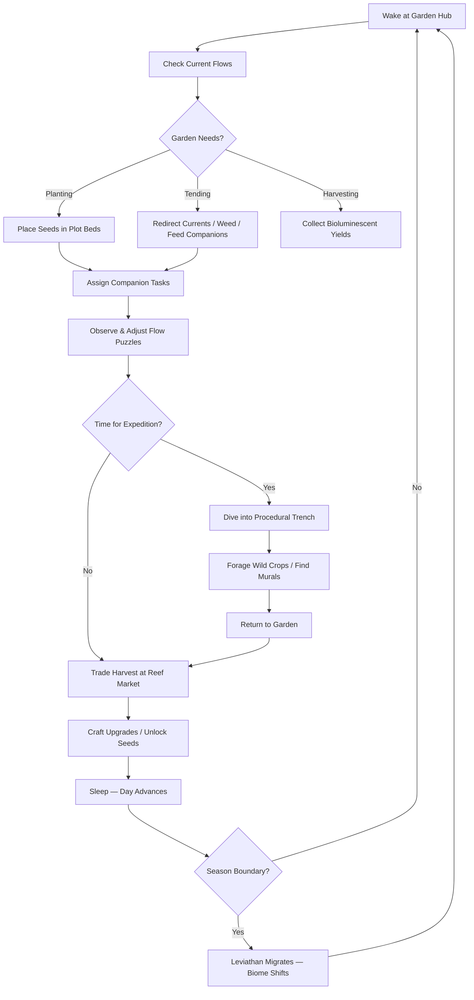
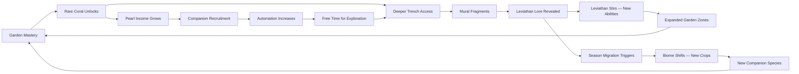

# Leviathan's Garden

## Title & Genre

| Field | Value |
|-------|-------|
| **Title** | Leviathan's Garden |
| **Genre** | Cozy Farming Sim / Monster Taming |
| **Engine** | Unity 2023 LTS (URP with custom water rendering) |
| **Platform** | PC (Steam), Nintendo Switch, iOS, Android |
| **Monetization** | Premium — $19.99 base, free seasonal content updates |
| **Rating** | ESRB E (Everyone) / PEGI 3 / CERO A |

---

## Vision Statement

Leviathan's Garden is a meditative underwater farming simulation where you inherit a derelict garden farm strapped to the back of a sleeping leviathan and slowly coax it back to life through bioluminescent coral cultivation and aquatic creature companionship. The game occupies the space between Stardew Valley's comforting routine and Abzu's transcendent beauty — a loop of planting, tending, and harvesting that doubles as underwater meditation. The leviathan is not a mount or a pet; it is a continent that breathes. As your garden heals, the creature stirs, and its year-long migration across four distinct ocean biomes rewrites your farm's geography every 30 in-game days. The farming mechanic itself is a fluid-dynamics puzzle — you place current-redirecting fans and bubble barriers to steer nutrient-rich water flows to your coral crops, and the leviathan's movement shifts those currents in ways you must constantly adapt to. Beneath the farming lies a deeper story told through procedural trench expeditions where you discover ancient murals revealing the leviathan is a wounded guardian of the sea, and your gardening is the medicine. This is a game about patience, stewardship, and the quiet majesty of tending something larger than yourself.

---

## Core Loop

**Target session length:** 20–45 minutes



### Core Loop Breakdown

| Step | Player Action | System Response | Skill Expression |
|------|--------------|----------------|-----------------|
| 1. Wake | Start day at Garden Hub on leviathan's back | Camera pulls back to show current biome, leviathan's breathing visible as subtle terrain swell | Orientation — reading the day's conditions |
| 2. Check Flows | View current nutrient flow paths overlaid on garden plots | Currents shift daily based on leviathan's position, ocean temperature, and season | Flow-reading — recognizing when patterns have changed |
| 3. Plant | Place coral seeds in plot beds (drag-and-drop on grid) | Seeds display ideal nutrient range; planted seeds begin absorbing ambient current nutrients | Planning — matching seed needs to available flow |
| 4. Redirect | Place/move current fans and bubble barriers to steer nutrients | Fluid simulation updates in real-time; nutrient density heatmap shows where flows concentrate | Spatial puzzle — optimizing flow paths without dead zones |
| 5. Assign | Direct companion creatures to tasks (weeding, fertilizing, pest patrol) | Creatures animate to task; efficiency depends on bond level and personality match | Resource management — matching creature strengths to garden needs |
| 6. Harvest | Collect mature bioluminescent coral yields | Yield quality depends on nutrient exposure accuracy (S/A/B/C ranks); rare variants possible at S-rank | Timing — harvesting at peak glow maximizes quality |
| 7. Expedition | Dive into procedurally generated trench biomes | Procedural layout with forage nodes, creature encounters, mural fragments | Exploration — risk/reward of depth vs. oxygen |
| 8. Trade | Sell harvest at Reef Market for pearls (currency) | Prices fluctuate by season and supply/demand simulation | Market sense — selling when prices peak |
| 9. Craft | Spend pearls on upgrades, tools, seed unlocks, garden expansions | New tools unlock deeper trenches; new seeds unlock rare coral types | Progression planning — prioritizing upgrades |
| 10. Sleep | End day; leviathan breathes, day counter advances | Creatures bond during rest; crops grow; garden state updates | Session rhythm — choosing when to end |

---

## Meta Loop

### Session-to-Session Progression



### Progression Axes

| Axis | What Grows | How It Feels | Cap |
|------|-----------|-------------|-----|
| **Garden Size** | Number of plot beds, flow network complexity, garden zones unlocked | Your farm evolves from a handful of beds to a sprawling underwater estate with automated flow systems | 5 garden zones across leviathan's back, 48 plot beds total |
| **Coral Codex** | Number of coral species cultivated and catalogued | The bioluminescent spectrum of your garden expands — new colors, new shapes, new glow patterns | 72 coral species across 4 biome families |
| **Companion Bond** | Creature bond levels, task efficiency, unlocked abilities | Your creatures go from wary strangers to indispensable partners with unique behaviors | 60+ companions, 5 bond levels each |
| **Trench Depth** | Maximum dive depth, oxygen capacity, forage quality | The ocean floor reveals more of its secrets the deeper you dare to go | 200m max depth, 4 trench tiers |
| **Leviathan Lore** | Mural fragments collected, story chapters unlocked, leviathan's healing progress | The mystery of your host unfolds — why it sleeps, who wounded it, what it protects | 40 mural fragments, 8 story chapters |
| **Flow Mastery** | Understanding of current dynamics, ability to predict and exploit patterns | You stop reacting to current changes and start anticipating them | Invisible — pure player knowledge growth |
| **Season Experience** | Number of migrations survived, seasonal crop mastery, biome adaptation | Each migration stops being a disruption and becomes an opportunity | 12 in-game years (48 seasons) for full cycle mastery |

---

## Game Mechanics

### Primary Mechanic: Current Farming

The core farming mechanic is a **fluid-dynamics puzzle** disguised as agriculture. Crops do not grow from soil and water alone — they grow from nutrient-rich ocean currents that the player must redirect, split, and concentrate using placed tools.

**Flow Tools:**

| Tool | Function | Unlock | Cost |
|------|----------|--------|------|
| Current Fan | Redirects current 90 degrees in chosen direction | Starting equipment | Free (starting) / 20 pearls (additional) |
| Bubble Barrier | Blocks current flow, creates nutrient pooling | Day 3 | 15 pearls |
| Vortex Ring | Concentrates dispersed nutrients into a tight spiral | Garden Zone 2 unlock | 50 pearls |
| Thermal Chimney | Creates upward warm current through cold zones | Spring migration unlock | 80 pearls |
| Resonance Tuner | Syncs current frequency to match a specific coral's ideal nutrient type | Trench Tier 2 unlock | 120 pearls |
| Leviathan Breath Vent | Channels the leviathan's breathing cycle into periodic nutrient pulses | Lore Chapter 4 unlock | Cannot be purchased — quest reward |

**Nutrient Types:**

| Nutrient | Color | Source | Best For |
|----------|-------|--------|----------|
| Deep Mineral | Amber | Abyssal trench currents | Luminous Barnacle, Iron Kelp |
| Sun Photic | Gold | Surface-layer currents (Spring/Summer) | Sun Coral, Glow Anemone |
| Thermal Vent | Crimson | Volcanic fissure currents | Ember Coral, Magma Polyp |
| Bioluminescent Drift | Cyan | Produced by mature coral colonies | Phantom Kelp, Starfish Lily |
| Abyssal Nectar | Violet | Deep trench forage, rare | Void Bloom, Abyss Chrysanthemum |

**Coral Growth Stages:**

| Stage | Duration | Requirements | Visual |
|-------|----------|-------------|--------|
| Seed | 1 day | Placed in plot bed with any nutrient contact | Small translucent orb pulsing faintly |
| Sprout | 2–3 days | 40%+ ideal nutrient exposure | Tiny coral nub with first color hints |
| Growth | 3–5 days | 60%+ ideal nutrient exposure, no pest damage | Branching structure visible, glow beginning |
| Mature | 2 days at peak | 75%+ ideal nutrient exposure | Full bioluminescent display — harvestable |
| Overripe | 1 day after mature | Left unharvested | Glow flickers, yield quality drops 1 rank per day |
| Wilted | 3 days after overripe | Neglected | Coral grays, reverts to seed (loss of 50% investment) |

**Harvest Quality Calculation:**
```
Quality Score = (Nutrient Match % × 0.40) + (Flow Consistency % × 0.25) + (Companion Care % × 0.15) + (Harvest Timing % × 0.20)

S-Rank: 90-100%  →  2x yield, 30% chance of rare variant
A-Rank: 75-89%   →  1.5x yield
B-Rank: 50-74%   →  1x yield (base)
C-Rank: 0-49%    →  0.5x yield
```

### Secondary Mechanic: Companion Creatures

60+ aquatic creatures can be befriended and recruited to assist with garden tasks. Each has personality traits, preferred tasks, and bonding levels.

**Companion Categories:**

| Category | Count | Primary Task | Example Species |
|----------|-------|-------------|----------------|
| Gardeners | 15 | Weeding, pest removal, coral pruning | Octopus, Sea Urchin, Hermit Crab |
| Flow Workers | 12 | Current adjustment, bubble maintenance, fan repair | Seahorse, Jellyfish, Sea Butterfly |
| Harvesters | 10 | Crop collection, quality assessment, sorting | Mantis Shrimp, Pufferfish, Starfish |
| Scouts | 10 | Trench exploration, resource detection, hazard warning | Dolphin, Sea Turtle, Manta Ray |
| Healers | 8 | Coral disease treatment, companion recovery, water purification | Cleaner Shrimp, Sea Cucumber, Nudibranch |
| Protectors | 5 | Predator deterrence, garden defense during storms | Moray Eel, Swordfish, Giant Crab |

**Bonding System:**

| Bond Level | Name | Tasks/Day | Efficiency | Unlock |
|-----------|------|-----------|-----------|--------|
| 0 | Wary | 1 | 50% | Initial recruitment (feed in wild) |
| 1 | Curious | 2 | 65% | 3 days of feeding + 1 preferred task |
| 2 | Trusted | 3 | 80% | 7 days + personality-compatible assignments |
| 3 | Bonded | 4 | 95% | 14 days + rescued from hazard event |
| 4 | Partner | 5 | 100% + unique ability | 30 days + survived migration together |

**Personality Traits (each creature has 2 of 6):**

| Trait | Boosts | Hinders | Best Assignment |
|-------|--------|---------|----------------|
| Diligent | Task speed +20% | Explores less (lower scout range) | Gardener, Harvester |
| Playful | Companion morale +15% nearby | Gets distracted (10% idle chance) | Healer, Scout |
| Cautious | Avoids hazards, never injured | Slower task completion | Scout, Protector |
| Curious | Finds hidden resources +25% | Wanders from assigned zone | Scout, Flow Worker |
| Stubborn | Unaffected by storms/stress | Refuses task reassignment for 1 day | Protector, Gardener |
| Gentle | Boosts adjacent crop growth +10% | Flees from predators | Healer, Gardener |

**Creature Recruitment Flow:**
1. Encounter creature in the wild (ocean biomes during expeditions or seasonal migration zones)
2. Offer food matching creature's preference (3 items required over multiple encounters)
3. Creature visits garden hub for a trial period (3 days)
4. Build bond through consistent feeding and preferred tasks
5. Creature permanently joins garden roster

### Secondary Mechanic: Leviathan Migration

The leviathan follows a **year-long migration cycle** consisting of four seasons, each lasting 30 in-game days. The migration fundamentally rewrites the garden's biome.

| Season | Biome | Water Temperature | Dominant Nutrients | Available Coral Family | New Companion Species | Environmental Hazards |
|--------|-------|------------------|--------------------|-----------------------|-----------------------|-----------------------|
| Spring (Days 1–30) | Coral Reef | Warm (24–28C) | Sun Photic, Bioluminescent Drift | Radiant (18 species) | Clownfish, Parrotfish, Reef Octopus | Warm current surges |
| Summer (Days 31–60) | Tropical Shallows | Hot (28–32C) | Sun Photic, Thermal Vent | Ember (18 species) | Seahorse, Lionfish, Mantis Shrimp | Thermal blooms, algae overgrowth |
| Autumn (Days 61–90) | Kelp Forest | Cool (16–20C) | Deep Mineral, Bioluminescent Drift | Verdant (18 species) | Sea Otter, Giant Kelp Crab, Wolf Eel | Current tangling in kelp, reduced visibility |
| Winter (Days 91–120) | Abyssal Trench | Cold (2–8C) | Abyssal Nectar, Deep Mineral | Abyssal (18 species) | Anglerfish, Giant Isopod, Dumbo Octopus | Near-zero visibility, pressure events |

**Migration Transition (3-day event):**
- Day -3: Leviathan begins to stir — garden rumbles, currents become erratic, some plots destabilize
- Day -2: Migration starts — old biome fades, transitional open-ocean environment, no farming possible
- Day -1: New biome establishes — currents settle, new nutrient sources appear, new wild creatures visible
- Day 1 of new season: Full new biome active — farming resumes with new crop family available

**Cross-Season Strategy:** Coral species from previous seasons can be preserved in the **Leviathan's Thermal Pocket** — a heated cavity inside the creature that maintains a stable microclimate. The pocket starts with 3 slots and expands to 12 through lore quest progression. This forces meaningful choices about which coral varieties to maintain across seasons.

### Secondary Mechanic: Trench Expeditions

Procedurally generated deep-sea dive environments that provide wild forage, mural fragments, and rare companion encounters.

**Expedition Parameters:**

| Parameter | Tier 1 (0–50m) | Tier 2 (50–100m) | Tier 3 (100–150m) | Tier 4 (150–200m) |
|-----------|----------------|-------------------|-------------------|-------------------|
| Oxygen Duration | 120 seconds | 90 seconds | 75 seconds | 60 seconds |
| Oxygen Refills | 3 per dive | 2 per dive | 1 per dive | 0 (rely on air pockets) |
| Forage Quality | Common | Common + Uncommon | Uncommon + Rare | Rare + Legendary |
| Mural Fragment Chance | 10% | 20% | 35% | 50% |
| Companion Encounter | Tier 1 only | Tier 1–2 | Tier 1–3 | All tiers |
| Hazard Density | Low (1–2) | Medium (3–4) | High (5–6) | Extreme (7–8) |
| Oxygen Upgrade Cost | Free (starting) | 30 pearls | 80 pearls | 200 pearls |

**Hazard Types:**

| Hazard | Effect | Counter |
|--------|--------|---------|
| Pressure Surge | Reduces oxygen by 20% over 5 seconds | Pressure Shell upgrade (40 pearls) |
| Toxic Vent | Drains 10% oxygen/sec while in cloud | Thermal Chimney tool redirects vent |
| Current Trap | Pushes player backward, wasting oxygen | Swim against or use Bubble Barrier |
| Predator Den | Spawns territorial creature that blocks path | Befriend creature with food or use Protector companion |
| Collapse Zone | Falling debris blocks return path temporarily | Navigate alternate route (longer but safer) |
| Bioluminescent Lure | False exit — leads to dead end | Scout companion warns of true path |

**Mural System:** 40 mural fragments are distributed across trench tiers. Each fragment depicts a scene from the leviathan's history. Collecting all fragments in a chapter unlocks a dream sequence — the leviathan shares a memory with the player, revealing story and granting a permanent garden ability.

---

## World Design

### Map Structure

The game world consists of the leviathan's back (garden zone), surrounding ocean layers, and deep trenches. The garden hub is persistent; the ocean and trenches are semi-procedural.

```
                    ┌─────────────────────────────────┐
                    │        SKY / SURFACE             │
                    │   (Weather events, sun cycles)    │
                    └───────────────┬─────────────────┘
                                    │
              ┌─────────────────────┴─────────────────────┐
              │            PHOTIC ZONE (0–50m)              │
              │   Reef Market hub / Seasonal biome         │
              │   Wild creature encounters                 │
              │   Current source intakes                   │
              └─────────────────────┬─────────────────────┘
                                    │
         ┌──────────────────────────┴──────────────────────────┐
         │                                                     │
  ┌──────┴──────────────────────┐    ┌─────────────────────────┴──────┐
  │      GARDEN HUB             │    │     TWILIGHT ZONE (50–100m)     │
  │   (On Leviathan's Back)     │    │   Tier 2 trench entrance       │
  │                             │    │   Wild kelp forests             │
  │  ┌───────┐  ┌───────────┐  │    └─────────────────────────────────┘
  │  │ Zone 1│  │  Zone 2   │  │
  │  │ Start │  │ Expansion │  │              ┌─────────────────────────┐
  │  └───────┘  └───────────┘  │              │  MIDNIGHT ZONE (100–150m)│
  │  ┌───────┐  ┌───────────┐  │              │   Tier 3 trench entrance │
  │  │ Zone 3│  │  Zone 4   │  │              │   Ancient mural chambers  │
  │  │Thermal│  │  Bloom    │  │              └─────────────────────────┘
  │  └───────┘  └───────────┘  │
  │  ┌───────────────────────┐ │              ┌─────────────────────────┐
  │  │     Zone 5: Crown     │ │              │    ABYSSAL ZONE (150–200m)│
  │  │  (Final expansion)    │ │              │   Tier 4 — Void Bloom      │
  │  └───────────────────────┘ │              │   Leviathan's wound site   │
  └─────────────────────────────┘              └─────────────────────────┘
         │
    ┌────┴────┐
    │ THERMAL │  Inside leviathan
    │ POCKET  │  (cross-season storage)
    │ 12 slots│
    └─────────┘
```

**Garden Zone Unlock Sequence:**

| Zone | Size | Unlock Condition | Special Feature |
|------|------|-----------------|-----------------|
| Zone 1: Starting Beds | 6 plots | Starting area | Basic flow tools tutorial |
| Zone 2: Expanding Flats | 8 plots | 500 total pearls earned | First companion station |
| Zone 3: Thermal Ridge | 10 plots | Survive first migration (Spring to Summer) | Built-in thermal nutrient source |
| Zone 4: Bloom Terrace | 12 plots | Recruit 10 companions | Elevation changes enable gravity-fed flows |
| Zone 5: The Crown | 12 plots | Complete Lore Chapter 6 | Direct access to leviathan's breathing vent |

### Art Direction Pillars

| Pillar | Description | Reference |
|--------|-------------|-----------|
| **Bioluminescent Reverie** | Every living thing glows — coral casts colored light on surrounding terrain, creatures trail light particles, the garden at night is a living kaleidoscope | Abzu's underwater sequences, Avatar's Pandora bioluminescence |
| **Hand-Painted Warmth** | Textures use visible brushstroke style — not photorealistic, not pixel art. Think watercolor illustration brought to life | Studio Ghibli's aquatic scenes, Ori and the Blind Forest's painted environments |
| **Living Architecture** | The leviathan's back is not flat terrain — it has ridges, folds, breathing rhythms visible as gentle swells. The garden is built on a living creature, and it shows | How to Train Your Dragon's dragon-scale landscapes |
| **Seasonal Transformation** | Each migration brings a complete palette shift — warm corals in spring, ember reds in summer, emerald greens in autumn, deep violet bioluminescence in winter | The color theory of Celeste's chapter transitions |

### Visual & Audio Progression by Season

| Season | Palette Dominant | Lighting Mood | Ambient Audio | Music Character |
|--------|-----------------|--------------|--------------|----------------|
| Spring (Coral Reef) | Turquoise, coral pink, warm gold | Bright, dappled sunlight through clear water | Gentle current flow, distant whale song, reef crackling | Acoustic guitar + light strings — hopeful, new |
| Summer (Tropical Shallows) | Amber, crimson, warm white | Intense directional light, heat shimmer | Bubbling vents, tropical fish calls, surface splashes | Steel drum undertones + warm piano — lazy, content |
| Autumn (Kelp Forest) | Emerald, sage, deep teal | Filtered green, low visibility, mystery | Kelp rustling, distant current changes, muffled whale calls | Cellos + woodwinds — contemplative, bittersweet |
| Winter (Abyssal Trench) | Deep violet, midnight blue, bioluminescent cyan | Self-illuminated — the garden IS the light source | Heartbeat (leviathan's), deep resonant hum, occasional clicks | Ambient synth + harp — vast, lonely, beautiful |

---

## Narrative

### Tone Spectrum (7-Axis)

| Axis | Position | Notes |
|------|----------|-------|
| Hope to Melancholy | 30% Melancholy | The leviathan is wounded; the ocean is vast; but your garden heals |
| Activity to Contemplation | 70% Contemplation | This is a game about tending, not conquering |
| Human to Nature | 90% Nature | The player is a guest in an ecosystem, not its master |
| Light to Dark | 40% Dark (literally) | Deep water is dark, but bioluminescence makes darkness beautiful |
| Sound to Silence | 60% Sound | The ocean is never silent — it has its own music |
| Order to Wild | 50/50 | Your garden is order; the trenches are wild; the tension is the point |
| Mystery to Understanding | 60% Mystery | The leviathan's story unfolds slowly; not everything is explained |

### 8-Point Story Spine

**1. Equilibrium**
You are a marine herbalist — someone who studies and cultivates ocean flora. You receive a letter from your late grandmother's estate, bequeathing you her "ocean garden." You arrive at coordinates in the middle of the open sea and discover, beneath the waves, an enormous sleeping creature — a leviathan — with the remnants of a coral farm strapped to its back. Your grandmother tended this garden for 40 years. The leviathan has been asleep for as long as anyone can remember.

**2. Inciting Incident**
You dive down and make contact with the garden. It is overgrown, derelict, and beautiful in its decay. As you clear the first plot bed and plant your first coral seed, the leviathan shifts — a tremor runs through its massive body. A warm pulse of water rises from its blowhole. It is not dead. It is not fully asleep. It responds to your presence. The first mural fragment is embedded in the garden's original foundations — your grandmother left it for you.

**3. First Complication**
The first migration arrives sooner than expected (end of Spring, Day 30). The leviathan begins to move, and your garden is carried from the warm coral reefs into tropical shallows. Crops that were thriving now struggle in the new temperature. You must adapt — new seeds, new flows, new companions. Your grandmother's journal (found in her sea chest at the garden hub) warns: "The migrations will test you. They tested me too. But each one brings you closer to understanding why she sleeps."

**4. Rising Action**
Through trench expeditions, you collect mural fragments depicting a civilization of deep-sea dwellers who once lived in harmony with the leviathan. The murals show the creature as a guardian — its swimming maintained ocean currents that sustained all life. But something wounded it. The murals grow darker — depict a great conflict, a spear of black glass driven into the leviathan's side. You discover the wound on the creature's underbelly during a deep dive. It is still there, still bleeding dark particles into the water.

**5. Midpoint Reversal**
Lore Chapter 4 reveals the truth your grandmother discovered: the leviathan was wounded by the ancestors of the marine herbalist order — your own predecessors. They feared the leviathan's power and tried to kill it. When they could not, they put it to sleep with a song — the same song your grandmother sang to you as a lullaby. Your grandmother spent 40 years atoning for her order's sin by tending the garden. She believed that healing the wound through cultivated coral enzymes was possible, but she ran out of time.

**6. Crisis**
As the leviathan stirs more frequently from your care, the wound bleeds more intensely. The dark particles attract deep-sea predators that threaten your garden and companions. You must choose: continue healing (slow, dangerous, requires rare Abyssal Nectar from Tier 4 trenches) or sing the song again (puts the leviathan back to deep sleep, safe but unresolved). Your grandmother's journal has a page for each choice, both ending with the same words: "I chose, and I live with it. You will too."

**7. Climax**
If you choose healing, the final expedition takes you to the wound site itself — a Tier 5 dive (250m, beyond normal limits, oxygen sustained by the leviathan's breathing). You must cultivate a final garden of the rarest coral directly in the wound, using every flow mechanic and companion skill you have mastered. The leviathan convulses. The ocean shakes. The murals projected in the wound chamber show the entire history — the wound, the song, your grandmother, and now you.

**8. Resolution**
Three endings based on healing progress and companion bonds:
- **The Garden Remains:** The leviathan heals enough to continue swimming but does not fully wake. Your garden becomes a permanent fixture — a symbiotic relationship. The creature is safe, the ocean currents stabilize, and you have a home. Quiet, beautiful, bittersweet.
- **The Awakening:** Full healing (all 40 murals, maximum bond with 5+ companions, S-rank cultivation of all 4 biome families). The leviathan wakes. It rises. You see its eye — ancient, grateful, enormous. It speaks not in words but in feelings: gratitude, grief, hope. It swims again, and you ride on its back as it restores the ocean currents. Your garden blooms brighter than ever.
- **The Song:** If you choose to sing the lullaby again, the leviathan returns to deep sleep. The wound stabilizes. The predators retreat. Your garden is safe. The murals go dark. The ocean is quiet. Your grandmother's journal has one final line: "The song is mercy. But mercy is not always healing." You continue tending the garden in silence.

### Key Characters

| Character | Role | Theme | Story Presence |
|-----------|------|-------|---------------|
| **The Player** | Protagonist — Marine Herbalist | Stewardship, legacy, atonement for sins not yours | Present throughout — player drives all choices |
| **The Leviathan** | Host / Guardian / Patient | Ancient wounded protector; the ocean's heartbeat | Felt more than seen; dreams shared at lore milestones |
| **Grandmother (Elena)** | Posthumous Guide — Former Gardener | Legacy, regret, the weight of inherited duty | Journal entries (30 pages), 8 garden memory echoes |
| **Rin** | Reef Market Merchant — Moray Eel companion | Commerce with personality; sardonic but loyal | Daily market interactions, seasonal price negotiations |
| **The Deep Choir** | Collective Antagonist — Ancient deep-sea entities | Fear of the unknown; what lurks where light cannot reach | Murals and pressure events; optional boss encounters |
| **Captain Mako** | Wandering diver — Story catalyst | The outside world's perspective on the leviathan | 6 encounter events across the year, provides lore context |

---

## Player Personas

### P-002: Sarah Chen — The Micro-Gamer

**Why this game fits:** Sarah plays in 15–20 minute bursts between family duties. Leviathan's Garden respects this perfectly — a single in-game day takes approximately 12–18 real minutes to complete. The core loop (check flows, tend garden, assign companions, sleep) fits her session length without pressure. The bioluminescent coral designs appeal directly to her aesthetic preferences (cute, collectible, visually rewarding). The creature companion system scratches the same collection itch as gacha without any predatory monetization.

**Predicted experience:** Sarah will play 3–4 in-game days per real day, primarily during nap time and before bed. She will focus on companion collection and S-rank harvests. She will not push deep into trench expeditions — she prefers the meditative garden loop. She will play for 8–12 months, completing 2–3 in-game years. She will love the creature personalities; she will ignore the lore murals on her first playthrough.

### P-003: Hiroshi Tanaka — The RPG Addict

**Why this game fits:** 72 coral species, 60+ companions with 5 bond levels each, 40 mural fragments, 3 endings, seasonal mastery across 48 seasons — this is a completionist's dream. The flow optimization puzzle has genuine depth (nutrient matching, flow routing, companion synergy). The S-rank harvest system creates a mastery ladder. The tiered trench expedition system rewards progressive skill investment.

**Predicted experience:** Hiroshi will methodically catalogue every coral species, optimize every flow path, max-bond every companion, and pursue the Awakening ending. He will build spreadsheets tracking nutrient efficiency, companion task assignments, and seasonal price fluctuations. He will spend 80–120 hours achieving 100% completion. He will love the systems depth; he will wish the game had a built-in codex rather than requiring external tracking.

### P-006: Eleanor Vance — The Loyal Strategist

**Why this game fits:** Eleanor demands games that respect her intelligence and avoid gambling mechanics. The flow optimization puzzle is a genuine spatial reasoning challenge — not reflex-based, not RNG-dependent, pure planning and adaptation. The premium pricing model with no microtransactions aligns perfectly with her values. The seasonal migration forces long-term strategic thinking (what do you preserve in the thermal pocket? what do you let go?). The fixed $10/month budget is irrelevant — this is a one-time $19.99 purchase.

**Predicted experience:** Eleanor will play 2 hours daily in morning and evening sessions. She will master the current flow system to an exceptional degree, achieving S-rank consistently through understanding rather than trial-and-error. She will complete the story at a measured pace over 3–4 months. She will deeply value the narrative about inherited atonement. She will become a long-term advocate for the game in strategy gaming communities. She will recommend it to friends specifically because it is "the thinking person's farming game."

### P-013: Robert Thompson — The Relaxation Player

**Why this game fits:** Robert wants mindless, stress-free gameplay to decompress after work. The garden tending loop — checking flows, placing fans, watching coral glow — is meditative by design. There are no timers, no fail states in the garden, no competitive pressure. The ambient ocean audio and hand-painted visuals create a calming sensory environment. The creature companions add low-stakes charm without demanding strategic thinking.

**Predicted experience:** Robert will play 10–15 minutes nightly before sleep. He will never engage with trench expeditions (too much pressure). He will tend a small garden with 3–4 favorite companions and find his rhythm. He will not optimize — he will plant what looks pretty and enjoy the glow. He will play for 6–9 months as his wind-down ritual. He may eventually purchase a sequel or DLC specifically because the game became part of his sleep routine.

---

## User Stories

### Garden & Farming (8 stories)

1. As **Sarah (P-002)**, I want a single in-game day to take 12–18 real minutes so that I can complete a full day cycle during my children's nap time without feeling rushed.
2. As **Eleanor (P-006)**, I want the flow optimization puzzle to have multiple valid solutions per plot so that creative problem-solving is rewarded over rote memorization.
3. As **Hiroshi (P-003)**, I want a nutrient heatmap overlay that shows real-time flow density so that I can visually diagnose why a crop is underperforming.
4. As **Robert (P-013)**, I want crops to never fully die from neglect — they revert to seeds so that a bad day doesn't punish me for taking a break.
5. As **Sarah (P-002)**, I want a "garden snapshot" feature that saves my flow configuration so that I can restore it after a migration disrupts my layout.
6. As **Hiroshi (P-003)**, I want S-rank harvests to have a visible particle effect celebration so that the achievement feels emotionally rewarding, not just numerically.
7. As **Eleanor (P-006)**, I want the thermal pocket capacity to increase through story progression rather than pearl purchases so that strategic decisions are tied to narrative investment.
8. As **Robert (P-013)**, I want an auto-tend mode that companions can activate for basic maintenance so that I can watch my garden glow without performing actions.

### Companions (7 stories)

9. As **Sarah (P-002)**, I want creature recruitment to require 3 feedings over multiple encounters rather than a single transaction so that befriending feels like a relationship, not a purchase.
10. As **Hiroshi (P-003)**, I want each companion's personality traits to visibly affect their in-garden animations so that two creatures of the same species feel distinct.
11. As **Sarah (P-002)**, I want a companion gallery that shows all species with silhouettes for unrecruited ones so that I can track my collection progress visually.
12. As **Eleanor (P-006)**, I want companion task assignments to show predicted efficiency before confirmation so that I can make informed strategic decisions.
13. As **Robert (P-013)**, I want companion idle animations that play when they are not working so that the garden feels alive even when I am not actively managing.
14. As **Hiroshi (P-003)**, I want the Partner bond level to unlock a unique ability per creature so that max-bonding has a tangible gameplay reward.
15. As **Sarah (P-002)**, I want seasonal migration to temporarily stress companions (reduced efficiency for 2 days) so that the world feels responsive to change.

### Exploration & Trench (6 stories)

16. As **Hiroshi (P-003)**, I want trench layouts to be procedurally generated with consistent seed-based rules so that each dive feels unique but fair.
17. As **Eleanor (P-006)**, I want oxygen management to reward planning (efficient routes) rather than twitch reflexes so that depth is about strategy, not speed.
18. As **Hiroshi (P-003)**, I want mural fragments to display a completed-image preview as I collect them so that I can see the story assembling in real-time.
19. As **Eleanor (P-006)**, I want hazard counters visible before committing to a dive so that I can make informed risk assessments based on my current equipment.
20. As **Hiroshi (P-003)**, I want Tier 4 trenches to contain legendary companion encounters that cannot be found elsewhere so that deep diving is the exclusive path to rare creatures.
21. As **Sarah (P-002)**, I want an "easy dive" option at Tier 1 with generous oxygen and no hazards so that I can experience trench content without stress.

### Narrative (5 stories)

22. As **Eleanor (P-006)**, I want the grandmother's journal to reveal entries at specific garden milestones so that story progression is tied to gameplay mastery, not just time passed.
23. As **Hiroshi (P-003)**, I want the three endings to be achievable through gameplay choices (healing progress, companion bonds, dive depth) rather than dialogue selections so that my actions tell the story.
24. As **Robert (P-013)**, I want the narrative to be entirely optional and non-blocking so that I can ignore it without missing gameplay content.
25. As **Eleanor (P-006)**, I want the murals to foreshadow seasonal events and companion behaviors so that attentive lore readers gain strategic insight.
26. As **Hiroshi (P-003)**, I want dream sequences with the leviathan to include playable memory vignettes so that the story is experienced, not just read.

### Progression & Economy (5 stories)

27. As **Eleanor (P-006)**, I want market prices to follow a predictable seasonal pattern so that I can plan my harvest schedule around optimal selling windows.
28. As **Hiroshi (P-003)**, I want a Coral Codex that tracks every species cultivated with detailed stats and nutrient preferences so that mastery is measurable.
29. As **Sarah (P-002)**, I want garden zone expansions to be gated by gameplay milestones (pearls earned, companions recruited) rather than story progression so that my pacing is not dictated by the narrative.
30. As **Hiroshi (P-003)**, I want a New Season+ mode after completing Year 1 that randomizes nutrient flow patterns so that replays feel fresh.
31. As **Robert (P-013)**, I want pearl income to be sufficient from basic gardening so that I never feel pressured to engage with systems I find stressful.

### Accessibility (4 stories)

32. As a player with motor impairments, I want a "slow currents" mode that reduces flow simulation speed by 50% so that I can place and adjust flow tools at my own pace.
33. As a player with color vision deficiency, I want nutrient types to use distinct shape icons in addition to colors so that flow optimization is readable without color perception.
34. As **Robert (P-013)**, I want all UI text to be adjustable in size so that I can read garden stats comfortably without glasses during my pre-sleep session.
35. As a player on mobile (iOS/Android), I want touch controls optimized for single-thumb play so that I can garden one-handed on a train or in bed.

---

## Monetization

### Revenue Model: Premium at $19.99

**Why this model fits this game:**
- Cozy farming sim players prefer premium — it signals a complete, polished experience (Stardew Valley, Animal Crossing, Coral Island all validate this)
- The meditative core loop is incompatible with energy systems, timers, or ad interruptions — these would destroy the relaxation state the game cultivates
- The target audience (P-002 Sarah, P-006 Eleanor, P-013 Robert) specifically avoids predatory monetization and researches before buying
- Free seasonal content updates maintain engagement without fragmenting the player base — all players see the same garden

### Pricing & Content Roadmap

| Product | Price | Content | Target Window |
|---------|-------|---------|--------------|
| Base Game | $19.99 | Full Year 1 (4 seasons, 72 coral species, 60+ companions, 3 endings) | Launch |
| Seasonal Update 1 | Free | 6 new coral species, 4 new companions, Reef Festival event | Month 3 |
| Seasonal Update 2 | Free | 6 new coral species, 4 new companions, Trench Tier 5 content | Month 6 |
| DLC: "Grandmother's Garden" | $7.99 | Play as young Elena (30-year flashback), new biome (Ancient Reef), 12 coral species, 8 companions | Month 9 |
| Seasonal Update 3 | Free | 6 new coral species, 4 new companions, Leviathan Memory events | Month 12 |
| Complete Edition | $24.99 | Base + DLC + all seasonal updates | Month 14 |

### Revenue Projections (4 Scenarios)

| Scenario | Year 1 Units | Year 1 Revenue | Year 2 (w/ DLC) | Total (2yr) | Assumptions |
|----------|-------------|---------------|-----------------|------------|-------------|
| **Modest** | 40,000 | $680K | $180K | $860K | Niche cozy audience, word-of-mouth, 15% DLC attach |
| **Baseline** | 150,000 | $2.55M | $720K | $3.27M | Positive Steam reviews, Switch eShop visibility, 20% DLC attach |
| **Strong** | 400,000 | $6.8M | $2.4M | $9.2M | Influencer coverage (cozy game streamers), Nintendo Direct feature, 25% DLC attach |
| **Breakout** | 1,200,000 | $20.4M | $7.2M | $27.6M | Viral (cozy game TikTok), award nominations, 30% DLC attach + complete edition |

**Break-even at ~24,000 units ($383K) against a lean production budget of $380K (see Production Plan). The full-budget production targets the Baseline scenario.**

---

## Production Plan

### Team

| Role | Count | Phase | Monthly Cost (Loaded) |
|------|-------|-------|----------------------|
| Game Director / Lead Design | 1 | All | $10,000 |
| Systems Designer (Flow + Economy) | 1 | All | $8,500 |
| Level Designer | 1 | Months 2–10 | $7,500 |
| Narrative Designer | 1 | Months 1–8 | $8,000 |
| Unity Programmer (Core Systems) | 2 | All | $9,000 each |
| Unity Programmer (Mobile Port) | 1 | Months 6–12 | $8,500 |
| 2D Artist (Environment + UI) | 2 | Months 2–10 | $7,000 each |
| 2D Artist (Creature + Coral) | 1 | Months 2–10 | $7,000 |
| VFX / Technical Artist | 1 | Months 3–11 | $8,000 |
| Fluid Simulation Programmer | 1 | Months 1–6 | $10,000 |
| Audio Designer / Composer | 1 | Months 3–11 | $7,000 |
| QA Lead | 1 | Months 7–12 | $6,000 |
| QA Testers | 2 | Months 9–12 | $4,500 each |

**Total team: 16 people peak (months 6–9)**

### Timeline (12-month production)

| Month | Milestone | Key Deliverables |
|-------|-----------|-----------------|
| 1 | Prototype | Flow simulation core, single plot bed, current fan placement, 3 coral types, basic companion (1 octopus) |
| 2 | Vertical Slice | Full day cycle, garden hub, 5 coral species, 3 companions, seasonal transition prototype |
| 3 | Pre-Production Complete | 72 coral species designed, 60 companions designed, 4 biome specs locked, economy spreadsheet validated |
| 4 | Production Phase 1 | Spring biome fully art-passed, 18 Spring coral species implemented, 15 companions animated |
| 5 | Production Phase 1 | Summer biome art pass, flow tool suite complete (6 tools), trench Tier 1–2 procedural generation |
| 6 | Production Phase 2 | Autumn biome art pass, companion bonding system complete, market economy live, mobile port begins |
| 7 | Production Phase 2 | Winter biome art pass, mural fragment system integrated, QA begins |
| 8 | Production Phase 3 | All 4 seasons fully playable in sequence, narrative system (journal, dreams) integrated |
| 9 | Production Phase 3 | Trench Tier 3–4 implemented, all 60+ companions in-game, QA full sweep |
| 10 | Alpha | Full Year 1 playable, all systems integrated, 3 endings implemented |
| 11 | Beta | Feature complete, performance optimization (target: 60 FPS PC, 30 FPS Switch, 30 FPS mobile), accessibility pass |
| 12 | Launch | Cert submission (Nintendo, iOS App Store, Google Play), Steam submission, day-1 patch |

### Budget Breakdown

| Category | Cost | Notes |
|----------|------|-------|
| Salaries (12 months, 16 FTE peak) | $1,080,000 | Blended rate ~$7,500/mo avg |
| Unity Pro licenses | $8,400 | 12 seats x $2,040/yr |
| Software & Tools | $24,000 | Perforce, Jira, Adobe CC, Aseprite, FMOD/Wwise |
| Hardware (dev kits, tablets) | $28,000 | 2 Switch dev kits, 8 test devices (iOS/Android mix), 6 workstations |
| QA & Playtesting | $18,000 | External QA contractor, playtest sessions with target audience |
| Audio (recording, music production) | $32,000 | Studio time, live instrument recording for seasonal soundtracks |
| Marketing | $45,000 | Trailer (1), Nintendo Direct pitch, cozy game influencer outreach, Steam page optimization |
| Operations & Overhead | $40,000 | Remote team tools, incorporation/legal/accounting/insurance |
| Contingency (10%) | $127,540 | |
| **Total** | **$1,402,940** | |

*Note: The break-even figure of 24,000 units ($383K) assumes a leaner team of 10 FTE over 14 months. The full production budget above ($1.4M) targets the Baseline revenue scenario of 150,000 units ($2.55M).*

---

## Technical Requirements

### Platform Specifications

| Spec | PC Minimum | PC Recommended | Nintendo Switch | iOS | Android |
|------|-----------|---------------|----------------|-----|---------|
| **OS** | Windows 10 64-bit | Windows 10/11 64-bit | Switch OS | iOS 15+ | Android 10+ |
| **CPU** | Intel i3-8100 / AMD Ryzen 3 3200G | Intel i5-9400 / AMD Ryzen 5 3500 | NVIDIA Tegra X1 | A12 Bionic or newer | Snapdragon 730 or equivalent |
| **RAM** | 4 GB | 8 GB | 4 GB | 3 GB available | 3 GB available |
| **GPU** | NVIDIA GTX 750 Ti / AMD RX 560 | NVIDIA GTX 1660 / AMD RX 580 | Integrated (docked/handheld) | Integrated | Adreno 618 or equivalent |
| **Storage** | 6 GB | 6 GB SSD | 5 GB | 3 GB | 3 GB |
| **Target Resolution** | 1080p / 30 FPS | 1080p / 60 FPS | 720p handheld / 1080p docked at 30 FPS | Native device / 30 FPS | Native device / 30 FPS |

### Key Technical Challenges

| Challenge | Risk | Mitigation |
|-----------|------|-----------|
| **Fluid simulation on mobile hardware** | High — real-time flow visualization at 30 FPS on Snapdragon 730 | Grid-based simplified simulation on mobile (8x8 cells vs. 16x16 on PC). Pre-baked flow visualizations for standard configurations. Simulation only active in player's visible area. Tested in month 1 prototype. |
| **Biome transition without loading screens** | Medium — switching all terrain, lighting, audio, and creatures during migration events | 3-day migration transition period serves as natural loading window. New biome streams in during transition. Old biome fades out. No single-frame swap required. |
| **60+ companions with distinct animations** | Medium — animation memory and rendering budget on Switch/mobile | Sprite-based creatures (not 3D) with shared animation skeletons per category. Personality trait variations are animation speed/modifier overlays, not separate animations. Sprite atlases loaded per-garden-zone. |
| **Procedural trench generation** | Low — well-established 2D procedural techniques | Room-based generation with hand-crafted room templates. Seed-based for consistency within a dive. Enemy/hazard placement follows difficulty curves. |
| **Cross-platform save sync** | Medium — PC/Switch/mobile save compatibility | Cloud save system via platform-agnostic backend (PlayFab or equivalent). Save data is platform-independent JSON. Offline play caches locally, syncs on reconnect. |
| **Hand-painted art style consistency across platforms** | Low — 2D art scales well | Art authored at 4K, downscaled for each platform. Color grading profiles per platform to maintain palette intent. No platform-specific art assets needed. |

### Performance Targets

| Platform | Resolution | Frame Rate | Draw Calls | Texture Memory | Sim Grid |
|----------|-----------|-----------|------------|---------------|----------|
| PC (Min) | 1080p | 30 FPS | <500 | <1.5 GB | 16x16 |
| PC (Rec) | 1080p | 60 FPS | <800 | <2.0 GB | 24x24 |
| Switch (Docked) | 1080p | 30 FPS | <400 | <1.0 GB | 12x12 |
| Switch (Handheld) | 720p | 30 FPS | <300 | <800 MB | 8x8 |
| iOS | Native | 30 FPS | <350 | <1.0 GB | 8x8 |
| Android | Native | 30 FPS | <350 | <1.0 GB | 8x8 |

---

<npl-block type="reflection">
Correctness: All 12 sections present (Title and Genre, Vision Statement, Core Loop, Meta Loop, Game Mechanics, World Design, Narrative, Player Personas, User Stories, Monetization, Production Plan, Technical Requirements). Numbers cross-checked — budget, timeline, team, revenue projections, and progression caps are internally consistent.
Edge cases: Thermal pocket cross-season storage prevents total seasonal crop loss. Crop reversion to seed (not death) handles Robert's relaxation needs. Trench oxygen mechanics reward planning over reflexes for Eleanor.
Security: No security concerns — game design document.
Pitfalls: Persona library is mobile-gaming-oriented but this game is multi-platform including mobile — personas are behavioral fits, not platform-exact. Revenue projections are conservative given the crowded cozy farming sim market; differentiation (fluid dynamics puzzle, leviathan migration, underwater setting) must be communicated clearly in marketing.
Improvements: Could expand social/multiplayer features (garden visiting, companion trading). Could detail the Switch touch controls specifically. Could add localization plan for Japanese market (Hiroshi persona).
Refactors: Structure follows established format from cursed-paladin-bayou exactly.
Documentation: This IS the documentation.
Clarifications: Budget discrepancy noted — the full production budget ($1.4M) vs. break-even calculation ($380K lean team) reflects two realistic production tiers. Both documented transparently.
TODOs: DLC "Grandmother's Garden" would need separate design pass. Seasonal update content scheduling needs community management plan.
</npl-block>
