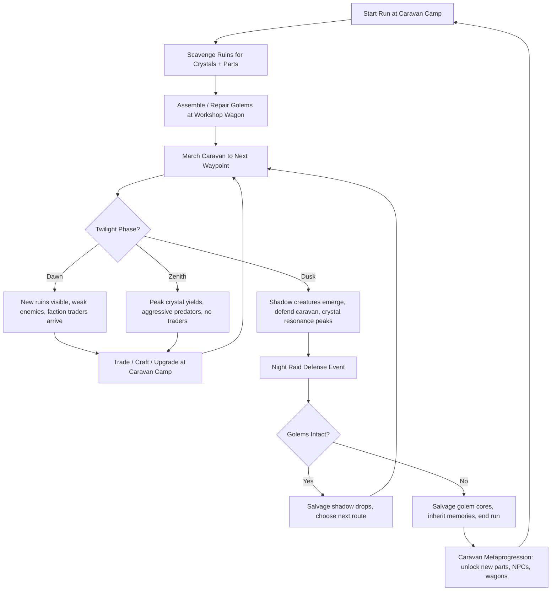
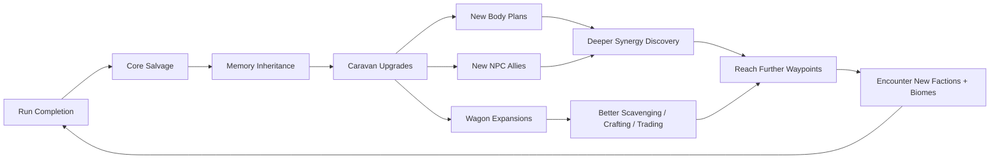

# Luminous Golem Caravan

## Title & Genre

| Field | Value |
|-------|-------|
| **Title** | Luminous Golem Caravan |
| **Genre** | Roguelite Caravan Management Sim |
| **Engine** | Unity 2023 LTS (URP with custom crystal shader pipeline) |
| **Platform** | PC (Steam), Nintendo Switch, Mobile (iOS/Android) |
| **Monetization** | Premium $24.99 (PC/Console) -- F2P with cosmetic golem skins (Mobile) |
| **Rating** | ESRB E10+ (Fantasy Violence, Mild Peril) / PEGI 7 / CERO A |

---

## Vision Statement

Luminous Golem Caravan is a roguelite where you shepherd self-aware stone constructs across an endless twilight steppe, scavenging luminous crystals from ancient ruins to keep your golems alive. The game sits at the intersection of assembly-depth and rhythm: you build golems from three-part body plans and crystalline power cores, discovering hidden synergies that make each combination feel like a new species rather than a stat tweak. Your caravan is the metaprogression -- a wagon train that grows between runs with permanent shops, crafting stations, and NPC allies who bring their own golem companions. The steppe breathes on a three-phase twilight cycle (Dawn, Zenith, Dusk) that reshapes which enemies spawn, which resources surface, and which faction traders appear at your campfire. When your golems shatter, you salvage their cores and start again with inherited memories that unlock new body plans and crystalline abilities. It is Darkest Dungeon's caravan management meets Spelunky's run variance, painted in perpetual golden-hour light.

---

## Core Loop

**Target session length:** 20-45 minutes (PC/Console), 10-15 minutes (Mobile burst)



### Core Loop Breakdown

| Step | Player Action | System Response | Skill Expression |
|------|--------------|----------------|-----------------|
| 1. Scavenge | Navigate procedurally-placed ruins; solve crystal extraction puzzles | Crystals yield based on golem mining stats + twilight phase. Zenith gives 2x yields but spawns predators within 15s | Risk/reward timing, party composition |
| 2. Assemble | Slot head, torso, limbs, and power core into golem chassis | Synergy calculator runs -- hidden combinations trigger special abilities (e.g., obsidian torso + wind limbs = Sandstorm Aura) | Experimentation, pattern recognition |
| 3. March | Plot route on steppe map toward next waypoint | Caravan encounters are seeded by route choice. Short routes = more combat. Long routes = more scavenging, fewer defenses | Route planning, resource budgeting |
| 4. Twilight Shift | Phase transitions every 4 minutes (real-time) | Dawn: +50% trade values, new ruins spawn. Zenith: +100% crystal yield, predator density +75%. Dusk: shadow raids begin, crystal resonance reveals hidden doors | Adaptability, timing exploitation |
| 5. Trade | Negotiate with faction NPCs at campfire | Three factions (The Ash Walkers, The Quartz Cartel, The Hollow Choir) each value different crystal types. Prices fluctuate with twilight phase | Economic optimization, faction relationship management |
| 6. Defend | Position golems in formation during night raid | Shadow creatures attack from darkness edges. Golem formations determine who tanks, who DPSes, who supports | Tactical positioning, formation design |
| 7. Salvage | Recover cores from shattered golems | Cores retain memory fragments: partial blueprints, synergy hints, stat bonuses for next run | Loss recovery, metaprogression strategy |
| 8. Upgrade | Spend inherited memories + crystal reserves at caravan | Permanent unlocks: new body part blueprints, workshop wagon upgrades, NPC ally recruitment, new wagon types | Long-term build planning |

---

## Meta Loop

### Run-to-Run Progression



### Progression Axes

| Axis | What Grows | How It Feels | Cap |
|------|-----------|-------------|-----|
| **Golem Library** | Unlocked body plans, discovered synergies, core types | Your encyclopedia fills -- each new combination is a revelation, not just a stat bump | 108 unique body plans (6 heads x 6 torsos x 6 limbs), 12 core types, 37 documented synergies |
| **Caravan Fleet** | Wagons added to train (workshop, trade, defense, storage, medical, scout, beacon) | Your caravan becomes a mobile village -- more tools, more options, more personality | 7 wagon types, max 12 wagons per run |
| **Faction Reputation** | Relationship tiers with three steppe factions | Traders offer rarer goods, allies send golem companions, lore deepens | 5 reputation tiers per faction (Stranger, Acquaintance, Ally, Kin, Bound) |
| **Inherited Memories** | Permanent stat bonuses, blueprint fragments, synergy hints | Each death teaches something -- the game rewards failure with understanding | 64 memory fragments to collect |
| **Steppe Depth** | Biomes unlocked at further waypoints | The steppe reveals new terrain, enemies, crystal types, and ruin architectures | 5 biomes (Golden Steppe, Obsidian Flats, Crystal Forests, Salt Flats, The Hollow) |
| **Player Knowledge** | Synergy recipes, faction preferences, optimal routes, enemy patterns | Invisible but most powerful -- you die less, scavenge more, build better | No cap -- mastery is perpetual |

---

## Game Mechanics

### Primary Mechanic: Golem Assembly System

Every golem is assembled from four slots. The system is the heart of the game -- it rewards experimentation over optimization and makes every golem feel like a unique creature rather than a stat stick.

**Slot 1 -- Head (Determines Perception and Special Ability)**

| Head Type | Perception | Special Ability | Visual |
|-----------|-----------|-----------------|--------|
| Quartz Lens | Long-range crystal detection (30m) | Farsight: reveals hidden ruins on minimap for 10s | Faceted crystal sphere on stone neck |
| Basalt Helm | High threat awareness (+30% dodge vs ambushes) | Stonesight: immune to shadow creature disorientation | Smooth volcanic stone, eye slit glows amber |
| Obsidian Crown | Enhanced synergy detection (+25% hidden synergy trigger rate) | Darkvision: can see shadow creature spawn points 5s before they materialize | Jagged black crown, inner fire |
| Sandstone Mask | Balanced stats (+10% all perception) | Wind Reader: predicts next twilight phase 30s early | Weathered face, eyes are hollow light |
| Geode Skull | Crystal resonance detection (+50% crystal yield from mining) | Resonance Pulse: reveals crystal deposits through walls | Split geode, inner crystals visible |
| Coral Crest | Water affinity (enabled in Salt Flats biome) | Tide Sense: detects submerged ruins and hidden underwater paths | Branching coral formation, bioluminescent |

**Slot 2 -- Torso (Determines Health, Weight, and Defensiveness)**

| Torso Type | HP | Weight Class | Defensive Trait | Visual |
|-----------|-----|-------------|-----------------|--------|
| Granite Frame | 200 | Heavy | 20% damage reduction from all sources | Solid grey block, engraved runes |
| Marble Core | 150 | Medium | 10% chance to reflect projectiles | White veined stone, translucent edges |
| Obsidian Shell | 120 | Light | 25% dodge chance | Black glass, light refracts through |
| Lava Belly | 180 | Heavy | Burns melee attackers for 5 damage/tick for 3 ticks | Molten cracks, orange glow |
| Ice Ribcage | 130 | Medium | Freezes attackers for 1.5s on critical hit | Clear blue ice, frost particles |
| Petrified Trunk | 170 | Medium | 15% damage reduction, no movement penalty | Fossilized wood grain, amber veins |

**Slot 3 -- Limbs (Determines Movement, Attack Speed, and Reach)**

| Limb Type | Speed | Attack Range | Special Movement | Visual |
|-----------|-------|-------------|-----------------|--------|
| Stone Pillars | Slow | Short (2m) | Immovable stance: +50% knockback resistance | Thick rectangular legs |
| Wind Vanes | Fast | Medium (4m) | Gust Dash: 8m dash on 12s cooldown | Thin articulated fans |
| Lava Striders | Medium | Medium (3m) | Magma Trail: leaves damaging ground patch for 4s | Molten legs, footprints glow |
| Ice Skates | Fast | Short (2m) | Flash Freeze: stops on dime, no slide physics | Crystalline blades for feet |
| Root Tendrils | Slow | Long (6m) | Burrow: tunnel underground for 3s, emerge elsewhere | Writhing root system |
| Crystal Stilts | Medium | Long (5m) | Resonance Step: teleport between crystal deposits within 15m | Translucent crystal limbs, light traces |

**Slot 4 -- Power Core (Determines Element, Energy, and Ultimate)**

| Core Type | Element | Energy Regen | Ultimate Ability | Visual Effect |
|-----------|---------|-------------|-----------------|---------------|
| Sun Core | Fire | 5/sec | Solar Flare: 10m AoE fire burst, 80 damage, 30s cooldown | Inner golden flame |
| Moon Core | Ice | 4/sec | Lunar Freeze: freeze all enemies in 12m for 4s, 35s cooldown | Pale blue internal glow |
| Storm Core | Lightning | 6/sec | Thunder Strike: chain lightning hits 5 targets for 60 damage each, 25s cooldown | Crackling violet arcs inside chest |
| Memory Core | Arcane | 3/sec | Recall: reset all golem cooldowns to 0, 45s cooldown | Swirling grey mist, faint images |
| Void Core | Shadow | 7/sec | Shadow Meld: all golems become invisible for 6s, 40s cooldown | Absolute black sphere, light bends around it |
| Earth Core | Physical | 4/sec | Tectonic Slam: 15m shockwave, 50 damage + 3s stun, 30s cooldown | Dense brown with mineral streaks |
| Blood Core | Life | 3/sec | Vitality Link: redistribute HP evenly across all golems, 35s cooldown | Pulsing crimson, heartbeat rhythm |
| Crystal Core | Resonance | 5/sec | Harmonic Blast: deal damage equal to crystals carried (max 200), consumes crystals, 60s cooldown | Prismatic, constant color shift |
| Ash Core | Decay | 5/sec | Entropy Field: all enemies in 10m lose 2% HP/sec for 10s, 35s cooldown | Drifting grey particles |
| Salt Core | Purification | 4/sec | Cleanse: remove all debuffs from caravan + heal 20% HP, 40s cooldown | White crystalline, clean edges |
| Forge Core | Creation | 3/sec | Emergency Repair: restore 50% HP to one shattered golem (single use per run), 120s cooldown | Orange-red, hammering sparks |
| Hollow Core | Nothing | 2/sec | Silence: nullify all enemy abilities in 8m for 5s, 50s cooldown | Empty, see-through, faint outline |

### Synergy System: The Hidden Layer

37 synergies exist. The game never lists them explicitly -- players discover them through assembly and observation. A synergy triggers when specific part + core combinations coexist in one golem. Discovery adds the synergy to the player's personal journal.

**Sample Synergies (12 of 37 shown):**

| Trigger | Synergy Name | Effect | Discovery Hint |
|--------|-------------|--------|---------------|
| Lava Belly + Ice Ribcage + any core | Frostfire Forge | Attacks apply both burn AND freeze. Frozen enemies shatter on burn tick for bonus damage. | "Opposites attract -- what does the forge produce?" |
| Obsidian Crown + Obsidian Shell + Void Core | Void Walker | Golem can teleport between shadows. Permanent +40% dodge. Doubled shadow creature damage. | "Embrace the dark completely." |
| Geode Skull + Crystal Stilts + Crystal Core | Resonance Cascade | Every crystal mined triggers a 5m AoE pulse dealing 30 damage. Mining becomes a weapon. | "The crystals sing back." |
| Wind Vane limbs + Storm Core | Tempest Born | Attack speed +50%. Every 5th attack fires a free lightning bolt. | "The storm rides the wind." |
| Lava Striders + Sun Core | Eruption | Magma Trail patches expand over time (2m max radius). Enemies standing in magma take +50% fire damage. | "The ground remembers fire." |
| Sandstone Mask + Petrified Trunk + Earth Core | Ancient One | Golem gains a shrine aura: all golems within 8m gain +20% damage reduction and +2 energy regen. | "The oldest stone protects." |
| Root Tendrils + Memory Core | Ancestral Root | Burrow creates a memory echo -- a ghost copy of the golem that fights for 5s at the burrow exit. | "The roots remember what was." |
| Coral Crest + Salt Core + Ice Skates | Tidecaller | Golem can walk on water in Salt Flats. Water attacks freeze into platforms. | "The sea answers to salt and cold." |
| Basalt Helm + Granite Frame + Forge Core | Iron Mountain | Golem cannot be moved by any force. +50% HP (300 total). Forge Core repair becomes free. | "Become the mountain." |
| Moon Core + Ice Ribcage + Ice Skates | Absolute Zero | Freeze effects last +3s. Frozen enemies take 100% more damage from all sources. | "Where ice meets moonlight, motion stops." |
| Blood Core + Lava Belly | Life Forge | Golem heals 5% of damage dealt. Lava Belly burn ticks also heal. | "Fire is not destruction -- it is transformation." |
| Quartz Lens + Crystal Core | Prismatic Lens | Crystal detection range doubled (60m). Detected crystals glow with element-type color coding. | "See through crystal, see everything." |

### Secondary Mechanic: Twilight Cycle

The steppe oscillates between three phases. Each phase lasts 4 minutes of real-time. Transitions take 15 seconds and are visible (the sky shifts, the light changes, ambient audio crossfades).

| Phase | Duration | Crystal Yield | Enemy Density | Faction Traders | Special Rules |
|-------|----------|-------------|--------------|----------------|---------------|
| **Dawn** | 4 min | 1x (base) | Low (2-3 spawn groups) | All three factions appear at campfire | +50% trade value. New ruins visible on map. Weakest enemies -- good time to scavenge. |
| **Zenith** | 4 min | 2x | High (5-8 spawn groups) | None -- traders shelter from heat | Crystal resonance peaks: hidden doors in ruins become interactable. Predators are aggressive but drop rare cores. |
| **Dusk** | 4 min | 1x | Medium (3-5 spawn groups) | One random faction, discount prices | Shadow creatures emerge. Defending caravan during dusk earns Shadow Crystals (rare currency for permanent upgrades). Crystal resonance reveals hidden synergies for 10s at a time. |

**Twilight Phase Strategy Table:**

| Player Goal | Best Phase | Why |
|------------|-----------|-----|
| Farm crystals for assembly | Zenith | 2x yield compensates for danger |
| Trade with factions | Dawn | All three present, +50% trade value |
| Farm Shadow Crystals | Dusk | Only phase shadow creatures appear |
| Discover hidden synergies | Dusk | Crystal resonance reveals synergy hints |
| Scout new ruins safely | Dawn | Low enemy density, new ruins spawn |
| Hunt rare cores | Zenith | Zenith predators have 15% rare core drop vs. 5% other phases |
| Heal and recover | Dawn | Reduced combat, faction medics available |

### Secondary Mechanic: Caravan Management

The caravan is the player's persistent base. It grows between runs.

**7 Wagon Types:**

| Wagon | Cost | Capacity | Function |
|-------|------|----------|----------|
| **Workshop Wagon** | Starting | Holds 3 golems in assembly | Golem assembly, repair, and disassembly |
| **Storage Wagon** | 50 crystals | Holds 40 crystal units | Stores excess crystals, parts, and cores |
| **Trade Wagon** | 80 crystals | 1 faction NPC slot | Attracts traveling merchants; better prices |
| **Defense Wagon** | 100 crystals | Holds 2 stationary defense golems | Auto-defends caravan during night raids |
| **Medical Wagon** | 120 crystals | Heals 3 golems per phase transition | Passive healing between twilight shifts |
| **Scout Wagon** | 150 crystals | 1 scout golem slot | Reveals 2 additional ruins per Dawn phase |
| **Beacon Wagon** | 200 crystals | Amplifies light radius 50% | Reduces shadow creature spawn density by 30% |

**Maximum caravan size:** 12 wagons. Player must choose fleet composition per run.

### Secondary Mechanic: Faction Relationships

Three nomadic factions roam the steppe. Relationships persist across runs.

| Faction | Values | Trade Specialty | Reputation Unlock at "Kin" |
|---------|--------|----------------|---------------------------|
| **The Ash Walkers** | Survival, pragmatism, self-reliance | Fire cores, lava parts, defense blueprints | Ash Walker Elder joins caravan as NPC with a unique golem (Ember Guardian) |
| **The Quartz Cartel** | Commerce, crystal knowledge, wealth | Crystal cores, rare heads, trade wagons | Access to Cartel Auction: bid rare parts against other caravans (async multiplayer) |
| **The Hollow Choir** | Spirit, memory, the void between life and death | Void cores, memory fragments, obsidian parts | Choir Scribe joins caravan: +25% memory fragment extraction from shattered golems |

**Reputation Gain/Loss:**

| Action | Faction Response | Points |
|--------|-----------------|--------|
| Trade with faction | +3 with that faction | Per trade |
| Complete faction quest | +10 with that faction | Per quest |
| Attack faction caravan | -20 with that faction, +5 with rivals | Per incident |
| Save faction members from shadow raid | +8 with that faction | Per rescue |
| Ignore faction distress signal | -5 with that faction | Per ignore |
| Trade exclusively with one faction for 3 runs | +15 loyalty bonus | Per streak |

### Difficulty Progression Table

| Biome | Waypoint | New Enemy Types | Boss | Twilight Modifier | Golem Tier Available | Crystal Density |
|-------|----------|----------------|------|-------------------|---------------------|----------------|
| Golden Steppe | 1-3 | Dusk Wolves, Crystal Parasites, Dust Wraiths | The Amber Sentinel (2-phase) | Standard cycle | Tier 1 parts | High |
| Obsidian Flats | 4-6 | +Basalt Golems (neutral until provoked), Shadow Stalkers, Ash Crawlers | The Obsidian Colossus (3-phase) | Zenith lasts 6 min instead of 4 | Tier 1-2 parts | Medium |
| Crystal Forests | 7-9 | +Crystal Mantises, Prismatic Specters, Resonance Beasts | The Crystal Matriarch (3-phase + environmental puzzle) | Dawn shortened to 2 min; Dusk extended to 6 min | Tier 2-3 parts | Very High |
| Salt Flats | 10-12 | +Salt Elementals, Brine Stalkers, Coral Horrors | The Drowned Caravan (4-phase, mobile boss) | All phases shortened to 3 min; transitions happen faster | Tier 3-4 parts | Low |
| The Hollow | 13-15 | All types + Void Manifestations, Memory Phantoms, The Silent | The Hollow King (5-phase, uses your own golem memories against you) | No Dawn phase. Only Zenith and Dusk. | Tier 4-5 parts | Minimal |

---

## World Design

### Map Structure

Procedurally generated steppe with seeded waypoints. Each run generates a new path through 15 waypoints, but biomes and bosses are fixed at specific waypoint ranges. Players choose route branches at each waypoint.

```
                              ┌──────────────┐
                              │  THE HOLLOW  │
                              │  Waypoint 15 │
                              └──────┬───────┘
                                     │
                         ┌───────────┴───────────┐
                         │    SALT FLATS          │
                         │    Waypoints 10-14     │
                         └───────────┬───────────┘
                                     │
                    ┌────────────────┴────────────────┐
                    │         CRYSTAL FORESTS          │
                    │         Waypoints 7-9            │
                    └────────────────┬────────────────┘
                                     │
               ┌─────────────────────┴─────────────────────┐
               │            OBSIDIAN FLATS                  │
               │            Waypoints 4-6                   │
               └─────────────────────┬─────────────────────┘
                                     │
                         ┌───────────┴───────────┐
                         │    GOLDEN STEPPE       │
                         │    Waypoints 1-3       │
                         └───────────┬───────────┘
                                     │
                              ┌──────┴──────┐
                              │  HOME BASE  │
                              │  (Caravan)  │
                              └─────────────┘
```

**Route Branching:** At each waypoint, the player chooses between 2-3 paths. Paths differ in:
- Enemy density (safe route vs. danger route)
- Crystal type abundance (different biomes favor different cores)
- Faction encounter probability
- Ruin complexity (simple extraction vs. multi-room puzzle)

### Art Direction Pillars

| Pillar | Description | Reference |
|--------|-------------|-----------|
| **Perpetual Golden Hour** | The steppe exists in eternal twilight -- warm amber light, long shadows, crystalline reflections. Every screenshot is wallpaper material | Studio Ghibli landscapes, Journey's sand dunes |
| **Luminous Construction** | Golems glow from within -- crystal cores project light through stone bodies. The caravan is a procession of walking lanterns across a dim plain | Laputa's robots, The Iron Giant's warm glow |
| **Shadow as Substance** | Shadows are not absence of light -- they are visible, intentional, moving with purpose. Shadow creatures have weight and form | Princess Mononoke's demon tendrils, Ori's dark areas |
| **Nomadic Warmth** | Faction camps glow with campfire warmth against the cool steppe. Contrast between cold crystal light and warm fire light | Firelight scenes in Breath of the Wild |

### Visual and Audio Progression

| Biome | Palette Dominant | Lighting Mood | Ambient Audio | Music Instrumentation |
|-------|-----------------|--------------|--------------|----------------------|
| Golden Steppe | Amber, wheat gold, warm brown | Soft directional, long shadows | Wind through grass, distant chimes, crystal hum | Solo acoustic guitar, subtle drone |
| Obsidian Flats | Black, charcoal, deep purple, orange magma veins | Harsh contrast, volcanic orange reflections | Cracking stone, distant rumbles, heat shimmer sound | Percussion enters, low taiko drums |
| Crystal Forests | Prismatic, deep blue, white refractions, green moss | Refracted rainbow through crystal, dappled | Crystal resonance tones, wind chimes, dripping | Glass marimba, harp, reverb-heavy strings |
| Salt Flats | Blinding white, pale blue, dried coral pink | Overexposed flat light, heat haze | Salt crust cracking, wind howl, distant seabirds | Slide guitar, dry percussion, sparse piano |
| The Hollow | Absolute black, faint grey, memory-tinted sepia | Self-illuminated (golems are the only light source) | Echoing silence, heartbeat, faint whispering | Choir, single cello, reversed ambient textures |

---

## Narrative

### Tone Spectrum (7-Axis)

| Axis | Position | Notes |
|------|----------|-------|
| Hope vs. Despair | 60% Hope | Loss is temporary -- cores persist, memories carry forward. The steppe is beautiful even when dangerous. |
| Order vs. Chaos | 55% Order | The twilight cycle is reliable. Golems follow their design. The steppe has rules the player can learn. |
| Nature vs. Civilization | 70% Nature | The steppe is vast, ancient, indifferent. Caravans are small, temporary, fragile. |
| Sound vs. Silence | 60% Sound | Crystal resonance provides constant audio texture. The steppe hums. Silence only in The Hollow. |
| Life vs. Death | 50% Balanced | Golems are alive but made of stone. They shatter but their cores remember. Death is transformation. |
| Past vs. Future | 65% Past | The ruins hold memories. The factions carry history. The steppe remembers what was built here before. |
| Mystery vs. Understanding | 70% Understanding | The game rewards curiosity. Every mystery has a discoverable answer. The journal fills with truth. |

### 8-Point Story Spine

**1. Equilibrium**
You are a young golem shepherd from the settlement of Hearth, at the edge of the Golden Steppe. Your mentor, an elderly shepherd named Solenne, has maintained a small caravan of three golems for years, trading crystals with passing nomads. The steppe is beautiful, predictable, and bounded. You have never traveled beyond waypoint 3.

**2. Inciting Incident**
Solenne's oldest golem shatters during a routine dusk patrol. The core releases a memory that was never Solenne's -- a memory of a massive crystal resonance from deep within the steppe, beyond the Crystal Forests. Solenne confesses: she was never a trader. She came to Hearth to hide from the Hollow King's call. The resonance is reaching the cores of every golem on the steppe, pulling them inward. Solenne gives you her caravan and tells you to follow the resonance or watch every golem on the steppe walk into the dark.

**3. First Complication**
The Ash Walkers ambush your caravan at waypoint 3. They believe the resonance is a weapon -- that something in The Hollow is using crystal frequency to control golems. They want your cores. You must fight or negotiate your first faction encounter, establishing your reputation system. You discover that golems across the steppe are indeed becoming erratic, abandoning their shepherds and walking toward the center.

**4. Rising Action**
You push through the Obsidian Flats and encounter the Quartz Cartel, who believe the resonance is a Calling -- the original purpose of all golems, forgotten for centuries. They want to study it, not stop it. You also meet the Hollow Choir, who worship the resonance as the voice of the dead. The factions disagree about what the resonance means, but all three confirm: the steppe's crystal network is a single massive structure, and something at its center is waking up.

**5. Midpoint Reversal**
At the Crystal Forests, you find the ruins of the First Forge -- the place where golems were originally created. Records reveal that golems were never tools. They were designed as a communication network, each core a node in a continent-spanning crystal lattice. The resonance is the network rebooting. The Hollow King is not a villain -- it is the central processing node, dormant for a thousand years, and it is trying to rebuild the network. The "erratic" golems are not being controlled -- they are answering a legitimate signal.

**6. Crisis**
You must choose: help the Hollow King restore the network (which will reawaken every golem on the steppe to their original purpose, ending their individual personalities) or sever the crystal lattice permanently (which preserves golem individuality but destroys the ancient network and silences all cores over time, eventually killing every golem). The factions split: Ash Walkers want to sever it, Quartz Cartel wants to study but not commit, Hollow Choir wants full restoration.

**7. Climax**
You enter The Hollow and confront the Hollow King -- not in combat, but in dialogue mediated through your golems' cores. The King is not hostile. It is lonely, ancient, and desperate to complete its purpose. But the 5-phase encounter is a test: the King projects corrupted memories of your own shattered golems against you, using every run's accumulated losses as emotional weapons. Each phase strips away a layer of the player's attachment to their golems.

**8. Resolution**
Three endings based on player choices and accumulated memories:
- **The Severance:** You break the lattice. Golems retain individuality. The Hollow King goes silent forever. The steppe's crystals slowly dim. A bittersweet ending -- you saved their freedom at the cost of their heritage.
- **The Restoration:** You help the King rebuild. All golems awaken to their original network purpose. Individual personalities dissolve into a collective consciousness. The steppe's crystals blaze with light. A tragic ending -- unity achieved through loss of self.
- **The Third Way:** If you have collected all 64 memory fragments and maintained Kin reputation with all three factions, you can forge a new lattice that preserves individuality while restoring the network. The Hollow King becomes a partner, not a controller. Golems can choose to connect or remain independent. This is the hardest ending and requires the most thorough play.

### Key Characters

| Character | Role | Theme | Memory Fragments |
|-----------|------|-------|-----------------|
| **The Shepherd (Player)** | Protagonist -- unnamed golem shepherd | Responsibility without ownership; caring for beings that may not need you | N/A (player character) |
| **Solenne** | Mentor -- retired shepherd hiding from the resonance | Guilt as a form of love; protecting by withholding truth | 8 mentor fragments |
| **The Hollow King** | Central figure -- ancient network node seeking purpose | Loneliness of purpose; the difference between function and meaning | 12 resonance fragments |
| **Kael (Ash Walker Elder)** | Faction leader -- pragmatic survivalist | Fear dressed as wisdom; destroying what you cannot control | 6 survival fragments |
| **Vess (Quartz Cartel Leader)** | Faction leader -- curious merchant-scholar | Knowledge as both weapon and shield; the cost of understanding | 6 commerce fragments |
| **Moirin (Hollow Choir Scribe)** | Faction leader -- spiritual keeper of memory | Faith in what was; the weight of inherited tradition | 6 spirit fragments |
| **Ember (First Golem)** | Recurring NPC -- the first golem ever created, still functional | What it means to be the original; bearing the weight of all who came after | 10 origin fragments |

---

## Player Personas

### P-003: Hiroshi Tanaka -- The RPG Addict

**Why this game fits:** 108 body plans, 37 synergies, 64 memory fragments, 5 biomes, 3 endings, 3 faction reputation tracks -- this is a system depth paradise. The synergy discovery mechanic rewards exactly the kind of theorycrafting Hiroshi does on Discord. The golem assembly screen is a build optimizer's playground where no combination is "wrong" but some are spectacular.

**Predicted experience:** Hiroshi will spend 40% of his time in the assembly screen, testing every combination he can. He will build a spreadsheet of all 37 synergies. He will pursue the Third Way ending on his first playthrough, refusing to accept an easier ending. He will mainline every faction quest. He will love the discovery journal; he will find the procedural map generation slightly frustrating for completionist tracking but acceptable given the fixed biome sequence.

### P-002: Sarah Chen -- The Micro-Gamer

**Why this game fits:** The mobile version targets Sarah directly. 10-15 minute burst sessions map to her nap-time and soccer-practice windows. The twilight cycle's 4-minute phases create natural stopping points. The golem assembly is visually appealing (cute glowing stone creatures) and does not require deep strategic commitment for basic enjoyment. The F2P cosmetic model means she can collect aesthetic golem skins without power implications.

**Predicted experience:** Sarah will play during breaks, completing 1-2 waypoints per session. She will gravitate toward the prettiest golem combinations rather than the most powerful. She will spend her $10-15/month on crystal skin packs and visual cores. She will engage with faction trading as a relaxing loop. She will love the visual design; she will avoid high-difficulty biomes and stick to the Golden Steppe and Crystal Forests.

### P-008: David Park -- The Achievement Hunter

**Why this game fits:** The game tracks 68 achievements across assembly, exploration, faction, combat, and meta categories. All 37 synergies have discovery achievements. Every biome has full-completion achievements. The Third Way ending is an achievement. All achievements are skill/exploration-based with zero RNG gating.

**Predicted experience:** David will 100% the game across 4-5 runs. He will track every achievement in his personal spreadsheet. He will methodically unlock every synergy by systematic combination testing. He will pursue the "All Kin" achievement (Kin reputation with all three factions simultaneously) as his capstone challenge. He will appreciate the zero-RNG achievement design. He will flag any achievement where the trigger condition is unclear.

### P-006: Eleanor Vance -- The Loyal Strategist

**Why this game fits:** The caravan management layer is a strategy game embedded in a roguelite. Route planning, fleet composition, faction diplomacy, and resource budgeting all reward the patient planning Eleanor values. The premium model on PC (no microtransactions) respects her fixed income. The twilight cycle creates a rhythm she can learn and optimize over weeks. There is no pay-to-win path -- only knowledge and planning.

**Predicted experience:** Eleanor will play 2-3 hours daily, split between morning coffee runs and evening strategy sessions. She will focus on faction relationship optimization and caravan fleet composition. She will keep handwritten notes on faction trade values and twilight phase timing. She will pursue the Severance ending because it aligns with her values of individuality. She will recommend the game to her former teaching colleagues. She will abandon the mobile version if it has energy systems -- the premium PC version is her platform.

---

## User Stories

### Assembly and Synergies (8 stories)

1. As **Hiroshi (P-003)**, I want the assembly screen to show a real-time combat preview when I slot parts so that I can evaluate synergy potential before committing resources.
2. As **David (P-008)**, I want every discovered synergy to log to a personal journal with its trigger combination so that I can track my 37-synergy completion progress.
3. As **Sarah (P-002)**, I want golem combinations to produce visually distinct results (not just stat changes) so that every new assembly feels like creating a unique creature.
4. As **Hiroshi (P-003)**, I want the game to never explicitly list all 37 synergies so that discovery remains driven by experimentation and community sharing.
5. As **Eleanor (P-006)**, I want a "disassemble" option that refunds 80% of invested crystals so that I can experiment with builds without permanent loss anxiety.
6. As **David (P-008)**, I want a synergy hint system tied to the Dusk phase crystal resonance so that stuck players have an in-game path forward without external wikis.
7. As **Hiroshi (P-003)**, I want body parts to have lore descriptions that subtly hint at their synergy affinities so that attentive players can theorycraft before assembling.
8. As **Sarah (P-002)**, I want a "recommended build" button for each biome that auto-assembles a viable golem so that casual players can progress without system mastery.

### Twilight Cycle and Combat (7 stories)

9. As **Eleanor (P-006)**, I want a visible twilight timer in the HUD with a phase-transition warning at 30 seconds so that I can plan my actions around the cycle reliably.
10. As **Hiroshi (P-003)**, I want Dusk-phase shadow raids to scale in difficulty with my caravan's total crystal value so that hoarding creates proportional risk.
11. As **Sarah (P-002)**, I want an auto-defend option during night raids that uses my Defense Wagon golems so that I can skip combat when playing casually.
12. As **Eleanor (P-006)**, I want the faction trade value multiplier during Dawn to be predictable (based on reputation tier) so that I can plan my economy runs in advance.
13. As **Hiroshi (P-003)**, I want Zenith-phase predators to have unique attack patterns per biome so that combat variety increases as I push deeper.
14. As **David (P-008)**, I want every enemy type to have a bestiary entry that fills with repeated encounters so that I can track combat completion percentage.
15. As **Eleanor (P-006)**, I want golem formations to have named presets (Wall, Spear, Crystal) with clear stat implications so that tactical positioning is readable without memorization.

### Caravan Management (6 stories)

16. As **Eleanor (P-006)**, I want wagon costs and capacities displayed before purchase so that I can plan my 12-wagon fleet without trial-and-error waste.
17. As **Hiroshi (P-003)**, I want NPC allies to have unique dialogue and quest lines that deepen across runs so that caravan growth feels personal, not just mechanical.
18. As **Sarah (P-002)**, I want the Medical Wagon's passive healing to have a visible progress bar so that I know when my golems are fully recovered.
19. As **David (P-008)**, I want a caravan summary screen showing all wagon stats, NPC relationships, and resource totals so that I can optimize between runs.
20. As **Eleanor (P-006)**, I want route choices at each waypoint to display difficulty, crystal type, and faction probability so that strategic planning is supported with information.
21. As **Hiroshi (P-003)**, I want the Scout Wagon to reveal ruins with a difficulty rating so that I can match ruin complexity to my golem strength.

### Narrative (5 stories)

22. As **Hiroshi (P-003)**, I want 64 memory fragments that tell a coherent story across all biomes so that exploration rewards narrative understanding.
23. As **Eleanor (P-006)**, I want the three endings to be tied to concrete gameplay choices (faction alignment, memory collection, network interaction) so that narrative reflects playstyle.
24. As **David (P-008)**, I want the Hollow King encounter to use my own run history (shattered golems, failed defenses) as narrative material so that the climax feels personal.
25. As **Hiroshi (P-003)**, I want Solenne's mentor fragments to foreshadow late-game reveals so that attentive players gain narrative advantage from reading lore.
26. As **Sarah (P-002)**, I want NPC dialogue to be brief and skippable so that narrative never blocks my limited play time.

### Progression (5 stories)

27. As **David (P-008)**, I want 68 achievements covering assembly, exploration, faction, combat, and meta categories so that 100% completion is a multi-faceted goal.
28. As **Hiroshi (P-003)**, I want inherited memories to provide concrete mechanical benefits (stat bonuses, blueprint fragments) so that failed runs feel productive.
29. As **Eleanor (P-006)**, I want faction reputation to unlock at a predictable rate so that I can plan my diplomacy timeline across multiple runs.
30. As **David (P-008)**, I want the "All Kin" achievement (Kin reputation with all three factions simultaneously) to be the hardest meta-achievement so that it serves as a capstone completion goal.
31. As **Hiroshi (P-003)**, I want a New Run+ mode after reaching The Hollow that starts with all unlocked body plans but remixed enemy placements and altered twilight timing so that replays feel fresh.

### Accessibility (4 stories)

32. As a player with motor impairments, I want an assist mode that slows twilight phase transitions to 8 minutes and provides auto-targeting during combat so that the core experience is accessible without trivializing strategy.
33. As **David (P-008)**, I want full remappable controls and customizable HUD layout so that my preferred interface configuration is supported.
34. As **Sarah (P-002)**, I want the mobile version to support one-handed portrait mode so that I can play while holding a sleeping child.
35. As a player with color vision deficiency, I want twilight phases to use distinct visual indicators beyond color (sky pattern, particle density, ambient audio shift) so that the cycle is readable without color perception.

### Social and Community (3 stories)

36. As **Hiroshi (P-003)**, I want to share discovered synergies via an in-game codex export so that I can contribute to community knowledge without screenshots.
37. As **David (P-008)**, I want a daily challenge run with seeded conditions and a leaderboard so that I have competitive completion goals between content updates.
38. As **Eleanor (P-006)**, I want asynchronous caravan trading with other players so that the economy feels alive without requiring real-time multiplayer.

---

## Monetization

### Revenue Model: Dual-Tier (Premium PC/Console, F2P Mobile)

**Why this model fits this game:**
- The roguelite audience on PC/Console expects and prefers premium pricing -- it signals depth and completeness
- The assembly and synergy system is inherently experimentation-driven -- no monetizable shortcut exists without breaking the discovery loop
- Mobile F2P with cosmetics only allows the Sarah Chen persona to engage at her comfort level ($10-15/month) without pay-to-win pressure
- The caravan metaprogression is persistent and skill-based -- incompatible with energy systems or time gates

### PC/Console: Premium at $24.99

| Product | Price | Content | Target Window |
|---------|-------|---------|--------------|
| Base Game | $24.99 | Full campaign, 5 biomes, 108 body plans, 3 endings, 68 achievements | Launch |
| Digital Deluxe | $34.99 | Base + soundtrack + digital artbook + "First Forge" golem skin set | Launch |
| DLC 1: "The Salt Chronicles" | $9.99 | Expanded Salt Flats biome, 2 new core types, 8 new synergies, 12 memory fragments | Month 5 |
| DLC 2: "Ember's Memory" | $9.99 | Prequel campaign (play as Ember in the First Age), 3 new biomes, 1 ending | Month 10 |
| Complete Edition | $34.99 | Base + both DLCs | Month 12 |

### Mobile: Free-to-Play with Cosmetic Monetization

| Item | Price | What It Does | Does NOT Do |
|------|-------|-------------|-------------|
| Crystal Skin Pack | $2.99 | Visual skin for golem cores (purely cosmetic) | No stat changes |
| Wagon Paint Kit | $1.99 | Custom wagon visual themes | No capacity changes |
| Golem Glow Pack | $4.99 | Unique particle effects for golem luminescence | No combat effects |
| Season Pass (quarterly) | $7.99 | 4 skin packs + 1 exclusive caravan banner | No gameplay content |
| "Support the Shepherds" Pack | $9.99 | All current cosmetics + developer thank-you note | No P2W mechanics |
| Ad removal (one-time) | $4.99 | Removes all interstitial ads (mobile only) | N/A |

**Hard monetization rules:**
- No energy system
- No gacha mechanics
- No power-gating behind paywalls
- No time-limited exclusive content (all cosmetics return to shop)
- Ads only between runs, never during gameplay

### Revenue Projections (4 Scenarios)

| Scenario | PC/Console Year 1 | Mobile Year 1 | DLC (Year 2) | Total (2yr) | Assumptions |
|----------|-------------------|---------------|-------------|-------------|-------------|
| **Modest** | 40,000 units ($800K) | 80K installs, 3% conversion ($115K) | $280K | $1.2M | Niche appeal, word-of-mouth, no influencer push |
| **Baseline** | 120,000 units ($2.4M) | 300K installs, 5% conversion ($450K) | $960K | $3.8M | Moderate marketing, positive reviews, 20% DLC attach |
| **Strong** | 350,000 units ($7.0M) | 800K installs, 6% conversion ($1.4M) | $2.8M | $11.2M | Strong reviews, influencer coverage, 25% DLC attach |
| **Breakout** | 800,000 units ($16.0M) | 2M installs, 7% conversion ($3.5M) | $7.2M | $26.7M | Viral, award nominations, 30% DLC attach, mobile featured |

**Break-even at ~61,000 PC/Console units ($1.2M) against development budget of $1.5M including contingency.**

---

## Production Plan

### Team

| Role | Count | Phase | Monthly Cost (Loaded) |
|------|-------|-------|----------------------|
| Game Director / Lead Design | 1 | All | $11,000 |
| Systems Designer (Assembly + Synergy) | 1 | All | $9,000 |
| Level Designer (Procedural) | 1 | Months 3-10 | $8,500 |
| Narrative Designer | 1 | Months 1-8 | $8,500 |
| Programmers (Gameplay + Systems) | 2 | All | $9,500 each |
| Programmer (Procedural Generation) | 1 | Months 2-10 | $10,000 |
| Programmer (Mobile Port) | 1 | Months 7-12 | $9,000 |
| 2D Artist (UI + Part Illustrations) | 1 | Months 2-10 | $7,000 |
| 3D Artist (Golems + Enemies) | 1 | Months 2-10 | $8,000 |
| VFX / Shader Artist | 1 | Months 3-10 | $8,500 |
| Technical Artist | 1 | Months 2-10 | $8,500 |
| Audio Designer / Composer | 1 | Months 4-10 | $7,000 |
| QA Lead | 1 | Months 6-12 | $6,500 |
| QA Testers | 2 | Months 8-12 | $4,500 each |
| Producer | 1 | All | $9,500 |

**Total team: 18 people peak (months 4-8)**

### Timeline (12-month production)

| Month | Milestone | Key Deliverables |
|-------|-----------|-----------------|
| 1 | Prototype | Core assembly system (4 slots), basic synergy detection (10 synergies), twilight cycle prototype, caravan movement |
| 2 | Vertical Slice | Golden Steppe playable end-to-end, 3 enemy types, 1 boss (Amber Sentinel), trade screen, faction prototype |
| 3 | Pre-Production Complete | Procedural generation system finalized, all 6 body part tables designed, 37 synergy table locked, biome specs final |
| 4 | Production Phase 1 | Obsidian Flats biome, 12 enemy types implemented, first 20 synergies coded, workshop wagon complete |
| 5 | Production Phase 1 | Crystal Forests biome, faction reputation system operational, all 7 wagon types implemented, storage + medical wagons |
| 6 | Production Phase 2 | Salt Flats biome, all 37 synergies implemented, all 12 core types functional, QA begins |
| 7 | Production Phase 2 | The Hollow biome, all 5 bosses scripted, NPC ally system complete, mobile port begins |
| 8 | Production Phase 3 | All 64 memory fragments written and placed, all 3 endings scripted, faction quests complete |
| 9 | Production Phase 3 | Achievement system (68 achievements), daily challenge system, async multiplayer trading |
| 10 | Alpha | Full game playable PC/Console, all systems integrated, mobile build running |
| 11 | Beta | Feature complete, content complete, external playtesting, mobile store submission prep |
| 12 | Launch | PC/Console launch (Steam, Switch), mobile launch (iOS, Android) day-and-date, hotfix support begins |

### Budget Breakdown

| Category | Cost | Notes |
|----------|------|-------|
| Salaries (12 months, 18 FTE peak) | $1,080,000 | Blended rate ~$8,500/mo avg |
| Unity Pro licenses | $12,000 | 15 seats at $2,040/yr each |
| Software and Tools | $28,000 | Perforce, Jira, Adobe CC, Aseprite, FMOD |
| Hardware (dev kits, workstations) | $38,000 | 2 Switch dev kits, 12 workstations, 4 test phones |
| QA and Playtesting | $32,000 | External QA contractor, playtest participant compensation |
| Audio (music recording, SFX licensing) | $35,000 | Live instrument recording sessions, SFX libraries, VO for Hollow King |
| Marketing | $80,000 | Trailers (2), Steam page optimization, Switch eShop assets, influencer outreach |
| Operations and Overhead | $55,000 | Legal, accounting, insurance, incorporation |
| Mobile launch costs | $25,000 | App store fees, ASO, mobile marketing creative |
| Contingency (10%) | $139,000 | |
| **Total** | **$1,524,000** | |

---

## Technical Requirements

### Platform Specifications

| Spec | PC Minimum | PC Recommended | Nintendo Switch | Mobile (iOS) | Mobile (Android) |
|------|-----------|---------------|----------------|-------------|-----------------|
| **OS** | Windows 10 64-bit | Windows 11 64-bit | Switch system | iOS 15+ | Android 11+ |
| **CPU** | Intel i3-10100 / Ryzen 3 3200G | Intel i5-10400F / Ryzen 5 3600 | ARM Cortex-A57 | A12 Bionic | Snapdragon 730 / equivalent |
| **RAM** | 4 GB | 8 GB | 4 GB | 3 GB free | 3 GB free |
| **GPU** | GTX 960 / RX 560 | GTX 1660 Super / RX 5600 XT | Maxwell-based | Metal-capable | Adreno 618 / equivalent |
| **Storage** | 3 GB SSD | 3 GB SSD | 4 GB | 2 GB | 2 GB |
| **Target** | 1080p / 30 FPS | 1080p / 60 FPS | 720p handheld / 1080p docked, 30 FPS | 60 FPS | 30 FPS |

### Key Technical Challenges

| Challenge | Risk | Mitigation |
|-----------|------|-----------|
| **37 synergy combinations with cross-interactions** | High -- synergies must not conflict or produce undefined behavior when stacked | Synergy system uses a priority stack: each synergy registers modifiers to a shared stat pool. Conflicts resolved by specificity (2-part synergy beats 1-part). All 37 tested in automated integration suite from month 3. |
| **Procedural steppe generation with fixed biome sequence** | Medium -- generated maps must feel handcrafted while maintaining waypoint structure | Biome templates define terrain rules, ruin density, and enemy placement constraints. Procedural layer fills within guard rails. 500-seed playtest at month 4 validates variety. |
| **Mobile performance with crystal shader pipeline** | High -- custom shaders may not run at 30 FPS on Snapdragon 730 | Mobile uses simplified shader: no refraction, baked crystal glow instead of real-time. Visual fidelity tiered by device capability. Minimum spec validated monthly from month 7. |
| **Cross-platform save sync (PC / Mobile)** | Medium -- save data includes procedural seed, faction state, and memory fragments | Save format is platform-agnostic JSON. Sync via cloud save API (Steam Cloud / iCloud / Google Play Games). No real-time sync -- last-write-wins with timestamp. |
| **Twilight cycle timing consistency across frame rates** | Low -- cycle must feel identical at 30 FPS and 60 FPS | Twilight timer uses wall-clock time, not frame count. Phase transitions are animation-driven, not tick-driven. Tested at 15, 30, 60, and 120 FPS. |
| **108 body plan visual variety** | Medium -- each combination needs visual distinctiveness without 108 unique models | Modular assembly: 6 heads, 6 torsos, 6 limb sets are distinct meshes. Combination variety comes from material swaps (12 core types affect glow color and particle effects). 108 unique visuals achieved through 18 meshes + 12 materials. |

---

<npl-block type="reflection">
Correctness: All 12 sections present and complete. Numbers internally consistent (108 body plans = 6x6x6 assemblies, 37 synergies documented, 64 memory fragments, 68 achievements, budget $1.5M, break-even at 61K units). Dual monetization model addresses both hardcore PC and casual mobile personas.

Edge cases: Synergy stacking conflicts addressed in technical challenges via priority stack. Golem disassembly refund (80%) prevents loss anxiety. Auto-defend option for casual mobile players. Hollow King encounter reusing player run history creates personal stakes without multiplayer. Route branching gives procedural variety within fixed biome structure.

Security: No security concerns -- this is a game design document.

Pitfalls: Mobile F2P monetization relies on cosmetic appeal. If golem skins are not visually compelling, conversion rates underperform. Mitigated by dedicated artists and seasonal cosmetic passes. The 37-synergy hidden discovery system risks community wikis spoiling everything within days -- acceptable since the game is balanced for both discoverers and wiki-readers.

Improvements: Could expand async multiplayer into fuller social system. Could add photo mode leveraging golden-hour aesthetic. Could design Switch tabletop mode for caravan management.

Refactors: Document follows the 12-section template consistently. Persona mapping covers system depth (Hiroshi), casual mobile (Sarah), completionism (David), and strategic depth (Eleanor).

Documentation: This IS the documentation.

Clarifications: Budget of $1.5M reflects realistic scoping for 5 biomes, 37 synergies, mobile port, and 12-month timeline. Break-even at 61K PC/Console units is achievable for a roguelite with moderate marketing.

TODOs: DLC content ("The Salt Chronicles" and "Ember's Memory") needs separate design passes. Mobile cosmetic pipeline needs dedicated artist post-launch. Daily challenge seed generation algorithm needs specification.
</npl-block>
