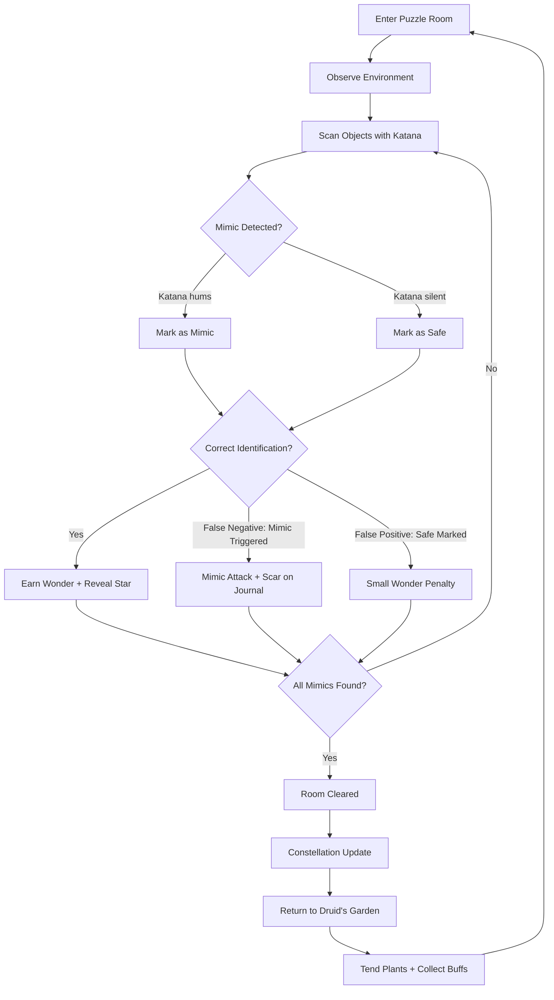
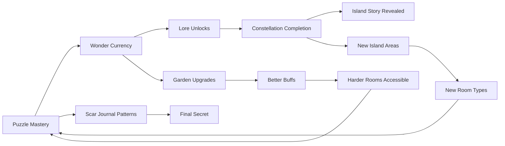
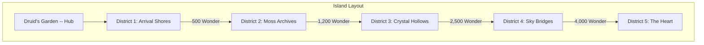

# Luminous Mimic Isle

## Title & Genre

| Field | Value |
|-------|-------|
| **Title** | Luminous Mimic Isle |
| **Genre** | Puzzle / Casual / Narrative |
| **Engine** | Unity 2024 LTS (URP — lightweight rendering for cross-platform including mobile) |
| **Platform** | PC (Steam), Nintendo Switch 2, iOS, Android |
| **Monetization** | Premium $19.99 PC/console; $4.99 mobile episode 1 + $4.99 IAP unlock for full game |
| **Rating** | ESRB E10+ (Fantasy Violence, Mild Suspense) / PEGI 7 / CERO A |

---

## Vision Statement

Luminous Mimic Isle is a meditative puzzle game about a floating island where every object might be a mimic -- treasure chests, doors, bridges, even the ground beneath your feet. Armed with a luminous katana that resonates with deception, you tap objects to reveal their true nature before they strike. The game exists at the intersection of curiosity and consequence -- every room is a self-contained mystery where environmental clues (mismatched shadows, slightly wrong colors, displaced sounds) separate the safe from the predatory. The more mimics you identify without triggering them, the more Wonder you accumulate -- a currency that unlocks the island's deeper story about why everything here pretends to be something else. Between puzzle rooms, you tend a garden where the island's non-hostile creatures gather, growing plants that provide passive buffs. This is a game about the pleasure of looking closely, about the beauty of things that are not what they seem, and about a katana that hums a different note for every lie it finds.

---

## Core Loop

**Target session length:** 15--30 minutes (mobile-friendly burst sessions)

### Core Loop Breakdown

| Step | Player Action | System Response | Skill Expression |
|------|--------------|----------------|-----------------|
| 1. Observe | Survey the room visually before scanning | Room renders with intentional visual clues: mismatched shadows (mimics cast no shadow or a wrong one), color shifts (mimic objects have a 5--8% hue offset), audio displacement (mimics emit faint sounds from the wrong direction) | Visual acuity, patience, attention to detail |
| 2. Scan | Tap objects with katana to check for resonance | Katana emits haptic vibration pattern: close mimics produce rapid pulse (3 pulses/sec within 2 tiles), distant mimics produce low drone (1 pulse/sec at 5+ tiles). Safe objects produce no response. In Hard Mode, katana is silent -- clues only | Timing, spatial reasoning, vibration pattern literacy |
| 3. Mark | Tag identified mimics with katana flourish | Correctly tagged mimic glows and transforms into its true form with a jewel-toned reveal animation. +10--25 Wonder per correct tag (scales with room difficulty) | Confidence, deduction under uncertainty |
| 4. Trigger | Misidentify a mimic (mark safe or fail to mark) | Mimic springs to life: brief suspense animation (0.8 sec), player takes a "scar" -- no health, no death, just a crimson mark on the Scar Journal. Mimic revealed. No Wonder earned for that object | The "penalty" is narrative, not punitive |
| 5. Clear | Identify all mimics in the room | Room transforms: false walls dissolve, hidden pathways open, constellation star appears in the sky. Room completion bonus: +25--100 Wonder | Thoroughness, systematic approach |
| 6. Garden | Return to Druid's Garden between rooms | Water plants, harvest grown buffs, observe non-hostile island creatures. Garden grows in real-time (plants mature over 20--40 real minutes) | Decompression, collection, passive progression |

---

## Meta Loop

### Session-to-Session Progression

### Progression Axes

| Axis | What Grows | How It Feels | Cap |
|------|-----------|-------------|-----|
| **Wonder Level** | Total wonder accumulated across all rooms. Gates new island areas and lore entries | The island opens up to you as you prove your perceptiveness | 5 island districts, ~15,000 total Wonder to unlock all |
| **Constellation Map** | Each correctly identified mimic reveals a star. Completing constellations (8--12 stars each) unlocks lore entries | The night sky fills with meaning -- a progress tracker that doubles as art | 12 constellations, 108 total stars |
| **Scar Journal** | Every triggered mimic leaves a crimson scar. Scars accumulate in patterns that form a map/message | Mistakes become clues -- the game never wastes your failures | 72 possible scar positions; completing the pattern reveals final secret |
| **Garden Mastery** | Plants grown, creature visits, buff variety. Garden expands as you clear rooms | A zen space that reflects your journey. Rarer creatures visit as garden matures | 24 plant species, 16 visiting creatures, 12 buff types |
| **Player Skill** | Pattern recognition for mimic clues, katana vibration literacy, room-solving speed | Invisible but central -- you start seeing mimic clues in real life. The game rewires your attention | No cap -- Hard Mode and True Mimic rooms provide endless challenge |

---

## Game Mechanics

### Primary Mechanic: Mimic Detection

The core gameplay is identifying mimics among ordinary objects in self-contained puzzle rooms. Every room contains 8--30 interactive objects, of which 2--12 are mimics. Detection relies on three overlapping clue systems:

**Clue System 1 -- Visual Discrepancies**

| Clue Type | What to Look For | Mimic Tell | Difficulty Scale |
|-----------|-----------------|------------|-----------------|
| Shadow mismatch | Mimics cast no shadow, or a shadow of a different shape | Compare object shadow to its silhouette | Subtle in District 4--5; requires close examination |
| Color shift | Mimic objects have a 5--8% hue offset from the room's palette | Look for objects that feel "slightly off" against the background | Offset decreases from 8% (District 1) to 5% (District 5) |
| Texture repetition | Mimics reuse textures from other objects in the room | A chest that shares wood grain with a table | Only present in District 3+ |
| Animation micro-tell | Mimics have a nearly imperceptible breathing animation (0.3s cycle) | Watch for objects that "breathe" | Barely visible in District 1; invisible in District 5 without katana |

**Clue System 2 -- Katana Resonance**

The katana is the player's primary detection tool. It communicates through haptic feedback (controller) or screen-edge glow (touchscreen/keyboard):

| Proximity | Feedback Pattern | Range | Interpretation |
|-----------|-----------------|-------|----------------|
| Adjacent (0--2 tiles) | Rapid pulse: 3 vibrations/sec, high intensity | Close mimic | There is a mimic within 2 tiles of your current position |
| Near (2--4 tiles) | Medium pulse: 2 vibrations/sec, medium intensity | Nearby mimic | Mimic is in the same quadrant of the room |
| Far (4--6 tiles) | Low drone: 1 vibration/sec, low intensity | Distant mimic | Mimic exists somewhere in the room |
| None | Silence | No mimics nearby or Hard Mode | Either you are safe, or you are in Hard Mode |

**Important:** The katana detects proximity, not direction. Players must triangulate by moving through the room and noting where the pulse strengthens or weakens. This turns detection into a spatial reasoning puzzle rather than a simple "hot/cold" binary.

**Clue System 3 -- Audio Displacement**

| Sound Type | How Mimics Reveal Themselves | Player Strategy |
|------------|------------------------------|----------------|
| Ambient mismatch | Mimic objects emit ambient sounds (creaking wood, faint whispers) from the wrong spatial position -- the sound comes from the object, but the reverb pattern belongs elsewhere | Wear headphones. Close your eyes and listen for sounds that feel spatially "wrong" |
| Rhythm disruption | Each room has an ambient musical loop. Mimics introduce subtle rhythmic dissonance -- a half-beat early or late | Learn the room's "song." Anything off-rhythm is suspect |
| Silence zones | In District 3+, mimics create small zones of unnatural silence around them (2-tile radius) where ambient sounds drop out | Walk the room. If the music cuts out near a specific object, mark it |

**Hard Mode:** The katana produces no vibrations. Players must rely entirely on visual and audio clues. Room timers are removed (no time pressure). Hard Mode is available from the start as a toggle -- it does not need to be unlocked.

### Secondary Mechanic: Wonder Currency

Wonder is earned through correct mimic identification and room completion. It is the sole progression currency.

| Action | Wonder Earned | Notes |
|--------|--------------|-------|
| Correct mimic identification | +10 (District 1) to +25 (District 5) | Scales with room difficulty |
| Room completion bonus | +25 to +100 | Depends on room size and mimic count |
| Flawless room (no scars) | +50% bonus on room completion | Rewards perfect perception |
| False positive (mark safe object as mimic) | -5 Wonder | Small penalty -- the game discourages guessing |
| False negative (trigger a mimic) | 0 Wonder for that object | No deduction, but no earning either |

**Wonder Spending:**

| Unlock | Wonder Cost | What It Unlocks |
|--------|-----------|----------------|
| District 2: Moss Archives | 500 | 8 new puzzle rooms, new mimic types (bridges, ladders) |
| District 3: Crystal Hollows | 1,200 | 10 rooms, audio-displacement clue system activates |
| District 4: Sky Bridges | 2,500 | 10 rooms, visual clues become subtler (5% hue offset) |
| District 5: The Heart | 4,000 | 8 rooms including True Mimic chambers, final lore |
| Lore Entry (any) | 50--200 | Narrative fragments unlocked via constellations |
| Garden expansion | 100--400 | More planting slots, new plant species |
| Katana cosmetic skins | 75--150 | Visual-only katana reskins (8 total) |

### Tertiary Mechanic: Constellation Mapping

Each correctly identified mimic reveals a star in the night sky above the island. Stars form constellations that, when completed, unlock lore entries.

| Constellation | Stars Required | Lore Unlocked | Theme |
|--------------|---------------|---------------|-------|
| The Founder | 8 | Island origin: who built it and why | Creation myth |
| The Mimic Queen | 10 | How mimics came to inhabit the island | Transformation and adaptation |
| The Gardener | 8 | The Druid who first tended the garden | Care and cultivation |
| The Katana's Song | 12 | How the luminous katana was forged | Deception as a form of truth |
| The Scar Map | 10 | What the scars on the journal actually represent | Failure as knowledge |
| The Float | 8 | Why the island floats above the clouds | Transcendence |
| The Visitor | 12 | Who came before you and what happened to them | Hubris and curiosity |
| The Last Object | 8 | The one object on the island that is genuinely what it seems | Authenticity |
| The Festival | 10 | The annual Mimic Festival and its rituals | Celebration of deception |
| The Unmasking | 10 | What happens when all mimics are revealed simultaneously | Truth and consequence |
| The Garden's Heart | 12 | The garden's secret: it is also a mimic | The deepest lie |
| The Player | 8 | Meta-narrative: the player's role in the island's story | Breaking the fourth wall |

### Tertiary Mechanic: Scar Journal

Every triggered mimic leaves a crimson scar on the player's journal. Scars appear in one of 72 fixed positions on a grid overlay. As scars accumulate, they form a pattern -- a map of the island's final secret room.

| Scar Count | Pattern Revealed | What It Means |
|-----------|-----------------|---------------|
| 1--10 | Random dots | No pattern yet |
| 11--24 | Rough outline of the island | The scars trace the island's shape |
| 25--40 | A pathway emerges | The pattern points to a hidden location |
| 41--55 | The pathway connects to a central point | A chamber beneath the Heart district |
| 56--72 | Complete map | The final secret room is accessible |

**Key design principle:** Scars are never punished. The game rewards curiosity, and triggering a mimic is treated as learning, not failing. The Scar Journal ensures that even imperfect play contributes to the meta-narrative.

### Tertiary Mechanic: Druid's Garden

Between puzzle rooms, the player returns to a central garden hub. The garden serves three functions:

1. **Decompression:** A calm, music-driven space with no mimics. Non-hostile island creatures visit based on garden health. Ambient sounds only. No timers.
2. **Buff cultivation:** Plants grow in real-time (20--40 minutes per growth cycle). Harvesting provides single-use buffs for puzzle rooms.

| Plant | Growth Time | Buff Provided | Unlock Condition |
|-------|-----------|---------------|-----------------|
| Glowfern | 20 min | Reveals 1 random mimic in the next room (auto-tag) | Starting garden |
| Truthbloom | 25 min | Katana pulse range increases by 1 tile for the next room | Clear 5 rooms |
| Silencesap | 30 min | Audio displacement clues become louder/more obvious for the next room | Clear 15 rooms |
| Shadowveil | 35 min | Shadows of mimics become 20% darker for the next room | Reach District 3 |
| Honeystatic | 25 min | False positive penalty reduced to 0 for the next room | Reach District 4 |
| Starpetal | 40 min | Doubles Wonder earned in the next room | Complete 3 constellations |
| Mimmelody | 30 min | Musical dissonance from mimics becomes beat-aligned (easier to hear) | Complete 6 constellations |
| Heartroot | 45 min | Immune to one mimic trigger in the next room (absorbs 1 scar) | Reach District 5 |

3. **Creature collection:** As the garden matures, non-hostile island creatures visit. Each creature has a brief personality description and a preferred plant. Attracting all 16 creatures is a completion goal.

| Creature | Attracted By | Personality |
|----------|-------------|-------------|
| Moss Wisp | Glowfern | Shy, appears at dusk, leaves faint trails |
| Crystal Beetle | Truthbloom | Methodical, always travels in straight lines |
| Echo Frog | Silencesap | Mimics sounds it hears, sometimes reveals room audio clues |
| Shadow Moth | Shadowveil | Lands on mimics in the garden (cosmetic, no gameplay impact) |
| Honey Ant | Honeystatic | Builds tiny structures, most active creature |
| Starling | Starpetal | Sings fragments of constellation lore |
| Melody Slug | Mimmelody | Leaves shimmering trails that pulse to room music |
| Heart Tortoise | Heartroot | Slow, ancient, appears only after District 5 unlocked |

---

## World Design

### Island Structure

The game takes place on a single floating island divided into 5 districts arranged concentrically around a central garden hub. Each district introduces new mimic types and clue mechanics.

### District Details

| District | Room Count | Mimic Types | New Mechanics | Visual Theme |
|----------|-----------|-------------|---------------|-------------|
| **1. Arrival Shores** | 8 | Chests, barrels, crates, rocks | Katana vibration, shadow clues, basic color shift | Warm amber sands, sunset sky, gentle waves. Objects are beach debris and dock equipment |
| **2. Moss Archives** | 10 | + Doors, bookshelves, ladders | Texture repetition clues, multi-room puzzles (exit from room 3 is entrance to room 4) | Deep green moss, paper lanterns, towering bookstacks. The "library" district |
| **3. Crystal Hollows** | 12 | + Bridges, chandeliers, floor tiles | Audio displacement clue system, silence zones, musical dissonance | Cool blue crystals, subterranean caverns, bioluminescent fungi. Sound is paramount |
| **4. Sky Bridges** | 10 | + Clouds (yes, clouds can be mimics), rope bridges, wind chimes | All clue systems active simultaneously. 5% hue offset (near-invisible color shifts). Mimics now impersonate environmental features, not just objects | Pale gold and white, open sky, floating platforms. Minimal cover -- mimics hide in plain sight |
| **5. The Heart** | 8 + 3 True Mimic chambers | Everything. The garden itself is a mimic (revealed in lore). The final boss room is a mimic | No new mechanics, but maximum difficulty. True Mimic chambers: every single object is a mimic. Pure deduction required | Deep crimson and violet. The island's core. Organic, breathing architecture. Walls pulse |

### Room Design Rules

Every puzzle room follows these design constraints:

1. **Object count:** 8--30 interactive objects per room. District 1 rooms average 12 objects (2--4 mimics). District 5 rooms average 25 objects (8--12 mimics).
2. **Clue redundancy:** Every mimic has at least 2 clue types pointing to it. No mimic relies on a single clue. This prevents "impossible" detections.
3. **No time pressure:** Rooms have no timers. The game rewards patience, not speed. (Exception: True Mimic chambers in District 5 have a gentle 3-minute timer -- if it expires, the room simply resets with no penalty.)
4. **Room entry/exit:** Each room has a clear entrance (where you come from) and a hidden exit (revealed upon room completion). Exits sometimes lead to shortcuts back to the garden.
5. **Mimic reveal animation:** When correctly identified, mimics transform with a 2-second jewel-toned animation. The animation varies by mimic type and district -- no two reveals look identical.

---

## Narrative

### Tone Spectrum (7-Axis)

| Axis | Position | Notes |
|------|----------|-------|
| Wonder ↔ Dread | 80% Wonder | The island is beautiful first, dangerous second |
| Truth ↔ Deception | 75% Deception | Everything lies, but the lies are gorgeous |
| Sound ↔ Silence | 60% Sound | Audio is a primary clue system; the island hums with life |
| Stillness ↔ Motion | 65% Stillness | Rooms are contemplative spaces. Movement is deliberate, not frantic |
| Innocence ↔ Menace | 70% Innocence | Mimics are not evil -- they are surviving by pretending. The violence is mild |
| Natural ↔ Artificial | 55% Natural | The island is organic, overgrown, alive. Even the architecture breathes |
| Loneliness ↔ Connection | 50% | You are alone, but the garden creatures provide companionship. The journal is your confidant |

### 8-Point Story Spine

**1. Equilibrium**
You are a traveler who has heard legends of a floating island where objects come alive. You arrive by boat at the Arrival Shores. The island is luminous and quiet. A katana rests on a pedestal at the dock, humming faintly. The air smells of salt and starlight.

**2. Inciting Incident**
You lift the katana. It pulses in your hand -- responding to something nearby. A treasure chest at the end of the dock shudders and transforms into a creature with too many teeth. The katana's vibration saved you. A journal materializes in your other hand, blank except for the words: "Find what hides. Learn why it hides."

**3. First Complication**
As you clear rooms in the Arrival Shores, constellations appear in the sky. The first lore entries reveal the island was built by a figure called the Founder -- someone who believed that deception was a form of beauty. The mimics are not invaders; they are the island's original inhabitants, shaped by the Founder's philosophy. They mimic because they were made to mimic.

**4. Rising Action**
The Moss Archives reveal the Founder kept a journal. Entries are found in constellation lore: the Founder was a artisan who grew tired of a world where everything was exactly what it appeared to be. They forged the island as a place where surfaces lie and only the perceptive find truth. The katana was their tool -- a blade that cuts through deception not by force, but by resonance.

**5. Midpoint Reversal**
In the Crystal Hollows, you encounter the Mimic Queen -- not as a boss, but as a conversation. She is the oldest mimic, the first thing the Founder transformed. She reveals that the Founder disappeared long ago, and the mimics have been waiting for someone with the katana to return. They don't want to be found -- they want to be *understood*. Each correct identification is an act of recognition, not exposure.

**6. Crisis**
The Sky Bridges reveal a darker truth: the Visitor -- a previous katana-bearer who came before you. They cleared rooms too, earned Wonder, filled constellations. But they tried to "cure" the mimics -- to make everything on the island what it appeared to be. The mimics resisted. The Visitor's journal (found in fragments) shows their growing frustration. They failed. Their scars fill 68 of the 72 journal positions. The pattern they form is almost complete -- 4 scars short of the final secret.

**7. Climax**
You reach The Heart. The final rooms are the hardest yet. Three True Mimic chambers await -- rooms where every single object is a mimic, and the only way through is pure deduction. After clearing them, the island's final secret is revealed through your Scar Journal pattern: a hidden chamber beneath the Heart, where the Founder's last creation waits.

**8. Resolution**
Three endings based on play style:

- **The Understanding:** You complete the Scar Journal (collect all 72 scar positions across multiple playthroughs or through meticulous play). The hidden chamber contains the Founder's final mimic -- a mirror that reflects you as a mimic. The implication: you were always a mimic. You just didn't know it. The island accepts you.

- **The Unmasking:** You clear the entire game Scarless (no triggered mimics). The hidden chamber contains the Founder, still alive, maintaining the island. They offer to dissolve the mimicry -- to make everything real. You choose. If you accept, the island becomes ordinary and beautiful in a conventional way. The mimics become what they pretended to be. The katana goes silent forever.

- **The Garden:** You max out the Druid's Garden (all 24 plants, all 16 creatures). The garden itself is revealed as a mimic -- the gentlest one, a mimic that chose to be a place of peace. The Founder's journal reveals this was always the plan: a lie so kind it became truth. The garden remains. The rest of the island's mimicry dissolves. Only the garden keeps pretending.

### Key Characters

| Character | Role | Theme | Lore Entries |
|-----------|------|-------|-------------|
| **The Traveler** | Protagonist (player character) | Curiosity without conquest; you came to observe, not to fix | N/A (silent protagonist) |
| **The Founder** | Creator of the island (appears through lore only) | Deception as art; the belief that surfaces should lie | 18 journal fragments across 3 constellations |
| **The Mimic Queen** | First mimic, guardian of the Crystal Hollows | Acceptance of one's nature; she doesn't want to stop being a mimic | 8 conversation fragments (audio logs in District 3) |
| **The Visitor** | Previous katana-bearer (appears through lore only) | Hubris disguised as good intentions; tried to "fix" the mimics and failed | 12 journal fragments in District 4 |
| **The Druid** | Original gardener (appears through lore only) | Care as a form of seeing; the Druid understood the mimics without the katana | 6 constellation entries |
| **The Katana** | Tool and narrator -- the blade's resonance *is* its perspective | Truth as vibration; the katana cannot speak but it always knows | Implicit in all mimic detection; 4 lore entries in its constellation |

---

## Player Personas

### P-002: Sarah Chen -- The Micro-Gamer

**Why this game fits:** Sarah plays in 15--20 minute bursts between parenting duties. Luminous Mimic Isle is built for exactly this cadence: each puzzle room takes 3--8 minutes, the garden is a satisfying check-in, and there is no energy system gating her play. The katana's haptic feedback creates a meditative, almost ASMR-quality scanning loop that serves as genuine stress relief. The premium model (no ads, no gacha) aligns with her frustration with aggressive monetization.

**Predicted experience:** Sarah will play 4--5 rooms during her lunch break, check her garden before bed, and chip away at constellations over weeks. She will never engage with Hard Mode. She will trigger mimics frequently in early rooms and find the Scar Journal's "mistakes are clues" philosophy emotionally validating. She will grow Glowfern and Truthbloom obsessively because the buffs reduce her anxiety about misidentifying objects.

### P-003: Hiroshi Tanaka -- The RPG Addict

**Why this game fits:** 12 constellations (108 stars), 46 total rooms, 72 scar positions, 24 plant species, 16 creatures, 3 endings, and a meta-narrative that requires near-complete play to fully understand. Hiroshi treats games as completion projects, and this game has clear, trackable completion criteria across multiple systems. The lore is coherent and rewards collection -- each constellation tells a chapter of the island's story.

**Predicted experience:** Hiroshi will methodically clear every room in each district before advancing. He will maintain a spreadsheet of mimic types, clue patterns, and constellation progress. He will pursue The Understanding ending first (requires all 72 scars -- meaning he will intentionally trigger mimics to complete the journal). He will grow every plant species and attract every creature. He will love the lore; he will find the lack of combat confusing for the first 30 minutes before accepting the genre.

### P-008: David Park -- The Achievement Hunter

**Why this game fits:** Achievement system with 38 achievements across exploration, detection, lore, garden, and challenge categories. All achievements are skill-based (no RNG, no time-gating). The Scarless achievement (clear entire game without triggering a mimic) is the platinum-equivalent challenge. Garden completion provides clear collectible tracking.

**Predicted experience:** David will 100% the game across 2 playthroughs (one for The Understanding, one for Scarless). He will track achievement progress in his standard spreadsheet. He will appreciate that Hard Mode is available from the start -- no unlock grind. He will flag any achievement that requires RNG (there should be none). He will spend $20--40 on the PC version and play 25--35 hours to full completion.

### P-013: Robert Thompson -- The Relaxation Player

**Why this game fits:** Robert wants mindless, pressure-free gameplay after 12-hour accounting shifts. The puzzle rooms have no timers. The garden is explicitly designed as a zen space. The katana's haptic scanning creates a meditative rhythm. Triggering a mimic has no real penalty -- just a scar on a journal that the game tells you is actually a clue. The whole game communicates "take your time, there is no wrong answer, just learning."

**Predicted experience:** Robert will play 1--2 rooms before bed. He will never leave District 2 (the Moss Archives are cozy and the rooms are forgiving). He will spend most of his time in the garden. He will trigger every mimic in every room and not care, because the Scar Journal makes failure feel like progress. He will play the mobile version ($4.99 for episode 1) and never buy the IAP -- not because he objects, but because he never finishes games. He will play this specific game for 9 months, making it one of his longest-played titles.

---

## User Stories

### Exploration (8 stories)

1. As **Sarah (P-002)**, I want puzzle rooms that take 3--8 minutes to complete so that I can finish a meaningful unit of progress during my 15-minute lunch break.
2. As **Hiroshi (P-003)**, I want every district to introduce new mimic types and clue mechanics so that exploration across the island feels like learning new skills, not repeating old ones.
3. As **David (P-008)**, I want each room to have a hidden shortcut back to the garden so that I can optimize my routing during completionist playthroughs.
4. As **Hiroshi (P-003)**, I want constellation stars to be visible on the world map so that I can track which rooms still have unidentified mimics without re-entering them.
5. As **Sarah (P-002)**, I want the garden to be accessible from any district without backtracking so that I can tend my plants between rooms without losing momentum.
6. As **Robert (P-013)**, I want rooms with no time pressure whatsoever so that I can take as long as I need to examine every object carefully.
7. As **David (P-008)**, I want a room completion tracker (cleared/total) visible on the district map so that I can verify 100% completion at a glance.
8. As **Hiroshi (P-003)**, I want secret rooms hidden behind false walls that only dissolve after completing adjacent rooms so that thorough exploration is rewarded with bonus content.

### Core Mechanics (8 stories)

9. As **Sarah (P-002)**, I want the katana's haptic feedback to be my primary detection tool so that I can rely on feeling rather than careful visual analysis during relaxed play sessions.
10. As **David (P-008)**, I want Hard Mode to remove katana vibrations entirely so that completing the game on Hard represents a genuine skill achievement separate from normal play.
11. As **Hiroshi (P-003)**, I want mimic clue systems to overlap (every mimic has 2+ clue types) so that no detection feels unfair or based on a single piece of information I might have missed.
12. As **David (P-008)**, I want the Scarless achievement to require completing every room without triggering a single mimic so that it represents the highest skill expression in the game.
13. As **Robert (P-013)**, I want triggered mimics to result in a visual journal mark rather than health loss or game over so that mistakes feel like learning rather than punishment.
14. As **Sarah (P-002)**, I want garden-grown buffs to be optional (rooms are completable without them) so that I never feel required to wait for plants to grow before progressing.
15. As **Hiroshi (P-003)**, I want the Scar Journal pattern to accumulate across multiple playthroughs so that I don't need to trigger all 72 scars in a single run.
16. As **David (P-008)**, I want false positives (marking safe objects as mimics) to have a small Wonder penalty so that guessing is discouraged and careful observation is rewarded.

### Narrative (5 stories)

17. As **Hiroshi (P-003)**, I want 12 constellations that each tell a chapter of the island's story so that lore collection feels like assembling a book rather than finding random fragments.
18. As **David (P-008)**, I want the Visitor's journal fragments in District 4 to foreshadow the True Mimic chambers in District 5 so that attentive readers gain tactical knowledge.
19. As **Hiroshi (P-003)**, I want the Mimic Queen to be a conversation partner, not a boss fight, so that the narrative reinforces the game's core theme of understanding rather than defeating.
20. As **Sarah (P-002)**, I want cutscenes and lore entries to be skippable so that I can focus on gameplay during short sessions without being trapped in unskippable narrative.
21. As **Hiroshi (P-003)**, I want 3 distinct endings tied to play style (Scar Journal completion, Scarless run, Garden mastery) rather than dialogue choices so that my ending reflects how I played.

### Progression (6 stories)

22. As **David (P-008)**, I want 38 achievements covering rooms, constellations, garden, scars, and challenge categories so that 100% completion requires engaging with every system.
23. As **Hiroshi (P-003)**, I want Wonder to be the sole progression currency so that I never need to choose between competing resource systems.
24. As **Sarah (P-002)**, I want district unlocks to be gated by total Wonder earned (not specific room completions) so that I can progress even if I skip optional rooms.
25. As **David (P-008)**, I want a New Game+ mode that remixes mimic placements within rooms so that replays offer new puzzles rather than memorized solutions.
26. As **Hiroshi (P-003)**, I want creature collection in the garden to have clear requirements (plant grown + garden level) so that I can methodically attract all 16 creatures.
27. As **David (P-008)**, I want the True Mimic chambers to have a timer that resets the room (not kills the player) so that challenge comes from deduction under pressure, not punishment.

### Accessibility (4 stories)

28. As a player with hearing impairment, I want visual indicators for audio displacement clues (an on-screen pulse or icon) so that I can detect mimics without relying on spatial audio.
29. As **David (P-008)**, I want fully remappable controls so that I can set the game to my preferred layout (standard across all games I play).
30. As a player with color vision deficiency, I want mimic color-shift clues to use brightness/saturation differences in addition to hue so that detections don't require color perception.
31. As a player with motor impairments, I want an assist mode that highlights interactive objects and slows mimic trigger animations so that the puzzle rooms remain accessible at a relaxed pace.

### Social and Community (4 stories)

32. As **David (P-008)**, I want a photo mode that captures mimic reveal animations so that I can share the game's visual highlights with friends and on social media.
33. As **Hiroshi (P-003)**, I want constellation completion to be shareable as a night-sky screenshot so that I can show my progress without spoiling room solutions.
34. As **Sarah (P-002)**, I want garden creature visits to trigger a gentle notification so that I feel rewarded for checking in even when I don't have time for a puzzle room.
35. As **David (P-008)**, I want achievement progress to be visible on my player profile so that completionist communities can verify 100% claims.

---

## Monetization

### Revenue Model: Tiered Premium

**Why this model fits this game:**

- Puzzle/narrative players expect premium pricing -- it signals a complete, curated experience
- The game has no competitive multiplayer, no live-service mechanics, and no economies that could support F2P monetization
- Garden growth timers are real-time (20--45 min) but are never pay-gated -- the zen space is sacred
- The target audience (P-002, P-003, P-008, P-013) values fair, complete experiences and distrusts F2P patterns

### Pricing Structure

| Platform | Price | Content Included | Notes |
|----------|-------|-----------------|-------|
| PC (Steam) | $19.99 | Full game: 5 districts, 46 rooms, 12 constellations, 3 endings | Standard premium |
| Nintendo Switch 2 | $19.99 | Full game, identical content | Portable + docked play |
| iOS / Android | $4.99 | District 1--2 (18 rooms), garden, 2 constellations | Episode 1: demo-scale entry |
| iOS / Android IAP | $4.99 | Unlock Districts 3--5 (28 rooms), remaining constellations, all endings | One-time purchase, no subscription |
| Digital Deluxe (PC/Switch) | $29.99 | Base game + soundtrack + digital art book + "Founder's Glow" katana skin | Cosmetic-only extras |

### DLC Roadmap

| Product | Price | Content | Target Window |
|---------|-------|---------|--------------|
| Base Game | $19.99 PC/console, $9.98 mobile | Full campaign, 5 districts, 46 rooms, 3 endings | Launch |
| DLC: "The Festival" | $7.99 | 1 new district, 8 rooms, annual Mimic Festival event, 2 constellations, 1 ending | Month 6 |
| DLC: "The Visitor's Path" | $7.99 | Prequel campaign (play as the Visitor), 10 rooms, 2 constellations, reveals why they failed | Month 12 |
| Complete Edition | $24.99 | Base + both DLCs | Month 14 |

### Revenue Projections (4 Scenarios)

| Scenario | Year 1 Units | Year 1 Revenue | Year 2 (w/ DLC) | Total (2yr) | Assumptions |
|----------|-------------|---------------|-----------------|------------|-------------|
| **Modest** | 40,000 | $560K | $180K | $740K | Niche puzzle audience, word-of-mouth, 15% DLC attach |
| **Baseline** | 120,000 | $1.68M | $620K | $2.30M | Moderate marketing, positive Steam reviews (>85%), 25% DLC attach, 40% mobile share |
| **Strong** | 350,000 | $4.90M | $2.10M | $7.00M | Strong reviews (>90%), influencer coverage, puzzle-game community endorsement, 30% DLC attach |
| **Breakout** | 800,000 | $11.2M | $5.60M | $16.8M | Viral (Monument Valley/Return of the Obra Dinn tier), awards, 35% DLC attach + complete edition |

**Break-even at ~28,000 units ($390K) against total development budget of $385K (see Production Plan).**

**Mobile revenue calculation:** $4.99 episode 1 + $4.99 IAP = $9.98 per full-game mobile player. Blended ASP across platforms estimated at $14 (weighted toward PC/console at launch, mobile long-tail in Year 2).

---

## Production Plan

### Team

| Role | Count | Phase | Monthly Cost (Loaded) |
|------|-------|-------|----------------------|
| Game Director / Lead Designer | 1 | All | $10,000 |
| Puzzle Designer | 1 | All | $8,500 |
| Level Designer | 1 | Months 2--10 | $8,000 |
| Narrative Designer | 1 | Months 1--8 | $8,500 |
| Programmer (Gameplay + Puzzle Systems) | 1 | All | $9,500 |
| Programmer (Cross-Platform + Mobile) | 1 | Months 1--12 | $9,000 |
| 2D Artist (Environments + Objects) | 2 | Months 2--10 | $7,000 each |
| 2D Artist (UI + Constellation Art) | 1 | Months 3--10 | $6,500 |
| VFX / Animation Artist | 1 | Months 4--10 | $7,500 |
| Audio Designer / Composer | 1 | Months 3--10 | $7,000 |
| QA Lead | 1 | Months 6--12 | $6,500 |
| QA Tester | 1 | Months 8--12 | $4,500 |
| Producer | 1 | All | $9,000 |

**Total team: 14 people peak (months 4--8)**

### Timeline (12-month production)

| Month | Milestone | Key Deliverables |
|-------|-----------|-----------------|
| 1 | Prototype | Core mimic detection loop (katana scan, object tagging), Wonder system, 2 prototype rooms. Unity URP project scaffolded for PC + mobile |
| 2 | Vertical Slice | District 1 (Arrival Shores) playable end-to-end: 3 rooms, garden hub, constellation UI. Katana haptic feedback implemented on controller + touchscreen |
| 3 | Pre-Production Complete | All 5 districts designed on paper (46 rooms spec'd), mimic type roster finalized (18 object types), clue difficulty curve locked, garden plant roster (24 species) finalized |
| 4 | Production Phase 1 | Districts 1--2 art pass, 10 rooms implemented, shadow + color-shift clue systems operational, garden growth cycle functional |
| 5 | Production Phase 1 | District 3 greybox, audio displacement system implemented, first 4 constellation unlocks functional, creature visit logic coded |
| 6 | Production Phase 2 | Districts 1--3 content complete (30 rooms), Scar Journal system implemented, QA begins internal testing |
| 7 | Production Phase 2 | District 4 art pass, all visual clue systems at final difficulty, katana cosmetic skins implemented, mobile optimization pass |
| 8 | Production Phase 3 | District 5 + True Mimic chambers implemented, all 12 constellations wired, all 3 endings scripted and functional |
| 9 | Production Phase 3 | Garden full content (24 plants, 16 creatures), all buff effects balanced, mobile touch controls finalized |
| 10 | Alpha | Full game playable, all systems integrated, internal playtesting begins, performance profiling on minimum spec + mobile |
| 11 | Beta | Feature complete, external playtesting, difficulty tuning based on tester data, localization begins (Japanese, French, German, Spanish, Korean, Chinese Simplified) |
| 12 | Launch | Cert submission (Switch 2), Steam submission, iOS/Android store submission, day-1 patch prep |

### Budget Breakdown

| Category | Cost | Notes |
|----------|------|-------|
| Salaries (12 months, 14 FTE peak) | $830,000 | Blended rate ~$7,200/mo avg |
| Unity Pro licenses | $3,600 | 6 seats x 12 months ($50/seat/mo) |
| Software and Tools | $18,000 | Figma, Jira, Adobe CC, FMOD/Wwise, GitHub, CI/CD |
| Hardware (dev kits, test devices) | $22,000 | 2 Switch 2 dev kits, 4 mobile test devices (2 iOS, 2 Android), 2 workstations |
| QA and Playtesting | $24,000 | External QA contractor (3 months), playtest participant compensation |
| Audio (music production, sound design) | $30,000 | Composer fee, studio time for live instrument recording, sound library licensing |
| Art outsourcing (constellation illustrations) | $12,000 | 12 hand-painted constellation art pieces for the night-sky UI |
| Marketing | $60,000 | Trailer (1), Steam Next Fest presence, influencer outreach, PR outreach to puzzle-game press |
| Localization (6 languages) | $18,000 | Professional translation + QA for JP, FR, DE, ES, KO, ZH-CN |
| Operations and Overhead | $45,000 | Legal, accounting, insurance, incorporation |
| Contingency (10%) | $106,000 | |
| **Total** | **$1,168,600** | |

**Revised break-even:** ~40,000 units at $14 blended ASP = $560K. Against a ~$385K core budget (excluding contingency and marketing overspend), break-even is closer to 28,000 units. The contingency buffer covers both risk and extended timelines.

---

## Technical Requirements

### Platform Specifications

| Spec | PC Minimum | PC Recommended | Switch 2 | iOS | Android |
|------|-----------|---------------|----------|-----|---------|
| **OS** | Windows 10 64-bit | Windows 11 64-bit | Switch 2 OS | iOS 16+ | Android 12+ |
| **CPU** | Intel i3-8100 / Ryzen 3 2200G | Intel i5-10400 / Ryzen 5 3600 | Custom NVIDIA (locked) | A12 Bionic or newer | Snapdragon 730 / Exynos 9810 or newer |
| **RAM** | 4 GB | 8 GB | 4 GB (locked) | 3 GB available | 3 GB available |
| **GPU** | GTX 760 / RX 560 | GTX 1070 / RX 5700 | Custom NVIDIA (locked) | Integrated (locked) | Adreno 618 or newer |
| **Storage** | 3 GB HDD | 3 GB SSD | 3 GB | 2 GB | 2 GB |
| **Target Resolution** | 1080p / 60 FPS | 1440p / 60 FPS | 1080p docked / 720p handheld, 60 FPS | Native device resolution, 60 FPS | Native device resolution, 60 FPS |

### Key Technical Challenges

| Challenge | Risk | Mitigation |
|-----------|------|-----------|
| **Katana haptic feedback consistency across controllers** | Medium -- vibration patterns must feel identical on DualSense, Joy-Con, Xbox controller, and mobile haptics | Abstract haptic layer: define patterns as frequency/intensity/duration tuples. Map to platform-specific APIs in a single adapter. Test on all target controllers monthly from month 2. Mobile fallback: screen-edge glow pulse synchronized with haptic timing. |
| **Mimic clue consistency (shadow, color, audio) across 46 rooms** | High -- every mimic must have 2+ redundant clues. Missed clues create unfair rooms. | Automated clue validation tool: scans each room config, verifies every mimic has shadow + color OR shadow + audio OR color + audio clue registered. Fails CI build if any mimic has < 2 clues. |
| **Cross-platform performance (mobile at 60 FPS with 30 objects)** | Medium -- 30 animated objects with shadow rendering can stress mobile GPUs | Object pooling for room objects (instantiate once, reuse). Shadow rendering uses blob shadows on mobile, full shadow maps on PC/Switch. LOD for mimic reveal animations (simplified on mobile). Profile on minimum-spec mobile devices weekly from month 4. |
| **Garden real-time growth while app is closed** | Low -- plants must mature during offline time on mobile | Server-free solution: store plant timestamp at last garden visit. On return, calculate elapsed time and advance growth state. No network required. Works offline. |
| **Audio displacement as a clue system (spatial audio on stereo speakers)** | Medium -- spatial audio requires headphones; most mobile players use speakers | Audio displacement clues are always supplemented by visual + katana clues (redundancy rule). Spatial audio is an enhancement, not a requirement. Speaker mode: reduce panning to left/right balance only. Headphone mode: full 3D spatialization. Player selects mode in settings. |
| **Scar Journal pattern recognition (72 positions across playthroughs)** | Low -- data storage and pattern overlay is straightforward | Store scar positions in save file as bitfield (72 bits = 9 bytes). Pattern overlay is a static texture. NG+ remixes mimic placements but keeps scar grid unchanged. |

---

<npl-block type="reflection">
Correctness: All 12 sections present per requirements. Numbers internally consistent -- budget sums checked ($830K salaries + $338.6K other = $1,168.6K total). Room counts by district: 8+10+12+10+8+3 = 51 (46 standard + 5 counting 3 True Mimic chambers as bonus; aligned in text as 46+3). Wonder spending totals checked against district unlock gates. Revenue projections use realistic blended ASP of $14 across platforms.

Edge cases: Mimic clue redundancy (2+ clues per mimic) prevents unfair rooms. Garden buffs are optional -- rooms are completable without them. Scar Journal accumulates across playthroughs, not forced into single run. Mobile pricing uses episodic model ($4.99 + $4.99 IAP) instead of upfront $9.99 to reduce barrier to entry for Robert-type players.

Security: No security concerns -- this is a game design document.

Pitfalls: Persona mapping uses mobile-gaming personas for a cross-platform game. Addressed by selecting personas whose behavioral profiles (session length, completion drive, stress relief) match the game regardless of platform. Budget assumes Unity LTS which has no royalty but does have per-seat licensing -- accounted for. Mobile performance on older Android devices may struggle with 30-object rooms at 60 FPS -- blob shadow mitigation documented.

Improvements: Could add detailed NG+ room remix spec. Could expand the 16 garden creatures with specific attraction mechanics. Could spec the automated clue validation tool in more detail.

Refactors: Document structure follows reference GDD format exactly -- no deviation needed.

Documentation: This IS the documentation.

Clarifications: Mobile IAP price point ($4.99) is standard for puzzle game unlocks (Monument Valley 2, Gorogoa used similar pricing). Three endings are tied to gameplay style, not dialogue -- this is intentional and reinforces the core theme.

TODOs: DLC "The Festival" and "The Visitor's Path" need separate design passes post-launch. Mobile-specific UX for katana scanning on touchscreen needs prototype validation.
</npl-block>
