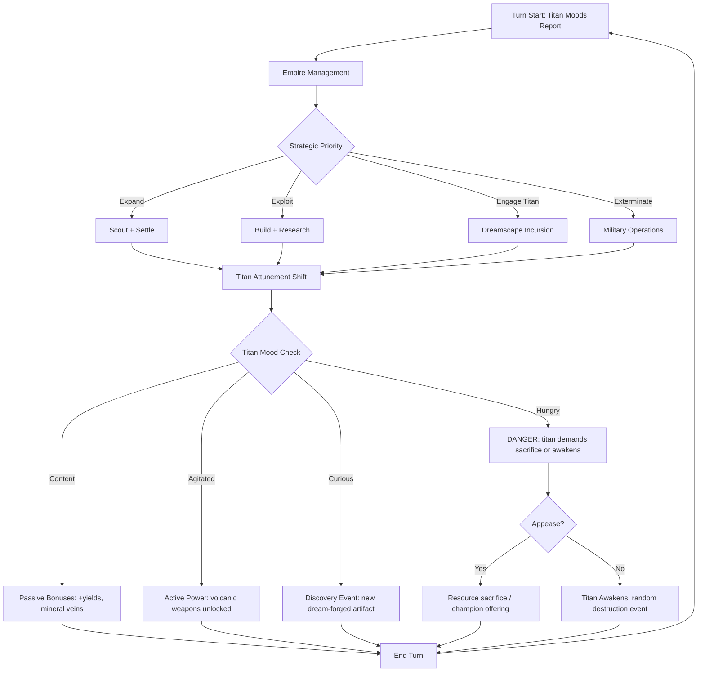
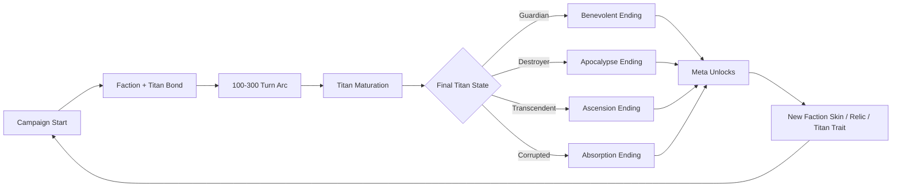

# Mantle of the Titan

## Title & Genre

| Field | Value |
|-------|-------|
| **Title** | Mantle of the Titan |
| **Genre** | 4X Grand Strategy / Kaiju Cultivation |
| **Engine** | Unity 6 (URP, DOTS for late-game entity counts) |
| **Platform** | PC (Steam), iPad (M1+ for map fidelity) |
| **Monetization** | Premium $39.99 base + faction DLC ($12.99 each) |
| **Rating** | ESRB E10+ (Fantasy Violence, Mild Suggestive Themes) / PEGI 12 / CERO B |

**Comparable titles:** Civilization VI, Endless Legend, Age of Wonders 4, Old World

---

## Vision Statement

Mantle of the Titan is a turn-based 4X grand strategy game where the player leads a civilization bonded to a juvenile titan -- a creature of living stone and magma the size of a mountain range that slumbers beneath their capital. Every strategic decision feeds or starves this symbiotic relationship. Wage war and the titan stirs aggressive, granting volcanic superweapons but risking a catastrophic awakening. Pursue peace and the titan dreams deeper, enriching soil and spawning mineral veins but leaving borders undefended. The game is about raising a god you cannot fully control, and discovering whether it becomes your civilization's guardian or its destroyer.

The central tension is that the titan is not a tool -- it is a character with emergent personality shaped by hundreds of turns of player decisions. Two campaigns with the same starting faction produce fundamentally different stories because the titan's personality crystallizes differently each time. The endgame is not a scoreboard screen; it is a narrative confrontation with the being you raised.

---

## Core Loop

**Target session length:** 60--120 minutes (20--40 turns)



### Core Loop Breakdown

| Step | Player Action | System Response | Skill Expression |
|------|--------------|----------------|-----------------|
| 1. Titan Report | Review geological events from last turn (tremors, springs, gem formations) | System translates titan mood into actionable intel -- tremors = agitation, hot springs = contentment, gems = curiosity | Pattern recognition across multiple signals |
| 2. Empire Management | Assign citizens to tiles, queue buildings, set research, manage diplomacy | Standard 4X outputs modified by titan attunement multipliers | Optimization under constraints |
| 3. Strategic Choice | Choose expansion / economy / military / titan interaction | Each choice shifts titan mood along 2 axes: Aggression-Peace and Stimulation-Neglect | Long-term consequence evaluation |
| 4. Dreamscape Incursion | Send champion into procedural titan dream-realm (roguelike tactical map) | Combat nightmares, retrieve dream-forged artifacts, stabilize titan rest | Tactical combat + risk management |
| 5. Titan Response | System resolves titan mood state into empire effects | Bonuses or penalties cascade across all systems | Adaptive strategy -- pivot based on titan state |
| 6. Crisis Check | If titan hits extreme mood, forced event triggers | Volcanic eruption, seismic gift, titan demand, or awakening | Crisis management under pressure |

---

## Meta Loop

### Campaign-to-Campaign Progression



### Progression Axes

| Axis | What Grows | How It Feels | Cap |
|------|-----------|-------------|-----|
| **Titan Personality** | 5 personality axes crystallize over 150+ turns based on player choices | The titan becomes a distinct character -- wrathful, contemplative, curious, dormant, or nurturing | Personality locks at Turn 200 (Era III) |
| **Empire Power** | Territory, population, military, technology, economy | Standard 4X power curve with titan attunement multipliers that can double or halve growth rates | 6 eras, ~300 turns max |
| **Dreamscape Mastery** | Champion power, dream-forged artifact collection, nightmare codex | Roguelike runs get deeper and more rewarding as champions level and artifacts stack | 12 nightmare archetypes, 48 unique artifacts |
| **Diplomatic Web** | Relations with 5 rival titan civilizations, each with their own titan patron | Late-game titan-vs-titan negotiations or wars reshape the entire continent | Alliance to total war spectrum |
| **Narrative Legacy** | Meta-unlocks persist across campaigns (new titan traits, faction cosmetics, starting relics) | Each campaign feeds the next -- you are building a mythos, not just winning a match | 40+ meta-unlocks |

---

## Game Mechanics

### Primary Mechanic: Titan Attunement

The titan's mood is tracked across 5 axes, each ranging from -100 to +100. Every player action shifts one or more axes. The axes are:

| Axis | Negative Pole (-100) | Positive Pole (+100) | Key Driver |
|------|---------------------|---------------------|------------|
| **Ferocity** | Dormant / Passive | Wrathful / Aggressive | Military actions, war declarations, aggression |
| **Lucidity** | Dreaming / Unaware | Awake / Aware | Dreamscape incursions, research, cultural actions |
| **Affinity** | Hostile / Distrusting | Bonded / Trusting | Sacrifices, champion quality, titan-focused buildings |
| **Curiosity** | Isolated / Withdrawn | Exploratory / Creative | Scouting, new territory, diverse building types |
| **Hunger** | Sated / Satisfied | Ravenous / Demanding | Resource extraction speed, volcanic weapon overuse |

**Mood Interaction Matrix:** Axes combine to produce titan behaviors:

```text
Ferocity + Lucidity  = Strategic Wrath (targeted volcanic strikes on enemy armies)
Ferocity - Lucidity  = Blind Rage (random eruptions near own borders)
Affinity + Curiosity = Gift Events (volcanic glass deposits, hot spring bonuses)
Affinity - Curiosity = Demanding (requires champion sacrifice or loses trust)
Hunger + Ferocity    = Devastation Event (titan consumes a city district)
Hunger - Ferocity    = Dormancy (titan withdraws all bonuses for 10 turns)
```

### Secondary Mechanic: Dreamscape Incursions

Dreamscape incursions are tactical roguelike runs inside the titan's sleeping mind. The player sends a champion (military unit promoted through combat or ritual) into a procedurally generated map representing a region of the titan's psyche.

**Dreamscape Structure:**
- Map size: 15x15 grid with terrain types (Magma Rivers, Obsidian Forests, Memory Echoes, Nightmare Lairs)
- Duration: 8--12 turns per incursion (separate from main campaign turn)
- Party: 1 champion + up to 3 retainer units
- Enemies: Nightmares spawned from titan stress (war nightmares from Ferocity, fear nightmares from low Affinity, confusion nightmares from low Lucidity)
- Reward: 1 dream-forged artifact + titan mood stabilization + champion XP
- Risk: Champion death is permanent. Retainer death is permanent. Failed incursions destabilize the titan.

**Dream-Forged Artifact Examples:**

| Artifact | Source | Empire Effect |
|----------|--------|---------------|
| Mantle of Obsidian | Defeat War Nightmare | +20% city defense, buildings take 50% less siege damage |
| Tear of the Dreamer | Defeat Fear Nightmare | +1 happiness per city, -10% titan Ferocity per turn |
| Heartspark Ember | Clear Magma River region | All forges produce +2 production, volcanic weapons cost -1 cast |
| Memory Echo Shard | Discover Memory Echo tile | Reveals 3 random techs from 1 era ahead |
| Seismic Tuning Fork | Defeat Confusion Nightmare | Titan mood shifts are 25% more predictable (reduced variance) |

### Tertiary Mechanic: Volcanic Warfare

Military operations enhanced by titan power. The player spends Titan Attunement points (accumulated through Ferocity actions) to trigger volcanic effects on the strategic map.

| Ability | Attunement Cost | Effect | Titan Impact |
|---------|----------------|--------|-------------|
| Lava River | 15 | Creates impassable lava tile for 10 turns | +10 Ferocity, +5 Hunger |
| Mountain Wall | 20 | Raises impassable mountain tile (permanent) | +15 Ferocity, +10 Hunger |
| Eruption | 30 | Destroys all units in 3-tile radius, damages city | +25 Ferocity, +20 Hunger |
| Superheat Forge | 10 | +50% military production for 5 turns | +5 Ferocity, +5 Hunger |
| Obsidian Arms | 12 | All units gain +2 combat strength for 8 turns | +8 Ferocity, +5 Hunger |
| Geothermal Surge | 18 | Doubles tile yields in 5-tile radius for 5 turns | +5 Ferocity, +10 Curiosity |

**Overuse Punishment:** If Hunger exceeds +75, the titan enters a Devastation Event -- it randomly destroys 1 district in the nearest city and enters Dormancy for 15 turns (all titan bonuses suspended). This is the core tension: volcanic warfare is extremely powerful but every use pushes toward self-destruction.

### Quaternary Mechanic: Rival Titan Cultures

The game features 5 rival civilizations, each bonded to a different titan patron. Rival titans have their own personality axes, maturation pace, and relationship with their host civilization.

| Faction | Titan Type | Titan Personality Bias | Military Style | Economic Bias |
|---------|-----------|----------------------|---------------|---------------|
| **Ashborne Compact** | Magma Titan (player faction) | Shaped by player | Balanced, enhanced by volcanic abilities | Mining + geothermal |
| **Frostwarden Realm** | Glacial Titan | High Lucidity, low Ferocity | Defensive, ice walls, freeze-based control | Fishing + trade routes |
| **Verdant Concord** | World-Tree Colossus | High Curiosity, high Affinity | Biological units, regeneration, overgrowth | Agriculture + crafting |
| **Stormherald Dominion** | Thunder Titan | High Ferocity, low Affinity | Fast cavalry, lightning strikes, mobility | Herding + raiding |
| **Depths Maw** | Abyssal Leviathan | High Hunger, low Lucidity | Naval dominance, coastal raids, mind-control units | Deep sea mining + sacrifice economy |
| **Hollow King Remnant** | Undead Titan (dormant) | All axes near 0 -- unpredictable | Necrotic units, attrition warfare | Ruin scavenging + soul binding |

**Titan-vs-Titan Endgame:** When two or more titans reach maturation (Era III+), they begin interacting on the strategic map. Titan-vs-titan confrontations are large-scale events that reshape terrain permanently -- a battle between a Magma Titan and a Glacial Titan creates a new volcanic mountain range and freezes adjacent rivers. These events are the climax of every campaign.

---

## Art Direction

### Visual Style

**Illustrated low-poly with volumetric atmosphere.** Think Civilization VI's hand-painted warmth crossed with Endless Legend's surreal biome diversity. The titan is never fully visible -- only its effects are seen (volcanic glow beneath terrain, shifting mountain silhouettes, heat shimmer over cities). This maintains mystery and keeps GPU costs manageable.

**Color Palette per Faction:**

| Faction | Primary | Secondary | Accent | Biome Tint |
|---------|---------|-----------|--------|------------|
| Ashborne Compact | Charcoal #2D2D2D | Magma Orange #E8530E | Obsidian Blue #1A2744 | Warm volcanic ash |
| Frostwarden Realm | Ice White #E8F0F8 | Glacier Teal #3A8C91 | Frostbite Purple #5C4A72 | Cool blue-white |
| Verdant Concord | Moss Green #4A6741 | Bark Brown #6B4423 | Blossom Pink #D4878F | Lush green-gold |
| Stormherald Dominion | Slate Gray #5A5E6B | Lightning Yellow #F2D94B | Storm Violet #7B5EA7 | Overcast amber |
| Depths Maw | Abyssal Blue #0A1628 | Bioluminescent Teal #00E5CC | Blood Red #8B1A1A | Dark deep-sea |
| Hollow King Remnant | Bone White #D4C8A8 | Void Purple #2A1040 | Spectral Green #39FF14 | Desaturated ruin |

### Camera & Presentation

- **Strategic view:** Top-down isometric, zoom from continent scale to city district scale
- **Dreamscape view:** Isometric tactical camera, tighter zoom, dynamic lighting (magma glow, nightmare pulse)
- **Titan event camera:** Cinematic pull-back when titan events trigger (eruptions, gifts, maturation)
- **UI:** Minimalist framed panels, parchment-texture info cards, geological survey aesthetic

### Key Visual Targets

- Titan effects are always environmental, never character-model -- volcanic fissures glow beneath city tiles, hot springs emit particle steam, mountain silhouettes shift between turns
- Dreamscape uses the same faction palette but saturated 200% -- everything is more vivid, more surreal
- Rival titan territories have visible terraforming -- frost spreading from Frostwarden borders, overgrowth encroaching from Verdant borders

---

## Monetization

### Revenue Model

| Stream | Price | Content | Timing |
|--------|-------|---------|--------|
| Base Game | $39.99 | Ashborne Compact (full campaign), Frostwarden Realm (AI opponent), 6 eras, dreamscape system, 4 endings | Launch |
| Frostwarden Realm DLC | $12.99 | Playable Frostwarden Realm faction, Glacial Titan attunement, 12 ice-themed dream-forged artifacts, frost terraforming | Month 3 |
| Verdant Concord DLC | $12.99 | Playable Verdant Concord faction, World-Tree attunement, biological warfare mechanics | Month 5 |
| Stormherald Dominion DLC | $12.99 | Playable Stormherald faction, Thunder Titan, mobility-focused military, raiding economy | Month 8 |
| Depths Maw DLC | $12.99 | Playable Depths Maw faction, Abyssal Leviathan, naval overhaul, sacrifice economy | Month 11 |
| Hollow King Remnant DLC | $12.99 | Playable Hollow King, dormant Undead Titan, necrotic mechanics, soul economy | Month 14 |
| Original Soundtrack | $9.99 | 2-hour orchestral + geological sound design album | Launch |

**Total addressable revenue per player:** $39.99 (base) + $64.95 (all DLC) = $104.94

### DLC Design Principles

1. Each DLC faction is fully playable with unique titan attunement, military, economy, and dreamscape aesthetics
2. DLC factions are balanced against base game -- no pay-to-win in multiplayer
3. AI uses all factions regardless of ownership -- players encounter DLC titans even without purchasing
4. No microtransactions, no season pass, no battle pass, no energy systems

### Why This Model Works for Target Personas

| Persona | Alignment |
|---------|-----------|
| Eleanor Vance (P-006, Retired Strategist) | Premium model with no gambling mechanics, fixed $10/month budget maps to staggered DLC purchases |
| Hiroshi Tanaka (P-003, RPG Achiever) | Achievement system with 100% completion possible per faction, each DLC adds ~80 new achievements |
| David Park (P-008, Completionist) | Fair, achievable achievements, DLC adds predictable new sets, no time-limited FOMO |
| Liam O'Connor (P-009, Budget F2P) | Base game has full campaign depth, DLC is optional (encounters DLC factions as AI), skill-based mastery matters over spending |

---

## Player Retention

### Session Design

| Session Type | Duration | Frequency | Hook |
|-------------|----------|-----------|------|
| Quick Session | 30 min (8--10 turns) | Daily | Titan mood report creates urgency to respond |
| Standard Session | 60 min (20--25 turns) | 3--4x/week | One era transition or one dreamscape incursion + empire management |
| Deep Session | 2+ hours (40+ turns) | Weekend | Full era arc, diplomacy pivot, titan maturation event |
| Dreamscape Run | 20 min (standalone) | As needed | Roguelike tactical break from strategic layer |

### Retention Mechanisms

**Per-Session:**
- Titan mood report at turn start creates a "what will it do this turn?" anticipation loop
- Geological events (tremors, springs, gems) provide narrative texture every turn
- Dreamscape incursions offer tactical variety within strategic pacing

**Per-Campaign:**
- Titan personality crystallization creates a unique narrative arc per playthrough
- 4 distinct endings tied to titan state (Guardian / Destroyer / Transcendent / Corrupted)
- Rival titan interactions create emergent diplomatic/military storylines
- "Iron Crown" mode: permadeath, no save-scumming, decisions are final -- for players who want consequences

**Cross-Campaign:**
- 40+ meta-unlocks: new titan starting traits, faction cosmetics, starting relics, UI themes
- Each ending unlocks unique starting conditions for next campaign
- Nightmare Codex completion across campaigns (fill in lore about each nightmare type)
- Titan Personality Archive: review personality crystallization across all past campaigns

### Engagement Metrics (Targets)

| Metric | Target | Rationale |
|--------|--------|-----------|
| D1 Retention | 85% | Premium buyers are committed; tutorial is strong |
| D7 Retention | 65% | First era transition by day 3, titan personality visible by day 5 |
| D30 Retention | 40% | Campaign completion for fast players, mid-campaign for methodical players |
| Average Campaigns per Player | 3.2 | Meta-unlocks drive replays; different titan personalities create different stories |
| DLC Attach Rate | 35% | Players who complete 2+ campaigns are prime DLC targets |
| Steam Review Score | 85%+ Positive | Premium quality, no predatory monetization |

---

## Technical Architecture

### Engine & Rendering

| Component | Technology | Rationale |
|-----------|-----------|-----------|
| Game Engine | Unity 6 (URP) | Cross-platform (PC + iPad), proven 4X tooling, C# productivity |
| Entity System | DOTS (Entities 1.0) | Late-game map has 10,000+ tiles with titan terraforming updates per turn |
| AI | Custom utility AI + behavior trees | 5 rival civs with titan personality-driven decision making |
| Networking | None at launch (single-player only) | Focus on single-player depth; asynchronous multiplayer consideration for Year 2 |
| Save System | JSON + binary hybrid | JSON for moddability, binary for dreamscape procedural state |

### Performance Budgets

| Metric | Target | Hardware Tier |
|--------|--------|---------------|
| Turn resolution (late game) | < 3 seconds | Minimum spec |
| Dreamscape load time | < 5 seconds | Minimum spec |
| Map zoom (continent to city) | 60fps | Recommended spec |
| Titan event sequence | 30fps minimum | Minimum spec |
| Memory (late game) | < 6 GB | Minimum spec |
| Memory (late game) | < 10 GB | Recommended spec |

### Platform Specifications

| Requirement | Minimum | Recommended |
|-------------|---------|-------------|
| OS | Windows 10 64-bit | Windows 11 64-bit |
| Processor | Intel i5-8400 / AMD Ryzen 5 2600 | Intel i7-10700 / AMD Ryzen 7 3700X |
| Memory | 8 GB RAM | 16 GB RAM |
| Graphics | NVIDIA GTX 970 / AMD RX 570 | NVIDIA RTX 2060 / AMD RX 5700 |
| Storage | 12 GB | 12 GB SSD |
| iPad | M1 iPad or later (Air 5th gen, Pro 11" 3rd gen+) | M2+ for full titan event fidelity |

### AI Architecture

Each rival civilization runs a dual AI system:

1. **Strategic AI** (utility-based): Evaluates all possible actions each turn, scores them against faction personality + titan state, selects highest-utility actions. Runs once per turn per faction.
2. **Titan AI** (state machine): Each rival titan has a simplified version of the player's attunement system. The rival AI's choices shift its own titan's mood, creating emergent rival titan behaviors (a Frostwarden AI that goes to war gets a more ferocious Glacial Titan, which then pressures it to make different strategic choices).

---

## Accessibility

### Core Accessibility Features

| Feature | Implementation | Standard |
|---------|---------------|----------|
| Colorblind modes | 3 presets (Protanopia, Deuteranopia, Tritanopia) + custom palette editor | WCAG 2.1 AA |
| Text scaling | UI scales 80%--150%, all text renders via TextMeshPro for crisp scaling | WCAG 2.1 AA (4.5:1 contrast) |
| Screen reader | All UI elements tagged with AccessibilityNode, dreamscape tiles have audio cues | UAAG 2.0 |
| Keyboard-only play | Full keyboard navigation for all menus, strategic map, and dreamscape | XAAG |
| Turn timer override | No timed elements in single-player; multiplayer timer configurable 30s--10min | Custom |
| Difficulty presets | 5 levels: Story / Standard / Challenging / Brutal / Iron Crown | Custom |
| Auto-resolve | All dreamscape incursions can be auto-resolved with risk calculation display | Custom |
| Tutorial system | 12-chapter interactive tutorial, each chapter teaches 1 core system, skippable individually | Custom |

### Accessibility for Target Personas

| Persona | Need | Feature |
|---------|------|---------|
| Eleanor Vance (P-006) | Large text on budget device | Text scaling + performance mode for lower-spec hardware |
| Samuel Okafor (P-019, Low Bandwidth) | Offline play | Full single-player offline, no always-online requirement |
| Yuki Sato (P-020, Non-Native English) | Localization | Full Japanese localization at launch (alongside EN, FR, DE, ES, PT-BR, ZH, KO) |
| Rachel Green (P-018, Vision Impaired) | Screen reader support | AccessibilityNode tagging + audio terrain cues in dreamscape |

---

## Level Design

### Strategic Map Structure

The game generates a continental map with 6 distinct biome regions, each aligned with a faction's titan type:

```text
+------------------------------------------------------------------+
|                                                                    |
|   [FROST PEAKS]          [ASHBORN HEARTLAND]        [STORM RIDGE] |
|   Glacial Titan Zone     Magma Titan Zone           Thunder Zone  |
|   Ice rivers, frozen     Volcanic soil, hot         Lightning     |
|   lakes, aurora skies    springs, obsidian caves     spires, wind  |
|                                                                    |
|                                                                    |
|   [DEEP ABYSS]           [VERDANT CANOPY]           [HOLLOW WASTE] |
|   Leviathan Zone         World-Tree Zone             Undead Zone   |
|   Coastal trenches,      Giant forests, root         Bone fields,  |
|   bioluminescent reefs   networks, fungal gardens    spectral fog  |
|                                                                    |
+------------------------------------------------------------------+
```

**Map Parameters:**
- Total tiles: 80x50 (4,000 tiles on Standard map)
- Tile types: 18 terrain types (grassland, forest, mountain, volcano, glacier, deep ocean, shallow ocean, reef, swamp, desert, tundra, ruins, lava field, crystal cavern, fungal grove, root network, storm wall, abyssal trench)
- Map sizes: Small (60x40, 3 rivals), Standard (80x50, 4 rivals), Large (100x60, 5 rivals), Continental (120x70, 5 rivals + extended endgame)

### Era Progression

Each campaign advances through 6 eras. Era transitions are triggered by combined research + titan attunement thresholds.

| Era | Name | Turns (approx.) | Titan State | Key Unlocks |
|-----|------|-----------------|-------------|-------------|
| I | **Awakening** | 1--30 | Titan is semi-dormant; faint geological signals only | Basic economy, scouts, first titan attunement readings |
| II | **Communion** | 31--75 | Titan begins responding to player actions; first personality shifts | Dreamscape access, volcanic warfare basics, diplomacy |
| III | **Crystallization** | 76--150 | Titan personality locks; the titan is now a distinct character | Advanced volcanic warfare, titan-vs-titan awareness, advanced dreamscape |
| IV | **Maturation** | 151--225 | Titan reaches full power; rival titans also maturing | Titan-vs-titan events, continental terraforming, endgame paths visible |
| V | **Convergence** | 226--275 | All titans interacting; continent reshapes in real-time | Victory condition pursuit, titan alignment determines ending path |
| VI | **Apotheosis** | 276--300 | Final act: titan's relationship with civilization resolves | Ending sequence based on titan personality + player choices |

### Dreamscape Level Design

Each dreamscape incursion generates a 15x15 tactical map from tile pools influenced by titan mood:

| Titan State | Dominant Tile | Nightmare Type | Environmental Hazard |
|-------------|--------------|----------------|---------------------|
| High Ferocity | Magma Rivers | War Nightmare (heavy melee) | Eruptions every 3 turns in random tiles |
| Low Ferocity | Obsidian Forests | Sloth Nightmare (slow but tanky) | Healing zones for enemies |
| High Lucidity | Crystal Labyrinths | Logic Nightmare (adapts to player tactics) | Maze shifts every 4 turns |
| Low Lucidity | Fog of Forgetfulness | Confusion Nightmare (stealth + ambush) | Vision reduced to 2 tiles |
| High Hunger | Flesh Gardens | Gluttony Nightmare (consumes retainer units) | Titan devours 1 retainer per 5 turns |
| High Affinity | Memory Palaces | Guarded Treasures (minimal combat, maximum loot) | None -- reward for good relationship |

---

## Audio Design

### Musical Score

**Style:** Orchestral with geological sound design integration. Strings and brass carry faction themes. Percussion is sourced from real geological recordings (volcanic rumbles, ice cracking, thunder, deep ocean pressure). The titan has no theme -- it has a frequency that modulates all other music based on its mood state.

**Faction Themes:**

| Faction | Instrument Lead | Tempo | Key | Mood |
|---------|----------------|-------|-----|------|
| Ashborne Compact | Cello + volcanic bass | Moderate, building | D minor | Determined, grounded, precarious |
| Frostwarden Realm | Clarinet + ice chimes | Slow, crystalline | Bb major | Serene, vast, melancholic |
| Verdant Concord | Harp + woodwind ensemble | Flowing, organic | G major | Alive, growing, interconnected |
| Stormherald Dominion | Brass + thunder percussion | Driving, aggressive | E minor | Urgent, kinetic, untamed |
| Depths Maw | Double bass + whale song synth | Slow, deep, pulsing | C minor | Unknowable, ancient, hungry |
| Hollow King Remnant | Music box + silence | Sparse, haunting | A minor | Empty, forgotten, wrong |

### Sound Design

| Element | Approach | Detail |
|---------|----------|--------|
| Titan mood audio | Real-time geological sound synthesis | Low-frequency rumbles shift pitch with Ferocity, crystal harmonics scale with Curiosity, silence deepens with Dormancy |
| Dreamscape ambience | Surreal spatial audio | Magma tile = bass pulse, Crystal tile = high chime, Fog tile = muffled white noise |
| Volcanic warfare | Layered explosion + geological shift | Each volcanic ability has unique sound: Eruption = 3-layer blast (initial crack + magma rush + settling), Mountain Wall = tectonic groan + slam |
| UI feedback | Parchment + stone | Click = stone tap, notification = geological chime, titan event = deep resonance |
| Victory/Defeat | Full orchestral + titan frequency | Victory integrates titan's crystallized personality into the orchestral resolution; defeat has the titan frequency destabilizing |

---

## Production Plan

### Team & Timeline

| Phase | Duration | Team Size | Deliverable |
|-------|----------|-----------|-------------|
| Pre-Production | Months 1--3 | 8 people | Vertical slice (Era I--II, Ashborne faction, dreamscape prototype) |
| Production Alpha | Months 4--12 | 22 people | All systems functional, Ashborne campaign playable end-to-end |
| Production Beta | Months 13--18 | 22 people | All factions implemented, balance pass, art final |
| Polish + QA | Months 19--22 | 18 people | Bug fix, performance optimization, localization |
| Launch | Month 23 | 18 people | PC (Steam) + iPad simultaneous launch |
| DLC 1 (Frostwarden) | Month 26 | 12 people | First playable faction DLC |

### Team Composition (Production)

| Role | Count | Responsibility |
|------|-------|---------------|
| Game Director | 1 | Vision, titan attunement tuning, playtest direction |
| Systems Designers | 3 | 4X economy, AI, dreamscape combat, titan attunement math |
| Level Designer | 1 | Map generation algorithms, dreamscape procedural rules |
| Programmers | 5 | Unity DOTS, AI, UI, save system, dreamscape renderer |
| 2D Artists | 3 | UI, faction art, dreamscape tile art, promotional |
| 3D Artists | 2 | Strategic map buildings, unit models, titan effect VFX |
| VFX / Technical Artist | 1 | Geological effects, dreamscape shaders, titan visual system |
| Composer | 1 | Orchestral score + geological sound design |
| Sound Designer | 1 | SFX, spatial audio, titan mood synthesis |
| Producer | 1 | Schedule, scope management, QA coordination |
| QA | 2 | Balance testing, regression, accessibility testing |
| Writer | 1 | Lore, faction narratives, titan personality text, ending scripts |
| **Total** | **22** | |

### Budget Estimate (22-person team, 23-month timeline)

| Category | Cost | Notes |
|----------|------|-------|
| Salaries (22 people avg $7,500/mo x 23 months) | $3,802,500 | Mixed seniority, remote-first |
| Unity Pro licenses (22 seats x 23 months) | $55,200 | $220/mo per seat |
| Infrastructure (build servers, CI/CD, asset storage) | $34,500 | ~$1,500/month |
| Music production (orchestral recording session) | $80,000 | 2-hour score, 50-piece orchestra, 3-day session |
| Voice acting (narrator + tutorial) | $25,000 | Single narrator, ~4 hours of dialogue |
| QA outsourcing (final 4 months) | $60,000 | External QA firm for platform compliance |
| Localization (8 languages) | $120,000 | Full text + UI adaptation |
| Marketing (Steam, press, influencer) | $300,000 | Pre-launch awareness, launch window |
| Contingency (15%) | $676,215 | Industry standard buffer |
| **Total** | **$5,153,415** | |

### Break-Even Analysis

| Metric | Value | Calculation |
|--------|-------|-------------|
| Development cost | $5,153,415 | Total budget above |
| Steam revenue share (after 30% cut) | $27.99 per unit | $39.99 - $12.00 (30%) |
| Break-even units (base game only) | 184,163 units | $5,153,415 / $27.99 |
| Year 1 revenue target (base game) | $4,198,500 | 150,000 units x $27.99 |
| Year 1 DLC revenue (35% attach, avg 2 DLC) | $1,258,545 | 52,500 players x 2 x $11.94 (after Steam cut) |
| **Year 1 total revenue target** | **$5,457,045** | Base + DLC |
| **Year 1 profit target** | **$303,630** | Revenue - cost |

### Milestone Deliverables

| Milestone | Month | Acceptance Criteria |
|-----------|-------|-------------------|
| M1: Vertical Slice | 3 | Playable Era I-II, titan mood visible, 1 dreamscape run, map generation |
| M2: Systems Alpha | 8 | All 6 eras traversable, all 6 titan attunement axes functional, AI makes decisions |
| M3: Content Alpha | 12 | Full Ashborne campaign playable end-to-end, 4 endings reachable |
| M4: Feature Complete | 16 | All factions as AI opponents, all systems integrated, dreamscape fully procedural |
| M5: Beta / Balance | 18 | All content in-game, balance pass complete, performance targets met on min spec |
| M6: Release Candidate | 21 | Zero P0/P1 bugs, localization complete, all platforms certified |
| M7: Launch | 23 | Steam + iPad launch, day-1 patch ready |
| M8: DLC 1 Ship | 26 | Frostwarden Realm playable faction DLC |

---

## User Stories

### US-001: Titan Mood Reading
**As** a player starting my turn, **I want** to see a geological event report that tells me my titan's current mood, **so that** I can make informed strategic decisions this turn.

**Acceptance Criteria:**
- GIVEN a new turn has started
- WHEN the turn begins
- THEN the system displays 1--3 geological events from the titan's current mood state
- AND each event maps to a specific titan axis shift (tremor = +Ferocity, hot spring = +Affinity, gem formation = +Curiosity)
- AND the titan mood panel updates to reflect current axis values

### US-002: Dreamscape Incursion Launch
**As** a player with an available champion, **I want** to send that champion into the titan's dreamscape, **so that** I can combat nightmares and retrieve dream-forged artifacts.

**Acceptance Criteria:**
- GIVEN the player has at least 1 champion unit available
- AND the titan's Lucidity axis is between -50 and +50 (not extreme)
- WHEN the player selects "Enter Dreamscape" from the champion action menu
- THEN a procedural 15x15 tactical map generates based on current titan mood
- AND the champion + up to 3 retainers deploy at the map entrance
- AND the incursion runs for 8--12 tactical turns
- AND upon completion, 1 dream-forged artifact is awarded and titan mood stabilizes by 10 points toward 0 on all axes

### US-003: Volcanic Warfare Activation
**As** a player in military conflict, **I want** to trigger a volcanic ability using titan attunement points, **so that** I can gain a decisive battlefield advantage.

**Acceptance Criteria:**
- GIVEN the player is in a military engagement or viewing the strategic map
- AND the player has sufficient Attunement points for the selected ability
- WHEN the player activates a volcanic ability (Lava River, Mountain Wall, Eruption, etc.)
- THEN the ability effect resolves on the target tiles
- AND the titan's Ferocity increases by the ability's Ferocity cost
- AND the titan's Hunger increases by the ability's Hunger cost
- AND if Hunger exceeds +75, a Devastation Event warning triggers

### US-004: Titan Maturation Event
**As** a player entering Era III, **I want** to see my titan's personality crystallize, **so that** I understand what kind of being I have raised and how it will behave in the endgame.

**Acceptance Criteria:**
- GIVEN the campaign reaches the Era III threshold (Turn 76+)
- AND the player has completed the Era III research + attunement requirements
- WHEN the era transition triggers
- THEN the system locks the titan's personality axes into their current state (+/- 10% drift still possible)
- AND a narrative event plays describing the titan's crystallized personality
- AND the titan's locked personality determines which of 4 endgame paths are available
- AND the player cannot reverse the crystallization (Iron Crown mode) or can still shift slowly (Standard mode)

### US-005: Rival Titan Encounter
**As** a player whose borders neighbor a rival titan civilization, **I want** to see visual evidence of the rival titan's influence on the terrain, **so that** I can anticipate its military and economic capabilities.

**Acceptance Criteria:**
- GIVEN the player's territory is within 5 tiles of a rival civilization's territory
- AND the rival civilization's titan has reached maturation (Era III+)
- WHEN the player views the strategic map
- THEN terrain tiles near the rival border display terraforming effects (frost spread, overgrowth, lightning scars, etc.)
- AND the rival titan's dominant personality axis determines which terraforming effect is visible
- AND the terraforming provides the rival faction with the same type of bonuses the player's titan provides

### US-006: Titan-vs-Titan Confrontation
**As** a player in Era IV or later, **I want** to initiate or respond to a titan-vs-titan confrontation, **so that** I can resolve the campaign's central conflict through the beings I have raised.

**Acceptance Criteria:**
- GIVEN two or more titans have reached maturation
- AND the player declares a "Titan Confrontation" diplomatic action (or an AI rival does)
- WHEN the confrontation begins
- THEN a 3-turn sequence plays out where both titans reshape terrain on the strategic map
- AND each titan uses abilities aligned with its crystallized personality
- AND the confrontation outcome is determined by: titan power level, axis alignment, player military support, and dreamscape artifact bonuses
- AND the losing titan is wounded (enters Dormancy for 30 turns) or destroyed (permanent elimination)
- AND terrain changes from the confrontation are permanent for the rest of the campaign

### US-007: Campaign Ending Resolution
**As** a player completing the final era, **I want** to experience an ending that reflects the relationship I built with my titan over 300 turns, **so that** the campaign feels like a complete narrative arc.

**Acceptance Criteria:**
- GIVEN the campaign reaches the victory condition (military conquest, cultural dominance, titan ascension, or titan destruction)
- WHEN the endgame sequence triggers
- THEN the system evaluates the titan's crystallized personality across all 5 axes
- AND the dominant axis combination determines which of 4 endings plays:
  - **Guardian** (high Affinity, low Hunger): Titan becomes eternal protector
  - **Destroyer** (high Ferocity, high Hunger): Titan turns on civilization
  - **Transcendent** (high Lucidity, high Curiosity): Titan and civilization merge
  - **Corrupted** (low Affinity, high Hunger): Titan consumes civilization and goes dormant
- AND the ending cinematic reflects specific player choices (wars declared, sacrifices made, dreamscape artifacts used)
- AND meta-unlocks are awarded based on ending type

### US-008: Iron Crown Mode
**As** a veteran player seeking maximum consequence, **I want** to enable Iron Crown mode at campaign start, **so that** every decision is permanent and the titan's personality is harder to influence.

**Acceptance Criteria:**
- GIVEN the player selects Iron Crown mode during campaign setup
- WHEN the campaign begins
- THEN manual saves are disabled (auto-save only on turn resolution)
- AND the player cannot reload previous turns
- AND titan personality axis drift is reduced by 50% (choices matter more)
- AND champion death in dreamscape incursions is permanent with no revival
- AND completing Iron Crown mode awards exclusive meta-unlocks

### US-009: Auto-Resolve Dreamscape
**As** a player focused on the strategic layer, **I want** to auto-resolve dreamscape incursions, **so that** I can get the rewards without playing the tactical layer.

**Acceptance Criteria:**
- GIVEN the player has launched a dreamscape incursion
- WHEN the player selects "Auto-Resolve"
- THEN the system calculates victory probability based on champion level, retainer count, titan mood, and nightmare difficulty
- AND displays the probability as a percentage (e.g., "73% chance of success")
- AND the player confirms or cancels
- AND upon confirmation, the system resolves the incursion deterministically using the probability
- AND losses (if any) are applied -- champion death is permanent even in auto-resolve

### US-010: Diplomatic Titan Exchange
**As** a player negotiating with a rival titan civilization, **I want** to propose titan attunement exchanges (e.g., my volcanic heat for your glacial stability), **so that** both titans benefit and diplomatic relations improve.

**Acceptance Criteria:**
- GIVEN the player has established diplomatic relations with a rival civilization
- AND both civilizations have titans at Era II or later
- WHEN the player proposes a "Titan Exchange" treaty
- THEN the system calculates compatibility between the two titans' axis states
- AND opposing axes (high Ferocity + low Ferocity) produce the strongest bonuses
- AND the rival AI evaluates the proposal based on its own titan's needs
- AND if accepted, both civilizations receive a shared bonus for 20 turns
- AND both titans' moods shift toward each other's axis states (convergence effect)

---

## Quality Assurance

### Test Plan Overview

| Test Category | Coverage Target | Automation | Manual |
|--------------|----------------|------------|--------|
| Titan Attunement Math | 100% axis calculation paths | Unit tests (C# NUnit) | Balance verification |
| Dreamscape Generation | 500+ procedural maps per seed | Seed-based regression tests | Visual inspection |
| AI Decision Making | 10,000+ simulated turns per faction | AI tournament (AI vs AI) | Behavioral review |
| Save/Load Integrity | All game states across all eras | Automated save/load roundtrip | Corrupted save recovery |
| Performance | Late-game (Era VI, 5 rivals, 10,000+ tiles) | Profiling automation | Frame time monitoring |
| Accessibility | WCAG 2.1 AA compliance for all features | Axe-core for UI | Screen reader testing |
| Localization | 8 languages, all text + UI fitting | String length checks | Native speaker review |
| Balance | All 4 endings achievable for all factions | Monte Carlo simulation | Expert player feedback |

### Critical Path Tests

| Test ID | Description | Pass Criteria |
|---------|-------------|---------------|
| CP-001 | Full campaign completion (Ashborne, Standard difficulty, all 4 endings) | No crashes, all eras reachable, all endings trigger correctly |
| CP-002 | Titan personality crystallization accuracy | Axis values at Era III lock match expected values within 5% tolerance |
| CP-003 | Dreamscape incursion completion (all 6 nightmare types) | All nightmare types spawn, all artifacts awarded, all hazards function |
| CP-004 | Volcanic warfare Devastation Event chain | Hunger threshold triggers warning at +75, event triggers at +100, Dormancy applies correctly |
| CP-005 | Titan-vs-Titan confrontation (all faction pairings, 15 combinations) | All pairings produce unique terrain changes, outcomes determined by correct axis math |
| CP-006 | Iron Crown mode no-save verification | No manual save option visible, auto-save only on turn end, reload blocked |
| CP-007 | 300-turn late-game performance | Turn resolution under 3 seconds on min spec, frame rate above 30fps during titan events |
| CP-008 | AI faction independence (AI-only tournament, 500 games) | All 5 AI factions win at least 10% of games, no faction wins more than 30% |
| CP-009 | DLC faction interop (DLC factions as AI opponents for base-game player) | DLC factions appear as rivals, use unique abilities, terraforming visible, no crashes |
| CP-010 | Save compatibility across patches | Save from v1.0 loads correctly in v1.5+, all state preserved |

### Balance Testing Methodology

1. **Monte Carlo Simulation:** Run 10,000 AI-only games per patch. Track victory rates, titan ending distribution, era timing, and volcanic warfare usage frequency. Flag any faction winning >30% or <10% of games.
2. **Expert Player Testing:** 20 expert 4X players (recruited from Civ/Endless Legend communities) playtest each patch. Track campaign completion rates, ending distribution, and frustration points.
3. **Telemetry (post-launch):** Anonymized opt-in data on turn-by-turn axis values, dreamscape completion rates, volcanic warfare usage, and ending distribution. Used for patch balancing, not monetization.

---

## Localization & Internationalization

### Launch Languages

| Language | Region | Status | VO | Text |
|----------|--------|--------|-----|------|
| English | Global | Full | Yes (narrator) | Full |
| Japanese | Japan | Full | Yes (narrator) | Full |
| Simplified Chinese | China | Full | No | Full |
| Korean | Korea | Full | No | Full |
| French | France, Canada | Full | No | Full |
| German | Germany, Austria | Full | No | Full |
| Spanish | Spain, Latin America | Full | No | Full |
| Portuguese (BR) | Brazil | Full | No | Full |

### Localization Design Rules

- All UI text stored in external localization tables (no hardcoded strings)
- Text containers have 40% horizontal expansion room for German/French
- Date/number formatting follows locale conventions
- Titan mood event text uses template system: "[Titan] emits a [severity] [event_type]" with locale-aware adjective ordering
- No cultural references that require rewrites (geological events are universal)
- Right-to-left layout support is NOT required (no Arabic/Hebrew at launch)
- Voice-over is narrator only (no character VO), reducing localization cost to ~$12,000 per language

---

## Post-Launch Roadmap

| Window | Content | Price |
|--------|---------|-------|
| Launch | Base game (Ashborne Compact, 5 AI rival factions, 6 eras, 4 endings) | $39.99 |
| Month 1 | Patch 1.1: Balance pass based on telemetry, tutorial refinements, Steam Workshop mod support | Free |
| Month 3 | Frostwarden Realm DLC (playable faction + Glacial Titan + ice dreamscape) | $12.99 |
| Month 4 | Patch 1.2: Community-requested QoL, new map scripts (archipelago, pangaea) | Free |
| Month 5 | Verdant Concord DLC (playable faction + World-Tree + biological warfare) | $12.99 |
| Month 7 | Patch 1.3: Dreamscape challenge mode (endless roguelike runs, leaderboards) | Free |
| Month 8 | Stormherald Dominion DLC (playable faction + Thunder Titan + raiding) | $12.99 |
| Month 10 | Free update: Asynchronous multiplayer (take-turns multiplayer, 48-hour turn timer) | Free |
| Month 11 | Depths Maw DLC (playable faction + Abyssal Leviathan + naval overhaul) | $12.99 |
| Month 13 | Patch 1.4: Map editor, custom faction creation tools, Steam Workshop integration | Free |
| Month 14 | Hollow King Remnant DLC (playable faction + Undead Titan + soul economy) | $12.99 |
| Month 18 | Expansion: "Titan Genesis" -- prequel campaign, new continent map, titan creation backstory, 2 new endings | $19.99 |
| Month 24 | Expansion: "Continental Convergence" -- all titans on one map, 8-player mode, new victory conditions | $19.99 |
