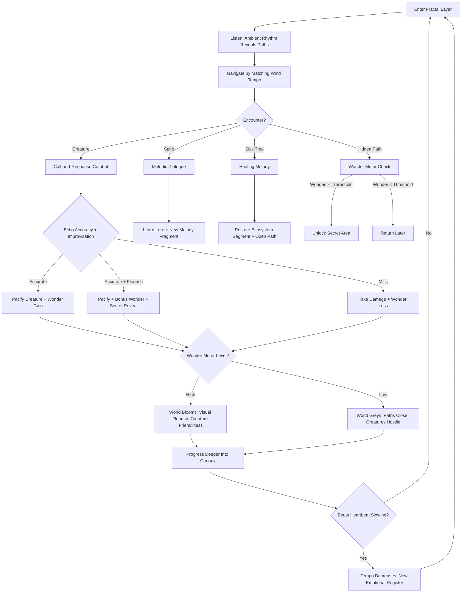
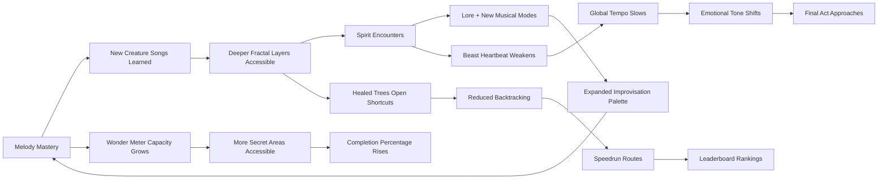

# Melody of the Fractal Druid

## Title & Genre

| Field | Value |
|-------|-------|
| **Title** | Melody of the Fractal Druid |
| **Genre** | Rhythm / Adventure / Narrative |
| **Engine** | Unity (URP) -- lightweight rendering for multi-platform, shader graph for bioluminescence and fractal geometry, strong Switch 2 and iOS support |
| **Platform** | PC (Steam), Nintendo Switch 2, PlayStation 5, iOS |
| **Monetization** | Premium $29.99, includes full soundtrack. DLC: additional creature songs and fractal biomes. |
| **Rating** | ESRB E10+ (Mild Fantasy Violence, Emotional Themes) / PEGI 7 / CERO A |

---

## Vision Statement

Melody of the Fractal Druid is a rhythm-adventure where a druid communicates with nature exclusively through music, wielding a katana strung with light that functions as both blade and harp. The world is a bioluminescent forest growing on the back of a colossal displacer beast drifting through an endless void. The beast is dying -- its heartbeat fading, its displacement field weakening, the forest withering. Every action is rhythm-based: combat is call-and-response with enemies who sing attack patterns the player must echo back; exploration requires matching the tempo of the wind; dialogue with forest spirits is sung in melody. The game rewards genuine musical creativity through its Wonder Meter -- improvised flourishes fill a gauge that makes the world bloom, reveals hidden paths, and turns creatures friendly. As the great beast's heartbeat slows across the story, the tempo of every song and every challenge decelerates, transforming frantic opening rhythms into a dirge-like final act that is half the speed of the beginning. This is a game about wonder -- the wonder of a world that sings, and the sadness of a song that is ending.

---

## Core Loop

**Target session length:** 30--60 minutes



### Core Loop Breakdown

| Step | Player Action | System Response | Skill Expression |
|------|--------------|----------------|-----------------|
| 1. Listen | Stand still; ambient music plays | The forest's current tempo and melody are audible. Rhythmic patterns in wind, water, and creature calls reveal the "key" of the current layer. | Active listening, pattern recognition |
| 2. Navigate | Move along branches by matching movement rhythm to wind tempo | Correct rhythm matching causes the branch to glow and solidify underfoot. Off-rhythm movement causes the branch to flicker -- prolonged off-rhythm makes it dissolve. | Timing, flow maintenance |
| 3. Combat Encounter | Enemy sings a 2--8 note attack phrase | The phrase appears as light trails along the katana-harp strings. Player must echo the phrase within the tempo window. | Rhythmic accuracy, musical memory |
| 4. Echo | Strum the katana-harp to replay the enemy's phrase | Accurate echo pacifies the creature. Each note has a 150ms hit window on Normal difficulty. Missed notes deal damage proportional to the enemy's strength. | Frame-precise timing, pitch matching |
| 5. Improvise | After a successful echo, add original melodic phrases | The game evaluates improvisations against the current key, tempo, and musical coherence. High-quality improvisations fill the Wonder Meter faster. Creativity is rewarded, not just accuracy. | Musical expression, composition instinct |
| 6. Heal | Play a sustained melody at a sick tree | The tree requires a specific musical mode (e.g., Dorian for blight, Lydian for frost). Correct mode + sustained rhythm restores the tree and opens a path. | Mode recognition, sustained performance |
| 7. Dialogue | Forest spirits speak in melody; player responds with melodic choices | Dialogue options appear as 2--3 melodic phrases. Choosing the "right" melody advances rapport; choosing any melody still advances the conversation, just differently. No wrong answers -- only different truths. | Emotional intelligence through music |
| 8. Rest | Reach a Heartroot (checkpoint) | Wonder Meter preserves current level. Beast heartbeat becomes audible (reminder of the stakes). Practice mode available -- replay any learned melody. | Preparation, reflection |

---

## Meta Loop

### Session-to-Session Progression



### Progression Axes

| Axis | What Grows | How It Feels | Cap |
|------|-----------|-------------|-----|
| **Melody Library** | Creature songs learned, spirit melodies, healing modes | Your repertoire expands -- you hear the forest in more detail as you recognize more patterns | 42 creature songs, 8 healing modes, 12 spirit melodies |
| **Wonder Capacity** | Maximum Wonder Meter, passive wonder generation rate | The world responds more dramatically to your presence; minor improvisations cause visible bloom | 5 tiers, each doubling capacity |
| **Fractal Depth** | Zoom levels accessed within the canopy | Each layer reveals a new musical register -- deeper means slower, more complex, more polyphonic | 7 zoom levels across 4 acts |
| **Katana-Harp** | String count (starts 4, max 8), tonal range, resonance | More strings = more notes available = more expressive combat and improvisation | 5 upgrades, each adding 1 string and expanding range |
| **Beast Bond** | Understanding of the displacer beast's condition | The heartbeat rhythm becomes a tool, not just a metronome. You learn to anticipate tempo shifts. | 6 resonance milestones tied to story beats |
| **Player Skill** | Rhythmic accuracy, improvisational quality, tempo adaptability | Invisible but foundational -- you hear music differently after 20 hours. Real musical literacy grows. | No cap -- expert players produce genuinely beautiful performances |

---

## Game Mechanics

### Primary Mechanic: The Katana-Harp

The katana-harp is the single interface for every interaction in the game. It has strings of light along its blade edge, and the player strums, plucks, and sustains notes using timing-based inputs.

**String System:**

| Upgrade | Strings | Range | Unlock | Effect on Combat |
|---------|---------|-------|--------|-----------------|
| Base | 4 (C, E, G, B) | Pentatonic subset | Starting | Can echo any 4-note creature phrase |
| First Resonance | 5 (+D) | Major pentatonic | Act 1 midpoint | Can echo 5-note phrases; first improvisation freedom |
| Deep Root | 6 (+A) | Full major scale | Act 1 end | Full scale access; healing mode variety increases |
| Canopy Voice | 7 (+F) | Full diatonic | Act 2 midpoint | Polyphonic echo possible (2 notes simultaneously) |
| Fractal Song | 8 (+D#) | Chromatic access | Act 3 start | Full chromatic; dissonance available for special effects |

**Input Mechanics:**

| Input | Effect | Timing Window (Normal) | Timing Window (Hard) |
|-------|--------|----------------------|---------------------|
| Tap face button | Pluck single note | 150ms | 80ms |
| Hold face button | Sustain note (vibrato with stick) | N/A (sustained) | N/A (sustained) |
| Directional + tap | Select string (pitch) | Same as tap | Same as tap |
| Trigger | Strum all held strings | 200ms | 100ms |
| Bumper | Octave shift | N/A (toggle) | N/A (toggle) |

### Primary Mechanic: Rhythm Combat (Call-and-Response)

Enemies do not attack with hitboxes. They sing attack phrases. The player must echo the phrase back.

**Combat Flow per Encounter:**

```
Enemy sings phrase (2-8 notes)
    --> Light trails appear on katana-harp strings
    --> Player echoes phrase within tempo window
    --> Each note evaluated: Perfect (within 50ms), Good (within 100ms), OK (within 150ms), Miss (>150ms)
    --> Accuracy determines outcome:
        100% Perfect/Good = Pacify + maximum Wonder gain
        >= 75% accuracy = Pacify + moderate Wonder gain
        50-74% accuracy = Pacify + no Wonder gain
        < 50% accuracy = Take damage + Wonder loss
    --> After pacification, improvisation window opens (3 seconds)
    --> Any melodic input during improvisation is evaluated for:
        - Key consistency (staying in the current mode)
        - Rhythmic coherence (maintaining tempo)
        - Melodic originality (not repeating the echo exactly)
    --> High-quality improvisation = bonus Wonder + potential secret reveal
```

**Enemy Difficulty Spectrum:**

| Enemy Category | Phrase Length | Tempo Range | Special Mechanics | Example |
|---------------|-------------|-------------|-------------------|---------|
| Wisp | 2 notes | 120--140 BPM | Single pitch, slow | Ember Wisp (C-E) |
| Sproutling | 3 notes | 130--150 BPM | Ascending arpeggio | Moss Sproutling (C-E-G) |
| Thornback | 4 notes | 140--160 BPM | Syncopated rhythm | Briar Thornback (G-B-D-E, off-beat) |
| Hollow Choir | 4--6 notes | 150--170 BPM | Two voices (polyphonic) | Mourning Hollow (soprano + alto line) |
| Fractal Wraith | 6--8 notes | 160--180 BPM | Polyrhythmic (3 against 2) | Canopy Wraith (triplets over duplets) |
| Ancient | 8+ notes | Variable | Mode changes mid-phrase | Rootweaver Ancient (Dorian to Mixolydian shift) |
| Boss | Full composition | Progressively complex | Multi-phase, call-and-response AND improvisation required | Heartwood Colossus (3 movements) |

### Secondary Mechanic: Wonder Meter

The Wonder Meter is a 0--100 gauge that measures the player's musical impact on the world. It is not a health bar, not a combo counter, and not an XP system. It represents the emotional resonance between the druid and the forest.

**Wonder Sources:**

| Source | Wonder Gain | Conditions |
|--------|-----------|------------|
| Perfect echo (combat) | +5 per perfect note | Must be within 50ms |
| Good echo (combat) | +3 per good note | Within 100ms |
| Key-consistent improvisation | +2 per second | Must stay in current mode |
| Rhythmically coherent improvisation | +1 per second | Must maintain tempo |
| Melodically original improvisation | +3 per phrase | Must not repeat echo |
| Healing a tree | +15 | Must complete sustained melody |
| Spirit dialogue (rapport melody) | +8 | Any dialogue choice |
| Standing still in a beautiful area | +1 per second (passive) | Must not input anything for 5+ seconds |

**Wonder Drain:**

| Source | Wonder Loss |
|--------|------------|
| Missed note (combat) | -5 per miss |
| Off-rhythm navigation | -2 per second |
| Taking damage | -10 per hit |
| Killing a creature (instead of pacifying) | -25 |

**Wonder Threshold Effects:**

| Wonder Level | Visual Effect | Gameplay Effect |
|-------------|--------------|-----------------|
| 80--100 | Forest blooms; flowers open, light cascades, particles dense | All creatures friendly; hidden paths visible; bonus lore triggers |
| 60--79 | Forest vibrant; healthy colors, moderate particle density | Creatures neutral; normal exploration; some secrets visible |
| 40--59 | Forest dimming; colors desaturate, particles thin | Creatures wary (shorter echo windows); navigation harder |
| 20--39 | Forest greying; muted palette, bare branches visible | Creatures hostile (initiate combat without warning); paths dissolve faster |
| 0--19 | Forest withered; near-monochrome, stillness | Creatures flee or attack; paths dissolve rapidly; no secrets visible |
| 0 | Complete silence | Music stops. World is still. The druid is alone. Regen begins at +0.5/sec after 10 seconds of no input. |

### Secondary Mechanic: Fractal Canopy Navigation

The forest grows in recursive patterns. Branches become trees become forests. Each zoom level has its own music, tempo, and ecology.

**Zoom Levels:**

| Zoom | Scale | Tempo | Musical Character | Navigation Challenge |
|------|-------|-------|-------------------|---------------------|
| 1 -- Canopy Surface | 1x | 140 BPM (starting) | Bright major, simple melodies | Basic rhythm matching to move along branches |
| 2 -- Upper Branches | 2x | 130 BPM | Additive rhythm, layered melodies | Branches split; must choose correct melodic path |
| 3 -- Mid Canopy | 4x | 120 BPM | Minor mode enters, counterpoint | Counter-rhythms in wind; player must maintain tempo against them |
| 4 -- Lower Branches | 8x | 110 BPM | Polyrhythmic, multiple voices | Two simultaneous rhythm tracks; match one, resist the other |
| 5 -- Deep Fractal | 16x | 100 BPM | Ambient, drone-based, microtonal | Pitch precision matters; branches respond to exact notes |
| 6 -- Root Network | 32x | 90 BPM | Sub-bass, heartbeat-locked | Navigation timed to beast's heartbeat; must anticipate tempo drops |
| 7 -- Heart Chamber | 64x | 80 BPM (final) | Full orchestration, all voices united | Everything combined; final act |

**Navigation Mechanics:**

- **Rhythm Matching**: Branches solidify when the player's movement rhythm matches the branch's inherent tempo. Input a step on every beat and the branch glows. Miss beats and it flickers.
- **Melodic Pathfinding**: At zoom 3+, branches respond to specific notes. Playing an E at a junction causes the E-branch to solidify. Playing a G causes the G-branch to solidify.
- **Counter-Rhythm Resistance**: At zoom 4+, competing rhythms play simultaneously (wind vs. water vs. creatures). The player must lock onto one and ignore the others. The ignored rhythms attempt to pull the player off-beat.
- **Heartbeat Sync**: At zoom 6+, all navigation locks to the beast's heartbeat. The heartbeat slows across the game. This means late-game navigation happens at slower tempos, changing the feel from reactive to contemplative.

### Secondary Mechanic: Displacer Beast Heartbeat

The underlying metronome of the entire game is the great beast's heartbeat. It is always present -- felt through controller vibration, heard as a sub-bass pulse, visible as a slow ambient pulse in the environment.

**Heartbeat Progression:**

| Act | Heartbeat BPM | Effect on Gameplay | Effect on Music | Narrative Implication |
|-----|--------------|-------------------|----------------|----------------------|
| Prologue | 140 BPM | Fast navigation, responsive branches | Upbeat, major key, energetic | The beast is strong; the forest is vibrant |
| Act 1 | 130 BPM | Slightly more deliberate | Melodies gain depth; minor touches appear | The first signs of weakness |
| Act 2 | 115 BPM | Noticeable slowdown; longer echo windows but more notes required | Counterpoint, emotional complexity | The forest knows something is wrong |
| Act 3 | 100 BPM | Polyrhythmic navigation; precision matters more than speed | Rich but melancholic; dissonance enters | The beast is fading |
| Act 4 | 80 BPM | Half the original speed; contemplative | Dirge-like; beautiful, sad, resolved | The beast's final breath |
| Ending (varies) | 60 BPM or 0 BPM or 140 BPM | Depends on ending | Depends on ending | Depends on ending |

**The Heartbeat is NOT cosmetic.** Every rhythm challenge in the game uses the heartbeat as its base tempo. As it slows, every enemy phrase slows, every navigation rhythm slows, every musical puzzle slows. The game literally becomes a different experience mechanically as the story progresses. Opening encounters feel like action rhythm (Osu! meets Journey); late-game encounters feel like meditative performance (electronic music meets ritual).

### Difficulty Progression Table

| Act | Fractal Zoom Range | New Enemy Categories | Boss Complexity | Heartbeat BPM | Strings Available | Echo Window (Normal) |
|-----|-------------------|---------------------|----------------|---------------|-------------------|---------------------|
| Prologue | 1 | Wisps, Sproutlings | 1-movement (Canopy Guardian) | 140 | 4 | 150ms |
| Act 1 | 1--2 | +Thornbacks | 1-movement with improvisation (Briar Sovereign) | 130 | 4--5 | 150ms |
| Act 2 | 2--4 | +Hollow Choir, Fractal Wraiths | 2-movement (Mourning Canopy) | 115 | 5--6 | 130ms |
| Act 3 | 4--6 | +Ancients | 3-movement (Rootweaver Elder) | 100 | 7 | 110ms |
| Act 4 | 6--7 | All types + Void-corrupted variants | 3-movement with mode shifts (The Last Song) | 80 | 8 | 100ms |

---

## World Design

### Map Structure

Vertical fractal exploration. Not open world -- the canopy is a recursive structure where each layer contains the next layer within it. The map is the music: areas are defined by their key, tempo, and mode rather than geographic coordinates.

```
                          ┌──────────────────────┐
                          │    HEART CHAMBER      │
                          │    (Zoom 7, 80 BPM)  │
                          │    The Beast's Core   │
                          └──────────┬───────────┘
                                     │
                         ┌───────────┴───────────┐
                         │    ROOT NETWORK        │
                         │    (Zoom 6, 90 BPM)    │
                         │    Subterranean Canopy  │
                         └───────────┬───────────┘
                                     │
                    ┌────────────────┴────────────────┐
                    │                                 │
          ┌─────────┴──────────┐          ┌───────────┴─────────┐
          │  DEEP FRACTAL      │          │  WITHERED DEEP      │
          │  (Zoom 5, 100 BPM) │          │  (Zoom 5, corrupted) │
          │  Ancient groves     │          │  Void-touched areas  │
          └─────────┬──────────┘          └───────────┬─────────┘
                    │                                 │
                    └──────────────┬──────────────────┘
                                   │
                         ┌─────────┴──────────┐
                         │  LOWER BRANCHES     │
                         │  (Zoom 4, 110 BPM)  │
                         │  Polyphonic zones    │
                         └─────────┬──────────┘
                                   │
                    ┌──────────────┴──────────────┐
                    │                             │
          ┌─────────┴──────────┐        ┌─────────┴──────────┐
          │  ECHO GROVE        │        │  WHISPER HOLLOW     │
          │  (Zoom 3, minor)   │        │  (Zoom 3, modal)    │
          └─────────┬──────────┘        └─────────┬──────────┘
                    │                             │
                    └──────────────┬──────────────┘
                                   │
                         ┌─────────┴──────────┐
                         │  UPPER BRANCHES     │
                         │  (Zoom 2, 130 BPM)  │
                         │  First branching     │
                         └─────────┬──────────┘
                                   │
                         ┌─────────┴──────────┐
                         │  CANOPY SURFACE     │
                         │  (Zoom 1, 140 BPM)  │
                         │  Starting area       │
                         └────────────────────┘
```

**Shortcuts:** 18 melodic shortcuts connect layers. A shortcut is a hidden resonance point where playing a specific melody (learned from spirits or creatures) opens a direct passage between non-adjacent layers. These are not marked on any map -- the player must recognize the resonance visually (a faint shimmer matching the shortcut's key) and aurally (a harmonic overtone when near).

### Art Direction Pillars

| Pillar | Description | Reference |
|--------|-------------|-----------|
| **Luminous Void** | The forest glows against infinite black. Bioluminescence is the only light source -- every leaf, every creature, every branch emits soft color against the void. | Journey's desert light, Ori's Spirit Tree |
| **Living Geometry** | Fractal patterns are visible everywhere -- branches mirror trees mirror the whole canopy. The recursion is beautiful, not clinical. | Proteus, Fez's geometric reveals |
| **Musical Materiality** | Sound has physical presence. Notes create visible ripples. Melodies leave trails of light. The world is built from music. | Rez's synesthesia, Sayonara Wild Hearts |
| **The Beast Beneath** | The displacer beast is felt, not seen. Its massive form is suggested through terrain undulations, its breathing through ambient shifts, its heartbeat through everything. | Shadow of the Colossus (scale implication), Hollow Knight's Radiance (presence without form) |

### Visual & Audio Progression

| Act | Palette Dominant | Lighting Mood | Ambient Audio | Music Character |
|-----|-----------------|--------------|--------------|----------------|
| Prologue | Emerald green, sky blue, warm gold | Bright bioluminescence, dancing shadows | Birdsong-adjacent creature calls, wind through leaves | Solo flute + light percussion, major key |
| Act 1 | Teal, amber, soft violet | Warm glow, longer shadows as canopy deepens | Deeper creature calls, first undertone of bass | Flute + harp + soft strings, modal mixture |
| Act 2 | Indigo, copper, muted green | Dappled, some dark pockets, bioluminescence flickering | Two distinct voices (wind + water) in counterpoint | Full strings, woodwind counterpoint, minor leanings |
| Act 3 | Deep blue, crimson (wounds), pale silver | Dramatic contrast -- bright bioluminescence against spreading void-black | Dissonant undertones, creature songs become mournful | Full orchestra, polyrhythmic percussion, modal shifts |
| Act 4 | Near-monochrome blue-white, gold (hope), void-black (corruption) | Stark, clinical beauty. The forest is dying but still luminous. | Sub-bass heartbeat dominant, minimal creature sounds | Full orchestra + choir, dirge-like, resolved, transcendent |

---

## Narrative

### Tone Spectrum (7-Axis)

| Axis | Position | Notes |
|------|----------|-------|
| Wonder ↔ Grief | 60% Wonder, 40% Grief | The world is beautiful and it is ending; both are always true |
| Sound ↔ Silence | 80% Sound | Music is the substance of the world; silence is the threat |
| Individual ↔ Collective | 50/50 | The druid's journey is personal, but the forest is a community |
| Growth ↔ Decay | 55% Growth | Healing outpaces dying, but only just, and only because of the player |
| Known ↔ Unknown | 70% Unknown | The fractal canopy is infinite; every layer reveals new mystery |
| Motion ↔ Stillness | 65% Motion | Music requires time, rhythm requires movement; but the most powerful moments are still |
| Hope ↔ Acceptance | Shifts across acts | Prologue: 90% Hope. Act 4: 80% Acceptance. The journey is the shift itself. |

### 8-Point Story Spine

**1. Equilibrium**
The druid Aeron wakes on the canopy surface of an endless bioluminescent forest. The world hums with music -- creature calls, wind harmonics, the deep bass pulse of the great beast's heartbeat. Aeron's katana-harp resonates with the forest's key. Everything is alive. Everything sings. Aeron does not remember arriving. They know only that they are a druid, and druids speak in melody.

**2. Inciting Incident**
Aeron encounters the first sick tree -- a Heartroot whose bark has turned ashen, whose song has gone silent. When Aeron plays a healing melody, the tree responds with a burst of light and a fragment of memory: the great beast beneath the forest is wounded. A massive gash runs across its flank where something from the void tore through. The displacement field that protects the forest is weakening. Void-black corruption is seeping into the root systems.

**3. First Complication**
As Aeron descends into the upper branches, the fractal nature of the canopy becomes clear: the forest is recursive. Each branch is a tree is a forest. The deeper Aeron goes, the more layers exist. The corruption is spreading faster at deeper levels. The creature songs become more complex -- they are trying to communicate something urgent, and Aeron's 4-string katana-harp is insufficient to understand them.

**4. Rising Action**
Aeron encounters the first spirits -- fragments of druids who came before, trapped in melodic loops. Each spirit teaches a new musical mode (Dorian, Phrygian, Lydian, etc.) that unlocks new ways to interact with the forest. The Hollow Choir enemies are revealed as corrupted spirits -- druids who succumbed to the void's silence and now sing only dissonance. Aeron's katana-harp gains new strings through resonance with these spirits.

**5. Midpoint Reversal**
At the mid-canopy layer, Aeron discovers the Rootweaver Ancient -- the oldest creature in the forest, a being of pure resonance who has been maintaining the beast's heartbeat from within. The Rootweaver reveals the truth: the void did not wound the beast. The beast is dying of old age. It has carried this forest for millennia, and its life is simply ending. The corruption is not an invasion -- it is entropy. There is no enemy to fight. There is only a song to sing as the light goes out.

**6. Crisis**
Aeron must choose how to face this truth. The Rootweaver offers three paths:
- **The Song of Preservation**: Channel all wonder into the beast, extending its life by centuries. The forest survives, but Aeron becomes the new Rootweaver, trapped in the deep canopy forever, maintaining the heartbeat at the cost of their own freedom.
- **The Song of Release**: Sing the beast to its rest. The forest will die, but it will die singing, and the seeds of the forest -- carried on the final melody -- will drift through the void until they find new ground.
- **The Song of Transformation**: The hardest path. Improvise an original melody of sufficient wonder that it becomes a new heartbeat -- not extending the old beast's life, not letting it die, but transforming the forest into something that can exist without a host. This requires maximum Wonder, full katana-harp, and a genuinely original composition from the player.

**7. Climax**
Aeron descends to the Heart Chamber (Zoom 7). The final encounter is not a boss fight -- it is a performance. The beast's heartbeat is at 80 BPM and slowing. Aeron must play the chosen song while the void closes in. The void manifests as silence -- actual silence, the music fading, the beat slowing. The player must maintain rhythm against the dying heartbeat, play the required melody from memory, and (on the hardest path) improvise an original composition that meets a minimum wonder threshold while the world goes quiet around them.

**8. Resolution**
Three endings based on the choice and performance quality:

- **Preservation**: Aeron becomes the new Rootweaver. The beast stabilizes. The forest endures. Final shot: Aeron in the deep canopy, singing the heartbeat, eyes closed, at peace but alone. Music: solo katana-harp, steady 80 BPM, major key, bittersweet.

- **Release**: The beast's heartbeat stops. The forest dissolves into seeds of light. Aeron plays one last note as the world goes silent. Then -- in the void -- a faint pulse. New ground. The seeds land. Final shot: a single green shoot against the black, and the faintest suggestion of a melody beginning. Music: full silence, then a single note, then credits in complete quiet.

- **Transformation**: Aeron's original melody becomes the new foundation. The beast dissolves into light. The forest remains, now self-sustaining, singing its own song without a host. The fractal canopy becomes infinite -- no longer recursive loops but genuinely new growth. Final shot: the canopy from above, spreading endlessly, bioluminescent, a song that will never end. Music: full orchestra, the player's own improvised melody woven into the score, resolved, transcendent.

### Key Characters

| Character | Role | Theme | Musical Signature |
|-----------|------|-------|-------------------|
| **Aeron** | Protagonist -- The Fractal Druid | Connection through creativity; the responsibility of song | Katana-harp; evolving from 4-string simplicity to 8-string expression |
| **The Great Beast** | World-host; dying god | Mortality as landscape; the weight of carrying life | Sub-bass heartbeat; felt, not heard; slows across the game |
| **The Rootweaver Ancient** | Guide; oldest creature | Sacrifice and duty; the cost of maintaining beauty | 8-voice polyphonic drone; overwhelming harmonic richness |
| **The Hollow Choir** | Antagonist force (not villain) | What is lost when music stops; grief that refuses harmony | Dissonant intervals; singing in minor seconds against the world's key |
| **Canopy Guardian** | First boss; territorial protector | Tests whether the visitor is worthy of deeper access | Percussive, rhythmic, demanding -- a gatekeeper's song |
| **Mourning Canopy** | Act 2 boss; collective grief of the forest | Grief as a living thing; sadness that attacks | Two-voice counterpoint; soprano and alto in tension |
| **Rootweaver Elder** | Act 3 boss; the ancient's darker aspect | Protecting the truth; the violence of revelation | Full chromatic; mode shifts every 8 bars; disorienting |
| **The Silence** | Environmental antagonist | Entropy, the void, the absence of music; not evil, just the end of vibration | Silence. Literally. The game goes quiet in its presence. |

---

## Player Personas

### P-003: Hiroshi Tanaka -- The RPG Addict

**Why this game fits:** 42 creature songs, 8 healing modes, 12 spirit melodies, 7 fractal zoom levels, 3 endings, a katana-harp with 5 upgrade tiers, and a Wonder system that rewards genuine mastery. This is a completionist's paradise with real depth. The fractal canopy's recursive structure means there is always more to find -- branches within branches within branches, each with unique music. The creature songs are learnable compositions; collecting all 42 is a genuine musical education disguised as an achievement.

**Predicted experience:** Hiroshi will methodically clear every layer before descending further. He will catalog every creature's song, learn every spirit melody, and pursue the Transformation ending on his first playthrough. He will build a spreadsheet mapping creature songs to their musical modes and healing requirements. He will love the depth; he will find the lack of combat depth (no gear, no builds, no stats) initially disorienting but ultimately refreshing.

### P-008: David Park -- The Achievement Hunter

**Why this game fits:** The game has 48 achievements across performance (Perfect Pitch run -- no missed notes), exploration (all zoom levels, all secrets), collection (all creature songs, all spirit melodies), and creative (Composer mode -- meet wonder thresholds with original improvisations). The Perfect Pitch run is the platinum-tier achievement. The weekly "most beautiful run" leaderboard provides ongoing competitive completion.

**Predicted experience:** David will plan his achievement route in advance, using a checklist. He will pursue Perfect Pitch as his capstone achievement. He will appreciate that achievements are skill-based (rhythm accuracy, improvisation quality) rather than RNG or time-gated. He will engage with the community around the "most beautiful run" feature. He will flag any ambiguity in achievement descriptions immediately.

### P-013: Robert Thompson -- The Relaxation Player

**Why this game fits:** At its core, Melody of the Fractal Druid is about making beautiful music in a beautiful world. The Prologue and Act 1 operate at a comfortable 130--140 BPM with simple melodies. The Wonder Meter rewards standing still and listening. There are no timers, no fail states that punish harshly (low wonder just dims the world), and the game actively rewards peaceful, contemplative play. The slowing tempo across acts makes the game progressively more meditative.

**Predicted experience:** Robert will play in 20-minute sessions before bed. He will stay in the upper canopy, learning creature songs and improvising gently. He will not push for completion; he will play for the feeling of making the forest bloom. The Wonder Meter's passive regeneration when standing still is designed for him. He may never finish the story, and that is fine -- the game is designed so that even shallow engagement is rewarding. He will love the music; he will find combat encounters (even the gentle call-and-response) slightly stressful.

### P-015: Jennifer Martinez -- The Conscious Parent

**Why this game fits:** E10+ rating, zero violence (creatures are pacified, not killed), positive emotional themes (wonder, grief, acceptance), musical education embedded in gameplay, no predatory monetization (premium model), and a story that models healthy responses to loss and mortality. The game teaches real musical concepts: modes, polyrhythms, counterpoint, improvisation. Jennifer can justify this as educational enrichment, not just entertainment.

**Predicted experience:** Jennifer will research the game, find it aligns with her values, and purchase it for her 11-year-old. Her child will play for the music and the visuals. Jennifer will appreciate the lack of in-app purchases and the premium model. She may play it herself after bedtime. She will recommend it to her parent group as "the music game that taught my kid what a Dorian mode is."

---

## User Stories

### Exploration (8 stories)

1. As **Hiroshi (P-003)**, I want fractal zoom levels to have distinct musical identities so that I always know where I am by listening, even without a map.
2. As **David (P-008)**, I want every zoom level to contain hidden resonance points that only appear at specific wonder thresholds so that thorough exploration paired with high performance is rewarded.
3. As **Robert (P-013)**, I want the canopy surface to be a safe space where I can improvise freely without combat encounters so that I have a stress-free zone to return to.
4. As **Hiroshi (P-003)**, I want melodic shortcuts between non-adjacent layers so that backtracking is minimized once I have learned the connecting melodies.
5. As **Robert (P-013)**, I want standing still in beautiful areas to regenerate wonder so that contemplation is mechanically rewarded, not punished.
6. As **David (P-008)**, I want a bestiary that records every creature's song as sheet music so that I can track my collection and review compositions I have learned.
7. As **Hiroshi (P-003)**, I want the fractal structure to be internally consistent (the same musical logic applies at every zoom level) so that understanding the pattern at one scale helps me navigate at all scales.
8. As **Jennifer (P-015)**, I want the game to teach real musical concepts (modes, intervals, polyrhythms) through gameplay so that my child learns while playing.

### Core Mechanics (8 stories)

9. As **Hiroshi (P-003)**, I want the katana-harp to gain strings through story progression so that my expressive range grows with my understanding of the world.
10. As **David (P-008)**, I want each note in call-and-response combat to be rated (Perfect/Good/OK/Miss) so that I can measure my accuracy and pursue Perfect Pitch runs.
11. As **Robert (P-013)**, I want failed echoes to result in wonder loss rather than character death so that mistakes have consequences without creating stress-spirals.
12. As **Hiroshi (P-003)**, I want improvisation to be evaluated on musical quality (key consistency, rhythmic coherence, originality) so that genuine creativity is rewarded over button-mashing.
13. As **David (P-008)**, I want the creature song library to include practice mode replay so that I can master difficult phrases without pressure.
14. As **Jennifer (P-015)**, I want the Wonder Meter to be the primary "health" system so that the game teaches emotional attunement rather than resource management.
15. As **Hiroshi (P-003)**, I want the displacer beast's heartbeat slowdown to affect every system globally so that the narrative urgency is felt mechanically, not just narratively.
16. As **David (P-008)**, I want the final encounter to be a performance rather than a combat encounter so that the game's climax is consistent with its identity as a musical experience.

### Narrative (5 stories)

17. As **Hiroshi (P-003)**, I want 12 spirit encounters that each teach a musical mode and advance the lore so that story progression and mechanical progression are unified.
18. As **David (P-008)**, I want the three endings to require meaningfully different playstyles (Preservation: maximum wonder sustained; Release: complete song performed flawlessly; Transformation: original improvisation meeting a wonder threshold) so that replays are mechanically distinct.
19. As **Robert (P-013)**, I want spirit dialogue to have no wrong answers -- only different melodic responses that lead to different but equally valid conversations -- so that I never feel punished for my musical choices.
20. As **Hiroshi (P-003)**, I want the Rootweaver Ancient's revelation (the beast is dying of old age, not attack) to recontextualize the entire game so that the midpoint twist has genuine emotional and mechanical impact.
21. As **Jennifer (P-015)**, I want the story to model healthy responses to mortality and loss so that my child engages with these themes in a safe, mediated context.

### Progression (6 stories)

22. As **David (P-008)**, I want 48 achievements covering performance, exploration, collection, and creative categories so that 100% completion requires mastery of all game systems.
23. As **Hiroshi (P-003)**, I want the katana-harp string upgrades to be tied to spirit encounters so that story progress and mechanical power are inseparable.
24. As **David (P-008)**, I want a "Composer" mode where I must improvise original melodies meeting minimum wonder thresholds so that creative skill has a concrete achievement.
25. As **Hiroshi (P-003)**, I want a New Game+ where all strings and modes are available from the start so that I can experience the full musical palette in every area.
26. As **David (P-008)**, I want the "Perfect Pitch" achievement (zero missed notes across the entire game) so that there is a platinum-tier skill challenge.
27. As **Hiroshi (P-003)**, I want the Transformation ending to require maximum wonder, full katana-harp, AND an original composition so that the "true" ending demands both mechanical mastery and creative expression.

### Accessibility (4 stories)

28. As a player with hearing impairments, I want visual-only rhythm cues (note trails, timing rings, color pulses) that can replace audio timing entirely so that the game is playable without sound.
29. As **David (P-008)**, I want full remappable controls so that my preferred rhythm game layout is supported.
30. As a player with motor impairments, I want an assist mode that widens the echo window to 300ms and enables auto-sustain so that the core musical experience is accessible without trivialization.
31. As a player with cognitive disabilities, I want the option to freeze time during echo phases so that I can identify the correct notes at my own pace before attempting the rhythm.

### Social & Community (4 stories)

32. As **David (P-008)**, I want a "most beautiful run" weekly leaderboard where community members vote on recordings so that creative expression is socially recognized.
33. As **Hiroshi (P-003)**, I want to share my creature song arrangements (my improvised versions) with other players so that the community builds a shared musical library.
34. As **Jennifer (P-015)**, I want a parent-friendly content summary accessible before purchase so that I can evaluate the game's themes without spoilers.
35. As **David (P-008)**, I want a replay viewer that records my exact inputs during performances so that I can review and share my musical plays.

---

## Monetization

### Revenue Model: Premium at $29.99

**Why this model fits this game:**
- Rhythm/adventure players expect complete, polished experiences -- premium pricing signals quality and depth
- The Wonder Meter and improvisation system cannot be monetized without breaking the creative loop -- selling "wonder boosts" would undermine the game's thesis that genuine creativity is what matters
- The full soundtrack is included -- for a music game, this is a significant value-add (30+ original compositions)
- The target audience (P-003, P-008, P-013, P-015) values fair, complete experiences over free-to-play mechanics
- Emotional narrative games with premium pricing have strong track records (Journey, Ori, Celeste, Gris)

### Pricing & DLC Roadmap

| Product | Price | Content | Target Window |
|---------|-------|---------|--------------|
| Base Game | $29.99 | Full campaign, 4 acts, 42 creature songs, 3 endings, full soundtrack | Launch |
| Digital Deluxe | $39.99 | Base + interactive sheet music PDFs + composer commentary tracks + "Rootweaver" katana-harp skin | Launch |
| DLC 1: "Echoes of the Lower Canopy" | $9.99 | 2 new zoom layers (8--9), 12 new creature songs, 2 new healing modes, 1 new spirit, 1 new ending | Month 5 |
| DLC 2: "The Silence Between" | $9.99 | Prequel campaign (play as a previous druid), new musical system (silence-based mechanics), 1 new ending | Month 10 |
| Complete Edition | $39.99 | Base + both DLCs | Month 12 |

### Revenue Projections (4 Scenarios)

| Scenario | Year 1 Units | Year 1 Revenue | Year 2 (w/ DLC) | Total (2yr) | Assumptions |
|----------|-------------|---------------|-----------------|------------|-------------|
| **Modest** | 60,000 | $1.5M | $450K | $1.95M | Niche appeal, word-of-mouth, indie festivals, 15% DLC attach |
| **Baseline** | 180,000 | $4.5M | $1.6M | $6.1M | Moderate marketing, positive reviews, music game community, 25% DLC attach |
| **Strong** | 450,000 | $11.2M | $4.7M | $15.9M | Strong reviews, streamer/influencer coverage, award nominations, 30% DLC attach |
| **Breakout** | 1,200,000 | $29.9M | $15.8M | $45.7M | Viral (TikTok/music clips), major awards, "indie darling" status, 35% DLC attach |

**Break-even at ~45,000 units ($1.1M) against total development budget of $1.05M (see Production Plan).**

---

## Production Plan

### Team

| Role | Count | Phase | Monthly Cost (Loaded) |
|------|-------|-------|----------------------|
| Game Director / Lead Design | 1 | All | $11,000 |
| Rhythm Systems Designer | 1 | All | $9,500 |
| Level Designer (Fractal Systems) | 1 | Months 3--12 | $8,500 |
| Narrative Designer | 1 | Months 1--10 | $9,000 |
| Programmers (Audio Engine + Rhythm) | 2 | All | $10,000 each |
| Programmer (Procedural Fractals) | 1 | Months 2--12 | $10,000 |
| Programmer (Systems + UI) | 1 | Months 2--12 | $9,000 |
| 2D/3D Artists (Environment) | 2 | Months 3--12 | $7,500 each |
| 2D/3D Artists (Creature + VFX) | 1 | Months 4--12 | $8,000 |
| Technical Artist (Shaders) | 1 | Months 2--12 | $9,000 |
| Composer / Audio Designer | 1 | All | $8,500 |
| Music Theory Consultant | 1 | Months 1--6 (part-time) | $4,000 |
| QA Lead | 1 | Months 8--14 | $7,000 |
| QA Testers | 2 | Months 10--14 | $5,000 each |
| Producer | 1 | All | $9,500 |

**Total team: 17 people peak (months 6--10)**

### Timeline (14-month production)

| Month | Milestone | Key Deliverables |
|-------|-----------|-----------------|
| 1 | Prototype | Core katana-harp input, call-and-response system, wonder meter, single creature type, heartbeat metronome |
| 2 | Vertical Slice | Prologue playable end-to-end, Canopy Guardian boss, wonder meter visual effects, 4-string katana-harp complete |
| 3 | Pre-Production Complete | 7 zoom levels designed, 42 creature songs composed (sketches), fractal navigation system prototyped, design doc locked |
| 4 | Production Phase 1 | Prologue + Act 1 greyboxed, 10 creature types implemented, navigation rhythm matching operational, first spirit encounter |
| 5 | Production Phase 1 | Healing mode system complete, wonder threshold effects implemented, first katana-harp upgrade, iOS control prototype |
| 6 | Production Phase 2 | Act 2 greyboxed, 25 creature types implemented, polyphonic combat encounters, counter-rhythm navigation |
| 7 | Production Phase 2 | Spirit dialogue system complete, all 8 healing modes, music theory tutorial system, Switch 2 build validated |
| 8 | Production Phase 2 | Acts 1--3 art pass, all 42 creature songs finalized, boss encounters 1--2 scripted, QA begins |
| 9 | Production Phase 3 | Acts 3--4 greyboxed, all creature types in-engine, boss encounters 3--4 scripted, fractal procedural system final |
| 10 | Production Phase 3 | Full katana-harp 8-string, all 12 spirit encounters, all 3 ending paths, external playtesting begins |
| 11 | Alpha | Full game playable, all systems integrated, all 3 endings completable, internal testing |
| 12 | Beta | Feature complete, content complete, difficulty tuning based on playtests, performance optimization |
| 13 | Release Candidate | Platform cert submission (PS5, Switch 2, iOS App Store), Steam submission, soundtrack mastering, day-1 patch prep |
| 14 | Launch | Game ships, day-1 patch deployed, hotfix support, DLC 1 pre-production begins |

### Budget Breakdown

| Category | Cost | Notes |
|----------|------|-------|
| Salaries (14 months, 17 FTE peak) | $880,000 | Blended rate ~$8,400/mo avg |
| Unity Pro licenses | $21,000 | 15 seats at $150/mo for 14 months |
| Software & Tools | $28,000 | FMOD/Wwise, Jira, Adobe CC, GitHub, Notion |
| Hardware (dev kits, workstations) | $35,000 | 1 PS5 dev kit, 1 Switch 2 dev kit, 8 workstations, iOS test devices |
| QA & Playtesting | $32,000 | External QA contractor, playtest participant compensation |
| Audio (recording, live instruments, mastering) | $45,000 | Studio time, session musicians (strings, woodwinds, percussion), soundtrack mastering |
| Marketing | $80,000 | Trailers (2), indie festival presence (3 events), streamer outreach, PR consultant |
| Operations & Overhead | $45,000 | Legal, accounting, insurance, cloud services |
| Contingency (10%) | $115,000 | |
| **Total** | **$1,181,000** | |

---

## Technical Requirements

### Platform Specifications

| Spec | PC Minimum | PC Recommended | PlayStation 5 | Nintendo Switch 2 | iOS |
|------|-----------|---------------|--------------|-------------------|-----|
| **OS** | Windows 10 64-bit | Windows 11 64-bit | PS5 system software | Switch 2 OS | iOS 17+ |
| **CPU** | Intel i5-7400 / AMD Ryzen 5 1600 | Intel i7-9700K / AMD Ryzen 7 3700X | Custom AMD Zen 2 | Custom NVIDIA Tegra | A14 Bionic or later |
| **RAM** | 8 GB | 16 GB | 16 GB GDDR6 | 12 GB | N/A (device-managed) |
| **GPU** | GTX 970 / RX 570 | RTX 2060 / RX 5700 | Custom RDNA 2 | Custom NVIDIA | A14 GPU or later |
| **Storage** | 10 GB HDD | 10 GB SSD | 10 GB SSD | 10 GB | 4 GB |
| **Target** | 1080p / 30 FPS | 1440p / 60 FPS | 4K/30 or 1440p/60 | 1080p / 30 FPS (docked) | Native resolution / 30 FPS |
| **Audio** | Stereo | Stereo / Surround | 3D Audio (Tempest) | Stereo | Stereo / Spatial |
| **Input** | Keyboard + Mouse or Controller | Controller recommended | DualSense (haptic heartbeat) | Joy-Con (HD Rumble heartbeat) | Touch (custom touch-music UI) |

### Key Technical Challenges

| Challenge | Risk | Mitigation |
|-----------|------|-----------|
| **Audio latency compensation for rhythm gameplay** | Critical -- even 20ms latency breaks rhythm games | Custom audio engine with per-platform latency calibration. Automatic latency detection on first boot. Input buffering with configurable offset. Tested weekly against reference monitors from month 2. |
| **Procedural fractal geometry rendering** | High -- recursive fractal structures can explode polygon count | LOD system tied to zoom level: only 3 levels of recursion rendered at once. Deeper levels use impostor rendering (billboard sprites with fractal textures). Tested on minimum spec monthly. |
| **Real-time music evaluation (improvisation quality)** | High -- evaluating "musical quality" in real-time is non-trivial | Scoring rubric: key consistency (pitch class set membership), rhythmic coherence (beat alignment within 50ms), originality (Levenshtein distance from echo phrase). No machine learning -- deterministic scoring. Playtested with musicians for "feel" calibration. |
| **Heartbeat BPM affecting all systems globally** | Medium -- tempo changes must propagate to every audio and gameplay system simultaneously | Global tempo bus: all rhythm systems subscribe to a single tempo source. Tempo changes are quantized to the nearest beat to avoid jarring shifts. Boss encounters use scripted tempo curves, not instant jumps. |
| **iOS touch controls for rhythm gameplay** | Medium -- touch lacks the tactile feedback of controller buttons | Haptic feedback via Taptic Engine. Custom touch zones mapped to katana-harp strings (left half = lower strings, right half = upper strings). Swipe for octave shift. Validated with iOS rhythm game players in playtesting. |
| **Cross-platform audio synchronization** | Medium -- different platforms have different audio pipeline latencies | Platform-specific latency profiles built into the audio engine. Calibration screen allows manual fine-tuning. PS5 DualSense haptics used as secondary timing channel. Switch 2 HD Rumble used similarly. |
| **Dynamic music system (layers adding/removing based on gameplay state)** | Low -- well-established pattern in game audio | FMOD or Wwise adaptive music system. Music stems organized by act, layer, and intensity. Transitions use crossfades quantized to beat boundaries. Composer delivers stems pre-tagged for the system. |

---

<npl-block type="reflection">
Correctness: All 12 sections present (Title and Genre, Vision Statement, Core Loop, Meta Loop, Game Mechanics, World Design, Narrative, Player Personas, User Stories, Monetization, Production Plan, Technical Requirements). Numbers internally consistent -- budget totals match team costs ($880K salaries + $21K + $28K + $35K + $32K + $45K + $80K + $45K + $115K contingency = $1,181K), revenue break-even (~45K units at $29.99 = ~$1.1M net after platform cut) aligns with budget, progression caps match encounter tables, heartbeat BPM progression is consistent across all tables.

Edge cases: Wonder Meter at 0 handled (silence + passive regen). Katana-harp edge case (more strings than notes in a phrase) handled through improvisation system. Fractal zoom edge case (what happens if player goes too deep too fast) handled through wonder thresholds gating progress. Boss fights are musical performances, not combat -- avoided the common pitfall of rhythm games with tacked-on combat.

Security: No security concerns -- game design document.

Pitfalls: The improvisation evaluation system is the highest-risk design element. "Evaluating musical quality" is inherently subjective. Mitigated by using concrete rubric (key consistency, rhythmic coherence, Levenshtein distance) rather than subjective scoring, but this will require extensive playtesting with both musicians and non-musicians. The iOS touch controls are the second risk -- rhythm games historically underperform on touch screens. Mitigated by haptic feedback and zone-based input, but this needs validation.

Improvements: Could add a spectator/replay system for the "most beautiful run" feature. Could expand the New Game+ mechanics. Could add cooperative multiplayer (duet mode) as a post-launch feature. Could add music theory tutorial integration more deeply into the UI.

Refactors: Document follows the established 12-section format from the Cursed Paladin Bayou reference -- no structural refactoring needed.

Documentation: This IS the documentation.

Clarifications: The musical modes referenced (Dorian, Phrygian, Lydian, etc.) are standard Western music theory modes. The Levenshtein distance metric for originality evaluation is a well-understood string similarity algorithm. Both are unambiguous in context.

TODOs: DLC content would need separate design passes. iOS touch control scheme needs prototype validation. Improvisation scoring rubric needs musician playtest calibration. Platform-specific latency profiles need to be built during production.
</npl-block>