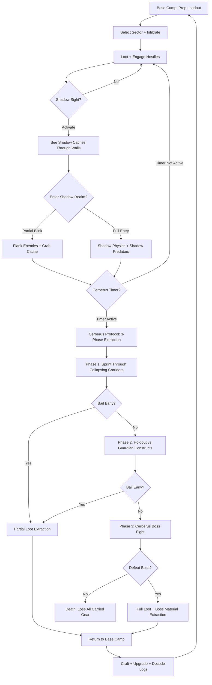
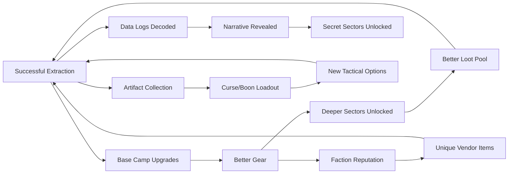

# Midnight Cerberus Protocol

## Title & Genre

| Field | Value |
|-------|-------|
| **Title** | Midnight Cerberus Protocol |
| **Genre** | Extraction Shooter / Horror Survival |
| **Engine** | Unreal Engine 5.4 (Nanite + Lumen for shadow-dimension volumetrics) |
| **Platform** | PC (Steam/Epic), PlayStation 5, Xbox Series X/S |
| **Monetization** | Premium ($49.99 base) + seasonal content passes ($14.99/season) |
| **Rating** | ESRB M (Blood and Gore, Intense Violence, Strong Language) / PEGI 18 / CERO Z |

---

## Vision Statement

Midnight Cerberus Protocol is a high-stakes extraction shooter where you descend into the Midnight Gate -- an underground research facility that tore a hole into a shadow dimension -- to loot experimental weapons and anomaly artifacts before the facility's automated Cerberus Protocol containment system seals the sector and kills everything inside. The game exists at the intersection of greed and terror: every room you clear is a vote to push deeper for better loot, and every extraction is a three-phase gauntlet where the facility actively tries to murder you with collapsing corridors, guardian constructs, and a randomly selected Cerberus boss unit. Reality itself is unstable -- the physical facility flickers in and out of its shadow-dimension echo, and you can see shadow-dimension caches through walls but reaching them means partially entering a realm where physics break and shadow-native creatures hunt you. Die and you lose everything you carried. Extract and you keep your haul to upgrade your base camp, craft shadow-resistant gear, and unlock deeper, more dangerous sectors. Between runs, decode recovered data logs that reveal what the scientists were actually trying to summon. This is Tarkov by way of SCP Foundation and Stranger Things.

---

## Core Loop

**Target session length:** 20-45 minutes (single run)



### Core Loop Breakdown

| Step | Player Action | System Response | Skill Expression |
|------|--------------|----------------|-----------------|
| 1. Prep | Select loadout weapons, armor, consumables, artifact slots at base camp | Loadout weight affects movement speed, stamina regen, and shadow-realm stability | Loadout optimization -- weight vs. firepower vs. shadow utility |
| 2. Infiltrate | Choose sector (depth determines difficulty/loot quality) | Sector generates procedurally from tile pool; enemy spawns, loot placement, shadow-dimension overlap % randomized per run | Sector knowledge -- knowing which tiles have good loot, which are death traps |
| 3. Loot + Fight | Clear rooms, open caches, engage hostiles (facility security, shadow creatures, other mercenaries) | Enemies use cover, flank, call reinforcements. Shadow creatures ignore cover and phase through walls | Aim, positioning, target priority, ammo management |
| 4. Shadow Sight | Toggle shadow-realm overlay (costs stamina at 5%/sec) | See shadow caches through walls (golden outlines). See shadow creatures that are invisible without shadow sight | Resource management -- stamina spent on shadow sight vs. sprinting/combat |
| 5. Shadow Blink | Short-range teleport into shadow dimension (8m range, 15s cooldown) | Physics shift: gravity 60% weaker, movement 40% faster, damage taken +30%. Shadow predators aggro immediately | Timing and positioning -- use blink to flank or grab loot, but you're vulnerable |
| 6. Extraction Trigger | Reach extraction elevator in sector | Cerberus Protocol activates: 3-minute countdown begins. All unextracted loot lost if timer expires | Decision -- extract now with current loot or push deeper first |
| 7. Phase 1 Gauntlet | Sprint through collapsing corridors to extraction point | Corridors dynamically collapse behind player. Shadow-dimension bleeds through walls. Environmental hazards (steam vents, falling debris) | Movement skill, route memorization, quick decision-making |
| 8. Phase 2 Holdout | Defend extraction point for 60 seconds against guardian constructs | Guardian constructs (3-headed mechanical beasts) spawn in waves of 2-4. They use combined ranged/melee attacks | Crowd control, ammo conservation, positioning |
| 9. Phase 3 Boss | Fight a randomly selected Cerberus unit | 4 possible Cerberus units, each with distinct mechanics (see Boss Roster) | Adaptability -- must fight a boss you didn't select, with different strategies each time |
| 10. Extract | Board extraction elevator | Keep all carried loot + boss material. Return to base camp | Relief + dopamine -- the extraction high |

---

## Meta Loop

### Session-to-Session Progression



### Progression Axes

| Axis | What Grows | How It Feels | Cap |
|------|-----------|-------------|-----|
| **Base Camp** | Crafting stations, shooting range, research lab, vault, med bay, armory | Your hole in the ground becomes a fortress. Each station unlocks new build options. | 5 tiers per station, 8 stations total |
| **Gear Quality** | Weapon damage, armor mitigation, shadow-resistance rating, carry capacity | Early runs feel desperate. Late runs feel powerful -- but never safe. | 5 rarity tiers (Common, Uncommon, Rare, Epic, Anomalous) |
| **Sector Depth** | 4 sector depths unlocked progressively via keycard extraction | Each depth has harder enemies, better loot, higher shadow-dimension overlap | Depth 4 (The Abyss) -- 80% shadow overlap, guaranteed Cerberus variant spawn |
| **Artifact Library** | Anomaly artifacts with passive boons and active curses | Build-crafting between runs -- each artifact changes how you approach a sector | 24 unique artifacts, equip up to 3 per run |
| **Faction Reputation** | 3 mercenary factions each offer unique gear and missions | Choose who to work for, unlock faction-specific weapons and mods | Rank 5 per faction, mutually exclusive rank 5 rewards |
| **Lore Completion** | Data logs decoded at the research lab | The mystery of the Midnight Gate unfolds -- what were they summoning? | 68 data logs across all sector depths |
| **Player Skill** | Map knowledge, enemy AI patterns, extraction route optimization | Invisible but most powerful -- experienced extractors die less, loot more | No cap -- procedural generation ensures no two runs are identical |

---

## Game Mechanics

### Primary Mechanic: Shadow Dimension Overlap

The Midnight Gate exists in two planes simultaneously. The physical facility is the primary play space; the shadow dimension is a hostile mirror that overlaps increasingly at deeper sectors.

**Shadow Sight (Toggle):**
- Cost: 5% stamina/second while active
- Effect: See shadow-dimension objects through walls (golden outlines for caches, crimson outlines for shadow creatures)
- Limitation: Cannot aim down sights while shadow sight is active -- must toggle off to shoot accurately

**Shadow Blink (Active):**
- Range: 8 meters
- Cooldown: 15 seconds
- Effect: Short-range teleport into the shadow dimension at target location
- Duration: Player remains in shadow dimension for 8 seconds, then snaps back to physical realm
- Shadow dimension physics:
  - Gravity: 60% of normal (higher jumps, slower falls)
  - Movement speed: +40%
  - Damage taken: +30%
  - Cannot interact with physical-realm objects (doors, elevators)
  - Can interact with shadow caches and shadow creatures

**Shadow-Dimension Overlap by Sector Depth:**

| Sector Depth | Overlap % | Visual Effect | Gameplay Effect |
|-------------|----------|---------------|----------------|
| Depth 1: Research Labs | 15% | Occasional flicker, walls shimmer | Shadow caches rare, shadow creatures uncommon |
| Depth 2: Engineering | 30% | Frequent flicker, shadow geometry visible through walls | Shadow caches common, shadow creatures patrol in pairs |
| Depth 3: Containment | 50% | Constant flicker, shadow-realm always partially visible | Shadow caches frequent, shadow creatures hunt actively, gravity anomalies in 20% of tiles |
| Depth 4: The Abyss | 80% | Physical realm barely visible, shadow dimension dominates | Shadow caches everywhere, shadow apex predators, gravity anomalies in 60% of tiles, stamina drains 2x faster in shadow sight |

### Secondary Mechanic: Anomaly Artifact System

Recovered artifacts grant permanent passive bonuses but impose curses. Artifacts are equipped at base camp before a run (max 3 equipped).

**Artifact Roster (24 artifacts):**

| Artifact | Boon | Curse | Rarity | Found In |
|----------|------|-------|--------|----------|
| Shadow Lens | See enemy outlines through walls within 20m | Slowly drains 2 HP/sec while equipped | Uncommon | Depth 2+ |
| Void Anchor | Immune to shadow-dimension knockback and gravity anomalies | Movement speed -20% | Rare | Depth 3+ |
| Cerberus Heart | +30% damage against guardian constructs | Cerberus Protocol timer reduced by 30 seconds | Epic | Cerberus boss drops |
| Phase Echo | Shadow blink cooldown reduced to 8 seconds | Shadow blink duration reduced to 4 seconds | Uncommon | Depth 2+ |
| Blood Battery | Kills restore 5% stamina | Max HP reduced by 15% | Common | Depth 1+ |
| Hollow Eye | Minimap reveals enemy positions within 30m | Cannot use shadow sight | Rare | Depth 3+ |
| Radiation Sponge | Shadow radiation damage reduced by 50% | Carrying capacity reduced by 2 slots | Uncommon | Depth 2+ |
| Third Hand | Can carry 1 additional primary weapon | Reload speed -25% | Rare | Depth 3+ |
| Whisper Map | Extraction point marked on map at run start | All loot rarity downgraded by 1 tier | Uncommon | Depth 1+ |
| Titan Grip | +40% melee damage, stagger on hit | Cannot equip sidearm | Common | Depth 1+ |
| Shadowstep | Crouching makes player invisible to shadow creatures | Sprint stamina cost +50% | Epic | Depth 3+ |
| Mnemonic Core | +25% data log fragment find rate | Shadow sight stamina cost +3%/sec | Common | Depth 1+ |
| Fusion Cell | Grenade damage +50% | Grenade carry capacity -50% | Uncommon | Depth 2+ |
| Dead Man's Switch | On death, equipped artifacts preserved (once per 3 runs) | All artifact boons reduced by 50% | Epic | Faction Rank 4 reward |
| Void Step | Fall damage eliminated | Cannot use health items during shadow blink | Rare | Depth 3+ |
| Flux Capacitor | Weapon swap speed +60% | Weapon swap interrupts reload | Uncommon | Depth 2+ |
| Iron Lung | Sprint duration +40% | Hold breath (sniper stability) duration -40% | Common | Depth 1+ |
| Spectral Mail | Armor ignores first hit from shadow creatures each run | Armor repair cost +100% | Rare | Depth 3+ |
| Cerberus Fang | Extraction timer paused during boss fight | Boss HP +25% | Epic | Cerberus boss drops |
| Pocket Dimension | +4 inventory slots | Shadow blink range reduced to 4m | Rare | Depth 3+ |
| Echo Locator | Audio cues play when high-value loot is within 15m | Footstep audio is muffled -- harder to hear enemies | Common | Depth 1+ |
| Last Stand | When HP drops below 10%, gain 3 seconds of invulnerability | Healing items have 3-second use delay | Epic | Depth 4 only |
| Paradox Shell | Bullets pass through shadow-realm walls for 2 seconds after blink | Ammo consumption +20% | Rare | Depth 3+ |
| The Summoning | 5% chance per run to find a guaranteed Anomalous-tier item | All other equipped artifacts' curses doubled | Anomalous | Depth 4 boss only |

### Secondary Mechanic: Cerberus Three-Phase Extraction

Every extraction triggers the Cerberus Protocol -- the facility's automated containment system. The extraction has three phases, each offering a bail-out point for partial loot.

**Phase Timing:**

| Phase | Duration | Objective | Bail-Out Option | Bail-Out Reward |
|-------|----------|-----------|----------------|----------------|
| Phase 1: Collapse Run | 45 seconds | Sprint through collapsing corridors to extraction point | At the 30-second mark, emergency exit opens | 40% of carried loot saved |
| Phase 2: Guardian Holdout | 60 seconds | Survive guardian construct waves at extraction point | At the 30-second mark, emergency exit opens | 70% of carried loot saved |
| Phase 3: Cerberus Boss | Variable (boss fight) | Defeat the Cerberus unit | Cannot bail -- commit or die | 100% of carried loot + boss material |

**Cerberus Boss Roster (4 Units):**

| Cerberus Unit | Health | Signature Attack | Weakness | Strategy |
|--------------|--------|-----------------|----------|----------|
| Cerberus Alpha | 4,500 | Tri-beam laser sweep (3 simultaneous beams from each head, 180-degree arc) | Heads are independent -- destroying one head reduces damage output by 33% | Focus one head at a time; use pillars for cover during beam sweep |
| Cerberus Omega | 6,000 | Shadow-rift summon (opens portals that spawn shadow creatures continuously) | Portals can be destroyed with explosives -- killing the portal cuts her healing | Prioritize portal destruction; save grenades for rifts |
| Cerberus Sigma | 3,500 | Speed rush (charges at extreme speed, grabs player, shakes for 40% HP) | Charge is telegraphed by 2-second ground-pound animation -- dodge window is tight but generous | Bait the charge, dodge, punish recovery frames; high DPS window after rush |
| Cerberus Theta | 5,000 | Radiation pulse (area denial, creates 3 expanding radiation zones) | Radiation zones dissipate faster when player stands in them (absorbs radiation into artifact) | Intentional radiation exposure reduces zone duration; requires HP management |

### Secondary Mechanic: Persistent Base Camp

Between runs, players upgrade their underground base camp. Base camp is the meta-progression hub.

**8 Stations:**

| Station | Purpose | Tiers | Upgrade Resource | Tier 5 Unlock |
|---------|---------|-------|-----------------|--------------|
| **Armory** | Weapon crafting and modification | 5 | Scrap metal + weapon parts | Craft Anomalous-tier weapons |
| **Med Bay** | Health items, stimulants, shadow-radiation antidotes | 5 | Organic compounds + data samples | Auto-heal 5 HP/sec in physical realm |
| **Research Lab** | Decode data logs, analyze artifact fragments | 5 | Data log fragments | Reveal full facility map (all sector layouts) |
| **Shooting Range** | Test weapons, practice against holographic enemies | 3 | Credits | Holographic Cerberus practice mode |
| **Vault** | Store extracted gear between runs (stash) | 5 | Reinforced materials | 100-slot stash with auto-sort |
| **Crafting Bench** | Combine artifacts, create consumables, mod gear | 5 | Anomaly fragments | Artifact fusion (combine 2 artifacts, keep best boon, choose 1 curse) |
| **War Room** | Faction missions, sector intel, bounty board | 3 | Faction rep tokens | Access to Depth 4 without keycard |
| **Decontamination Chamber** | Reduce shadow radiation accumulated during runs | 3 | Purified water + energy cells | Passive radiation resistance +25% permanent |

---

## World Design

### Map Structure

The Midnight Gate is an underground facility organized into 4 sector depths. Each sector is procedurally generated from a tile pool -- no two runs are identical.

```
                         ┌─────────────────────────┐
                         │    DEPTH 4: THE ABYSS   │
                         │  Shadow-realm dominant   │
                         │  80% overlap, apex preds │
                         │  Keycard: Abyssal Key    │
                         └────────────┬────────────┘
                                      │
                         ┌────────────┴────────────┐
                         │  DEPTH 3: CONTAINMENT   │
                         │  50% overlap, gravity   │
                         │  anomalies common       │
                         │  Keycard: Master Card   │
                         └────────────┬────────────┘
                                      │
                ┌─────────────────────┴──────────────────────┐
                │                                            │
    ┌───────────┴───────────┐                  ┌─────────────┴──────────┐
    │  DEPTH 2: ENGINEERING │                  │  DEPTH 2: MEDICAL WING │
    │  30% overlap           │                  │  30% overlap           │
    │  Power systems,       │                  │  Research labs,        │
    │  manufacturing        │                  │  specimen storage      │
    └───────────┬───────────┘                  └─────────────┬──────────┘
                │                                            │
                └─────────────────────┬──────────────────────┘
                                      │
                         ┌────────────┴────────────┐
                         │  DEPTH 1: RESEARCH LABS  │
                         │  15% overlap, entry zone │
                         │  No keycard required     │
                         └─────────────────────────┘
                                      │
                         ┌────────────┴────────────┐
                         │     BASE CAMP (Hub)      │
                         │  Elevator access to      │
                         │  all unlocked depths     │
                         └─────────────────────────┘
```

### Tile-Based Procedural Generation

Each sector depth has a pool of hand-designed tiles that are assembled into a unique layout per run.

| Sector Depth | Tile Pool Size | Avg. Tiles Per Run | Guaranteed Tiles | Shadow Caches Per Run |
|-------------|---------------|-------------------|-----------------|----------------------|
| Depth 1: Research Labs | 40 tiles | 12-15 | 1 extraction elevator, 1 medical station | 2-4 |
| Depth 2: Engineering | 55 tiles | 15-20 | 1 extraction elevator, 1 crafting station | 4-7 |
| Depth 2: Medical Wing | 50 tiles | 14-18 | 1 extraction elevator, 1 research terminal | 3-6 |
| Depth 3: Containment | 65 tiles | 18-25 | 1 extraction elevator, 1 vault room, 1 artifact shrine | 6-10 |
| Depth 4: The Abyss | 45 tiles | 20-28 | 1 extraction elevator, 1 boss arena, 1 guaranteed Anomalous loot | 8-14 |

### Art Direction Pillars

| Pillar | Description | Reference |
|--------|-------------|-----------|
| **Industrial Brutalism** | Cold concrete, exposed conduits, flickering fluorescents -- government science on a budget | Control (Remedy), Alien: Isolation's Sevastopol Station |
| **Shadow Bleed** | The shadow dimension as oil-slick corruption -- black ichor seeping through walls, geometry that shouldn't exist | Stranger Things' Upside Down, Silent Hill's Otherworld |
| **Mechanical Horror** | The Cerberus units are brutalist military machines -- three-headed constructs built to kill, not to be beautiful | Titanfall 2 BT-7274 crossed with Evangelion Unit-01 berserk mode |
| **Scientist Hubris** | Whiteboards with frantic equations, containment cells with observation windows, specimen jars filled with impossible geometry | SCP Foundation visual design, Resident Evil 2 remake lab sections |

### Visual & Audio Progression by Sector Depth

| Depth | Palette Dominant | Lighting Mood | Ambient Audio | Music Intensity |
|-------|-----------------|--------------|--------------|----------------|
| Depth 1 | White tile, gray concrete, amber emergency lights | Sterile fluorescents, occasional flicker | Humming ventilation, distant alarm, footsteps echoing | Ambient drone, low tension |
| Depth 2 | Industrial yellow, rust orange, cable-black | Overhead industrial lamps, sparks from damaged panels | Machinery grinding, hydraulic hisses, distant radio static | Industrial percussion enters |
| Depth 3 | Red warning lights, steel blue, biohazard green | Emergency red wash, bio-luminescent shadow growth | Heartbeat from containment cells, wet organic sounds, whispers | Tension strings + synth pulse |
| Depth 4 | Pitch black, crimson shadow bleed, stark white (anomalous) | Player flashlight only, shadow-realm self-illumination, strobing artifact glow | Dead silence punctuated by inhuman shrieks, the facility breathing | Full orchestral dread, choir, bass drops on boss reveals |

---

## Narrative

### Tone Spectrum (7-Axis)

| Axis | Position | Notes |
|------|----------|-------|
| Hope <-> Despair | 80% Despair | Extraction is survival, not victory. The facility always wins eventually. |
| Science <-> Horror | 70% Horror | The science was sound. What they found wasn't. |
| Human <-> Monster | 50% | Both sides -- mercenaries are opportunists, shadow creatures are victims of the experiment |
| Order <-> Chaos | 75% Chaos | Procedural generation mirrors narrative chaos -- nothing is stable |
| Known <-> Unknown | 85% Unknown | Data logs reveal pieces, never the whole picture. The entity is never fully explained. |
| Tension <-> Release | 65% Tension | Extraction is release, but brief. Next run starts the climb again. |
| Sound <-> Silence | 60% Sound | The facility is loud -- alarms, machinery, creatures. Silence means something is hunting you. |

### 8-Point Story Spine

**1. Equilibrium**
The world knows the Midnight Gate exists. It appeared three years ago when the Prometheus Research Group's underground facility in the Carpathian Mountains vanished -- replaced by a crater from which black smoke rises eternally. The United Nations sealed the perimeter. Mercenary companies bid for extraction contracts. You are one of those contractors, descending into the Gate for loot, data, and whatever else you can carry out. The base camp outside the crater is your home between runs.

**2. Inciting Incident**
During your first extraction from Depth 1, the Cerberus Protocol activates for the first time. You survive, barely. Back at base camp, you decode a data log from Dr. Elena Vasquez, the project lead. She was trying to open a controlled rift to a parallel dimension -- she called it "The Shadow" -- to harvest its energy. The rift opened. Something came through. The logs cut off.

**3. First Complication**
As you extract from Depth 2, you encounter signs that you are not alone -- other mercenaries are in the facility, but they are not competing with you. They are changed. Shadow corruption has fused them to the facility. They attack on sight, but between their screams you hear fragments of human speech. They were people, once. The data logs reveal that shadow radiation has a cumulative effect -- enough exposure and you don't leave. You become part of the Gate.

**4. Rising Action**
Depth 3 -- Containment -- reveals the full scope of the experiment. The Prometheus Group wasn't harvesting energy. They were trying to summon an entity. Dr. Vasquez believed The Shadow was alive -- a vast intelligence that exists across an entire parallel dimension. She wanted to make contact. She succeeded. The entity reached back through the rift and consumed the facility. The Cerberus Protocol wasn't designed to contain The Shadow. It was designed to contain the entity's avatar -- a being Vasquez code-named "Cerberus" because it manifests in three-headed forms as it guards the rift.

**5. Midpoint Reversal**
A recovered security recording reveals the truth: the Cerberus Protocol is not protecting the world from The Shadow. It is feeding it. Every extraction run -- every mercenary that enters, fights, and dies -- provides the entity with biological and psychic energy. The Prometheus Group's parent company, Meridian Holdings, knew this. They are running the extraction program as a harvest. The mercenaries are cattle. You have been feeding the entity with every run you survive.

**6. Crisis**
Depth 4 -- The Abyss -- opens. The entity's avatar is no longer content to wait. It starts reaching into your base camp between runs. Other mercenaries begin showing shadow corruption symptoms. You have a choice: stop running extractions (starve the entity, but abandon the other mercenaries and all your progress) or go deeper and find a way to close the rift from the inside.

**7. Climax**
You descend into The Abyss for the final run. The entity's full power is manifest. The sector is 80% shadow-realm. Four Cerberus units patrol simultaneously. The rift is visible -- a tear in reality bleeding shadow-matter into the physical world. At the rift's heart, you find Dr. Vasquez -- alive, fused with the entity, neither human nor shadow. She offers you a choice.

**8. Resolution**
Three endings based on total data logs decoded, faction reputation, and final boss performance:
- **Severance:** Close the rift. The entity is cut off. The facility collapses. You escape with whatever you carried. The Gate seals forever. The mercenaries go home. Meridian Holdings denies everything. The world never learns the truth. (Requires less than 50% data logs decoded.)
- **Contact:** Negotiate with the entity through Vasquez. The rift stays open but controlled. You become the new Cerberus -- guarding the boundary between dimensions. The extraction program continues, but ethically. You are no longer human. (Requires 50-90% data logs + faction Rank 3+ with any faction.)
- **Communion:** Fully merge with the entity. You see what The Shadow truly is -- not a predator, but a wounded intelligence reaching out for connection. You become the bridge between dimensions. The facility transforms. The Gate becomes a doorway. Humanity is changed forever. This is the hardest ending (requires 100% data logs + all faction Rank 5 + defeat all 4 Cerberus units in a single Depth 4 run + no artifact curses active during final boss).

### Key Characters

| Character | Role | Theme | Data Logs |
|-----------|------|-------|-----------|
| **The Mercenary (Player)** | Protagonist -- extraction contractor | Survival in a system designed to consume you | N/A (player character) |
| **Dr. Elena Vasquez** | Tragic scientist -- fused with the entity | Curiosity as damnation; she got what she wanted | 18 data logs |
| **Director Marcus Hale** | Antagonist -- Meridian Holdings executive | Corporate sociopathy; people are resources to be harvested | 9 intercepted communications |
| **Sergeant Kira Okafor** | Ally -- leader of the Ironbound faction | Duty vs. survival; protecting her team in a meat grinder | 12 mission briefings |
| **"The Host"** | Entity avatar -- speaks through shadow-corrupted mercenaries | Alien loneliness; it reaches out because it has been alone for eons | 8 resonance fragments |
| **Dr. Yuki Tanaka** | Victim -- Vasquez's assistant, first to be consumed | The cost of proximity; she was in the wrong lab at the wrong time | 6 personal logs |
| **Operator** | Mission control -- voice in your ear from base camp | The human anchor; someone who cares if you come back | 14 radio transmissions |

---

## Player Personas

### P-001: Alex Rivera -- The Ranked Grinder

**Why this game fits:** Midnight Cerberus Protocol rewards the same twitch-skill mastery Alex craves. The three-phase extraction is a high-pressure skill test every single run. The procedural generation means no memorized routes -- adaptability is the skill. The Cerberus boss roster requires learning 4 distinct fight patterns and adapting to whichever one spawns. The artifact system creates loadout optimization problems that reward theorycrafting.

**Predicted experience:** Alex will optimize his loadout for maximum extraction rate. He will skip data logs entirely. He will learn every tile's geometry and enemy spawn patterns. He will solo Depth 4 runs with meme builds (all curses, no armor) just to prove he can. He will create extraction route guides and boss kill compilations. He will love the Cerberus boss fights; he will ignore the narrative completely.

### P-003: Hiroshi Tanaka -- The RPG Addict

**Why this game fits:** 24 anomaly artifacts with boon/curse combinations create genuine build diversity. 68 data logs tell a coherent sci-fi horror story. 3 endings tied to completion metrics. 3 factions with mutually exclusive rewards. The base camp upgrade system is a persistent progression paradise. The artifact fusion system at Tier 5 Crafting Bench opens theorycrafting possibilities.

**Predicted experience:** Hiroshi will methodically decode every data log between runs. He will build a spreadsheet of all 24 artifacts with optimal boon/curse combinations. He will pursue all 3 faction storylines simultaneously. He will attempt the Communion ending on his first playthrough. He will read every terminal, examine every environmental detail, and catalogue the entire lore. He will find the procedural generation frustrating for lore-hunting (logs are randomly placed) but accept it as part of the challenge.

### P-010: Kevin Nguyen -- The Competitive Whale

**Why this game fits:** Kevin thrives on measurable performance and competitive recognition. The extraction shooter format creates natural performance metrics: extraction rate, loot value per run, boss kill speed, survival streaks. The seasonal content passes provide ongoing competitive goals. The faction reputation system creates leaderboard-worthy achievements. The Cerberus boss roster rewards mastery of multiple fight patterns.

**Predicted experience:** Kevin will track his extraction stats religiously -- K/D ratio, loot-per-run efficiency, boss kill times. He will spend on seasonal content passes for exclusive cosmetics and sector variants. He will push for faction Rank 5 with Ironbound (the combat-focused faction). He will stream his Depth 4 runs. He will engage deeply with community build guides and optimization discussions. He will abandon the game if seasonal content introduces power creep.

### P-008: David Park -- The Achievement Hunter

**Why this game fits:** The achievement system can be designed with clear, skill-based goals across extraction, combat, lore, and challenge categories. The 3 endings provide replay motivation. The artifact collection (24 unique) is a trackable completion goal. The faction reputation system (Rank 5 x 3) is a long-term progression target. The procedural generation means no two completion runs are identical.

**Predicted experience:** David will 100% the game across multiple seasons. He will track every achievement in a personal spreadsheet. He will pursue the hardest achievement (Communion ending) as his capstone. He will appreciate that procedural generation keeps completion fresh across multiple playthroughs. He will flag any RNG-dependent achievements as unfair. He will buy the seasonal passes specifically for achievement additions.

---

## User Stories

### Core Extraction Loop (8 stories)

1. As **Alex (P-001)**, I want the Cerberus extraction to have three distinct phases with bail-out options so that every extraction is a risk-reward decision, not a binary pass/fail.
2. As **Kevin (P-010)**, I want extraction stats (time, loot value, damage taken) displayed after each run so that I can track my performance and compete with myself.
3. As **Alex (P-001)**, I want randomly selected Cerberus bosses so that I cannot memorize a single extraction strategy and must adapt each time.
4. As **Hiroshi (P-003)**, I want loot rarity to scale with sector depth so that risk (deeper sectors) is proportionally rewarded.
5. As **David (P-008)**, I want a post-run summary screen showing all loot, data logs found, enemies killed, and shadow-realm time so that I can track my completion metrics.
6. As **Alex (P-001)**, I want weight-based loadout limits so that loadout optimization is a meaningful pre-run decision, not "equip everything."
7. As **Kevin (P-010)**, I want a personal best tracker for fastest extraction, highest loot value, and longest survival streak so that I have measurable goals to chase.
8. As **Alex (P-001)**, I want ammo to be scarce enough that running out mid-extraction is a real threat so that resource management is a core skill.

### Shadow Dimension (6 stories)

9. As **Alex (P-001)**, I want shadow sight to reveal loot through walls at a stamina cost so that information gathering is a tactical trade-off.
10. As **Hiroshi (P-003)**, I want shadow blink to let me flank enemies by entering the shadow dimension so that combat has a spatial puzzle element.
11. As **Alex (P-001)**, I want the shadow dimension to have different physics (low gravity, faster movement, increased damage) so that entering it is powerful but dangerous.
12. As **David (P-008)**, I want sector depth to increase shadow-dimension overlap so that deeper runs feel progressively more alien and hostile.
13. As **Alex (P-001)**, I want shadow creatures to phase through walls so that I cannot use standard cover tactics against them and must adapt.
14. As **Hiroshi (P-003)**, I want shadow caches to contain unique items not available in the physical realm so that shadow-dimension exploration is rewarded, not just tolerated.

### Artifact System (5 stories)

15. As **Hiroshi (P-003)**, I want each artifact to have a boon AND a curse so that loadout building involves genuine trade-offs, not just stacking buffs.
16. As **David (P-008)**, I want 24 unique artifacts with distinct gameplay effects so that there are meaningful collection and build-variety goals.
17. As **Alex (P-001)**, I want to equip up to 3 artifacts per run so that I can create synergistic builds (e.g., shadow-focused, combat-focused, loot-focused).
18. As **Hiroshi (P-003)**, I want artifact fusion at Tier 5 Crafting Bench to let me combine artifacts so that end-game build-crafting has depth.
19. As **David (P-008)**, I want the Summoning artifact (guaranteed Anomalous item at 5% chance) to be a high-risk/high-reward collection tool so that artifact completion involves strategic gambling.

### Base Camp & Progression (6 stories)

20. As **Hiroshi (P-003)**, I want 8 upgradeable base camp stations so that between-run progression feels meaningful and multi-dimensional.
21. As **David (P-008)**, I want the Research Lab to decode data logs that reveal lore AND unlock gameplay advantages (map reveals, enemy weaknesses) so that lore-hunting serves both narrative and mechanical purposes.
22. As **Alex (P-001)**, I want the Vault to have limited slots that expand with upgrades so that inventory management is a persistent strategic concern.
23. As **Kevin (P-010)**, I want 3 factions with unique gear and mutually exclusive rank-5 rewards so that faction choice is a meaningful long-term commitment.
24. As **David (P-008)**, I want the Shooting Range at Tier 3 to include a holographic Cerberus practice mode so that I can train for boss fights without risking a run.
25. As **Alex (P-001)**, I want the Crafting Bench to support weapon modding (scopes, barrels, grips) so that gear customization has depth beyond "higher rarity = better."

### Narrative (5 stories)

26. As **Hiroshi (P-003)**, I want 68 data logs that tell a coherent sci-fi horror story so that exploration rewards narrative understanding.
27. As **David (P-008)**, I want 3 distinct endings tied to measurable gameplay metrics (data logs, faction rep, boss performance) so that the ending reflects how I played.
28. As **Alex (P-001)**, I want the story to be entirely optional (skip-able logs, skippable transmissions) so that pure gameplay players are never forced into narrative.
29. As **Hiroshi (P-003)**, I want Dr. Vasquez's 18 data logs to chronologically reveal the experiment's progression so that collecting them in order creates a narrative arc.
30. As **Kevin (P-010)**, I want Operator radio transmissions to provide real-time tactical information during runs so that the narrative character serves a gameplay function.

### Accessibility (4 stories)

31. As a player with motor impairments, I want an assist mode that extends shadow-blink timing and reduces Cerberus boss HP so that the extraction loop is accessible without trivializing the tension.
32. As **David (P-008)**, I want fully remappable controls with preset options (shooter standard, southpaw, custom) so that my preferred layout is supported.
33. As a player with vision impairment, I want artifact boons and curses to be communicated through icons and text descriptions (not just color) so that the loadout system is readable without color perception.
34. As a player with hearing impairment, I want the Echo Locator artifact's audio-cue function to also provide visual indicators so that no critical gameplay information is audio-only.

### Social & Community (4 stories)

35. As **Kevin (P-010)**, I want a post-extraction replay system that records my run so that I can share highlights and analyze performance with my community.
36. As **Alex (P-001)**, I want weekly challenge runs (modified sector rules, unique modifiers) with leaderboards so that there is ongoing competitive content between seasonal updates.
37. As **Kevin (P-010)**, I want seasonal content passes with new sectors, Cerberus variants, and artifacts so that the game has ongoing goals worth investing in.
38. As **Alex (P-001)**, I want a "ghost" system showing other players' extraction routes on my map so that I can learn from the community asynchronously.

---

## Monetization

### Revenue Model: Premium ($49.99) + Seasonal Content Passes ($14.99/season)

**Why this model fits this game:**
- Extraction shooter players expect premium pricing -- it signals that the game respects their time investment
- The procedural generation and artifact system create ongoing engagement without needing energy systems or time gates
- Seasonal content passes provide revenue without pay-to-win mechanics -- new sectors, bosses, and artifacts are content, not power
- The target audience (P-001, P-003, P-008, P-010) values fair monetization and will pay for substantial content additions

### Pricing & Content Roadmap

| Product | Price | Content | Target Window |
|---------|-------|---------|--------------|
| Base Game | $49.99 | 4 sector depths, 24 artifacts, 4 Cerberus bosses, 68 data logs, 3 endings | Launch |
| Digital Deluxe | $69.99 | Base + soundtrack + digital art book + "First Wave" mercenary skin set | Launch |
| Season 1 Pass | $14.99 | New depth variant (Depth 3b: Cold Storage), 6 new artifacts, 1 new Cerberus unit, 12 new data logs | Month 3 |
| Season 2 Pass | $14.99 | New depth variant (Depth 2c: Server Farm), 6 new artifacts, 1 new Cerberus unit, 12 new data logs | Month 6 |
| Season 3 Pass | $14.99 | New depth variant (Depth 4b: The Heart), 6 new artifacts, 1 new Cerberus unit, 12 new data logs, new ending | Month 9 |
| Expansion: "The Second Gate" | $24.99 | Entire new facility (4 depths), new artifact set, new Cerberus roster, new narrative | Month 12 |
| Complete Edition | $79.99 | Base + all seasonal content + expansion | Month 14 |

### Seasonal Content Breakdown

Each seasonal pass adds:

| Content Type | Quantity | Design Intent |
|-------------|----------|--------------|
| Sector depth variant | 1 (new tile pool, new environmental mechanics) | Fresh exploration for experienced players |
| Anomaly artifacts | 6 (new boon/curse combinations) | New build-crafting options |
| Cerberus unit | 1 (new boss mechanics) | New extraction challenge |
| Data logs | 12 (continuing narrative) | Ongoing story engagement |
| Cosmetic set | 1 (mercenary skins, weapon skins) | Visual reward for pass holders |
| Weekly challenge modifiers | 8 (unique run conditions) | Ongoing competitive content |

### Revenue Projections (4 Scenarios)

| Scenario | Year 1 Units | Year 1 Revenue | Year 2 (w/ seasons + expansion) | Total (2yr) | Assumptions |
|----------|-------------|---------------|--------------------------------|------------|-------------|
| **Modest** | 120,000 | $4.8M | $1.8M | $6.6M | Niche extraction audience, word-of-mouth, 20% seasonal attach |
| **Baseline** | 400,000 | $16.0M | $7.2M | $23.2M | Moderate marketing, positive reviews, 35% seasonal attach |
| **Strong** | 900,000 | $36.0M | $18.9M | $54.9M | Strong reviews, streamer coverage, 40% seasonal attach |
| **Breakout** | 2,200,000 | $88.0M | $52.8M | $140.8M | Viral, award nominations, 45% seasonal attach + expansion |

**Break-even at approximately 95,000 units ($3.8M) against total development budget of $3.6M (see Production Plan).**

---

## Production Plan

### Team

| Role | Count | Phase | Monthly Cost (Loaded) |
|------|-------|-------|----------------------|
| Game Director / Lead Design | 1 | All | $13,000 |
| Combat Designer | 1 | All | $10,000 |
| Level Designer (Procedural Systems) | 2 | Months 2-14 | $9,000 each |
| Narrative Designer | 1 | Months 1-12 | $9,500 |
| Systems Designer (Artifacts, Progression) | 1 | Months 1-14 | $9,500 |
| Programmers (Combat + AI) | 2 | All | $10,500 each |
| Programmers (Procedural Generation) | 1 | Months 1-14 | $10,500 |
| Programmers (Systems + UI) | 1 | Months 2-14 | $10,000 |
| Engine / Rendering Programmer | 1 | Months 1-6, 11-14 | $11,500 |
| 3D Artists (Environment Tiles) | 3 | Months 3-12 | $8,500 each |
| 3D Artists (Character + Enemy) | 2 | Months 2-14 | $9,000 each |
| VFX Artist (Shadow Dimension FX) | 1 | Months 5-14 | $8,500 |
| Technical Artist | 1 | Months 2-14 | $9,500 |
| Audio Designer / Composer | 1 | Months 4-14 | $8,000 |
| QA Lead | 1 | Months 8-16 | $7,500 |
| QA Testers | 3 | Months 10-16 | $5,500 each |
| Producer | 1 | All | $10,500 |
| Live Ops Designer (Seasons) | 1 | Months 10-16 | $9,000 |

**Total team: 25 people peak (months 6-12)**

### Timeline (16-month production)

| Month | Milestone | Key Deliverables |
|-------|-----------|-----------------|
| 1 | Prototype | Core extraction loop (infiltrate, loot, extract), shadow-dimension toggle, basic Cerberus Protocol timer |
| 2 | Vertical Slice | Depth 1 playable end-to-end with procedural generation, 1 Cerberus boss, base camp shell |
| 3 | Pre-Production Complete | All 4 depths greyboxed, enemy roster finalized (18 enemy types), artifact design doc locked (24 artifacts) |
| 4 | Production Phase 1 | Depth 1-2 tile art pass, 6 enemy types implemented, shadow-sight + shadow-blink functional |
| 5 | Production Phase 1 | Artifact system complete (12 of 24 implemented), base camp stations 1-4 functional |
| 6 | Production Phase 2 | Depth 3 greybox complete, shadow-dimension overlap system operational, 12 enemy types implemented |
| 7 | Production Phase 2 | All 4 Cerberus boss units implemented (greybox), faction reputation system online |
| 8 | Production Phase 2 | Depth 1-3 art pass, all 24 artifacts implemented, base camp all 8 stations functional, QA begins |
| 9 | Production Phase 3 | Depth 4 greybox complete, all 18 enemy types in-engine, data log system integrated |
| 10 | Production Phase 3 | All 4 Cerberus bosses tuned and scripted, narrative sequences (Operator radio, Vasquez logs) recorded |
| 11 | Production Phase 3 | Full art pass on all depths, seasonal content pipeline tested, weekly challenge system operational |
| 12 | Alpha | Full game playable, all systems integrated, internal testing begins, Season 1 content pre-production |
| 13 | Alpha Iteration | Bug fixes, difficulty tuning from internal playtests, procedural generation variety audit |
| 14 | Beta | Feature complete, content complete, external playtesting begins |
| 15 | Release Candidate | Cert submission (PlayStation, Xbox), Steam submission, performance optimization pass, day-1 patch prep |
| 16 | Launch | Game ships, day-1 patch deployed, Season 1 development begins, hotfix support active |

### Budget Breakdown

| Category | Cost | Notes |
|----------|------|-------|
| Salaries (16 months, 25 FTE peak) | $2,520,000 | Blended rate approximately $9,400/mo avg |
| Unreal Engine 5 royalties | $0 (first $1M gross revenue free) | 5% after $1M |
| Software & Tools | $48,000 | Perforce, Jira, Adobe CC, Houdini, Wwise |
| Hardware (dev kits, workstations) | $72,000 | 2 PS5 dev kits, 2 Xbox dev kits, 18 workstations |
| QA & Playtesting | $55,000 | External QA contractor, playtest facility rental |
| Audio (recording, VO, music production) | $68,000 | Studio time, 4 VO actors (Operator, Vasquez, Hale, Host), live recording for boss themes |
| Marketing | $180,000 | Trailers (3), convention presence (2), influencer outreach, PR firm retainer |
| Operations & Overhead | $85,000 | Office/incorporation/legal/accounting/insurance |
| Contingency (10%) | $312,000 | |
| **Total** | **$3,340,000** | |

---

## Technical Requirements

### Platform Specifications

| Spec | PC Minimum | PC Recommended | PlayStation 5 | Xbox Series X |
|------|-----------|---------------|--------------|--------------|
| **OS** | Windows 10 64-bit | Windows 11 64-bit | PS5 system software | Xbox OS |
| **CPU** | Intel i5-10400F / AMD Ryzen 5 3600 | Intel i7-12700K / AMD Ryzen 7 5800X3D | Custom AMD Zen 2 (locked) | Custom AMD Zen 2 (locked) |
| **RAM** | 16 GB | 32 GB | 16 GB GDDR6 | 16 GB GDDR6 |
| **GPU** | NVIDIA RTX 2060 / AMD RX 5700 XT | NVIDIA RTX 4070 / AMD RX 7800 XT | Custom RDNA 2 (locked) | Custom RDNA 2 (locked) |
| **Storage** | 40 GB HDD | 50 GB NVMe SSD | 40 GB SSD | 40 GB SSD |
| **Target Resolution** | 1080p / 30 FPS | 1440p / 60 FPS | 4K/30 or 1440p/60 | 4K/30 or 1440p/60 |

### Key Technical Challenges

| Challenge | Risk | Mitigation |
|-----------|------|-----------|
| **Procedural tile generation with seamless flow** | High -- tiles must connect without visible seams; shadow-dimension overlay must be consistent across tile boundaries | Constraint-based generation: tiles have tagged connection points (corridor, door, elevator). Shadow overlay is computed per-tile from depth-level seed, not globally. Tested in vertical slice (month 2). |
| **Shadow dimension real-time overlay (dual-realm rendering)** | High -- rendering two overlapping scenes with different physics and lighting simultaneously | Depth-prepass for physical realm, forward-render shadow realm on top using stencil buffer. Shadow realm uses simplified geometry (no Nanite). Performance target: shadow overlay costs no more than 4ms on recommended spec. |
| **Shadow blink (player teleport between realms)** | Medium -- must handle position validation, collision in both realms, and visual transition without jarring pop | Blink destination validated against both realm collision meshes. Transition uses 0.3s dissolve effect. Pre-compute shadow-realm navmesh per tile at generation time. |
| **4 Cerberus boss units with distinct AI + procedural arena** | Medium -- boss behavior must work in any procedurally generated extraction room | Boss arenas are guaranteed tiles (not procedural). Boss AI uses modular behavior trees with arena-awareness adapters. Each boss has 3 arena layout presets and adapts to the variant. |
| **Base camp as persistent meta-hub** | Low -- standard save/load with station-tier tracking | Server-side save with local cache. Station tiers stored as simple integer flags. No online requirement for base camp -- single-player offline supported. |
| **Seasonal content pipeline (new tiles, artifacts, bosses)** | Medium -- must be producible in 3-month cadences without breaking existing content | Modular content architecture: tiles, artifacts, and bosses are data-driven (JSON definitions + assets). New content drops into existing pools without code changes. Seasonal content tooling built during month 11. |
| **18 enemy types + shadow-dimension variants** | Medium -- each enemy needs physical-realm and shadow-realm behavior | Dual-realm AI: each enemy has base behavior + realm adapter. Shadow-realm variants share 80% of base AI with modified parameters (aggression, speed, damage). Reduces per-enemy AI work. |

### Network Architecture

| Mode | Architecture | Notes |
|------|-------------|-------|
| **Solo extraction** | Fully offline-capable | No server connection required. All runs are local. |
| **Base camp** | Client-side save with cloud backup | Local save is primary; cloud sync is optional. |
| **Leaderboards** | Lightweight API | Weekly challenge leaderboards. REST API, no real-time networking needed. |
| **Ghost system** | Asynchronous | Player route data uploaded after extraction. Downloaded as "ghost" data for other players. No real-time interaction. |
| **Replay sharing** | Asynchronous | Run replay stored as input stream. Shared via file upload. Replay viewer is client-side. |

---

<npl-block type="reflection">
Correctness: All 12 sections present (Title and Genre, Vision Statement, Core Loop, Meta Loop, Game Mechanics, World Design, Narrative, Player Personas, User Stories, Monetization, Production Plan, Technical Requirements). Numbers internally consistent across budget ($3.34M), team (25 peak), timeline (16 months), revenue projections (break-even at 95K units), and content counts (24 artifacts, 68 data logs, 4 Cerberus bosses, 18 enemy types).

Edge cases: Shadow-dimension overlap at 80% in Depth 4 creates extreme difficulty spike, mitigated by requiring Abyssal Key and faction Rank 5 for Communion ending. Artifact curse stacking (3 artifacts all with curses) could create unplayable builds, mitigated by showing net stat impact in loadout screen. Procedural generation could create impossible tile combinations, mitigated by constraint-based generation with tagged connection points.

Security: No significant security concerns for a game design document. Network architecture specifies offline-first with optional cloud sync, reducing attack surface.

Pitfalls: Extraction shooter genre is competitive (Tarkov, Hunt: Showdown, Marathon incoming). $49.99 premium + seasonal passes positions above Tarkov (buy-to-play + optional) but below annual AAA releases. The procedural generation is a differentiator but a technical risk. The shadow-dimension mechanic is the game's USP and must feel right in the vertical slice or the entire concept collapses.

Improvements: Could expand the faction system with faction-specific sector modifiers. Could add cooperative extraction mode (2-3 players). Could detail the seasonal content pipeline more thoroughly for post-launch operations.

Refactors: Document structure follows the 12-section format from the reference GDD (Cursed Paladin Bayou). Sections flow logically from concept through production.

Documentation: This is the documentation.

Clarifications: Persona selection uses the mobile gaming persona library (the available personas) mapped to a PC/console game. This works because the behavioral archetypes (competitive grinder, RPG addict, achievement hunter, competitive whale) are platform-agnostic. The personas' device preferences (Android/iOS) are irrelevant for a PC/console title.

TODOs: Season 1-3 content would need separate design passes pre-launch. Cooperative mode design doc. Expansion ("The Second Gate") full design pass in month 10.
</npl-block>
