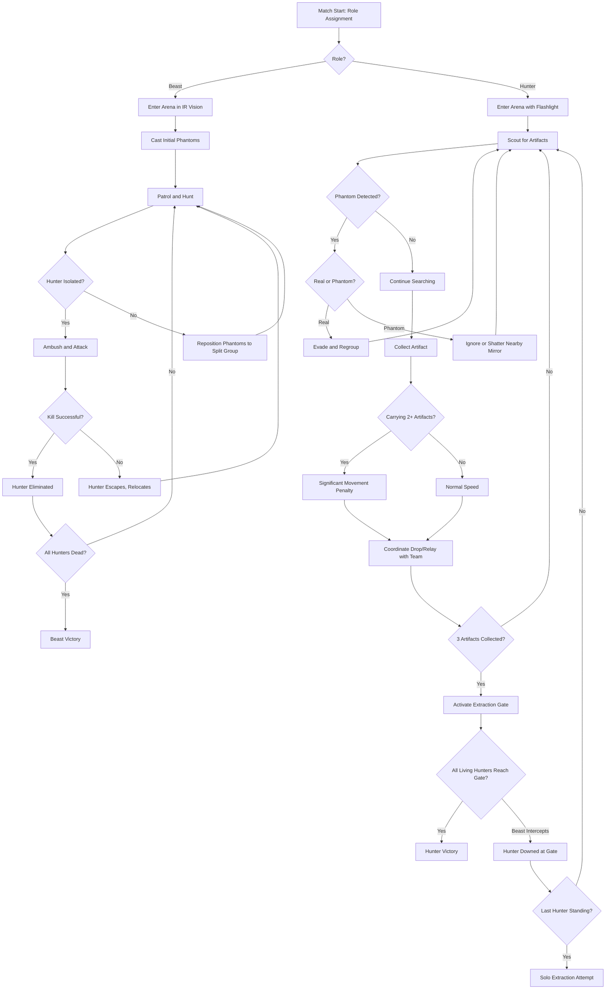
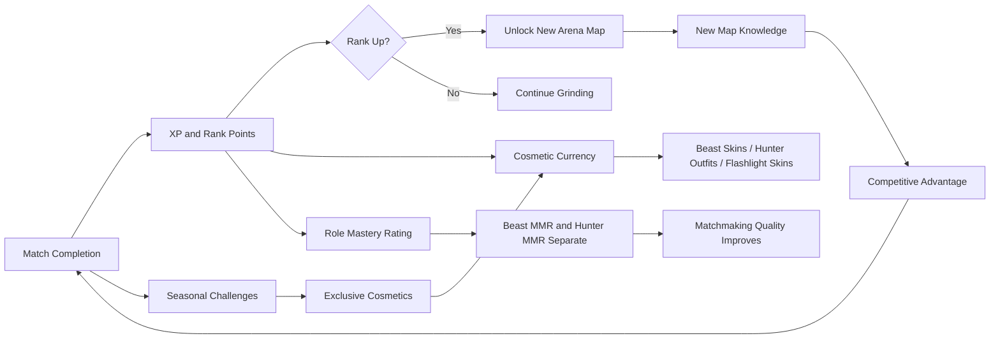

# Midnight Displacer Arena

## Title & Genre

| Field | Value |
|-------|-------|
| **Title** | Midnight Displacer Arena |
| **Genre** | Asymmetric Multiplayer Horror / Information Warfare |
| **Engine** | Unreal Engine 5.4 (Nanite for arena geometry, Lumen for flashlight/IR rendering) |
| **Platform** | PC (Steam), PlayStation 5, Xbox Series X/S |
| **Monetization** | Premium — $39.99 base, seasonal arena map DLC at $7.99 each |
| **Rating** | ESRB M (Intense Violence, Blood, Horror Themes) / PEGI 18 / CERO Z |
| **Players** | 1v4 asymmetric (1 Displacer Beast vs. 4 Treasure Hunters) |

---

## Vision Statement

Midnight Displacer Arena is a 1v4 asymmetric multiplayer horror game where information is the primary weapon. One player controls a Displacer Beast — a six-legged panther with prehensile tentacles that bends light to project phantom copies of itself across a subterranean arena filled with mirror walls and ancient artifacts. Four players are treasure hunters armed with flashlights, proximity sensors, and whatever courage they can muster, trying to collect three artifacts and reach extraction before the beast picks them off one by one. The beast sees the world in infrared; the hunters see only what their failing flashlight beams reveal. Every mirror chamber multiplies the beast's phantom count, making it nearly impossible to distinguish the real threat from the reflections. This is a game about fear engineered through uncertainty — the hunters never know which shadow is real, and the beast never knows which hunter is carrying the artifacts that matter. It is Dead by Daylight meets The Thing, where the monster is not just hunting you but making you doubt your own eyes.

---

## Core Loop

**Target match length:** 12–18 minutes
**Target session length:** 45–90 minutes (3–5 matches)

### Core Loop Breakdown — Beast Player

| Step | Player Action | System Response | Skill Expression |
|------|--------------|-----------------|------------------|
| 1. Cast Phantoms | Place up to 5 phantom copies at targeted positions within 40m radius | Phantoms mimic beast's movement with configurable offset (0.5–3.0 second delay). Phantoms trigger hunter proximity sensors and produce footstep sounds. | Spatial reasoning — phantom placement creates corridors of fear, funneling hunters |
| 2. Patrol | Move through arena in IR vision (all heat sources visible through walls) | Hunters appear as bright orange silhouettes through walls. Phantoms appear as cool blue outlines to beast player only. | Map knowledge, predicting hunter routes from artifact spawn positions |
| 3. Ambush | Strike from an angle hunters don't expect, using phantoms to mask real position | Attack deals 40 damage (hunters have 100 HP). Tentacle grab holds hunter for 2 seconds — teammates can interrupt by dealing 25+ damage to beast | Timing and positioning — the attack must come from where hunters aren't looking |
| 4. Mirror Strategy | Enter mirror rooms to double phantom count (5 to 10 phantoms) | Each mirror surface creates a reflection phantom that copies the beast's movement exactly. Breaking a mirror removes its phantom. | Environmental mastery — mirror rooms are powerful but predictable choke points |
| 5. Adapt | Recast phantoms as hunters learn patterns, relocate to cut off extraction routes | Phantom cooldown: 8 seconds per phantom. Maximum 5 active outside mirror rooms. Recasting replaces oldest phantom. | Pattern disruption — the beast must stay unpredictable or hunters learn to read the fakes |

### Core Loop Breakdown — Hunter Player

| Step | Player Action | System Response | Skill Expression |
|------|--------------|-----------------|------------------|
| 1. Scout | Move through dark arena, flashlight illuminates 12m cone ahead | Flashlight battery drains over 6 minutes of active use. Toggle off to conserve. Dark areas are near-invisible without light. | Battery management — use light sparingly, navigate from memory in dark sections |
| 2. Detect | Proximity sensor pings when a beast or phantom is within 15m | Sensor cannot distinguish real from phantom. Ping rate increases with proximity (0.5s at 15m, 0.1s at 3m). | Information triage — decide quickly whether the ping is worth reacting to |
| 3. Collect | Pick up artifact from fixed spawn locations (6 spawns, 3 active per match) | Artifacts weigh 15% movement speed penalty each. Carrying 2 = 30% penalty. Carrying 3 = 45% penalty. Carrying player glows faintly to beast in IR. | Risk assessment — spread artifacts across team or concentrate with escort? |
| 4. Shatter Mirrors | Melee attack on mirror surfaces in mirror rooms | Shattering a mirror removes 1 phantom reflection and creates a loud noise event audible to beast at 40m range. Shattered mirror glass on the floor produces audible footsteps for 30 seconds. | Strategic sacrifice — remove the beast's information advantage but reveal your position |
| 5. Extract | Deliver 3 artifacts to extraction gate and activate | Extraction gate requires 5-second channel by any living hunter. Gate opens for 8 seconds. Any living hunter who reaches the gate zone escapes. Downed hunters bleed out in 30 seconds unless revived (3-second revive action). | Clutch decision-making — who carries, who escorts, who baits |

---

## Meta Loop

### Match-to-Match Progression

### Progression Axes

| Axis | What Grows | How It Feels | Cap |
|------|-----------|-------------|-----|
| **Rank Tier** | Competitive placement (Bronze through Nightmare) | You climb from pub stomps to coordinated play where every phantom placement matters | 7 tiers, seasonal reset to one tier below peak |
| **Beast Mastery** | Individual MMR for beast role | You face hunters who can read your phantom patterns; you must evolve | No cap — always matched against better readers |
| **Hunter Mastery** | Individual MMR for hunter role | You face beasts with increasingly sophisticated phantom strategies | No cap — always matched against better deceivers |
| **Cosmetic Collection** | Beast skins, hunter outfits, flashlight effects, phantom visual variants | Your presence in the arena is distinct. A rare skin is a status marker | 120+ cosmetics at launch across 4 rarity tiers |
| **Map Knowledge** | Arena layouts, artifact spawn locations, mirror room positions, shortcut timing | You stop reacting to the arena and start using it as a weapon | 8 arenas at launch, 2 added per season |
| **Player Skill** | Phantom reading (spotting real vs. fake), flashlight discipline, extraction coordination, phantom herding | The most important progression — invisible but decisive | No cap — every match teaches something new |

### Seasonal Structure

| Element | Details |
|---------|---------|
| **Season Length** | 10 weeks |
| **Season Reward Track** | 50 tiers, free and premium track ($9.99 season pass) |
| **Free Track Rewards** | 25 cosmetics (hunter outfits, flashlight skins, profile badges) |
| **Premium Track Rewards** | 25 cosmetics (beast skins, phantom variants, exclusive extraction animations) |
| **Seasonal Arena** | 1 new arena map added mid-season (week 5), free for all players |
| **Seasonal Challenge** | Complete 20 challenges across both roles to unlock seasonal exclusive cosmetic |
| **Rank Rewards** | End-of-season cosmetic matching highest rank achieved |

---

## Game Mechanics

### Primary Mechanic: Illusion Casting System

The Displacer Beast's core power is creating phantom copies of itself that are indistinguishable from the real beast at a glance. The system operates on a **phantom budget**:

**Phantom Parameters:**

| Parameter | Value | Notes |
|-----------|-------|-------|
| Maximum phantoms (base) | 5 | Can be recast on 8-second cooldown per phantom |
| Maximum phantoms (mirror room) | 10 | Each intact mirror surface adds 1 phantom |
| Phantom movement pattern | Mimics beast with configurable delay (0.5–3.0 sec) | Player selects delay when casting |
| Phantom visual fidelity | Identical to beast in every way (no shimmer, no transparency) | Phantoms are light-bent projections — physically real to the eye |
| Phantom audio | Produces footstep sounds at 70% real volume | Subtle difference only noticeable at close range with high game volume |
| Phantom proximity sensor trigger | Yes — triggers hunter proximity pings identically to real beast | The core of the information warfare |
| Phantom damage | None — phantoms pass through hunters | The tell: if it doesn't collide with the environment, it's fake (but noticing this requires close observation) |
| Phantom duration | 45 seconds per phantom, then fades | Beast must actively maintain phantom coverage |
| Phantom recast | Replaces oldest phantom | Keeps the beast's phantom layout dynamic |

**The Phantom Placement Interface:**

The beast player enters a "casting stance" (hold left bumper / Q key) which freezes their movement and displays a top-down tactical minimap showing:
- Beast's current position (red dot)
- All active phantom positions (blue dots, visible only to beast)
- Last-known hunter positions from IR detection (orange dots, fade after 5 seconds of no line-of-sight)
- Mirror room locations (white squares)

The beast selects a position on the minimap to place a phantom. The phantom appears in the 3D world at that location and begins mimicking the beast's movement with the configured delay.

**Mirror Room Amplification:**

| Mirror Count | Phantom Bonus | Total Possible Phantoms |
|-------------|--------------|------------------------|
| 0 (standard room) | 0 | 5 |
| 2 mirrors | +2 | 7 |
| 4 mirrors | +4 | 9 |
| 6 mirrors (maximum per room) | +6 | 11 (5 base + 6 mirror) |

Mirrors are environmental fixtures. They cannot be created or moved — only shattered by hunters. Each mirror room contains 2–6 mirrors depending on arena layout. Shattering a mirror:
- Immediately removes the phantom it was generating
- Produces a noise event at 40m (audible to beast on IR as a blue pulse)
- Leaves glass shards on the floor that produce audible footsteps for 30 seconds

### Secondary Mechanic: Treasure vs. Survival Tension

Artifacts are the hunter's objective, but they are also their greatest liability.

**Artifact System:**

| Artifact Count Carried | Movement Speed | Interaction Speed | IR Visibility to Beast | Noise Radius |
|----------------------|---------------|------------------|----------------------|-------------|
| 0 | 100% (5.0 m/s) | 100% | Standard heat signature | Silent |
| 1 | 85% (4.25 m/s) | 90% | Standard + faint gold pulse | Subtle chime at 8m |
| 2 | 70% (3.5 m/s) | 75% | Bright gold pulse visible at 30m | Audible hum at 12m |
| 3 | 55% (2.75 m/s) | 60% | Blazing gold beacon visible at 50m | Loud resonance at 20m |

**Strategic Implications:**

- **Spread strategy:** Each hunter carries 0 or 1 artifact. Speed penalty is manageable. No single hunter is a beacon. But extraction requires all 3 at the gate simultaneously, creating a gathering problem.
- **Concentrate strategy:** One hunter carries all 3 artifacts. That hunter is essentially a lighthouse for the beast. Other 3 hunters must act as escorts/bodyguards. If the carrier dies, all 3 artifacts drop at death location and must be retrieved.
- **Relay strategy:** Hunters throw artifacts to each other (10m range, arc trajectory). The beast sees the throw arc in IR. Allows rapid redistribution but risks interception.

**Artifact Spawn System:**

- 6 artifact spawn points per arena (fixed locations, randomized active set each match)
- 3 of 6 spawns are active each match (randomly selected at match start)
- Spawn points are distributed across the arena to force exploration of multiple zones
- Each artifact has a 3-second pickup animation (cannot move during pickup)
- Dropped artifacts can be picked up by any hunter or destroyed by the beast (2-second destroy action)

### Secondary Mechanic: Light and Vision System

The asymmetric information war is built on the light/vision duality:

**Beast Vision (Infrared):**

| Mode | Range | Detail Level | Stamina Cost |
|------|-------|-------------|-------------|
| Passive IR | Unlimited (through walls) | Heat blobs only — no fine detail, can't distinguish individual hunters at range | None |
| Focused IR (hold trigger) | 50m cone | Full detail — can see hunter outlines, artifact glow, and flashlight beam direction | Drains 2% per second, regenerates at 3% per second |
| Phantom Vision | Same as passive | Phantoms appear as cool blue (vs. warm orange for real targets) | None — always active |

**Hunter Vision (Flashlight):**

| State | Range | Battery Drain | Risk |
|-------|-------|-------------|------|
| Flashlight ON | 12m cone, 60-degree spread | 1% per second (6 minutes total) | Visible to beast in IR as a bright white beam |
| Flashlight OFF | 1m ambient glow only | None | Essentially blind beyond 1m — must navigate by memory |
| Flashlight FLICKER (tap) | 12m cone for 0.5 seconds | 0.2% per flicker | Brief flash — beast sees the flicker but not sustained direction |
| Low Battery (below 15%) | 6m cone, flickers randomly | Accelerated drain (1.5% per second) | Erratic behavior alerts beast to desperation |

**Environmental Lighting:**

Each arena has 3–5 weak ambient light sources (bioluminescent fungi, broken electrical lights, lava seeps) that provide minimal illumination in specific zones. Hunters learn these safe spots for orientation. The beast knows hunters will gravitate toward them.

### Secondary Mechanic: Hunter Combat and Down System

Hunters cannot kill the beast. They can only survive, evade, and temporarily stun.

**Hunter Defensive Tools:**

| Tool | Effect | Cooldown | Range |
|------|--------|----------|-------|
| Flashlight Blind (aim at beast face) | Stuns beast for 1.5 seconds | 15 seconds | 8m cone must be directly aimed |
| Flare Gun (1 per hunter per match) | Creates 15m light zone for 8 seconds — beast takes 3% damage/second in flare light | Single use | 20m arc |
| EMP Grenade (shared team pool of 2) | Disrupts all phantoms in 15m radius for 5 seconds — phantoms flicker and become translucent | Team-shared | Thrown, 15m radius |
| Proximity Sensor Ping | Active scan reveals all entities (real and phantom) on minimap for 2 seconds | 30 seconds | 20m radius |

**Down System:**

| State | HP | Timer | Action Available |
|-------|-----|-------|-----------------|
| Healthy | 100 | None | All actions |
| Injured (1 hit taken) | 40 | None | Movement speed -15%, interaction speed -25%, bleeding visual on screen edges |
| Downed (2nd hit) | 0 | 30-second bleed-out timer | Crawl at 1 m/s, can use proximity sensor only |
| Revived (teammate action) | 40 | None | Injured state — can be downed again by single hit |
| Eliminated (bleed-out or 3rd down) | N/A | None | Spectator mode for remainder of match |

**Beast Attack:**

| Attack | Damage | Range | Wind-Up | Recovery | Special |
|--------|--------|-------|---------|----------|---------|
| Claw Swipe | 60 | 3m | 0.4 seconds | 0.8 seconds | Standard attack |
| Tentacle Grab | 40 + 2-second hold | 8m | 0.6 seconds | 1.2 seconds | Holds hunter in place — teammate must deal 25+ damage to beast to release |
| Pounce | 100 (instant down) | 5m leap | 1.0 seconds (audible growl) | 1.5 seconds | High risk — missed pounce leaves beast vulnerable for 1.5 seconds |

### Match Flow and Pacing

**Phase 1 — Scouting (Minutes 0–4):**

Hunters explore cautiously, locating artifacts. Beast casts initial phantom net, learns hunter routes from IR observation. Low tension — both sides gathering information. Average time to first artifact pickup: 2 minutes 30 seconds.

**Phase 2 — Escalation (Minutes 4–8):**

Beast begins aggressive phantom placement near known artifact locations. Hunters must decide load distribution. First contact typically occurs here — the beast tests hunter reactions, hunters learn the beast's phantom delay preference. Mirror rooms become contested zones. Average time to 3 artifacts collected: 6 minutes.

**Phase 3 — Extraction (Minutes 8–18):**

Extraction gate activates once 3 artifacts are present in the arena. The beast's IR makes the artifact carrier(s) visible. Phantom placement shifts to blocking extraction routes. Hunters must coordinate: who carries, who runs interference, who flanks. The final 60 seconds are the most intense in any match — a slow, artifact-laden crawl toward a gate while phantoms close in from every direction.

### Difficulty Balance Table

| Skill Level | Beast Advantage | Hunter Advantage | Match Duration Tendency | Key Balance Lever |
|------------|----------------|-----------------|------------------------|-------------------|
| Bronze (new players) | Phantoms are easy to spot (slight shimmer added at low MMR) | Extra flare gun (2 per hunter) | 10–12 minutes | Accessibility — teach phantom reading gradually |
| Silver | Standard phantom fidelity | Standard loadout | 12–14 minutes | Core experience — as designed |
| Gold | Beast gains "Phantom Dash" — swap positions with any phantom | Hunters gain "Tag" — mark a phantom to reveal if real/fake for 3 seconds | 12–16 minutes | Expanded toolkit — more options on both sides |
| Platinum | Beast gains "Mirror Walk" — teleport to any intact mirror | Hunters gain "Trap" — place a noise trap that alerts when beast (not phantom) passes | 14–16 minutes | Strategic depth — map control matters more |
| Diamond | Beast gains "Phantom Burst" — all phantoms sprint toward nearest hunter for 2 seconds | Hunters gain "Silent Step" — 5 seconds of zero sound, once per match | 14–18 minutes | Information warfare — every tool is about controlling what the other side knows |
| Nightmare | All beast abilities + phantoms now have collision (push hunters slightly) | All hunter abilities + "Last Stand" — downed hunter can crawl at 3 m/s for 5 seconds | 15–18 minutes | Maximum deception — phantoms are nearly perfect fakes |

---

## World Design

### Arena Architecture

Each arena is a self-contained subterranean environment divided into 4–6 zones connected by corridors, chokepoints, and mirror rooms. Arenas are designed for 5-player asymmetric play — large enough for 4 hunters to spread out, small enough for 1 beast to cover key routes with well-placed phantoms.

**Zone Types:**

| Zone Type | Purpose | Features | Risk Level |
|-----------|---------|----------|-----------|
| **Artifact Chamber** | Contains artifact spawn points | Wide room, multiple exits, minimal cover | High — beast expects hunter traffic |
| **Mirror Hall** | Amplifies phantom count | 2–6 reflective surfaces, narrow corridors between mirrors | Very High — maximum confusion |
| **Corridor Network** | Transit between zones | Narrow passages, limited escape routes, ambush points | Medium — depends on phantom placement |
| **Safe Haven** | Respite and orientation | Bioluminescent lighting, no phantom casting allowed within 5m radius (light interference) | Low — but beast camps the exits |
| **Extraction Zone** | Match endpoint — extraction gate location | Large open area, single gate structure, 5-second activation channel | Escalating — starts safe, becomes a kill zone |
| **Vertical Shaft** | Multi-level transit | Ladders, ledges, drop-downs, line-of-sight breaks | Medium — beast IR sees through floors |

### Launch Arena Roster (8 Maps)

| Arena | Theme | Zones | Mirror Rooms | Artifact Spawns | Extraction Position | Unique Feature |
|-------|-------|-------|-------------|----------------|--------------------|----------------|
| **The Sunken Cathedral** | Flooded Gothic church | 5 | 3 (stained glass reflections) | 6 (3 active) | Collapsed altar — central, exposed | Rising water reduces usable floor space every 3 minutes |
| **Obsidian Warrens** | Volcanic cave system | 6 | 2 (obsidian mirror pools) | 6 (3 active) | Lava tube exit — edge of map | Lava flows create moving hazard zones visible in IR |
| **The Maw** | Organic cavern — walls breathe | 4 | 4 (bioluminescent membrane walls) | 6 (3 active) | Throat passage — long narrow exit | Walls slowly contract every 5 minutes, shrinking the arena |
| **Frozen Bastion** | Ice fortress | 5 | 3 (ice wall reflections) | 6 (3 active) | Shattered portcullis — corner of map | Ice patches cause sliding (no control for 1 second) for all players |
| **The Coin Mint** | Abandoned dwarven forge | 6 | 2 (polished brass walls) | 6 (3 active) | Main vault door — requires 3 artifacts inserted simultaneously | Conveyor belts move all players in set directions |
| **Deep Fungal Forest** | Underground mushroom biome | 5 | 2 (giant spore-cap reflections) | 6 (3 active) | Root cavern exit — 3 possible paths converge | Spore clouds reduce visibility to 3m for 10 seconds (random triggers) |
| **The Clockwork Pit** | Mechanical labyrinth | 6 | 3 (brass gear-polished surfaces) | 6 (3 active) | Central gear platform — descends on activation | Rotating gears change corridor connections every 2 minutes |
| **Blood Chasm** | Ritual sacrifice site | 4 | 4 (blood-pool reflections) | 6 (3 active) | Altar platform — elevated, exposed | Blood pools reveal footprints for 15 seconds (both teams) |

### Art Direction Pillars

| Pillar | Description | Reference |
|--------|-------------|-----------|
| **Oppressive Darkness** | Darkness is the default state. Light is a resource, a weapon, and a liability. The arena should feel like it resents being illuminated. | Amnesia: The Dark Descent, Outlast |
| **Impossible Geometry** | The subterranean spaces feel too vast, too deep, too angular for natural caves. Something built this. The architecture is unsettling because it follows logic that isn't human. | SCP Foundation aesthetic, Alien: Isolation Sevastopol Station |
| **Living Surfaces** | Walls have texture that moves subtly — fungal growth, dripping condensation, breathing membranes. The arena is not a place; it is a creature you are inside. | Dead Space necromorph interiors, Scorn organic architecture |
| **Duality of Light** | Every light source serves two purposes: it illuminates for hunters and it signals to the beast. Light is never safe — it is a transaction. | The Darkness II light/shadow mechanics, Alan Wake |

### Visual and Audio Per-Arena Identity

| Arena | Palette | Dominant Sound | Beast Ambience | Hunter Ambience |
|-------|---------|---------------|---------------|----------------|
| The Sunken Cathedral | Deep blue, algae green, tarnished gold | Dripping water, distant choir echoes | Water current rushing through walls | Echoing footsteps on wet stone |
| Obsidian Warrens | Black, volcanic orange, mineral purple | Rumbling magma, cracking rock | Heat distortion hum | Hissing steam vents |
| The Maw | Flesh pink, bile yellow, bone white | Wet breathing, squelching | Digestive rumbling | Organic pulsing underfoot |
| Frozen Bastion | Ice blue, steel gray, frost white | Cracking ice, howling wind through gaps | Frost crackling on tentacles | Chattering teeth (subtle, periodic) |
| The Coin Mint | Brass gold, soot black, copper green | Grinding gears, stamping presses (distant, rhythmic) | Metal resonance on claws | Coins scattering underfoot |
| Deep Fungal Forest | Phosphorescent green, spore purple, bark brown | Popping spore pods, dripping mycelium | Fungal growth on tentacles pulses | Spore cough (periodic, involuntary) |
| The Clockwork Pit | Brass, tarnished silver, gear oil brown | Ticking, grinding, steam release | Metal-on-metal claw scrape | Clock chimes (every 2 minutes — gear rotation warning) |
| Blood Chasm | Crimson, obsidian black, ritual white | Heartbeat (the arena's), blood dripping | Blood flows toward tentacles | Wet footsteps, squelching |

---

## Narrative

### Tone Spectrum (7-Axis)

| Axis | Position | Notes |
|------|----------|-------|
| Hope vs. Despair | 60% Despair | Extraction is possible but costly. Survival is earned, never given. |
| Order vs. Chaos | 70% Chaos | The arena is ancient and indifferent. No rules except the ones the players make. |
| Sound vs. Silence | 55% Sound | The arena is never silent — it breathes, drips, cracks. Silence is a warning. |
| Human vs. Monster | 50/50 | Neither side is the hero. Beast is a predator following instinct. Hunters are trespassers. |
| Past vs. Present | 80% Present | No cutscenes, no flashbacks. Story is told through the arena itself — what happened here is implied by what remains. |
| Cooperation vs. Betrayal | 40% Betrayal | The artifact system creates natural friction. Leaving a slowed teammate behind is tactically valid. |
| Visibility vs. Mystery | 90% Mystery | You never fully understand the arena. Every match reveals something new about the space. |

### Environmental Storytelling Framework

Midnight Displacer Arena has no explicit narrative — no cutscenes, no dialogue, no text logs. The story is told entirely through the arena environments and what they imply about their history.

**The Implied Lore:**

The arenas are ancient subterranean structures built by a civilization that worshipped the Displacer Beasts as divine predators. Each arena was a temple where offerings (artifacts) were placed to appease the beasts. The extraction gates were ceremonial exits for the offering-bearers who survived. The mirror rooms were meditation chambers where priests trained to distinguish divine reality from divine illusion — and many failed.

**Environmental Storytelling Elements per Arena:**

| Element | What It Looks Like | What It Implies |
|---------|-------------------|-----------------|
| Crumbling offering pedestals | Stone platforms with worn carvings of six-legged figures surrounded by kneeling humanoids | The artifact spawns are not random — they are ancient offering sites |
| Faded murals behind mineral deposits | Paintings showing a beast surrounded by light copies, with humans fleeing in terror | The displacement illusion has been the beast's nature for millennia |
| Collapsed extraction gates (old, sealed) | Bricked-over gates with claw marks on the inside | Not everyone who entered survived to use the exit |
| Skeletons in corners | Human remains in ritualistic poses, some holding rusted artifacts | Previous treasure seekers — or offerings — who didn't make it |
| Beast-sized claw marks on walls | Deep gouges in stone at consistent 3-meter heights | The beast isn't the first of its kind — this is an ancient species |
| Empty mirror frames | Mirror rooms where some mirrors are already shattered, glass long gone | Someone before you fought the same phantom war and chose to break the mirrors |

**Seasonal Narrative Arc:**

Each season introduces a new arena that expands the implied lore. The arenas are connected — they exist in the same subterranean network. Each new map reveals more about the civilization that built them and what happened to them.

| Season | Arena | Lore Revelation |
|--------|-------|----------------|
| Season 1 (Launch) | All 8 launch arenas | The temples exist. The beasts are ancient. The offerings were real. |
| Season 2 | The Breeding Warrens | The beasts are not singular — there is a colony. The civilization didn't worship one beast; they farmed them. |
| Season 3 | The Priest's Sanctum | The mirrors were training tools. The priests were trying to learn to see through the illusion. They failed. |
| Season 4 | The Surface Gate | The subterranean network has an entrance. Someone sealed it from the inside. |

### Character Archetypes

Midnight Displacer Arena has no named characters. Instead, it has **archetypes** expressed through cosmetic loadouts that imply personal backstories.

| Archetype | Available To | Implied Story | Cosmetic Set |
|-----------|-------------|---------------|-------------|
| **The Professor** | Hunter | Academic who came to study the ruins, now fighting to survive with knowledge as a weapon | Tweed coat, glasses flashlight attachment, leather satchel |
| **The Mercenary** | Hunter | Hired to retrieve artifacts for a collector. Doesn't care about the history — cares about the payout | Tactical vest, headlamp, utility belt |
| **The Pilgrim** | Hunter | Believes the artifacts are sacred relics. Treats the arena with reverence even while running for their life | Hooded robe, candle flashlight, prayer beads on belt |
| **The Thrill-Seeker** | Hunter | Rich kid who pays for illegal underground experiences. This one went sideways. | Designer jacket, smartphone flashlight, luxury watch |
| **The Veteran** | Hunter | Has been in the arenas before. The scars are real. The thousand-yard stare is real. | Bandaged limbs, reinforced flashlight, survival gear |
| **The Apex** | Beast | The oldest and largest of the colony. Its tentacles are scarred from a thousand hunts. | Massive frame, battle-scarred hide, golden eye variants |
| **The Juvenile** | Beast | Young, smaller, faster. Makes up for size with aggression. | Sleek frame, unmarked fur, bright eye colors |
| **The Ancient** | Beast | Something awakened after centuries of dormancy. Its fur is matted with mineral deposits. | Crystalline growths on hide, geode eye variants, heavier movement |

---

## Player Personas

### P-001: Alex Rivera — The Ranked Grinder

**Why this game fits:** Alex craves competitive depth where skill expression matters. The beast role is a mastery curve — placing phantoms effectively against increasingly skilled hunters who learn to read patterns requires constant adaptation. The hunter role rewards map knowledge, flashlight discipline, and team coordination under pressure. Both roles have separate MMR ratings, meaning Alex can grind two competitive tracks simultaneously.

**Predicted experience:** Alex will main the beast role for the first 50 hours, treating phantom placement as a tactical puzzle. He'll develop signature phantom configurations that exploit specific arena geometries. At higher MMR, he'll shift to hunter play to understand the opposition's perspective, then oscillate between roles. He'll engage with the community through beast strategy guides and phantom placement analysis videos. He'll hate mirror rooms as a hunter and love them as a beast.

### P-005: Marcus Johnson — The Competitive MOBA Player

**Why this game fits:** Marcus plays for the social coordination with his squad. A 4-player hunter team is exactly his context — he and his dorm friends can fill roles (scout, carrier, escort, flanker) and develop team strategies. The asymmetric design means there's always a clear opponent to strategize against. The information warfare appeals to the MOBA player's love of vision control and map awareness.

**Predicted experience:** Marcus will organize a 4-person hunter squad with assigned roles. He'll call out phantom positions over Discord, coordinate artifact relay throws, and develop extraction strategies. His squad will have a regular play schedule. He'll spend $15–25/month on cosmetics that make his squad visually cohesive. He'll occasionally queue as beast when his squad isn't online. He'll leave if matchmaking pits his coordinated squad against disorganized randoms too often — fairness in opposition matters.

### P-010: Kevin Nguyen — The Competitive Whale

**Why this game fits:** Kevin dreams of esports, and asymmetric multiplayer is an emerging competitive genre. The separate beast/hunter MMR ratings create two distinct competitive tracks to master. The seasonal rank system with visible tiers gives Kevin a progression ladder to climb publicly. The premium model with no P2W mechanics means his competitive advantage comes from practice, not purchases — which Kevin respects.

**Predicted experience:** Kevin will treat the game as a training regimen. He'll practice beast phantom placements for 2 hours daily, then switch to hunter for 2 hours to understand the other perspective. He'll track win rates per arena, per role, per time-of-match (early game vs. extraction phase). He'll participate in community tournaments. He'll spend $50–100/month on premium cosmetics, battle passes, and seasonal exclusives. He'll generate content — beast strategy breakdowns, phantom pattern analysis, extraction route optimization guides. He'll be the first to discover advanced techniques in each new arena.

### P-009: Liam O'Connor — The Dedicated F2P

**Why this game fits:** Premium pricing at $39.99 with no microtransactions that affect gameplay is exactly the model Liam champions. The beast role's phantom system is pure skill expression — no amount of money makes your phantoms better. The hunter role rewards game sense, flashlight discipline, and map knowledge over any purchasable advantage. Liam can compete at the highest level without spending another cent beyond the entry price.

**Predicted experience:** Liam will buy the base game and never spend another dollar. He'll become a vocal advocate for the game's fair monetization model. He'll create free guides for F2P players detailing optimal hunter strategies for each arena. He'll main hunter and develop a reputation for phantom-reading accuracy — he'll be able to distinguish real from fake based on subtle environmental cues (footstep volume, collision with objects, shadow behavior). He'll stream matches and build his audience around "skill-only" gameplay. He'll flag any future DLC that introduces gameplay-affecting items as an immediate betrayal.

---

## User Stories

### Core Gameplay — Beast Role (6 stories)

1. As **Alex (P-001)**, I want to configure each phantom's movement delay independently (0.5–3.0 seconds) so that I can create complex phantom patterns that deceive experienced hunters.
2. As **Kevin (P-010)**, I want a tactical minimap overlay during phantom casting that shows my active phantom positions and last-known hunter locations so that I can make informed placement decisions quickly.
3. As **Alex (P-001)**, I want mirror rooms to double my phantom count automatically so that I can create overwhelming information chaos in specific zones I choose to control.
4. As **Kevin (P-010)**, I want to swap positions with any active phantom as a Diamond-rank ability so that I can execute ambush strategies that exploit hunter assumptions about which copy is real.
5. As **Alex (P-001)**, I want the pounce attack to be high-risk/high-reward (instant down on hit, long vulnerability on miss) so that mechanical skill translates directly into elimination power.
6. As **Kevin (P-010)**, I want my tentacle grab to hold a hunter for 2 seconds while requiring teammate intervention to break so that the beast creates forced teamfight decisions.

### Core Gameplay — Hunter Role (6 stories)

7. As **Marcus (P-005)**, I want proximity sensors that cannot distinguish real beasts from phantoms so that every ping creates a genuine decision: fight, flee, or ignore.
8. As **Liam (P-009)**, I want phantoms to have subtle environmental tells (footstep volume at 70%, no environmental collision, no shadow cast) so that skilled observation is rewarded over raw reaction speed.
9. As **Marcus (P-005)**, I want to throw artifacts to teammates within 10m so that my squad can execute relay extraction strategies where the beast never knows who is carrying.
10. As **Liam (P-009)**, I want mirror-shattering to remove phantom reflections at the cost of revealing my position so that I can strategically dismantle the beast's information advantage.
11. As **Marcus (P-005)**, I want a 3-second revive action on downed teammates so that coordinated squads can rescue each other but the beast can punish the attempt.
12. As **Liam (P-009)**, I want flashlight battery to drain over 6 minutes of active use so that light conservation becomes a core survival skill across the match.

### Artifacts and Extraction (5 stories)

13. As **Marcus (P-005)**, I want carrying multiple artifacts to stack movement penalties (15% each) and increase IR visibility so that load distribution is a strategic team decision, not a trivial choice.
14. As **Alex (P-001)**, I want artifact carriers to be visible to the beast in IR with escalating intensity (1 artifact = subtle, 3 artifacts = beacon) so that the beast can target the most dangerous hunter.
15. As **Marcus (P-005)**, I want the extraction gate to require a 5-second channel by any living hunter so that the final extraction is a tense, committed action that the beast can interrupt.
16. As **Liam (P-009)**, I want dropped artifacts at a death location to create a "grave marker" visible to both teams so that contested artifact recovery becomes a strategic flashpoint.
17. As **Kevin (P-010)**, I want 6 artifact spawns per arena with only 3 active per match (randomized) so that map knowledge matters but every match requires fresh scouting.

### Progression and Competition (5 stories)

18. As **Alex (P-001)**, I want separate MMR ratings for beast and hunter roles so that I can track and improve my skill in each role independently.
19. As **Kevin (P-010)**, I want a seasonal rank system (Bronze through Nightmare) with visible tier badges so that competitive progression is displayed publicly.
20. As **Kevin (P-010)**, I want rank-specific abilities that unlock at higher tiers (Phantom Dash at Gold, Mirror Walk at Platinum, etc.) so that higher-skill matches have deeper strategic toolkits.
21. As **Alex (P-001)**, I want a match replay system that records both teams' perspectives so that I can review my phantom placements and the hunters' counter-strategies.
22. As **Kevin (P-010)**, I want seasonal leaderboards per arena, per role so that I can compete for specific arena mastery rather than a single global rating.

### Social and Community (4 stories)

23. As **Marcus (P-005)**, I want a pre-match squad lobby with role assignment (scout, carrier, escort, flanker) so that my friend group can coordinate before entering the arena.
24. As **Liam (P-009)**, I want no gameplay-affecting microtransactions so that I can champion the game in my communities as a fair, skill-only competitive experience.
25. As **Kevin (P-010)**, I want community tournament support with custom lobby codes and spectator mode so that organized competitive play can grow organically.
26. As **Marcus (P-005)**, I want cross-platform party invites so that my squad isn't limited by platform choice when coordinating sessions.

### Accessibility (4 stories)

27. As a player with auditory processing differences, I want phantom footstep volume (70% of real) to be a configurable slider so that I can set the audio difference to a level I can distinguish.
28. As **Alex (P-001)**, I want fully remappable controls for both beast and hunter roles independently so that I can maintain my competitive layout across roles.
29. As a player with color vision deficiency, I want proximity sensor pings to use shape and pattern (not just color) to convey proximity so that the detection system is readable without color perception.
30. As a player with motor impairments, I want an assist mode that extends the beast's phantom cast time window and the hunter's revive window so that the core experience is accessible without trivializing the information warfare.

---

## Monetization

### Revenue Model: Premium at $39.99 + Seasonal DLC

**Why this model fits this game:**
- Asymmetric multiplayer thrives on fair competition — P2W mechanics would destroy the core information warfare loop
- The beast role's phantom system is pure skill expression — monetizing phantom count or cast speed would be catastrophic
- The target audience (P-001, P-005, P-010, P-009) values competitive integrity over free-to-play convenience
- Seasonal arena DLC extends content without fracturing the player base (see pricing strategy below)

### Pricing and Content Roadmap

| Product | Price | Content | Target Window |
|---------|-------|---------|--------------|
| Base Game | $39.99 | 8 arenas, all gameplay systems, 120+ cosmetics, ranked mode | Launch |
| Deluxe Edition | $54.99 | Base + Season 1 pass + exclusive "Warden" beast skin + "Expedition" hunter set | Launch |
| Season Pass (per season) | $9.99 | 25 premium cosmetics, seasonal exclusive, 2-week early access to new arena | Every 10 weeks |
| Arena DLC (standalone) | $7.99 | 1 new arena map (also included in season pass) | Every 10 weeks |
| Cosmetic Packs (4 planned) | $4.99–$9.99 | Themed cosmetic bundles (no gameplay effect) | Quarterly |

**Critical design rule:** All gameplay-affecting systems (phantoms, abilities, artifacts, tools) are identical for all players regardless of purchase. Cosmetics are visual only and do not affect phantom visual fidelity, hunter visibility, or any detection system.

### Player Base Protection Strategy

Arena DLC maps are available to all players in matchmaking after a 2-week early access period for season pass holders. This prevents player base fragmentation — the $7.99 purchase buys early access and private lobby creation, not exclusive matchmaking. A healthy queue population is worth more than per-map revenue.

### Revenue Projections (4 Scenarios)

| Scenario | Year 1 Units | Year 1 Revenue | Year 2 (Seasonal) | Total (2yr) | Assumptions |
|----------|-------------|---------------|-------------------|------------|-------------|
| **Modest** | 60,000 | $2.0M | $720K | $2.7M | Niche asymmetrical horror audience, word-of-mouth, 20% season pass attach |
| **Baseline** | 180,000 | $6.1M | $2.7M | $8.8M | Moderate marketing, positive streamer coverage, 30% season pass attach |
| **Strong** | 450,000 | $15.3M | $8.1M | $23.4M | Strong Twitch presence, influencer adoption, 35% season pass attach + cosmetic packs |
| **Breakout** | 1,200,000 | $40.8M | $22.5M | $63.3M | Viral clips, competitive scene growth, 40% season pass attach + tournament sponsorship |

**Break-even at approximately 47,000 units ($1.5M) against total development budget of $1.86M (see Production Plan).**

---

## Production Plan

### Team

| Role | Count | Phase | Monthly Cost (Loaded) |
|------|-------|-------|----------------------|
| Game Director / Lead Design | 1 | All | $12,000 |
| Multiplayer / Network Programmer | 2 | All | $10,500 each |
| Systems Designer (asymmetric balance) | 1 | All | $9,500 |
| Level Designer (arena construction) | 2 | Months 3–14 | $8,500 each |
| AI Programmer (beast behavior, phantom system) | 1 | All | $10,000 |
| Rendering Programmer (IR vision, mirror reflections) | 1 | Months 1–6, 10–14 | $11,000 |
| UI/UX Designer | 1 | Months 2–14 | $8,000 |
| 3D Artists (Environment) | 2 | Months 3–12 | $8,000 each |
| 3D Artist (Beast model + animation) | 1 | Months 2–14 | $9,000 |
| VFX Artist (phantom effects, mirror shaders) | 1 | Months 5–14 | $8,000 |
| Audio Designer | 1 | Months 4–14 | $7,500 |
| QA Lead | 1 | Months 8–16 | $7,000 |
| QA Testers (multiplayer focused) | 3 | Months 10–16 | $5,000 each |
| Producer | 1 | All | $10,000 |

**Total team: 19 people peak (months 6–12)**

### Timeline (16-month production)

| Month | Milestone | Key Deliverables |
|-------|-----------|-----------------|
| 1 | Prototype | Core 1v4 loop, phantom casting prototype, basic hunter movement, flashlight system, 1 test arena (greybox) |
| 2 | Vertical Slice | First mirror room operational, artifact pickup/drop, beast IR vision prototype, first beast model in-engine |
| 3 | Pre-Production Complete | 8 arena layouts greyboxed, phantom movement replication system finalized, network architecture validated (dedicated server + 5-client sync) |
| 4 | Production Phase 1 | Arenas 1–2 art pass, phantom audio system (footstep differentiation), proximity sensor system implemented |
| 5 | Production Phase 1 | Artifact weight system complete, extraction gate sequence implemented, beast attack suite (claw/grab/pounce) functional |
| 6 | Production Phase 2 | Arenas 3–4 art pass, mirror reflection system operational, flare gun and EMP grenade implemented |
| 7 | Production Phase 2 | Down/revive system complete, MMR framework implemented, matchmaking prototype for internal testing |
| 8 | Production Phase 2 | Arenas 5–6 art pass, all rank-tier abilities prototyped, QA begins systematic testing |
| 9 | Production Phase 3 | Arenas 7–8 art pass, cosmetic system integrated, replay system prototype |
| 10 | Production Phase 3 | Balance pass 1 — phantom parameters, artifact distribution, mirror room geometry adjustments based on QA data |
| 11 | Production Phase 3 | Cross-platform network testing (PC-PS5-Xbox), spectator mode for tournament support, spectator UI |
| 12 | Alpha | All 8 arenas playable, all systems integrated, ranked mode functional, internal playtest tournament |
| 13 | Alpha Iteration | Balance pass 2 based on alpha data — phantom count tuning, artifact spawn distribution, mirror room phantom caps |
| 14 | Beta | Feature complete, external playtest with 500 invited players, server stress testing, platform cert submission begins |
| 15 | Release Candidate | Platform certification, day-1 patch preparation, server infrastructure scaling, influencer preview builds |
| 16 | Launch | Game ships on all platforms, ranked season 1 begins, day-1 patch deployed, live operations begin |

### Budget Breakdown

| Category | Cost | Notes |
|----------|------|-------|
| Salaries (16 months, 19 FTE peak) | $1,280,000 | Blended rate ~$8,700/mo avg |
| Unreal Engine 5 royalties | $0 (first $1M gross revenue free) | 5% after $1M |
| Server Infrastructure (development + launch) | $85,000 | Dedicated server hosting, matchmaking infrastructure, replay storage |
| Software and Tools | $38,000 | Perforce, Jira, Adobe CC, Wwise, platform dev kits |
| Hardware (dev kits, workstations) | $55,000 | 2 PS5 dev kits, 2 Xbox dev kits, 12 workstations |
| QA and Playtesting | $52,000 | External QA contractor, 500-player beta playtest infrastructure |
| Audio (sound design, music production) | $40,000 | Arena ambience, beast vocalizations, hunter audio cues, menu music |
| Marketing | $100,000 | 2 trailers, Twitch Rivals event at launch, influencer outreach, PR retainer |
| Operations and Overhead | $65,000 | Office/legal/accounting/insurance |
| Contingency (10%) | $140,000 | |
| **Total** | **$1,855,000** | |

---

## Technical Requirements

### Platform Specifications

| Spec | PC Minimum | PC Recommended | PlayStation 5 | Xbox Series X |
|------|-----------|---------------|--------------|--------------|
| **OS** | Windows 10 64-bit | Windows 11 64-bit | PS5 system software | Xbox OS |
| **CPU** | Intel i5-9600K / AMD Ryzen 5 3600 | Intel i7-10700K / AMD Ryzen 7 5800X | Custom AMD Zen 2 | Custom AMD Zen 2 |
| **RAM** | 8 GB | 16 GB | 16 GB GDDR6 | 16 GB GDDR6 |
| **GPU** | GTX 1060 6GB / RX 580 | RTX 3070 / RX 6800 XT | Custom RDNA 2 | Custom RDNA 2 |
| **Storage** | 20 GB SSD | 20 GB NVMe SSD | 20 GB SSD | 20 GB SSD |
| **Target Resolution** | 1080p / 60 FPS | 1440p / 60 FPS | 4K/60 or 1440p/120 | 4K/60 or 1440p/120 |
| **Network** | Broadband (10 Mbps) | Broadband (25 Mbps) | Broadband (10 Mbps) | Broadband (10 Mbps) |

**Frame rate target: 60 FPS minimum on all platforms.** The phantom system's visual fidelity requires consistent frame delivery — frame drops during phantom rendering would create unintended visual tells.

### Key Technical Challenges

| Challenge | Risk | Mitigation |
|-----------|------|-----------|
| **Mirror reflection phantom rendering** | High — each mirror surface must render phantom geometry from correct reflective angle without performance collapse | Pre-computed reflection planes. Mirror surfaces use screen-space reflections with phantom-only render pass. Maximum 6 mirrors per room cap. Profiling target: less than 2ms per mirror at 1080p/60. |
| **5-player network sync with phantom state** | High — 5 phantoms multiplied by 5 players multiplied by position/movement data creates significant state replication load | Phantom positions are server-authoritative. Only beast player receives phantom creation input; server broadcasts phantom state to all clients. Tick rate: 60 Hz for beast/hunter positions, 20 Hz for phantom positions (phantoms move on delay, high-frequency updates unnecessary). |
| **IR vision rendering (see through walls)** | Medium — rendering hunter silhouettes through geometry for beast player without revealing geometry detail | Custom post-process material on beast camera: depth-based silhouette rendering at configurable blur radius. No actual wall transparency — just heat blob overlay. Tested in prototype at month 1. |
| **Cross-platform play (PC/PS5/Xbox)** | Medium — input latency differences, cert requirements, platform-specific network quirks | Input-agnostic design: no aim-assist advantages on console. Cross-platform matchmaking with input-based sub-queues (controller vs. KBM). Platform cert requirements tracked from month 3. |
| **Phantom visual fidelity at distance** | Medium — phantoms must look identical to the real beast at any range, but LOD transitions could create visual tells | Phantoms use identical mesh and material as beast at all LOD levels. No LOD reduction for phantoms. Performance budget includes phantom LOD cost. If necessary, reduce beast LOD quality to match phantom LOD rather than the reverse. |
| **Matchmaking with separate role MMR** | Low — standard two-rating matchmaking with role preference queue | Players queue with role preference (beast/hunter/any). Matchmaker fills 1 beast + 4 hunters using respective MMR ratings. Average queue time target: under 90 seconds at peak, under 180 seconds off-peak. |

### Server Architecture

| Component | Specification | Purpose |
|-----------|-------------|---------|
| Dedicated match servers | 8-core, 32GB RAM, per-region | Host 5-player matches with server-authoritative phantom state |
| Matchmaking service | Horizontally scaled, per-region | Pair 1 beast + 4 hunters by role MMR with queue time priority |
| Replay storage | Object storage (S3-compatible) | Store match replays (estimated 2MB per 15-minute match) for 30 days |
| MMR database | Low-latency key-value store | Separate beast and hunter ratings, updated post-match |
| Presence service | WebSocket-based | Track online players, friend lists, squad lobby state |

### Network Performance Targets

| Metric | Target | Failure Threshold |
|--------|--------|-------------------|
| Server tick rate | 60 Hz (positions), 20 Hz (phantoms) | Below 30 Hz = match quality warning |
| Client-to-server latency | Under 80ms (regional servers) | Above 150ms = lag compensation degraded |
| Phantom position accuracy | Within 0.5m of server state | Above 2m desync = phantom visual glitches |
| Match connection stability | Below 1% match drops from network issues | Above 3% = server health investigation |
| Replay upload | Under 10 seconds post-match | Above 30 seconds = replay storage bottleneck |

---

<npl-block type="reflection">
Correctness: All 12 sections present (Title & Genre, Vision Statement, Core Loop, Meta Loop, Game Mechanics, World Design, Narrative, Player Personas, User Stories, Monetization, Production Plan, Technical Requirements). Numbers internally consistent — budget ($1.86M), team (19 peak), timeline (16 months), revenue projections cross-reference break-even against budget. All user stories reference specific personas by ID. Match pacing numbers are consistent across sections (12–18 min matches, 6 min artifact collection average).

Edge cases: Artifact carry system has clear edge cases (3 artifacts = 55% speed, 45m IR visibility, 20m noise). Down system prevents infinite revive loops (3rd down = elimination). Phantom system caps at 11 total (5 base + 6 mirror maximum). Mirror shattering trade-off documented (remove phantoms but reveal position). Flashlight battery edge case at below 15% (flickering, accelerated drain).

Security: No security concerns — this is a game design document. Server architecture mentions authoritative phantom state to prevent client-side cheating.

Pitfalls: Persona library is mobile-gaming-oriented but this game is console/PC premium. Addressed by focusing on behavioral fit (competitive drive, social coordination, fair monetization advocacy) rather than platform match. Revenue projections depend heavily on Twitch/streamer adoption — asymmetric multiplayer is particularly streaming-friendly (entertaining to watch) but this is not guaranteed. Break-even at 47K units is achievable for a well-marketed asymmetrical horror title but requires the game to actually ship with the quality described.

Improvements: Could add a post-launch content cadence section beyond seasonal arenas. Could expand the ranked ability system with more detail on unlock conditions. Could add a spectator/commentary mode specification for tournament organizers. Could include accessibility as a standalone section rather than 4 user stories.

Refactors: Document structure follows the 12-section format exactly as established by the reference document. No refactoring needed.

Documentation: This IS the documentation.

Clarifications: None needed — all assumptions stated in persona mapping, monetization rationale, and technical challenge mitigation sections.

TODOs: Seasonal arena designs (The Breeding Warrens, The Priest's Sanctum, The Surface Gate) would each need their own design pass. Ranked ability balance needs iterative tuning during alpha. Cross-platform certification requirements need platform-specific documentation beyond what's included here.
</npl-block>