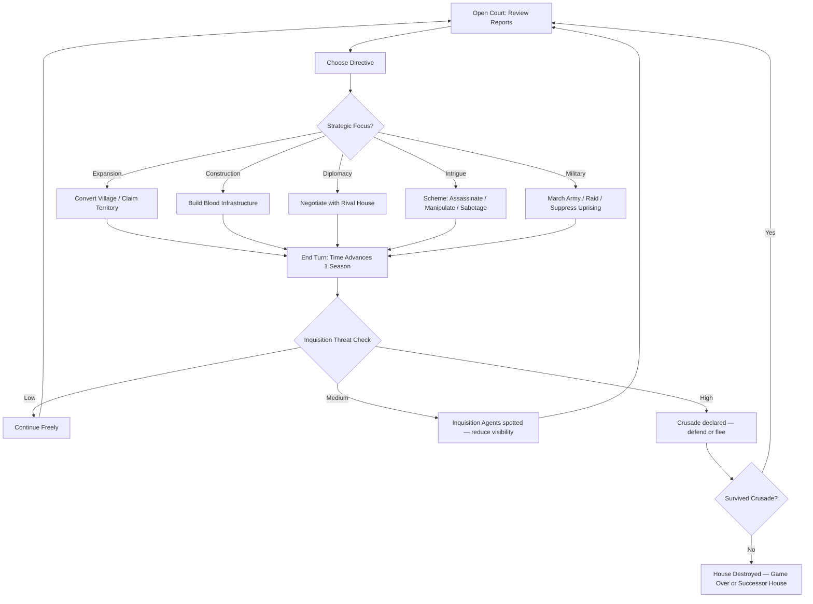
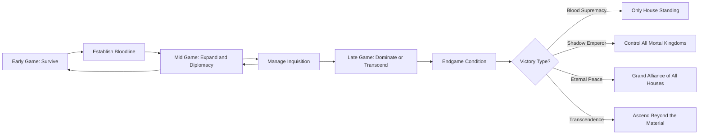

# Midnight Tyranny

## Title & Genre

| Field | Value |
|-------|-------|
| **Title** | Midnight Tyranny |
| **Genre** | Grand Strategy / 4X |
| **Engine** | Unity 2023 LTS (ECS for entity-heavy simulations, DOTS for map-scale calculations) |
| **Platform** | PC (Steam, GOG) |
| **Monetization** | Premium $39.99, expansion DLC adding new bloodlines and continents |
| **Rating** | ESRB M (Blood and Gore, Violence, Sexual Themes) / PEGI 18 / CERO Z |

---

## Vision Statement

Midnight Tyranny is a grand strategy game where you command a cabal of vampire lords vying for dominance across a gothic continent perpetually trapped in twilight. The game sits at the intersection of Crusader Kings III's dynastic intrigue, Civilization's empire-building, and the gothic blood-politics of Vampire: The Masquerade. Every diplomatic move ripples across centuries of in-game time. Every alliance has a shelf life measured in the lifespans of the mortals your houses treat as currency. The mortal Inquisition is not a scripted event — it is an emergent system that escalates based on player aggression, visibility, and carelessness, capable of toppling even the most powerful vampire empire if left unchecked. This is a game about eternal power held by beings who cannot help but squander it on ancient grudges, and about the mortals who — given enough time, enough fear, and enough fire — can bring gods to their knees. It is Crusader Kings with fangs.

---

## Core Loop

**Target session length:** 60–120 minutes (grand strategy pacing)



### Core Loop Breakdown

| Step | Player Action | System Response | Skill Expression |
|------|--------------|----------------|-----------------|
| 1. Open Court | Review reports from thralls, spies, and ministers across all territories | Information is filtered through minister loyalty — disloyal ministers suppress or falsify data | Information management, reading between the lines |
| 2. Choose Directive | Allocate actions across expansion, construction, diplomacy, intrigue, or military | Actions are limited by Blood Reserves and minister capacity per turn | Priority assessment, resource allocation |
| 3. Expand | Send agents to convert peasant villages; claim unoccupied or contested territory | Conversion speed depends on local religion, morale, and proximity to existing holdings. Overt conversion raises Inquisition awareness | Calculated risk, timing aggression against visibility |
| 4. Construct | Build cathedral-fortresses, blood refineries, shadow roads, thrall dormitories | Blood refineries convert peasant population into Blood resource. Shadow roads enable instant troop movement between connected cities | Infrastructure planning, supply chain optimization |
| 5. Diplomacy | Negotiate dynastic pacts, arrange thrall marriages, propose non-aggression treaties | Rival houses have trust meters that decay over time. Breaking treaties causes permanent reputation damage. Arranged marriages create bloodline mixing with mechanical consequences | Long-term relationship management, reading rival personalities |
| 6. Intrigue | Launch assassination plots, spread disinformation, blackmail rival lords | Intrigue success depends on spy network density in target territory and target's own counter-intelligence | Calculated risk-taking, network investment vs. payoff |
| 7. Military | March armies, raid caravans, suppress uprisings, defend against crusades | Military action is the most visible — each battle spikes Inquisition awareness dramatically. Armies require Blood to maintain in the field | Force projection, understanding when violence is worth the visibility cost |
| 8. End Turn | Confirm actions, time advances one season (3 months in-game) | Seasonal effects apply. Mortal populations grow or shrink. Rival houses act. Inquisition threat recalculates | Forward planning — each turn commits to consequences that compound |

---

## Meta Loop

### Campaign-to-Campaign Progression



### Progression Axes

| Axis | What Grows | How It Feels | Cap |
|------|-----------|-------------|-----|
| **Territory** | Villages → towns → cities → continental provinces | Your domain spreads across the map like blood spreading in water | 7 provinces, each containing 8–12 territories |
| **Bloodline Power** | Bloodline abilities unlock and deepen across centuries | Your house's unique strain of sanguine magic becomes increasingly potent and distinctive | 4 tiers per bloodline ability, 5 abilities per bloodline |
| **Diplomatic Influence** | Trust meters, treaty networks, marriage alliances, midnight court standing | You stop being a participant in vampire politics and start being the one who sets the agenda | Grand Elder status (recognized by 4+ houses) |
| **Inquisition Management** | Counter-intelligence, visibility suppression, mortal puppet governments | You learn to rule from shadows rather than thrones — or you die | Maximum awareness triggers crusade; managing below threshold is the skill |
| **Dynastic Legacy** | Progeny generations, blood-purity tracking, trait inheritance across centuries | Your decisions from 200 years ago echo in the traits of your current lord | 12 generations per campaign (600–800 years) |
| **Player Knowledge** | Map familiarity, house personalities, event triggers, optimal build orders | Each campaign teaches you the systems; mastery emerges across playthroughs | No cap — procedural house generation ensures freshness |

---

## Game Mechanics

### Primary Mechanic: Bloodline Politics

Each playable house practices a different strain of sanguine magic. Bloodlines are not cosmetic — they fundamentally reshape how you approach every system in the game.

#### The 6 Playable Bloodlines

| Bloodline | Sanguine Strain | Core Bonus | Diplomatic Style | Weakness |
|-----------|----------------|------------|------------------|----------|
| **House Vralen** | Hemomancy (Blood Sorcery) | +25% Blood refinery output; can spend Blood to boost any action | Pragmatic — alliances are tools, broken without hesitation when convenient | Cannot form genuine trust alliances; all rivals start with -10 trust |
| **House Morgravia** | Necrarchy (Death Command) | Raise fallen enemies as undead troops; no population cost for army replenishment | Intimidation-focused — uses military threat to extract concessions | Inquisition awareness rises 50% faster (undead are visibile) |
| **House Kaltherzig** | Pyrohemia (Blood Fire) | Military units deal +30% damage; siege warfare 40% faster | Aggressive — prefers conquest over negotiation; poor at long-term alliances | Diplomatic trust decays 2x faster with all houses |
| **House Nocwyr** | Oneirocracy (Dream Dominion) | Spy networks 50% more effective; can manipulate rival lords through dreams | Manipulative — excels at intrigue and disinformation; terrible in direct conflict | -20% military effectiveness; armies cost +30% Blood to maintain |
| **House Savarin** | Symbiosis (Thrall Bonding) | Thrall populations produce 40% more resources; thrall morale never drops below "content" | Cooperative — builds genuine long-term alliances; thralls are fiercely loyal | Vulnerable to assassinations — lord's death causes cascading thrall revolts |
| **House Tepelene** | Metamorphosis (Flesh Shaping) | Lords can shapeshift into mortal forms — zero Inquisition detection while shifted; infiltrate mortal governments directly | Subversive — rules through mortal puppet governments rather than direct control | Shapeshifting costs Blood continuously; cannot maintain form during crusades |

#### Dynastic Pacts and Midnight Courts

**Midnight Courts** convene every 25 in-game years. All surviving houses attend. Three types of business:

| Business | Effect | Risk |
|----------|--------|------|
| **Ritual Duel** | Challenge a rival lord to single combat — winner claims a territory | If you lose, your lord dies and must be replaced by heir (inheriting reduced stats) |
| **Blood Accord** | Formalize a treaty before the court — accords witnessed by all houses are harder to break | Breaking a Blood Accord reduces trust with ALL houses, not just the betrayed |
| **Accusation of Treason** | Present evidence of another house's treaty violation — if convincing, the accused loses standing | If evidence is fabricated (failed intrigue check), YOU lose standing instead |

**Dynastic Pacts** create persistent diplomatic relationships:

| Pact Type | Requirements | Effect | Duration |
|-----------|-------------|--------|----------|
| **Blood Brotherhood** | Mutual trust >= 60; shared enemy | Military alliance — troops combine in wars against third parties | 50 years or until one party attacks the other |
| **Thrall Marriage** | Both houses control mortal nobility | Mortal heirs carry bloodline traits of both houses; reduces Inquisition awareness in married territories | Permanent (until the mortal dynasty dies out) |
| **Territorial Non-Aggression** | Mutual trust >= 30 | Neither house attacks the other's territory | 25 years, renewable |
| **Blood Trade Agreement** | Adjacent territories | Exchange Blood resources at 1:1 instead of market rate | 25 years, renewable |
| **Feud Declaration** | None | Publicly declares hostility — all diplomacy locked except ritual duels and accusations | Permanent until one house sues for peace (costs 500 Blood and 20 trust with all houses) |

### Secondary Mechanic: Eternal Construction

Buildings reshape the strategic map across centuries of in-game time. Construction is slow, expensive, and permanent — every placement is a strategic commitment.

#### Building Categories

| Building | Cost | Build Time | Effect | Inquisition Impact |
|----------|------|-----------|--------|-------------------|
| **Cathedral-Fortress** | 800 Blood, 200 Gold | 15 seasons | Capital defense +50%; generates 10 Blood/season; houses 3 minister slots | High — visible architecture that draws attention |
| **Blood Refinery** | 400 Blood, 100 Gold | 8 seasons | Converts 5% of local peasant population into Blood per season | Critical — blood harvesting is the primary trigger for Inquisition escalation |
| **Shadow Road** | 300 Blood per segment | 5 seasons per segment | Instant troop movement between connected cities; trade route bonus | Low — invisible to mortals |
| **Thrall Dormitory** | 200 Blood, 150 Gold | 6 seasons | +200 thrall capacity; thrall morale +10 | None — appears as normal housing |
| **Sanguine Archive** | 600 Blood, 300 Gold | 12 seasons | Research speed +20%; unlocks bloodline tier upgrades | Low — underground, concealed |
| **Night Market** | 250 Blood, 100 Gold | 4 seasons | +15 Gold/season; diplomatic meeting point (+5 trust gain with visiting houses) | None — operates in perpetual twilight |
| **Conversion Temple** | 350 Blood, 150 Gold | 7 seasons | Village conversion speed +40%; generates 5 Blood/season | High — overt religious manipulation |
| **Iron Mausoleum** | 500 Blood, 250 Gold | 10 seasons | Military recruitment +30%; undead units +20 HP | Medium — suspicious architecture but defensible |

#### Shadow Road Network

Shadow roads are the circulatory system of a vampire empire. They enable instant movement and create trade routes.

```
Shadow Road Network Example:

  [Cathedral-Fortress]=====[Blood Refinery]----[Thrall Dormitory]
         ||                                              |
         ||                                              |
  [Night Market]-----[Iron Mausoleum]            [Sanguine Archive]
         ||                                              |
         ||                                              |
  [Conversion Temple]====[Blood Refinery]----[Shadow Road Exit -> Adjacent Province]

  ==== Major Road (instant, any army size)
  ---- Minor Road (instant, limited to 3 units/season)
  ||   Province Border (requires Shadow Road segment to cross)
```

Shadow roads connect only within your territory. Connecting to a rival's road network requires a Blood Trade Agreement and costs 500 Blood for the connection segment. Severing the connection (by breaking the treaty or destroying the segment) is an act of war.

### Secondary Mechanic: Inquisition Timer

The Inquisition is an emergent global threat, not a scripted event. It scales with player behavior and creates the central tension of the game: open conquest vs. subtle manipulation.

#### Inquisition Awareness Meter

| Awareness Level | 0–20 (Dormant) | 21–40 (Suspicious) | 41–60 (Alert) | 61–80 (Mobilized) | 81–100 (Crusade) |
|----------------|----------------|--------------------|--------------|--------------------|--------------------|
| Mortal Behavior | Normal life | Increased church attendance | Witch hunters appear | Local lords fund inquisitors | Pope declares crusade |
| Inquisition Actions | None | Spies infiltrate borders | Agents sabotage refineries | Armies mobilize on borders | Full crusade armies march |
| Player Impact | Operate freely | Minor actions increase awareness faster | Must reduce visibility or face escalation | Active suppression required | Defend or abandon territory |
| Awareness Decay | -2/season | -1/season | 0/season | +1/season | +3/season |

#### Awareness Triggers

| Action | Awareness Increase | Notes |
|--------|-------------------|-------|
| Build a Blood Refinery | +8 per refinery | Cumulative — 5 refineries = +40 awareness by itself |
| Convert a village (overt) | +5 per village | Can be reduced to +2 with Conversion Temple |
| Win a battle | +3 per battle | Reflects visible military activity |
| Lose a battle | +6 per battle | Dead vampires are proof; dead mortals are rumors |
| Raise undead troops | +4 per recruitment | Undead are visibly supernatural |
| Assassinate a mortal leader | +7 per assassination | High-profile; draws attention |
| Shapeshift into mortal court | +1 per season | Minimal but steady |
| Thrall marriage (if discovered) | +10 one-time | Discovery chance = 30% minus spy network strength |
| **Any action while at 61–80 awareness** | +50% to all increases | Mobilized Inquisition is hyper-vigilant |

#### Crusade Mechanics

When awareness hits 81+, the Inquisition launches a crusade. Crusades are existential threats.

| Crusade Tier | Army Size | Duration | Special Mechanics |
|-------------|----------|----------|-------------------|
| **Local Crusade** (awareness 81–85) | 5,000 troops | 4 seasons | Targets your most visible territory; can be bribed to redirect |
| **Regional Crusade** (awareness 86–92) | 15,000 troops | 8 seasons | Targets 2–3 adjacent territories; bribes only delay, not redirect |
| **Grand Crusade** (awareness 93–97) | 40,000 troops | 12 seasons | Targets your entire domain; no bribery possible |
| **Holy War** (awareness 98–100) | 80,000 troops + blessed weapons | Until your house is destroyed | Blessed weapons deal 3x damage to vampires; only house destruction ends the war |

**Awareness recovery after crusade:** If you survive, awareness resets to 40 (regional crusade or lower) or 60 (grand crusade). Holy War survivors reset to 80 — permanently endangered.

### Difficulty Progression Table

| Campaign Century | New Mechanics | Rival House Aggression | Inquisition Base Rate | Bloodline Tier Available | Territory Cap |
|-----------------|--------------|----------------------|----------------------|-------------------------|--------------|
| 1st (Years 1–100) | Village conversion, basic construction, blood diplomacy | Low — 1–2 hostile actions per decade | +1/season passive | Tier 1 | 4 territories |
| 2nd (Years 101–200) | Shadow roads, midnight courts, ritual duels | Medium — 3–4 hostile actions per decade | +2/season passive | Tier 1–2 | 8 territories |
| 3rd (Years 201–300) | Inquisition escalation, thrall marriages, complex diplomacy | Medium-high — 5–6 hostile actions per decade | +3/season passive | Tier 2–3 | 15 territories |
| 4th (Years 301–400) | Grand crusades, bloodline mixing, multi-house alliances | High — 7–8 hostile actions per decade | +4/season passive | Tier 3–4 | 25 territories |
| 5th (Years 401–500) | Mortal uprisings, succession crises, endgame conditions | Very high — constant pressure | +5/season passive | Tier 4–5 | No cap |
| 6th (Years 501–600) | Endgame — victory conditions active | All-out war likely | +6/season passive | Tier 5 (final) | No cap |

---

## World Design

### Map Structure

The continent of Grimveil — a gothic landmass of 7 provinces, each with distinct terrain and strategic character.

```
                    ┌─────────────────────────────────┐
                    │      THE FROSTHAVEN PEAKS        │
                    │   (Province 7: Mountain/Ice)      │
                    │   House Tepelene Homeland         │
                    └───────────────┬─────────────────┘
                                    │
              ┌─────────────────────┼──────────────────────┐
              │                     │                      │
   ┌──────────┴──────────┐          │          ┌───────────┴──────────┐
   │  THE ASHEN MARCHES  │          │          │  THE WAILING COAST   │
   │ (Province 5: Plains)│          │          │ (Province 6: Coastal)│
   │ House Kaltherzig HQ │          │          │ House Savarin HQ     │
   └──────────┬──────────┘          │          └───────────┬──────────┘
              │                     │                      │
              └──────────┬──────────┴──────────┬───────────┘
                         │                     │
              ┌──────────┴──────────┐ ┌────────┴──────────┐
              │ THE CRIMSON VALE    │ │ THE BLACKWOOD      │
              │ (Province 3: Valley)│ │ (Province 4: Forest)│
              │ House Vralen HQ     │ │ House Nocwyr HQ    │
              └──────────┬──────────┘ └────────┬──────────┘
                         │                     │
              ┌──────────┴──────────┐ ┌────────┴──────────┐
              │ THE HOLLOW MARCHES  │ │ THE BARROW DOWNS   │
              │ (Province 1: Swamp) │ │ (Province 2: Hills)│
              │ Starting Province   │ │ House Morgravia HQ │
              │ (Player chooses)    │ └───────────────────┘
              └─────────────────────┘
```

### Province Details

| Province | Terrain | Territories | Strategic Character | Special Resource |
|----------|---------|------------|--------------------|-----------------|
| **Hollow Marches** | Swamp, bayou, mist | 10 | Defensive; natural barriers slow armies; good for hidden construction | Bog Iron (reduces mausoleum cost 30%) |
| **Barrow Downs** | Rolling hills, ancient graves | 9 | Balanced; burial grounds provide free undead recruitment | Grave Dust (undead units +10 HP) |
| **Crimson Vale** | Fertile valley, river network | 12 | Economic; high peasant population = high Blood potential | Crimson Clay (refinery output +15%) |
| **Blackwood** | Dense forest, near-dark canopy | 11 | Espionage; natural cover for spy networks and hidden roads | Shadow Pine (shadow road cost -25%) |
| **Ashen Marches** | Open plains, volcanic soil | 8 | Military; flat terrain favors armies; hardest to defend | Ash Steel (military units +5% damage) |
| **Wailing Coast** | Coastal cliffs, harbors, islands | 10 | Trade; access to maritime routes; unique diplomatic options with overseas mortal kingdoms | Salt Amber (diplomacy trust gain +20%) |
| **Frosthaven Peaks** | Mountains, glaciers, high altitude | 8 | Defensive fortress; naturally isolated; low Inquisition awareness due to remoteness | Frost Blood (Blood storage +50%) |

### Art Direction Pillars

| Pillar | Description | Reference |
|--------|-------------|-----------|
| **Gothic Grandeur** | Cathedral-fortresses that dwarf mortal cities; architecture that declares permanence — these buildings were made by beings who expect to rule forever | Castlevania's castle design, Bloodborne's Cainhurst |
| **Twilight Permanence** | The sky never fully brightens — a perpetual amber-to-indigo gradient that marks the passage of centuries without dawn | Dark Souls 3's Irithyll skybox, Bram Stoker's Dracula (1992) lighting |
| **Mortal Fragility** | Human settlements are small, temporary, organic — wood and thatch against stone and iron of vampire construction | The contrast between peasant villages and castles in Medieval II: Total War |
| **Blood as Currency** | Blood is visually present in everything — refinery pipes pulse crimson, shadow roads shimmer with it, diplomatic seals are stamped in it | The blood river in Shogun 2, the chaos corruption spread in Total War: Warhammer |

### Visual and Audio Progression

| Campaign Century | Palette Dominant | Architectural Style | Ambient Audio | Music Intensity |
|-----------------|-----------------|--------------------|--------------|----------------|
| 1st Century | Deep purple, midnight blue, candlelight gold | Romanesque — thick walls, small windows, fortress-like | Distant wolves, creaking wood, dripping water | Solo pipe organ, sparse |
| 2nd Century | Crimson accents emerge, iron gray | Early Gothic — pointed arches, ribbed vaults | Church bells (distant, mortal), whispered conversations | Strings added, stately waltz tempo |
| 3rd Century | Rust, dried blood brown, tarnished silver | High Gothic — flying buttresses, stained glass (red dominant) | Marching boots (Inquisition), forge hammering | Full orchestra, militaristic undertones |
| 4th Century | Black and bone white, stark contrast | Gothic Revival — ostentatious, overbuilt, defensive | Siege engines, screaming, burning | Choir layered with orchestra, discordant |
| 5th Century | Ash gray, ember orange, frost white | Industrial Gothic — blood refineries belch crimson smoke | Machinery, riots, crackling fire | Percussive, urgent, battle drums |
| 6th Century | Pitch black and blinding gold | Apocalyptic — ruins of all styles colliding | Silence, deafening choir, silence loop | Overwhelming — every instrument at maximum |

---

## Narrative

### Tone Spectrum (7-Axis)

| Axis | Position | Notes |
|------|----------|-------|
| Hope vs. Despair | 60% Despair | Vampires are powerful but cursed; mortals are weak but righteous |
| Holy vs. Profane | 70% Profane | Blood magic pervades everything; holiness exists but is weaponized |
| Order vs. Chaos | 50% Balanced | Vampire politics are ordered chaos; the Inquisition is chaotic order |
| Sound vs. Silence | 60% Sound | A continent of whispers, plots, and echoes; never fully silent |
| Human vs. Monster | 40% Monster | The player is the monster; mortals are victims with agency |
| Past vs. Present | 80% Past | Every grudge is centuries old; every alliance has generational weight |
| Power vs. Vulnerability | 65% Power | You are a vampire lord — powerful, but the Inquisition is always learning |

### 8-Point Story Spine

**1. Equilibrium**
The continent of Grimveil exists in uneasy twilight. Six vampire houses maintain a centuries-old balance of power, each controlling a province through blood magic, thrall populations, and fragile treaties. The mortal population lives in ignorance of their true rulers, believing their lords and kings govern independently. The Inquisition is a distant rumor confined to overseas kingdoms. The player assumes control of a newly risen vampire lord inheriting a struggling minor branch of one of the six houses.

**2. Inciting Incident**
The Eternal Concordat — the treaty that has maintained peace between the six houses for 300 years — shatters when House Vralen's patriarch is found destroyed in his own cathedral-fortress, his blood burned to ash. No house claims responsibility. Accusations fly at the next Midnight Court. The player must navigate a continent sliding toward open war while simultaneously building their own power base from a single territory.

**3. First Complication**
The investigation into the patriarch's destruction reveals traces of mortal blessed weapons — the Inquisition has arrived on Grimveil. A shadowy mortal order called the Lambent Cross has infiltrated the continent through coastal trading posts. They did not kill the patriarch directly, but they supplied the weapons and intelligence to whoever did. The mortal world is no longer ignorant.

**4. Rising Action**
As the player expands their territory and negotiates the fractured vampire political landscape, they discover that the six houses each hold fragments of a primordial ritual — the First Siring — that created vampirism itself. Reassembling the ritual fragments could grant transcendence beyond vampirism... or it could destroy every vampire on the continent. Multiple houses want the fragments for different reasons: power, transcendence, revenge, or annihilation.

**5. Midpoint Reversal**
The player discovers that the destroyed Vralen patriarch was assembling the ritual fragments himself. He was not murdered by a rival house — he was killed by his own progeny, who learned the ritual's true cost: it requires the blood of twelve billion mortals. The patriarch was willing to pay it. His children stopped him, but the fragments are now scattered across all six houses, each fragment holder unaware of what they possess.

**6. Crisis**
The Lambent Cross launches its first regional crusade, coinciding with the player reaching peak territorial control. The player must choose: divert resources to fight the Inquisition (risking territorial losses to rival houses who will exploit the distraction) or let other houses absorb the crusade's attention while pursuing the ritual fragments (risking total Inquisition escalation if another house falls).

**7. Climax**
The endgame converges on four possible victory conditions, each representing a different resolution to the central tension between vampire ambition and mortal resilience. The Lambent Cross's grand crusade arrives. Rival houses make their final moves. The player's choices across the entire campaign determine which alliances hold, which betrayals cut deepest, and whether the continent survives.

**8. Resolution**
Four endings based on path chosen and diplomatic/inquisition state:
- **Blood Supremacy:** Destroy all rival houses. You are the last vampire lord standing. The continent is yours — and the Inquisition will never stop hunting you. A pyrrhic immortality.
- **Shadow Emperor:** Control all mortal kingdoms through thrall puppets without triggering grand crusade. You rule from the shadows, and no mortal knows your name. The most technically demanding ending.
- **Eternal Peace:** Form the Grand Alliance of all surviving houses and negotiate a permanent treaty with the Lambent Cross. Vampires and mortals coexist — uneasy, fragile, but real. Requires maximum trust with all houses and awareness below 40.
- **Transcendence:** Reassemble the First Siring ritual and use it to ascend beyond material form. All vampires on the continent are freed from their curse — becoming something neither alive nor dead. The hardest ending, requiring all 6 bloodline fragments, maximum bloodline tier, and the ritual performed at the Frosthaven Peaks during a crusade.

### Key Characters

| Character | Role | House | Theme |
|-----------|------|-------|-------|
| **Lord Maren Vralen** (deceased) | Catalyst — destroyed patriarch | Vralen | Ambition without limit; the monster who sought godhood |
| **Lady Svana Morgravia** | Rival/Ally — pragmatic death queen | Morgravia | Survival above all; she will ally with anyone if it keeps her house alive |
| **Baron Volker Kaltherzig** | Rival — aggressive fire-blood general | Kaltherzig | Rage as policy; respects only strength; will never ally with the weak |
| **Seer Ysara Nocwyr** | Ally/Mystery — dream-weaving spymaster | Nocwyr | Information is power; she knows more than she reveals; her loyalty depends on what you know |
| **Donovan Savarin** | Ally — cooperative thrall-master | Savarin | Genuine empathy (rare for vampires); wants coexistence; will betray you if you mistreat thralls |
| **Lady Zehra Tepelene** | Wildcard — shapeshifting infiltrator | Tepelene | Identity is fluid; she has been 47 different mortals across 300 years; you never know which face she wears |
| **Inquisitor-General Aldric Brandt** | Antagonist — Lambent Cross leader | Mortal | Righteous fury; genuinely believes vampires are an existential evil; cannot be bribed, only defeated or reasoned with through demonstrated restraint |
| **The First Sire** (implied) | True Antagonist — origin of vampirism | None | A presence, not a character. The ritual fragments whisper. Whatever created vampirism is still aware. |

---

## Player Personas

### P-006: Eleanor Vance — The Loyal Strategist (Primary)

**Why this game fits:** Eleanor has played Civilization and Age of Empires for decades. She switched to mobile for convenience, not because she stopped craving depth. Midnight Tyranny is the PC grand strategy game she has been waiting for — deep systems, no pay-to-win, no gambling mechanics, genuine strategic depth that rewards patience and planning over reaction. The Inquisition system is exactly the kind of complex, interconnected mechanic she thrives on: every action has consequences that compound across centuries of gameplay.

**Predicted experience:** Eleanor will play 2–3 hour sessions, usually in the morning. She will methodically explore every system before committing to a strategy. She will read every lore entry, study every bloodline's strengths and weaknesses, and develop a spreadsheet for optimal building placement. She will pursue the Eternal Peace ending on her first campaign because it demands the deepest understanding of diplomacy. She will replay 4–5 times, each time with a different house. She will never use a guide. She will leave a thoughtful Steam review.

### P-003: Hiroshi Tanaka — The RPG Addict (Primary)

**Why this game fits:** 6 bloodlines with distinct playstyles, 12 generations of dynastic progression, 4 endings, 7 provinces, and a narrative that references decisions made centuries earlier — this is a completionist's paradise. The bloodline system has genuine build diversity that rivals any RPG. The generational saga creates emotional investment across long campaigns. The procedural house generation ensures no two campaigns are identical.

**Predicted experience:** Hiroshi will play each bloodline to completion before moving to the next. He will theorycraft optimal building orders and bloodline tier progressions on Discord. He will pursue the Transcendence ending as his ultimate challenge. He will build a comprehensive wiki page for the game. He will max out every bloodline tier and collect every narrative event. He will play 800+ hours across multiple campaigns.

### P-008: David Park — The Achievement Hunter (Primary)

**Why this game fits:** Grand strategy games on Steam typically have 50–100 achievements covering every system, difficulty level, and playstyle. Midnight Tyranny's 4 distinct victory conditions, 6 bloodlines, procedural events, and difficulty tiers provide natural achievement scaffolding. No RNG-based achievements — every achievement is the product of strategic execution.

**Predicted experience:** David will track achievement progress in his usual spreadsheet. He will pursue each victory condition with each bloodline (24 combinations minimum). He will flag any achievement that feels bugged or RNG-dependent. He will 100% the game across 3–4 months of consistent play. He will appreciate that the procedural generation means achievements test systems mastery, not memorization.

### P-004: James Morrison — The Stress Whale (Secondary)

**Why this game fits:** James is a secondary persona — grand strategy is not his primary genre. However, the building and expansion systems tap into the same satisfaction loop as his idle games. Watching his territory spread across the map, seeing numbers grow, and constructing an empire from nothing provides the passive progression he craves. The pause-and-plan nature of turn-based strategy means he can play during meetings without falling behind.

**Predicted experience:** James will play on the easiest difficulty, focus on construction and expansion, and avoid the diplomatic and military systems as much as possible. He will lose interest when the Inquisition escalates and demands active crisis management. He will play 10–15 hours and move on. He represents the "tried it because the genre seemed interesting" segment — valid but not the core audience.

---

## User Stories

### Expansion and Territory (8 stories)

1. As **Eleanor (P-006)**, I want village conversion speed to depend on local religion, morale, and proximity to my existing holdings so that expansion feels like a calculated campaign rather than a paint-the-map exercise.
2. As **Hiroshi (P-003)**, I want each of the 7 provinces to have unique terrain effects on army movement and building placement so that strategic planning varies by geography.
3. As **David (P-008)**, I want territory borders to visually reflect my bloodline's color and aesthetic so that map dominance is immediately readable.
4. As **Eleanor (P-006)**, I want the option to expand through cultural conversion (slow, low awareness) or military conquest (fast, high awareness) so that I can choose my risk tolerance.
5. As **Hiroshi (P-003)**, I want newly conquered territories to have a pacification period where rebellion risk is elevated so that rapid expansion has real trade-offs.
6. As **David (P-008)**, I want a territory summary screen showing population, blood output, building slots, and strategic value so I can optimize my empire without clicking through every territory.
7. As **Eleanor (P-006)**, I want to abandon territories strategically (destroying buildings, poisoning wells) to slow advancing crusade armies so that retreat is a valid tactic.
8. As **Hiroshi (P-003)**, I want contested territories (claimed by two houses) to create unique diplomatic events and escalating tension so that border friction drives narrative.

### Construction and Economy (6 stories)

9. As **James (P-004)**, I want building construction to show visual progress on the map as seasons pass so that I can watch my empire grow without micromanaging.
10. As **Eleanor (P-006)**, I want shadow road networks to enable instant troop movement between connected cities so that interior defense is viable without stationing armies everywhere.
11. As **Hiroshi (P-003)**, I want blood refineries to convert peasant population into Blood resource so that economic growth has a human cost that affects Inquisition awareness.
12. As **David (P-008)**, I want a building queue system that lets me plan 4 seasons of construction in advance so that I can optimize without checking every turn.
13. As **Eleanor (P-006)**, I want trade routes between my territories and allied houses to generate passive income so that diplomacy has direct economic benefits.
14. As **Hiroshi (P-003)**, I want provincial special resources (Bog Iron, Grave Dust, etc.) to create inter-province trade incentives so that no province is self-sufficient.

### Diplomacy and Intrigue (8 stories)

15. As **Eleanor (P-006)**, I want trust meters with rival houses that decay over time and respond to my actions so that diplomacy requires constant maintenance, not one-time deals.
16. As **Hiroshi (P-003)**, I want midnight courts to convene every 25 in-game years with ritual duels, blood accords, and treason accusations so that diplomacy has dramatic, high-stakes moments.
17. As **David (P-008)**, I want thrall marriages to create mortal heirs carrying bloodline traits of both houses so that dynastic engineering has mechanical consequences.
18. As **Eleanor (P-006)**, I want spy network density to determine intrigue success rates so that investing in espionage infrastructure has measurable payoff.
19. As **Hiroshi (P-003)**, I want fabricated evidence to have a chance of being exposed during treason accusations so that intrigue carries real risk.
20. As **David (P-008)**, I want the Grand Elder status (recognized by 4+ houses) to unlock unique diplomatic options so that building broad coalitions has exclusive rewards.
21. As **Eleanor (P-006)**, I want houses to remember betrayals across generations so that playing honorably has long-term strategic value.
22. As **Hiroshi (P-003)**, I want each rival lord to have a personality type that determines their diplomatic behavior so that I can learn and predict their actions.

### Inquisition and Threat Management (6 stories)

23. As **Eleanor (P-006)**, I want the Inquisition awareness meter to increase based on my specific actions so that I can strategize around visibility rather than being surprised by crusades.
24. As **Hiroshi (P-003)**, I want crusade armies to scale with awareness level (local, regional, grand, holy war) so that the threat escalation feels earned, not arbitrary.
25. As **David (P-008)**, I want awareness to decay naturally (faster at low levels, not at all at high levels) so that early-game mistakes are recoverable but late-game aggression requires commitment.
26. As **Eleanor (P-006)**, I want the option to fight the Inquisition militarily OR suppress visibility through counter-intelligence so that both playstyles are viable.
27. As **Hiroshi (P-003)**, I want surviving a crusade to reset awareness to a non-zero baseline so that the threat never fully disappears but is manageable.
28. As **David (P-008)**, I want the Inquisition to also target rival houses (not just the player) so that I can exploit rival carelessness diplomatically.

### Narrative and Progression (5 stories)

29. As **Hiroshi (P-003)**, I want 4 distinct victory conditions that require fundamentally different playstyles so that replaying with the same bloodline feels different each time.
30. As **Eleanor (P-006)**, I want narrative events that reference decisions made centuries earlier in the campaign so that the story feels like it is remembering my choices.
31. As **David (P-008)**, I want campaign milestones to unlock Steam achievements so that my progression is tracked and rewarded.
32. As **Hiroshi (P-003)**, I want the First Sire to be an implied presence (whispers from ritual fragments) rather than an explicit character so that the horror is atmospheric, not expositional.
33. As **Eleanor (P-006)**, I want the Eternal Peace ending to require the most complex diplomatic setup (trust with all houses, awareness below 40, grand alliance) so that the "good" ending is the hardest to achieve.

### Accessibility (4 stories)

34. As a player with cognitive load sensitivities, I want a tooltip system that explains every number and modifier on hover so that the strategic depth is accessible without wiki dependency.
35. As a player with motor impairments, I want full mouse-only playability (no keyboard shortcuts required) with configurable auto-advance so that turn-based strategy remains accessible.
36. As **David (P-008)**, I want full remappable controls and multiple map colorblind modes so that the blood-red/crimson palette is readable for all color vision types.
37. As a player with visual impairments, I want scalable UI with high-contrast mode and screen reader compatibility for all text elements so that the information-dense interface is navigable.

---

## Monetization

### Revenue Model: Premium at $39.99

**Why this model fits this game:**
- Grand strategy players expect and prefer premium pricing — it signals depth and completeness (Civilization, Crusader Kings, Total War)
- The Inquisition system is inherently anti-P2W — you cannot buy your way out of awareness; strategy is the only currency
- The target audience (Eleanor, Hiroshi, David) values complete experiences and actively avoids games with microtransactions
- Multi-century campaigns with procedural elements are incompatible with energy systems, time gates, or consumable purchases

### Pricing and DLC Roadmap

| Product | Price | Content | Target Window |
|---------|-------|---------|--------------|
| Base Game | $39.99 | Full campaign, 6 bloodlines, 7 provinces, 4 victory conditions | Launch |
| Digital Deluxe | $54.99 | Base + soundtrack + digital art book + "The Chronicler" cosmetic map skin | Launch |
| Expansion 1: "Lambent Rising" | $19.99 | Playable Inquisition campaign (mortal perspective), 2 new mortal factions, crusade mechanics from the other side | Month 8 |
| Expansion 2: "The Southern Continent" | $24.99 | New continent map (8 provinces), 4 new bloodlines, overseas trade and naval warfare | Month 16 |
| Flavor Pack: "Bloodline Chronicles" | $9.99 | 12 narrative event chains (2 per bloodline), new dynasty traits, historical scenarios | Month 12 |
| Complete Edition | $69.99 | Base + both expansions + flavor pack | Month 20 |

### Revenue Projections (4 Scenarios)

| Scenario | Year 1 Units | Year 1 Revenue | Year 2 (w/ DLC) | Total (2yr) | Assumptions |
|----------|-------------|---------------|-----------------|------------|-------------|
| **Modest** | 50,000 | $1.6M | $0.6M | $2.2M | Niche grand strategy audience, word-of-mouth only, 20% DLC attach |
| **Baseline** | 150,000 | $4.8M | $2.4M | $7.2M | Moderate marketing, positive Steam reviews (85%+), 30% DLC attach |
| **Strong** | 400,000 | $12.8M | $7.2M | $20.0M | Strong reviews (90%+), influencer/strategy YouTuber coverage, 35% DLC attach |
| **Breakout** | 1,000,000 | $32.0M | $18.0M | $50.0M | Genre-defining, award nominations, mod community explosion, 40% DLC attach |

**Break-even at approximately 48,000 units ($1.5M after platform cut) against total development budget of $2.9M (see Production Plan).**

---

## Production Plan

### Team

| Role | Count | Phase | Monthly Cost (Loaded) |
|------|-------|-------|----------------------|
| Game Director / Lead Design | 1 | All | $13,000 |
| Systems Designer (Economy + Diplomacy) | 1 | All | $10,500 |
| AI Programmer (Rival House Behavior) | 1 | All | $11,000 |
| AI Programmer (Inquisition + Mortal Systems) | 1 | All | $11,000 |
| Backend Programmer (Map + Save + Simulation) | 2 | All | $10,000 each |
| UI/UX Programmer | 1 | Months 3–20 | $9,500 |
| Narrative Designer | 1 | Months 1–14 | $9,500 |
| Technical Artist (Map Rendering + VFX) | 1 | Months 2–18 | $9,000 |
| 2D Artists (Map, UI, Portraits, Icons) | 2 | Months 3–18 | $7,500 each |
| Composer / Audio Designer | 1 | Months 6–20 | $8,000 |
| QA Lead | 1 | Months 10–22 | $7,000 |
| QA Testers | 3 | Months 12–22 | $5,000 each |
| Producer | 1 | All | $11,000 |

**Total team: 17 people peak (months 10–18)**

### Timeline (22-month production)

| Month | Milestone | Key Deliverables |
|-------|-----------|-----------------|
| 1 | Prototype | Map system (1 province, 4 territories), 2 bloodlines playable, basic expansion/construction loop, Inquisition awareness prototype |
| 2 | Prototype Iteration | Diplomacy system (trust meters, treaties, midnight court), turn structure, seasonal effects |
| 3 | Vertical Slice | 1 province fully playable end-to-end, 3 rival houses with basic AI, 1 crusade event, all 8 building types functional |
| 4 | Pre-Production Complete | All 7 provinces greyboxed, 6 bloodline ability sets designed, narrative event framework locked, design doc final |
| 5 | Production Phase 1 | Provinces 1–3 art pass, 6 bloodline implementations complete, shadow road system operational |
| 6 | Production Phase 1 | Economy balance pass (Blood/Gold/Territory), building cost/benefit ratios tuned, first external playtest |
| 7 | Production Phase 2 | Provinces 4–5 art pass, rival house AI behavioral profiles complete (6 personality types), dynastic system implemented |
| 8 | Production Phase 2 | Full diplomatic system (all pact types, midnight courts, ritual duels), thrall marriage system, bloodline mixing |
| 9 | Production Phase 2 | Inquisition full implementation (all crusade tiers, awareness triggers, recovery mechanics), provinces 6–7 art pass |
| 10 | Production Phase 3 | Narrative event system (150+ events), all 7 key characters scripted, campaign milestone tracking, QA begins |
| 11 | Production Phase 3 | Victory condition implementation (all 4 types), endgame scripting, tutorial system |
| 12 | Alpha | Full campaign playable from start to any ending, all systems integrated, internal testing begins |
| 13 | Alpha Iteration | Balance tuning based on internal playtest data, AI behavior refinement, performance profiling |
| 14 | Alpha Iteration 2 | Second internal playtest with balance changes, narrative event polish, UI/UX refinement based on feedback |
| 15 | Beta | Feature complete, content complete, external playtesting begins (50 invitees from grand strategy community) |
| 16 | Beta Iteration | External playtest feedback integration, difficulty curve adjustment, final art polish, audio integration |
| 17 | Beta Iteration 2 | Second external playtest, final balance pass, localization begins (French, German, Japanese, Simplified Chinese) |
| 18 | Release Candidate | Steam submission, GOG submission, final performance optimization, tutorial refinement |
| 19 | Launch | Game ships, day-1 patch deployed, community manager active on Discord/Reddit |
| 20 | Post-Launch Support | Hotfixes, balance patches based on community data, modding tools beta |
| 21 | Post-Launch Support | Modding tools full release, community spotlight, Expansion 1 pre-production begins |
| 22 | DLC Pre-Production | Expansion 1 design doc, prototype of playable Inquisition campaign |

### Budget Breakdown

| Category | Cost | Notes |
|----------|------|-------|
| Salaries (22 months, 17 FTE peak) | $2,120,000 | Blended rate approximately $10,200/mo avg |
| Unity Pro licenses | $44,000 | 17 seats at $2,040/yr each |
| Software and Tools | $38,000 | Perforce, Jira, Confluence, Adobe CC, FMOD/Wwise |
| Hardware (workstations) | $34,000 | 15 workstations at approximately $2,200 each |
| QA and Playtesting | $56,000 | External QA contractor, playtest participant compensation |
| Audio (music recording, sound design) | $48,000 | Studio time, live orchestra for theme, 6 VO actors for key characters |
| Localization | $35,000 | French, German, Japanese, Simplified Chinese (full text) |
| Marketing | $150,000 | Trailers (3), Steam Next Fest, strategy YouTuber outreach, PR firm retainer |
| Operations and Overhead | $85,000 | Office/incorporation/legal/accounting/insurance |
| Contingency (12%) | $314,000 | Higher contingency for complex systems game |
| **Total** | **$2,924,000** | |

---

## Technical Requirements

### Platform Specifications

| Spec | PC Minimum | PC Recommended |
|------|-----------|---------------|
| **OS** | Windows 10 64-bit | Windows 11 64-bit |
| **Processor** | Intel i5-6600 / AMD FX-8350 | Intel i7-9700K / AMD Ryzen 7 3800X |
| **Memory** | 8 GB RAM | 16 GB RAM |
| **Graphics** | NVIDIA GTX 970 / AMD RX 470 | NVIDIA RTX 2060 / AMD RX 5700 |
| **Storage** | 20 GB SSD | 20 GB SSD |
| **DirectX** | Version 11 | Version 12 |

### Key Technical Challenges

| Challenge | Risk | Mitigation |
|-----------|------|-----------|
| **AI for 6+ rival houses with distinct personalities and long-term strategy** | High — AI must plan across centuries of game time, maintaining coherent diplomatic behavior across 600+ turns | Hierarchical AI: strategic layer (century-scale goals) + operational layer (decade-scale plans) + tactical layer (turn-by-turn decisions). Strategic goals set at campaign start; operational plans recalculate every 25 years; tactical decisions each turn. Tested in prototype (month 1). |
| **Procedural narrative events that reference earlier player decisions** | High — event system must track hundreds of decision flags and generate coherent references | Decision flag database with weighted reference system. Events query flags by category (diplomatic, military, economic, narrative) and age (recent decisions weighted higher). Template system fills in specifics. Maximum 200 tracked flags per campaign. |
| **Simulation of 7 provinces with 8–12 territories each across 600 turns** | Medium — entity count grows with territory acquisition; late-game performance concern | Unity ECS for territory and population simulation. Territories are entities; buildings are components. Simulation runs on background thread. UI queries cached state, not live simulation. Performance target: under 2 second turn processing on minimum spec. |
| **Inquisition awareness calculation aggregating hundreds of player actions** | Low — awareness is a single float modified by discrete events | Awareness is recalculated only when the player ends a turn, not in real-time. Calculation is a simple sum of active modifiers with decay. Trivial computation cost. |
| **Mod support for a complex systems game** | Medium — modders need access to AI parameters, building definitions, bloodline configs, and event scripts | Data-driven architecture from day 1. All game content (buildings, bloodlines, events, AI weights) defined in YAML/JSON config files loaded at runtime. Modding API exposes config overrides. Modding tools released in month 20. |
| **Save/load for campaigns with 600+ turns of accumulated state** | Medium — save file size and load time must be reasonable | Incremental save system: store deltas from previous turn, not full state. Full state snapshot every 10 turns for rollback support. Target: save file under 5MB, load time under 3 seconds on minimum spec. |

### Performance Targets

| Metric | Minimum Spec | Recommended Spec |
|--------|-------------|-----------------|
| Turn processing time | under 2 seconds | under 1 second |
| Map pan/zoom | 30 FPS | 60 FPS |
| Save file size | under 5 MB | under 5 MB |
| Load time | under 4 seconds | under 2 seconds |
| Memory usage | under 6 GB | under 8 GB |
| Late-game (500+ turns) stability | Stable at 30 FPS map, under 3 sec turns | Stable at 60 FPS map, under 1.5 sec turns |

---

<npl-block type="reflection">
Correctness: All 12 sections present (Title and Genre, Vision, Core Loop, Meta Loop, Mechanics, World Design, Narrative, Personas, User Stories, Monetization, Production Plan, Technical Requirements). Budget and revenue projections cross-checked. Team size, timeline, and budget internally consistent.
Edge cases: Crusade survival awareness reset documented. Bloodline mixing through thrall marriages creates mechanical consequences. Procedural generation ensures replayability. House destruction (game over vs. successor house) addressed in core loop.
Security: No security concerns — game design document, not software.
Pitfalls: Persona library is mobile-focused; adapted behavioral traits to PC grand strategy context. The Inquisition system is the game's signature mechanic and needs rigorous playtesting to avoid feeling punitive vs. strategic. Revenue projections assume Steam is primary platform; GOG contributes marginally.
Improvements: Could expand modding support details. Could add multiplayer (hot-seat or async) — currently single-player only by design. Could add tutorial system specifics.
Refactors: Document follows the established 12-section format from reference documents — no refactoring needed.
Documentation: This IS the documentation.
Clarifications: None needed — all assumptions stated in persona mapping, monetization rationale, and production plan notes.
TODOs: Expansion 1 (Lambent Rising) and Expansion 2 (The Southern Continent) need full design docs post-launch. Flavor pack event chains need narrative writing pass. Modding API specification needed before month 18.
</npl-block>
