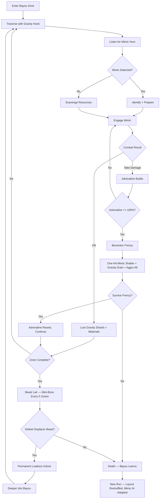
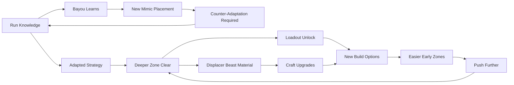

# Mimic Bayou

## Title & Genre

| Field | Value |
|-------|-------|
| **Title** | Mimic Bayou |
| **Genre** | Survival Horror / Roguelite |
| **Engine** | Unity 6 (URP with custom volumetric fog, 2.5D side-scrolling perspective with parallax depth layers) |
| **Platform** | PC (Steam), PlayStation 5, Nintendo Switch 2 |
| **Monetization** | Premium — $34.99 base, cosmetic microtransactions (skins, trail effects, gravity hook visuals) with zero gameplay impact |
| **Rating** | ESRB M (Intense Violence, Horror Themes, Blood) / PEGI 18 / CERO Z |

---

## Vision Statement

Mimic Bayou is a survival horror roguelite where a lone berserker is trapped in an ever-shifting twilight bayou where every surface could be a predator. The game lives at the intersection of paranoia and violence — every moss-covered log, every hanging vine, every still rowboat might erupt into a fractal mimic that was waiting for you to lower your guard. The bayou rearranges itself between runs, learns from your death patterns, and escalates its mimicry to counter your strategies. You push deeper using gravity-bending hooks that let you walk walls, yank enemies from hiding, and cross chasms that the bayou opened beneath your feet. An adrenaline economy turns damage into devastating berserker frenzy, but frenzy drains your gravity charge and screams every mimic in earshot toward your position. Sound is your radar — mimics emit a subliminal hum only perceptible through headphones. Expert runs look like a violent ballet through a living nightmare that was designed specifically to kill you. This is Spelunky by way of Resident Evil 7.

---

## Core Loop

**Target session length:** 25–45 minutes (one full run)



### Core Loop Breakdown

| Step | Player Action | System Response | Skill Expression |
|------|--------------|----------------|-----------------|
| 1. Traverse | Navigate using gravity hook (walls, ceilings, chasms) | Environment shifts procedurally per run — gravity charges deplete with use | Spatial awareness, charge management, route planning |
| 2. Listen | Wear headphones, move slowly, listen for mimic hum | Mimics emit ultrasonic hum (40–60 Hz) that intensifies within 3m radius; volume = proximity | Audio discrimination, patience, risk assessment (slow = safe but time costs gravity charge) |
| 3. Identify | Observe environmental anomalies (too-perfect moss, wrong shadow, slight movement) | Mimics mimic their host object perfectly at rest but have 0.2s reveal when triggered by proximity or interaction | Visual pattern recognition, memory (which object types are mimics this run) |
| 4. Engage | Attack mimic with current weapon, or trigger adrenaline first for empowered kill | Mimics unfold from their disguise in a fractal animation — the log splits into jointed legs, the moss becomes teeth, the rowboat opens like a jaw | Timing, positioning (back mimics into corners or gravity-hook to open ground) |
| 5. Loot | Collect gravity shards, crafting materials, codex pages from mimic remains | Loot quality scales with kill speed (kill within 2s of reveal = "surprised" bonus, double drops) | Execution speed |
| 6. Scavenge | Search safe zones (brief windows between mimic spawns) for environmental resources | Resources are finite per zone; scavenging costs time; longer you stay, higher mimic spawn chance | Risk/reward — push forward lean or scavenge for survivability |
| 7. Adrenaline | Absorb damage, discover mimics, survive close calls | Adrenaline meter fills (10% per hit taken, 15% per mimic discovered, 5% per near-miss). Caps at 100% | Intentional damage-taking as strategy (the berserker identity) |
| 8. Frenzy | Activate berserker frenzy when adrenaline is full | 8-second window: all mimics shatter in one hit. Gravity charge drains 40%. Every mimic within 30m aggroes to player | Tactical timing — use when clustered mimics surround you, not against lone enemies |
| 9. Beast Lair | Face displacer beast mini-boss every 5 zones | Teleports, creates clones, turns terrain against player (gravity inversions, floor becomes ceiling) | Pattern memorization, gravity hook mastery, multi-target tracking |

---

## Meta Loop

### Run-to-Run Progression



### Progression Axes

| Axis | What Grows | How It Feels | Cap |
|------|-----------|-------------|-----|
| **Loadout Library** | Starting weapons, gravity hook variants, passive traits unlocked by defeating displacer beasts | Your toolset expands. Each run starts with more options, but the bayou also starts harder. | 24 loadout items across 8 unlocks (1 per mini-boss, 16 base weapons) |
| **Bayou Knowledge** | Understanding mimic placement AI, zone layouts, audio patterns | You die to learn. The bayou is a puzzle you solve by dying. | Infinite — procedural generation means no complete mastery |
| **Crafting Depth** | Weapon and hook upgrades from scavenged materials | Runs where you find good materials feel different from runs where you don't. RNG with mitigation. | 3 tiers per weapon x 4 weapons = 12 upgrade paths |
| **Player Skill** | Audio discrimination speed, gravity hook precision, adrenaline timing, mini-boss patterns | The most important progression — invisible, permanent, non-transferable. | No cap — the game scales with you |
| **Codex Completion** | Lore fragments, mimic taxonomy entries, bayou ecology pages | The bayou has a history. You piece it together between deaths. | 64 codex entries |

---

## Game Mechanics

### Primary Mechanic: The Adrenaline Economy

The berserker's rage is the central resource system. It operates on a **single-gauge system** with a binary state change:

**Adrenaline Gauge (Amber to Crimson)**
- Fills from: taking damage (10%/hit), discovering mimics (15%/reveal), near-miss dodges (5%/dodge within 0.3s)
- Decays at 3%/second when not taking damage or discovering mimics
- At 100%: Frenzy becomes available (does not auto-trigger — player chooses)

**Frenzy State (8 seconds):**
- All mimics killed in one hit (regardless of type or tier)
- Movement speed +40%
- Attack speed +60%
- Gravity charge drains 5%/second (normal drain is 1%/second)
- Every mimic within 30m aggroes and moves toward player
- Player cannot use healing items during frenzy
- Visual: screen edges pulse crimson, player model cracks with amber light, audio distorts to a bass drone

**The Adrenaline Threshold Game:**

| Adrenaline Level | Visual Cue | Audio Cue | Strategic Implication |
|-----------------|-----------|-----------|----------------------|
| 0–20% | Gauge dim, player model normal | Normal ambient bayou audio | Safe — charge aggressively by taking calculated damage |
| 20–50% | Gauge pulses, slight screen shake on damage | Heartbeat enters mix (subtle) | Building — you have momentum, keep pushing or let it decay |
| 50–80% | Gauge bright, screen vignette tightens | Heartbeat prominent, weapon impacts louder | Hot zone — frenzy is close, position yourself near mimic clusters |
| 80–99% | Gauge screaming amber, screen pulses | Heartbeat loud, gravity hook hums | Critical — trigger frenzy NOW or lose the build-up to decay |
| 100% (Frenzy Ready) | Gauge locks crimson, prompt appears | Brief silence then bass drop when activated | Decide — is now the right time? Are mimics clustered? Is gravity charge sufficient? |
| Frenzy Active | Full crimson overlay, time dilation on kills | Distorted bass, mimic death screams amplified | 8 seconds of god mode — make them count |
| Frenzy End | Screen flashes white, brief stagger (0.5s) | Audio snap back to normal | Vulnerable — you just screamed, everything knows where you are |

**Edge Cases:**
- If player takes lethal damage while adrenaline is above 80%, the death triggers a "Last Gasp" — 2 seconds of automatic frenzy before actual death, giving a chance to kill one final mimic for its loot
- If player activates frenzy with less than 30% gravity charge, frenzy lasts only 4 seconds (half duration) due to insufficient charge to sustain the berserker state
- If player kills a displacer beast during frenzy, they earn a "Primal" variant of the loadout unlock (same stats, unique crimson visual)

### Secondary Mechanic: Gravity Hook System

The gravity hook is the traversal and combat utility tool. It runs on a **charge system**:

**Gravity Charge Pool:**
- Base capacity: 100 units
- Passive drain: 0 units (no passive drain outside frenzy)
- Hook actions drain charge:

| Action | Charge Cost | Effect |
|--------|------------|--------|
| Wall Walk | 2 units/second | Walk on any surface — walls, ceilings, undersides of platforms |
| Chasm Pull | 15 units | Pull yourself across a gap to an anchor point (grapple to any solid surface) |
| Yank (Combat) | 20 units | Pull a mimic out of hiding, forcing early reveal and staggering it for 1.5s |
| Gravity Slam | 25 units | Slam into ground from height, creating a 3m shockwave that staggers all mimics in radius |
| Ceiling Drop | 10 units | Drop silently from ceiling position — no aggro radius trigger for 2s after landing |

**Charge Recovery:**
- Gravity shards from killed mimics: 8–15 units each
- Environmental shard deposits (glowing amber veins in rock): 20–30 units, finite per zone
- Zone transition: full charge restoration
- Frenzy drain: 5 units/second (non-negotiable)

**Gravity Hook Upgrades (3 tiers per variant):**

| Hook Variant | Unlock | Tier 1 Effect | Tier 2 Effect | Tier 3 Effect |
|-------------|--------|--------------|--------------|--------------|
| **Standard Hook** | Starting | Basic traversal, yank costs 20 | Charge cost -20% | Yank reveals mimic type before engagement |
| **Chain Hook** | Displacer Beast 2 | Hits 2 targets, costs 25 | Hits 3 targets, costs 25 | Stuns all yanked mimics for 2s |
| **Phase Hook** | Displacer Beast 4 | Passes through thin walls, costs 20 | Passes through all surfaces, costs 20 | Creates temporary gravity well (3m pull zone for 4s) |
| **Heavy Hook** | Displacer Beast 6 | Gravity Slam radius +2m, costs 30 | Slam + knockdown (2s), costs 30 | Slam creates gravity field (enemies move at 50% speed for 5s) |
| **Whisper Hook** | Displacer Beast 8 | Silent movement while wall walking | Zero aggro for 3s after any hook action | Yank does not trigger mimic reveal animation — you choose when to engage |

### Secondary Mechanic: Mimic System

The mimic system is the heart of the horror and the primary obstacle. Mimics are environmental objects that are secretly predators.

**Mimic Taxonomy (18 types across 6 zones):**

| Zone | Mimic Types | Disguise | Reveal Animation | Behavior Post-Reveal |
|------|------------|----------|-------------------|---------------------|
| 1 — Shallow Marsh | **Moss Mimic** | Moss-covered rock | Rock splits into 6 legs, moss becomes bristling spines | Charges in straight line, fast, low HP |
| | **Root Mimic** | Cypress root tangle | Roots unfurl into tentacles, central mass opens jaw | Grabs and constricts, must be killed within 4s or player takes 30% HP |
| | **Lantern Mimic** | Hanging lantern post | Post bends like a spine, lantern becomes eye, base splits into legs | Spits fire (2m range), retreats when approached, medium HP |
| 2 — Sunken Chapel | **Pew Mimic** | Church pew | Wood splinters into ribcage shape, cushion becomes tongue | Stationary trap — grabs anything within 1.5m, immune to frontal damage |
| | **Stained Glass Mimic** | Window panel | Glass shards reassemble into butterfly-wing predator | Flies, erratic movement, drops glass shards that damage on landing |
| | **Candle Cluster Mimic** | Candelabra | Candles extend into fingers, wax becomes armor | Summons 2–3 lesser wax mimics, must kill parent to stop spawns |
| 3 — Gator Hollow | **Log Mimic** | Floating cypress log | Log splits jaw like alligator, bark becomes scales | Ambush predator — waits in water, lunges when player is adjacent |
| | **Lily Pad Mimic** | Cluster of lily pads | Pads flip, revealing suction-cup underside | Traps player feet (immobilized for 2s), calls nearby mimics |
| | **Nest Mimic** | Gator egg clutch | Eggs crack simultaneously, baby mimics swarm (6–8) | Swarm behavior — individually weak, overwhelm through numbers |
| 4 — Ghost Camp | **Tent Mimic** | Canvas tent | Canvas tears outward, poles become limbs, interior is a throat | Engulfs player who enters — instant 40% HP damage, then grapple |
| | **Ration Crate Mimic** | Wooden supply crate | Lid becomes jaw, contents become projectile teeth | Spits 3 rapid projectiles, retreats behind cover, low HP |
| | **Uniform Mimic** | Hanging uniform on line | Uniform inflates, no body inside, animated by unknown force | Mimics player movement (mirrored AI), medium HP, unpredictable |
| 5 — Drowned Bridge | **Plank Mimic** | Bridge plank | Plank drops away, reveals mouth underneath bridge | Falls through — player drops to zone below (environmental hazard zone) |
| | **Rope Mimic** | Suspension rope | Rope wraps like constrictor, frays into neural threads | Snares — must cut with weapon (3 hits) or gravity yank to escape |
| | **Shadow Mimic** | Player's own shadow | Shadow detaches, becomes 2D silhouette predator | Copies player's last 3 attack patterns, only damaged from behind |
| 6 — The Displacer's Heart | **Mirror Mimic** | Reflective water surface | Reflection steps out of water as physical copy | Perfect clone of player's current loadout — fight yourself |
| | **Sound Mimic** | Invisible (audio only) | No visual — only detectable by hum anomaly (different from normal mimic hum) | Stalks player, attacks from behind, damage increases each time it's not detected |
| | **Fractal Mimic** | Small mimic (any prior type) | Mini-mimic spawns 2 copies of itself when killed | Kill all copies within 6s or they respawn; chains up to 3 generations |

**Mimic Detection System:**

| Detection Method | Range | Reliability | Cost |
|-----------------|-------|------------|------|
| **Audio (Headphones)** | 3m radius, hum intensifies | 90% — some mimics learn to suppress hum after repeated encounters | Time (must move slowly to hear clearly) |
| **Visual Anomaly** | Line of sight | 60% — trained eye can spot subtle wrongness (shadow angle, texture seam) | Attention (must actively scan, can't be moving fast) |
| **Gravity Yank** | 8m range | 100% — force-reveals any mimic hit | 20 gravity charge per attempt |
| **Adrenaline Pulse** | 5m radius when adrenaline > 50% | 70% — mimics within range flicker briefly | Passive — costs nothing but requires high adrenaline |
| **Proximity Trigger** | 0.5m (touch range) | 100% — but you're already in attack range | HP damage from mimic's first strike |

### Secondary Mechanic: Adaptive Bayou AI

The bayou learns from each death and adapts its mimic placement:

| Player Behavior | Bayou Response | Adaptive Counter |
|----------------|---------------|-----------------|
| Player consistently spots mimics by audio | Mimics in zones 4+ begin mimicking ambient bayou sounds (frog croaks, water drips) instead of their default hum | Player must distinguish mimic-imitated sounds from real ambient audio |
| Player favors specific routes | Mimics spawn along previously safe paths | Player must vary routes between runs |
| Player relies heavily on gravity yank for detection | Zones 5–6 spawn "yank bait" — objects that trigger like mimics but are harmless decoys that waste gravity charge | Player must combine detection methods, not rely on one |
| Player activates frenzy in same zone positions | Mimics flee frenzy range preemptively in zones 5–6 | Player must vary frenzy timing and position |
| Player dies to same mimic type repeatedly | That mimic type appears more frequently in subsequent runs | Player must master their weakness or find loadout counters |

**Adaptation Reset:** The bayou's adaptations decay by 30% after each displacer beast kill. The game never becomes impossible — it escalates until you prove you've learned, then partially resets to keep the difficulty dynamic rather than cumulative.

---

## World Design

### Map Structure

Procedurally generated bayou with hand-crafted zone templates. Each run assembles zones from a pool of modular templates, ensuring variety while maintaining designed encounter quality.

```
                         +-----------------------------+
                         |   ZONE 25+: THE HEART      |
                         |   (Final Boss: The          |
                         |    Displacer Beast King)    |
                         +-------------+---------------+
                                       |
                  +--------------------+--------------------+
                  |        ZONES 21-24                      |
                  |   6 - THE DISPLACER'S HEART             |
                  |   (Mirror/Sound/Fractal Mimics)         |
                  +--------------------+--------------------+
                                       |
         +-----------------------------+-----------------------------+
         |              ZONES 16-20                                   |
         |   5 - DROWNED BRIDGE                                      |
         |   (Bridge/rope/shadow mimics, gravity puzzles)             |
         +-----------------------------+-----------------------------+
                                       |
    +----------------------------------+----------------------------------+
    |                ZONES 11-15                                           |
    |   4 - GHOST CAMP                                                    |
    |   (Tent/crate/uniform mimics, abandoned military camp)               |
    +----------------------------------+----------------------------------+
                                       |
       +-------------------------------+-------------------------------+
       |              ZONES 6-10                                        |
       |   3 - GATOR HOLLOW                                             |
       |   (Log/lily/nest mimics, water-heavy, gator AI)                 |
       +-------------------------------+-------------------------------+
                                       |
      +--------------------------------+--------------------------------+
      |              ZONES 3-5                                           |
      |   2 - SUNKEN CHAPEL                                              |
      |   (Pew/glass/candle mimics, vertical cathedral)                   |
      +--------------------------------+--------------------------------+
                                       |
         +-----------------------------+-----------------------------+
         |              ZONES 1-2                                     |
         |   1 - SHALLOW MARSH                                        |
         |   (Moss/root/lantern mimics, tutorial zone)                 |
         +-------------------------------------------------------------+
```

**Beast Lairs** appear after every 5th zone (zones 5, 10, 15, 20, 25) as fixed mini-boss encounters.

### Art Direction Pillars

| Pillar | Description | Reference |
|--------|-------------|-----------|
| **Painterly Dread** | Hand-illuminated style inspired by Cajun folklore and stop-motion animation — the bayou looks like an oil painting someone bled on | Hollow Knight's environmental storytelling, Don't Starve's gothic whimsy |
| **Living Atmosphere** | Fog rolls in volumetric layers, amber light filters through canopy gaps in real-time god rays, moss sways in response to player movement | Inside's fog density, Limbo's silhouette depth |
| **Fractal Wrongness** | Mimic reveal animations are the visual centerpiece — a mossy log unfolding into jointed, geometric wrongness. Not gore, but structural horror. The mimic is wrong at an architectural level. | The Thing's body horror, Annihilation's shimmer mutations |
| **Twilight Permanence** | The bayou exists in permanent twilight — not day, not night, but a sickly amber-green dusk that never resolves. This is the light of a place that doesn't want you to see clearly. | Resident Evil 7's plantation night, Bloodborne's Hemwick Charnel Lane |

### Visual and Audio Progression

| Zone Set | Palette Dominant | Lighting Mood | Ambient Audio | Music Intensity |
|----------|-----------------|--------------|--------------|----------------|
| 1 — Shallow Marsh | Olive, stagnant brown, pale amber | Low fog at knee level, dappled through thin canopy | Cricket drone, slow water drip, distant bird call | None — silence is the soundtrack |
| 2 — Sunken Chapel | Deep purple, tarnished gold, candlelit ivory | Candlelight flicker, stained glass prisms on flooded floor | Choir hum (discordant, barely present), wooden creaking | Solo pipe organ, single sustained note |
| 3 — Gator Hollow | Deep green, mud brown, amber firefly bioluminescence | Firefly pools of light in deep shadow, canopy nearly blocks all light | Insect swarm, low gator rumble, water splash patterns | Cajun fiddle enters, slow, mournful |
| 4 — Ghost Camp | Slate gray, faded blue, crimson accent (tent fabric) | Pale moonlight, campfire ember glow (dying) | Marching boots (ghostly), distant orders shouted in French, canvas snap | Military snare drum, off-rhythm |
| 5 — Drowned Bridge | Black water, bone white, phosphorescent teal | Bioluminescent water, near-total darkness on bridge surface | Creaking rope, water current, wind through broken planks | Ambient drone — no melody, pure tension |
| 6 — Displacer's Heart | Pitch black, crimson veins, blinding white (gravity distortions) | Player is the light source — gravity distortions create prismatic artifacts | Silence then deafening mimic chorus then silence (loop) | Full orchestral dissonance, no rhythm |

---

## Narrative

### Tone Spectrum (7-Axis)

| Axis | Position | Notes |
|------|----------|-------|
| Hope to Despair | 85% Despair | The bayou does not let you leave. Hope is the bait. |
| Natural to Unnatural | 70% Unnatural | The mimics are not natural evolution — they are designed. By what? |
| Sound to Silence | 80% Sound | The bayou is never silent. Even "silence" is the mimics holding their breath. |
| Human to Monster | 90% Monster | The berserker was human once. The bayou is eating that memory. |
| Order to Chaos | 75% Chaos | Procedural layout ensures no safe patterns exist. The bayou is entropy given teeth. |
| Past to Present | 60% Past | The codex fragments tell the story of who built this place. It matters. |
| Knowledge to Ignorance | 65% Knowledge | Knowledge is the only permanent progression. The bayou fears what you remember. |

### 8-Point Story Spine

**1. Equilibrium**
The berserker — a nameless warrior from a drowned regiment — exists in a cycle. She enters the bayou, fights through zones of living mimicry, and either dies (resetting the bayou but not her memory) or pushes deep enough to face a displacer beast. She does not remember how she got here. She does not remember her name. She knows only the rhythm: traverse, listen, fight, scavenge, survive.

**2. Inciting Incident**
On the first run that reaches Zone 10 (the second displacer beast), the beast speaks. Not with words — with memories. When the berserker kills it, she absorbs a fragment: she was not always a berserker. She was a soldier. She was sent here. The bayou is not random.

**3. First Complication**
The codex entries from zones 6–10 reveal the bayou was created by a cult — the Order of the Displaced — who believed that reality could be "improved" by replacing natural objects with something alive, something hungry, something that would wait forever for prey. The mimics are not monsters. They are architecture.

**4. Rising Action**
Zones 11–20 reveal the berserker's history through displaced memories triggered by mimic kills. She was Captain Maren Dusk of the King's Third Infantry. She led her regiment into the bayou pursuing the Order. Her regiment was consumed — not killed, but absorbed. Every mimic carries a fragment of a soldier's last thought. The berserker is the only one who fights back.

**5. Midpoint Reversal**
The berserker reaches Zone 20 and faces a displacer beast that does not attack. It waits. When she does not kill it, it speaks in her own voice: "You are not escaping the bayou. You are its immune response. The mimics are infections. You are the white blood cell. You were designed to clean this place, not leave it." The berserker's rage is not hers. It is the bayou's defense mechanism.

**6. Crisis**
The berserker must choose: accept her role as the bayou's immune system (the Displacer Beast King will let her "win" and reset the cycle) or reject it and fight the King, knowing that destroying the bayou's heart also destroys the only thing keeping her alive.

**7. Climax**
Zone 25 and beyond — The Displacer Beast King is a 5-phase encounter that uses every mimic type simultaneously, teleports, clones itself, and inverts gravity. Each phase represents a layer of the bayou's architecture: the Order's ritual (phase 1), the soldiers' absorption (phase 2), the berserker's own memories (phase 3), the bayou's immune defense (phase 4), and the King itself — the first mimic, the original displaced object (phase 5).

**8. Resolution**
Three endings based on run performance and codex collection:
- **Absorption:** The berserker accepts her role. The cycle resets. She becomes stronger but the bayou becomes smarter. This is the default ending — the game is a loop.
- **Destruction:** The berserker kills the Displacer Beast King and destroys the bayou's heart. The mimics die. The berserker dies. The bayou returns to ordinary swamp. The soldiers rest. This is the hard ending (requires defeating all 8 displacer beasts in a single run).
- **Transcendence:** The berserker collects all 64 codex entries and defeats the King without using frenzy. She does not fight the bayou or serve it — she understands it. The mimics recognize her as a displaced object herself and bow. She walks out. The bayou remains. This is the secret ending (requires 64/64 codex plus no-frenzy King kill).

### Key Characters

| Character | Role | Theme | Codex Entries |
|-----------|------|-------|---------------|
| **The Berserker (Maren Dusk)** | Protagonist — Amnesiac warrior trapped in the bayou cycle | Identity stripped and rebuilt by violence; the self as a weapon | 16 memory fragments |
| **The Displacer Beast King** | Antagonist — The first mimic, the bayou's heart | Hunger as existence; it does not want to kill, it wants to be more things | 8 resonance fragments |
| **Father Aldric Voss** | Lore — Founder of the Order of the Displaced | Hubris dressed as devotion; the man who decided nature needed improving | 12 journal entries |
| **Lieutenant Corinne Hale** | Lore — The berserker's second-in-command before absorption | Loyalty consumed; the soldiers who followed their captain into a living trap | 10 letter fragments |
| **The Bayou Itself** | Setting/Antagonist — A living, learning ecosystem | Nature weaponized; the bayou is not evil, it is hungry and it adapts | 18 ecology entries |

---

## Player Personas

### P-001: Alex Rivera — The Ranked Grinder

**Why this game fits:** Mimic Bayou rewards competitive mastery through its adrenaline economy and gravity hook system. The frenzy timing is a frame-precise skill shot. The displacer beast fights demand pattern memorization and execution under pressure. The adaptive AI means Alex cannot just memorize a route — he has to adapt, which feeds his competitive drive. The "no-frenzy King kill" achievement is the kind of prestige marker he lives for.

**Predicted experience:** Alex will optimize for speed, learn the audio patterns in the first 5 runs, and focus on gravity hook combat as his primary skill expression. He will skip codex entries entirely on his first 20 runs. He will pursue the Transcendence ending not for the story but because it is the hardest thing to do. He will create build guides and challenge run videos (no-damage runs, minimum-zone runs, all-mimic-kill runs).

### P-003: Hiroshi Tanaka — The RPG Addict

**Why this game fits:** 18 mimic types, 64 codex entries, 24 loadout items, 12 weapon upgrade paths, 3 endings, and a codex that tells a coherent story across runs. The roguelite structure means each run is a completion project within a larger completion project. The crafting system has meaningful build diversity (gravity hook variant x weapon type x passive trait = distinct builds).

**Predicted experience:** Hiroshi will methodically catalogue every mimic type, its behavior, its audio signature, and its weakness. He will build a spreadsheet of loadout combinations. He will collect every codex entry before attempting any ending. He will pursue the Transcendence ending as his first goal. He will find the lack of permanent stat progression frustrating initially but will appreciate that player skill IS the progression.

### P-008: David Park — The Achievement Hunter

**Why this game fits:** The game tracks 48 achievements across combat, exploration, speed, and challenge categories. The Transcendence ending requires near-perfect play. The displacer beast defeats are trackable milestones. The codex provides clear collectible tracking with a percentage counter. Speed run achievements (zone clear times, full run times) give concrete mastery goals.

**Predicted experience:** David will 100% the game across 80–120 runs. He will track every achievement in a spreadsheet. He will flag any codex entry that seems RNG-dependent for frustration. He will appreciate that achievements are skill-based (no time-gating, no FOMO). He will pursue the speedrun achievements last as his capstone.

### P-009: Liam O'Connor — The Dedicated F2P

**Why this game fits:** Premium at $34.99 with cosmetic-only microtransactions. The adaptive AI means no amount of money can buy a safe route. The adrenaline economy rewards skill and damage-taking strategy, not gear. The gravity hook system is pure execution — no stat advantage exists. Liam's anti-P2P principles align perfectly with a game where cosmetics are the only purchase.

**Predicted experience:** Liam will champion the game specifically for its fair monetization. He will create no-damage run guides. He will attempt the hardest challenge runs (no-frenzy full run, no-gravity-hook run, mimic-kill-100% run). He will be the game's most vocal organic promoter in every community he participates in.

---

## User Stories

### Exploration (8 stories)

1. As **Alex (P-001)**, I want the bayou to rearrange itself between runs so that I cannot memorize a single optimal path and must adapt my routing dynamically.
2. As **Hiroshi (P-003)**, I want zone templates to have hidden rooms only discoverable by using specific gravity hook variants so that exploration is gated by build choice.
3. As **David (P-008)**, I want a zone completion tracker that shows percentage explored, mimics killed, and codex found per zone so that I can track thoroughness across runs.
4. As **Hiroshi (P-003)**, I want environmental storytelling (abandoned campfire sites, spectral soldier silhouettes, half-submerged letters) to appear procedurally so that each run reveals new lore fragments.
5. As **Alex (P-001)**, I want gravity hook shortcuts between zone sections that require precise charge management so that skilled traversal is rewarded with faster progress.
6. As **Liam (P-009)**, I want environmental hazards (deep water, collapsing boardwalks, gas pockets) that affect mimics as much as the player so that clever positioning is a valid combat strategy.
7. As **David (P-008)**, I want a mimic taxonomy screen that fills with illustrations and behavior notes as I encounter and kill each type so that completion is visually rewarding.
8. As **Hiroshi (P-003)**, I want safe zones between major zone sections to contain codex entries that build the bayou's history so that pausing to read is rewarded.

### Core Mechanics (8 stories)

9. As **Alex (P-001)**, I want the frenzy activation to be a manual choice at 100% adrenaline so that I decide when the risk (gravity drain + aggro) is worth the reward (one-hit kills).
10. As **Liam (P-009)**, I want gravity yank to force-reveal mimics so that I have a resource-costed detection method as an alternative to audio-only detection.
11. As **Alex (P-001)**, I want the adaptive AI to counter my most-used strategies so that I cannot rely on a single approach across multiple runs.
12. As **Hiroshi (P-003)**, I want 5 distinct gravity hook variants with 3 upgrade tiers each so that build variety supports meaningfully different playstyles.
13. As **David (P-008)**, I want weapon upgrades to be reversible at crafting stations so that I can experiment without permanent commitment.
14. As **Alex (P-001)**, I want the displacer beast fights to have distinct phase patterns that I must learn through repeated attempts so that mastery is the only path to victory.
15. As **Liam (P-009)**, I want the mimic hum to be spatially accurate (3D audio) so that I can determine direction and distance through sound alone.
16. As **Alex (P-001)**, I want the "Last Gasp" mechanic (2s auto-frenzy on death at high adrenaline) so that even failed runs have a dramatic final moment.

### Narrative (5 stories)

17. As **Hiroshi (P-003)**, I want 64 codex entries that tell a coherent story across all zones so that exploration rewards narrative understanding.
18. As **David (P-008)**, I want memory fragments to be tied to specific mimic kills so that paying attention to which mimic you kill matters for lore collection.
19. As **Hiroshi (P-003)**, I want the Displacer Beast King's mid-run revelations to reference my actual run performance (zones cleared, mimics killed) so that the narrative acknowledges my play.
20. As **Alex (P-001)**, I want all narrative text to be skippable so that replays and challenge runs are not bogged down by story I have already seen.
21. As **Hiroshi (P-003)**, I want 3 distinct endings tied to gameplay performance (not dialogue choices) so that the narrative reflects how I played, not what I selected.

### Progression (6 stories)

22. As **David (P-008)**, I want 48 achievements across combat, exploration, speed, and challenge categories so that 100% completion is a multi-faceted goal.
23. As **Hiroshi (P-003)**, I want displacer beast defeats to permanently unlock new loadout items so that progression persists across runs.
24. As **Alex (P-001)**, I want the adaptive AI to partially reset after each displacer beast kill so that difficulty escalation feels dynamic rather than cumulative punishment.
25. As **Liam (P-009)**, I want a run summary screen showing time, mimics killed, damage taken, adrenaline activations, and codex collected so that I can measure improvement.
26. As **David (P-008)**, I want zone clear time leaderboards (personal and global) so that speedrun mastery has visible tracking.
27. As **Hiroshi (P-003)**, I want the Transcendence ending to require collecting all 64 codex entries AND defeating the King without frenzy so that the "true" ending rewards the most thorough and skilled players.

### Accessibility (4 stories)

28. As a player with hearing impairments, I want a visual mimic proximity indicator (screen-edge pulse) as an alternative to audio-only detection so that the core gameplay is accessible without headphones.
29. As **David (P-008)**, I want fully remappable controls so that my preferred layout is supported across all platforms.
30. As a player with motor impairments, I want an assist mode that extends frenzy timing windows and reduces gravity hook precision requirements so that the core loop is accessible without being trivialized.
31. As a player with color vision deficiency, I want the adrenaline gauge to use shape and animation (not just color) to communicate state so that the frenzy system is readable without color perception.

### Social and Community (4 stories)

32. As **Liam (P-009)**, I want a daily challenge mode (fixed seed, global leaderboard) so that I can compete with the community on equal footing.
33. As **Alex (P-001)**, I want a ghost replay system that shows my best run overlaid on current run so that I can measure improvement against my own history.
34. As **Liam (P-009)**, I want cosmetic microtransactions to be clearly separated from gameplay (separate store tab, no gameplay stats on cosmetics) so that the monetization is transparent.
35. As **David (P-008)**, I want run history with full statistics exportable to CSV so that I can maintain my completion tracking spreadsheet externally.

---

## Monetization

### Revenue Model: Premium at $34.99 with Cosmetic MTX

**Why this model fits this game:**
- Roguelite players value gameplay purity — the adaptive AI means no monetizable shortcut exists that would not break the core loop
- The adrenaline economy and gravity hook system are pure skill — no stat advantage can be sold
- Horror game audiences expect atmospheric immersion — energy systems and time gates would destroy the tension
- Cosmetic microtransactions (skins, trail effects, gravity hook visuals) provide revenue without touching gameplay balance
- The target audience (P-001, P-003, P-008, P-009) values fair, skill-only experiences

### Pricing and DLC Roadmap

| Product | Price | Content | Target Window |
|---------|-------|---------|--------------|
| Base Game | $34.99 | Full campaign, 25+ zones, 18 mimic types, 3 endings, daily challenge | Launch |
| Cosmetic Pack 1: "Bayou Flora" | $4.99 | 5 berserker skins, 3 gravity hook trails, 2 frenzy visual effects | Launch |
| Cosmetic Pack 2: "Displaced Relics" | $4.99 | 4 berserker skins, 4 gravity hook skins, 3 frenzy visual effects | Month 3 |
| DLC 1: "The Sunken Regiment" | $12.99 | New zone biome (military fort), 3 new mimic types, 1 ending, 16 codex entries | Month 6 |
| DLC 2: "The Architect's Garden" | $12.99 | New zone biome (cult greenhouse), 3 new mimic types, 1 ending, 16 codex entries | Month 12 |
| Complete Edition | $49.99 | Base + both DLCs + all cosmetic packs | Month 14 |

### Revenue Projections (4 Scenarios)

| Scenario | Year 1 Units | Year 1 Revenue | Year 2 (w/ DLC + Cosmetics) | Total (2yr) | Assumptions |
|----------|-------------|---------------|-----------------------------|------------|-------------|
| **Modest** | 60,000 | $1.7M | $0.6M | $2.3M | Niche appeal, word-of-mouth only, 10% DLC attach, 5% cosmetic attach |
| **Baseline** | 180,000 | $5.0M | $1.8M | $6.8M | Moderate marketing, positive reviews, 20% DLC attach, 12% cosmetic attach |
| **Strong** | 450,000 | $12.5M | $5.4M | $17.9M | Strong reviews, streamer coverage, 28% DLC attach, 18% cosmetic attach |
| **Breakout** | 1,200,000 | $33.6M | $15.0M | $48.6M | Viral, award nominations, 35% DLC attach + complete edition |

**Break-even at approximately 52,000 units ($1.6M) against total development budget of $1.45M (see Production Plan).**

### Cosmetic Item Design Principles

| Principle | Enforcement |
|-----------|-------------|
| No gameplay stats on any cosmetic item | Verified via automated test — all cosmetics have 0 stat columns |
| Cosmetics visible in gameplay (not menu-only) | All berserker skins, hook trails, and frenzy effects render in 2.5D gameplay camera |
| Free earnable cosmetics exist alongside paid ones | 10 earnable cosmetics through achievement milestones, 12 paid-only |
| No FOMO — paid cosmetics never go "limited edition" | All cosmetics available permanently from launch |
| Price ceiling at $4.99 per pack — no individual item pricing above $2.99 | Hard rule, no exceptions |

---

## Production Plan

### Team

| Role | Count | Phase | Monthly Cost (Loaded) |
|------|-------|-------|----------------------|
| Game Director / Lead Design | 1 | All | $11,500 |
| Systems Designer (Roguelite) | 1 | All | $9,000 |
| Level Designer (Procedural) | 1 | Months 2–12 | $8,500 |
| Narrative Designer | 1 | Months 1–10 | $8,500 |
| Programmers (Gameplay + AI) | 2 | All | $9,500 each |
| Programmer (Procedural Generation) | 1 | Months 2–12 | $9,500 |
| Programmer (Audio Engine) | 1 | Months 3–14 | $9,000 |
| 2D Artists (Environment) | 2 | Months 2–12 | $7,500 each |
| 2D Artists (Mimic Animation) | 2 | Months 3–14 | $7,500 each |
| VFX Artist | 1 | Months 5–14 | $7,500 |
| Audio Designer / Composer | 1 | Months 4–14 | $7,000 |
| QA Lead | 1 | Months 7–14 | $6,500 |
| QA Testers | 2 | Months 9–14 | $4,500 each |
| Producer | 1 | All | $9,500 |

**Total team: 18 people peak (months 5–12)**

### Timeline (14-month production)

| Month | Milestone | Key Deliverables |
|-------|-----------|-----------------|
| 1 | Prototype | Core loop (traverse/detect/fight), adrenaline gauge, gravity hook (standard), 3 mimic types, procedural zone assembly |
| 2 | Vertical Slice | Zones 1–5 playable end-to-end, 1 displacer beast, audio detection system, adaptive AI prototype |
| 3 | Pre-Production Complete | All 6 zone biomes designed (templates), 18 mimic types finalized, codex system integrated |
| 4 | Production Phase 1 | Zones 1–10 art pass, 10 mimic types implemented, gravity hook variants 1–3 |
| 5 | Production Phase 1 | Adaptive AI fully operational, crafting system complete, daily challenge framework |
| 6 | Production Phase 2 | Zones 11–20 greybox, all 18 mimic types in-engine, displacer beasts 3–5 |
| 7 | Production Phase 2 | QA begins, zones 1–15 art pass, all gravity hook variants + upgrades |
| 8 | Production Phase 3 | Zones 16–25 art pass, displacer beasts 6–8, all weapon upgrade paths |
| 9 | Production Phase 3 | Final boss (Displacer Beast King) 5-phase fight, all 3 endings, codex complete (64 entries) |
| 10 | Alpha | Full game playable, all systems integrated, internal testing begins |
| 11 | Alpha Iteration | Adaptive AI tuning, difficulty curve adjustment, performance optimization |
| 12 | Beta | Feature complete, content complete, external playtesting begins |
| 13 | Beta Iteration | Playtest feedback integration, final art polish, audio mix, cert submission |
| 14 | Launch | Game ships, day-1 patch, hotfix support, DLC 1 pre-production begins |

### Budget Breakdown

| Category | Cost | Notes |
|----------|------|-------|
| Salaries (14 months, 18 FTE peak) | $1,080,000 | Blended rate ~$8,400/mo avg |
| Unity Pro licenses | $14,400 | 18 seats x $800/yr (pro-rated) |
| Software and Tools | $36,000 | Perforce, Jira, Adobe CC, Spine 2D, FMOD/Wwise |
| Hardware (dev kits, workstations) | $45,000 | 2 PS5 dev kits, 2 Switch 2 dev kits, 14 workstations |
| QA and Playtesting | $38,000 | External QA contractor, playtest sessions, daily challenge balance testing |
| Audio (recording, VO, music production) | $42,000 | Studio time, 2 VO actors, live recording session for boss music |
| Marketing | $100,000 | Trailers (2), convention presence (1), streamer outreach, PR retainer |
| Operations and Overhead | $60,000 | Office/incorporation/legal/accounting/insurance |
| Contingency (10%) | $141,540 | |
| **Total** | **$1,556,940** | |

---

## Technical Requirements

### Platform Specifications

| Spec | PC Minimum | PC Recommended | PlayStation 5 | Nintendo Switch 2 |
|------|-----------|---------------|--------------|-------------------|
| **OS** | Windows 10 64-bit | Windows 11 64-bit | PS5 system software | Switch 2 OS |
| **CPU** | Intel i5-9600K / AMD Ryzen 5 3600 | Intel i7-10700K / AMD Ryzen 7 5700X | Custom AMD Zen 2 | Custom NVIDIA Tegra |
| **RAM** | 12 GB | 16 GB | 16 GB GDDR6 | 12 GB |
| **GPU** | GTX 1650 / RX 570 | RTX 3070 / RX 6700 XT | Custom RDNA 2 | Custom NVIDIA |
| **Storage** | 20 GB SSD | 20 GB NVMe SSD | 20 GB SSD | 20 GB internal |
| **Target Resolution** | 1080p / 60 FPS | 1440p / 120 FPS | 4K/60 or 1440p/120 | 1080p / 60 FPS (docked) |
| **Audio Requirement** | Stereo (headphones strongly recommended) | 7.1 Surround / Headphones | 3D Audio (Tempest) | Stereo / Headphones |

### Key Technical Challenges

| Challenge | Risk | Mitigation |
|-----------|------|-----------|
| **Procedural zone generation with designed encounter quality** | High — zones must feel hand-crafted despite being assembled from templates | Template pool of 40 zone sections per biome (240 total). Assembly uses constraint solver (no dead ends, always 2+ paths, mimic density within bounds). Playtest every template individually before pool inclusion. |
| **Adaptive AI that learns from player death patterns** | High — must feel intelligent, not punishing or random | Bayesian inference model tracking player behavior vectors (route preference, detection method, frenzy timing). Responses are drawn from a curated response table, not generated. Cap of 5 active adaptations simultaneously. 30% decay after displacer beast kills. |
| **3D audio mimic detection system** | Medium — spatial audio must be accurate across headphone types | FMOD spatial audio with HRTF. Support for stereo, 5.1, 7.1, and binaural. Visual pulse accessibility fallback for hearing-impaired players. Calibrated on 8 headphone models during QA. |
| **18 mimic types with distinct reveal animations** | Medium — each mimic needs unique reveal, AI, and death animations (54 animation sets) | Spine 2D for skeletal animation. Shared base animation rigs (grabber, charger, spawner, ambusher) with unique skin overlays. 4 base rigs x 4–5 skins = 18 types with manageable asset count. |
| **Displacer Beast King 5-phase boss fight** | Medium — phase transitions must be seamless and telegraphed | Phase transitions triggered by HP thresholds, not timers. Each phase has a 2-second telegraph animation. Phases reuse existing mimic AI (phase 3 uses mirror mimic logic, phase 4 uses adaptive AI logic). |
| **Cross-platform performance (Switch 2)** | Medium — Switch 2 must maintain 60 FPS with same zone complexity | Dedicated low-poly template pool for Switch 2. Reduced particle count and fog density. Audio quality matches other platforms (no downgrade). Profiling on Switch 2 hardware from month 3. |

---

## Testing Strategy

### Test Categories

| Category | What | How | Acceptance Criteria |
|----------|------|-----|-------------------|
| **Procedural Generation Validation** | Every zone template assembles into a completable path | Automated solver runs 1,000 assemblies per template, checks reachability from entry to exit | 0/1000 unreachable assemblies per template |
| **Mimic Detection Accuracy** | Audio hum is detectable at correct range and direction | 8 testers with calibrated headphones, blind testing — approach mimic from 8 compass directions | >85% detection at 2m, >95% detection at 1m across all directions |
| **Adaptive AI Balance** | Adaptations do not make runs impossible | Track win rate across 500 simulated runs with active adaptations | Win rate stays within 15–40% for zones 1–20 (difficulty bands by zone tier) |
| **Gravity Hook Precision** | All hook actions register correctly on all platforms | Automated input testing — 10,000 hook actions per platform per action type | <0.1% failed registrations (input dropped or mis-registered) |
| **Adrenaline Economy Balance** | Frenzy activation timing feels fair and impactful | Playtest with 30 players, measure frenzy activation frequency per run, frenzy survival rate | Average 1.5–3.0 frenzy activations per run, 60–80% survive each frenzy |
| **Cross-Platform Parity** | Same run seed produces same zone layout on all platforms | Generate 100 seeds, verify identical assembly on PC, PS5, Switch 2 | 100% layout parity across platforms |
| **Accessibility — Visual Pulse** | Mimic proximity pulse works as audio alternative | 10 hearing-impaired testers complete zones 1–5 using visual pulse only | >75% zone completion rate using only visual detection |
| **Performance** | Frame rate, load times, memory across all platforms | Automated benchmark suite running full 25-zone runs on min-spec hardware | PC min: 60 FPS at 1080p. PS5: 60 FPS at 1440p. Switch 2: 60 FPS at 1080p docked |

### Playtest Milestones

| Month | Playtest Type | Participants | Focus |
|-------|-------------|-------------|-------|
| 3 | Internal (team only) | 18 (full team) | Core loop feel, adrenaline timing, gravity hook responsiveness |
| 6 | Friends and Family | 30 | First 10 zones, mimic variety, difficulty curve, audio detection |
| 8 | Closed Alpha | 100 (signed NDA) | Full 25 zones, adaptive AI response, daily challenge, codex collection |
| 10 | Open Beta (invitational) | 500 | Balance, performance across hardware, accessibility features |
| 12 | Release Candidate | 200 (focused) | Bug hunting, speed run verification, achievement triggers, all 3 endings |
