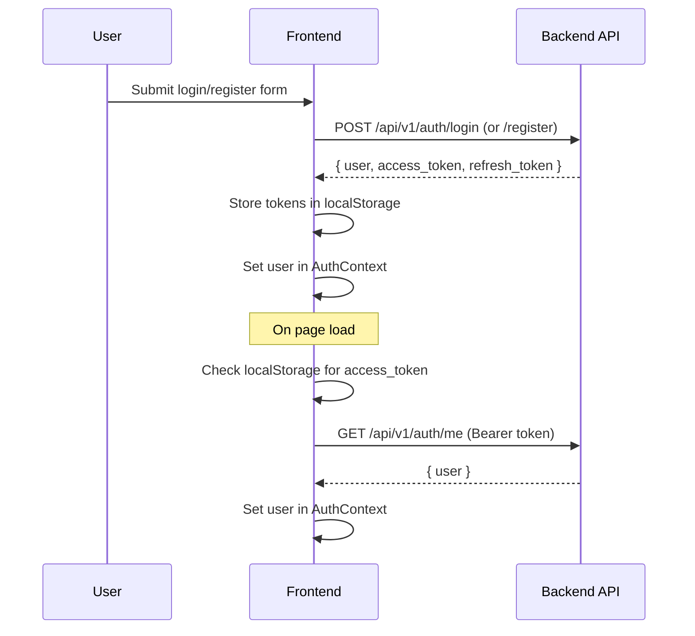

# Authentication Architecture

## Flow

## Token Storage

- `access_token` and `refresh_token` stored in `localStorage`
- `api.ts` auto-attaches `Authorization: Bearer <token>` to all requests
- On auth failure, tokens are cleared and user is set to `null`

## API Endpoints

| Method | Path | Purpose |
|--------|------|---------|
| POST | `/api/v1/auth/register` | Create account → returns tokens + user |
| POST | `/api/v1/auth/login` | Authenticate → returns tokens + user |
| POST | `/api/v1/auth/refresh` | Exchange refresh token → new access token |
| GET | `/api/v1/auth/me` | Fetch current user (requires Bearer token) |
| GET | `/api/v1/auth/sso/providers` | List enabled SSO providers (drives login buttons) |
| GET | `/auth/oidc` | Begin Authentik/OIDC login → redirects to provider |
| GET | `/auth/oidc/callback` | OIDC callback → issues short-lived SSO code |
| POST | `/api/v1/auth/sso/exchange` | Exchange SSO code → tokens + user |

## SSO / Authentik (OIDC)

Authentik is the default OIDC provider. The flow:

1. Login page calls `/auth/sso/providers`; if `oidc` is enabled a **Sign in with SSO** button appears.
2. Button → backend `/auth/oidc` → redirect to Authentik.
3. Authentik → `/auth/oidc/callback` → backend mints a one-time SSO code and redirects to
   the frontend `/auth/sso-callback?code=...`.
4. `/auth/sso-callback` calls `/auth/sso/exchange`, stores the tokens, and lands the user on `/app`.

Enable it by setting `OIDC_ISSUER`, `OIDC_CLIENT_ID`, `OIDC_CLIENT_SECRET`, and
`FRONTEND_URL` (see `.env.example`). `OIDC_REDIRECT_URI` defaults to
`https://<PHX_HOST>/auth/oidc/callback`.

## Request Body Shapes

- **Register**: `{ user: { email, password } }`
- **Login**: `{ email, password }`
- **Refresh**: `{ refresh_token }`

## Components

- **`AuthProvider`** (`src/context/auth.tsx`) — wraps app, provides `useAuth()` hook
- **`Navbar`** (`src/components/navbar.tsx`) — shows login/signup or user email + logout
- **Login/Signup pages** — form pages that call `useAuth().login()` / `register()`, redirect to `/app` on success
- **`/auth/sso-callback`** — completes the Authentik/OIDC exchange, then redirects to `/app`
