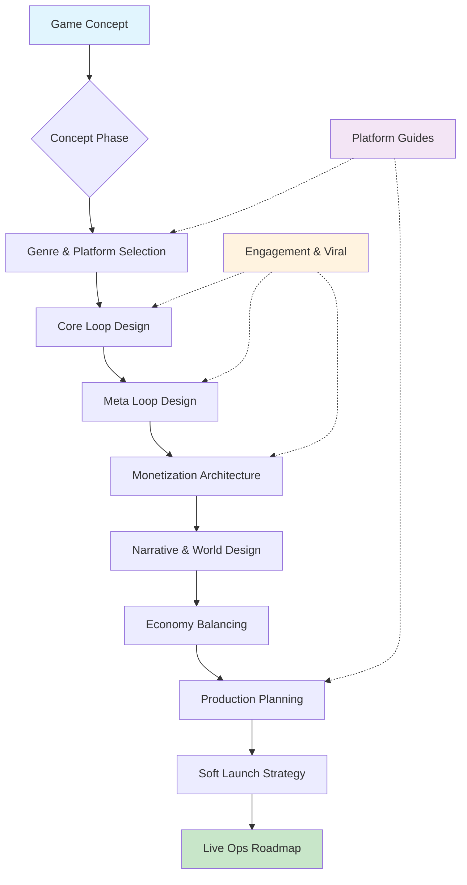

# Game Design

End-to-end game design, production, and monetization across mobile, PC, console, and cross-platform — from concept through live ops.

## Overview

Game design is a multi-disciplinary practice spanning creative vision, systems engineering, behavioral psychology, and business strategy. This skill synthesizes knowledge across all these domains into actionable workflows for designing, producing, and operating games.

**Core Purpose:**
- Transform game concepts into fully scoped design documents ready for production
- Engineer engagement loops and retention systems grounded in behavioral psychology
- Design monetization systems that are profitable without being predatory
- Plan production timelines, team structures, and milestone-based development
- Write narratives and world-building systems that serve gameplay, not interrupt it
- Guide platform-specific decisions for iOS, Android, PC, and console deployment
- Architect viral and social mechanics that drive organic user acquisition

## Core Philosophy

1. **Fun first, monetize second** — Engagement is the foundation; monetization layered on top of genuine fun outperforms monetization-first design every time
2. **Player-centric economy design** — The player's time investment must feel respected; pay-to-progress is a retention killer, pay-to-express is a retention multiplier
3. **Prototype before prescribe** — A playable lie reveals more than a perfect document; validate mechanics through play, not slides
4. **Systems over scripts** — Emergent gameplay from well-designed systems outlasts scripted content; invest in the rule engine, not the content treadmill
5. **Ship, measure, iterate** — Game design is empirical; soft launch with instrumentation, let data inform the next decision

## When to Use This Skill

- **Designing a new game concept** — From idea log entry to full GDD
- **Planning monetization** — IAP, battle pass, ad strategy, premium, hybrid models
- **Engineering retention** — Daily login loops, progression systems, social mechanics
- **Choosing a game engine** — Unity vs Unreal vs Godot vs custom, platform tradeoffs
- **Writing game narrative** — Story architecture, world-building, character systems
- **Planning a mobile launch** — Soft launch, ASO, CPI optimization, featured placement
- **Designing live ops** — Event calendars, content cadence, season pass structures
- **Balancing a game economy** — Currency sinks, sources, inflation control, whale/minnow equilibrium
- **Scoping production** — Team size, timeline, milestone structure, budget estimation
- **Designing viral mechanics** — Social sharing, referral systems, UGC, cross-promotion
- **Platform-specific optimization** — iOS guidelines, Android fragmentation, console certification

> For market validation of a game concept, see **trl-market-intelligence** (`references/niche-discovery.md`).
> For landing pages and store listings, see **trl-user-experience-engineer** (`references/outputs/landing-pages.md`).
> For iOS implementation details, see **trl-ios-mobile-engineer** (`SKILL.md`).
> For Android implementation details, see **trl-android-mobile** (`SKILL.md`).
> For Metal/GPU shader work, see **trl-metal-graphics-dev** (`SKILL.md`).
> For rapid prototyping and feasibility validation, see **trl-rapid-prototype** (`SKILL.md`).

## Skill Workflow



### Phase 1: Concept & Genre

Define the game's identity, target audience, and competitive landscape.

| Activity | Output | Duration |
|----------|--------|----------|
| Genre selection | Genre classification, comparable titles | 1-2 hours |
| Audience profiling | Player persona mapping (see assets/) | 2-4 hours |
| Competitive analysis | Feature matrix, differentiation thesis | 4-8 hours |
| Platform decision | Primary/secondary platform with rationale | 1-2 hours |
| Concept document | One-page concept brief | 2-4 hours |

> For genre-specific design guides, see [references/genre-guides/](references/genre-guides/).

### Phase 2: Core & Meta Loop Design

Engineer the minute-to-minute (core) and session-to-session (meta) gameplay loops.

| Activity | Output | Duration |
|----------|--------|----------|
| Core loop mapping | Loop diagram with states, actions, rewards | 2-4 hours |
| Meta progression | Progression tree, unlock cadence | 4-8 hours |
| Session design | Expected session length, energy systems | 2-4 hours |
| Retention mechanics | D1/D7/D30 retention strategy | 4-8 hours |

> For engagement loop design patterns, see [references/engagement-and-viral/retention-patterns.md](references/engagement-and-viral/retention-patterns.md).

### Phase 3: Monetization Architecture

Design the revenue model that serves the game's engagement, not the other way around.

| Model | Best For | Revenue Profile | Risk |
|-------|----------|-----------------|------|
| **Premium** ($4.99-$59.99) | Narrative, indie, PC/console | Predictable, front-loaded | Low ARPU ceiling |
| **F2P + IAP** | Mobile, competitive, RPG | High LTV potential | Requires scale |
| **F2P + Ads** | Casual, hypercasual | Volume-dependent | Lower LTV per user |
| **Hybrid (IAP + Ads)** | Mid-core mobile | Balanced | Complexity |
| **Subscription** | Live service, MMO | Recurring revenue | Churn risk |
| **Battle Pass** | Competitive, social | Seasonal spikes | Content treadmill |
| **Gacha** | Collection RPGs, anime | Very high ARPPU | Regulatory risk |

> For full monetization design, see [references/monetization-design.md](references/monetization-design.md).

### Phase 4: Narrative & World Design

Create story systems that serve gameplay, not interrupt it.

| Activity | Output | Duration |
|----------|--------|----------|
| World bible | Setting, factions, history, tone | 8-16 hours |
| Character system | Cast, relationships, arcs | 4-8 hours |
| Narrative architecture | Story spine, branching structure | 4-8 hours |
| Dialogue system | Conversation trees, VO scope | 8-16 hours |
| Lore integration | How story appears through gameplay | 2-4 hours |

> For narrative design methodology, see [references/story-and-narrative/narrative-architecture.md](references/story-and-narrative/narrative-architecture.md).

### Phase 5: Economy & Balancing

Design and balance the game's resource systems.

| Activity | Output | Duration |
|----------|--------|----------|
| Currency design | Primary/secondary currencies, exchange rates | 4-8 hours |
| Source/sink mapping | Economy spreadsheet, flow rates | 8-16 hours |
| Progression pacing | Level curve, unlock timing | 4-8 hours |
| IAP pricing | Price points, value perception | 4-8 hours |
| Whale/minnow balance | Spend tiers, F2P progression path | 4-8 hours |

### Phase 6: Production Planning

Scope the project, assemble the team, and plan milestones.

| Activity | Output | Duration |
|----------|--------|----------|
| Scope document | Feature list with MoSCoW priorities | 4-8 hours |
| Team plan | Roles, headcount, hiring timeline | 4-8 hours |
| Milestone schedule | Alpha, beta, gold, launch dates | 4-8 hours |
| Budget estimation | Per-milestone budget with contingency | 4-8 hours |
| Tech stack decision | Engine, backend, tools, CI/CD | 2-4 hours |

> For production planning templates, see [references/production/game-design-document-template.md](references/production/game-design-document-template.md).

### Phase 7: Launch & Live Ops

Plan the launch strategy and ongoing operations.

| Activity | Output | Duration |
|----------|--------|----------|
| Soft launch plan | Test markets, KPI targets, duration | 4-8 hours |
| ASO & store listing | Title, description, screenshots, video | 4-8 hours |
| Launch checklist | Certification, compliance, PR plan | 4-8 hours |
| Live ops calendar | Event cadence, season plan, content pipeline | 4-8 hours |
| KPI dashboard | DAU, MAU, ARPU, LTV, retention, CPI targets | 2-4 hours |

## Game Engine Selection

| Engine | Best For | Platforms | Cost | Learning Curve |
|--------|----------|-----------|------|----------------|
| **Unity** | Mobile, 2D/3D, cross-platform | All | Free <$100K, Pro $2K/yr | Moderate |
| **Unreal Engine** | AAA, 3D, photorealistic | All | Free <$1M, 5% rev | Steep |
| **Godot** | 2D, indie, open-source | All | Free | Easy-Moderate |
| **Custom** | Niche, maximum control | Varies | High dev cost | N/A |

### Unity Recommendation Matrix

| Game Type | Unity Tier | Key Packages | Notes |
|-----------|-----------|-------------|-------|
| Mobile 2D | Personal/Pro | 2D system, DOTween, Addressables | Most mobile games |
| Mobile 3D | Pro | URP, AR Foundation, IAP | URP for perf on mobile |
| PC/Console 3D | Pro | HDRP, Netcode, Cinemachine | HDRP for visual fidelity |
| Multiplayer | Pro | Netcode, Relay, Lobby | Dedicated server support |
| AR/VR | Pro | XR Toolkit, AR Foundation | Platform SDKs required |

> For platform-specific guides, see [references/platform-guides/](references/platform-guides/).

## Monetization KPI Targets

| Metric | F2P Good | F2P Great | Premium Good | Premium Great |
|--------|---------|-----------|-------------|---------------|
| D1 Retention | 35% | 50%+ | N/A | N/A |
| D7 Retention | 15% | 25%+ | N/A | N/A |
| D30 Retention | 5% | 10%+ | N/A | N/A |
| ARPU (daily) | $0.05 | $0.15+ | N/A | N/A |
| ARPPU (monthly) | $5 | $15+ | N/A | N/A |
| Conversion Rate | 2% | 5%+ | 100% | 100% |
| LTV (90-day) | $1.50 | $5+ | Purchase price | Purchase price |
| CPI (US) | $2.00 | <$1.00 | $0.50 | <$0.25 |

## Engagement & Viral Mechanics

### Retention Levers (by day)

| Timing | Mechanic | Psychology |
|--------|----------|-----------|
| D0-D1 | Tutorial reward, next-day incentive | Endowed progress, Zeigarnik effect |
| D1-D7 | Daily login bonus, streak system | Loss aversion, commitment bias |
| D7-D30 | Social features, guild systems | Social proof, sunk cost |
| D30+ | Live events, seasonal content | FOMO, novelty seeking |
| D60+ | UGC, player-driven content | Autonomy, mastery, purpose |

### Viral Coefficient Design

The K-factor (virality) formula: **K = invitations per user × conversion rate**

| Mechanic | Invitations/User | Conv. Rate | K-Factor | Example |
|----------|-----------------|------------|----------|---------|
| Direct referral bonus | 2-5 | 10-20% | 0.2-1.0 | "Invite a friend, both get 500 gems" |
| Co-op requirement | 1-3 | 30-50% | 0.3-1.5 | Raid requires 4 players |
| Social sharing | 3-10 | 2-5% | 0.06-0.5 | Share score to unlock reward |
| UGC distribution | 5-20 | 1-3% | 0.05-0.6 | Share custom level |
| Asymmetric multiplayer | 2-5 | 20-40% | 0.4-2.0 | Wordle, Among Us |

> For full engagement and viral strategy, see [references/engagement-and-viral/viral-mechanics.md](references/engagement-and-viral/viral-mechanics.md).

## Game Media & Asset Generation

Use `generate-media-prompt` (from the devops media-tools suite) to produce game art, audio, video, and playable mini-game prototypes directly from declarative YAML prompt files. This integrates media generation into every phase of game design — from concept art through production assets.

> For the full media-tools reference, see the `content-media-engine` skill or the media-tools README.

### Asset Types by Game Phase

| Phase | Assets | Prompt Type | Service |
|-------|--------|-------------|---------|
| **Concept** | Mood boards, concept art, key art | `image` | `gemini` |
| **Pre-production** | Character portraits, environment concepts, UI mockups | `image` | `gemini` |
| **Production** | Sprite sheets, item icons, tile sets, background art | `image` | `gemini` |
| **Audio** | Background music, boss themes, ambient tracks | `audio` | `suno` |
| **Voice** | NPC dialogue, narrator lines, barks | `audio` | `openai-tts`, `elevenlabs` |
| **Trailer** | Gameplay trailers, teaser clips | `video` | `veo`, `grok-video` |
| **Prototype** | Playable HTML5 mini-games (breakout, match-3, runner) | `html` | `z.ai`, `anthropic` |
| **Diagrams** | Core loop diagrams, economy flow charts, progression trees | `diagram` | `anthropic` (mermaid/plantuml) |
| **SVG** | UI icons, ability icons, faction emblems, minimap assets | `svg` | `anthropic`, `gemini-chat` |

### Mini-Game Prototyping with .media.prompt

Generate playable HTML5 game prototypes to validate mechanics before committing to engine work. The game demo type produces self-contained HTML files with inline Canvas/WebGL code.

```yaml
# prototype-tower-defense.media.prompt
schema: "0.3"
id: proto-td-001
type: html
service: z.ai

prompt:
  system: |
    Generate a complete, self-contained HTML file with inline JavaScript.
    Use HTML5 Canvas for rendering. Clean, well-structured code.
    The game must be playable immediately on opening the HTML file in a browser.
  text: |
    Create a Tower Defense prototype:
    - Grid-based map (15x10), enemies follow a fixed path
    - 3 tower types: Archer (fast/weak), Cannon (slow/AoE), Mage (slow/debuff)
    - Waves of enemies with increasing HP and speed
    - Gold earned per kill, spend to place/upgrade towers
    - 10 waves, boss on wave 5 and 10
    - Simple particle effects on hit
    - Dark fantasy aesthetic, pixel-art style
  provider_options:
    max_tokens: 8192
    temperature: 0.3

output:
  formats:
    - format: html

tags: [game, prototype, tower-defense, canvas]
```

Run with: `generate-media-prompt prototype-tower-defense.media.prompt`

### Game Art Pipeline with Dependencies

Chain asset generation using `depends_on` so outputs feed into downstream prompts:

```yaml
# character-base.media.prompt (tier 0)
schema: "0.3"
id: char-knight-001
type: image
service: gemini

prompt:
  text: "Fantasy RPG character portrait, paladin knight in silver armor, glowing blue eyes, dark background, digital art, detailed"
  negative: "modern, sci-fi, cartoon"

output:
  formats:
    - format: png
  dimensions:
    width: 1024
    height: 1024
    aspect_ratio: "1:1"

tags: [character, portrait, rpg]
```

```yaml
# character-action-pose.media.prompt (tier 1 — depends on portrait)
schema: "0.3"
id: char-knight-action-001
type: image
service: gemini

depends_on:
  - ref: char-knight-001
    as: knight_portrait
    collapse: file

attachments:
  - path: ${knight_portrait}
    role: style
    description: "Character reference for consistent design"

prompt:
  text: "The same paladin knight from the reference image in a dynamic combat pose, swinging a greatsword, action scene, dramatic lighting"
  negative: "static, calm, modern"

output:
  formats:
    - format: png
  dimensions:
    width: 1920
    height: 1080
    aspect_ratio: "16:9"

tags: [character, action, rpg, key-art]
```

### Game Audio Generation

```yaml
# boss-theme.media.prompt
schema: "0.3"
id: audio-boss-theme-001
type: audio
service: suno

prompt:
  text: "Epic boss battle theme, dark orchestral with heavy drums, dramatic strings, building tension, 2 minutes"
  provider_options:
    customMode: true
    instrumental: true
    style: "Epic Orchestral Dark Fantasy"
    title: "Boss Encounter"
    negativeTags: "Pop, Country, Acoustic, Happy"

output:
  formats:
    - format: mp3

tags: [audio, music, boss-theme, rpg]
```

```yaml
# npc-dialogue.media.prompt
schema: "0.3"
id: voice-npc-merchant-001
type: audio
service: openai-tts

prompt:
  text: "Welcome, traveler! I have the finest wares in all the kingdom. What catches your eye today?"
  provider_options:
    voice: sage
    instructions: "Speak with a warm, jovial merchant tone. Slightly theatrical."
    speed: 0.9

output:
  formats:
    - format: mp3

tags: [audio, voice, npc, dialogue, rpg]
```

### Game Trailer Video

```yaml
# game-trailer.media.prompt
schema: "0.3"
id: trailer-teaser-001
type: video
service: veo

depends_on:
  - ref: char-knight-action-001
    as: key_art
    collapse: file

attachments:
  - path: ${key_art}
    role: base
    description: "Hero key art for trailer opening"

prompt:
  text: "Cinematic game trailer opening, camera slowly reveals a knight standing on a castle wall overlooking a dark fantasy battlefield, dramatic storm clouds, lightning flashes, epic atmosphere"
  provider_options:
    durationSeconds: 6
    resolution: "1080p"

output:
  formats:
    - format: mp4
  dimensions:
    aspect_ratio: "16:9"

tags: [video, trailer, cinematic, rpg]
```

### Economy & Loop Diagrams

```yaml
# core-loop-diagram.media.prompt
schema: "0.3"
id: diagram-core-loop-001
type: diagram
service: anthropic

prompt:
  system: "Generate a Mermaid diagram. Output only the .mmd content, no fences."
  text: |
    Game core loop for a mobile RPG:
    - Battle enemies → earn XP + gold + loot drops
    - Gold → upgrade equipment at shop
    - XP → level up → unlock new abilities
    - Loot → equip or sell for gold
    - New abilities → tackle harder battles
    - Include the meta loop: daily quests → season pass XP → cosmetic rewards
  provider_options:
    text_format: mermaid

output:
  formats:
    - format: svg

tags: [diagram, core-loop, game-design]
```

### Running the Asset Pipeline

```bash
# Single asset
generate-media-prompt character-base.media.prompt

# All game assets in a directory (respects dependency ordering)
generate-media-prompt assets/

# Generate 3 variants, auto-pick best via vision scoring
generate-media-prompt -n 3 character-base.media.prompt

# Interactive refinement — iterate on the art direction
generate-media-prompt --refine boss-theme.media.prompt

# Preview the full generation plan
generate-media-prompt --dry-run --verbose assets/
```

### Asset Directory Structure for a Game Project

```
game-project/
├── prompts/
│   ├── characters/
│   │   ├── knight-base.media.prompt      # Tier 0
│   │   ├── knight-action.media.prompt    # Tier 1 (depends: knight-base)
│   │   └── mage-base.media.prompt        # Tier 0
│   ├── environments/
│   │   ├── castle-exterior.media.prompt
│   │   └── dungeon-interior.media.prompt
│   ├── ui/
│   │   ├── health-bar.media.prompt       # SVG icon
│   │   └── inventory-screen.media.prompt # HTML mockup
│   ├── audio/
│   │   ├── main-theme.media.prompt       # Suno music
│   │   ├── boss-theme.media.prompt
│   │   └── npc-merchant.media.prompt     # TTS voice line
│   ├── video/
│   │   └── teaser.media.prompt           # Veo trailer clip
│   ├── prototypes/
│   │   ├── combat-system.media.prompt    # HTML5 playable demo
│   │   └── inventory-demo.media.prompt
│   └── diagrams/
│       ├── core-loop.media.prompt        # Mermaid flowchart
│       └── economy-flow.media.prompt
└── output/                               # Generated assets land here
```

> For game-specific prompt templates, see [references/media-prompt-templates.md](references/media-prompt-templates.md).
> For the full media-tools provider reference, see `content-media-engine` skill.

## Quick Start Guides

### Design a New Game from Scratch
1. Start with the [concept brief template](assets/concept-brief-template.md)
2. Select genre from [genre guides](references/genre-guides/) for genre-specific patterns
3. Map your core loop using [retention patterns](references/engagement-and-viral/retention-patterns.md)
4. Design monetization with [monetization design](references/monetization-design.md)
5. Build narrative with [narrative architecture](references/story-and-narrative/narrative-architecture.md)
6. Scope production with [GDD template](references/production/game-design-document-template.md)
7. Validate with [soft launch strategy](references/production/soft-launch-guide.md)

### Monetize an Existing Game
1. Audit current monetization with [monetization design](references/monetization-design.md)
2. Map player segments to spend tiers
3. Design IAP catalog with value perception analysis
4. Implement battle pass or season structure
5. A/B test pricing with soft launch instrumentation

### Plan a Mobile Launch
1. Choose platform from [platform guides](references/platform-guides/)
2. Set KPI targets from Monetization KPI Targets table above
3. Plan soft launch with [soft launch guide](references/production/soft-launch-guide.md)
4. Prepare store listing with ASO best practices
5. Execute launch checklist

### Write a Game Narrative
1. Define narrative type from [narrative architecture](references/story-and-narrative/narrative-architecture.md)
2. Build world bible with [world-building guide](references/story-and-narrative/world-building-guide.md)
3. Design character system with character arc templates
4. Integrate story into gameplay loops (lore-through-play)
5. Scope dialogue and VO budget

## Game Concept Pipeline

Concepts move through three stages of increasing fidelity:

```
idea-log/{slug}.md      → Raw seed (1-2 paragraphs)
flesh/{slug}/README.md  → Monolithic design doc (12 sections, single file)
stage/{slug}/           → Full directory structure (40-100+ files)
```

### Flesh Stage (Current)
The `/flesh-it-out` command expands an idea-log seed into a comprehensive single-file game design document. See the command definition for the 12 required sections.

### Stage Promotion
When a flesh concept is ready for production planning, it gets promoted to a full directory structure with discrete, referenceable files for every component.

> For the canonical directory structure, see [game-concept-directory-spec.md](references/game-concept-directory-spec.md).
> For the full promotion checklist, see [stage-promotion-checklist.md](references/stage-promotion-checklist.md).
> For genre-specific quality gates, see [genre-checklists.md](references/genre-checklists.md).
> For media prompt conventions, see [media-prompt-guide.md](references/media-prompt-guide.md).

### What Stage Adds Over Flesh

| Dimension | Flesh (README) | Stage (Directory) |
|-----------|---------------|-------------------|
| Characters | Table in one section | Individual character sheets with relationships, dialogue beats |
| Zones/Maps | Description + table | Per-zone files with encounters, hazards, POIs + map media prompts |
| User Stories | 25-35 in one section | Indexed by ID, split by category, each with acceptance criteria |
| Bestiary | Embedded in mechanics | Creature index + per-category files with stats, behaviors, drops |
| Items | Embedded in mechanics | Item index + per-category files with crafting chains |
| Lore | Embedded in narrative | Timeline + creation myth + topic deep-dives |
| Art Direction | Brief notes | Dedicated doc + mood board + 8-40 media prompts for asset generation |
| Audio | Not covered | Audio direction doc + per-zone/per-event media prompts |
| Risk | Not covered | Risk register with probability, impact, mitigation strategies |

## Reference Guide

| Task | Read This |
|------|-----------|
| **Starting any game project** | `monetization-design.md`, `production/game-design-document-template.md` |
| **Generating game assets** | `media-prompt-templates.md` |
| **Prototyping a mini-game** | `media-prompt-templates.md` (HTML5 prototypes section) |
| **Choosing a genre** | `genre-guides/` directory |
| **Genre-specific quality gates** | `genre-checklists.md` |
| **Staging a concept** | `game-concept-directory-spec.md`, `stage-promotion-checklist.md` |
| **Writing media prompts** | `media-prompt-guide.md` |
| **Designing retention** | `engagement-and-viral/retention-patterns.md` |
| **Planning viral growth** | `engagement-and-viral/viral-mechanics.md` |
| **Designing story** | `story-and-narrative/narrative-architecture.md` |
| **Building a world** | `story-and-narrative/world-building-guide.md` |
| **Choosing a platform** | `platform-guides/` directory |
| **Scoping production** | `production/production-planning.md` |
| **Planning soft launch** | `production/soft-launch-guide.md` |
| **Balancing economy** | `monetization-design.md` (economy section) |
| **Full build walkthrough** | `worked-example-mobile-rpg.md` |

## Related Skills

- **trl-ios-mobile-engineer** — iOS app implementation, SwiftUI, App Store submission
- **trl-android-mobile** — Android app implementation, Kotlin, Play Store submission
- **trl-metal-graphics-dev** — GPU shader programming, render pipelines for Apple platforms
- **trl-rapid-prototype** — Fast feasibility validation for game mechanics and tech choices
- **trl-market-intelligence** — Validate game concept demand before building
- **trl-user-experience-engineer** — UI/UX design for game menus, HUDs, store screens
- **trl-monetization-strategy** — Higher-level business model decisions (complementary)
- **trl-content-publishing** — Devlogs, game journalism, community content
- **content-media-engine** — Full media-tools reference, provider selection, prompt templates for all media types

## Bundled Resources

### References

**Monetization & Economy**:
- [monetization-design.md](references/monetization-design.md) — Revenue models, IAP design, ad strategy, economy balancing, pricing psychology

**Platform Guides** (`references/platform-guides/`):
- [ios-deployment.md](references/platform-guides/ios-deployment.md) — App Store guidelines, certification, Unity iOS build pipeline
- [android-deployment.md](references/platform-guides/android-deployment.md) — Play Store policies, device fragmentation, Unity Android build pipeline
- [cross-platform.md](references/platform-guides/cross-platform.md) — Cross-platform architecture, shared code, platform-specific features
- [pc-console.md](references/platform-guides/pc-console.md) — Steam, Epic, console certification, hardware specs

**Engagement & Viral** (`references/engagement-and-viral/`):
- [retention-patterns.md](references/engagement-and-viral/retention-patterns.md) — Behavioral psychology, loop design, session pacing, streak systems
- [viral-mechanics.md](references/engagement-and-viral/viral-mechanics.md) — K-factor engineering, social sharing, referral systems, UGC virality

**Story & Narrative** (`references/story-and-narrative/`):
- [narrative-architecture.md](references/story-and-narrative/narrative-architecture.md) — Story types, branching structures, lore-through-play, dialogue systems
- [world-building-guide.md](references/story-and-narrative/world-building-guide.md) — Setting creation, faction design, history systems, tone consistency

**Production** (`references/production/`):
- [game-design-document-template.md](references/production/game-design-document-template.md) — Full GDD template with sections for every game system
- [production-planning.md](references/production/production-planning.md) — Team structure, milestones, budget estimation, timeline planning
- [soft-launch-guide.md](references/production/soft-launch-guide.md) — Test market selection, KPI targets, iteration cadence

**Genre Guides** (`references/genre-guides/`):
- [mobile-rpg.md](references/genre-guides/mobile-rpg.md) — Gacha, hero collection, idle RPG patterns
- [casual-puzzle.md](references/genre-guides/casual-puzzle.md) — Match-3, merge, hidden object design
- [competitive-multiplayer.md](references/genre-guides/competitive-multiplayer.md) — MOBA, BR, shooter, esports
- [simulation-tycoon.md](references/genre-guides/simulation-tycoon.md) — Builder, manager, idle tycoon systems

**Concept Pipeline & Quality**:
- [game-concept-directory-spec.md](references/game-concept-directory-spec.md) — Canonical directory structure for staged game concepts (40-100+ files)
- [genre-checklists.md](references/genre-checklists.md) — Per-genre quality gates: universal checklist + 14 genre-specific checklists (RPG, roguelike, survival, strategy, platformer, puzzle, fighting, simulation, multiplayer, card, narrative, sandbox, rhythm, racing)
- [media-prompt-guide.md](references/media-prompt-guide.md) — `.media.prompt` file format, templates for characters/environments/creatures/UI/marketing/audio, batch generation strategy
- [stage-promotion-checklist.md](references/stage-promotion-checklist.md) — 9-phase checklist for promoting flesh concepts to full stage directories

**Agent Execution**:
- [agent-playbook.claude-code.md](references/agent-playbook.claude-code.md) — Agent role definition and execution workflows

**Media & Asset Generation**:
- [media-prompt-templates.md](references/media-prompt-templates.md) — Game-specific `.media.prompt` templates for art, audio, video, mini-game prototypes, and diagrams

**Worked Examples**:
- [worked-example-mobile-rpg.md](references/worked-example-mobile-rpg.md) — End-to-end: concept through soft launch for a mobile RPG

### Assets

- [concept-brief-template.md](assets/concept-brief-template.md) — One-page game concept brief template
- [economy-balance-sheet.md](assets/economy-balance-sheet.md) — Currency source/sink tracking spreadsheet template
- [retention-dashboard.md](assets/retention-dashboard.md) — KPI tracking template for D1/D7/D30, ARPU, LTV

### Scripts

Reserved for future automation (game balance calculators, economy simulators).
