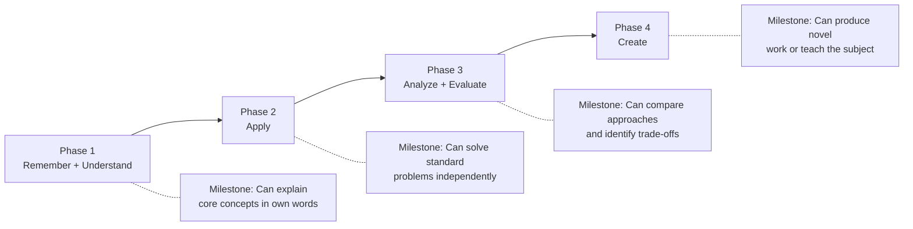
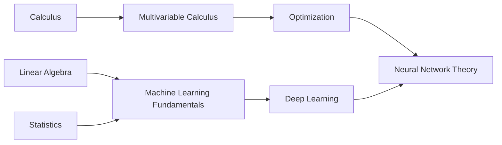

# KB Curriculum

Design structured learning paths with prerequisite mapping, difficulty calibration, and milestone-based progression.

## Overview

KB Curriculum takes a set of topics and resources (often from trl-kb-research) and transforms them into a coherent, sequenced learning path. It applies pedagogical frameworks to determine what to learn first, how to assess progress, and how to calibrate difficulty to the learner. It provides:

- **Prerequisite mapping** — Builds dependency graphs between topics (learn X before Y)
- **Difficulty calibration** — Rates each resource and topic on a consistent scale, calibrated to the learner
- **Milestone design** — Creates checkpoints with assessment criteria ("you should be able to...")
- **Time estimation** — Projects realistic time-to-complete for each phase and the overall path
- **Framework selection** — Applies the right pedagogical framework (Bloom's, ADDIE, etc.) based on domain and learner
- **Adaptive pacing** — Adjusts density based on learner constraints (2 hours/week vs. full-time study)

## Core Philosophy

**Four Principles:**

1. **Prerequisites are non-negotiable** — Skipping prerequisites creates the illusion of progress. The curriculum must make dependencies explicit, even when the learner wants to jump ahead.
2. **Milestones over duration** — "Study for 3 months" is meaningless without "and you should be able to solve X by then." Every phase ends with a concrete capability checkpoint.
3. **Calibrate to the learner, not the subject** — Calculus for a physicist and calculus for a data scientist share content but differ in emphasis, pace, and examples. The learner's goals shape the path.
4. **Honest time estimates** — Underestimating study time is disrespectful to the learner's planning. Include buffer. Account for review and practice, not just first-pass reading.

## When to Use This Skill

- **Designing a study plan** — Transform a topic into a phased, sequenced learning path
- **Mapping prerequisites** — "What do I need to know before learning X?"
- **Estimating study time** — "How long will it take to learn X at Y hours/week?"
- **Creating course outlines** — Formal curriculum design with learning objectives and assessments
- **Sequencing resources** — Given a bibliography, determine the optimal reading order
- **Calibrating difficulty** — Rate resources and topics relative to a specific learner

> For finding the resources to sequence, see **trl-kb-research**.
> For synthesizing curriculum content into digestible explanations, see **trl-kb-digest**.
> For the full orchestrated workflow, see **trl-kb**.

## Pedagogical Frameworks

### Framework Selection Guide

| Domain Characteristics | Recommended Framework | Why |
|---|---|---|
| Deep prerequisite chains (math, CS theory) | **Prerequisite Mapping** + **Bloom's Taxonomy** | Topics form a DAG; cognitive levels map naturally to progression |
| Skill-based domains (programming, music, art) | **Bloom's** + **Deliberate Practice** | Emphasis on apply → create, with practice loops |
| Broad survey domains (history, literature) | **Thematic Clustering** + **Bloom's** | No strict prerequisites; organize by themes, deepen within each |
| Professional certification (AWS, CPA) | **ADDIE** + **Backward Design** | Start from exam objectives, design backward to prerequisites |
| Language learning | **Spaced Repetition** + **Gardner's MI** | Retention is critical; multiple modalities (listening, reading, speaking) |
| Creative fields (writing, design) | **Gardner's MI** + **Project-Based** | Multiple intelligence types engaged; learn by making |

### Bloom's Taxonomy Applied to Sequencing



### Prerequisite Mapping

For domains with deep dependency chains, build a topic dependency graph:



**Rules:**
- A topic cannot appear in a phase until all its prerequisites have been covered
- Circular dependencies indicate a modeling error — break the cycle by identifying which knowledge is truly prerequisite
- Optional prerequisites are marked as "recommended but not required" and placed in parallel tracks

## Curriculum Structure

### Phase Template

```markdown
## Phase N: [Phase Title] (Weeks X-Y)

**Learning Objectives:**
- By the end of this phase, the learner should be able to:
  - [Objective 1 — tied to Bloom's level]
  - [Objective 2]
  - [Objective 3]

**Prerequisites:** [Phase N-1] or [specific prior knowledge]

**Resources:**
1. [Primary text/course] — estimated X hours
2. [Supplementary resource] — estimated Y hours
3. [Practice resource] — estimated Z hours

**Activities:**
- [ ] Read/watch [primary resource]
- [ ] Complete exercises in [practice resource]
- [ ] [Hands-on activity]

**Milestone Assessment:**
- [ ] Can [concrete capability 1]
- [ ] Can [concrete capability 2]
- [ ] [Optional: project or exercise that demonstrates mastery]

**Estimated Time:** X-Y hours total at Z hours/week = N weeks
```

### Pacing Calibration

| Commitment Level | Hours/Week | Adjustment |
|---|---|---|
| **Casual** | 2-5 | Extend timelines 3x, reduce resource count, prioritize most impactful |
| **Part-time** | 5-15 | Standard pacing, full resource list |
| **Intensive** | 15-30 | Compress timelines, add stretch resources, include more practice |
| **Full-time** | 30+ | Most aggressive pacing, comprehensive resources, daily milestones |

## Quick Start Guides

### Design a Learning Path
1. Provide the subject area, target outcome, and learner context
2. trl-kb-curriculum selects frameworks and maps prerequisites
3. Returns phased plan with milestones, time estimates, and resource sequencing

### Sequence a Bibliography
1. Provide a list of resources (or let trl-kb-research find them first)
2. trl-kb-curriculum analyzes prerequisites and difficulty levels
3. Returns optimal reading order with rationale

### Estimate Study Time
1. Provide subject, target depth, and available hours/week
2. trl-kb-curriculum projects timeline with phase breakdown
3. Returns calendar-mapped plan with buffer built in

## Reference Guide

| Task | Read These |
|------|-----------|
| **Choosing frameworks** | `references/sequencing-methods.md` |
| **Rating difficulty** | `references/difficulty-calibration.md` |
| **Agent workflows** | `references/agent-playbook.claude-code.md` |
| **Example curriculum** | `references/worked-example-curriculum-design.md` |

## Related Skills

- **trl-kb** — Orchestrator that dispatches trl-kb-curriculum alongside trl-kb-research and trl-kb-digest
- **trl-kb-research** — Provides the resources that trl-kb-curriculum sequences
- **trl-kb-digest** — Synthesizes curriculum content into explanations at target complexity

## Bundled Resources

### References

- [agent-playbook.claude-code.md](references/agent-playbook.claude-code.md) — Agent role, curriculum design workflows, framework selection logic
- [sequencing-methods.md](references/sequencing-methods.md) — Prerequisite mapping, topological sorting, Bloom's application
- [difficulty-calibration.md](references/difficulty-calibration.md) — Difficulty rating methodology, time estimation, learner calibration
- [worked-example-curriculum-design.md](references/worked-example-curriculum-design.md) — End-to-end: designing a web development curriculum

### Assets

- [curriculum-template.md](assets/curriculum-template.md) — Fillable curriculum template with phases, milestones, assessments
- [project-tracker.md](assets/project-tracker.md) — Progress tracking template for curriculum design projects
