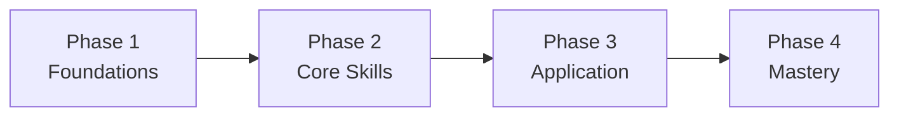
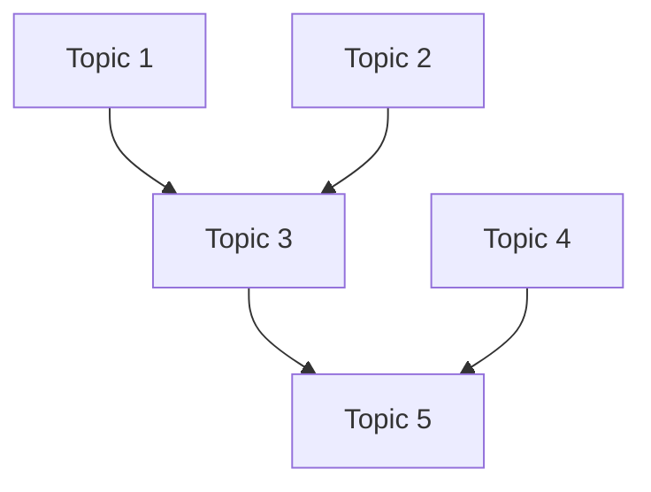
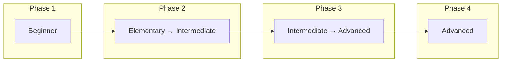

# Curriculum Template

## Subject: [Topic]
## Target Audience: [Learner profile summary]
## Duration: [Total weeks/months]
## Commitment: [Hours per week]

---

## Curriculum Overview

| Phase | Title | Weeks | Hours | Bloom's Level | Key Milestone |
|---|---|---|---|---|---|
| 1 | | | | Remember/Understand | |
| 2 | | | | Apply | |
| 3 | | | | Analyze/Evaluate | |
| 4 | | | | Create | |

**Framework(s) Used:** 
**Total Hours:** 
**Total Duration:** 

---

## Prerequisite Map

---

## Phase 1: [Title] (Weeks X-Y)

**Bloom's Level:** Remember + Understand
**Prerequisites:** None

### Learning Objectives
- [ ] Can [verb] [what]
- [ ] Can [verb] [what]
- [ ] Can [verb] [what]

### Resources (in order)

| # | Resource | Type | Difficulty | Hours | Notes |
|---|---|---|---|---|---|
| 1 | | | | | Primary |
| 2 | | | | | Supplementary |
| 3 | | | | | Practice |

### Activities
1. [ ] 
2. [ ] 
3. [ ] 

### Milestone Check
- [ ] Self-assessment: Can I [capability]?
- [ ] Exercise: [specific task that demonstrates mastery]

---

## Phase 2: [Title] (Weeks X-Y)

_(Repeat Phase 1 structure)_

---

## Phase 3: [Title] (Weeks X-Y)

_(Repeat Phase 1 structure)_

---

## Phase 4: [Title] (Weeks X-Y)

_(Repeat Phase 1 structure)_

---

## Review Schedule

_Based on spaced repetition principles:_

| After Phase | Review | Method | When |
|---|---|---|---|
| 1 | Phase 1 topics | Flashcards / Self-test | Start of Phase 2 |
| 2 | Phase 1+2 topics | Practice problems | Start of Phase 3 |
| 3 | All prior topics | Mini-project | Start of Phase 4 |

---

## Difficulty Progression

