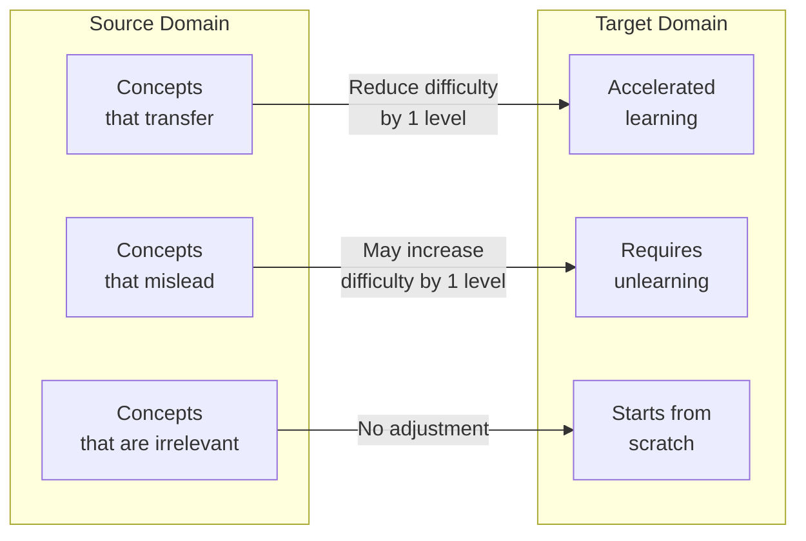
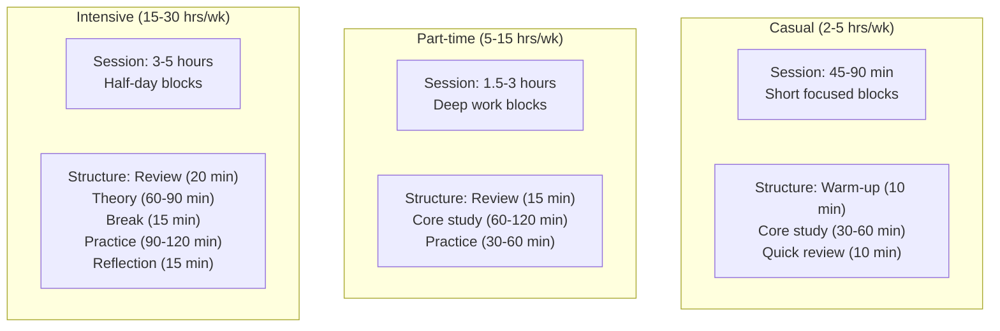
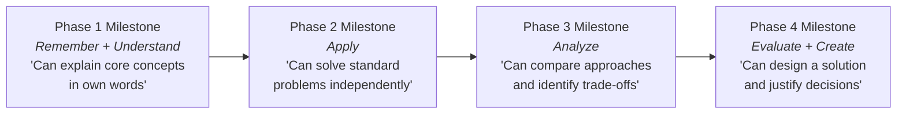

# Difficulty Calibration

> How to rate difficulty, calibrate to the learner, estimate time, design milestones, and avoid common estimation errors. This is the quantitative backbone of curriculum design.

---

## Difficulty Scale

A 5-level scale with concrete anchors. The scale is domain-relative — "Intermediate" in quantum physics and "Intermediate" in cooking describe vastly different absolute knowledge levels, but they describe the same relative position within their domain.

### Level Definitions

| Level | Label | Description | Learner Can... | Resource Characteristics |
|-------|-------|-------------|----------------|------------------------|
| 1 | **Beginner** | No prior knowledge of the domain assumed. May assume general literacy and reasoning. | Follow along with guided instruction. Reproduce demonstrated steps. | Heavy scaffolding. Step-by-step. Defines all terms. Many examples per concept. |
| 2 | **Elementary** | Basic familiarity with core terminology and concepts expected. | Work through exercises with hints. Explain basic concepts in own words. | Some terms used without definition. Exercises require recall of prior material. |
| 3 | **Intermediate** | Working knowledge of fundamentals. Can read standard material without constant lookups. | Solve standard problems independently. Connect concepts across topics. | Assumes fluency with basics. Introduces nuance. Fewer examples, more reasoning. |
| 4 | **Advanced** | Deep understanding of core and adjacent topics. Comfortable with abstraction and formalism. | Tackle non-standard problems. Evaluate trade-offs. Read primary sources. | Formal notation/jargon used freely. Proofs, derivations, or complex case studies. |
| 5 | **Expert** | Mastery of the domain and adjacent fields. Can identify gaps in existing knowledge. | Contribute novel insights. Teach the subject. Critique published work. | Original research, cutting-edge papers, unresolved problems. |

### Difficulty Signals in Resources

When rating a resource you have not personally reviewed, use these signals:

| Signal | Suggests Lower Difficulty | Suggests Higher Difficulty |
|--------|--------------------------|--------------------------|
| Title keywords | "Introduction to," "Beginner's Guide," "Fundamentals" | "Advanced," "In Depth," "Mastering," "Theory of" |
| Page count (books) | Under 200 pages | Over 600 pages |
| Publisher/series | O'Reilly animal books, "Head First" series | Springer GTM, Cambridge Tracts, ACM monographs |
| Edition number | 1st edition | 4th+ edition (material has been refined and deepened) |
| Prerequisites listed | "No prerequisites" | Lists specific courses or textbooks |
| Exercise difficulty | "Practice problems" | "Prove that...," "Design a system that..." |
| Audience statement | "For beginners," "No experience needed" | "For practitioners," "Graduate-level" |

---

## Domain-Relative Calibration

The same absolute knowledge level maps to different difficulty ratings in different domains. Calibrate by identifying the domain's "center of mass."

### Calibration Anchors by Domain Family

| Domain Family | Beginner Anchor | Intermediate Anchor | Expert Anchor |
|--------------|----------------|--------------------|--------------| 
| **Mathematics** | Arithmetic, basic algebra | Calculus, linear algebra, proof writing | Research-level analysis, topology, category theory |
| **Programming** | Variables, loops, functions | Data structures, algorithms, design patterns | Compiler design, distributed systems theory, PLT |
| **Natural Sciences** | High school survey courses | Undergraduate major coursework | Graduate research, primary literature |
| **Humanities** | Survey courses, popular nonfiction | Primary source analysis, historiography | Original research, peer-reviewed publication |
| **Creative Skills** | Guided tutorials, copy exercises | Independent work with personal style | Professional portfolio, gallery/publication |
| **Languages** | CEFR A1-A2, survival phrases | CEFR B1-B2, conversational fluency | CEFR C1-C2, native-like proficiency |

### Cross-Domain Calibration Example

A data scientist learning web development:

| Topic | Absolute Difficulty | Calibrated Difficulty | Why |
|-------|-------------------|-----------------------|-----|
| Variables and types | Beginner | Skip (transfer) | Already knows this from Python |
| HTML/CSS basics | Beginner | Beginner | Genuinely new domain |
| JavaScript async/await | Intermediate | Intermediate | Concurrency concepts transfer partially |
| React state management | Intermediate | Intermediate-Advanced | No direct transfer from data science tooling |
| SQL and databases | Intermediate | Elementary (transfer) | Already uses SQL daily in data work |

---

## Learner-Relative Calibration

The same resource is "Advanced" for one learner and "Intermediate" for another. Calibrate by assessing the learner's starting position.

### Learner Assessment Questions

Ask these (or infer from context) to calibrate:

1. **What have you already studied in this domain?** (maps to a difficulty level)
2. **What adjacent domains do you know well?** (identifies transfer potential)
3. **Can you read the table of contents of [reference text] and identify what's familiar vs. new?** (direct calibration)
4. **What's the hardest thing you've successfully learned?** (calibrates learning capacity)
5. **When you get stuck, what do you typically do?** (calibrates resilience and self-direction)

### Transfer Knowledge Matrix

When a learner has expertise in domain A and is learning domain B, some knowledge transfers:



**Transfer accelerates learning** for overlapping concepts (reduce difficulty rating by 1 level).
**Transfer misleads** when source domain habits are wrong in the target domain (Java habits in JavaScript, classical physics intuitions in quantum mechanics). These topics may be harder for the "experienced" learner than for a true beginner.

### Calibration Adjustment Table

| Learner Background | Adjustment |
|-------------------|------------|
| Complete beginner, no adjacent knowledge | Use ratings as-is |
| Beginner with adjacent domain expertise | Reduce transferable topics by 1 level |
| Returning learner (studied before, rusty) | Reduce by 1 level but add review phase |
| Self-taught with gaps | Rate by actual gaps, not claimed level |
| Domain expert learning subtopic | Reduce by 2 levels for core, 1 for periphery |

---

## Time Estimation Methodology

### Base Rates

Start with base reading/consumption rates, then apply multipliers.

| Resource Type | Base Rate | Notes |
|--------------|-----------|-------|
| Technical book (easy) | 20-30 pages/hour | Beginner-friendly, well-illustrated |
| Technical book (moderate) | 10-20 pages/hour | Standard textbook pace |
| Technical book (hard) | 5-10 pages/hour | Dense, formal, proof-heavy |
| Video course | 1.2x runtime | Pausing, rewinding, note-taking |
| Interactive tutorial | 1.5x stated duration | Debugging, experimenting beyond the script |
| Academic paper | 2-4 hours per paper | Depending on field and reader level |
| Online article/blog | 5-10 minutes per 1000 words | Varies wildly by density |

### Multipliers

Apply these multipliers to the base rate to get realistic estimates:

| Factor | Multiplier | Applies When |
|--------|-----------|--------------|
| **Exercises included** | 2.0-3.0x reading time | Book has problems to solve |
| **Exercises assigned (external)** | 1.5-2.0x | Separate problem set |
| **Note-taking** | 1.3x | Active note-taking during reading |
| **First encounter with domain** | 1.5x | Everything is new; many lookups |
| **Review pass** | 0.3-0.5x original time | Re-reading for reinforcement |
| **Project work** | 3.0-5.0x | Building something from what was learned |
| **Confusion/stuck buffer** | 1.15x | Getting stuck, debugging, re-reading |
| **Context switching** | 1.1x | Casual learners who study in short sessions |

### Composite Time Estimation Formula

```
Phase Time = sum over all resources of:
    (resource_base_time * exercise_multiplier * domain_familiarity * note_taking)
    + (review_time)
    + (project_time)
    + (buffer)
```

### Worked Calculation Example

**Resource:** "Eloquent JavaScript" (472 pages, intermediate difficulty, includes exercises)
**Learner:** Beginner programmer, 10 hours/week

```
Base reading time:     472 pages / 15 pages per hour = 31.5 hours
Exercise multiplier:   31.5 * 2.5 = 78.75 hours (exercises are substantial)
First encounter:       78.75 * 1.5 = 118 hours (new domain)
Note-taking:           118 * 1.3 = 153 hours
Buffer (15%):          153 * 1.15 = 176 hours

At 10 hours/week:      176 / 10 = 17.6 weeks (approximately 4.5 months)
```

This is for one book. A full curriculum typically involves 8-15 resources, but not all are full-length books.

---

## Pacing Models

### Model Definitions

| Model | Hours/Week | Typical Learner | Session Pattern |
|-------|-----------|----------------|----------------|
| **Casual** | 2-5 | Working professional, learning as hobby | 2-3 sessions of 1-2 hours |
| **Part-time** | 5-15 | Career changer, serious hobbyist | 4-5 sessions of 1.5-3 hours |
| **Intensive** | 15-30 | Bootcamp student, dedicated learner | Daily sessions of 3-5 hours |
| **Full-time** | 30+ | Full-time student, career break | 6-8 hours/day, 5 days/week |

### Pacing Impact on Curriculum Design

| Pacing | Curriculum Adjustments |
|--------|----------------------|
| **Casual** | Fewer resources per phase (2 max). More review phases. Prefer shorter resources. Add "warm-up" activities at start of each session. Extend all timelines by 1.3x for forgetting overhead. |
| **Part-time** | Standard resource count. Review every 3 phases. Standard timelines. This is the baseline pacing model. |
| **Intensive** | More resources per phase. Can handle parallel tracks. Add stretch goals and optional deep-dives. Compress timelines by 0.9x for immersion benefit. |
| **Full-time** | Maximum resource density. Daily milestones. Include "office hours" style problem-solving sessions. Compress by 0.85x. Risk of burnout — schedule lighter days. |

### Session Length Recommendations



---

## Milestone Design

### Writing Effective Milestones

Every milestone must be:

1. **Observable** — The learner can demonstrate it, not just feel it
2. **Measurable** — There is a clear success/failure condition
3. **Tied to Bloom's level** — Use the appropriate verb for the target cognitive level
4. **Specific** — "Understands databases" is not a milestone; "Can design a normalized schema for a given business domain" is

### Bloom's Verbs for Milestone Writing

| Bloom's Level | Verbs to Use | Example Milestone |
|--------------|-------------|-------------------|
| Remember | List, define, identify, recall, name, state | "Can list the 5 SOLID principles and state what each stands for" |
| Understand | Explain, summarize, paraphrase, classify, compare, describe | "Can explain the difference between SQL and NoSQL databases to a non-technical person" |
| Apply | Solve, implement, use, demonstrate, calculate, execute | "Can implement a binary search algorithm from scratch in under 10 minutes" |
| Analyze | Differentiate, examine, compare, contrast, deconstruct, organize | "Can analyze a slow SQL query and identify at least 3 optimization opportunities" |
| Evaluate | Judge, critique, justify, assess, recommend, prioritize | "Can evaluate two competing architectural approaches and justify a recommendation with trade-offs" |
| Create | Design, build, produce, compose, formulate, invent | "Can design and implement a REST API with authentication, validation, and error handling" |

### Milestone Progression Within a Curriculum



### Anti-Patterns in Milestone Design

| Anti-Pattern | Problem | Fix |
|-------------|---------|-----|
| "Understands X" | Not observable or measurable | "Can explain X to a peer without notes" |
| "Reads chapters 1-5" | Activity, not outcome | "Can solve end-of-chapter problems without referencing the text" |
| "Feels confident about X" | Subjective, unreliable | "Can complete [specific task] within [time limit]" |
| "Knows the basics of X" | Vague, no clear boundary | "Can [specific Bloom's verb] [specific concept]" |
| No milestone at all | Phase has no success criteria | Every phase must have at least one |

---

## Common Estimation Errors

### Error 1: Underestimating Practice Time

**The mistake:** Estimating time based only on reading/watching speed.
**Reality:** For skill-based domains, practice takes 2-5x the consumption time. Reading about quicksort takes 30 minutes; implementing it takes 2 hours; debugging your implementation takes another hour.
**Fix:** Always apply the exercise multiplier. For programming curricula, assume a minimum 3x multiplier.

### Error 2: Ignoring Review Time

**The mistake:** Assuming the learner retains everything from a single pass.
**Reality:** Without review, retention drops to ~20% after a month (Ebbinghaus). Casual learners with week-long gaps between sessions are especially affected.
**Fix:** Budget 10-25% of total time for review, scaled by pacing model. See the review frequency table in `sequencing-methods.md`.

### Error 3: Assuming Consistent Pace

**The mistake:** "This book is 300 pages, so at 15 pages/hour, that's 20 hours."
**Reality:** The first 100 pages of a textbook are usually easier (foundations). The middle 100 are the core (moderate). The last 100 are advanced (hardest). Pace slows significantly in later chapters.
**Fix:** Use a difficulty curve: estimate 1.5x the base rate for the final third of any resource.

### Error 4: Not Accounting for Difficulty Spikes

**The mistake:** Smooth linear time estimates across all phases.
**Reality:** Some topics are disproportionately hard. In a programming curriculum, "recursion" or "async/await" may take 3x as long as adjacent topics.
**Fix:** Identify known difficulty spikes for the domain. Add 50-100% buffer for those specific topics. Flag them in the curriculum so the learner expects the slowdown.

### Error 5: Conflating Calendar Time with Study Time

**The mistake:** "You can learn this in 6 weeks" (when the estimate is 60 hours and the learner has 5 hours/week — that is 12 weeks).
**Reality:** Calendar time = study hours / hours per week. Always state both.
**Fix:** Report as "approximately 60 hours of study time, which at 5 hours/week is roughly 12 weeks (about 3 months)."

### Error 6: Ignoring Setup and Tooling Overhead

**The mistake:** Time estimate covers only learning content.
**Reality:** Technical curricula require environment setup, tool installation, configuration debugging. This can consume 2-8 hours at the start and 30-60 minutes per new tool.
**Fix:** Add a "Phase 0: Environment Setup" with explicit time estimates. Include troubleshooting buffer.

### Error 7: Optimistic Expert Bias

**The mistake:** An expert estimates how long a beginner will take based on how long it would take them (the expert) to review the same material.
**Reality:** Experts underestimate by 3-10x because they have chunked knowledge, pattern recognition, and transfer from adjacent domains.
**Fix:** Use the base rates and multipliers in this document, not gut feeling. When in doubt, round up.

---

## Quick Reference: Time Estimation Checklist

Before finalizing any time estimate, verify:

- [ ] Base reading/consumption rate is appropriate for resource difficulty
- [ ] Exercise multiplier is applied (2-3x for technical, 1.5x for conceptual)
- [ ] First-encounter multiplier is applied if the domain is new to the learner
- [ ] Review time is budgeted (10-25% depending on pacing)
- [ ] Project time is included if the curriculum has a capstone or portfolio component
- [ ] Buffer for confusion/stuck time is included (15%)
- [ ] Difficulty spike topics are identified and given extra time
- [ ] Setup/tooling time is included for technical curricula
- [ ] Calendar time is calculated from study hours and hours/week
- [ ] Feasibility is assessed: does the timeline fit the learner's constraints?
- [ ] Both optimistic and conservative estimates are provided (range, not point estimate)
