# Sequencing Methods

> Deep reference on curriculum sequencing strategies. Covers topological sorting, Bloom's sequencing, spiral curricula, modular vs linear designs, parallel tracks, review placement, and gateway topic identification.

---

## Topological Sorting

Topological sorting is the foundational algorithm for sequencing topics that have prerequisite relationships. Given a directed acyclic graph (DAG) of topics, a topological sort produces a linear ordering where every topic appears after all of its prerequisites.

### The Algorithm (Conceptual)

1. Build the prerequisite graph: nodes are topics, edges are "must come before" relationships
2. Find all nodes with no incoming edges (no prerequisites) — these can be learned first
3. Remove those nodes from the graph, then find the new set of nodes with no incoming edges
4. Repeat until all nodes are placed

### Handling Multiple Valid Orderings

Topological sort rarely produces a single unique ordering. When multiple topics have no dependency on each other, they can appear in any order. Use these tiebreakers:

| Tiebreaker | Rule | Rationale |
|-----------|------|-----------|
| Difficulty | Easier topic first | Builds confidence, reduces cognitive load |
| Gateway score | Higher out-degree first | Unlocks more downstream learning sooner |
| Resource length | Shorter resource first | Quick wins build momentum |
| Learner preference | Preferred format first | Engagement sustains motivation |

### Example: Topological Sort for Data Science

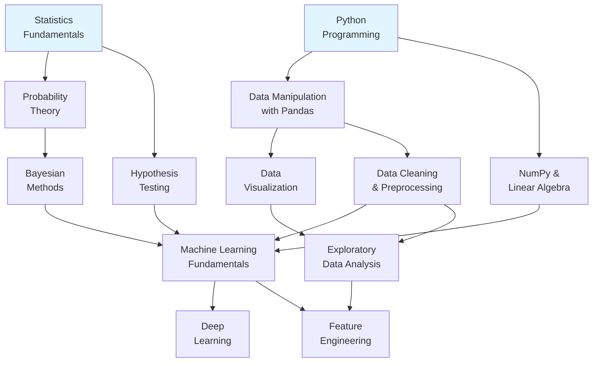

**Valid topological orderings include:**

1. STATS, PROG, PROB, HYPO, PANDAS, NP, BAYES, VIZ, CLEAN, ML, EDA, FEAT, DL
2. PROG, STATS, PANDAS, PROB, NP, HYPO, VIZ, CLEAN, BAYES, EDA, ML, FEAT, DL

Both are valid. Tiebreakers (difficulty, gateway score) determine which is better for a specific learner.

### Detecting Invalid Graphs

If the prerequisite graph contains a cycle, topological sort is impossible. Cycles indicate a modeling error:

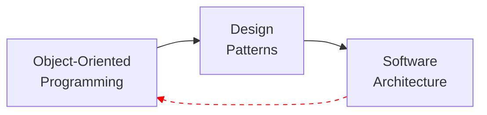

**Fix:** The cycle C --> A is a false dependency. Software Architecture does not truly require re-learning OOP — it requires a deeper understanding. Break the cycle by splitting the node:

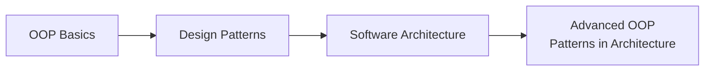

---

## Bloom's Taxonomy Sequencing

Bloom's Taxonomy defines six cognitive levels. Sequencing by Bloom's level ensures the learner builds lower-order thinking skills before being asked to exercise higher-order ones.

### The Six Levels Applied to Curriculum Phases

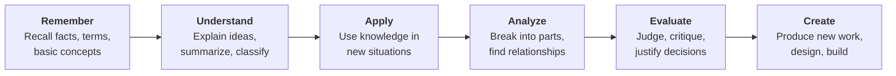

### Mapping Resources to Bloom's Levels

| Resource Characteristic | Likely Bloom's Level |
|------------------------|---------------------|
| Glossary, terminology list, flashcards | Remember |
| Textbook with explanations and examples | Understand |
| Exercise sets, tutorials with problems | Apply |
| Case studies, comparison articles | Analyze |
| Review papers, critique frameworks | Evaluate |
| Project prompts, open-ended assignments | Create |

### Bloom's Sequencing Within a Theme

Within a single theme (e.g., "databases"), sequence resources by Bloom's level:

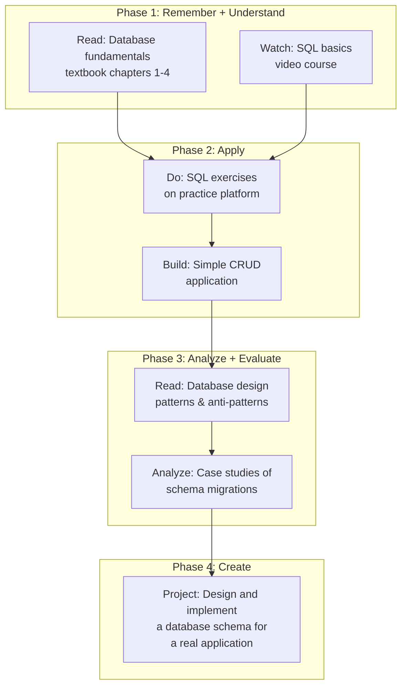

### When Bloom's Sequencing Fails

Bloom's is less useful when:
- The domain is entirely creative (art, fiction writing) — learners may need to "Create" from day one to stay engaged
- The learner has transfer knowledge from adjacent domains — they can skip "Remember" for overlapping concepts
- The topic is purely procedural (assembly instructions, recipes) — there is no "Analyze" level, just "Apply"

In these cases, pair Bloom's with another framework rather than using it alone.

---

## Spiral Curriculum

Jerome Bruner's spiral curriculum revisits the same topics multiple times at increasing depth. Rather than learning a topic once and moving on, the learner encounters it at each "turn" of the spiral with deeper understanding.

### When to Use

- **Language learning** — Grammar concepts are revisited with increasing complexity
- **Mathematics** — Concepts like "functions" appear in algebra, calculus, analysis, each time deeper
- **Programming** — "Testing" is first encountered as unit tests, then integration tests, then TDD philosophy
- **Any domain where early simplifications are later refined** — Physics (Newtonian before Einsteinian), economics (supply/demand before market microstructure)

### Spiral Design Pattern

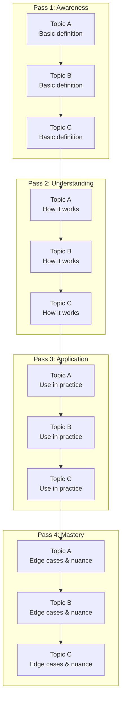

### Spiral vs Linear: Comparison

| Aspect | Linear | Spiral |
|--------|--------|--------|
| Topic coverage | Complete one topic, move to next | Partial coverage, revisit later |
| Retention | Lower (long gap between learning and use) | Higher (repeated reinforcement) |
| Motivation | Risk of "tunnel vision" fatigue | Variety keeps engagement |
| Prerequisite handling | Strict ordering | Softer — early passes give "enough" for next topics |
| Best for | Deep technical chains | Broad domains, language, creative fields |
| Risk | Boring if stuck on one topic too long | Superficial if passes don't add real depth |

### How to Design Spiral Passes

Each pass must add genuine depth, not just repeat content. Use Bloom's levels to calibrate:

| Pass | Bloom's Level | What the Learner Does |
|------|--------------|----------------------|
| 1 | Remember | Encounter the term, read the definition, see an example |
| 2 | Understand | Explain it in their own words, classify it, compare to similar concepts |
| 3 | Apply | Use it to solve a problem, build something with it |
| 4 | Analyze/Evaluate | Examine edge cases, compare alternatives, justify when to use it |

---

## Modular vs Linear Sequencing

### Linear Sequencing

Every topic must be completed in a fixed order. No skipping, no reordering.

**Use when:**
- Strong prerequisite chains exist (each topic builds directly on the previous)
- The learner is a complete beginner (too much choice is overwhelming)
- Certification/exam prep (the exam assumes a specific knowledge sequence)

**Risk:** Bottleneck — if the learner gets stuck on one topic, all progress halts.

### Modular Sequencing

Topics are grouped into independent modules. Within each module, sequencing may be linear, but modules themselves can be taken in any order.

**Use when:**
- Topics are thematically related but not strictly prerequisite
- The learner has some background and can self-assess readiness
- The domain has natural clusters (e.g., web dev: frontend module, backend module, devops module)

**Risk:** Learner may skip a module that turns out to be needed later.

### Hybrid: Linear Core with Modular Electives

The most common real-world approach. A linear core establishes fundamentals, then modular electives allow the learner to specialize.

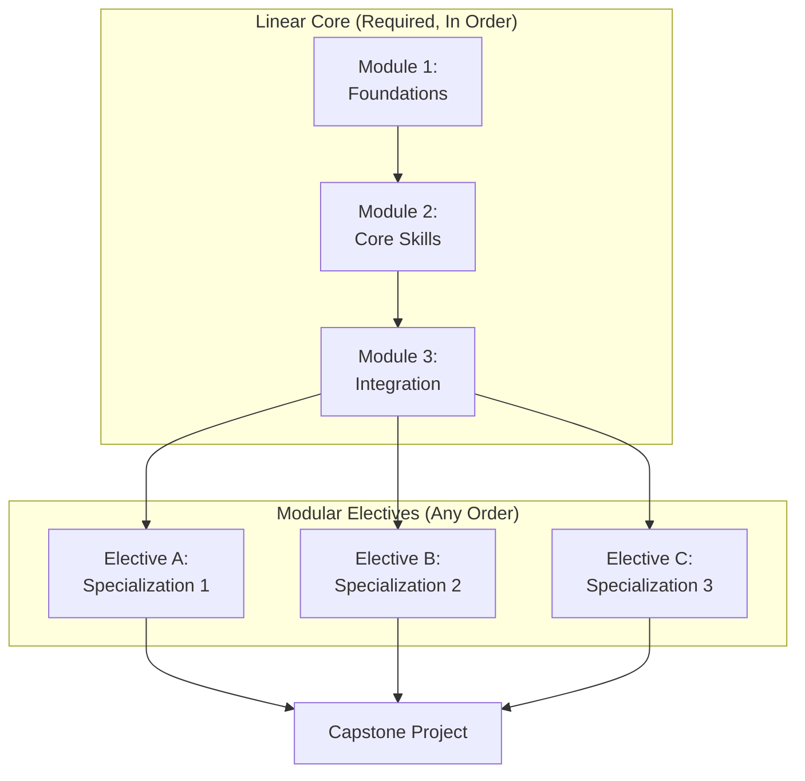

---

## Parallel Track Design

Parallel tracks offer the learner multiple simultaneous paths through the curriculum. This is appropriate when topics have no dependency on each other and the learner benefits from variety.

### Common Parallel Track Patterns

**Theory/Practice Split:**

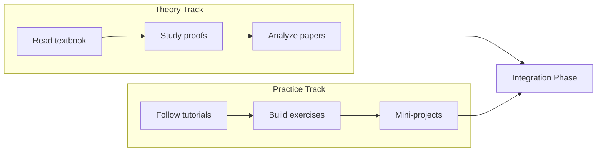

**Breadth-First / Depth-First Split:**

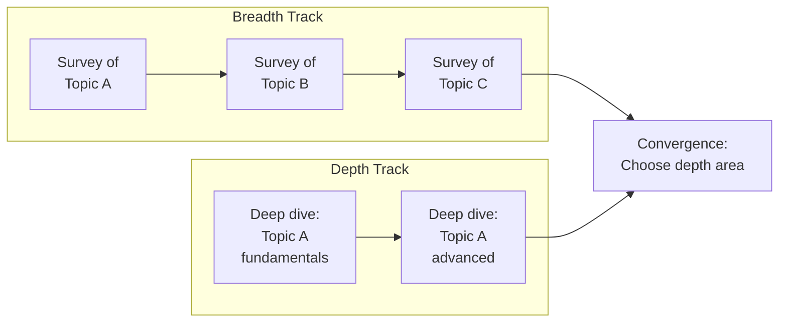

### Rules for Parallel Tracks

1. **Independence requirement:** Neither track should assume content from the other at any point before convergence
2. **Convergence point:** Parallel tracks must merge before advancing to the next major phase
3. **Time estimate:** Total is the sum of both tracks, not the maximum (learner must complete both)
4. **Interleaving is fine:** The learner can alternate between tracks (e.g., one theory session, one practice session)
5. **Balance workload:** Tracks should be roughly equal in estimated time to prevent one from being neglected

---

## Review and Reinforcement Points

### When to Insert Review Phases

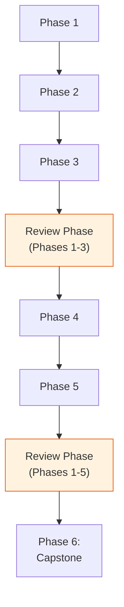

### Triggers for Review Phases

| Trigger | When to Review |
|---------|---------------|
| **Every 2-3 content phases** | Prevents knowledge from decaying before it's reinforced |
| **Before a difficulty jump** | Consolidate current level before stepping up |
| **At the midpoint** | Structured review of everything so far; recalibrate timeline |
| **Before the capstone** | Ensure all prerequisites for the final project are solid |
| **After a struggle phase** | If the learner reports difficulty, add review before continuing |

### Types of Review Activities

| Activity | Purpose | Time Cost |
|---------|---------|-----------|
| Re-read key sections | Refresh factual knowledge | Low (1-2 hours) |
| Redo exercises without solutions | Test retention of applied skills | Medium (2-4 hours) |
| Write summaries | Force active recall and synthesis | Medium (2-3 hours) |
| Teach-back (explain to someone) | Deepest form of review | Medium (1-2 hours) |
| Spaced recall quiz | Targeted retention check | Low (30-60 min) |
| Connect-the-dots essay | Map relationships between phases | Medium (2-3 hours) |

### The Forgetting Curve Factor

Ebbinghaus's forgetting curve shows that without review, retention drops rapidly:

- After 1 day: ~65% retained
- After 1 week: ~40% retained
- After 1 month: ~20% retained

For casual learners (2-5 hrs/week), the gap between study sessions is long enough that significant forgetting occurs. Build in more review for lower-intensity pacing models.

| Pacing | Review Frequency | Review Time Budget |
|--------|-----------------|-------------------|
| Casual (2-5 hrs/wk) | Every 2 content phases | 25% of total time |
| Part-time (5-15 hrs/wk) | Every 3 content phases | 15% of total time |
| Intensive (15-30 hrs/wk) | Every 3-4 content phases | 10% of total time |
| Full-time (30+ hrs/wk) | Every 4 content phases | 10% of total time |

---

## Gateway Topics

Gateway topics are nodes in the prerequisite graph with the highest out-degree — they unlock the most downstream learning. Identifying and prioritizing gateway topics is one of the highest-leverage curriculum design decisions.

### How to Identify Gateway Topics

1. Build the prerequisite DAG
2. Calculate out-degree for each node (number of topics that directly or transitively depend on it)
3. Rank by out-degree
4. The top 2-3 nodes are gateway topics

### Why Gateway Topics Matter

**Scenario A — Gateway topic late in the curriculum:**

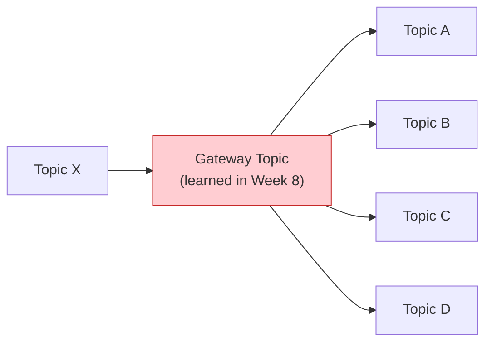

Topics A, B, C, D are all blocked until Week 8. The learner spends 7 weeks unable to branch out.

**Scenario B — Gateway topic early:**

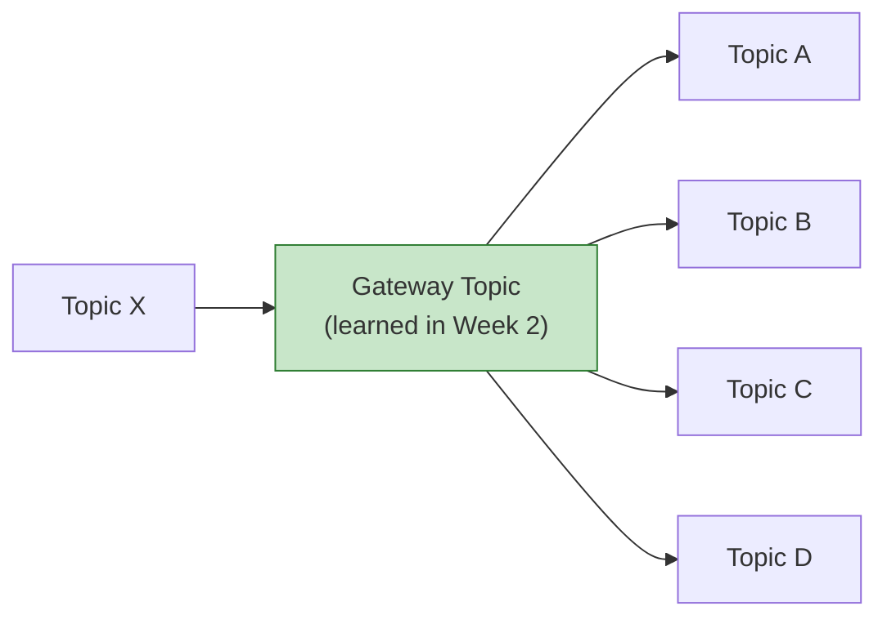

By Week 3, the learner has four possible paths. Motivation and flexibility both increase.

### Gateway Topic Prioritization Rules

1. **Always place gateway topics as early as the prerequisite graph allows** — never delay them for thematic reasons
2. **If two gateway topics have no dependency between them**, place the one with higher out-degree first
3. **If a gateway topic is unusually difficult**, invest extra resources (additional readings, practice exercises) to ensure the learner masters it before moving on — bottleneck failures here cascade
4. **Flag gateway topics explicitly in the curriculum** so the learner understands their importance
