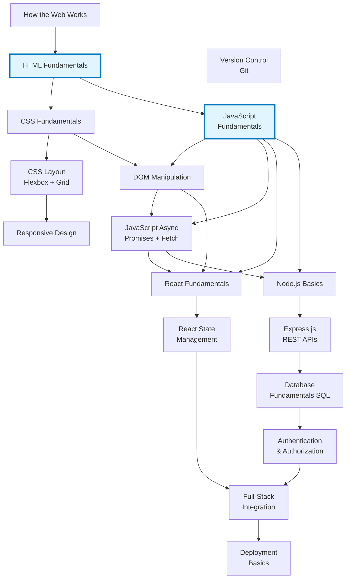
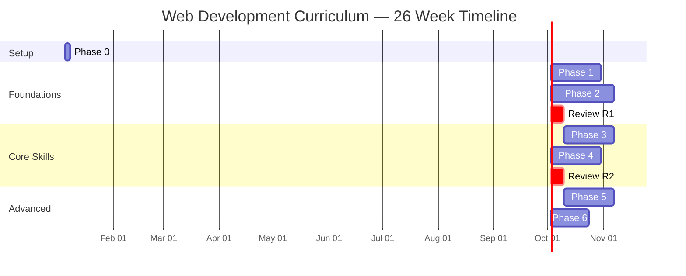
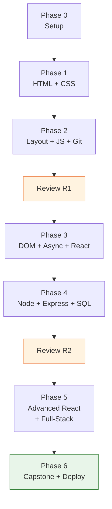

# Worked Example: Web Development Curriculum Design

> End-to-end walkthrough of designing a 6-month web development curriculum for a complete beginner. Demonstrates every step from learner profiling through final curriculum document, using the methods from the other reference files.

---

## Step 1: Learner Profile

| Field | Value |
|-------|-------|
| **Name** | Alex (composite learner profile) |
| **Current Level** | Complete beginner — no programming experience, comfortable with computers |
| **Goal** | Build full-stack web applications; career transition into web development |
| **Available Time** | 10 hours/week |
| **Duration Target** | 6 months (approximately 260 study hours) |
| **Preferred Formats** | Mix of reading and interactive tutorials; learns best by building |
| **Adjacent Knowledge** | None directly applicable; has a business background (useful for understanding product requirements) |
| **Constraints** | Working full-time; studies evenings and weekends |

### Feasibility Pre-Check

At 10 hours/week over 26 weeks = 260 available hours.

Target: "Can build a full-stack web application independently." This maps to Bloom's "Create" level — the highest cognitive level — for web development fundamentals.

Based on the difficulty calibration methodology:
- Full-stack competence typically requires 300-500 hours for a complete beginner
- 260 hours is tight but feasible if scope is focused on one frontend framework and one backend approach
- Will not achieve "job-ready" depth in all areas — prioritize breadth with depth in core skills

**Assessment:** Feasible with focused scope. The learner will be able to build applications but will need continued learning beyond the curriculum for professional readiness.

---

## Step 2: Framework Selection

### Domain Analysis

Web development has these characteristics:
- **Moderate prerequisite chains** — HTML before CSS before responsive design; JavaScript before frameworks
- **Heavily skill-based** — Learning happens through building, not just reading
- **Multiple parallel tracks possible** — Frontend and backend can be learned somewhat independently
- **Rapid iteration cycles** — Learners can see results immediately (motivating)

### Selected Frameworks

| Framework | Role | Why |
|-----------|------|-----|
| **Prerequisite Mapping** | Primary | Clear dependency chains between web technologies |
| **Bloom's Taxonomy** | Secondary | Ensures progression from understanding to creating |
| **Project-Based Learning** | Tertiary | Each phase culminates in a buildable artifact |

Rejected alternatives:
- Spiral Curriculum — Useful for long-term programs (1+ year) but this 6-month path benefits more from linear progression with focused depth
- ADDIE — Better suited for certification prep; Alex is not targeting a specific certification
- Spaced Repetition — Important for retention but addressed through review phases rather than as a primary framework

---

## Step 3: Topic Dependency Graph

### Topics Identified

1. How the Web Works (HTTP, browsers, servers)
2. HTML Fundamentals
3. CSS Fundamentals
4. CSS Layout (Flexbox, Grid)
5. Responsive Design
6. JavaScript Fundamentals
7. DOM Manipulation
8. JavaScript Async (Promises, fetch)
9. Version Control (Git)
10. React Fundamentals
11. React State Management
12. Node.js Basics
13. Express.js / REST APIs
14. Database Fundamentals (SQL)
15. Authentication & Authorization
16. Deployment Basics
17. Full-Stack Integration

### Prerequisite DAG

### Gateway Topic Analysis

| Topic | Out-Degree (direct + transitive) | Classification |
|-------|--------------------------------|----------------|
| **JavaScript Fundamentals** | 9 downstream topics | Primary gateway |
| **HTML Fundamentals** | 11 downstream topics | Primary gateway |
| **CSS Fundamentals** | 5 downstream topics | Secondary gateway |
| **Async JavaScript** | 5 downstream topics | Secondary gateway |

JavaScript and HTML are the two primary gateways. Both should appear in Phase 1 or early Phase 2.

---

## Step 4: Phase Design

### Phase Overview

| Phase | Title | Weeks | Topics | Bloom's Level |
|-------|-------|-------|--------|--------------|
| 0 | Environment Setup | Week 1 | Tooling, editor, terminal | N/A (setup) |
| 1 | Web Foundations | Weeks 1-4 | How the Web Works, HTML, CSS Basics | Remember + Understand |
| 2 | Layout and JavaScript | Weeks 5-9 | CSS Layout, Responsive, JS Fundamentals, Git | Understand + Apply |
| R1 | Review | Week 10 | Review Phases 1-2 | Consolidation |
| 3 | Interactive Web | Weeks 11-14 | DOM, Async JS, React Fundamentals | Apply |
| 4 | Backend Development | Weeks 15-18 | Node.js, Express, Databases, Auth | Apply + Analyze |
| R2 | Review | Week 19 | Review Phases 1-4 | Consolidation |
| 5 | React Advanced + Integration | Weeks 20-23 | React State, Full-Stack Integration | Analyze + Create |
| 6 | Capstone + Deployment | Weeks 24-26 | Full-Stack Project, Deployment | Create |

---

## Step 5: Resource Assignment

### Phase 0: Environment Setup (Week 1, ~5 hours)

**Purpose:** Get tools installed and working before studying content.

**Resources:**
1. VS Code setup + extensions — 1 hour
2. Terminal/command line basics — 2 hours
3. Browser DevTools orientation — 1 hour
4. Create GitHub account, install Git — 1 hour

**No milestone** — this is a setup phase. Success = "environment works."

---

### Phase 1: Web Foundations (Weeks 1-4, ~40 hours)

**Learning Objectives:**
- Explain how web browsers request and display pages (HTTP request/response cycle)
- Write valid HTML documents with proper semantic structure
- Style HTML elements with CSS selectors, properties, and the box model

**Resources:**

| # | Resource | Type | Est. Hours | Difficulty |
|---|---------|------|-----------|------------|
| 1 | MDN "Getting Started with the Web" | Tutorial | 8 | Beginner |
| 2 | *HTML and CSS: Design and Build Websites* — Jon Duckett (ISBN: 978-1-118-00818-8 [Unverified]) | Book | 20 | Beginner |
| 3 | freeCodeCamp Responsive Web Design Certification (HTML + CSS sections only) | Interactive | 12 | Beginner |

**Activities:**
- [ ] Complete MDN tutorial end-to-end
- [ ] Read Duckett chapters 1-11 (HTML) and 12-15 (CSS basics)
- [ ] Complete freeCodeCamp HTML and basic CSS challenges
- [ ] Build a personal "About Me" page from scratch (no template)

**Milestone Assessment:**
- [ ] Can write an HTML page from memory with: headings, paragraphs, lists, links, images, and a form
- [ ] Can explain the CSS box model (content, padding, border, margin) with a diagram
- [ ] Can style the "About Me" page with colors, fonts, spacing, and basic layout
- [ ] Can use browser DevTools to inspect and modify CSS on any web page

**Estimated Time:** 40 hours (10 hrs/week x 4 weeks)

---

### Phase 2: Layout and JavaScript (Weeks 5-9, ~50 hours)

**Learning Objectives:**
- Build responsive layouts using Flexbox and CSS Grid
- Write JavaScript programs using variables, functions, loops, arrays, and objects
- Use Git for version control (commit, branch, push, pull)

**Prerequisites:** Phase 1 complete

**Resources:**

| # | Resource | Type | Est. Hours | Difficulty |
|---|---------|------|-----------|------------|
| 1 | CSS-Tricks "A Complete Guide to Flexbox" + "A Complete Guide to Grid" | Reference | 4 | Elementary |
| 2 | *Eloquent JavaScript* (4th Edition) — Marijn Haverbeke, Chapters 1-6 (free online) | Book | 30 | Beginner-Intermediate |
| 3 | freeCodeCamp JavaScript Algorithms and Data Structures (basic sections) | Interactive | 12 | Beginner |
| 4 | Git tutorial on learngitbranching.js.org | Interactive | 4 | Beginner |

**Activities:**
- [ ] Rebuild the "About Me" page using Flexbox and Grid layout
- [ ] Complete Eloquent JavaScript exercises for chapters 1-6
- [ ] Build 3 small JavaScript programs: calculator, to-do list (console), guessing game
- [ ] Put all projects in a Git repository; practice branching and merging

**Milestone Assessment:**
- [ ] Can build a two-column responsive layout that stacks on mobile (Flexbox or Grid)
- [ ] Can write a JavaScript function that takes input, processes it with a loop, and returns output
- [ ] Can explain the difference between `let`, `const`, and `var`
- [ ] Can create a Git repo, make commits with meaningful messages, create and merge a branch
- [ ] Can solve a simple algorithm problem (e.g., FizzBuzz, palindrome check) without reference

**Estimated Time:** 50 hours (10 hrs/week x 5 weeks)

---

### Review Phase R1 (Week 10, ~10 hours)

**Purpose:** Consolidate Phases 1-2 before the difficulty jump to interactive JavaScript.

**Activities:**
- [ ] Rebuild the personal page from scratch without referencing notes (HTML/CSS test)
- [ ] Solve 5 JavaScript exercises from Eloquent JS without looking at solutions
- [ ] Write a 1-page summary: "How the web works, from typing a URL to seeing a page"
- [ ] Review Git workflow: clone a repo, make changes on a branch, submit a PR on GitHub

**Success Criteria:**
- Can complete Phase 1 milestones without hesitation
- Can complete Phase 2 milestones without referencing the book
- Confidence: "I could teach HTML/CSS basics to a friend"

---

### Phase 3: Interactive Web (Weeks 11-14, ~40 hours)

**Learning Objectives:**
- Manipulate the DOM to create dynamic, interactive web pages
- Use fetch/async/await to retrieve data from APIs
- Build a simple React application with components and props

**Prerequisites:** Phases 1-2 complete, Review R1 passed

**Resources:**

| # | Resource | Type | Est. Hours | Difficulty |
|---|---------|------|-----------|------------|
| 1 | *Eloquent JavaScript* — Chapters 13-15 (DOM, Events, HTTP) | Book | 12 | Intermediate |
| 2 | React official tutorial (react.dev/learn) | Tutorial | 15 | Intermediate |
| 3 | freeCodeCamp Front End Libraries — React section | Interactive | 10 | Intermediate |
| 4 | Build a weather app (public API + React) | Project | 8 | Intermediate |

Note: Chapters 7-12 of Eloquent JavaScript cover higher-order functions, objects, modules, and error handling. Assign as supplementary reading. The most critical content for React readiness is in chapters 13-15.

**Activities:**
- [ ] Complete Eloquent JS DOM chapters with exercises
- [ ] Work through the official React tutorial end-to-end
- [ ] Build 2 React components: a counter and a form with validation
- [ ] Build the weather app: fetch data from OpenWeatherMap API, display in React

**Milestone Assessment:**
- [ ] Can add an event listener to a button that modifies page content without React
- [ ] Can fetch data from a public API using async/await and handle errors
- [ ] Can build a React app with 3+ components, passing data via props
- [ ] Can explain the difference between props and state in React

**Estimated Time:** 40 hours (10 hrs/week x 4 weeks; some weeks may be lighter, some heavier)

---

### Phase 4: Backend Development (Weeks 15-18, ~40 hours)

**Learning Objectives:**
- Build a REST API with Node.js and Express
- Design and query a relational database with SQL
- Implement basic authentication (signup, login, protected routes)

**Prerequisites:** Phase 3 complete (JavaScript async is critical)

**Resources:**

| # | Resource | Type | Est. Hours | Difficulty |
|---|---------|------|-----------|------------|
| 1 | *Node.js Design Patterns* (3rd Edition) — Mario Casciaro & Luciano Mammino, Chapters 1-4 (ISBN: 978-1-839-21411-0 [Unverified]) | Book | 15 | Intermediate |
| 2 | MDN Express tutorial ("Express web framework") | Tutorial | 10 | Intermediate |
| 3 | SQLBolt (sqlbolt.com) — Interactive SQL lessons | Interactive | 5 | Beginner |
| 4 | Build a blog API (Express + SQLite/PostgreSQL) | Project | 10 | Intermediate-Advanced |

**Activities:**
- [ ] Set up a Node.js project from scratch with npm
- [ ] Build a REST API with Express: CRUD routes for a resource (e.g., blog posts)
- [ ] Complete all SQLBolt lessons
- [ ] Add a database to the blog API (SQLite for simplicity or PostgreSQL for production realism)
- [ ] Implement signup/login with password hashing (bcrypt) and JWT tokens

**Milestone Assessment:**
- [ ] Can build an Express API that handles GET, POST, PUT, DELETE for a resource
- [ ] Can write SQL queries: SELECT with WHERE, JOIN two tables, INSERT, UPDATE, DELETE
- [ ] Can explain the request lifecycle in Express (middleware, route handlers, response)
- [ ] Can implement login that returns a JWT and a protected route that verifies it

**Estimated Time:** 40 hours (10 hrs/week x 4 weeks)

---

### Review Phase R2 (Week 19, ~10 hours)

**Purpose:** Comprehensive review before full-stack integration. This is the midpoint review.

**Activities:**
- [ ] Diagram the full-stack architecture: browser --> frontend --> API --> database
- [ ] Rebuild the weather app from Phase 3 without referencing the original code
- [ ] Rebuild the blog API from Phase 4 without referencing the original code
- [ ] Write summaries for: HTTP lifecycle, React component model, REST API design, SQL joins

**Success Criteria:**
- Can build a React frontend from scratch
- Can build an Express API from scratch
- Can connect both to a database
- Can explain how all pieces fit together

---

### Phase 5: React Advanced + Integration (Weeks 20-23, ~40 hours)

**Learning Objectives:**
- Manage complex application state in React (Context, useReducer, or a state library)
- Connect a React frontend to an Express backend (full-stack data flow)
- Handle loading states, errors, and form validation in a real application

**Prerequisites:** Phases 3-4 complete, Review R2 passed

**Resources:**

| # | Resource | Type | Est. Hours | Difficulty |
|---|---------|------|-----------|------------|
| 1 | React docs: "Escape Hatches" and "Managing State" sections (react.dev) | Docs | 10 | Intermediate-Advanced |
| 2 | *Fullstack React* — Anthony Accomazzo et al. (select chapters on state and data flow; ISBN: 978-0-991-34462-4 [Unverified]) | Book | 15 | Intermediate-Advanced |
| 3 | Build a full-stack task manager (React + Express + PostgreSQL) | Project | 15 | Advanced |

**Activities:**
- [ ] Implement useReducer + Context for state management in a React app
- [ ] Connect React frontend to Express backend using fetch (CORS, proxy setup)
- [ ] Build the task manager: user auth, CRUD tasks, filter/sort, responsive UI
- [ ] Handle edge cases: loading spinners, error messages, form validation, empty states

**Milestone Assessment:**
- [ ] Can manage shared state across multiple React components without prop drilling
- [ ] Can make authenticated API calls from React to Express (send JWT, handle 401)
- [ ] Can build a complete feature: form input --> API call --> database write --> UI update
- [ ] Can identify and fix a common full-stack bug (e.g., CORS error, stale state, race condition)

**Estimated Time:** 40 hours (10 hrs/week x 4 weeks)

---

### Phase 6: Capstone + Deployment (Weeks 24-26, ~30 hours)

**Learning Objectives:**
- Design and build a complete full-stack application from scratch
- Deploy a web application to a cloud platform
- Present and explain architectural decisions

**Prerequisites:** All previous phases complete

**Resources:**

| # | Resource | Type | Est. Hours | Difficulty |
|---|---------|------|-----------|------------|
| 1 | Deployment guide: Vercel (frontend) + Railway or Render (backend) | Tutorial | 5 | Intermediate |
| 2 | Capstone project: learner's choice (guided) | Project | 25 | Advanced |

**Capstone Project Requirements:**
- Full-stack: React frontend + Express/Node backend + PostgreSQL database
- User authentication (signup, login, logout)
- At least one CRUD resource with validation
- Responsive design (works on mobile)
- Deployed and accessible via URL
- README with setup instructions and architecture overview

**Suggested Capstone Ideas:**
- Personal finance tracker (transactions, categories, charts)
- Recipe sharing platform (users, recipes, ratings, search)
- Event planning tool (events, RSVPs, calendar view)
- Bookmark manager (save links, tags, search, share collections)

**Milestone Assessment:**
- [ ] Can independently design a database schema for a new application
- [ ] Can build and deploy a full-stack application from scratch
- [ ] Can explain every layer of the application and why architectural decisions were made
- [ ] Application is live on the internet and functional

**Estimated Time:** 30 hours (10 hrs/week x 3 weeks)

---

## Step 6: Time Estimation Summary

### Per-Phase Breakdown

| Phase | Content Hours | Review Hours | Buffer (15%) | Total Hours | Weeks |
|-------|-------------|-------------|-------------|-------------|-------|
| 0: Setup | 5 | 0 | 1 | 6 | 0.5 |
| 1: Web Foundations | 35 | 0 | 5 | 40 | 4 |
| 2: Layout + JS | 43 | 0 | 7 | 50 | 5 |
| R1: Review | 0 | 10 | 0 | 10 | 1 |
| 3: Interactive Web | 35 | 0 | 5 | 40 | 4 |
| 4: Backend | 35 | 0 | 5 | 40 | 4 |
| R2: Review | 0 | 10 | 0 | 10 | 1 |
| 5: Advanced + Integration | 35 | 0 | 5 | 40 | 4 |
| 6: Capstone + Deploy | 25 | 0 | 5 | 30 | 3 |
| **Total** | **213** | **20** | **33** | **266** | **26.5** |

### Timeline Visualization

### Feasibility Assessment

| Metric | Target | Estimate | Status |
|--------|--------|----------|--------|
| Total hours needed | 260 available | 266 estimated | Tight but feasible (may need 1 extra week) |
| Target depth | Full-stack competence | Achieved with focused scope | On track |
| Difficulty ceiling | Advanced | Reached in Phase 5-6 | Appropriate |
| Review time | 10-15% | 7.5% (20/266) | Slightly low — casual learner may need more |

**Recommendation:** The timeline is realistic but has minimal slack. If Alex misses more than 2 weeks of study, the capstone phase will need to shrink. Consider these contingencies:
- If behind by Week 15: reduce Phase 5 scope (skip advanced state management, use simpler patterns)
- If behind by Week 20: simplify capstone requirements (remove one feature, use SQLite instead of PostgreSQL)
- If ahead of schedule: add stretch resources (TypeScript introduction, testing basics)

---

## Step 7: Final Curriculum Document

### Web Development Curriculum

**For:** Complete beginner, career transition goal, 10 hours/week
**Target Outcome:** Can independently design and build a deployed full-stack web application
**Frameworks:** Prerequisite Mapping + Bloom's Taxonomy + Project-Based Learning
**Total Estimated Time:** 266 hours over 26-27 weeks (approximately 6.5 months)

### Prerequisite Map

### Resource Master List

| # | Resource | Author | Type | Used In | Difficulty | ISBN/URL |
|---|---------|--------|------|---------|------------|----------|
| 1 | MDN "Getting Started with the Web" | Mozilla | Tutorial | Phase 1 | Beginner | developer.mozilla.org |
| 2 | *HTML and CSS: Design and Build Websites* | Jon Duckett | Book | Phase 1 | Beginner | 978-1-118-00818-8 [Unverified] |
| 3 | freeCodeCamp Responsive Web Design | freeCodeCamp | Interactive | Phase 1-2 | Beginner | freecodecamp.org |
| 4 | CSS-Tricks Flexbox + Grid Guides | Chris Coyier et al. | Reference | Phase 2 | Elementary | css-tricks.com |
| 5 | *Eloquent JavaScript* (4th Ed.) | Marijn Haverbeke | Book | Phase 2-3 | Beginner-Intermediate | eloquentjavascript.net |
| 6 | freeCodeCamp JS Algorithms | freeCodeCamp | Interactive | Phase 2 | Beginner | freecodecamp.org |
| 7 | Learn Git Branching | Peter Cottle | Interactive | Phase 2 | Beginner | learngitbranching.js.org |
| 8 | React Official Tutorial | React Team | Tutorial | Phase 3 | Intermediate | react.dev/learn |
| 9 | freeCodeCamp Front End Libraries | freeCodeCamp | Interactive | Phase 3 | Intermediate | freecodecamp.org |
| 10 | *Node.js Design Patterns* (3rd Ed.) | Casciaro & Mammino | Book | Phase 4 | Intermediate | 978-1-839-21411-0 [Unverified] |
| 11 | MDN Express Tutorial | Mozilla | Tutorial | Phase 4 | Intermediate | developer.mozilla.org |
| 12 | SQLBolt | SQLBolt | Interactive | Phase 4 | Beginner | sqlbolt.com |
| 13 | React Docs: Managing State | React Team | Docs | Phase 5 | Intermediate-Advanced | react.dev |
| 14 | *Fullstack React* | Accomazzo et al. | Book | Phase 5 | Intermediate-Advanced | 978-0-991-34462-4 [Unverified] |

### Milestone Summary

| Phase | Key Milestone | Bloom's Level |
|-------|-------------|--------------|
| 1 | Build a styled personal page from scratch | Understand + Apply |
| 2 | Solve FizzBuzz in JavaScript; use Git branches | Apply |
| R1 | Rebuild Phase 1-2 projects without notes | Remember (verification) |
| 3 | Build a React weather app fetching from a public API | Apply |
| 4 | Build a REST API with auth and database | Apply + Analyze |
| R2 | Diagram full-stack architecture; rebuild key projects | Analyze |
| 5 | Build a full-stack task manager with state management | Analyze + Create |
| 6 | Design, build, and deploy a capstone application | Create |

### What This Curriculum Does Not Cover

Scope boundaries are as important as scope. This curriculum explicitly excludes:

- **TypeScript** — Valuable but adds complexity; introduce after this curriculum
- **Testing** — Important for professional work; a natural Phase 7 topic
- **CI/CD** — Beyond deployment basics; defer to a DevOps-focused follow-up
- **CSS frameworks (Tailwind, Bootstrap)** — Learning raw CSS first builds stronger foundations
- **Multiple frontend frameworks** — React only; Vue/Angular/Svelte are alternatives, not prerequisites
- **GraphQL** — REST first; GraphQL is an optimization for specific use cases
- **Mobile development** — Different skill tree; responsive web is sufficient for this curriculum

These are not gaps — they are deliberate scope decisions. Each could be a follow-up curriculum module.
