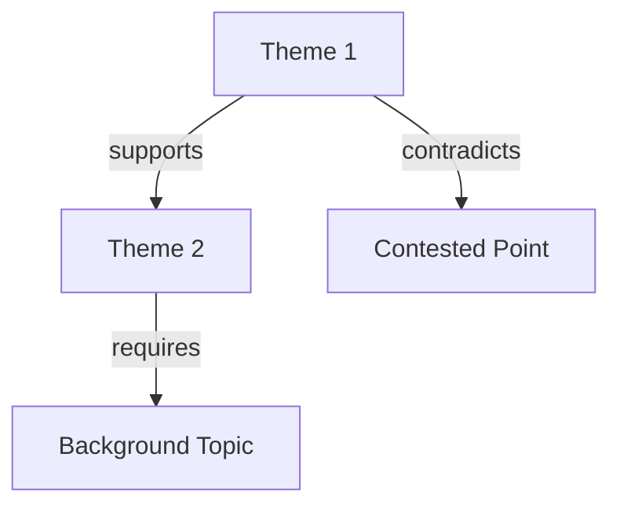

# Research Digest Template

## Topic: [Subject]
## Complexity Level: [1-ELI5 / 2-Beginner / 3-Intermediate / 4-Advanced / 5-Expert / 6-Thesis / 7-Inquiry]
## Compiled: [Date]

---

## Source Inventory

| # | Source | Type | Covers | Depth | Perspective | Recency |
|---|---|---|---|---|---|---|
| 1 | | Book/Article/Paper | | Shallow/Medium/Deep | Academic/Practitioner/Research | Year |
| 2 | | | | | | |
| 3 | | | | | | |

---

## Executive Summary

_One paragraph (2-4 sentences) capturing the essence of the digest. Calibrated to target complexity level._

---

## Consensus

_What all or most sources agree on. High-confidence claims._

### [Theme 1]

[Synthesis text with inline citations]

**Sources:** [Source 1], [Source 2]

### [Theme 2]

[Synthesis text]

**Sources:** [Source 1], [Source 3]

---

## Contested

_Where sources diverge. Present both sides._

### [Point of Disagreement]

**Position A:** [Claim] — [Source 1]
**Position B:** [Claim] — [Source 2]
**Basis for disagreement:** [Different data? Different frameworks? Different time periods?]
**Assessment:** [Which is more supported, or flag as open question]

---

## Gaps

_What the available sources don't cover, or cover inadequately._

- **[Gap 1]:** [What's missing and why it matters]
- **[Gap 2]:** [What's missing]

---

## Open Questions

_For Level 7 (Inquiry) — questions that remain unanswered in the literature._

1. [Question] — [Why it matters] — [What would be needed to answer it]
2. [Question]

---

## Cross-References

---

## Full Citations

1. [Author]. _[Title]_. [Publisher/Venue], [Year]. [ISBN/DOI/URL]
2. 
3. 
