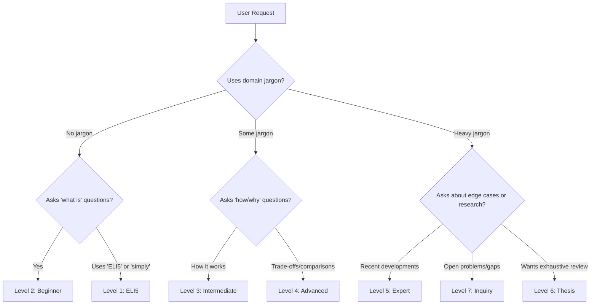

# Complexity Levels — Detailed Specification

Seven calibrated levels for knowledge digests, from ELI5 through open inquiry. Each level defines vocabulary constraints, structural patterns, citation density, length targets, and a worked example explaining "neural networks."

---

## Level 1: ELI5

**Audience**: A literal child or a complete outsider with zero domain exposure.

### Constraints

| Dimension | Rule |
|-----------|------|
| **Vocabulary** | Everyday words only. No jargon, no acronyms, no technical terms — even "common" ones like "data" or "algorithm" are replaced with plain equivalents. |
| **Abstraction** | Concrete only. Every idea must be grounded in a physical analogy or sensory experience. |
| **Structure** | Analogy-first. Open with a familiar scenario, map the concept onto it, then restate the takeaway. |
| **Citations** | None. The reader trusts the explainer implicitly. |
| **Length** | 200-500 words. Brevity is a hard constraint — if it takes more words, the analogy is wrong. |
| **Tone** | Warm, conversational, no condescension. Speak *with* a curious child, not *down to* one. |

### Structural Pattern

```
1. Familiar setup ("Imagine you have...")
2. Map concept onto setup
3. One concrete example
4. Restate the takeaway in one sentence
```

### Example: Neural Networks

> Imagine you have a huge pile of photos — some are cats and some are dogs. You want a helper that can sort them for you.
>
> A neural network is like a helper that learns by practicing. At first, it guesses randomly — it might say a cat photo is a dog. But every time it gets one wrong, you tell it "nope, try again," and it adjusts a little bit. After looking at thousands of photos and getting corrections each time, it gets really good at telling cats from dogs.
>
> The "neural" part means it's loosely inspired by how your brain works — lots of tiny connected pieces that each do a small job, and together they figure out the big picture.
>
> So a neural network is a computer helper that learns to recognize patterns by practicing on lots of examples and getting better each time.

---

## Level 2: Beginner

**Audience**: An interested adult with no background in the domain. Motivated to learn but needs handholds.

### Constraints

| Dimension | Rule |
|-----------|------|
| **Vocabulary** | Jargon is introduced and immediately defined in plain language on first use. After definition, terms can be reused. Limit to 5-8 new terms per digest. |
| **Abstraction** | Low. Every abstract concept gets at least one concrete example. |
| **Structure** | Definition-example pairs. Introduce concept, define it, show an example, then connect to the next concept. |
| **Citations** | Informal inline mentions: "According to researchers at..." or "A 2023 study found..." No formal citation format. |
| **Length** | 500-1500 words. Enough to cover fundamentals without overwhelming. |
| **Tone** | Encouraging, clear. Acknowledge that the topic might seem complex but break it into manageable pieces. |

### Structural Pattern

```
1. Why this topic matters (motivation)
2. Core concept 1 → definition → example
3. Core concept 2 → definition → example
4. How concepts connect
5. What to learn next (breadcrumbs)
```

### Example: Neural Networks

> Neural networks are one of the most important ideas in modern artificial intelligence. They're the technology behind voice assistants, photo recognition, and language translation. But what are they, really?
>
> A **neural network** is a computer program that learns to recognize patterns by studying examples — much like how you might learn to identify bird species by looking at hundreds of photos in a field guide.
>
> The building blocks are called **neurons** (also called "nodes"). Each neuron takes in some numbers, does a simple calculation, and passes the result forward. A single neuron isn't very smart, but when you connect thousands or millions of them in layers, they can solve surprisingly complex problems.
>
> These layers are organized in a chain. The first layer (the **input layer**) receives raw information — say, the pixel values of an image. The last layer (the **output layer**) produces the answer — "this is a cat" or "this is a dog." The layers in between are called **hidden layers**, and they're where the actual pattern recognition happens.
>
> The network learns through a process called **training**. You show it thousands of labeled examples ("this image is a cat"), and it adjusts its internal settings to get better at matching inputs to correct outputs. Each adjustment is small, but after millions of examples, the network becomes accurate.
>
> According to researchers, modern neural networks can now match or exceed human performance on specific tasks like image classification — though they still struggle with tasks that require common-sense reasoning.
>
> If you want to go deeper, the next concepts to explore are how training actually works (a technique called "backpropagation") and why different network architectures (like convolutional or recurrent networks) are suited to different tasks.

---

## Level 3: Intermediate

**Audience**: Someone with some exposure to the domain. Has seen the terminology, understands the basics, wants to connect ideas and go deeper.

### Constraints

| Dimension | Rule |
|-----------|------|
| **Vocabulary** | Domain jargon used freely without definition. Define only uncommon or ambiguous terms. |
| **Abstraction** | Moderate. Concepts are linked to each other — show how A relates to B, how B enables C. |
| **Structure** | Connection-making. Less "here's a definition" and more "here's how these pieces fit together." |
| **Citations** | Named sources with enough context to locate them: "Goodfellow et al.'s *Deep Learning* textbook covers this in Chapter 6." |
| **Length** | 1000-3000 words. Enough for meaningful depth without exhaustive coverage. |
| **Tone** | Collegial. Speak as a knowledgeable peer explaining to a slightly less experienced peer. |

### Structural Pattern

```
1. Context: where this topic sits in the larger field
2. Core mechanism: how it actually works (not just what it is)
3. Key variations and their trade-offs
4. Common pitfalls or misconceptions
5. Connections to adjacent topics
```

### Example: Neural Networks

> Neural networks are function approximators composed of layers of parameterized transformations. At their core, they map an input vector to an output vector through a series of affine transformations followed by nonlinear activation functions.
>
> Each layer computes `z = Wx + b` (a linear transformation) and then applies an activation function like ReLU, sigmoid, or tanh. The nonlinearity is critical — without it, stacking layers would be equivalent to a single linear transformation, and the network could only learn linear mappings. The universal approximation theorem (Cybenko, 1989; Hornik, 1991) establishes that a sufficiently wide single-hidden-layer network can approximate any continuous function, though in practice, deeper networks with fewer parameters per layer tend to generalize better.
>
> Training uses backpropagation to compute gradients of a loss function with respect to every parameter in the network. The chain rule propagates error signals backward from the output layer, and gradient descent (or a variant like Adam) updates the weights to reduce the loss. The choice of loss function depends on the task: cross-entropy for classification, mean squared error for regression, and more specialized losses for tasks like object detection or sequence generation.
>
> The key architectural variations — CNNs for spatial data, RNNs/LSTMs for sequential data, Transformers for attention-based processing — each embed an inductive bias suited to their domain. CNNs exploit spatial locality through weight sharing across convolutional filters. Transformers, as described by Vaswani et al. in "Attention Is All You Need," replace recurrence with self-attention, enabling parallel processing and long-range dependency modeling.
>
> A common misconception is that more parameters always means better performance. In practice, overparameterized networks can memorize training data (overfitting), and regularization techniques — dropout, weight decay, early stopping, data augmentation — are essential for generalization. The interplay between model capacity, training data volume, and regularization is one of the central tensions in neural network design.

---

## Level 4: Advanced

**Audience**: A practitioner with working knowledge. Understands the fundamentals, wants comparative analysis, trade-offs, and design-level reasoning.

### Constraints

| Dimension | Rule |
|-----------|------|
| **Vocabulary** | Full technical vocabulary. Distinguish between similar terms precisely (e.g., "parameters" vs. "hyperparameters," "loss" vs. "cost" vs. "objective"). |
| **Abstraction** | High. Theoretical connections, mathematical relationships, design trade-offs. Examples are selective — used to illustrate non-obvious points, not to define basics. |
| **Structure** | Comparative analysis. Present alternatives, evaluate trade-offs, justify design decisions. |
| **Citations** | Formal author-year inline: (Vaswani et al., 2017). Bibliography at end. |
| **Length** | 2000-5000 words. Thorough coverage of a focused topic. |
| **Tone** | Professional, precise. Respect the reader's expertise while adding value through synthesis and comparison. |

### Structural Pattern

```
1. Problem framing: what challenge does this address?
2. Solution space: what approaches exist?
3. Comparative analysis: trade-offs along meaningful axes
4. Current best practices and when to deviate
5. Open questions and active research
```

### Example: Neural Networks (excerpt — optimization landscape)

> The loss landscape of deep neural networks is a high-dimensional, non-convex surface with critical points that include saddle points, local minima, and plateaus. Understanding this landscape is essential for selecting optimizers and diagnosing training failures.
>
> First-order methods dominate in practice. SGD with momentum (Polyak, 1964; Sutskever et al., 2013) remains competitive for many tasks, particularly in computer vision, where its implicit regularization through noisy gradients aids generalization (Smith & Le, 2018). Adaptive methods — Adam (Kingma & Ba, 2015), AdaGrad (Duchi et al., 2011), RMSProp (Hinton, unpublished) — maintain per-parameter learning rates and converge faster on sparse or noisy gradients, making them the default for NLP and generative tasks.
>
> However, the convergence speed of adaptive methods comes with a generalization trade-off. Wilson et al. (2017) demonstrated that SGD with properly tuned learning rates often finds flatter minima — regions of the loss landscape where the loss is stable under small parameter perturbations — which correlate with better test performance. The sharpness-aware minimization (SAM) method (Foret et al., 2021) addresses this directly by penalizing sharp minima during optimization.
>
> Learning rate scheduling interacts with optimizer choice in non-trivial ways. Warmup (Goyal et al., 2017) addresses instability in early training, cosine annealing (Loshchilov & Hutter, 2017) smoothly reduces the learning rate, and cyclical schedules (Smith, 2017) explore the loss landscape more broadly. The optimal schedule depends on model architecture, dataset size, and training budget — no single approach dominates across all regimes.

---

## Level 5: Expert

**Audience**: A deep specialist at the frontier. Assumes comprehensive domain knowledge. Wants recent developments, subtle distinctions, and connections to open research.

### Constraints

| Dimension | Rule |
|-----------|------|
| **Vocabulary** | Assumes all domain knowledge. Uses precise notation and terminology without hedging. |
| **Abstraction** | Dense. Frontier topics, subtle theoretical distinctions, connections across subfields. |
| **Structure** | Survey-style. Organized by research threads rather than pedagogical order. |
| **Citations** | Full academic citations with bibliography. Distinguish between seminal, confirmatory, and contradictory references. |
| **Length** | 3000-8000 words. Comprehensive within a defined scope. |
| **Tone** | Scholarly. Critical assessment of cited work — not just "X found Y" but "X found Y, though their methodology has been questioned by Z." |

### Structural Pattern

```
1. Scope and recent trajectory of the subfield
2. Key results organized by research thread
3. Methodological advances and their implications
4. Contradictions and unresolved tensions in the literature
5. Emerging directions and predicted developments
```

### Example: Neural Networks (excerpt — scaling laws and emergent behavior)

> The empirical scaling laws described by Kaplan et al. (2020) and refined by Hoffmann et al. (2022) establish power-law relationships between model performance and three axes: parameter count (N), dataset size (D), and compute budget (C). The Chinchilla analysis (Hoffmann et al., 2022) challenged the prevailing "bigger is better" paradigm by demonstrating that many large language models were significantly undertrained relative to their parameter count — optimal allocation under a fixed compute budget favors smaller models trained on more data than the GPT-3 scaling approach assumed.
>
> These scaling laws, while empirically robust across several orders of magnitude, lack a satisfactory theoretical foundation. Attempts to derive them from statistical learning theory (e.g., via bias-variance decomposition or neural tangent kernel analysis) have produced qualitative matches but fail to predict the precise exponents observed in practice. The phenomenon of "grokking" (Power et al., 2022) — where networks suddenly generalize long after memorizing training data — further complicates the picture, suggesting phase transitions in the learning dynamics that current theory does not anticipate.
>
> Emergent capabilities — abilities that appear abruptly above a threshold model scale (Wei et al., 2022) — remain among the most debated phenomena in the field. Schaeffer et al. (2023) argued that many apparent emergences are artifacts of discrete evaluation metrics rather than genuine discontinuities in the model's underlying capabilities, reframing the debate around measurement methodology. This critique, however, does not fully account for capabilities like chain-of-thought reasoning, which exhibit qualitative behavioral changes that persist across evaluation schemes (Suzgun et al., 2022).

---

## Level 6: Thesis

**Audience**: A researcher producing or defending original work. Requires formal structure, exhaustive citation, and critical synthesis that advances understanding.

### Constraints

| Dimension | Rule |
|-----------|------|
| **Vocabulary** | Precise and formal. Terms of art used exactly. Distinctions between related concepts are drawn explicitly. |
| **Abstraction** | Maximum. Novel connections, theoretical extensions, synthesis across subfields. |
| **Structure** | Formal academic. Mirrors thesis chapter or literature review structure. |
| **Citations** | Exhaustive with critical assessment. Not just "who said what" but "how reliable is this claim, has it been replicated, what are its limits?" |
| **Length** | 5000-15000 words. Thorough enough to serve as a standalone reference. |
| **Tone** | Scholarly and critical. Evaluate every cited claim rather than accepting at face value. |

### Structural Template

```markdown
# [Topic]: A Critical Synthesis

## 1. Introduction and Scope
- Problem statement
- Scope boundaries (what is and is not covered)
- Significance and motivation

## 2. Historical Context and Theoretical Foundations
- Lineage of ideas leading to the current state
- Key theoretical frameworks

## 3. Current State of Knowledge
### 3.1 [Thread A]
### 3.2 [Thread B]
### 3.3 [Thread C]

## 4. Contradictions and Open Tensions
- Where the literature disagrees
- Methodological debates
- Unresolved theoretical questions

## 5. Synthesis and Original Analysis
- Novel connections identified through this review
- Proposed framework or interpretation

## 6. Gaps and Future Directions
- What remains unknown
- What methodologies are needed
- Predicted developments

## 7. Bibliography
[Exhaustive, formatted consistently]
```

### Example: Not provided at this level

At Level 6, a meaningful example would require 5000+ words. See the worked example in `worked-example-digest.md` for a demonstration of how themes scale across levels. A Level 6 digest would extend the Expert example with:
- Full historical lineage (perceptrons through modern architectures)
- Critical evaluation of every cited scaling law and emergent capability claim
- Original synthesis connecting the optimization landscape to the scaling phenomena
- Exhaustive bibliography of 50+ sources

---

## Level 7: Inquiry

**Audience**: A researcher exploring open questions. The goal is not to explain what's known but to map the boundary between known and unknown.

### Constraints

| Dimension | Rule |
|-----------|------|
| **Vocabulary** | Exploratory but rigorous. Speculative language is carefully hedged ("this suggests," "one interpretation is"). |
| **Abstraction** | Focused on boundaries. Where does current understanding break down? What would we need to resolve it? |
| **Structure** | Question-driven. Organized around open questions rather than known answers. |
| **Citations** | Provenance tracking. Every claim traces back through its citation chain. |
| **Length** | Variable — depends on how many open questions exist. Typically 2000-6000 words. |
| **Tone** | Curious, rigorous, humble. Comfortable with uncertainty. |

### Structural Template

```markdown
# Open Questions in [Topic]

## Known Territory (Brief)
[Summary of what's well-established — keep concise]

## The Boundary
[Where does solid understanding end?]

## Open Question 1: [Question]
- **What we know**: [Current best understanding]
- **Why it's open**: [What's missing]
- **Competing hypotheses**: [If any]
- **What would resolve it**: [Methodology, data, or theory needed]
- **Provenance**: [Who asked this, who's working on it]

## Open Question 2: [Question]
[Same structure]

## Meta-Questions
[Questions about the questions — are we even asking the right things?]

## Recommended Investigations
[Prioritized list of what to study next]
```

### Example: Neural Networks (excerpt — open questions)

> **Open Question: Why do overparameterized networks generalize?**
>
> Classical learning theory (Vapnik, 1998) predicts that models with far more parameters than training examples should overfit catastrophically. Modern neural networks violate this prediction routinely — networks with billions of parameters trained on millions of examples generalize well to unseen data (Zhang et al., 2017; Neyshabur et al., 2019).
>
> **Competing hypotheses**: (1) Implicit regularization via SGD dynamics biases networks toward simple solutions (Gunasekar et al., 2018); (2) The effective dimensionality of the parameter space is much smaller than the nominal count (Li et al., 2018); (3) The structure of real-world data constrains the loss landscape in ways that random data does not (Arpit et al., 2017).
>
> **What would resolve it**: A unified theory that predicts generalization bounds tight enough to match empirical performance across architectures and datasets. Current PAC-Bayes bounds (McAllester, 1999; Dziugaite & Roy, 2017) and compression-based bounds (Arora et al., 2018) remain orders of magnitude too loose to be practically informative.

---

## Level Detection Heuristics

When the user doesn't specify a level, infer it from these signals:



### Additional Signals

| Signal | Level Shift |
|--------|-------------|
| User provides their own analysis | Shift up — they're at least Level 4 |
| User asks "is this right?" about a technical claim | Match their level (usually 4-5) |
| User says "I'm writing a paper" | Level 6 |
| User says "for a blog post" | Level 2-3 depending on blog audience |
| User says "for my team" | Ask what the team's background is |
| User provides math notation | At least Level 4 |

---

## Transition Rules

When the user's level becomes clearer mid-digest:

1. **Never downshift without signaling**: "I'll simplify this section since you mentioned your audience is non-technical."
2. **Upshift is natural**: If the user asks a deeper follow-up, the next section can be a level higher without explicit announcement.
3. **Mixed-level digests are acceptable**: An overview at Level 2 with a deep-dive section at Level 4 is fine — label the sections.
4. **When in doubt, produce Level 3** and offer to adjust: "This is at an intermediate level — want me to go deeper or simpler on any section?"
