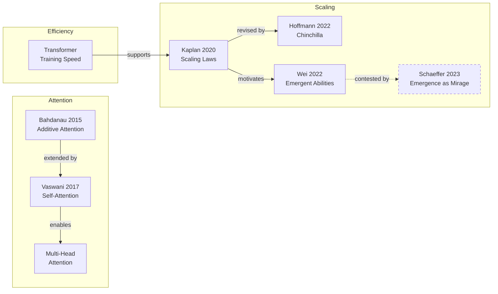
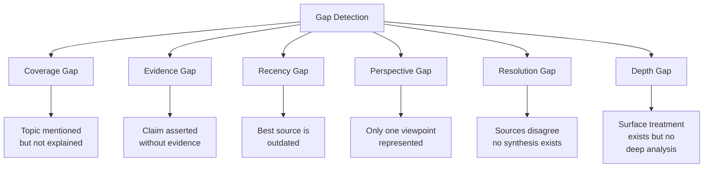
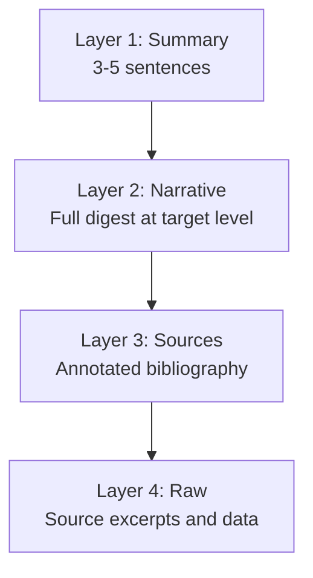
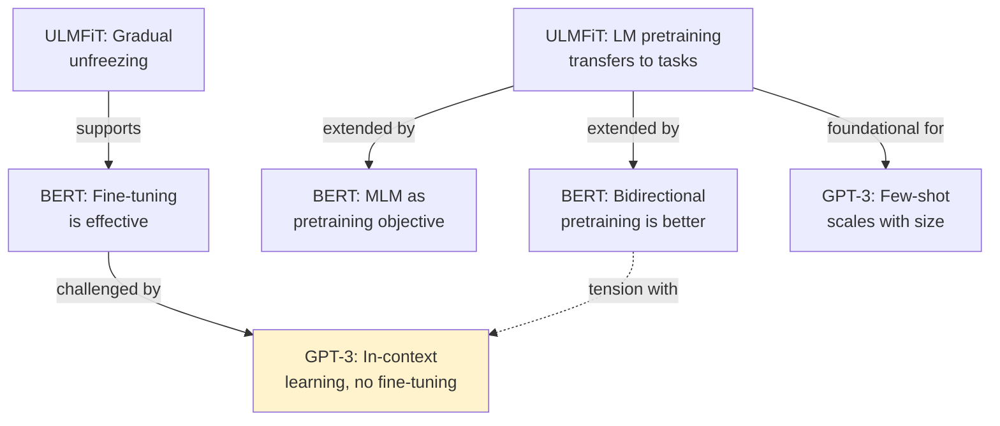

# Cross-Referencing and Knowledge Graph Construction

How to build structured relationships between sources, topics, and claims during digest synthesis. This reference covers relationship types, graph construction, contradiction resolution, gap identification, and progressive disclosure.

---

## Relationship Types

Seven canonical relationships connect claims, topics, and sources in a knowledge graph:

| Relationship | Notation | Meaning | Example |
|-------------|----------|---------|---------|
| **supports** | A --supports--> B | A provides evidence for B | "Experiment X confirms Theory Y" |
| **contradicts** | A --contradicts--> B | A undermines or opposes B | "Study A finds no effect; Study B finds a strong effect" |
| **extends** | A --extends--> B | A builds on B, adding new scope or detail | "Paper A adds temporal analysis to B's static model" |
| **requires** | A --requires--> B | Understanding A depends on understanding B | "Backpropagation requires the chain rule" |
| **supersedes** | A --supersedes--> B | A replaces B (newer, better, or more general) | "Transformer architecture supersedes RNN for most NLP tasks" |
| **applies-to** | A --applies-to--> B | A is a practical application or instantiation of B | "BERT applies-to the Transformer encoder architecture" |
| **derived-from** | A --derived-from--> B | A is a descendant or specialization of B | "GPT is derived-from the Transformer decoder" |

### Relationship Strength

Not all connections are equal. Tag relationships with confidence:

| Strength | Criteria |
|----------|----------|
| **Strong** | Multiple independent sources confirm the relationship |
| **Moderate** | At least one source explicitly states the relationship |
| **Inferred** | The relationship is implied but not explicitly stated — flag as `[inferred]` |
| **Contested** | The relationship itself is debated — present both sides |

---

## Building the Knowledge Graph

### Step 1: Extract Claims

For each source, extract discrete claims — the smallest unit of assertion that can be independently evaluated.

```markdown
### Source: Vaswani et al. (2017) — "Attention Is All You Need"

| Claim ID | Claim | Type |
|----------|-------|------|
| V1 | Self-attention can replace recurrence entirely for sequence modeling | Core thesis |
| V2 | Transformer achieves SOTA on WMT 2014 EN-DE translation | Empirical result |
| V3 | Multi-head attention enables the model to attend to different representation subspaces | Mechanistic explanation |
| V4 | Transformer trains significantly faster than recurrent architectures | Efficiency claim |
```

### Step 2: Map Claims to Topics

Group claims into topic clusters:

```markdown
| Topic | Claims | Sources |
|-------|--------|---------|
| Attention mechanisms | V1, V3, D2, B4 | Vaswani (2017), Dai (2019), Bahdanau (2015) |
| Training efficiency | V4, K3, H1 | Vaswani (2017), Kaplan (2020), Hoffmann (2022) |
| Scaling behavior | K1, K2, H1, H2, W1 | Kaplan (2020), Hoffmann (2022), Wei (2022) |
```

### Step 3: Identify Connections

For each pair of related claims, assign a relationship type:

```markdown
| From | To | Relationship | Strength | Note |
|------|----|-------------|----------|------|
| V1 | B1 | extends | Strong | Vaswani extends Bahdanau's attention to full self-attention |
| H1 | K2 | contradicts | Strong | Chinchilla challenges GPT-3 scaling allocation |
| V4 | K3 | supports | Moderate | Transformer efficiency enables the scaling experiments |
| W1 | S1 | contested | — | Wei's emergence claims challenged by Schaeffer's metric analysis |
```

### Step 4: Render the Graph

Produce a mermaid diagram showing the relationships:



---

## Contradiction Resolution

When sources disagree, follow this protocol:

### 1. State Both Positions

Present each position with its full citation. Do not editorialize yet.

```markdown
**Position A** (Source X, Year): [Claim]
**Position B** (Source Y, Year): [Opposing claim]
```

### 2. Identify the Basis for Disagreement

Contradictions arise from different root causes. Diagnose which applies:

| Basis | Description | Resolution Path |
|-------|-------------|-----------------|
| **Different data** | Studies used different datasets or populations | Compare dataset characteristics; note which is more representative |
| **Different methodology** | Studies used different experimental designs | Assess which methodology is more rigorous or appropriate |
| **Different definitions** | Authors define key terms differently | Clarify definitions; the "contradiction" may dissolve |
| **Different scope** | Claims apply to different contexts | Both may be correct in their respective contexts |
| **Different timeframe** | Research from different eras | More recent work may supersede, or the field may have shifted |
| **Genuine disagreement** | Authors interpret the same evidence differently | Report as an open question |

### 3. Assess Relative Support

For each position, evaluate:

- **Replication**: Has the finding been independently replicated?
- **Sample size / scale**: Which study has more statistical power?
- **Recency**: Is one position based on more recent evidence?
- **Consensus**: Does the broader field lean one way?
- **Methodological rigor**: Are there known flaws in either study?

### 4. Recommend or Flag

Three possible outcomes:

| Outcome | When | Format in Digest |
|---------|------|-------------------|
| **Recommend** | One position is clearly better-supported | "The current evidence favors X (Source A), though Y (Source B) offers a dissenting view." |
| **Report both** | Positions are roughly equally supported | "Sources disagree: A argues X, B argues Y. The disagreement stems from [basis]. This remains unresolved." |
| **Flag as open** | The contradiction reveals a genuine gap in knowledge | Move to the Gaps section. "Whether X or Y is correct remains an open question that requires [what would resolve it]." |

---

## Gap Identification

### Gap Taxonomy



### Detection Methods

**Coverage gaps** — Look for:
- Terms introduced but never defined
- Topics referenced in passing ("as discussed in Section X" with no Section X)
- Scope claims in source introductions that are never fulfilled in the body
- Missing subtopics that a reasonable reader would expect

**Evidence gaps** — Look for:
- Claims without citations in otherwise well-cited sources
- "It is widely known that..." without a reference
- Logical leaps between established findings and conclusions

**Recency gaps** — Check:
- Date of each source's most recent cited reference
- Whether the field has had significant developments since
- Whether foundational assumptions have been challenged by newer work

**Perspective gaps** — Check:
- Author affiliations (all industry? all academic? all from one research group?)
- Geographic diversity of sources
- Methodological diversity (all empirical? all theoretical? all surveys?)

**Resolution gaps** — Look for:
- Contradictions identified in Step 3 that have no synthesis
- Open debates mentioned in source conclusions
- "Future work" sections that no subsequent source addresses

**Depth gaps** — Look for:
- Survey papers that mention subtopics without sufficient detail
- Introductory treatments where expert-level analysis is needed
- Areas where only Level 2-3 content exists but Level 5+ is needed

### Gap Reporting Format

In the digest, report each gap with:

```markdown
### Gap: [Name]

- **Type**: [Coverage | Evidence | Recency | Perspective | Resolution | Depth]
- **What's missing**: [Specific description]
- **Impact**: [How this gap affects understanding of the overall topic]
- **What would resolve it**: [Type of source, study, or analysis needed]
- **Where to look**: [Suggested starting points for filling the gap]
```

---

## Progressive Disclosure

Layer the digest so readers can consume at their preferred depth.

### The Four Layers



**Layer 1: Summary** (always included)
- 3-5 sentences that answer the user's question directly
- A reader who stops here should have a correct, useful understanding
- Includes the most important caveat or gap

**Layer 2: Narrative** (the digest itself)
- Full synthesis at the target complexity level
- Organized by theme, not by source
- Citations embedded per the level's citation standard

**Layer 3: Sources** (included at Level 4+)
- Annotated bibliography: each source with a 1-2 sentence assessment
- Coverage map: which themes each source addresses
- Quality notes: reliability, bias, recency

**Layer 4: Raw** (available on request)
- Direct quotes from sources that support key claims
- Data tables, figures, or statistics referenced in the narrative
- Full citation metadata (DOI, ISBN, URL, access date)

### Implementation in Output

```markdown
## Summary
[Layer 1: 3-5 sentences]

---

## [Theme 1]
[Layer 2: narrative with citations]

## [Theme 2]
[Layer 2: narrative with citations]

## Gaps and Open Questions
[Layer 2: gap analysis]

---

## Annotated Sources
[Layer 3: each source with assessment]

## Source Details
[Layer 4: available on request — "ask me for the full quote from Source X"]
```

---

## Cross-Reference Format

How to format cross-references in digest output depends on the medium and level.

### Inline Cross-References

For connections between sections within the same digest:

```markdown
The attention mechanism (see [Attention Mechanisms](#attention-mechanisms) above)
enables the scaling behavior described in [Scaling Laws](#scaling-laws).
```

### See-Also Sections

For connections to related topics not fully covered in this digest:

```markdown
> **See also**: This digest covers attention mechanisms. For related topics:
> - Training optimization → request a digest on "gradient descent variants"
> - Hardware constraints → request a digest on "GPU memory and model size"
> - Practical deployment → request a digest on "model serving and inference optimization"
```

### Knowledge Graph Visualization

For complex topics with many interconnections, include a rendered mermaid graph in the digest:

```markdown
## Topic Map

The following diagram shows how the major concepts in this digest relate to each other.
Solid lines indicate well-established relationships; dashed lines indicate contested or
inferred relationships.

[mermaid diagram here]
```

### Cross-Digest References

When a digest references another digest (or a topic that warrants its own digest):

```markdown
This topic connects to [Topic X], which would require its own digest at Level [N].
Key connection: [one sentence explaining the relationship].
```

---

## Example: Building a Cross-Reference Map

Given three sources on "transfer learning in NLP":

**Source A**: Howard & Ruder (2018) — ULMFiT
**Source B**: Devlin et al. (2019) — BERT
**Source C**: Brown et al. (2020) — GPT-3

### Extracted Claims

| ID | Claim | Source |
|----|-------|--------|
| A1 | Language model pretraining transfers to downstream tasks | A |
| A2 | Discriminative fine-tuning and gradual unfreezing improve transfer | A |
| B1 | Bidirectional pretraining captures richer representations than left-to-right | B |
| B2 | Masked language modeling is an effective pretraining objective | B |
| B3 | Fine-tuning a pretrained model on task-specific data is effective | B |
| C1 | Sufficiently large models perform tasks via in-context learning without fine-tuning | C |
| C2 | Few-shot performance scales with model size | C |

### Relationship Map



### Narrative from Map

The evolution from ULMFiT to BERT to GPT-3 shows a clear thread: pretraining on language modeling transfers knowledge to downstream tasks (A1), but the community has shifted on *how* to exploit that transfer. ULMFiT and BERT assume fine-tuning is necessary (A2, B3), while GPT-3 demonstrates that sufficiently large models can perform tasks through prompting alone (C1), challenging the fine-tuning paradigm. This tension between fine-tuning and in-context learning remains a central design decision in modern NLP systems.
