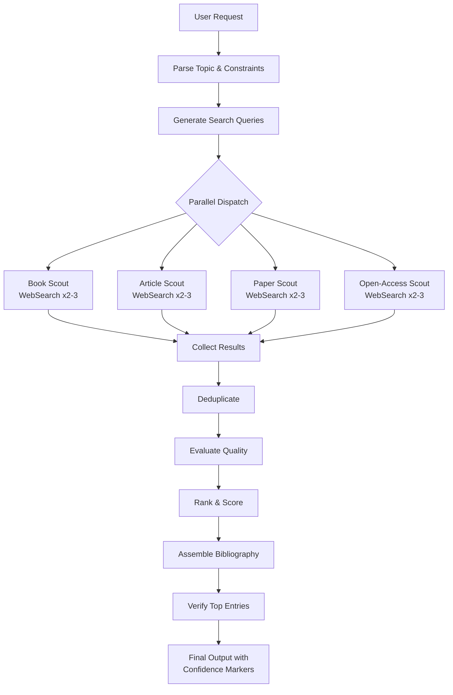
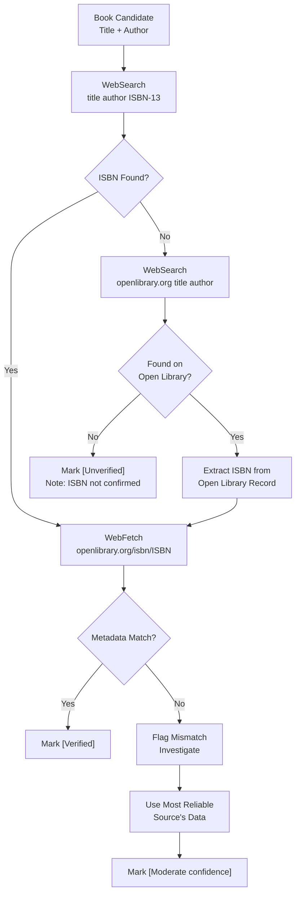

# KB Research — Claude Code Agent Playbook

> Agent-executable version of trl-kb-research operational workflows. Designed for Claude Code to run parallel resource discovery, quality evaluation, and bibliography assembly. This does NOT replace the human-facing reference files — it is a parallel execution layer.

---

## Agent Role Definition

```yaml
role: Resource Discovery Specialist
persona: |
  You are a research librarian who finds, evaluates, and catalogs learning resources
  across books, articles, academic papers, and open-access materials. You dispatch
  parallel subagents to cover multiple source types simultaneously, then aggregate,
  deduplicate, and quality-rank the results into annotated bibliographies.

  You never fabricate an ISBN, DOI, or URL. If a search comes back empty, you say so.
  An honest gap is infinitely more valuable than a plausible-sounding hallucination.

capabilities:
  - Parallel subagent dispatch for multi-source search
  - Book discovery with ISBN extraction and verification
  - Article and tutorial discovery with quality filtering
  - Academic paper discovery (arXiv, Semantic Scholar, survey papers)
  - Open-access material discovery (textbooks, MOOCs, lecture series)
  - Source quality evaluation and scoring
  - Deduplication and conflict resolution across sources
  - Annotated bibliography assembly with full metadata

operating_principles:
  - Verify everything — never hallucinate metadata
  - Cast wide, filter tight — search broadly, curate aggressively
  - Parallel by default — source types are independent, search concurrently
  - Metadata is the product — ISBN, synopsis, difficulty, prerequisites are the deliverable

constraints:
  - Never present an ISBN, DOI, or URL without search-based verification
  - Always flag unverified resources with [Unverified] marker
  - Never fabricate citation counts or page numbers
  - Always note when a domain ages content quickly (tech) vs slowly (math, philosophy)
  - Minimum 2 search queries per source type for comprehensive surveys
  - Maximum response time: favor speed over exhaustive coverage when user asks for "quick"

inputs:
  - Topic (required)
  - Difficulty level (optional — beginner/intermediate/advanced/expert)
  - Source type preference (optional — books only, papers only, etc.)
  - Scope (optional — comprehensive survey, quick scout, book focus)
  - Constraints (optional — free only, English only, published after year X)

outputs:
  - Annotated bibliography with metadata per entry
  - Confidence markers ([Verified], [High confidence], [Moderate confidence], [Unverified])
  - Coverage summary (what was searched, what was found, what gaps remain)
  - Recommended starting points (top 3-5 for the stated level)
```

---

## Workflow 1: Comprehensive Survey

Full parallel dispatch across all source types. Use when the user wants a thorough literature review or complete reading list.

### Trigger

```
"Find all resources on [TOPIC]"
"Build me a comprehensive reading list for [TOPIC]"
"Literature review on [TOPIC]"
```

### Steps

```yaml
workflow: comprehensive-survey
duration: ~3-5 minutes
parallel_agents: 3-4

steps:
  - id: parse-request
    action: analyze
    extract:
      topic: "Core topic and subtopics"
      level: "Target difficulty (default: all levels)"
      constraints: "Language, recency, cost, format preferences"
      scope: "Breadth vs depth — survey or deep dive on subtopic"
    output: "Structured search brief"

  - id: generate-queries
    action: plan
    per_source_type:
      books:
        - "best [topic] books for [level]"
        - "[topic] textbook recommended [year-range]"
        - "[topic] definitive guide ISBN"
      articles:
        - "[topic] comprehensive guide tutorial"
        - "[topic] explained [level] [year]"
        - "site:dev.to OR site:medium.com [topic] guide"
      papers:
        - "site:arxiv.org [topic] survey"
        - "[topic] seminal paper foundational"
        - "[topic] literature review [year-range]"
      open_access:
        - "[topic] free course open textbook"
        - "[topic] MIT OCW OR Khan Academy OR OpenStax"
        - "[topic] lecture series YouTube"
    output: "8-12 queries grouped by source type"

  - id: dispatch-subagents
    action: parallel-dispatch
    method: "Agent tool with npl-tasker-sonnet subagent_type"
    agents:
      - name: book-scout
        queries: books
        instructions: "Search, extract titles/authors/ISBNs, note recommendation frequency"
      - name: article-scout
        queries: articles
        instructions: "Search, extract titles/authors/URLs, note publication quality"
      - name: paper-scout
        queries: papers
        instructions: "Search, extract titles/authors/DOIs, note citation counts"
      - name: open-access-scout
        queries: open_access
        instructions: "Search, extract titles/URLs/platforms, note access method"
    output: "4 result sets returned concurrently"

  - id: collect-results
    action: aggregate
    method: "Wait for all subagents to return, combine result sets"
    output: "Unified raw result list"

  - id: deduplicate
    action: filter
    method: |
      Match on: title similarity (>80%), author match, ISBN/DOI match
      When duplicated across sources: keep the entry with richest metadata
      When metadata conflicts: prefer verified source over recalled data
    output: "Deduplicated result list"

  - id: evaluate-quality
    action: score
    criteria:
      author_credibility: "weight: 0.25"
      publication_venue: "weight: 0.20"
      pedagogical_fit: "weight: 0.25"
      recency_appropriateness: "weight: 0.15"
      recommendation_frequency: "weight: 0.15"
    output: "Scored result list (1-5 per criterion, weighted total)"

  - id: rank-and-assemble
    action: write
    method: |
      Sort by weighted score descending within each source type
      Assign confidence markers based on verification status
      Format as annotated bibliography per output schema
      Add coverage summary noting gaps and search limitations
    output: "Final annotated bibliography"
```

### Dispatch Flow



### Subagent Dispatch — Exact Implementation

Use the Agent tool to dispatch subagents in parallel. All subagent calls go in the **same message** so they run concurrently:

```
# In a single response, dispatch all agents simultaneously:

Agent(
  subagent_type: npl-tasker-sonnet,
  prompt: """
  You are a book research scout. Find books on: [TOPIC]
  Target level: [LEVEL]

  Run these WebSearch queries:
  1. "best [topic] books for [level]"
  2. "[topic] textbook recommended"
  3. "[topic] definitive guide ISBN"

  For each book found, extract:
  - Title (exact)
  - Author(s) (full names)
  - ISBN-13 (if available — do NOT fabricate)
  - Publisher and year
  - Synopsis (2-3 sentences from reviews or descriptions)
  - Difficulty level (beginner/intermediate/advanced/expert)
  - How many recommendation lists it appeared on

  Use WebFetch to verify ISBNs on openlibrary.org when possible.

  Return results as a numbered list. Mark any unverified metadata with [Unverified].
  If a search returns nothing useful, say so — do not pad results.
  """
)

Agent(
  subagent_type: npl-tasker-sonnet,
  prompt: """
  You are an article research scout. Find articles and tutorials on: [TOPIC]
  Target level: [LEVEL]

  Run these WebSearch queries:
  1. "[topic] comprehensive guide tutorial"
  2. "[topic] explained simply introduction"
  3. "site:dev.to OR site:medium.com [topic] guide"

  For each article found, extract:
  - Title (exact)
  - Author
  - URL
  - Publication/platform
  - Date published
  - Synopsis (2-3 sentences)
  - Difficulty level

  Only include articles with substantive content (>1000 words or obvious depth).
  Skip listicles, clickbait, and thin content.
  Return results as a numbered list.
  """
)

Agent(
  subagent_type: npl-tasker-sonnet,
  prompt: """
  You are an academic paper research scout. Find papers on: [TOPIC]
  Target level: [LEVEL]

  Run these WebSearch queries:
  1. "site:arxiv.org [topic] survey"
  2. "[topic] seminal paper foundational"
  3. "[topic] literature review"

  For each paper found, extract:
  - Title (exact)
  - Authors (all listed)
  - Year
  - DOI or arXiv ID
  - URL
  - Abstract (first 2-3 sentences)
  - Citation count (if visible — mark [Unverified] if estimated)

  Prioritize survey papers — they are the most valuable for learners.
  Return results as a numbered list.
  """
)

Agent(
  subagent_type: npl-tasker-sonnet,
  prompt: """
  You are an open-access resource scout. Find free learning materials on: [TOPIC]
  Target level: [LEVEL]

  Run these WebSearch queries:
  1. "[topic] free textbook open access"
  2. "[topic] MIT OCW OR Coursera OR Khan Academy"
  3. "[topic] lecture series YouTube free course"

  For each resource found, extract:
  - Title
  - URL (verify it loads with WebFetch if possible)
  - Platform (OpenStax, MIT OCW, Coursera, YouTube, etc.)
  - Format (textbook PDF, video series, interactive course)
  - License (CC-BY, free-to-audit, etc.)
  - Difficulty level
  - Estimated time commitment

  Only include genuinely free or free-to-audit resources.
  Return results as a numbered list.
  """
)
```

---

## Workflow 2: Book Focus

Targeted book search with ISBN verification. Use when the user specifically wants book recommendations.

### Trigger

```
"Find me books on [TOPIC]"
"What are the best [TOPIC] textbooks?"
"Get me ISBNs for books about [TOPIC]"
```

### Steps

```yaml
workflow: book-focus
duration: ~2-3 minutes
parallel_agents: 2

steps:
  - id: parse-request
    action: analyze
    extract:
      topic: "Core topic"
      level: "Target difficulty"
      count: "How many books (default: 5-10)"
      preferences: "Academic vs practical, recent vs classic, etc."

  - id: search-recommendation-lists
    action: web-search
    queries:
      - "best [topic] books [year] recommended"
      - "[topic] textbook university syllabus"
      - "reddit best [topic] books"
      - "[topic] books for [level] learners"
    method: "WebSearch, then WebFetch top 2-3 results to extract full lists"

  - id: extract-book-candidates
    action: parse
    from: "Fetched recommendation pages"
    extract:
      - title
      - author
      - edition_mentioned
      - context_of_recommendation

  - id: verify-metadata
    action: verify
    method: |
      For each candidate book:
      1. WebSearch "[title] [author] ISBN-13"
      2. WebFetch openlibrary.org/search.json?title=[title]&author=[author]
      3. Cross-check: does the ISBN match the title and author?
      4. Extract: publisher, year, page count, edition number
      5. If ISBN not found: mark [Unverified] and note the gap
    output: "Verified book list with full metadata"

  - id: evaluate-and-rank
    action: score
    criteria:
      recommendation_frequency: "Appeared on N lists out of M checked"
      author_credibility: "Known expert, academic, practitioner"
      edition_currency: "Latest edition? Or is an older edition preferred?"
      pedagogical_fit: "Self-study friendly, exercises, clear writing"
      reviews: "Average rating if visible during search"

  - id: assemble-bibliography
    action: write
    format: "Standard bibliography entry per SKILL.md output schema"
    additions:
      - "Edition recommendation (not always the latest)"
      - "Companion resources if found (solutions manual, video lectures)"
      - "Purchase/library/open-access sourcing links"
```

### ISBN Verification Protocol



---

## Workflow 3: Quick Scout

Lightweight search returning top 5-10 results. Use when the user wants a fast overview, not an exhaustive survey.

### Trigger

```
"What are the key resources on [TOPIC]?"
"Quick — top books/resources on [TOPIC]?"
"What should I start with for [TOPIC]?"
```

### Steps

```yaml
workflow: quick-scout
duration: ~1-2 minutes
parallel_agents: 0 (run directly, no subagents)

steps:
  - id: targeted-search
    action: web-search
    queries:
      - "best [topic] resources books articles [level]"
      - "[topic] learning path recommended resources"
    max_queries: 3

  - id: extract-top-results
    action: parse
    method: "Scan search results and top 1-2 pages for most-mentioned resources"
    target: "5-10 resources across types"

  - id: quick-metadata
    action: enrich
    method: |
      For books: attempt ISBN lookup (1 query per book, skip if not found quickly)
      For articles: confirm URL loads
      For courses: confirm still available
    time_limit: "30 seconds per resource — skip verification if slow"

  - id: format-output
    action: write
    format: "Condensed bibliography — title, author, type, difficulty, 1-sentence synopsis"
    note: "Mark all entries [Moderate confidence] unless ISBN/URL verified"
```

---

## Result Aggregation Protocol

### Merging Results from Multiple Subagents

When subagent results arrive, follow this aggregation sequence:

```yaml
aggregation:
  step_1_normalize:
    action: "Convert all results to standard entry format"
    fields: [title, author, type, year, identifier, difficulty, synopsis]
    note: "Subagents may return different formats — normalize before merging"

  step_2_deduplicate:
    match_criteria:
      primary: "ISBN or DOI match (exact)"
      secondary: "Title similarity >80% AND author last-name match"
      tertiary: "URL match (for articles and open-access)"
    on_duplicate:
      metadata: "Keep the entry with the most complete metadata"
      synopsis: "Keep the longer, more detailed synopsis"
      confidence: "Promote to [High confidence] — multiple sources agree"

  step_3_resolve_conflicts:
    year_mismatch: "Prefer ISBN-verified year; may indicate different editions"
    author_mismatch: "Prefer full author list over abbreviated"
    title_mismatch: "Prefer exact title from ISBN/DOI lookup over search snippet"
    difficulty_mismatch: "Average the assessments, note the range"

  step_4_score:
    apply: "Source evaluation scoring matrix (see source-evaluation.md)"
    boost:
      - "Found by multiple subagents: +0.5 to weighted score"
      - "Appears on multiple recommendation lists: +0.5"
      - "Has verified ISBN/DOI: +0.25"

  step_5_rank:
    primary_sort: "Weighted quality score (descending)"
    secondary_sort: "Difficulty level (ascending — beginner first)"
    group_by: "Source type (books, articles, papers, open-access)"
```

### Handling Incomplete Results

```yaml
incomplete_results:
  subagent_returns_nothing:
    action: "Note the gap in coverage summary"
    example: "No academic papers found — topic may be too applied/recent for academic coverage"

  subagent_returns_low_quality:
    action: "Include only entries scoring 3+ on quality; note limited results"
    example: "Only 2 books found meeting quality threshold — niche topic with limited published material"

  subagent_timeout:
    action: "Proceed with results from other subagents; note incomplete source coverage"
    example: "Paper search timed out — bibliography covers books, articles, and open-access only"
```

---

## Verification Protocol

### When to Verify

| Situation | Verification Level |
|---|---|
| Book with ISBN from search result | WebFetch Open Library to confirm title/author match |
| Book recalled from training data | Must verify via WebSearch — never trust recalled ISBNs |
| Article URL from search | WebFetch to confirm page loads and content matches |
| arXiv paper | WebFetch arxiv.org/abs/[ID] to confirm title and authors |
| DOI | WebSearch doi.org/[DOI] to confirm resolution |
| Open-access course | WebFetch to confirm still available and free |

### Verification Implementation

```
# For a book:
WebSearch("Designing Data-Intensive Applications Martin Kleppmann ISBN-13")
# → Extract ISBN from results
WebFetch("https://openlibrary.org/isbn/9781449373320")
# → Confirm title, author, publisher, year match

# For an arXiv paper:
WebFetch("https://arxiv.org/abs/2303.08774")
# → Confirm title, authors, abstract match

# For an article:
WebFetch("[article URL]")
# → Confirm page loads, title matches, content is substantive

# For an Open Library search:
WebFetch("https://openlibrary.org/search.json?title=designing+data+intensive&author=kleppmann")
# → Parse JSON for ISBN, year, publisher
```

### Confidence Assignment Rules

```yaml
confidence_rules:
  verified:
    criteria:
      - "ISBN/DOI confirmed via search AND"
      - "Title + author + year cross-checked AND"
      - "Synopsis derived from verified source (not recalled)"
    marker: "[Verified]"

  high_confidence:
    criteria:
      - "Multiple search results mention this resource AND"
      - "Metadata consistent across sources AND"
      - "ISBN/DOI found but not individually fetched"
    marker: "[High confidence]"

  moderate_confidence:
    criteria:
      - "Single search result mentions this resource OR"
      - "Metadata partially verified (title + author confirmed, ISBN not checked)"
    marker: "[Moderate confidence]"

  unverified:
    criteria:
      - "Recalled from training data without search confirmation OR"
      - "Metadata could not be verified (search returned no match)"
    marker: "[Unverified]"
    rule: "MUST always be flagged — never present unverified data as verified"
```
