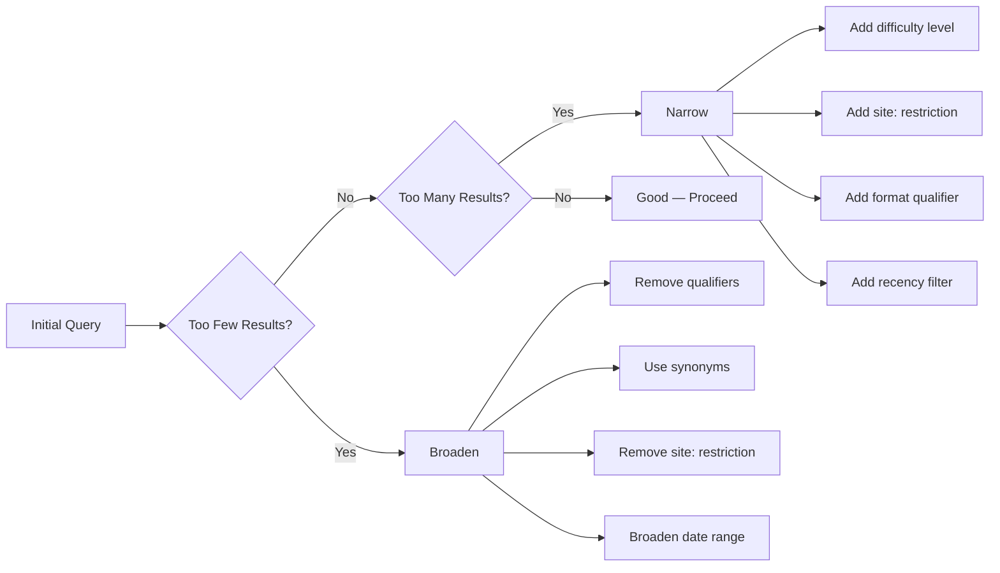
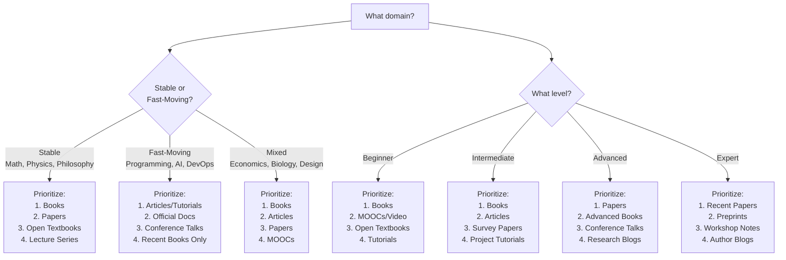

# KB Research — Search Strategies

> Comprehensive guide to finding learning resources across books, articles, academic papers, open-access materials, and video content. Covers source-specific search techniques, query engineering, and source type selection by domain and learner level.

---

## Book Discovery

### Why Books Matter

Books remain the highest-density learning format for structured knowledge. A well-chosen textbook provides a coherent progression that articles and tutorials cannot match. The challenge is finding the *right* book — the one that matches the learner's level, learning style, and goals.

### Primary Sources

| Source | URL Pattern | What It Provides | Query Method |
|---|---|---|---|
| **Open Library** | `openlibrary.org/search.json?title=X&author=Y` | ISBN, publisher, year, editions, cover images | API (JSON) or site search |
| **Google Books** | `books.google.com/books?q=X` | Previews, metadata, related books | WebSearch with `site:books.google.com` |
| **Amazon Bestseller Lists** | `amazon.com/best-sellers-books-[category]` | Popularity ranking, reviews, "customers also bought" | WebSearch `"best sellers" [topic] books amazon` |
| **University Reading Lists** | Varies by institution | Academically vetted selections | WebSearch `[topic] syllabus reading list university` |
| **Reddit Recommendations** | `reddit.com/r/[topic]` | Community-vetted, honest reviews with caveats | WebSearch `site:reddit.com best [topic] books` |
| **Goodreads Lists** | `goodreads.com/list/show/[id]` | Crowd-ranked lists, detailed reviews | WebSearch `site:goodreads.com best [topic] books` |

### Book Query Templates

```
# Recommendation lists (cast wide)
"best [TOPIC] books [YEAR]"
"best [TOPIC] books for [LEVEL]"
"[TOPIC] book recommendations reddit"
"[TOPIC] textbook university course"

# Specific lookup (when you have a lead)
"[TITLE] [AUTHOR] ISBN-13"
"[TITLE] [AUTHOR] [EDITION] publisher"

# Authoritative references
"definitive guide to [TOPIC]"
"[TOPIC] handbook reference"
"[TOPIC] bible book"  # colloquial — often surfaces canonical texts

# By audience
"[TOPIC] for practitioners"
"[TOPIC] from scratch no prerequisites"
"[TOPIC] advanced graduate level"

# Discovery via syllabi
"[TOPIC] course syllabus required textbook"
"[TOPIC] 101 reading list"
"MIT [TOPIC] course materials textbook"
```

### Book Metadata Extraction Priority

When evaluating a book search result, extract in this order:

1. **Title** (exact, including subtitle)
2. **Author(s)** (full names)
3. **Edition** (number and year — not always the latest is best)
4. **ISBN-13** (verify via Open Library if possible)
5. **Publisher** (credibility signal — O'Reilly, Springer, MIT Press, etc.)
6. **Year** (of the specific edition)
7. **Page count** (proxy for depth)
8. **Synopsis** (from publisher description or trusted review)
9. **Recommendation context** (who recommends it and why)

---

## Article Discovery

### What Counts as a Quality Article

Not every blog post is worth recommending. Target articles that function as **standalone learning resources** — comprehensive guides, in-depth tutorials, well-structured explanations. Minimum signals of quality:

- Substantive length (1500+ words for a tutorial, 3000+ for a guide)
- Clear author attribution (not anonymous content farms)
- Published on a reputable platform or known author's blog
- Includes code examples, diagrams, or worked problems (where applicable)
- Updated within a reasonable timeframe for the domain

### Primary Sources

| Source | Strengths | Quality Signal |
|---|---|---|
| **Dev.to** | Technical tutorials, community voting | Reactions count, comment quality |
| **Medium** | Broad range, some paywalled | Publication (Towards Data Science, etc.), clap count |
| **Personal Blogs** | Deep expertise, unique perspectives | Author's credentials, other publications |
| **Industry Publications** | Curated content, editorial oversight | Publication reputation (Smashing Magazine, CSS-Tricks, etc.) |
| **Official Documentation** | Authoritative, canonical | Direct from maintainers |
| **Hacker News** | Community-filtered, discussion adds context | Upvotes, comment quality and depth |

### Article Query Templates

```
# Comprehensive guides
"[TOPIC] comprehensive guide [YEAR]"
"[TOPIC] complete tutorial"
"[TOPIC] in depth explained"

# Level-specific
"[TOPIC] for beginners introduction"
"[TOPIC] advanced techniques patterns"
"[TOPIC] from zero to production"

# Platform-specific
"site:dev.to [TOPIC] guide"
"site:medium.com [TOPIC] tutorial"
"[TOPIC] tutorial [KNOWN-BLOG-DOMAIN]"

# Recency-sensitive domains
"[TOPIC] [CURRENT-YEAR] best practices"
"[TOPIC] modern approach [YEAR]"

# Problem-oriented
"[TOPIC] common mistakes pitfalls"
"[TOPIC] real-world examples case study"
"[TOPIC] cheat sheet reference"
```

### Filtering Low-Quality Articles

Discard articles exhibiting these patterns:

- **Listicles without depth** — "10 things about X" with one paragraph per item
- **SEO-optimized content farms** — high keyword density, shallow treatment, no author expertise
- **Outdated with no disclaimer** — tech tutorial from 5+ years ago with no update notice
- **Paywalled without clear value** — if the only access is paid, the recommendation needs strong justification
- **AI-generated slop** — generic phrasing, no unique insights, reads like a summary of summaries

---

## Academic Paper Discovery

### Why Papers Matter for Learners

Most learners skip papers — and for good reason, most papers are written for other researchers. But two categories are invaluable:

1. **Survey papers** — Comprehensive overviews of a field. Worth more than a dozen individual papers. These are the priority target.
2. **Seminal papers** — Foundational works that define a field. Often more readable than follow-up work because they explain concepts from scratch.

### Primary Sources

| Source | URL/Access | Strengths |
|---|---|---|
| **arXiv** | `arxiv.org` | Preprints, free access, strong in CS/math/physics |
| **Google Scholar** | `scholar.google.com` | Broadest coverage, citation counts, "cited by" chains |
| **Semantic Scholar** | `semanticscholar.org` | AI-powered relevance, TLDR summaries, influence scores |
| **DBLP** | `dblp.org` | Definitive CS bibliography, clean metadata |
| **PubMed** | `pubmed.ncbi.nlm.nih.gov` | Biomedical and life sciences |
| **SSRN** | `ssrn.com` | Social sciences, economics, law |
| **Connected Papers** | `connectedpapers.com` | Visual paper discovery via citation graphs |

### Paper Query Templates

```
# Survey papers (highest priority for learners)
"site:arxiv.org [TOPIC] survey"
"[TOPIC] survey paper [YEAR-RANGE]"
"[TOPIC] comprehensive review"
"[TOPIC] state of the art survey"

# Seminal / foundational
"[TOPIC] seminal paper"
"[TOPIC] original paper foundational"
"[TOPIC] landmark paper introduced"

# Google Scholar specific
"[TOPIC] review" (on scholar.google.com)
# Sort by citation count for influence
# Sort by date for recency

# Semantic Scholar specific
"[TOPIC]" (on semanticscholar.org)
# Use "Fields of Study" filter
# Check "Highly Influential" citations

# Targeted lookup
"[PAPER-TITLE] [FIRST-AUTHOR] arxiv"
"[PAPER-TITLE] doi"
```

### Paper Evaluation Shortcuts

| Signal | Interpretation |
|---|---|
| Citation count > 1000 | Likely foundational or highly influential |
| Citation count > 100, published within 3 years | Hot topic, gaining traction |
| "Survey" or "Review" in title | Overview paper — high value for learners |
| Published at top venue (NeurIPS, ICML, CVPR, ACL, etc.) | Peer-reviewed, vetted quality |
| Available on arXiv with no venue | Preprint — may or may not be peer-reviewed |
| "Awesome [topic]" GitHub repo cites it | Community-validated relevance |

---

## Open-Access Materials

### The Open-Access Landscape

Open-access materials range from world-class (MIT OCW, OpenStax) to unreliable (random PDFs of unclear provenance). The key is matching the right open resource to the learner's needs.

### Primary Sources

| Source | What It Offers | Quality Level | URL |
|---|---|---|---|
| **OpenStax** | Free peer-reviewed textbooks | High — university-adopted | `openstax.org` |
| **MIT OpenCourseWare** | Full course materials, lectures, problem sets | Very High — MIT-quality | `ocw.mit.edu` |
| **Khan Academy** | Video lessons, exercises, progress tracking | High — beginner-friendly | `khanacademy.org` |
| **Coursera** (audit) | University courses, free to audit | High — varies by instructor | `coursera.org` |
| **edX** (audit) | University courses, free to audit | High — varies by institution | `edx.org` |
| **YouTube Edu** | Lecture series, conference talks | Variable — channel-dependent | `youtube.com` |
| **GitHub Awesome Lists** | Curated link collections | Variable — community-maintained | `github.com/topics/awesome` |
| **freeCodeCamp** | Interactive coding curriculum | High — for web/programming | `freecodecamp.org` |
| **The Odin Project** | Full-stack web development path | High — well-structured | `theodinproject.com` |
| **fast.ai** | Practical deep learning courses | Very High — top-down approach | `fast.ai` |

### Open-Access Query Templates

```
# Open textbooks
"[TOPIC] open textbook free PDF"
"[TOPIC] OpenStax"
"[TOPIC] CC-BY textbook"
"[TOPIC] free online textbook"

# MOOCs and courses
"[TOPIC] free course"
"[TOPIC] MIT OCW"
"[TOPIC] Coursera audit"
"[TOPIC] edX free"

# Lecture series
"[TOPIC] lecture series university YouTube"
"[TOPIC] full course playlist"
"[TOPIC] conference tutorial video"

# Interactive / hands-on
"[TOPIC] interactive tutorial free"
"[TOPIC] exercises practice problems free"
"[TOPIC] project-based learning free"

# Curated collections
"awesome [TOPIC] github"
"[TOPIC] free resources list"
"[TOPIC] learning path free"
```

### Evaluating Open Textbooks

Not all free textbooks are good. Evaluate with these criteria:

1. **Institutional backing** — Is it published by OpenStax, MIT, or a university press? (High trust)
2. **Adoption evidence** — Is it used in actual courses? Check for syllabi that reference it.
3. **Peer review status** — OpenStax books are peer-reviewed. Random PDFs are not.
4. **Recency** — When was it last updated? Open textbooks sometimes go unmaintained.
5. **Completeness** — Does it cover the full topic or just fragments?
6. **Exercise quality** — Does it include problems with solutions? This is a major differentiator.

---

## Video Content

### When to Recommend Video

Video is high-bandwidth but low-density — it excels for:
- Visual/spatial concepts (geometry, data visualization, circuit design)
- Demonstrations (programming workflows, lab techniques)
- Motivation and big-picture framing (conference keynotes, course intros)
- Learners who explicitly prefer video

Video is weaker for:
- Reference material (can't Ctrl-F a video)
- Precise technical details (harder to re-read than re-watch)
- Deep mathematical proofs (too fast or too slow, hard to pace)

### Quality Signals for Video Content

| Signal | Good | Bad |
|---|---|---|
| **Instructor credentials** | Professor, industry expert, published author | Anonymous, no bio |
| **Production quality** | Clear audio, readable visuals, edited | Mumbling, blurry slides, unedited |
| **Structure** | Chapters, progressive difficulty, exercises | Rambling, no organization |
| **View/like ratio** | High views + high like ratio | High views + many dislikes |
| **Comment quality** | Substantive questions, "this helped me understand" | Spam, confusion, complaints |
| **Series completeness** | Full course with all promised lectures | Abandoned halfway through |

### Video Query Templates

```
# University lectures
"[TOPIC] full course lecture series university"
"[TOPIC] MIT Stanford lecture playlist"
"[PROFESSOR-NAME] [TOPIC] lectures"

# Conference talks
"[TOPIC] conference talk [VENUE]"
"[TOPIC] keynote [YEAR]"
"[TOPIC] tutorial [CONFERENCE-NAME]"

# Educational channels
"[TOPIC] explained [KNOWN-CHANNEL]"  # e.g., 3Blue1Brown, Computerphile
"[TOPIC] crash course"
"[TOPIC] visual explanation"

# Practical / hands-on
"[TOPIC] tutorial code-along"
"[TOPIC] project walkthrough"
"[TOPIC] live coding"
```

---

## Query Engineering

### Broadening vs Narrowing



### Broadening Techniques

| Technique | Example |
|---|---|
| **Remove level qualifier** | "Bayesian statistics books" instead of "Bayesian statistics books for beginners" |
| **Use synonyms/related terms** | "machine learning" + "statistical learning" + "pattern recognition" |
| **Drop site restriction** | Remove `site:arxiv.org` to search all domains |
| **Use parent topic** | "statistics" instead of "Bayesian inference" |
| **Remove year constraint** | Drop `[YEAR]` to include older resources |

### Narrowing Techniques

| Technique | Example |
|---|---|
| **Add difficulty** | "advanced Bayesian statistics" |
| **Add format** | "Bayesian statistics textbook" vs general "Bayesian statistics" |
| **Add site** | `site:arxiv.org` for papers, `site:reddit.com` for recommendations |
| **Add year** | "[TOPIC] 2024" for recency-sensitive domains |
| **Add context** | "Bayesian statistics for machine learning" vs "Bayesian statistics for clinical trials" |
| **Add exclusion** | "[TOPIC] -beginner -introduction" for advanced material |

### Using `site:` Operators Effectively

```
# Restrict to specific platforms
site:arxiv.org "[topic]"                  # Papers only
site:reddit.com "best [topic] books"      # Reddit recommendations
site:news.ycombinator.com "[topic] book"  # Hacker News discussions
site:openlibrary.org "[title]"            # Book metadata
site:goodreads.com "best [topic]"         # Book reviews and lists
site:dev.to "[topic] tutorial"            # Developer articles
site:github.com "awesome [topic]"         # Curated lists

# Combine for breadth
"[topic] guide" site:dev.to OR site:medium.com OR site:freecodecamp.org

# Exclude noise
"[topic] textbook" -site:amazon.com -site:ebay.com  # Skip shopping results
```

### Combining Keywords for Effective Queries

The most effective queries combine three elements:

```
[TOPIC] + [FORMAT] + [QUALIFIER]

Examples:
  "machine learning" + "textbook" + "undergraduate"
  "distributed systems" + "paper" + "survey"
  "React hooks" + "tutorial" + "2024"
  "category theory" + "book" + "programmers"
```

---

## Source Type Selection by Domain and Level

### Decision Matrix

Not all source types are equally valuable for every domain and learner level. Use this matrix to prioritize search effort:



### Domain-Specific Guidance

| Domain | Best Sources | Watch Out For |
|---|---|---|
| **Mathematics** | Textbooks, lecture notes, open textbooks | Books age well — classic texts are often best |
| **Computer Science (theory)** | Textbooks, survey papers, lecture series | Mix of timeless (algorithms) and dated (specific tech) |
| **Programming / DevOps** | Tutorials, official docs, recent books | Anything >3 years old may use deprecated APIs |
| **Machine Learning / AI** | Papers, courses (fast.ai, Stanford), recent books | Field moves fast — papers from 2 years ago may be outdated |
| **Natural Sciences** | Textbooks, papers, OpenStax | Fundamentals stable; frontiers need recent papers |
| **Social Sciences** | Books, papers, MOOCs | Replication crisis — check methodology and citations |
| **Philosophy** | Primary texts, academic books, Stanford Encyclopedia | Timeless content — prefer scholarly editions |
| **Business / Economics** | Books, articles, case studies | Survivorship bias in business books — check evidence quality |
| **Design / UX** | Books, articles, portfolios, video courses | Trends change; principles don't — separate the two |
| **Music / Art** | Books, video courses, practice materials | Skill-based — prioritize resources with exercises |
