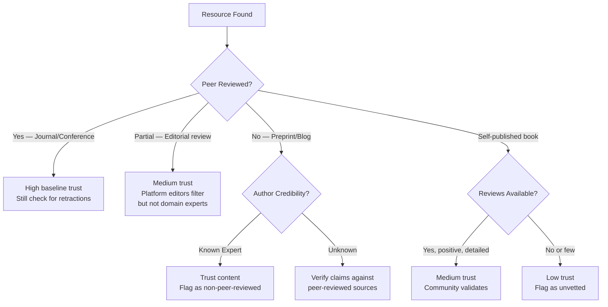
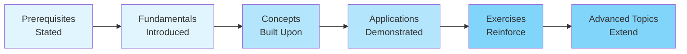
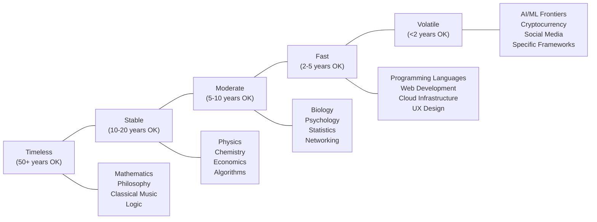
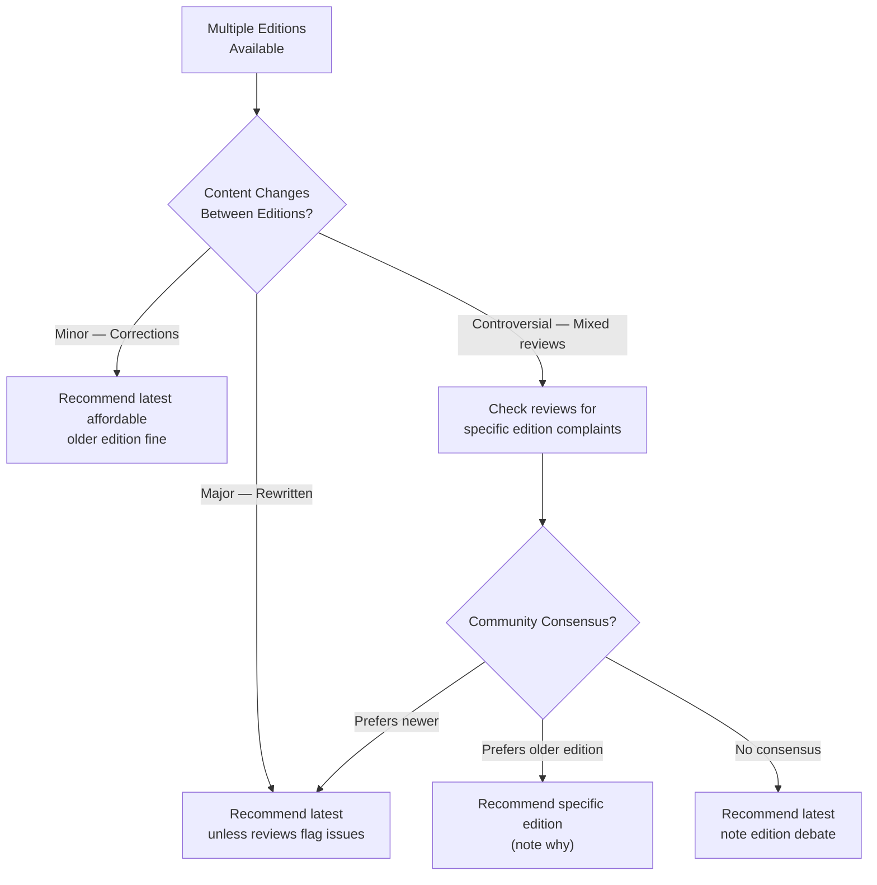

# KB Research — Source Evaluation Framework

> Systematic framework for assessing the quality, credibility, and pedagogical fit of learning resources. Used after search to filter, score, and rank results before assembling the final bibliography.

---

## Credibility Assessment

### Author Expertise

The author is the single strongest quality signal. Evaluate along these dimensions:

| Dimension | Strong Signal | Weak Signal |
|---|---|---|
| **Domain expertise** | Published researcher, professor, senior practitioner in the field | No visible expertise; writing outside their domain |
| **Track record** | Multiple publications, known in the community | First publication, no prior work |
| **Institutional affiliation** | University, major company R&D, respected org | None listed, or dubious affiliation |
| **Peer recognition** | Cited by others, invited talks, awards | No external validation |
| **Transparency** | Clear bio, findable online, responds to criticism | Anonymous, no bio, no public presence |

**How to check**: WebSearch `"[author name]" [topic] [institution]`. Look for personal site, Google Scholar profile, LinkedIn with relevant experience, or conference speaker history.

### Publication Venue

Where something is published constrains its likely quality:

| Venue Type | Trust Level | Examples |
|---|---|---|
| **Major academic publisher** | High | Springer, Cambridge UP, MIT Press, O'Reilly, Addison-Wesley |
| **Peer-reviewed journal** | High | Nature, Science, JMLR, ACM journals |
| **Top conference proceedings** | High | NeurIPS, ICML, CVPR, SIGCHI, SOSP |
| **University press** | High | Oxford UP, Princeton UP, Chicago UP |
| **Established tech publisher** | Medium-High | Manning, Pragmatic Bookshelf, No Starch Press |
| **Curated platform** | Medium | Dev.to (top posts), Towards Data Science (editorially reviewed) |
| **arXiv / preprint** | Variable | Not peer-reviewed — quality ranges from excellent to poor |
| **Self-published** | Variable | Some gems, but no external quality filter |
| **Medium (uncurated)** | Low-Medium | Anyone can publish; quality is author-dependent |
| **Content farms** | Low | SEO-driven, thin, often AI-generated |

### Peer Review Status



### Institutional Backing

Resources backed by institutions carry implicit quality assurance:

- **MIT OCW, Stanford Online, Yale Open Courses** — university reputation on the line
- **OpenStax** — peer-reviewed, funded by foundations, university-adopted
- **Khan Academy** — professionally produced, widely used in education
- **Google/Microsoft/Meta research blogs** — corporate reputation at stake
- **W3C, IETF, ISO specifications** — standards bodies, definitive by nature

---

## Content Quality

### Depth Assessment

| Depth Level | Characteristics | Appropriate For |
|---|---|---|
| **Surface** | Definitions only, no worked examples, <1000 words | Quick reference, not learning |
| **Introductory** | Explains concepts with basic examples, 1000-3000 words | True beginners, overview |
| **Substantive** | Thorough treatment with multiple examples and exercises | Self-study, course supplement |
| **Comprehensive** | Full coverage with proofs/derivations, exercises, solutions | Primary learning resource |
| **Authoritative** | Definitive reference, covers edge cases and history | Expert reference, graduate study |

### Accuracy Indicators

- **Exercises with solutions** — Author has verified their own work
- **Errata page maintained** — Author corrects mistakes publicly
- **Multiple editions** — Errors caught and fixed over time
- **Technical reviewers credited** — External experts checked the content
- **Code examples that compile/run** — Testable claims (for tech content)
- **Citations for claims** — Can trace assertions to primary sources

### Clarity Assessment

| Signal | Good | Poor |
|---|---|---|
| **Structure** | Clear progression, numbered sections, summaries | Rambling, no clear organization |
| **Definitions** | Terms defined before use, glossary provided | Jargon without explanation |
| **Examples** | Concrete, varied, build on each other | Abstract only, or none |
| **Visuals** | Diagrams that clarify, not decorate | Walls of text, or misleading figures |
| **Pacing** | Appropriate for stated audience | Too fast (skips steps) or too slow (belabors obvious points) |

---

## Pedagogical Fit

### Difficulty Calibration

Matching resource difficulty to learner level is the most impactful curation decision. A brilliant advanced textbook is worse than useless for a beginner.

| Level | Assumes | Typical Indicators |
|---|---|---|
| **Beginner** | No prior knowledge of the topic | "Introduction to", "from scratch", "no prerequisites", Chapter 1 starts with "What is X?" |
| **Intermediate** | Foundational knowledge established | "Building on basics", prerequisites listed, jumps into application |
| **Advanced** | Solid working knowledge | Assumes fluency with fundamentals, focuses on edge cases and depth |
| **Expert** | Research-level understanding | Assumes familiarity with literature, discusses open problems |

### Self-Study Friendliness

Not all resources are designed for independent learning. Evaluate:

| Factor | Self-Study Friendly | Requires Instructor |
|---|---|---|
| **Exercises** | Included with solutions/hints | Exercises without solutions, or none |
| **Explanation style** | Self-contained, anticipates confusion | Terse, assumes lecture context |
| **Prerequisites** | Explicitly stated | Implicitly assumed |
| **Pacing** | Chapter summaries, review sections | Continuous without checkpoints |
| **Supplementary materials** | Video lectures, code repos, forums | Slides only (designed for classroom) |

### Progressive Structure

Good learning resources build knowledge incrementally:



Resources that jump around, assume varying levels of knowledge chapter-to-chapter, or front-load all theory before any application score lower on pedagogical fit.

### Assessment Quality

| Assessment Type | Value for Learner | Common In |
|---|---|---|
| **Exercises with worked solutions** | Highest — learn from mistakes | Textbooks (best ones) |
| **Exercises without solutions** | Medium — practice, but no feedback | Many textbooks (weaker) |
| **Quizzes / multiple choice** | Low-Medium — tests recall, not understanding | MOOCs, online courses |
| **Project-based assignments** | High — builds real skills | Courses, tutorials |
| **Peer-reviewed assignments** | Medium — quality of feedback varies | MOOCs (Coursera, edX) |
| **No assessment** | Lowest — passive consumption risk | Articles, videos, lectures |

---

## Accessibility

### Cost Tiers

| Tier | Price Range | Include? |
|---|---|---|
| **Free / Open Access** | $0 | Always include — flag as free |
| **Free to audit** | $0 (no certificate) | Include — note audit limitation |
| **Affordable** | $10-50 | Include — most books fall here |
| **Standard** | $50-150 | Include for textbooks — note cost |
| **Premium** | $150+ | Include only if clearly best-in-class — note cost and alternatives |

### Format Availability

| Format | Accessibility | Notes |
|---|---|---|
| **PDF (free)** | Highest | Check license — some are pirated |
| **Web-based** | High | Requires internet; may disappear |
| **eBook (purchased)** | High | DRM may restrict devices |
| **Physical book** | Medium | Must purchase or library |
| **Video (free)** | High | YouTube, OCW — may have ads |
| **Video (paid)** | Medium | Platform-locked, subscription risk |
| **Interactive** | High | Best for engagement, requires specific platform |

### Language Considerations

- Default to English unless user specifies otherwise
- Note when authoritative resources exist only in another language
- Note when translations are available but inferior to original
- For programming: code is universal, but explanation quality varies by translation

---

## Recency Calibration

### The Recency Spectrum

Not all domains age at the same rate. Use this calibration to decide how old is "too old":



### Recency Decision Rules

| Domain Category | Max Age | Rationale |
|---|---|---|
| **Mathematics** | No limit | Euclid's Elements is still correct |
| **CS Theory (algorithms, complexity)** | 20+ years fine | CLRS (1990) is still the standard |
| **Physics (classical)** | 20+ years fine | Feynman Lectures (1964) still gold |
| **Physics (modern/quantum)** | 10 years | Experimental results update theories |
| **Programming languages** | 5-10 years | Language evolves, but core concepts persist |
| **Web frameworks** | 2-3 years | API changes, ecosystem shifts |
| **Machine Learning** | 2-3 years | State of the art moves fast |
| **AI/LLM-specific** | 6-12 months | Obsolete in a year |
| **Cloud/DevOps tooling** | 2-3 years | Platform features and best practices shift |
| **Design patterns** | 10-15 years | GoF (1994) still relevant; application context evolves |
| **Business strategy** | 5-10 years | Principles persist; tactics change |
| **Regulatory/compliance** | 1-2 years | Laws change; always check current rules |

### When Old Is Better

Sometimes an older resource is strictly better than a newer one:

- **Foundational texts** — Knuth's TAOCP, Sipser's Theory of Computation, Abelson & Sussman's SICP
- **Classic treatments** — When no newer book has improved on the explanation
- **Stable domains** — A 2005 linear algebra textbook is fine if well-written
- **Older editions** — Sometimes a 3rd edition is better organized than the 5th (see Edition Awareness below)

---

## Red Flags

### Immediate Disqualifiers

| Red Flag | What It Looks Like | Action |
|---|---|---|
| **Fabricated credentials** | "Dr." with no verifiable degree, fake institution | Exclude |
| **Plagiarized content** | Sections copied verbatim from known sources without attribution | Exclude |
| **AI-generated content farms** | Generic phrasing, no unique insights, keyword-stuffed, multiple "authors" with no online presence | Exclude |
| **Predatory publisher** | Charges author to publish, no real peer review, Beall's List entries | Exclude |
| **Retracted paper** | Marked as retracted on the journal site or Retraction Watch | Exclude |

### Strong Warning Signs

| Warning Sign | What It Looks Like | Action |
|---|---|---|
| **Self-published with no reviews** | Amazon self-pub, 0-2 reviews, no external mentions | Flag — include only if content quality verified |
| **Outdated tech content** | Uses deprecated APIs, removed features, old syntax | Flag — note what's outdated |
| **Clickbait title** | "The ONLY guide you'll EVER need" | Flag — often thin content behind hype |
| **No author attribution** | "Staff writer", anonymous, corporate ghost-writing | Flag — reduced accountability |
| **Excessive self-promotion** | More about the author's course/product than the topic | Flag — likely a sales funnel, not a learning resource |

### Subtle Quality Issues

| Issue | How to Detect |
|---|---|
| **Survivorship bias** (business books) | Only studies successful cases; ignores failures with same approach |
| **Overgeneralization** | Presents one technique as universal solution |
| **Missing prerequisites** | Claims "no prerequisites" but assumes significant background |
| **Toy examples only** | All examples work but none reflect real-world complexity |
| **No error handling** (code content) | Examples only show happy path |

---

## Scoring Matrix

### Criteria and Weights

| Criterion | Weight | 1 (Poor) | 3 (Adequate) | 5 (Excellent) |
|---|---|---|---|---|
| **Author Credibility** | 0.20 | Unknown, no track record | Some expertise visible | Recognized expert, extensive publication history |
| **Publication Venue** | 0.15 | Self-published, no review | Established platform, editorial review | Major publisher, peer-reviewed |
| **Content Depth** | 0.20 | Surface treatment only | Covers topic adequately | Comprehensive, authoritative |
| **Pedagogical Fit** | 0.20 | No exercises, poor structure | Some exercises, decent structure | Exercises with solutions, excellent progression |
| **Recency** | 0.10 | Outdated for the domain | Acceptable age | Current or timeless |
| **Accessibility** | 0.10 | Expensive, hard to find | Available at standard price | Free or affordable, multiple formats |
| **Recommendation Frequency** | 0.05 | Not mentioned elsewhere | Some recommendations | Widely recommended, appears on multiple lists |

### Scoring Formula

```
weighted_score = (author * 0.20) + (venue * 0.15) + (depth * 0.20)
               + (pedagogy * 0.20) + (recency * 0.10)
               + (access * 0.10) + (recommendations * 0.05)

Interpretation:
  4.0 - 5.0  →  Strongly recommended (top tier)
  3.0 - 3.9  →  Recommended (solid choice)
  2.0 - 2.9  →  Conditional recommendation (note caveats)
  1.0 - 1.9  →  Not recommended (include only if nothing better exists)
  < 1.0      →  Exclude from bibliography
```

### Scoring Adjustments

Apply these modifiers after initial scoring:

| Condition | Adjustment |
|---|---|
| Found by multiple subagents independently | +0.5 |
| Appears on 3+ recommendation lists | +0.5 |
| ISBN/DOI verified | +0.25 |
| Only resource at this difficulty level for the topic | +0.25 (fills a gap) |
| Known errata unfixed | -0.5 |
| Significant content behind paywall with free alternatives available | -0.5 |
| Author has conflict of interest (selling related product) | -0.25 |

---

## Edition Awareness

### The Latest Edition Is Not Always the Best

Common reasons to recommend an older edition:

| Situation | Recommendation |
|---|---|
| **New edition adds bloat** | "5th edition added 200 pages of tangential material; 4th is tighter" |
| **New edition changes pedagogy** | "3rd edition restructured poorly; 2nd has better flow" |
| **New edition is unreviewed** | "6th edition just released — 5th has years of community feedback" |
| **Cost difference is significant** | "4th edition used copies are $10 vs $120 for 5th; differences are minor" |
| **Classic text** | "1st edition is the author's original vision — subsequent editions add co-authors" |

### How to Determine the Right Edition



### Edition Investigation Steps

1. **WebSearch** `"[title] [edition] vs [edition]"` — often surfaces comparison discussions
2. **Check Amazon/Goodreads reviews** for the latest edition — look for "previous edition was better" sentiment
3. **Check the preface** (if preview available) — authors often note what changed
4. **Check university syllabi** — which edition do current courses require?
5. **Note price delta** — if older edition is dramatically cheaper with minimal content changes, mention it

### Bibliography Entry for Edition-Aware Recommendations

```markdown
### Introduction to Algorithms (CLRS)
- **Recommended Edition**: 3rd Edition (2009) or 4th Edition (2022)
- **Edition Note**: 4th edition adds new chapters on randomization and
  updates examples. 3rd edition is well-battle-tested and available used
  for significantly less. Either is excellent.
- **ISBN (3rd)**: 978-0262033848
- **ISBN (4th)**: 978-0262046305
```
