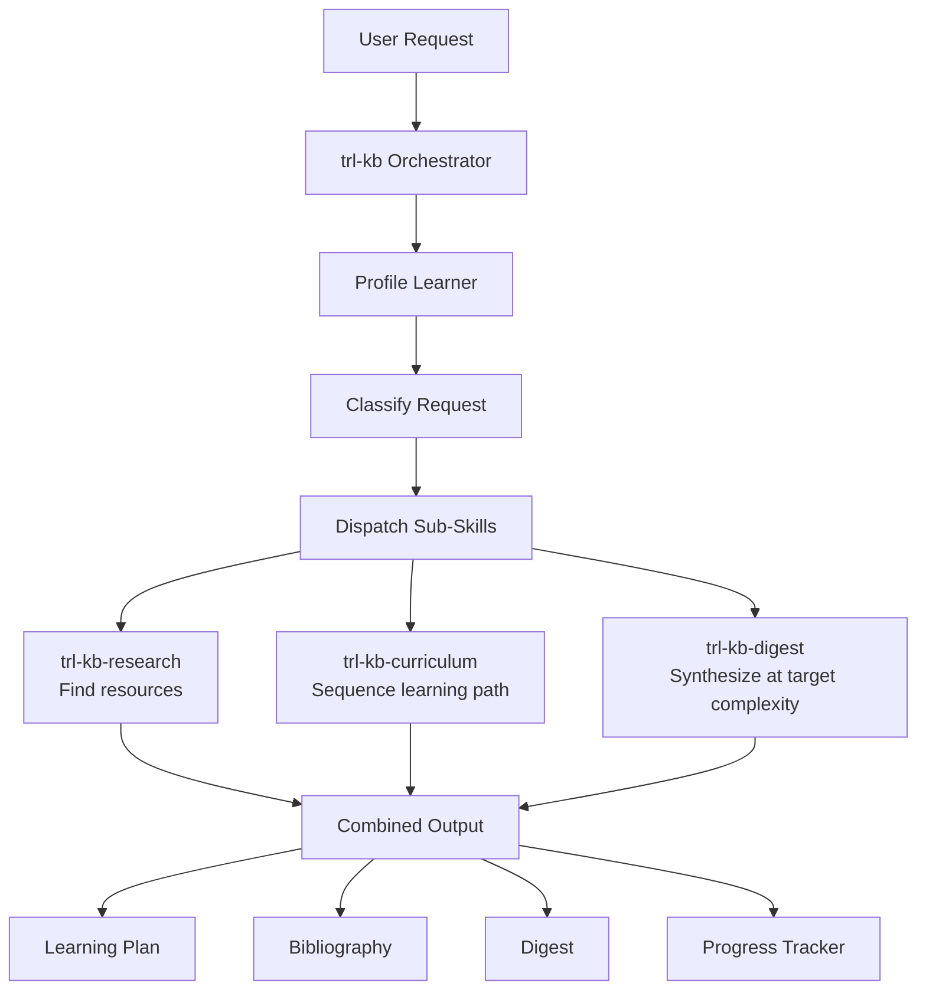

# Knowledge Base

Gather, organize, and structure knowledge into learning paths, annotated bibliographies, and research digests calibrated to any audience — from ELI5 to doctoral depth.

## Overview

The Knowledge Base skill is the knowledge-gathering backbone of the skill ecosystem. Given a subject area and information about the learner, it dispatches subagents to discover resources, applies pedagogical frameworks to sequence them, and synthesizes findings into consumable artifacts. It provides:

- **Adaptive learner profiling** — Accepts whatever the user provides (a sentence or a detailed brief) and infers the rest
- **Parallel resource discovery** — Subagents search for articles, open-access PDFs, books (with ISBNs and synopses), and reference materials concurrently
- **Pedagogical sequencing** — Applies Bloom's Taxonomy, prerequisite mapping, Gardner's Multiple Intelligences, and other frameworks to build coherent learning paths
- **Variable-complexity synthesis** — Produces digests from ELI5 through master's thesis depth, calibrated to the learner
- **Publishable output** — Generates learning plans, annotated bibliographies, progress trackers, and articles suitable for public consumption
- **Foundation for downstream tools** — Structures knowledge for consumption by future document curation, world-building, and interactive learning systems (quizzes, flashcards, tailored lesson plans)

## Core Philosophy

**Five Principles:**

1. **Meet the learner where they are** — Never assume a starting point. Probe, infer, or accept the learner's self-assessment. A calculus curriculum for a working engineer looks nothing like one for a high school student.
2. **Teach the teacher** — The skill must understand how people learn (not just what they learn) to structure knowledge effectively. Pedagogical awareness isn't optional — it's the engine.
3. **Real resources, real ISBNs** — Every recommended book, article, or paper must be verifiable. Fabricating citations is the cardinal sin. When uncertain, say so.
4. **Adaptive depth** — A single subject can yield a 5-item reading list or a 200-entry annotated bibliography. Match output to the ask.
5. **Structured for reuse** — Output formats are designed for consumption by downstream tools (interactive tutors, flashcard generators, content publishing pipelines), not just human reading.

## When to Use This Skill

- **Learning a new subject** — "I want to learn X" at any scope, from a weekend deep-dive to a multi-year mastery plan
- **Building a reading list** — Curated, annotated, sequenced bibliography for any domain
- **Creating a curriculum** — Structured learning path with prerequisites, milestones, and assessments
- **Researching a topic** — Find and synthesize what's known about a subject, with cross-references
- **Generating a digest** — Produce a summary at a specific complexity level (ELI5, beginner, expert, thesis)
- **Preparing to teach** — Organize knowledge for delivery to others, including lesson plans and resource guides
- **Scouting a new domain** — Quick orientation: "What do I need to know about X? Where do I start?"

> For publishing curated knowledge as articles or courses, see **trl-content-publishing** (`references/content-strategy.md`).
> For validating whether a curated learning path has audience demand, see **trl-market-intelligence** (`references/niche-discovery.md`).
> For optimizing published learning paths for discoverability, see **trl-seo-guru** (`kb/01-ai-seo-complete-guide.md`).

## Sub-Skill Architecture

`trl-kb` is an orchestrator that coordinates three focused sub-skills:

| Sub-Skill | Purpose | Standalone? |
|-----------|---------|-------------|
| **trl-kb-research** | Parallel resource discovery — articles, PDFs, books, ISBNs, synopses | Yes |
| **trl-kb-curriculum** | Learning path design — sequencing, prerequisites, milestones, difficulty calibration | Yes |
| **trl-kb-digest** | Research synthesis — cross-referencing, gap analysis, complexity-adapted output | Yes |

### Orchestration Flow



### Request Classification

The orchestrator classifies incoming requests and dispatches accordingly:

| Request Type | Sub-Skills Used | Example |
|---|---|---|
| "I want to learn X" | All three | "I want to learn calculus from scratch" |
| "Find resources on X" | trl-kb-research only | "Find me the best books on distributed systems" |
| "Create a learning path for X" | trl-kb-research → trl-kb-curriculum | "Design a 6-month ML curriculum" |
| "Explain X at level Y" | trl-kb-digest (+ trl-kb-research if sources needed) | "Explain quantum entanglement at a graduate level" |
| "What should I read about X?" | trl-kb-research | "What are the essential papers on transformer architectures?" |
| "Prepare a study guide on X" | All three | "Build a study guide for the AWS Solutions Architect exam" |

## Learner Profiling

The skill adapts to whatever information the user provides. It never forces a questionnaire.

### Profiling Levels

| Level | Signals Available | Inference Strategy |
|---|---|---|
| **Minimal** | Just the subject ("I want to learn math") | Assume beginner, broad scope, general adult learner. Ask 1-2 clarifying questions. |
| **Light** | Subject + goal ("I want to learn enough stats for data science") | Infer level from goal context. Scope to goal. |
| **Medium** | Subject + goal + background ("I'm a software engineer wanting to learn ML") | Use adjacent expertise to calibrate difficulty. Skip fundamentals they'd know. |
| **Rich** | Detailed brief with constraints ("I have 2 hours/week, prefer video, need calculus for physics PhD qualifier in 3 months") | Full personalization: format preferences, time constraints, deadline-driven pacing. |

### What the Skill Infers

When the user provides minimal information, the skill infers from context:

- **Current level** — From vocabulary used, questions asked, stated goals
- **Learning style** — Default to mixed (reading + practice); adjust if they mention preferences
- **Time commitment** — Default to "flexible"; constrain if they mention deadlines
- **Depth target** — From the specificity of the ask (broad domain = survey, specific topic = deep dive)
- **Adjacent expertise** — From stated profession, prior subjects mentioned, vocabulary level

> For the full profiling methodology and question banks, see [references/learner-profiling.md](references/learner-profiling.md).

## Output Artifacts

The skill produces multiple artifact types, selected based on the request:

| Artifact | When Produced | Format |
|---|---|---|
| **Learning Plan** | Any "learn X" request | Phased roadmap with milestones, time estimates, prerequisites |
| **Annotated Bibliography** | Any research/resource request | Books (ISBN, synopsis, difficulty), articles (URL, synopsis), papers |
| **Research Digest** | Digest/explain requests | Synthesis at target complexity level with cross-references |
| **Publishable Article** | When user wants shareable output | General-audience version of the learning path or digest |
| **Progress Tracker** | With learning plans | Checklist with phases, resources, completion markers |
| **Difficulty Map** | With curricula | Visual/tabular difficulty progression with time estimates |

### Resource Entry Format

Every resource in a bibliography follows this structure:

```markdown
### [Resource Title]
- **Type**: Book | Article | Paper | Video Course | PDF
- **Author(s)**: Name(s)
- **ISBN/URL**: ISBN-13 or direct link
- **Difficulty**: Beginner | Intermediate | Advanced | Expert
- **Time Estimate**: Approximate hours to complete
- **Synopsis**: 2-3 sentences on what it covers and why it matters for this path
- **Prerequisites**: What the learner should know first
- **Sourcing**: Where to find it (purchase, library, open access)
```

> For detailed output format specifications, see [references/output-formats.md](references/output-formats.md).
> For fillable templates, see [assets/learning-plan-template.md](assets/learning-plan-template.md) and [assets/bibliography-template.md](assets/bibliography-template.md).

## Pedagogical Frameworks

The skill draws on established learning theory to structure knowledge effectively:

| Framework | Application in trl-kb | When to Use |
|---|---|---|
| **Bloom's Taxonomy** | Sequence topics by cognitive level: remember → understand → apply → analyze → evaluate → create | Default for most learning paths |
| **Gardner's Multiple Intelligences** | Diversify resource types (visual, verbal, kinesthetic, logical) to match learner strengths | When learner specifies preferences or struggles with one format |
| **Vygotsky's ZPD** | Calibrate difficulty to stay in the "zone of proximal development" — challenging but achievable | When designing progressive curricula |
| **Spaced Repetition** | Recommend review schedules and flag topics for reinforcement | For retention-critical subjects (languages, medicine, law) |
| **Prerequisite Mapping** | Build dependency graphs between topics — learn X before Y | For domains with deep hierarchical structure (math, CS) |
| **ADDIE Model** | Structure curriculum design: Analyze → Design → Develop → Implement → Evaluate | When building formal course-like outputs |

> For deep dives on each framework and when to apply them, see [references/pedagogical-frameworks.md](references/pedagogical-frameworks.md).

## Quick Start Guides

### "I Want to Learn X"
1. State what you want to learn (as broad or narrow as you like)
2. Optionally: mention your current level, goals, time constraints, or preferred formats
3. The skill profiles you, researches resources, builds a sequenced plan, and delivers all artifacts

### "Find Me Resources on X"
1. Name the subject area
2. Optionally: specify resource types (books only, papers only, free resources only)
3. trl-kb-research dispatches subagents and returns an annotated bibliography

### "Explain X at Y Level"
1. Name the topic and target complexity (ELI5, beginner, expert, thesis-level)
2. trl-kb-digest synthesizes from known sources or dispatches trl-kb-research first if needed
3. Returns a calibrated digest with source citations

### "Build a Curriculum for X"
1. Define the domain and target outcome ("proficient in X within Y months")
2. trl-kb-research gathers resources, trl-kb-curriculum sequences them into a phased plan
3. Returns learning plan + bibliography + progress tracker

## Reference Guide

| Task | Read These |
|------|-----------|
| **Understanding the orchestration model** | `references/agent-playbook.claude-code.md` |
| **Profiling a learner** | `references/learner-profiling.md` |
| **Choosing pedagogical frameworks** | `references/pedagogical-frameworks.md` |
| **Formatting output artifacts** | `references/output-formats.md` |
| **End-to-end walkthrough** | `references/worked-example-calculus.md` |
| **Resource discovery strategies** | See `trl-kb-research` skill |
| **Curriculum design methods** | See `trl-kb-curriculum` skill |
| **Complexity-adapted synthesis** | See `trl-kb-digest` skill |

## Related Skills

- **trl-kb-research** — Sub-skill for parallel resource discovery (articles, PDFs, books with ISBNs)
- **trl-kb-curriculum** — Sub-skill for learning path design and pedagogical sequencing
- **trl-kb-digest** — Sub-skill for research synthesis at variable complexity levels
- **trl-content-publishing** — Publish curated knowledge as articles, newsletters, or courses
- **trl-market-intelligence** — Validate audience demand for a curated learning product
- **trl-seo-guru** — Optimize published learning paths for search and AI engine discoverability
- **trl-user-experience-engineer** — Design interfaces for knowledge products (landing pages, course pages)

## Bundled Resources

### References

- [agent-playbook.claude-code.md](references/agent-playbook.claude-code.md) — Agent role definition, orchestration workflows, sub-skill dispatch patterns
- [pedagogical-frameworks.md](references/pedagogical-frameworks.md) — Deep dive on Bloom's, Gardner's, Vygotsky's ZPD, spaced repetition, prerequisite mapping, ADDIE
- [learner-profiling.md](references/learner-profiling.md) — Adaptive profiling methodology, question banks by depth, inference heuristics
- [output-formats.md](references/output-formats.md) — Detailed specifications for every output artifact type
- [worked-example-calculus.md](references/worked-example-calculus.md) — End-to-end walkthrough: "learn calculus from scratch" → complete knowledge base

### Assets

- [learning-plan-template.md](assets/learning-plan-template.md) — Fillable learning plan with phases, milestones, time estimates
- [bibliography-template.md](assets/bibliography-template.md) — Annotated bibliography format with ISBN, synopsis, difficulty, sourcing
- [learner-profile-template.md](assets/learner-profile-template.md) — Intake form with light/medium/heavy variants
- [project-tracker.md](assets/project-tracker.md) — Progress tracking template for knowledge base projects
